# 第 1 章

## 开始上手

在本章中，你将拆开一台全新的 Kinect——如果已经有一台，则需要将其与 Xbox 断开连接。接着，你将安装一些软件，将 Kinect 连接到计算机，并一窥这款独特设备究竟有何神奇之处。你将了解 Kinect 各个组件的功能，并通过一些简单的控制操作，感受所有部件如何协同工作，共同缔造奇迹。

Kinect 的营销、包装和设计均面向微软 Xbox 游戏主机。Xbox 是一款出色的客厅娱乐系统，如果你还没玩过《舞蹈中心》或《Kinect 运动大会》，我强烈推荐你尝试——正是当初在纽约联合广场的 24 小时百思买门店体验了这两款游戏，才让我第一次对 Kinect 如此着迷。我拉上尽可能多的朋友前往门店，让他们亲眼见识这项令人惊叹的技术。

话说回来，本书是一本非官方手册，教你如何将 Kinect 带出客厅使用——无需 Xbox。现在，让我们确保你拥有所需的一切：要么将 Kinect 从游戏主机上拔下，要么单独购买一台，将其连接到计算机，然后开始动手折腾。

### 购买正确的 Kinect

当初我想购买自己的 Kinect 时，费了很大功夫才从所有 Xbox Kinect 品牌产品中找出该买哪一款。我既想玩 Xbox 游戏，*又*想拥有一台能在计算机上使用的 Kinect。不幸的是，Xbox Kinect 套装并非按此目标设计。

我最终决定购买独立的 Kinect 传感器（图 1-1），并买一台二手 Xbox 主机来玩游戏，这样还能省点钱。独立 Kinect 传感器包装盒内包含一根转接线，可让 Kinect 直接从墙壁插座取电，而无需依赖 Xbox 主机。

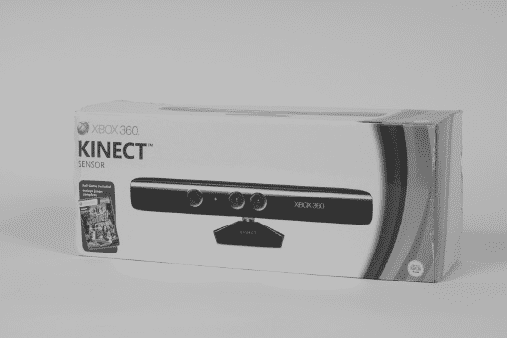

***图 1-1.** Kinect 传感器与《Kinect 冒险！》——唯一一款所有配件齐备、可直接连接计算机的 Xbox Kinect 产品。*

另一种选择是购买包含 Xbox 主机和 Kinect 传感器的套装。你在图 1-2 中看到的第二个商品就是这种套装。问题在于，人们经常购买 Kinect 套装，以为马上就能用……直到带回家才发现缺少一根线缆，不得不在线上下单购买并等待到货。

Kinect 套装缺少的是将 Kinect 通过 USB 连接到个人计算机所需的电源适配器。虽然我完全支持购买完整的 Xbox Kinect 系统套装，但你还需要额外购买这个价值 30 美元的附件——电源适配器，才能通过普通 USB 将 Kinect 连接到计算机。图 1-2 中列出的第三个商品正是这个电源适配器。

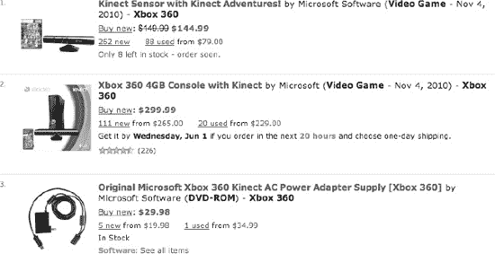

***图 1-2.** Amazon.com 上 Kinect 相关产品的在线商品列表——第一个列出的 Kinect 是你应该购买的；否则，你还需要购买第三个列出的商品。*

你也可以双管齐下：为计算机购买独立传感器，同时购买游戏套装。这条路比较昂贵，但能让你将一个 Kinect 常连在计算机上用于折腾，同时始终有另一个 Kinect 配合 Xbox 使用，无需来回移动线缆和摄像头。新的驱动程序和软件已开始支持同时使用多个 Kinect，因此手头有多个 Kinect 可能会很有价值。

### 将 Kinect 与 Xbox 分离

你已经有一台 Xbox 了？太好了。那么，你需要从 Xbox 上借走 Kinect，接到计算机上。在动手之前，最好先征得 Kinect 主人的同意。我相信他们会想念它的！告诉他们，等你读完第 3 章，给他们展示了用 Kinect 连接计算机能做哪些酷炫事情之后，就会还回来。他们会感谢你的！

从新款 Xbox 上断开 Kinect 非常简单。只需找到 Kinect，顺着线缆找到 Xbox 背面的接口，然后拔下即可。搞定。接下来，你只需要一个 Kinect 交流电源适配器，就能继续下载和安装软件了。

如果你成功将 Kinect 连接到旧款 Xbox，那也是个好消息——这意味着你拥有将传感器连接到计算机所需的所有部件。要从旧款 Xbox 上断开 Kinect，你需要移除两个组件——Kinect 传感器本身，以及连接 Xbox 和墙壁交流电源插座的线缆（图 1-3）。断开这两样东西后，就万事俱备了。

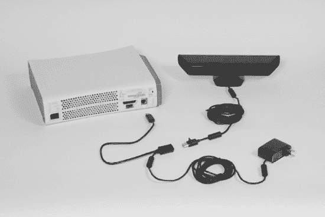

***图 1-3.** 从旧款 Xbox 游戏主机上拔下 Kinect 和交流电源适配器（图片由微软提供）*

### 确保拥有交流电源适配器

如果你是新款 Xbox 搭配 Kinect，它们很可能是作为套装购买的。如果是这样，你可能还没有让 Kinect 在计算机上工作所需的转接线。不幸的是，现在你必须先购买一根交流电源转接线才能继续。图 1-2 中的第三个商品显示了该适配器在 Amazon.com 上的产品信息。图 1-4 则更清晰地展示了这根线缆。

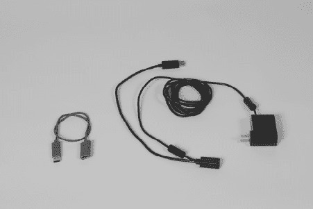

***图 1-4.** 左侧为适用于新款 Xbox 系统的 Kinect USB 延长线，右侧为 Kinect 电源适配器。*

需要电源转接线的原因有两个。首先，Kinect 的耗电量超过了标准 USB 端口所能提供的上限，这可能是由于其内部组件众多，例如电机、多个传感器以及一个用于强制通风散热的风扇。新款 Xbox 上的特殊 USB 端口能提供额外电力，但你的计算机做不到，因此必须通过线缆上的交流适配器将 Kinect 插入电源插座来弥补。如果你想让 Kinect 和笔记本电脑一起移动使用，这种对转接线的需求会令人沮丧——你需要一块 12 伏电池并进行一些细致的改装才能解决这个问题。

第二个需要转接线的原因是，Kinect 的线缆使用了 Xbox 专用的专有 USB 连接器。我知道这很令人沮丧。交流转接线的一端有一个接口，能接受这种特殊 USB 形状，另一端则将其转换为标准 USB 连接器。旧款 Xbox 系统拥有标准 USB 端口，因此它们也需要一根转接线才能与 Kinect 兼容。当微软推出内置 Kinect 支持的 Windows 版本时，可能会推出一款功耗更低的 Kinect 供计算机使用，届时就不再需要这根烦人的交流电源适配器附件了。

### 逐件检视 Kinect 的各个部件

现在你已经拥有了一台 Kinect，让我们仔细看看它的所有部件。图 1-5 展示了从独立 Kinect 传感器包装盒中取出的所有物品。你只需用到`AC 电源适配器`和 Kinect 本体即可跟随本书学习。你可以将`USB 延长线`、手册和《Kinect 大冒险》游戏光盘留在盒中，因为如果你拥有或计划购买 Xbox，后续可能会用到它们。

在扔掉那个包装盒之前，你应该知道它可以作为一个方便的容器来存放和运输体积庞大且形状奇特的 Kinect。这款设备相当坚固，很少有退货或损坏的情况，而且能承受一定的冲击。然而，在纽约，人们经常使用原装包装盒将传感器带到聚会和黑客马拉松活动现场。盒内的泡沫完美贴合 Kinect 的形状，使其成为一个简单便携的容器，因此你或许最好留着它以防万一。

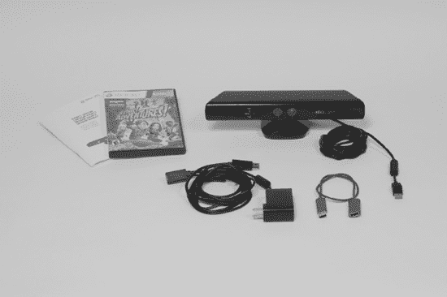

***图 1-5.** 独立 Kinect 传感器包装盒内容物：手册、《Kinect 大冒险！》游戏光盘、Kinect 本体、AC 电源适配器及专用 USB 延长线。*

现在，让我们看看在应用程序开发以及构建自己的项目或产品时，你能利用的输入和输出接口。能够识别设备外部的所有组件（图 1-6）将对后续学习非常有帮助。Kinect 的构造颇为复杂，许多人并不清楚每个部件的作用。阅读完本节后，你将了解每个部件的功能，并能将这些知识应用到实践中。

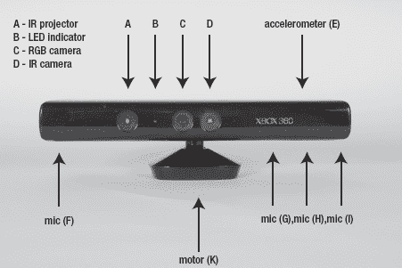

***图 1-6.** Kinect 外部组件识别——输出：A) 红外结构光激光投影仪，B) LED 指示灯，K) 控制底座倾斜的电机。输入：F-I) 四个麦克风，C-D) 两个摄像头（RGB 和红外），E) 一个加速度计*

在处理硬件乃至一般技术时，有两个非常重要的基本概念：输入和输出。输入是指从外部来源进入系统的信息，输出则是指从系统向外部发送的信息。我小时候通过连接音响、电视和录像机学习了输入和输出。音响的输入可能来自麦克风或 iPod，而输出则可以连接到扬声器或放大器。像放大器这样的许多设备既能接收输入，也能发送输出。Kinect 拥有作为输入设备的传感器，用于读取（或采样）其前方物理空间的信息。Kinect 也拥有执行器（输出设备），使其能够通过不同方式改变物理空间，从而作用于该空间。

Kinect 上有四个麦克风——没错，就是四个！这不仅仅是立体声，实际上是四声道声音。结合软件中的高级数字信号处理技术，这四个麦克风可以用来实现非凡的功能。通过协同工作，这四个音频输入可以过滤背景噪音，并检测房间内说话者的相对位置。从 Kinect 正面看，右侧有三个相邻的麦克风，就在“XBOX 360”标识的下方（图 1-6，G-I）。第四个麦克风在左侧（图 1-6，F）。微软官方的 Kinect SDK（软件开发工具包）是首个提供访问麦克风方法的工具，不过预计未来其他驱动程序也能提供对此硬件的访问权限。

Kinect 看起来有点像一个大而笨重的旧式网络摄像头，这也情有可原，因为它中间确实内置了一个标准网络摄像头（图 1-6，C）。它旁边是一个红外摄像头，这比标准网络摄像头要少见一些。同样有趣，甚至可以说是相当神秘的，是设备内部“XBOX 360”标识后面的三轴加速度计。大多数人没想到 Kinect 会包含这样一个传感器，这种传感器在手机或任天堂 Wii 控制器等手持设备中更为常见。

现在，来说说输出设备。你可能听说过 Kinect 内部有一个激光器——这是真的。当 Kinect 接通电源时，你可以看到它发出红光（图 1-6，A），尽管投影仪发射的光位于红外光谱并且几乎不可见。它与设备上的红外摄像头（图 1-6，D）协同工作，以确定其所处房间内一切物体的精确空间位置。另一个基于光的输出是 LED 指示灯（图 1-6，B）。从诸如`OpenNI`这样的框架中不容易直接访问它；然而，如果你的项目需要利用硬件反馈来提升效果，这可能对你会有帮助。例如，当应用希望在无需屏幕的情况下通知用户有事件发生时，这或许是一种理想的告警方式。比如在 3D 捕捉工具`MatterPort`中，用户拿起 Kinect 在房间里走动——远离电脑——来拍摄物体。电脑发出的“哔”声让用户知道某个特定视图已被充分分析。此“哔”声可以伴随设备上 LED 灯的闪烁作为额外提示，这样用户无需查看屏幕就能感知到状态变化。

最后，Kinect 拥有一个功能上与传感器相反的执行器，它由一个驱动齿轮的小型电机组成，可以使摄像头上下倾斜 30 度。这可以在你构建的应用中得到新颖的应用。例如，通过在空间中上下扫动设备及其传感元件，Kinect 可以用于捕捉其周围环境的高分辨率扫描。如果你想将 Kinect 安装在机器人上，这个电机可以提供摄像头的机械上下运动。此外，如果你使用人脸或身体追踪，当人物移出视野时，你可以调整摄像头的位置来适应。

现在我们已经识别了所有的 Kinect 硬件，接下来让我们配合软件一起使用。你将有机会看到来自 RGB 摄像头的图像，以及由红外投影仪和摄像头组合计算出的深度图像。

**Kinect 拆解！**

对 Kinect 的内部构造感兴趣吗？`iFixit`网站整理了一篇文章和一段视频，带你一探 Kinect 设备的拆解过程。

阅读拆解文章： [`www.ifixit.com/Teardown/Microsoft-Kinect-Teardown/4066/`](http://www.ifixit.com/Teardown/Microsoft-Kinect-Teardown/4066/)

观看拆解视频： [`www.ifixit.com/blog/blog/2010/11/05/kinect-teardown-video/`](http://www.ifixit.com/blog/blog/2010/11/05/kinect-teardown-video/)

请勿在家中尝试！不要拿自己的设备冒险。如果你好奇内部构造，请访问`iFixit.com`。

### 下载与安装软件

我第一次将 Kinect 连接到计算机以了解其工作原理时，使用的就是你将在此节安装的软件。这款软件名为 `RGBDemo`，至今每当我想展示 Kinect 的功能及其与标准网络摄像头的区别时，我仍会用到它。`RGB` 代表红色、绿色和蓝色——这是 Kinect 中部网络摄像头所能识别的颜色。`Demo` 中的 `D` 也代表深度，由红外投影仪和红外摄像头借助一家名为 `PrimeSense` 公司的结构光芯片生成。那么，`PrimeSense` 是谁？

`PrimeSense` 是一家以色列公司，其硬件参考设计和结构光解码芯片是 Kinect 体积 3D 摄像头系统的核心。这让许多关注 Kinect（最初代号为“Project Natal”）演变的人感到意外，因为许多人认为微软会使用其最近收购的两家飞行时间 3D 传感器公司——`3DV Systems` 和 `Canesta`——的知识产权。继 `OpenKinect` 项目的引领之后，`PrimeSense` 又协助创立了 `OpenNI`，旨在将最佳工具交到开发者手中。`OpenNI` 推出了第一家主要商店，提供利用体积摄像头（如 Kinect 中的摄像头）的 PC 应用程序，随着 `Arena` 的亮相，这将在第 3 章中更详细地介绍。

虽然从自然用户界面角度看待 Kinect 的人将其视为 3D 手势识别设备，但来自工程和机器人领域背景的人则将 Kinect 硬件的这一特定方面称为 `RGBD` 传感器。`RGBDemo` 旨在演示 Kinect 如何在机器视觉和 3D 重建等应用中作为 `RGBD` 传感器发挥作用——因此得名 `RGBDemo`。这是在 Mac 和 Windows 机器上查看 Kinect 底层数据最直接的方法。

如果 Kinect “即插即用”于你的 Xbox，为什么还需要下载软件呢？好吧，如果你在没有安装一些能够与 Kinect 通信的驱动程序和应用程序的情况下将 Kinect 插入计算机，那么什么都不会发生！因此，尽管我知道你一定迫不及待，但请耐心等待，在插入 Kinect 之前，请仔细按顺序完成所有步骤。其中一些步骤需要严格按照特定顺序执行。请务必遵循！

首先，你需要上网下载 `RGBDemo`，这是一套由 Nicolas Burrus 编写的强大的开源软件套件，旨在提供一套工具包，供他人编写程序，并为非编码人员提供一种查看 Kinect 数据真实样子的方法。如果你使用的是 Windows 系统，那么你将从 `OpenNI` 安装三个附带的驱动程序，这些程序有助于 `RGBDemo` 更好地理解来自 Kinect 的数据。该软件附带的 `RGBD-viewer` 应用程序将向你展示 Kinect 所能看到的图像类型及其独特的成像方式——这将是我们测试一切连接是否正确的方法。

Nicolas Burrus 来自巴黎，他在马德里卡洛斯三世大学机器人实验室进行博士后计算机视觉研究时，探索了深度感测摄像头（如 Kinect 中的摄像头）的应用（`http://roboticslab.uc3m.es/`）。非常感谢 Nicolas 在 Kinect 发布当月，首次打包了一个任何人都可以在计算机上使用 Kinect 的简单可执行程序。对于程序员来说，他为 `RGBDemo` 汇编的源代码和相关机器视觉库集合帮助许多人开始了应用程序的开发。对于非技术用户来说，`RGBDemo` 提供了一种无需编写任何代码即可首次查看 Kinect 数据的方法。此后，Burrus 和他的搭档 Nicolas Tisserand 成立了一家名为 `manctl` 的公司（`http://manctl.com`），以进一步围绕 Kinect 相关技术进行创新。让我们来了解一下如何开始使用 `RGBDemo`。

#### 查找 `RGBDemo` 的正确版本

首先，你需要找到适合你操作系统的 `RGBDemo` 正确版本。打开浏览器，访问 `http://labs.manctl.com/rgbdemo`，以获取该软件项目的最新信息（图 1-7）。Nicolas 会定期更新代码库，你需要选择在你的系统上运行的最新版本。在撰写本文时，`v0.6.1` 是适用于 Windows 和 Intel Mac OS X Snow Leopard 的最新版本。在撰写本文时，`RGBDemo` 项目刚刚在 `manctl` 网站上有了一个主页，因此请注意，当你访问时其外观可能已发生变化。

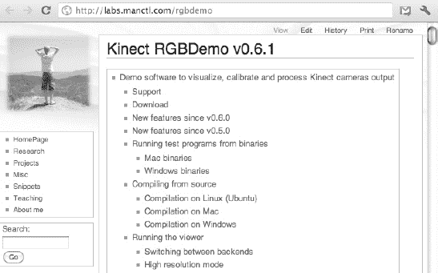

***图 1-7.** RGBDemo 项目网页*

`RGBDemo` 是一个开源软件项目。令人欣喜的是，它不仅包含一个可以直接作为“二进制可执行文件”运行的应用程序，还包含了其构成的源代码。像这样的开源项目非常有价值：如果你发现软件有问题，或者想以新的方式扩展它，你可以根据原始说明自行定制版本，然后将其编译成你自己改进的“二进制可执行文件”应用程序。许多开源项目只提供源代码，如果你不知道如何编译程序，就无法使用。如果你不太懂技术，那就没什么乐趣了。`RGBDemo` 的妙处在于，它不仅可以作为可执行二进制文件直接运行，还能让你了解其构建方式。

现在，让我们直接进入可以在你的操作系统上运行的二进制软件。为此，以下内容将分为针对 Windows 和 Mac 用户的不同说明。在完成下载和安装后，我们将再次在“测试你的 Kinect”一节中会合，届时我们将启动 `RGBDemo` 并进行调试，以确保一切正常工作。

#### 为 Windows 下载并安装 `RGBDemo`

根据你使用的 Windows 版本（XP、Vista 或 Windows 7），你在本节中的具体体验可能会有所不同。这些说明解决了一些你在 Vista 上下载和安装时可能遇到的卡顿问题，而这些问题在 XP 或 Windows 7 上可能不会遇到。如果你没有遇到这些问题，可以跳过这些说明，但这里包含它们是为了不落下任何初级读者。与简单得多的 Mac 安装相比，这个过程在 Windows 上可能会有些繁琐。

### 下载二进制文件

废话不多说，我们直接去获取这个软件！在 RGBDemo 网页上，点击`Windows 二进制文件`下载链接，如图 1-8 所示。页面将跳转至包含名为`RGBDemo 0.6.1rc1-Win32.zip`文件链接的行（图 1-9）。在点击该下载链接之前，你需要按顺序仔细完成两个步骤。

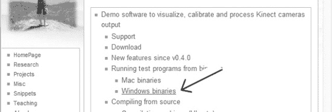

***图 1-8.** Kinect RGBDemo 页面上 `Windows 二进制文件` 的链接*

首先，我要你选择并复制这串 28 个字符的许可证密钥，如图 1-9 所示。你稍后就会用到它，如果你现在把它复制到剪贴板，就能在下一步直接粘贴，而无需返回此页面查找。这一长串由字母、数字和符号组成的字符串是用于在 OpenNI 框架下使用 PrimeSense NITE 中间件的许可证。

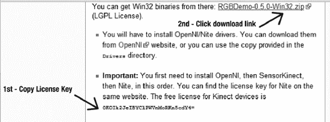

***图 1-9.** 显示许可证密钥和 RGBDemo `ZIP` 文件下载链接的屏幕*

很好！现在，让我们点击屏幕顶部的链接（图 1-9）来下载 `RGBDemo-0.6.1rc1-Win32.zip` 压缩文件。

看吧！刚发生了什么？你的浏览器现在打开了另一个名为 SourceForge 的网站（图 1-10），这里托管着这个热门文件。当 RGBDemo 软件自动开始下载时，不必惊慌。或者，你可能会看到一个对话框，提示你选择文件的保存位置。这个压缩文件超过 60MB，根据你的网速，下载可能需要一些时间。

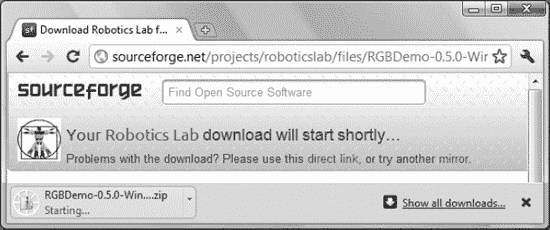

***图 1-10.** 从 SourceForge 下载*

你可能会看到一个类似`此类文件可能会损害你的计算机。你确定要下载 RGBDemo-0.6.1rc1-Win32.zip 吗？`的警报。请给予肯定回答。当 `RGBDemo-0.6.1rc1-Win32.zip` 下载完成后，双击这个 `ZIP` 文件以查看“提取所有文件”窗口（图 1-11）。只需点击 RGBDemo 文件夹图标，将其从窗口中拖出并放到你的桌面上，即可解压到那里。

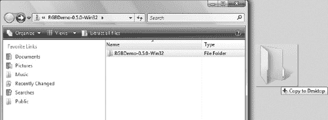

***图 1-11.** 将 RGBDemo 文件夹拖到桌面*

你可能会看到一个 Windows 安全警告，询问`你确定要将文件复制并移动到该文件夹吗？`点击`是`。Windows 会将文件夹及其所有文件复制到桌面。复制完成后，打开桌面上的文件夹，你会看到该目录下的所有文件和文件夹列表（图 1-12）。

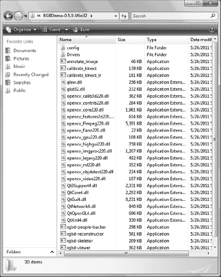

***图 1-12.** RGBDemo 文件夹内的完整文件目录*

现在，进入名为 `Drivers` 的目录。进入 `Drivers` 目录后，你会看到三个 `MSI` 安装文件列表——先不要点击任何一个！你需要按照一个非常关键的顺序来安装它们（图 1-13），所以请集中注意力并按照指示操作。请按照以下顺序进行安装：

> 1.  `OpenNI-Win32`
> 2.  `SensorKinect-Win-OpenSource32`
> 3.  `NITE-Win32`

请注意，目录中文件的显示顺序（如图 1-13 所示）不一定与正确的安装顺序一致。所以要小心！务必按照我所描述的顺序操作。

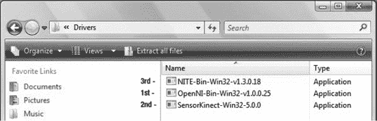

***图 1-13.** 驱动程序安装的关键顺序：1.) OpenNI-Win32，2.) SensorKinect-Win-OpenSource32，3.) NITE-Win32*

首先，你需要安装 OpenNI（图 1-14）。这是一个用于“自然界面”技术的框架，它允许不同硬件和软件的模块相互通信。接着，你将安装 SensorKinect（图 1-16），这是一个设备模块，它将 Kinect 注册到 OpenNI，使其能够读取传感器数据。最后，你将安装 NITE（图 1-17），这是一个“中间件”模块，用于处理来自 Kinect 的体积数据，并推导出可用于应用程序的人体骨骼结构图，从而控制手势和其他交互操作。

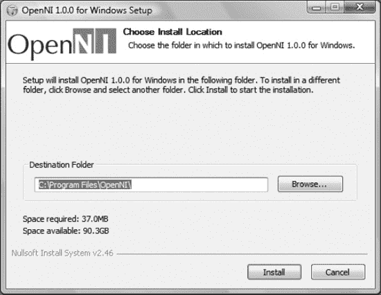

***图 1-14.** 显示默认安装路径的 OpenNI 安装对话框*

### 安装 OpenNI

双击 `OpenNI-Win32` 文件以启动安装程序。根据你的设置和你使用的 Windows 版本，你可能会看到一个 Windows 安全警告（图 1-15 上方）。只需给予肯定回答——在本例中是`安装`。别担心，本书中指导你下载的所有软件都来自安全来源。在 OpenNI 安装程序中，你可以接受默认路径 `C:\Program Files\OpenNI`，点击`安装`，安装完成后关闭窗口。

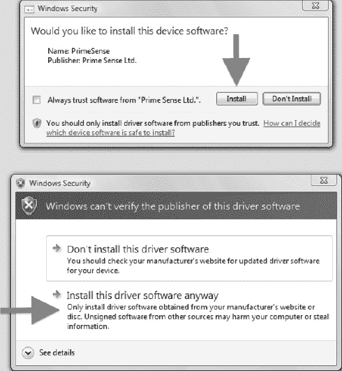

***图 1-15.** Windows 安全警告——可以信任来自 PrimeSense Ltd 的软件；选择 `安装`。*

### 安装 SensorKinect

接下来，启动 `SensorKinect-Win-OpenSource32` 安装程序，并确保在组件选择对话框（图 1-16）中同时勾选了 `OpenNI` 和 `Sensor`。在安装接近尾声时，你可能会看到另一个 Windows 安全警告（图 1-15 下方）——点击`仍要安装此驱动程序软件`，然后在该过程完成后关闭窗口。

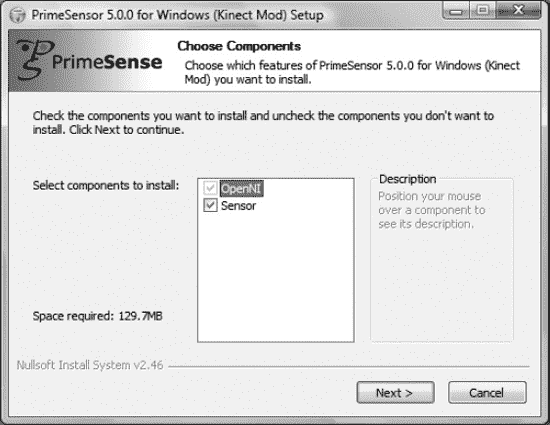

***图 1-16.** 组件安装选择——确保同时勾选了 OpenNI 和 Sensor*

### 安装 PrimeSense NITE

最后，通过启动 `NITE-Win32` 安装程序来安装最后一个驱动程序。同意许可协议，保持默认安装路径为 `C:\Program Files\Prime Sense\NITE\`，并点击`安装`。下一步，系统会提示你输入许可证密钥（图 1-17）。粘贴你之前从 RGBDemo 下载页面（图 1-9）复制的那串 28 个字符，然后点击`安装`。在此步骤中，几个命令提示符窗口自动打开和关闭是正常现象，不必担心。

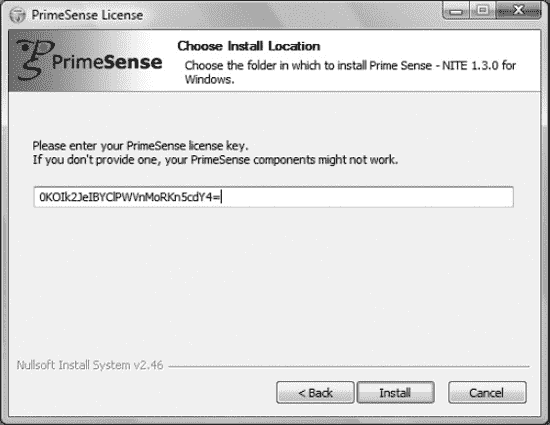

***图 1-17.** PrimeSense 提示输入 NITE 许可证密钥——0KOIk2JeIBYClPWVnMoRKn5cdY4=*

### 连接 Kinect

恭喜！你已经完成安装。接下来是有趣的部分——准备将 Kinect 连接到你的计算机。请参考图 1-4 直观了解后续步骤中涉及的线缆。将 Kinect 上的专用 USB 公头插入交流电源适配器线缆上的 USB 母头。将交流电源适配器插入墙上的电源插座，然后将标准 USB 接头插入计算机的 USB 端口。此时外观应类似图 1-3，但不同的是你并非从 Xbox 上拔下线缆，而是连接到计算机。你可能会看到 Kinect 的 LED 指示灯亮起或闪烁。现在，请将 Kinect 对准自己，距离约两英尺。

连接好 Kinect 后，你可能会看到各种系统通知（图 1-18 底部）关于驱动程序软件的安装。根据系统配置的不同，你可能会看到针对电机、摄像头和 Xbox NUI 音频的单独通知。这可能需要一些时间，请耐心等待。Windows 可能无法找到音频驱动程序，因为这些传感器驱动程序仅适用于 Kinect 中与 PrimeSense 相关的组件（图 1-18 顶部）。微软在获得设计授权后，在 PrimeSense 参考规格基础上增加了自己的一组四个麦克风阵列（参见图 1-6 中的 F-I）。微软尚未在 Windows 上发布音频组件的第三方驱动程序；不过，他们在官方 SDK 中提供了完整的音频支持。因此，如果系统提示定位音频驱动程序，请选择标签为`Don’t show this message again for this device`（不再为此设备显示此消息）的选项，无需担心 Windows 找不到 Xbox `NUI Audio` 设备（图 1-18 顶部）——这是正常现象。

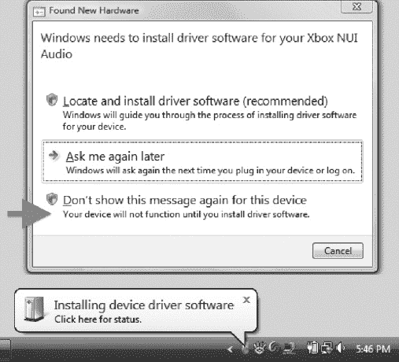

***图 1-18.** 找不到 Xbox NUI 音频驱动程序的消息及系统托盘通知*

如果你运行的是 Windows Vista，系统很可能会提示重启，请照做。重启返回 Windows 后，屏幕会显示正在配置更新，并警告不要关闭计算机。根据系统性能，这可能需要一些时间。完成后，你终于可以在计算机上摆弄 Kinect 了！

导航到桌面上的 RGBDemo 文件夹，启动`rgbd-viewer`应用程序（图 1-12 目录中的最后一个项目）。将会出现一个黑色的命令提示符窗口，显示消息`Setting resolution to VGA`（设置分辨率为 VGA）。这是正常现象，随后会弹出 RGBDemo 的图形用户界面窗口（本章稍后的图 1-21）。

现在，请直接跳转到“测试你的 Kinect”部分，因为接下来的页面将介绍 Mac OS X 的下载和安装过程。如果你好奇，可以看看本部分为苹果电脑用户描述的过程。

### 为 Mac OS X 下载并安装 RGBDemo

RGBDemo 适用于基于 Intel 的 Mac，需要 Snow Leopard 或 Lion 系统。遗憾的是，基于 PowerPC 的机器不受支持。请访问 RGBDemo 网站[`http://labs.manctl.com/rgbdemo`](http://labs.manctl.com/rgbdemo)，找到`Mac Binaries`（Mac 二进制文件）链接。

该文件托管在 SourceForge 上，将自动下载，如图图 1-19 所示。你可能会需要点击`Yes`（是）来确认类似“此类文件可能损害你的计算机。你确定要下载 RGBDemo-0.6.1-Darwin.dmg 吗？”的消息。RGBDemo 中没有任何会损害你计算机的东西，所以请放心。

文件下载完成后，点击它展开成磁盘映像。生成的磁盘映像（图 1-19 底部）将包含两个文件夹。将`RGBDemo`文件夹拖到`Applications`（应用程序）文件夹中。然后，导航到`Applications`文件夹，找到`RGBDemo`并进入。进入后，你会看到该目录中所有文件和文件夹的列表（图 1-20）。就是这么简单。

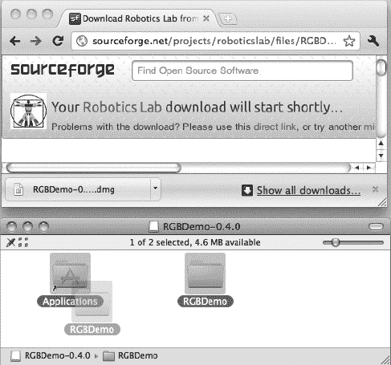

***图 1-19.*** `RGBDemo-0.6.1-Darwin.dmg` *下载及生成的磁盘映像，其中包含 RGBDemo 文件夹和指向应用程序的链接*

恭喜！你已经完成安装。接下来是有趣的部分——准备将 Kinect 连接到你的计算机。请参考图 1-4 直观了解后续步骤中使用的线缆。将 Kinect 上的专用 USB 公头插入交流电源适配器线缆上的 USB 母头。将交流电源适配器插入墙上的电源插座，然后将标准 USB 接头插入计算机的 USB 端口。此时外观应类似图 1-3，但不同的是你并非从 Xbox 上拔下线缆，而是连接到计算机。你应该会看到 Kinect 的 LED 指示灯亮起或闪烁。

现在，将 Kinect 对准自己，距离约两英尺。启动`rgbd-viewer`应用程序，如图图 1-20 所示。你已经准备好用 Kinect 测试自己了！你应该会看到如图图 1-21 所示的 RGBDemo 用户界面。至此，为 Mac OS X 下载并安装 RGBDemo 的部分结束。本章的其余部分适用于 Windows 和苹果电脑。干得好！

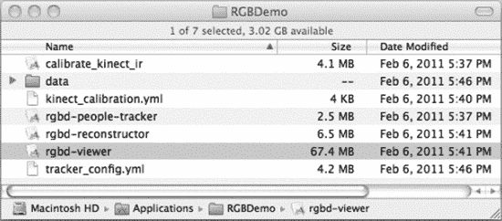

***图 1-20.** RGBDemo 文件夹中的完整文件目录，其中* `rgbd-viewer` *应用程序已被选中*

### 测试你的 Kinect

准备好看到体积 3D 中的自己了吗？！好了，如果你已成功完成前述步骤，你应该能像我一样在图 1-21 中看到自己。这个彩色实时的影像看起来像科幻电影中的热成像摄像头，但相似之处仅限于此。

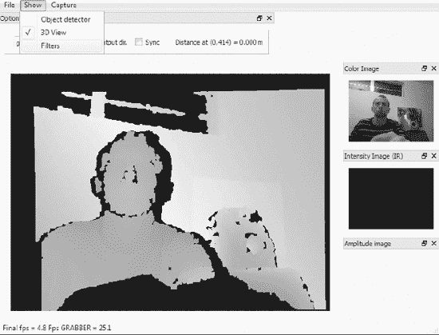

**图 1-21.** `rgbd-viewer` 应用程序中的`RGBD`捕获窗口。主图像显示合并后的深度范围图像，其颜色映射为表示与传感器距离的色值。右上图像显示来自 RGB 摄像头的`彩色图像`流。`3D 视图`和`滤镜`选项在`显示`下拉菜单中提供。每个像素的距离值显示在上中部的`距离在...`状态栏中，对应鼠标指针在深度范围图像上的位置。

与热成像摄像头显示代表温度范围的不同颜色不同，Kinect 显示的是代表与摄像头不同距离范围的不同颜色。这些颜色是任意的——其他一些驱动程序会以灰度范围显示深度图像。您可以通过将鼠标移动到自身彩色图像的任意位置，来查看图像中任何像素或图片元素距离摄像头的精确米数距离。请观察深度图像的右上方，您会看到类似图 1-21 中的读数，例如`距离在 (0,414) = 0.000 米`。试着移动鼠标指针，看看环境中不同物体距离摄像头有多远。该读数以米而非英尺为单位，但您可以在网上找到换算工具。

花点时间在摄像头前跳跃，观察深度图像如何反映您在空间中的运动。拿起 Kinect，将其对准周围的墙壁和地板，注意颜色变化如何对应这些物体与设备的距离变化。关于场景的所有深度数据都可以发送到您编写的程序中，本书后续章节将详细介绍其工作原理。此外，您将在第 2 章中学习人体和骨骼追踪的基础知识。目前，我们仅关注 Kinect 输出的基本数据和图像，不涉及任何复杂中间件。

这是一个相当简单的概念——图像中的每个像素都有一个相对于摄像头测量的空间位置。没有其他消费级摄像头具备 Kinect 测量空间的能力。这正是“深度传感器”的原始功能，已在机器人技术和工程领域应用多年。仅使用深度传感器，以及我们稍后将介绍的骨骼追踪中间件和其他追踪方法，软件开发人员就可以创建简单的“自然界面”软件，让人无需触碰机器即可与之交互。这非常酷——但接下来我们将展示，在合适软件的帮助下，Kinect 如何超越单纯的深度感知，开创全新的设备类别，成为首款消费级体积 3D 摄像头，简称`voxelcam`。

在图 1-21 中，您可以在右上角标注为`彩色图像`的窗口中看到普通网络摄像头视角下的自己。该信号来自 Kinect 中部镜头后面的可见光摄像头传感器（图 1-6, C）。您在`彩色图像`窗口中看到的是可见光的实时视频流，其组织方式与自电视时代以来屏幕显示静态照片和视频的方式相同——通过一个二维的图片元素（即像素）表格。就像一个包含行和列的光样本，以及表格中每个单元格的颜色值一样，这些元素拼接在一起，在屏幕上形成一幅马赛克图像。请注意，在图 1-21 中，窗口右下角的`强度图像`和`振幅图像`默认是关闭的。如果该区域什么也没显示，说明您的设置没有问题。

现在，您将借助深度范围图像数据为摄像头图像增加一个维度。突破我们已知的所有传统摄影和视频技术，我们如今可以为每个图片元素分配一个 3D 空间位置，该位置反映了其采样原始表面的位置（图 1-22）。对于深度图像中的每个像素，我们可以提取三个维度：其与摄像头的距离 (z)、其在图像表格列中的垂直位置 (y)，以及其在图像表格行中的水平位置 (x)。

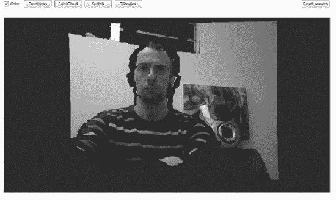

**图 1-22.** `RGBDemo` 3D 视图——默认情况下合成摄像头与实际摄像头对齐

这些浮点数据，或称“空间中的像素”，难以想象。它们本身没有颜色或纹理。它们仅用于指示存在反射红外激光图案的物体。为了提供更具体的方式来理解这些空间点，我们将从二维的电子表格隐喻转向三维的魔方隐喻。想象每个点本身具有一个体积，如同大魔方中的一个小立方体。一个单独的立方体体积元素，即`体素`，来自这个更大的三维立方体阵列，它充当信息的容器，具有 x、y 和 z 坐标地址，指定了场景中一块物理空间。这意味着我们可以将来自网络摄像头的图片元素与来自深度摄像头的`体素`合并，构建一个既有深度又有颜色的体积立方体空间。这个过程在 3D 空间中组装出一个活生生的彩色`体素`云，重建了 Kinect 前方物体的表面形状和外观（图 1-22）。与 Playstation Move 或 Nintendo Wii 等 2D 计算机视觉技术不同，这种解析包含深度信息的场景`体素`图的能力，是理解 Kinect 强大功能以及如何运用它的基础。

准备好变得“体素化”了吗？好了，要在体积 3D 中看到自己，首先在`RGBD`捕获窗口的菜单栏中点击`显示`，然后选择`3D 视图`。将弹出一个标注为`3D 视图 (图 1-22)`的新窗口。此时还没完全成功——此刻您应该能看到自己，就像在普通网络摄像头上一样，但头部和其他物体边缘有些粗糙。接下来是好玩的部分：点击您自己的影像并拖动。现在，这就是您一直在等待的效果（图 1-23）！

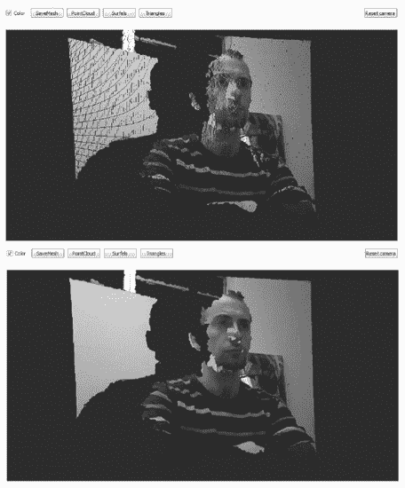

**图 1-23.** 合成摄像头稍微向左旋转后的 3D 视图。顶部视图显示默认的`点云`渲染模式，底部视图显示`三角形`渲染模式

您看到的是体积空间中的“合成摄像头”图像。这个合成摄像头并非真实存在——其图像是通过从不同于原始采样角度的方向观察空间中的浮动体积元素而得出的。您可以拿起这个合成摄像头，朝任意方向旋转，从任何角度查看`体素`数据。例如，图 1-24 显示了旋转 90 度后的图像。

由于您只使用单个摄像头，如果您试图观察正对摄像头物体的背面，图像会看起来更不完整，这一点您可以从图 1-24 中推断出来。在同一个空间内布置多个`体素摄像头`可以构建更完整的场景。Microsoft Kinect SDK 和 OpenNI 框架实际上都包含支持同时与多个 Kinect 交互的接口。因此，如果您想创建一个从多个角度填补图像空白的应用程序，编写相关软件是可行的。这种对空间的单一、全面的体积视图，可以从无限多的视角进行观察，所有这些视角都可以在回放期间通过映射到观看者视线方向的合成摄像头进行实时交互定位。

一旦人们真正理解这项技术的能力，对更真实沉浸式体验的需求就会增加。随着满足这种需求的体积传感器阵列变得越来越普遍，基于此技术所能创造的可能性将变得更加无限。Kinect 只是冰山一角。欢迎来到体积时代！

这些信息桶可以用不同的方式渲染。3D 视图的默认方法是一个空间中的像素云，也称为点云（图 1-23，顶部）。如您所见，这个视图有很多空洞。您可以放大以更近地观察这些点——它们显示的图案反映了红外投影仪不可见地投射在您身上的结构光点阵。

既然我们目前还没有多个 Kinect 来填补合成摄像头图像中的所有裂缝，那么让我们利用多边形的魔力，以一种我们更习惯的方式来渲染这些信息。选择 3D 视图屏幕右上角的`三角形`按钮（位于`PointCloud`和`Surfels`按钮右侧），如图 1-23 所示。这将创建一个由三角形多边形组成的网格，连接各个点，并为可见光图像数据提供更多显示表面积。注意点云视图和三角形视图（图 1-23，底部）之间的区别。仅几年之前，创建这种 3D 图像的能力还仅限于能够负担约 15,000 美元价格的学术、娱乐和军事机构。

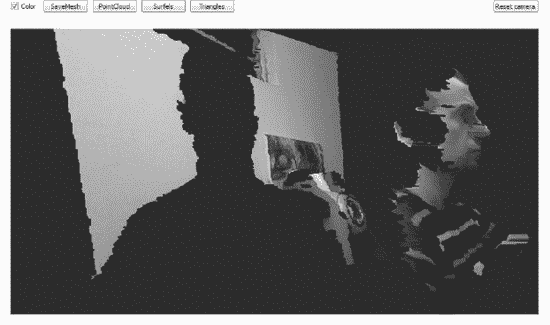

**图 1-24.** `RGBDemo` 3D 视图显示体积 3D 合成摄像头视角神奇地垂直于物理 Kinect 旋转了 90 度

您会注意到您所在位置“后面”图像的大空洞——那是您的阴影！您的轮廓被勾勒出来，是因为您阻挡了红外投影仪将可测量的光线投射到您身后的墙壁上。这看起来可能没什么大不了的，因为这只是该技术非常基础的运用，但当您了解微软研究院的`KinectFusion`项目用于实时动态 3D 表面重建时，就能明白这项能力的未来发展方向。这种在数字空间中重建物理世界的能力是微软的一个主要主题，而在`Xbox Live`的`趣味实验室`小游戏中，可以找到让您“数字化您的世界”的简单应用程序。

 **注意** 更多关于`KinectFusion`项目的信息，请访问以下 URL：[`research.microsoft.com/en-us/projects/surfacerecon/`](http://research.microsoft.com/en-us/projects/surfacerecon/)

虽然多数人只将 Kinect 视为一种自然界面 3D 手势识别设备，但理解支撑身体追踪软件和其他功能的成像数据至关重要。Kinect 收集空间信息的能力是其独特硬件功能的核心。YouTube 上一些伟大的“破解”仅利用这些原始数据就能实现，甚至不需要用到 Kinect 的手势识别功能。微软研究院在 2011 年 SIGGRAPH（图形专家领域的顶级行业会议）上首次展示的`KinectFusion`（图 1-25），震惊了许多科技界人士。此前，Kinect 的体积视频输出曾被批评为质量太低而无法实用。`KinectFusion`能够高分辨率、实时、照片级地重建人物和物体，即使摄像头抖动也能做到，这表明整个场景的持久模型可以被快速存储和更新，以填补摄像头视角背后的缺失细节。

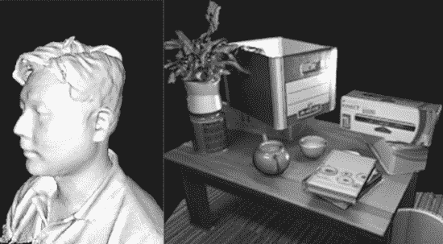

**图 1-25.** `KinectFusion` 显示人体的实时 3D 重建（左）以及带有光照效果的照片级纹理贴图模型（右）。图片由微软研究院提供。

很可能本章中您所瞥见的——在实时体积 3D 视频中看到自己——将在未来塑造基于屏幕的娱乐和虚拟存在感方面发挥关键作用。不再使用我们所熟悉的即时通讯或 Skype，您可以通过“即时化身”的方式，将朋友、家人和同事“请”到您的房间，与他们交流。接收到他们身体的完整 3D 数据后，您或许可以歪头并从各个角度观察他们，仿佛他们就在身边一样，这是当今 2D 摄像头无法做到的。期待一系列全新的应用程序，邀请您将家中的人和物“数字化”，并将其带入游戏或新颖的应用中。现在，您已了解真实 Kinect 数据的模样，并对不远的将来可能实现的体验有了概念。本书其余部分将更详细地介绍，如何利用从这些“体素化”物理信息中提取的人体追踪点，设计具有自然手势界面的应用程序。

