# 第 2 章

## 技术背后

在本章中，我们将揭开 Kinect 背后底层技术的神秘面纱。你将了解深度传感成像仪的原理，发现其他制造商提供的 Kinect 替代方案，并理解所有这些设备为你的潜在应用所提供的通用数据输出。你可以通过各种驱动程序、处理函数库和应用程序开发环境来创建应用。你将接触到用于描述深度和自然界面技术的新术语，并获得一个思维框架，将这些新概念与你从 2D 技术中已经熟悉的概念联系起来。

使用新技术面临的挑战之一在于，其背后的概念尚未融入常识或成为家喻户晓的名词。由于 Kinect 被设计成一种可以为游戏提供“自然界面”的视频游戏控制器，因此其开发文献大多侧重于将其作为客厅里的“鼠标/遥控器/游戏控制器替代品”输入设备来应用。这是一个新兴领域，许多硬件和软件制造商都设计了自己的系统来实现这一目标，尽管方式略有不同。因此，来自不同背景、为不同环境开发这项技术的人们和公司在使用的术语上存在差异。在某些情况下，甚至没有一个定义明确的词汇表来描述该技术的各个方面在“自然界面”边界之外的应用方式。

问题在于，自从 Kinect 从 Xbox 的束缚中解放出来后，许多最有趣的“黑客创想”都将其用于制造商从未设想过的方式。因此，当曾经局限于学术研究或工业应用的概念和技术——通过 YouTube 视频和其他流行媒体——进入公众视野时，就需要为普通大众的日常交流提供描述性的技术语言。为了解释如何按设计使用这些新技术，同时应对那些推动创新的、富有想象力的“非标签用途”，我们必须灵活变通“专家”术语，以便对技术的可能性提供一个更开放的视角。

当我们从基于 2D 原理的成像和输入系统（如网络摄像头和鼠标）转向基于 3D 系统（如 Kinect）时，我们将识别出能为这两个维度提供具体参考关联的原则。之后，我们将审视完整的 Kinect “技术栈”，从硬件到软件，以解释这项技术的工作原理。

### 理解技术栈

技术栈是一种描述组成硬件和软件解决方案的各个组件之间关系的方式。技术栈的范围可以根据所描述的场景进行调整。以个人电脑为例，我们可以识别出硬件制造商（惠普）、操作系统（Windows 7）以及用户可以运行的应用程序（谷歌浏览器）。以 Web 应用为例，我们可以考察服务器操作系统（Linux）、Web 服务器软件（Apache）、数据库软件（MySQL）和 Web 脚本语言（PHP）。技术栈提供了对整个系统设计及所选组件组合的视角，或将其视为可以相互替换的要素。使用 Kinect 及其革命性的廉价 3D 深度传感器的方法如此之多，以至于人们可能会根据自己希望利用该技术的方式选择不同的技术栈。本书主要探讨如何将 Kinect 用作实现自然界面体验的方式；其他人可能会将其用于电影制作、物体和环境的 3D 重建，或为新型低成本机器人提供机器视觉系统。

最初，开发 Kinect 应用程序的唯一方法是使用微软向其高级工作室合作伙伴提供的价值 10000 美元的 Xbox 开发套件，以便他们专门为 Xbox 系统设计应用程序（图 2-1，左图）。这种情况在 Kinect 零售发布仅几天后就发生了巨大变化——软件驱动程序解读了来自 Kinect USB 端口传来的信号，随后这些驱动程序被编写并作为开源软件发布在互联网上。突然间，借助`libfreenect`驱动程序（也称为`OpenKinect`），任何人都可以免费使用 Kinect 传感器开发自己的应用程序。这些驱动程序可以访问来自各种 Kinect 传感器的原始数据，但并未提供一个更高级别的框架来在基于自然界面的开发环境中理解这些数据。但这并没有阻止好奇且富有创造力的程序员们制作出卓越的应用程序（也称为“黑客创想”），探索 Kinect 技术在游戏之外的潜力（图 2-1，右图）。

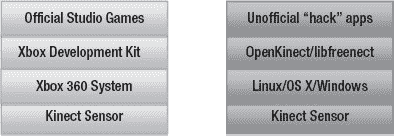

**图 2-1.** 微软原版 Xbox Kinect 技术栈 vs. OpenKinect/libfreenect 技术栈

当非官方的 Kinect 应用程序开始引起媒体关注和网络热议时，那些此前一直在设计用于支持自然界面应用程序开发的软件公司开始注意到这一点。开发 Kinect 内部结构光深度传感器底层技术的公司 PrimeSense 做出回应，与多个行业领导者共同牵头开展了 OpenNI 计划——这是一个驱动程序框架，允许任何深度传感硬件与相关软件之间实现互操作，从而支持创建自然界面应用程序。

这为开发者提供了 Kinect 开发的另一种选择——他们首次能够使用一个无需考虑特定制造商或深度传感硬件实现的驱动程序框架。此外，OpenNI 软件还附带了一些工具，能够提高开发速度，因为它们解决了`libfreenect`/`OpenKinect`驱动程序尚未克服的处理原始传感器数据时遇到的许多难题。该软件是免费提供的，其源代码也是公开可见的。PrimeSense 单独发布了一个名为`NITE`的免费但闭源的骨骼追踪中间件系统，该系统可解读原始数据并计算身体部位的简化坐标，以便编写手势输入命令，这与 Xbox 开发套件中用于创建游戏的技术类似。

在 OpenNI 问世后，微软宣布将于 2011 年春季发布一款面向 Windows 的非商业用途 **Kinect 软件开发工具包**。很快，那些花费多年时间设计用于创作自然手势软件的应用程序开发套件的公司，突然发现市场需求正在不断增长。此前，他们的系统不易下载，并且附带许可费用，这使得即便是在其网站上发布也成本过高。突然间，这些公司需要维持其相关性，因为成千上万的开发者正争相创建复杂的应用程序——而最容易获取的选择就是**开源软件**。到 2011 年 2 月，**SoftKinetic** 宣布其驱动系统 `iisu`（适用于任何深度传感器）以及用于肢体动作的开发环境现已普遍可用，此外还有他们的 **DepthSense** 摄像头硬件产品线。**Omek Interactive** 则发布了其 `Beckon SDK`，同时宣布与飞行时间深度摄像头制造商 **PMD Technologies** 建立合作关系。自 20 世纪 80 年代以来一直是基于身体手势交互系统先驱的 **GestureTek**，也准备提供其 `GestTrack3D SDK` 供普遍使用。

对于寻求利用 Kinect 所提供可能性的工具的设计师和开发者来说，开发选择已逐渐变得日益多样化。如今，有数十种硬件和软件的组合，能够形成新颖的技术栈，将自然用户界面体验推向未来（图 2-2）。在下一节中，我们将根据各个组件，解释决定 Kinect 技术栈形态的因素。

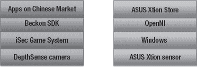

**图 2-2.** 新兴的替代性自然界面硬件与软件栈

## 硬件

有多种设备可以捕捉 3D 图像。其中多数仍然昂贵，这正是 Kinect 成为一项重大突破的原因。一些设备更适合捕捉静态图像，而另一些设计则适用于随时间生成高频静态图像以产生 3D 深度视频。每种设备都捕捉关于 3D 世界的深度信息，并以能够重建所捕捉 3D 数据完整维度的方式进行存储。这些系统可能采用截然不同的操作方法，或来自不同的制造商，但结果始终是包含某种形式 3D 深度信息的数据。

将收集 3D 图像的不同方法与收集 2D 信息的选择进行比较会很有帮助。无论设备的操作方法如何，传统相机总是捕捉 3D 世界并将其存储在 2D 格式中。无论是针孔相机、大画幅平板相机、单反相机 (SLR)、旁轴相机、傻瓜相机，还是你手机中的相机，光学系统都会接收光线并将底片或原始图像文件以平面 2D 形式存储。因此，正如这些不同的成像系统在 2D 摄影中针对特定应用各有其优缺点一样，构建 3D 成像系统也有多种不同的方式。在深度传感系统中，基本原理通常包括发射信号、让该信号在环境中的物体上反射、读取返回的信号，并计算深度信息（图 2-3）。无论使用何种技术，它们之间的共同点都是生成场景的深度图图像或 3D 点云。

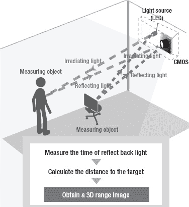

**图 2-3.** 大多数 3D 深度传感系统的共同原理。信号从发射器发出，信号反射回来并被传感器接收，对返回信号进行计算以测量到目标的距离。

### 结构光摄像头系统

一种可见的结构光方法曾被著名地用作 Radiohead 在 2008 年突破性的无摄像音乐录影带《*In Rainbows*》中的《House of Cards》的基础。借助 **Geometric Informatics** 的定制系统，歌手汤姆·约克面部的特写镜头被捕捉为点云数据，从而允许在后期制作中引导“合成摄像头”视点。结构光方法非常适合捕捉歌手详细的面部表情，因为这种技术可用于捕捉几英尺内的主体。另一种称为 LIDAR（光探测与测距）的 3D 捕捉技术被用于收集跨越数百英尺的大规模 3D 图像，以渲染建筑物和道路。一台价值 75,000 美元的 **Velodyne** 设备，配备 64 个同步旋转激光器，使得这种图像成为可能。

Radiohead 视频制作产生的数据通过谷歌代码仓库在 `http://code.google.com/creative/radiohead/` 公开提供。凯尔·麦克唐纳在 `http://www.instructables.com/id/Structured-Light-3D-Scanning/` 解释了如何重建类似于视频中用于创建特写镜头的设置（图 2-4）。

结构光扫描是通过向场景投射已知信号（例如频率带、编码光或形状图案）来生成 3D 深度图像数据的过程，并观察该图案在撞击距离变化的表面时如何变形，以计算深度范围。Kinect 使用红外结构光系统，华硕 WAVI Xtion 和 PrimeSense 参考设计也采用此技术。由于这些系统使用不可见的红外光，因此在记录过程中对环境没有可感知的干扰。这使得 3D 捕捉不受场景光照条件的影响。相比之下，可见结构光系统通过将图案投射到肉眼可见的场景上来工作。这类系统在可见光谱内为场景提供自身照明，这可能是相当明显的。

可见结构光方法有一些优势。此前，该方法是生成深度图像成本较低的选择之一。它能够以比飞行时间摄像头等其他方法更低的成本产生更高分辨率的图像。在可见结构光系统中，可以使用投影仪叠加一个形状图案，例如线条，这些线条可以是静止的或以高频率运动，并围绕物体弯曲。一个或多个摄像头对准该结构光，并对生成的图像进行计算处理以生成深度数据。例如，**Willow Garage** 的 PR2 机器人使用一个 LED “纹理”投影仪，在机器人前方的场景上叠加一个看起来像随机红色像素静态噪声的图案。**机器人操作系统** (Robot Operating System) 使用一对对准该可见图案的窄视角立体摄像头来生成 3D 点云。像凯尔·麦克唐纳这样的艺术家已经成功地使用现成的组件（图 2-4）构建了可见结构光系统，这些组件包括 **索尼 PlayStation Eye** 高速摄像头、DLP 数据投影仪以及用 **Processing**（一种开源创意编程套件，将在第 4 章中介绍）编写的软件。如果投影仪信号和摄像头组件被改造以适应红外波段工作，在技术上有可能（尽管可能成本高昂）将这种可见结构光方法修改为不可见的结构光方法。Kinect 正是使用这种波段的光，因此用户无法主动看到从设备发出的光。

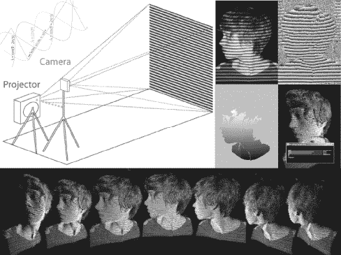

***图 2-4.** 采用三步相移扫描技术的可见光结构光设备示意图。下方帧显示可任意角度查看的最终点云图像。* 图片由 Kyle MacDonald 根据知识共享署名 3.0 未本地化版本许可协议授权。

Kinect 的结构光方法在原理上类似于用于扫描可见光的技术，如图 2-4 所示。投影仪发射信号，摄像头读取信号，然后通过计算得出最终深度图像中每个像素对应的物体与摄像头之间的距离。然而，由 PrimeSense 设计的 Kinect 方法在实现细节上具有独特性。它并非投射可见的连续变化形状或光带，而是让不可见的红外激光投影仪生成一个由强度各异的点组成的静态云状图案，该图案看似随机。红外激光照射到衍射光栅上，将光束分成数千个独立的点，从而形成每个光点。

Kinect 会向场景投射多少个红外光点？据估计在 30,000 到 300,000 个之间。有一位好奇的人费尽心思记录了该图案并在网格上重建，以理解这些点的结构。他的结论是，一个 3×3 的网格是 211×165 点阵图案的重复，从而构成一个 633×495 或总计 313,335 个光点的整体网格（更多信息请参见 [`http://azttm.wordpress.com/2011/04/03/kinect-pattern-uncovered/`](http://azttm.wordpress.com/2011/04/03/kinect-pattern-uncovered/)）。

这些点看起来像随机的静态噪声，直到你发现存在一个由九个部分组成的重复图案，形成棋盘格。使用诸如 `RGBDemo` 之类的程序可以观察到这个光阵列，该程序提供了对红外图像流的访问。该图案的构建方式使得任何一组点的检测都能在整个点集的范围内被识别——这就是 PrimeSense 深度传感器系统架构的精髓（图 2-5）。由于它们以如此可识别的方式结构化排列，PrimeSense 图像处理器芯片能够对齐这些点，并通过比较它们的不同位置进行计算，从而创建参考图像。当这些摄像头和芯片在工厂被组装成一个系统时，所有组件都通过将传感器指向距设备特定距离的墙壁来进行校准。投影仪显示其结构光图案，红外摄像头捕捉一幅图像，该图像存储在 PrimeSense 芯片上，作为该特定距离下图像中所有像素的深度记录。从此以后，这幅图像便成为计算实时深度图像中每个像素距离的参照点。人的面部会破坏均匀图案，并与参考图像进行比较，通过这一过程得出面部每个点的距离，精度达到厘米级。

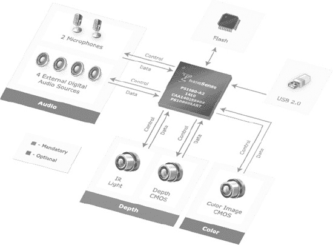

***图 2-5.** PrimeSense 深度传感器架构。彩色图像 CMOS 传感器和音频组件（以蓝色标出）并非生成深度图所必需。图片由 PrimeSense 提供。*

读取所有这些点需要一种能够看到红外光的特殊摄像头。这便是 Kinect 最右侧镜头（图 1-6，D）后面的摄像头。该摄像头有一个滤光片，它通过只允许红外光照射到后面的感光传感器来屏蔽可见光谱。如果你仔细观察这个镜头，可以看到其虹彩般的绿色镀膜，这是将其与左侧的可见光摄像头区分开来的方式。这个屏障反射了深度计算过程所不需要的所有不必要的可见光，只允许红外投影光点通过镜头。

Kinect 还配备了另一个我们更为熟悉的摄像头。它是一个简单的网络摄像头，类似于你的笔记本电脑或手机可能包含的那种，用于捕捉可见光并将其表示为红绿蓝（RGB）像素。PrimeSense 参考设备也包含这个摄像头。然而，另一个被许可方华硕在其首款 WAVI Xtion 设备中选择不包含 RGB 摄像头。该摄像头不用于生成深度图，但许多新型深度摄像头设备都包含它，作为将可见光图像与深度图像融合的一种方法。将可见光与深度图结合的系统是一种体积摄像机的形式，特别是当它们以多个 RGB/深度传感设备阵列的形式组装时。组合多个传感器阵列可以生成无阴影的图像（阴影区域不存储深度信息），从而允许对场景进行无限视角观察，而物体后方没有明显的空隙。

此外，可见光摄像头还可用于计算分析。例如，计算机视觉识别软件（如 `OpenCV`）可以应用于场景以搜索人脸，并可经过训练将这些面部与从深度图中分离出的单个用户相关联。已有多种现成的库和方法可用于从 RGB 图像中提取有意义的信息，当硬件使用这个额外的可见光摄像头时，这些库和方法可以集成到应用程序中。

以下小节将介绍若干采用结构光方法获取 3D 场景信息的深度传感器。它们都使用了 PrimeSense 的设计，但在可选内部组件和外形尺寸上有不同选择。随着 PrimeSense 继续将该设计授权给更多制造商（例如生产平板电视和机顶盒的制造商），开发者将发现一个可以选择多种设备的生态系统，能够基于他们对 Kinect 的了解来设计应用程序。许多此类硬件制造商将选择加入符合 OpenNI 标准或其它基于标准的应用商店，这为应用开发者创造了将其作品分发给更广泛的已安装设备用户群的机会。

#### PrimeSense 参考设计

PrimeSense 是一家总部位于以色列的公司，它开发了 Microsoft 许可用于 Kinect 的 3D 结构光技术。开发者可以使用参考设计产品来评估该技术在新硬件中的应用，或者配合将在后续章节中介绍的 `OpenNI`/`NITE` 软件进行开发。就本书的范围而言，PrimeSense 的参考设计与 Kinect 的相同。唯一的区别在于缺少电机、需要交流电源适配器以及麦克风组件不同。`PS1080` 设计（图 2-6）是最早可用的，现在正在被一个带有内置支架的更小型号所取代。（更多信息请访问 [`http://www.primesense.com`](http://www.primesense.com)`）。`

 **提示** 华硕制造并在下一节中提及的 `Xtion Pro Live` 正是 PrimeSense 参考设计的具体实现。如果你想要一个参考设计的实现版本，但又难以从 PrimeSense 获得，那么 `Xtion Pro Live` 是一个不错的选择。

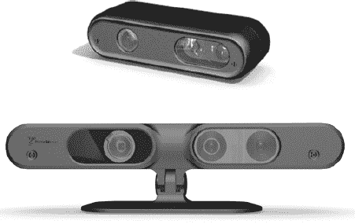

***图 2-6.** 最初的 PrimeSense 参考设计 PS1080（上方）以及更新款设计（下方）*

PrimeSense 是红外结构光系统的主要设计者。然而，其他硬件制造商使用将在后续章节“飞行时间摄像头系统”中描述的替代技术来生成深度图像。重要的是要记住，无论设计如何，所有这些传感器都能生成深度图，并且可以运用类似的原理将其集成到软件中。当我们进入软件栈的驱动部分时，你会看到存在多层软件，它们将特定的硬件实现抽象化，让你能够直接访问 3D 数据，而无论生成该数据使用了何种方法。

#### 华硕 WAVI Xtion PRO 与 PRO Live

台湾电脑制造商华硕是继微软之后，PrimeSense 硬件技术的第二家主要授权商。WAVI Xtion PRO 被宣传为“全球首款也是唯一一款专业 PC 动作感应软件开发工具包”。这种差异化是合理的，因为与 Kinect 不同，该产品设计初衷就是开箱即可连接个人电脑，并且特意包含了软件和内容创建工具，对开发者十分友好。构建符合`OpenNI`标准的软件的开发者，将有机会在华硕 Xtion 商店中销售其产品，该商店将伴随 WAVI Xtion 产品线推出。

最近，华硕推出了 Xtion PRO Live。这款较新的型号包含一个 RGB 摄像头，是 PrimeSense 参考设计的精确实现。有关这两款型号的更多信息，请访问 [`http://event.asus.com/wavi/Product/WAVI_Pro.aspx`](http://event.asus.com/wavi/Product/WAVI_Pro.aspx)。

 **注意** 以下是华硕商店页面的直接链接，您可以通过该链接购买 PRO Live 型号：[`http://us.estore.asus.com/index.php?l=product_detail&p=4001`](http://us.estore.asus.com/index.php?l=product_detail&p=4001)。

### 飞行时间相机系统

与结构光系统相比，飞行时间相机系统不依赖需要通过解码来计算深度的复杂投射图案。相反，这些系统利用光速恒定（约每秒 3 亿米）这一特性，作为揭示场景中物体深度的关键。这种深度测距技术的原理是：记录光信号从发射器发出，照射到场景中的物体后反射，最终返回到设备中光传感器所需的时间。极其灵敏的光传感器和高速电子组件能够根据光往返所需的时间来计算距离。对于传感器阵列中的每个单元都会进行此计算，这导致这些设备的分辨率通常低于结构光系统，一般在 64x48 到 320x240 像素之间。

制造商可以采用多种技术来构建飞行时间系统，例如脉冲光、射频调制和距离选通。此外，还可以选择使用何种类型的光源，这决定了系统的价格及其对特定环境的适应性。可以使用 LED 阵列来构建适合近距离（两厘米到两米）对象的消费级系统。基于激光的系统能够将测距范围扩展到两公里，但其价格超出了除大型机构以外的任何人的承受范围。

基于`LED`的飞行时间传感器构成了与 PrimeSense 结构光深度传感器竞争的主力。下一节将重点介绍那些被宣传用于 3D 自然界面系统的设备。由于这些系统的设计方式，它们具备结构光系统无法比拟的能力。根据所采用的照明类型和环境光抑制能力，飞行时间设备可以在白天的室外使用。而结构光系统通常无法在室内以外的强光下与之竞争。此外，飞行时间芯片的计时可以调整，以提供大范围距离上的深度精度，也可以密集地调整到较小的深度范围，这使得这些系统适用于面部捕捉——这类应用需要在短距离内获得高度细节。

#### SoftKinetic DepthSense 摄像头

SoftKinetic 是一家总部位于比利时的公司，正将其 DepthSense 系列摄像头及其 3D 手势识别中间件`iisu`推向美国市场。其 DepthSense 摄像头使用飞行时间系统收集 3D 场景信息，并包含一个类似于 Kinect 的 RGB 摄像头，用于感知可见光图像。他们的 DepthSense 硬件为首款面向中国市场的游戏机 iSec 提供了基于自然动作的界面支持（[`http://www.eedoo.cn/html/eedoo/isec/`](http://www.eedoo.cn/html/eedoo/isec/)）。有关 SoftKinetic 的更多信息，请访问 [`http://www.softkinetic.com/`](http://www.softkinetic.com/)。

#### PMD [vision] 飞行时间摄像头

总部位于德国的 PMDTec 是全球领先的飞行时间摄像头集成电路技术供应商。他们的`PMD[vision] CamBoard`参考设计采用 200x200 的传感器单元网格，为希望围绕此技术构建自有产品的公司提供了如何实现的思路，类似于 PrimeSense 与微软在 Kinect 上的合作模式。另一方面，`PMD [vision] O3`以可直接从 PMD 购买的形式包装，包含 64x48 单元的传感器网格。这两款设备（如图 2-7 所示）未集成 RGB 摄像头，因此只能提供深度图和红外图。PMDTec 最新的高分辨率原型机可捕捉高达 352x288 的传感器单元。（更多信息请访问 [`http://www.pmdtec.com/`](http://www.pmdtec.com/)）。

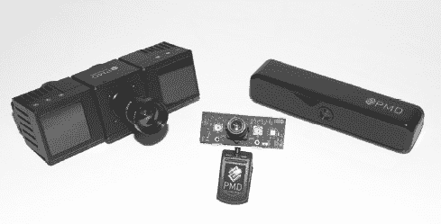

`图 2-7.` PMD [vision] CamCube、PMD [vision] CamBoard 参考设计以及 PMD [vision] ConceptCam。摄影：Kara Dahlberg。

#### 松下 D-Imager

图 2-8 所示的松下 D-Imager 被宣传为适用于游戏系统和数字标牌的深度感应解决方案。在 2010 年上海世博会的日本馆中，它被用于驱动一个交互式显示屏。D-Imager 能够以最高每秒 30 帧的速度生成 160x120 分辨率的深度图。松下的设备包含背光抑制技术，使其在明亮的环境光条件下更具韧性。更多信息请访问 [`http://panasonic-electric-works.net/D-IMager`](http://panasonic-electric-works.net/D-IMager)。

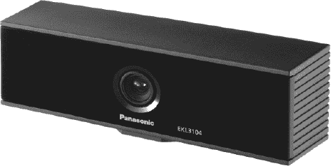

`图 2-8.` 松下 D-Imager 飞行时间深度传感器，其镜头的左侧和右侧隐藏了近红外 LED 阵列。

## 驱动与数据

前面硬件章节中提到的每款设备都需要驱动程序来解释其输出的原始信号，并将这些信号转换为应用程序可用的数据。驱动程序是技术栈中的下一层，对于开发能够在特定平台上充分利用这些设备的软件至关重要。

原始制造商只在其支持的平台上提供这些设备的驱动程序。Kinect 最初发布时也是如此。在开源社区逆向工程该设备，开发出 OpenKinect 项目和`libfreenect`驱动程序之前，Kinect 只能在 Xbox 360 系统上使用。自那时起，就有了多种方法可以在您想要的平台上使用 Kinect，或者使用前面硬件章节中列出的任何其他深度感应摄像头。这一切都归功于驱动程序的神奇之处——让我们来看看不同驱动程序提供的数据类型。

#### `OpenKinect/Libfreenect`

OpenKinect 项目的 `libfreenect` 开源驱动是首个可供普遍使用的 Kinect 驱动，也是许多项目的基础。OpenNI 驱动框架发布后，许多项目放弃了对 `libfreenect` 的依赖，转而使用 OpenNI 驱动，因为它们能更灵活地更换其他硬件，并且提供了更强大的功能集来构建应用。尽管如此，许多程序员仍选择使用 `libfreenect` 驱动，因为它易于重新分发，无需用户下载依赖软件。

`Libfreenect` 以图像形式提供对 Kinect 三组主要数据的访问。最重要的数据是原始深度图（图 2-9）。这是 `libfreenect` 为你的应用提供深度信息的唯一方式。该图像编码为 11 位深度，其强度值映射到与摄像头的特定距离。最原始的数据以灰度显示，但大多数工具会选择以彩色图像显示，以便在视觉上区分距离。

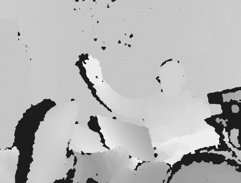

**图 2-9.** `Libfreenect` 的深度图。每种颜色代表与摄像头的不同距离。

`libfreenect` 驱动还通过最右侧的摄像头（图 2-10）为你的应用提供原始红外图像。该驱动使用摄像头的直接数据流，该摄像头专门用于捕捉红外投影仪发出的光点。因此，图像中充满了散布在场景物体周围的斑点图案。由于红外图用于生成深度图，将两者结合生成点云视图，可以提供校准良好的 3D 表示。然而，这种表示需要进行校准。这种校准的需求是使用 `Libfreenect` 驱动令人困扰的方面之一——OpenNI 则为深度数据提供了校准后的 RGB 数据映射。

**图 2-10.** `Libfreenect` 的红外图。红外投影仪将斑点投射到场景上。

`Libfreenect` 提供的最后一项图像数据是来自 Kinect 中间摄像头的可见光 RGB 图像（图 2-11）。该 RGB 摄像头提供了视觉数据，你可以利用这些数据，通过 OpenCV 等计算机视觉软件对场景进行计算，例如进行面部识别。正如你将在第 3 章中看到的“身体畸形玩具”和“奥特曼 / 龟派气功”应用，这些视觉数据也可以反馈到你开发的软件中，以提供增强现实视图。你的应用还可以将 RGB 图像数据与深度图对齐，生成点云，从而像“3D Capture-It”那样重建场景，这部分内容也将在第 3 章中介绍。

**图 2-11.** `libfreenect` 的 RGB 图

除了基于图像的传感器数据外，`Libfreenect` 还允许访问嵌入在 Kinect 中的 3 轴加速度计芯片。这对于设计需要用户手动移动 Kinect 的手持应用可能很有帮助，正如第 3 章中的 MatterPort 所做的那样。`Libfreenect` 允许你的应用读取数据，同时还能控制 Kinect 的执行器。LED 灯可以按你的设计变换不同颜色并开关。Kinect 的头部可以使用电机控制功能上下倾斜 30 度。

#### `OpenNI`

正如 `www.OpenNI.org` 所述，“OpenNI 组织是一个由行业领导、非盈利的组织，旨在认证并促进自然交互设备、应用和中间件的兼容性与互操作性。”为了执行这一使命，并在 PrimeSense 的大力支持下，该组织创建了一个名为 OpenNI 的开源框架，它提供了应用程序编程接口，用于编写使用自然交互的应用。该 API 涵盖了与低级设备（如视觉和音频传感器）的通信，以及用于使用计算机视觉进行视觉追踪的高级中间件解决方案。

OpenNI 提供了对 `Libfreenect` 驱动中所有可用数据的访问。它还提供了诸如将深度图的投影 x、y 坐标转换回以厘米为单位的真实世界 x、y、z 坐标等方法。这使得获取点云以及从合成摄像头视角生成场景中的替代视点变得更容易（参见图 2-12）。此外，该软件还提供了追踪多人，并从骨骼身体数据中提取手势的能力。

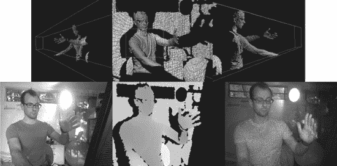

**图 2-12.** 上一行，点云旋转以显示替代视点。下一行，点云场景的源 RGB、深度和红外图。

#### 商业驱动

各种旨在为自然交互构建应用的软件开发工具包都带有自己系列针对 Kinect 的驱动，并且内置了其他深度传感器。`SoftKinetic` 的 `issu`、`Omek Interactive` 的 `Beckon` 以及 `Gesturetek` 的 `GestTrack3D` 都有自己的实现方式，并且可能有不同的设备交互方式。就 Kinect 内部的麦克风阵列而言，微软的 Windows 驱动包含其他驱动所不具备的功能。微软的 Kinect SDK 目前还不能用于商业用途许可，但我们预期这种情况将在 2012 年初微软发布其 SDK 的商业版本时发生变化。

### 中间件和应用开发环境

技术栈的最后一个主要组件是所谓的中间件——各种作用于传感器数据并产生应用可用的新功能的软件模块。这类功能可能会被整合到集成应用开发环境中，因此你对它们作为独立中间件模块的感知程度取决于你设计应用时所使用的软件环境。

将深度图分割成与背景分离的独立用户（图 2-13，左），或提取并追踪用户的手（图 2-13，右）的能力，是功能性省时模块，可以帮助你更快地开发应用，并显著减少代码库的规模。

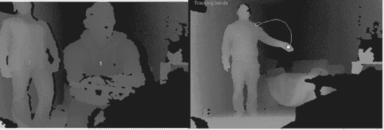

**图 2-13.** 左，用户分割追踪两个人。右，点追踪手的演示。

与这些功能交互的细节可能会因你选择的开发环境而异。然而，底层概念是相似的。骨骼追踪中间件可以通过将用户分割成一个带有系列“身体数据”关节的骨骼来追踪用户。在你的应用中，这些关节可以被分配相应的值，用于控制角色或监听可识别的手势。

当我们进入第 3 章并回顾实际应用时，请注意程序员是如何使用我们在本章中介绍的方法的。既然你已经了解了这项技术的工作原理，你将更清楚地知道如何开始创建自己的运动和深度感知应用。

