# 第 3 章

## 现实世界中的应用

在本章中，我们将一窥 Kinect PC 应用领域第一年开发者构建的一些应用程序，它们展示了你可以利用在自身程序中的功能。当你在自己的电脑上安装这些应用时，不妨思考一下开发者是如何利用 Kinect 的能力，在应用中创造出独特体验的。在后续章节中，将轮到你来设计应用程序，所以请用本章作为灵感来源。

只需挥动你的手，就能通过`SenseCast`控制来自网络的消息和其它实时信息。像奥特曼或龟派气功那样练习你的超能力，把你的身体动作变成激光束和爆炸的光芒。用巧妙的`Body Dysmorphia Toy`调整周围世界的“膨胀感”，吓唬你自己和你的朋友们。最后，通过`MatterPort`发现体积摄影作为一门艺术形式的奇妙之处，这款应用能让你扫描物理世界，生成物体和环境的 3D 摄影模型。

### Kinect 应用的其他来源

当人们最初开始分享他们与 Kinect 的实验时，在自己的电脑上复现并不容易。许多开发者将他们作品的视频上传到 YouTube，这些视频被诸如`KinectHacks.net`和`kinecthacks.com`之类的网站收录。这些视频都用对可能性的构想挑逗着我们所有人。

OpenNI 的 Arena（网址为`http://arena.openni.org`）是寻找灵感和能在你电脑上运行的程序的好地方。目前，Arena 上有超过 50 个应用程序。`Zigfu.com`通过一个门户网站进一步推进了这个想法，你可以在该门户下载其应用商店，然后安装并浏览新的运动控制应用，而无需触摸鼠标或键盘。

#### SenseCast：少数派报告遇见网络

`Sensecast`是一个旨在帮助设计师和内容创作者轻松地将文本、图片、视频、RSS 源、Twitter 流以及其他基于网络的内容封装到运动控制界面中的程序。结合一个在线服务来管理你发布到显示屏上的媒体内容，`Sensecast`旨在成为一个针对运动控制内容的完整创作与发布平台。

`Sensecast`非常适合照片幻灯片和新闻源这类类似网络的内容。免费的`Sensecast`客户端软件（你下载到电脑上的）会从网络和/或你的本地机器拉取媒体内容，并将其排列成一系列菜单和页面，然后你可以通过挥手和悬停进行导航。只需插入 Kinect，下载并启动客户端，瞧！你就能像在 2054 年一样在屏幕上拨弄文字和图片了，如图 3-1 所示。

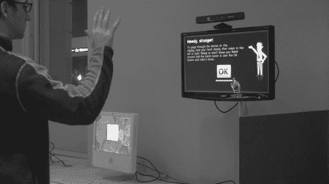

***图 3-1.** 创建者 Jonathan C. Hall 演示 Sensecast 的 Kinect 辅助运动控制。*

由我们的一位合著者 Jonathan Hall 创建的`Sensecast`旨在降低那些希望在公共和半公共屏幕上呈现有趣内容（而不仅仅是标识和广告）的公司的准入门槛。我们将在本章中指导你使用免费的客户端软件。然而，`Sensecast`也提供一个商业版本，它集成了社交媒体渠道，提供内容性能指标等。当然，没有什么能阻止你在任何你想要的地方（甚至在你自己的家里）设置`Sensecast`来运行一个支持 Kinect 的显示屏。想在厨房揉披萨面团时翻阅食谱寻找灵感吗？在你当地的学校或社区中心设置一个无接触、无病菌的公告板和留言板怎么样？或者，也许你只想在你所在的街区建造最酷的运动控制多媒体门铃。`Sensecast`都能帮到你。

在这个练习中，我们将只下载并运行适用于 Mac 的免费客户端软件。对于那些想要调整我们的 Kinect 显示屏设置的人，可以在线获取更多信息。请注意，`Sensecast`客户端可以配置为从网络下载资源，或者我们可以为显示屏手动提供内容。提供你自己的内容允许你将`Sensecast`作为独立程序运行，无需互联网连接或内容管理系统(CMS)。显示屏的外观和感觉也完全可定制：你只需要编辑附带的`presentation.xml`文件中的标记，并添加任何你自己的创意资产，例如字体、图片和声音。事实上，我们可以用这个小工具包做很多事情。对于那些想要探索超出本节所介绍的简单内容浏览器应用的人来说，网上有一个不断扩展的技巧和窍门库。

##### 步骤 1：下载客户端

你要做的第一件事是找到并下载适用于 Mac 的`Sensecast`客户端软件的最新版本，请前往`http://sensecast.com/downloads`。

下载`Sensecast`磁盘映像文件(`.DMG`)，如果它没有自动挂载，请双击以挂载。你应该会看到一个类似图 3-2 的安装窗口。

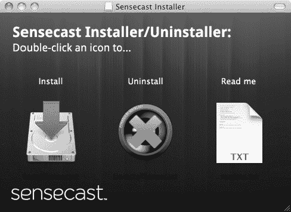

***图 3-2.** Sensecast 安装程序窗口*

##### 步骤 2：安装依赖项

接下来，你需要运行安装程序来设置`Sensecast`、`OpenNI`、`NITE`以及你的 Kinect（或类似传感器）设备驱动程序的正确版本。双击安装程序，同意条款（如果你想的话），然后按照安装过程的指示操作。安装程序会询问你想将`Sensecast`的数据存储在哪里，如图 3-3 所示。程序的所有设置和资源都将在这个位置查找。默认情况下，它会在你的“文档”文件夹中创建一个`Sensecast`文件夹。

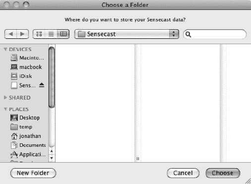

***图 3-3.** Sensecast 安装程序对话框*

在安装过程的最后步骤中，你大概应该拒绝“在启动时运行`Sensecast`”的高级选项（该选项适用于已部署的`Sensecast`安装），然后选择你想要设置的传感器，如图 3-4 所示。

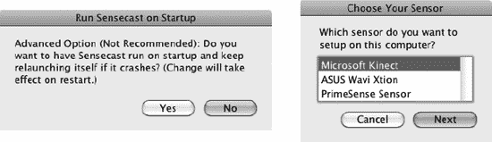

***图 3-4.** Sensecast 安装程序对话框最后步骤*

当安装程序完成后，继续操作并退出。现在，与其他 Mac 应用程序一样，`Sensecast`在你的“应用程序”文件夹中放置了一个应用程序图标。找到它，插入你的 Kinect，准备就绪后双击！

##### 步骤 3：启动 SenseCast

启动`Sensecast`来看看应用程序开箱即用时的效果。一个运动控制的图片和新闻浏览器会出现，如图 3-5 所示。现在，你的整个屏幕都充满了 Kinect 内容带来的乐趣！

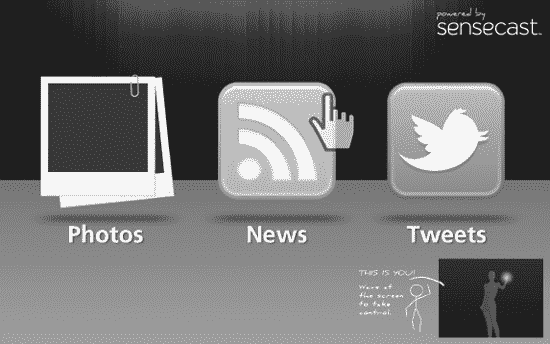

***图 3-5.** Sensecast 应用程序随附的软件画面*

##### 步骤 4：尽情享受吧！

默认情况下，`Sensecast`仅使用`OpenNI`/`NITE`的手部追踪机制进行导航，并且在开始追踪你的手之前需要一个“聚焦手势”。如果你站在显示屏前并稍微移动一下，系统会提示你“挥动你的手来回摆动以控制屏幕”。继续对着屏幕挥手，直到看到手部光标出现，并且反馈图像指示它现在正在追踪你的手。现在，正如 Xbox 的人所说，你就是控制器！

花点时间探索一下`Sensecast`演示。通过用手部光标漫游界面，找到悬停控制和滑动控制。浏览一下示例内容。这个演示向你展示了基本元素和交互方式，你可以利用它们通过挥手魔法让自己的内容同样易于导航。如果你对此类事情感兴趣，可以访问`http://sensecast.org`了解如何自定义`Sensecast`并查看更多示例。

### 超人七号

你是否曾梦想征服宇宙乃至更远的世界？试试这款专为 Windows 设计的 `Ultra Seven` 程序，它将把你变身为一位星际战士。`Ultra Seven` 是 20 世纪 60 年代同名电视剧中一位广受欢迎的日本超级英雄。他是一名来自 M-78 星云的战士，在执行绘制银河系地图的任务时，对地球心生眷恋。`Ultra Seven` 拥有多个标志性动作，非常适合利用 `Kinect` 的手势识别功能来施展。

`Kinect-Ultra` 适用于 CPU 和 GPU 性能较强、支持 `OpenGL 2.0` 及以上版本且具备可编程着色器功能的 `Windows` 个人电脑。如果你的机器满足这些要求，运行它应该不会有什么大问题。如果不满足，请跳过此应用和 `Kamehameha` 应用。此应用位于 `OpenNI Arena`，可在 [`http://bit.ly/ultraseven`](http://bit.ly/ultraseven) 找到。

该项目的原始页面（你可以在那里阅读更详细的说明、更新并观看示例视频）位于 [`http://code.google.com/p/kinect-ultra/`](http://code.google.com/p/kinect-ultra/)。请检查你安装的 `OpenNI`、`NITE` 和 `SensorKinect` 版本是否与文档中指示的该应用兼容。

按照这些说明操作并准备好所有必需组件后，请插入你的 `Kinect`，将其连接到电脑，然后打开应用程序。确保传感器能清晰看到你，并且你有足够的空间自由移动。如果遇到问题，请查阅位于 [`http://code.google.com/p/kinect-ultra/wiki/FAQ_en`](http://code.google.com/p/kinect-ultra/wiki/FAQ_en) 的常见问题解答。

做出校准姿势（双臂举起至头部附近），将向传感器发出信号，为你“穿上”`Ultra Seven` 的服装。图 3-6 展示了这个变身的预期效果。现在，你的身体将身着红色服装，你的“骨架”可见，一个莫西干头式的回旋镖状的物体栖息在你的头顶。你现在已经准备好与怪物、外星人以及你的猫战斗了。

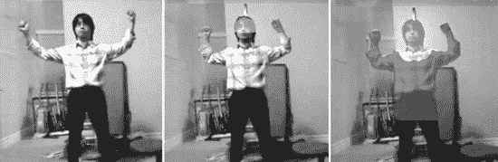

***图 3-6.** 校准姿势让你变身成 Ultra Seven！*

装饰在你头顶的冠冕被称为“Eye Slugger”。这个时尚的头饰可以兼作可拆卸武器。将你的手伸到脑后，然后向前猛推，即可将这个武器掷向你面朝的方向。别担心，它也会回到你手中。

你也可以将 `Eye Slugger` 置于半空中。伸出左臂让 `Kinect` 知道你的意图，然后用右手抓住武器，将其放置在你面前。现在，你可以像图 3-7 所示的那样，用你的前臂做出劈砍动作，用武器攻击你的对手、猫或脏衣篮。

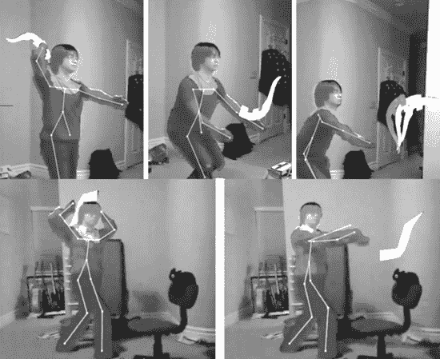

***图 3-7.** 上行：演示如何投掷 Eye Slugger；下行：高级 Eye Slugger 操作*

`Ultra Seven` 的另一个绝技是“Wide Shot”，它允许你通过双臂摆成 `L` 形来发射一股超级能量流。将你的左臂弯曲横于胸前，右臂从肘部向上竖直，手掌向上。能量流将沿着你身体所朝向的方向射出。`Kinect` 感应到的前景物体不会被能量流击中；相反，能量流会绕过这些物体继续前进。

最后，你还可以使用你的“Emperium Beam”。在电视剧中，这道能量射线会从 `Ultra Seven` 额头上的绿色宝石中射出。将你的手指放在额头两侧，以发出光束信号。瞄准！发射！图 3-8 展示了这些流畅的动作。

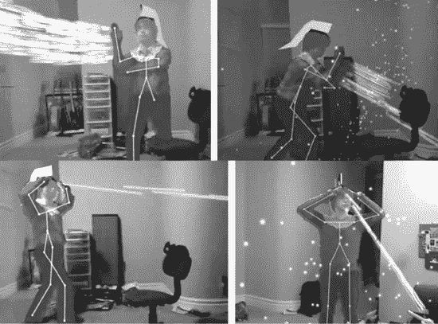

***图 3-8.** 上行：通过姿势触发的强大能量流；下行：Emperium Beam 实战*

玩耍几分钟后，你的超级英雄斗篷会开始闪烁，表示 `Ultra Seven` 离开地球的时间到了。在电视剧中，奥特曼只能在地球上停留很短时间。当你开始闪烁时，蹲下然后向上猛冲。你的化身将直冲屏幕顶部，想必是再次返回 M-78 星云。

### 卡美哈梅哈

由同一位开发者（Tomoto Washio）开发的类似应用，允许你变身为超级赛亚人。如果你不熟悉《龙珠 Z》系列，超级赛亚人是一种强大的、由愤怒引发的变身，赛亚人的高级成员在特殊情况下可以达成。变身的最终效果是产生燃烧般的金色光环和违背重力的头发，如图 3-9 所示。

此应用也可在 `OpenNI Arena` 获取。网站短链接为 [`http://bit.ly/arkamehameha`](http://bit.ly/arkamehameha)，更多信息可在项目页面 [`http://code.google.com/p/kinect-kamehameha`](http://code.google.com/p/kinect-kamehameha) 找到。与之前的超级英雄应用类似，`Kamehameha` 仅在性能更强的 `Windows` 个人电脑上运行。请遵循网站上的说明和建议。确保你安装了正确版本的 `OpenNI`、`NITE` 和 `SensorKinect`。准备好后，插入 `Kinect`，将其连接到电脑，然后打开应用程序。

站在 `Kinect` 传感器前，让你的身体可见，采用标准的校准姿势：双臂举至头部附近，双肘弯曲，如图 3-9 所示。给传感器一些时间来找到你的身形。你应开始闪烁，很快一个光环和一头电光四射的头发将出现在你周围。如果传感器难以找到你，请尝试切换到聚会模式以便更轻松地校准。

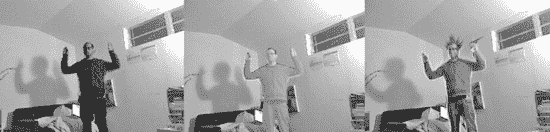

***图 3-9.** Kamehameha 校准与变身*

`Kamehameha` 是夏威夷第一位国王的名字。据称他出生于 1738 年左右，当时哈雷彗星正在天空中进行其炽热的旅程。这个时间点意义重大，因为当时的传说提到，一位伟大的国王将在彗星之下诞生，并统一诸岛。

在《龙珠》系列中，`Kamehameha` 指的是一种标志性的能量攻击，这正是你将通过此应用能够施展的招式。施展 `Kamehameha` 时，使用者将双手合拢置于身前，将其潜在能量集中到合拢双手之间的一个点上，然后将双手向前猛推，射出一股连续而强大的能量光束。首先，将你的双手紧紧靠在一起，以便传感器能看到它们。你会看到双手之间形成一个白色光球，看起来应该类似于图 3-10 系列图片中的第一张。

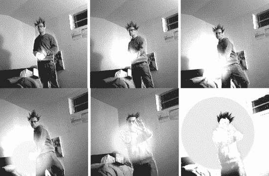

***图 3-10.** Kamehameha 攻击*

保持双手合拢，弯曲膝盖以降低重心。这个动作应会发出信号，使光球强度增加。然后，你可以将能量球从手中推向任何方向。以可控的动作伸直双臂，并使其保持朝向目标的方向，看看会发生什么。

如果动作检测效果不佳，请尝试切换到聚会模式。请注意，这项技术都相对较新，有人可能会称之为尖端技术，因此开发者仍在努力解决其中的问题。`Kamehameha` 并非大型游戏工作室为 `Xbox` 销售而推出的作品，因此可以理解它尚未像商业程序那样完善。`Tomoto` 的这两款 `Kinect` 应用值得注意，因为它们是最早真正发挥运动控制能力的一批应用之一。此外，`Tomoto` 以开源许可证形式提供了所有代码，供人们修改和学习。

### 身体畸形恐惧症

这款仅适用于 Mac 的应用使用 `Cinder` 创意编码框架构建，虽然简单，但相当有趣。基本上，你可以实时让自己看起来变胖或变瘦。`身体畸形恐惧症`是一种心理障碍，大约影响 1% 的人口，导致患者过度关注自己外表上感知到的缺陷。使用由 `Robert Hodgin` 创建的这个程序，以`棉花糖人`的形式看看自己、你的猫和这个世界。

下载该程序的快捷链接是 [`http://bit.ly/dysmorphia`](http://bit.ly/dysmorphia)，你可以在 [`http://roberthodgin.com/`](http://roberthodgin.com/) 和 [`http://www.flight404.com/`](http://www.flight404.com/) 上了解更多关于创建者的信息。查看第一个网站上的说明，并点击链接下载应用程序。请记住，此应用程序仅适用于 Mac 操作系统。在打开应用程序之前，请确保你的 `Kinect` 已插入并连接到你的计算机。一旦绿灯可见，你就可以启动应用程序并开始玩了！

打开程序后，你会立即看到 `Kinect` 视场范围内的物体实时变形。在屏幕的左下方，你会找到一个用于进行各种图像调整的按键说明。按住 `P` 键可以膨胀你的拍摄对象，按住小写 `p` 键可以缩小它。基本上，通过增加或减少点云中点的半径来操纵来自 `Kinect` 的数据。当你将点扩展成蓬松的肿块和团块时，会产生一种滑稽和卡通的视觉效果。不要期望获得逼真的图像，而是使用按键以各种方式调整颜色和纹理，享受其中的乐趣。

按下 `b` 或 `B` 键将调整应用于图像的模糊量。按住大写 `B` 键增加模糊会沿着表面平滑点，使图像不那么凹凸不平。尝试不同的模糊级别，找到与你喜欢的蓬松程度相匹配的量。如果你将模糊调到最大，图像将看起来非常印象派并失去细节，特别是当你同时调高蓬松度时，如 图 3-11 所示。同时增加模糊和蓬松度也会抹去深度感。

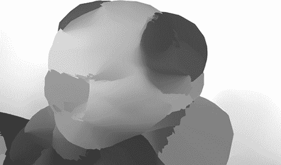

**图 3-11.** 身体畸形恐惧症玩具显示用户处于完全膨胀和模糊状态

请记住，`Kinect` 的可用范围有限，大约为 2 英尺到 20 英尺。因此，如果你离传感器太近或太远，变形滤镜将无法工作。使用此应用程序的理想范围大约是 5 英尺到 10 英尺。

在屏幕底边的按键说明旁边，你会找到红外传感器生成的灰度深度图。任何超出 `Kinect` 可记录范围的内容都将显示为黑色，如 图 3-12 所示。你可以使用这个指南，并知道任何显示为黑色的内容都将被裁剪，且不受变形滤镜影响。

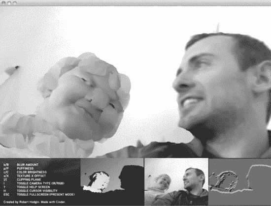

**图 3-12.** 身体畸形恐惧症玩具对左侧深度传感器范围内的用户施加蓬松效果，但对右侧离传感器太近的用户不生效。

你还可以通过调整裁剪平面来控制屏幕上可见的内容。你可以进行调整以减小可用深度，这是一种将拍摄对象与充满物体的背景隔离开来的简单方法。只需调整裁剪平面，使其仅包含你感兴趣的拍摄对象，从而裁剪掉你想要丢弃的前景或背景元素，如 图 3-13 所示。

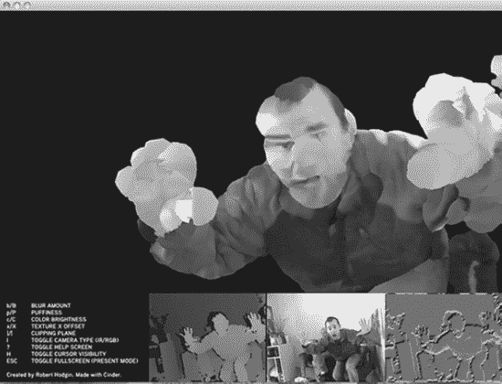

**图 3-13.** 用于裁剪背景信息的身体畸形恐惧症应用

`Hodgin` 的身体畸形恐惧症应用展示了如何以新颖但非常直接的方式使用摄像头和深度图数据流来提供娱乐体验，甚至无需使用手势识别器和身体数据映射。我们将展示的下一个应用，在将相同数据与更复杂的 3D 场景重建算法结合时，将揭示其另一种使用层次。

### MatterPort

借助 MatterPort 软件，摄影正迈向其立体三维的未来。前往 [`http://matterport.com`](http://matterport.com) 下载该应用程序，目前仅适用于 Windows 系统。此程序可让你轻松拍摄物体或整个场景的立体快照，然后将它们拼接在一起，形成一个可从各个角度观看的单一 3D 模型。

快照会根据你的移动自动拍摄。其理念是，你手持 Kinect 设备在房间内走动。每当你移动到一个新位置并暂停时，就会自动拍摄一张照片。该软件与 Kinect 协同工作，能够检测你的移动和暂停，并在每次暂停时拍照。这样，你无需反复回到键盘前，就能捕捉整个场景。

每次拍照后，系统会显示整个场景的粗略对齐情况。然后，你可以填充遗漏的区域。一旦基本对齐完成，程序会花一些时间优化对齐，以实现最佳的视觉质量。

首先，插入你的 Kinect，将其连接到电脑，然后打开 MatterPort 软件。在屏幕右侧，你会看到 MatterPort 控制面板，如图 3-14 所示。屏幕顶部的图像显示的是实时摄像头视图，即 Kinect 当前正对着的画面。下方的图像是上一次成功捕捉的画面，当你开始捕捉另一个不同图像时，它会更新显示过去的捕捉点。在捕捉场景的过程中，你将使用屏幕面板底部的控制按钮。`START` 是一个开关按钮，用于启动捕捉，你也可以用它来暂停和恢复进程。`Backup` 按钮可让你返回并移除系列中的最后一次捕捉。`Restart` 按钮可让你从头开始。右侧的控制按钮用于优化模型、保存模型和加载文件。

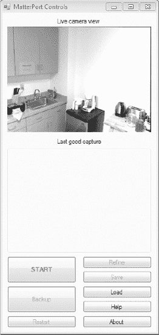

***图 3-14.** MatterPort 实时摄像头视图、上一次成功捕捉画面以及各种控制按钮*

要捕捉你所在的房间，请站在房间中央，将 Kinect 对准一个角落。点击 `START`，MatterPort 将开始捕捉图像，如图 3-15 所示。如果需要在过程中暂停一下，你可以点击 `START`，它在捕捉开始后起到 `PAUSE` 按钮的作用。

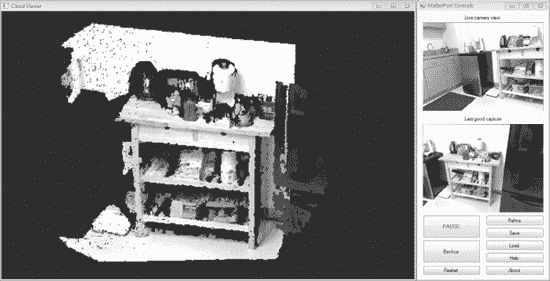

***图 3-15.** 控制面板左侧的 MatterPort Cloud Viewer 窗口，显示已开始捕捉，并展示了一次成功捕捉的画面*

当图像被捕捉时，应用程序会发出声音。一旦你听到声音，控制面板的 `Last good capture`（上一次成功捕捉）区域会出现一张截图。这个画面显示的是刚刚完成的扫描。继续扫描时无需查看屏幕。每次听到捕捉提示音，你可以快速将 Kinect 移动到新位置，以覆盖房间内更多区域。新位置应与上一次捕捉的至少部分区域重叠。随着更多图像被捕捉，它们将自动在合成图像中对齐。

图 3-16 展示了随着拍摄更多照片，3D 模型是如何构建的。最近一次捕捉的全分辨率画面将显示在 MatterPort 控制面板左侧的 `Cloud Viewer`（云查看器）窗口中。模型的其余部分将以降低的分辨率显示。你可以在图 3-16 中看到，`Cloud Viewer` 中图像最清晰的部分对应于右侧控制面板中的 `last good capture`（上一次成功捕捉）图像。

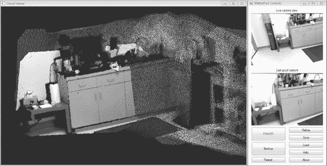

***图 3-16.** MatterPort 捕捉进行中，显示上一次成功捕捉画面与传入的捕捉信息对齐*

如果你移动 Kinect 过快，对齐将会失败。在这种情况下，移动摄像头，使其视图与上一次成功捕捉的画面相似。如果程序未能在项目之间建立正确的对齐，你可以反复点击 `Backup` 以回退，直到移除错误的对齐。在捕捉了大量画面后，物体可能只能粗略对齐，如图 3-17 所示。

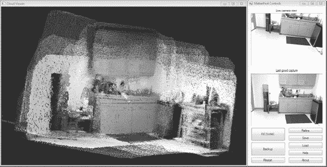

***图 3-17.** MatterPort 显示粗略对齐的 3D 捕捉结果*

使用鼠标从不同角度浏览合成图像。较小的未对齐是可以接受的，因为可以通过点击 `Refine`（优化）来修复，从而产生如图 3-18 所示的最终结果。然而，较大的未对齐通常需要通过点击 `Backup` 来移除，直到对齐问题消失。此最终截图将继续显示一个降低分辨率的点云，但一个最终的全分辨率点云将被写入磁盘。别忘了保存你最终的合成图像！MatterPort 将你的合成图像保存为 `.ply` 文件中的点云，该文件可以在 Meshlab 中打开，你可以在 [`http://meshlab.sourceforge.net/`](http://meshlab.sourceforge.net/) 找到它。

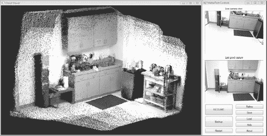

***图 3-18.** MatterPort 显示通过使用 Refine 按钮增强的粗略网格*

现在，你已经了解了其他用户创建的一些不同应用程序，开始思考如何着手设计自己的应用吧。在接下来的章节中，你将熟悉各种开发环境，并体验将想法付诸实践的感觉。

