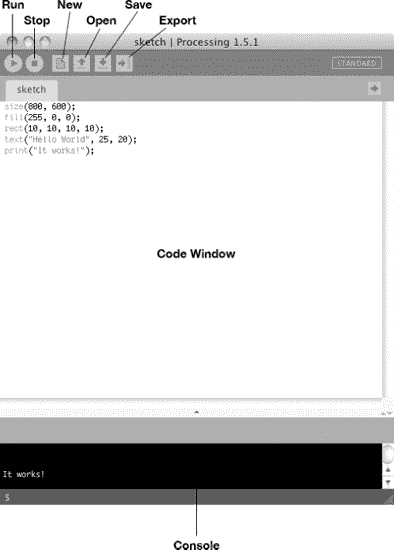
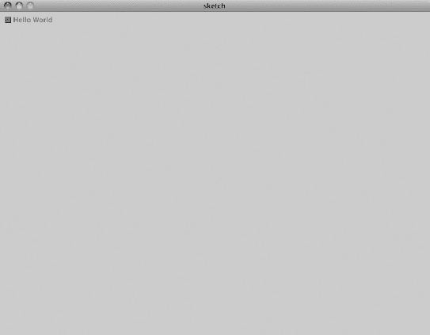
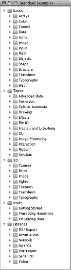
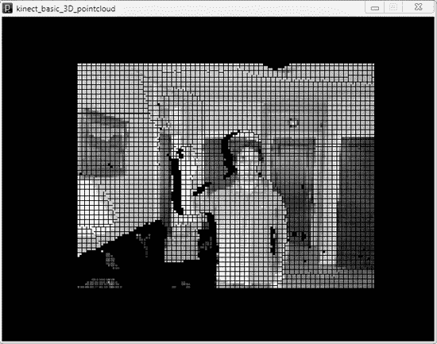
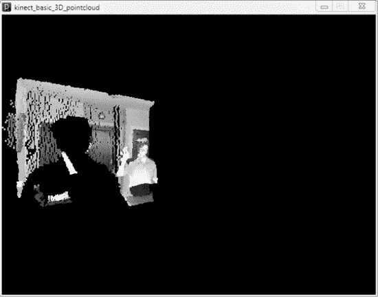

# 第 4 章：对 Kinect 进行脚本编程

现在你已经见识了 Kinect 的一些功能，是时候让它为你所用了！在本章中，我们将使用跨平台、对新手友好的 Processing 编程环境——以及一些由天才编写的 Kinect 库——来从 Kinect 传感器获取深度信息，并进行我们自己的渲染和分析。听起来很神奇吗？准备好让自己惊叹吧。

## Processing

首先，回应一下那些心里在想“呃，为什么选 Processing？”（或者更可能的是，“呃，Processing 是什么？”）的人。Processing 是一种小巧、自成体系的编程语言和集成开发环境（IDE），它于 2001 年出自著名的麻省理工学院媒体实验室。它由本·弗莱和凯西·瑞亚斯创建，当时他们两人都是约翰·前田研究小组的学生。

最初，Processing 被设想为视觉艺术家的软件速写本，旨在简化视觉应用程序的基本计算机编程。如今，Processing 是一个用于各种交互式应用的免费开源软件平台。它拥有大量用户贡献的库，并积极维护、改进，被成千上万的艺术家、开发者、爱好者和学生使用。

### Processing 能为你做什么

Processing 本质上是一个 Java 应用程序，因此可以做 Java 能做的一切：绘制和动画化 2D 和 3D 图形；处理图像、声音和视频；读写数据；通过 HTTP 通信；当然，还包括处理来自 Kinect 传感器的数据。但 Processing 拥有脚本语法和简化的函数调用，使得新手易于上手，对某些类型的专业编程人员来说也很高效。它是“自成体系的”，因为它会在你的计算机上运行自己的 Java 虚拟机（JVM）实例，所以设置起来非常简单：只需下载并启动即可。与 Java 一样，Processing 可跨 Windows、Mac 和 Linux 操作系统运行。

那么，再问一次，为什么是 Processing？如果这是你第一次踏入计算机编程的兔子洞，那么 Processing 是最简单的选择。它是通往黑客世界的入门毒品。但是，即使你是一个能自己编写汇编器技巧的 C++ 高手，Processing 仍有其魅力所在：“速写本”的比喻和可插拔的库是探索全新领域（比如新的 3D 视觉硬件）的便捷途径！


### 下载、安装与探索

如果你已经熟悉其他 IDE，如 Visual Studio、Xcode、Eclipse，甚至是 DreamWeaver 等 Adobe 产品，那么这将成为你经历过的最简单的编程环境搭建过程！但如果这是你第一次使用 IDE，那就咬咬牙忍忍吧，没有比这更简单的了。在本节中，我们将下载并安装 Processing，运行一些快速测试代码以确保一切正常，然后探索 IDE 的配置、文件系统以及一些内置的示例草图，以便你了解 Processing 能做什么，以及你能用 Processing 和 Kinect 做什么。

要下载 Processing，请访问 [`http://processing.org/download`](http://processing.org/download)，在那里你可以找到针对各大主流操作系统（Windows、Mac OS X 和 Linux）的下载包，此外还有一个针对 Windows 的额外下载选项，供那些希望设置并使用独立于内置 JVM 的用户使用（不推荐）。点击适合你的下载链接。

与你之前可能安装过的许多软件不同，Processing 没有单独的安装程序。下载后，你只需解压所有压缩文件，将它们移动到计算机上存放应用程序的任意位置（通常在 Windows 上是 `C:\Program Files\Processing\`，在 Mac OS X 上是 `/Applications/Processing/`，在 Linux 上是 `~/Applications/`），然后启动程序即可。大功告成！嗯，差不多。

最好尝试构建一个超级简单的脚本，以确保一切运行正常，那我们就开始吧。启动 Processing 后，你会看到一个空白的代码窗口，就像图 4-1 所示，打开了一个新的“草图”。让我们运行第一个脚本来确认配置正确。在代码窗口中写入以下五行代码，如图 4-1 所示，然后点击 `Run`。`Run` 按钮是应用程序窗口左上角的圆形“播放”按钮。你应该会看到类似图 4-2 所示的结果。

```
size(800, 600);
fill(255, 0, 0);
rect(10, 10, 10, 10);
text("Hello World", 25, 20);
print("It works!");
```



***图 4-1.** Processing 的应用程序窗口*



***图 4-2.** 我们的“Hello World”示例的输出*

我们的小示例脚本生成了一个宽 800 像素、高 600 像素的新应用程序窗口。然后它在窗口中以 (x, y) 坐标空间的 (10, 10) 为起点绘制了一个 10x10 像素的红色矩形，并在该矩形旁边渲染了文本“Hello World”。最后，脚本在控制台打印了一条成功消息。明白了吗？很好。为了使用 Processing 控制 Kinect，我们再深入准备一点。

### Processing 库与草图

由于我们将在本章中花一些时间使用 Processing 编写脚本并添加由第三方编写的 Kinect 库，现在花点时间浏览 Processing 主发行版中包含的数十个有用库和示例草图，你将不会后悔。这些示例将让你了解 Processing 的工作原理及其能力，以及更广泛的 Processing 用户社区如何扩展这些能力，从而创建一个强大的、用于编程交互的自由软件平台。

#### 内置示例

首先，浏览 `File  Examples` 下打开的大量列表……它应该像图 4-3 所示的列表。打开“Topics”下你感兴趣的一个草图。想要渲染炫酷的视觉效果？请查看“Effects”下的 Firecube 示例。想要构建自己的图形用户界面 (GUI)？看看“GUI”主题下是如何实现简单的按钮和滚动条元素的。对复杂而炫酷的物理效果感兴趣？试试“Motion”示例中的几个。



***图 4-3.** Processing 中的示例“调色板”*

一旦你看到足够多的内容，确信 Processing 值得你投入时间，那么我们在连接 Kinect 之前最后再窥探一下内部原理。具体来说，让我们看看 Processing 的文件组织方式，以及如何利用网络上的免费代码库自行扩展应用程序的功能。

#### 添加库

Processing 库的一个全面但不完整的索引位于 [`http://www.processing.org/reference/libraries/`](http://www.processing.org/reference/libraries/)。有一些很棒的库可以帮助你的 Processing 代码与硬件交互、进行高级 3D 工作，并连接到其他极其有用的非 Processing 代码库（例如开源计算机视觉库 OpenCV）。如果你再次使用 Processing，你无疑会想知道如何添加这些免费贡献的代码。

当你首次启动 Processing 时，会创建一个以命名约定 `sketch_datex` 命名的草图。如果你一直跟着操作，你已经创建了一个 5 行的“Hello World”脚本。现在，让我们将该草图保存到“Sketchbook”中。继续点击 `Save`。Processing 会在操作系统的文档主文件夹内创建一个 sketchbook 文件夹，具体位置取决于系统设置，例如 Windows 上的 `C:\My Documents\Processing\` 和 Mac OS X 上的 `/Documents/Processing`。在 Processing 的“Preferences”面板中，你可以查看并更改 sketchbook 在文件系统中的位置。无论如何，请找到它的位置并浏览到该路径。

你的 Processing sketchbook 只是一个文件夹，其中包含你创建或从第三方添加的任何草图或库。你现在应该会看到其中有一个名为 `sketch_datex` 的文件夹，或者如果你给草图命名了，则显示你命名的名称。每个 Processing 草图都有自己的文件夹，这有助于将所有相关文件和资源保存在一起。

由于你尚未向 Processing 添加任何贡献库，因此你的 sketchbook 文件夹中不会有“libraries”文件夹。现在让我们解决这个问题。在你的 sketchbook 文件夹中创建一个名为“libraries”的文件夹。请注意，你必须将此文件夹命名为“libraries”，因为这是 Processing 查找的特定名称。在下一节中，你将把下载的 Kinect 库文件放入其中，重新启动 Processing，瞧！库就安装好了。每次 Processing 启动时，它都会搜索 sketchbook 文件夹中的内容进行加载。草图会排列在 File > Sketchbook 下的弹出菜单中。贡献库则排列在 Sketch > Import Library... > Contributed 下。每当你像这样向 sketchbook 和 libraries 文件夹添加文件时，都必须重新启动 Processing，新库才能在你的草图中可用并显示在菜单中。事不宜迟，让我们添加 Kinect 库并开始为 Kinect 编写脚本吧！


### 最终连接 Kinect

遗憾的是，PC、Mac 和 Linux 用户在此必须分道扬镳了。截至撰写本文时，还没有一个能在所有平台上实现全部功能的 Processing 版 Kinect 库。但这种情况将会改变（如果你读到这本书时尚未改变的话）！Processing 正由一个专注的黑客社区不断扩展，并且有一个特别活跃的团体致力于释放 Kinect 及类似传感器的威力。当你对它的工作原理感到得心应手后，甚至可以浏览 [`http://www.processing.org/reference/libraries/`](http://www.processing.org/reference/libraries/) 寻找除我们下面使用的项目之外的其他 Kinect 项目。

我们在此使用两个 Kinect-for-Processing 库：Thomas Diewald 为 Windows 开发的 `dLibs` 和 Daniel Shiffman 为 Mac 开发的 `openkinect`。这两个项目都利用开源 `libfreenect` 项目的驱动和库实现了 Kinect 的部分功能，`libfreenect` 是 [`http://openkinect.org`](http://openkinect.org) 上 OpenKinect 社区的巅峰成就（迄今为止！），并在引言中提到过。尽管本书大部分内容涉及源自商业企业且部分或完全专有的代码库，但本章完全基于世界各地才华横溢的黑客共享的自由开源软件（FOSS）。在按照 Windows、Mac 和 Linux 的具体说明进行操作之前，先沉浸在这种氛围中吧！

## Windows 上的 Processing 版 Kinect

既然我们已经安装了 Processing，要让 Kinect 在你的 PC 上与之配合工作，只需安装一些兼容驱动并运行一些示例代码即可。为此，我们求助于 Thomas Diewald 的 `dLibs` 项目。

### 添加 dLibs

我们开始吧。浏览 GitHub 上的 `dLibs` 代码仓库：[`https://github.com/diwi/dLibs`](https://github.com/diwi/dLibs)。点击“Downloads”并选择 `.zip` 包下载到你电脑上的某个位置。解压文件夹，里面你会看到一份 `README` 文档和一个名为 `dLibs_freenect` 的文件夹。将整个 `dLibs_freenect` 文件夹复制或移动到 Processing 草图本文件夹内你新建的 `libraries` 文件夹中。接下来，对 Jonathan Feinberg 的 `PeasyCam` 库执行完全相同的操作，`dLibs` 在其包含的一些示例中使用了这个库。从 [`http://mrfeinberg.com/peasycam/#download`](http://mrfeinberg.com/peasycam/#download) 下载 zip 归档文件，并将 `peasycam` 移动到你的 `libraries` 文件夹中。呼！文件夹换位折腾了不少，但就这样了！重新启动 Processing，你应该会看到草图（Sketch）→ 导入库（Import Library...）→ 贡献（Contributed）中现在可以找到 `dLibs_freenect` 和 `peasycam`。

### 更新驱动

在我们将 Kinect 驱动更新到它所需的 `libfreenect` 驱动之前，无法使用这个库。如果你已经为 Windows 安装了一些 Kinect 驱动（例如，在第一章运行 `RGBDemo` 时），我们将在此把它们更新为使用 `libfreenect`。幸运的是，它们已经预编译好并包含在 `dLibs` 下载包中。不幸的是，你可能还需要安装免费的 5MB 版 Microsoft Visual C++ 2010 Redistributable Package，它提供了使用 Visual C++ 2010 编译的软件所需的运行时组件，而这些 `libfreenect` 文件就是用 Visual C++ 2010 编译的（请注意，如果你已经安装了 Visual C++ 2010，则不需要此包）。从 [`http://www.microsoft.com/download/en/details.aspx?id=5555`](http://www.microsoft.com/download/en/details.aspx?id=5555) 获取，或者如果链接变了，搜索“Microsoft Visual C++ 2010 Redistributable Package”。下载该包并运行安装程序。

现在，确保 Kinect 已连接到 PC，并且电源线已插入墙壁插座。当硬件连接上时，Windows 会启动一个向导来为三个组件安装驱动——XBox NUI Motor、XBox NUI Audio 和 XBox NUI Camera——或者如果你已经安装了一些驱动或者其他情况，就停止搜索。你可以从设备管理器（控制面板 → 系统 → 设备管理器）自行启动该向导。找到这三个“XBox”组件，它们可能位于“人体学输入设备”（如果已安装）下，或者带有大黄色问号位于“其他设备”（如果未安装）下。如果你之前已经通过 OpenNI 或 Microsoft Kinect SDK 安装了其他 Kinect 驱动，你可能会看到这些设备在设备管理器中设置在不同的标题下。右键点击每个组件并选择“更新驱动软件...”。截至撰写本文时，Windows 无法通过 Windows 更新找到 Kinect 的驱动，你也不希望它这样做。相反，将驱动安装向导指向 `dLibs_freenect/library` 内的 `kinect_driver_windows` 文件夹。一旦所有三个驱动都添加完毕，我们就可以启动一个 `dLibs` 示例了。

#### 运行点云示例

在 Processing 中，通过文件 → 示例...（Processing → Examples...），你现在应该会在贡献库下看到一些额外的示例。为了与第一章的 `RGBDemo` 进行比较，我们先来看一下 `dLibs` 的“点云”示例：`kinect_basic_3d_pointcloud`

打开并运行该示例。开箱即用，草图的输出应该如图 4-4 所示。如果你在窗口内点击并拖动或使用鼠标滚轮，你可以改变图像/深度数据上的“相机”视角（感谢 `PeasyCam`！），达到类似图 4-5 所示的效果。你会注意到这个草图的输出与第一章的 `RGBDemo` 非常相似，只不过现在你可以看到脚本并直接在 Processing 中编辑它了！



***图 4-4.** 直接运行的 dLibs 点云草图*



***图 4-5.** 通过在窗口内点击并拖动改变视角后的 dLibs 点云草图*


