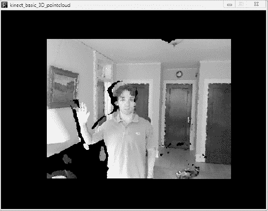
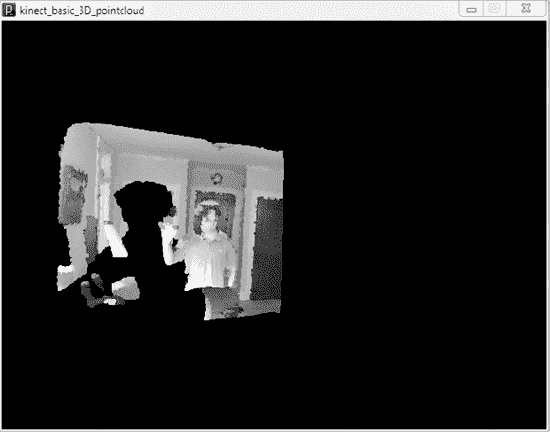
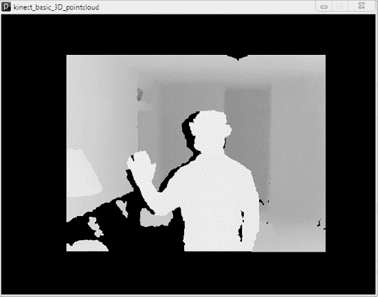
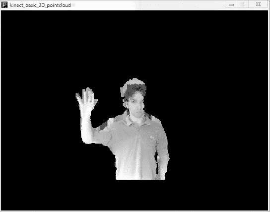
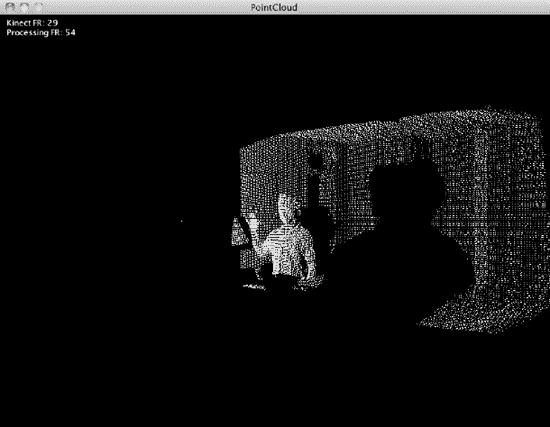
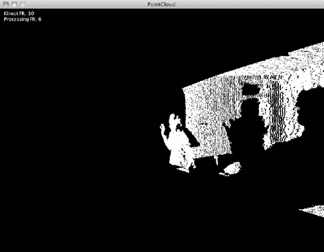
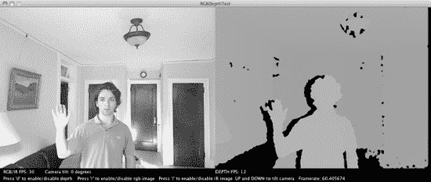
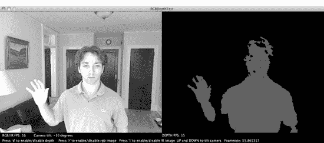

# 点云草图的作用

一个典型的、非常基础的 Processing 草图由 `setup()` 函数（在开始时调用，用于设置草图使用的任何参数或流程）和 `draw()` 函数（在主循环中运行，不断绘制和重绘你指定的任何元素，无论是静态还是动画）组成。点云草图遵循这一约定，但额外进行了一些操作：一些初步的库导入语句和变量声明、用于 PeasyCam 的初始化例程（PeasyCam 用于控制虚拟“相机”，即渲染的 3D 场景的视角），以及 `drawPointcloud()` 这个自定义函数，用于获取 `Kinect3D` 对象中的所有点并进行绘制。此外，还有一个 `stop()` 函数，在草图终止时被调用。

查看代码并尝试理解其作用几乎总是很有启发性的。例如，这里是 `drawPointcloud` 函数的原始代码以及它使用的一些变量：

```
Kinect3D k3d_;

int kinectFrame_size_x = VIDEO_FORMAT._RGB_.getWidth();
int kinectFrame_size_y = VIDEO_FORMAT._RGB_.getHeight();

void drawPointcloud(){

  KinectPoint3D kinect_3d[] = k3d_.get3D();

  int jump = 5;

  int cam_w_ = kinectFrame_size_x;
  int cam_h_ = kinectFrame_size_y;

  strokeWeight(3);

  for(int y = 0; y < cam_h_-jump ; y+=jump){
    for(int x = 0; x< cam_w_-jump*2 ; x+=jump){
      int index1 = y*cam_w_+x;

      if (kinect_3d[index1].getColor() == 0 )
        continue;

      stroke(kinect_3d[index1].getColor() );

      float cx = kinect_3d[index1].x;
      float cy = kinect_3d[index1].y;
      float cz = kinect_3d[index1].z;
      point(cx, cy, cz);

    }
  }
}
```

我知道你心里在想什么：`Kinect3D` 对象？那是什么，在哪里？还有 `drawPointcloud()` 函数里面的 `KinectPoint3D` 呢？它是从哪里来的，我怎么知道它是做什么的？这时查看 dLibs 附带的文档会很有帮助，它至少能识别出库中所有可用对象的相关属性和方法。在浏览器中打开附带的 `dLibs_freenect/reference/index.html`。

虽然文档很基础，但你可以看到 `Kinect3D` 对象管理着来自 Kinect 的数据采集，包括帧率、校准、深度和 RGB 图像等。像示例在 `drawPointcloud()` 内部所做的那样，在 `Kinect3D` 对象上调用 `get3D()` 函数会返回一个 640×480 的点或像素数组，每个点同时包含颜色（RGB）和位置（X, Y, Z）值，有时被称为 RGBZ 数据，因为它将传统的 RGB 相机数据（2D 彩色图像）与深度信息（该图像每个像素在 Z 轴上的位置）合并在一起。用于存储每个点的库对象是 `KinectPoint3D` 对象，因此草图每次调用 `drawPointcloud()` 时都会创建一个这些对象的数组并存储在其中。

```
KinectPoint3D kinect_3d[] = k3d_.get3D();
```

#### 调整示例

在你已经玩过示例之后，让我们尝试对其进行一些修改。具体来说，让我们调整 `drawPointcloud()` 函数，看看会发生什么。

##### 更高分辨率

你可以尝试的第一件事是改变渲染图像的分辨率。你可以看到整数变量 `jump` 用于跳过来自我们 `Kinect3D` 对象的每个 RGBZ 值数组中的点。尝试将

```
int jump = 5;
```

改为

```
int jump = 1;
```

渲染每一个数据点而不是每五个点中的一个将会影响程序的执行效率，你会注意到这次运行草图时帧率变慢了。不过，你也应该会注意到渲染图像中更多的细节，比如图 4-6 和 4-7 中所示。



***图 4-6.** 我们的高分辨率点云揭示了场景中一个新的细节：一只猫！*



***图 4-7.** 倾斜的高分辨率点云*

### 深度图

或者，你可能希望渲染图像显示不同类型的信息，而不仅仅是可见光 RGB 数据。例如，你可能希望将深度信息以某种方式编码到渲染中每个像素的颜色中，从而创建所谓的“深度图”。这个示例使用 Processing 的 `stroke()` 函数来渲染点云，其中描边的颜色参数取自 `KinectPoint3D`。现在，让我们改为取该像素处的深度值。

将

```
stroke(kinect_3d[index1].getColor() );
```

替换为

```
float depth = (10 +kinect_3d[index1].z)/10;
stroke(color(255* depth, 255* depth, 255* depth));
```

本质上，我们正在用基于点与 Kinect 距离的灰度值替换图像的 RGB 颜色。现在，看起来离 Kinect 较近的物体应该比较远的物体更亮。我们应该注意，`KinectPoint3D` 对象中的 Z 值以负米为单位（相机前方的距离），并且是浮点（十进制）数。所以，如果我的鼻尖距离 Kinect 正好是 1.333 米，Z 值将会像是 `-1.333333`，我们上面应用的用于获取颜色的转换也将相应地受到影响。如果你运行草图，应该会看到类似于图 4-8 的内容。



***图 4-8.** 点云草图转换为深度图*

### 阈值处理

这虽然不错，但还不是特别有用。真正释放 Kinect 潜力的是能够选择性地分析传感器前方的 3D 空间，挑选出场景中的物体和人，并理解它们正在做什么。这个物体是什么？这个人拿着物体吗？这个人在做手势吗？这些问题构成了机器视觉中一个经典主题，即场景分析，在过去的几十年里，人们利用 2D 图像对其进行了广泛的研究。有了来自类 Kinect 传感器或深度相机提供的额外深度信息，场景分析变得更容易、更稳健，可能性也随之增加。

通过非常轻微地修改这个草图，我们已经可以开始看到这些可能性。我们改变了渲染，使其颜色反映深度，但现在让我们尝试只从 Kinect 中选择某个深度范围内的像素，这种技术称为阈值处理。注意示例代码中的这两行：

```
if (kinect_3d[index1].getColor() == 0 )
        continue;
```

当 `drawPointcloud()` 循环遍历 640×480 的点数组时，这些行告诉绘制函数丢弃任何通常与物体“阴影”相关的黑色点。在下面的示例中，添加了一条额外的指令，用于丢弃任何深度超过 2 米的点：

```
if (kinect_3d[index1].z < -2)
        continue;
```

最后，我们可以用 `//` 注释字符注释掉我们之前为创建深度图所做的修改。现在，当我们运行草图时，点必须满足一定的深度阈值才能被渲染。在这种情况下，任何距离 Kinect 超过 2 米的点都将被丢弃，其中大部分可能是背景物体。如果你距离 Kinect 只有一到两米，并且你身后是干净的，那么当你运行这个草图时，你应该会看到自己相当清晰地被从身后的黑色虚空中切割出来，如同图 4-9 所示。



***图 4-9.** 阈值处理示例，使用一个校准不佳的 Kinect*

当你拥有一个能在 3D 中“看”的相机时，在 3D 空间中挑选出一个非常明确的感兴趣区域进行进一步分析就是这么简单。既然你已经有了自己的轮廓剪影，你想用它做什么？我们将在后续章节中进一步探索。


### 在 Mac OS X 上使用 Processing 控制 Kinect

与 Windows 相比，让 Processing 在 Mac OS X 上控制 Kinect 要简单一些，这要归功于 ITP 的 Daniel Shiffman，他在 Kinect 发布后数周内就发布了基于 `libfreenect` 的库。

#### 添加 OpenKinect

要安装 Shiffman 的库，只需浏览到 [`http://www.shiffman.net/p5/kinect/`](http://www.shiffman.net/p5/kinect/) 并下载 `openkinect.zip` 文件，其中包含编译好的库和一些示例草图。如果你同时查看 GitHub 上的源代码，可以更深入地研究这些示例：[`https://github.com/shiffman/libfreenect/tree/master/wrappers/java/processing`](https://github.com/shiffman/libfreenect/tree/master/wrappers/java/processing)。将整个文件夹放入 Processing 草图文件夹中的 "libraries" 文件夹内，然后按照惯例，重新启动 Processing。

#### 更新驱动程序

与 Windows 不同，在这里我们可以让 Processing 直接驱动硬件——无需单独设置 Kinect 或安装驱动。一切就绪，可以开始了！

#### 运行点云示例

让我们以参考为目的，运行附带的点云示例代码。在 "Examples... Contributed Libraries" 下的 `openkinect` 目录中，您应该能看到三个左右的示例。打开 "Pointcloud" 并点击 `Run`。您应该会看到类似 图 4-10 的画面，又是一个与 `RGBDemo` 程序相似的点云。



***图 4-10：** Shiffman 的点云草图，按原样运行*

#### 点云草图的工作原理

再次强调，我们得到了一个有点像第 1 章中 `RGBDemo` 的输出，只不过我们可以在 Processing 中操作它！此草图遵循 Processing 的惯例：使用 `setup()` 函数来设置草图所使用的任何参数或进程，以及一个在草图运行时重复执行的 `draw()` 函数，用于绘制和重绘元素。与 Windows 示例一样，其中还包含其他一些内容：导入必要库元素的 import 语句、一些变量声明、一些辅助函数（用于将来自 `Kinect()` 对象的数据转换为草图渲染所需的格式），当然，还有一个在草图终止时被调用的 `stop()` 函数。

说到 `Kinect()` 对象，呃，它到底是什么？如果您读过 Windows 示例，就会知道 dLibs 将 Kinect 的数据拆分为几个不同的类，并且该库附带了一些基本文档。`openkinect` 库也使用几个类来封装 Kinect 数据，但您只能通过附带的示例和查看源代码来了解它们。特别是，如果您想了解 `Kinect()` 对象（这是设备的主要接口），您需要在 GitHub 上查看源代码：

[`https://github.com/shiffman/libfreenect/blob/master/wrappers/java/processing/KinectProcessing/src/org/openkinect/processing/Kinect.java`](https://github.com/shiffman/libfreenect/blob/master/wrappers/java/processing/KinectProcessing/src/org/openkinect/processing/Kinect.java)

在这里，您会看到与此对象关联的属性和方法主要处理深度和 RGB 数据，例如：

- `enableDepth()`
- `enableRGB()`
- `getDepthImage()`
- `getVideoImage()`
- `getRawDepth()`
- 等等。

 **注意**  这里还有一个用于控制 Kinect 电机的接口，太酷了，因此如果您调用 `tilt(15)`，您的 Kinect 将会倾斜 15 度！但是，Kinect 内部的电机并非为连续或频繁使用而设计，它会烧毁，因此请明智地使用此功能。

#### 调整示例

在按原样体验过示例之后，让我们尝试对它进行一些修改。具体来说，让我们调整 `draw()` 函数，看看会发生什么。

##### 更高分辨率

纯粹因为它简单得离谱，我们首先可以像在 Windows 上那样更改分辨率。您可以看到，整数变量 `skip` 用于跳过来自 Kinect 的数据点，因为我们不需要每个点来渲染点云。尝试将：

```
int skip = 4;
```

更改为：

```
int skip = 1;
```

渲染每一个数据点（而不是每四个点渲染一个）会影响程序的执行，您在本次运行草图时会注意到帧率变慢。与 Windows 上我们的点云包含 RGB 值不同，这里更高的分辨率仅意味着渲染中更多的“覆盖范围”，如图 4-11 所示。



***图 4-11.** 更高分辨率下的点云草图*


## 深度图与阈值处理

点云示例看起来炫酷且功能全面，但 Kinect 及同类传感器的强大之处，更多在于它们允许我们在三维空间进行各种分析。如果你跳过了 Windows 部分，可能错过了这一点，所以我要原话重复一遍：真正释放 Kinect 潜力的关键，在于能够有选择性地分析传感器前方的三维空间，识别场景中的物体与人，并了解它们的状态。这个物体是什么？这个人是否正拿着物体？这个人是否在做手势？这类问题构成了机器视觉中一个经典课题——场景分析，过去几十年来，人们一直利用二维图像对其进行深入研究。而有了 Kinect 类传感器或深度相机提供的额外深度信息，场景分析变得更加简单、鲁棒性更强，可能性也随之增加。

说到这里，让我们打开 `RGBDepthTest` 示例，运行它，然后修改代码，进行一些基础的场景分析。



***图 4-12.** Shiffman 的 `RGBDepthTest` 程式的输出*

当你运行该程式，并通过按下 `“r”` 键启用 RGB 图像时，你将看到 RGB 图像和深度图像（有时也称为 `深度图`）并排显示，如图 4-12 所示。可以想象，当我们在场景中通过编程方式选取感兴趣的区域时，如果知道我们正在寻找的深度，操作会容易得多，精度也可能更高。

那么，我们就开始吧。我们需要在程式顶部以及 `setup` 和 `draw` 函数中添加一些代码，用我们自己的阈值处理后的深度图像替换原始深度图。

在程式顶部添加这些变量声明，以设置新的深度图像以及要显示的最小和最大深度。我们将只绘制这个范围内的像素，剔除其后的所有内容。

```
PImage threshImage;
int minThresh =  0;
int maxThresh = 750;
```

然后在 `setup()` 函数中配置新的深度图像：

```
void setup() {

  //...

```

保留所有现有代码不变，并添加

```
  threshImage = new PImage(640, 480);

}
```

在 `draw()` 函数中，注释掉现有的深度图像渲染代码：

```
//image(kinect.getDepthImage(),640,0);
```

现在，在绘图函数中添加一个例程，用于遍历所有深度像素，将阈值范围内的像素设置为一种颜色（蓝色），其余像素设置为黑色，如下所示：

```
int[] depth = kinect.getRawDepth();
  for (int i=0; i < 640*480; i++) {
    if (depth[i] > minThresh && depth[i] < maxThresh) {
      threshImage.pixels[i] = 0xFF0000FF;
    } else {
      threshImage.pixels[i] = 0;
    }
  }
```

最后，按如下方式绘制新的深度图像：

```
  threshImage.updatePixels();
  image(threshImage, 640, 0);
```

当你运行该程式时，应该会看到一个输出窗口，如图 4-13 所示。



***图 4-13.** 我们对 `RGBDepthTest` 示例程式进行阈值处理后的深度图模型*

在给定深度处对图像进行阈值处理，可以让你在空间中选取一个切片，本例中即是抓取距离 Kinect 特定距离处你自身的完美轮廓。将一些传统的机器视觉分析和算法应用于这个“团块”，正是许多 Kinect 应用程序得以运行的关键。在本章中，我们刚刚踏上这条漫长而迷人的道路，为在 Processing 中进行此类工作奠定了基础。干得漂亮！

### Processing 与 Kinect：本书之外

深入探讨你可以用 Processing 结合 Kinect 做的一切，已超出本书范围。但如果你认为 Processing 可能是你的首选工具，开放网络上还有一些优秀的资源。其中之一是 `SimpleOpenNI`，它是 PrimeSense 的 OpenNI 框架的 Processing 封装（详见第 6 章）。`SimpleOpenNI` 在 Processing 中暴露了所有函数调用和机器视觉技巧，使得构建复杂的、基于手势的界面成为可能。

但是，不要只把 Processing 作为 Kinect 破解工具箱中的唯一工具就合上这本书。外面世界更广阔。根据你想构建或实现的目标，其他语言或工具可能更适合你。在下一章中，我们将考察支持 Kinect 破解的编程环境和框架的现状，并尝试展示不同领域的黑客、艺术家、研究人员和远见卓识者，是如何在该设备发布后不到一年之内，就用它们创造出了琳琅满目的 Kinect 混合体。

