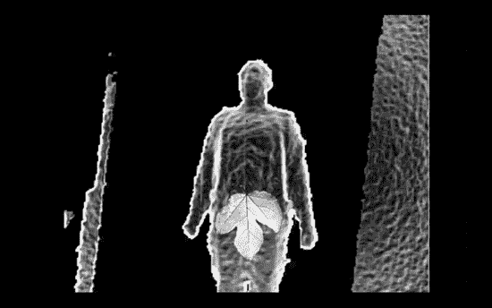
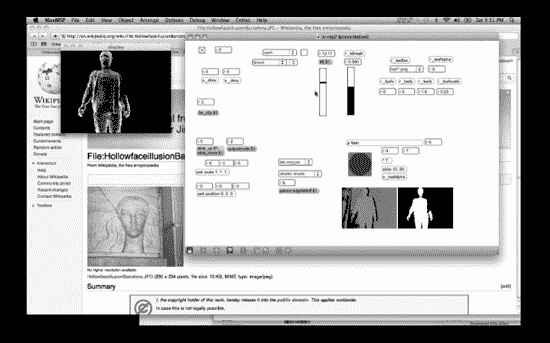
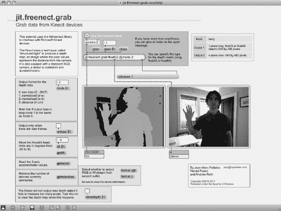
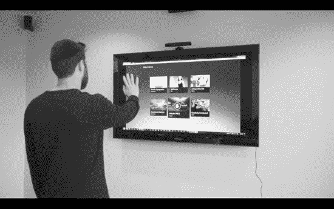

# 第 5 章：面向创作者的 Kinect

如果你关注过围绕 Kinect 发布而涌现的黑客活动热潮，你会注意到许多应用程序看起来与 XBox 上的《Kinect 冒险》完全不同。有了这一革命性设备，各行各业的创意人士构想出了他们自己的新颖用例：虚拟木偶、3D 扫描和打印工作流、手术室图像助手、能看能跟随人的机器人、手势控制的气垫船、简洁的动作捕捉绝地武士动画等等。如此多样化的应用集是如何成为可能的？

答案在于 Kinect 对创意人士的可及性：创作者在自己更专业的领域（无论是视觉艺术、表演艺术、机器人技术还是其他领域）所使用的可用软件和开发平台的组合。以下并非这些工具的完整列表，而是一些较为流行且可能有用工具的选择性清单，以及如何使用它们入门 Kinect 的概述。这些工具包括免费开源和专有商业产品，其学习曲线各不相同。如上一章所述，如果你编程新手但想学习，并且你梦想中的应用程序需要 2D 或简单 3D 动画、跨平台支持以及一些视听和网络工具，那么 Processing 很可能是合适的工具。在后面的章节中，我们将深入研究用于构建丰富手势界面和 3D 游戏（你在 XBox 上看到的或将要看到的那种）的更深入、更专业的 SDK（软件开发工具包）和开发平台。在本章中，我们考察的是庞大的 Kinect 破解工具库中另一个不同的角落：创意编码人员（和非编码人员）用来构建各种项目（从 Kinect 控制的乐器到全动作控制的 Web 应用程序）的工具。其目的是向读者你展示当前可用的、能够实现你愿景的工具的广度，无论这愿景是什么。

 **注意** 本书后续章节将讨论其他框架和平台，例如 Beckon、Unity、OpenNI 和 NITE。这些其他框架和平台本质上更具通用性，有时需要深厚的编程专业知识。本章描述的平台则专门针对创意和艺术社区。

## MaxMSP

MaxMSP 比 Adobe Flash 这类主流软件更为小众，但它为某些 Kinect 应用量身定制，例如那些将 Kinect 作为输入来控制声音或舞台灯光的应用。此外，如果你是一个高度视觉化的人，或者只是非常厌恶编码，你会想看看 MaxMSP。

MaxMSP 是收费软件。如果你预算有限或者更喜欢免费软件，可以看看 MaxMSP 的免费开源竞争对手 PureData (PD)。你可以在 `http://puredata.info/` 了解更多关于 PureData 的信息。

### 拼图式编程语言

MaxMSP 和 PD 有时被称为“拼图式”编程语言，因为它们允许你将一系列预定义的图形化音频和视频对象（包括硬件）拼合在一起，通过虚拟跳线连接和组合这些对象，从而构建完整的应用程序，无需编写一行代码（不过如果你愿意，也可以深入底层进行编码）。

然而，这*并非*意味着使用拼图式语言一定比编写代码更容易——你仍然需要理解要编程的项目的架构。事实上，可以说拼图式语言通过强制你将应用程序分解为众多离散但相互连接的部分，来贯彻良好的编程实践。毫无疑问，对于某些人和某些应用场景，拼图式编程是正确的方式。

`MaxMSP` 是一款专有软件，许可证费用约为 400 美元（学生版便宜很多），但截至撰写本文时，相较于 `PD`，将 `MaxMSP` 与 `Kinect` 结合使用有更好、更广泛可用的支持。

### MaxMSP 能为你做什么

`MaxMSP` 有时简称为 `Max` 或 `Max/MSP/Jitter`，以指代这个来自旧金山 Cycling ’74 公司的交互式编程环境的所有三个组件。尽管为方便起见，我们将名称缩写为 `MaxMSP`，但我们不应忘记 `Jitter`！`Jitter` 是用于处理“矩阵”的组件，矩阵是一个通用术语，指代包括图像和视频（因此也包括 `Kinect` 数据）在内的多维数据结构。与 `Processing` 一样，整个 `MaxMSP` 套件旨在支持深度从事音视频媒体和物理计算工作的艺术家、教育工作者和研究人员。

数字艺术家 Liubo Borissov 的“hackiscan”作品就是使用 `MaxMSP` 和 `Kinect` 创建的。图 5-1 展示了 `hackiscan` 艺术装置的输出效果。而在图 5-2 中，你可以看到应用程序在 `MaxMSP` 环境中的设置方式，我们将在后面更详细地探讨这一点。

***图 5-1.** 数字艺术家 Liubo Borissov 的“hackiscan”以老式方式确保你在机场的隐私：用一片无花果叶！*

***图 5-2.** Borissov 的 hackiscan 项目在 MaxMSP 创作环境“底层”的样子——在此观看完整视频：[`vimeo.com/17480291`](http://vimeo.com/17480291)*

### 入门：MaxMSP + Kinect

将 `Kinect` 数据导入 `MaxMSP` 的最佳可用技术来自 Jean-Marc Pelletier，他是更广泛的 `OpenKinect` 项目的一部分。请访问 Jean-Marc 的 GitHub 仓库获取最新代码：

`https://github.com/jmpelletier/jit.freenect.grab`

请务必在 GitHub 上的 Downloads>Download Packages 下载编译好的“mex”和帮助文件。将 `/jit` 文件夹放在你机器上的某个专用位置，然后启动帮助文件，即扩展名为 `.maxhelp` 的那个文件。接下来，见证 `MaxMSP` 的即插即用魔力吧！图 5-3 展示了启动帮助文件时你会看到的内容。

***图 5-3.** `jit.freenect.grab.maxhelp` 帮助文件向你呈现 Kinect 数据流以及许多可供调整的参数。*

勾选“Use live camera input”复选框并点击“Open”按钮——你应该会看到你的 `Kinect` 数据实时流入。这个帮助界面让你可以尝试各种变量：例如，你可以反转深度图的颜色，或者像我们使用 `RGBDemo` 时那样，倾斜 `Kinect` 的马达。

## Flash Actionscript

对于我们这些在 Adobe（或更早的 Macromedia）的 `Flash Actionscript` 上磨练编程技能的人来说——就像过去十年许多网页和交互设计师所做的那样——得知有几个开发者社区正在积极致力于将 `Kinect` 连接到 `Flash`，这无疑是个好消息。然而，截至撰写本文时，在 `Flash` 中使用 `Kinect` 并非易事。

但等等，我们一直听说 `Flash` 已经死了，对吧？为什么我们还要用它？事实证明，关于 `Flash` 消亡的传言被大大夸张了。是的，`HTML5` 将取代 `Flash` 在网络上的某些用途，例如视频播放。是的，`Flash` 在苹果 iOS 设备上不受支持也是出了名的，因为它可以在浏览器中直接创建丰富的、类似应用程序的交互体验（苹果无法对此收费，从而削弱了 App Store）。但 `Flash` 创作环境是一个强大且直观的集成开发环境（`IDE`），成千上万的网页设计师和开发者已经非常熟悉它。`Flash` 的输出产物 `SWF`（读作“swiff”）或 `Flash` 影片，是一种高度优化、适用于 Web 且跨平台的富媒体、动画和交互媒介，毫无疑问，它本身至少在未来几年内仍将继续存在。

### Flash 能为你做什么

那么，为什么要使用 `Flash` 来开发你的 `Kinect` 应用呢？嗯，如果你打算通过网络交付它，或者使用密集的 2D 动画和交互，或者如果你已经是一名 `Flash` 高手，那么 `Flash` 加 `Kinect` 可能正是适合你的组合。

Blitz Agency，一家总部位于洛杉矶、为大品牌制作尖端媒体和营销内容的数字机构，在 2011 年初发布了一个 `Kinect` 到 `Flash` 的解决方案（详见下文），并展示了图 5-4 所示的概念验证媒体浏览器。

***图 5-4.** 由数字机构 Blitz 在 Flash 中构建的 Kinect 媒体浏览器*

