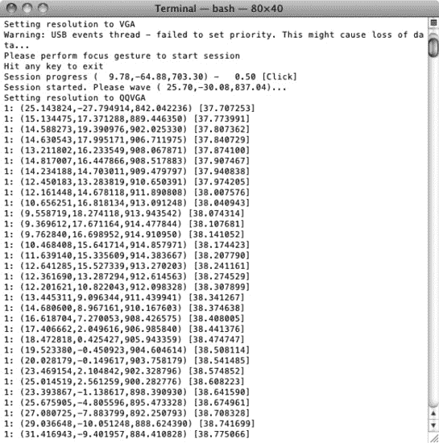
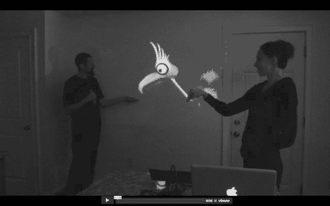
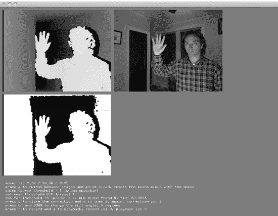
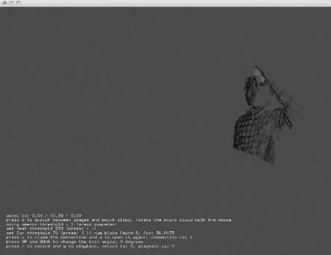
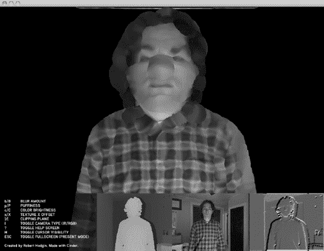
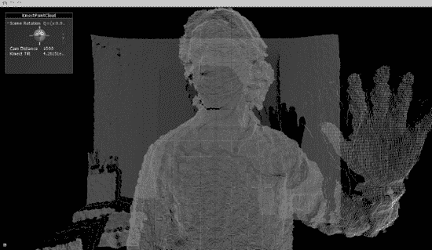

# 入门指南：Flash + Kinect

撰写本文时，从 Kinect 与 Flash 通信的主要技术是运行一个小型辅助应用，该应用从 Kinect 抓取所需数据，用 C 或 C++ 等语言对数据进行底层分析，然后像通过网络连接一样，通过套接字连接将你计划在应用程序中使用的信息发送给 Flash。（实际上，它*可以*通过网络连接，但你更可能在同一个机器上运行套接字服务器和 Flash 影片。）

在这种通用方法的框架内，有一个重要问题需要考虑：你希望在 Flash 中完成多少 Kinect 数据分析工作，以及在将数据发送到 Flash 之前又能完成多少？和往常一样，答案是：“视情况而定。”

取决于什么？嗯，Flash 应用程序开发的一个典型场景是，你有一个需要借助现有机器视觉库（如 OpenCV 或 OpenNI/NITE）所提供的手部追踪、骨骼追踪神奇功能的应用程序创意。在这种情况下，你可能属于那些在将任何数据发送到 Flash *之前*就进行大量数据处理的阵营，此时你发送的是相当精简但强大的数据，比如 NITE 追踪到的手部点的 X-Y-Z 坐标。另一种选择是直接在 Flash 中处理 Kinect 的深度和 RGB 数据，从 Kinect 抓取这些数据并将其扔给 Flash 影片进行处理。

对于第一种方案，Blitz Agency 的人员提供了一个基于 Node.js（一个流行的 JavaScript 网络服务器）的解决方案。Blitz 运行了 OpenNI/NITE 示例应用之一（称为`SingleControl`）的修改版本，并通过 Node.js 将预处理后的手部点数据通过套接字发送给 Flash。他们的步骤在其开发博客上有详细说明：

`http://labs.blitzagency.com/?p=2634`

使用这种技术需要你同时运行三个东西，大致如下：1) 使用 Node.js 和 Blitz 的 JavaScript 文件启动你的套接字服务器，该文件配置为按定义的间隔（想想“帧”）广播数据；2) 运行修改后的`SingleControl`示例，开始收集手部点数据并将其提供给套接字服务器；3) 运行你的 Flash 影片，使用一个`Socket`对象和一个监听器（`ProgressEvent.SOCKET_DATA`），以便在接收到新的手部点数据时执行某些操作。图 5-5 展示了传递给 Flash 的数据实际上有多精简：远小于 RGB 或深度图像！



**图 5-5.** 从附带的 NITE 示例应用`SingleControl`传递给 Flash 的 X-Y-Z 手部点数据

基于 OpenKinect 的 AS3Kinect 项目则采用了第二种方案，从 Kinect 获取相当原始的数据（图像）并将其泵入 Flash（同样使用套接字服务器）。虽然这种设置同样需要相当多的精力，但如果你渴望在一个 Kinect 项目中磨练你的 Flash/ActionScript 3 技能，这也是非常值得的。关于 AS3Kinect 项目的详细信息可以在这里找到：

`http://www.as3kinect.org/`

## openFrameworks

与本章介绍的其他工具不同——实际上，也与本书其余大部分内容不同——openFrameworks 和 Cinder（接下来介绍的项目）都不会为你提供一个用于编写和编译代码的独立环境。正如“openFrameworks”这个名字所暗示的，它们只是“框架”，或者说是一堆预编写的代码，你可以使用它们来处理常见任务，而这些任务在原本令人生畏的 C++ 和 OpenGL 语言中则很难处理。C++ 和 OpenGL 是两种相对较老且极其强大的语言，你可以用它们构建非常稳健的交互式桌面和移动应用程序。C++ 是你的底层函数式编程语言，而 OpenGL 则处理你的高性能 2D 和 3D 图形处理与渲染。

与 Processing 和 Cinder（我们将会看到）一样，openFrameworks 旨在支持直观的、草图风格的“创意编码”，这一领域涵盖了交互式艺术家、设计师和应用程序开发者可能想要用图形、媒体、数据和硬件所做的所有事情。

事实证明，这涵盖了非常多的方面。openFrameworks 项目始于帕森斯设计学院的 Zach Lieberman 和 Theodore Watson 之间的合作，现已发展成为一个庞大而强大的库，被成千上万的装置艺术家、表演者和黑客所使用。

### openFrameworks 能为你做什么

openFrameworks 社区一直致力于创意计算机视觉应用，他们迅速加入了 Kinect 黑客狂潮。为什么？因为 Kinect 和类似 Kinect 的传感器有助于解决创建交互式、基于视觉的应用的一个基本挑战：即清晰地了解用户正在做什么。此外，Kinect 可以与 openFrameworks 内置或封装的某些其他工具强大地结合使用。上一章讨论的计算机视觉库 OpenCV 就是一个很好的例子。虽然 OpenCV 可用于完成困难的计算机视觉任务，例如人脸检测或识别，但当我们能够进行 3D 视觉观察，并且知道大致在图像中的什么位置寻找人脸时，这些任务就变得更容易了。借助 openFrameworks，我们可以将这两项技术融合在一起，可以说是在同一个屋檐下，并做出一些了不起的事情。最早展示这种可能性的演示之一是由 Design I/O 的 Emily Gobeille 和 openFrameworks 联合创始人 Theo Watson 创建的交互式木偶原型，如 图 5-6 所示。



**图 5-6.** 由 Emily Gobeille 和 Theo Watson 使用 openFrameworks 构建的投影虚拟木偶应用


### 入门指南：openFrameworks + Kinect

与 C++ 和 OpenGL 本身一样，openFrameworks 支持跨平台运行，可在 PC、Mac 和 Linux 上使用。不过，你需要自行提供集成开发环境（IDE），即一个能够让你整合框架所有文件并将其与自己的代码一同编译的创作环境。openFrameworks 支持的 IDE 包括各平台通用的 `Code::Blocks`，Windows 上的 `Visual C++ 2008` 和 `Visual C++ 2010`，以及 Mac 上的 `Xcode`。

选定 IDE 并配置完成后，你需要访问官网下载 openFrameworks 的最新版本。截至撰稿时，最新版本为 0.07（据我们所知，这与詹姆斯·邦德无关！）。访问地址如下：

```
http://www.openframeworks.cc/download
```

根据你的平台和 IDE 下载最新版 openFrameworks 后，你可以在 `apps/examples` 文件夹中找到示例项目。打开并编译这些项目，可以确保一切配置正确。如果编译过程中遇到兼容性问题或“文件未找到”错误，欢迎来到框架开发的世界——这是你的入门考验！不必担心，初次从源代码编译自己的程序时，根据错误提示四处摸索是非常常见的。坚持下去！特别需要注意的是，openFrameworks 的示例项目使用相对路径来引用文件和框架；因此，如果你尝试编译一个位于错误文件夹中的项目，肯定会失败。

成功编译几个基础示例后，就可以尝试 Kinect 相关的内容了。为了配合 `libfreenect` 驱动从零开始工作，西奥·沃森（Theo Watson）发布了一个“插件”（add-on，这是对可选模块或插件的惯用称呼），名为 `ofxKinect`。它封装了 `libfreenect` 驱动，以便在 openFrameworks 中使用。请从 [`https://github.com/ofTheo/ofxKinect`](https://github.com/ofTheo/ofxKinect) 获取该插件。

只需下载该项目，将其移动到 `/add-ons` 文件夹，再将示例项目移动到 `apps/examples` 文件夹，然后打开并编译示例项目即可。编译成功后，你可以在如图 5-7 所示的反馈仪表盘视图与如图 5-8 所示的经典点云视图之间切换。openFrameworks 的强大之处在于它能够轻松集成强大的计算机视觉库 `OpenCV`。如图 5-7 所示，左下角的反馈图像虽然原本是一张深度图，但现在已借助 `OpenCV` 额外进行了分析，以检测场景中的“色块”（即作者本人）。色块检测结果通过绘制在图像上的矩形框来显示。



**图 5-7.** `ofxKinect` 示例项目展示了深度图、RGB 图像以及色块检测*



**图 5-8.** `ofxKinect` 示例项目必然包含数据的点云视图*

另外，如果你想使用 OpenNI 预建的抽象层及其算法魔法（比如手势和骨骼追踪），可以选用荷兰艺术家/开发者、openFrameworks 的活跃贡献者迪德里克·海伯斯（Diederick Huijbers）发布的封装了 OpenNI 的 openFrameworks 插件，名为 `ofxOpenNI`。请在此处获取该插件：

```
https://github.com/roxlu/ofxOpenNI
```

## Cinder

我们上面关于 openFrameworks 的大部分描述同样适用于 Cinder，这是一个由数字代理机构 Barbarian Group 于 2010 年发布的、用于“创意编程”的 C++ 框架。Cinder 是一个较新的项目，对于 C++ 新手来说，可能比 openFrameworks 更具挑战性。这两个项目有大量重叠之处，要逐点比较它们需要大量篇幅，并且涉及设计哲学和 C++ 内存管理等微妙话题。简而言之，如果你想创建一个精美的 C++ 应用程序，这两个项目都值得考虑。

### Cinder 能为你做什么

那么，为什么要在 Kinect 应用中使用 Cinder 呢？用 Cinder 创作的作品本身就很有说服力。简单来说，它能帮助你打造令人惊叹的图形作品，并在视觉上突破界限。加上一款深度感知摄像头，你就能创造出一场交互式视觉盛宴！正如第 3 章所述，数字艺术家罗伯特·霍金斯（Robert Hodgins）的“Body Dysmorphia（身体畸形）”项目就是用 Cinder 创建的，它展示了一些令人不安的 3D 视觉效果（霍金斯本人也是 Cinder 的共创者）。如图 5-9 所示，如果说普通摄像头会让你看起来胖十斤，那么 Kinect 加上 Cinder 则会让效果加倍！



**图 5-9.** 数字艺术家罗伯特·霍金斯基于 Cinder 的 Body Dysmorphia 项目*

### Cinder 入门指南

与 openFrameworks（或任何框架）一样，你需要自行提供 IDE。Cinder 适用于 Windows 上的 `Visual C++ 2008` 和 `Visual C++ 2010`，以及 Mac 上的 `Xcode`。不过截至撰稿时，它还不能很好地支持 Linux。

因此，只需下载最新版本的 Cinder 并将其放在任何位置即可。你可以从以下地址获取代码：

```
http://libcinder.org/download/
```

同样，建议先编译 `/samples` 文件夹中的一两个内置示例项目。如果一切编译正常，就可以开始用 Cinder 操作 Kinect 了。

Cinder 对 Kinect 的支持并非以“块”（block，这是对可选模块或插件的惯用称呼）的形式提供，而是以霍金斯提供的一些示例和支持文件的形式提供，恰如其分地命名为 `Cinder-Kinect`。请在此处获取这些文件：

```
https://github.com/cinder/Cinder-Kinect
```

`Cinder-Kinect` 封装了 `libfreenect` 驱动，是目前唯一可用的、将 Kinect 数据提供给 Cinder 的选项。下载 `Cinder-Kinect` 后，将整个文件夹（包括 `/include`、`/lib`、`/samples` 和 `/src` 子文件夹）放入 Cinder 主目录的 `/samples` 文件夹中。这样可以确保项目文件中使用的相对路径能够正常工作。编译 `kinectBasic` 示例后，你将获得来自 Kinect 的深度图像和 RGB 图像。

编译 `kinectPointCloud` 示例后，你将获得 3D 点云的又一个变体。不过，在我们看来，这是视觉上最悦目、细节最丰富的点云之一。



**图 5-10.** `Cinder-Kinect` 的点云版本*

### 现在，开始创作吧！

在本章中，我们想简要介绍用于 Kinect 创意编程的可用工具集。这些工具中的每一个都值得用一整本书来介绍！如果你为项目选择了其中一种，毫无疑问需要更深入地探索它（这不是双关语！）。我们小小的希望是，当你脑海中涌现出精彩的 Kinect 创意项目时，通过阅读本章，你将能更好地找到合适的工具。在下一章中，我们将转向一些最强大、最流行的 Kinect 通用开发框架。继续前进！

