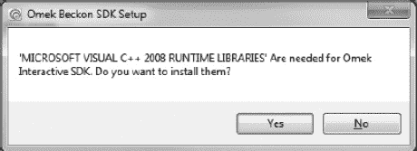
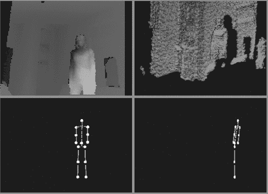
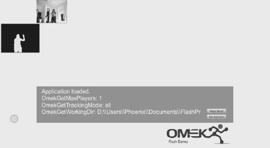
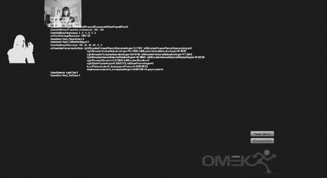
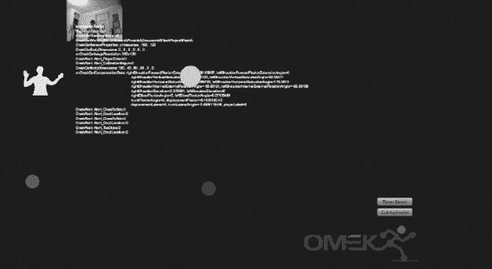
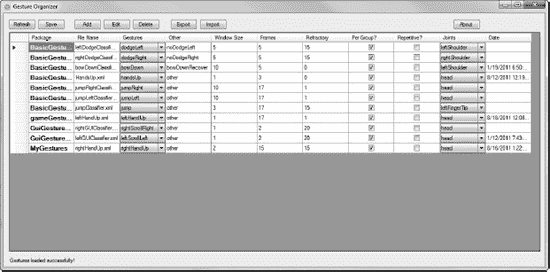
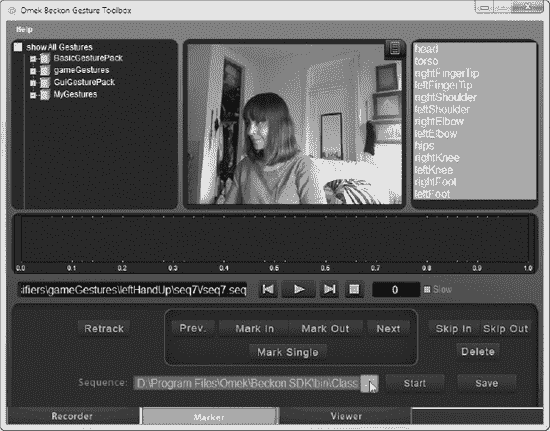
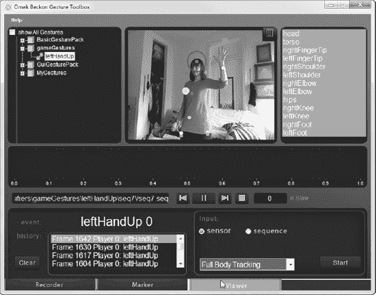
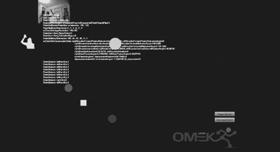

# 第六章


## 使用 Beckon 框架进行应用程序开发

到目前为止，我们已经介绍了一些适用于 Kinect 的开源平台。除了这些工具外，还有一些高级商业框架可供探索。这些套件能提供额外的工具、应用程序和功能。其中一个令人兴奋的平台是 Omek Interactive 公司的 Beckon 开发套件。Omek 的 Beckon SDK 能够执行骨架追踪、手势识别和斑点追踪，并且还附带了一套工具，用于使用 Kinect 及目前可用的许多其他 3D 传感摄像头录制自定义手势。这些新手势随后可以在任何使用 Beckon SDK 创建的应用程序中使用。例如，如果你想制作一个绘画程序，你可以设计特定于你应用的手势。在本章中，我们将介绍 Beckon 附带的 Flash 基础示例，创建一个简单的骨架，然后训练我们自己的手势。接着，我们会将骨架和训练好的手势整合到一个基础应用程序中。使用 Beckon 搭配 Flash 会生成一个独立的应用程序，而不是一个浏览器兼容的 `.swf` 文件。我们将重点介绍 Beckon 与 Flash 结合使用，因为 Flash 具备快速原型设计环境的能力。在学习过程中，我们还会讨论手势界面的基本用户体验设计策略。

 **注意** `.swf` 文件是编译后的 Flash 文件。它们最初被称为“Shockwave Flash 文件”，但如今通常仅通过其扩展名 `.swf` 来指代。使用 Beckon 和 Flash 所得到的应用程序类型是存储在 `.fla` 文件中的独立 Flash 应用程序。

### 什么是 Beckon？

Omek Interactive 是一家位于以色列的突破性公司，创立了 Beckon。他们的目标是通过提供工具和技术，使制造商和软件开发人员能够为其产品添加基于手势的界面，从而改变人们与其设备和应用程序的交互方式。Beckon 或许是本书中介绍的最强大的 SDK。Beckon 部分是中间件，部分是工具箱。中间件是一种位于一个应用程序或硬件设备与另一个之间的软件。在本书的前面部分，你一直在使用 OpenNI 和 NITE 或 Microsoft SDK 来推断和分析来自 Kinect 的数据。Beckon 的独特之处在于，它支持市面上几乎所有的深度摄像头（并计划支持未来的摄像头）。通过利用专有的机器学习环境，Beckon 允许开发人员和设计人员在 Adobe Flash CS 5.5、C++ 或 C# 中创建完全定制的交互式应用程序和沉浸式环境，以及为 `.NET` 框架以及 Unity 和 OGRE 游戏引擎创建插件。它与任何游戏引擎完全兼容，并原生支持业界标准的 FBX 动画格式，用于将预生成的 3D 内容与实时追踪混合在一起。

Beckon API 在斑点、骨架或手势层面提供了其所称的“场景智能”。基本和 GUI 手势包为不同的场景（如 UI 控制、游戏控制等）提供了预定义且可立即使用的手势。开发人员可以轻松地将这些手势包集成到他们的应用程序中。

设计人员还可以使用 Beckon 附带的应用程序，为其应用录制完全原创的手势或手势组合。手势编写工具包是一套工具，允许设计人员和开发人员定义和管理自己的手势，甚至无需编写代码即可创建新手势。手势可以非常直观，并且可以组合在一起。在音乐创作软件中，音乐家循环播放一段音轨的手势可能是在空中画一个圈。在第一人称格斗游戏中，跳跃和闪避可能是玩家躲避对手拳头攻击的正确动作。

Beckon 的机器学习环境可以从同一个手势的许多不同样本中学习。创建手势的过程就是在摄像头前多次执行并录制该手势。这个过程被称为训练机器学习环境。机器学习是人工智能的一个分支，无需畏惧。简单来说，计算机通过录入手势进行学习，并且随着每个新样本的加入，识别该手势的准确率会越来越高。Beckon 允许设计人员和开发人员获得高度准确的识别，即使是面对不同的人群也是如此。例如，一个 12 岁男孩和一个 30 岁女性做出相同手势的样子会截然不同。Beckon 能让你的程序轻松识别这两种用户。虽然 Beckon 总体上是一个很棒的工具，但正是这个特性使其在专用于 Kinect 的其他技术中脱颖而出。

Kinect 与其他任何传感器一样，需要安装由社区构建的单独设备驱动程序。目前，最流行的解决方案是 SensorKinect，这是一个基于 PrimeSensor 设备驱动程序的开源项目。需要理解的是，SensorKinect 驱动程序无法与标准的 PrimeSensor 驱动程序在同一台 PC 上共存，因为 SensorKinect 驱动程序的设计目的是让 Kinect 传感器看起来像一个标准的 PrimeSensor 设备。因此，我们建议在你的硬盘上新建一个空白分区并安装一个新的操作系统，从该分区启动，以便你之后可以切换回其他 SDK。在本章中，我们将使用 Windows 7 系统；不过 XP 系统也能工作。由于需要卸载驱动，你可能想先阅读本章内容，以判断 Beckon 是否满足你的需求。


 **注意** Beckon 目前通过 90 天免费试用评估版提供；然而，Omek 将在其下一个主要版本中向公众提供非商业版本。如果您希望现在获得一份副本，可以通过以下链接申请：[`www.omekinteractive.com/beckon-eval`](http://www.omekinteractive.com/beckon-eval) 或联系团队邮箱 [`info@omekinteractive.com`](http://info@omekinteractive.com)。虽然您无法直接从 Omek 网站购买许可证，但可以联系他们的销售团队，他们将为提供关于如何获得其 SDK 商业版本的详细信息。价格取决于您希望商业化的应用类型，因此最好直接联系他们了解详情。好处是，Beckon 不仅适用于 Kinect，还适用于 Panasonic D-Imager、Asus Xtion Pro、PMDTec 的 GameCube 3.0 以及 PMD[vision] CamCube。您还将获得出色的技术支持团队的支持，他们确保您能在自己的平台上成功完成安装。

根据个人使用经验，这个平台性能完美，Beckon 的稳定性再强调也不为过。我曾见过它在游戏中无缝追踪一名玩家，而该玩家身后有多达 40 人欢呼拍照。它还能非常好地让一名玩家离开游戏，另一名玩家进入 Kinect 视野并开始游玩。它会在数秒内检测到玩家变化并开始追踪，无需任何校准姿势。其准确性惊人，能够识别 2 岁到 70 岁以上不同年龄段的人执行相同的手势。Beckon 提供的性能使其值得投资。

无论初始设置时间如何，如果你有兴趣同时为 iOS、Android、触摸屏和 Kinect 开发游戏或应用，Beckon 确实能节省时间。否则，你不得不使用 Objective C 构建 iOS 应用，用 Java 构建 Android 版本，并用 C++ 等语言构建 Kinect 版本。此外，作为游戏开发者，能够将游戏带到展会，设置成使用 Kinect 的自助服务机版本运行，也很有趣。Beckon 让这一切变得非常简单。

如果你现在感到困惑，心想：“我听说 Flash 无法在 iPad 上运行！”欢迎来到 Flash 新版本 CS 5.5，它原生支持 Flash 和 Flash Builder 的多屏幕输出。iTunes 商店最畅销的应用现在都是用 Flash 制作的，例如获奖无数的《机械迷城》。网上有很多关于这种开发方式的实用技巧。一个不错的起点是 Adobe 网站的游戏专区：[`www.adobe.com/devnet/games.html`](http://www.adobe.com/devnet/games.html)。

#### 安装 Beckon

Kinect 与其他传感器一样，需要安装单独的设备驱动程序。为此，我们依赖 Kinect 开发者社区编写的公共组件。最流行的解决方案是 `SensorKinect`，这是一个基于 `PrimeSensor` 设备驱动程序的开源项目。重要的是要理解，`SensorKinect` 驱动程序不能与标准 `PrimeSensor` 驱动程序在同一台 PC 上共存，因为 `SensorKinect` 驱动程序的设计目的是让 Kinect 传感器显示为标准 `PrimeSensor` 设备。

让 Beckon 启动运行需要几个步骤。我建议查看 Omek 网站以获取最新详情，因为随着 Omek 发布更新和新版本软件，相应的驱动程序会发生变化。您需要做的第一件事是删除操作系统中现有的 Open NI SDK 和 PrimeSense 驱动程序。另外需要提醒的是，您还必须确保完全卸载并从系统中移除 `libfreenect` 开放 Kinect 驱动程序。否则会导致 Beckon 无法识别传感器摄像头。之后，我们将重新下载并安装适用于 Beckon 的 OpenNI 和 PrimSense 驱动程序版本。最后，我们将安装 Beckon SDK 和许可证并开始使用。

 **注意** 如果您是可能从 Mac OS 转过来的开发者，并希望充分利用 SDK，那么需要确保也已安装 Visual Studio Professional 和 .NET 框架。

##### 第 1 步：移除现有驱动程序

第一步是移除系统中任何可能与 Beckon 软件或运行该软件所需驱动程序冲突的现有驱动程序。部分驱动程序通过控制面板移除，其他则通过 Windows 设备管理器移除。以下是针对控制面板驱动的操作步骤：

1.  转到“开始”->“设置”->“控制面板”
2.  选择“程序”控制面板
3.  选择“卸载程序”选项
4.  卸载名称中包含“OpenNI”或“PrimeSense”的任何应用程序。例如：适用于 Windows 的 `OpenNI 1.0.0`、`PrimeSensor 5.0.0`、`Windows Driver Package – PrimeSense (psdrv3) PrimeSensor` 等。

以下展示如何使用设备管理器移除驱动程序：

1.  转到“开始”->“计算机”
2.  右键单击“计算机”，选择“管理”
3.  点击“设备管理器”
4.  展开“人体学输入设备”
5.  找到 `XBox NUI Camera`，右键单击，选择“卸载”
6.  找到 `XBox NUI Motor` 和 `XBox NUI Camera` 驱动程序，右键单击，同样卸载它们

##### 第 2 步：安装新驱动程序

现在所有可能冲突的其他软件和驱动程序都已清除，您可以下载并安装 Beckon 所需的组件。请按照以下说明操作：

1.  下载 `OpenNI 1.0.0.25` 安装程序。
2.  下载并安装 `SensorKinect 5.0.0` 驱动程序。
3.  通过运行第 1 步中下载的安装程序来安装 OpenNI。
4.  通过运行第 2 步中下载的安装程序来安装 `SensorKinect`。

 **注意** 关于驱动安装的新信息，请查看本书的示例下载文件。

##### 第 3 步：下载并安装 Beckon SDK

现在是时候下载并安装 Beckon SDK 了。最好使用 Internet Explorer 或 Firefox 浏览器进行此操作，尤其是在安装了防火墙的情况下。流程如下：

1.  导航至客户服务门户网站：
    [`https://license.omekinteractive.com/solo/customers/Default.aspx`](https://license.omekinteractive.com/solo/customers/Default.aspx)
2.  使用 Omek 提供给您的客户 ID 和密码登录，并下载您的许可证。当 Omek 同意授予您许可证时，他们会通过电子邮件发送此信息。如果您在此处遇到问题，请参阅 Omek Beckon SDK 安装指南。
3.  下载 Beckon SDK。使用您注册非商业许可证时收到的 Beckon 电子邮件中提供的链接安装软件。过程中唯一需要注意的棘手弹窗是最后的弹窗，如图 6-1 所示。如果您使用的是安装了 Visual C++ 的 Windows 7 64 位系统，请选择“否”。否则，请选择“是”。



***图 6-1.** Beckon 安装程序最后但棘手的弹窗。*

### 激活 Beckon

Beckon SDK 受许可证保护；您有 3 天时间激活许可证。运行 `Tracking Viewer` 工具，根据您的许可证权限激活软件。您可以在“开始”菜单中找到该工具：开始 -> Omek Beckon -> Tracking Viewer。不过，请先不要运行它。

首先，插入您的 Kinect 设备。驱动程序安装是验证过程的一部分。

现在运行 `Tracking Viewer`。Beckon 将引导您完成验证过程。您会看到一个弹出通知，告知 Kinect 驱动程序正在安装。您会看到 Xbox NUI Audio 驱动程序安装失败。这完全正常，并且表明到目前为止您所做的一切都是正确的。

 **注意** 如果需要更多帮助，Omek Beckon SDK 安装指南提供了简单的分步指南。


### 快速入门

现在，我们来检查安装是否成功。Beckon 安装包中包含一个示例应用程序，可用于测试安装是否成功。从“开始”菜单启动“Omek BeckonTracking Viewer”。

**注意**：可执行文件位于以下文件夹中：`C:\Program Files\Omek\Beckon SDK\bin\Omek Beckon Tracking Viewer.exe`。

在 Omek Beckon Tracking Viewer 中，选择：`Open -> Live Camera`。如果一切安装正确，您将看到类似于图 6-2 的画面。



***图 6-2.** Omek Beckon 跟踪查看器*

### 将 Beckon 与 Flash 集成

现在，让我们在 Flash 中使用 Beckon SDK。再次说明，Flash 与 Beckon 结合可创建独立应用程序，而非浏览器体验。Beckon 无法在带 Flash 的浏览器中或在线运行；您实际上不能将 Beckon 作为 Flash 库安装，或将其作为`.swc` 文件加载。不过，据传闻，这是最后一个不含嵌入式解决方案的 Beckon 版本。Beckon 的工作方式有所不同：它通过 Flash 的 `ExternalInterface` 与 Flash 协同工作。您创建自己的 Flash 文件并暴露一些函数，这些函数将与 Beckon SDK 通信。Beckon 还有一个名为 `OmekBeckonFlash.exe` 的应用程序，它在运行的 swf 文件和 Beckon 库之间进行通信。Beckon 使用一个名为 `config.xml` 的 XML 文件，来告知 BeckonFlash 应用程序在何处寻找要运行的 swf，并设置一些初始启动参数。

要运行 Beckon Flash 示例，请执行以下操作：

1.  为项目新建一个文件夹（例如 `C:\MyProject`）。
2.  将必要文件从 `C:\Program Files\Omek\Beckon SDK\bin` 复制到 `C:\MyProject`。您可以按照开发者指南中“分发基于 Omek 的内容”下的说明操作，或者简单地将 `bin` 文件夹中的所有内容复制到您的项目文件夹中。
3.  将 `C:\Program Files\Omek\Beckon SDK\samples\Flash` 复制到 `C:\MyProject`。请确保将目标文件夹命名为 `Flash`，首字母 `F` 大写。
4.  运行 `OmekBeckonFlash.exe`。
5.  现在 Flash 示例 `.swf` 会在此应用程序中打开，并且它将链接到 Omek SDK 运行。

此时，您应该会看到类似 图 6-3 的画面。这并非浏览器，而是一个独立的应用程序。



***图 6-3.** 在 OmekBeckonFlash.exe 中运行的默认独立 Flash 示例*

以下是 Beckon 与 Flash 通信的方式：

1.  `OmekBeckonFlash.exe` 加载 `Flash/config.xml`（您必须保留此文件名）。
2.  Flash 项目会根据 `config.xml` 中 `<movie swfPath=".\Flash\game.swf" />` 标签指定的路径加载。
3.  加载 SDK，并使用 `.swf` 文件中暴露的函数，将数据发送到正在运行的 `.swf` 文件。

现在您应该已经可以成功运行 Beckon SDK 了。

 **注意**：Omek 正在简化运行 Flash 应用程序的流程，因此预计会有改进。预计会看到快速更新、快速变动和创新。

### 理解 Beckon Flash 示例

在我们创建自己的 Flash 文件之前，先来探索一下 Beckon Flash 示例。通过理解 Beckon 示例的工作原理，您将能够从零开始创建一个项目。

#### Beckon 如何与 Flash 协同工作

在我们甚至打开 Flash 之前，我们先对两行代码进行一次基本的剖析，以便掌握 Beckon 如何与 Flash 协同工作。如果您习惯使用 Flash，您可能已经熟悉 `ExternalInterface.callback()` 类。使用 `ExternalInterface` 类，您可以在 Flash 运行时环境中调用 ActionScript 函数。通常，这个类用于让正在运行的 swf 文件与浏览器中的 JavaScript 进行通信。然而，在本例中，Beckon 使用一个额外的应用程序 `OmekBeckonFlash.exe` 来在其中运行 swf 文件。由于函数在 `.swf` 文件中被暴露出来，因此 OmekBeckonFlash 应用程序可以将 SDK 发送的信息传递给它们。

我们将查看 `ExternalCallback` 类的两个关键方法。第一个是 `.addCallback`。此方法将 ActionScript 方法注册为可从容器 swf 调用。

以下是 Flash 文件中的完整代码行：

```
ExternalInterface.addCallback("OmekGesture", onOmekGesture);
```

这个 `addCallback` 方法将 `onOmekGesture` 暴露给 SDK。

下一个方法调用将参数从 `.swf` 文件传递到 `OmekBeckonFlash` 应用程序。这个调用建立了 Flash 与 Beckon 之间的双向通信。它还告诉 `OmekAddGesture` 函数，如果在摄像头视野中执行了 `leftPush` 手势，则注册该手势。以下是相关的代码行：

```
ExternalInterface.call("OmekAddGesture","leftPush");
```

现在我们已经了解了 Beckon 如何与 Flash 协同工作，让我们来看看实际的 Flash 文件。在 Flash 中打开 `C:\MyProject\Flash\testOmekFlashPlayer`。您会看到当我们启动 `OmekBeckonFlash.exe` 文件时运行的初始界面。那是因为界面的一部分是在 Flash 中创建的。请注意，没有为 RGB 视频流或深度图预留的方框。这是因为这些元素是通过 `config.xml` 文件添加到文件中的。Beckon 同时使用 Flash 和这个文件来设置 `OmekBeckonFlash` 应用程序的启动参数。

您可以稍微修改代码，以帮助理解所发生的事情。首先，调整舞台上标记为 `debugString_txt` 的文本框大小，以便在 `BeckonFlash.exe` 运行 swf 文件时，能够真正看到其中显示的所有调试代码。将其大小调整为整个舞台大小，并将文本大小设为约 10pt。您还可以继续将其文字颜色设为白色。现在，将背景色设为黑色以便于阅读。保存并导出应用程序。

现在再次运行示例。移动身体，您将看到所有调试文本都显示在屏幕上，如 图 6-4 所示。



***图 6-4.** 在 OmekBeckonFlash.exe 中运行的修改后的独立 Flash 示例*

使用 Flash 和 Beckon 最大的困难在于失去了控制台窗口。您可以使用原始方法，在屏幕上放一个文本框并向其发送消息，但一种更干净的方法是在屏幕上获取调试文本，即创建一个通过 Actionscript 绘制调试文本的函数。

注意示例现在如何反映上述更改。我通过执行手势或在屏幕上触发警报显示，触发了文件中的几个函数。尝试做出类似动作，比如靠近 Kinect 或走出视野。您现在会看到所有新行都被写入屏幕。它们之前就在那里，但因为文本框太小，您看不到调试文本的显示。现在您可以轻松地在 `debugString_txt` 文本框中看到它们。

我在图 6-4 中执行了“右击”手势。执行这个手势，只需在右手稍微抬起至胸前高度时，快速做一个类似双击的轻拍动作。这与你轻拍坐在你正前方的人的肩部动作相同。调试文本显示此手势已被摄像头捕捉并注册。接着，我故意靠摄像头太近，触发了 `Alert_TooClose` 警报。

`debugString_txt` 文本框之所以重要，是因为当您在第三方应用程序中运行 swf 时，您会失去对 Flash 中普通控制台窗口的访问。创建在屏幕上显示的消息以进行调试，是您在使用 Beckon 时必须适应的一个根本性变化。处理此问题的一个聪明方法是，在您的应用程序中创建一个调试模式，您可以通过按键触发来开启或关闭屏幕上的警报。


#### 示例代码

现在，我们来看看 Beckon 的 Flash 示例代码。要查看代码，请打开“动作”面板，查看时间轴第一帧上的 ActionScript。

 **注意** 从菜单中选择“窗口”>“动作”即可查看动作面板。

你应该会在代码顶部看到一个 `import` 语句。在你使用 Beckon SDK 创建的每一个 Flash 应用程序中，都需要导入以下类：

```
  import flash.external.ExternalInterface;
```

接下来是暴露特定函数给 `swf` 文件的 `ExternalInterface` 代码。第一步始终是将函数暴露给 Flash 运行时环境。第二步是可选的，通过 `ExternalInterface.call` 方法发送消息来设置功能。最后一步则是设置暴露出来的函数。

无可讳言，这种暴露函数的过程感觉像是权宜之计。毫无疑问，最好是 Omek 将 Beckon SDK 构建成 Flash 库的版本，这样就能轻松在线发布，或分发给其他使用 Kinect 的人。目前，你只能局限在运行着你特定版本 Beckon 的那一个系统上。希望这种情况在 Beckon SDK 的未来版本中会有所改变。

ActionScript 中的三个 `ExternalInterface.callback()` 方法是必需的，必须在每个打算使用 Beckon 的文件中实现。每个方法都集成了一些基本功能。我们将回顾这三个必需的方法以及它们暴露的函数。其他方法都是可选的，但本章介绍的这三个是必要的。

我们讲解这三个方法的顺序与它们在 ActionScript 文件中被使用的顺序不同。我们之所以采用这种顺序，是为了能够更清晰地解释代码。我们会通过行号来引用 ActionScript 代码，以便尽量让讨论易于理解。

第 8 行通过在 Flash 运行时中暴露 `onOmekGesture` 函数来处理手势识别。

```
ExternalInterface.addCallback("OmekGesture", onOmekGesture);
```

接下来要看的方法是第 56 行。这个方法让 SDK 注册 `leftPush` 手势。这个手势是 SDK 中包含的一个手势。用户想要检测的每个手势都必须在这里列出，包括自定义手势。

```
        ExternalInterface.call("OmekAddGesture","leftPush");
```

现在，回顾一下第 106 行暴露的函数 `onOmekGesture`。

```
function onOmekGesture(gestureName:String, playerLabel:String):void
{
        debugString_txt.appendText("\nOmekGesture: " + gestureName + ":" + playerLabel);
}
```

这个函数可以从 SDK 接收两个字符串。第一个是接收到的手势名称，第二个是玩家的标签。Beckon 可以追踪多个玩家，并在它们之间轻松切换。它最多支持 5 个玩家。它还可以追踪无限数量的所谓候选者（或潜在玩家）。

#### 骨骼数据

接下来，我们看看如何将骨骼数据获取到 Flash 中。第 9 行暴露了函数 `onOmekJointPosition`：

```
ExternalInterface.addCallback("OmekJointPosition", onOmekJointPosition);
```

你必须列出你想要接收的每一个关节，但不是在 Flash 文件中。打开 `Config.html` 文件。该文件位于此文件夹中：`C:\MyProject\Flash`。打开文件，注意其中的 `<tracking>` 标签。其内容应如下所示：

```
<tracking>
                <skeleton rawSkeleton="true"/>
                <joint name="rightFingerTip" screen="false" smooth="true"/>
                <joint name="leftFingerTip" screen="false" smooth="true"/>
                <joint name="torso" screen="false" smooth="true"/>
</tracking>
```

这个 `<tracking>` 标签注册了所有要追踪的关节。你*必须*列出你想要追踪的每一个关节。在这个例子中，只追踪了左右指尖和躯干。由于这个标签已经在这个 xml 文件中预先设置了关节，因此无需使用 `.call` 向 SDK 发送消息。

#### 关节位置

现在让我们看看 `onOmekJointPosition` 函数。它接收关节名称、与该关节关联的 `playerLabel` 以及该关节在空间中的 X、Y、Z 位置。以下是示例中的代码：

```
function onOmekJointPosition(jointName:String, playerLabel:String, jointX:String, jointY:String, jointZ:String, confidence:String):void
{
//将鼠标控制权交给一个特定的玩家。
if(playerLabel == "0")
{
  if(jointName == "leftFingerTip")
  {
  //镜像 X 值，使鼠标像手一样左右移动。
  leftFingerTip_mc.x = stage.stageWidth - Number(jointX) * _screenScaleX + correctionX;
  leftFingerTip_mc.y = Number(jointY) * _screenScaleY + _correctionY;

  //debugString_txt.appendText("\nleftFingerTip_mc located at:
  //("+leftFingerTip_mc.x.toString()+","+leftFingerTip_mc.y.toString()+")");
  }
  if(jointName == "rightFingerTip")
  {
  rightFingerTip_mc.x = stage.stageWidth - Number(jointX) * _screenScaleX + correctionX;
  rightFingerTip_mc.y = Number(jointY) * _screenScaleY + _correctionY;
  }
  }
}
```

这个函数将控制权交给玩家 0，并将圆形图形影片剪辑 `leftFingerTip_mc` 和 `rightFingerTip_mc` 连接到每只手最长的手指指尖点。该函数还会将这些关节的位置打印到舞台上的 `debugString_txt` 框中。

Beckon 可以追踪多个玩家，并为每个玩家分配一个编号。第一个玩家是玩家 0。

#### 警报

最后一个必需的功能是处理警报。在第 10 行，注意函数 `onOmekAlert` 已被暴露给 Flash 运行时环境：

```
ExternalInterface.addCallback("OmekAlert", onOmekAlert);
```

你想要监听的每一个警报也必须通过 `.call` 方法发送给 SDK。在第 62-79 行，一系列可用的警报监听器被发送给 SDK，每个监听器附带相应的监听消息，从下面这行开始：

```
ExternalInterface.call("OmekAddAlert","Alert_CalibrationDone");
```

现在我们来看看暴露出来的 `onOmekAlert` 函数以及它的功能：

```
function onOmekAlert(alertName:String, playerLabel:String):void
{
debugString_txt.appendText("\nOmekAlert: " + alertName + ":" + playerLabel);

if (alertName =="Alert_CalibrationDone"){
//只有在 Alert_CalibrationDone 之后，OmekGetBodyDimensions 才会返回正确的值
  ExternalInterface.call("OmekGetBodyDimensions","0");
  //请求特定玩家的身体补偿数据。将返回值传递给 ExternalInterface.addCallback("OmekGetCompensationData", onOmekGetCompensationData);
  ExternalInterface.call("OmekGetCompensationData","0");
} else if (alertName == "Alert_CalibrationBegun"){
  ExternalInterface.call("OmekGetBodyDimensions","0");
  //请求特定玩家的身体补偿数据。将返回值传递给  
  //ExternalInterface.addCallback("OmekGetCompensationData", onOmekGetCompensationData);
  ExternalInterface.call("OmekGetCompensationData","0");
}
```

这个函数处理几个警报。对于每个警报，它只是将文本打印到 `debugString_txt` 字段。这里没有发生什么特别的事情。将来这个函数的一个实用用途是在屏幕上显示玩家警告信息。


#### 核心功能

至此，我们已经完成了设置 Beckon Flash 集成所需的代码。在了解了最基本的设置后，让我们来看看我们讨论过的功能是如何集成到示例中的。首先，代码会检查传感器是否已连接并就绪。如果传感器已准备好使用且所有连线均正确，则所有相关查询将被发送到 SDK。此过程从第 21 行开始，通过一个每帧运行的 `addEventListener` 来检查传感器是否就绪。以下是从第 21 行开始的相关代码：

```actionscript
//wait for connecting to the sensor before querying it.
addEventListener(Event.ENTER_FRAME,checkIfSensorReady);
function checkIfSensorReady(e:Event):void
{
//ask if the sensor is ready to receive queries. return a value to
//ExternalInterface.addCallback("OmekIsSensorConnected", onOmekIsSensorConnected);
ExternalInterface.call("OmekIsSensorConnected","");
}
```

请注意下一个函数 `onOmekIsSensorConnected`，它现在已暴露给 SDK，并且 SDK 中的 `OmekIsSensorConnected` 函数通过 `.call` 触发，并接收 `false` 或 `true`。

`onOmekIsSensorConnected` 函数从 SDK 接收一个字符串。如果该字符串是 `true`，则执行 `sendQueriesToSensor` 函数。

```actionscript
/**
 * function returns true or false if the sensor is connected.
 *
 * connected : boolean (as a string) "true" or "false", marking if the sensor is ready
 */
function onOmekIsSensorConnected(connected:String):void
{
  if ( connected=="true" )
  {
    removeEventListener(Event.ENTER_FRAME,checkIfSensorReady);
    sendQueriesToSensor();
  }
}
```

接下来是 `sendQueriesToSensor` 函数。该函数会向 SDK 发送所有调用消息。（`sendQueriesToNSensor` 还会暴露一些其他函数）。这一点很重要，因为这些调用包括所有需要追踪的手势以及所有需要发送的警报消息。例如：

```actionscript
function sendQueriesToSensor():void
{
  //设置传感器追踪的玩家数量
  ExternalInterface.call("OmekSetMaxPlayers","2");
  //请求当前追踪的玩家数量。将返回值发送到
  //ExternalInterface.addCallback("OmekGetMaxPlayers", onOmekGetMaxPlayers);
  ExternalInterface.call("OmekGetMaxPlayers","");

  //设置传感器的追踪模式： "all", "basic", "upper", 或 "sitting"
  ExternalInterface.call("OmekSetTrackingMode","all");
  //请求当前的追踪模式。将返回值发送到
  //ExternalInterface.addCallback("OmekGetTrackingMode", onOmekGetTrackingMode);
  ExternalInterface.call("OmekGetTrackingMode","");

  //为传感器添加特定手势监听器（完整手势列表请参阅文档）
  ExternalInterface.call("OmekAddGesture","leftPush");
  ExternalInterface.call("OmekAddGesture","rightClick");
  ExternalInterface.call("OmekAddGesture","jumpNoHands");
  //移除传感器的特定手势监听器
  ExternalInterface.call("OmekRemoveGesture","leftPush");

  //为传感器添加特定警报监听器（完整警报列表请参阅文档）
  ExternalInterface.call("OmekAddAlert","Alert_CalibrationDone");
  ExternalInterface.call("OmekAddAlert","Alert_CalibrationBegun");
  ExternalInterface.call("OmekAddAlert","Alert_TooClose");
  ExternalInterface.call("OmekAddAlert","Alert_TooFar");
  ExternalInterface.call("OmekAddAlert","Alert_CloseToSide");
  ExternalInterface.call("OmekAddAlert","Alert_OutOfFrame");
  ExternalInterface.call("OmekAddAlert","Alert_GoodLocation");
  ExternalInterface.call("OmekAddAlert","Alert_CloseToWall");
  ExternalInterface.call("OmekAddAlert","Alert_GoodBackground");
  ExternalInterface.call("OmekAddAlert","Alert_PlayerEnters");
  ExternalInterface.call("OmekAddAlert","Alert_PlayerLeaves");
  ExternalInterface.call("OmekAddAlert","Alert_GoodFrameRate");
  ExternalInterface.call("OmekAddAlert","Alert_LowFrameRate");
  //移除传感器的特定警报监听器
  ExternalInterface.call("OmekAddAlert","Alert_GoodLocation");
  ExternalInterface.call("OmekRemoveAlert","Alert_GoodFrameRate");
  ExternalInterface.call("OmekAddAlert","Alert_CloseToWall");

  //请求当前工作目录。将返回值发送到
  //ExternalInterface.addCallback("OmekGetWorkingDir", onOmekGetWorkingDir);
  ExternalInterface.call("OmekGetWorkingDir","");
  //请求传感器的属性。将返回值发送到
  //ExternalInterface.addCallback("OmekGetSensorProperties", onOmekGetSensorProperties);
  ExternalInterface.call("OmekGetSensorProperties","");
  //请求特定玩家的身体尺寸。将返回值发送到
  //ExternalInterface.addCallback("OmekGetBodyDimensions", onOmekGetBodyDimensions);
  ExternalInterface.call("OmekGetBodyDimensions","0");

  //获取 rgb、深度或玩家遮罩
  ExternalInterface.addCallback("OmekShowImage", onOmekShowImage);
  ExternalInterface.addCallback("OmekGetImageResolution", onOmekGetImageResolution);
  //请求 xml 中 rgb 图像的分辨率。将返回值发送到
  //ExternalInterface.addCallback("OmekGetImageResolution", onOmekGetImageResolution);
  ExternalInterface.call("OmekGetImageResolution","");

}
```

### 修改 Beckon Flash 示例

现在，在开始创建我们自己的示例之前，我们先在这个示例中添加一些内容。让我们追踪一个新关节：头部。

首先，我们需要让 Beckon 知道我们希望在 Flash 运行时环境中接收头部关节。为此，我们需要修改 `config.xml` 文件，使其与以下代码一致：

`C:\MyProject\Flash\config.xml`
```xml
<tracking>
                <skeleton rawSkeleton="true"/>
                <joint name="rightFingerTip" screen="false" smooth="true"/>
                <joint name="leftFingerTip" screen="false" smooth="true"/>
                <joint name="torso" screen="false" smooth="true"/>              
                <joint name="head" screen="false" smooth="true"/>
</tracking>
```

通过修改 `testOmekFlashPlayer.fla` 文件中从第 164 行开始的 `onOmekJointPosition` 函数，将头部追踪添加到示例中。以下是您应创建的新版本函数：

```actionscript
function onOmekJointPosition(jointName:String, playerLabel:String, jointX:String, jointY:String, jointZ:String, confidence:String):void
{
//将鼠标控制权交给特定玩家。
if(playerLabel == "0")
{
if(jointName == "head") {

  myHead.x = stage.stageWidth - Number(jointX) * _screenScaleX + _correctionX;
  myHead.y =Number(jointY) * _screenScaleY + _correctionY;

}
if(jointName == "leftFingerTip")
{
  //镜像 X 值，使鼠标像手一样左右移动。
  leftFingerTip_mc.x = stage.stageWidth - Number(jointX) * _screenScaleX + _correctionX;
  leftFingerTip_mc.y = Number(jointY) * _screenScaleY + _correctionY;

  //debugString_txt.appendText("\nleftFingerTip_mc located at: ("+leftFingerTip_mc.x.toString()+","+leftFingerTip_mc.y.toString()+")");
}
if(jointName == "rightFingerTip")
{
  rightFingerTip_mc.x = stage.stageWidth - Number(jointX) * _screenScaleX + _correctionX;
  rightFingerTip_mc.y = Number(jointY) * _screenScaleY + _correctionY;
}
}
}
```

最后，导出并运行 `OmekBeckonFlash.exe`。您应该会看到影片剪辑的头部追踪已启用并正常工作，如图 6-5 所示。



***图 6-5.** Beckon 追踪新增的头部关节*


### 设计自定义手势

手势设计为用户体验打开了一扇全新世界的大门，而这个世界才刚刚开始被创造。当你开始设计手势时，需要牢记一些基本原则。以下是七条设计策略，助你入门：

1. 首先，手势应与用户需要执行的操作产生关联。想想 iPhone 上流行的用于缩放照片的“捏合缩放”手势。它非常直观，堪称出色手势设计的典范。放大或缩小图像的动作十分自然，并能以一种更有机的方式将人们与他们的照片连接起来。

 **提示** 你的应用或游戏的最佳手势是什么？当然，最佳手势是那些无需用户手册、几乎不用解释就能理解的手势。让人们在完全未接触过你的项目的前提下尝试使用你的界面，就能立刻判断设计是否奏效。用户能否自然地理解你的界面，还是需要停下来询问该如何操作？你的界面是否足够友好、具有吸引力，让用户敢于直接尝试，还是让人望而生畏？几次失败的操作就可能破坏用户对界面的初始印象。如果界面持续以出乎意料的方式响应，用户很可能会彻底放弃使用。

2. 第二条手势设计经验法则是考虑用户的舒适度和身体因素。身体需要适应机器的时代已经结束了。我一直感到疑惑，为什么在科技突飞猛进一百多年后，我们依然在使用类似于华丽打字机的设备。我们的 QWERTY 键盘除了让成千上万的用户患上重复性劳损、腕管综合征和背痛之外，毫无益处。舒适易用的界面才能长期获得成功。值得庆幸的是，借助多点触控和计算机视觉来创造用户体验，我们不再需要依赖旧有的模式来构建交互模型。简而言之，如果设计会带来疼痛，那就不要做——也不要要求你的客户和用户去做。

3. 第三，设计时要考虑基本的人类心理学。将手臂举向天空通常让人感到振奋，而跪下则带有祈祷和屈服的含义。例如，如果你想让人在玩你的游戏时感到快乐，明智的做法是阅读简·麦戈尼格尔的《游戏改变世界》*Reality is Broken*。她记录了在游戏中创造积极情绪的许多策略，其中最常用的一种是触摸他人。人类接触会在大脑中释放大量催产素。催产素是一种与在大脑中创造幸福感密切相关的化学物质。基于手势的 SDK 能够实现玩家互动，因此触摸是一种非常简单的方法，可以在玩家中激发积极情绪、建立纽带和连接感。

4. 第四，要善于利用并发展已有的手势惯例。绝对没有理由忽视用户从其他平台或交互模式中已熟悉的手势。借鉴这些手势，并使它们为你正在设计的界面服务。设计的核心在于建立在现有范式之上，而优秀的设计则能推动设计对话向前发展。

5. 第五，不要违反用户从现实世界或其他界面中习惯的交互模式。游戏玩家习惯了拿起剑的概念，并且他们对于如何握持和挥舞剑有特定的预期。设计时要考虑到这种模式。使用带有手臂挥动的手势，可以实现更有趣、更逼真的剑术对决。

6. 第六，交互模式不应与其所处的世界相冲突。例如，如果玩家在游戏中将剑背在背上，就不要让玩家通过一个界面来获取那把武器。只需允许他们伸手从背后拿下来即可。否则，你就会设计出相互矛盾、令人困惑的交互，用户将难以凭直觉理解。

7. 最后，界面和手势应该作为一个整体协同工作。用户应该能够轻松把握用户体验设计的整体性，并能快速、轻易地将其传达给新用户。不要在交互过程中途将用于某个任务的手势更改为另一个手势。考虑让用于相似体验的手势在设计中保持关联性。

在这一领域，可以从瑜伽、神经学和物理治疗等领域学到很多东西。这三个领域都对身心连接进行了广泛的探索。人类身体做出的各种姿态会唤起怎样的情绪？哪些手势会触发我们大脑中的哪些化学物质？镜像神经元将如何影响群体体验设计？毫无疑问，你为设计添加的手势将对可用性产生巨大影响。


### 向 SDK 添加新手势

在 Beckon 中，我们可以通过完全无需编码的图形用户界面来创建、编辑和添加手势。我们将创建一个 SDK 中尚未存在的全新手势，并从 Flash 示例中调用它。为此，我们需要在传感器前多次记录自己执行该手势的动作。执行手势时，你需要通过将身体摆成该手势对应的姿势来做出姿态。我们将多次摆出姿势，以便机器学习环境拥有可供分析和学习的样本。每次记录的姿势都被视为一个样本。这些样本会被组合成该手势的分类器。Beckon 将视频剪辑片段称为序列。一个序列就是一个人执行手势的一段录制内容。一旦 Beckon 能够良好地识别手势，我们就会在 Flash 中为这个新手势添加一个监听器。当我们执行该手势时，如果一切顺利，手势名称将出现在舞台上的 `debugString_txt` 文本框中，以告知我们它已被识别。要完成整个流程，我们需要使用三个工具：

- 第一个工具是 Omek Beckon 手势组织器，它让我们仅以名称形式将手势添加到 SDK 中。
- 第二个应用程序是手势工具箱，它使我们能够选择手势，以便录制示例。我们通过 Kinect 摄像头录制示例。录制多个示例。一旦有了几个正面示例，我们也要录制几个负面示例。之后，我们将进入每个文件并标记每次录制，通过标注来告知 Beckon 正确执行手势的位置。任何未标记的剪辑片段或片段区域都将被作为负面示例进行分析。
- 最后，我们启动第三个应用程序——手势学习器，并告知它我们的示例所存放的位置。我们还会告诉它一些关于手势识别目标的信息。手势学习器将分析我们的剪辑片段并为其评级。任何低于 0.96 的评级都应促使我们返回手势工具箱获取更多正面和负面示例。理想情况下，我们希望评级为 1。

基于本章示例的目的，我没有包含来自不同人员的测试手势录制内容。理想情况下，您应该录制这些类型的手势，并根据测试示例对您的示例进行评级，以确保您能在多种数据源中获得良好的识别效果。这是一个易于添加的步骤，Beckon SDK 中提供了教程链接，可指导您完成此操作。

让我们开始吧。首先，我们需要了解 Beckon 如何将手势分组到它称为分类器的手势组中。再次说明，分类器只是一组完全相同的、将一起进行分析的手势录制内容。这些序列最终将为机器学习环境描述该分类器。我们需要进入 SDK 中的 Classifier 文件夹，并为我们的新手势添加一个新文件夹。打开该文件夹，路径应如下所示：

`C:\Beckon SDK\bin\Classifiers`

注意，那里有两个现有文件夹：`GuiGesturePack` 和 `BasicGesturePack`。它们包含 Beckon 自带的手势。我们添加一个文件夹并将其命名为 `gameGestures`。在该文件夹中，我建议为每个新手势创建一个新文件夹。现在，我们只创建一个名为 `leftHandUp` 的文件夹。完整路径和名称应为：

`C:\Beckon SDK\bin\Classifiers\gameGestures\leftHandUp`

现在，在 `leftHandUp` 中创建一个名为 `examples` 的文件夹：

`C:\Beckon SDK\bin\Classifiers\gameGestures\leftHandUp\examples`

最后，再添加一个文件夹，用于在手势训练完成后存放输出内容：

`C:\Beckon SDK\bin\Classifiers\gameGestures\leftHandUp\output`

现在，启动三个图形界面之一，并添加您的手势。启动手势组织器，您可以在以下位置找到它：

`C:\Beckon SDK\bin\OmekGestgureOrganizer.exe`

启动手势组织器后，执行以下步骤：

1. 单击“添加”按钮，并填写“添加手势”对话框，具体如下：`包 (gameGestures)`、`文件 (leftHandUp)`、`手势 (leftHandUp)` 和 `类型`（使用“已训练”）。在本教程中，无需修改其他字段。
2. 单击“创建”按钮，添加此手势及其包。
3. 单击手势组织器菜单中的“保存”按钮，以应用这些更改。

现在，您的手势已经存在于 SDK 中，并且生成了一个 `.xml` 文件。当然，它现在还不能工作，但它将出现在用于标记序列的工具中（图 6-6）。



**图 6-6.** 添加了 `leftHandUp` 手势的手势组织器。

 **注意** 有关手势组织器中不同选项的更多信息，请参阅 `docs` 文件夹中的《手势训练手册》。

### 录制手势

既然您已经添加了新手势，现在可以录制它了。让我们打开手势工具箱，这是我们用来录制手势的应用程序。录制手势的目的是让 Beckon 能够在用户面对传感器执行该手势时进行识别。

通过查找并双击以下可执行文件来运行手势工具箱：

`C:\Beckon SDK\bin\OmekGestgureToolbox.exe`

此应用程序中有几个选项卡。我们将从“录制器”选项卡开始，然后在下一部分进入“标记”选项卡。

提醒一句：手势工具箱的界面可能使用起来不够流畅。文件的名称会在查看器中被截断。别担心；您创建的每个剪辑都会被保存，但您需要按方向键才能看到每个剪辑的名称。在剪辑名称获得焦点时按右箭头键即可。您可以逐个字母地浏览，但无法展开字段。

剪辑会自动按数字顺序排列，但很容易忘记当前的位置。因此，我建议您列出哪些是正面示例，哪些是负面示例。这会对以后的工作有所帮助。正面示例是执行手势的视频录制。负面示例则是身体做出任何动作，但并非所要训练的手势的录制。这些负面示例有助于描述手势“不是”什么。正面示例则告诉机器学习系统手势“是”什么。

请按以下步骤录制一些手势示例：

1. 在“录制器”选项卡中，选择“examples”文件夹作为输出文件夹，并设置所需的帧数（通常介于 200 到 500 帧之间）。
2. 按下“录制”按钮，录制某人执行所需手势的序列。我们称之为正面示例，因为它展示了应被检测为训练手势的动作。当您自己执行手势时，请在开始录制前勾选“倒计时”选项。确保稍微动一动。您应该会看到每个关节点出现小圆点。如果看不到小圆点，说明您没有获取到关节点数据。
3. 以同样的方式添加更多序列。至少添加 3 到 4 个。建议在保持姿势时稍微移动一下。不要僵直地站着。如果这样，您将永远看不到关节点被注册。可以轻微地左右摇晃，转移身体重心。
4. 同时录制一些您没有做该手势的负面示例。这对于之后训练系统时成功识别手势非常重要。

对于训练序列，请尽量清晰地执行手势，不要与其他手势混合。对于“姿势”手势（如本例所示），您可以在序列的大部分时间内持续保持所需姿势，同时调整姿势的风格和位置。


### 标记手势

当您为某个手势录制了多个片段后，必须告知 SDK 哪些片段代表了您想要检测的优质手势版本。具体做法是：在录制内容中标记手势发生的位置。这些标记好的片段将用于训练分类器。请注意，SDK 也会分析未标记的部分，并将其视为负面样本，因此务必准确选中所有手势正确执行的帧。

以下是标记手势的流程：

1.  转到“标记”选项卡，并打开您录制的视频序列。视频序列将被加载并显示在中间窗口中。
2.  播放该片段，确保手势按预期执行，并且对玩家的追踪是正确的。如果出现问题，可以删除该片段并重新录制，或使用“跳过入点/出点”选项来忽略有问题的帧。
3.  在左上角窗口的手势列表中，选择要标记的手势。在本例中，手势名为`leftHandUp`，位于`gameGestures`包中。展开该包并点击手势名称即可选中。
4.  查看视频序列，并使用“标记入点”和“标记出点”按钮标记手势。
5.  对所有包含正面样本的录制视频序列重复上述步骤。

对于您的负面样本，请加载片段，确保已选中目标手势，然后保存。请注意图 6-7 中序列名称后面带有省略号（即三个点）的高亮按钮。这个无名且仅带有点的按钮，是用来打开文件浏览器的。进入您保存手势的文件夹，您将看到按编号排列的片段列表。还记得我之前提到要记录哪些表演是负面样本吗？现在需要加载视频片段时，知道哪些是负面样本会非常有帮助。选择一个负面样本，它会打开。您可以使用常规的视频控件播放该片段，并按照标记正面序列的完全相同步骤来标记负面序列。



***图 6-7.** Omek Beckon 手势工具箱，已选中“打开序列”按钮。*

### 训练手势

录制和标记之后是训练阶段。在此阶段，您将使用手势学习器工具，基于录制的视频序列来训练手势。通过这一步，您可以判断自己在片段中执行手势的效果如何，或者是否需要返回并重复此前的流程。

首先，打开并执行 `GestureLearner`。双击以下可执行文件：

```
C:\Beckon SDK\bin\Omek Beckon Gesture Learner.exe
```

然后按照以下步骤操作：

1.  转到“文件”选项卡并添加训练序列。点击“添加目录”按钮，选择“examples”文件夹，然后点击“确定”按钮。这将添加其中包含的所有序列。

 **提示** 如果您将目标手势的序列保存在其他文件夹中，可以重复上一步并将其也添加进来。

2.  现在设置“输出文件”选项。选择您之前创建的“output”文件夹。它将包含训练过程的所有输出结果。点击“确定”按钮。
3.  确保“包”字段显示的是您的新包名称（`gameGestures`）。
4.  确认“分类器”字段中保存的是您在“手势组织器”中输入的文件名。该文件名应为 `leftHandUp.xml`。
5.  转到“手势”选项卡并设置“每个手势的配置”选项。点击“手势”字段并选择目标手势（`leftHandUp`）。按下“添加”按钮将此手势插入到“活动手势”列表中。

至此，您已选择了将要训练的手势。有时您可能希望在一次训练过程中训练多个手势；在这种情况下，您可以重复步骤 1-5，逐一添加所需手势。

该选项卡包含所有可在训练过程中修改的参数。解释所有这些参数已超出本教程的范围。我们将仅探讨几个示例，其余内容可参考《手势训练手册》。参数分为不同的组。在每个组中，您会看到一个名为“自动”的复选框。选中此选项表示学习器应自动寻找参数值。

按如下方式设置“高级”选项卡参数：

> **手势类型。**在我们的示例中，训练的手势是一个姿势而非动作，因此我们将选中“姿势”选项。像跳跃或出拳这样的手势属于“移动”手势。让“自动”选项保持选中状态。
> 
> **数据处理。**保持选中“自动”选项。
> 
> **关节**。首先，使用默认值（“自动”和“两者”）。之后，您可以更改这些值，看看它们如何影响结果。“上半身”将仅使用上半身进行训练，而“下半身”则仅使用下半身。选择“两者”将尝试使用所有身体关节。
> 
> **学习方法。**首次选择“快速”；这将使手势训练更快，以便您能快速看到一些结果。之后，尝试将此值更改为“最佳”以查看其影响。“快速”和“最佳”方法使用不同的选项，因此两种方法的结果可能不同。

设置完所有需要的参数后，就可以运行训练过程了。操作如下：

1.  点击窗口底部的“添加”按钮，使用当前值添加一个训练任务。请注意，在下一步点击“运行”按钮之前，训练过程不会执行。
2.  点击“运行”按钮来运行列表中的所有任务。这些任务将按顺序（一个接一个）运行，每个任务完成后会立即显示其结果。
3.  如果任务成功结束，将显示一个“成功”图标（勾选形状），并且该分类器的得分会显示在列表中。如果发生错误，则会显示一个“失败”图标（“X”形状）。
4.  双击包含任务名称的行，查看关于得分的更多详细信息。

您可以同时运行多个训练任务，并且可以在当前任务运行的同时添加更多任务。只需返回之前的选项卡（文件、手势和高级），更改任意参数，然后添加一个新任务即可。请注意，由于算法应用了随机性，两次运行相同的参数可能不会得到相同的结果！有关训练选项的更多详细信息，请参阅《手势训练手册》。

 **注意** 如果您已关闭学习器并想检索旧任务的参数，只需点击“文件”选项卡中的“加载”按钮，浏览到保存所需输出的文件夹，然后选择 XML 文件即可。


### 测试手势

按照前述方法创建的每个手势，都会生成并发布一个对应的分类器。正是这个分类器让你能够在 Flash 中使用手势。发布分类器指的是将其添加到 SDK 中，就像我们为 `leftHandUp` 所做的那样。

发布分类器后，你可能想用实况摄像头对其进行测试。以下是运行测试的方法：

1.  打开手势工具箱，进入查看器选项卡。
2.  选择输入源（位于屏幕右下角）：
    -   如需使用摄像头进行实况测试，请选择传感器选项。然后在下方菜单中选择摄像头类型。
    -   如需使用序列，请选择序列选项。然后浏览找到该序列，或在下方文本框中输入其路径。
3.  按下启动按钮以开始追踪执行。

在手势显示区（屏幕左上角）选择目标手势。你可以选择多个手势。执行该手势。如果一切操作正确，你应该能看到手势被注册。请参见图 6.8 中 `leftHandUp` 手势被成功追踪的示例。



***图 6-8.** 选中查看器选项卡，手势已开启并被正确追踪。*

### 为 Flash 使用添加手势

现在，我们可以将新手势添加到 Flash 文件的 ActionScript 中。第一步是向调用中添加手势监听器。找到以下代码块，并将粗体行添加到你的代码中：

`//为特定手势添加传感器监听器（有关可用手势的完整列表，请参阅文档）`
`ExternalInterface.call("OmekAddGesture","leftPush");`
`ExternalInterface.call("OmekAddGesture","rightClick");`
`ExternalInterface.call("OmekAddGesture","jumpNoHands");`
`ExternalInterface.call("OmekAddGesture","leftHandUp");`

`//移除特定手势的传感器监听器`
`ExternalInterface.call("OmekRemoveGesture","leftPush");`
`ExternalInterface.call("OmekRemoveGesture","rightClick");`
`ExternalInterface.call("OmekRemoveGesture","jumpNoHands");`
`ExternalInterface.call("OmekRemoveGesture","leftHandUp");`

保存并导出应用程序。然后启动 `OmekBeckonFlash.exe`。现在，当我们执行 `leftHandUp` 手势时，`debugString_txt` 框应输出该手势的名称。该框应弹出并显示“leftHandUp”。如果你没有看到该结果，请返回并仔细检查你是否正确执行了本章的每一步。

### 基于手势构建功能

既然我们的新手势已能工作并被识别，我们就可以使用该手势来触发应用程序中的功能。让我们回到代码块中，添加一些新功能：当应用程序注册到该手势被执行时，在左指尖附近绘制一个黄色方框。将以下代码添加到 `testOmekFlashPlayer.fla` 文件中 `OnOmekGesture()` 函数的上方。这段代码使我们在应用程序正确追踪到新的 `leftHandUp` 手势的每个点，都能在屏幕上绘制一个黄色方块图形。在图 6.9 中，你将看到当我的左臂到达屏幕上肩膀上方某个点时，该手势被追踪到。

```
var gestureSeen:MovieClip = new MovieClip();
var xNum:Number = 80;
var yNum:Number = 80;
gestureSeen.graphics.beginFill(0xFFcc00);
gestureSeen.graphics.drawRect(xNum, yNum, 30,30);

function onOmekGesture(gestureName:String, playerLabel:String):void

{
    if (gestureName == "leftHandUp") {
        stage.addChild(gestureSeen);
        gestureSeen.x = xNum;
        gestureSeen.y = yNum;
    }
}
```

再添加两行代码来获取左手食指指尖的位置，并将其赋值给 `xNum` 和 `yNum` 变量。这两行代码在以下示例中以粗体显示。在示例文件中找到相同的代码块，并添加以粗体显示的两行代码。

```
function onOmekJointPosition(jointName:String, playerLabel:String, jointX:String, jointY:String, jointZ:String, confidence:String):void
{
    //将鼠标控制权交给特定玩家。
    if(playerLabel == "0")
    {

    }
    if(jointName == "leftFingerTip")
    {
        //镜像 X 值，使鼠标能像手一样左右移动。
        leftFingerTip_mc.x = stage.stageWidth - Number(jointX) * _screenScaleX + _correctionX;
        leftFingerTip_mc.y = Number(jointY) * _screenScaleY + _correctionY;
        xNum = leftFingerTip_mc.x;
        yNum = leftFingerTip_mc.y;
    }
}
```

保存并导出示例项目。再次运行示例。执行 LeftHandUp 手势。你应该会看到 Beckon 在你执行手势时，在屏幕上指尖所在的位置放置一个方框（图 6-9）。



***图 6-9.** Beckon 注册了 `leftHandUp` 手势，并将一个方框移动到执行手势时屏幕上我左手食指指尖所在的位置。*

我希望这个示例能让你了解 Beckon SDK 背后的主要概念。首先，我们了解了 Beckon 的功能，然后启动并运行了它。接着，我们在现有示例中为头部添加了新的追踪功能。在此基础上，很容易将图形映射到骨骼上。然后，我们讨论了一些界面设计的基础知识。之后，我们创建了自己的手势，将其添加到 Beckon SDK，并成功在 Flash 中为其添加了监听器。最后，我们添加了一个图形来指示我们的手势何时发生，更重要的是，发生在哪里。这应该足以让你开始使用 Beckon 创建基本界面了。

