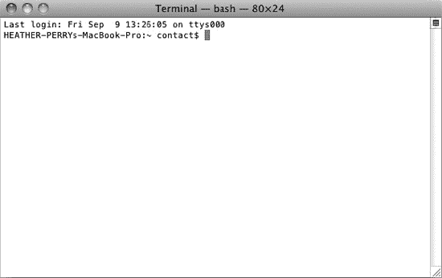
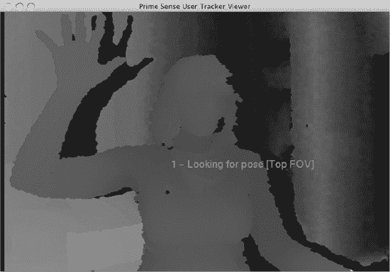
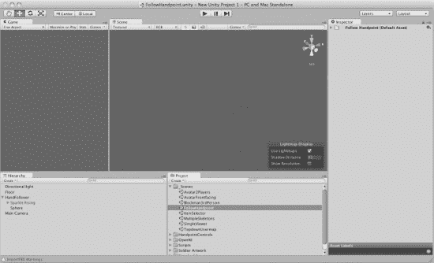
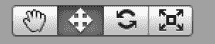
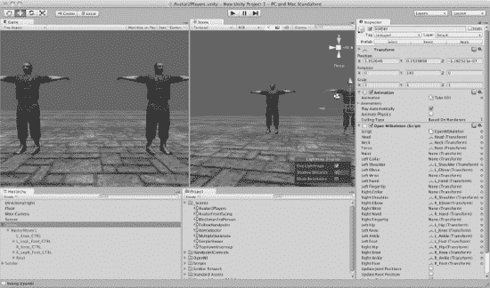
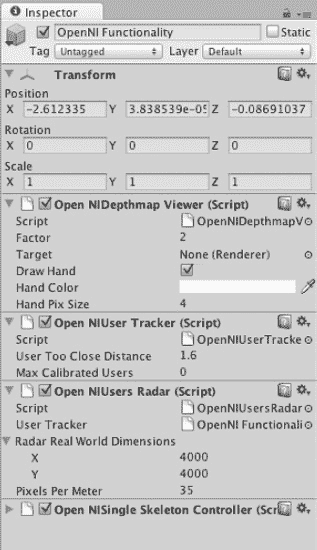
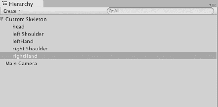
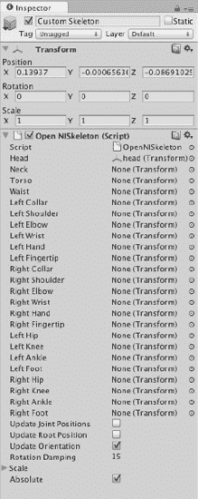
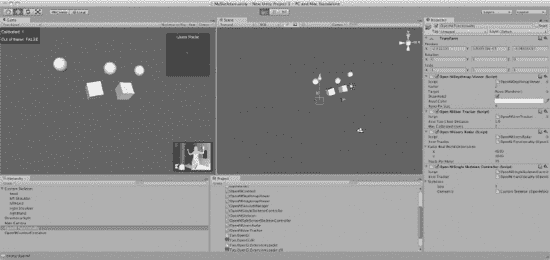
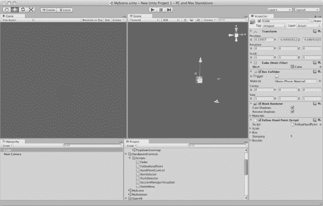

# 第 7 章


## 使用 Unity 制作 3D 游戏与用户界面

本章我们将使用一款非常流行的游戏引擎——Unity。通过在 Unity 中集成 `OpenNI`、`NITE` 和 `Sensor Kinect`，我们将能够控制一个 3D 角色以及多个用户界面。在介绍完主要组件后，我们将从零开始逐一构建相应的示例。

游戏引擎是为创建和开发视频游戏、装置空间及界面而设计的系统。使用游戏引擎能做的事情远不止于制作游戏。Unity 常被用于创建建筑装置和 3D 用户界面。游戏引擎专为移动设备、计算机和游戏主机而设计。大多数引擎都提供 2D 和 3D 图形的渲染引擎、物理引擎（用于碰撞检测和物理模拟）、音频、脚本、动画等功能。游戏引擎是一个实时 3D 环境，可以轻松地以多种方式加以改造利用。它既能创造出精彩的响应式环境、3D 投影映射和交互式展示，也能同样轻松地制作游戏。

那么，游戏引擎到底是什么？它是一种游戏制作工具，与 3D 软件包有所不同。你通常不会用引擎来建模你的 3D 角色，而是用来将它们整合在一起，变成一个可玩的游戏。行业内各个层次的 3D 软件包都能导出引擎支持的格式。如果你是 3D 新手，想免费尝试一下，可以看看 Blender 和 Google SketchUp。对于更专业的用户来说，你很可能已经在使用 Maya 或 3D Studio Max 了。如果你是学生，Maya 也提供免费的教育版。请注意，`.fbx` 文件是 Unity 原生的支持格式，Unity 会将所有多边形转换为三角形多边形。

Unity 是一个出色的游戏平台，与价格昂贵得多的引擎（如虚幻引擎）相比也颇具竞争力，但它提供免费版本。如果使用 Unity 创建的游戏或应用总收入超过 10 万美元，则需要购买 Unity 的许可证。这使得免费版非常适合初学者。该免费版限制了游戏的复杂性，并禁用了一些专业功能，例如移动端功能，但你仍然可以利用可用的工具制作出不错的游戏。

Kinect 极大地激发了开源社区的活力。在 Open Kinect 社区成功将 Kinect 的数据流转换为可用数据后，独立开发领域随之活跃起来。世界各地涌现了各种游戏、艺术装置以及其他实验性的计算机用户交互方式。

### 安装 Unity 及配套软件

让我们开始吧。首先，从 [`http://unity3d.com/`](http://unity3d.com/) 下载 Unity。像安装平台上的其他应用程序一样安装 Unity。我将在本示例中使用 Mac OS X 10.6.8，但 Unity 本身与平台无关，我们之后将运行的 ZigFu 脚本也是如此。

 **注意** 本章基于 Unity 3.4 版本创建。旧版本与本教程涉及的软件不兼容。

接下来，我们将使用 ZigFu 提供的一个极其简单的安装脚本。ZigFu 创建了一个包含单个安装脚本的软件包，该脚本整合了 `OpenNI`、`Sensor Kinect` 和 `NITE`。ZigFu 的独特之处在于，它由两位前 PrimeSense 员工以及另外两位开发者共同编写。PrimeSense 正是创建 `NITE` 的公司。因此，这些用于 `OpenNI` 的 Unity 脚本是目前最稳定的，并且具有开源的优点。ZigFu 的团队成员是 Amir Hirsch、Ted Blackman、Roee Shenberg 和 Shlomo Zippel。当被问及名字的由来时，他们引用了 90 年代的网络迷因“All Your Base Are Belong to Us”。此外，他们将在 Kinect 前移动的动作称为“zigging”。从 [`www.Zigfu.com`](http://www.Zigfu.com) 下载安装脚本。同时，也从 [`www.Zigfu.com`](http://www.Zigfu.com) 下载 Unity 包。我们将导入这个包，以便在 Unity 中运行 Kinect。解压这些文件，并将它们移动到你的“文档”文件夹中。

 **警告** ZigFu 建议在运行其 `install.sh` 脚本之前，完全卸载 Open Kinect、NITE 和 OpenNI。我发现卸载并非必要，但你也许希望遵循 ZigFu 的建议。

以下是在 Mac 上执行 ZigFu 安装脚本的步骤。在 Windows PC 上的过程类似，甚至可能更简单，因为 Windows 安装程序可以让你一键完成所有操作。

1.  打开一个终端窗口。在 Mac 上，通过依次进入 Mac  应用程序  实用工具  终端 来打开它。

    终端窗口应该会打开，你可能会看到类似 图 7-1 的画面。

    

    ***图 7-1.** Mac OS X 终端窗口*

2.  导航到你下载的安装脚本所在的文件夹。例如，我在我的系统上执行了以下命令：`cd Documents/ZigFuOpenNIMac`
3.  执行以下命令，以 root 用户身份运行安装脚本：`sudo sh install.sh`
4.  `sudo` 命令对你来说可能比较陌生。在你的 Mac OS 中，有一个超级用户（即 root 用户），用于系统管理。这个用户帐户拥有你的普通帐户所不具备的权限。`sudo` 命令允许你以 root 这个特殊用户的身份执行单条命令。
5.  系统会提示你输入用户密码。输入密码。安装过程会开始运行，终端窗口中会出现以下代码行。

    ```
    You Know What You Doing (Installing OpenNI)
    Installing OpenNI
    ****************************
    copying shared libraries…OK
    copying executables…OK
    copying include files…OK
    …
    *** DONE ***
    For Great Justice… (Type "sh test.sh" to run the UserTracker demo)
    ```

6.  现在，我们将通过运行测试脚本来确认一切安装正确。输入以下命令并按回车：`sh test.sh`
7.  应该会弹出一个窗口，你应该能看到自己正在移动，如 图 7-2 所示。图中展示的是一个深度图。深度图是一种图像通道，包含与从某个视点（此处为 Kinect）到场景对象表面距离相关的信息。

安装完成！你已经准备好继续前进，探索 Unity 提供的功能了。在继续之前，请务必关闭 PrimeSense User Tracker Viewer，以避免与后续示例发生冲突。



***图 7-2.** Unity 生成的 Kinect 深度图*

### 探索 Unity 界面

启动 Unity。让我们一起来创建一个项目并探索其界面。

#### 项目

以下是创建项目的方法：

1.  从菜单中选择 File  New Project。
2.  始终导入 Unity 的 Standard Assets 是一个好习惯。在弹出的窗口中，你会看到一长串可以包含到项目中的选项。选择 Standard Assets，然后点击 Create Project。
3.  为所有示例导入 ZigFu Unity 包。首先，从菜单中选择 Assets  Import Package  Custom Package。
4.  导航到你的“文档”文件夹，导入以下文件：`UnityOpenNIBindings-v1.1.unitypackage`
5.  在随后弹出的窗口中，让 Unity 自动导入项目所需的所有相关库。

现在，Unity 应该打开了几个选项卡。你首先要做的是注意左上角有两个选项卡：Scene 和 Game。点击 Game 切换到游戏选项卡。


#### 工作区

为了更方便地在 Unity 中工作，请选中 `Game`（游戏）标签页并将其拖拽至左侧。它会自动弹出成为一个独立的标签页区域。两个窗口之间的灰色分隔条可以通过拖拽进行调整。移动标签页后，你应该会看到与图 7-3 类似的结果。



***图 7-3.** Unity 工作区*

左侧的标签页现在是 `Game Viewer`（游戏视图）。在此标签页中，你可以从摄像机的视角看到当前场景在 3D 空间中的所有内容。3D 空间中的摄像机工作原理与普通摄像机相同，需将其定位以便框选场景中所有合适的视觉元素。

`Game Viewer` 右侧的标签页是 `Scene Viewer`（场景视图）。此标签页显示所选场景的 3D 世界。你可以将场景视为关卡。游戏中的每个关卡都需要创建一个场景。在 `Scene Viewer` 的右上角，有一个在许多 3D 软件包中都能找到的奇异生物，称为 `Gizmo`（小控件），没错，这就是它的官方名称。别害怕，只要你不在午夜后喂食或者把它弄湿，它就不会繁殖。它会显示 X、Y、Z 轴以及透视视图。在这个彩色场景中，你可以将 X、Y、Z 轴轻松地记忆为 R、G、B 色。点击并旋转 X、Y、Z 轴或中心立方体（透视视图）轴，即可从这些角度观察游戏。

 **注意** 从不同角度观察并不会移动摄像机，它只改变用户在当前场景中的观察视角。

最右侧的最后一个标签页是 `Inspector`（检视面板）。如果你熟悉 Flash，可以将其视为属性检查器。`Inspector` 允许你设置所选对象组件的属性。`Inspector` 还允许你为游戏对象附加脚本，从而在 Unity 中引入功能。这正是 ZigFu 实现其示例工作方式的核心。ZigFu 设计了一个包含游戏对象的基本场景，然后将脚本附加到这些游戏对象上，以便与 OpenNI 进行绑定。

你会在工作区底部看到两个标签页。左下角的标签页是 `Hierarchy Viewer`（层级视图）。此标签页中的所有内容实际上都是你游戏中的对象。右下角的标签页是当前项目的 `Project`（项目）文件夹。该文件夹中的所有内容都存放在 `User`  `New Unity Project 1`  `Assets`（资源）目录下。任何添加到 `Assets` 文件夹中的内容都会自动在此标签页的视图中更新。不过，只有当该对象通过拖拽添加到 `Scene`（场景）或 `Inspector`（检视面板）中后，它才会出现在游戏里。

#### 基本导航与变换工具

现在，我们来了解环绕标签页的各种按钮。你左上角的按钮（图 7-4）是基本导航和变换工具，其快捷键与大多数 3D 应用程序一致。



***图 7-4.** 基本导航与变换工具*

图 7-4 中的按钮从左到右依次具有以下功能。括号中的字母为键盘快捷键。

*   `Hand`（手形）工具（`Q`）允许你在 3D 世界中移动视角。
*   `Move`（移动）工具（`W`）允许你在 `Scene`（场景）标签页中移动选中的游戏对象。
*   `Rotate`（旋转）工具（`E`）允许你在 `Scene`（场景）标签页中旋转选中的游戏对象。
*   `Scale`（缩放）工具（`R`）允许你在 `Scene`（场景）标签页中缩放选中的游戏对象。

另一个好用的键盘快捷键是 `F`。按下键盘上的 `F` 键，`Scene`（场景）标签页会聚焦于你在 `Hierarchy`（层级）标签页中选择的任何游戏对象。

#### 播放控制

再往右的按钮是播放控制（图 7-5）。


***图 7-5.** Unity 的播放控制*

`Play`（播放）按钮用于运行当前场景。如果在场景播放时再次按下 `Play` 按钮，场景会停止。Unity 有一个特定的界面特性需要留意：如果处于 `Play`（播放）模式，这些按钮会变为蓝色。在此模式下，如果在 `Inspector`（检视面板）中对游戏对象属性进行了任何更改，当场景停止时，这些更改将会丢失。除非你为 Unity 安装额外的插件，否则无法保存 `Play`（播放）模式下的更改。如果你在 `Play`（播放）模式下发现某个属性更改很满意，请记下该更改，待退出 `Play`（播放）模式后重新输入。

 **提示** 三键鼠标对于在 Unity 的 3D 空间中工作至关重要。三个按键都可用于在 3D 空间中平滑移动场景。按住 `Option` 键并左键单击可以平移透视视图。鼠标中键滚轮可以拉近或拉远场景视图。按下鼠标中键可以切换为 `Hand`（手形）工具。右键单击可以旋转透视视图。`Option`+右键单击可提供额外的 `Zoom`（缩放）工具。

### 理解 ZigFu 与 Unity 的关系

ZigFu 是一组与 `OpenNI` 和 PrimeSense 公司的 `NITE` 绑定的 C# 脚本，它使 Unity 能够访问 `NITE` 的功能。`OpenNI` 是一个开源标准，旨在为新出现的自然交互设备、应用程序和中间件领域创建兼容性。`OpenNI` 是一个抽象层，它将中间件与硬件和应用程序集成在一起。

#### OpenNI 与 NITE

`OpenNI` 主要面向 3D 传感器，但 `OpenNI` 中没有任何内容是专属于 PrimeSense 公司的 `NITE` 或 Kinect 的。`OpenNI` 是一个接口，它允许诸如 `NITE` 之类的中间件开发者获取深度流、骨骼数据、音频、红外 (`IR`)、手部点、RGB 图像和手势检测。`OpenNI` 并不具体关注这些数据点是如何生成的，也不关心它们来自何处。

`OpenNI` 依赖模块来获取设备数据，并将这些数据传入 `OpenNI` 以及任何中间件。任何人都可以为任何摄像头或传感器编写模块，并通过 `OpenNI` 注册。`NITE` 是一种中间件，它赋予数字设备无需可穿戴设备或控制器即可翻译并响应用户交互的能力。

 **注意** 理解 `OpenNI` 的关键点在于，它并非针对特定硬件或中间件。`OpenNI` 可以用于任何符合 `OpenNI` 标准的硬件。例如，你可以将 `OpenNI` 与 PrimeSense 参考设计、微软 Kinect、华硕 Xtion 以及任何符合 `OpenNI` 标准的中间件（如 `NITE`，以及即将推出的 Beckon）配合使用。

因此，`NITE` 是介于 `OpenNI` 和你的应用程序（在此处为 Unity）之间的中介。就 Kinect 而言，PrimeSense 不仅提供了中间件，还制造了 Kinect 内部的运动感应芯片。这在实际上并没有改变任何实质内容，但这算是一个有趣的事实，也体现了 `NITE` 为何如此强大。

#### Unity 与 ZigFu

Unity 允许用户创建脚本，并将这些脚本作为组件附加到游戏对象上。组件是向任何游戏添加游戏功能的方式，它们驱动着游戏对象。ZigFu 创建了用于 Unity 的脚本，以便与 `OpenNI` 进行绑定，或者说“通信”。

ZigFu 创建了示例脚本，帮助用户熟悉 `OpenNI` 的功能。在 ZigFu 出现之前，Unity 的开发者需要自行编写绑定代码。现在，如果开发者有足够的技术和意愿，也仍然可以这样做。鉴于 Unity 的工作方式，你可以非常轻松地将 ZigFu 脚本附加到一个对象上，并将你可能创建的任何自定义脚本附加到同一个对象或其他任何对象上。

Unity 对此类开发的容忍度出奇地高。事实上，Unity 不仅支持一种，而是支持*三种*脚本语言：JavaScript、C# 和 Boo。开发者可以同时使用这三种语言，无需只选择其中一种。你游戏对象的一个组件可以用 C# 编写，另一个则可以用 Boo 编写。


### 运行 ZigFu 游戏示例

前往你的 `Project` 文件夹，打开名为 `_Scenes` 的文件夹。这些是 ZigFu 创建的场景，是演示 OpenNI 功能的示例。其中一些示例需要两个人才能实际使用，所以请准备好找一位朋友，以便在运行多人示例时提供帮助。

ZigFu 将示例分为两类：游戏和界面。在本节中，我们将首先介绍游戏示例，然后再介绍界面示例。

#### Avatar2Players

双击 `Avatar2Players`（需要两人）。你应该会看到两个士兵并排站在地板上，如图 7-6 所示。如果你在 `Scene` 选项卡中看不到它们，请调整视图直到看到它们为止。你可以在 `Hierarchy` 选项卡中选择一个士兵，然后按下键盘上的 `F` 键。场景视图将聚焦于所选对象。



***图 7-6.** Avatar2Players 游戏*

OpenNI 尚未追踪到玩家。这是因为你需要播放每个场景才能开始追踪。现在按下黑色的 `Play` 按钮。

此时，你将在 `Game` 选项卡底部看到一个小小的黄色视口。请确保你和你的同伴在摄像机视图中都可见。你们都需要摆出校准姿势来校准 OpenNI。这个姿势与银行劫案中的“举起手来”姿势完全相同。现在，请举起双手！

确保你的肘部与肩部平行，双手处于同一高度。当 Kinect 捕捉到你和你同伴作为玩家后，你会看到 3D 模型跳转到你们的身体位置。

 **注意** OpenNI 将于 2011 年底移除校准姿势。如果你在此之后阅读本章，可能无需进行校准姿势。试着舞动身体，看看是否被追踪到。如果是，那很好。如果不行，再尝试校准姿势。

现在，让我们更深入地了解一下图 7-6 中的这个场景以及如何导航。请执行以下操作：

1.  点击 `Hierarchy` 选项卡中的 `Soldier`。
2.  将注意力转向右侧的 `Inspector` 选项卡。
3.  展开 `OpenNI Skeleton (script)` 旁边的箭头。

现在可以看到一个列表，列出了你可以通过 OpenNI 访问的所有关节点，以及这些关节点在 Unity 中连接的游戏对象。请注意所有对应的关节点是如何映射到游戏对象上的。来自 OpenNI 的脚本关节点在左侧，场景中的游戏对象列在右侧。它们的命名简单地对应了所连接的关节点名称。单击列表中右侧的任意游戏对象关节点，你将看到它跳转到 `Hierarchy` 选项卡中列出的关联对象。双击将在 `Inspector` 中打开该对象。要返回到 `Soldier`，只需再次在 `Hierarchy` 中单击它即可。

在 `Hierarchy` 选项卡中，你将看到游戏中的所有对象。在这个示例中，有一个 `Directional Light`（方向光），它为场景提供照明。列表中下一个是 `Floor`（地板）。点击它查看附加到该游戏对象的组件。`Transform`（变换）组件存在于每个游戏对象上。接下来，你将看到 `Box Collider`（盒子碰撞器）、包含 `Soldier` 着色器的 `Mesh Renderer`（网格渲染器），以及地板及其各自的 `Normalmap`（法线贴图）。`Mesh Renderer` 从 `Mesh Filter`（网格过滤器）获取几何体，并将其渲染在 `Inspector` 中由对象的 `Transform` 组件定义的位置。法线贴图（或称法线映射）是一种通过应用在对象网格上的 2D 文件来模拟光照和凹陷，从而使对象看起来具有比实际更高多边形数量的方法。创建法线、网格和纹理超出了本教程的范围，但它是每个 3D 工作流程的一部分。请参阅你的 3D 软件手册以了解更多信息。

`Hierarchy` 选项卡中的下一个对象是 `Main Camera`（主摄像机）。打开此对象并注意，上面应用了一个名为 `ExitOnEscape` 的 ZigFu 脚本，它允许你在按下 `Escape` 键时退出游戏。你可以将此脚本添加到任何需要此行为的场景中。该脚本特定于这个 ZigFu 示例，并非 OpenNI 的一部分。

 **注意** 要向游戏对象添加脚本组件，请在 `Hierarchy` 选项卡中选择该游戏对象，以在 `Inspector` 中打开该对象的组件列表。这是一个非常直接的过程，但第一次操作时可能会觉得陌生。你所做的只是通过将一个新组件（脚本组件）拖拽到显示着该游戏对象组件的 `Inspector Window` 中来附加它。每当你在 `Hierarchy` 选项卡中选择一个对象时，都会显示其组件。如果需要帮助，YouTube 上有几个教程视频。此外，请访问 Unity 论坛，网址为 [`www.unity3d.com`](http://www.unity3d.com)。Unity 社区提供了良好的支持；用户论坛上有很多乐于助人的程序员愿意帮助新手。如果你遇到难题，论坛应该是你求助的首选之地。

以下是一些你可以添加到游戏对象上的脚本：

> **ChangeColor** 用于更改 `ItemSelector` 场景中方块的颜色。
> 
> **Exitonescape** 在按下 `Escape` 键时退出游戏。
> 
> **ObjectPeruser** 为每个检测到的用户实例化一个 `Prefab`（预制件），并在 `TopDownUserMap` 场景中使用。
> 
> **StartSessesionMessage** 在未进入会话时显示“执行焦点手势以开始会话”。

下一个对象是传感器对象。选择此对象并注意，在 `Inspector` 选项卡中附加了几个 OpenNI 脚本。传感器对象本身是一个空的游戏对象。Unity 允许你创建空的游戏对象。创建这个空对象是为了附加在场景中运行的脚本。这些脚本都与 OpenNI 功能相关，如下所示：

> **Open NIUser Tracker:** 允许 Unity 追踪用户，最多可达 OpenNI 注册的最大用户数。没有默认的最大数量。
> 
> **Open NIDepthMapViewer:** 在游戏运行时简单地显示 Kinect 深度图。请记住，在游戏运行之前它是不可见的。
> 
> **OpenNIUsers Radar:** 在游戏屏幕上弹出一个深灰色的用户追踪框，并为游戏注册的每个特定用户附加一个编号。如果你想在新创建的场景中使用此脚本，你必须在 `Inspector` 中将其链接到 `Open NIUser Tracker`。
> 
> **Open NISplit Screen Skeleton Control:** 允许屏幕上一次显示两个玩家。这对于分屏的第一人称射击游戏可能很有帮助。

`Hierarchy` 中的最后一个对象是 `Soldier`。`Soldier` 是一个 `Prefab`（预制件）；这就是它显示为蓝色的原因。`Prefab` 是一个可以在游戏中反复使用的游戏对象和组件的集合。它们保存在 `Project` 选项卡视图中。`Prefabs` 是 Unity 中的基本功能。

`Soldier` 实际上是一个 ZigFu 创建的 `Prefab`，你可以将其添加到任何场景中。查看 `Project` 选项卡，打开 `OpenNI` 文件夹，然后打开 `Prefabs`。`Prefab` `Soldier` 就在其中。要将 `Prefab` 添加到场景，只需将 `Prefab` 从 `Project` 文件夹拖拽到 `Scene Viewer` 中即可。


### `AvatarFrontFacing`

`AvatarFrontFacing` 与 `Avatar2Players` 几乎完全相同，但它只有一个 `Skeleton`，并实现了一些附加功能。双击 `AvatarFrontFacing` 并播放场景。做出校准姿势，然后看着自己像士兵一样跳舞。

在层级（Hierarchy）选项卡中选择你的 `Sensor` 游戏对象。注意最后添加的脚本组件 `OpenNIContext`。`OpenNIContext` 脚本允许加载 `.oni` 文件，而非使用实时传感器。（`.oni` 文件是包含预录制骨骼数据的文件。）要录制 `.oni` 文件，请使用 `OpenNI` 附带的 `NIViewer`。（关于录制 `.oni` 文件的更多文档，请参考 OpenNI 手册。）你录制的任何 `.oni` 文件都可以通过 `OpenNIContext` 组件轻松地在 Unity 中链接起来。这是一种无需动作捕捉套件即可实现非常廉价且高效的动作捕捉的简便方法。

### `TopDownUserMap`

`TopDownUserMap` 展示了一个俯视的游戏地图，其中 Kinect 驱动玩家在地板上的位置。层级选项卡中的 `UsersContainer` 对象上附加了 `Object Per Use` 和 `OpenNIUser Tracker` 脚本。

### `Blockman3rdPerson`

`Blockman3rdPerson` 添加了一些新的功能。运行它并观察发生了什么。骨骼由 Unity 游戏对象构成，摄像机在空间中跟随 `Blockman`。

让我们看看层级选项卡，了解这个示例中包含的内容。首先，有一个 `Blockman Container`。展开它可以找到 `Blockman Prefab`。这是另一个你可以在任何项目中使用的 ZigFu 预制件。点击 `Blockman` 在检视面板（Inspector）中打开它。注意一些新内容：在关节列表之后，再次出现了三个复选框。这次，与 `Soldiers Prefab` 不同，`Update Joint Positions` 选项是勾选的。取消勾选该选项并重新运行示例。看到区别了吗？当你移动时，游戏对象不再改变旋转方向。实际上，整个骨骼现在已经错位了。重新勾选该选项以恢复正确设置，然后继续前进。

接下来，查看摄像机设置。在层级选项卡中选择 Camera，然后在检视面板中注意新的脚本 `Smooth Follow`。`Smooth Follow` 是一个默认的 Unity 脚本，可以在我们项目开始时导入的标准资源（Standard Assets）文件夹中找到。在项目（Project）选项卡中，打开 Standard Assets 文件夹，然后打开 Scripts 子文件夹。`Smooth Follow` 就在这里，它可以被拖放到任何摄像机上，并指示要跟随哪个游戏对象。在这里，该脚本使摄像机跟随 `Blockman's Head`。

`Sensor` 再次位于层级选项卡的底部，看起来与之前的示例非常相似。它是一个附加了 OpenNI 脚本的空游戏对象。这里我们使用 `Open NISingle Skeleton Controller`，就像在 `AvatarFrontFacing` 示例中一样。

### 运行界面示例

接下来，我们将查看用于创建用户体验的下一个示例。在项目选项卡的 `_Scenes` 文件夹中打开并播放 `FollowHandPoint`。试一试。是不是很闪耀？你会看到 Unity 默认的椭球粒子发射器（Ellipsoid Particle Emitter）组件在后台运行，同时 OpenNI 脚本追踪一个球体。

这里发生的一切是：`Follow Hand Point (script)` 脚本被附加到层级中的 `Hand Follower` 对象上。该脚本位于项目选项卡中 Scripts 子文件夹 `HandpointControls` 内。打开并记下它。稍后我们将用它从头开始构建一个示例。

在层级选项卡的 `Hand Follower` 内部，是容纳另外两个我们尚未介绍的游戏对象（粒子系统）的父级游戏对象。粒子系统是一个由模糊粒子组成的系统。它们经常被用来生成星星、火焰和其他自然现象。这些系统可以以有趣的方式被使用甚至滥用。虽然粒子系统超出了本章的范围，但它们值得未来深入探究。像创建其他任何游戏对象一样创建它们，选择以下菜单选项：

> **主菜单  游戏对象  创建其他  粒子系统**

 **注意** 以下场景更为复杂，可能不适合初学者；然而，任何人都可以运行并播放它们。此外，欢迎初学者根据自己的需求修改示例，直到他们对 Unity 有更好的理解。这些场景是为对创建界面感兴趣的高级用户准备的。

### `Item Selector`

`_Scenes` 文件夹中的下一个示例是 `Item Selector`。现在打开并播放这个场景。这个示例展示了界面设计的新功能。在层级选项卡中，有六个对象：一个摄像机、四个平面和一个名为 `Static Menu` 的空游戏对象。所有的 OpenNI 脚本都附加在这里。选择 `Static Menu` 并注意检视面板中的脚本。

#### 项目选择器脚本

`Static Menu` 游戏对象上附加了该场景的所有脚本。选择 `Static Menu` 以在层级选项卡中显示其组件。展开 `Static Menu` 脚本的 `Items` 箭头。这个脚本可以根据需要容纳任意数量的游戏对象。只需将游戏对象拖放到你希望它们附加到的元素上即可。`Element 0` 对应 `Plane 1`，依此类推。

 **注意** `Static Menu` 脚本是一个复杂的复合手部点控制脚本，它会对来自 ZigFu 提供的基础构建块的底层事件做出反应。要打开脚本并查看其构成，请在检视面板中右键点击它，然后选择 `Edit Script`，或者点击脚本名称最右侧的齿轮图标。

复选框 `Select on Push` 是我们的第一个手势。推（Push）动作就是在空间中用手快速向前推。实际上并没有太多技巧。在场景播放时尝试几次，感受一下。当你在其中一个平面上成功执行此操作时，盒子会从绿色（高亮）变为蓝色（选中）。

附加到此游戏对象的下一个脚本组件是 `Push Detector`。`Push Detector` 是 ZigFu 的另一个自定义脚本，不属于 `OpenNI`。对于有更多编程经验的人来说，你可以使用 ZigFu 原语编写自己的检测器，例如：

```
Hand_Create(Vector3 position)
Hand_Update(Vector3 position)
Hand_Destroy()
PushDetector_Push()
PushDetector_Release()
PushDetector_Click()
ItemSelector_Select(int index)
ItemSelector_Next()
ItemSelector_Prev()
```

`Fader` 是另一个自定义的 ZigFu 脚本，它将空间中的物理区域映射到标准化的 0-1 范围。然后，`Item Selector` 可以获取这个 0-1 范围，并将其分割成带有迟滞（hysteresis）的逻辑区域，包括特殊的滚动区域。

当 `Item Selector` 场景运行时，有两个渐变器（Fader），因为 `Push Detector` 在运行时会隐式添加一个。`Push Detector` 的渐变器位于 Z 轴上，另一个渐变器位于 X 轴上。尺寸代表物理尺寸（以毫米为单位），因此 `300` 代表 30 厘米，大约 1 英尺。

#### 项目选择器参数

`Item Selector` 的部分参数如下：

> **项目数量（Number of items）：** 脚本检测到的逻辑项目数量。
>
> **迟滞（Hysteresis）：** 一个介于 0 和 1 之间的值。它定义了逻辑项目之间的重叠区域，防止选中的索引在两个逻辑区域之间“跳动”。不同的应用需要不同的设置，可以在开发过程中进行调整。
>
> **滚动区域（Scroll Region）：** 范围中专门用于滚动区域的比例。例如，`0.2` 意味着两侧各 20% 的区域用于滚动（发送 `Next` 和 `Prev` 消息）。


### 项目选择器操作

要全面理解`Item Selector`（项目选择器）的功能，请创建一个空白游戏对象，并将一个淡入淡出控制器和项目选择器拖入该对象。此外，添加一个新脚本，用于监听`Item Selector`消息并将其打印出来。让我们创建一个脚本来向控制台输出哪些项目被选中。要创建脚本，请前往主菜单  Assets（资源）  Create（创建）  C# Script（C# 脚本）。在项目中为脚本命名。在层级面板中选择该脚本，然后选择 Open（打开）。这将打开 Unity 的脚本编辑环境。输入以下代码：

```
void ItemSelector_Select(int index)
{
  print("Item selector select " + index);
}
void ItemSelector_Next()
{
  print("Item selector next");
}
void ItemSelector_Prev()
{
  print("Item selector prev");
}
```

现在，将脚本添加到您创建的游戏对象上。此外，您还需要在检视面板中手动将 Fader（淡入淡出控制器）链接到`Item Selector`（项目选择器）。这将在控制台中打印您当前聚焦的元素。要查看控制台，请按`Shift+Com+C`或前往主菜单  Window（窗口）  Console（控制台）。

各种等待时间控制着滚动的重复逻辑（类似于按住键盘上的某个键：先触发第一次按键，稍作停顿，然后重复按键并逐渐加速）。`Session Manager`（会话管理器）等待焦点手势并启动一个手部指向会话。`Session Manager`在屏幕左侧（仅在播放模式下可见）显示的标题是隐式添加的，例如`OpenNIContext`，但如果您想更改默认设置（例如，要监听哪些手势），也可以显式添加。

`OpenNISessionManager`为`HandTracking`（手部追踪）和`GestureDetection`（手势检测）的 OpenNI 流提供了一个封装器。此模型的主要优势在于，手势检测器基于原始深度流，无需骨骼检测器。这意味着，即使您裹着毯子坐在沙发上，不像任何人形，ZigFu 的手部追踪器也能正常工作。只需做出手势，您就能掌控一切！

### CoverFlow（封面流）

`CoverFlow`创建了基本的旋转木马式用户体验。菜单游戏对象包含一个手部指向控制器、淡入淡出控制器、滚动菜单和虚拟馈送器。滚动菜单仅为场景添加了滚动功能。您可以设置方向、窗口大小、阻尼和滚动区域大小。静态菜单和滚动菜单的主要区别在于，滚动菜单将成为所有添加给它的子对象的实际父级。

以下是`Scrolling Menu`（滚动菜单）组件的主要属性的详细说明：

> **Direction（方向）：** 菜单项之间的距离
> 
> **RepositionBasedOnBounds（基于边界重新定位）：** 菜单布局项应基于其实际边界，还是仅基于“Direction”属性？
> 
> **WindowSize（窗口大小）：** 在开始滚动前，屏幕上显示的项目数量。传递给`ItemSelector`
> 
> **ScrollRegionSize（滚动区域大小）：** 传递给`ItemSelector`

虚拟馈送器仅生成虚拟网格，是一个自定义的 ZigFu 脚本。在层级面板中选择链接到此脚本的`Menu Item`（菜单项）组件后，您可以更改网格颜色和其他特性。

### Slide Viewer（幻灯片查看器）

`Slide Viewer`是一个基本的幻灯片查看器，其性质与`CoverFlow`非常相似。然而，它使用的不是虚拟馈送器，而是来自文件夹的图像馈送器。Path（路径）是您设置这些图像路径的位置，而 Search Pattern（搜索模式）则用于指定您希望从该目录中包含的文件类型。

### 从头创建骨骼

Unity 和 OpenNI 是一个强大的组合。利用它们，您可以从头创建骨骼。以下步骤将引导您完成整个过程。骨骼是一个术语，与 API 可以检测到的所有可能的关节的可视化相关联。在这里，我们将制作一个“火柴人骨骼”。您对此感兴趣的原因是为了确认您的追踪是否正常工作，并随后将默认游戏对象替换为在 Maya 等程序中创建的真实图形。骨骼、绑定和角色动画超出了本教程的范围，但所有 3D 软件包都有大量关于如何执行此操作的文档。此外，请参阅 Unity 手册以获取针对 Unity 的说明。

#### 任务 1. 添加 OpenNI 功能

第一步是创建一个新场景并添加一些 OpenNI 功能。请遵循以下步骤：

1.  前往主菜单。选择 File（文件）  New Scene（新建场景）。
2.  将场景保存为`MySkeleton`。
3.  在该新场景中，创建一个空的游戏对象并向其添加 OpenNI 脚本。选择主菜单  Game Object（游戏对象）  Create Empty（创建空对象）来创建一个新的游戏对象。
4.  将游戏对象重命名为`OpenNI Functionality`。通过按`Ctrl`+右键单击并选择 Rename（重命名）选项来执行此操作。注意：您实际上可以指定任何您喜欢的名称。例如，在 ZigFu 场景中，游戏对象被称为`Sensor`。它所做的只是持有与 OpenNI 通信的组件脚本。
5.  现在转到 Project（项目）选项卡并打开 OpenNI 文件夹。确保`OpenNI Functionality`游戏对象在层级面板中被选中并在检视面板中打开。现在单击并将`Open NIDepthmap Viewer`拖入检视面板。对`OpenNIUser Tracker`、`Open NIUsers Radar`和`Open NISingle Skeleton Controller`执行相同操作。
6.  现在我们需要将`OpenNI Tracker`连接到`Open NIUsers Radar`以使雷达工作。只需选择`Open NIUser Tracker`并将其拖到`Open NIUsers Radar`脚本上即可。图 7-7 显示了正确的配置。



***图 7-7.** OpenNI 用户追踪器配置*

现在您已经连接了必要的 OpenNI 功能，可以继续制作一个基本骨骼了。


好的，作为一名高级文档工程师和翻译员，我将严格遵循您提供的注意事项和示例格式，将以下英文文本翻译成中文。


#### 任务 2：制作基本骨架

让我们开始创建第一个骨架吧。请遵循以下步骤：

1.  从主菜单创建一个空的游戏对象。选择以下选项：主菜单  游戏对象  创建空对象。
2.  您的新空游戏对象现在将出现在层级（Hierarchy）选项卡中。选中该对象，并按 Ctrl+右键点击。选择重命名。将对象重命名为 `Custom Skeleton`。
3.  现在，按如下方式创建一个新的球体对象：主菜单  游戏对象  创建其他  球体。
4.  现在，在层级（Hierarchy）中，将球体添加到 `Custom Skeleton` 中。只需选中球体并将其拖拽到 `Custom Skeleton` 字样上。拖拽时会出现一个黑色箭头。当您看到黑色箭头时，松开鼠标。
5.  `Custom Skeleton` 旁边应该有一个下拉箭头，球体应该位于其中。这个球体将作为我们的头部。让我们将其重命名为 `Head` 以保持一致。按 Ctrl+右键点击，然后选择重命名选项进行重命名。
6.  选中球体，使用移动工具将其向上移动。选中对象后，移动工具会自动激活。单击绿色箭头，将球体在 Y 轴空间向上移动。
7.  对两只手重复步骤 3-6。创建两个新的球体，将它们添加到 `Custom Skeleton` 中，并重命名。然后定位它们。由于这些对象的位置实际上将由用户生成，因此这些位置仅在非播放模式下对游戏开发者有益。

 **注意**：这种创建作为更大对象一部分的对象的过程称为父级化。我们正在将球体对象作为子级添加到它们的父级 `Custom Skeleton` 中。

8.  为左肩和右肩创建两个立方体。执行与球体完全相同的操作，但选择创建立方体：主菜单  游戏对象  创建其他  立方体。

现在，层级（Hierarchy）选项卡应类似于 图 7-8 所示。



***图 7-8.** 添加三个球体和两个立方体后的自定义骨架层级结构*

通过照亮场景来结束此任务。通过从以下菜单选项添加一个方向光来实现：主菜单  创建其他  方向光。

#### 任务 3：将部件连接起来

现在是通过链接游戏对象和组件来让骨架工作的时候了。具体操作如下：

1.  首先，将 `Custom Skeleton` 游戏对象连接到 `OpenNI Skeleton`。（ZigFu 使这个过程几乎毫不费力。）转到项目（Project）选项卡，打开 `OpenNI` 文件夹，然后打开 `Scripts` 子文件夹。滚动直到看到 `OpenNISkeleton`。选中它，并将其拖拽到 `Custom Skeleton` 游戏对象上，就像我们对球体和立方体所做的那样。
2.  接下来，您必须将 `Custom Skeleton` 中的对象（我们之前创建的形状）连接到 `OpenNISkeleton` 中相应的关节。在层级（Hierarchy）选项卡中选择 `Custom Skeleton`。在检查器（Inspector）选项卡中，应该会有 `OpenNISkeleton` 的脚本。点击此脚本旁边的箭头以展开所有关节。在层级（Hierarchy）选项卡中选中并拖拽在 Unity 中创建的 `Custom Skeleton` 下的 `Head`，将其拖到 `OpenNISkeleton` 脚本中的 `Head` 上。您的结果应类似于 图 7-9。请特别注意图中底部列表的第二项，即 `Head` 项。



***图 7-9.** 链接到 OpenNISkeleton 脚本的 Head 项*

3.  对 `Right Hand`、`Left Hand`、`Right Shoulder` 和 `Left Shoulder` 重复步骤 2。如果检查器（Inspector）切换到层级（Hierarchy）中选中的对象（如立方体或球体），只需点击并稍微快一点拖拽即可。
4.  在关节列表之后，有三个复选框，用于告知 Unity 如何相对于骨架移动这些对象的变换。按如下方式设置这些复选框：

**更新关节位置：** 选中此框。此框允许对象的变换发生变化，以匹配骨架上关节的旋转。如果模型是在 3D 软件包中创建的，则无需选中此项，因为很可能不需要移动关节位置，只需旋转关节即可。

**更新根位置：** 这将在 3D 空间中更新游戏对象（`Custom Skeleton`）相对于用户的位置。如果选中此项，对象将随用户在 3D 空间中移动；否则，即使关节会移动，游戏对象也会保持在固定位置。

**更新方向：** 选中此框。这会更新关节在 3D 空间中的旋转。

5.  剩下的选项是缩放。展开此菜单。OpenNI 中的默认测量单位是毫米，而 Unity 中是米。此选项会按比例缩放游戏对象。对于本练习，请将 X、Y 和 Z 的缩放比例更改为 `0.008`。
6.  现在在层级（Hierarchy）选项卡中选择 `OpenNI Functionality`，以便您可以在检查器（Inspector）中访问其组件。在检查器中，找到 `OpenNISingle Skeleton Controller` 脚本。展开箭头以显示此组件的所有属性。从层级（Hierarchy）选项卡中将 `Custom Skeleton` 拖拽到 `OpenNISingle Skeleton Controller` 的 `Skeletons` 属性上。
7.  最后，将 `OpenNI Functionality` 拖拽到 `OpenNISingle Skeleton Controller User Tracker` 上。

这就是神奇的关键！现在运行场景并执行校准姿势。在追踪器锁定您的骨骼后，您应该会看到类似于 图 7-10 的结果。



***图 7-10.** 运行中的自定义骨架*

### 创建自定义手部追踪器

最后一项任务，让我们从头开始制作一个自定义手部追踪器示例。创建一个新场景并将其命名为 `MyScene`。现在向场景中添加一个立方体游戏对象，并在层级（Hierarchy）选项卡中打开它。打开 `HandpointControl` 文件夹。将 `Follow Hand Point` 脚本拖拽到检查器（Inspector）中的立方体上。播放场景，进行校准，瞧——手部追踪完成了。ZigFu 就是这么简单。图 7-11 展示了运行中的手部追踪场景。



***图 7-11.** 手部追踪器场景*

最后，值得注意的是，ZigFu 是值得关注的开发者。他们其他有趣的项目还包括一套适用于官方 Microsoft SDK 的 Unity 脚本，截至目前这些脚本无需校准。

`http://groups.google.com/group/unitykinect/browse_thread/thread/7217ea5eaf4d37e2`

此外，他们接下来计划的是将 Beckon SDK 与 OpenNI 封装在一起，这样 Unity 就能与 Beckon 支持的任何传感器无缝协作。扩展的无控制器游戏和界面正变得越来越普遍，甚至在本书发布之日，都会有新的更新可用。总而言之，开发超越鼠标和控制器的游戏和体验，将使任何创作者都处于用户体验设计的前沿。

