# 第 8 章


## 微软 Kinect SDK

微软研究院于 2011 年 6 月 16 日高调发布了其 Kinect for Windows 软件开发工具包（`SDK`），此时距离该设备正式上市仅七个多月。虽然微软最初或许从未打算支持在 Windows 上为 Kinect 进行开发，且该设备引发的浓厚兴趣很可能令其始料未及，但如今微软正在积极支持这一平台——你需要密切关注微软研究院的更新动态，因为任何纸质书籍都无法紧跟最新发展步伐：

`http://research.microsoft.com/kinectsdk/`

尽管如此，Kinect SDK 及相关资源（例如包含辅助代码和示例代码的 Coding4Fun Kinect 工具包）已足够丰富，可让你利用现有最成熟、最完善的 Kinect 代码来构建应用程序并顺利运行。本文介绍的资源为`C#`、`C++`和`Visual Basic`开发者——乃至勇敢的初学者——提供了一条绝佳途径，让他们能够借助微软极其稳健的代码，开始使用 Kinect 进行用户分割、骨骼跟踪甚至语音识别。（例如，如果你希望利用 Kinect 的多麦克风阵列，Windows SDK 就是最佳工具集。）

 **注意** 为 Windows 编写代码与为 Xbox 编写代码并不相同。微软拥有一个名为`XNA`的独立编程框架和名为`Game Studio`的开发环境，供开发者创建 Xbox Live 独立游戏。截至撰写本文时，Kinect 功能**尚未**在`XNA`中公开，不过内部人士表示这即将实现。本章介绍的 Kinect SDK 仅使你能够为 Windows 平台（而非 Xbox）创建 Kinect 应用程序。

### Coding4Fun

学习新工具的最佳方式通常是观察他人如何利用该工具实现应用程序、构思实验及其他代码杰作。为此，微软设立了 Coding4Fun（图 8-1）网站，专为那些热衷于探索微软技术的爱好者而生。为纪念 2011 年 6 月 Kinect SDK 的发布，微软在华盛顿州雷德蒙德园区举办了一场编程马拉松，30 多位开发者获赠 Kinect、SDK，并在 24 小时内创建了精巧的应用程序，用以展示这套新工具包的可能性。这些应用成为了 Coding4Fun 网站上微软 Kinect 项目展示/资源库的基础。无论你在阅读本章之前、期间还是之后，都值得一访：

`http://channel9.msdn.com/coding4fun/kinect`

Coding4Fun 网站会频繁发布新项目和示例，通常附带源代码，因此它是你寻找能快速启动自己 Kinect for Windows 项目的现成方案时的首选之地。

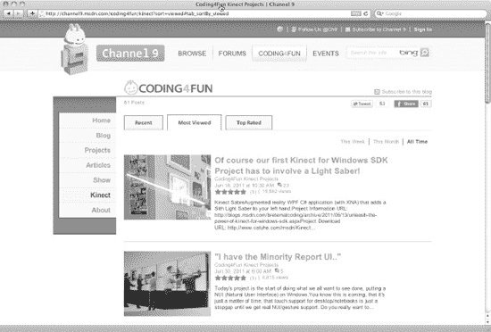

***图 8-1.** Coding4Fun Kinect 专区*

### Kinect SDK 的优缺点

使用微软 SDK 的优势相当显著。它提供了比其他任何软件包都更优秀的应用程序编程接口（API），用于访问 Kinect 特定的硬件功能，例如其四元件麦克风阵列。该 SDK 还附带了微软的 Kinect 运行时及其他支持软件，使你能够借助微软的工程技术和算法实现用户分割、骨骼跟踪以及（如果包含语音 SDK）语音控制，而无需脱离 Windows 强大的应用程序框架。

简而言之，从 Kinect SDK 获得的这些组件非常强大。我们曾运行过本书其他章节讨论过的各种中间件，例如 PrimeSense 的开源`OpenNI`，并用它们实现了一些类似功能。虽然所有这些软件都令人惊叹，但根据我们的经验，微软的 Kinect 代码在性能上表现最佳，其低延迟响应以及无需校准的骨骼跟踪算法堪称神奇。

缺点——至少对你们中的一些人而言——是目前用微软 SDK 所能做的实际上仅限于“为乐趣而编码”，因为其许可证仅允许有限的非商业用途。（你大概也能猜到，微软表示商业用途许可证即将推出，但价格和条款谁也说不准。）此外，如果你不熟悉`C#`、`C++`或`Visual Basic`编程，或不熟悉集成开发环境（IDE）的使用，那么功能强大但令人望而生畏的`Microsoft Visual Studio`及其支持的语言很可能会吓退胆怯者。

至于你们其他人，泡杯咖啡，开始干活吧。

### 开始使用 Kinect SDK

要在 Windows 上搭建 Kinect 开发环境，你需要一台 Kinect、一个空闲的 USB 端口、Windows 7 系统，以及微软提供的大量免费软件，包括适合你编程语言的 Visual Studio 版本，以及来自微软研究院的 Kinect SDK 本身。你所需的一切都在下面的“需求”部分详细列出，同时附带一些常见问题。

#### 需求

使用 Kinect SDK 的要求虽然繁多，但并非不可满足。唯一的成本应该只有你的 PC 和 Kinect。请注意，我泛泛地使用“PC”一词——我能在运行 Windows 7 的 Bootcamp 版 Mac Mini 上成功运行本章的所有内容。不过，截至撰写本文时，你无法通过`Parallels`或`VMware`等虚拟机使用 Kinect SDK。忠告已给。

##### 系统

你需要一台相当新的 PC 来运行本章描述的软件：双核 2.66 GHz 或更快的处理器；支持`DirectX 9.0c`功能（于 2004 年 8 月发布）的 Windows 7 兼容显卡（因此如果你的电脑使用不到五年且运行 Windows 7，应该没问题）；以及至少 2 GB 内存（推荐 4 GB）。当然，你还需要一台 Kinect 传感器！但希望你在第 1 章已经解决了这个问题。

在软件方面，你必须运行 Windows 7（64 位或 32 位版本），并且需要知道你的系统版本才能下载正确版本的 SDK。要查看版本，请进入控制面板系统和安全系统，然后向下滚动查找“系统类型”。你应该会看到“64 位操作系统”或“32 位操作系统”。

##### Visual Studio 2010

如果你是 Windows 开发者，可能已经安装了某个版本的 Visual Studio。任何 2010 版本都可以满足需求，这里推荐 Express 版仅仅是因为它们免费。要下载，只需访问：

`http://www.microsoft.com/visualstudio`

在“产品”选项卡下，根据你计划使用的编程语言，单击 Visual Basic Express、Visual C# Express 或 Visual C++ Express。由于网上许多示例都是用`C#`编写的，因此我们在此处使用`Visual C# Express`。这样，我们就能顺利下载并剖析在网上找到的大部分代码。单击“立即安装”下载并安装`Visual C# Express`。除非有个人原因需要更改，否则请直接使用默认安装选项。

##### 附加框架和支持软件

###### .NET Framework

毫无疑问，你需要在 Visual Studio 中构建应用程序时使用`.NET` 4.0 框架。该框架通常随 Visual Studio 一起捆绑提供，但如果没有，请下载并运行安装程序——它相当大，可能需要一些时间：

`http://msdn.microsoft.com/en-us/netframework/aa569263`

除此之外，此处描述的其他支持软件均为可选。不过，如果你打算深入研究 Kinect for Windows，最好现在就安装这些软件，因为它们会被用在 SDK 附带的一些示例以及网上许多第三方示例中。


###### DirectX 运行时与 SDK

微软的 DirectX 软件由大量主要用于处理游戏所需媒体和图形功能的库组成。例如，Kinect SDK（见下文）附带的示例形状游戏就使用了 DirectX。

微软 DirectX SDK（2010 年 6 月版或更高版本）：

`http://www.microsoft.com/download/en/details.aspx?id=6812`

以及当前的 DirectX 最终用户运行时：

`http://www.microsoft.com/download/en/details.aspx?id=35`

###### 微软的语音平台

同样，这些组件是可选的。然而，它们确实使微软为 Kinect 开发者提供的产品与本书中描述的其他软件包有所区别。如果你计划在应用程序中集成语音识别，或者只是想尝试示例形状游戏的这项功能，请下载这些软件包并运行安装程序。请注意，即使你使用的是 64 位机器，也必须下载 x86（32 位）版本的语音平台软件。64 位版本将无法工作：

> 微软语音平台 SDK，版本 10.2（x86 版）
> [`http://www.microsoft.com/download/en/details.aspx?id=14373`](http://www.microsoft.com/download/en/details.aspx?id=14373)
> 
> 微软语音平台运行时，版本 10.2（x86 版）
> [`http://www.microsoft.com/download/en/details.aspx?id=10208`](http://www.microsoft.com/download/en/details.aspx?id=10208)
> 
> 微软 Kinect 语音平台（美国英语版）
> [`http://go.microsoft.com/fwlink/?LinkId=220942`](http://go.microsoft.com/fwlink/?LinkId=220942)

###### Kinect SDK 和 Coding4Fun Kinect 工具包

最后，是 Kinect 的相关内容！浏览到 Kinect SDK 登录页面（如下所示）并点击“下载”。在这里，你需要根据上文“系统”部分所述的操作系统选择 32 位或 64 位版本。Kinect SDK 登录页面的 URL 是：

`http://research.microsoft.com/kinectsdk/`

运行安装程序。安装完成后，你就可以启动 Visual Studio（在我们的例子中是 Visual C# Express）并开始使用 Kinect SDK 了。

然而，你可能还需要下载最后一个可选的软件包。Coding4Fun Kinect 工具包将我们使用 Kinect 数据时的一些典型任务（例如将原始数据转换为位图图像）封装成了更简单的函数调用，从而让你需要编写的代码更简洁、更干净。该库被用于 SDK 附带的一些示例中，是建议你添加到设置中的一项附加内容。你可以在此处下载该库：

`http://c4fkinect.codeplex.com/`

选择压缩的当前版本，下载并解压。Coding4Fun 库没有安装程序。相反，我们需要在每个要使用该库的项目中添加对其的引用。这是在设置新的 Kinect 项目时，需要在我们的开发环境 Visual Studio 内部完成的任务，具体细节如下。现在，只需将下载并解压后的库存放在你希望保存的任何位置，比如现在应该出现在你文档文件夹中的 Visual Studio 2010 文件夹内。

#### 运行示例并排查问题

在我们尝试构建自己的代码之前，应该先尝试运行 SDK 附带的两个编译好的示例，以确保一切按预期工作。你应该可以通过在“开始”菜单的“程序”中查找来确认 SDK 已安装。现在，“开始”菜单的“程序”下有已编译的示例应用程序： Kinect for Windows SDK  “示例骨骼查看器”和 Kinect for Windows SDK  “示例形状游戏”。让我们启动“示例骨骼查看器”。你应该会看到类似于图 8-2 所示的结果。

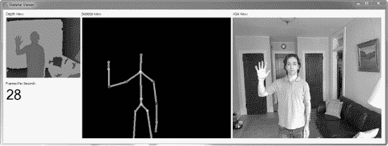

*图 8-2. Kinect SDK 附带的运行正常的“示例骨骼查看器”程序*

如果你收到类似“NuiInitalize Failed”的警报，或者看到图 8-3 中的窗口，那么说明出了问题：

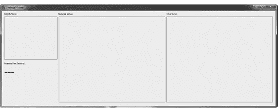

*图 8-3. “示例骨骼查看器”程序运行失败*

在这种情况下，就该进行故障排除了。和往常一样，确保 Kinect 已插入你的电脑，并且电源线已连接到墙上插座。如果你有很多 USB 设备或使用了 USB 集线器，则需要为 Kinect 腾出空间：要么将其直接插入电脑的某个端口，要么如果必须插在集线器上，请确保 Kinect 不与任何其他高吞吐量的 USB 设备共享该集线器。

另一个潜在的麻烦来源是驱动程序。如果你安装了第三方 Kinect 设备驱动程序来运行本书中的任何其他软件包或示例，那么 Kinect SDK 附带的新驱动程序应该会取代第三方驱动程序。但是，如果存在冲突，你可能需要在设备管理器中卸载其他驱动程序（见下文）。

在安装了 SDK 之后首次连接 Kinect 时，Windows 会自动为各种硬件组件安装驱动程序，这些组件现在被识别为 Microsoft Kinect Device、Microsoft Kinect Camera 和 Microsoft Kinect Audio Array Control。如果你查看设备管理器，你应该会在“Microsoft Kinect”列表项下找到这三个组件。但是，如果你在通用的“人体学输入设备”列表项下仍然看到“Xbox NUI Motor”、“XBox NUI Camera”和“XBox NUI Audio”，则需要右键单击每一个并选择“卸载”。

最后，在进行这些更改后，你可能还需要卸载并重新安装 Kinect SDK 和驱动程序。一旦你在设备管理器中看到“Microsoft Kinect”及其三个组件，就应该没问题了。但如果仍然不行，你需要查看在线论坛来排查你的特定问题。

#### 设置新的 Kinect 项目

如果你是 Windows 开发的新手，你可能希望将此部分加为书签，因为每次你在 Visual C# Express 中设置一个要使用 Kinect SDK 的新项目时，都必须执行我们在此介绍的步骤。

基本上，过程如下：

1.  创建一个新的 Windows Presentation Foundation (WPF) 项目。
2.  添加对 Kinect SDK 和 Coding4Fun Kinect 库的引用。
3.  添加 `using` 语句，告知我们的代码正在使用哪些库。
4.  在我们的应用程序中创建标准的加载和关闭事件，以初始化和取消初始化 Visual Studio 在运行 Kinect 应用程序时使用的资源。

类似的步骤在微软研究网站上的快速入门视频系列中也有介绍。

##### 第 1 步：创建一个新项目

要在 Visual C# Express 中创建一个新的 WPF 项目，只需启动应用程序，然后从主屏幕选择“文件” “新建项目…”或“新建项目…”。在打开的对话框中，选择“WPF 应用程序”，如图 8-4 所示。

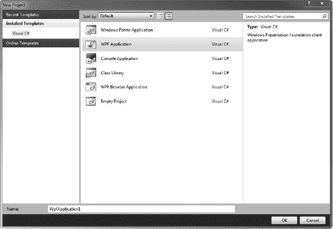

*图 8-4. Visual C# Express 中的新建项目对话框*

Windows Presentation Foundation 简单来说就是 Windows 用来组织和链接 Windows 应用程序中用户界面元素的系统。XML（或 XAML）文件是 WPF 的核心——当你的新项目创建时，你会看到一个名为 `MainWindow.Xaml` 的文件。

###### 第 3 步：添加 `Using` 语句

终于，我们可以开始编码了！你需要从编辑 XAML 文件切换到编辑名为 `MainWindow.xaml.cs` 的 C#（“C-Sharp”）文件。通过点击项目主区域中的 `MainWindow.xaml.cs` 选项卡来完成此操作。你应该会看到如图 8-8 所示的代码。

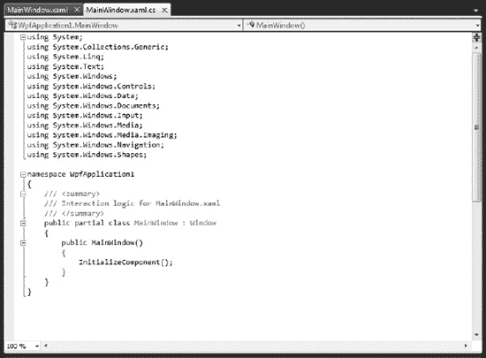

*图 8-8. `MainWindow.xaml.cs` 中的 C# 代码*

你会看到已经有一些 `using` 语句。将光标放在最后一个之后，新建一行，然后输入：

```
using Microsoft.Research.Kinect.Nui;
using Microsoft.Research.Kinect.Audio;
using Coding4Fun.Kinect.Wpf;
```

完成。不过，可别真的照着输入啊！


### 步骤 4：创建加载和关闭事件

再完成一步，我们的 Kinect 项目模板就大功告成了！这一步的原因很简单：我们需要确保在每个使用 Kinect 运行时的应用程序中，都对其进行初始化和反初始化，否则会导致混乱（至少是糟糕的内存管理）。因此，我们将添加一些函数，当应用程序窗口加载时自动初始化该运行时，并在窗口关闭时自动反初始化。

为此，请切换回 XAML 文件选项卡，查看项目窗口右下角的“属性”面板。单击“事件”选项卡，按字母顺序浏览事件列表，直到看到如图 8-9 所示的 `Loaded` 事件。

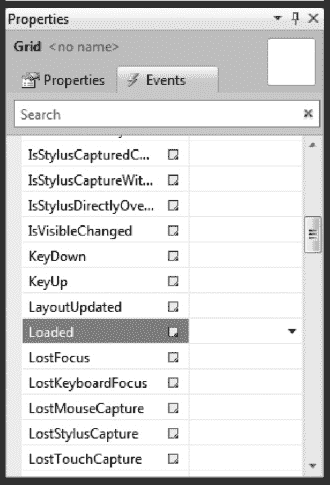

***图 8-9.** 突出显示 Loaded 事件的属性面板*

双击 `Loaded` 事件。Visual Studio 会自动创建一个空的事件回调函数，并切换回包含该函数的 .cs 文件：

```
private void Window_Loaded(object sender, RoutedEventArgs e)
        {

        }
```

现在，重复这些步骤，为应用程序添加一个 `Closed` 事件，这将在 .cs 文件中添加 `Window_Closed` 事件回调函数。我们只需放入初始化和反初始化代码即可完成。幸运的是，Kinect SDK 让这段代码变得超简单。

将光标置于 `Window_Loaded` 函数之前（外部），并为 Kinect 运行时命名，如下所示：

```
Runtime kinect = new Runtime();
```

现在，在 `Window_Loaded` 函数内部，使用 `Initialize()` 函数初始化运行时。该函数接受由 "|" 字符分隔的配置选项作为参数。我们只需告诉应用程序使用 Kinect 的 RGB 彩色摄像头和原始深度数据：

```
kinect.Initialize(RuntimeOptions.UseColor | RuntimeOptions.UseDepth);
```

最后，在 `Window_Closed` 函数内部添加一个 `Uninitialize()` 函数调用：

```
kinect.Uninitialize();
```

完成时，.cs 文件中的代码应如下所示：

```
using System;
using System.Collections.Generic;
using System.Linq;
using System.Text;
using System.Windows;
using System.Windows.Controls;
using System.Windows.Data;
using System.Windows.Documents;
using System.Windows.Input;
using System.Windows.Media;
using System.Windows.Media.Imaging;
using System.Windows.Navigation;
using System.Windows.Shapes;
using Microsoft.Research.Kinect.Nui;
using Microsoft.Research.Kinect.Audio;
using Coding4Fun.Kinect.Wpf;

namespace WpfApplication1
{
    /// <summary>
    /// MainWindow.xaml 的交互逻辑
    /// </summary>
    public partial class MainWindow : Window
    {
        public MainWindow()
        {
            InitializeComponent();
        }

        Runtime kinect = new Runtime();
        private void Window_Loaded(object sender, RoutedEventArgs e)
        {
            kinect.Initialize(RuntimeOptions.UseColor | RuntimeOptions.UseDepth);
        }

        private void Window_Closed(object sender, EventArgs e)
        {
            kinect.Uninitialize();
        }

    }
}
```

太棒了！现在你可以成功生成并运行/调试此应用程序，建议执行此操作以确保没有语法错误。单击图 8-10 中所示的绿色箭头。

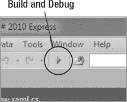

***图 8-10.** 启动生成和调试序列的绿色箭头*

当然，这个应用程序绝对*什么都不做*！*看起来*它什么都没做。但它确实安全地初始化和反初始化了 Kinect 运行时，这样我们想要夹在 `Loaded` 和 `Closed` 事件之间的任何代码都能正确执行。这是我们为每个新 Kinect 项目都希望使用的基本模板设置，因此你可以将其保存在某处，以便需要时复制使用。

现在，我们来构建。

### 构建一个简单的应用

构建 Kinect 应用程序现在只需在 XAML 文件中设计好用户界面（使用 Visual Studio 中的创作工具即可轻松完成），然后在刚刚处理好的 `Loaded` 和 `Closed` 事件之间添加一些执行代码（Coding4Fun 工具包会让这一步变得极其简单）。让我们开始吧。

#### 决定构建什么

像我们介绍过的许多引导示例一样，假设我们只想构建一个类似于“骨骼查看器示例”的简单应用，但我们希望从头开始，以便真正了解其中的要点（示例源码随 SDK 提供，但它们没有使用 Coding4Fun 辅助库，因此相对复杂一些）。本质上，我们希望创建一个能够获取主要原始数据流（彩色和深度图像）、执行一些分析使数据更有用（用户分割和骨骼跟踪）并将其渲染到屏幕上的应用。那么，我们该怎么做呢？

#### 设计用户界面

从上一节创建的模板开始，选择 `MainWindow.XAML` 选项卡。请注意在设计视图（上部）面板中有一个白色的主窗口框。这表示主应用程序窗口，当你启动应用时，它将直接位于窗口框架内部。

如果你单击主窗口框，角落会出现手柄，你可以像图 8-11 那样单击并拖动它们来调整窗口大小。我们只需进行一些简单的点击和拖动，就能按照我们的意愿来布局主窗口及其中的任何对象。

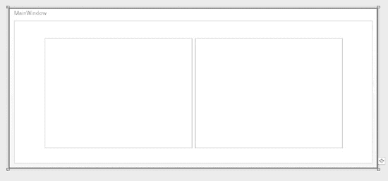

***图 8-11.** XAML 文件的设计视图允许你使用鼠标移动和调整对象大小*

我将主窗口的角拖拽到宽度为 800 像素、高度为 350 像素。当你释放鼠标时，可以在代码视图中看到属性值的变化；你也可以在代码中修改它们，或者在项目窗口左下角的“属性”面板中修改。例如，在代码视图中，我的 Window 标签的属性看起来像这样：

```
Title="MainWindow" Height="350" Width="800" Closed="Window_Closed" Loaded="Window_Loaded"
```

现在，如图 8-12 所示，打开项目窗口左上角的工具箱，从“工具”面板中拖动一个图像对象到主窗口上。就像我们处理主窗口一样，使用手柄、属性面板或 XAML 代码来调整图像对象的大小。只需确保符合 Kinect 640 × 480 分辨率的长宽比。例如，我将它的大小调整为 320 × 240 像素。

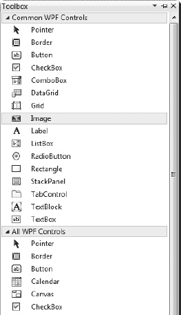

***图 8-12.** Visual Studio 中的工具箱，突出显示了一个图像对象*

然后，你可以复制并粘贴图像对象的另一个实例到主窗口上，这样我们就有一个用于 RGB 图像，另一个用于深度图像。按你喜欢的方式排列它们，注意选定对象的属性面板会显示其默认名称（例如 `image1`、`image2` 等）。如果需要，你可以更改这些名称，但这些名称将在代码中用于以编程方式定位这些对象。说到这里，我们先保持布局不变，开始在 .cs 文件中进行代码连接。


### 用代码连接用户界面

以下是实现此功能的方法：我们将利用 Kinect 运行时的事件，在有新的 RGB 图像数据帧时触发一个函数，在有新的深度数据帧时触发另一个函数。这些函数将更新主窗口中相应图像对象的内容，如此一来，我们就能拥有一个收集并呈现 Kinect 主要数据流的应用程序了。

因此，在 `Window_Loaded` 函数中初始化 Kinect 运行时的代码下方，输入一些代码来监听新帧或 `FrameReady` 事件，并将它们绑定到适当的回调函数（我们稍后会定义这些函数）：

```csharp
kinect.VideoFrameReady += new EventHandler<ImageFrameReadyEventArgs>(kinect_VideoFrameReady);
kinect.DepthFrameReady += new EventHandler<ImageFrameReadyEventArgs>(kinect_DepthFrameReady);
```

接下来，我们必须打开来自 Kinect 设备的这些数据流，以开始生成图像。只需添加：

```csharp
kinect.VideoStream.Open(ImageStreamType.Video, 2, ImageResolution.Resolution640x480,
ImageType.Color);
kinect.DepthStream.Open(ImageStreamType.Depth, 2, ImageResolution.Resolution320x240,
ImageType.Depth);
```

这段代码的含义相当明了：我们使用内置设置和类型来配置并启动每个数据流。`Stream.Open()` 函数的第二个参数（即这里的数字“2”）是唯一可能令人费解的部分：它指的是 `PoolSize`，即用于播放流数据的缓冲区数量。其值必须在 1 到 4 之间。我们选择了 2：一个缓冲区用于显示当前帧，另一个用于加载新帧。增加缓冲区数量会引入延迟，但可能使数据播放更流畅。

最后，为了让这个应用程序运行起来，我们需要定义那些绑定到 `FrameReady` 事件的函数，即 `kinect_VideoFrameReady` 和 `kinect_DepthFrameReady` 函数。同样，这些函数只需用来自 Kinect 彩色和深度数据流的图像数据更新我们的图像对象。借助 Coding4Fun 库提供的 `ToBitmapSource()` 方法，这相当简单：

```csharp
void kinect_VideoFrameReady(object sender, ImageFrameReadyEventArgs e)
{
        image1.Source = e.ImageFrame.ToBitmapSource();
}

void kinect_DepthFrameReady(object sender, ImageFrameReadyEventArgs e)
{
        image2.Source = e.ImageFrame.ToBitmapSource();
}
```

你可能还记得，“image1”和“image2”这两个名称是我们从工具箱拖入主窗口的图像对象所使用的默认名称。如果你在 XAML 文件中更改了这些名称，那么你需要在代码中也进行相应更改。完成这些后，我们就可以构建并运行该项目了。你应该会得到类似图 8-13 所示的输出窗口。


***图 8-13.** 彩色图像与深度图像*

这很简单！但这并没有提供任何 libfreenect 无法实现的功能。神奇之处在哪里？问得好。让我们看看能否添加一些微软的独门秘技！

首先，我们可以尝试获取一个深度图像，用于识别 Kinect 前方场景中的人，这个任务通常称为*用户分割*，但在微软 API 的语境下可能被称为*玩家分割*。使用 Kinect SDK，我们只需更改运行时配置，并将整个代码中的深度图像类型从 `Depth` 改为 `DepthAndPlayerIndex`，即可添加玩家分割功能。这意味着要将初始化代码改为：

```csharp
kinect.Initialize(RuntimeOptions.UseColor | RuntimeOptions.UseDepthAndPlayerIndex);
```

并且像这样更改 `DepthStream.Open()` 中的图像类型：

```csharp
kinect.DepthStream.Open(ImageStreamType.Depth, 2, ImageResolution.Resolution320x240,
ImageType.DepthAndPlayerIndex);
```

然后，我们就能得到类似图 8-14 所示的图像，其中“玩家”在场景中被分割出来，并附有颜色覆盖层。

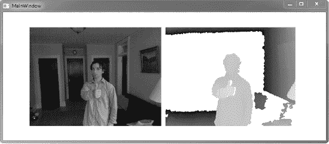

***图 8-14.** 彩色图像与 DepthAndPlayerIndex 图像*

那么，像样的骨骼追踪——也就是让使用 Kinect 传感器进行实际游戏成为可能的技术——该如何实现呢？实际上，在应用程序中实现骨骼追踪并不比实现上述的彩色和深度图像功能更困难。只需在运行时配置中添加一个选项，并增加一个 `SkeletonFrameReady` 事件和相应的回调函数。在 `Window_Loaded` 函数中，需要更改/添加两行代码：

```csharp
kinect.Initialize(RuntimeOptions.UseColor | RuntimeOptions.UseDepthAndPlayerIndex |
RuntimeOptions.UseSkeletalTracking);
SkeletonFrameReady += new
EventHandler<SkeletonFrameReadyEventArgs>(kinect_SkeletonFrameReady);
```

当然，在实践中，要使用骨骼信息，你需要编写一个 `kinect_SkeletonFrameReady` 函数，智能地利用这些数据，将身体关节点映射到应用程序中的对象和控制器等。以下是完整的骨骼查看器代码的简化版本，它负责映射这些数据并将其绘制到屏幕上，产生类似于图 8-15 所示的效果（需要在添加第三个图像对象来显示骨骼之后）：

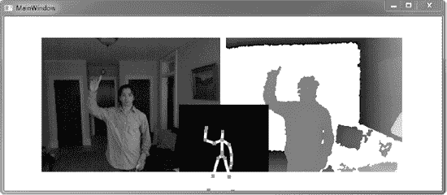

***图 8-15.** 在窗口中央显示骨骼*

该代码部分借用于 Sample Skeletal Viewer，看起来像这样：

```csharp
using System;
using System.Collections.Generic;
using System.Linq;
using System.Text;
using System.Windows;
using System.Windows.Controls;
using System.Windows.Data;
using System.Windows.Documents;
using System.Windows.Input;
using System.Windows.Media;
using System.Windows.Media.Imaging;
using System.Windows.Navigation;
using System.Windows.Shapes;
using Microsoft.Research.Kinect.Nui;
using Microsoft.Research.Kinect.Audio;
using Coding4Fun.Kinect.Wpf;

namespace WpfApplication1
{
    /// <summary>
    /// MainWindow.xaml 的交互逻辑
    /// </summary>
    public partial class MainWindow : Window
    {
        public MainWindow()
        {
            InitializeComponent();
        }

        Runtime kinect = new Runtime();

        private void Window_Loaded(object sender, RoutedEventArgs e)
        {
            kinect.Initialize(RuntimeOptions.UseColor | RuntimeOptions.UseDepthAndPlayerIndex |
            RuntimeOptions.UseSkeletalTracking);
            kinect.VideoFrameReady += new
EventHandler<ImageFrameReadyEventArgs>(kinect_VideoFrameReady);
            kinect.DepthFrameReady += new
EventHandler<ImageFrameReadyEventArgs>(kinect_DepthFrameReady);
            kinect.SkeletonFrameReady += new
EventHandler<SkeletonFrameReadyEventArgs>(kinect_SkeletonFrameReady);
            kinect.VideoStream.Open(ImageStreamType.Video, 2,
ImageResolution.Resolution640x480, ImageType.Color);
            kinect.DepthStream.Open(ImageStreamType.Depth, 2,
ImageResolution.Resolution320x240, ImageType.DepthAndPlayerIndex);
        }

        void kinect_VideoFrameReady(object sender, ImageFrameReadyEventArgs e)
        {
            image1.Source = e.ImageFrame.ToBitmapSource();
        }

        void kinect_DepthFrameReady(object sender, ImageFrameReadyEventArgs e)
        {
            image2.Source = e.ImageFrame.ToBitmapSource();
        }

        void kinect_SkeletonFrameReady(object sender, SkeletonFrameReadyEventArgs e)
        {
            SkeletonFrame skeletonFrame = e.SkeletonFrame;
            int iSkeleton = 0;
            Brush[] brushes = new Brush[6];
            brushes[0] = new SolidColorBrush(Color.FromRgb(255, 0, 0));
            brushes[1] = new SolidColorBrush(Color.FromRgb(0, 255, 0));
            brushes[2] = new SolidColorBrush(Color.FromRgb(64, 255, 255));
            brushes[3] = new SolidColorBrush(Color.FromRgb(255, 255, 64));
            brushes[4] = new SolidColorBrush(Color.FromRgb(255, 64, 255));
            brushes[5] = new SolidColorBrush(Color.FromRgb(128, 128, 255));
```


`canvas1.Children.Clear();`
`foreach (SkeletonData data in skeletonFrame.Skeletons)`
`{`
`    if (SkeletonTrackingState.Tracked == data.TrackingState)`
`    {`
`        // 绘制骨骼`
`        Brush brush = brushes[iSkeleton % brushes.Length];`
`        canvas1.Children.Add(getBodySegment(data.Joints, brush, JointID.HipCenter,`
`JointID.Spine, JointID.ShoulderCenter, JointID.Head));`
`        canvas1.Children.Add(getBodySegment(data.Joints, brush,`
`JointID.ShoulderCenter, JointID.ShoulderLeft, JointID.ElbowLeft, JointID.WristLeft,`
`JointID.HandLeft));`
`        canvas1.Children.Add(getBodySegment(data.Joints, brush,`
`JointID.ShoulderCenter, JointID.ShoulderRight, JointID.ElbowRight, JointID.WristRight,`
`JointID.HandRight));`
`        canvas1.Children.Add(getBodySegment(data.Joints, brush,`
`JointID.HipCenter, JointID.HipLeft, JointID.KneeLeft, JointID.AnkleLeft, JointID.FootLeft));`
`        canvas1.Children.Add(getBodySegment(data.Joints, brush, JointID.HipCenter,`
`JointID.HipRight, JointID.KneeRight, JointID.AnkleRight, JointID.FootRight));`

`        // 绘制关节点`
`        foreach (Joint joint in data.Joints)`
`        {`
`            Point jointPos = getDisplayPosition(joint);`
`            Line jointLine = new Line();`
`            jointLine.X1 = jointPos.X - 3;`
`            jointLine.X2 = jointLine.X1 + 6;`
`            jointLine.Y1 = jointLine.Y2 = jointPos.Y;`
`            jointLine.Stroke = brushes[0];`
`            jointLine.StrokeThickness = 6;`
`            canvas1.Children.Add(jointLine);`
`        }`
`    }`
`    iSkeleton++;`
`} // 遍历每个骨骼`
`}`

`private Point getDisplayPosition(Joint joint)`
`{`
`    float depthX, depthY;`
`    kinect.SkeletonEngine.SkeletonToDepthImage(joint.Position, out depthX, out`
`depthY);`
`    depthX = depthX * 320; // 转换为 320x240 空间`
`    depthY = depthY * 240; // 转换为 320x240 空间`
`    int colorX, colorY;`
`    ImageViewArea iv = new ImageViewArea();`
`    // 此时仅支持 ImageResolution.Resolution640x480 分辨率`

`    kinect.NuiCamera.GetColorPixelCoordinatesFromDepthPixel(ImageResolution.Resolution640x480, iv,`
`(int)depthX, (int)depthY, (short)0, out colorX, out colorY);`

`    // 映射回 skeleton.Width 和 skeleton.Height`
`    return new Point((int)(canvas1.Width * colorX / 640.0), (int)(canvas1.Height *`
`colorY / 480));`
`}`

`Polyline getBodySegment(Microsoft.Research.Kinect.Nui.JointsCollection joints, Brush`
`brush, params JointID[] ids)`
`{`
`    PointCollection points = new PointCollection(ids.Length);`
`    for (int i = 0; i < ids.Length; ++i)`
`    {`
`        points.Add(getDisplayPosition(joints[ids[i]]));`
`    }`

`    Polyline polyline = new Polyline();`
`    polyline.Points = points;`
`    polyline.Stroke = brush;`
`    polyline.StrokeThickness = 5;`
`    return polyline;`
`}`

`private void Window_Closed(object sender, EventArgs e)`
`{`
`    kinect.Uninitialize();`
`}`

`}`

### 需要更多？

在本章中，我们努力为使用微软 Kinect SDK 构建应用程序所需的所有工具提供了详细介绍，但显然，所展示的应用程序相当基础：我们只使用了 Kinect 的摄像头和深度功能（甚至没有涉及音频），以及开箱即用的用户分割骨骼追踪功能。

还有很多事情可以做，如果微软的工具集吸引你，毫无疑问你会想做得更多！这超出了本书的范围，但 Coding4Fun 网站和开放网络上不断增长的示例代码可供你参考，其中许多代码针对特定任务和用例。四处搜索，订阅论坛，并关注微软，因为在最初缓慢支持 Kinect 开发者之后，他们现在正全力推进！

 **注意** 要更深入地了解微软 Kinect SDK，最好的方法是获取 Jarrett Webb 和 James Ashley 的著作 *Beginning Kinect Programming*。该书也由 Apress 出版。

