# 第 9 章

## 体三维显示技术

在本章中，你将熟悉用于视觉图像体三维显示的各种技术。与传统的 2D 屏幕，甚至是最新的基于眼镜的立体 3D 电视和影院体验不同，体三维技术为观看者提供了“全息”图像的感觉，并根据用于在自然 3D 空间中重建显示的技术，提供不同程度的运动视差。运动视差描述的是基于观察者相对于背景中多个静止物体的运动来感知深度的能力。信不信由你，许多人实际上无法感知立体眼镜带来的 3D 效果，因为他们的大脑缺乏完整的立体视觉发育。为什么这些人不会撞到东西？这是因为你头部的每一次轻微移动都会揭示周围环境的深度。这一在任何大众市场 3D 解决方案中都尚未实现的功能，正是这种新颖方法区别于基于眼镜体验的关键所在。

也许科幻领域最著名的体三维显示实际例子来自最初的《星球大战》电影，当时 R2D2 播放了莱娅公主告诉欧比旺·克诺比他是她唯一希望的录像。深度感知摄影技术，例如 Kinect，可以有效捕捉“全息”或体三维视频记录，但并不提供将其回放到体三维 3D 空间的方法。体三维显示器是将这些“全息”体验投射回日常生活维度的关键。在很大程度上，这些显示器仍处于研究前沿，且价格高得令人望而却步，消费者无法在家中体验，今年它们还不会进入你的客厅——但技术进步的节奏会出人意料地飞跃，正如 Kinect 向我们展示的那样。

本章将涵盖新颖显示器类型的全貌，包括那些严格符合体三维显示器的类型，以及许多不符合的类型。它将涵盖那些包含关键特性（如运动视差和屏幕上的多视角）的显示器，以及一些虽然不具备这些特性却仍被公众误称为“全息”的显示器，因为它们的图像悬浮在空中。这是对许多人不熟悉的显示技术的介绍，因为互联网上关于该主题的较新信息收集得很少。这些创新的方法未来很可能会更频繁地出现，也许会相互结合，以满足公众的需求——他们已通过 Kinect 的体三维摄像头受到了启发，并将期望在真正沉浸式的体验中获得超越 2D 屏幕的东西。

### 静态体显示

如果你在过去几年里逛过美国任何大型商场或旅游区，你很可能见过那种提供 3D 人像照片打印的新奇服务，照片会被蚀刻到透明塑料棱镜中（图 9-1），这种工艺被称为“亚表面激光雕刻”。虽然这不是一种可以更新的体显示设备，但它为我们理解第一类显示——*静态体*显示——提供了参考基准。

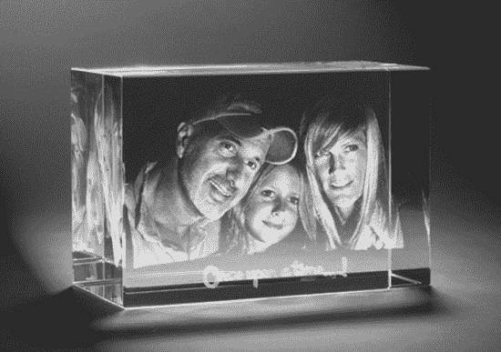

***图 9-1.** 亚表面激光雕刻。图片由 LooxisFL.com 提供*

对于能够像视频一样实时变化、活灵活现的体显示，我们需要研究如何在感兴趣的空间内控制彩色光点的开启和关闭，而不是简单地将静态图像蚀刻在某个位置。实现这一目标的一种直接方法是使用立方体结构的 LED，其中每个发光二极管作为一个体素。图 9-2 展示了这样一个设备。它是由八岁的乔伊·哈迪制作的，他是网站“Look What Joey's Making”（[`http://lwjm.us/`](http://lwjm.us/)）的幕后推动者。乔伊制作了图 9-2 所示的 LED 显示屏用于销售。访问他的网站，立即订购属于你的那一个吧。

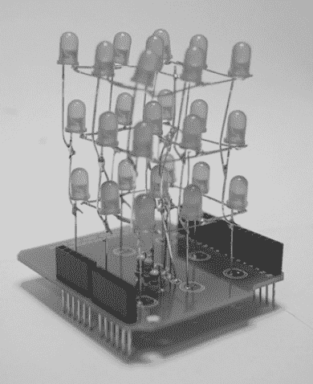

***图 9-2.** 八年级学生乔伊·哈迪制作的**3×3×3** LED 显示屏的 Arduino 扩展板，图片由 lwjm.us 提供*

目前市面上最大的此类商用显示屏之一拥有一个`66×48×24`的 LED 阵列，由 Seekway（[`seekway.com.cn`](http://seekway.com.cn)）制造。这意味着有`76,032`个独立的 LED 灯需要连接成电路，并由微处理器单独寻址。这个设备大约 6 英尺高、1.5 英尺深、3 英尺宽，售价高达数千美元。

 **注意** 对于想要自己动手制作简单 LED 显示屏的爱好者来说，Instructables.com 上的两篇文章是很好的资源。一篇介绍了如何制作一个`8×8`的立方体：[`www.instructables.com/id/Led-Cube-8x8x8/`](http://www.instructables.com/id/Led-Cube-8x8x8/)；另一篇稍微简单一些，介绍如何制作一个`4×4×4`的 LED 立方体：[`www.instructables.com/id/LED-Cube-4x4x4/`](http://www.instructables.com/id/LED-Cube-4x4x4/)。当然，也别忘了乔伊·哈迪的网站[`http://lwjm.us/`](http://lwjm.us/)。

### 向静态体投影

为了克服需要将独立灯珠逐个连接到网格化立方体电路中的难题，一种非常巧妙的技术是直接将光线投射到空间中感兴趣区域的反射材料上。阿尔伯特·黄、马特·帕克和艾略特·伍兹创建了开源设计项目 Lumarca（图 9-3），通过以非常特殊的方式悬挂数百根绳子，使投影仪能够对准这个网状结构，从而产生非凡的效果。借助用于校准的定制软件，并将一台 SVGA（`1024 × 768`）投影仪非常精确地对准线阵，无论每根线在空间中的位置如何——在体积的前部、后部，还是两者之间的任何位置或两侧——每根线都可以被单独寻址照明。每根线都必须精心放置，以免遮挡投影光束照射到其后面的另一根线。

你可以在项目网站 [`madparker.com/lumarca/construction`](http://madparker.com/lumarca/construction) 上找到如何自己动手用不到 100 美元建造一个这样的设备的详细说明。在 2011 年纽约制汇节上，该团队首次展示了一个大约 1 英尺见方的微型投影仪套件。如果进一步小型化，能否将一个小型塑料棱镜中 3D 激光蚀刻的“线”或点与口袋投影仪结合，在固态介质中重现这种显示效果？哥伦比亚大学的研究人员已经朝着这个方向迈出了一步，他们研究了被动光学散射投影技术（[`www.cs.columbia.edu/CAVE/projects/3d_display/`](http://www.cs.columbia.edu/CAVE/projects/3d_display/)）。关于体三维显示，仍有大量研究和开发工作要做，因此将这些技术混合搭配可能会带来前所未有的创新。拓荒者们，前进吧！

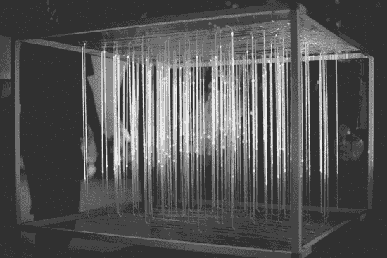

***图 9-3.** Lumarca 体显示，将图像投影到悬挂的绳子上。照片由杰夫·霍华德拍摄*

### 扫描体显示

扫描体显示在许多方面都算是“传统”意义上的体显示。这些设备的专利申请可以追溯到 20 世纪 50 年代和 60 年代，但我们直到最近几十年才开始看到实际应用。扫描体显示利用一个发光的二维截面来呈现立体图像，并通过一种机制快速移动该截面的位置及其内容，使其与正在穿过的空间保持同步，利用视觉暂留效应在空间中印刻出一个三维体图像。

1988 年，纽约科学馆花费了 40,000 美元建造了一个可以交互式显示“量子原子”的体三维显示器。通过一个由计算机控制示波器照亮的往复式机械运动圆盘，一个固体运动物体的各个切片被投射到圆柱体内的空间中，使得观众可以围绕这个交互式电子 3D 图像 360 度行走。该显示器的设计者艾伦·杰克逊发起了一项新计划，旨在利用现代硬件和开源软件，将采用相同往复运动扫描体技术的价格合理的设备交到开发者手中。

艾伦的 VoxieBox（[`voxiebox.com`](http://voxiebox.com)）将自 2012 年起以套件或预组装形式提供。与 Primesense 的 OpenNI 计划类似，VoxieBox 将推广一个由 OpenVoxel.org 开发的用于体显示的开源框架，以吸引一个能够利用这些设备独特能力的开发者社区。Kinect 在让 3D 捕捉技术的开发变得易于获取方面做出了巨大贡献，而 VoxieBox 以及 OpenVoxel 框架将支持的其他设备，则希望在体三维显示领域达到同样的效果。与那些昙花一现、之后未能在公众视野中聚集势头的专有商业设备及研究项目不同，利用开源创新者激情的努力更有可能获得成功。

其中一项研究项目来自南加州大学创意技术研究所。该项目依赖扫描体机制来实现他们的“交互式 360 度光场显示器”（图 9-5）。在该设计中，一台投影仪从上方指向旋转的镜子。这种直接的方法可以作为在可控环境中——例如艺术馆、博物馆或零售场所——重现所需效果的基础，打造一个更独立、无需远程摆放投影仪的装置。有关该系统的更多信息，请访问 [`gl.ict.usc.edu/Research/3DDisplay/`](http://gl.ict.usc.edu/Research/3DDisplay/)。

2002 年，Actuality Systems 公司推出了一款产品，该产品采用了与创造性技术研究所描述的旋转镜系统类似的扫描体技术。他们的设备 `Perspecta`（图 9-4）造价约 30,000 美元，并利用旋转屏幕下方一套精密的光学系统，使设备显著更加紧凑。由于投影并非来自上方，观看者可以将手放在玻璃屏幕顶部而不会中断图像显示。`Perspecta` 设备被推向医疗行业，用于可视化 MRI 扫描仪产生的体积图像。依赖物理运动来扫描图像的系统的缺点之一是，其部件可能会损坏，且比固态系统需要更频繁的更换；同时，干扰屏幕预期运动路径的振动会中断视觉暂留效应。因此，此类系统不适用于车辆内的移动应用，也无法在暴露于旋转机械轰鸣声的环境中使用。或许是由于这款独特产品难以获得市场认可，Actuality Systems 于 2009 年关闭，但其工程师可通过 `opticsforhire.com` 提供咨询服务。

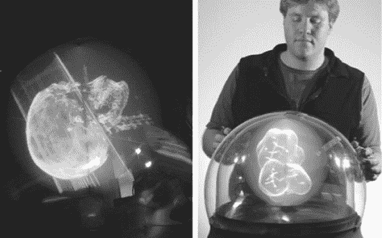

***图 9-4.** Actuality Systems 公司的 Perspecta 体三维显示器。图片由 OpticsForHire.com 提供*

这些扫描体系统的主要缺点之一是对带有运动部件的设备的维护。LightSpace Technologies 公司通过 `DepthCube` 创造了一种卓越的方法来解决这个问题。通过将投影图像快速循环到 20 个垂直堆叠的液晶镀层板之一上，构建出一个具有深度感的切片堆栈。这些 LCD 板在施加电流之前保持不透明，之后变为透明。利用 `DepthCube` 设计，每次只有 20 个板中的一个保持不透明，投影仪可以将正确的图像切片从整个体堆栈投射到该板上。当所有部件同步并以极快速度运行时，视觉暂留效应会将图像切片堆栈融合成一个连贯的立体图像。观看 `DepthCube` 的实际运作，请访问：[`youtu.be/RAasdH10Irg`](http://youtu.be/RAasdH10Irg)。

除专利文件和学术论文外，关于如何自行构建扫描体显示器的在线信息非常少。随着人们对这些独特能力的更多关注，这种情况将会改变。我们需要看到一个由共同兴趣凝聚而成的更大社区，共同推动这项技术进入主流。在此之前，这份关于如何使用 LED 灯构建旋转扫描体的指南能让您了解其中涉及的要点：[`bit.ly/makevolumedisplay`](http://bit.ly/makevolumedisplay)。

如果您需要为 LED 开始显现其局限性的高分辨率显示器配置一个基于投影仪的图像生成器，德州仪器的 `DLP` 开发套件（[`bit.ly/dlpdevkits`](http://bit.ly/dlpdevkits)）提供了一个坚实的基础。德州仪器的 `Digital Light Processing`（数字光处理）技术搭配 `Digital Micromirror Device`（数字微镜器件），售价为 350 美元，其 `DLP Pico Projector Development Kit`（DLP Pico 投影仪开发套件）能以 1440 帧/秒的速度运行在单色模式下，比一副扑克牌还小，并产生 7 流明的图像亮度，使其非常适合超短距离安装。在其原生分辨率 `480 × 320` 下，您需要保持投影图像较小以获得最佳图像密度。售价 3,500 美元的 `DLP LightCommander` 提供了一种更模块化的设计——大约相当于一个烟机的大小——其单色二进制图案模式最高可达 5000 帧/秒，并能通过尼康 f 卡口可互换镜头提供 200 流明的光输出。其原生分辨率为 `1024 × 768`。`DLP Discovery 4100 Kit` 的报价高达 8,000 美元以上，提供 HD 1080p (1920×1080) 分辨率，并拥有更高级的功能集。

### 佩珀尔幻象（Pepper's Ghost）显示

虽然扫描体技术可以生成悬浮在空中的真正立体 3D 图像，提供每个角度的独特视角，但此类系统的价格高得令人望而却步，尤其是对于相对较小的显示器。另一方面，一种源自 19 世纪 60 年代、最初作为戏剧特效而开发的技术，可以扩展到非常大的环境，并已被用于提供令人信服的“空中”视觉效果。约翰·亨利·佩珀尔的幻象最初用于在查尔斯·狄更斯的《着魔的人》的舞台表演中神奇地显示透明幽灵。现在被称为“佩珀尔幻象”（图 9-5），这种光学错觉依赖于来自隐蔽光源的光线反射到透明薄膜或玻璃板上，使得图像看起来悬浮在空中。同样的原理也是提词器和平视显示器工作的基础。这种技术的变体支撑着许多“全息”图像效果和显示器。

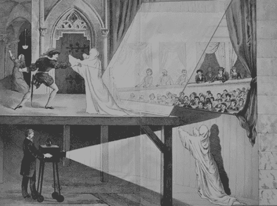

***图 9-5.** 约翰·亨利·佩珀尔教授在伦敦皇家理工学院演示的“佩珀尔幻象”图解，1881 年*

目前有多种商业解决方案可将这种类型的显示付诸实践，无论是大规模还是小规模应用。`Musion Eyeliner 3D`（[`eyeliner3d.com`](http://eyeliner3d.com)）和 `Arena 3D Industrial Illusion`（[`arena3d.com`](http://arena3d.com)）销售和租赁用于贸易展览和大型娱乐制作的系统。`Teleportec`（[www.teleportec.com/](http://www.teleportec.com/)）销售一种专为远程临场感设计的更小型系统，可以将参加远程会议的人置于讲台后发表演讲，或置于会议桌旁参加会议。

亚历山大·麦昆在其 2006/2007 秋冬时装秀《卡洛登的寡妇》中因使用基于佩珀尔幻象的错觉而备受赞誉，秀场上凯特·摩丝的形象在舞台上方浮现并漂浮。预先录制的模特视频从四个不同角度（相隔 90 度）拍摄，从隐藏的屏幕反射到四块玻璃板上，这些玻璃板形成了一个透明的金字塔形状。

 **注意** 乐队街头顽童（Gorillaz）的卡通角色曾通过 `Eyeliner 3D` 系统与麦当娜在 2007 年格莱美奖上进行了著名的现场表演；然而，由于用于反射的薄膜对振动敏感，在极度喧闹的音乐会环境中并不理想。该乐队此后已停止使用“全息”舞台把戏。

许多公司已经制造了更小型的、基于佩珀尔幻象的一体式展示箱，非常适合展示悬浮或透明的产品——甚至可以将数字视频与真实物理对象混合到同一个显示区域。图 9-6 展示了一个使用 MacBook 的简单的三面佩珀尔幻象设计。该设计由 Ujjval Panchal 创建。您可以在他的博客上阅读更多内容：[`http://blog.ujjvalpanchal.com/3d-holographic-display-prototype-1/`](http://blog.ujjvalpanchal.com/3d-holographic-display-prototype-1/)。

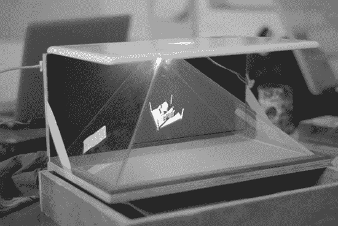

***图 9-6**. 使用 MacBook 的三面佩珀尔幻象显示器。图片由 Ujjval Panchal 提供*

`HoloCube`（[www.holocube.eu/](http://www.holocube.eu/)）拥有一些简单且美观的箱式设计，适用于单一方向观看。`RealFiction`（[www.realfiction.com/](http://www.realfiction.com/)）和 `Vizoo`（[www.vizoo.com/](http://www.vizoo.com/)）销售金字塔形系统，其工作原理类似于亚历山大·麦昆秀场的布置，通过三到四个对应不同角度的独立视频通道，实现 180 度到 360 度的观看视角。

 **注意** 由于这些显示器呈现的图像源自 2D 屏幕或投影源，它们并非真正意义上的体积显示或“全息”显示，无法让你从任意角度观察物体周围。

佩珀尔幻象技术的一项创新应用是将单个 2D 显示器或投影源分割成多个佩珀尔幻象图层，这些图层可以叠加起来重新构建前景、中景和背景。基于这一原理，为 iPhone 设计了一款名为 `i3dg` 的原型配件（图 9-7），它曾预计在 2012 年初投入生产。你可以在这个视频中看到它的显示效果——[`youtu.be/JnGPtVNmtvI`](http://youtu.be/JnGPtVNmtvI)——并在 [`i3dg.mobi`](http://i3dg.mobi) 了解更多信息。

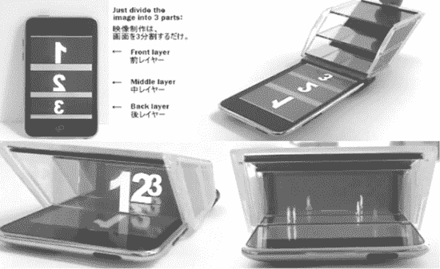

***图 9-7.** iPhone 的 `i3Dg` 配件利用佩珀尔幻象原理，通过三块塑料面板创造了多层次的深度体验。图片由 i3Dg 提供*

这个设计的原始模型来自于使用塑料 CD 盒；网上的其他人已经成功使用各种材料重现了这一效果。在更大规模上，使用平板电视或特殊形状的投影表面，这项技术可以创造出非常引人注目的体验，配合合适的内容或应用，能带来真正的深度感和运动视差。

### 多视角自动立体平板显示器

在本章描述的所有技术中，多视角自动立体显示器是最成熟且最容易获得的技术。它们可从多家专业供应商处获得，能与现有的开发工具结合使用，其成本不像那些更具研究性和工业级别的技术那样高昂。目前，用于数字标牌应用的自动立体 3D 显示器市场规模约为每年 2,000 到 4,000 台，这使得这些产品的价格标签保持在 5,000 美元左右。每台显示器的生产都需要大量的资源来精心制造——从为每种 LCD 型号定制制造精密倾斜透镜阵列，到将多视角层粘合到屏幕上所需的“洁净室”环境。此外，要为屏幕提供足够多的视角，使观看体验真正令人惊叹且不引起视觉疲劳，定制内容制作和硬件要求可能相当高。主流消费者对这些屏幕的采用将大大降低成本——就像 Kinect 对深度感知体积摄像机市场所做的那样。

多家制造商都提供此类显示器。总部位于纽约的 `Magnetic3D` ([`magnetic3d.com`](http://magnetic3d.com))、`3DFusion` ([`3dfusion.com`](http://3dfusion.com)) 和 `Exceptional3D` ([`exceptional3d.com`](http://www.exceptional3d.com)) 提供不同尺寸和质量级别的九视角显示器。`Alioscopy` ([`alioscopyusa.com /`](http://alioscopyusa.com/) [`alioscopy.com`](http://alioscopy.com)) 使用八视角显示技术。低端显示器有四视角和五视角的，而在高端领域，由曾在飞利浦从事自动立体屏幕工作的团队创立的 `Dimenco` ([www.dimenco.eu](http://www.dimenco.eu)) 号称拥有二十八视角系统。`Dimenco` 的方法依赖于 2D + 深度图源材料和专用的硬件“渲染盒”，这限制了它使用原生多视角内容的潜力。`Magnetic3D` 的九视角允许一个中心通道作为参考图像，左右两侧各有四个视角，用于环绕观察物体。在倾斜透镜阵列设计中，在提供良好运动视差的视角数量与避免因塞入过多视角而导致下层像素间产生重影或串扰之间找到平衡，需要精心权衡。

与本章讨论的任何体积显示器一样，在某些环节，你必须找出如何针对应用的多个视图或内容进行优化，以匹配显示器的物理特性。当观看者能感受到屏幕后方下凹和屏幕前方凸出的深度时，这些屏幕才能发挥最佳效果。`Magnetic3D` 的创始人 Thomas J. Zerega 建议，内容和应用开发者可以通过遵循最佳的内容准备实践来设计充分发掘这些显示器潜力的体验，实现“真正的体积感知”。当从屏幕平面凸出的视觉资产被 LCD 的边框边缘切断时，就会产生“窗口冲突”，这会干扰深度感知。为了避免这种体验，程序员可以创建应用内物理机制，通过设计来避免此类瑕疵。你也可以利用这一效果，通过为显示区域添加黑边（即在屏幕上的内容周围放置黑色边框）来发挥其优势。这样一来，当一个物体要从屏幕中出来时，它可以突破数字黑边——达到出色的弹出效果——而不会被显示器边缘的硬物理“边框”切断。

### 激光等离子体发射显示器

如果你追求的是将图像悬浮在空中而非固定在屏幕上的想法——那么脉冲激光在自由空间中发出的噼啪声光芒会让你兴奋。日本产业技术综合研究所 ([`bit.ly/plasmaemission`](http://bit.ly/plasmaemission)) 与庆应义塾大学和 Burton 公司合作，推动使用激光在空气分子中发光的技术，实现了一种无需云雾等生成介质的真正体积显示器。

这类显示器的工作原理在两个层面上令人着迷。首先，它展示了动态显示器的实时演示，其性能与本章开头提到的静态塑料蚀刻激光的可变点能力相匹配。这非常棒，因为该机制不受必须遵守的固定体素网格的限制。这与其它静态或扫描显示器形成对比，后者被锁定在像素或 LED 的边界内。

第二个令人感兴趣的点是，有启发将用于聚焦激光束的光学技巧应用到其他类型的显示器光学器件上。在 z 轴上移动的扩散透镜和在 x 与 y 平面上调制的第二光学器件的组合，可能在本章概述的其他方法中得到应用。随着人们对真正体积显示器的兴趣日益增长，我们必将看到这些技术的融合与匹配，带来更多突破。请关注 Burton 公司 ([`burton-jp.com`](http://burton-jp.com)) 以获取这项技术的更多进展。他们最新的显示器演示能在空间中每秒显示 50,000 个体素点。观看视频 [`youtu.be/EndNwMBEiVU`](http://youtu.be/EndNwMBEiVU) 和 [`youtu.be/KfVS-npfVuY`](http://youtu.be/KfVS-npfVuY) 来了解它的实际效果。

### 自由空间气态显示器

悬浮在空气中的分子——例如喷洒的水雾、浓雾和细密薄雾——可作为投影介质，呈现出令人惊叹的效果。市面上此类商用产品通常基于二维素材，因此其真实的立体程度得益于一种错觉：无边界的空间区域中悬浮着没有传统屏幕边界的浮动影像切片。然而，在定制工程化配置中，通过多图像源与对空气中粒子的巧妙操控，一切皆有可能。

 **注意** 您可以在以下链接中欣赏到来自《锦鲤池畔的黄昏》的精彩图像：
[`http://commons.wikimedia.org/wiki/File:In_the_Evening_at_Koi_Pond_in_Expo_2005.JPG`](http://commons.wikimedia.org/wiki/File:In_the_Evening_at_Koi_Pond_in_Expo_2005.JPG)。

此类显示器的市场通常面向舞台演出或大型活动，这些场合配备一系列独特灯光，而空中显示器只是整体体验的一部分。在日本 2005 年世界博览会（EXPO 2005）上，我亲眼目睹了罗伯特·威尔逊（Robert Wilson）的《锦鲤池畔的黄昏》中这项技术的卓越应用。该装置将投射在漂浮于池塘的巨型固体物体上的影像，与投射在漂浮于数百英尺高空的喷泉雾中的多组影像相结合。自由空间投影技术被精心保留在特定角色出现或主舞蹈编排中的其他点睛时刻，从而赋予这些瞬间令人瞠目结舌的震撼力。因此，在装置艺术或表演场景中，建议结合使用本章所述的技术，以达到最佳效果。

#### IO2 Heliodisplay

IO2 Heliodisplay（`www.io2technology.com`）利用环境空气通过一系列热控金属板，产生一层从设备中喷射而出的超细不可见粒子。这些小于 10 微米的半不可见雾化水粒子，类似于人体呼出的气息。因此，与其他方法相比，这种独特设计不会产生可见雾气或大量湿气。配合一台专为后投影设置和该气流优化的高功率 4500 流明投影仪，即可在设备前方一定距离的空气中看到悬浮的可见图像（图 9-8）。该设备基础型号售价 48,000 美元，互动型号售价 68,000 美元。

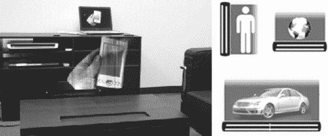

***图 9-8.** 嵌入桌面的 Heliodisplay 及其多种朝向选项。图片由 i2o Technologies 提供*

直立配置可隐藏于墙壁中，将气流水平向外喷射，高度足以投射出真人大小的影像。桌面安装的设备则将气流垂直向上喷射，使图像悬浮于表面之上。设备还可倒置安装，通过特殊定制向几乎任何方向投射屏幕。关键在于设计内容时使用黑色背景，并隐藏所有物理组件、投影仪及 heliodisplay 设备，使观众仅能看到悬浮影像。该系统不适用于前投影或短焦投影仪，因此您需要将投影仪放置在设备后方约五英尺（约 1.5 米）处。一个装满自来水的小水箱可使设备根据设置连续运行数天至一周；每隔六个月到一年需更换一次专用滤芯。该设备甚至可在户外使用——但环境需避免强风，否则风会扭曲图像。说到扭曲，请勿期望其清晰度能达到平板电视或普通投影电视的水平。仔细观察产品图片，您会发现明显的拖尾效应。与任何技术一样，最佳策略是思考如何将局限性转化为优势，或许将屏幕的条纹与波动流畅感融入与应用程序相匹配的美学中。

#### FogScreen 显示器

如果您不需要近距离且私密的效果，而是希望在舞台上呈现超越现实的大型影像——来自芬兰的 FogScreen（`fogscreen.com`）便是理想之选（图 9-9）。其设备利用层流气流工艺，结合超声波，将水转化为可见雾气状薄屏。其入门级型号 FogScreen EZ 定价低于 30,000 美元，与 Heliodisplay 不同，可供全球租赁。FogScreen Pro 可串联使用以实现可变规模的装置，按米订购：一米起价 33,000 美元，四米 100,000 美元，八米 175,000 美元，中间尺寸价格各异。

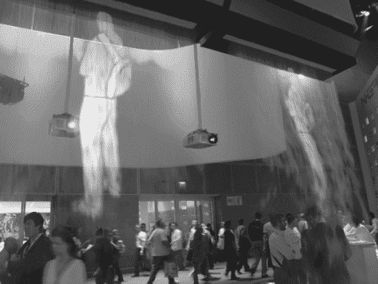

***图 9-9.** E3 会议上的 FogScreen 投影。* 图片由 wili_hybrid 拍摄。

FogScreen 大量应用于舞台灯光和活动展示，而 i2o 设备则更适合小规模亲密场景。与可安装于地面和墙壁的 Heliodisplay 不同，FogScreen 仅有一种朝向——自上而下。这使得设备及其附带的吸顶安装投影仪可以隐藏于视线之外。由于光线是散射而非反射自空气中的粒子，FogScreen 也必须采用后投影方式。这一特性可转化为优势，例如有研究人员曾尝试用两台投影仪分别指向屏幕两侧，投射不同影像，从而营造出 3D 立体感。FogScreen 配备可调节屏幕不透明度的控制器。这意味着您可以使用它实现“揭开帷幕”的效果，让人物从投影幕布后显现；或将其调至足够透明，使影像看似无边界地悬浮在空气中。

一项特别有前景的技术利用了光在雾中传播具有方向性的特性。在 2011 年的 Interaction 大会上，大阪大学的研究人员使用三台投影仪指向一个雾柱，根据不同视角展示同一 3D 物体的不同影像，从而满足运动视差需求。这项创新技术的精彩视频可在[`http://youtu.be/yzIeiyzRLCw`](http://youtu.be/yzIeiyzRLCw)观看。利用多台投影仪满足对场景的多视角观察，正是光场显示技术的基础。

### 投影光场阵列

体三维成像领域当前备受关注的一个方向，是利用投影仪阵列在漫射滤光器上重建场景的多重视角。其核心理念是：在更多角度添加更多投影仪，就能更好地重建三维场景的原始光场。因此，当观察者通过特殊的漫射膜观察场景时，头部视角的移动会触发运动视差，从而产生观看三维场景的感知。随着低成本投影仪（包括尺寸微小的微型设备）的出现，这种方法比几年前在财务上要可行得多。

投影光场方法被应用于日本国立信息与通信技术研究所吉田俊介的研究项目 `fVisiOn` 中，创造了一种新颖效果——桌面上的浮动三维视觉。该项目的目的是创建一种不会干扰桌面工作区，反而能让真实三维物体与虚拟物体共存的显示器。

 **注意** 您可以在项目网站 [`http://mmc.nict.go.jp/people/shun/fVisiOn/fVisiOn.html`](http://mmc.nict.go.jp/people/shun/fVisiOn/fVisiOn.html) 上了解更多信息并观看视频。

`fVisiOn` 并未采用标准的平面片材来将投影光结合成连贯的三维图像，而是依靠一个锥形屏幕。如图 9-10 所示，该显示器由一组微型投影仪组成，这些投影仪全部向内指向锥体，呈圆形排列。右上角图像中可见的白色光点显示了密集排列的投影仪环。锥体顶部放置了两层过滤材料，以增加图像的对比度。

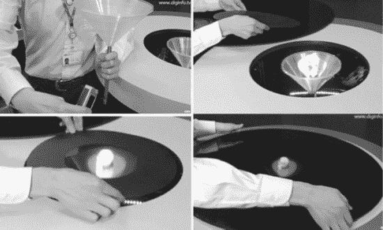

***图 9-10.** `fVisiOn` 显示器结构分解图。左上角显示了锥形漫射器和微型投影仪的一个角度；右上角显示了数十个安装到位的投影仪，呈现为光点；左下角和右下角显示了增加图像对比度以生成浮动数字对象的两层滤镜。*

尽管 `fVisiOn` 让我们了解到光场显示器如何在小型规模上应用，但许多人渴望了解体三维体验将如何扩展，将体素带到影院的大银幕上。答案可能在于欧盟牵头的一系列创新举措。三个项目：`HOLOVISION` ([www.holovisionproject.org](http://www.holovisionproject.org))、`OSIRIS` ([www.osiris-project.eu](http://www.osiris-project.eu)) 和 `COHERENT` ([www.coherentproject.org](http://www.coherentproject.org)) 的设立，旨在将欧洲国家和公司定位为全息介质捕获、传输和显示的领先先驱。这些技术的主要集成商是一家名为 `Holographika` 的匈牙利公司 ([www.holografika.com/](http://www.holografika.com/))。

通过使用大约 100 个聚焦于漫射屏的投影仪，`Holographika` 的显示器重建光场，以提供对场景的分辨视角，这取决于每个观看者相对于屏幕的位置。该技术类似于大阪大学研究人员使用雾气的尝试，不同之处在于，这家公司现在已有可供租赁或购买的生产型号。由一家匈牙利公司实现这一奇迹是恰如其分的，因为实际上，全息术领域正是由一位匈牙利科学家发明的。

尽管 `Holographika` 的产品定价并非面向消费者，价格范围在 45,000 至 150,000 美元之间，但它们设定了很高的标准，并将提供一个参考规格，用以评判未来的解决方案。对于家庭和办公用途，其背投型号在视觉上类似于等离子和 LCD 出现之前的早期宽屏电视。为了将所有投影仪封装在内部，需要有足够的深度将图像反射到屏幕上。然而，更令人惊叹的创新在于适用于大型影院环境的正投解决方案（图 9-11）。

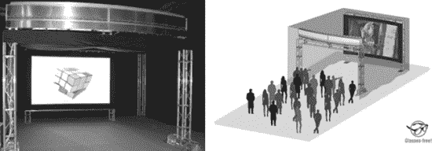

***图 9-11.** `Holographika` 的 `HoloVizio` C80*

`HoloVizio C80` 开启了体三维影院时代，人们有朝一日可能会将其简称为体素影院。这并非科幻小说。C80 设备目前正在世界各地的贸易展上进行演示。传统影院只有一台投影仪，或者两台用于立体三维，而 `Holographika` 的技术则使用了多达 80 台投影仪。目前，最大屏幕尺寸约为 140 英寸宽——足以满足小型独立影院的需求。现在，我们只需要新一代的故事讲述者，利用这种颠覆性创新，凭借体三维电影来启动体素业务。你愿意为哪个付更多钱——外出看一场电影，还是体素影院？

## 我们何去何从？

撰写这本书对我们在座的每一位都意义重大。在 Kinect 中，我们看到了一个可以用于创意表达的神奇设备。我们也看到了一种能够改变我们将技术应用于日常生活方式的设备和技术。起初，Kinect 及其骨骼追踪技术主要关乎游戏和酷炫的艺术项目。但事情并未止步于此。其底层技术对人与技术的交互方式有着深远的影响。在这篇后记中，我们每人就这项技术的影响及其未来可能引领我们走向何方，提供一些最后思考。

### 肖恩·基恩

我希望这篇关于使用微软 Kinect 进行开发的介绍，为你提供了一个坚实的基础，让你能够实现那些重新定义我们与技术关系的新想法。现在，你已掌握了创建体验的基石，这些体验能帮助我们摆脱过去与机器互动的有限方式，并为未来人与设备之间建立更人性化的关系铺平道路。作为一个最初因艺术和社会表达而对技术感兴趣的人，我一直觉得鼠标和键盘是办公室环境的遗留产物，无法充分表达我想要的与机器互动的方式。像 Kinect 这样的创新，以及你即将着手开发的软件，将书写社会与技术如何共同演进的新篇章。

在 Kinect 于 2010 年 11 月首次亮相大约一年后，我们看到这款设备以许多令人惊叹的方式被投入使用。各种不同的用途多到令人目不暇接，甚至难以归类。看到公众的想象力被充斥网络的“Kinect 破解玩法”所吸引，很明显，一旦人们亲眼目睹，他们便渴望将基于身体手势的软件控制融入到自己的生活方式中。然而，这项技术的一个应用并没有像其他应用那样受到太多关注，而这也是自从去年我第一次在 YouTube 上看到奥利弗·克里奥斯演示它以来，最让我兴奋的一个应用。

在一段名为“用 Kinect 进行 3D 视频捕捉”（[`youtube/7QrnwoO1-8A`](http://youtube/7QrnwoO1-8A)）的视频中，该视频在设备上市仅十天后发布，奥利弗是第一个展示了三维体积 3D 视频的人，这种视频允许观众在录制过程中，将虚拟摄像机围绕现场场景进行 360 度旋转。这至今仍让我感到震撼，我认为它是 Kinect 中沉睡的巨人，将在不久的未来标志着电影、摄影和实况视频体验方式的根本性转变。一旦用于创建、分享和观看三维体积 3D 视频的工具能以更成熟的状态展现在大众面前，我相信它将被广泛应用于从视频会议到体育赛事，再到故事片和真正的 3D 游戏系统等各个领域。这是体积时代的黎明。

一段时间以来，我一直担心，由于在电视、电脑和手机上过多接触平面屏幕媒体，社会已经侵蚀了我们解码周围物理 3D 世界的一些先天能力。我相信，从 2D 向三维体积 3D 体验的转变，有可能重新点燃人们对一种新的空间感知能力的希望，这种能力可以唤醒我们自屏幕媒体无处不在以来一直沉睡的某部分心智。一旦数字媒体能够更贴近我们与生俱来但却无法与 2D 媒体和传统软件界面协调的深度感知能力，事情将真正变得有趣起来。

让我们来看看引发三维体积 3D 视频革命涉及哪些内容。通过审视当今消费者如何创建和体验 2D 视频，我们可以研究为了实现三维体积 3D 视频的同样效果，需要建立哪些条件。在此过程中，我希望你能看到许多令人兴奋的机会，去开发能够满足未来需求的技术——当创作者从拍摄 2D 电影，转向开创“体素视频”（即基于 Kinect 等设备生成的体素点云图像，可从任何 360 度角度观看的视频）时，这些需求将会出现。

对于消费者来说，用 iPhone 录制高清视频，在设备上剪辑，然后上传到 YouTube 或 Facebook 与世界分享，是极其轻松的。专业人士可能会选择使用更精密的单反相机，这需要额外步骤将其连接到电脑，并在 FinalCut 或 iMovie 等程序中编辑视频，然后才上传到网络，或许还会选择 Vimeo.com 等替代视频分享网站。经过多年的完善，已经存在简单、实惠且易于获得的解决方案，供用户捕捉、编辑和观看共享视频。我们还需要类似的设备、服务和软件，才能将三维体积 3D 视频推向主流市场。幸运的是，如今已有数百万人拥有了可用于捕捉基础三维体积 3D 视频的设备——Kinect。

如果你坚持读完了第一章的最后，你已经看到自己被以原始的三维体积 3D 形式捕捉，并且能够用一个合成的摄像机旋转视角。微软 SDK 以及 OpenNI 的最新版本，允许开发者利用多个 Kinect 设备，这些设备可以以某种方式排列，以填补单个相机造成的阴影空白。通过 KinectFusion 项目，微软研究院向我们展示，仅使用一台 Kinect 和采用标准计算机图形处理芯片组的软件，实时重建场景的完整 3D 模型前景广阔（参见图 1-25）。Kinect 作为视频录制设备的唯一问题是，用户必须与电脑和墙上电源插座相连。这导致 Kinect 视频的内容主题大致相同——人们坐在他们的电脑前。

我更希望能在户外到处跑动、在偏远地区探险，以及做所有我们如今期望便携式电子产品可以实现的其他活动时，拍摄动态视频。在 1967 年索尼 Portapak 推出之前，视频几乎是无法移动的——就像我们今天使用 Kinect 时一样。电视演播室设备体积庞大且功耗极高，必须留在演播室里。Portapak 问世后，视频艺术蓬勃发展，像白南准和白南准和比尔·维奥拉这样的艺术家，他们背上电池供电的设备，利用这种媒介探索视觉表达，其方式以前只有通过胶片制作才能实现。如今，任何一部智能手机的功能都远超 Portapak——但我们很可能仍会回归专门的特制硬件设备，以充分利用三维体积 3D 视频的潜力。这将为那些希望设计和制造新型电影工具的人创造激动人心的机会。

为了实现更高质量的制作级捕捉，还有一系列超越 Kinect 的令人兴奋的可能性。PrimeSense 解决方案中使用的结构光方法无法在干扰红外激光的明亮光照条件下工作。飞行时间传感器提供了一种替代方案，可以去到 Kinect 无法到达的地方；然而，它们当前的深度图分辨率远低于 PrimeSense 所提供的，并且仍然依赖发射光，感应范围有限。一种名为“光场”或全光相机的新兴成像技术，今年由 Lytro 公司（[www.lytro.com](http://www.lytro.com)）首次推出，它最终可能被嵌入到用于体积极电影的创作工具中。

这款独特的成像设备利用微透镜阵列计算从多个角度进入相机的所有光线，并生成类似 3D 传感器（如 `Kinect`）的深度图。尽管目前尚未成为实时视频解决方案，但请密切关注这项技术的发展。从不同角度围绕场景布置一组 `Lytro` 相机，不仅能够在不相互干扰的情况下采集多个深度图，还能够在观看时对场景中的任意点进行重新对焦。这将产生我们期望从高端单反相机中获得的那种景深效果，而且理论上可以根据用户观察图像的视角实现实时景深。`Lytro` 面向消费者的产品可能会像 `Kinect` 一样，具有颠覆性且易于改造。当你考虑到唯一的竞品 `Raytrix` ( [`raytrix.de`](http://raytrix.de) ) 相机起步价约为 20,000 美元时，`Lytro` 突破性的 399 美元定价令人震惊。

在 `Kinect` 问世之前，已有大量关于利用立体摄像头和多摄像头阵列计算 3D 场景信息的技术研究，这种技术被称为摄影测量法。随着更成熟的云计算环境的出现，许多解决方案应运而生，用于在远程服务器上处理此类图像处理，以降低对用户机器的要求。现在，使用诸如 `Autodesk` 的 `123D Catch` ( [`123dapp.com/catch`](http://123dapp.com/catch) ) 和 `Hypr3D` ( [www.hypr3d.com](http://www.hypr3d.com) ) 等工具，可以处理来自不同视角的多相机阵列的静态图像，上传一系列图像后，系统会返回场景的摄影测量 3D 模型。若要在本地机器上使用，`AgiSoft` 的 `PhotoScan` ( [`www.agisoft.ru/`](http://www.agisoft.ru/) ) 是一款支持 Windows 和 Mac OS X 系统的桌面级摄影测量解决方案。通过使用多个廉价高清相机（例如 `GoPro` ( [www.gopro.com](http://www.gopro.com) ) 提供的相机），可以设想组装一个包含数十个单元的大型设备，从不同角度捕捉视频，然后将每个相机的每一帧分解成一系列摄影测量批处理作业。结合 3D 传感器（如用于辅助深度映射的 `Kinect`），我们必然会看到一些融合了这些技术、用于生成高质量体积 3D 图像的非常有趣的解决方案。

制作 2D 电影和制作体积 3D 体素电影有何区别？首先，电影导演习惯于通过单一摄像机视角，对观众观看故事的角度拥有绝对控制权。然而，在体素电影的世界里，初出茅庐的体积电影摄影师必须在制作过程中考虑观众可能通过移动头部、使用控制器或仅仅围绕体积显示器走动等方式，从任意角度凝视场景，从而协调表演者、灯光和摄像机设备。但这仅仅是开始。我们需要全新的软件来处理这种真正意义上的新媒体的后期制作编辑、传输、存储和显示。

好消息是，这类软件正在积极开发中。首次通过互联网直播的体积 3D 视频发生在 2011 年 10 月匹兹堡举行的 `Art&&Code 3D` ( [`artandcode.com/3d`](http://artandcode.com/3d) ) 活动中。该活动将演讲者的 360 度视频直接传输给了全球正在收看的网络浏览器。这标志着一项重大的技术成就，无疑将激励他人创建更强大的解决方案，以克服在诸如 `YouTube` 和 `Vimeo` 等系统上分享这种深度媒体时的局限性，这些系统目前无法在其 2D 文件格式中存储完整的体积数据。

一个专为体积 3D 视频（也称为自由视角视频 FVV）打造的 `YouTube`，可以充当大型视频形式体素数据集的存储库。这些数据可以在后期使用更复杂的 3D 重建算法（如 `KinectFusion`）进行分析和重新处理。许多人可能会选择将所有原始体积视频上传至云端，并使用基于网页的编辑服务来完成视频制作，以最大限度地减少对自用设备的处理要求。对于更专业的导演来说，会对用于本地编辑和后期特效的专业级工作站软件产生需求。回到云端，类似于 `Primesense` 的 `NITE` 的机器视觉中间件，可以提供基于用户分割、骨骼追踪和模式识别的新功能。这些功能可应用于上传内容，以生成用于分类视频、视频中的物体甚至对故事情节进行语义分析的结构化信息。一旦视频上线并配备交互式可嵌入播放器，我们可以预见它们将在 Facebook 信息流中被分享，并链接到当前 2D 照片和视频使用的相同位置。当聪明的艺术家和程序员以难以预测的方式利用深度视频的功能时，用户创作由用户提交的体积视频的混搭和混音作品的机会，将会非常引人入胜。

然而，如果你只是打算在普通的 2D 屏幕上观看，那么捕捉体积视频的作用就不大了。虽然将会有过渡性解决方案（例如使用头部追踪让你在 2D 屏幕上体验模拟的运动视差，从而观察体积 3D 内容），但开发此类内容的根本驱动力将源于真正的体积 3D 显示器的普及，这些显示器是基于第九章中所记载的技术成熟发展而来的。随着更引人注目的基于体素的视频内容和服务的创建，以及游戏和专业 3D 应用的出现，体积显示器将开启一个全新的娱乐和空间计算时代。正如微软研究院近期展示的成果所示，包括一个名为 `Vermeer` 的真正 360 度体积 3D 显示器的触控界面 ([`research.microsoft.com/en-us/projects/vermeer/`](http://research.microsoft.com/en-us/projects/vermeer/))，以及一个依赖头部追踪的 `Holodesk` ([`research.microsoft.com/apps/video/default.aspx?id=154571`](http://research.microsoft.com/apps/video/default.aspx?id=154571) )，与占据真实 3D 空间的、可触摸的图像进行交互，开启了以前被认为是科幻小说的无限可能。

当触及体积视频显示器的能力变得价格亲民时，消费者会渴望什么样的内容和应用？我们很快就会知道，这也是我接下来的探索方向。加入 `volumetric.org` 社区，并通过关注 `meetthekinect.com` 上本书的更新，来拥抱体积时代吧。

-- 肖恩·基恩

### 菲尼克斯·佩里

未来的智者常常在事后看来显得愚蠢。他们常常高估眼前发展的速度，却又低估了长期即将到来的巨大变革。话虽如此，我写下这篇预言时，正值史蒂夫·乔布斯逝世之日。基于鼠标的计算时代已经终结。全美苹果商店的门前烛光摇曳，而计算领域的未来舞台已经敞开。基于手势的计算是界面设计的未来。这场革命已经酝酿了 20 年，它的时代终于来临。视觉识别系统、触摸屏、手势界面和语音控制将在未来 5 年内结合，取代遥控器和鼠标，尤其是在休闲计算体验中。用户体验将变得更加有机和以人为中心。自然界面的浪潮是设计技术领域即将迎来的下一个大繁荣。

我对鼠标的幻灭始于 1999 年，当时我患上了严重的腕管综合征。我的个人电脑界面因设计不良而摧残了我的身体。我无法梳头。我的男友为我刷牙。那个曾让我成为富有创造力的创造者的工具，却毁掉了我的身体。因此，过去的十年里，我一直在康复并探索替代的计算机控制模式，以便长期使用而不伤害人体。借助这些新的交互模式，我们可以安全地开发与人体相匹配、并能贯穿人类一生的计算体验。计算体验正在被彻底重新构想。设计师和 DIY 创客正通过创造新的体验来推动市场前进。用户渴望更丰富、更个性化、更具触感的体验。我们正在重新思考数字体验，并将其融入人类体验之中。从整合面部识别的响应式标牌与移动购物体验，到智能客厅，再到治愈身心的新方法，等待被创造的沉浸式体验无穷无尽。

在文化层面，音乐和艺术创作正被彻底颠覆。你的乐器可以是你能想象到的任何东西，甚至可以用手指在空中绘画。媒体艺术家可以将视频和图像精确地映射到包括面部在内的人体上。动作捕捉可以在你的客厅里完成。艺术家可以用双手在物理世界中绘制 3D 图形，然后通过从 MakerBot Industries 购买的、价格低于 3000 美元的桌面制造机器将结果打印出来。基于脑电波控制的研究正在进行中，它或许能让艺术家只需闭上眼睛就能创作。未来已经到来。它只是看起来与我们预期的不同，而且幸运的是，它不再是过去那种光鲜亮丽的、企业塑造的塑料界面，而是无缝地融入人类的生活图景。设计的未来是开源的，掌握在创造者手中。

——菲尼克斯·佩里

### 乔纳森·C·霍尔

如果你正在阅读本文，我可以假设你至少对微软的 Kinect 和其他类似 Kinect 的传感器感到好奇。如果你出生在上个千年，并且没有把每一项技术奇迹都视为理所当然，你甚至可能会同意这些设备相当惊人。但它们具有革命性吗？我没有答案，但我可以告诉你，我在哪里寻找这项技术来支持社会、文化和经济变革——无论好坏——而且它不在客厅里。它在公共和准公共空间。

免触摸计算机界面具有其无触摸特性所固有的某种实用性。例如，免触摸界面更卫生，因此在医院和诊所、洁净室、手术室和洗手间中使用具有明显的优势。免触摸界面还可以让像我这样身高不占优势的人（我身高 5 英尺 9 英寸……好吧，5 英尺 8 英寸……踮起脚尖算）直观地操控任意大小的媒体，以获得沉浸式娱乐、艺术、教育或营销体验。免触摸界面甚至可以通过响应特定空间中人员的位置和数量，并提供智能的上下文反馈，来启动“被动”交互。这很像传奇的施乐帕克研究中心科学家马克·维瑟等人设想的“普适计算”场景。

当然，要实现这些好处，我们仍然面临重大障碍。例如，我的第一次 Kinect 体验让我很难堪，在激烈地玩了一轮 `Kinect Adventures` 后，屏幕上显示了我被抓拍到的不雅姿势的照片。当我的 Xbox 威胁要将其发布到 Facebook 时，我尖叫道：“不——！”然后扑过去拔掉了墙上的电源插头。除了在自己的客厅里，谁会在公共场合像个傻瓜一样手舞足蹈？

十年前，我可能会同样难以置信地问：“谁会愿意在拥挤的火车上，通过电话与伴侣闹得不可开交地分手？”然而，这种场景却是大都市通勤生活背景音中的常见节目。关键是，我们的文化规则和习惯确实会随着技术创新和普及而改变：看看手机就知道了。

我相信，随着时间的推移，人们会习惯一套有限的、通过动作控制与公共屏幕进行交互的方式。这种演变部分来自文化层面，但也部分来自技术本身，或者更具体地说，来自应用程序的设计。公共空间中用于免触摸界面的应用程序，其体力消耗必然会比 `Kinect Adventures` 或大多数 Xbox 游戏要小，并且会更像 Xbox 仪表盘，旨在进行快速、随意、主要是实用性的交互。我在 `Sensecast` 上的工作（参见第 3 章）正是为了支持这种程度的参与：在大厅签到参加会议、在诊所浏览与健康相关的信息、在手机上获取新闻报道的全文，然后离开。（当然，这项工作还处于生命周期的早期阶段，还不能说我们做得对。）

就像我们愿意在 Facebook 上公开分享我们的“状态”或在星巴克“签到”一样，我们与公共屏幕的互动有潜力创造出全新的文化和经济价值生态系统，当然也包括剥削的可能，这一点我们将在下文看到。我希望我们能够将这种潜力引导向好的一面：通过共享媒体，将公共空间转变为更具社交性的场所，这些媒体不仅协调我们与计算机的互动，也协调我们与他人的互动。我们今天的集体习惯是被动的、独自的媒体消费。智能过滤器、小众博客和微博让我们能够根据自己的兴趣定制媒体食谱。与此同时，所谓的社交和移动应用程序，通过将我们的注意力从地理社区转移开，使我们与地理社区隔绝。想象一下 Kinect 应用程序，它让我们在公共空间里站起来，与邻居会面，渗透到我们的日常生活中。想象一下：

*   上午 8:00。在火车月台上，通勤者们聚集在一个显示屏前，上面显示着昨晚镇民会议的头条新闻和照片。其中一则写道：“青少年中心将进行全民公投。”显示屏对周围的观众进行民意调查，让他们对这个决定竖起大拇指或朝下大拇指，记录他们的手势，并收集/显示全镇的总体情绪。在你上火车之前，你可以将完整报道传送到你的手机上。
*   下午 3:00。高中学生会成员在公共拱廊会面，举着标语敦促大家采取行动，推进镇上停滞不前的青少年中心项目。他们将标语举到一个社区显示屏前，车上的 Kinect 识别到他们的活动并拍了张照片，然后将这张图片分发到全镇的网络中。
*   晚上 7:00。一家拥挤的咖啡馆里响起提示音，一个安装在天花板上的数字显示屏开始播放有关本地数据的测验问题：今年的犯罪率是上升还是下降？镇预算中有多少百分比用于教育？普通家庭要缴纳多少房产税？围观者可以通过模仿游戏节目中的抢答按钮（用双手）来“抢答”。然后，显示屏会选择并跟踪第一个“抢答”的人，让他/她在屏幕上选择一个答案。

虽然为了让观点更明确，我的例子带有明显的公民色彩，但在未来几年，毫无疑问，创意科技公司、广告商、非营利组织和政府实体将在我们的公共空间推出更广泛的应用程序和游戏。有些会是好的，有些是坏的。但潜力是存在的，可以通过提供丰富的体验、关键信息以及围绕真实（而非虚拟）社区的共享兴趣和空间进行的自发游戏，为人们创造真正的价值。通过面向公共和准公共空间进行设计，Kinect 应用程序的开发者们可以探索一个全新的、真实的（而非虚拟的）社交和基于位置的媒体时代。

`Sensecast` 的第一个应用程序是一个新闻浏览器，它被放置在一栋人流量很大的半公共建筑内，位于哥伦比亚新闻学院咖啡馆外。它鼓励路过的行人阅读某篇新闻报道的导语，如果被打动，可以通过竖起大拇指的手势“点赞”。为什么？我们在新闻学院的历史学同事指出，在 1900 年之前，人们不是独自阅读报纸，而是与朋友和陌生人聚在一起大声朗读。如果哲学家尤尔根·哈贝马斯的观点可信，那么公共生活中这种现已失落的社会政治维度，能够支撑一个更有活力的民主。也许，通过共享的、能够促使我们相互联系的 Kinect 新闻显示屏，我们能够让它重新焕发生机。

或许吧。但也或许不行。隐私在美式英语和欧式英语词汇中是神圣的词汇，而公开性则是可疑的（想想“宣传噱头”、“公开卖弄”等词语）。人文地理学家段义孚指出，在古希腊世界，这两个极端是颠倒的：隐私与希腊语中的“白痴”一词有关，因为纯粹的私民被认为像是与世隔绝的人，不适合在社会中扮演任何角色。与此同时，人类蓬勃发展的崇高巅峰则留给了那些愿意走向市集广场、让自己为人所知、在公众舞台上行动的人。然而，在现代世界的大部分地区，隐私才是王道。

尽管如此，对公开性的评判尚未有定论。我们在对监控工具（安全摄像头、浏览器 cookies、社交网络等）的漠不关心和对它们合理偏执之间摇摆不定。当我兴高采烈地谈论 Kinect 类摄像头在改善公共空间方面的潜力时，毫无疑问，你们中的一些人正对随之而来的（或者至少是使之成为可能的）监控水平感到越来越不安。

我认为这些担忧，正如我所说，是“合理的偏执”。虽然我随意地把 Kinect 称为“摄像头”，但你会注意到微软和该领域的设备制造商明确没有这样做。他们努力地坚持使用他们偏好的术语：“传感器”。这个选择是一个刻意的营销决策，旨在模糊设备收集的数据的性质。正如你在本书中所看到的，这些我们心甘情愿请进家门的“传感器”是功能强大的摄像头，能够被动地收集大量关于我们、我们的体型、我们的家和我们的家人的私密细节。我们从专利申请中得知，随着微软在其 Xbox 平台上推出直播电视服务（取代有线电视机顶盒），该公司正在将 Kinect 集成到家长控制和广告系统中。Kinect 不仅为你提供了一个你再也不会弄丢的便捷遥控器，它还向微软及其合作伙伴提供了关于你的详细档案以及谁在观看的实时数据。我们现在都成了尼尔森家庭！

这一切可能看起来有点 creepy。我们是否应该接受 Napster 创始人肖恩·帕克最近在 2011 年旧金山 Web 2.0 峰会演讲中宣扬的反乌托邦格言——“今天的 creepy，明天的必需品”？

再次强调，我没有答案。我选择将我的工作重点放在公共空间的 Kinect 应用程序上，这个领域*似乎*比微软、苹果、谷歌和 Facebook 等公司可能对我们的“私人”数据所做的事情更少涉及隐私问题。当然，这个领域并非没有顾虑。试想一下，3D 辅助的人脸识别算法可能比纯粹的 2D 算法要强大一个数量级。在公共空间广泛部署 Kinect 有可能意味着公共场合匿名的终结。当然，这个结果还很遥远，而且可能难以解决，因为物理空间的所有权远不如移动平台的所有权那么集中，从而防止任何一方拥有所有数据。但它在技术上是否可能？是的。

无论如何，在权衡隐私和公开性的价值时，显然需要做出重要的取舍。公司和个人已经构建了令人惊叹的产品，并以免费或低成本提供给我们，以换取我们一部分的隐私。事实上，就像古希腊人一样，我们可能通过过更公开的生活而让自己有所收获。我们也可能被当作“眼球”，或者现在叫“骨架”（*skeletons*，指 Kinect 捕捉的骨骼数据）而被利用和售卖。毫无疑问，Kinect 以及围绕它构建的公司和开发者生态系统，将把隐私和公开性的概念推向新的方向。你，通过拿起这本书并按照你的方式使用它，就是那个先锋队伍的一部分。请负责任地使用 Kinect。

--乔纳森·霍尔

