# 第 1 章

## 准备工作：苹果平台与技术上的工具与开发

2007 年，在 Macworld Expo 的主题演讲中，苹果公司 CEO 史蒂夫·乔布斯宣布了两项重大改变：公司名称（从苹果电脑公司改为苹果公司）以及产品重心（从个人电脑转向移动电子设备）。在同一场发布会上，乔布斯还推出了两款新设备：iPhone 和 Apple TV。前者永久性地改变了移动设备的格局以及消费者的移动设备体验。此后，苹果相继推出了第五代 iPhone，并凭借第二代平板电脑再次复制成功，销售了数百万台设备，创造了数十亿美元的收入。

苹果的成功可归因于设备的品质、拥有它们所带来的“酷感”以及直观的界面。但远比这些因素更重要的是 2008 年 App Store 的推出，以及随后日益丰富的廉价（通常免费）且有趣实用的应用程序，这使得苹果一跃成为移动市场的世界领导者。苹果在 2011 年 7 月宣布，App Store 当时已拥有近 50 万款应用，下载次数达数十亿次；更重要的是，任何人都可以编写并提交应用以供销售和分发。所以，**你**也有可能创造出下一个像《愤怒的小鸟》那样人人都在玩的畅销移动应用！

那么，是什么阻止了你呢？只要熟悉苹果的 Xcode 开发工具集及其默认编程语言 Objective-C，就没有任何障碍。对于.NET 开发者及其他技术人员而言，这有时会成为入门壁垒。毕竟，虽然每个人都喜欢学习新事物，但这并不意味着你不想复用已有经验来更快地起步并上手。

在本书中，你将学习如何将你的技能从.NET 迁移到苹果开发框架，既使用苹果提供的工具，也利用全面的 iOS SDK 库。你还将了解一些利用.NET 及其他非苹果技术的第三方工具，这些工具可能更熟悉、更易于使用。这些第三方工具被引入市场，是为了给仅限苹果的工具集提供替代方案。虽然使用这些工具并非本书的重点，但我将介绍一些关键的第三方工具，并提供它们的基本入门概览。

本章提供了关于苹果开发框架的关键信息，以及一些替代方案。涵盖的主题包括：

- 如何注册成为苹果开发者以及这样做的原因
- 应用程序开发模型概述
- 苹果移动操作系统（iOS）及开发工具简介
- 第三方方案巡览，包括 Mono 家族、DragonFire SDK、Titanium Mobile、Marmalade SDK 和 Flash Professional CS5
- App Store 简介以及如何销售你的新应用


## 注册成为 Apple 开发者

在我们讨论任何软件开发工具包（SDK）或工具之前，你需要先注册成为 Apple 开发者。这不仅是必要的，因为你需要访问技术资源并获取关于开发运行在 iOS 移动设备（iPhone、iPad 和 iPod touch）上的应用程序的信息，而且还因为你需要下载所需的工具，例如 iOS SDK 和 Xcode。**第 2 章**的示例需要这些下载，因此强烈建议你现在就注册成为 Apple 开发者。

要注册，请打开浏览器并导航至 [`http://developer.apple.com/programs/register`](http://developer.apple.com/programs/register)，你将看到与**图 1–1** 类似的界面。

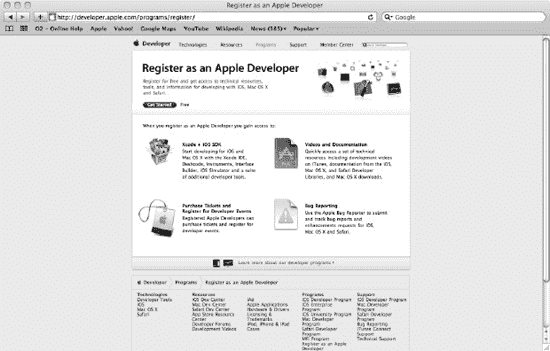

**图 1–1.** *Apple 开发者注册主页*

在此主页上，你会注意到“开始使用”的选项，并可以免费注册成为 Apple 开发者。选择此链接，然后按照说明创建一个新的 Apple ID 或使用现有的 Apple ID（例如，你可能已经通过使用 iTunes 拥有一个）。完成注册成为 Apple 开发者所需的步骤。

成功注册成为 Apple 开发者后，你将能够访问许多在线资源，这些资源将为你提供一些必要的工具和支持。**表 1-1** 列出了其中一些资源。

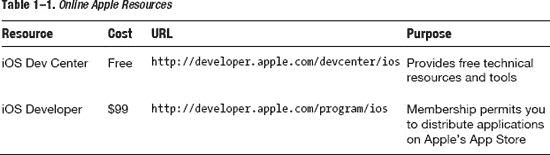

现在，你应该前往 iOS Dev Center 并下载免费的 iOS SDK，它包含了为你的 Apple 移动设备设计和开发应用程序所需的基本工具和库。这个磁盘映像（扩展名为 `.dmg`）同时包含了 Xcode 和 iOS SDK，因此文件非常大，你可能需要在等待下载时去喝杯饮料。或者，你也可以选择下载较旧版本的 Xcode，这是免费的，尽管它对于可以支持的 Apple iOS 版本有一定限制。

此时，你可能会想知道注册 Apple ID 并下载免费 SDK，与支付 99 美元注册成为官方 iOS 开发者并访问最新版本 Xcode 之间的区别。自 Xcode 4 发布以来，Apple 已规定你必须在 Apple Developer Connection (ADC) 网站上注册为 iOS 开发者才能访问它，而这需要每年支付 99 美元的费用。

**注意：** 如果你只是想先尝试一下 Xcode 4，再决定是否投入，你可以通过 Mac App Store 安装 Xcode 4，费用仅为 4.99 美元——便宜得多。然而，这两种方案的关键区别在于，使用 App Store 版本，你无法将软件部署到物理设备上进行测试、无法将应用提交到 App Store 发布，也无法访问某些在线资源。因此，一旦你感到熟悉，并计划开发你的“必备”Apple 应用时，你可能就想要投入完整版本了。

但你需要哪个版本？嗯，这在很大程度上取决于你将使用哪种机制来编写你的 iPhone 或 iPad 应用程序。我们将研究使用多种不同方法编写应用程序，但主要关注 Objective-C 语言。

我编写这本书的计划是针对最新的 Apple 移动设备，并且我想展示最新的工具选项。因此，此处的示例使用的是撰写时可用的最新版本 Xcode：Xcode 4。该版本在可用性和生产力方面有显著改进。这些改进使其与微软自家的 Visual Studio 更加接近。因此，虽然旧版本的 Xcode 可能也能用并且免费，但我建议你使用更新的版本，并投资支付所需的费用来开始。

## 应用开发注意事项

无论你是使用 Apple 自有的原生工具还是第三方工具，在开发过程中都需要牢记某些原则。这些原则将有助于确保你编写获奖应用的之路顺畅，或者至少更顺畅。我们将讨论的每个选项都是围绕一些总体原则开发的，这些原则既指导又限制了它们的工作方式以及最终应用的执行方式，尤其是在第三方选项的情况下。

### 通用开发原则

无论你使用的是 Apple 自身的原生资源还是第三方资源，以下原则都是通用的：

*   **设计模式**：许多框架都使用众所周知的设计模式来实现你的应用程序。例如，模型-视图-控制器 (MVC) 设计模式非常常见，因此理解这种模式的工作原理将对你大有帮助。
*   **许可**：了解第三方应用的许可模式如何运作，以及当你注册使用这些应用提供的工具时可能强加的任何限制或条件，也是值得的。同时也要注意 Apple 的 App Store 政策可能施加的任何限制。
*   **设备兼容性**：为某款设备编写应用程序并不意味着它能自动在另一款设备上运行或以相同方式运行。花些时间去了解这些限制和差异，并在适用的情况下为多设备场景设计你的应用。这些差异将在后续章节中相关内容处加以强调。例如，iPad 的屏幕空间比 iPhone 更大，我们将在 **第 6 章** 中探讨这一点，届时我们将研究如何增强用户界面。

### 第三方开发原则

以下原则通常适用于所有非原生的移动应用开发解决方案，本章稍后将对此进行描述：

*   **API 限制**：与许多操作系统抽象技术一样，你用于编写移动应用的工具所暴露的 API 通常是不完整的，因此它要么只实现了原生 iOS SDK 可用 API 的一个子集，要么甚至提供了不同的 API 调用。通过遵循所提供的文档和指导，花时间了解 API、其限制以及应如何使用它。
*   **前提条件**：重要的是要注意，并非所有第三方产品都能与最新版本的 Apple 原生工具配合使用。花些时间了解任何前提条件，并确保下载你的工具所需且支持文档中指明的组件。硬件也有前提条件。某些选项仅在 Mac OS X 操作系统上运行。因此，请确保你拥有正确的硬件，尤其是在花钱之前！
*   **成本**：并非所有选项都是免费的，有些选项有局限性。随着应用程序开发的进行，你可能需要购买额外的“捆绑包”。

你需要了解这些原则，不仅要理解它们如何运作，还要理解它们输出的应用类型以及它们使用的应用模型范式。

**注意：** 第三方工具可能会简化开发过程，但有时会以不支持原生应用或损害性能为代价。在本章，以及在 **第 3 章** 更详细的介绍中，我将提供信息，帮助你决定哪些选项最适合你的需求。

### 应用方法

应用开发可分为两种应用范式之一：**Web 应用** 或 **原生应用**。理解这些类型将让你更好地为应用开发做准备。你需要了解每一种的限制以及对调试和分发等开发阶段的影响。


#### Web 应用

利用 Web 范式开发应用程序的选项依然存在，并且始终是一种选择。在此范式下，应用程序托管在移动设备之外，并利用苹果移动浏览器 Safari 的隐含功能来执行代码，提供所需的用户界面和功能。当然，这限制了你能构建的应用程序类型、其功能的丰富程度、可实现的功能，以及应用程序的访问和分发方式。

例如，基于浏览器的应用程序仅在具备网络连接时可用，但在某些情况下，这可能是相当合适的。假设你想面向众多设备，而又不必过分依赖它们操作系统所提供的功能。这种情况下，你可能会考虑基于 Web 的应用程序。是的，它可能需要网络连接，但如果你的应用程序需要通常仅由 Web 浏览器提供的功能，例如 `HTML` 或 `JavaScript`，那么 Web 应用可能就足够了。然而，苹果以其丰富、直观且交互性强的用户体验为傲，而利用苹果设备及其操作系统的能力来提供这种体验要容易得多。但需要注意的是，公平地说，随着浏览器体验的不断发展和新技术的引入，Web 应用与原生应用之间的差距正在显著缩小！

#### 原生应用

基于 Web 的应用程序的替代方案是原生应用，这也是本书的重点。我们将探讨那些下载并驻留在移动设备本身上的应用程序，它们使用苹果自己的工具（`Xcode` 和 `iOS SDK`）或第三方供应商的工具编写而成。

既然我们已经介绍了基本的开发原则和方法，接下来我们将关注一些围绕使用苹果工具进行应用程序开发的核心概念，然后查看可用于应用程序开发的第三方选项。我们将在本书中讨论这些选项，并指导你通过不同的机制来创建应用程序。

## Apple 平台与技术

苹果提供了多种开发资源，让你能够面向其众多设备或平台。这些包括 Mac（通过 Mac OS X 操作系统）、Safari 浏览器，当然还有苹果的移动设备。本节将介绍基本概念，然后更详细地讨论 iOS 和苹果工具集。

### Apple 术语与概念

让我们从你在开始旅程之前应该认识到的一些关键术语开始，为你后续章节将了解的细节提供一些背景。我希望在你了解第三方选项（如果有的话）如何与苹果的核心平台和技术进行交互之前，你能够在脑海中建立起关于这些核心概念的整体图景。

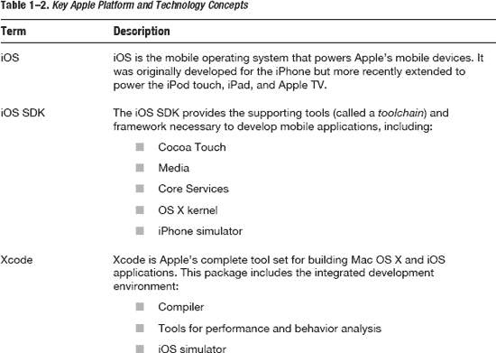
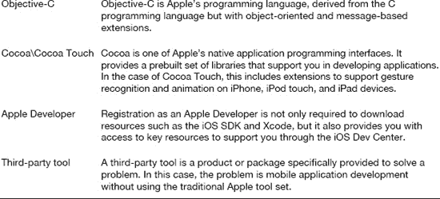

图 1-2 是一个以逻辑顺序呈现这些概念的示意图（俗语说，“一图胜千言”）。随着本章内容的推进，我将以此图为基础，将我们遇到的每个概念相互关联起来，并解释它们的目的和关系。该图代表了所提供的各个“层”，而方框的边界不应被视为你唯一可用的接口。随着我介绍每个核心层，这一点将变得更加清晰。

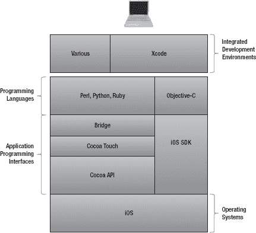

**图 1-2.** *苹果移动应用程序开发框架*

正如你在图 1-2 中所见，在 iOS 之上的是 `iOS SDK` 和带有 Touch 扩展的 `Cocoa API`。Bridge 技术是另一个 API，它提供了将这些资源与非苹果的及解释型语言（如 Perl、Python 和 Ruby）链接起来的框架。最后，Xcode 工具套件提供了图形用户界面（GUI），用于使用通过集成开发环境（IDE）提供的编程语言、API 和库——所有这一切都运行在你的 Apple Mac 计算机之上。

现在，即使还没有掌握开发的方法或模式，你也应该对与苹果移动设备开发相关的一些高级概念感到熟悉，并理解这些核心组件之间的某些关系。你还应该已经下载了 `iOS SDK`，尽管我们要到下一章才会使用它。

构建和运行移动应用程序需要 iOS 及其相关的 SDK。让我们从高层次上来审视它们。这将帮助你理解不同移动设备的一些复杂性，并为你进一步了解操作系统功能如何被其上的 API 和 SDK 所访问提供背景信息。


### 了解 iOS

iOS 最初为 iPhone 开发，源自 Mac OS X，是苹果移动设备（包括 iPhone、iPod touch 以及后来的 iPad）的核心操作系统。与大多数操作系统一样，iOS 采用分层方式来提供必要的功能。每一层都构建在另一层之上，并在各层之间提供了清晰的抽象边界。iOS 内部的分层结构如图 1-3 所示。

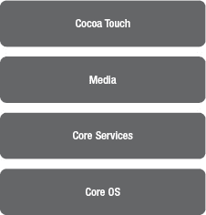

**图 1-3.** *iOS 架构*

让我们从堆栈的底部开始，首先处理底层服务，然后逐步向上，直至那些我们将直接与之交互并用于构建 iOS 应用程序的要素。

**核心 OS**：该层提供了对物理硬件的抽象，并包含了供其上层使用的底层特性。该层的每个元素都以一系列框架的形式提供：Accelerate 框架、External Accessory 框架、Security 框架和 System 框架。在此语境下，*框架* 是一组提供该框架功能的关联 API 的集合。随着本书的深入，我们将更详细地探索这些框架及其暴露的 API，并演示如何使用它们的示例。

**核心服务**：核心服务层构建于核心 OS 层之上，包含了应用程序所需的基本系统服务。该层被划分为一组核心服务，它们共同提供一系列必要的高级特性。其中一些服务提供编程支持（语言支持、数据类型等）、数据管理支持以及电话功能。

**媒体层**：顾名思义，该层提供图形、音频和视频支持。其任务是提供通过所用设备可获得的最佳多媒体支持。这一层包含的框架提供了核心音频、图形、文本、视频和 MIDI 支持，以及动画、媒体播放等更多功能。

**Cocoa Touch 层**：该层为构建应用程序提供支持和关键构建模块，包括多任务处理、基于触摸的输入、通知以及用户界面支持。该层还支持文件共享和打印，以及用于无线连接的点对点服务。

尽管大部分此类功能都被打包到被称为*框架*的特定库中，但并非所有层和所有功能都如此。例如，核心 OS 和核心服务层中的某些专用库是作为动态链接库（DLL）提供的，并带有符号链接，用于将 iOS 指向设备上的最新版本。这类技术对于管理代码很常见，我们将在第 2 章讨论版本控制时更详细地探讨它们。

**注意：** 在此，我将介绍每个框架中的关键概念，并提供工作示例来说明其用法。有关 iOS 框架及其支持的 iOS 版本的更多详细信息，可在 iOS 开发者库文档中找到。

### 使用苹果组件进行应用程序开发

现在，您应该对操作系统、构成它的各个层次及其提供的功能有了大致的了解。在深入探讨 iOS SDK 的细节之前，让我们先回顾一下使用苹果组件进行软件开发的一些历史。

当 iPhone 最初发布时，您有两个选择：使用原生工具和语言，如 Objective-C 和 Mac OS X；或者使用在移动版 Safari 浏览器中执行的基于 Web 的应用程序。后者自然局限于 HTML、层叠样式表（CSS）和 JavaScript 等语言。如今这仍然是一个有效的开发选择，但在可实现的功能和用户体验方面有所限制。

第二代 iPhone 的发布引入了 iOS SDK、苹果 App Store，以及使用 Xcode 和 Objective-C 编写原生应用程序的能力。这实际上提供了对 iOS（进而对 iPhone 功能）的完全访问权限，也满足了在 App Store 分发时强制要求使用原生二进制文件的选项。

使用 iOS SDK（以及 Xcode 和 Objective-C）仍然是可行的，并且确实被一些人视为应用程序开发的标准机制。然而，开发人员可能也希望创建能在许多移动设备（不仅仅是苹果设备）上运行的应用程序。或者，他们可能偏爱苹果移动设备但不喜欢 Mac OS X，又或者他们不喜欢被强制的开发工具和语言。鉴于这些原因，正如我们将在本书中讨论的，已经引入了许多替代方案。在某些情况下，这些选项至少部分依赖于 iOS SDK。

好了，历史讲得够多了。现在让我们来看看使用苹果提供的工具进行应用程序开发的可用选项。苹果提供了以下用于开发应用程序的核心组件：

*   **Xcode**：这是一套由苹果开发的工具套件，用于为 Mac OS X（用于 iMac、MacBook 等）和 iOS 创建软件。
*   **iOS SDK**：这是苹果发布的 SDK，允许开发人员为苹果移动设备和 Apple TV 制作应用程序。

#### Xcode

在撰写本文时，Xcode 的最新版本是 Xcode 4，可在 Mac App Store 上以 4.99 美元的价格购买，已注册为苹果开发者的用户也可从苹果开发者连接网站获取，但需支付 99 美元的年费。Xcode 3 版本仍然免费提供（不过，可以预见，其支持的 iOS 版本是受限的）。

Xcode 自带以下组件：

*   **IDE**：`Xcode` 是苹果的标准 IDE，允许您为 Mac OS X 和 iOS 操作系统开发软件。它支持多种编程语言，并提供专业 IDE 所应有的许多功能，例如语法高亮、自动补全、调试和源代码控制。它可以与业界其他广受青睐的 IDE（如 Eclipse 和微软的 Visual Studio）相媲美。
*   **Interface Builder**：自从 Xcode 4 发布以来，Interface Builder 已从一个单独的应用程序完全集成到 `Xcode` IDE 中，但其目的保持不变：提供一个辅助创建用户界面的工具。它通过一个支持 Cocoa 等框架的 GUI 来实现这一点，并提供一个用户界面对象和控件的调色板，供您根据需要拖放到画布上。您甚至可以更进一步，为这些控件（例如按钮点击）的事件提供源代码实现。
*   **编译器**：编译器是一个基本组件。它接收您的源代码并生成为在移动设备上执行以及为在 App Store 上执行所需的二进制文件。苹果的 `LLVM`（来自 LLVM.org 项目）是一个快速、功能丰富的编译器，可为您的移动设备创建优化的应用程序。它支持多种语言，包括 C、C++ 和 Objective-C。
*   **调试器**：这是苹果对 LLVM.org 开源项目的另一贡献，作为 `Xcode` 一部分提供的这个调试器快速高效。它提供了一个集成的调试界面，包含栈跟踪和逐步调试等常见功能，同时也支持全面的多线程调试。


### iOS SDK

iOS SDK 是苹果公司于 2008 年推出的软件开发工具包，旨在让你能够为 iOS 操作系统开发原生应用。iOS SDK 被划分为若干集合，分别对应 iOS 框架中提供的各层（见本章前面的图 1-3）。具体包括以下内容：

*   Cocoa Touch
    *   多点触控事件与控制
    *   加速计支持
    *   视图层级
    *   本地化
    *   相机支持
*   媒体
    *   OpenAL
    *   音频混合与录制
    *   视频播放
    *   图像文件格式
    *   Quartz
    *   核心动画
    *   OpenGL ES
*   核心服务
    *   网络
    *   嵌入式 SQLite 数据库
    *   核心定位
    *   并发
    *   核心运动
*   OS X 内核
    *   TCP/IP
    *   套接字
    *   电源管理
    *   线程
    *   文件系统
    *   安全

除了 Xcode 工具链，该 SDK 还包含 iPhone 模拟器，这是一个用于在开发者桌面上模拟 iPhone 外观和操作体验的程序。该 SDK 要求使用运行 Mac OS X Snow Leopard 或更高版本的 Intel Mac。其他操作系统，包括 Microsoft Windows 和更早版本的 Mac OS X，均不受支持。更多信息可在 iOS Dev Center 网站上找到。

### 第三方选项

长期以来，在苹果移动设备上开发应用程序却只能依赖苹果公司的工具，这让许多人感到不满。这并非反映苹果提供的工具在质量或功能上有何不足——事实恰恰相反。它们是极其强大和高效的工具，能让你利用其团队开发功能，无论是单独开发还是团队协作，都可以为苹果的桌面和笔记本电脑（iMac、MacBook 和 MacBook Pro）以及移动设备（iPhone、iPod touch 和 iPad）进行开发。

但是，人毕竟是人，我们会对熟悉的事物感到舒适。我们喜欢熟悉感。那些在截然不同的操作系统、技术和工具环境下成长起来的人，可能不愿改变，也看不到改变的必要。例如，如果你是一名 Java 开发者，你可能会热爱 Java 编程语言以及你正在使用的 Eclipse（或类似）IDE。假设你是一名 .NET 开发者，那么你很可能会接触到其他语言。虽然本书的重点是弥合 .NET 与苹果工具集之间的差距，但了解你可以使用的第三方选项，很可能会为你提供相关的背景知识。如果你只接触过 Microsoft .NET，那么你对 Visual Studio 和 .NET Framework 等工具的熟悉程度，将有助于你顺利完成这次转型。

无论你的经验是基于微软平台还是更为混杂，你或许也对 Windows 或 Linux 操作系统感觉更自在，因此对于为了开发应用程序而去学习一个新的操作系统感到犹豫。“毕竟，”我听到许多人争辩道，“最重要的始终是移动设备及其操作系统，而不是你通过什么方式去开发它们。”

那么，如何才能最好地利用你已有的经验以及现有的一切，让你的转型更加顺利呢？我猜你并不害怕学习新东西——毕竟，这很有趣——但你更愿意重用你已经熟悉的开发环境中的某些元素，具体来说，就是 .NET。这一点并未被忽视，一些开源项目和商业组织已经尝试解决这个问题并从中获利。现在有很多可选的方案，有些场景可能比其他场景更适合你，例如 Mono 就提供了一个开源且对苹果友好的 .NET 实现。其他方案，虽然并非专注于 .NET，但对于帮助你完成转型也很有意义，即使你最终选择忽略它们而坚持使用苹果自己的 SDK 和工具。在此，我们将快速了解以下第三方选项：

*   Mono
*   Appcelerator 的 Titanium Mobile
*   Marmalade SDK
*   Flash Professional CS5

#### Mono 家族

Mono 是一个开源（由社区构建）的 .NET Framework 及相关组件的实现，适用于 Windows 以外的平台。Mono 环境可分为核心 Mono 环境以及提供增强功能的附加组件。在为苹果移动设备开发应用程序时，你可以将 Core Mono 视为基础，而 MonoTouch 等附加组件构建于此基础之上，从而构成完整的家族。

Mono 家族包含多个在开发应用程序时至关重要的组件：编译器、框架和支持工具。这些组件分别被称为 Core Mono（编译器和运行时）、MonoTouch（Cocoa Touch 的 .NET 实现）和 MonoDevelop（IDE）。

##### Core Mono

作为 Mono 开发环境的核心部分，Core Mono 提供了一个支持多种编程语言的编译器，包括 C#。它包含一个通用语言运行时（CLR）的实现，更重要的是，它提供了一套全面的 API 来实现 .NET Framework。具体来说，Core Mono 包含了 .NET Framework 类库的实现，这是一组提供 Mono 版 .NET Framework 类库的库。

##### MonoTouch

MonoTouch 提供了苹果自家 Cocoa Touch 库的 .NET 实现。它允许开发者创建基于 C# 和 .NET 的应用程序，这些应用程序可以运行在苹果的 iPhone、iPad 和 iPod touch 设备上，同时还能利用 iPhone API、重用为 .NET 构建的代码和库以及已有的开发技能。现在看来显而易见，但 MonoTouch 的推出堪称神来之笔。它将苹果提供的 Cocoa Touch API 中的 Objective-C 和 C API 绑定到了 C#/通用中间语言（CIL）API 上。除了作为 Mono 一部分的核心基类库之外，MonoTouch 还为各种 iPhone API 提供了绑定，使开发者能够使用 Mono 创建原生 iPhone 应用程序。MonoTouch 是如何做到这一点的呢？

MonoTouch 的核心是一个互操作（interop）引擎，它为 Cocoa Touch API 提供了绑定，包括 Foundation、Core Foundation 和 UIKit。这还包括图形 API，例如 Core Graphics 和 OpenGL ES。

尽管 MonoTouch 为 Cocoa Touch API 提供了桥梁，但还有一个名为 MonoMac 的 Mono 实现，旨在让你能够为 Mac OS X 操作系统编写应用程序，它采用了相同的原理。事实上，在撰写本文时，一个新版本的 Mono 让你能够运用相同的原理，使用 MonoDroid 来编写 Android 操作系统应用程序（尽管这还处于非常早期的开发阶段）。


### MonoDevelop

虽然完全可以使用 Core Mono 附带的命令行工具，而且有人会认为硬核程序员只使用命令行工具，但我个人很感激增强工具带来的一些帮助。如今，以某种图形化工具形式出现的 IDE 已经无处不在。那些看过或使用过微软开发工具 Visual Studio 的人会知道，通过此类工具，编写应用程序的整个体验变得更容易、更快捷。幸运的是，Mono 也不例外，`MonoDevelop` 工具作为一款出色的 IDE，非常适合我们的需求。

如图 Figure 1–4 所示，`MonoDevelop` 在 Mac OS X 操作系统上运行。实际上，它可以在多种操作系统上运行，包括各种 Linux 发行版和 Windows。

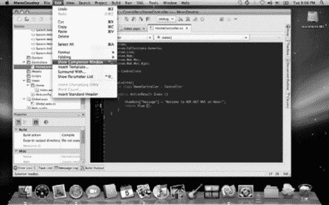

**Figure 1–4.** *在 Mac OS X 上运行的 MonoDevelop 应用程序*

在第 3 章中，我们将探讨 `MonoDevelop`，以及 Mono 框架和 `MonoTouch`。您将获得一个教程，了解如何使用这些组件和 .NET Framework 为 Apple 的移动设备安装、使用和开发您自己的应用程序。

`MonoTouch`（包括 Core Mono）可以从[`http://www.monotouch.net`](http://www.monotouch.net) 下载，`MonoDevelop` 可以从[`http://www.monodevelop.com`](http://www.monodevelop.com) 获取。

### DragonFire SDK

我们已经了解了 Apple 的原生开发环境以及 Mono 对使用 .NET Framework 进行应用程序开发的支持，但这可能仍然对您有限制。例如，如果您选择的编程语言是 C 或 C++ 怎么办？虽然 `Objective-C` 是 Mac 操作系统的一部分，但从语法上讲，它相当不同，而且您可能不想局限于 Mac OS X。`DragonFire SDK` 产品正是为此目的而创建的。

`DragonFire` 的目标是那些希望使用 `Visual C++`、其调试器和 C/C++ 语言编写原生 iPhone 应用程序的 Windows 开发人员。它不需要任何类型的 Mac，也不需要熟悉 `Objective-C`。正如其网站上所说：“用标准的 C/C++ 将您的应用创意变为现实，并且永远无需离开您的 Windows 平台。”

Figure 1–5 展示了 `Dragonfire SDK` 与 Apple 现有移动应用程序开发框架的比较。

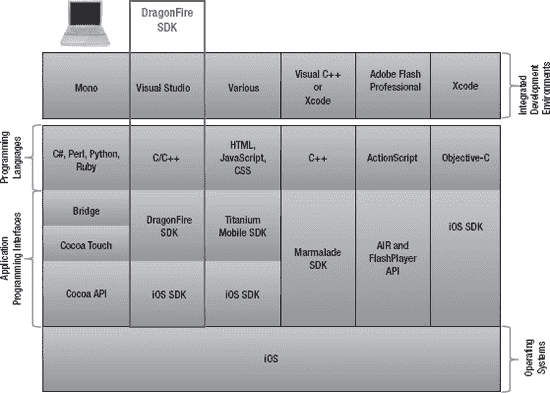

**Figure 1–5.** *DragonFire SDK 框架*

其目标是允许在 Windows 中编写和调试 2D 游戏，并且完全符合通过 Apple App Store 进行分发的标准。虽然这对于编写游戏来说很棒，但您可能会发现该 API 在其他方面有所欠缺。例如，作为一个 API，它不如 Apple 自己的 API 完整——例如，它缺乏对基于位置的 API 的完整支持——但它正在不断增强。`DragonFire SDK Enterprise Edition` 正在推出（在撰写本文时，建议该版本将于 2011 年底推出），此版本将支持数据库，以及更多的拖放功能和用于显示文本和图形的选项。

`DragonFire` SDK 的独特之处在于，一旦您使用其 API 编写了应用程序并使用屏幕模拟器（记住，所有这些都在 Windows 操作系统上）进行了测试，那么您就可以按照说明打包您的应用程序，并通过网站上传以进行编译，如果需要，还可以进行 iTunes App Store 捆绑。

`DragonFire SDK` 可从其官方网站 [`http://www.dragonfiresdk.com/`](http://www.dragonfiresdk.com/) 商业购买。据其作者称，它相对便宜，并且针对“周末项目”。我让您自己决定是否喜欢它，但它确实消除了其他选项的一些复杂性。并且它是唯一一个允许在 Windows 平台上进行完整的 iPhone、iPod touch 和 iPad 开发的选项。

**注意：** 我不会在本书中详细介绍 `DragonFire SDK`。它的结构与我将介绍和演示的其他一些第三方工具类似。我将把玩 `DragonFire SDK` 的乐趣留给您。

### Appcelerator 的 Titanium Mobile

Appcelerator 的 `Titanium Mobile` 是一个开源应用程序开发平台。与 `DragonFire SDK` 可用于使用 C/C++ 编写原生 iPhone 应用程序类似，Appcelerator 的 `Titanium Mobile` 产品允许您使用 Objective-C（iPhone 和 iPad）和 Java（Android）以外的语言编写 iPhone、iPad 和 Android 应用程序。

`Titanium Mobile` 具有类似于 Mono 的方法，即采用众所周知的语言（在这种情况下，包括 HTML、CSS 和 JavaScript 在内的各种语言）并提供将这些语言绑定到原生 API（在这种情况下是 iOS SDK）的 API。Figure 1–6 说明了其与其他选项相比的架构。

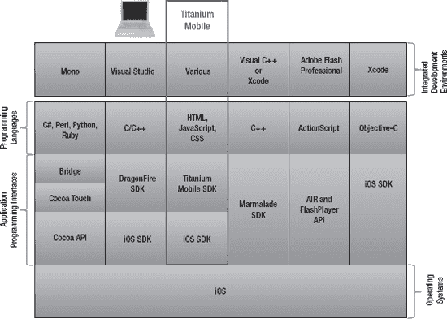

**Figure 1–6.** *Titanium Mobile 框架*

`Titanium Mobile` 与 Mono 的不同之处在于它处理您用喜爱的语言编写的定制代码的过程。您的原始代码经过处理，并最终通过一系列步骤转换为本机可执行代码，这些步骤涉及针对其自身 API 进行预处理和编译为本机代码，然后将本机代码编译为本机可执行文件。这些步骤在 Figure 1–7 中进行了说明，该图显示了从编写代码到可执行文件的生命周期，该可执行文件已准备好进行测试，并最终通过 App Store 分发。

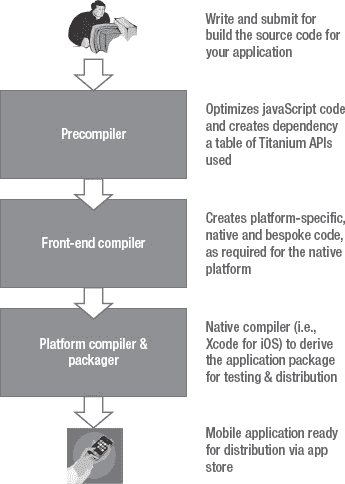

**Figure 1–7.** *Titanium Mobile 处理阶段*

Appcelerator 的 `Titanium Mobile` 可从其官方网站 [`http://www.appcelerator.com/`](http://www.appcelerator.com/) 获取。对于个人使用或在小型组织（少于 25 名员工）内使用它是免费的，并且针对 25 人及以上和 100 人及以上的企业用户提供不同版本。它不仅有针对移动开发的版本，还有针对桌面、商业、分析等领域的版本。

第 3 章提供了一个教程，介绍如何下载、安装和使用该产品来创建 iPhone 应用程序。在该章中，我们将更深入地了解 `Titanium Mobile` 包的功能，并讨论其优缺点。


## Marmalade SDK

当开始介绍 Marmalade SDK 时，你会发现这些应用开发平台（无论是商业的还是开源的）在实现方式上呈现出一种共同的主题。Marmalade 与 `Mono` 和 `Titanium Mobile` 包在许多方面相似，区别在于它只支持 C++。不过，它确实支持在 Windows 和 Mac OS X 操作系统上进行开发，并允许你为 iOS 操作系统创建原生移动应用。事实上，该产品还允许你编译适用于其他操作系统的应用，例如 Android、Symbian、Windows Mobile 6.*x* 以及游戏主机！

Marmalade 包由两个主要组件构成：

*   *Marmalade System*：Marmalade System 是一个操作系统抽象 API，连同相关的运行时库和应用构建系统。它提供了原生操作系统 API 与你编写的代码之间的绑定，其方式与 `Mono` 和 `Titanium Mobile` 相同。
*   *Marmalade Studio*：这是一套专注于高性能 2D/3D 图形和动画的工具与运行时组件集。

该包允许你在 Windows 上使用 Visual C++ 或在 Mac OS X 上使用 Xcode，利用所提供的 API 编写应用程序。然后，它支持一个两阶段的部署流程。在第一阶段，你编译用于调试的应用程序。这会创建一个 DLL（`.dll` 文件），需要 Marmalade 模拟器来执行。然后，当你的应用程序令你满意时，你可以将代码编译成原生可执行文件以供分发。

图 1-8 展示了 Marmalade 架构与我们目前讨论过的其他包的关联。

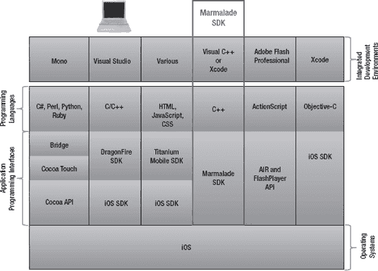

**图 1-8.** *Marmalade SDK 框架*

为了使用该 SDK，你必须在网站上注册一个账户，届时你将获得一个评估许可证。然后，任何注册用户都可以下载功能齐全的 Marmalade SDK 评估版本。评估版本允许部署到所有平台，但不允许公开发布应用程序。你可以从 [`http://www.madewithmarmalade.com`](http://www.madewithmarmalade.com) 购买最新版本的 Marmalade SDK。

## Flash Professional Creative Studio 5

最后但同样重要的是 Adobe 的 Flash 平台，这可以说是这里给出的最完整的解决方案，部分原因在于其在市场上的成熟度以及早在 2010 年 Apple 解除对其第三方开发者指南的限制时，为支持 iPhone 所做的工作。它允许你使用附带的 Packager for iPhone（包含在 Adobe Flash Professional Creative Studio (CS) 5 中以及 Adobe Labs 的 AIR SDK 中）为 iPhone、iPod touch 和 iPad 构建独立应用程序。

Flash Professional CS5 的工作方式与其他包类似，允许你使用熟悉的语言（在此例中是 ActionScript）开发应用程序。你针对附带的 API（AIR 和 Flash Player API）对其进行编译，生成原生的 iPhone 应用程序，这些程序即可用于测试和部署。

图 1-9 展示了 Flash Professional CS5 架构，同样与本章中我们讨论过的其他架构进行比较。

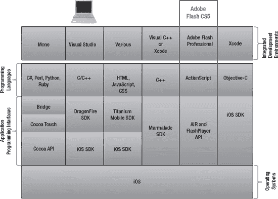

**图 1-9.** *Adobe Creative Suite 5 框架*

这个选项是迄今为止最全面的解决方案，但也是有代价的——无论是财务上，因为 Adobe 的 Creative Studio 并不便宜，还是复杂度上，因为该产品及其庞大的 API 并非易于理解。出于这个原因，本书不涵盖此选项。但在了解了其他可用选项后，如果你愿意，你应该已经做好了尝试 Flash Professional CS5 的充分准备。

## App Store 概述

App Store 是由 Apple 开发和维护的、针对 iOS 设备的数字应用分发平台。通过 iTunes Store（可通过互联网或设备本身访问），Apple 允许服务用户浏览和下载应用程序，并按需付费。应用程序可以直接下载到设备，或者如果合适，可以先下载到桌面再传输。

App Store 可通过多种设备访问，包括 iPhone（如图 1-10 所示）、iPod touch 和 iPad。对于 Mac 笔记本和桌面用户，Mac App Store 在更晚些时候推出，以服务于非移动应用程序。

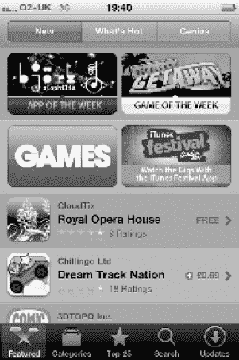

**图 1-10.** *iPhone 4 上的 App Store*

App Store 对 Apple 和应用程序生产商来说都取得了巨大的成功，第 10 亿次应用下载的里程碑早在 2009 年就已突破。如前所述，这一概念已被其他组织模仿，最显著的是其他主要的移动服务提供商。图 1-11 展示了这些平台的全球收入份额。Apple 的主导地位显而易见。

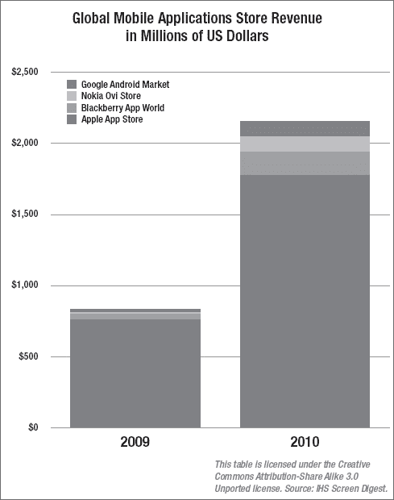

**图 1-11.** *全球移动应用商店收入*

### 在 App Store 销售应用

App Store 的收入模式是分摊销售额：Apple 获得 30%，应用发布商获得 70%（此比例随时可能变更）。事实证明，这一模式对 Apple 和许多应用生产商都极其有利可图。术语 *app*（application 的简称）也被更广泛地使用，尽管 Apple 已为该术语获得商标权，但其他人（如 Google 的 *Google Apps* 和 Amazon）也在类似语境中使用它。

**注意：** 所有原生应用只能通过 App Store 合法地下载到 Apple 移动设备上，除非设备已越狱。*越狱* 设备指的是使用能够访问设备根文件系统的过程，从而允许修改和安装第三方软件组件。这并不违法，尽管 Apple 对此话题很敏感，并声明可能会“使设备的保修失效”。越狱不需要对硬件进行任何更改，并且很容易撤销。

最近，Apple 宣布了其新的基于订阅的服务，允许应用发布商设置订阅的时长和价格。此前，这是不可能的，你必须以逐个版本的方式销售每个版本。新服务允许发布商通过其应用销售内容，用户可以在指定时间段内接收新内容。

一个更重要的变化是，不仅传统的通过 iTunes 销售的模式仍然可用，Apple 还允许应用发布商直接从自己的网站分发其订阅，在这些网站上，iTunes 的收入模式不适用，因此无需与 Apple 分成。这显然具有免除向 Apple 上缴部分应用收入的义务的优势，但这确实意味着你失去了 App Store 带来的好处，例如受众覆盖面和可访问性，并且必须依赖你自己的营销活动。


#### 向 App Store 提交应用

以下是将应用提交至 App Store 的步骤：

1. 完成应用的开发与测试。
2. 为应用创建支持性 `info.plist` 文件（稍后将详细介绍）。
3. 编写应用描述。
4. 为应用选择一个唯一的数字 SKU。
5. 整理要在 App Store 中显示的截图。
6. 准备 iTunes 艺术图稿。
7. 通过 iTunes Connect 提交。

提交的任何应用都需经 Apple 审批，这包括 SDK 协议中规定的基本可靠性测试及其他分析。Apple 设有申诉流程，但仍拥有最终决定权。如果你的应用被拒，你仍可通过手动向 Apple 提交请求，申请将应用许可给特定 iPhone 设备进行临时分发（尽管 Apple 日后可能取消此权限）。

官方的《*App Store 审核指南*》是开发者的重要参考资料。我们将在第 9 章 进一步讨论提交应用以获取审批与分发权的相关细节。

### 本章小结

本章介绍了为 Apple 移动设备（特别是 iPhone、iPod touch 和 iPad）开发应用的概念。我们探讨了如何注册为 Apple Developer 及其推荐理由，以及移动应用开发的一些基本原则。随后讨论了驱动这些移动设备的 iOS 操作系统、iOS SDK 和 Xcode。

介绍完这些概念后，我们了解了开发应用可用的几种不同方案。这些方案不仅包括 Apple 原生的语言与工具，还包括众多第三方选项（既有开源的，也有商业的）。

最后，我们介绍了 App Store 的目的、收入模型以及对各种设备的支持。你学习了向 App Store 提交新应用以供审核并在获批后发布的整个流程。

下一章将提供一个速成课程，教你使用 Apple 原生工具（iOS SDK 和 Xcode）创建简单应用。学完那一章后，你不仅将创建出第一个 iPhone 应用，还会更深入地体会移动应用开发中的一些基本概念——在接触其他可选方案时，这些概念也能复用。

在第 3 章中，你将进一步了解第三方工具（如 Mono 系列）。之后，我们将重新聚焦于 Apple 工具，并在本书剩余部分使用它们演示如何运用你的 .NET 知识与经验来创建引人入胜的应用。

## 第 2 章

## 即刻上手：iOS SDK 开发速成课

第一章介绍了 Apple 的移动操作系统（iOS）以及开发移动应用的各种方案。在本章中，我们将正式开始使用 Apple 自己的软件开发工具：`Xcode` 和 iOS SDK。

本章将涵盖以下主题：

- 入门所需的硬件与软件
- 安装相关组件的指南
- Objective-C 入门
- `Xcode` 概览及如何启动你的第一个项目
- 如何使用 iOS SDK 创建你的第一个 iPhone 应用

## 开始之前

我们先来看看入门所需的条件——不仅包括软件组件，还有你需要的硬件。

你还需要注册成为已注册的 Apple Developer。在允许下载 iOS SDK 之前，Apple 要求完成此步骤。在第 1 章中，我们讨论了为何需要这么做、其益处以及具体操作方法。在此提醒，你需要访问 [`http://developer.apple.com/`](http://developer.apple.com/) 进行注册。

**注意：** 在第 1 章中，我提到了成为已注册 Apple Developer 的一些益处。其中之一是丰富的《*入门指南*》列表，这些指南提供了关于图形与动画、数据管理等众多主题的简短介绍。你可以在 iOS Developer Library 中找到它们及更多资源，网址为 [`http://developer.apple.com/library/ios/navigation/index.html`](http://developer.apple.com/library/ios/navigation/index.html)。

### 选择合适的机器

你需要一台 Apple Mac 才能开始。你可能已经有一台旧设备，并想知道它是否仍适合开发现代移动应用。好消息是：部分较旧的 Apple Mac 机型也能运行所需软件。关键在于操作系统。

为了支持 iPhone、iPod touch 和 iPad 的开发，你需要 `Xcode` 3.2.6 或更高版本（包括 iOS SDK 4.3）。该版本还提供对应用打包和提交至 App Store 的支持。该版本的 Xcode/iOS SDK 需要 Mac OS X Snow Leopard 10.6.6 或更高版本，以及基于 Intel 处理器的 Apple Mac 机器。这里的重点是 Intel 处理器。

2006 年，Apple 停止了 PowerPC 处理器的使用，并宣布未来所有 Mac 都将采用 Intel 制造的 x86 处理器。因此，2006 年生产的 Mac 设备（具体包括 Mac mini、iMac、MacBook、MacBook Pro 和 Mac Pro），只要具备足够的内存和硬盘空间，都可以顺畅运行 Mac OS X Snow Leopard 或更新的 Lion 操作系统以及开发工具。所需的内存量与空间大小取决于你所安装的操作系统版本。

**能否使用 PC？**

如果你不想使用 Apple 设备呢？如果你希望使用运行 Windows 等操作系统的 PC 呢？这实际上取决于你计划使用哪些工具来开发移动应用。

第 1 章中介绍的许多第三方方案，实际上是设计在基于 Windows 的 PC 上运行的，它们使用 Objective-C 以外的语言。但如果你希望使用 Apple 的原生工具（如 `Xcode`）呢？这就没那么直接了。这些工具只能在 Mac OS X Snow Leopard 和 Lion 上运行，因此你需要一台基于 Intel 的 Mac。不过，从技术上讲，并非毫无希望！通过使用虚拟化软件（如商业产品 VMware 或免费软件 `VirtualBox`），你可以在基于 Intel 的 PC 上的虚拟机内运行 Mac OS X Snow Leopard。

但请注意！虽然在虚拟机上运行该操作系统在技术上是可行的，并且有许多人成功做到了这一点（称为 Hackintosh），但这不被 Apple 的 Mac OS X 许可协议所允许，因此是非法的。

### 选择 iOS SDK

现在你已拥有合适的机器，运行着 Mac OS X Snow Leopard 或 Lion，可以下载并安装所需软件了。但该安装什么软件呢？第 1 章介绍了 `Xcode`，它包含 iOS SDK，并提供了构建 iOS 应用的完整工具集。如果你尚未安装，需要从 [`http://developer.apple.com/xcode/`](http://developer.apple.com/xcode/) 下载。

自 `Xcode` 4 发布以来，目前有两种方式获取和安装 `Xcode`。如你所知，`Xcode` 3.2.6 或更高版本支持 Apple 移动设备的开发，并且免费提供。不过，你也许想使用最新版本 `Xcode` 4，它对 iOS 或 Mac Developer Program 的成员免费开放，也可从 App Store 购买。


## Xcode 4 有哪些新功能？

如果你熟悉将 Visual Studio 作为开发环境，那么你会发现自己在使用 Xcode 4 时，远比使用之前的版本得心应手。那么，这些新功能是什么呢？

- **新的用户界面**：新的集成开发环境（IDE）将先前版本中分散的多个窗口合并为拥有不同导航面板的单一窗口，使其更易于使用。其中包含用于为应用程序创建新图形用户界面的 Interface Builder。
- **辅助功能**：该软件在你编写源代码时提供内联的上下文相关帮助——例如，提示你正在继承的类的代码。这类似于微软的 IntelliSense，后者因其在 Microsoft Visual Studio IDE 中的应用而广为人知。
- **新的调试器**：此版本提供了一个集成的调试界面，允许你在执行应用程序时单步执行代码并查看相关变量。
- **分析工具**：这些工具允许你收集有关应用程序性能的信息，以及它可能对操作系统产生的影响。例如，你可以使用提供的一些分析工具来了解应用程序是如何消耗内存的。

## Apple iOS 开发中心资源

第 1 章 也提到了 iOS 开发中心（参见 [`http://developer.apple.com/devcenter/ios/index.action`](http://developer.apple.com/devcenter/ios/index.action)）以及许多其他资源。现在可能是查看其中一些资源的好时机。以下是一些将在本章（以及本书其余部分）中为你提供支持的资源：

- **iOS 人机界面指南**：描述了在设计界面时应考虑的要素，并提供了关于如何创造最佳用户体验的指导原则。
- **应用设计策略**：这是指南中一个特别有用的子部分，因为它帮助你系统化地思考你的应用创意，比如你可能包含的功能。
- **入门指南**：一系列简短但非常有用的指南，介绍如何开始使用各种功能，包括工具、iOS SDK 和编程语言。我推荐从“iOS 起点”部分（[`http://developer.apple.com/library/ios/#referencelibrary/GettingStarted/GS_iPhoneGeneral/_index.html`](http://developer.apple.com/library/ios/#referencelibrary/GettingStarted/GS_iPhoneGeneral/_index.html)）开始，这是一个很好的起点。

## 安装 Xcode 和 iOS SDK

现在你应该已经决定要使用哪个版本的 Xcode，以及相应的 iOS SDK。鉴于本书的目标是最新的 Apple 移动设备，并且我想展示最新的工具选项，我将使用撰写本书时可用的最新版本 Xcode：Xcode 4。本书中的所有示例均使用 Xcode 4，部分原因是其一些改进之处，我建议你也这样做。

获取 Xcode 4 的一种方法是查看 Mac 随附的 CD 或 DVD。Xcode 和 iOS SDK 通常分开放置在不同的介质上，只需找到 CD 或 DVD，将其插入驱动器，定位到文件 `devtools.mpkg`，然后双击它即可开始安装。

另一种途径是从 App Store 下载该应用，这是获取最新版本最具成本效益的解决方案。只需打开桌面上的 App Store 应用并搜索 Xcode。最后，你可以访问 Apple 的 iOS 开发中心获取 Xcode 4.2 和 iOS 5 的开发者预览版。这就是我们将在本书中使用的版本。通过导航到 [`https://developer.apple.com/devcenter/ios/index.action`](https://developer.apple.com/devcenter/ios/index.action)，或访问 App Store 上的 Xcode，你将看到一个类似于图 2–1 所示的屏幕。

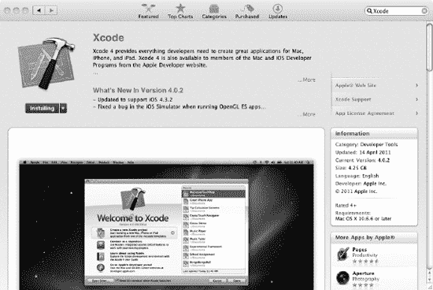

**图 2–1.** *App Store 中提供的 Xcode*

向下滚动并选择下载 Xcode 4.2。请注意：该文件体积很大，所以除非网速极快，否则下载需要一段时间。这对许多用户来说是一个痛点，但一旦安装完毕，你获得的收益将值得等待。

下载 Xcode 后，启动它以开始安装。你应该会看到如 图 2–2 所示的屏幕。

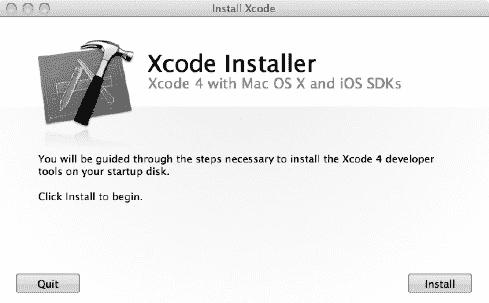

**图 2–2.** *Xcode 4 安装启动屏幕*

按照屏幕上的说明完成 Xcode 4 的安装。安装完成后，你会在屏幕底部看到 Xcode 4 应用程序图标。单击此图标启动程序，如图 2–3 所示。

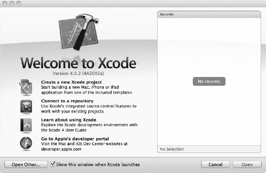

**图 2–3.** *运行 Xcode 4 应用程序*

将你的所有源代码存储在你选择的特定文件夹或仓库中也是一个好主意。这应该位于你自己的 `Home` 区域内的某个位置。现在就设置好这个文件夹，以便随时准备接收你的第一个 iPhone 应用程序。按照你喜欢的方式在 Finder 中创建该文件夹，并将其命名为 `Projects`。

在 Xcode 中创建新项目时，你可以将项目位置指向此文件夹，或者在此位置创建一个本地仓库，并使用版本控制系统来管理你在开发应用过程中所做的更改。对于版本控制，你有两个选择。你可以使用 Git 或 Subversion——两者都作为 Xcode 安装的一部分被安装。Subversion 通常是基于服务器的，尽管你也可以在本地计算机上运行服务器，并使用命令行界面创建一个本地仓库，类似于以下命令：

```
svnadmin create <仓库名称>
```

一旦你在所需位置成功创建了仓库，就可以将其添加到你的 Xcode 仓库列表中。要添加新仓库，请选择 `File`  `Repositories`。在出现的屏幕上，单击加号 (+) 符号以显示弹出菜单，然后选择 `Add Repository` 选项。这将显示如图 2–4 所示的屏幕。填写各字段，指向你刚刚创建的仓库。单击 Next 按钮，并按照屏幕上的说明完成仓库的注册。

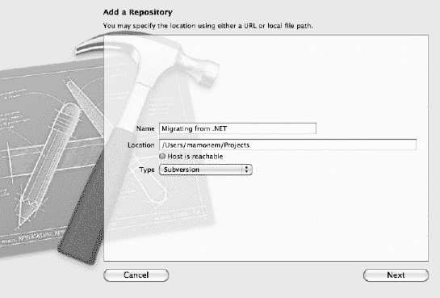

**图 2–4.** *添加仓库*


### 版本库管理器

您的空版本库管理器将显示，如图 2-5 所示。现在，您已准备好使用 Xcode 4 开始开发您的第一个 iPhone 应用程序。

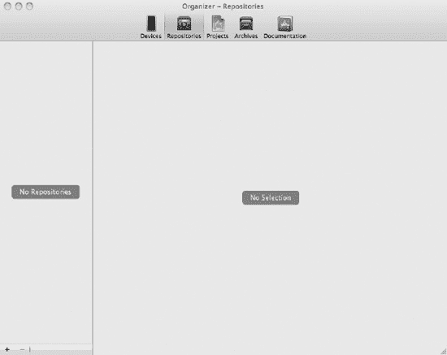

**图 2-5.** 版本库管理器

Xcode 对 Subversion 的支持是内置的，前提是您使用的是 1.5 或更高版本。但是，您必须先在命令行上创建 Subversion 版本库并将项目导入 Subversion，然后才能在 Xcode 中管理它。为简单起见，我们的示例将不使用源代码控制子系统。我们只使用文件系统。有关使用 Subversion 的详细说明，请参阅在线书籍 *Version Control with Subversion*（[`http://svnbook.red-bean.com/`](http://svnbook.red-bean.com/)），该书已得到 Subversion 开发者的认可。

**注意：** 您通常不会在要管理项目源代码的同一目录中创建 `svn` 版本库。相反，您可以检出版本库的“主干”（trunk），它将成为文件系统上的一种特殊文件夹（它包含一些点文件，让 Subversion 知道它已被检出）。然后，您可以在该文件夹中创建项目文件，并且可以通过 Xcode 的用户界面将它们添加到版本库中。

无论您做出何种决定，现在都应已安装 Xcode 并选择了版本库偏好设置。您已准备好启动项目并编写代码。但在开始构建应用程序之前，让我们先简要了解一下 Objective-C 语言，重点关注您在构建应用程序时会遇到的一些关键原则。

## Objective-C 入门

Apple 的 Objective-C 是在 iPhone、iPod touch 和 iPad 上进行应用程序开发的事实标准语言。尽管通过 Mono 实现支持了诸如 .NET 中提供的新语言，但实际上使用 Objective-C 提供了性能最佳的选项。如果您正在编写一个特别高性能的应用程序（例如游戏或计算密集型应用程序），这一点就变得尤为重要。

那么什么是 Objective-C，它与 .NET 语言（特别是与其最接近的 .NET “表亲” C# 语言）相比如何？提供一份详尽的指南本身就需要一本专著。为了让您入门，我们将介绍一些最重要的概念以及在编写第一个程序之前您应该了解的直接差异。随着本书的深入，我们会在遇到这些差异时指出它们。

以下是针对 .NET 开发者的任何 Objective-C 入门指南以及本章我们将创建的应用程序所使用的关键原则列表。此处简要介绍将帮助您理解第一个应用程序的一些重要方面。

*   对象模型
*   方括号
*   命名约定
*   导入
*   类定义和实现
*   异常处理
*   `Nil` 对象
*   内存管理

**注意：** 本入门指南从您现有的 .NET 经验出发提供介绍，但无法全面涵盖像 Objective-C 这样的综合语言。如果您需要更多详细信息，我推荐 Scott Knaster 和 Mark Dalrymple 所著的书籍 *Learn Objective-C on the Mac*（Apress，2009 年），可在 [`http://www.apress.com/9781430218159`](http://www.apress.com/9781430218159) 找到该书。

让我们从一些术语的简要介绍开始。

### Objective-C 术语

表 2-1 比较了 .NET C# 编程语言和 Objective-C 关键字。如您所见，它们不同，但依然非常相似。

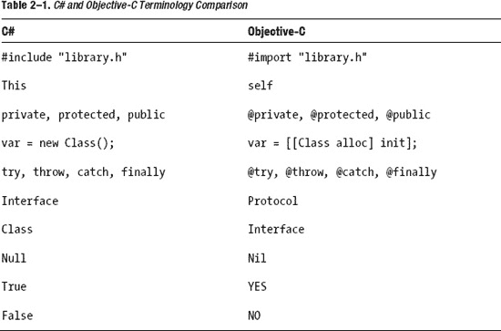

### 对象模型

Objective-C 中的对象模型与 Smalltalk 和 C++ 等语言非常相似。它是一种面向对象的语言，通过提供 C 语言的严格超集来扩展 C 语言。这意味着您可以在类中包含任何 C 代码，并且它能够愉快地编译（前提是语法正确并且已处理库和其他依赖项）。

对于那些熟悉 Smalltalk 的人来说，对象模型与 Smalltalk 的相似性会立即被识别（尽管它的相关性现在已过去很多年）。本质上，它提供了一种消息传递风格的语法，涉及将消息传递给对象实例，而不是在对象上调用方法。这是一个微妙的区别，但有深远的影响。

这种机制实现了与其他非松散耦合的面向对象语言（如 .NET）相同的目标。主要区别在于，传递的消息与对象之间的关联不是在编译时通过代码绑定解析的，而是在运行时解析。因此，您需要谨慎对待此接收对象将如何处理消息。正在接收消息的对象（*接收者*）不保证会响应消息，尤其是当它未预期到或不理解该消息时。在这种情况下，最好的情况下应用程序会引发异常。最坏的情况下，它会静默继续，使调试应用程序变得更加费力。因此，您还应注意本章后面提供的异常处理和 `Nil` 对象提示。

### 方括号和方法

您很快就会发现，方括号是 Objective-C 语言的一个重要特性。正如您所学到的，对象模型基于这样一个概念：对象接收消息以调用方法。相反，如果您想查询一个方法的属性，建议的方式是通过发送消息向对象请求属性值，而不是窥探其内部（这无论如何都被视为不良做法）。方括号表示您正在向对象发送消息。

**注意：** 此处的示例仅反映语法，并不代表完整、可编译的源代码。随着本书的深入，您将在可工作的源代码列表中看到这些示例。

#### 调用方法

那么，如果我们有一个名为 `Engine` 的对象，我们可以在首先创建 `Engine` 的实例后，通过使用其 `start` 方法来“启动引擎”。在 Objective-C 中，代码如下所示：

```
// 创建指向 Engine 类类型对象 diesel 的引用。
Engine* diesel;

// 创建 Engine 对象的实例，并让 diesel 引用指向它
diesel = [[ Engine alloc] init];

// 通过向 Engine 对象发送 start 消息来调用 start 方法
[ diesel start];
```

相同的代码在 C# 中（不带注释）如下所示：

```
Engine diesel;
diesel = new Engine();
diesel.start();
```

**注意：** 在此 C# 示例中，请注意 `new()` 命令在单个调用中同时分配和初始化对象。

#### 传递和检索

当调用对象的方法时，传递参数以及检索被调用方法可能返回的值时，使用类似的语法。例如，要传递一个标志或值来指示启动引擎时应施加多少油门，我们将使用以下语法：

```
[diesel start: gas];
```

或者，如果我们想返回引擎当前输出的转速数，我们可以使用以下语法，假设我们创建了一个名为 `revs` 的 getter 来返回这样的值：

```
currentRevs = [ diesel revs ];
```

### 命名约定

Objective-C 使用的命名约定与许多其他语言非常相似，对类使用 `PascalCase`，对方法和属性使用 `camelCase`。对于那些不熟悉这两种约定的人，`PascalCase` 是连接首字母大写的单词，始终以大写字母开头，如 `PascalCase`。`camelCase` 形式类似，连接首字母大写的单词，但第一个字母可以是大写或小写，如 `camelCase`。`PascalCase` 也称为 `UpperCamelCase`。

如果您想知道，微软的 C# 标准是 `PascalCase`，这可能是该表示法看起来眼熟的原因。


#### 导入

使用 Objective-C 时，有两种导入方式，与 C/C++ 类似。区别在于，一种语法会强制编译器的预处理器在系统头文件目录中查找文件，而使用引号的语法则会在当前目录中查找（如果未指定其他位置）。

要在当前目录或特定目录中查找自己的头文件，请使用以下语法：

`#import "myfile.h"`

要在系统头文件目录中查找，请使用以下语法：

`#import <Foundation/foundation.h>`

#### 类定义与实现

与大多数面向对象语言一样，对象由其类定义，并且可以创建该对象的多个实例。每个类由一个接口（定义类的结构并允许实现其功能）和一个对应的实现（实际提供功能）组成。通常，这些实现保存在不同的文件中：接口代码包含在头文件（扩展名为`.h`）中，而实现则保存在消息文件（扩展名为`.m`）中。

**注意：** 我听说（或许是一个事实）当 Objective-C 语言的发明者被问及为什么使用`.m`扩展名时，他只是简单地说，因为`.o`和`.c`已经被占用了！

因此，以我们的`Engine`示例为例，各文件中的源代码可能如下所示：

**清单 2-1.** *Engine.h*

```
@interface
- (int) revs;
@end
```

**清单 2-2.** *Engine.m*

```
@implementation
- (int) revs {
        return revs;
}

- (void) start {
        // 以 900 转/分的怠速启动引擎
        // – 注意：这是一条注释
        revs=900;
}
@end
```

如您所见，在这两种情况下，代码前面都带有相应的`@interface`或`@implementation`，并以`@end`标记结束。所有接口和方法必须分别出现在这两个语句之间。

#### 空对象

Objective-C 中实现面向对象特性的方式意味着对方法的调用被实现为在运行时解析正确标识的消息传递到对象。如前所述，这意味着通常会在编译时进行的类型检查（通常会抛出错误）将不会发生。

在运行时出现不匹配的情况下，要么会抛出异常（最佳情况），要么对象会静默忽略消息（最坏情况）。因此，请格外小心，确保您的消息/对象交互有效，并在整个过程中添加良好的异常处理。在 .NET 中复制后期绑定并没有简单或明显的方法。

#### 异常处理

对于使用过 C# 或其他语言中异常处理的人来说，Objective-C 的异常处理语法会很熟悉。

```
@try
{
        // 要执行并希望捕获异常的代码
}
@catch ()
{
        // 捕获异常后执行的操作
}
@finally
{
        // 在此处进行清理代码
}
```

鉴于其相似性，我在此不再重复 C# 的等效代码。您应该能立即识别出该语法并轻松使用它。然而，如前所述，需要牢记的重要一点是：由于在 Objective-C 中消息以运行时方式传递并解析给对象，因此确保采用防御性编码方法至关重要。您应该预见异常，并像前面的示例所示那样妥善捕获和处理它们。

#### 内存管理

就像 .NET 中的公共语言运行时 (CLR) 一样，运行时环境会为您处理 Objective-C 应用程序的内存管理。Objective-C 使用引用计数系统。这意味着，如果您跟踪自己的引用，一旦引用计数归零，运行时将自动回收对象使用的任何内存。

这听起来仍然复杂吗？只要遵循一些简单的原则，它并不复杂。在为移动设备编写应用程序时，即使这些设备如今拥有更大的内存容量，内存管理的重要性也不容低估。

如果您使用`alloc()`分配了内存，请记得调用`release`，除非您正在使用自动释放机制。您可能还想探索使用`@property`和`@synthesize`功能，这将自动创建您的 setter 和 getter，尽管这并不能消除您为对象分配空间的需求。

在 iOS 5 中，新的自动引用计数 (ARC) 功能可自动管理 Objective-C 对象的内存管理。ARC 使内存管理变得更加容易，大大降低了程序出现内存泄漏的可能性。

## 创建您的第一个 iPhone 应用程序

使用 Xcode 4 启动新项目的第一步是创建一个单一的 Xcode 项目。事实上，在 Xcode 中使用项目是强制性的，因为您的文件和资源是在这个项目下收集的。可以拥有多个但相关的项目，我们将在本书后面介绍这种方法，但本质上，本书的示例不需要它。正如您稍后将看到的，iOS SDK 提供了一些项目模板来帮助您入门。

以下是使用 Xcode 创建 iPhone 应用程序的高级步骤：

1.  创建您的项目。
2.  设计您的应用程序。
3.  编写代码。
4.  构建并运行您的应用程序。
5.  测试、测量和调优您的应用程序。

Xcode 工具套件可以在所有这些步骤中为您提供支持，从创建项目和管理与其关联的文件，到使用提供的仪器工具来微调您的应用程序性能。


### 创建项目

让我们首先使用 Xcode，通过 iOS SDK 提供的其中一个模板来创建一个项目，这样能让我们有个良好的开端。以这种方式提供项目模板，与你在 Microsoft Visual Studio 以及其他 IDE（如 Eclipse）中看到的类似。这些模板默认定义了与你所选项目类型相关的一些特性、文件和资源。你可以在图 2–6 和图 2–7 中看到 Visual Studio 与 Xcode 4 之间的相似性。

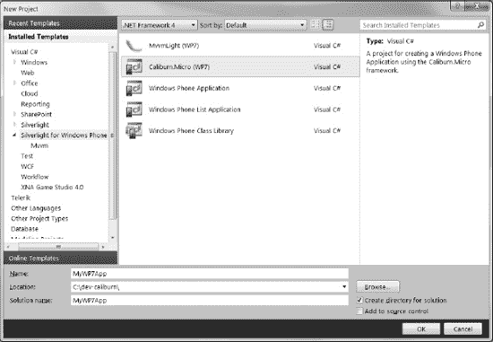

**图 2–6.** *Visual Studio 2010 项目模板*

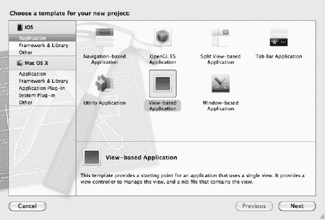

**图 2–7.** *Xcode 4 项目模板*

有许多模板可供选择，而“正确”的模板实际上取决于你在构建的应用类型。模板也并不仅限于应用程序。请注意，在 图 2–7 的左侧窗格中，Xcode 提供了创建库以及应用程序的模板，而且针对 Mac OS X 平台的选择甚至更加广泛！

对于本例，请选择基于视图的应用程序模板，该模板使用单个视图来实现其用户界面。（在本章稍后介绍如何创建用户界面时，我们会更详细地讨论视图。）此时你将看到如图 2–8 所示的屏幕，要求你为应用程序设置一些选项，包括你希望针对的设备系列。如图所示，将产品命名为 `HelloWorld`，并选择 iPhone 作为设备系列。然后点击“下一步”按钮。

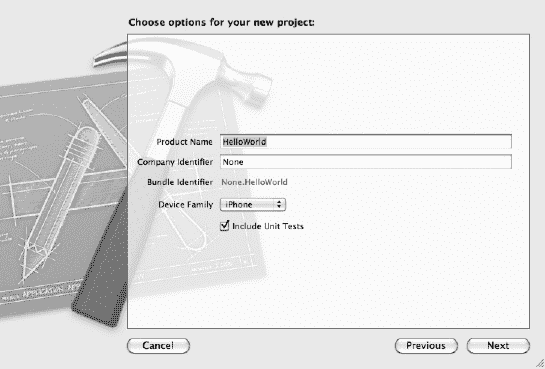

**图 2–8.** *创建新项目*

现在可以继续创建项目及其相关文件和资源了。完成之后，你将获得一个新的 Xcode 项目，其中显示的项目及其文件结构如图 2–9 所示。

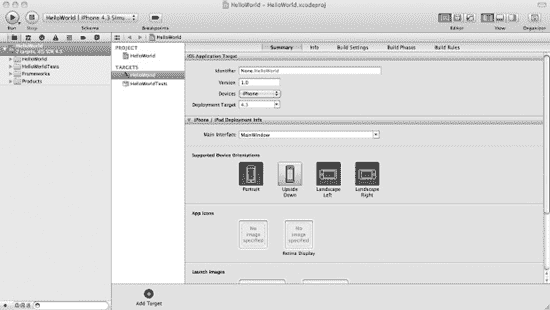

**图 2–9.** *在 Xcode 中打开 HelloWorld 项目*

花些时间探索一下，查看项目结构、创建的文件以及一些菜单。你会注意到有些文件包含提供默认实现的源代码。现在不必理解所有内容。

### 探索项目与文件结构

正如我所提到的，一旦创建完成，你的空项目将拥有许多为你创建的默认文件。这些文件为针对你所选设备（本例中为 iPhone）的基于视图的空项目提供了默认实现。

让我们快速浏览一下为你创建的一些项目文件：

*   `HelloWorldAppDelegate`：*应用程序委托* 是负责处理应用程序初始化的控制器，包括显示用户界面的初始视图。它还负责在退出应用程序时处理应用程序终止。通常只有一个 `UIApplication` 对象类型的应用程序委托。这被称为*单例*对象。
*   `MainWindow.xib`：该文件表示用户界面的结构和资源。它是 Mac OS X 的 Interface Builder 文件，因此扩展名为 `.xib`。在典型的应用程序中，`mainwindow.xib` 实际上是你应用程序中可能包含的多个视图的容器，因此，为每个视图关联额外的视图控制器（以及 `.xib` 文件）是常见的做法，实际上也是苹果的最佳实践。在我们的示例中，我们有 `HellowWorldViewController` 来管理此视图，我们会保留主窗口用于在不同视图之间进行导航。
*   `HelloWorldViewController`：视图控制器类始终与一个视图关联，并且这是实现用户界面逻辑的地方。该类完善了 iOS 设备用于实现其 GUI 的模型-视图-控制器设计模式。视图控制器本身将包含可能与界面上的控件相关联的属性。例如，你可能要求用户在文本字段中输入文本，并希望使用属性 getter 和 setter 将信息存储在某处。你将在本书中使用的源代码中看到这样的例子。

对于每个类别，你可能会发现有一个或多个以下文件，其中一些文件按逻辑分组。例如，一个实现文件通常会有一个关联的头文件，反之亦然。关键的文件类型如下：

*   **头文件 (`.h`)**：这是将包含引用和接口定义但不包含实际实现代码的头文件。拥有头文件的一个原因是，如果你的代码引用了你没有源代码的对象及其接口，但在静态库中有它们的实现，你只需包含相应的头文件，即可在构建时解析实现。
*   **实现文件 (`.m`)**：这是实现文件，本质上与 C 编程语言中的 `.c` 文件或 C# 编程语言中的 `.cs` 文件相同。你的接口和其他项目的实现代码将包含在这些文件中，并在构建时被引用。
*   **UI 资源文件 (`.xib`)**：这是一个以 XML 表示的 Mac OS X Interface Builder 资源文件。它不是一个可部署的文件，而是在构建应用程序时用于生成可执行文件的文件。它描述了用户界面的 XML 表示，并通过视图控制器与你的用户界面逻辑松散耦合。

除了这些文件之外，许多支持文件共同构成了一个完整的应用程序。例如，你会在 `\Supporting Files` 文件夹中找到一些核心文件，包括包含起始函数 `main()` 的主模块（下一个章节将对其进行描述）。此外，还包含了对必需的预编译头文件的引用，以加快应用程序的构建阶段。


### 初始化你的应用程序

每款运行于 iOS 设备（iPhone、iPod touch 或 iPod）上的移动应用，都具备一些共同特征，这些特征不仅为用户设定了预期，也是该平台得以如此成功的优势所在。例如，想想你用设备查收邮件、查看 Facebook 更新，或快速在 Google 地图上确认当前位置的便捷体验。你无需等待；只需解锁设备（如果需要），点击应用图标，瞬间——它就启动了！

这种体验并非偶然——而是精心设计的，你的应用也应认真考虑这一预期。它应当反映同样的即时性，比如启动时间不宜过长、拥有直观且响应迅速的用户界面等。

我们来看看 iOS 应用的结构，这将帮助你理解 Xcode 项目中创建的一些文件在实现应用时所扮演的角色。

应用的核心是**主事件循环**，用于解释事件，无论是内部事件引发的结果，还是用户操作（如触摸屏幕）引起的。这些事件被排入队列，并按先进先出的原则处理，每个事件被分派到最合适的事件处理器。对于用户界面控件而言，这个处理器就是用户事件发生的窗口。来自 iOS Developer Library 的 图 2–10 中的示意图完美地展示了这一点。

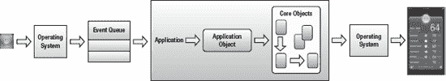

**图 2–10.** *事件处理序列*

该图显示，用户输入由操作系统框架捕获，并作为一系列事件连同其固有对象传递给应用。然后，这些对象根据需要响应事件，并提供应用的功能。

iOS 应用的入口点与任何其他基于 C 编程语言的应用相同：`main()` 函数。在 `\Supporting Files` 文件夹下，你可以找到 `main.m` 实现文件，其中包含 `main()` 函数，实现如下：

```
int main(int argc, char *argv[])
{
    NSAutoreleasePool * pool = [[NSAutoreleasePool alloc] init];
    int retVal = UIApplicationMain(argc, argv, nil, nil);
    [pool release];
    return retVal;
}
```

我们来分析一下它创建的代码及其用途。首先要注意的是，基于 `NSAutoRelease` 类创建了一个名为 `pool` 的对象实例。这提供了应用顶级的内存池，对象可以与之关联并释放。每个基于 Cocoa 的应用（Cocoa 是 iOS SDK 框架之一）始终都有可用的自动释放池。如果没有，内存将无法正确管理，你的应用就会发生内存泄漏。

接下来观察 `UIApplicationMain()` 函数，它将参数计数（`argc`）和参数本身（`argv`）传递给 `main()` 函数。`UIApplicationMain()` 函数用于创建并初始化应用的关键对象，并启动事件处理循环。在应用退出之前，该函数不会返回。此时，`pool` 实例本身会被释放，`main` 函数退出，并返回 `UIApplicationMain()` 函数传回的返回值。

### 创建你的用户界面

在 Xcode 3 中，Interface Builder 功能是作为一个独立应用实现的，但随着 Xcode 4 的发布，Interface Builder 已完全集成到 Xcode 4 IDE 中，因此无需切换应用。此外还有一些其他改进，特别是 Interface Builder 对象与源代码生成之间的集成更加紧密，这意味着同步问题更少。这在 `.xib` 文件的管理方式上尤为明显，甚至体现在诸如 Storyboard 等更高级的功能上。有关 Xcode 版本差异的更多信息，请参阅 [`http://developer.apple.com`](http://developer.apple.com) 网站上的优秀文档，这些文档详细说明了相关细节。此外，本书的第 10 章介绍了 Xcode 4 和 iOS 5 的一些更高级功能，例如用于管理应用工作流程的 Storyboard。

#### 使用 Interface Builder

我们借用 Apple 网站上的示意图，如图 2–11 所示。这张图出色地展示了 Interface Builder 中的不同窗格及其用途。

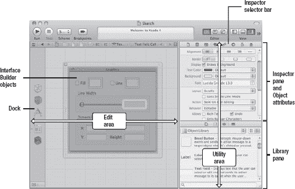

**图 2–11.** *Interface Builder*

Interface Builder 应用分为以下几个区域：

* **编辑区域**：包含画布和其他元素，主要呈现用户界面外观的图形视图。
* **检查器面板**：根据所选检查器的不同，显示编辑区域内选定对象的属性。多种检查器提供了不同属性的视图。例如，大小检查器显示大小、位置及相关属性。
* **库面板**：提供对可在项目中使用的资源库的访问。你可以使用库选择器栏在代码、对象和媒体文件等不同类型的资源之间进行切换。

你已经使用项目模板功能创建了第一个 iPhone 应用，尽管它只是一个空壳。提供了一些默认实现，但它目前还没有任何实际功能——不过别急！

我们的应用将非常简单。它只会在用户界面画布的中央显示文本“Hello, World”。因此，基于我们的空项目和默认文件，让我们来构建应用的其余部分。


### 初始化视图

我们首先关注的是应用程序委托，它负责多项协调任务，包括在应用程序启动完成后初始化用户界面。这涉及到确保创建视图实例（即实现用户界面的部分），并将其添加到应用程序内的可用视图列表中。在本例中，我们只有一个视图。

为了初始化视图，应用程序委托需要知道视图类，这可以通过包含视图控制器头文件来实现，具体如下：

```
#import "HelloWorldViewController.h"
```

应用程序委托还要确保在应用程序启动完成后初始化视图。这可以通过使用 `didFinishLaunchingWithOptions()` 方法轻松完成。在我们的示例中，项目添加了以下代码：

```
self.window.rootViewController = self.viewController;
[self.window makeKeyAndVisible];
```

`self.window` 引用指向由 `window` 属性引用的主 `UIWindow` 对象，该对象由 `MainWindow.xib` 自动初始化。当应用程序启动时，会加载这个 `.xib` 文件。随后，视图控制器和窗口被解档并加载，将 XML 键引用映射到你的界面实例变量——在本例中，即 `*viewController`。

使用合成的属性可以确保自动提供 getter 和 setter 方法。我们告诉应用程序，应用程序的主窗口应指向视图控制器，而该视图控制器对应我们将要添加控件的视图。

该方法最后向窗口传递 `makeKeyAndVisible` 消息，使视图可见。它将成为接受用户输入的主窗口。

现在应用程序将执行并显示一个空白窗口，所以我们已经迈出了第一步。为了完整实现效果，我们想要显示著名的文本“Hello, World”，这是全球应用程序开发者所熟知的、几乎人人都可能写出的第一个应用之一！

为了显示这段文本，我们将在画布上放置一个 `UILabel` 对象，并拦截一个在应用程序加载完成且视图初始化后调用的事件。这个事件将用于将标签文本设置为“Hello, World”，从而在屏幕上显示它。（当然，我们也可以使用一些 iOS SDK 对象和命令直接在窗口画布上显示文本，但这会破坏后续章节的乐趣。）

我们首先将 `UILabel` 添加到视图中。在 Xcode 中，选择 `HelloWorldViewController.xib` 文件（即我们的视图）。这将显示视图的可视化表示。在这里，我们可以访问控件库来添加标签控件，如图 2-12 所示。

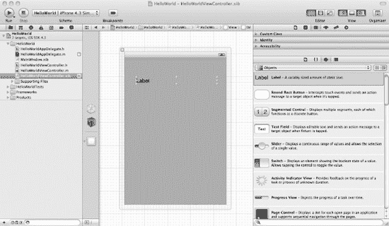

**图 2-12.** *Interface Builder 画布*

**注意：** 要匹配图 2-12 所示布局，请确保标准编辑器视图已显示，同时打开了对象库工具和项目导航器。这两者都可以在 Xcode 的“视图”菜单中选择显示。

你可能已经注意到，库面板可以显示不同的库类型。你可以使用箭头图标展开或折叠各个部分。这使你可以浏览库中可用的许多控件。在本例中，我们使用的是 `UILabel` 控件，它位于顶部附近。

图 2-13 显示了对象库面板。在这里，你可以将标签控件拖到视图画布上，并放置到所需位置。

它会显示标签的默认文本，我们将更改该值以显示“Hello, World”文本。

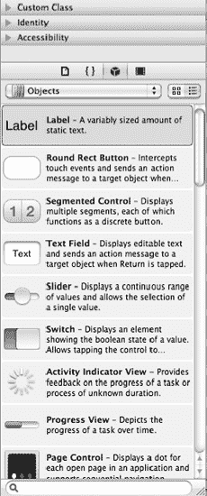

**图 2-13.** *对象库*

在完成之前，让我们将标签的名称改为可以在代码中引用的内容。选择“标识”标签，在“标签”框中，将标签名称改为 `lbl`，如图 2-14 所示。

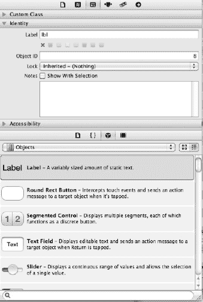

**图 2-14.** *标签名称设置为 `lbl`*


**图 2-14.** *更改标签控件的名称*

除了将标签控件添加到画布上，我们还需要能够在代码中引用它。为此，我们必须将`UILabel`对象绑定到该控件对象。在`HellowWorldViewController`头文件中，添加一个名为`label`的 `UILabel` 对象引用，如下所示：

```
UILabel *label;
```

现在，我们创建一个同名的属性来指向该对象。我们将把它设置为一个合成属性，以确保 Xcode 能自动创建我们的 getter 和 setter 方法。

```
@property (nonatomic, retain) IBOutlet UILabel *label;
```

请注意此属性定义中的`IBOutlet`标记。它作为 Interface Builder 的标记，用于识别那些可以与用户界面元素关联的属性，并且 Interface Builder 会使用这些元素在“插座变量 (Outlets)”窗格中显示。因此，我们的`HellowWorldViewController.h`文件现在应该包含以下实现：

```
#import <UIKit/UIKit.h>

@interface HelloWorldViewController : UIViewController {

    UILabel *label;
}

@property (nonatomic, retain) IBOutlet UILabel *label;

@end
```

当然，这还不够。我们只是为头文件提供了代码并定义了意图。现在我们需要在`HelloWorldViewController`实现文件中添加实际的实现。首先，我们在`@implementation`标记之后添加下面这行代码来完成属性声明，并确保它被合成：

```
@synthesize label;
```

我们还需要确保当视图控制器对象从内存中移除时，能够释放标签所占用的内存。这可以通过向`label`对象发送`release`消息来实现。你的`dealloc`方法应该如下所示（我们新添加的行已高亮显示）：

```
- (void)dealloc
{
    [label release];
    [super dealloc];
}
```

最后，我们想要将标签的值设置为文本 "Hello, World."。一个方便执行此操作的时机是`viewDidLoad`方法，它在应用程序初始化完毕且视图加载后、显示前被触发。我们需要在`viewDidLoad`方法中添加一行代码来设置标签的值。移除其周围的注释后，你的代码应该如下所示（新添加的行已高亮显示）：

```
- (void)viewDidLoad
{
    label.text = @"Hello, World";
    [super viewDidLoad];
}
```

如果你现在构建并运行你的应用程序，它虽然能工作，但标签的文本不会改变。为什么呢？

我们已经定义了一个名为`label`的内部`UILabel`对象，创建了一个属性来引用它，甚至将这个属性的文本值设置为了 "Hello, World."。但我们还没有将用户界面上的标签与我们的类对象关联起来。所以代码虽然能运行，但它并没有指向我们可见的标签。

这个问题很容易解决（实际上，在 Xcode 4 和新的 Interface Builder 中比旧版本更容易）。你只需通过图形化的方式将控件的插座变量拖拽到画布上的实际控件，将两者关联起来，如图 2-15 所示。

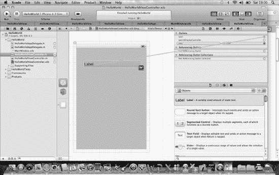

**图 2-15.** *将 UI 元素链接到代码*

至此，我们的应用程序就完成了。我们很放心，因为它不仅显示了所需的文本，而且通过在不需时释放内存和对象引用，表现得像一个“好公民”。

让我们使用 ⌘R 热键构建并运行应用程序，这将启动 iPhone 模拟器进行测试。它应该能毫无问题地编译通过，并且 iPhone 模拟器启动后，你的新 iPhone 应用程序会在其中运行，如图 2-16 所示。

好吧，如果将它提交到 App Store，它不太可能让你发财，因为它功能不多。但它确实涵盖了编写 iPhone 应用程序的基本原则。这将为本书后续章节打下良好基础，你将在其中探索更多使用不同工具和技术创建 iOS 应用的知识。

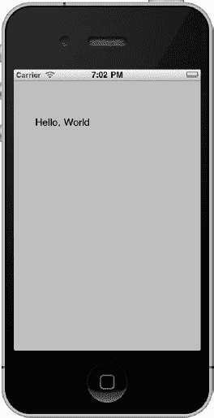

**图 2-16.** *运行你的第一个 iPhone 应用程序*

### 使用自动引用计数

本章提供的示例采用了传统的内存管理方法，将`retain`和`release`（或`autorelease`）对象及其所占内存的责任留给了程序员。Xcode 4.2 和 iOS 5 提供了一个名为*自动引用计数* (ARC) 的新特性，它简化了内存管理。

你无需再记住何时使用`retain`、`release`和`autorelease`，ARC 会评估你的对象的生命周期需求，并在编译时自动为你插入适当的方法调用。编译器还会生成适当的`dealloc`方法来释放不再需要的内存。本质上，ARC 是一个预编译阶段，它会添加你之前必须手动插入的必要代码。

#### 为什么要使用它？

如果你是 Objective-C 新手，你会欢迎 ARC，因为它极大地简化了内存管理。要学的东西已经够多了，不用再为内存管理的复杂性而烦恼。

然而，如果你熟悉手动内存管理（也许是因为有 C 或 C++ 等底层语言的经验），那么你可能更愿意坚持使用它。一个原因是，那些尚未转换到 ARC 的库并不总是能与基于 ARC 的代码良好协作。此外，如果你知道自己在做什么，手动管理内存可能性能更优。

#### 启用 ARC

要启用 ARC，你可以在首次创建项目时选择它，或者在编译器的构建设置中，将“Objective-C Automatic Reference Counting”的值设置为“Yes”来添加相应的编译器标志。通过项目的“Build Phases”标签下的“Compile Sources”部分，你可以有选择性地决定哪些文件使用 ARC 编译器特性，但我不推荐这样做，除非你想高度优化应用程序的性能。

#### 迁移到 ARC

如果你已有项目或源代码想要转换到 ARC，但又不想费力地在源代码中删除所有内存管理关键字引用，那么幸运的是，Xcode 提供了一个迁移工具来为你完成转换。打开要转换的项目，选择 Edit  Refactor，然后选择 Convert to Objective-C ARC… 选项。这将重构（转换）你的代码，使其使用 ARC 特性。很简单！

#### 使用 ARC 进行编程

一旦你启用了 ARC，就必须遵循某些规则。这些规则可能相当复杂，但苹果的文档对它们进行了很好的解释。总之，要么你使用 ARC，要么你不使用；你不能混合使用不同的内存管理风格。例如，不要启用 ARC 后又开始零散地`retain`或`dealloc`内存。你可以定义你的属性是强类型还是弱类型。`strong`（默认值）是一个引用，在其作用域（通常定义为花括号）内被持有；而`weak`意味着当它被认为不再被使用时，可以在任何时候被释放（并在释放时被设置为`nil`）。


### 本章概要

在本章中，我们首先了解了运行 `Xcode` 4 所需的系统要求，这是目前开发 iOS 应用程序最为简便的方法。我们讨论了可能需要的硬件类型，并接着探讨了如何获取和安装 `Xcode` 工具套件。

随后，本章概述了 `Xcode` 工具套件，并提供了 Objective-C 入门指南，涵盖了开发你的第一款 iPhone 应用程序所需掌握的基本原理。我们甚至了解了一些较新的特性，例如自动引用计数。

接着，我们实际构建了一款 iPhone 应用程序。我们利用 `Xcode` 的项目模板来快速上手。我们还使用了 `Xcode` 的一些新功能，将用户界面组件与代码对象进行关联。当一切连接就绪后，我们便能够构建该应用程序并在 iPhone 模拟器中进行测试。

呼！现在你已经成为一名使用 Apple 原生工具（如 iOS SDK 和 `Xcode` 4）的 iOS 应用程序开发者了。在接下来的章节中，你会发现这并不是唯一的开发选项。既然你已经掌握了编写基础应用程序的基础，我们将继续使用其他可用的选项来开发功能更丰富的应用程序。

## 第 3 章

## 了解你的选项：使用第三方解决方案与 MonoTouch

在前面的章节中，我们探讨了 iOS 操作系统、SDK 及相关的工具，以及如何使用 `Xcode` 4 和 iOS SDK 来开发你的第一款 iPhone 应用程序。但正如第 1 章所述，除了 Apple 的原生工具之外，还有其他开发应用程序的选项。本章将详细阐述第 1 章中介绍的一些第三方选项，并描述如何使用它们来创建 Hello, World 应用程序。

我们不会涵盖所有可用的第三方选项，这不仅是由于篇幅限制，更因为这个环境在不断变化，新的选项层出不穷。在本章中，我们将重点关注一些较为常见且历史悠久的选项：

*   结合 `.NET Framework` 使用 `MonoTouch`
*   使用 JavaScript 配合 Appcelerator 的 `Titanium Studio` 和 Mobile SDK
*   结合 `Marmalade SDK` 使用 `Xcode`

在熟悉了如何使用本章涵盖的每一种选项开发 Hello, World 应用程序之后，我们将可以在本书的剩余部分中更详细地探讨 iOS 的不同元素以及更高级的应用程序。

## 了解限制条件

在开始使用第三方选项之前，有必要了解一些基本原则性限制：

*   **原生应用需要 Mac**：要编写和执行原生 iOS 应用程序，你将需要一台 Mac。
*   **SDK 的完整性**：诸如 `Mono` 之类的第三方选项在现有 iOS SDK 之上提供了一层抽象，但通常未能完全实现 iOS SDK *所有* 的功能。因此，如果你想要完整的 API 实现，要么需要绕开第三方实现中的缺口，要么尝试编写自己的实现。
*   **速度**：如果你想充分利用 iOS 设备的性能，直接基于 SDK 使用 Objective-C 编写应用程序是无法被取代的。其他选项虽然可行，但它们引入的抽象层会拖慢你的应用程序速度。

在描绘了第三方选项相对暗淡的前景之后，有必要指出其中一些方案是非常可行的。`Mono` 的实现尤其如此，它使用一种熟悉的语言提供了 iOS SDK API 最完整的实现。速度通常也不是问题。

## 使用 Mono 与 MonoTouch 进行开发

你现在应该已经知道，本书的重点是支持你使用多种方法为 Apple 移动设备开发应用程序，并着重强调重用你现有的 .NET 知识和技能。

.NET Framework 在微软 Windows 操作系统上的成功并未被开源社区忽视。许多人希望 .NET 不仅能在 Windows 上使用，也能在其他操作系统（如 Linux 和 Mac OS X）上使用。值得庆幸的是，有人为此付诸了行动。Miguel de Icaza 主动承担起这份责任，并在社区的支持下，将 .NET 带到了这些操作系统上，使你能够为众多平台编写 .NET 应用程序。而且这并未止步。很快，`SharpDevelop` IDE 被移植到了 `Mono` 上，并由此诞生了 `MonoDevelop`，创建了一个类似 Visual Studio 的 IDE，它不仅能针对 .NET 应用程序，还能针对 C、C++、Python 和 Java。

因此，你拥有了 .NET Framework、对 C# 等 .NET 语言的支持，以及一个强大的 IDE，而支持移动革命自然是顺理成章的事！事实上，他们走得更远。他们不仅推出了 `MonoTouch`，提供了一种为 iPhone 创建基于 C# 和 .NET 的应用程序的机制，还推出了 `MonoMac`。`MonoMac` 是一项有趣的进展，用于在 Mac OS X 上使用 `Mono` 创建 Cocoa 应用程序。（更多信息，请访问 [`http://www.mono-project.com/MonoMac`](http://www.mono-project.com/MonoMac)。）此外，基于与 `MonoTouch` 相同的原理，`MonoDroid` 也已发布，但其目标是 Android 操作系统。

关于 `MonoMac` 和 `MonoDroid` 就先说到这里；让我们来看看 `MonoTouch`。如上所述，它允许你使用 `Mono`，通过 API 绑定 iOS API 来为 iPhone、iPad 和 iPod touch 开发应用程序。

鉴于它基于 .NET Framework 并支持 C# 编程语言，你们这些 .NET 开发者应该会感到得心应手！让我们来看看如何获取、安装并使用必要的组件，以利用 `Mono` 工具编写我们的 Hello, World iPhone 应用程序。

### 安装 Mono、MonoDevelop 与 MonoTouch

要开始，你需要下载并安装以下组件。这些组件可以从 Mono 项目主页 ([`http://www.mono-project.com/`](http://www.mono-project.com/)) 获取。

*   **Mono**：这是实际的 `Mono` 框架。它包括 .NET Framework 的开源实现、语言支持以及辅助工具。你可以从 [`http://www.go-mono.com/mono-downloads/download.html`](http://www.go-mono.com/mono-downloads/download.html) 下载 `Mono`。
*   **MonoDevelop**：这是一个主要为 .NET 及其语言（如 C#）设计的 IDE。我们将使用它，就像上一章使用 `Xcode` 一样，或者就像你可能使用 Visual Studio 来构建应用程序那样。你可以从 [`http://monodevelop.com/Download`](http://monodevelop.com/Download) 下载 `MonoDevelop`。
*   **MonoTouch**：这是魔法发生的地方。`MonoTouch` 是一个使用 `Mono` 为 iPhone 开发应用程序的 SDK。使用它，你将能够编写应用程序并在 iPhone 模拟器上进行测试。你可以从 [`http://monotouch.net/Store`](http://monotouch.net/Store) 下载试用版或购买完整版。


## 安装 Mono

首先，访问 Mono 项目下载页面，下载适合您开发平台的 Mono 发行版。由于开发基于 iOS 的应用程序要求使用 Mac OS X 平台，我们将在此平台上运行 Mono，但您会发现，Windows 以及许多 Linux 和 Unix 发行版也支持。另外请注意，Mono 已将下载选项方便地分为稳定版和长期支持版。二者的区别本质在于，最新最强大的功能都包含在最新的稳定版中。

**注意：** 在撰写本文时，最新的稳定版本是 2.10.5，需要 Mac OS X Leopard (10.5)、Snow Leopard (10.6) 或 Lion (10.7)。

在 图 3–1 所示的 Mono 下载页面中，选择您的平台，然后选择合适的芯片组（例如 Intel 或 PowerPC）对应的 SDK 包，如果不确定，则选择通用选项。

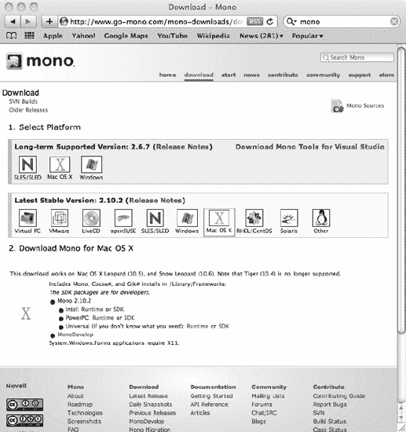

**图 3–1.** *从下载页面选择 Mono SDK 包*

您会注意到有运行时和 SDK 两种选项。如果您只想运行为 Mono 编写的应用程序，请使用运行时；如果您想运行应用程序并使用 Mono API 编写自己的应用程序，请使用 SDK。它同时包含运行时和 SDK 开发平台。

下载完成后，点击下载文件夹中的图标即可开始安装，如 图 3–2 所示。

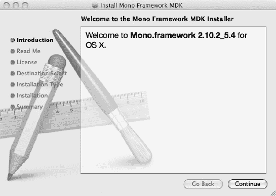

**图 3–2.** *Mono 框架安装启动画面*

按照屏幕上的说明完成安装。该软件不大，安装过程应能很快完成。安装完成后，您不会看到任何明显的桌面或工具栏图标。

我们来测试一下安装。我们将创建一个控制台版本的“Hello, World”应用程序，并使用命令行和终端窗口（在 Mac 上）来完成此操作。

首先，创建一个文件夹来存放源代码，并创建一个名为 `HelloWorld.cs` 的文件，内容如下：

```
using System;

public class HelloWorld
{
        static public void Main ()
        {
                Console.WriteLine("Hello, World");
        }
}
```

任何 .NET 开发者都应该能立刻明白这段代码的结构。我们只是简单地将一个文本字符串输出到将显示文本的控件。

将此示例保存到磁盘后，您可以尝试使用 Mono 编译器进行编译。在源代码所在的同一目录下，只需在命令提示符中输入以下命令：

`gmcs HelloWorld.cs`

如果没有错误，这将静默地编译您的源代码，并在目录中生成 `HelloWorld.exe`。通过将其发送到 Mono 运行时（由 `mono` 命令前缀表示）来运行这个编译好的可执行文件：

`mono HelloWorld.exe`

这应输出文本 "Hello, World."

如果一切正常，则说明您已成功安装 Mono，我们可以继续安装 MonoDevelop 应用程序了。如果未成功，Mono 支持页面或社区页面应该能帮助您找到解决方案。

## 安装 MonoDevelop

现在您可以下载 MonoDevelop 了。请确保您下载的版本与已安装的 Mono 版本相匹配。例如，MonoDevelop 2.4.2 至少需要 Mono 2.4 才能运行。

在 图 3–3 所示的主页上，选择您需要的版本。同样，选择通常包括最新的稳定版和更新但未经测试的测试版。选择 Mac OS X 平台，然后根据您偏好的安装机制开始下载（我使用了包，因为它们易于上手）。

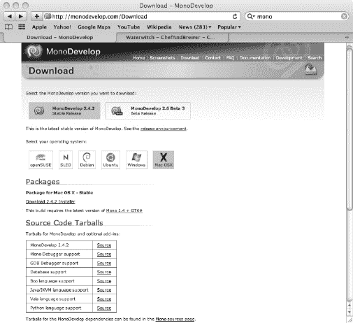

**图 3–3.** *MonoDevelop 主页*

下载 MonoDevelop 后，点击磁盘映像文件。系统将提示您通过将 MonoDevelop 拖拽到 `Applications` 文件夹来完成安装，如 图 3–4 所示。这将完成您的安装。

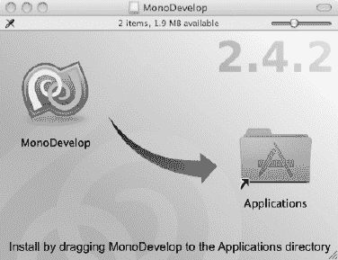

**图 3–4.** *MonoDevelop 包安装*

点击新安装的图标将启动 MonoDevelop 应用程序。这将启动 MonoDevelop IDE，如 图 3–5 所示。

**注意：** 安装程序可能会提示有可用的 MonoDevelop 更新。如果是这种情况，安装它们是可选的，但如果它们被标记为稳定版，我建议您进行安装。

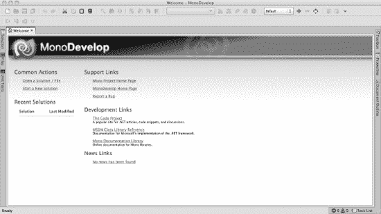

**图 3–5.** *运行 MonoDevelop*

我建议您探索一下这个应用程序，查看一些可用的链接。完成此操作后，我们可以快速创建一个与我们用来测试 Mono 安装的控制台应用程序类似的应用程序。

首先选择“Start a New Solution”链接，这将弹出一个“Project Template”对话框，您会注意到其中有一个 C# 控制台项目。按照屏幕上的说明创建您的项目，选择项目的位置并为其命名。您将看到一个空项目和一个默认的 `main.cs` 文件，其中包含一个与我们的非常相似的“Hello, World”实现。只需选择 `Build`  `Run`，就会显示一个终端窗口，其中显示文本 "Hello, World."

是不是简单多了！


## 安装 MonoTouch

最后，为了完成“Mono 三部曲”，我们来了解一下如何获取并安装 MonoTouch。首先需要注意的是，MonoTouch 并非免费产品。根据您所需的版本，价格从 99 美元到 3,999 美元不等！请参考来自 MonoTouch 网站的图 3-6 中的表格，其中详细列出了不同功能及对应价格。

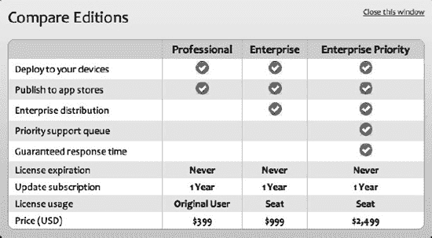

**图 3-6.** *MonoTouch 版本功能对比*

此处的关键要点是：若要通过 Apple App Store 分发使用 MonoTouch 创建的应用程序，您需要价格为 399 美元的 Professional 版本。同时还有价格 79 美元的学生版，允许您创建应用程序，但只能通过临时部署（ad hoc）分发到 Apple 设备，而无法上架 App Store。我们将在第 9 章中讨论应用程序的分发问题。

现在，让我们先使用免费的试用版。虽然它不允许通过 App Store 分发，但允许您在 iPhone/iPad 模拟器上测试应用程序。请访问 [`http://monotouch.net/DownloadTrial`](http://monotouch.net/DownloadTrial)，输入您的电子邮件地址，然后点击下载按钮获取试用版。

点击下载的安装包开始安装。这将启动安装程序，如图 3-7 所示。按照安装说明进行操作。安装完成后，安装程序应会自动跳转到包含刚安装的 MonoTouch 版本发布说明的网页。

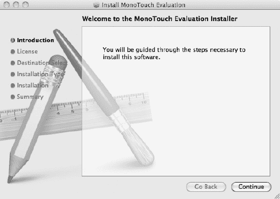

**图 3-7.** *运行 MonoTouch 安装程序*

您可以立即开始使用 MonoTouch，但这需要使用命令行功能，以确保您开发的应用程序是基于 MonoTouch 许可证构建的。如果您更喜欢使用 MonoDevelop，那也是可以的。不过，您会发现我们安装的 MonoDevelop 版本中没有 MonoTouch 模板。在撰写本文时，您需要下载并安装一个特殊版本的 MonoDevelop，该版本已更新以识别 MonoTouch SDK。可以从 [`http://monodevelop.com/Download/Mac_MonoTouch`](http://monodevelop.com/Download/Mac_MonoTouch) 获取。下载并选择安装后，其安装过程与您之前安装的另一个 MonoDevelop 版本类似。只需将新版本拖入您的 `Applications` 文件夹，在提示替换现有版本后，新版本的 MonoDevelop 即可安装完成。

启动 MonoDevelop 并像之前一样选择“创建新解决方案”。这次，当您展开 C# 或 VBNet 项目时，会看到不同类型的 iPhone 和 iPad 项目选项，如图 3-8 所示。

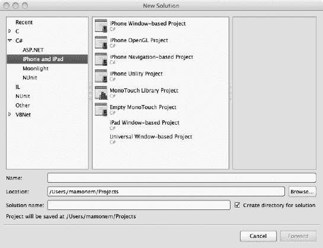

**图 3-8.** *添加了 MonoTouch 项目模板的 MonoDevelop*

## 使用 MonoTouch 创建“Hello, World”应用

现在我们来构建“Hello, World”应用程序。就像上一章使用 Xcode 4 时一样，首先选择“基于窗口的 iPhone 项目”，然后按照您的偏好输入名称和位置。点击“下一步”后，将会创建一个包含默认文件和实现代码的 iPhone 基于窗口的项目，如图 3-9 所示。

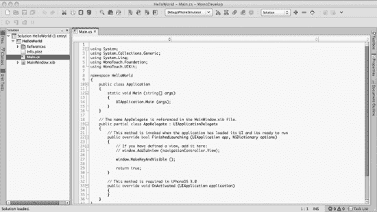

**图 3-9.** *MonoDevelop 中的默认 iPhone 基于窗口的应用程序*

快速查看会发现，它与我们在第 2 章中创建的 Xcode 项目有一些相似之处。两者都有一个包含 `AppDelegate` 实例的 `main.cs` 文件，该实例使默认窗口成为关键窗口并可见。这不足为奇。它使用了 Cocoa API，但采用的是 .NET 实现。

继续构建并运行此应用程序。它不如 Xcode 快，但考虑到额外的抽象层级，这也是意料之中的。您的应用程序最终会在 iPhone 模拟器中启动。虽然目前是一个空窗口，但这是您的第一个 .NET iPhone 应用！

为了与我们的 Xcode 示例保持一致，让我们添加一个特定的视图及其关联的视图控制器，以显示我们的标签，并允许我们将其初始化为文本“Hello, World”。关键区别在于，这次我们将使用 .NET 进行开发。

值得庆幸的是，在 MonoDevelop 中为项目添加视图和视图控制器非常容易。选中项目后，选择 `File`  `New`  `File` 菜单选项，打开“新建文件”对话框。展开 C# 树，然后选择“带控制器的 iPad 视图”，如图 3-10 所示。然后点击“新建”将这些文件添加到您的项目中，同样带有可供您完成的默认结构和实现代码。

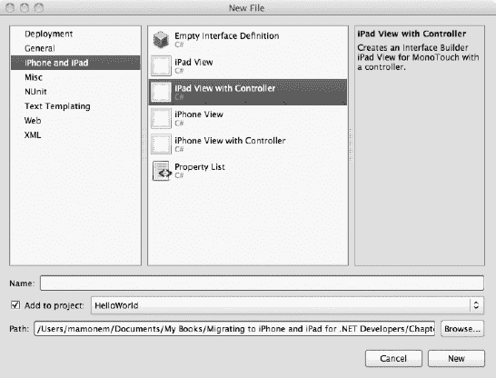

**图 3-10.** *MonoDevelop 新建文件对话框*

像在 Xcode 示例中一样，选择 `HelloWorldView.xib` 文件。这将启动 Interface Builder。继续添加一个标签并将其作为输出口连接，方法同上一章的 Xcode 4 示例。

现在我们可以设置文本值。一旦代码连接好，我们只需重写 `ViewController` 类的 `ViewDidLoad()` 方法，并在其中通过名称访问标签用户对象，如下所示：

```
public override void ViewDidLoad ()
{
        base.ViewDidLoad();
        lbl.Text = @"Hello, World";
}
```

现在运行应用程序，您基于 MonoTouch 的 iPhone 应用将表现得与 Xcode 4 的 iPhone 应用完全相同，并在设备上显示“Hello, World”。

我们已经了解了如何安装和创建应用程序——包括我们大名鼎鼎的“Hello, World”应用程序——并使用 MonoTouch 在 iPhone（确切说是模拟器）上运行。但还有更多可用选项。在本章的剩余部分，我们将集中讨论如何使用几种更稳定且受欢迎的可用选项创建相同的测试应用程序，这些选项使用你可能熟悉的 Objective-C 和 .NET 之外的语言，在某些情况下甚至可以在基于 Microsoft Windows 的 PC 上运行。

## 使用 Appcelerator 的 Titanium Mobile

Appcelerator Titanium Mobile 平台的创建目的是支持使用更常见的语言并利用基于 JavaScript 的 API，为移动设备、平板电脑和桌面设备进行跨平台原生应用开发。Titanium Mobile SDK 与原生 SDK 工具链（在 Apple 情况下是 iOS SDK）协同工作，将您的 JavaScript 源代码、JavaScript 解释器和静态资源组合成一个可执行的应用程序，该程序可以安装在模拟器或移动设备上。

请注意，由于 Apple 的许可协议，Titanium Mobile 在哪些平台可用于哪些移动设备和操作系统方面存在限制。表 3-1 总结了支持选项。

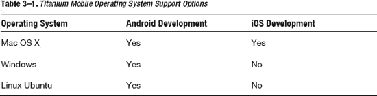

尽管存在这些限制，但值得注意的是，入门是免费的，我们将重点关注 Mac OS X 操作系统。与我们的 MonoTouch 示例类似，我们将安装 Titanium Mobile，然后使用它来创建我们的“Hello, World”iPhone 应用程序。区别在于，这次我们将使用 JavaScript 编写代码。


### 安装 Titanium

第一步是从 Appcelerator 的 Titanium 主页 [`http://www.appcelerator.com/products/download/`](http://www.appcelerator.com/products/download/) 下载所需软件。下载完成后，按照传统的 Mac 方式安装该应用程序：将 `Titanium Developer` 图标拖入 `Applications` 文件夹，即可启动安装程序。请按照安装程序提供的屏幕提示进行操作，如图 3–11 所示。

**注意：** `Titanium Developer` 是一个全局图形用户界面，它位于现有的各种 SDK 之上，并充当您的统一参考点。一旦安装了 `Titanium Developer`，不同的移动 SDK 都可以在其中安装。首次运行时，它将自动尝试下载移动版和桌面版 SDK 的当前版本。

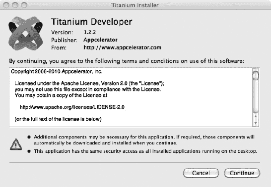

**图 3–11.** *Titanium Developer 安装程序*

安装好 Titanium 后，建议您注册成为 Titanium 开发者，这样您就能访问在线资源，帮助您进行应用程序开发。

### 使用 Titanium 创建 Hello, World

启动 `Titanium Desktop`，让它更新移动 SDK。随后您将看到一个空白的图形用户界面。安装程序已自动检测到 iOS SDK，因此无需再安装该包（除非您想使用更新的版本）。让我们开始行动吧。

首先选择 `New Project` 选项。这将弹出一个对话框，让您填写一些标准项目属性，如图 3–12 所示。在填写屏幕表单时，您可能会注意到，在 `Project Type` 下拉列表中，iPhone 选项使用的是 `Mobile` 项目类型，而 iPad 则有专门的选项。填写完毕后，选择 `Create Project` 选项来创建移动应用程序。

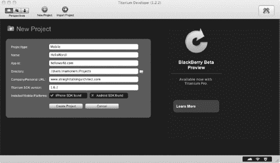

**图 3–12.** *Titanium Mobile 新建项目对话框*

**注意：** 请注意，在我的安装中，我选择不安装 Android SDK。如果您想尝试安装，在线资源会为您提供相关说明。

将显示空白的 `HelloWorld` 项目，并提供访问 `Dashboard`、`Edit` 或 `Test & Package` 应用程序的选项。在 `Dashboard` 上，您会看到许多帮助您入门的在线资源，如图 3–13 所示。

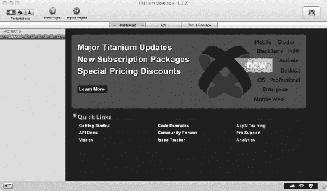

**图 3–13.** *Titanium Mobile 中的空白项目 Dashboard*

如果您直接切换到 `Test & Package` 选项标签，就会看到如图 3–14 所示的界面。其中一个选项是 `Launch` 按钮，它会根据所选的项目类型（在我们的示例中为 iPhone 模拟器），在移动设备模拟器中构建并运行您的应用程序。

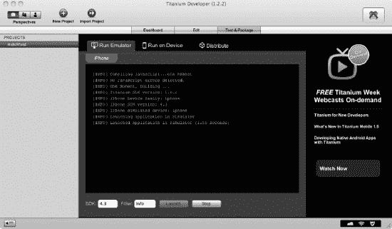

**图 3–14.** *Titanium Mobile 中的 Test & Package 标签*

由 Titanium Mobile 生成的默认应用程序提供了两个标签，每个标签上有一个文本标签。我们将对其进行修改，使其只显示一个标签，并显示我们选择的文本（“Hello, World”）。

首先，让我们看看创建的文件和文件夹结构。除了创建的文件外，还添加了以下文件夹：

*   **`\build`**：此文件夹包含从 SDK 导入的文件以及通常无需修改的自动生成文件，例如 `main.m` 文件。二进制文件和库文件也位于此处。
*   **`\resources`**：此文件夹包含支持您应用程序的资源，包括源代码。在这里，您会找到 `app.js` 文件，这是用于启动应用程序的主要 JavaScript 应用程序文件。我们将在此文件中进行修改。

花点时间检查一下 `app.js` 文件。它相当简单明了。如前所述，默认实现是创建两个标签，每个标签包含一个文本标签，并将它们添加到主应用程序窗口中，我们将对此进行调整，使其只显示一个标签和文本标签。

让我们检查一下代码的一些重点。首先，最明显的一点是，代码首先引用了 `Titanium.UI` 命名空间。此命名空间包含用于访问用户界面对象的类。它利用这些信息来初始设置背景，并创建一个标签组，如下所示：

```
var tabGroup = Titanium.UI.createTabGroup();
```

新的 `Tab` 对象将添加到此组中，每个 `Tab` 指向一个在选中时显示的窗口（尽管我们的代码将只实现一个标签来显示“Hello, World”文本）。请考虑以下代码：

```
//
// 创建基本的 UI 标签和根窗口
//
var win1 = Titanium.UI.createWindow({  
    title:'Tab 1',
    backgroundColor:'#fff'
});
var tab1 = Titanium.UI.createTab({  
    icon:'KS_nav_views.png',
    title:'Tab 1',
    window:win1
});
```

这段代码创建了主窗口，并将其标题设置为 `Tab 1`，使用一个 `Tab` 对象来分配此窗口。在应用程序中选中此标签时，它将显示此窗口。

让我们跳到创建新标签的代码部分，这部分代码是在创建新窗口并将其分配给新标签之后执行的。请考虑以下片段：

```
var label1 = Titanium.UI.createLabel({
        color:'#999',
        text:'Hello, World',
        font:{fontSize:20,fontFamily:'Helvetica Neue'},
        textAlign:'center',
        width:'auto'
});

win1.add(label1);
```

我们只是创建了一个标签对象，并为其设置了“Hello, World”文本。然后我们可以将其添加到由 `win1` 变量引用的主窗口中。

最后，我们将标签添加到标签组，并打开标签组，在主应用程序中显示窗口和标签。

```
//
//  添加标签
//
tabGroup.addTab(tab1);

// 打开标签组
tabGroup.open();
```

执行这些操作后，应用程序将显示我们的“Hello, World”文本。并且由于它是在 Titanium Developer IDE 中构建的，它还将启动 iPhone 模拟器，如我们正在运行的应用程序图 3–15 所示。

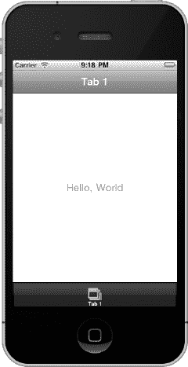

**图 3–15.** *Titanium Mobile HelloWorld 应用程序*

如您所见，Titanium IDE 易于使用，并且拥有完整的 API。我将把进一步的探索留给您，您可以借助在线参考资料和 `Kitchen Sink` 应用程序（它提供现成的示例供您研究和修改）来尝试。

## 使用 Marmalade SDK

Marmalade SDK 与 Titanium Mobile 有着相同目标，即让您能够针对一个与移动设备及其操作系统无关的 API 来构建应用程序。使用它，您可以一次性开发跨平台应用程序！

Marmalade SDK 支持一键部署到多种操作系统，包括 iOS、Android、Symbian、Windows Mobile 等。我们将使用 Xcode IDE 来创建基于 Marmalade 的应用程序。

**注意：** 虽然 Marmalade API 支持所有类型应用程序的核心功能，但它偏向于游戏开发。您将发现一套丰富的 API，可以助您编写引人入胜的移动游戏。

Marmalade SDK 可以被视为以下两个组件：

*   **MarmaladeSystem**：它提供操作系统抽象 API，与相关库结合使用时，您可以构建适用于多种操作系统的移动应用程序。它提供了一套工具以及名为 `S3E API` 的 C API。
*   **MarmaladeStudio**：它提供了一套工具和运行时组件，允许专注于高性能 2D 和 3D 图形与动画的开发。


### 安装 Marmalade

首先，您需要在 Marmalade SDK 网站（`http://www.madewithmarmalade.com/downloads`）注册。注册完成后，您将收到一封激活邮件。激活账户后，您便可以下载评估版软件进行试用。（当然，您也可以直接购买，但我假设您想先试用一下。）评估版允许您进行除公开发布所编写应用程序之外的所有操作。

下载软件包后，点击图标开始安装。您将看到安装程序，如图 3–16 所示。

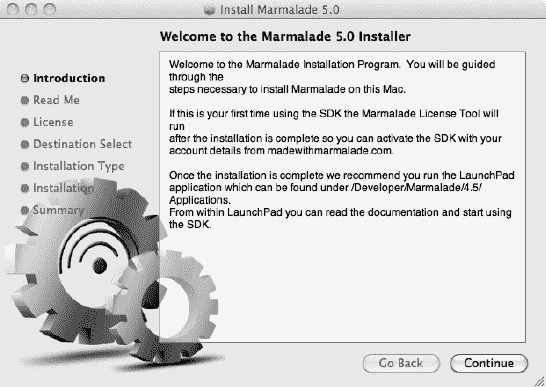

**图 3–16.** *Marmalade 安装程序*

按照屏幕提示操作，包括输入您的 Marmalade 账户凭据，以便在之前从网站上获取的 30 天评估许可下进行安装。

默认安装位置为 `/Developer/Marmalade-SDK/<`*`版本号`*`>`，其中 <*`版本号`*> 是您安装的 SDK 版本。安装完成后，您不会看到任何新图标，但会在目标位置找到新安装的文件。以下为安装的关键文件夹：

* **`\Applications`**：此文件夹包含 SDK 的顶级应用程序。
* **`\docs`**：此文件夹包含文档，包括用户手册。
* **`\examples`**：此文件夹包含示例应用程序。
* **`\extensions`**：此文件夹包含扩展开发工具包。
* **`\Marmalade`**：此文件夹包含 Marmalade 使用的其他工具。
* **`\s3e`**：此文件夹包含 Marmalade 系统头文件和运行时库。
* **`\modules`**：此文件夹包含所有 Marmalade Studio 头文件和运行时库。

### 使用 Marmalade 创建 Hello, World

现在您已经安装了 Marmalade，或许还浏览了一下它的文件夹和文件，让我们开始创建应用程序。

首先启动 Xcode（当然，我们也可以使用命令行，但 IDE 的存在是为了让我们的生活更轻松，所以让我们使用它们）。我们将使用提供的其中一个示例，因为它们提供了 Xcode 4 部署到 Marmalade 模拟器所需的所有配置。该模拟器是用于调试原生 Marmalade 可执行文件（扩展名为 `.s3e`）的工具。

`.s3e` 文件本质上是与平台无关的动态链接库。Marmalade SDK 允许您通过简单地重新配置 IDE，为多个不同平台构建同一个应用程序。目前，我们只关注如何开始使用此类功能，因此我们先将它部署到 Marmalade 模拟器。

使用 Finder 应用程序，找到 Hello, World 示例，该示例位于 `\examples\s3e\s3eHelloWord` 目录下。在此文件夹中，您会看到 `s3dHelloWorld.mkb` 文件，它本质上就是项目文件。通过菜单选择“打开方式”，然后选择 Marmalade SDK 中提供的 `Mkb` 应用程序（位于 `\Applications` 文件夹），即可打开它，如图 3–17 所示。

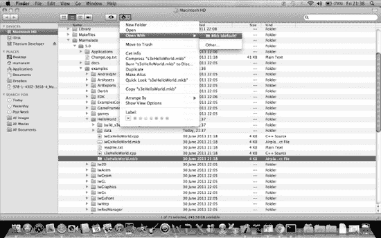

**图 3–17.** *使用 Mkb 打开 Marmalade SDK 项目*

这将启动 Xcode，您可以在窗口顶部选择“调试模拟器”方案，然后点击“构建”。接着，选择“运行”。这将在模拟器中执行应用程序，并显示我们的“Hello, World”文本，如图 3–18 所示。由此，您可以使用 Marmalade SDK 针对不同平台（包括 iOS）来开发您的应用程序。

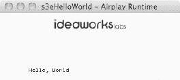

**图 3–18.** *运行我们的应用程序的 Marmalade 模拟器*

## 总结

本章通过探讨可用的第三方选项，在前几章关于使用原生工具的知识基础上进行了扩展。其中最流行的替代方案之一是 Mono 和 MonoTouch，它提供了 Cocoa 和 Cocoa Touch API 的 .NET 实现，但使用的是 .NET 语言。该方案让您可以免费且获得原生使用体验地访问 iPhone 和 iPad 开发资源，并提供了一个类似 Visual Studio 的 IDE——MonoDevelop。

正如您所学到的，只要您愿意使用 .NET 之外的语言（例如 JavaScript 或 C/C++），MonoTouch 并非唯一选择。其他可用的选项包括 Titanium Mobile 和 Marmalade SDK。这些选项都允许您编写原生应用程序，不仅适用于 iPhone 和 iPad，也适用于其他设备。实际上，这些平台正是为跨平台开发而构建的，允许您针对单一 API 进行开发，却能构建出可面向众多不同操作系统（包括 Apple、Android 和 Symbian）移动设备的应用程序。

尽管这些第三方选项非常有用，但除了 MonoTouch 之外，它们对 .NET 语言支持的缺失使得过渡和复用现有经验变得更加困难。显然，使用 MonoTouch 会让这一过程简单得多，但您将依赖于 MonoTouch 对 iOS 和 Cocoa Touch SDK 的支持。如果支持不足或功能不完整，您将无法使用该选项——除非您自己编写实现！

因此，除了亲自为 Mono 项目贡献代码外，另一种选择是将您的 C# 和 .NET Framework 知识映射到 iOS SDK 并使用 Objective-C。本书的其余部分将重点讨论如何做到这一点，并弥合您知识上的差距。

## 第 4 章

## 深入探讨：.NET、Objective-C 和 iOS SDK

理解 Apple 移动设备的能力、iOS 操作系统的特性以及可用于应用程序开发的不同选项，只是故事的一部分。使用原生 Apple 开发工具和众多第三方选项创建 Hello, World 应用程序固然酷炫，并且可以提交到 Apple 的 App Store，但这并不会为您带来数百万美元的收入。它很可能无法获得好评，甚至不会有任何下载量！

现在，我们需要研究如何创建一个更具吸引力的应用程序——一个将成为下一个“必备”移动应用并能*帮您*赚到钱的程序。为此，我们需要更详细地探讨运行时框架，并更加深入地研究支持设计时框架的细节。这将帮助您在应用程序中打造丰富的用户体验。

我们将利用您现有的 .NET 知识，并将其应用到 Apple 自己的原生工具和 SDK 中。这不仅能让您创建出心仪的应用程序，还能让您在充分发挥 Apple 设备功能方面抢占先机。目标是让从 .NET 到 Apple 原生开发环境的过渡变得更轻松、更快捷。

在本章中，我们将更详细地比较 iOS SDK 与 .NET 的功能以及所支持的不同语言。具体来说，我们将涵盖以下主题：

* 比较 Apple 移动设备的相对能力
* 深入应用程序内部，审视其结构和生命周期
* 思考应如何设计应用程序，以及 Apple 为此提供了哪些帮助
* 从方法和实现上比较 iOS SDK 与 .NET Framework
* 比较用于支持应用程序开发的开发工具
* 回顾 Objective-C 和 Xcode 4 入门知识

我们将从目前为止的介绍基础上开始，通过将 iOS 和 iOS SDK 与 .NET Framework 及编程模型并列审视，进行更详细的探讨。


好的，作为高级文档工程师和翻译员，我将严格遵循您提供的注意事项和示例，对给定的英文文本进行专业、准确的中文翻译。


## 比较 iOS 设备的性能

我们之前已经简单介绍过可以使用 iOS SDK 为其编写应用程序的苹果设备类型，并指出并非所有设备都性能相同。因此，仔细考量您打算支持的目标设备、它们各自的优缺点以及操作系统所暴露的功能特性至关重要。这种审慎的评估将确保客户获得您预期的用户体验，并确保您在开发应用程序时，能够充分利用目标设备的性能，从而打造出稳健可靠的应用程序。

本书的重点是移动应用程序的开发（尽管部分工具和技术也可用于桌面应用程序）。就现有的移动设备而言，我们的目标对象是 iPhone、iPod touch 和 iPad。表 4-1 列出了基于各设备最新一代型号的一些特性。


## iOS 应用设计

在开始考虑应用程序设计时，除了考察目标设备的性能外，还有其他几个重要因素需要注意，例如兼容性和性能调优。此外，在使用 iOS SDK 和 Objective-C 进行开发时，您还应该了解某些设计模式，这将让您深刻理解为何类和 API 会以特定的方式实现。设计模式也为确保您自己应用程序的简洁与优雅提供了一种绝佳方法。

我们将在接下来的章节中进一步深入探讨设计考量和设计模式。

### 设计考量

在规划和开发应用程序时，遵循一套总体原则不仅有助于确保应用程序设计良好、符合其目的，还能让您充分利用目标设备上的可用性能。在阅读本书的过程中，请务必考虑以下原则：

-   设计您的应用程序，使其尽可能与最广泛的设备兼容。这将最大限度地扩大您的市场机会。
-   使用设备的高级功能是可以的，但如果可能，请提供自动和/或手动关闭这些功能的选项。
-   尽可能在多种设备上进行测试，而不仅仅是使用模拟器——如果可能，请在真实设备上进行测试。我们将在第 9 章中更详细地探讨测试这个主题。
-   在跨越重大外形尺寸（例如从 iPhone 到 iPad）时，不要贪图方便而不更改您的应用程序。
-   注重性能调优。要留意内存限制和多线程能力。
-   谨记考虑成本。如果您的应用需要网络连接，请考虑在使用 3G 网络时定期搜索 Wi-Fi。

在构建应用程序时，您应始终牢记这些基本考量。现在，让我们继续学习一些具体的 iOS 设计模式。

### 设计模式

在使用 iOS SDK 和 Objective-C 设计和实现应用程序时，首先要注意的是苹果对设计模式的运用。设计模式并非一个新概念，但并非所有操作系统或 SDK 都忠实地实现了它们。例如，.NET 的 Windows Forms 处理用户界面设计的方式，并没有定义或规定任何类型的设计模式。这完全取决于开发者个人，如果该开发者选择这样做的话。

*设计模式*描述了一种解决常见问题的方法，并为此创建了优雅的解决方案设计。这种设计以书面形式表达，通常配以描述对象、对象关系及其行为的图表。

单例模式是一个很好的设计模式例子。它将类的实例化限制为单个对象。第一次调用时，会创建一个对象，但后续调用会返回对现有对象的引用。它通常用于`Application`对象，每个应用程序只能存在该类的一个实例。

苹果对设计模式的使用，从根本上帮助构建了一个框架，您的应用程序可以在此框架内编写，并在此过程中，帮助强化苹果所竭力维护的用户体验。此外，使用设计模式也是一种良好的实践。它使应用程序的实现更加容易，因为围绕如何设计应用程序的一些决策已经为您做好了。

使用设计模式的做法并非 .NET Framework 的固有要求。它提供了一个带有 API 的类库，但应用程序的架构结构以及设计模式的实现都留给您自己——嗯，几乎如此！可以想象，.NET 社区总是乐意提供支持，无论是微软自己通过 Microsoft Developer Network (MSDN) 在 [`http://msdn.microsoft.com`](http://msdn.microsoft.com) 提供的支持，还是诸如 dofactory 在 [`http://www.dofactory.com/Framework/Framework.aspx`](http://www.dofactory.com/Framework/Framework.aspx) 等第三方站点提供的支持。

表 4-2 描述了您将在应用程序中使用的一些重要 iOS 设计模式。


现在，您已经对基本的设计考量和设计模式有了一个概述，我们将深入探讨应用程序在 iOS 上运行时的结构和生命周期。

## 深入探究应用程序的内部结构

因此，您已经选择了想要支持的一个或多个设备，并对其性能有了大致了解。现在，让我们看看应用程序在 iOS 操作系统上是如何构建的，设计它们时需要考虑什么，以及它们是如何构建的基本原理。

一旦您设计好了应用程序，就可以开始研究如何实现它。在此阶段，理解 iOS 应用程序是如何构建并在内部运行的至关重要。请考虑 图 4-1 中展示的核心应用程序生命周期。


**图 4-1.** *iOS 应用生命周期*

正如您在图中所见，MVC 模式是 iOS 应用程序的核心，考虑到应用程序需要显示用户界面并需要人工交互，这一点并不令人意外。

一旦您的应用程序启动，UIKit 框架将负责管理其行为。它从操作系统接收事件，而您的应用程序必须响应这些事件，这些事件可能是系统生成的，也可能是用户生成的。这种行为类似于 Microsoft Windows 的消息模式，即通过一个消息队列来检索和处理事件。

您无需亲自处理每一条消息。许多消息都有默认的实现，因此框架会自动处理它们。但是，当您需要替代行为，或者想以某种方式更改默认行为时，您可以为这些事件提供自己的实现。

接下来，让我们看看作为应用程序生命周期一部分的事件序列。


## 应用程序生命周期

一旦你启动应用程序（通常通过点按屏幕上的图标），就会触发一系列事件，最终在移动设备上显示你的应用程序（你可以在图 4-1 的应用程序生命周期图中看到这一点）。这被称为应用程序的*生命周期*。

在第 2 章编写“Hello, World”应用程序时，我们已经初步接触了这一生命周期中涉及的一些关键函数。在调用 `main()` 函数之后，`UIApplicationMain()` 会被执行，并且直到应用程序退出时才会返回。该类会创建应用程序对象，确保应用程序委托被实例化，然后加载定义应用程序主窗口的主要 `.nib` 文件。

应用程序通过查看信息属性列表文件 `Info.plist` 来确定要加载哪个主要的 `.nib` 文件。该文件包含存储在 XML 文件中的许多键/值对，每个键/值对用于表示一个可配置参数。如果你使用 Xcode 打开 `Info.plist`，你会看到类似图 4-2 所示的屏幕。


**图 4-2.** *Info.plist 值*

你可以清楚地看到，“Main nib file base name”条目被定义为 `MainWindow`。因此，如果我们查看目录，会看到一个名为 `MainWindow.xib` 的文件，这是默认加载的主窗口资源文件。你可以更改它，但几乎没有必要这样做。

加载资源文件会为其包含的任何对象创建类，并通过反序列化资源文件中保存的值来分配它们的相关属性。`.xib` 文件本质上是主窗口、用户界面和对象的序列化（保存到磁盘）版本，可以在任何时候重新构建（反序列化）（很像给干面条加水）。

**注意：** 你可以使用 `Info.plist` 文件来存储你自己的应用程序配置值。只需通过用户友好的 Xcode 编辑器或其他文件编辑器添加你的值即可。

在你的主应用程序运行后，它会由应用程序委托来管理，该委托使用*委托*模式来克服子类化带来的一些复杂性。这通常涉及创建一个继承自父类的新类，然后可能重写其父类中提供的方法。我们的应用程序委托实现了 `UIApplicationDelegate` *协议*，用 C# 的术语来说，这相当于实现一个*接口*。我们不需要使用具有继承方法和重写方法的对象层次结构，而是直接实现接口中明确标识的方法。

应用程序启动过程的最后阶段，它将进入*活跃*状态——这是应用程序将呈现的多种状态之一。这由 `applicationDidBecomeActive` 方法指示。

应用程序生命周期有一系列由 iOS SDK 定义的*状态*，你可以根据应用程序的状态来管理其行为。让我们看看存在哪些不同的应用程序状态，以及如何管理它们。

## 管理应用程序状态

应用程序委托的一个关键职责是管理应用程序在运行时所经历的不同状态转换。iOS 4.0 引入了两种新的应用程序状态：应用程序可以在后台运行或处于挂起状态。

任何状态转换都需要你的应用程序做出响应，以确认其行为正确。例如，如果因启动新应用程序而将应用程序状态设置为后台，那么停止更新其用户界面是合理的。

当应用程序状态发生变化时，你使用应用程序委托中调用的方法做出相应响应。同样值得注意的是，应用程序的启动可能不是用户直接请求的结果，而是通过间接请求触发的。例如，你的应用程序可能会被调用来处理推送通知。

在所有情况下，都会调用 `didFinishLaunchingWithOptions` 方法，并通过选项提供其被调用的原因，并且在某些情况下（例如由于推送通知），还会提供相关的数据有效载荷。

iOS 4.0 及以上版本支持的所有状态如表 4-3 所示。


应用程序不会在未经历过渡状态的情况下，就简单地从一种状态直接转移到另一种状态。例如，如果应用程序因来电而被中断，应用程序会通过调用 `applicationWillResignActive` 方法被告知即将变为非活跃状态。这是你准备将应用程序发送到后台的机会。如果你接听了电话，应用程序将通过调用 `applicationDidEnterBackground` 方法被发送到后台。然而，如果你决定忽略呼叫，应用程序将重新获得前台焦点并再次触发 `applicationDidBecomeActive` 方法，以便你进行相应处理。同样的情况也适用于之前在后台上运行并被发送到前台的应用程序。在这种情况下，会在进入前台之前调用 `applicationWillEnterForeground` 方法，并在应用程序进入前台时调用 `applicationDidBecomeActive` 方法。这些状态如图 4-3 所示。


**图 4-3.** *应用程序状态图*

## 管理应用程序的行为

正如你所看到的，应用程序通常会花费时间在不同状态之间移动，尤其是在典型使用场景下。例如，用户经常会在多个应用程序之间切换，前一分钟还在查看邮件，下一分钟接听电话，然后上网浏览。我们已经探讨了处理状态变化的方式，以及 iOS SDK 如何巧妙地使用 Objective-C 的委托技术来调用一个方法，从而让你能够提供自己的实现。

显然，你的应用程序如何响应这些状态变化在很大程度上取决于你的应用程序本身，因为每个应用程序都不同。但有些应用程序任务对所有应用程序来说都是相同的。在本节中，我们将简要介绍这些任务，这将帮助你入门。

### 处理方向变化

苹果的移动设备内置了水银开关，可以感知设备的方向，从而也了解你的应用程序的方向。大多数 iOS 应用程序最初以竖屏模式启动，然后会旋转你的应用程序以匹配设备的方向；如果合理的话，有些应用程序会以横屏模式启动。对于你的应用程序来说，在不同方向下工作可能并不合适，这需要你来管理。例如，观看电影可能只适合横屏方向。

在你开始惊慌并思考究竟如何编写那些不可避免的复杂代码来旋转你的应用程序之前，请停下来！幸运的是，*自动旋转*（正如其名）可以通过 iOS 和 UIKit 框架的组合方便地处理——前提是你希望你的应用程序进行旋转。iOS SDK 通过一个方法来支持自动旋转，该方法定义设备是否已旋转以及你的应用程序是否应支持该旋转，同时也通过 Interface Builder 来支持，你可以在其中定义视图如何管理用户界面的方向。我们将在本书后面进一步探讨这个主题。


#### 应用程序内的文件与应用程序沙盒

与大多数操作系统一样，应用程序通常可以访问文件系统，但为了确保设备安全，会存在一些限制。iOS 为你的应用程序提供了对文件系统中某个仅由该应用程序访问的区域的访问权限。它通过使用*应用程序沙盒*来实现这一点，沙盒作为安全机制在 iOS 中实现。沙盒提供了细粒度的控制，限制了可能被利用而引发安全问题的区域，例如文件系统和网络资源访问。

应用程序的沙盒在应用首次安装时建立。模拟器主目录的路径形式为 `<//应用程序根目录>/Applications/应用程序 ID>`，其中 `<根目录>` 是用户主目录下的以下目录：`/Library/Application Support/iPhone Simulator/<iOS 版本>/`，这是文件系统中安装应用程序的区域。*`应用程序 ID`* 唯一标识了特定应用程序。两者组合起来，被称为*应用程序主目录*。

系统会创建多个重要的应用程序子目录，允许你的应用程序在 iOS 安全系统的约束范围内写入数据及其偏好设置。这些子目录是从应用程序主目录安装而来的。例如，`<根目录>/Applications /应用程序 ID/Documents` 是存储应用程序数据和文档的位置。`/tmp` 目录则用于存放无需在应用程序启动之间持久保存的文件。

**注意：** 有关沙盒的更多详细信息，请参阅 *《iOS 应用程序编程指南》* 中的“文件系统”部分。

#### 多任务处理

本书不会涉及多任务处理，但此处简要介绍 iOS 4.0 中引入的功能，可帮助你利用在线资源进一步探索。

.NET Framework 长期以来一直支持多任务处理，但在 iOS 中，直到 4.0 版本才正式向应用程序开发者引入多任务支持。

请注意，并非所有设备都支持多任务处理。你可以查询 `UIDevice` 的 `multitaskingSupported` 属性，以判断运行应用程序的设备是否支持多任务。

应用程序可以在后台处理某些任务，但这些任务受到严格控制。支持以下类型的后台行为：

-   跟踪用户位置，可连续或定期监听更新。这对基于位置的应用程序非常有用。
-   播放后台音频。这在健身类应用程序中很常见。
-   完成有限长度的后台任务。例如，将数据保存到磁盘以避免损坏。
-   定时本地通知。例如，这用于闹钟类应用程序。

## 比较 .NET Framework 与 iOS 及 iOS SDK

首先，我们比较一下这两个环境及其框架，定位各自在运行时和设计时方面的特性。在理解应用程序架构以及 API 的使用方式时，这些背景信息会很有用。花点时间看一下图 4-4 中的示意图。


**图 4-4.** *.NET 与 iOS 框架对比*

如果我们考虑通用层以及 .NET Framework 和 iOS 操作系统及 SDK 所涵盖的要素，你会注意到以下相似之处：

-   **用户界面服务**：这些服务负责呈现用户界面和处理用户交互，例如设备输入。iOS SDK 使用 Cocoa Touch 扩展以及其他层（如媒体层）的方面来实现这一点，特别是多点触控输入。.NET Framework 则包含 Windows Presentation Foundation (WPF) 和 Windows Forms 来实现此功能。
-   **应用程序服务**：此类服务整合了 .NET 和 Apple 框架（如 iOS SDK）中的多个组件部分。在 iOS 中，包括 Cocoa API、Cocoa Touch 和媒体层；而对于 .NET，则包括基础服务、数据服务、通信和工作流等元素。涉及用户界面和用户输入的 API 部分被特意分离到用户界面服务中。
-   **运行时服务**：这是在运行时提供给应用程序的功能，通常包含在操作系统或运行在操作系统之上的运行时环境中。.NET 或 Java 运行时环境是运行在操作系统之上的运行时服务的好例子。运行时服务包括内存管理、磁盘访问、图形卡 API 等。
-   **硬件**：在所有架构中，硬件保持不变，但其规格和性能会根据设备而变化。硬件之上的软件层提供了使用硬件的抽象方式。

这些相似之处并不令人意外。经过多年的设备、操作系统和应用程序演变，最佳实践逐渐浮现，导致了这些相似性。因此，从高层看，很容易进行对比。但细节决定成败。如果我们深入一层，就会开始看到每个框架实现中的细微差别。我们会看到一些框架中包含的功能在另一个框架中完全不存在，或者通过不同的机制实现。

从堆栈顶部开始，让我们看看不同的层，比较其中的框架和库。这将帮助你理解 .NET 中的术语和结构，以及它在 Apple 世界中的对应部分如何工作。

我们不会深入探讨类及其方法的具体细节，这些你可以在 Apple 的在线 iOS 参考文档中找到。通过比较突出 iOS SDK 中的等效功能，这些功能的使用应该会变得简单明了。这将为后续章节奠定基础，届时我们将通过一些实际示例进行讲解。


### 用户界面服务

基于 Web 2.0 的应用程序的爆发式增长显著提升了用户对应用性能的期望。原生应用与基于 Web 的应用之间的能力差距已大幅缩小，移动应用领域亦是如此。早期移动应用（包括当时的新协议，如无线访问协议 `WAP`）带来的用户体验，与当今某些移动设备所展现的直观、交互式、高清能力相比，已截然不同——这些设备将原生功能与基于互联网的 Web 乃至云服务融合在了一起。

这很大程度上要归功于物理硬件性能的提升，如今处理器速度更快、内存更大，且支持触控输入的高分辨率屏幕。然而，软件才是此类功能的核心，而软件的组织与使用方式则是关键差异所在。

`.NET` 通过提供以下运行时服务来支持用户界面的设计与实现，这些服务将功能暴露给开发者：

-   **WPF**：提供了一整套用于创建高度可视化用户界面的 API。它是在 Windows Forms 之后引入的，旨在为 2D/3D 图形、视频和音频等额外领域提供支持。
-   **Windows Forms**：这是封装了 Microsoft Windows 原生 Windows API 的 API 名称。处理更高级的方面（如 2D/3D 图形）则需要其他 API。
-   **ASP.NET**：包括 `ASP.NET`、`ASP.NET MVC`、`ASP.NET` 和 Ajax。这是微软的 Active Server Pages（`ASP`）技术，允许你使用服务器端编程来开发网站。

我们将 `ASP.NET` 排除在比较之外，因为这是微软用于交付基于 Web 应用的 `ASP` 技术，而我们的重点在于原生应用。因此，剩下的比较对象是 `WPF` 和 Windows Forms。鉴于 `WPF` 实际上已取代 Windows Forms，我们本可以轻松地将 Windows Forms 也排除在外，但考虑到其流行度以及 `WPF` 相对较晚才引入，我们将在比较中涵盖两者。

`WPF` 是 `.NET Framework` 类型的一个子集，这些类型大部分位于 `System.Windows` 命名空间中，这与 Windows Forms 类似。但你会注意到，要在 Windows Forms 中实现更高级的图形应用，你需要跳出此 API，转而使用 Windows Media Player 和图形显示接口（`GDI+`）等组件。

基于 `WPF` 至少可以部分视为 Windows Forms 容器这一假设，与之最为接近的比较对象，就 `WPF` 和 Windows Forms 而言，是 Cocoa 和 Cocoa Touch。我们先从 Cocoa Touch 开始，它包含以下框架：

-   **UIKit（`UIKit.framework`）**：提供了实现图形化、事件驱动型应用所必需的能力。
-   **Message UI（`MessageUI.framework`）**：提供编写和排队发送电子邮件消息的支持。在 `iOS 4.0` 中，这扩展到了包括短信服务（`SMS`）支持。
-   **Map Kit（`MapKit.framework`）**：提供对可滚动地图界面的支持，该界面可集成到你的应用中。
-   **iAd（`iAd.framework`）**：提供在应用内展示横幅广告的支持。
-   **Game Kit（`GameKit.framework`）**：提供对点对点网络能力的支持。它允许你创建复杂的多人网络游戏。
-   **Event Kit（`EventKitUI.framework`）**：提供查看和编辑基于日历的事件的支持。
-   **Address Book UI（`AddressBookUI.framework`）**：提供查看、编辑和创建新联系人的支持。

### 应用服务

当今的应用不仅需要更直观、更具交互性的用户界面，而且通常对它们提供的特性和功能有更高的要求。应用在设备上孤立运行、与外界隔离，或者应用的交互特性仅基于文本和简单图形的时代早已一去不复返。

如今的应用需要视频、音乐、高清图形、多任务形式的并行处理，以及仅在几年前还闻所未闻的速度和响应性——而这还是在 *移动* 设备上！此类功能部分是通过 iOS 内提供的应用服务暴露出来的，这些服务包括以下特性：

-   多媒体能力
-   数据的存储与管理
-   网络与通信访问
-   工作流与通信
-   访问设备特定功能，如 GPS

在 `.NET` 中，此类功能通过 `.NET Framework 类库` 提供。其中包括我们在讨论 `.NET` 的用户界面能力时已经提到的一些类库。以下特性支持应用服务：

-   **Windows Communication Foundation（`WCF`）**：提供对面向服务应用的支持，这些应用通过网络连接进行协作。
-   **用于 .NET 的 ActiveX 数据对象（`ADO.NET`）**：提供对访问数据及数据服务的支持，例如原生数据库库或抽象驱动程序（如 `ODBC`）。
-   **Windows Forms 和 `WPF`**：在应用服务的上下文中，`WPF` 提供了与 `iOSUIKit` 框架类似的用户界面能力，以及多媒体和音频能力，外加 3D 和动画支持。
-   **语言集成查询（`LINQ`）**：`LINQ` 是 `.NET Framework 3.5` 的新增内容，提供了原生的数据查询能力。

在 iOS SDK 中，此类服务（及其他服务）被封装在媒体层和核心服务层中。让我们看看这些层提供的关键框架，以便映射到我们在 `.NET Framework 类库` 中提及的能力。

#### 媒体层

媒体层包含图形、音频和视频技术，支持你构建外观精美、音效出色的应用。它包含以下框架：

-   **AV Foundation（`AVFoundation.framework`）**：一套全面的 API，支持在 iOS 中播放、录制和管理音频内容。在 `iOS 4.0` 中，这包括电影编辑支持和播放的精确控制。
-   **Core Graphics（`CoreGraphics.framework`）**：通过提供基于矢量的绘制引擎来支持 2D 图形。
-   **Core Text（`CoreText.framework`）**：提供一套功能全面、性能卓越的 API，用于排版文本和使用字体。
-   **Image I/O（`ImageIO.framework`）**：支持导入和导出图像数据及其相关的元数据。
-   **Media Player（`MediaPlayer.framework`）**：允许你在应用内嵌入播放音频和视频内容的支持。这包括支持访问 iTunes 资料库和处理可调整大小的视频。
-   **OpenAL 和 OpenGL ES（`OpenAL.framework` 和 `OpenGLES.framework`）**：包含在 iOS 内的跨平台框架，用于提供贴近硬件、高性能的音频和视频功能。


### 核心服务

核心服务提供了所有应用（无论是直接使用还是通过其他框架间接使用）所依赖的基础系统服务。其主要框架如下：

-   **通讯录（`AddressBook.framework`）**：提供了一套 API，允许以编程方式访问存储在移动设备中的联系人。
-   **CFNetwork（`CFNetwork.framework`）**：提供了对设备可用网络协议的高性能、底层访问能力。
-   **Core Data（`CoreData.framework`）**：结合 Xcode 提供了管理应用数据的功能，其原理是利用在 Xcode 中可视化定义的模式以及一套支持性的数据管理 API。该框架非常适合 MVC 模式，并能显著减少所需的代码量。
-   **Core Telephony（`CoreTelephony.framework`）**：提供了与兼容移动设备电话功能进行交互的能力。
-   **Event Kit（`EventKit.framework`）**：提供了访问设备上日历事件的支持。
-   **Foundation（`Foundation.framework`）**：为核心数据类型和函数提供了基于 Objective-C 的 API 支持。
-   **Store Kit（`StoreKit.framework`）**：提供了在应用内购买内容和服务的支持，例如附加内容。
-   **系统配置（`SystemConfiguration.framework`）**：提供了对设备网络配置细节的访问，例如 Wi-Fi 或蜂窝网络连接能力。

## 运行时服务

我们目前所讨论的框架和类库，如果没有其运行所依赖的核心平台的支持，就无法存在。就.NET Framework 而言，底层运行时服务是由 CLR、底层核心服务以及操作系统共同提供的。而在 iOS SDK 中，此类能力由 iOS 系统和 Core OS 层提供，这些层暴露了与底层运行时服务和 CLR 所支持的同类底层功能。

在这里，我们开始看到一些关键差异。例如，.NET Framework 创建的应用运行在由 CLR 提供的托管环境中。它们不是原生应用，而是解释型应用。而使用 iOS SDK 创建的是原生应用，它们不由任何类型的运行时解释，而是直接依赖操作系统和 SDK 提供的服务来支持应用的执行。

以下是 CLR 所提供能力的一些示例：

-   **内存管理**：提供应用所用内存的自动分配和回收。这种内存管理比 iOS 中提供的引用计数更进一步，在 iOS 中，你需要通过编程方式释放不再需要的资源。
-   **类型管理**：确保核心数据类型的运行时类型安全，是跨平台、多语言能力的关键要素。
-   **安全性**：提供安全特性，例如代码签名和访问控制功能。
-   **多任务处理**：支持多线程应用，允许多个任务看似同时运行，并可跨多个处理器进行调度。
-   **异常处理**：提供异常捕获和处理的支持。
-   **委托**：在现有继承和接口能力的基础上进行了改进，提供了委托功能，使你能够实现指向函数的指针以便在运行时执行。

iOS SDK 内部也提供了与上述列表类似的能力，但它们并不完全匹配。部分原因在于，我们处理的是直接运行在操作系统之上的原生应用，而不是像 CLR 那样的容器/运行时——除非你使用的是 Mono 和 MonoTouch！

让我们看看 iOS SDK 中的一些关键框架：

-   **System**：提供操作系统之上的最底层能力，并暴露内核环境、驱动程序以及操作系统的 UNIX 接口。这包括内存分配、线程、文件系统访问、数学计算、区域信息等等。
-   **安全（`Security.framework`）**：增强设备的内置功能，以提供程序化和应用层安全特性，例如对应用进行签名以验证其真实性、加密密钥管理以及对钥匙串共享的支持。
-   **外部配件（`ExternalAccessory.framework`）**：支持与连接到你设备的外部硬件进行通信。
-   **Accelerate 框架（`Accelerate.framework`）**：通过提供复杂数学计算、大数计算等接口，为计算密集型应用提供支持。

## Objective-C 入门，第二部分

第 2 章对开始开发移动应用所需的一些基本要素做了简短介绍。在我们真正开始运用 iOS SDK，并专注于移动应用的特定方面之前，你需要了解 Objective-C 语言的更多基础内容。学习一些这些稍显高级的特性，不仅能让你更好地编写自己的应用，也能让你更好地理解 iOS SDK 本身的构建方式。

在接下来的章节中，为了帮助你从.NET 过渡，我将使用.NET 语言的术语（而非 Objective-C 的术语）来介绍每一个概念，并在两种语言之间进行比较。

### 类声明

.NET 和 Objective-C 都是面向对象语言，因此类的定义是语言的一个关键结构。请看下面的 Objective-C 和.NET C#示例，并排展示。

| **.NET C#** | `Class AClass : Object` `{`
`intaValue;`

`void doNothing();`
`StringreturnString();`
`}` |
|-------------|---------------------------------------------------------------------------------------------------------|
| **Objective-C** | `@interfaceAClass : NSObject` `{`
`intaValue;`
`}`
`- (void)doNothing();`
`+ (NSString)returnString();`
`@end` |

这两个代码段都声明了一个继承自对象类的新类对象。它有一个名为`aValue`的默认整型成员变量，以及两个方法。一个方法名为`doNothing()`，不返回任何值且不接受参数。另一个方法是`returnString()`，它返回一个字符串，但也不接受参数。

你可能还会注意到，方法声明前面有不同字符。这很有意义，你将在下一节中了解。


## 方法声明

类的一个明显伴侣是提供类所需功能的方法。方法可以定义为*实例方法*或*类方法*，由其声明前的字符表示，具体如下：

- 类方法由加号（`+`）字符表示。它与 C# 静态方法相同。仅存在单一实现，并与类类型关联。
- 实例方法由减号（`-`）字符表示。此方法与该类相关的实例对象关联。

以下是 .NET C# 和 Objective-C 的示例。

| **.NET C#** | `public static void aClassMethod();` `public void anInstanceMethod();` |
|-------------|----------------------------------------------------------------------|
| **Objective-C** | `+ (void) aClassMethod;` `- (void) anInstanceMethod;`              |

现在让我们看看如何向方法传递参数。请考虑以下示例。

| **.NET C#** | `String addStrings( String a, String b);` |
|-------------|-------------------------------------------|
| **Objective-C** | `- (NSString) addStrings (NSString *) a secondParm2:(NSString *) b;` |

这种语法创建了一个名为 `addStrings` 的方法，该方法连接两个参数给出的字符串并返回一个字符串值。调用方法的方式也很重要。参数是*顺序敏感的*，因此以下调用无效，因为第二个由名称 `secondParm` 指示的参数必须是传入的第二个值。

```
// 这是无效的
[ addStrings secondParm:s1, s2) ];
```

然而，以下示例演示了正确的调用语法。

```
// 正确调用
[ addStrings s1, secondParm:s2 ];
```

由于你正在使用一种反射型、消息驱动的编程语言，因此传入参数的顺序和类型非常重要。

## 属性

属性的使用长期以来一直是访问类对象的主要方式，并以此管理它们的访问方式及其返回值。此类类成员被称为*实例变量*，因为属性管理对创建类实例时关联实际值的访问。它们也可用于控制作用域并隐藏与返回属性值相关的任何复杂性。

Objective-C 还可以通过*合成*（在后台自动创建）访问器方法（*getter* 和 *setter*）并创建所需的实例变量来提供帮助。它还确保妥善处理围绕实例变量的内存管理。请考虑以下示例。

| **.NET C#** | `// 在类内部或至少在类作用域内定义实例变量`
`string _name;`

`// 在类内部定义属性访问器方法`
`public string name`
`{`
`    get { return _name; }`
`    set { _name = value; }`
`}` |
|-------------|---------------------------------------------------------------------------------------------------------------------------------------------------------------------------------------------------------------------------------------------|
| **Objective-C** | `// 在类头文件 (.h) 中定义属性`
`@property (nonatomic, retain) NSString *name;`

`// 在实现文件 (.m) 中合成属性`
`@synthesize name = _name;` |

你会注意到，在 C# 示例中，C# 没有与用于访问实例变量的合成模型等效的功能。你必须手动编写访问器方法。这让人想起 Xcode 3.*x* 中的 Objective-C，这在 Xcode 4 中仍然有效，但并非最佳实践。我建议仅在必要时才在 Xcode 4 中编写访问器方法，通常是在返回属性值需要更复杂处理的情况下。

## 字符串

由于 Objective-C 基于 C 编程语言，你可以自由地以 C 方式使用和操作字符串，通过使用指针以及本质上为字符数组的字符串实现。这里没有 C# 的对应项，因为 C# 不支持指针，因此我们将使用字符串、字符串常量以及更高级的功能（例如字符串本地化）作为比较。

请考虑以下表示字符串常量的示例，字符串常量是一个无法更改的静态字符串值。

| **.NET C#** | `// 使用以下语法定义常量字符串。`
`const string  example="这是一个常量字符串"`

`// 使用此语法设置字符串属性`
`window.title = example;` |
|-------------|----------------------------------------------------------------------------------------------------------------------------------------------|
| **Objective-C** | `// 使用以下语法定义常量字符串。`
`// @"这是一个常量字符串"`

`// 使用此语法设置字符串属性`
`window.title = @"主窗口标题";` |

以下示例展示了使用该语言提供的相应字符串类来定义字符串。请注意，使用带有 `@` 符号的类会创建一个*不可变*字符串——即无法更改的字符串。

| **.NET C#** | `String string1 = @"这是一个不可变字符串";` 
`// 以下两个语句相同`
`String string2 = "这是一个可变字符串";`
`String string3 = new string("这是一个可变字符串");` |
|-------------|--------------------------------------------------------------------------------------------------------------------------------------------------------------|
| **Objective-C** | `NSString *string1 = @"这是一个不可变字符串";` `NSString *string2 = "这是一个可变字符串";` |

在 Xcode 4 中，你还可以创建一个包含字符串资源的 `Localizable.string` 文件，为每个资源分配名称和值，然后在运行时于代码中引用它们。这使你的字符串值能够根据你部署应用程序的区域设置进行配置。请按以下格式将值存储在 `Localizable.string` 文件中：

```
"LOCAL_MAIN_MENU_TITLE" = "主菜单";
```

然后使用以下语法在代码中引用该字符串：

```
NSLocalizedString(@"LOCAL_MAIN_MENU_TITLE", @"");
```


### 接口与协议

Objective-C 的*接口*实际上对应 C# 的类，而 Objective-C 的*协议*则对应 C# 的接口——有点令人困惑，对吧？让我们通过一些示例将它们置于上下文中，从而消除这种困惑。

我们从 C# 开始，定义一个包含成员变量和方法的类。C# 使用 `class` 关键字和语法来定义类；Objective-C 则使用 `@interface` 编译器指令。我们在之前的类声明部分已经看到过这一点。

如果我们将重点放在 C# 称之为*接口*、而 Objective-C 称之为*协议*的概念上，它使用的语法有所不同。在 Objective-C 中，协议声明了任何类都可以实现的方法，或者实际上，可以作为变量使用。

请考虑以下示例。它定义了一个接口，然后由一个类实现。你可以在接口声明的尖括号中声明你的类实现了指定的类型，以便进行实现或特化。

| **.NET C#** | `// 定义你的接口模板` `interface IEquatable<T>` `{` `bool Equals(T obj);` `}` `// 实现你的类` `// 该类实现了上面定义的接口` `public class MyClass : IEquatable<MyClass>` `{` `    // 实现 IEquatable<T> 接口` `    public bool Equals(MyClass c)` `    {` `      // 此处为实现代码` `    }` `}` |
|---|---|

| **Objective-C** | `// 定义你的接口模板` `@protocol IEquatable` `- (bool) Equals : (NSObject*) a ;` `@end` `@interface MyClass : NSObject<IEquatable>` `{` `    // 此处为一些方法` `}` `@end` `// 实现你的类` `// 该类实现了上面定义的接口` `@implementation MyClass` `// 实现 IEquatable<T> 接口` `- (bool) Equals : (NSObject*) a` `{` `    // 此处为实现代码` `}` `@end` |
|---|---|

一个类定义可以通过逗号分隔多个接口来声明实现了多个接口，如下所示：

`Public class MyClass : NSObject<IEquatable, AnotherProtocol>`

如你所见，这非常相似。一个关键区别在于，Objective-C 将协议用作变量或方法的参数，这在接口的实现被用作回调函数时经常发生。请考虑代码清单 4-1 中的示例，它定义了一个协议，而该协议又定义了一个方法，该方法将通过一个布尔值指示是否成功。

**代码清单 4-1. 协议声明代码**

```
#import <Foundation/Foundation.h>

// 定义我们的协议，包含一个方法
@protocol ProcessDataDelegate <NSObject>
@required
- (void) processSuccessful: (BOOL)success;
@end

// 使用协议创建接口，注意 ID 类型的使用，它指向一个泛型，
// 该类型在编译时未知，将在运行时解析
@interface ClassWithProtocol : NSObject
{
 id <ProcessDataDelegate> delegate;
}

@property (retain) id delegate;

-(void)startSomeProcess;

@end
```

在代码清单 4-1 中定义的接口的实现部分，综合了委托实例变量，然后根据需要调用协议中定义的方法。其实现如代码清单 4-2 所示。

**代码清单 4-2. 在类示例中使用协议声明**

```
#import "ClassWithProtocol.h"

@implementation ClassWithProtocol

@synthesize delegate;

- (void)processComplete
{
  [[self delegate] processSuccessful:YES];
}

-(void)startSomeProcess
{
  // 创建一个定时器，使用 processComplete 接口在完成时发出信号
  [NSTimer scheduledTimerWithTimeInterval:5.0 target:self
    selector:@selector(processComplete) userInfo:nil repeats:YES];
}

@end
```

为了简洁起见，假设你有一个正在执行某种操作的类。进一步假设，这个类被另一个类调用以开始处理。在某个时刻，调用者会希望收到数据处理类已完成的通知，而协议正是为此目的而使用的，如代码清单 4-3 所示。

**代码清单 4-3. 在示例中使用该类**

```
@interface MyDelegate : NSObject <UIApplicationDelegate, ProcessDataDelegate>
{
        ClassWithProtocol *test;
}
@end

@implementation MyDelegate
-(void) processSuccessful:(BOOL)success
{
NSLog(@"Finished");
}
@end
```

### 委托

在 iOS SDK 中，委托的使用非常普遍，主要是因为它是作为解决复杂子类化问题的一种优雅方案而被引入的。不需要拥有复杂的对象层级结构，无需创建许多彼此行为可能只有细微差别的类，你可以将委托传递给对象，让它代表你来执行修改后的行为。当今编程语言的现代最佳实践是避免深层嵌套的类层次结构，而 Objective-C 通过委托机制对此提供了支持。

一般规则是，委托是子类化的一种替代方案，使用它是一种好的实践，因为它能产生更加清晰的代码。让我们从在 Objective-C 中定义协议开始，如下面的示例所示。

| **.NET C#** | `// 在 C# 中定义委托方式不同` `public delegate void jobComplete();` |
|---|---|

| **Objective-C** | `// 定义你的接口模板` `@protocol jobComplete` `    (void)jobFinished;` `@end` |
|---|---|

接下来，我们在类中定义一个对象变量，指向为委托定义的协议，并为其命名。我们还会暴露一个同名属性，以便引用我们的协议，如下所示。

| **.NET C#** | `public class MyClass` `{` `// 创建我们的委托` `    jobComplete jc = new jobComplete(jobFinished);` `}` |
|---|---|

| **Objective-C** | `@interface MyClass : NSObject {` `        id <jobComplete> delegate;` `}` `@property (nonatomic, retain) id <jobComplete> delegate;` `@end` |
|---|---|

然后，我们的类会在合适的时机使用以下语法调用委托，并且必须在实现中 `@synthesize` 该委托属性。

| **.NET C#** | `public void SomeMethod()` `{` `    // 调用我们的任务完成委托` `     jc();` `}` |
|---|---|

| **Objective-C** | `-(void) SomeMethod` `{` `    // 通过调用委托来通知任务已完成` `    [delegate JobComplete];` `}` |
|---|---|

在我们的类中，剩下的唯一一件事就是实现委托的 `jobFinished` 方法，如下所示，该方法将按之前所示的方式被调用。

| **.NET C#** | `public void jobFinished()` `{` `    // 执行某些操作以通知任务已完成` `}` |
|---|---|

| **Objective-C** | `-(void) jobFinished` `{` `    // 执行某些操作以通知任务已完成` `}` |
|---|---|

我鼓励你尝试一些示例代码来测试你对委托的理解。

**注意：** 在 Apple 开发者计划网站上，你可以找到更多关于如何使用委托和委托机制的信息。如果你感兴趣，请查看 [`http://developer.apple.com/library/mac/#documentation/General/Conceptual/DevPedia-CocoaCore/Delegation.html`](http://developer.apple.com/library/mac/#documentation/General/Conceptual/DevPedia-CocoaCore/Delegation.html)。


好的，作为一名高级文档工程师和翻译员，我将严格按照您提供的注意事项和示例格式，将给定的英文文本翻译成中文。


## 注释

最后但同样重要的是，用于在代码中嵌入注释的语法。

使用像 `camelCase` 这样的命名约定会有所帮助，但在代码中写好注释确实无可替代。注释的语法需要遵循此处描述的形式，但同样重要的是，注释本身应该描述开发者的意图和所采用的方法，而不仅仅是对语法的逐字复述（代码及其命名应该完成此任务）。

对于单行注释，您可以使用以下结构。

---

| **.NET C#** | `// this is a comment` 或 `/* this is a comment */` |

---

| **Objective-C** | `// this is a comment` 或 `/* this is a comment */` |

---

对于多行注释，在 Objective-C 中，您可以使用 `/*` `(开始注释)` 和 `*/` `(结束注释)` 结构，但在 C# 中不能，如下所示。

---

| **.NET C#** | `// this is the starting line` `// this is a second comment line` `// this is a terminating third comment line` |

---

| **Objective-C** | `/* this is the starting line` `** this is a second comment line` `*/ this is a terminating third comment line` |

---

## 比较 .NET 与 Xcode 工具

到目前为止，我们已经比较了 Apple 设备、应用程序生命周期以及 .NET 和 iOS SDK 中各自的类库。但是，正如我们在前几章中介绍的那样，工具同样重要，`Xcode` 是 `Visual Studio` 的强力对应工具，如果您决定走 MonoTouch 路线，`MonoDevelop` 也是如此。但是，当您开始开发之旅时，还有其他工具需要考虑，如表 4-4 所列。


表 4-4 中列出的工具是开箱即用的。可以通过附加工具（包括商业和开源工具）来扩展 `Visual Studio` 和 `Xcode`。

## Xcode 4 入门

我们在第 2 章创建“Hello， World”应用程序时，已经非常简单地看了一下新的 `Xcode 4` 编辑器。如果您熟悉以前版本的 `Xcode`，您会注意到一个巨大的差异：`Xcode 4` 现在在一个窗口中工作，并且集成度更高。如果您熟悉 `Visual Studio`，那么您的印象不会那么深刻，并且可能需要适应 Xcode 的一些特性。

在本节中，就像在 Objective-C 入门中一样，我们将更深入地挖掘 `Xcode 4` 的功能，以便您更好地为在后续章节中正式开始编码做好准备。

我们已经了解了 `Xcode` 界面的一般结构及其各种功能窗格，并且我们创建了一个新项目，该项目突出了可用的项目模板和项目浏览器树，这是 `Xcode 4` 项目结构视图的名称。

如前所述，`Xcode 4` 附带的 IDE 比以前的版本有实质性的改进，可以与微软的 `Visual Studio` IDE 进行真正的比较。它包含许多新功能。其中之一是您在应用程序中导航的方式。`Xcode 3.x` 的多个窗口被一个单一的窗口所取代，该窗口具有不同的工作区和其他区域。以下各节描述了 IDE 的关键方面。

### IDE 工作区及其编辑器

在 `Xcode` 中，IDE 中的每个窗口都是一个工作区，因此为支持多个项目提供了一个优雅的解决方案。每个工作区都有标签，代表一个给定的上下文，当被选中时，它会调整下面出现的窗口，显示您需要看到的内容。

在支持工作区的同时，`Xcode` 还引入了许多编辑器，包括用于源代码、属性列表文件、富文本文件和 NIB 文件的编辑器等。（*编辑器* 指的是允许您编辑针对某些参数给出的值的对话框。）要打开或显示其中任何一个编辑器，请在项目导航器中（请参见接下来的“导航器”部分）选择该类型的文件。编辑器会在工作区窗口的编辑器区域中自动打开。表 4-5 显示了如何访问不同的编辑器。


#### 代码补全和支持

如果您熟悉 `Visual Studio`，您会感觉像在家里一样，因为 `Xcode 4` 中的代码补全功能得到了增强。IDE 不仅会提示您完成正在键入的语句，而且如果存在选项，它还会为您提供可用的选项——并附带“快速帮助”文档以支持任何高亮显示的选项（前提是您已打开 `Quick Help Inspector`）。

一个有用的快捷键是 `control-spacebar`，它可以打开和关闭代码补全功能。按 `escape` 键可取消任何操作。

如果您使用 `LLVM` 编译器来构建代码，那么 Fix-It 功能也将被启用。当您键入时，Fix-It 功能会查找代码中的错误。如果它发现了看起来像是错误的东西，它会使用红色下划线和 IDE 左侧窗格装订线中的错误符号来突出显示问题。它还会提供一些关于如何修复该问题的建议，并提供为您修复它的选项。

#### 方案和方案编辑器

对于 `Xcode 4` 来说，*方案* 的概念是一个有用的补充，它可以用来定义要构建的目标集合、构建时要使用的配置以及要执行的测试集合。每个方案都与调试或发布构建相关联，并使用方案弹出窗口进行更改。从同一个菜单中，您可以管理您拥有的方案——编辑现有方案或创建新方案。

本质上，创建方案允许您将一组配置项关联到方案名称，并只需单击一个按钮即可选择它。然后，方案编辑器允许您配置方案及其设置。

您可以根据需要创建任意数量的方案，但一次只能有一个方案处于活动状态。您创建的方案可以存储在一个项目中，并且可以在包含该项目的每个工作区中使用。或者，方案可以存储在工作区中，并且仅在该工作区中可用。

方案是一个强大的功能。我建议您花一点时间，使用方案编辑器尝试不同的方案配置。

#### 项目编辑器

项目编辑器窗口允许您在“摘要”选项卡下调整项目本身的核心配置信息。您还可以调整构建设置、阶段和规则。

在大多数情况下，诸如摘要信息中的值不需要从模板提供的默认设置更改。但是，如果您确实需要做出任何更改，您可以在此处进行。

正如上一节所述，您可以使用方案来设置目标、构建配置和可执行文件设置。在 `Xcode 4` 中，选择一个方案将自动为所有这三个领域提供默认设置。

### 检查器

在 `Xcode` 中，*检查器* 是实用区域中的窗格，您可以使用它们来读取或输入有关文件和 Interface Builder 对象的数据。这些检查器列在表 4-6 中，并附有它们的快捷键。


这些检查器也可以在 `Xcode` 中的 `Utilities` 菜单项下找到。请注意，该菜单是上下文相关的，并且所有检查器仅在您查看 XIB 文件提供的用户界面时才相关。查看代码时，可用的检查器较少。


## 导航器

Xcode IDE 引入了多种*导航器*，它们在主窗口中显示不同的工作区，让您能够轻松跳转到项目的不同区域。导航器是浏览 Xcode 界面的实用工具，了解如何使用它们将使您在 Xcode 中开发应用程序变得更加简单。

共有七个导航器可帮助您浏览项目的各个方面：

*   **项目导航器**：该导航器提供文件和组的标准视图。它显示您的类、框架、资源、产品等。Xcode 4 相比之前版本有一些不错的改进。底部是一个过滤栏，包含三个预设过滤器，分别用于最近修改的文件、未保存的文件以及具有 SCM 状态的文件。它还包含一个搜索字段，您可以用它来过滤工作区中所有项目内的文件。
*   **符号导航器**：顾名思义，该导航器允许您查看和浏览应用程序中创建的各种符号。它可以让您以层级格式（父级和子级）或扁平格式查看符号，显示类、方法、属性等内容。
*   **搜索**：此导航器提供工作区范围内的查找和替换功能。导航器本身就是一个标准的查找和替换面板。它还通过“预览”按钮提供了进行批量替换的功能。使用此功能会滑出一个表单，显示每个更改的差异，并让您选择要生效的更改。
*   **问题**：顾名思义，此导航器会显示编译器或语法检查器检测到的问题，并允许您查看完整的问题文本。
*   **调试**：当您在调试器中停止时，此导航器会显示程序的执行信息，包括堆栈。您可以同时查看多个线程，并让 Xcode 过滤掉不相关的线程。它还具有一个堆栈压缩功能，由调试导航器底部的滑块提供。当您从右向左滑动滑块时，Xcode 会移除可能不相关的堆栈帧，因此您可以调整滑块，以显示您想要的详细程度的信息。
*   **断点**：此导航器显示应用程序中设置的所有断点，包括激活和未激活的断点。如果您设置了一个断点但它是未激活状态，您会看到其符号，从而可以在代码中将其激活。这不会造成任何损害，因为它不影响您的代码。但是，如果您想彻底移除调试断点曾经存在的痕迹，请从导航器列表中删除它。
*   **日志**：此导航器显示项目运行和调试会话的历史记录。它可以用来查看使用`NSLog`方法发送到调试控制台的输出。

图 4-5 显示了导航器工具栏。


**图 4-5.** *导航器工具栏，包含（从左到右）项目、符号、搜索、问题、调试、断点和日志按钮*

每次选择导航器时，导航窗口会出现在窗口左侧，同时相关的检查器会出现在窗口右侧，并显示导航树中所选对象（如果有）的详细信息。导航树和检查器窗口仅在您已关闭导航器视图（**⌘**0 切换）时才显示。您也可以使用 表 4-7 中显示的快捷键来选择导航器。


## 视图

除了不同的导航器之外，您还可以管理显示的不同视图：

*   **导航器视图**：提供对导航器的访问，让您可以浏览项目结构或对象层级。
*   **调试区视图**：允许您访问断点和对象监视点，这是 Xcode 4 调试功能的一部分。
*   **工具视图**：提供对帮助页面和对象检查器等内容的访问。

您可以打开和关闭这些视图，以释放屏幕空间。

表 4-8 显示了访问这三种视图的方式。


## 使用其他 Xcode 工具

Xcode 提供了许多其他工具来帮助您开发代码。在这里，我们将介绍两个：一个用于对代码进行静态分析，另一个用于拖放代码片段。

### 静态分析

静态分析可以帮助您减少代码中的错误和低效之处。Xcode 4 IDE 允许您在同一个工作区窗口内执行分析、检查代码并根据需要采取纠正措施。一旦选定了要分析的项目，只需选择 `Product`  `Analyze` 即可开始分析。

分析完成后，Xcode 会打开问题分析器窗口来突出显示分析结果。任何问题都会用蓝色标注并标记。当您单击其中一个时，Xcode 会高亮显示有问题的代码，供您分析和修正。

### 代码片段

一个有用且已得到扩展的功能是能够将代码片段拖入您的项目，从而为常见代码功能（如实现协议）提供默认实现。

此 Interface Builder 功能可用于选择项目库，包括代码片段。然后，您可以突出显示一个项目并将其拖到源文件上。例如，对于协议代码片段，这将在您的编辑器中实现默认代码，供您完成后续编写。

## 总结

在本章中，我们首先探讨了 Apple 移动设备的相关特性。您会注意到 iPhone 和 iPod touch 非常相似，而 iPad 则由于其主要采用平板电脑形态，开始引入一些关键差异。

接着，我们研究了用作应用程序开发方法的设计模式，包括代码是如何组织的。我们讨论了 iOS 应用程序的生命周期，并将其映射到 MVC 模式上，您应该开始注意到这与 Microsoft Windows 运行基于 GUI 的应用程序的方法有一些相似之处。

然后，我们比较了类框架（在特性上即使结构不同也很相似），并将 Objective-C 语言和 Xcode 工具与它们对应的 .NET 同类产品进行了比较。Objective-C 在许多方面与 C# 相似。然而，一个关键区别源于 iOS 应用程序不是托管应用程序。由于该语言基于 C，您会看到内存管理、指针和非类型一致是该语言中的常态。

现在，您应该对 Xcode 4 环境、Objective-C 语言以及它们与 Microsoft .NET 在代码、框架和工具方面的相似性（至少在关键领域）有了更深入的了解。我们没有对所有内容进行一步步的比较——语言和类框架的广度实在太大了——但这也没有必要。通过结合使用 Xcode 开发环境、在线资源以及后续章节，我们将开始深入探讨细节。您将看到更多具体示例，展示如何使用该语言和 SDK 的功能，使与 .NET 类的比较更加清晰。这样一来，向 Objective-C 和 iOS SDK 的过渡将变得更加容易和明显。

## 第五章


