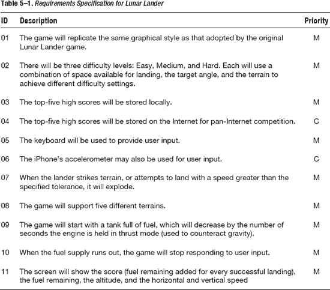
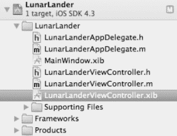
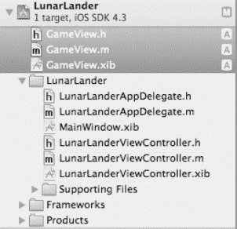
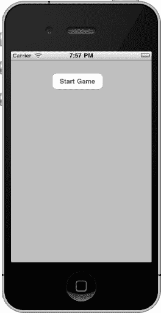
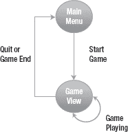
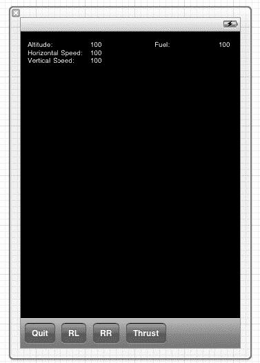
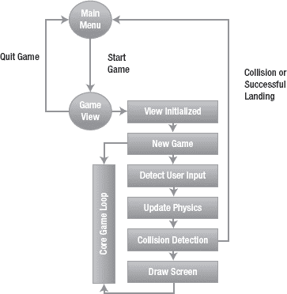
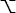
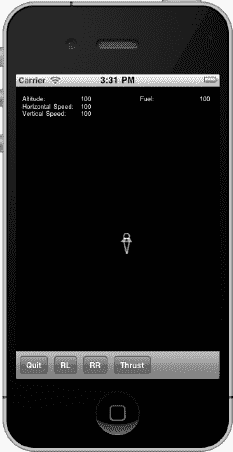

# 开始行动：创建你的首个应用程序

在前面的章节中，我们涵盖了众多主题，包括 iOS 简介、iOS SDK、可用的不同设备，以及如何使用 `Xcode` 和 `MonoDevelop` 等开发工具来创建你的初始应用程序。然而，仅靠一个 `Hello, World` 级别的应用是无法满足用户需求的。

现在，我们将基于你目前掌握的知识开始构建一个更具吸引力的应用程序，它功能更丰富、实用性更强。我们将深入探讨你在前几章节中读到的框架内包含的对象细节，以及如何使用这些对象。你还将学习如何在 `Xcode` 中组织你的应用程序，以便更好地支持项目的构建、调试和部署阶段，同时我们还会更详细地了解模拟器，用于部署前的测试。

为了演示所有这些特性和能力，我们将创建一个简单的登月者（Lunar Lander）的复制版应用，采用使其在 20 世纪 80 年代声名大噪的类似图形和物理风格。我们将在本章启动这个应用，并在本书后续内容中持续对其进行增强。

为了开始行动，我们将在本章中涵盖以下主题：

*   设计你的应用程序，考虑在开始构建之前需要解决的关键问题
*   在 `Xcode` 中设置你的项目及其结构，包括与构建和调试应用程序最相关的设置
*   理解向用户呈现用户界面的各种选项，包括如何渲染带有碰撞检测的简单图形
*   探索导航应用程序功能（如难度级别和最高分）的不同方法
*   与外部世界交互，既包括通过互联网，也包括通过用户的交互
*   探索 iPhone 模拟器来测试你的应用程序

在我们逐步构建应用程序的过程中，我将持续指出 `.NET Framework` 中的特性以便对比。我还会指出常见的"陷阱"以及如何避免它们。

## 应用程序规划与设计过程

在前面的章节中，我们探讨了在设计应用程序之前需要考虑的几个因素。例如，我们比较了每款设备的特性，在决定哪款设备最适合你的应用时需要权衡这些因素。你需要理解应用程序中需要适配的一些关键差异。这些考虑因素固然重要，但在你开始编写代码之前，还有更多方面需要思考。

在大多数专业组织中，构建应用程序的过程通常始于**需求获取阶段**。这包括收集用户的需求，或者当目标受众不明确时，则收集你应用的功能需求。然后对这些需求进行优先级排序，这样如果时间不足，你可以舍弃那些你认为不那么重要的功能。

非功能性需求与功能性需求同样重要。非功能性需求的一个示例是某些操作预期需要多快完成，或者你希望应用程序能够处理多少数据。在此阶段，你还需要记录下希望定位的实际设备，以及你希望使用的设备特性。

一旦你捕获并记录了需求，下一阶段就是开始设计过程。这包括定义应用程序核心结构的外观——哪些方面你将用自己定制的代码编写，哪些框架你将整合在一起以实现所需的功能。这被称为应用程序的**架构**。

应用程序的架构就如同你房子的地基和框架。它提供了必要的结构，在此基础上，你可以创建房间并安装布线、供水和供暖系统。应用程序也是如此。

然后，你通过使用代码详细实现应用程序的功能来构建这个架构。最终结果是一个可运行的应用程序，实现了你定义的需求——就像你的房子，按照你期望的特性建造而成。

捕获应用程序的需求并设计应用程序的结构，将为你编写代码时提供宝贵的指导，并确保你的应用程序更加灵活和健壮。你无需不断地拼凑代码来容纳之前未曾考虑到的功能。因此，尽管这不是强制性的，但按照此处描述的方式，遵循一个务实的规划和设计过程，被认为是良好的实践。

### Apple iOS 设计资源

设计应用程序的过程在很大程度上依赖于你自己的想象力和脑力——这也是乐趣的一部分。然而，如果你在理解如何最佳设计用户界面或按预期方式使用所提供的框架时感到困惑，你并非孤例！

iOS 操作系统展现了其运行设备的核心特性。因此，理解设备的特性并了解苹果公司希望如何使用它至关重要。苹果公司还花费了大量时间，针对特定任务创建和定制用户界面元素，充分利用了触控和手势用户界面。

例如，日期和时间的输入是通过使用**日期和时间选择器**控件实现的，还有一个更通用的**选择器**控件可用。这允许你旋转选择器的轮盘，直到显示你想要的值。就日期而言，先是日，然后是月，最后是年。这是一个很好的示例，展示了专门为适应设备的触摸和滑动手势而开发的控件。

这与微软在创建 Windows SDK 时所采用的原则以及作为 `.NET framework` 一部分而存在的不同用户界面控件并没有太大区别。最初，这些控件适合使用鼠标和键盘作为输入，随后进行了扩展以应对平板设备的引入，例如电子墨水（e-ink）概念。而随着 Windows Mobile 7 的引入，这一过程仍在继续。

苹果公司在 [`http://developer.apple.com`](http://developer.apple.com) 上提供了许多有用的指南。对于用户界面设计，主要资源是 **iOS 人机界面指南**。其指导内容包括：

*   **用户界面指南**：例如，专注于构建以用户体验和用户协作为重点的应用程序
*   **iOS 用户界面控件使用指南**：详细分解不同的用户界面控件，说明它们在哪些场景下最适用，以及如何使用它们。

**iOS 人机界面指南** 确实涵盖了更多主题。我建议你熟悉这份指南。同时，花点时间浏览该网站及其相关内容。


#### 其他设计资源

互联网上提供了大量示例应用的资源——其中一些简单，另一些则非常复杂。我个人特别喜欢将《毁灭战士》游戏移植到 iPhone 的源代码及其开发历程叙述，可访问 [`http://www.idsoftware.com/doom-classic/`](http://www.idsoftware.com/doom-classic/) 获取（虽然用如此复杂的内容作为我们的示例应用会很有趣，但可惜的是，这不可能。希望“月球着陆器”是次优之选。）

以下是一些你可能希望参考的其他有用资源：

*  *《绝对零基础学 Objective-C》*（ISBN 978-1-4302-2832-5）是一本极佳的书，它会带你详细了解 Objective-C 的细节。在你熟悉这门语言的过程中，它是一份有用的参考。
* Pttrns.com ([`http://pttrns.com/`](http://pttrns.com/)) 是一个用于展示用户界面模式的实用资源——并非从编程角度，而是从视觉角度。它能为你的可视化设计提供灵感。
*  *《Pro Objective-C iOS 设计模式》*（ISBN 978-14302-3330-5）提供了设计模式，帮助你实现可能在应用程序中用到的一些更复杂的设计（更偏向高级内容）。
* 有许多资源管理工具可用，其中一些是开源的。如果你的应用程序涉及大量需求，你可能会发现这些工具很有用。例如，可在 [`http://sourceforge.net/projects/osrmt/`](http://sourceforge.net/projects/osrmt/) 找到这样一个工具。

### 规划与设计“月球着陆器”应用

那么，让我们践行之前所说的内容。我们将遵循上一节中描述的设计过程阶段。首先，我们会捕获并记录需求，然后设计应用程序。

#### 需求规格说明

需求规格说明定义了应用程序的范围，并提供了设计所依据的细节。通常还需要根据优先级对需求进行分类，以便在时间不足时能够做出艰难的决定。一种常用的做法是使用所谓的莫斯科表示法，即对于需求，分别标记为**必须**有、**应该**有、**可以**有和**想要**有。这是一种简单但有效的方法。

表 5-1 展示了我们“月球着陆器”游戏的需求规格说明摘要。



显然，需求可以进一步细化以提供更多细节，但为了简洁起见，我将规格说明缩减为关键需求及其相关数据。这些信息足以让我们创建游戏，而这正是本章的重点。

#### “月球着陆器”应用设计

一旦你确定了要开发的应用程序类型以及哪些属性最有意义，就可以开始考虑一些细节了。例如，一个生产力工具（如计算器）、一个游戏（图形化）和一个消息应用（文本化）都需要不同的外观和感觉。

##### 用户界面

该应用程序将呈现两个不同的用户界面：

*   **主菜单**：这将是应用程序启动时的默认屏幕，并提供一个菜单，可以从中选择诸如难度等设置。此外，游戏可以通过此菜单系统启动。它会在屏幕中央显示最高分，并以月球着陆器座舱的图形图片作为背景。
*   **游戏视图**：这是游戏的主视图，由其自身的控制器支持。在这个屏幕上，将绘制地形并显示着陆器，同时显示游戏状态、得分和剩余燃料等统计数据。

##### 游戏状态

游戏可以处于以下五种状态之一，每种状态都会根据其状态对用户输入做出相应响应：

*   **菜单**：处于主菜单，等待用户退出、选择难度级别或开始新游戏。
*   **运行中**：游戏已启动，正在响应用户输入。
*   **已暂停**：游戏已暂停或挂起，等待用户发出重新开始的信号。
*   **已坠毁**：游戏正在运行，但用户已坠毁。可以从此菜单开始新游戏。
*   **已获胜**：游戏正在运行，用户已成功着陆着陆器。当用户按下某个键时，下一关即可开始。

##### 其他游戏设计元素

游戏设计中包含的其他元素如下：

*   游戏将使用一个简单的计时器来管理屏幕上的图形更新。不过，这之后可以改为使用多线程，从而提供更流畅的游戏体验。
*   “月球着陆器”图形将具有三个核心状态：无推力飞行、带推力飞行和已坠毁。旋转功能通过使用 iOS 的图形 API 进行管理。
*   地形被预定义为一系列点，在运行时使用简单的线条图形绘制。
*   最初将使用屏幕上的工具栏按钮作为用户输入。左右箭头键旋转月球着陆器飞船，向上箭头键表示施加推力。这可以改为使用触摸和手势界面，这些主题将在第 10 章中探讨。

## 构建“月球着陆器”应用

需求和设计阶段完成后，我们准备深入并构建“月球着陆器”游戏。

“月球着陆器”应用最初将编写为针对 iPhone 设备的 iOS 应用程序。我们将在第 7 章中讨论如何利用 iOS 的方向特性更改它以适配其他设备。

我们将使用 iOS 基于视图的应用程序项目模板，让其为主菜单创建初始视图和视图控制器。然后，我们将创建一个单独的视图及其关联的视图控制器来管理游戏的视图。这将提供一个良好的开端，并且也建立在我们已涵盖的早期示例之上。

我们还将项目内包含其他资源，例如用于月球着陆器图像的图形文件。那么，让我们开始吧。


好的，作为一名高级文档工程师和翻译员，我将严格遵循您的注意事项和示例，将给定的英文文本翻译成中文。


### 创建应用程序项目

流程您应该很熟悉了：在磁盘上为项目选择一个位置，然后启动 Xcode。使用“基于视图的应用程序”项目模板创建一个项目。我将项目命名为 `LunarLander`。创建以下文件：

*   `LunarLanderAppDelegate`（`.h` 和 `.m` 文件）
*   `LunarLanderViewController`（`.h`、`.m` 和 `.xib` 文件）
*   `MainWindow.xib`（它将使用 `LunarLanderViewController.xib` 视图）

这些文件将提供我们唯一的应用程序委托，它将启动视图控制器，该控制器将使用 `LunarLanderViewController.xib` 作为游戏主菜单的视图。您的项目结构应类似于图 5-1 所示。



**图 5-1.** *初始 LunarLander 项目文件*

在继续之前，让我们添加主游戏视图——同样，一个视图控制器和一个视图。为此，请选择 `File`  `New`（或使用 ⌘N 快捷键），然后从 Cocoa Touch iOS 模板中选择一个 `UIViewController` 子类。在接下来的几个屏幕中，确保它继承自 `UIViewController` 类，并命名为 `GameViewController`。同时记得勾选“With XIB for user interface”选项。我们将使用一个 NIB 文件来处理游戏的主用户界面——至少是视图画布和静态项。完成此操作后，您的文件夹结构应类似于图 5-2 所示。



**图 5-2.** *包含 GameView 类的 LunarLander 项目*

这些文件将为启动我们的 Lunar Lander 应用程序的核心机制提供足够的基础。在添加更多文件之前，让我们先使用这些初始文件来开始实现我们的游戏。我们将从主菜单视图和我们基础架构的一些元素开始。其他资源将根据需要添加到项目中，并且我们将在本书后续介绍特定主题时扩展应用程序的逻辑。

### 构建用户界面和流程逻辑

用户界面使用初始窗口，其中包含一个启动游戏的简单按钮。我们也可以使用此屏幕来显示最高分并用精美的图形装饰它。主 Lunar Lander 视图控制器和 XIB 文件将用于管理此视图。当选择“开始游戏”按钮时，它将加载并模态显示带有其自己控制器的游戏视图。这个初始游戏屏幕如图 5-3 所示，其中已经添加了“开始游戏”按钮。



**图 5-3.** *初始“开始游戏”屏幕*

我们的应用程序委托将用于加载此屏幕。如代码清单 5-1 所示，在头文件中，我们声明了两个属性（以粗体突出显示）：一个类型为 `Window`，另一个是指向 `LunarLanderViewController` 类实例的指针。我们将在应用程序委托代码中使用它们来显示窗口。

**代码清单 5-1.** *`LunarLanderAppDelegate.h`*

```
#import <UIKit/UIKit.h>

@class LunarLanderViewController;

@interface LunarLanderAppDelegate : NSObject <UIApplicationDelegate> {

}

@property (nonatomic, retain) IBOutlet UIWindow *window;
@property (nonatomic, retain) IBOutlet LunarLanderViewController *viewController;

@end
```

然后，我们提供一个支持性实现文件，即 `LunarLanderAppDelegate.m`，如代码清单 5-2 所示（相关代码以粗体显示）。在这里，您会注意到我们合成了这些属性，并在 `dealloc()` 方法中释放了这些资源所占用的成员。

**代码清单 5-2.** *`LunarLanderAppDelegate.m`*

```
#import "LunarLanderAppDelegate.h"
#import "LunarLanderViewController.h"

@implementation LunarLanderAppDelegate

@synthesize window=_window;
@synthesize viewController=_viewController;

- (BOOL)application:(UIApplication *)application didFinishLaunchingWithOptions:
(NSDictionary *)launchOptions
{
    // 应用程序启动后的自定义覆盖点。
    self.window.rootViewController = self.viewController;
    [self.window makeKeyAndVisible];
    return YES;
}

….. 默认实现代码在此，未经修改

- (void)dealloc
{
    [_window release];
    [_viewController release];
    [super dealloc];
}

@end
```

有趣的部分在 `didFinishLaunchingWithOptions()` 方法中，我们将主窗口的 `rootViewController` 实例变量设置为我们的“开始游戏”视图控制器（即 `LunarLanderViewController` 类），然后按照默认实现使其可见。

虽然我们从初始屏幕开始，但实际游戏玩法将由游戏视图来管理。这个非常简单的流程如图 5-4 中的图表所示。



**图 5-4.** *游戏状态流程*

因此，我们之前创建的 `LunarLanderViewController.xib` 文件将有一个简单的用户界面，如图 5-3 所示。此屏幕除了一个视图（类型为 `UIView`）和一个按钮（类型为 `UIButton`）之外没有其他内容，按钮的文本显示为“Start Game”。在 .NET 中，这完全等同于使用 `Windows.Forms` 创建一个窗体并在屏幕上放置一个按钮。

我们还需要为按钮点击附加一个动作，以显示并启动游戏。这与我们在前几章中启动简单操作的方式完全相同。

现在，让我们将“开始游戏”按钮连接到一个有意义的操作上——即加载我们的主游戏视图，以便您可以提供一个位置来处理实际的游戏机制。首先，请查看代码清单 5-3，它是处理开始游戏交互的视图控制器的头文件。

**代码清单 5-3.** *`LunarLanderViewController.h`*

```
#import <UIKit/UIKit.h>
```


`// 通知编译器，我们的 GameViewController 引用指向一个类`
`@class GameViewController;`

`// 定义主类（即 Objective-C 中所说的接口），继承自`
`UIViewController`
`@interface LunarLanderViewController : UIViewController {`

`    @private GameViewController *pgameViewController;`
`}`

`// 用于引用我们的 ViewController 的属性`
`@property (nonatomic, retain) GameViewController *gameViewController;`

`// 用于附加到“开始游戏”按钮，供用户开始游戏的事件`
`-(IBAction)startGame:(id)sender;`

`@end`

实现部分保存在 `LunarLanderViewController.m` 文件中，如代码清单 5-4 所示。

**代码清单 5-4.** *LunarLanderViewController.m*

`#import "LunarLanderViewController.h"`
`#import "GameView.h"`
`#import "LunarLanderAppDelegate.h"`

`@implementation LunarLanderViewController`

`// 将 GameViewController 指针合成为内部持有的变量`
`@synthesize gameViewController = pgameViewController;`

`- (void)dealloc`
`{`
`    // 释放自定义控制器`
`    [self.gameViewController release];`

`    // 调用继承的方法`
`    [super dealloc];`
`}`

`- (void)didReceiveMemoryWarning`
`{`
`    // 如果视图没有父视图，则释放它`
`    [super didReceiveMemoryWarning];`

`    // 释放任何未使用的缓存数据、图像等`
`}`

`#pragma mark - 视图生命周期`

`// 实现 viewDidLoad 以在加载视图后执行额外设置，通常来自`
`nib 文件`
`- (void)viewDidLoad`
`{`
`    [super viewDidLoad];`
`}`

`- (void)viewDidUnload`
`{`
`    [super viewDidUnload];`
`    // 释放主视图的任何保留子视图`
`    // 例如：self.myOutlet = nil;`
`}`

`- (BOOL)shouldAutorotateToInterfaceOrientation:(UIInterfaceOrientation)`
`interfaceOrientation`
`{`
`    // 对于支持的旋转方向返回 YES`
`    return (interfaceOrientation == UIInterfaceOrientationPortrait);`
`}`
`-(void)startGame:(id)sender{`
`    // 执行操作`

`    self.gameViewController = [[GameViewController alloc] initWithNibName:@"GameView"`
`bundle:nil];`
`    [self presentModalViewController:self.gameViewController animated:YES];`

`}`
`@end`

总结来说，我们将实现游戏功能的以下部分：

*   创建了一个 `GameViewController` 属性并管理其内存
*   编写了“开始游戏”按钮点击的事件处理程序，该程序加载并以模态方式显示游戏视图界面

这些步骤本质上允许显示主游戏屏幕。我们将把菜单附加到该屏幕，并显示最高分。我们将通过显示并开始游戏来响应“开始游戏”按钮的点击。

因此，创建属性使用的方法与前面章节描述的方法相同。不过，在这里我们明确地将属性赋值给类成员变量，从而允许我们为每个变量使用不同的名称。

让我们从头开始，在头文件中：

`@class GameViewController;`

这告诉编译器 `GameViewController` 是一个类，这意味着我们此时不需要包含完整的类声明。我们只需要通知编译器它是一个类即可。它所支持的消息和属性的语义将在运行时由 iOS 框架提供。

接下来，我们使用以下行定义内部类成员变量：

`    @private GameViewController *pgameViewController;`

这部分与前面的示例类似，但请注意 `@private` 声明。这是一个*可见性修饰符*，用于定义成员变量的可见性（或*作用域*）。有多种选项可用于指定变量的可见性，你需要将它们放在声明之后。此外，还有 `@public` 和 `@protected`，它们的行为与 .NET 中同名的语法等效项相同（位于变量之前），但没有 `@` 符号。

拥有属性使我们能够控制该变量的要素，例如在其被认为不再需要之前在内存中保留的能力。但我们确实需要记住释放它。在 `dealloc()` 方法中，我们通过向 `gameViewController` 变量发送 `release` 消息来释放它及其关联的内存。另请注意，我们使用 `[super dealloc]` 调用了继承的 `dealloc()` 方法。这被称为*沿着链向上传递调用*，使用它被称为*遵守规范*。此行为由 Xcode 创建的方法的默认实现提供。你可以在以下代码中看到这一切：

`- (void)dealloc`
`{`
`    // 释放自定义控制器`
`    [self.gameViewController release];`

`    // 调用继承的方法`
`    [super dealloc];`
`}`

我们需要响应“开始”按钮被按下的事件。因此，如果你尚未添加“开始游戏”按钮，请立即添加。

在 XIB 文件中，你需要确保“开始游戏”按钮的“触摸开始”事件已连接到我们在代码中创建的 `startGame` 事件属性。你可以使用 Connections Inspector 中的拖放功能执行此操作。打开 `LunarLanderViewController.xib` 文件并显示视图（你将看到“开始游戏”按钮）后，你需要显示 Connections Inspector 以查看可用的插座。在那里，只需将 `StartGameIBAction`（记住我们在代码中的定义）拖放到“开始游戏”按钮上。这将把它连接到按钮的“触摸开始”事件，该事件在我们首次点击按钮时触发。

需要在 Interface Builder 的 Outlets 页面上可见的 `IBAction` 定义如下：

`-(IBAction)startGame:(id)sender;`

`(IBAction)` 声明是告诉 Xcode 4 的 Interface Builder 这是一个可用于连接事件的*操作*的关键。

最后，我们需要为事件提供实现，在我们的示例中，该实现将加载并显示 `GameView` 界面及其关联的控制器。这将管理我们的 Lunar Lander 游戏的游戏机制。代码如下：

`-(void)startGame:(id)sender{`
`    // 设置我们的 gameViewController 指针，指向已加载的 GameView 类`
`    self.gameViewController = [[GameViewController alloc] initWithNibName:@"GameView"`
` bundle:nil];`
`    // 并以模态方式显示它`
`    [self presentModalViewController:self.gameViewController animated:YES];`
`}`

我们的第一行为 `GameViewController` 类分配内存 `[GameViewController alloc]`，然后将其嵌入到对 `initWithNibName` 方法的消息调用中，并传入我们的 XIB 文件名。最后，我们通过发送 `presentModalViewController` 消息并传入视图控制器的指针（此处为 `gameViewController`）来显示窗口。

对于 C++ 开发者来说，这段代码的语法比 .NET 开发者更为熟悉；`GameView` 类的分配与在 C# 中调用 `new` 相同。事实上，以下语法在 Objective-C 中也是有效的：`[GameViewController new]`。一旦类被创建，在 .NET 中调用 `ShowDialog()` 方法可以使用类似于以下的代码——这等效于之前的 Objective-C 代码：

```
// 使用 Windows Forms 创建并显示 C# 表单
Form MyForm = new MyForm;
MyForm.ShowDialog();
```

实现事件后，继续构建可执行文件并启动你的应用程序。它将显示带有“开始游戏”按钮的主窗口。如果你选择此按钮，将显示一个空白游戏窗口。为了确保它正确显示，我在游戏窗口用户界面上添加了一个简单的标签。


### 在应用程序中实现导航

到目前为止，我们已经构建了一个包含两个简单表单的应用程序，通过按钮点击将两者链接起来。但如果完成游戏后无法返回主菜单重新开始或退出，那么这个游戏就没什么用。因此，我们需要继续完善游戏界面的实现，提供一种返回主菜单或父窗口的机制。

我们将从扩展现有的游戏界面开始。首先添加一个工具栏，方便我们在上面放置按钮。同时，我们还会添加一些屏幕标签，用于显示状态信息。

请继续添加 `Toolbar`、`Button` 和 `Label` 控件，以创建如图 5-5 所示的界面。使用 Xcode 4 的 Interface Builder 标准功能，就像你在之前的示例中所做的那样。这些控件相关的代码会自动生成。



**图 5-5.** *游戏界面*

我们稍后会改进这个界面，但目前它已经达到了目的：提供了一个可以返回主菜单的 `Quit` 按钮。为此，我们将使用之前类似的技术。

我们需要一个 `IBAction` 属性，用于提供选中时触发的事件属性。此外，我们需要像之前一样在 Connections Inspector 选项卡中连接该操作，并提供以下事件实现代码：

```
-(void)quitGame:(id)sender
{
    // 不再需要游戏窗口，返回父窗口
    [ self dismissModalViewControllerAnimated:YES ];
}
```

这段代码的作用与最初将 `GameView` 作为对话框显示的代码相反。它会向视图发送 `dismissModalViewControllerAnimated` 消息。这将导致窗口被卸载，焦点返回到启动它的父视图——在本例中为 `LunarLanderViewController`。在 .NET 中，这相当于调用窗体的 `Close()` 方法，但关闭窗口时不会有动画效果，这与 iOS SDK 的情况不同。

我们暂时不会对其他按钮做任何操作。（它们将用于测试游戏的物理效果，我们会在后续章节中探讨更高级的用户交互机制。）标签目前只是占位符，虽然我们暂时不会更新它们的值，但它们已经开始让游戏初具雏形。

## 构建核心游戏引擎并启用用户交互

到目前为止，我们已经显示了初始游戏界面，其中包含启动游戏的按钮。现在我们需要创建游戏的主要机制。接下来，我们将通过开始实现核心游戏引擎来增强应用程序的功能。我们将基于 `GameView` 类，并在此过程中探索更多 iOS 和 Objective-C 的概念。

### 检查游戏视图头文件

`GameView` 的 XIB 文件以及关联的 `GameViewController` 类提供了核心游戏引擎的实现。首先，考虑代码清单 5-5 中显示的 `GameView.h` 文件。在看代码之前，我会先强调代码的关键部分（清单后有完整解释）。在头文件中，我们做了以下工作：

*   使用 `NSTimer` 类成员定义我们的类，以提供定时器功能。
*   声明一系列方法，用于响应用户的按钮操作，包括 `Quit`、`Rotate Left`、`Rotate Right` 和 `Thrust`。
*   声明一个定时器将按所需频率执行的方法。
*   定义多个枚举类型以保存状态，以及多个将用于游戏物理计算的常量。
*   声明我们的 `GameView`，它将包含三张映射推进器状态的图片：`Thrust`（推进）、`No-Thrust`（无推进）和 `Crashed`（坠毁）。
*   声明代表状态或实例变量的实例变量，将使用已定义的枚举类型和常量。
*   声明一个属性来保存登月舱图像，并为每个按钮声明 `IBAction`，以便将它们连接到提供实现的方法上。

呼，接下来看看代码，看看你是否能找出代码清单 5-5 中的所有上述特性。

**代码清单 5-5.** *GameView.h*

```
#import <UIKit/UIKit.h>

// GameView 类管理游戏的视图控制器
//
@interface GameViewController : UIViewController {

    NSTimer *gameLoop;  // 核心游戏定时器
}

// 为视图控制器声明类事件
- (void)timerLoop:(NSTimer *)timeObj;   // 定时器事件循环
-(IBAction)quitGame:(id)sender;
-(IBAction)rotateLeft:(id)sender;
-(IBAction)rotateRight:(id)sender;
-(IBAction)thrust:(id)sender;

@end

// 声明一些枚举类型，避免大量混乱的常量定义
typedef enum { NOTREADY, READY, RUNNING, WON, LOST, PAUSED } GameState;
typedef enum { EASY, MEDIUM, HARD } GameDifficulty;
typedef enum { THRUSTERS_ON, THRUSTERS_OFF } ThrusterState;

// 声明用于管理物理的其他常量
static const int FUEL_INITIAL = 200;
static const int FUEL_MAX = 200;
static const int FUEL_BURN = 10;
static const int MAX_INIT = 30;
static const int MAX_SPEED = 120;
static const int ACCELERATION_DOWN = 35;
static const int ACCELERATION_UP = 80;
static const double GRAVITY = 9.8;

// GameView 类管理主游戏
//
@interface GameView : UIView {

    // 用于保存登月舱状态的图片
    @private UIImage            *plander_thrust;
    @private UIImage            *plander_nothrust;
    @private UIImage            *plander_crashed;

    // 其他游戏成员变量
    @private GameState          gstate;
    @private GameDifficulty     level;
    @private ThrusterState      thrusters;
    @private int                fuel;
    @private int                speed_x;
    @private int                speed_y;
    @private double             rotation;

    // 定义登月舱在屏幕上的 X 和 Y 坐标
    @private int loc_x;
    @private int loc_y;
}

// 声明成员属性
@property (nonatomic, retain) UIImage *lander_nothrust;

// 声明类方法
- (void) newGame;
- (void) updateLander;
- (void) rotateLeft:(id)sender;
- (void) rotateRight:(id)sender;
- (void) thrustEngine:(id)sender;

@end
```

你都找到了吗？如果没找到，别担心。我们将逐步讲解实现中的重要部分。

游戏将支持多种状态。这些状态将用于调用适合当前状态的功能。例如，当游戏正在运行时，我们会更新屏幕上的图形。然而，如果游戏尚未开始，或者上一局游戏刚刚结束，则无需持续更新屏幕。我们还会使用一个定时器来驱动核心游戏、更新游戏物理效果，并调用必要的代码来更新屏幕图形和检测用户交互。

游戏引擎流程的更详细视图如图 5-6 所示。



**图 5-6.** *核心游戏引擎流程*

从流程中可以看出，一旦 `GameView` 被初始化，我们将初始化游戏设置，例如加载图形和设置默认值。然后我们继续检测用户输入、更新游戏物理效果，并检查碰撞检测，这可能会指示成功着陆或坠毁。

此时，我们将强制屏幕重新绘制。但屏幕绘制实际上是自动发生的，因为我们将此类更新绑定到一个定时器上，该定时器每四分之一秒触发一次。如果游戏未处于正确的状态——比如尚未开始，或者你已坠毁并等待重置游戏——则屏幕不会更新。

与大多数设计一样，我们可以改进这个应用程序，随着本书的深入我们会逐步实现。目前，我们当前的设计足以介绍一些关键主题。


### 审视游戏视图的实现

在开始讨论部分头文件代码的实现之前，我们先来看看定义头文件实现的主要源代码文件，如代码清单 5-6 所示。与之前一样，我先介绍代码实现的关键原则，然后再给出更详细的解释。在`GameView`的实现中，我们通过定制代码实现了以下功能：

- 为计时器提供实现，该计时器将使用`UpdateLander()`方法更新着陆器的位置，并将屏幕标记为脏状态以强制重绘。
- 提供`QuitGame()`的实现，该实现用于关闭模态对话框，将我们带回到显示该对话框的“开始游戏”屏幕。
- 为`RotateLeft()`、`RotateRight()`和`Thrust()`按钮点击提供实现，这些实现仅调用核心游戏引擎中同名的函数。
- 提供类初始化的代码——在我们的案例中，即在首次加载图像后显示着陆器。
- 为`NewGame()`提供默认实现，该实现会重置我们的游戏变量。
- 为`UpdateLander()`方法提供一个占位符，我们将在其中应用游戏物理机制，以响应推进器点火时长和按键操作。
- 为`RotateLeft()`、`RotateRight()`和`Thrust()`方法提供空实现，这些方法将实现游戏机制。

再次请你在代码清单 5-6 中找出所有这些特性。

**代码清单 5-6.** *GameView.m*

```
#import "GameView.h"

@implementation GameViewController

- (id)initWithNibName:(NSString *)nibNameOrNil bundle:(NSBundle *)nibBundleOrNil
{
    self = [super initWithNibName:nibNameOrNil bundle:nibBundleOrNil];
    if (self) {
        // 自定义初始化代码
    }

    return self;
}

- (void)dealloc
{
    [super dealloc];
}

- (void)didReceiveMemoryWarning
{
    // 如果视图没有父视图，则释放它
    [super didReceiveMemoryWarning];

    // 释放任何未使用的缓存数据、图像等
}

#pragma mark - 视图生命周期

- (void)viewDidLoad
{
    // 创建一个每 0.025 秒（1/40 秒）触发 'timerLoop' 函数的计时器实例
    gameLoop = [NSTimer scheduledTimerWithTimeInterval: 0.025 target:self selector:
@selector(timerLoop:) userInfo:nil repeats:YES];    

    [super viewDidLoad];
    // 在从 nib 文件加载视图后执行任何额外的设置
}

- (void)viewDidUnload
{
    [super viewDidUnload];
    // 释放主视图的任何保留子视图
    // 例如，self.myOutlet = nil;
}

- (BOOL)shouldAutorotateToInterfaceOrientation:(UIInterfaceOrientation)
interfaceOrientation
{
    // 返回 YES 表示支持的朝向
    return (interfaceOrientation == UIInterfaceOrientationPortrait);
}

// timerLoop - 主计时器事件函数
-(void)timerLoop:(NSTimer *)timerObj
{
    // 更新着陆器的位置
    [(GameView *)self.view updateLander];

    // 重新显示整个视图
    [self.view setNeedsDisplay];

}

// 用户已指示想要点燃推进器引擎；将此信息传递给游戏
//
-(void)quitGame:(id)sender
{
    // 不再需要游戏窗口，返回父视图
    [self dismissModalViewControllerAnimated:YES];
}

// 用户已指示想要点燃推进器引擎；将此信息传递给游戏
//
-(void)rotateLeft:(id)sender
{
    [(GameView *)self.view rotateLeft:sender];
}

// 用户已指示想要点燃推进器引擎；将此信息传递给游戏
//
-(void)rotateRight:(id)sender
{
    [(GameView *)self.view rotateRight:sender];
}

// 用户已指示想要点燃推进器引擎；将此信息传递给游戏
//
-(void)thrust:(id)sender
{
    [(GameView *)self.view thrustEngine:sender];
}

@end

@implementation GameView

@synthesize lander_nothrust = plander_nothrust;

// initWithCode - 当我们以编程方式初始化 XIB 资源时调用
//
- (id) initWithCoder:(NSCoder *)aDecoder
{
    if (self == [super initWithCoder:aDecoder]) {

        // 初始化精灵
        //
        NSString *imagePath = [[ NSBundle mainBundle] pathForResource:@"lander"
ofType:@"tiff"];
        self.lander_nothrust = [UIImage new];
        self.lander_nothrust = [UIImage imageWithContentsOfFile:imagePath];

        // 设置初始游戏状态
        [self newGame];

    }
    return self;
}

-(void)dealloc
{
//    [self.lander_nothrust release];
    [super dealloc];
}

// newGame - 初始化一个新游戏
//
-(void) newGame
{
    gstate = READY;
    level = EASY;
    thrusters = THRUSTERS_OFF;
    fuel = FUEL_INITIAL;
    loc_x = self.frame.size.width / 2;
    loc_y = self.frame.size.height / 2;

    // 将游戏状态设置为 RUNNING
    gstate = RUNNING;
}

// updateLander - 基于重力作用和任何用户输入更新着陆器的位置/状态
- (void) updateLander
{
    // *待办
}

// drawRect - 重新绘制屏幕
-(void)drawRect:(CGRect)rect
{
    // 仅在准备好绘制时进行绘制
    if (gstate != RUNNING)
        return;

    [self.lander_nothrust drawAtPoint:CGPointMake(loc_x, loc_y)];
    self.backgroundColor = [UIColor redColor];
}

// rotateLeft - 向左旋转着陆器
- (void)rotateLeft:(id)sender
{
    // 执行某些操作
}

// rotateRight - 向右旋转着陆器
- (void)rotateRight:(id)sender
{
    // 执行某些操作
}

// thrustEngine - 点燃引擎的推进器
- (void)thrustEngine:(id)sender
{
    // 执行某些操作
}

@end
```


#### 使用定时器触发核心事件

在代码清单 5-6 中，首先需要注意的是，作为`ViewController`类的一部分，我们定义了一个用于实现游戏主循环的定时器。该定时器使用了 iOS 的 `NSTimer` 类，其功能与 .NET Framework 中的 `System.Threading.Timer` 类类似。完整定义如下：

`NSTimer *gameLoop;  // 核心游戏定时器`

在 `GameView` 类中，我们需要等到视图加载完成后才初始化定时器。请记住，`GameView` 类封装了游戏的核心逻辑。虽然我们可以在其他地方进行初始化，但 `viewDidLoad` 事件与其他时机同样合适，因为它会在视图成功加载后执行（如其名称所示）。我们的实现如下：

```
- (void)viewDidLoad
{
    // 创建一个每 1/4 秒（0.025 秒）触发一次 'timerLoop' 函数的定时器实例
    gameLoop = [NSTimer scheduledTimerWithTimeInterval: 0.025 target:self selector:@selector(timerLoop:) userInfo:nil repeats:YES];    

    [super viewDidLoad];
    // 视图从 nib 文件加载后，在此处执行任何额外的设置。
}
```

进一步分析代码，可以看到我们使用了 `scheduledTimerWithTimeInterval` 方法。我们向其传递了定时器的触发间隔（以秒为单位，可使用小数）、回调的目标对象，以及回调方法——该方法将承载我们每次事件触发时执行的定制代码。其余参数允许以 `userInfo` 形式传入定制信息，并指定定时器事件是重复执行还是一次性触发。在我们的例子中，不传入定制信息，且定时器是重复执行的。

你会注意到，对于回调方法，我们使用了 `selector` 参数和 `@selector` 语法，并传入了方法名。该方法返回一个`SEL`类型的对象，这是回调方法所期望的参数类型。在 .NET 中，委托用于提供类型安全的函数指针，其功能与这里的实现等效。

成功初始化后的最终结果是，`gameLoop` 成员变量现在指向一个 `NSTimer` 实例，该实例在指定的时间间隔触发时，会调用 `ViewController` 类中的 `timerLoop` 类方法。让我们快速看一下这个方法的实现，它相当直观。

```
// timerLoop - 主要的定时器事件函数
-(void)timerLoop:(NSTimer *)timerObj
{
    // 更新着陆器的位置
    [(GameView *)self.view updateLander];

    // 重新显示整个视图
    [self.view setNeedsDisplay];

}
```

在我们的游戏引擎主循环中，其实现封装在 `timerLoop` 方法内，我们执行了多项操作。首先，我们调用一个方法来处理游戏物理逻辑，并识别由后续事件触发的用户交互。该方法将模拟重力效应、根据指令启动引擎，并按照你的操控旋转飞行器。它还会减少消耗的燃料，并检测是否发生碰撞或成功着陆。

你会注意到，处理所有这些神奇逻辑的方法名为 `updateLander`。但由于此处的 `self` 指向一个 `UIView`（查看你的 XIB 文件），我们需要将其转换为已知的 `GameView` 类实例。为了使类型转换生效，请确保在 Xcode 的 Interface Builder 中打开 `GameView` 视图，并在身份检查器中将自定义类的类名设置为 `GameView`。然后我们可以进行类型转换，因为 Interface Builder 中使用的是 `UIView` 类来定义视图。在我们的代码中，我们扩展了该类功能并命名为 `GameView`。如果重新查看 `GameView.h`，你会看到类似如下的代码，因此我们知道执行此类类型转换是安全的：

```
@interface GameView : UIView {
// 实现代码写在这里
}
@end
```

在 .NET 中，语法表示取决于具体语言。但以 C# 作为对比，其语法类似，使用冒号后跟父类来表示类继承。因此，使用 `(GameView *)` 类型转换来转换视图控制器的 `view` 属性，这样我们就可以引用已定义的 `updateLander()` 方法了。

最后需要注意的一点是，与定时器本身关系不大：当我们更新了游戏物理状态后，需要更新显示以反映着陆器位置或状态的变化。为此，我们使用 `setNeedsDisplay` 方法，并将此消息传递给 `view` 对象——在此例中为我们的 `GameView` 对象。这将强制刷新显示（整个显示区域），期间我们会执行诸如重新绘制着陆器之类的更新。

### 自文档化代码

在继续实现 `GameView` 类之前，我想谈谈*自文档化代码*的概念。这一术语背后的原则是，你的代码应该通过其实现本身就能说明问题。一个好的例子是使用命名良好的变量和方法，并采用我们之前在本书中讨论过的驼峰命名法约定。另一个概念是，虽然你可以将值硬编码到代码中，但这些值对于接手代码进行调试或扩展的人来说可能毫无意义。为了提高可读性，应尽可能避免使用硬编码的字面量，代之以常量或枚举类型。

#### 使用常量

通过一个例子最能说明常量的用途。假设我们要将初始燃料箱值设为其满容量，即 200 升。我们可以通过将字面量 `200` 赋值给变量来实现，如下所示：

```
int fuel = 200;
```

或者，我们可以定义一个常量，如下所示：

```
static const int FUEL_INITIAL = 200;
```

然后使用这个常量将值赋给变量，如下所示：

```
int fuel = FUEL_INITIAL;
```

请注意，虽然定义常量多了一行代码，但它使我们的代码无需注释就更加易读。此外，如果在相同上下文中需要重置为这个相同的值，我们可以直接再次使用这个常量。C# 中的语法完全相同。


### 使用枚举类型

另一种编码方式与使用常量类似但略有不同，即采用枚举类型。它不仅为预定义的文字值赋予了更有意义的名称，还提供了一种对象类型，该类型只能取已定义值集合中的值。通过保持类型安全，这能确保你的代码更加可靠和健壮。

同样，我们用一个例子来说明。假设我们的游戏可以有六种不同的状态：未就绪、就绪、运行中、胜利、失败和暂停。我们可以使用文字值，甚至可以定义六个不同的常量。但是，为了突显类型安全的价值，如果我们像使用常量那样，将数字存储在 `int` 中，那么没有什么能阻止我们将其设置为一个无效状态的值，从而导致错误。因此，我们转而使用枚举类型：

```
typedef enum { NOTREADY, READY, RUNNING, WON, LOST, PAUSED } GameState;
```

当放在头文件中（不在类定义内）时，这将定义一个新类型（因此使用 `typedef` 命令），该类型由枚举值组成（因此使用 `enum` 语法），其有效值为 `NOTREADY`、`READY`、`RUNNING`、`WON`、`LOST` 和 `PAUSED`。集合值的递增顺序意味着 `NOTREADY` 将被自动赋值为 0（零），而 `PAUSED` 的值为 5。然后给它一个标签名 `GameState`，意味着我们可以用此来引用该类型。

因此，在定义我们的枚举类型之后，我们可以创建该类型的对象，这些对象只能保存我们已定义的集合中的值——即有效状态。示例如下：

```
GameState state = NOTREADY;
```

你会注意到，在我们的应用程序中，我们同时使用常量和枚举类型来帮助创建更具可读性的代码——*自文档化代码*。我们不仅对 `GameState` 这样做，还对游戏的难度等级（作为 `GameDifficulty`）和月球着陆器推进器的状态（作为 `ThrusterState`）也如此处理。

C# 中枚举类型的对应实现非常相似，并使用了几乎完全相同的语法。以下代码行展示了这一点，其细微差别在于省略了 `typedef` 关键字且标签名的位置不同：

```
enum GameState { NOTREADY, READY, RUNNING, WON, LOST, PAUSED }
```

### 以编程方式初始化 XIB 资源

你知道，包含在 `GameView.xib` 文件中的 `GameView` 用户界面，会在游戏启动时显示。在我们的案例中，我们希望对此过程进行更精细的控制，因此我们使用 `initWithNibName` 命令以编程方式加载 `GameView.xib`。这会调用 `initWithCoder` 方法，它有点像构造函数，我们将用它不仅来加载 XIB 文件，还进行一些应用程序初始化。请考虑此方法的以下实现：

```
- (id) initWithCoder:(NSCoder *)aDecoder
{
    if (self == [super initWithCoder:aDecoder]) {

        //// 初始化精灵
        //
        NSString *imagePath = [[ NSBundle mainBundle] pathForResource:@"lander"
                                                              ofType:@"tiff"];
        self.lander_nothrust = [UIImage new];
        self.lander_nothrust = [UIImage imageWithContentsOfFile:imagePath];

        // 设置初始游戏状态
        [self newGame];

    }
    return self;
}
```

我们的实现非常简单。尽管在此阶段还不完整，但已初具雏形。

首先，我们使用 `[super initWithCoder:aDecoder]` 命令调用父类方法，这将确保先创建继承的基类对象，并将其赋值给调用类（由 `self` 引用）。如果此操作成功且不为 nil，则我们进入自定义代码，并最终返回新创建的对象。这是典型的对象初始化代码，你会看到许多其他使用继承来提供自身实现的对象也重复这种模式。

我们的初始化代码做了两件事。首先，我们初始化一个类型为 `UIImage` 的属性，该属性将保存多个推进器状态其中之一。本例中，它是不发射推进器时的月球着陆器图像，因此属性名为 `lander_nothrust`。回想一下在列表 5-5 中，我们如下定义了属性：

```
// 声明成员属性
@property (nonatomic, retain) UIImage *lander_nothrust;
```

并且记得像在列表 5-6 中那样，在我们的实现中对其进行合成：

```
@synthesize lander_nothrust = plander_nothrust;
```

然而，这是一个空的属性，需要进行初始化。一旦图像被初始化，我们还将调用一个我们自己的自定义方法 `newGame`，顾名思义，该方法初始化应用程序以开始一个新游戏。这是通过 `[self newGame]` 命令实现的。

让我们仔细看看图像初始化代码。此时，我们使用三个独立的 `UIImage` 对象来保存月球着陆器飞船的不同状态：引擎推进中、引擎未推进、以及坠毁。我们可以使用图像数组或一个专门的 iOS 类来实现这一点，但在此阶段，我们保持简单。

因此，在我们向项目添加了 `Lander.tiff` 图像后（请继续添加），我们可以使用 `pathForResource` 方法引用该资源，传入文件名及其扩展名。以下命令实现了这一点，并返回一个指向我们图像资源的字符串：

```
NSString *imagePath = [[ NSBundle mainBundle] pathForResource:@"lander" ofType:@"tiff"];
```

然后，我们可以使用略有不同的 `new` 表示法来创建 `UIImage` 的实例，如下所示：

```
self.lander_nothrust = [UIImage new];
```

你会注意到，这个语法类似于 C#，因为我们使用了 `new` 关键字来实例化一个新对象。然后，我们可以使用 `imageWithContentsOfFile` 方法，通过资源的完整路径来加载图像。以下是完整的一行代码：

```
self.lander_nothrust = [UIImage imageWithContentsOfFile:imagePath];
```

如果你检查 `newGame` 方法的实现，你会发现它很简单。它只是开始将一些类成员变量初始化为新游戏的默认值。


#### 手动绘制用户界面

大多数情况下，你无需担心用户界面的绘制问题，因为 iOS 框架通常会自动处理这部分工作，作为控件功能的一部分。然而，在某些情况下，你可能希望对用户界面进行更精细的控制。如果你的应用是游戏，尤其如此，因为 iOS 框架提供的控件仅能实现部分所需功能。

在这种情况下，你可以重写应用窗口需要刷新时调用的方法。这个方法名为 `drawRect`，它接收一个需要重绘的区域，该区域以 `CGRect` 结构体形式传递。该结构体包含需要重绘的矩形区域的起点和大小。如果该区域需要重绘，则被称为*脏区域*。当某些内容发生变化时（例如，某个区域之前被窗口遮挡，或控件的外观更新），就必须进行重绘。请考虑以下方法及其实现：

```
// drawRect - 重绘屏幕
-(void)drawRect:(CGRect)rect
{
    // 仅在准备就绪时进行绘制
    if (gstate != RUNNING)
        return;

    [self.lander_nothrust drawAtPoint:CGPointMake(loc_x, loc_y)];

}
```

你会注意到，我们首先查询应用程序的状态——如果它没有运行，则无需更新屏幕。假设它正在运行，此时我们只需在游戏初始化时定义的 `x` 和 `y` 位置，使用 `lander_nothrust` 图像绘制我们的月球着陆器图像。目前，我们仅做这些。然而，随着游戏物理效果的体现和用户交互的纳入，我们将更新月球着陆器的位置、检测碰撞等——所有这些都在此方法内完成——并绘制相应的视觉效果。这意味着，如果没有施加推力，着陆器会下降；如果施加推力，它会上升，等等。因此，这相当直接，但很有效！

#### 使用自定义方法

与大多数编程语言一样，你的应用程序结构通常使用子程序，或在面向对象的世界中使用类方法来定义自定义功能。当按正确顺序调用时，这些功能就能实现你的应用程序——在我们的案例中，就是《月球着陆器》游戏。这些子程序的结构和命名是你应用程序架构的一部分。

我们的游戏提供了以下占位方法：

*   `newGame`：初始化游戏。此方法在用户界面初始化后被调用。
*   `rotateLeft`：将月球着陆器飞船向左旋转。这是响应用户想要向左旋转的操作。在初步实现中，这是通过一个工具栏按钮完成的。详见第 7 章，稍后我们将在第 10 章中讨论轻扫和手势。
*   `rotateRight`：将月球着陆器飞船向右旋转。这是响应用户想要向右旋转的操作。同样，这里我们使用了一个工具栏按钮；稍后，我们将研究轻扫和手势。
*   `thrustEngine:`：点燃月球着陆器的推进器引擎，这将减缓上升速率，如果按住足够长时间，甚至能增加高度。它还会指示引擎状态的变化，让我们的绘制方法在用户所见内容中反映出这一点。
*   `quitGame`：通过关闭模态显示的 `GameView` 来退出游戏。本章中，我们将仅实现此方法和 `newGame`。

### 使用模拟器测试你的应用

鉴于我们现在开始认真开发应用程序，我们将更多地使用模拟器。我们可以开始考虑在真实设备上部署和测试，但我们先暂且搁置这一复杂问题，部分原因是目前还没有必要。

在应用开发的早期阶段，以模拟器为目标可以节省大量时间。你无需等待应用安装到物理设备上，就能看到代码更改的效果。而且，在模拟器中运行代码也不需要购买和安装开发者证书。

请不要误会——使用模拟器并非完美无缺，它也有自己的挑战。例如，它无法显示 OpenGL 图形、无法模拟多点触控事件，也无法提供来自 iPhone 某些传感器（如 GPS）的读数。尽管如此，对于大多数应用而言，它已具备足够的功能，成为你开发过程中有价值的一部分。

需要注意的一个陷阱是，你无法保证模拟应用性能会与实际应用性能相似。模拟器往往运行得非常流畅，这得益于其运行所在 Mac 的强大性能。而真实应用几乎肯定会受到更有限的资源限制，从而影响用户体验。请务必在你应用所针对的所有物理设备上进行测试，以确保你的期望与现实相符。

以下是模拟器的一些功能：

*   **用户输入**：鼠标可用于模拟指尖。按住 Option 键（）将显示两个圆点，可用于模拟多点触控事件。
*   **旋转**：可以通过硬件菜单实现。
*   **iOS 版本**：你可以选择不同的 iOS 版本来测试你的应用。
*   **低内存**：可以模拟低内存情况，以便你向应用发送此状态，观察其行为。
*   **硬件键盘**：模拟器允许你使用 Mac 的键盘来提供键盘输入。

那么，经过所有这些辛苦工作之后，你的游戏运行起来是什么样子呢？在 图 5–7 中，你可以看到游戏在模拟器中运行的情况，两个圆圈代表模拟器中的触摸手势。



**图 5–7.** *在模拟器中运行的游戏*

## 总结

在本章中，我们利用了前几章提供的基础，开始开发一个真正的应用程序——更接近于实现大多数 iPhone 和 iPad 用户所期望的丰富用户体验。好吧，我们的《月球着陆器》游戏可能不适合所有人，是的，我仍然在怀念我的青春时光，但手机游戏应用应该有趣。它也让你有机会在你迄今为止所学到的知识基础上进行构建并加以阐述。

我们介绍了一些关于如何开始应用程序开发的建议，从基础知识入手，例如捕获需求和思考应用设计。然后，我们开始构建应用程序的视觉和程序化方面。

在构建应用程序的同时，你了解了如何在呈现用户界面时使用多个视图，包括我们游戏应用程序的程序化显示。我们添加了一些导航控件，并利用这些控件提供的事件。我们还研究了如何使用实用工具类，例如 `NSTimer` 类和 `UImage` 类，来实现我们的功能。

我们还研究了如何编写更具可读性、自我文档化的代码，以及如何使用我们自己的自定义方法来实现一个有意义的架构，其结构应能被大多数开发人员轻松理解。最后，我们将模拟器视为一个良好的测试资源。

在接下来的章节中，我们将基于此应用程序进行构建，充实其功能。在此过程中，我们将探索 iOS 的其他方面，例如更高级的用户界面和数据持久化。

## 第 6 章


