# 提升技能：用动态用户界面增强你的应用

苹果公司始终高度重视用户在 iOS 设备上的使用体验，这尤其因为它是最早实现以图形用户界面（GUI）为核心用户交互方式的操作系统的公司之一。Macintosh 并非首款采用 GUI 的个人电脑，但却是首个为开发者社区提供如此全面支持的产品。这包括《界面设计指南》，通过苹果提供的一些开发者资源，你会发现这些指南至今仍存在于 OS X 系统中。当然，苹果对用户体验的理解并不仅限于图形用户界面，它还包括设备的物理特性和基于触摸的用户输入等方面。不过，应用的用户界面设计在提供苹果所期望的、且能与 iOS 设备其他特性（使其成为全球领先移动设备的关键因素）和谐共存的交互体验中，起着至关重要的作用。

因此，手握 iOS 设备，唯一限制你的是想象力，而唯一的障碍则是如何解锁设备中的魔法，通过应用将想法转化为现实。本章重点介绍 iOS SDK 如何帮助你实现这一目标。具体来说，你将了解以下内容：

-   设备的功能特性以及如何利用它们，例如自动调整大小
-   不同的应用类型，以及支持它们的视图控制器
-   iOS SDK 提供的用于构建用户界面的界面元素
-   如何使用 iOS SDK 实现典型 UI 元素应用功能的工作示例
-   苹果提供的支持资源，以及一些如何充分利用它们的小技巧

我们首先探索 iOS 设备的一些关键特性以及典型的应用场景。

## 理解平台与设备的限制条件

用户体验始于所使用的设备，因此你的目标设备以及你为利用每个设备的物理特性而编写的代码至关重要。请注意，我特意使用了*目标*和*利用*这两个词，因为某些特性（如设备方向和应用旋转其用户界面的能力）并不会被应用自动采用——你需要专门编写代码来支持它们。本书后面会详细介绍这一点。

让我们来看看一些相关的平台特性。

### 屏幕尺寸与分辨率

在设计应用时，不同 iOS 设备的屏幕分辨率非常重要。描述设备屏幕尺寸的度量单位（*像素*）和描述屏幕上绘制区域的度量单位（*点*）之间存在重要区别。表 6-1 详细列出了不同 iOS 设备以像素为单位的屏幕分辨率。

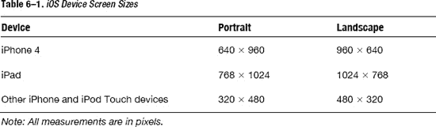

值得注意的是，当你查看 iOS SDK 提供的图形系统框架时，它们要求你使用基于点的逻辑坐标系统，而非像素。稍后会解释原因，但像素与点之间的转换取决于你的显示类型。标准显示器采用 1:1 的比例；而视网膜显示屏则采用 1:2 的比例。

#### 充分利用设备形态的示例应用

有许多优秀应用能够充分利用不同设备的尺寸和形态。一些示例应用会将显示方向调整为更适合其用途的模式。例如，在图 6–1 中，iPhone 上的 YouTube 应用使用竖屏模式显示列表，因为横屏模式带来的价值不大。

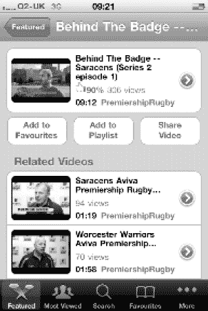

**图 6–1.** *竖屏模式下的 YouTube 视频列表*

但在播放特定视频时，横屏方向更为合适。你会看到应用切换到横屏模式播放视频，如图 6–2 所示。它仍然提供竖屏选项，但该模式效果较差。


**图 6–2.** *YouTube 默认使用横屏模式播放视频*

特别是 iPad，它为你提供了更多利用其大屏幕的机会。如图 6–3 所示，《金融时报》的 iPad 应用利用设备的形态，呈现了其数字仿真报纸的外观和感觉。


**图 6–3.** *竖屏模式下展现的《金融时报》iPad 应用*

另一个例子是 BBC 的 iPad 应用，它充分利用横屏模式，通过分裂视图控制器（Split View Controller，你将在本章稍后构建一个示例）并排显示新闻和相应的视频。你可以在图 6–4 中看到该应用。

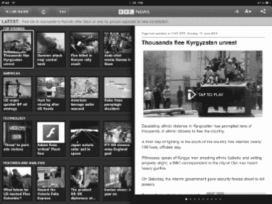

**图 6–4.** *BBC 新闻 iPad 应用充分利用横屏模式*

#### 点与像素的比较

点这个度量单位用于描述屏幕上绘制的区域，而像素则描述屏幕或图像（如图标）的大小。为什么要区分两者？苹果提供支持，使你的应用无论运行在何种设备上，都能一致地呈现。它通过使用点和逻辑坐标系统来实现这一点，当 iOS 系统框架也使用该系统来解释物理设备位置时，能确保你绘制的内容在不同设备上显示为相同大小。微软在其 GDI+ 框架中也采用了类似的逻辑坐标系统。你很快就会发现，处理点和处理像素一样简单，而且设备间的逻辑等效性通常意味着操作更简便。

#### 其他考虑因素

在考虑屏幕尺寸时，还有一些明显的因素。iPad 的屏幕显然比 iPhone 大得多，因此你的应用可以利用这一点，你的图片质量也应能体现这种尺寸差异。例如，除非你愿意牺牲图片质量，否则不要简单地使用相同大小的图形内容并直接放大。

另外请记住，苹果的《人机界面指南》建议，某些用户界面元素无论屏幕大小如何，都应保持相同尺寸。例如，指南建议用户界面中可点击的元素在 44 × 44 点的尺寸下最舒适。

**注意：** 通常，移动设备的像素密度较高，因其设计用于近距离观看。iPhone 4 就是如此，其像素密度为 326 PPI（每英寸像素数），而 iPad 2 则为 132 PPI。

### 支持设备方向

iOS 支持基于设备方向旋转你的应用。你的应用是否支持此功能当然是一个设计考量。在某些情况下，将应用旋转到特定方向毫无意义，因为这会牺牲用户体验。例如，一个带有某种横向滚动场景的游戏，如果旋转到竖屏模式，看起来会显得被压缩和妥协。


### 处理设备方向

你可能已经猜到，iOS SDK 会触发一个事件来通知你的代码设备方向发生了变化。来看看这个事件的签名：

`(void) didRotateFromInterfaceOrientation(UIInterfaceOrientation)fromInterfaceOrientation`

当这个事件被触发，并且你的应用程序通过在代码中实现这个方法签名来捕获该事件时，它会传入设备旋转前的方向。所以你只需要实现这个事件，对吗？不对——除了为旋转方法提供实现外，你还需要首先告诉你的应用程序支持不同的方向并触发该事件。如果你检查构建视图控制器时生成的代码，会发现以下代码被注释掉了：

```
/*
// Override to allow orientations other than the default portrait orientation.
- (BOOL)shouldAutorotateToInterfaceOrientation:(UIInterfaceOrientation)interfaceOrientation {
    // Return YES for supported orientations
    return (interfaceOrientation == UIInterfaceOrientationPortrait);
}
*/
```

你需要同时取消这段代码的注释，向应用程序表明它现在支持不同的方向，并且确保如果触发的方向（在示例中为竖屏方向）受支持则返回 `YES`，如果所有方向都受支持则无条件返回 `YES`。你还需要实现前面讨论过的旋转事件。

如果你想知道设备是否已旋转为竖屏方向，可以检查它是否从横屏方向旋转而来，并通过使用针对该方向定向的视图控制器来反映这一变化：

```
if((fromInterfaceOrientation == UIInterfaceOrientationLandscapeLeft) ||
     (fromInterfaceOrientation == UIInterfaceOrientationLandscapeRight))
  {
    //  Load the view controller oriented to the Portrait mode
  }
```

你还可以测试 `UIInterfaceOrientationPortrait` 和 `UIInterfaceOrientationPortraitUpsideDown`，在所有情况下根据你的应用程序是否已编写为支持特定旋转来返回 `YES` 或 `NO`。

我们来测试一下。如果你让代码保持注释状态或直接返回 `NO`，那么你的应用程序只支持竖屏方向，不支持横屏方向。因此，如果你在模拟器中运行应用程序，并从 `Hardware` 菜单中使用向左旋转（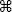）或向右旋转（）命令，设备会旋转。将其向左旋转，你应该会看到类似图 6-5 的屏幕。

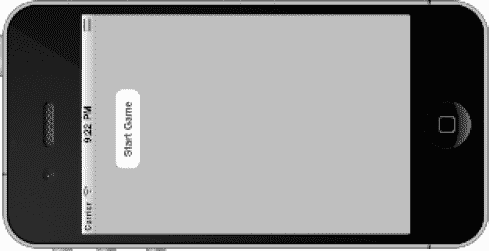

**图 6-5.** *设备向左旋转*

这显然看起来不对，而且毫不意外，因为你已经指出应用程序不支持竖屏之外的任何方向。为了说明这一点，让我们取消代码注释，并无论方向如何都返回 `YES` 作为值。更改代码后，重新运行应用程序，并按照相同的向左方向旋转，你应该会看到类似图 6-6 的屏幕。

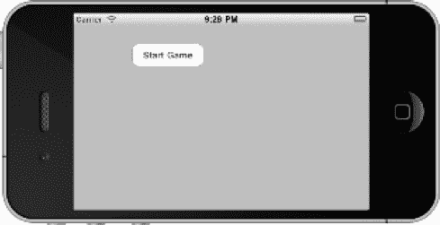

**图 6-6.** *支持横屏的设备旋转*

好多了，但还不正确。正如你所看到的，按钮不像在竖屏模式下那样在屏幕上居中。没关系：这个问题很容易解决，因为 Xcode 和 iOS SDK 支持使用控件属性进行自动调整大小。打开你的项目并打开 `LunarLanderViewController.xib` 以显示起始屏幕。使用尺寸检查器（5）选择按钮，你就会看到图 6-7 中显示的尺寸检查器。

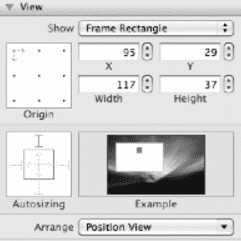

**图 6-7.** *尺寸检查器*

首先，不要被这个显示界面搞糊涂；它相当直观。让我们关注自动调整大小窗格。左边的框是修改属性值的地方；右边的框是一个示例动画，描绘了你所做更改的效果——这是一个非常有用的视觉工具，可以确认你做了正确的更改。

仔细观察，你会发现两件事：

*   内方块中的一组红色箭头，代表所选对象内部的水平和垂直空间
*   内框外侧的一组 *I* 形图标，代表所选对象与其所在视图外部之间的距离

在这两种情况下，虚线表示该空间是灵活的：也就是说，它会根据屏幕的方向进行调整。实线表示该空间是固定的。因此，如果你希望按钮在水平轴上是灵活的并能自动居中，你需要确保左侧的 *I* 形图标是虚线，而不是默认的实线。这一更改如图 6-7 所示，动画显示旋转时按钮会移动到横屏屏幕的中心——这正是你想要的。进行更改并运行应用程序，你应该会看到类似图 6-8 的屏幕。好多了！

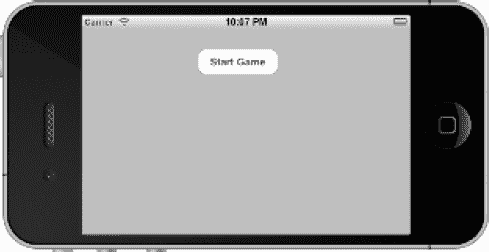

**图 6-8.** *通过调整自动调整大小设置，屏幕向左旋转*

自动调整大小并不是你唯一可用的选项。iOS SDK 提供了一种方法，让你可以通过代码在旋转完成前调整控件的属性，从而精确控制控件的外观和感觉。需要更改的方法签名如下：

`(void)willAnimateRotationToInterfaceOrientation:(UIInterfaceOrientation)`

最后一个可用的选项让你无需通过编程方式即可精确控制屏幕在特定方向上的外观。要实现这一点，你需要为每个要支持的方向准备一个视图，并在刚才描述的那个方法中使用 `self.view` 属性来调整视图。这意味着你的视图可以在设计时针对某个方向定义用户界面的外观和感觉，而无需通过代码以编程方式调整用户界面控件。简单吧！

关于旋转和方向的讨论就到此为止。虽然它们很重要，但并非本章的主要焦点。让我们将目光投放到设备的属性之外，考虑你可能正在构建的应用程序类型，以及 SDK 提供的支持，以给用户带来熟悉而丰富的体验。


## 应用类型及其关联的视图控制器

到目前为止，本书介绍了视图和视图控制器的概念，甚至还提出了一种应用如何拥有多个视图，这些视图会根据用户界面以编程方式显示。我对*应用类型*进行了区分：即某些表现出特定行为并以特定方式使用视图控制器的应用。请考虑以下应用类型：

- 实用工具应用
- 标签栏应用
- 导航应用

在此上下文中，我将月球着陆器归类为实用工具应用。该游戏主要在一个单一视图上进行，并且还会显示一个配置或启动屏幕。然而，这是最简单的用户界面。它还以模态方式显示视图控制器，因为应用的设计在主游戏进行或终止时，仅将主游戏屏幕显示为唯一可用的屏幕。模态显示视图通常是为了中断应用的流程，并强制其在流程继续之前返回。另一个典型示例是在继续之前获取所需的关键信息。另一种方式则不中断流程，视图通过标签栏等控件进行协调。

正如你所见，用户与你的应用进行交互的方式有很多创新且通常很复杂，这些交互通常通过手势来控制。要在本书的篇幅限制内，为你介绍所有不同应用类型及其相关视图控制器的工作示例是不可能的。你可以通过 Apple 指南（例如[`http://developer.apple.com/library/ios/#featuredarticles/ViewControllerPGforiPhoneOS`](http://developer.apple.com/library/ios/#featuredarticles/ViewControllerPGforiPhoneOS)）或全面的 iOS 开发书籍独立探索多种方案。在此，我们将专注于一些与.NET 有对应关系的特定、有用的替代方案，并学习如何使用它们。

在深入探讨标签栏示例之前，让我们先来看看不同的应用类型及其关联的视图控制器。

### 基于实用工具的应用

在基于实用工具的应用中，用户的交互围绕单个视图展开。可能存在其他视图，但它们通常仅限于支持应用的配置。一个很好的例子是股票应用，如图 6-9 所示，调用时会显示你选择的股票（或默认股票）及其表现。指南针和计算器应用也是很好的例子。

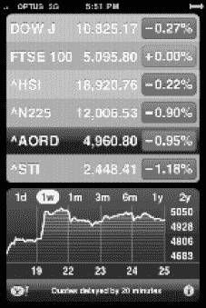

**图 6-9.** *iPhone 股票应用是一个基于实用工具的应用示例。*

并没有特定的视图控制器类来管理这种应用；相反，你会以编程方式模态地呈现视图。这正是你在月球着陆器应用中所做的。在.NET 中，实用工具应用可能是基于控制台的应用，或是具有单个窗口并使用模态对话框来检索关键信息的 Windows 窗体应用。

### 基于标签栏的应用

标签栏应用是一种支持多个视图的应用，其上下文根据用户交互选择，通常以标签形式显示。一个很好的例子是时钟应用，如图 6-10 所示，它拥有多个视图，通过屏幕底部的标签栏访问。选择一个标签通常会改变活动的视图控制器；一个新的对应视图变为活动状态，从而显示新屏幕。

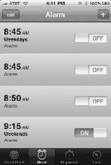

**图 6-10.** *iPhone 时钟应用是一个多视图标签栏应用。*

值得强调的是，有一个常见的混淆点。工具栏看起来与标签栏非常相似，两者都是用于显示可点按图标水平条。关键区别在于，工具栏可以包含按钮和其他控件，但这些控件的选择并非互斥的。用户可以点击多个，它们不会像二元开关那样工作——相反，它们只是触发一个供你捕获和处理的事件。反之，由于标签栏的选择决定了视图，因此标签是互斥的。

标签栏应用通常使用由`UITabBarController`类提供的标签栏视图控制器来实现。该类直接使用，而不进行子类化；你将以此作为更详细示例的核心。在.NET 中，标签栏是为数不多的在 Windows 窗体中具有可直接比较的.NET 控件（`TabControl`，位于`System.Windows.Forms.TabControl`命名空间）的视图控制器类型之一。

另外值得一提的是，标签栏通常与表格类型的视图结合使用，而表格视图控制器（通过`UITableViewController`类实现）正是为此设计的。它提供了在实现表格时所需的预期行为支持，例如编辑数据行或管理单元格、行和列的选择。

### 基于导航的应用

基于导航的应用通常用于呈现一系列具有自然层次结构的视图。例如，考虑邮件应用，如图 6-11 所示，每个用户交互都建立在前一个交互之上，允许你深入你的邮件账户，然后是收件箱，然后是电子邮件，最后是特定的邮件。每一步都由一个视图表示，你可以通过选择返回按钮反向退出层次结构。

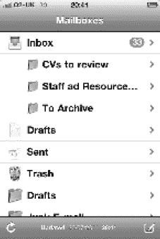

**图 6-11.** *邮件应用是一个层次化的、多视图基于导航的应用。*

导航控制器的功能包含在`UINavigationController`接口中。这与前面提到的`UITabBarController`接口非常相似，关键区别在于导航控制器通过实现视图栈来工作。例如，想象拿起一堆书，将它们一本本叠放在一起——你构建了一个书堆，完成后，从书堆中最容易拿出的书就是你最后放上去的那本。然后你可以揭开书堆，最后拿到你最初放下的那本书。这被称为*后进先出*（LIFO）。


### 实现基于标签栏的应用

回顾之前的章节，你已了解 Xcode 提供的项目模板功能——如果你用过 Visual Studio，会对这些模板感到非常熟悉。Xcode 恰好为基于标签栏的应用提供了这样一个模板，因此我们暂时搁置《登月者》项目，利用该模板创建另一个示例应用，以演示标签栏视图控制器的特性。首先启动 Xcode，按照步骤创建新模板，此操作选择如图 6–12 所示的标签栏模板。

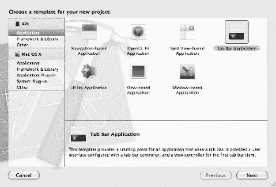

**图 6–12.** *新建标签栏应用*

点击“下一步”，为应用命名。我将其命名为 `TabBarExample`——我知道这名字缺乏创意！为了让你理解 Xcode 构建的内容，我们先直接在模拟器中运行这个刚创建的应用，观察其效果。此时有必要重申一点：.NET 平台没有“视图控制器”或“标签栏视图控制器”的概念；但它提供了独立的控件，当这些控件与你自己实现的 MVC 模式结合时，同样能轻松复制相同的功能。本章稍后部分将对比 iOS SDK 和 .NET 用户界面库中提供的控件。

首先，查看从模拟器截取的图 6–13，图中展示了在默认项目实现中点击标签按钮时显示的两个视图。

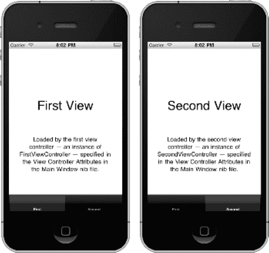

**图 6–13.** *运行中的默认标签栏应用*

接下来，我们分析创建默认应用（自带视图与控制器切换功能）后生成的实现代码。使用项目导航器（1）查看项目结构；当展开三个文件夹（`TabBarExample`、`Frameworks` 和 `Products`）时，你会看到类似于图 6–14 的结构。

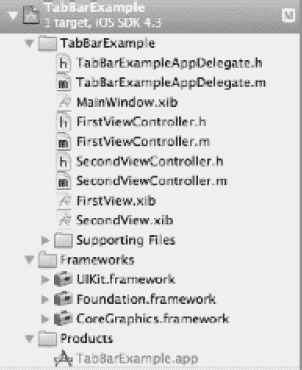

**图 6–14.** *标签栏默认项目结构*

首先从简单的部分入手。`Products` 是一个名为 `TabBarExample.app` 的单一应用程序二进制文件，它使用了 `UIKit`、`Foundation` 和 `CoreGraphics` 框架。如第 4 章所述，在 Microsoft .NET 中，这些框架相当于功能库，提供对象及其属性和方法，所有内容均位于各自对应的命名空间中。

沿着列表向下查看，我们来看应用委托的实现。查看头文件和实现文件，你会发现它们与之前看到的非常相似，但存在一些关键差异。请参考代码清单 6-1 中的 `TabBarExampleAppDelegate.h` 文件。

**代码清单 6-1.** *`TabBarExampleAppDelegate.h`*

```
#import <UIKit/UIKit.h>

@interface TabBarExampleAppDelegate : NSObject <UIApplicationDelegate,
UITabBarControllerDelegate> {

}

@property (nonatomic, retain) IBOutlet UIWindow *window;

@property (nonatomic, retain) IBOutlet UITabBarController *tabBarController;

@end
```

需要关注的关键点是：与之前的示例一样，它继承自 `NSObject`，但不仅实现了 `UIApplicationDelegate` 协议，还实现了 `UITabControllerDelegate` 协议。该协议的方法提供了一些选项，例如，可以在标签被选中后执行某些操作。可以看到，它还创建了一个指向 `UITabBarController` 类的属性，这是应用中使用的标签控制器对象的实例引用。请记住，`UITabController` 类不会被继承；你直接使用该类本身。

我不会深入讲解 `TabBarExampleAppDelegate.m` 文件的细节，但值得注意的一点是：窗口的 `rootViewController` 被设置为 `tabBarController` 属性，作为要使用的主视图控制器。如下代码所示：

```
self.window.rootViewController = self.tabBarController
```

到目前为止一切顺利。如果双击 `MainWindow.xib` 文件，它将在 Interface Builder 中加载。选择“标签栏控制器”视图，你会看到 Interface Builder 中显示的界面，如图 6–15 所示。

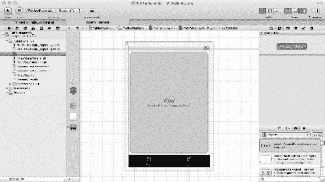

**图 6–15.** *在 Interface Builder 中打开的标签栏 MainWindow 视图*

在此示例中，我点击了标签栏上的“第二个”按钮，可以看到 Interface Builder 显示 `SecondView` 已加载。如果点击第一个标签栏按钮，它会显示 `FirstView` 已加载。在标签栏属性中可以找到此控件的设置，你可以通过属性检查器（4）显示该面板，如图 6–16 所示。

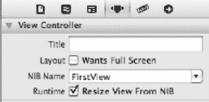

**图 6–16.** *标签栏控件的属性检查器*

注意标签栏按钮与其所选视图之间的关联关系。这是通过 `NIB Name` 属性指定的，该属性指向包含要加载视图的 NIB 文件——在本例中，第一个标签栏按钮显示来自 `FirstView.xib` 文件的视图。如果在项目中找到该文件并选中它，你会看到一个熟悉的视图，如图 6–17 所示。

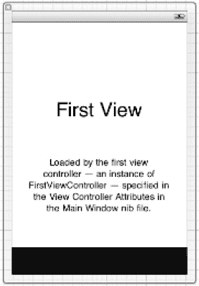

**图 6–17.** *与第一个标签栏按钮关联的 FirstView*

与每个标签关联的视图都会创建一个类及其关联文件（包括头文件和实现文件）。每个视图（`FirstView` 和 `SecondView`）都为你提供了编写自定义视图控制器代码的机会；你可以在默认行为和实现基础上进行构建，这些默认实现非常简单，除了你已见过的典型方法实现外，几乎不做其他事情。例如，它们会根据是否支持特定方向返回 `YES` 或 `NO`（默认情况下仅支持竖屏方向）。

但这展示了将不同标签栏项与不同视图和视图控制器关联的能力，并灵活地控制标签栏项的外观和行为。例如，你可以修改标签栏项：移除文本、向项目添加 Logo，并将 Logo 应用于标签栏项。图 6–18 展示了使用属性检查器选中标签栏项的示例。

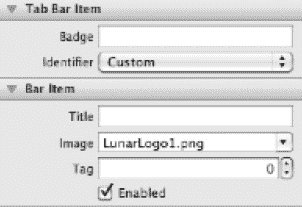

**图 6–18.** *使用标签栏项属性检查器添加 Logo*

如果将此机制应用于你的游戏，你可以使用一个标签显示主游戏视图（展示实际游戏），再使用另一个标签显示高分数视图。虽然《登月者》游戏通常会在每个游戏回合结束前使用模态视图，所以你不会采用这种方式——但理论上你可以这样做。现在你应该也明白了视图与关联视图控制器之间的关系，从而能够根据应用设计需求自定义它们或添加更多视图。

另一项有用的技术是：使用一个标签以不同视角显示同一组数据。例如，你的应用可以列出设备上的音频文件，并通过多个标签从不同视角展示视图：专辑标签、流派标签、曲目名称标签等。


### iPad 专用控制器概述

在结束视图控制器的讨论之前，我们先来重点了解一些 iOS SDK 中提供的、但专属于 iPad 设备的视图控制器。iPad 的外形尺寸与 iPhone 不同，它更大，并且在屏幕方向改变时的表现也略有差异。正因如此，人们创建了一些专门的视图控制器来充分利用 iPad 的外形优势；但本书的示例仅专注于 iPhone，因此对这些视图控制器的探索就留给拥有 iPad 设备的读者们了。

#### 弹出视图控制器

虽然弹出控制器严格来说并非视图控制器，但它确实提供了一种有用的机制，可以在应用程序窗口中显示额外内容。如果你正在 .NET 中寻找类似的功能，恐怕要失望了。目前 .NET 中并没有这样的功能，但你可以使用 .NET 代码，或者基于 Ajax 的源代码，创建自己对应的实现。你可以在 图 6–19 所示的 iPad 模拟器中看到一个示例。稍后我们会构建它；现在先来看看它的组成部分。

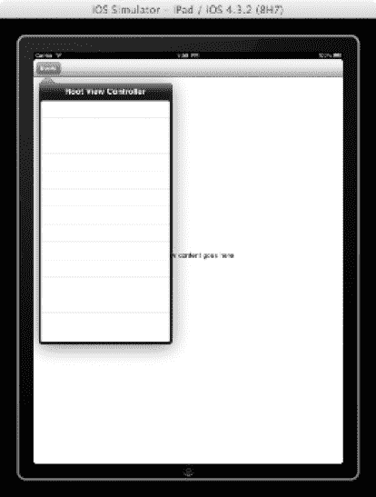

**图 6–19.** *iPad 弹出示例*

要实现一个弹出窗口，你需要使用 `UIPopoverController` 类，并且清楚地知道触发弹出窗口显示需要满足什么条件。毕竟，它本质上是对现有视图控制器的一个封装，然后在你应用程序之上显示一个浮动的视图。例如，你可能有一系列选项供用户选择，并且你希望在用户选择某个特定选项时，使用弹出窗口来显示其描述。此外，它还能很实用地显示一个箭头，将弹出窗口与其关联的项目连接起来——如果关联的是工具栏按钮，箭头就会指向该按钮本身。在做出这些基本决策后，你就可以开始实现弹出窗口了。

让我们创建一个简单的弹出窗口示例来演示这些概念。首先，使用 Xcode 4 为 iPad 设备创建一个基于视图的应用程序。创建完成后，你会像之前一样注意到，系统为主视图创建了一个视图控制器。为这个视图添加一个包含单个项目的工具栏，该工具栏项目将是触发弹出窗口的控件：通过 Interface Builder 编辑关联的 XIB 文件并添加工具栏对象来实现。你在 Xcode 中的屏幕应该类似于 图 6–20 所示。

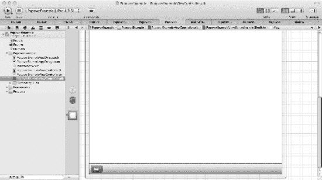

**图 6–20.** *你的示例 iPad 视图控制器，带有一个工具栏项目*

如果此时运行这个程序，你将得到一个相当单调的应用程序，底部只有一个工具栏项目。它之所以是空白，是因为在真实场景中，你更可能拥有多个工具栏项目，而且目前它背后还没有任何功能。现在我们来创建弹出窗口。弹出窗口需要一个视图控制器来管理数据如何显示；在这个例子中，我们提供以表格格式显示数据的机会，这对于弹出窗口来说非常典型。为你的项目添加一个文件（我将其命名为 `PopoverSelection`），确保它与 iPad 兼容，并且为其创建一个 XIB 文件。关键是，它还必须继承自显示数据所需的视图控制器。在本例中，弹出窗口显示表格数据，因此你使用 `UITableViewController` 作为子类。参见 图 6–21。

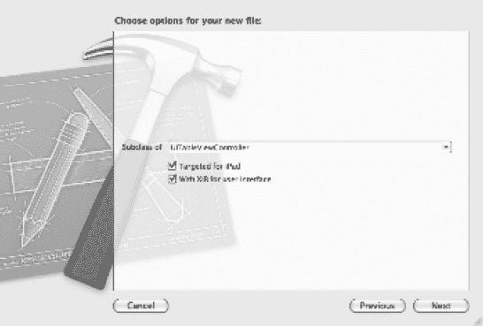

**图 6–21.** *使用表格视图基类创建弹出视图控制器类*

这会在你的项目中创建三个文件：`PopOverSelection.h`（头文件）、`PopOverSelection.m`（实现文件）以及 `PopOverSelection.xib`（视图文件）。如果你在 Interface Builder 中打开关联的 XIB 文件，它应该看起来像 图 6–22 所示。

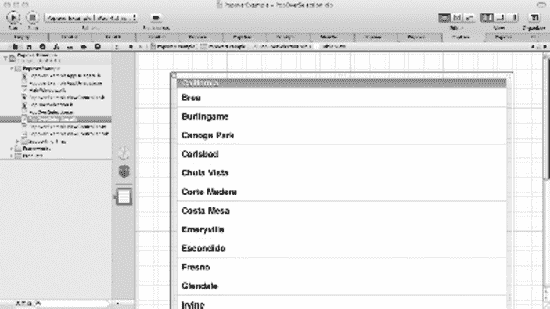

**图 6–22.** *你的表格形式弹出视图控制器*

你需要将这个类集成到你的代码中，因此必须定义相关的属性和操作，以便连接弹出控制器操作并展示弹出窗口。你可以在主视图控制器中完成这些操作，该控制器名为 `PopOverExampleViewController`。参见 代码清单 6-2。

**代码清单 6-2.** *`PopOverExampleViewController.h`*

```
#import <UIKit/UIKit.h>
#include "PopOverSelection.h"

@interface PopoverExampleViewController : UIViewController {
    UIPopoverController *popCtrl;
    PopOverSelection    *selection;
    IBOutlet UIBarButtonItem *bbitem;
}
```


```objectivec
@property (nonatomic, retain) UIBarButtonItem *bbitem;
@property (nonatomic, retain) UIPopoverController *popCtrl;
@property (nonatomic, retain) PopOverSelection *selection;

- (IBAction)togglePopOverController;

@end
```

如果分解来看，首先需要的是一个指向工具栏按钮项的指针。为此，你需要在类中定义一个与工具栏按钮项名称匹配的 `IBOutlet` 属性。使用标识检查器将其改为 `bbitem`：

```objectivec
IBOutlet UIBarButtonItem *bbitem;
```

接下来需要一个对应的 `@property` 语句（如下所示），当然，还需要在实现文件中编写 `@synthesize` 语句（稍后你将看到这些内容）：

```objectivec
@property (nonatomic, retain) UIBarButtonItem *bbitem;
```

通过属性暴露工具栏按钮后，你还需要定义一个操作，以便通过 Interface Builder 将按钮与该操作连接起来——该操作用于切换弹出框的显示或隐藏状态。这是一个简单的 `IBAction`，与你在前几章中使用过的类似，其定义如下：

```objectivec
-(IBAction)togglePopOverController;
```

最后，你需要一个指向弹出框视图控制器的属性，以及 `UIPopOverController` 单例类（该类提供了实现弹出框功能所需的 SDK 代码）。以下代码定义了这些成员变量。请注意，你需要引入 `PopOverSelection.h` 文件才能获取弹出框视图控制器：

```objectivec
UIPopoverController *popCtrl;
PopOverSelection    *selection;
```

当然，你还需要为这些变量编写相应的 `@property` 和 `@synthesize` 语句。

现在，你已经具备了将操作连接到工具栏按钮以调用弹出框选择的条件，同时也拥有了实现弹出框显示/隐藏所需的其他属性。首先，按照前几章的做法连接操作。使用 Interface Builder，在主视图控制器打开并显示工具栏按钮的情况下，为主文件所有者打开连接检查器。然后将 `togglePopOverController` 操作拖到工具栏按钮上，并将 `bbitem` 的 `IBOUTLET` 连接到同一按钮项。这样，你就可以引用该按钮并在其被点击时捕获该操作。你可以在图 6-23 中看到这些连接。

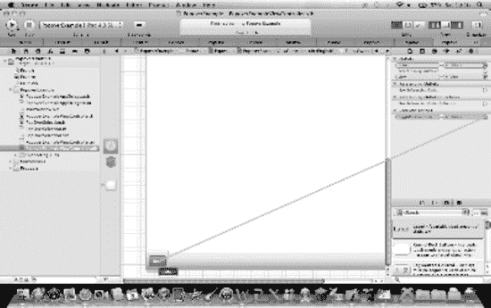

**图 6-23.** *将工具栏按钮项连接到代码中的操作*

剩下的唯一工作就是提供弹出框功能的实现代码。代码清单 6-3 展示了核心实现代码，随后我们将逐一讲解。

**代码清单 6-3.** *弹出框的核心实现代码*

```objectivec
#import "PopoverExampleViewController.h"

@implementation PopoverExampleViewController

@synthesize popCtrl;
@synthesize selection;
@synthesize bbitem;

- (void)dealloc
{
    [super dealloc];
}

- (void)didReceiveMemoryWarning
{
    // 如果视图没有父视图，则释放该视图。
    [super didReceiveMemoryWarning];

    // 释放任何未使用的缓存数据、图像等。
}

#pragma mark - 视图生命周期

// 实现 viewDidLoad 以在加载视图后执行额外设置，通常来自 nib 文件。
- (void)viewDidLoad
{
    selection = [[PopOverSelection alloc] init];
    popCtrl = [[UIPopoverController alloc] initWithContentViewController:selection];
    popCtrl.popoverContentSize = CGSizeMake(250, 300);

    [super viewDidLoad];
}

- (void)viewDidUnload
{
    [super viewDidUnload];

    // 释放主视图的任何保留子视图。
    // 例如 self.myOutlet = nil;
    [selection release];
    [popCtrl release];
}

- (BOOL)shouldAutorotateToInterfaceOrientation:(UIInterfaceOrientation)interfaceOrientation
{
    // 对于支持的旋转方向返回 YES
    return YES;
}

-(IBAction)togglePopOverController
{
    if ([popCtrl isPopoverVisible]) {
        [popCtrl dismissPopoverAnimated:YES];
    } else {
        [popCtrl presentPopoverFromBarButtonItem:bbitem permittedArrowDirections:UIPopoverArrowDirectionAny animated:YES];
    }
}

@end
```

现在我们来分析代码清单 6-3 的各部分。首先，你需要使用以下代码合成（synthesize）你的属性：

```objectivec
@synthesize popCtrl;
@synthesize selection;
@synthesize bbitem;
```

你还需要确保选择弹出框窗口的视图控制器（本例中为名为 `PopOverSelection` 的视图控制器类，其属性为 `selection`）和 `UIPopoverController` 类被分配并初始化。这需要在 `viewDidLoad` 事件中完成，如下所示：

```objectivec
// 实现 viewDidLoad 以在加载视图后执行额外设置，通常来自 nib 文件。
- (void)viewDidLoad
{
    selection = [[PopOverSelection alloc] init];
    popCtrl = [[UIPopoverController alloc] initWithContentViewController:selection];
    popCtrl.popoverContentSize = CGSizeMake(250, 300);

    [super viewDidLoad];
}
```

首先初始化窗口的视图控制器。然后，使用自定义视图控制器对象（`selection`）初始化 `UIPopoverController` 类实例，并将默认大小设置为 250 x 300 点。初始化已完成，所以别忘了释放资源；这需要在 `viewDidUnload` 方法中完成，做好清理工作：

```objectivec
[selection release];
[popCtrl release];
```

最后，正如人们所说，你触及了核心内容。与按钮点击操作关联的代码根据弹出框的状态切换其显示或隐藏。如果弹出框可见，你只需传递 `dismissPopoverAnimated` 消息；如果不可见，则使用 `presentPopoverFromBarButtonItem` 消息，将弹出框以及箭头显示的任何约束传递给按钮。非常简单：

```objectivec
if ([popCtrl isPopoverVisible]) {
    [popCtrl dismissPopoverAnimated:YES];
} else {
    [popCtrl presentPopoverFromBarButtonItem:bbitem permittedArrowDirections:UIPopoverArrowDirectionAny animated:YES];
}
```

如果你构建并运行这段代码，主窗口底部会显示工具栏。点击工具栏按钮会显示弹出框，再次点击则会隐藏该弹出框。这个弹出框现在已经可以用于展示你所需的数据。展示效果取决于你使用的视图控制器。在本例中，它使用了一个基于 `UITableViewController` 的表格视图（这是一个功能丰富的控件）。虽然本书不对此进行详细阐述，但 Apple Developer Program 在 iOS 开发者库中的“iOS 表格视图编程指南”中提供了全面的介绍（[`developer.apple.com/library/ios`](http://developer.apple.com/library/ios)）。如果你构建并运行该应用程序，弹出框将如图 6-24 所示。

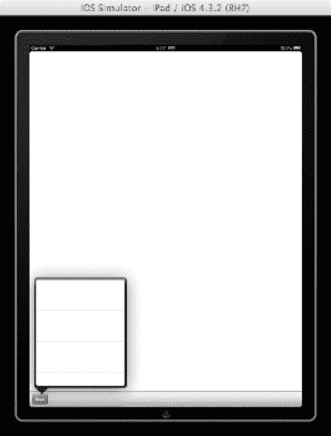

**图 6-24.** *iPad 模拟器运行应用程序，弹出框可见*


#### 分割视图控制器

`UISplitView`控制器允许两个窗格：左侧窗格（此处称为**索引**窗格）是固定的，右侧窗格（**详细**窗格）是可调整大小的。在竖屏模式下，只有详细窗格可见，索引窗格被替换为一个工具栏按钮，该按钮以弹出框的形式显示。在横屏模式下，你有更多空间，因此索引窗格和详细窗格会并排显示。你可以在图 6-25 中看到它们并排显示。

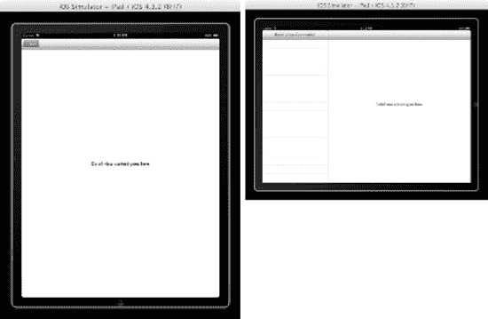

**图 6-25.** *管理 iPad 方向的分割视图控制器*

`UISplitViewController`类用于在单个视图控制器中管理两个视图，但它必须是您创建的任何界面的根。Xcode 中有一个基于分割视图的应用程序模板，这是一个很好的起点，我建议您在开始探索时使用它。您可以在图 6-26 中看到它在横屏模式下运行，两个窗格清晰可见。

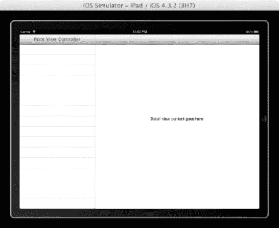

**图 6-26.** *iPad 分割视图控制器模板*

深入了解默认实现的底层机制，当应用程序启动完成后，您将`rootViewController`分配给您的`UISplitViewController`实例，这与其他任何视图控制器非常相似：

`self.window.rootViewController = self.splitViewController;`

现在，您可以在 Xcode 中使用分割视图控制器对象，并在 Interface Builder 中为其分配视图控制器和关联的 NIB 文件，或者您也可以通过编程方式实现。如果您使用 Xcode 模板检查分割视图示例，您可以看到 Interface Builder 被用来完成繁重的工作——创建一个作为表格视图控制器（呈现其数据列表）的左窗格，以及一个作为标准视图控制器的详细视图。

如果您要以编程方式实现这一点，您可以简单地创建两个您偏好的视图控制器，并将它们添加到`UISplitViewController`类的`viewControllers`数组属性中；第一个元素是索引，第二个是详细视图。因此，类似于以下的代码应该可以解决问题：

```
// 根据需要创建您的两个视图控制器，分别为它们命名为 firstVC 和第二 VC。
// firstVC 和 secondVC 将在此处创建

// 创建您的 SplitViewController 实例
UISplitViewController* splitVC = [[UISplitViewController alloc] init];
// 将您创建的视图控制器作为两个控制器的数组添加到 viewControllers 属性中。
splitVC.viewControllers = [NSArray arrayWithObjects:firstVC, secondVC, nil];
// 添加到 rootViewController 并使其可见。
self.window.rootViewController = splitVC;
[window makeKeyAndVisible];
```

在 Microsoft .NET 中，有多种方法可以实现与分割视图类似但不完全相同的功能，从 .NET 框架早期实现中引入的分割器控件，到最近的`SplitContainer`类（请参见[`http://msdn.microsoft.com/en-you/library/system.windows.forms.splitcontainer.aspx`](http://msdn.microsoft.com/en-you/library/system.windows.forms.splitcontainer.aspx)），在 WPF 中，其替代品称为`GridSplitter`。

iPad 特定的乐趣就到此为止。让我们看看您可以在用户界面中获得的其他乐趣。

## 用户界面控件

您已经详细介绍了视图和视图控制器，但仅触及了可用于构建应用程序用户界面的一些元素。作为 iOS SDK 的一部分提供的 UIKit 框架，为您提供了大量的 UI 元素供您在设计应用程序时使用。.NET 框架也是如此。您可能熟悉通常被称为**用户界面控件**的那些控件，它们可供您拖放到 Windows 窗体中，或作为其他 Microsoft 技术（如 ASP.NET 和 Windows Presentation Foundation）的一部分使用。本节介绍 Apple UI 元素，并在可用时提及它们对应的 Microsoft 控件。

### 控件

用户可以与之交互或向用户呈现信息的界面元素称为**控件**。与 .NET 框架一样，iOS 工具集提供了大量可在您的应用程序中使用的控件。对于每个控件，本节将简要概述其用途，并尽可能简要介绍其最佳使用时机。您还将介绍 .NET 框架中的类似控件。让我们从一些使用频率较低的控件开始，然后是那些具有直接 .NET 对应物的控件。

#### 活动和进度指示器

这些控件用于向用户指示特定任务正在进展中。它们通过显示旋转齿轮图标或进度条来提供任务正在进行的视觉反馈。

对于活动指示器，您使用`UIActivityIndicatorView`类，并在任务开始时调用`startAnimating`方法，在任务完成时调用`stopAnimating`方法。该控件的外观类似于图 6-27 所示。


**图 6-27.** *活动指示器*

iOS 工具集还提供了一个进度指示器，它与 .NET 中的 Windows Forms `ProgressBar` 类类似。iOS 版本如图 6-28 所示。

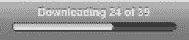

**图 6-28.** *进度条*

它通过`UIProgressView`类实现，正如您所期望的那样，随着进度的推进，进度条会开始填充。此控件通常用于任务有预定范围的情况：例如，下载 50 封电子邮件。如果您无法衡量进度，则应改用活动指示器。

#### 日期、时间和通用选择器

日期和时间选择器控件由`UIDatePicker`类实现，通过代表日期或时间每个元素的滑动轮盘，提供了一种触控友好的方式来选择特定的日期和/或时间。您可以在图 6-29 所示的控件上看到这一点。

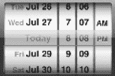

**图 6-29.** *日期和时间选择器*

当然，您可以提供一个允许用户输入值或从下拉框中选择的控件来呈现日期和时间，这是 .NET 框架期望您输入日期/时间的方式。然而，在 iPhone 上，为了充分利用基于触摸的界面，这提供了一种更直观的方法。在 iPad 上，此控件通常以弹出框的形式呈现。

尽管 .NET 中的`DateTimePicker`类提供了一个很好的替代方案，但没有行为完全相同的 .NET 等价物；它通常以日历格式呈现日期，显示月份，每个元素作为下拉框和/或直接输入。iOS 的`Picker`类使用了类似的方法，但通过一个单选轮盘向用户呈现一个自定义列表，用户可以从中进行选择。

#### 详细信息展开按钮

一个详细信息展开按钮，由`UITableViewCellAccessoryDetailDisclosureButton`实现，允许您在屏幕上指示一个感兴趣的项目。蓝色圆圈中的箭头表示有更多信息可用。点击它时，它会像超链接一样显示附加信息。此控件可能因其在您 iPhone 或 iPad 的“地图”应用中用作地图标注而为人熟知，如图 6-30 所示。

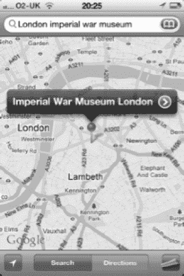

**图 6-30.** *详细信息展开按钮*

在 .NET 框架中没有等价物，但像往常一样，没有什么能阻止您自己编写一个（尽管这样做并非易事）。


### 信息按钮

信息按钮用于提供对应用程序配置屏幕的访问。它通过 `UIButton` 类实现，并使用 `buttonType` 属性将其标记为信息按钮，从而提供如图 6–31 所示的正确图像。


**图 6–31.** *信息按钮*

同样，.NET 框架中没有与之等效的控件，但你可以使用 `Button` 类和合适的图像实现类似的功能。

### 页面指示器

页面指示器由 `UIPageControl` 类实现，它提供了一种有用的视觉指示，显示在当前可用视图总数范围内哪个视图是打开的，如图 6–32 所示。

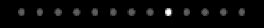

**图 6–32.** *页面指示器*

当你打开一个视图时，会添加一个圆点来表示该活动或已显示视图在序列中的位置。当圆点数量达到 20 个后，控件会截断多余的圆点，使其不再显示。（我认为，如果你需要显示这么多圆点，那就应该重新考虑你的用户界面设计了。）

.NET 中没有与此等效的控件。

### 搜索栏

搜索栏控件通过 `UISearchBar` 类实现，允许用户输入文本字符串，并通过点击放大镜图标来执行搜索。它还允许你使用书签图标呈现常用信息。请参见图 6–33。

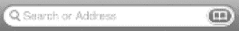

**图 6–33.** *搜索栏控件*

.NET 中没有直接等效的控件。

### 开关

开关控件通过 `UISwitch` 类实现，允许用户在互斥的选项（如开或关）之间进行选择。请参见图 6–34。

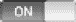

**图 6–34.** *开关控件*

.NET 中没有等效的控件，至少在视觉和感觉上是如此，尽管复选框执行相同的功能：它可以被选中（开）或取消选中（关）。

### 分段控件

分段控件通过 `UISegmentedControl` 类实现，提供了一种显示一组分段的方法，每个分段的行为都像一个按钮，并且可以显示对应的视图。示例如图 6–35 所示。


**图 6–35.** *分段控件*

分段控件提供了一种便捷的方式来分组相关按钮，并且每个按钮的表面可以显示文本或图像。这些按钮是互斥的，并且你可以拥有任意数量的分段，这使其与开关控件有所区别。

同样，.NET 中没有等效的控件，尽管在 .NET 中使用互斥的单选按钮提供了类似的功能。

### 常用控件

iOS UIKit 框架中有许多常用控件，它们都有直接的 .NET 等效控件。它们的用法和行为与 .NET 对应控件几乎相同，因此为简洁起见，此处不作详细描述。这些控件如表 6-2 所示。

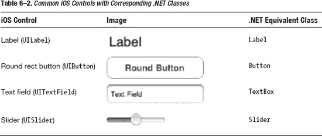

让我们看看 UIKit 中包含的其他用户界面元素。别忘了，你可以使用 Apple 开发者资源来探索 SDK 中 UIKit 框架里丰富的用户界面控件；并且，正如你从本节的示例中所见，将它们与 .NET 控件进行关联（如果存在关联）是相当直接的。

## 导航栏和信息栏

有一些用户界面元素通常不用于定义你的应用程序，而是用于向用户提供信息或管理你在应用程序中的导航方式。这些元素被称为*栏*，包括状态栏、工具栏、导航栏和标签栏——后者你在本章前面已经见过。

### 状态栏

状态栏用于向用户显示重要信息，并且无论设备方向如何，它始终出现在设备屏幕的顶部边缘。此外，虽然在 iPhone 上你可以对状态栏的颜色进行一些控制，但在 iPad 上其颜色固定为黑色。你可以在图 6–36 中看到 iPhone 的状态栏。


**图 6–36.** *状态栏*

你可以通过为 `UIApplication` 设置 `UIStatusBarStyle` 或使用 `Info.plist` 的值（`UIStatusBarHidden`）来隐藏状态栏，从而实现状态栏。Apple 开发者使用指南非常具体：如果你的应用程序是游戏或全屏应用，那么状态栏通常可以隐藏；否则，建议将其显示出来，特别是考虑到它占用的空间很小。

.NET 框架中的 `StatusBar` 类提供了类似的功能。

### 工具栏

工具栏由 `UIToolbar` 类实现，在大多数图形用户界面中都被广泛理解，其在 iOS 设备上的行为也不例外。它用于提供图形图像，点击这些图像时可在应用程序中执行操作。为了便于使用，通常会将常用操作放置在工具栏上。你可以在图 6–37 中看到一个工具栏。


**图 6–37.** *工具栏*

对于 iPhone 应用程序，工具栏位于屏幕底部边缘；对于 iPad 应用程序，则根据方向以及控件吸附到的边缘，工具栏位于屏幕的顶部或底部边缘。工具栏上的项目是上下文相关的，这意味着它们反映了通常针对关联视图执行的操作，因此在不同视图之间可能会发生变化。

.NET 框架中的 `Toolbar` 类提供了等效的功能。

### 导航栏

导航栏由 `UINavigationBar` 类实现，用于管理视图层次结构中的导航，并且通常与导航控制器关联。如图 6–38 所示。


**图 6–38.** *导航栏*

当你在 iOS 应用程序中处理不同的视图，或者标签栏不适用时，导航栏是很常见的。然而，尽管它们的用法相对简单，但这超出了本章的范围，iOS 开发者网站对此有很好的描述。因此，导航栏及其关联控制器的实现就留给你自己，并辅以 iOS 开发者网站：[`http://developer.apple.com/library/ios/#featuredarticles/ViewControllerPGforiPhoneOS/NavigationControllers/`](http://developer.apple.com/library/ios/#featuredarticles/ViewControllerPGforiPhoneOS/NavigationControllers/)。

.NET 框架中没有与导航栏等效的控件。

## 内容视图

iOS SDK 提供了许多用户界面元素，旨在向用户展示来自你应用程序的自定义内容。你已经看到了两种 iPad 特有的视图：分割视图和弹出视图，但 iPhone 上也有许多此类元素。

我们将逐一介绍它们；它们在 iPhone 应用程序中很常用，因为它们提供了有用的功能。


### 表格视图

表格视图元素通过 `UITableView` 类实现，顾名思义，用于以表格格式（行和列的信息）呈现数据。示例如 图 6-39 所示。

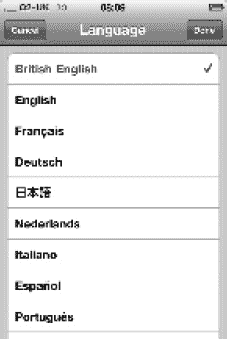

**图 6-39.** *表格视图*

表格视图控件具有高度可配置性，并在许多 iPhone 应用程序中广泛使用。例如，通讯录列表就是一个表格视图的实现，同样还有在选择设备国际设置时的语言选择屏幕。这些多样化的示例展示了该控件的灵活性。请记住表格视图，因为你将用它来显示你的《月球着陆器》游戏的高分表。

`DataView` 控件在绑定到数据源时，在 .NET 框架中提供了类似的功能。在 Windows Presentation Foundation 中，`DataView` 控件已被表格视图功能取代，该功能提供了与 iOS 表格视图元素类似的功能。

### 文本视图

文本视图控件通过 `UITextView` 类实现，用于在你的应用程序中呈现并允许输入多行文本。示例如 图 6-40 所示。

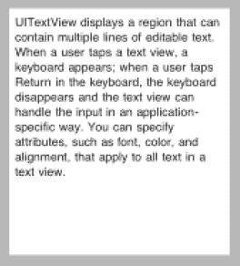

**图 6-40.** *文本视图*

在 .NET 框架中的等效控件是 `TextBox`。

### 网页视图

网页视图控件通过 `UIWebView` 类实现，允许你的应用程序显示丰富的 HTML 内容。不建议你创建一个行为类似于网页的 iOS 应用程序——那是 Safari 浏览器的用途——但如果需要在 iOS 应用程序中包装任何类型的网页，这就是要使用的控件。加载 [`www.bbc.co.uk`](http://www.bbc.co.uk) 主页的示例如 图 6-41 所示。

这个示例可以很容易地通过在 Xcode 4 中使用基于视图的模板，并添加一个网页视图控件及其关联属性来创建。然后，你只需将 代码清单 6-4 中的代码片段添加到加载主页的视图的 `viewDidLoad` 事件中，该事件使用 `loadRequest` WebView 消息。如你所见，网页视图控件充当了现有网页内容的包装器，在本例中是 BBC 的主页。

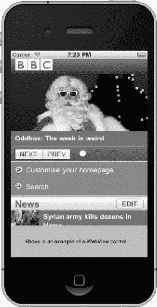

**图 6-41.** *显示 BBC 主页的网页视图示例*

**代码清单 6-4.** *网页视图示例*

```
// 在 WebView 中加载 WWW.BBC.CO.UK 主页
NSString *urlString = @"http://www.bbc.co.uk";
[wvBrowser loadRequest:[NSURLRequest requestWithURL:[NSURL URLWithString:urlString]]];
```

在 .NET 框架中的等效控件是 `WebBrowser` 类，使用 `Navigate()` 方法作为等效的 `loadRequest` 消息。

### 其他元素

尽管前几页介绍了相当多的 UI 元素，但仍有更多元素等待你去发现。然而，我不想忽略其他一些有用的 UI 元素，特别是警告框和操作表。

#### 警告框

警告框旨在为你的应用程序用户提供重要信息。调用时，警告框会在现有视图上弹出一个弹出窗口，只有关闭它才能继续使用你的应用程序。

在 .NET 中，它非常类似于 `MessageBox`，通过同名方法调用。在 iOS 中，你使用 `UIAlertView` 类来实现警告框，并显示简短的警告文本以及一两个按钮。

警告框通常用于通知用户发生了某些重要事件，这些事件可能与他们的近期操作无关。例如，如果你在应用程序中启动了一个后台任务然后去做别的事情，你可以使用警告框来通知任务完成。示例如 图 6-42 所示。

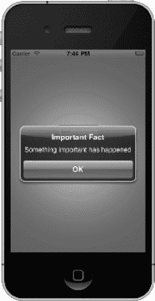

**图 6-42.** *警告框视图示例*

你可以使用 代码清单 6-5 中的代码片段轻松创建这个警告框视图示例。这些参数的含义不言自明。

**代码清单 6-5.** *警告框视图示例*

```
UIAlertView *alert = [[ UIAlertView alloc]
                      initWithTitle: @"重要事实"
                      message: @"发生了重要的事情"
                      delegate: nil
                      cancelButtonTitle :@"确定"
                      otherButtonTitles: nil];
[alert show];
[alert release];
```

#### 操作表

这里介绍的最后一个 UI 元素是操作表，通过 `UIActionSheet` 类实现，提供了一种根据特定用户操作呈现一组选项的机制。例如，Safari 浏览器提供一个操作按钮，选择后会根据当前显示的网页呈现多个选项——例如，你可以将其添加为书签、设为主屏幕等。这个包含多个选项的窗口称为*操作表*，如 图 6-43 所示。

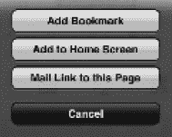

**图 6-43.** *操作表示例*

在 iPhone 上，操作表从屏幕底部出现，而在 iPad 上则显示为弹出窗口。在 .NET 中没有直接等效的控件，尽管你可以认为 `ContextMenu` 提供了类似的功能。

## Apple 的用户界面资源

Apple 提供了许多资源，这些资源在设计自己的用户界面时是必读的。以下列出其中一些：

*   *iOS 人机界面指南：* 提供设计卓越用户体验的指南和原则。 [`http://developer.apple.com/library/ios/#documentation/userexperience/conceptual/mobilehig/Introduction/Introduction.html`](http://developer.apple.com/library/ios/#documentation/userexperience/conceptual/mobilehig/Introduction/Introduction.html)
*   *iOS 视图控制器编程指南：* 提供有关构建和管理应用程序用户界面的指导。 `http://developer.apple.com/library/ios/#featuredarticles/ViewControllerPGforiPhoneOS/Introduction/Introduction.html`
*   *iOS 视图编程指南：* 提供有关呈现和动画化用户界面的指导。 [`http://developer.apple.com/library/ios/#documentation/WindowsViews/Conceptual/ViewPG_iPhoneOS/Introduction/Introduction.html`](http://developer.apple.com/library/ios/#documentation/WindowsViews/Conceptual/ViewPG_iPhoneOS/Introduction/Introduction.html)
*   *iOS 绘图和打印指南：* 提供有关绘制自定义内容和打印信息的指导。 [`http://developer.apple.com/library/ios/#documentation/iPhone/Conceptual/iPhoneOSProgrammingGuide/Introduction/Introduction.html`](http://developer.apple.com/library/ios/#documentation/iPhone/Conceptual/iPhoneOSProgrammingGuide/Introduction/Introduction.html)


好的，这是根据您的指示翻译的中文版本：


## 总结

本章首先从用户界面的角度审视了不同的设备类型及其功能。在设计用户界面时，您应始终清楚目标应用程序所面向的设备。

接着，您研究了不同的应用程序类型，特别是视图控制器和视图的可能组合。我们已经通过 Lunar Lander 示例查看了如何呈现单个视图，包括一个基于模态的视图，但还有许多其他选项可供选择。由于单个章节无法涵盖所有选项，因此我们查看了一个标签栏示例（这可能适用于您的游戏），然后是其他几种视图控制器类型。

在了解了不同的视图控制器以及管理不同视图呈现的机制后，我们审视了可用于设计实际视图的用户界面元素。在 Lunar Lander 游戏中，您需要实时绘制大量图形。但如果您曾使用 Windows Forms 甚至 ASP.NET 开发过 .NET 应用程序，那么使用 UI 控件设计用户界面的方式您应该不会陌生——而且其中一些 iOS 控件对您来说应该也很熟悉。本章提供了一些关于如何使用一些稍微特殊的控件的示例。

现在，您应该已经掌握了足够的知识来驾驭视图控制器、视图和用户界面控件，并将您的 .NET 知识映射到 iOS 对应的部分。本章多次强调了在构建 iOS 移动设备应用程序时用户体验的重要性，而且毫不意外的是，Apple 提供了大量资源，您可以利用这些资源来巩固目前已建立的知识体系，帮助理解本章中的示例，并为您的自主探索提供参考。祝您愉快！

