# 第 7 章：获取数据：存储和检索数据以及配置您的应用程序

到目前为止，我们已经涵盖了许多主题，所有这些主题都旨在介绍如何使用 iOS SDK 以及支持的语言和工具，创建在基于 iOS 的移动设备上运行的应用程序。然而，虽然我们已经逐步演示了如何构建一个应用程序，但有一个关键部分始终缺失：应用程序保持所谓*状态*的能力。

状态可以被视为相当于人类的记忆。如果我们没有记忆，那么完成最简单的任务也需要我们每次都重新发现如何去做。因为我们确实拥有记忆，并且能够记住如何执行特定操作，所以再次执行它会更容易、更快捷，甚至可以说更有趣——滑雪就是一个很好的例子。

计算机拥有易失性存储器（RAM）形式的记忆，当您关闭计算机时，其中的内容就会丢失，移动设备也不例外。但是，如果您希望在应用程序实例之间持久化状态——也就是说，希望应用程序记住它上次运行到哪里——您需要将状态存储在其他地方，例如硬盘上。

在本章中，我们将探讨如何将信息作为数据存储在您的移动设备或其他来源上，以及如何使用这些数据来配置您的应用程序。具体来说，我们将研究以下内容：

-   数据存储方案的概述
-   关于如何存储信息的指导
-   关于如何检索信息的指导
-   如何在应用程序实例之间使用数据来配置应用程序

## 我们有哪些数据存储方案？

您可能希望存储各种类型的数据，例如应用程序用户输入的动态数据，或者用户无法影响但可能希望在配置上有一定灵活性的参数化数据（有点像 Microsoft Windows 中的注册表）。以下方案可用于存储数据：

-   文件系统存储
-   属性列表
-   网络存储
-   数据库存储

让我们依次看看这些方案。

### 使用沙盒提供基于文件系统的存储

在第 4 章中，我们提到了应用程序沙盒的概念。回想一下，它的主要目的之一是为您的应用程序和设备提供安全机制。让我们简要地重新审视一下沙盒，重点关注它如何帮助您存储数据。

当您的应用程序安装在移动设备上时，默认情况下，它会创建一些文件夹，这些文件夹对其使用方式有约束。Apple 开发者文档对这些文件夹提供了一些指导，在您开始使用任何这些文件夹之前，了解这些指导非常重要。这些文件夹、它们的主要用途以及相关说明列于表 7-1 中。

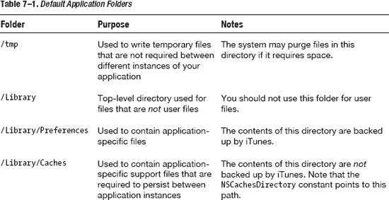


即使在使用模拟器时，您也可以看到这些文件夹。使用 Finder，您可以导航到模拟器上存在的此文件夹，方法是转到 `\Library\Application Support\iPhone Simulator\4.3.2`（或您正在使用的模拟器版本），然后查看 `Applications` 文件夹。您会看到我们第 4 章中提到的带有应用程序 ID 的文件夹，其结构如表 7-1 所示。

**注意：** 文件夹名称可能会根据您的应用程序指定使用的内容而改变。此外，不同的 SDK 会有自己的文件夹根目录。

您可以使用表 7-1 中列出的文件夹来存储应用程序的持久数据（或状态），尽管您需要考虑到所强调的那些约束。由于它是文件系统，您需要将数据存储在一个或多个文件中，并且您的应用程序必须能够解释这些文件。

尽管添加一个简单的文件作为数据存储似乎是最简单的方法，但从文件中存储和检索所需数据的工作实际上可能会使应用程序的数据处理代码比需要的更复杂。因此，在决定为所有应用程序的数据存储需求使用简单文件之前，值得先检查一下其他方案。例如，如果您对数据存储和检索的需求不那么简单，并且需要多个文件，那么您可能需要研究使用本章后面讨论的嵌入式数据库方法。


## 管理应用程序中的数据

首要难题是，你需要在应用程序自身内部存储数据。虽然可以使用大量独立变量，但这并不优雅，并且在读写存储数据时会导致代码非常混乱。幸运的是，iOS SDK 与 .NET Framework 类似，提供了简化此任务的机制。毕竟，在应用程序中处理数据是常见需求，因此大多数现代编程语言和框架都对其提供了支持。有几种机制可用于在应用程序内部存储数据。

第 4 章介绍了序列化和反序列化的概念。iOS SDK（以及 .NET Framework）提供了对象可序列化的能力。这意味着对象的结构及其内部持有的数据或状态信息，可以被持久化（或写入）到存储介质中，这种存储介质能在应用程序终止和移动设备关机后依然存在。当应用程序重新启动时，你可以从该存储介质中将数据反序列化回对象实例，该实例将拥有与序列化时完全相同的结构和数据，从而实现了状态的持久化。

在 Objective-C 中，可以序列化任何对象，将其转换为一系列可以写入存储的字节。然而，Objective-C 还提供了所谓的*集合类*，这些类允许你存储多个对象，然后序列化整个集合——这样做也能序列化集合中的所有数据。

在 .NET 中，具体来说在 C# 中，你可以将对象标记为 `[serializable]`，这意味着它可以在 .NET 中被转换为二进制、简单对象访问协议 (SOAP) 或 XML。.NET Framework 将数据的表示与其传输机制分开，例如通过在 .NET 中为你的类添加 `[serializable()]` 属性，并确保你的类派生自 `ISerializable` 类。然后，你可以使用适当的方法将类写入目标位置。这可能是一个使用 `System.IO` 命名空间的文件，或者你可能使用 `System.Runtime.Serialization.Formatters.Binary` 等格式化器写入二进制流。

Objective-C 中默认的可序列化对象如表 7-2 所示，并附有注释。

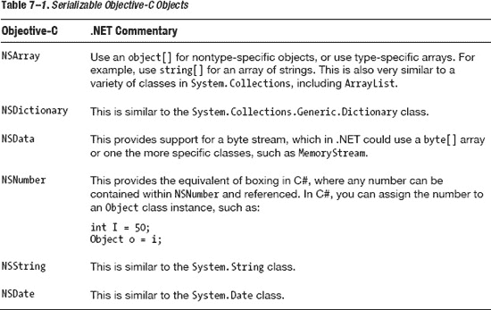

为了使其更具体，让我们看一个实际示例，该示例允许我们使用这些类型之一来创建一个用于保存数据的值数组，然后我们将此数组序列化为属性列表。

首先，让我们使用 `NSMutableMutable` 类设置一个动态数组：

```
NSMutableArray *highscores = [[NSMutableArray alloc] init];
// 最高分 1
[highscores addObject:@"Mark"];
[highscores addObject:@"200"];
// 最高分 2
[highscores addObject:@"Rachel"];
[highscores addObject:@"300"];
// .. 可以继续添加其他数据
```

至此，我们可以将其写入到我们选择的持久化存储中（正如我们接下来要做的），然后使用以下命令释放该数组：

```
  [highscores release];
```

## 使用属性列表作为存储

在本书前面部分，我们提到了 iOS 中的属性列表，以及它们在文件系统中以 `.plist` 扩展名文件的形式存在，称为 *plist 文件*。属性列表提供了一种持久化应用程序数据的方法。在 Objective-C 中，`NSArray` 和 `NSDictionary` 集合类提供了一种将内容序列化为 plist 文件的方法。这些集合类还提供了一种简单的机制来从 plist 文件中存储和检索值。

使用我们刚刚设置的 `NSMutableArray`（实际上，任何可序列化的集合都可以），我们可以使用 `writeToFile` 方法将此字符串序列化为 plist 文件，以便后续读取和解释。只需使用文件的目标路径执行该方法，如下例所示：

```
[myArray writeToFile:@”/some/file/location/output.plist” atomically:YES];
```

如果你在应用程序中执行包含这段代码的片段，然后检查生成的文件，你会发现它看起来像这样：

```
<?xml version="1.0" encoding="UTF-8"?>
<!DOCTYPE plist PUBLIC "-//Apple//DTD PLIST 1.0//EN" "httpfhighscor://www.apple.com/DTDs/PropertyList-1.0.dtd">
<plist version="1.0">
<array>
        <string>Mark</string>
        <string>200</string>
        <string>Rachel</string>
        <string>300</string>
</array>
</plist>
```

请注意，它是作为 XML 文件序列化的，符合属性列表模式，并使用字符串。

然后，可以使用 `initWithContentsOfFile` 方法将此文件读取回数组以供操作或使用。以下代码将我们刚刚创建的文件反序列化为一个包含相同值的新 `NSMutableArray`：

```
NSMutableArray *highscores = [[NSMutableArray alloc] initWithContentsOfFile: @"/some/file/location/output.plist"];
```

## 使用互联网存储数据

对于持久化数据，我们已经研究了属性列表以及使用部分可序列化 Objective-C 类型所提供的方法。但是，如果你想以某种形式使用互联网来序列化数据，该怎么办？如果你想将这些信息存储在某种中心位置，而不是本地设备上，又该怎么办？

第一个也是最明显的解决方案仍然是使用属性列表方法，只是文件的路径是一个位于某种内部存储（比如众多数字存储平台之一，如 Dropbox 和 DigitalVault）上文件的完整 URL。

但还有另一种替代方案。`NSMutableArray` 等可序列化集合有一个名为 `writeToURL` 的方法，该方法不接收 `NSString` 参数，而是接收 `NSUrl` 参数。然而，如果写入文件时你的参数是 `file://` 引用，那么这些方法的行为实际上没有区别。因此，下面的代码：

```
[myArray writeToURL: @"file://www.mamone.org/highscore.plist" atomically:YES];
```

与下面的代码完全相同：

```
NSURL *url = [NSURL URLWithString:@"http://www.mamone.org/highscore.plist"];
[myArray writeToURL:url atomically:YES];
```


### 使用 iOS 嵌入式数据库

我们之前的示例虽然完全适用，但仅限于使用可序列化为本地或网络文件系统的对象来创建数据。您可能希望采用更全面的机制来持久化数据，特别是当您希望操作数据而无需在代码中进行复杂的文件或对象操作时——使用简单的基于文件系统的存储机制来存储数据会带来这种副作用。在这种情况下，您可以使用 iPhone 的嵌入式数据库，名为 `SQLite`。

`SQLite` 是一个嵌入式关系型数据库管理系统（RDBMS），在许多方面与您可能熟悉的更传统的基于服务器的数据库（如 Oracle 和 Microsoft SQL Server）相似，您都可以使用结构化查询语言（SQL）来访问和操作数据库中保存的数据。但是，它不需要您运行任何应用程序。您只需在应用程序中使用提供的 API 代码来调用作为 iOS 一部分提供的 `SQLite` 功能。

让我们看看如何在移动 iOS 设备上使用 `SQLite` 功能来访问数据库功能。

**注意：** 如果您不熟悉 SQL 语言，有很多关于此主题的资源可供参考。例如，请参阅 *Beginning SQL Server 2008 for Developers* 以及 Apress 出版的其他书籍。

在开始之前，您需要通过对支持库代码的库进行引用来为应用程序添加对 `SQLite` 的支持，然后包含相关的头文件。因此，首先使用项目摘要的 Build Phases 标签页，选择“+”按钮，将名为 `libsqlite3.dylib` 的库添加到项目中。对话框应该类似于图 7-1 所示。

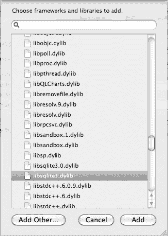

**图 7-1.** *将 SQLite 库添加到项目的构建阶段*

然后，您需要在包含 SQLite 代码的源代码文件中通过下面的 `#import` 指令来包含对支持头文件的引用：

`#import "/usr/include/sqlite3.h"`

#### iOS SDK 有哪些选项？

使用 SQLite API 并不是访问 iOS 设备数据库的唯一选择。`Core Data` 是一个框架，它被描述为“模式驱动的对象图管理和持久化框架”，这可能会让人感到困惑。这实际上意味着 `Core Data` API 不仅管理数据的存储位置、存储方式以及如何为性能目的管理这些数据，还允许开发者在无需 SQL 的条件下创建和使用关系型数据库。它允许您用 Objective-C 与 `SQLite` 进行交互，而无需担心连接或管理数据库模式。对于 ADO.NET 开发者来说，这些特性中的大部分类似于抽象了数据库访问的 .NET Framework。

但是，我们不会在本章同时涵盖 `SQLite` 和 `Core Data`。我的目标是通一个使用 SQLite API 的工作示例，带您了解其原理。这将为您应用这些知识打下良好的基础，无论您选择哪种方法：`SQLite` 还是 `Core Data`。

我建议您利用在线资源探索 `Core Data`，特别是位于 [`http://developer.apple.com/library/mac/#documentation/Cocoa/Conceptual/CoreData/cdProgrammingGuide.html`](http://developer.apple.com/library/mac/#documentation/Cocoa/Conceptual/CoreData/cdProgrammingGuide.html) 的 *Core Data 编程指南*。

#### 创建或打开您的数据库

`SQLite` 是用可移植的 C 语言编写的，而不是 Objective-C。因此，我们需要用 C 语言编写代码，并在必要时进行类型之间的转换。

让我们首先使用 `sqlite_open()` 方法打开数据库，并使用提供的常量来检查成功（`SQLITE_OK`），如果失败则记录错误。以下代码实现了这一点：

```
    sqlite3 *db;
    int result = sqlite3_open("/documents/file", &db);
    if (result == SQLITE_OK)
    {

    } else NSLog(@"Failed to open database");
```

在这个例子中，如果数据库存在，它将被打开；如果不存在，它将被创建。

**注意：** `sqlite_open()` 方法需要一个 UTF-* 字符串作为参数——即一个 8 位编码的字符串。这与 `NSString` 不同，但您可以使用 `UTF8String` 方法将 `NSString` 转换为 UTF-8 字符串。

请注意，在尝试打开数据库时（尤其是当它不位于您本地机器上时），您几乎肯定会遇到数据库连接超时的问题。这通常是由于访问非本地资源时的延迟（或时延）造成的，尤其是在通过互联网连接时。因此，您应该始终拦截所有错误消息并适当处理它们。例如，如果请求超时，您可能需要重试。

#### 在数据库中创建表

打开数据库并准备好使用后，下一步是创建一个表来存储数据。SQL 命令 `CREATE TABLE` 可以与可选条件一起使用，仅在表不存在时创建它。以下代码执行 `CREATE TABLE` 命令，并创建一个名为 `NAME` 和 `SCORE` 的两列的表，两者的类型都是 `text`。

```
       char *errMsg;
       const char *sql = "CREATE TABLE IF NOT EXISTS HIGHSCORE (NAME TEXT, SCORE TEXT)";
       if (sqlite3_exec(db, sql, NULL, NULL, &errMsg) == SQLITE_OK)
       {
         // code to write here
       } else NSLog(@"Failed to create table");
```

现在表将被创建（如果它之前不存在的话），我们就可以开始用数组中的数据来填充它了。


## 向数据库写入数据

向数据库写入数据时，你有两种选择：

- 通过字符串构造一条 `INSERT` SQL 语句，并遍历你创建的数组。
- 将变量绑定到 SQL 语句，该语句中的每个参数都用 `?` 符号代替。这种方法还有一个额外优势，即能确保你插入的数据与表中预期的数据格式相匹配。

因此，首先我们需要遍历数组，提取其中存储的值。在我们的示例中，只需使用循环和一个从 0（第一个元素）开始的整数索引，在索引小于数组总项数（由 `count` 属性决定）时持续进行即可。

```
int count = [highscore count];
int idx = 0;
while (idx < count)
{
        // 遍历数组，递增 idx
}
```

通过扩展这段代码来循环遍历数组、访问其元素，并利用 SQL 绑定功能将 `?` 参数指示符替换为数组中的值，然后完成语句，即可将行写入数据库。以下是扩展后的代码：

```
sqlite3 *db;
int result = sqlite3_open("/documents/file", &db);
if (result == SQLITE_OK)
{
    int count=[highscore count];
    int idx = 0;
    char *insert_sql = "INSERT INTO HIGHSCORE VALUES(?, ?);";
    sqlite3_stmt *stmt;
    while (idx < count)
    {
        // 准备语句以便绑定
        if (sqlite3_prepare_v2(db, insert_sql, -1, &stmt, nil) == SQLITE_OK) {
            // 绑定姓名
            sqlite3_bind_text(stmt, 1, [[highscore objectAtIndex: idx++] UTF8String],
-1, NULL);   // 姓名
            // 绑定分数
            sqlite3_bind_text(stmt, 2, [[highscore objectAtIndex: idx++] UTF8String],
-1, NULL);   // 分数
            // 执行并完成写入
            sqlite3_step(stmt);
            sqlite3_finalize(stmt);
        }
    }
} else NSLog(@"打开数据库失败");
```

在这个示例中，我们使用 `sqlite3_prepare()` 语句准备了带参数的 SQL 语句。然后在循环内部，使用 `sqlite3_bind_text()` 方法绑定变量的值——在这里，就是将数组索引绑定到 SQL 语句中由其索引位置（从 0 开始）引用的参数上。

每完成一对数组条目的绑定后，我们通过执行语句完成写入，将行写入数据库。我们继续循环，直到处理完所有数组条目。

## 从数据库读取数据

为了检查我们的代码是否正常工作，现在可以使用一条简单的 SQL `SELECT` 语句来回读我们刚刚写入数据库的行。为简单起见，我们将使用 `NSLog()` 方法将数据写入 Xcode 中的调试输出视图。

与上一个示例类似，我们需要准备一条 SQL 语句并执行它，使用 `sqlite3_step()` 方法遍历所有行，直到没有更多数据，并使用 `NSLog()` 方法输出每一行的数据。具体如下例所示：

```
// 从表中读取数据
sqlite3_stmt *readstmt;
const char *readSQL = "SELECT NAME, SCORE FROM HIGHSCORE";
sqlite3_prepare_v2(db, readSQL, -1, &readstmt, NULL);
while (sqlite3_step(readstmt) == SQLITE_ROW)
{
        NSString *name = [[NSString alloc] initWithUTF8String:(const char
*)sqlite3_column_text(readstmt,0)];
        NSString *score = [[NSString alloc] initWithUTF8String:(const char
*)sqlite3_column_text(readstmt,1)];
        NSLog (@"姓名: %@ 分数: %@", name, score );
}
```

如果你执行完整的代码并在 Xcode 应用程序的调试窗口中检查输出，它应该类似于以下内容（排除与运行应用程序相关的所有其他调试输出）：

```
2011-08-15 22:19:05.251 DataStorage[953:207] 姓名: Mark 分数: 200
2011-08-15 22:19:05.253 DataStorage[953:207] 姓名: Rachel 分数: 300
```

这个示例应该让你对如何使用嵌入式数据库有了更深入的了解，这是一种将数据持久化到表示为本地文件的数据库中的更全面的方法。

### 连接到其他数据库

我们已经探索了 iOS 中嵌入式数据库 SQLite 的使用，但如果你有另一个不同的数据库并且它位于远程呢？例如，如果你想从你的设备访问远程的 MySQL 或 Microsoft SQL Server 数据库，该怎么办？你有以下几种选择：

- 你可以为你的数据库使用第三方客户端。例如，Flipper（可在 [`http://www.driventree.com/flipper`](http://www.driventree.com/flipper) 找到）是一个适用于 iPhone 的 MySQL 客户端，允许你连接到 MySQL 数据库。
- 如果你有 Microsoft SQL Server 数据库，你可能想通过使用与数据库无关的 API（例如开放数据库连接（ODBC）驱动程序）来访问它。
- 你可以通过寻找类似的本地客户端 API 来访问数据库，或者从 SQL Server 暴露一个服务层，并通过基于 HTTP 的 XML 风格 API（如 SOAP）进行访问。

## 创建高分示例

到目前为止，我们已经研究了使用多种不同技术来持久化应用程序数据的方法。现在让我们探索如何在我们示例应用程序（即从 `第 5 章` 开始的《月球着陆器》游戏）中应用这些知识。像我们这样的游戏中一个突出的需求是，需要将分数持久化到高分表中，为玩家提供另一个竞争维度。因此，我们将运用数据持久化知识，创建一个内部的高分结构，该结构可在开始屏幕上显示，并在应用实例之间保持持久性。


### 创建持久化高分记录类

我们的高分功能相当直接了当。它将保存五条记录，每条记录包含获得高分者的姓名和对应的分数。我们可以像之前的示例那样，使用标准的 Objective-C 对象类型（例如 `NSString`）。这样做的好处是能够写入 plist 文件，但会增加解析文件的复杂性。因此，我们将使用一个继承自 `NSObject` 的自定义对象来存储实际的高分记录。

为了以 Objective-C 为基础进行构建，让我们创建一个包含单个高分记录的类，并通过属性来引用其值。随后，这个类将被包含在一个 `NSMutableArray` 中，我们将利用该数组通过 SQL Server 将本地高分数据写入本地设备。然而，当尝试将该对象序列化为 plist 文件时，这会产生一个问题，因为 `writeToFile` 方法不支持序列化自定义对象。在本示例中，我们将探讨如何解决此问题。

首先，让我们创建一个名为 `HighScoreEntry` 的高分记录类。代码清单 7-1 显示了头文件的代码。

**代码清单 7-1.** *HighScoreEntry 类头文件*

```
// HighScoreEntry class
//
@interface HighScoreEntry : NSObject {
    NSString * name;
    int score;
}
-(id)initWithParameters:(NSString*)aName:(int)Score;
@property (readwrite, retain) NSString* name;
@property (readwrite) int score;

@end
```

**注意：** 请记住，属性的 `readwrite` 属性意味着您既能访问该属性的值，也能设置该属性的值。此外，`retain` 确保了强引用的创建，这意味着作为资源，它在您明确释放之前不会被释放。

这段代码非常直接，根据我们已讲解过的材料，它应该是熟悉的。该代码只是实现了一个包含字符串和整数的类，类成员名称分别为 `name` 和 `score`。我们拥有两个同名的属性来引用这些类成员变量，并且实现了一个初始化方法，该方法接受两个参数（类型分别为 `NSString` 和 `int`），用于初始化该类。代码清单 7-2 显示了其实现的源代码。

**代码清单 7–2.** *HighScoreEntry 类实现*

```
// HighScoreEntry class
//
@implementation HighScoreEntry

-(id)initWithParameters:(NSString*)aName:(int)aScore
{
    self = [super init];
    if (self)
    {
        name = [aName copy];
        score = aScore;
    }
    return self;
}

@synthesize name;
@synthesize score;

@end
```

同样，这段代码非常直接。我们的实现提供了 `initWithParameters` 方法，用于使用传入的值初始化类成员变量，当然，我们还合成了这两个属性。

现在，让我们来看看实际的集合类。我们将其称为 `HighScore` 类。同样，我们从头文件的源代码开始，如代码清单 7-3 所示。

**代码清单 7–3.** *HighScore 类头文件*

```
// HighScore class
//
@interface HighScore : NSObject {
    NSMutableArray *scores;
}
-(void)addHighScoreEntry:(HighScoreEntry *)score;
-(void)persist;
@end
```

该类包含一个用于存放成绩的成员变量，变量名与类名相同，并使用 `NSMutableArray` 类型以提供灵活性。我们还声明了两个类方法：一个用于将高分记录添加到列表，名为 `addHighScoreEntry`；另一个用于将高分记录持久化保存到存储中——在本例中，是一个本地数据库。该类的实现稍微复杂一些，如代码清单 7-4 所示。

**代码清单 7–4.** *HighScore 类实现*

```
// HighScore class
//
@implementation HighScore
-(void)addHighScoreEntry:(HighScoreEntry *)score
{
    if (scores == nil)
        scores = [[NSMutableArray alloc] init];

    [scores addObject:(score)];
}

-(void)persist
{
    // Open our database
    sqlite3 *db;
    int result = sqlite3_open("mydb.sqlite3", &db);
    if (result == SQLITE_OK)
    {
        // CREATE TABLE
        char *errMsg;
        const char *sql = "CREATE TABLE IF NOT EXISTS HIGHSCORE (NAME TEXT, SCORE INTEGER)";
        if (sqlite3_exec(db, sql, NULL, NULL, &errMsg) == SQLITE_OK)
        {
            // WRITE ARRAY TO TABLE
            int idx = 0;
            char *insert_sql = "INSERT INTO HIGHSCORE VALUES(?, ?);";
            sqlite3_stmt *stmt;
            while (idx < [scores count])
            {
                // Prepare our statement for binding
                if (sqlite3_prepare_v2(db, insert_sql, -1, &stmt, nil) == SQLITE_OK) {
                    // Get entry
                    HighScoreEntry *hse = [scores objectAtIndex:(idx)];

                    // Bind the name
                    sqlite3_bind_text(stmt, 1, [hse.name UTF8String], -1, NULL);   // NAME
                    // Bind the score
                    sqlite3_bind_int(stmt, 2, hse.score);   // SCORE
                    // Step and finalize the write
                    sqlite3_step(stmt);
                    sqlite3_finalize(stmt);
                    // Next item
                    idx++;
                }
            }
            // READ FROM TABLE
            sqlite3_stmt *readstmt;
            const char *readSQL = "SELECT NAME, SCORE FROM HIGHSCORE ORDER BY SCORE";
            sqlite3_prepare_v2(db, readSQL, -1, &readstmt, NULL);
            while (sqlite3_step(readstmt) == SQLITE_ROW)
            {
                NSString *name = [[NSString alloc] initWithUTF8String:(const char *)sqlite3_column_text(readstmt,0)];
                NSString *score = [[NSString alloc] initWithUTF8String:(const char *)sqlite3_column_text(readstmt,1)];
                NSLog (@"NAME: %@ SCORE: %@", name, score );

            }
        } else NSLog(@"Failed to create table");

    } else NSLog(@"Failed to open database");
}
@end
```

首先，我们来考虑一下 `addHighScoreEntry` 方法，它应该不言自明。如果 `scores` 数组为空，我们就创建它。然后，我们通过数组的 `addObject` 方法将传入的对象添加到数组中。

`persist` 方法虽然冗长，但同样应该熟悉。我们之前已经逐行讲解过代码。不过，我还是会指出一些关键区别：

* **使用整型存储分数**：在我们的表中，现在使用整型而非字符串来存储实际的分值。
* **计算数组的 count**：在循环遍历数组时，我们使用 `NSMutableArray` 的 `count` 属性来返回数组中对象的数量，当达到最大值时，我们退出循环。
* **提取对象**：我们通过索引从类中提取高分记录对象，然后就可以利用所提供的属性（特别是 `name` 和 `score`）来引用该对象的值。
* **绑定**：我们将姓名作为文本，分数作为整数，绑定到 SQL 语句中的参数。这与我们之前的示例几乎完全相同，只是我们改用 `sqlite3_bind_int` 方法来处理整数。
* **数组遍历**：在循环遍历数组成员时，必须记得增加索引，该索引不仅用于选择列表中的下一个对象，还用于判断是否退出循环。


另请注意，相同的代码用于重新读取数据并输出到日志文件，在 Xcode 4 中，这个日志文件就是调试窗口。显然，实际实现中并不需要这部分代码，保留它仅用于测试目的。为清晰起见，以下是执行此操作的代码：

```c
// READ FROM TABLE
sqlite3_stmt *readstmt;
const char *readSQL = "SELECT NAME, SCORE FROM HIGHSCORE";
sqlite3_prepare_v2(db, readSQL, -1, &readstmt, NULL);
while (sqlite3_step(readstmt) == SQLITE_ROW)
{
        NSString *name = [[NSString alloc] initWithUTF8String:(const char
*)sqlite3_column_text(readstmt,0)];
        NSString *score = [[NSString alloc] initWithUTF8String:(const char
*)sqlite3_column_text(readstmt,1)];
NSLog (@"NAME: %@ SCORE: %@", name, score );
}
```

### 测试高分榜类

我们的类看起来是不是很可爱？好吧，至少比保存一串需要解析的字符串要好。现在让我们看看它是否有效。

代码清单 7-5 中的代码代表了一个测试框架，用于执行我们的高分榜代码并检查其效果。将这段代码放在项目中的位置完全由你决定，但通常你会在游戏初始化时看到类似的内容——例如，如果表中不存在默认高分，则预加载它们。

**代码清单 7-5.** *高分榜代码的测试框架*

```c
// Initialize our high score
HighScore *hs = [[HighScore alloc]init];
// Create 5 default entries
HighScoreEntry *e1 = [[HighScoreEntry alloc]initWithParameters:@"Mark":900];
    [hs addHighScoreEntry:(e1)];

HighScoreEntry *e2 = [[HighScoreEntry alloc]initWithParameters:@"Rachel":700];
    [hs addHighScoreEntry:(e2)];

HighScoreEntry *e3 = [[HighScoreEntry alloc]initWithParameters:@"Oliver":500];
    [hs addHighScoreEntry:(e3)];

HighScoreEntry *e4 = [[HighScoreEntry alloc]initWithParameters:@"Harry":300];
    [hs addHighScoreEntry:(e4)];

HighScoreEntry *e5 = [[HighScoreEntry alloc]initWithParameters:@"Tanya":100];
    [hs addHighScoreEntry:(e5)];

// Persist our initial high score to the database
[hs persist];
```

如果你在持久化数据后使用重新读取数据的调试代码来执行代码清单 7-5 中的代码，你应该会看到类似如下的调试输出：

```
2011-08-17 19:59:37.237 DataStorage[676:207] NAME: Mark SCORE: 900
2011-08-17 19:59:37.237 DataStorage[676:207] NAME: Rachel SCORE: 700
2011-08-17 19:59:37.238 DataStorage[676:207] NAME: Oliver SCORE: 500
2011-08-17 19:59:37.238 DataStorage[676:207] NAME: Harry SCORE: 300
2011-08-17 19:59:37.239 DataStorage[676:207] NAME: Tanya SCORE: 100
```

在你的游戏中，你会用一个具有适当可见性的类来持有高分榜的实例变量，并且仅当表不存在时才会使用默认值对其进行初始化。当应用程序终止时，你也需要在合适的时机释放高分榜类变量。

但是，如果应用程序不是第一次运行，该如何读取高分榜数据呢？这需要做一些修改。首先，在持久化数据时，我们需要清空表的内容，以便表准备好接收新数据。只需在创建表（如果需要创建的话）之后、开始写入任何内容之前添加以下代码，即可轻松完成此操作：

```c
// DELETE from the table
const char *sqldelete = "DELETE FROM HIGHSCORE";
sqlite3_exec(db, sqldelete, NULL, NULL, &errMsg);
```

我们还可以使用之前编写的读取表并将数据转储到日志文件的代码，来帮助我们实现一个从表中读取数据以初始化高分榜的方法。我们将这个方法命名为 `readHighScores`，其实现如代码清单 7-6 所示。

**代码清单 7-6.** *从表中读取高分榜数据*

```c
#import "MainViewController.h"
#import "HighScore.h"

// readHighScores method
-(void)readHighScores
{
    // Open our database
    sqlite3 *db;
    int result = sqlite3_open("mydb.sqlite3", &db);
    if (result == SQLITE_OK)
    {
        // We've opened the database, so let's clear our array
        [scores removeAllObjects];

        // READ FROM TABLE
        sqlite3_stmt *readstmt;
        const char *readSQL = "SELECT NAME, SCORE FROM HIGHSCORE";
        sqlite3_prepare_v2(db, readSQL, -1, &readstmt, NULL);
        while (sqlite3_step(readstmt) == SQLITE_ROW)
        {
            NSString *name = [[NSString alloc] initWithUTF8String:(const char
 *)sqlite3_column_text(readstmt,0)];
            int score = (const int)sqlite3_column_int(readstmt,1);
            HighScoreEntry *e = [[HighScoreEntry alloc]initWithParameters:name:score];
            [self addHighScoreEntry:(e)];
            [e release];
        }
    } else NSLog(@"Failed to open database");
}
```

这段代码应该很容易理解，因为它大量使用了我们之前用过的代码。我们使用 `SELECT` 语句从表中读取数据，并在数据行仍然存在时循环遍历数据。在此过程中，我们提取数据——这里是名称（作为文本，转换为 UTF-8 以符合 `NSString` 类）和分数（作为整数）。然后，我们将这些数据作为参数来创建一个 `HighScoreEntry` 类实例，将其添加到高分榜数组中，然后释放。

### 完成类

我们的类几乎完成了，现在可以用默认高分榜表格进行初始化。我们可以使用 SQLite 将这些数据持久化到 iOS 移动设备的本地数据库中，并且可以重新读取这些数据以显示在排行榜上。高分榜的呈现方式留给你自己决定，但你可以考虑使用`表视图`，我们将在第 10 章中提及这一点，因为届时我们将研究令人印象深刻的用户界面转换。

目前，没有任何限制来约束高分榜条目的数量。这是有意为之的，因为你可以自行决定一个合适的限制数量，并利用到目前为止学到的知识，创建一个在添加高分榜条目时实施该约束的方法。此外，你还需要对高分榜进行排序，通常是按分数排序，假设分数越高越好，则将最高分排在最前面。

由于本章的重点是持久化而非数组排序，我们不会详细讨论完整的实现。但为了帮助你入门，我将提供一些关于如何进行排序的指引。

首先，要排序一个包含自定义对象（即继承自 `NSObject` 的类）的 `NSMutableArray`，你需要使用 `sortArrayUsingSelector` 方法。该方法执行排序，但要求你提供一个参数，即用作比较器的方法，称为 *选择器（selector）*。

接下来，你需要实现自己的比较器，该比较器能够理解数组中的对象。在我们的例子中，我们会比较 `score` 成员变量，并将最高分排在最前面。下面展示了这样一个方法的开头部分，供你试验并完成。

```c
(NSComparisonResult)compare(HighScoreEntry* otherObject
{
  return ( // DO YOUR COMPARISON HERE between self and otherObject)
}
```


### 将序列化示例与 .NET 进行比较

在本章中，我们了解了使用 Objective-C 和 iOS SDK 进行基本数据持久化的选项，甚至还了解了 .NET 的一些持久化属性。但此示例与 .NET 实现相比如何呢？

实际上，使用自定义类来存储高分名称和分数在 .NET 中依然可行。我们会使用非常相似的机制（仅语法不同），将名称存储为 `String`，将分数存储为 `int`。我们甚至可以沿用相同的方法名称和思路。

`NSMutableArray` 可以在 .NET 中实现为 `ArrayList`，允许你使用方法 `Insert()` 或 `Remove()` 项目。它还有一个 `Sort()` 方法，类似于我们的 `sortArrayUsingSelector` 方法，该方法接受一个比较器作为参数。

最后，序列化可以使用与我们示例类似的方法来完成：遍历条目并写入某个持久化存储，例如使用 ODBC 驱动程序或类似数据库 API 的数据库。或者，如果你想写入文件，可以使用 `XMLSerializer` 类，通过 `StreamWriter` 对类进行序列化。考虑以下 列表 7-7 中的 C# 示例，该示例假设我们有一个 `HighScoreClass`，其行为与我们的示例相同，但还在我们想要序列化的那些成员周围定义了 `[Serializable()]` 属性。

**列表 7-7.** *在 C# 中序列化一个类*

```
// 创建我们的高分记录类（注意，此代码不会编译，因为我们为了简洁省略了其定义）
HighScoreClass hs = new HighScoreClass()
// 使用高分记录类的类型创建一个新的 XmlSerializer 实例
XmlSerializer so = new XmlSerializer(typeof(HighScoreClass));

// 创建一个新的文件流，用于写入序列化后的对象
TextWriter WriteFileStream = new StreamWriter(@"C:\output.xml");
so.Serialize(WriteFileStream, hs);

// 清理资源
WriteFileStream.Close();
```

列表 7-7 中的示例与我们之前使用 Objective-C 的 `plist` 示例非常相似，它都将类的内容序列化到 XML 文件中。这是在 .NET 框架中对类进行序列化最常用的方法。在 .NET 中，使用嵌入式 SQL 语句对数据库执行操作也非常相似。

## 总结

在本章中，我们探讨了将数据持久化到移动设备易失性内存之外的其他存储方式的选项；也就是说，当设备关机或应用程序关闭时，内存及其所有相关数据都会丢失。

我们研究了将数据持久化到文件、数据库和互联网的技术。我们还探讨了 iOS 为此提供的功能，例如应用程序沙盒。接着，我们了解了语言和 SDK 对存储数据以及将其写入不同存储类型（包括 `plist` 文件和嵌入式数据库）的支持。

最后，我们通过实现几个简单的类来测试相关理论，为我们的 Lunar Lander 游戏提供了一个可持久化存储的高分表支持。现在，在应用程序的不同运行实例之间，我们可以保留一个最高分列表，从而增加游戏的竞争乐趣。

## 第 8 章

## 扩展你的应用程序：使用库扩展你的 iOS 应用

扩展应用程序功能使其超越 iOS 本身及 iOS SDK 所提供的能力，这在大多数操作系统中都相当常见。Microsoft Windows 操作系统在设计之初就具备了通过提供静态链接库和动态链接库来扩展其功能的能力。这并不仅限于 Windows 操作系统。Unix、Linux 以及许多其他操作系统也提供相同的功能，而苹果的 iOS 也不例外。

基于第 3 章中讨论的关于使用其他选项的一些示例，本章提供了一些关于如何构建你自己的库以及如何使用其他库来补充 iOS 操作系统的指导。具体来说，我们将讨论以下内容：

*   库的工作原理概述以及不同类型的库
*   iOS 如何使用库
*   如何在你的应用程序中使用库
*   第三方库及其优势

## 库概述

首先，我们将提供一些背景信息，介绍不同类型的库、它们的用途以及它们在 iOS 环境下的工作方式。我们将讨论什么是库、存在哪些类型，以及为什么你可能会使用一种类型而不是另一种——或者两者兼用！

### 什么是库？

*库*是一组例程和变量，它们可以存在于本地或远程，用于实现一组预定义的功能——至少从计算机科学的角度是这样理解的（以防你想到的是去图书馆读书）。这些例程和变量通过代码实现，与所使用的编程语言无关。引用它们的方式以及它们的使用方式可能有所不同，而这正是区分不同类型库的关键所在。

### 存在哪些类型的库？

库的类型基本上可以分为以下几类，无论它们是本地的还是远程的：

*   静态库
*   动态库

我们依次来看看它们。

### 静态库

*静态库*是保存在单个文件中的一组例程和变量，并在你的代码中被引用。一个关联的头文件提供了方法签名，有时也提供变量。在编译时，你的库被引用，这使得实现所需功能的代码能够被包含在你的可执行文件中。这通常由一个称为*链接器*的程序处理，因此它们有时被称为*静态链接库*。

在 iOS 设备上，静态库的扩展名为 `.a`。在 Windows 上，扩展名通常是 `.lib`。

### 动态库

顾名思义，*动态库*的工作方式是动态的。库仍然通过头文件来引用，但它不会在编译时被包含到可执行文件中；而是在运行时被引用。这意味着库在首次使用时（或在此之前）被加载，以解析调用并执行所引用的功能。

在 iOS 上，动态库的扩展名为 `.dynlib`。在 Windows 上，它们的扩展名为 `.dll`。

使用动态库具有额外的优势，可以使你的可执行文件更小，并允许更高效地共享通用功能。然而，这确实也引入了一些弊端，其中一些问题在早期给 Microsoft Windows 带来了很大的麻烦。这些问题与具有相同方法但实现方式不同的不同库的版本控制有关。在 Windows 中，这被称为 *DLL 地狱*。

虽然 iPhone 和 iPad 完全能够生成和使用动态库，但苹果开发者协议明确禁止使用除系统或官方 SDK 提供的动态库之外的任何动态库。这就是为什么嵌入式 SQLite 库被支持的原因。但是，如果你试图创建自己的动态库并将你的应用程序提交到 App Store，它将被拒绝。

苹果为什么要这样做？多年来，这一直是争议的源头。事实上，开发者协议最近才更新，列出了关于解释代码的一些限制，但它仍然相当严格，我强烈建议你仔细阅读。本章稍后我们将更多地讨论苹果开发者协议。目前，要么使用系统提供的动态库，要么坚持使用静态库，特别是如果你希望你的应用程序在提交到 App Store 后获得批准。


#### iOS 库与.NET 等效库的比较

在继续创建自己的库并利用第三方选项之前，我们先来看看一些常见的 iOS 库。与大多数 SDK 一样，iOS SDK 在其安装包中提供了多个库，这并不令人意外。我不会列举所有的 iOS 库，因为你很快会发现 iOS 框架是一套库，包含相关的头文件和配套文档。相反，我将重点介绍几个作为 iOS SDK 的一部分提供、但并未作为 iOS 框架发布的特别有用的库。表 8-1 列出了这些库，并附有简要说明，以及与.NET 库的对比评论。

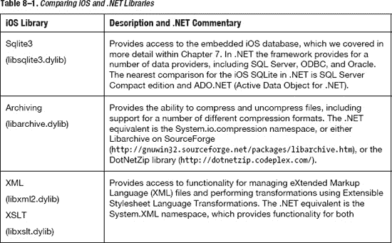

可用的库远不止表 8-1 中列出的这些，但结合 iOS 框架和表中列出的库，你应该已经具备了大部分所需的功能。此外，你始终可以选择使用第三方库或自定义库来进一步扩展应用程序的功能。

## 创建你自己的静态库

你可以为 iOS 创建自己的静态库。在本节中，我们将介绍如何使用 Xcode 4 创建静态库，然后探讨如何在.NET 中创建类似的库（即程序集）。

### 使用 Xcode 4 创建静态库

Xcode 4 使得创建你自己的静态库变得非常容易。首先，从"Framework & Library" iOS 类别中选择"Cocoa Touch Static Library"模板，如图 8-1 所示，然后点击"Next"。

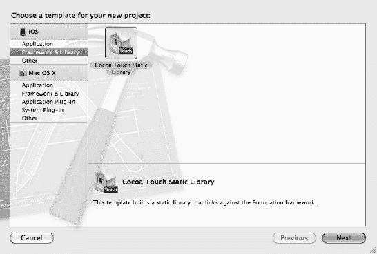

**图 8-1.** *选择静态库模板*

在接下来的屏幕上，为你的项目选择产品名称，如图 8-2 所示。此时，你可能希望在文件名中引入版本号，以帮助管理同一库的不同版本；或者，你可以更聪明地开始使用 Xcode 的快照功能和源代码控制（参见[`http://developer.apple.com/library/mac/#documentation/ToolsLanguages/Conceptual/Xcode4UserGuide/SCM/SCM.html`](http://developer.apple.com/library/mac/#documentation/ToolsLanguages/Conceptual/Xcode4UserGuide/SCM/SCM.html)）。确定文件名后，再次点击"Next"按钮。

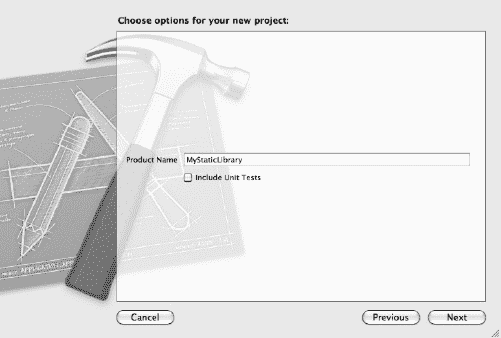

**图 8-2.** *选择你的静态库的产品名称*

最后，选择项目的位置（参见图 8-3），然后点击"Create"。

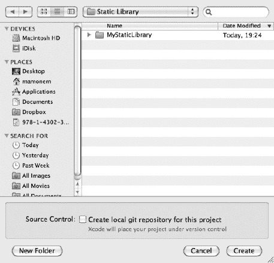

**图 8-3.** *选择你的项目位置*

这将创建你的项目结构，与我们之前构建的其他项目类似，只是预定义文件的数量减少了。这是因为功能需要由你自行定义。该框架将简单地创建一个以`Products`结构中定义的名称命名的空静态库——在此示例中为`MyStaticLibrary.a`。

现在我们需要向库中添加一些功能。你可以继续为库创建类和常量。但为了简化示例，我们只需添加在第 7 章中创建的支持高分功能的文件，来构建我们的静态库。

在 Xcode 中，选择`File`  `Add Files`，然后导航到存储高分源代码的位置。在我们的示例中，头代码位于名为`HighScore.h`的文件中，实现代码位于`HighScore.m`中。

选中这两个文件，并勾选"Copy items into destination group's folder (if needed)"复选框，如图 8-4 所示。然后点击"Add"按钮。

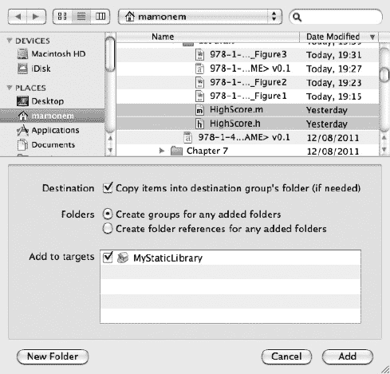

**图 8-4.** *向静态库项目添加文件*

这将把文件添加到你的静态库中，并创建一个包含此功能的静态库。要找到生成的库（假设你没有更改默认的目标路径），你可以在`Products`文件夹下选择该库，然后选择`File`  `Show in Finder`。Xcode 默认将其放置在`/Library/Developer/Xcode/DerivedData`文件夹中，然后根据项目存放在该文件夹下的子文件夹中，如图 8-5 所示。

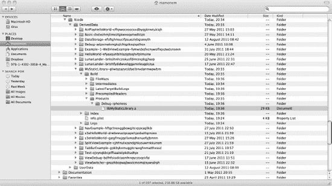

**图 8-5.** *定位你的静态库*

**注意：** 在我们的示例中，你会注意到文件夹名称是`Debug-iphoneos`。这是特意设计的，以强调在构建静态库时，它默认针对 iPhone 操作系统，该操作系统使用基于 ARM 的 CPU。你需要确保更改你的构建设置，使其编译为适用于 iPhone 模拟器的主题；否则，由于模拟器运行在 i386 CPU 上，将无法编译。如果设置正确，你会发现目录会变为`Debug-iphonesimulator`，你应该从这个位置引用你的静态库。

让我们通过创建一个非常简单的应用程序来测试该库。在测试中，我创建了一个实用工具应用程序。创建测试应用程序后，在"Build Phases"选项卡中选择顶层的项目条目，如图 8-6 所示。

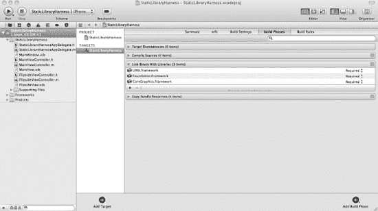

**图 8-6.** *配置项目的构建阶段*


```markdown
在展开的“Link Binary with Libraries”选项下，你会注意到默认已引用了三个库：`UIKit.framework`、`Foundation.framework`和`CoreGraphic.framework`。点击“+”图标将显示一个对话框，允许你选择其他库。如图 8-7 所示，你可以从默认的 iOS SDK 列表中选择，或点击“Add Other”。

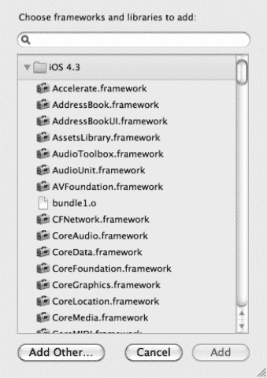

**图 8-7.** 向构建阶段添加库

选择“Add Other”，你将看到一个对话框，允许你导航到要包含的库的位置。如图 8-8 所示，导航到之前静态库项目构建的库。

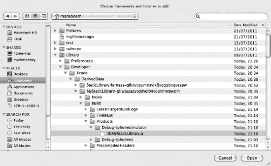

**图 8-8.** 选择要添加的库

选择该库并点击“Open”。这将把该库添加到与应用构建链接的库列表中，如图 8-9 所示。

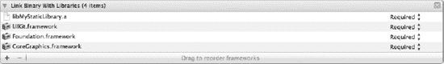

**图 8-9.** 链接到项目构建的库列表

现在，我们可以完成项目以测试我们的库。首先，将`HighScore.h`头文件添加到你的项目中。接下来，我们可以添加一些测试代码。为此，复制我们在前一个示例中使用的代码，并将其放置在主视图控制器的`viewDidLoad`事件方法中（位于`MainViewController.m`中）。这意味着当应用启动且视图加载时，测试代码将执行。你需要取消注释事件代码，并确保它看起来与列表 8-1 中所示类似。

**列表 8-1.** 测试代码

```
// Implement viewDidLoad to do additional setup after loading the view, typically from a nib.
- (void)viewDidLoad
{
    [super viewDidLoad];
    HighScore *hs = [[HighScore alloc]init];

    HighScoreEntry *e1 = [[HighScoreEntry alloc]initWithParameters:@"Mark":900];
    [hs addHighScoreEntry:(e1)];

    HighScoreEntry *e2 = [[HighScoreEntry alloc]initWithParameters:@"Rachel":700];
    [hs addHighScoreEntry:(e2)];

    HighScoreEntry *e3 = [[HighScoreEntry alloc]initWithParameters:@"Oliver":500];
    [hs addHighScoreEntry:(e3)];

    HighScoreEntry *e4 = [[HighScoreEntry alloc]initWithParameters:@"Harry":300];
    [hs addHighScoreEntry:(e4)];

    HighScoreEntry *e5 = [[HighScoreEntry alloc]initWithParameters:@"Tanya": ];
    [hs addHighScoreEntry:(e5)];

    [hs persist];

    [hs readHighScores];

    [hs release];
}
```

别忘了为数据库支持添加对`libsqlite3.dylib`的引用，然后构建并执行你的应用。你应该在调试窗口中看到与之前相同的输出，因为我们没有移除这段测试代码。输出应与以下内容类似：

```
2011-08-18 21:29:39.639 StaticLibraryHarness[1034:207] NAME: Mark SCORE: 900
2011-08-18 21:29:39.641 StaticLibraryHarness[1034:207] NAME: Rachel SCORE: 700
2011-08-18 21:29:39.641 StaticLibraryHarness[1034:207] NAME: Oliver SCORE: 500
2011-08-18 21:29:39.642 StaticLibraryHarness[1034:207] NAME: Harry SCORE: 300
```

现在，你已经创建了第一个静态库，并从另一个应用引用了它。如果你的静态库包含某些“必备”功能，那么只需分发该库和头文件即可供其他人使用。第三方库制造商正是使用这种机制来共享和部署他们的库，通常通过配置文件（provisioning profile）进行。

### 在.NET 中创建程序集

在.NET 中创建程序集很简单，并且与 Xcode 4 中展示的方法类似。你可以直接创建一个空白的 Visual Studio C#解决方案，并添加定义类及其功能的库代码，代码位于给定的命名空间中，如下所示：

```
Using System;
Using System.Text;
Using System.Windows.Forms;
Namespace TestLibrary
{
        public static class Test
{
        public static void TestMethod()
        {
                MessageBox.Show("You are in my library");
        }
}
}
```

构建这个简单的示例将生成一个`.dll`文件，这是一个动态库，你可以在另一个项目中引用它，然后从`Test`类的实例调用`TestMethod()`。确保在你的项目引用中引用了该库。

注意，这是一个私有程序集，类似于静态库，与你的应用链接。如果你希望它在多个程序之间共享（存储在.NET 环境的全局程序集缓存中），则需要做一些额外的工作，使其成为一个强名称程序集。这将允许它进行版本控制和身份验证。我们不会在此详述，但这里有一个提示：请查看名为`sn.exe`的命令行实用工具。

### Apple 开发者协议

当你注册并支付订阅费用成为 Apple 开发者计划的一员时，你将获得一份 Apple 开发者协议。该文档描述了 Apple 允许你在使用其工具和技术时的行为。该文档受保密协议（NDA）保护，这意味着你在加入之前不允许了解其内容，加入后也不允许分享其内容！然而，通过信息自由法案请求，已有副本泄露到互联网上。

关于库的更广泛使用，该协议在较为宽松的形式下（于 2010 年生效）在第 3.3 节（应用的程序要求）中定义了某些条件，描述了编写应用时需要考虑的一些限制。这些条件如下：

-   使用 iOS SDK 制作的应用只能通过 App Store 分发，这实质上意味着像 Cydia 这样的黑市应用分发网络违反了协议。
-   不允许逆向工程，也不允许使他人能够进行逆向工程。
-   Apple 可以随时撤销你的应用在 App Store 中的成员资格，即使应用已经获得批准。
-   你只能按规定方式使用文档化的 API。不得调用任何私有 API。

**注意：** 直到 2010 年晚些时候，这里总结的要求才生效。此前，Apple 对支持的语言有具体规定，这意味着像 MonoTouch 这样的第三方框架存在不合规的风险。

如果你不遵守这些限制，将违反协议，Apple 可能会拒绝任何提交到 App Store 的应用。但只要生成的软件不下载任何代码且符合 API 使用规范，就应该是允许的。

我们将在第 9 章中进一步讨论 Apple 开发者协议，该章节涉及部署。

## 第三方库

我们已经确认 Apple 最终清醒过来并解除了之前的限制，这意味着第三方库得到了更广泛的支持。我们还了解了存在哪些类型的库，以及如何根据 Apple 开发者协议使用它们。

在第 3 章中，我们研究了用于编写应用的第三方解决方案。这些第三方框架附带了一系列提供所需功能的库，因此它们总是一个选择。但如果你想要一个更小、更具体的库来提供扩展应用的功能呢？那么，你会很高兴听到它们确实存在。实际上，利用你学到的关于编写库的知识，你甚至可以发布自己的第三方库并从中获利。

首先，我们将介绍第三方库的两个类别，然后回顾一些目前可用的更有用的库。
```


### 第三方库的分类

第三方库通常分为两大类：商业库和开源库。

顾名思义，*商业库*是指由某个组织拥有，并对使用方式施加限制，通常需要付费才能获取和使用（或两者兼需）的库。例如，在 .NET 世界中，开发者通常会购买以程序集形式扩展 .NET 库功能的组件，用于绘制精美图形或压缩文件。苹果平台也是如此，许多商业公司销售用于 iOS 平台的库。但请务必检查与这些库相关的许可协议，以及它们使用此类许可证的合规性。

*开源库*是指使用受到一定限制的库，例如在 GNU 通用公共许可证（GPL）下，但使用是免费的。

不过，苹果确实有开发者协议，你的库必须符合该协议。苹果仍保留拒绝或撤销 App Store 中任何应用程序的权利。再次重申，这并未赢得社区的青睐，但从 App Store 的情况来看，这显然并没有阻止人们使用库（无论是免费还是其他形式）来编写应用程序。

### 有用的第三方库

我们已经讨论了编写自己的库，并考虑了互联网上可能遇到的不同类型的库。接下来让我们看一些现有的第三方库示例，并提供简要介绍以及访问它们的互联网网址。

**注意：** 我不对使用这些库提供任何推荐或暗示性保证。如果你选择使用它们，这是你个人的选择，我无法保证它们的功能、性能，也无法保证它们能被苹果接受进入 App Store。

*   **ZBar – 条形码阅读器：** 可在 [`http://zbar.sourceforge.net/iphone/index.html`](http://zbar.sourceforge.net/iphone/index.html) 找到。它既是一个库，也是一个示例应用（可从 App Store 获取），使你能编写软件，利用 iPhone 摄像头读取各种不同的条形码，甚至可以将其链接到亚马逊等商店或谷歌等搜索引擎。
*   **GData – Google 数据接口：** 可在 [`http://code.google.com/p/gdata-objectivec-client/`](http://code.google.com/p/gdata-objectivec-client/) 找到。它提供了一个基于 Objective-C 静态库的 API，允许访问各种 Google 服务，并让你能够读取和写入数据。例如，它支持 Google Analytics、Google Books、Blogger 和 Google Docs。
*   **Three20 – Facebook API：** 可在 [`http://three20.info/`](http://three20.info/) 找到。虽然它被称为 Facebook API，但这并不完全准确。然而，它被 Facebook 应用和其他许多应用用于提供强大的视图控制器、图片浏览器和网络感知表格。
*   **iPhone Analyzer：** 可在 [`http://sourceforge.net/projects/iphoneanalyzer/`](http://sourceforge.net/projects/iphoneanalyzer/) 找到。它允许你非常详细地分析 iPhone 设备的内容，包括 plist 文件、数据库以及设备的内部文件结构。但请注意，目前它不支持 iOS 4。
*   **Leaves：** 可在 [`https://github.com/brow/leaves`](https://github.com/brow/leaves) 找到。这是一个适用于 iPhone 和 iPad 的库，提供类似 iBooks 的翻页功能。
*   **Core-plot：** 可在 [`http://code.google.com/p/core-plot/`](http://code.google.com/p/core-plot/) 找到。它提供了一个绘图框架，用于在 iOS 和 Mac OS X 平台上进行数据的二维可视化。

## 在其他地方寻找库

虽然我重点介绍了一些第三方库，但在常见的代码仓库中还存在更多，不仅限于基于 iPhone 或 iPad 的库和源代码，也支持其他平台，如 Mac OS X、Windows 和 Linux。这里有两个流行的网站：

*   **SourceForge：** 这是一个用于共享免费开源软件的代码库。它支持许多不同的平台，包括 iPhone 和 iPad 等移动 iOS 设备。网址为 [`http://sourceforge.net/`](http://sourceforge.net/)。
*   **Github：** 使用 Git 代码仓库，GitHub 是众多库的家园，包括许多有用的基于 iOS 的移动库。网址为 [`https://github.com/`](https://github.com/)。

## 总结

在本章中，我们探讨了库的概念，包括 iOS 提供的库、第三方库以及你自己的创作。我们研究了不同类型的库及其与 .NET Framework 的相似之处，以及如何创建你自己的静态库，以便在你的应用程序中使用或进行分发。

接着介绍了不同类型的第三方库，并提供了一些库的示例，以及用于 iOS 设备的库和源代码的流行仓库。显然我们没有列出所有可用的库。数量太多，无法一一列举，而且数量还在与日俱增。不过，这些介绍应该能帮助你探索和发现适合你需求的库。

如果你想编写自己的库，可以通过互联网与他人分享。然而，根据苹果开发者协议，请务必注意应用于你为移动设备编写的任何应用程序的限制，并在向 App Store 提交应用程序时，意识到苹果所拥有的权限。

