# 发布：测试、部署和分发你的应用程序

到目前为止的章节，从介绍设备、软件开发工具包、语言和工具开始，一直到关于如何编写你第一个基于 iOS 移动设备应用的一系列章节。这些知识最终会让你拥有一个应用程序，甚至是一个库，你需要按照通常的顺序对其进行测试、部署和发布。在本章中，你将使用 Xcode 4 和 iOS 模拟器的功能来彻底测试你的应用程序。你还会在真实设备上进行测试，然后学习如何通过 App Store 部署和发布你的应用程序。具体来说，你将了解以下内容：

*   介绍你可用的测试功能。
*   Xcode 4 和 iOS 模拟器测试能力概述。
*   如何部署你的应用程序。
*   准备发布你的应用程序。
*   通过 App Store 发布。

## 可用的测试功能

有许多工具和技术可用于测试你的应用程序，其中一些具有非常高级的功能。在宏观层面上，你通常会结合使用离散的基于单元测试以及更广泛的系统级测试（既在虚拟设备上（模拟器），也在物理设备上（真实设备）），以确保你的应用程序能够正常工作。我们将逐一介绍它们。

### 单元测试

在创建你的示例项目和源代码文件时，你可能已经注意到一个标有“包含单元测试”的复选框。在创建名为 `Calculator` 的简单基于工具的应用时，图 9–1 中显示了一个示例。

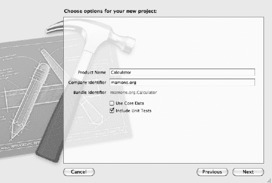

**图 9–1.** *创建带单元测试的项目*

项目创建完成后，你会注意到一个（除通常创建的那些文件夹之外的）文件夹，其格式为 `<项目名称 Tests>`。在这个例子中，该文件夹名为 `CalculatorTests`；浏览此文件夹会显示同名的一个头文件和一个实现文件，供你实现单元测试。

#### 定义你的测试方法

作为经验丰富的 .NET 专业人士，你对单元测试的概念应该很熟悉。然而，Xcode 如何实现这一点对你来说可能比较陌生，其他测试概念，如集成测试甚至测试驱动开发，对你来说也可能是新的。在了解 Xcode 的支持之前，让我们简要地浏览一下这些术语。


### 单元测试

为了确保基本理解，我们先简要回顾一下*单元测试*这个术语。单元测试是为测试应用程序代码的特定部分而专门编写的代码。在测试领域，你会有一系列测试用例，用于断言所运行的模块行为符合预期。例如，如果一个方法用于计算两个数字之和，你可能会编写测试用例来检查加法是否执行正确，以及如果传入无效参数，该方法是否能妥善处理这种情况。

这一点在任何其他语言中都没有区别，尤其是在编写基于.NET 的应用程序时。在 Visual Studio 支持单元测试之前，甚至在其诞生之前，通常的做法是使用`NUnit`等工具来实现单元测试（Java 使用`JUnit`）。值得庆幸的是，Visual Studio 已经迎头赶上，拥有了强大的测试能力，包括一个单元测试框架，其单元测试功能与 Xcode 4 非常相似（但我认为甚至更高级）。

### 集成测试

当然，单元测试只是你测试之旅的起点。它有助于测试离散的代码单元，但当你的应用程序开始将这些单元链接在一起时，你就进入了集成测试的领域。集成测试与单元测试的关键区别在于，单元测试通常假设对单个“单元”进行非常简单的独立测试，并且不需要更复杂的测试环境或工具。Xcode 除了让你编写集成其他单元测试的单元测试之外，并没有为集成测试提供任何特定的支持，但你还有其他选择。例如，`iCuke`允许你在无需对应用程序做任何修改的情况下编写集成测试。`iCuke`使用`Cucumber`，一种行为驱动测试环境（更多信息请参见“测试驱动开发”部分）来实现其功能。两者都是相当复杂的产品，并非本书的核心范围，但我建议你了解一下它们。你可以在[`https://github.com/unboxed/icuke`](https://github.com/unboxed/icuke)找到关于`iCuke`的更多信息，在[`http://cukes.info/`](http://cukes.info/)找到关于`Cucumber`的更多信息。

### 测试驱动开发

你已经了解了支持集成测试等概念的工具，但除了关注测试代码的实现之外，另一种方法是关注预期的功能或行为。在这个例子中，你首先编写测试用例来阐述其行为。`iCuke`和`Cucumber`等专业产品可以做到这一点，但你也可以使用 Xcode 实现更有限制的测试驱动开发方法。

同样，测试驱动开发（TDD）涉及在任何生产代码之前编写测试用例。在 Xcode 中，你可以通过生成包含单元测试支持的类来实现这一点，但重点是先通过调用空类实现来编写单元测试。这些测试最初会失败，但在你实现类时，如果它们展示了所需的行为，这些测试应该会通过。

鉴于单元测试作为多种测试策略基础的重要性，让我们来看看如何使用 Xcode 实现它们。

## 编写和运行你的单元测试

现在，既然你已经创建了包含单元测试的项目，你需要执行一系列步骤来实现你的测试。如果你查看提供的示例实现文件，你会注意到两个方法：一个用于在测试开始前处理代码（`setup`），另一个用于在测试结束后处理代码（`teardown`）。它还提供了一个示例方法供你修改其默认实现——即`STFail()`方法，该方法表示测试尚未实现。

此时，我们暂且不为 Lunary Lander 游戏创建单元测试，而是专注于一个更简单的示例来演示方法和工具。在这个简单示例中，你将创建一个非常简单的`Calculator`类，包含一个头文件和一个实现文件，以及一个名为`add()`的方法，该方法返回传入的两个数字之和。首先，你将定义类的声明，如列表 9-1 所示。

**列表 9-1**. `Calc.h`

```
#import <Foundation/Foundation.h>

@interface Calc : NSObject {
}
- (int) add:(int)num1 to:(int)num2;

@end
```

接下来，你将添加类的实现，如列表 9-2 所示。

**列表 9-2**. `Calc.m`

```
#import "Calc.h"

@implementation Calc

- (int) Add:(int)num1:(int)num2
{
    return (num1+num2);
}

@end
```

然后，你通过提供测试用例的实现来实现单元测试，将`testExample()`方法修改为测试`add()`方法。你可以在列表 9-3 中看到示例实现。

**列表 9-3**. 单元测试实现

```
#import "CalculatorTests.h"

@implementation CalculatorTests

- (void)setUp
{
    [super setUp];
    // 这里设置代码。
}

- (void)tearDown
{
    // 这里进行清理工作。
    [super tearDown];
}

- (void)testExample
{
    Calc *calculator = [[Calc alloc] init];
    int v = [calculator add:5 to:5];
    if (v != 10)
        NSLog(@"add is not working");
    else
        NSLog(@"add is working");
    [calculator release];
}
```

因此，确保你正在针对 iOS 模拟器进行构建，现在你可以通过从“产品”菜单中选择“为测试而构建”或使用快捷键组合（⌘U）来测试你的产品。这将构建你的应用程序并包含必要的调试信息，当你使用测试选项或快捷键组合（⌘U）执行测试时，它将运行你的应用程序和选定的单元测试用例（稍后会详细说明），并从单元测试代码向调试日志输出大量诊断信息。在本例中，使用日志导航器（⌘7），你可以跳转到已执行测试的日志文件。日志应显示类似于以下输出。你的`testExample`方法的特定输出以**粗体**显示。

```
Test Suite 'All tests' started at 2011-08-20 11:06:32 +0000
Test Suite '/Developer/Platforms/iPhoneSimulator.platform/Developer/SDKs/
iPhoneSimulator4.3.sdk/Developer/Library/Frameworks/SenTestingKit.framework(Tests)'
 started at 2011-08-20 11:06:32 +0000
Test Suite 'SenInterfaceTestCase' started at 2011-08-20 11:06:32 +0000
Test Suite 'SenInterfaceTestCase' finished at 2011-08-20 11:06:32 +0000.
Executed 0 tests, with 0 failures (0 unexpected) in 0.000 (0.000) seconds

Test Suite '/Developer/Platforms/iPhoneSimulator.platform/Developer/SDKs/
iPhoneSimulator4.3.sdk/Developer/Library/Frameworks/SenTestingKit.framework(Tests)'
finished at 2011-08-20 11:06:32 +0000.
Executed 0 tests, with 0 failures (0 unexpected) in 0.000 (0.001) seconds
```


`Test Suite '/Users/mamonem/Library/Developer/Xcode/DerivedData/Calculator-ecegbkyjngnxqjgpddxmtkxtvkzp/Build/Products/Debug-iphonesimulator/CalculatorTests.octest(Tests)' started at 2011-08-20 11:06:32 +0000`
`Test Suite 'CalculatorTests' started at 2011-08-20 11:06:32 +0000`
`Test Case '-[CalculatorTests testExample]' started.`
`2011-08-20 12:06:32.581 Calculator[791:207] Add is working`
`Test Case '-[CalculatorTests testExample]' passed (0.001 seconds).`
`Test Suite 'CalculatorTests' finished at 2011-08-20 11:06:32 +0000.`
`Executed 1 test, with 0 failures (0 unexpected) in 0.001 (0.001) seconds`

`Test Suite '/Users/mamonem/Library/Developer/Xcode/DerivedData/Calculator-ecegbkyjngnxqjgpddxmtkxtvkzp/Build/Products/Debug-iphonesimulator/CalculatorTests.octest(Tests)' finished at 2011-08-20 11:06:32 +0000.`
`Executed 1 test, with 0 failures (0 unexpected) in 0.001 (0.003) seconds`

`Test Suite 'All tests' finished at 2011-08-20 11:06:32 +0000.`
`Executed 1 test, with 0 failures (0 unexpected) in 0.001 (0.006) seconds`

从这些诊断信息中可以看到许多与性能相关的计时数据，这让你能够了解自己的方法性能如何。此外，你还可以在代码中实现多个测试用例，并不局限于单一的 `testExample()` 方法。只需继续添加更多的方法，每个方法代表一个特定的测试用例即可。

但是，如果你不想每次测试应用时都执行**所有**测试用例，该怎么办？如果你只想测试一两个测试用例呢？这是预料之中的需求，并且在 Xcode 中可以轻松实现。只需使用方案编辑器（）编辑你的项目方案，它会弹出一个对话框，让你管理应用的多个方面，包括要执行的测试。在左侧面板中选择“测试”项，你就可以看到可供选择的测试用例（参见图 9–2）。

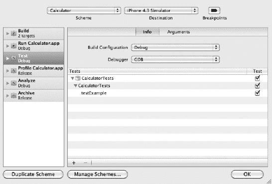

**图 9–2.** *从方案编辑器中选择要执行的测试*

使用此对话框，你可以选择在测试应用时要执行哪些单元测试。使用每个测试用例旁的复选框，选择你想要运行的测试。选定完成后，点击“OK”按钮；这将保存你的方案，这意味着在运行你的应用时，这些单元测试将会被执行。然后，你可以使用日志导航器来检查输出和测试结果。

## 使用 Xcode 4 调试器

现在，你已经通过生成和使用单元测试，了解了 Xcode 4 的一些调试功能。然而，它的能力远不止于此。像性能分析这样的高级特性将在本章稍后部分介绍，因此我们首先来看看其他一些对测试应用非常有用的、略低阶一些的功能。

Xcode 4 的调试器功能与 Visual Studio 或其他集成开发环境非常相似。它允许你在代码中设置断点——程序执行会在这些特定点暂停，以便你检查应用的运行状态。断点允许你逐行遍历代码，并检查应用执行的各个方面，包括变量及其值等。这在运行应用或测试应用时都有效。

**注意：** 调试应用时，你必须以调试模式编译应用。这让编译器可以向你的代码添加额外信息，从而支持调试功能。同时，这也会显著增加编译后代码的体积，因此在部署应用时，请记得切换为发布模式进行编译以关闭此项。

那么，让我们沿用之前的示例，确保你是在调试模式下构建。在 `CalculatorTest.m` 实现文件中，我们来添加一个断点。只需点击源代码窗口左侧的装订线区域即可完成此操作。点击后，装订线中会出现一个深蓝色的断点指示器，表示调试时代码会在此处停止。在图 9–3 中，你可以看到装订线中的断点；同时还可以看到之前添加但已停用（不活跃）的其他断点。这些断点由浅蓝色的断点指示器表示，点击它们即可重新激活。

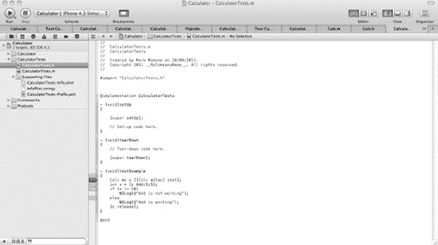

**图 9–3.** *代码窗口装订线中的活动和非活动断点*

添加断点后，你可以像之前一样构建用于测试的应用（⌘U），然后测试你的应用（⌘U）。你的应用会像之前一样在模拟器中启动。你的单元测试会开始向日志文件输出调试文本，但你的应用会在断点处停止。当应用停止时，Debug 窗口会自动显示在屏幕底部。如图 9–4 所示。

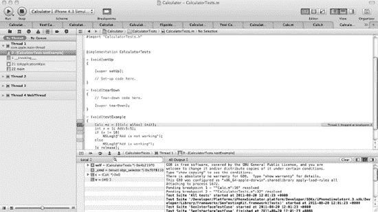

**图 9–4.** *应用在断点处停止并显示 Debug 窗口*

最左侧的窗格是导航器窗口，调试时默认显示“线程”窗格，其中展示了应用的线程（即并行的代码执行单元）及其调用堆栈，而 Debug 窗口则位于代码窗格下方。Debug 窗口在“局部变量”窗格中显示局部变量，你可以通过浏览它们来查看。应用的输出会发送到“控制台”窗口，并存储在日志文件中，但会显示在“输出”窗格中。输出可以是不经过滤的（所有输出），也可以按“调试器输出”或“目标输出”进行过滤。

Debug 窗口的标题栏提供了控制代码导航方式的选项。当命中断点后，各图标的含义如表 9-1 所示。

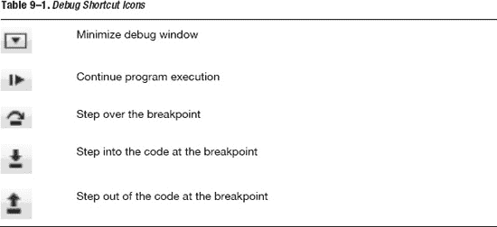

你还可以使用搜索框来查找或过滤你想要检查的变量。

通过使用调试器、设置策略性断点以及检查变量值，你可以快速判断应用的执行路径是否符合预期；更重要的是，你还可以查看变量是如何初始化的，以及是否符合你的意图。

最后，如果你想移除所有断点（无论是活跃的还是非活跃的），请使用断点导航器（⌘6），它可以在一个地方查看所有定义的断点，并对其进行移除或激活操作。如图 9–5 所示。

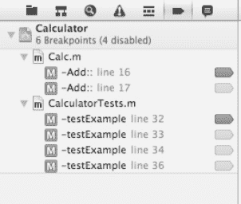

**图 9–5.** *断点导航器*

### 其他调试选项

在调试应用时，还有其他选项可供你使用——不仅是使用控制台输出调试文本这类传统技术，还有如性能分析等高级功能。接下来我们来看看这些内容。


### 使用 `NSLog` 捕获诊断信息

使用 Xcode 4 工具调试应用程序既简单又功能丰富——这与在 .NET 环境（如 Visual Studio）中使用工具非常相似。在拥有此类工具之前，你的选择非常有限，但一些较老的工具仍然有用。例如，你可能仍然觉得在应用程序中添加一些调试代码很方便，这些代码只是简单地将一些诊断信息输出到“调试”窗口。如果你不想费心创建单元测试，而只是想实时获取一些详细的诊断信息，那么这样做是合适的。

在 Objective-C 中，你可以使用 `NSLog` 命令将诊断文本发送到“调试”窗口（也称为“控制台”窗口），并通过参数替换包含变量值。

`NSLog` 的工作方式类似于 C/C++ 语言中的 `sprintf()`，或者 .NET 中 `System.Diagnostics` 命名空间下的 `Debug.WriteLine`。该方法接收一个字符串，其中定义了“说明符”，这些说明符会被你在字符串声明之后传递给该方法的参数所替换。说明符的替换顺序与你传递它们的顺序一致。这些说明符如表 9-2 所示。

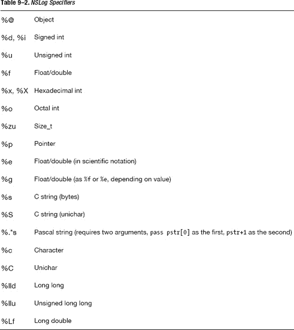

### 分析你的应用程序

分析超越了简单的测试，它允许你使用 Xcode 4 的高级功能来查找详细的代码错误，例如内存泄漏或某段特定代码运行缓慢的原因。对分析器（Profiler）的完整解释超出了本章的范围，因为它是一个复杂的主题和功能丰富的工具。然而，值得从高层次上对其进行了解。如果你选择在应用程序中实施分析，可以参阅更高级的参考指南或 iOS 开发者库。

你的应用程序应先为分析而构建（⌘I），以确保所有必要的仪表化功能可用。要启动分析，你可以从“产品”菜单中选择“分析”，或者在 Xcode 中打开应用程序后使用 ⌘I 快捷键。启动后，分析器将如图 9–6 所示。

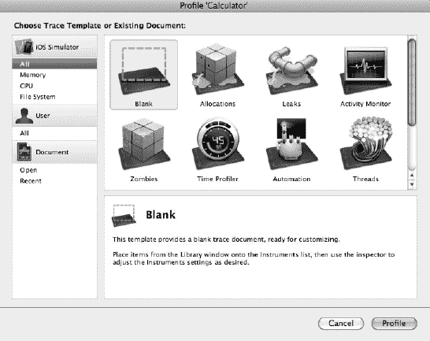

**图 9–6.** *显示所有分析选项的分析器*

该工具提供了许多模板，这些模板专为以特定方式理解你的应用程序而定制，无论是查找内存泄漏、计时代码执行，还是查看内存如何分配。它收集和提供的数据量非常巨大——可与市场上许多基于 .NET 的分析工具相媲美——而且在 Xcode 4 中它是免费的。

让我们快速看一个分析模板作为示例；最明显的可能是“泄漏”模板，这是一个常用的模板。为一个简单项目（参见图 9–6），比如计算器应用程序，选择此模板，然后选择“分析”（参见图 9–7 中的屏幕）。应用程序正在分析器中运行，并且显示了所有分配。

**注意：** 虽然分析提供了许多有用的模板化工具（如内存泄漏），但如果你使用自动引用计数（ARC），内存泄漏将成为过去。

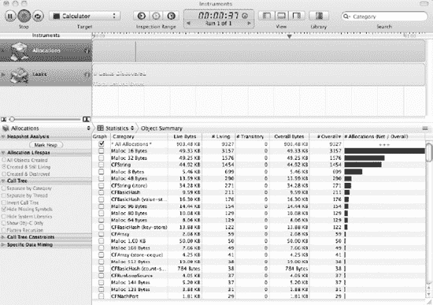

**图 9–7.** *显示所有分配的分析器*

如果切换到“泄漏”视图，你将看到一个特定视图，显示了已检测到内存泄漏的位置。在图 9–8 中，你会看到默认的计算器应用程序没有泄漏，正如一个好程序所应呈现的那样。

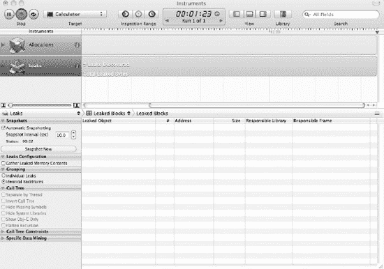

**图 9–8.** *分析器中的“泄漏”视图，无泄漏*

这算不上什么测试，所以让我们调皮一下！让我们声明一个简单的 `UIImage` 成员变量，分配内存，并用下面这行代码初始化该对象：

```
UIImage *img = [[UIImage alloc] init ];
```

但不要添加相应的释放语句。现在为分析而重新构建你的应用程序并查看分析器。当你选择相同的“泄漏”视图时，它应该显示一个类似于图 9–9 的屏幕。

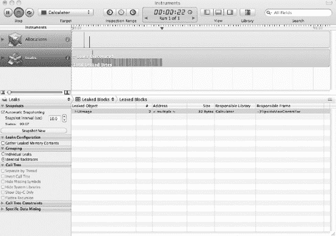

**图 9–9.** *显示内存泄漏的分析器*

你可以清楚地看到，正如预期的那样，已检测到内存泄漏；它突出显示了什么类型的对象在泄漏、泄漏了多少内存，以及是哪个库和哪个视图在泄漏。所有这些信息对于追踪故障都是无价的。

分析器及其其他模板提供了类似的详细信息，使你能够微调应用程序，或者仅仅了解你的应用程序是如何以极细致的程度执行的。

多尝试一下。这是一个很好的工具，用于学习你的代码、iOS 及其 SDK 的内部原理。

**注意：** 如果你选择完成你的“月球着陆器”应用程序，你可能会发现分析很有用。有关如何完成该游戏的讨论，请参阅附录 A。

## 使用模拟器的调试功能

因此，使用 Xcode 4 可以进行大量的调试工作，但有些事情是不可能的，特别是那些特定于设备的事情。例如，你如何测试你的应用程序在方向改变时的行为，或者你的应用程序在内存不足时如何应对？Xcode 4 的功能无法帮助你模拟此类情况。不过，幸运的是，模拟器本身具有许多自己的调试功能。

当模拟器打开时，调试功能位于“硬件”菜单下。让我们逐一过一遍。

### 更改设备

一个显而易见但有用的功能是能够更改实际的设备类型。在“设备”菜单下，有选项可以模拟 iPad 和 iPhone，包括 iPhone 4 Retina 版本以及作为 iOS SDK 一部分的其他 iOS 版本，尽管不包括 iPod Touch。只需选择你想要的设备类型，模拟器就会通过显示相关设备并进行模拟来响应。

### 更改 iOS 版本

下一个有用的功能是模拟不同版本的 iOS。SDK 附带 SDK 发布时支持的不同版本的 iOS，因此 SDK 4.3 包含从 3.2 到 4.3 的所有 iOS 版本。这对于针对你的应用程序所针对的设备与 iOS 组合进行向后兼容性测试非常有用。

### 模拟动作

显然，如果你拥有物理设备，那么你可以测试旋转和摇晃它。但对于模拟设备来说，这并不容易。你可以旋转你的 Mac 并随意摇晃它——这不会有任何帮助。然而，模拟器提供了菜单选项，既可以向左和向右旋转设备，也可以模拟摇晃手势，这一切都是为了让你能够在应用程序中处理此类事件并在模拟器中测试它们。

### 触发低内存

你的移动设备的内存是有限的，每次你打开一个应用程序，它都会消耗一些内存。除非你特意双击主屏幕按钮选择关闭应用程序，否则如果你使用 iOS 4.0 或更高版本，该内存将保持被使用状态。在较旧版本的 iOS 上，应用程序不会保留内存，因为不支持多任务。因此，在某些时候，你的应用程序可能会遇到低内存情况，它知道这一点是因为 iOS 会向你的应用程序发送一个低内存事件（`didReceiveMemoryWarning` 事件）供其处理。收到此事件时，你可能会选择通过释放不再需要或可以重新加载的资源来应对，例如。

要在模拟器中触发此类事件，你可以选择“模拟内存警告”菜单项，将该事件触发到你的应用程序中，以便你可以测试其响应。


### 其他功能

还有一些与调试应用程序关系不大，但能作为整个测试过程的快捷操作或辅助工具的功能。为了完整起见，我将在此一并提及。

- `Home` 模拟按下主屏幕按钮。
- `Lock` 模拟锁定设备。
- `Toggle In-Call Status Bar` 开启通话中状态栏，从而减少用户界面空间。
- `Simulate Hardware Keyboard` 将你的 Mac 键盘切换为 iPhone 设备的键盘。这对于在你的应用程序中输入文本非常有用。
- `TV Out` 使用此选项下选择的分辨率，将输出内容发送到 Mac 的电视输出端口。

## 在真实设备上测试

`iOS Simulator` 是一个非常有用的工具，尤其是在多种不同设备和 iOS 版本上快速测试应用程序时。但有一点很重要：仅依赖模拟器进行测试是不够的。例如，如果你想测试设备在多个应用程序同时运行、以及外部条件（如信号强度差——无论是 Wi-Fi、GPRS、3G 还是 GSM）变化下的真实性能，那么在真实设备上进行测试是无可替代的。

因此，虽然我鼓励你使用模拟器，但务必在你计划支持的所有设备上，并在各种真实场景下测试你的应用程序。你可以按照后续关于应用程序部署的说明进行操作，但这需要你成为已注册并付费的 `Apple Developer Program` 成员。

在测试应用程序时，你可能需要考虑的一些实际因素如下：

- `信号强度`：我前面已提过这一点，但你的无线网络连接（Wi-Fi）或移动信号，无论你使用哪种，并非总是满格。如果你的应用程序依赖此类网络连接，你应该测试不同的信号强度场景。
- `用户界面`：考量应用程序用户界面的外观和感觉，尤其是在使用手势操作时，同时还要考虑不同人类测试者的特点。例如，让不同的人来使用它（有时称为可用性测试）。
- `速度`：测试你的应用程序时，不仅要让它单独运行，还要在同时运行其他应用程序的情况下进行测试。你可以在模拟器中触发低内存警告，但你可以主动将设备内存限制得更低。正因如此，真实环境下的性能测试至关重要。

此外，还要考虑超越你个人测试范围的测试。例如，提供 Beta 测试计划并不罕见，即你向 Beta 测试者有限分发你的应用程序，他们可以免费使用但需要向你提供反馈。

## 部署你的应用程序

要将你的应用程序部署到任何设备上，你都需要为其签名；也就是说，你需要向你的应用程序添加一个数字证书来证明其真实性。你设备上的 `iOS` 会在所有应用程序执行前检查其真实性。这是一项安全措施，确保没有任何可能造成损害的应用程序进入你的设备。

因此，你需要为你的应用程序签名，但事情并非这么简单。正如本书前面所述，Apple 要求你必须是已注册并付费的 `iOS Developer Program` 成员，才能签名并提交你的应用程序。因此，为了将你的应用程序部署到你的 `iOS` 设备上并提交到 Apple 的 `App Store`，你需要加入该计划，费用为 `$99`。这将允许你直接在 `iPhone` 设备上测试你的应用程序，并且还能支持 Ad Hoc 分发以及向 Apple 的 `App Store` 发布。

**注意：** 你可能知道可以越狱你的 `iPhone` 设备；这能解除此类限制，并允许你使用各种工具将应用程序直接安装到你的设备上。然而，由于 Apple 不赞成此类行为，我们在本书中不会推广它。如果你对此感兴趣，我们将留给你自己去研究。需要提醒的是：要求使用 `越狱后的 iOS` 设备会限制你的分发选择。

让我们继续完成一些剩余的任务，以便你能将应用程序配置到你的移动设备和 `App Store` 上。这些大部分都可以在 `Provisioning` 页面完成，你可以通过选择 `Member Center` 中的 `iOS Provisioning Portal` 来访问该页面，如图 9–10 所示。

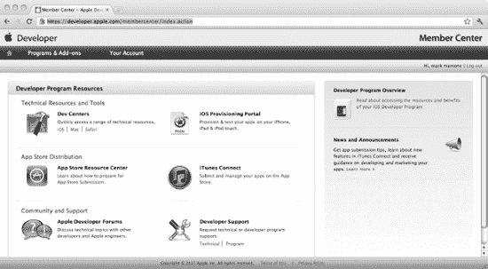

**图 9–10.** *Apple 会员中心*

`Member Center` 还提供许多有用的资源，包括技术支持。

### 创建证书以签名你的应用程序

配置页面允许你上传来自电脑的证书请求以供其授权。你随后可以使用此证书来签名你的应用程序。要创建此请求，请从你的 `Applications` 文件夹中的 `Utilities` 文件夹内打开 `Keychain` 应用程序。启动后，从菜单中选择“从证书颁发机构请求证书”选项，如图 9–11 所示。

按照屏幕上的指示操作，输入你的姓名和电子邮件地址，并选择将请求保存到磁盘。你将在配置页面中需要此文件。

保存后，回到 `Provisioning Portal` 的 `Certificates` 部分。在 `Development` 标签页下，你会看到完成该流程的说明，以及一个带有 `Choose File` 按钮的上传请求选项。选择此按钮，然后指向你刚从 `Keychain` 请求中保存的文件。这将上传请求至 Apple 进行处理。初始时它将显示为 `Pending`，但很快它就会被处理，状态将变为 `Issued`，如图 9–12 所示。

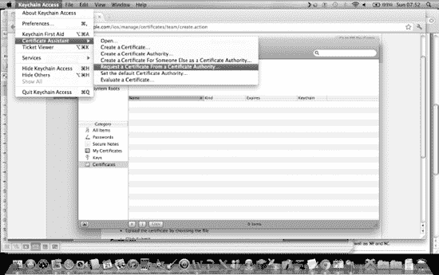

**图 9–11.** *使用 Keychain 请求证书*

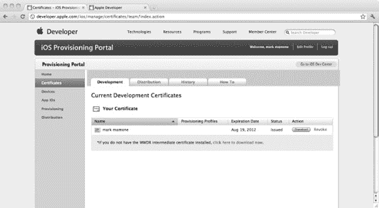

**图 9–12.** *配置页面上已颁发的证书*

现在你可以下载此证书，并通过双击它并按照屏幕上的指示操作，将其安装到你的 `Keychain` 中。


### 注册你的设备

接下来，你需要注册你的移动设备以进行开发。同样，这可以通过配置门户完成。首先，你需要获取设备的唯一 ID。你可以使用 Xcode 4“管理器”中的“设备”部分来获取此 ID。将设备连接到电脑后，启动 Xcode 4，它会自动带你进入此页面，并显示你需要的唯一 ID。你可以在图 9-13 中看到这一点。

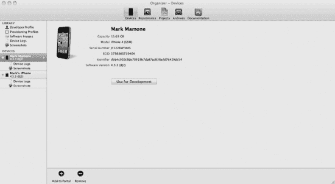

**图 9-13.** *使用 Xcode 的 Organizer 获取设备的唯一 ID*

记下这个设备 ID，然后返回配置门户的“设备”页面。在这里你可以点击图 9-14 中显示的“添加设备”按钮，为设备输入一个名称（可以是任意名称），并输入从 Xcode 屏幕获取的唯一 ID。完成此页面后，你的设备将在配置门户中注册成功。

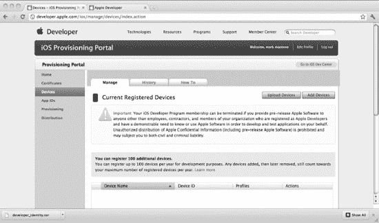

**图 9-14.** *注册设备*

你可能注意到 Xcode 管理器屏幕上的“用于开发”按钮，它提示你可以使用该设备进行开发。Xcode 能够一键为你创建、下载并安装开发者证书、分发证书以及基本的开发者配置文件（也称为团队配置文件）。

因此，返回管理器屏幕，选择此按钮并按照屏幕上的简单说明操作（这些说明仅在某些阶段提示你输入密码）。完成后，你的设备将在 Xcode 中注册用于开发。

### 使用配置门户入门

配置门户还提供了一个“启动助手”，帮助你安装必要的证书并创建所需的配置文件，使你能够开始构建应用程序。它非常直观，可以从配置门户的主页访问，但为了完整起见并解释一些要点，我将带你逐步操作。首先，在配置门户中选择“主页”，然后选择“开发配置助手”。你将看到图 9-15 所示的屏幕，在这里你需要创建一个 App ID。

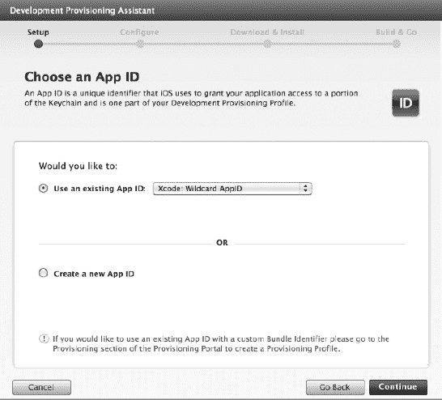

**图 9-15.** *创建 App ID*

第一步是创建一个 App ID，这是与应用程序关联的唯一标识。你可以选择在此处手动创建 App ID，或者从列表中选择通配符选项，它会自动为你部署的任何应用选择一个 App ID。除非你特别想将单个 App ID 与多个应用关联，否则我建议你选择此选项。

点击“继续”将进入下一阶段，如图 9-16 所示。

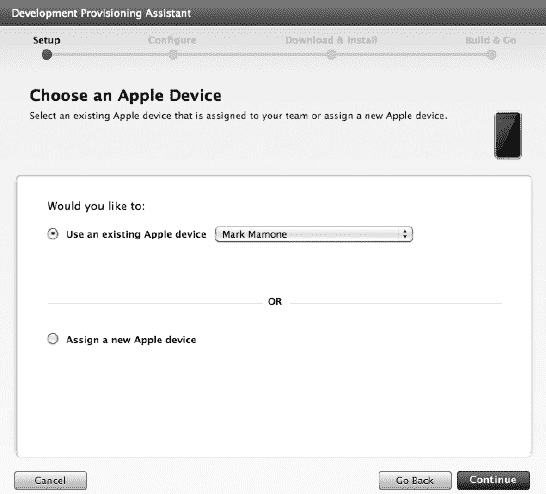

**图 9-16.** *选择 Apple 设备*

此阶段涉及选择你希望使用的设备。由于我已经注册了我的设备，它会出现在“使用现有的 Apple 设备”列表中。如果这是你唯一注册的设备，它会自动被选中。因此保持原样，然后继续点击“继续”按钮。

图 9-17 中的开发证书屏幕将打开。

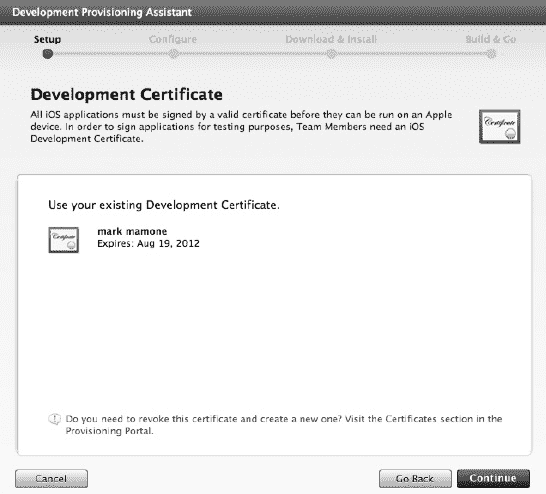

**图 9-17.** *选择开发证书*

此步骤涉及选择你的 iOS 开发证书，该证书应该已经从前面的步骤中存在。保持此屏幕，选择现有的开发证书，然后再次点击“继续”按钮。接下来将显示配置文件页面，见图 9-18。

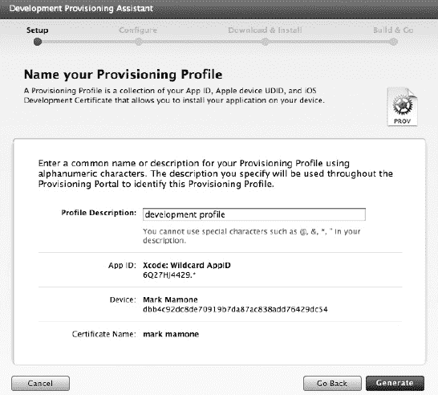

**图 9-18.** *配置文件页面*

配置文件是在命名配置文件下收集的数据集合，是在你的设备上安装应用程序所必需的。在此屏幕上，为你的配置文件命名，其余内容将自动填充。然后选择“生成”按钮，系统将生成配置文件。完成后，你将看到类似图 9-19 的屏幕。

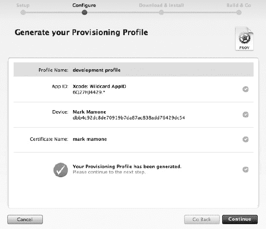

**图 9-19.** *配置文件已生成*

然后你可以继续。你将看到如何安装配置文件的说明，如图 9-20 所示。

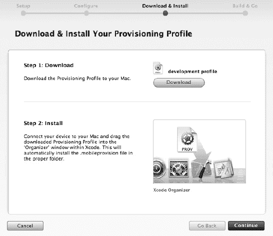

**图 9-20.** *安装你的配置文件*

按照这些说明操作，你的配置文件将被安装。最后，通过查看 Xcode 的 Organizer 确认配置文件是否存在，从而检查安装是否完成。根据 Xcode 已完成的工作，它应该已经存在。

### 构建并部署你的应用程序

至此，你已经完成了所有准备工作。现在让我们构建一个应用程序并将其部署到你的设备上。在 Xcode 中打开一个你想要部署的应用程序。我最初创建了 Hello World 程序，而你的情况则是你想部署的应用程序。在 Xcode 中，你需要做的主要事情是对应用程序进行签名。还记得你为了创建证书和配置文件所经历的所有步骤吗？

因此，打开你的应用程序，在主窗格中选择“构建设置”（参见图 9-21）。在“代码签名”部分，选择合适的配置文件；鉴于我仍在开发阶段，我选择了开发配置文件，但如果你目标是 App Store 或 Adhoc 分发（稍后会详细介绍），则应选择相应的配置文件。

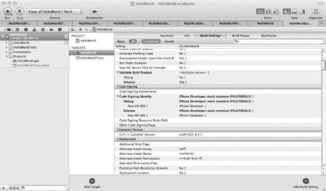

**图 9-21.** *在 Xcode 中对应用程序进行签名*

此时，在构建应用程序之前，请检查“摘要”下的应用程序标识符是否正确。这标识了设备上的应用程序。在图 9-22 中，你可以看到我添加了一个包含我的域名和应用程序标题的标识符。

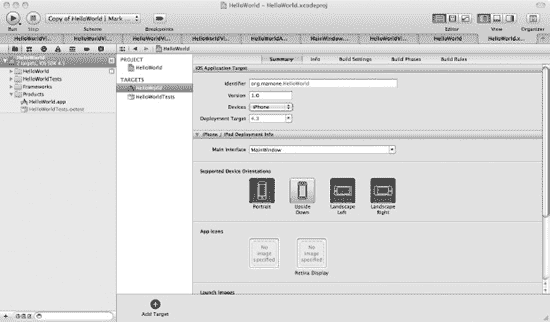

**图 9-22.** *添加你的应用程序标识符*

现在继续构建你的应用程序，确保 Xcode 中的目标方案是针对你的目标设备，而不是停留在模拟器上。同时检查你的应用程序图标是否作为`icon.png`文件包含在内，并且该文件名是否通过“信息”选项卡下的“图标文件”设置包含在你的`info.plist`文件中。当你开始构建应用程序时，系统会提示你接受使用 Keychain 证书对应用程序进行签名的请求。接受此请求，让构建完成并让应用程序签名生效。现在你已经构建了一个应用程序，并准备好进行部署。

要将应用程序部署到设备上，请打开 Xcode 的 Organizer，并在左侧窗格中选择你的设备；你会注意到有一个“应用程序”选项。你可以在图 9-23 中看到这一点以及已安装的应用程序。

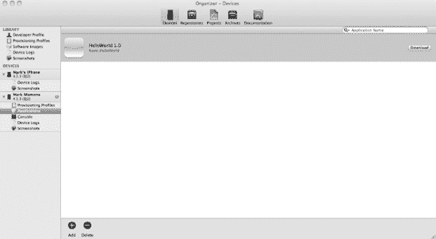

**图 9-23.** *Xcode 的 Organizer 显示设备和应用程序*

在“应用程序”窗格的底部，你会注意到两个选项：“添加”和“删除”。这些允许你在设备上添加或删除应用程序。选择“添加”。在要求你定位要添加的应用程序的对话框中，将其指向你刚刚在 Xcode 中构建的 Hello World 应用程序二进制文件。或者，你也可以将可执行文件拖放到此页面上。无论哪种方式，这都会将应用程序安装到你的设备上。完成后查看你的移动设备，你应该会看到应用程序就在那里，准备进行测试！

现在你已经成功构建并部署了你的第一个 Apple 移动设备应用程序。你可以用它进行一些真实世界的测试，如果对结果满意，就可以进入下一阶段，即部署到 App Store 或通过另一种称为 Adhoc 分发的机制进行部署。


## 发布你的应用

在你的本地设备上测试完应用后，就可以准备将其发布到其他设备上了。这里有两种选择：即席部署或通过 App Store 部署。首先需要注意的是，你需要为每种方式准备预置描述文件，这些文件可以通过预置描述文件页面轻松设置，如图 9-24 所示。

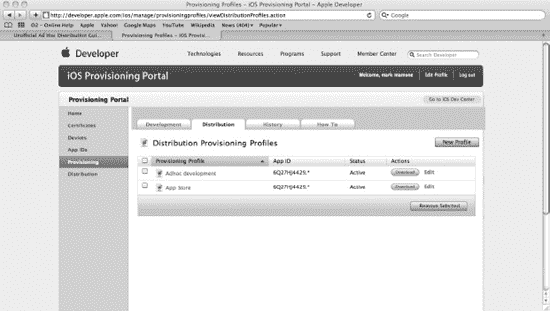

**图 9-24.** *预置描述文件页面上的分发描述文件*

如图所示，我已经为即席部署和 App Store 部署都创建了一个分发描述文件。稍后我将在 Xcode 中使用它们。

### 通过即席机制发布

即席机制允许你通过电子邮件或互联网作为分发机制，将应用分发给多达 100 名其他 iPad、iPhone 或 iPod Touch 用户。用户可以从那里下载并安装应用。

首先要注意的是，你的应用必须使用配置为即席部署的描述文件进行构建。你可以通过预置描述文件页面来完成此操作。在应用的代码签名构建配置中，选择即席描述文件进行构建，然后像之前一样构建应用。

构建完成后，你需要同时分发应用（通常是归档文件）和即席分发描述文件（`.mobileprovision` 文件），以便其他用户安装。

安装用户将这些文件拖入 iTunes 的“应用”文件夹。如果应用是归档文件，他们需要解压文件以得到 `.app` 二进制文件，然后将该文件拖入。

之后，应用便可以通过 iTunes 的同步功能像往常一样与设备同步。此时应用应已准备就绪，可以在设备上运行。

### 通过 App Store 发布

要将应用发布到 App Store，你需要遵循类似的流程：应用必须使用 App Store 预置描述文件进行构建和签名。为此，你需遵循相同的说明，在 Xcode 中更改构建设置，使其在编译时对你的应用进行签名，但这次请选择 App Store 预置描述文件。

构建完成后，你就可以准备向 App Store 提交应用了。为此，请从 Apple 开发者页面进入“成员中心”。在主页上，预置门户链接正下方，你会看到 iTunes Connect 的链接。如果你想直接跳转，可以在你常用的浏览器中访问 [`https://itunesconnect.apple.com`](https://itunesconnect.apple.com)。

**但是等等！**

#### 准备提交应用到 App Store

在提交应用之前，为了最大程度确保成功通过审核，我建议你最后再仔细阅读一遍 iOS App Store 审核指南。这份资源不薄，但苹果公司保留拒绝任何不符合要求的应用的权利。你可以通过 [`https://developer.apple.com/appstore/resources/approval/guidelines.html`](https://developer.apple.com/appstore/resources/approval/guidelines.html) 或成员中心找到这份指南。事实上，有一个非常好的资源中心，提供了各种帮助你向 App Store 提交应用的信息，地址是 [`https://developer.apple.com/appstore/`](https://developer.apple.com/appstore/)。

除了应用二进制文件，你还需要填写许多与应用相关的属性信息。你最好提前准备好这些信息，因为后面都会用到。它们是：

*   应用名称
*   应用描述
*   主要和次要类别
*   子类别
*   版权信息
*   应用评级
*   关键词
*   SKU 编号
*   应用 URL
*   屏幕截图
*   支持 URL
*   支持邮箱地址
*   最终用户许可协议
*   定价、可用日期、销售区域
*   OS 二进制文件：包括适用于 iPhone 和 iPod touch 的 57px 和可选的 114px 高清图标，或通过 iTunes Connect 提交的适用于 iPad 的 50px 和 72px 图标

iTunes Connect 是一套基于 Web 的工具，供你通过 App Store 提交和管理应用。在 iTunes Connect 中，你可以检查合同状态、管理 iTunes Connect 和测试用户、获取销售和财务报告、查看应用崩溃日志、申请促销代码等等。

这套工具非常全面，因此我不打算详细讲解其所有功能。有一份非常优秀的开发者指南可以为你代劳，下载地址是 [`https://itunesconnect.apple.com/docs/iTunesConnect_DeveloperGuide.pdf`](https://itunesconnect.apple.com/docs/iTunesConnect_DeveloperGuide.pdf)。

不过，在假设你已经完成了前面提到的所有准备工作后，我将带你了解向 App Store 提交应用的基本流程。

所以，再次访问 [`https://itunesconnect.apple.com`](https://itunesconnect.apple.com) 并登录。登录后，你将看到 iTunes Connect 主页，如图 9-25 所示。

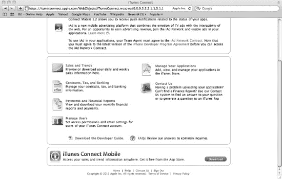

**图 9-25.** *iTunes Connect 主页*

进入主页后，选择“管理你的应用”链接。这允许你管理 App Store 中的应用并添加新应用。首次进入此页面时，列表将是空的。这是因为你还没有上传任何应用。你可以在图 9-26 中看到这一点。

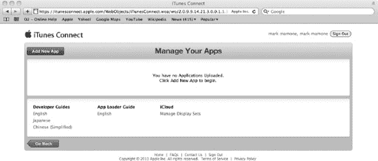

**图 9-26.** *空的应用列表*

点击“添加新应用”按钮。系统会提示你输入与应用相关的信息。需要提醒的是，他们要求的信息非常多，因此我建议你在开始上传之前就准备好这些信息。

我不打算列出所有字段及其含义，因为数量很多，而且如前所述，iTunes Connect 开发者指南对这些信息及其用途做了非常详尽的描述。

输入所需信息后，系统会要求你上传一些二进制文件。这些文件包括与应用相关的各种图片，例如应用图标和屏幕截图。当所有信息输入完毕、图片资源上传完成后，你将进入应用摘要页面。在此页面的右侧还有一些额外的按钮，允许你管理关于应用的进一步信息，例如本地化和定价。


### 上传应用二进制文件

在版本详情页面上，点击`准备好上传二进制文件`按钮。你需要回答一些关于出口合规性的最终问题。然后，根据你是添加新应用还是更新已上传的应用，你将被带到相应的应用加载器说明页面或版本发布控制页面。

如果你使用的是 iOS SDK 3.2 或更高版本，你的电脑上`实用工具`文件夹中已经存储了`Application Loader`，路径为`/Developer/Applications/Utilities/Application Loader.app`。

你也可以选择从 Xcode 交付，这同样会用到`Application Loader`技术。请参阅开发者指南中的`使用 Application Loader`部分，详细了解如何使用此机制交付你的二进制文件。

启动`Application Loader`后，你会看到一个类似图 9–27 的屏幕。

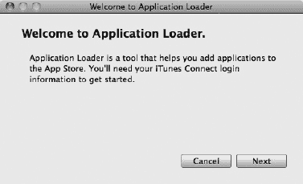

**图 9–27.** *Application Loader 启动屏幕*

点击`下一步`后，系统会要求你输入登录详细信息，然后应用程序会提供一个列表，显示它期望接收上传的应用。如果你未成功通过`iTunes Connect`页面完成添加应用的过程，你将看到一个类似图 9–28 的屏幕。

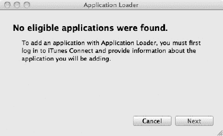

**图 9–28.** *未找到符合条件的应用。*

这表示你尚未通过`iTunes Connect`添加应用，或者如果你认为自己已添加，则操作失败。如果你已成功上传列表，系统会提示你从下拉列表中选择一个应用，该列表包含你已上传的所有应用。从列表中选择合适的应用，如图 9–29 所示。

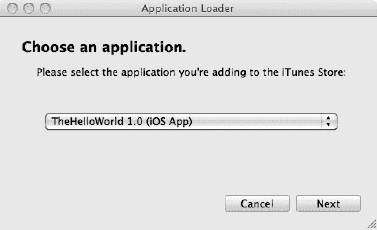

**图 9–29.** *选择要上传的 App Store 应用二进制文件*

选择好你要添加到 App Store 的应用后，点击`下一步`，系统会要求你完成一系列问题。其中包括确认你已在 iOS 上对二进制文件进行了测试并验证其合格，然后系统会要求你选择要上传的应用二进制文件。使用`选择`按钮，选择你的应用包（这是压缩成单个`.zip`文件的应用），如图 9–30 所示。

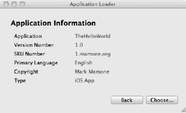

**图 9–30.** *选择要上传的应用包*

选择完毕后，你将看到如图图 9–31 所示的摘要屏幕。你可以选择点击`发送`按钮提交应用，或者取消整个过程。请点击`发送`按钮。

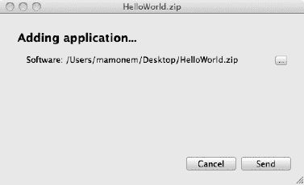

**图 9–31.** *应用提交摘要屏幕*

接着，系统会将你的应用提交到 App Store，并显示类似图 9–32 的屏幕。

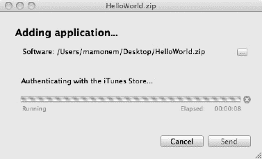

**图 9–32.** *向 App Store 提交应用*

上传成功后，你将看到一个确认屏幕，提醒你将会收到一封确认上传的电子邮件，并且你随时可以登录`iTunes Connect`，通过苹果的审批流程跟踪其进度。

### 其他资源

应用提交流程现已完成。你已经使用 Xcode 的功能（如单元测试、iOS 模拟器和真实设备测试）测试了你的应用。你也已将应用提交到 App Store。然而，测试与 iPhone 营销/提交流程都是重要主题，因此我提供了一些额外的阅读材料，这些材料更深入地探讨了这些主题。

*   *设计驱动测试：更智能地测试，而非更努力地测试*（ISBN13：978-1-4302-2943-8）通过恢复使用测试来验证设计（而非假装单元测试可以替代设计）的概念，让软件开发回归正轨。
*   *iPhone 和 iPad 应用开发业务：成功制作和营销应用*（ISBN13：978-1-4302-3300-8）向您展示如何将营销和商业智慧融入到 iPhone 和 iPad 应用设计与开发的每一个环节。

这些资源是对 Apple Developer Program 和 iOS 开发中心（参见 [`http://developer.apple.com`](http://developer.apple.com)）所包含资源的补充。

## 总结

在本章中，你学习了如何使用 Xcode 和模拟器中的功能来测试你的应用。你还学习了如何配置你的电脑（包括 Xcode 安装）以便为你的设备进行应用授权，以及如何使用苹果认可的两种机制（Adhoc 和 App Store）进行授权。

你了解了如何设置本地证书和配置文件来实现这一目标，以及如何使用会员中心主页上的 Provisioning Portal 和 iTunes Connect。在成功部署到本地设备后，你简要学习了如何使用 Adhoc 方法进行授权，然后详细学习了如何使用 iTunes Connect 将应用授权到 App Store。

现在，你已经准备好利用本书提供的指导创造巨额财富（希望如此！），创建你的基于 iOS 的应用并将其提交到 App Store 供他人购买。

## 第 10 章

## 拓展技能：高级特性

在本章中，你将了解 SDK 和相关苹果工具提供的一些更高级的特性。这些特性建立在你目前已获得的经验之上，但着眼于特定设备的能力，以及在某些情况下，如何用一个代码库针对多款 iOS 设备。你还将展望 iOS 开发技术的未来。

具体来说，本章你将学习以下内容：

*   使用设备的全球定位系统（GPS）
*   利用设备的相机
*   使用加速计
*   检测手势
*   编写多设备兼容代码
*   iOS 开发的前沿趋势

## 使用全球定位系统

你的 iOS 设备如果配备了全球定位系统（GPS），便能够确定其在地球上任何位置。还有其他方法可用于确定位置，但 GPS 是目前最精确的。iOS SDK 提供了多种基于位置的服务，并在底层决定使用哪种机制。这意味着你无需关心不同的技术；你只需声明一些特性（例如期望的精度），设备会尽力而为。


### 定位服务概述

SDK 提供一个名为 `LocationManager` 的类，它通过简单的 API 公开基于位置的服务，同时隐藏其使用的技术。不过，你仍应仔细考虑使用这些服务的方式。例如，不应允许应用程序持续轮询位置，因为这不仅会影响应用性能，还会影响电池续航。因此，你的应用实现应按需轮询位置更新；但如果不需要连续更新，你可以先等待位置更新事件触发，然后停止更新，直到准备好再次启动并确定位置。

如你所想，你可以控制位置管理器是否发送关于位置变化的更新。只需在需要开始更新时调用 `startUpdatingLocation`，在需要停止事件更新时调用 `stopUpdatingLocation` 即可。

创建该类的实例并启动位置事件轮询后，会触发两个事件之一：`didUpdateToLocation`，或者如果遇到错误，则触发 `didFailWithError`。

当新位置事件触发时，它会传递两个变量，每个变量的类型均为 `CLLocation`——一个用于旧位置，一个用于新位置。这为你提供了当前位置，并带来了额外好处：你可以利用旧位置计算行进距离。

每个 `CLLocation` 参数都包含位置坐标、海拔高度和行进速度。它还提供了计算距离所需的方法。

我们来看看如何使用这个类。

### 实现基于位置的服务

首先，创建 `LocationManager` 类的一个实例。该类封装了 SDK 提供的部分基于位置的服务。语法如下所示：

```
CLLocationManager *lm = [[CLLocationManager alloc]init];
```

为了提供通知事件的挂钩，你还需要提供一个委托来接收关键的基于位置的事件，例如位置变化。本质上，你使用委托来承载回调方法，以接收事件并处理它。为此，你需要使用 `CLLocationManagerDelegate`，确保它符合定义了两种可选方法的协议签名（稍后详述）。因此，最简单的机制是为此目的创建一个容器类，如代码清单 10-1（头文件）和代码清单 10-2（实现）所示。

**代码清单 10-1.** `LocationManager.h`

```
#import <Foundation/Foundation.h>
#import <CoreLocation/CoreLocation.h>

@interface LocationManager : NSObject <CLLocationManagerDelegate> {
    CLLocationManager* lm;
        CLLocation* l;
}

@property (nonatomic, retain) CLLocationManager* lm;
@property (nonatomic, retain) CLLocation* l;

@end
```

**代码清单 10-2.** `LocationManager.m`

```
#import "LocationManager.h"

@implementation LocationManager
@synthesize lm,l;

// 默认构造函数，分配 CLLocationManager 实例
// 将委托分配给自己，并设置最高精度
//
- (id)init
{
    self = [super init];
    if (self != nil) {
        self.lm = [[[CLLocationManager alloc] init] autorelease];
        self.lm.delegate = self;
        self.lm.desiredAccuracy = kCLLocationAccuracyBest;
    }
    return self;
}

// 事件：didUpdateToLocation
//
- (void)locationManager:(CLLocationManager*)manager
didUpdateToLocation:(CLLocation*)newLocation
fromLocation:(CLLocation*)oldLocation
{
    // 在此处根据需求处理事件
}

// 事件：didFailWithError
// TODO：此方法留待你在本示例中实现

@end
```

因此，你可以更改类的实例化，改用此类而非 `CLLocationManager`，如下所示：

```
LocationManager*        lm = [[LocationManager init] alloc];
```

在你的构造函数中，你不仅将委托设置指向自身，还通过使用 `desiredAccuracy` 属性并配合预定义的常量来设置服务的精度，该常量指示你所需的精度级别。将其设置为 `kCLLocationAccuracyBest` 可提供 10 米内的最佳位置；另有精度为 100 米、1 公里和 3 公里的其他设置。尽管你可以设置所需的精度，但精度并不保证；而且精度设置越高，对电池电量和设备性能的影响就越大。

### 位置信息包含什么？

位置更新事件触发时，会传递新位置和旧位置，它们都是 `CLLocation` 类的实例。该类包含许多感兴趣的属性。假设在你的应用中，你声明了一个名为 `lm` 的 `LocationManager` 类实例，然后在合适的位置创建该对象的实例并开始更新位置，如下所示：

```
LocationManager* lm =[[LocationManager alloc] init];
[lm.lmstartUpdatingLocation];
```

然后，你可以在代码中为该事件提供实现。例如，我们使用以下示例代码将位置输出到日志文件：

```
// 在此处根据需求处理事件
NSLog(@"经度 %f 纬度 %f",newLocation.coordinate.longitude,
 newLocation.coordinate.latitude);
```

如果你在模拟器中执行应用，稍等片刻后，应会看到如下输出：

```
2011-08-24 15:50:51.133 locationExample[607:207]
经度 115.848930 纬度 -31.952769
```

每次位置变化时它都会更新。我的模拟器没有配备 GPS，但如果你能访问网络，则模拟器会确定你的位置。我使用谷歌地图测试了此功能，将纬度和经度作为搜索字符串输入，如下所示：

```
-31.952769, 115.848930
```

这正确返回了我在澳大利亚的当前位置，如图 10-1 所示。

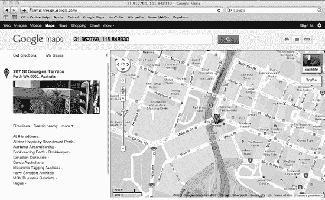

**图 10-1.** 使用谷歌地图测试模拟 GPS

当事件触发时，你可以使用 `CLLocation` 类执行其他操作。例如，你可以计算速度：

```
double gpsSpeed = newLocation.speed;
```

你还可以查找坐标记录的时间戳，或查看海平面以上（正值）或以下（负值）的海拔高度（以米为单位）。

.NET 框架在其 `System.Device.Location` 命名空间中提供了类似的功能，尽管如你所料，其实现略有不同。例如，你使用 `GeoCoordinateWatcher` 对象从 .NET 定位服务获取数据，类似于你的委托类。`CLLocation` 类在 .NET 中由 `GeoCoordinate` 类替代，提供与位置相关的类似属性。最后，.NET 中的 `GeoPositionAccuracy` 属性控制精度，对设备性能有相同影响，但它有两个选项：默认（针对精度和设备性能优化）和高精度。

如你所见，两个 SDK 具有可比较的特性，并且将代码语义从一种转换为另一种相对简单。你可以在 [`msdn.microsoft.com/en-you/library/system.device.location.aspx`](http://msdn.microsoft.com/en-you/library/system.device.location.aspx) 找到 .NET 文档。

iOS SDK 的等效文档位于 [`developer.apple.com/library/ios/#documentation/UserExperience/Conceptual/LocationAwarenessPG/Introduction/Introduction.html`](http://developer.apple.com/library/ios/#documentation/UserExperience/Conceptual/LocationAwarenessPG/Introduction/Introduction.html)。

这些都是基于 SDK 的能力，但始终存在其他选项。如果你正在开发基于 Web 的应用程序，还可以考虑 HTML 5 的 `GeoLocation` 功能。


## 使用相机

iPhone 和 iPad 中另一个常用的功能是设备相机。在较新的设备上，通常会配备两个摄像头——一个前置摄像头和一个后置摄像头，用于支持视频通话。幸运的是，与你之前了解的基于位置的服务一样，SDK 提供了访问这些功能的方法。创建利用相机的应用程序非常简单；SDK 提供了一个名为 `UIImagePickerController` 的类，它可以访问相机，并支持拍照和预览结果。

我们来了解一下实现相机功能的基础知识，然后通过一个示例应用程序进行实践。

### 相机基础

创建一个使用视图控制器的简单项目，然后在 `didLoad` 方法中输入以下代码：

```
if (([UIImagePickerController isSourceTypeAvailable:
      UIImagePickerControllerSourceTypeCamera] == YES))
{
        UIImagePickerController *cameraUI = [[UIImagePickerController alloc] init];
        cameraUI.delegate = self;        
        cameraUI.sourceType = UIImagePickerControllerSourceTypeCamera;    
        cameraUI.allowsEditing = NO;

         [self presentModalViewController: cameraUI animated: YES];

} else NSLog(@"Camera not available");
```

这段代码会显示相机界面（假设设备有相机），并允许你使用对话框拍照——或者录制视频，如果你通过选择器切换到视频模式的话。`mediatypes` 属性控制选择器向你呈现哪些选项，可设置为 `kUTTypeMovie`（用于视频）、`kUTTypeImage`（用于照片），或者按如下方式同时提供两者（在支持的情况下）：

```
cameraUI.mediaTypes = [UIImagePickerController
 availableMediaTypesForSourceType:
UIImagePickerControllerSourceTypeCamera];
```

**注意：** 在 iPad 2 上，你也可以使用弹出窗口作为视图控制器。

该控制器为你提供了基本的编辑功能，例如缩放和裁剪。此外，你可以将用户拍摄或从相册中选择的图像回传给委托。委托负责关闭控制器并处理图像。

以下示例提供了一个委托方法，用于获取从选择器回传的原始图像：

```
- (void)imagePickerController:(UIImagePickerController *)
 didFinishPickingImage:(UIImage *)image
editingInfo:(NSDictionary *)editingInfo
{
// Your processing code goes here
        // processing code

        // Dismiss the picker
         [p dismissModalViewControllerAnimated:YES];
}
```

在支持相机的 Windows Mobile 设备上，你可以使用 `Microsoft.Devices.PhotoCamera` 类以及 `MediaLibrary` 对象（用于保存从相机捕获的视频/图像）以类似方式管理相同的功能。这比在 iPhone 上要复杂一些，因为没有提供单一类，但可以说这种方式提供了更大的灵活性。

## 编写一个相机示例应用

你可以轻松地将相机应用的示例代码片段组合起来。首先，创建一个使用基于视图模板的新项目。这将创建一个包含标准视图控制器和界面的项目，正如你在本书中多次操作过的那样。

你需要添加相应的框架来使用相机，因此，像之前一样，转到项目的 Build Phases 选项卡（通过项目根设置进入），并在“Link Binary with Libraries”设置中添加 `MobileCoreServices.framework`。这将提供对包含相机代码的库的访问。在创建用户界面之前，请在头文件中引入 `UTCoreTypes.h` 文件，确保为图像选择器和导航实现了两个委托，并为你的 `Image` 属性以及“相机”和“相册”按钮添加 `IBAction` 和 `IBOutlet`。你的代码应类似于[代码清单 10-3]，这些内容你应该都很熟悉。

**代码清单 10-3.** *相机示例 `ViewController.h` 文件*

```
#import <UIKit/UIKit.h>
#import <MobileCoreServices/UTCoreTypes.h>

@interface CameraExampleViewController : UIViewController
<UIImagePickerControllerDelegate, UINavigationControllerDelegate>
{

    UIImageView *imageView;
    BOOL newMediaAvailable;
}
@property (nonatomic, retain) IBOutlet UIImageView *imageView;
- (IBAction)useCamera;
- (IBAction)useCameraRoll;
@end
```

打开视图控制器的 Interface Builder 文件，添加 `UIImageView` 控件以及一个包含“相机”和“相册”两个项目的工具栏。在 Xcode 中打开连接检查器，连接图像控件以及“相机”和“相册”按钮后，界面应类似于[图 10.2]所示。

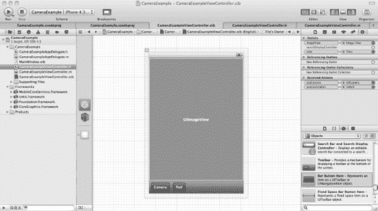

**图 10–2** *. 已建立连接的相机示例用户界面*

现在你可以为“相机”和“相册”按钮实现代码，但别忘了在实现文件中 `@synthesize` 你的 `newMediaAvailable`。我们先从“相机”按钮开始，使用[代码清单 10-4]中的代码。

***代码清单 10-4\. 实现连接到相机按钮的 `useCamera` 方法***

```
- (void) useCamera
{
    if ([UIImagePickerController isSourceTypeAvailable:
         UIImagePickerControllerSourceTypeCamera])
    {
        UIImagePickerController *imagePicker = [[UIImagePickerController alloc] init];
        imagePicker.delegate = self;
        imagePicker.sourceType = UIImagePickerControllerSourceTypeCamera;
imagePicker.mediaTypes = [NSArray arrayWithObjects:
(NSString *)kUTTypeImage, nil];
        imagePicker.allowsEditing = NO;
        [self presentModalViewController:imagePicker animated:YES];
        [imagePicker release];
        newMediaAvailable = YES;
    }
}
```

其实现非常直接。`useCamera` 方法会检查运行应用程序的设备是否拥有相机。在模拟器上通常没有，因此你需要在真实设备上运行此应用以进行彻底测试。它会创建一个 `UIImagePickerController` 实例，将 `cameraViewController` 分配为该对象的委托，并将媒体源定义为相机。指定支持的媒体类型的属性被设置为仅限图像。最后，显示相机界面并释放 `UIImagePickerController` 对象。你将 `newMediaAvailable` 标志设置为 `YES`，表示该图像是新的；这用于区分未使用的相机胶卷。

接下来，你需要为从“相册”按钮访问的相机胶卷功能提供实现。见[代码清单 10-5]。

**代码清单 10-5.** *实现连接到相册按钮的相机胶卷代码*


### 使用相机胶卷

```objc
- (void) useCameraRoll
{
    if ([UIImagePickerController isSourceTypeAvailable:
         UIImagePickerControllerSourceTypeSavedPhotosAlbum])
    {
        UIImagePickerController *imagePicker = [[UIImagePickerController alloc] init];
        imagePicker.delegate = self;
        imagePicker.sourceType = UIImagePickerControllerSourceTypePhotoLibrary;
        imagePicker.mediaTypes =
[NSArray arrayWithObjects:(NSString *) kUTTypeImage,nil];
        imagePicker.allowsEditing = NO;
        [self presentModalViewController:imagePicker animated:YES];
        [imagePicker release];
        newMediaAvailable = NO;
    }
}
```

同样，该功能非常直接，与 `userCamera` 方法非常相似，不同之处在于，图片的来源被声明为 `UIImagePickerControllerSourceTypePhotoLibrary`，并且 `newMediaAvailable` 标志被设置为 `NO`，因为它已经被保存过了。

你现在需要实现几个重要的委托方法。第一个是 `didFinishPickingMediaWithInfo` 方法，当用户完成选择图片时会被调用。其实现如代码清单 10-6 所示。

**代码清单 10-6.** *通过委托保存图片*

```objc
-(void)imagePickerController:(UIImagePickerController *)picker
didFinishPickingMediaWithInfo:(NSDictionary *)info
{
    NSString *mediaType = [info objectForKey:UIImagePickerControllerMediaType];

    [self dismissModalViewControllerAnimated:YES];

    if ([mediaType isEqualToString:(NSString *)kUTTypeImage])
    {
        UIImage *image = [info objectForKey:UIImagePickerControllerOriginalImage];
        imageView.image = image;

        if (newMediaAvailable)
            UIImageWriteToSavedPhotosAlbum(image, self, @selector(image:finishedSavingWithError:contextInfo:), nil);
    }
}
```

提取 `mediaType`，关闭所有打开的图片选择器对话框，并确认你处理的是图片（而非视频）。然后，如果是新图片，将其保存到相册。当保存操作完成时，你会调用另一个方法，如果保存失败则显示错误信息。该方法以及用于关闭打开的对话框的图片选择器取消委托方法，如代码清单 10-7 所示。

**代码清单 10-7.** *捕获错误并关闭选择器窗口*

```objc
-(void)image:(UIImage *)image
finishedSavingWithError:(NSError *)error contextInfo:(void *)contextInfo
{
if (error) {
        UIAlertView *alert = [
[UIAlertView alloc]
initWithTitle: @"图片保存失败"
message: @"保存图片失败"
             delegate: nil
cancelButtonTitle:@"确定" otherButtonTitles:nil];
        [alert show];
        [alert release];
    }
}
-(void)imagePickerControllerDidCancel:(UIImagePickerController *)picker
{
    [self dismissModalViewControllerAnimated:YES];
}
```

最后，你需要进行清理工作。当初始化表单时，你将图片设置为 `nil`；当释放内存时，你释放图片可能占用的所有内存。这些操作通过代码清单 10-8 中的方法实现。

**代码清单 10-8.** *清理工作*

```objc
- (void)dealloc
{
    [imageView release];
    [super dealloc];
}
// 实现 viewDidLoad 以便在加载视图后进行额外的设置，
// 通常是加载 nib 文件。
- (void)viewDidLoad
{
    [super viewDidLoad];
    self.imageView = nil;
}
```

如果你尝试使用模拟器调试该应用，那么如前所述，什么也不会发生，因为不支持相机。相机胶卷是支持的，但在此情况下它是空的；因此如果你选择了这个选项，屏幕会显示如图 10-3 所示的内容，并且“取消”按钮应该如预期一样关闭对话框。

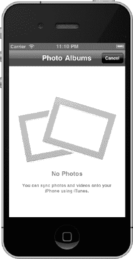

**图 10-3.** *在 iOS 模拟器中查看相机胶卷*

## 使用加速计

iPhone 和 iPad 能够通过检测设备在特定方向上的惯性力来测量重力和设备加速度。通俗来说，这意味着你可以判断设备的方向、变化的速度，以及变化的力量是否在一个轴上大于另一个轴，从而确定方向。

这种三轴检测能力意味着设备可以检测到所有方向上的这些运动。因此，如果你将设备正对自己，左右移动是 `x` 轴，上下移动是 `y` 轴，前后倾斜是 `z` 轴。你可以在图 10-4 中看到这如何影响 `x`、`y` 和 `z` 轴的值。（注意箭头指向设备的顶部。）零代表没有运动，正数或负数代表在特定方向上的力。图表的问题在于表示 `z` 轴有点困难，所以我把它描述为你的设备所展现的加速度大小。静止时，它代表重力；当你向上或向下举起设备时，它是一个与加速度成正比的正面或负面的值。

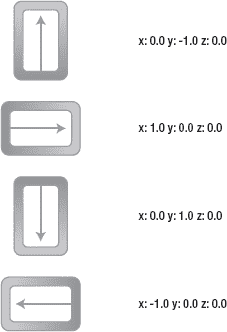

**图 10-4.** *旋转时的轴值*

SDK 提供了使用 Quartz 2D 框架访问加速计功能的途径，尽管你也有使用 OpenGL ES API 的选项，后者提供了更精细的控制级别。模拟器不支持加速计功能，因此，我不会带你一步步地演练示例，而是让你使用提供的示例代码和真实设备来探索其功能。

使用默认的 SDK 实现，你可以将 `UIAccelerometer` 类实例实现为单例（仅一个实例）。要获取这个类，你可以使用如下代码：

```objc
UIAccelerometer *accelerometer = [UIAccelerometer sharedAccelerometer];
```

为了接收反映方向变化的事件，你可以使用类似于 GPS 的模式。你将这个类的委托设置为指向一个遵循 `UIAccelerometerDelegate` 协议的类。然而，一个不同之处在于，你可以通过 `updateInterval` 属性来控制更新的频率，该属性定义了每秒轮询设备的次数，并因此触发事件，尽管它并不精确且不能保证。这种缺乏精确性是硬件工程以及设备以足够低的延迟触发事件以便你捕获和解释的副产品。但在大多数情况下，包括像道路导航这样基于复杂 GPS 的应用程序中，它也完全适用。有一个解决方案，但并不简单，它涉及捕获事件并使用算法函数对数据进行采样，从而以更高的保真度预测位置。你可以在 [`http://en.wikipedia.org/wiki/Low-pass_filter#Algorithmic_implementation`](http://en.wikipedia.org/wiki/Low-pass_filter#Algorithmic_implementation) 找到更多关于此类滤波器的信息。

让我们从代码层面来看，首先，你实现一个使用所需协议的类；这可以是你的 `viewController`。它看起来像这样：

```objc
@interface MainViewController : UIViewController<UIAccelerometerDelegate>
{
        // 在此处声明头文件
}
```

然后你提供其实现，特别是用于捕获事件的 `didAccelerate` 方法，如下所示：

```objc
- (void)accelerometer:(UIAccelerometer *)accelerometer
didAccelerate:(UIAcceleration *)acceleration
{
        // 处理事件的实现代码写在这里
        NSLog(@"%@%f", @"X: ", acceleration.x);
        NSLog(@"%@%f", @"Y: ", acceleration.y);
        NSLog(@"%@%f", @"Z: ", acceleration.z);
}
```


你已经了解了如何实例化加速计类，以及如何定义委托来捕获事件，但还需要启用加速计才能实现这一功能。在你的代码中选择一个合适的位置来初始化委托和更新频率——例如，在应用视图控制器的`DidLoad`事件中。当你如上所述获取到单例类的引用后，可以使用以下代码来设置委托和更新间隔：

```
accelerometer.delegate = self;          // 实现 UIAccelerometerDelegate
accelerometer.updateInterval = 1.0f/60.0f; // 每 60 秒更新一次
```

除此之外，只需在代码中按要求解释数据即可。很明显，尝试将这段代码与 .NET 对应部分进行桥接会面临两个困难：它依赖于设备，因此 SDK 会发生变化。然而，Windows Mobile 设备已加入 iPhone 和 iPad 的行列，提供了让开发者能够做各种事情的能力，从判断用户掉手机的频率到允许用户控制应用和游戏。如果你使用的是基于 HTC 的设备以及托管代码（如 C#），你可以直接访问相应动态链接库中的 API，但这不太友好；或者，如果你使用的是 Windows Mobile 7，你可以使用`Microsoft.Devices.Sensors`命名空间和`Accelerometer`类，这要好得多。其实现与 iOS 非常相似，并通过`Microsoft.Devices.Sensors`命名空间暴露出来。与 iOS 加速计框架一样，.NET 实现也使用了`Accelerometer`类，该类通过`Compass`和`Gyroscope`属性分别向其内部的指南针和陀螺仪传感器提供数据。然后使用`Motion`类从传感器捕获数据，使用不同的结构体分别存储加速计、指南针、陀螺仪和运动的数据。

## 手势检测概述

iPod Touch、iPhone 和 iPad 最具创新性的功能之一是用户界面能够检测手势。这使设备吸引了所有年龄段的用户，并让电影中看到的虚拟现实界面更近了一步。Cocoa Touch 提供了 UIKit 框架，允许你通过`UIGestureRecognizer`类及其启用的事件来利用此功能。让我们来看看。

### 检测触摸事件

起点是捕获用户界面在你触摸屏幕时发送的触摸事件。使用标准视图控制器（`UIViewController`）或视图（`UIView`），首先实现`touchesBegan`方法：

```
-(void)touchesBegan:(NSSet *)touches withEvent:(UIEvent *)event
{
    UITouch *touch = [touches anyObject];
    NSUInteger notouches = [touches count];
    gestureStartPoint = [touch locationInView:self.view];
}
```

所有与触摸相关的方法（包括这个方法）都会收到一个名为`touches`的`NSSet`实例和一个`UIEvent`实例。当前按在屏幕上的手指数量可以通过获取`touches`中的对象数量来确定。`touches`中的每个对象都是一个代表一根手指触摸屏幕的`UITouch`事件。

触摸事件机制将不同控件的触摸事件串联起来：这意味着你可能会收到一组触摸事件，其中并非所有事件都属于你的视图。在这种情况下，你可以使用类似于以下的命令来检索与你的视图相关的一组触摸事件：

```
NSSet* touches = [event touchesForView:self.view];
```

当手指从屏幕上移开时，会触发相反的事件：`touchesEnded:withEvent`。如果发生了干扰手势的事件（例如电话响铃），则会触发`touchesCancelled:withEvent`。以下代码捕获这些触摸事件，并向调试控制台写入一些文本以指示发生了哪个事件：

```
- (void)touchesBegan:(NSSet *)touches withEvent:(UIEvent *)event
{
    NSLog(@"Touches Began");
}

- (void)touchesCancelled:(NSSet *)touches withEvent:(UIEvent *)event
{
    NSLog(@"Touches Cancelled");
}

- (void)touchesEnded:(NSSet *)touches withEvent:(UIEvent *)event
{
    NSLog(@"Touches Ended");
}
```

当我第一次触摸屏幕时，我看到以下输出：

`2011-08-25 21:47:23.044 Gestures[350:207] Touches Began`

然后，当我松开手指时，我看到此事件：

`2011-08-25 21:47:23.116 Gestures[350:207] Touches Ended`

### 检测滑动

检测滑动与检测触摸非常相似。首先，所需的代码同样包含在`UIViewController`或`UIView`类中。在你的视图中，实现与滑动匹配的两个事件：

```
-(void)touchesBegan:(NSSet *)touches withEvent:(UIEvent *)event
{
        // 事件处理将在此处进行
}

-(void)touchesMoved:(NSSet *)touches withEvent:(UIEvent *)event
{
        // 事件处理将在此处进行
}
```

一旦你捕获了起始事件，你就可以回溯到 iOS SDK 来捕获当前位置，然后执行一些计算以确定滑动的方向。例如：

```
UITouch *touch = [touches anyObject];
CGPoint currentPosition = [touch locationInView:self.view];

CGFloat deltaX = fabsf(gestureStartPoint.x - currentPosition.x);
CGFloat deltaY = fabsf(gestureStartPoint.y - currentPosition.y);

if (deltaX >= kMinimumGestureLength && deltaY <= kMaximumVariance)
{
        NSLog(@"Horizontal swipe detected");
}
else if (deltaY >= kMinimumGestureLength &&
  deltaX <= kMaximumVariance)
{
label.text = @"Vertical swipe detected";
       NSLog(@"Vertical swipe detected");
}
```

执行时，你可以利用这些信息来检测方向，并像处理其他任何应用程序事件一样对其做出反应。试试看吧！


### 用你的代码支持多种设备

如果你想编写一个能同时支持 iPhone 和 iPad 的单一应用程序，这当然是可行的——特别是考虑到它们都使用 iOS 和 SDK 框架。你需要检测设备，并动态调整你的应用程序以适应一些明显的差异，例如屏幕尺寸；否则，你的应用程序会看起来非常奇怪。你还可以针对更具体的能力进行适配，例如 iPad 能够使用弹出视图控制器，但你同样需要在代码中进行检测，以便你的应用程序进行适配。

有多种方法可以实现这一点。当然，你可以使用 iOS SDK 来支持多种 iOS 设备，例如 iPhone 和 iPad。此外，如果你想支持非 iOS 设备，可以使用第 3 章中讨论的某个多平台第三方解决方案——这些方案甚至能支持非 Apple 设备，但如前所述，它们存在局限性。另一种选择是编写一个 Web 应用程序，通过浏览器交付到设备上；但这样会限制你可用的功能，而且如果你无法连接到托管应用程序的 Web 服务器，应用程序将无法工作，除非你使用 HTML 5 中某些更高级的离线功能。

在本书中，你已经接触过多种用于支持不同设备的机制。让我们回顾一下：

- **方向：** 通常，所有 iPad 应用程序都支持不同的方向，你应在代码中处理这种情况。然而，在 iPhone 上，虽非必需，但建议你的应用程序也支持不同的方向。
- **布局：** iPad 的大屏幕为你的应用程序提供了更多可用空间，并且你应该充分利用它。
- **分屏视图：** 一个 iPad 特有的视图控制器，允许你将应用程序分成两个视图，每个视图都是可配置的。
- **弹出视图：** 与分屏视图类似，弹出视图是在 iPad 上呈现数据的一种独特方式。
- **设备特性：** 这两种设备具有不同的硬件特性，在设计应用程序时应牢记这一点。

以下是当你编写同时适用于 iPhone 和 iPad 的通用代码时需要牢记的一些考虑因素和技术总结：

- **设备：** 与其他 iOS 设备相比，iPad 当前是特例，因为它的屏幕比 iPhone 或 iPod Touch 大得多。始终要考虑如何最好地利用这些空间。
- **用户界面：** 要在代码中创建能够支持这两种设备的用户界面，通常更简单的方法是为每种设备类型创建一个 Interface Builder 文件（`.nib`），并为每种设备动态加载相应的文件。
- **类：** 在使用某个特定的类之前，你应该先检查它是否存在于你所针对的设备上。你可以使用 `NSClassFromString()` 方法来查看某个类是否存在于设备库中。如果该类不存在，它会返回 `nil`。
- **API 功能：** 在某些情况下，两种设备上都有某些类，但它们的功能不同。例如，iPad 上的 `UIGraphics` 支持便携式文档格式（PDF），而 iPhone 不支持。
- **发布支持多设备的应用程序：** 向你的用户群体强调你的应用程序支持多设备非常重要。你可以在提交应用程序时进行此操作。在 App Store 中，此类应用程序旁边会显示一个加号（`+`）。
- **图像：** iPhone 4、最新的 iPod Touch 以及未来的 iOS 版本都内置了 Retina 显示屏，其分辨率更高。这意味着应用程序看起来更清晰。iOS 会尽力使用更高的分辨率；例如，文本会自动正确缩放，所有内置的 UI 组件（按钮、滑块、导航栏、工具栏等）也是如此。但它无法在未经辅助的情况下对你自己提供的图像和图形进行缩放。要么为两种设备使用特定的图形，并为 Retina 显示屏的图形添加 `@2x` 后缀（例如，非 Retina 使用 `MyGraphic.png`，Retina 使用 `MyGraphic@2x.png`），要么在你的代码中基于点进行手动缩放。

## 最新动态与未来展望

那么接下来会怎样？这是一个价值百万美元的问题，Apple 粉丝们总是渴望知道答案。即使史蒂夫·乔布斯已决定辞去 CEO 一职，但可以肯定的是，作为董事会主席，他仍将参与公司未来的发展方向。

本节将探讨 Apple 以及 iPhone 和 iPad 上通用开发的未来可能趋势。当然，没人能保证这些一定会发生，但我希望你能从中获得关于未来走向的有趣洞见。其他信息源包括 Apple 的 2011 年全球开发者大会（WWDC）以及行业媒体。

### iCloud

与行业内大多数情况一样，*云*如今在 Apple 的解决方案中扮演着更重要的角色。你的应用程序能利用的已不仅仅是设备本身的能力——如果你连接到某种网络（包括互联网），那么你可以在设备上消费和使用通过网络提供的能力。例如，这可能是存储，或者是一个基于网络的流媒体视频服务。你的应用程序可以利用云来扩展其能力，超越本地设备的限制，拥抱这些技术，例如，将成千上万部电影目录带到你的设备上。

Apple 的 iCloud 包含一套应用程序，代表了 Apple 在云中的功能。云中的 iTunes 就是其中之一，允许你流式传输内容。它可以存储你的所有内容，并从云端将其推送到你的所有设备上。

使用 iCloud 的一种方式是，让你的代码能够利用用户的 iCloud 帐户（他们需要登录），将数据从本地设备同步到 iCloud 提供的存储空间，从而使你的应用程序能够在设备之间传递状态。例如，Safari 阅读器会将你保存供离线阅读的文章存储在 iCloud 中，使其在你可能拥有的 iPhone 和 iPad 上都可用。

### iOS 5

iOS 4 并不差劲——它仍然是一个非常出色的移动操作系统。然而，整个行业都是如此，总有人试图做得更好。在移动设备领域，那就是微软和谷歌——尤其是微软，随着其新的 Windows Phone 7 平台的发布而更具竞争力。Apple 并没有安于现状；它一直在开发 iOS 5，尽管功能增加了，但它仍然可以在所有与 iOS 4.3 相同的设备上运行。

一个重大的变化体现在通知方面，现在通知不再打断应用程序的运行流程，而是集中收集在设备的通知中心。在这里，你可以通过向下滑动屏幕，在方便的时候查看所有通知，并在完成后清除它们。

另一个很酷的功能是报亭，这是一个与 iBook 非常相似的应用程序，但它允许你管理数字出版物，例如杂志和报纸。

社交网络当然不是什么新鲜事，但 iOS 5 中引入了对 Twitter 等功能的本机集成。一个单一的应用程序支持你期望的所有功能，例如上传照片和视频、发推文等，并将它们集成到其他 iOS 应用程序（如通讯录）中。没错，Twitter 在之前的 iOS 版本中作为应用程序存在，但集成度没有这么高。

其他应用程序也进行了升级，以更好地与 Apple 的竞争对手竞争，并更好地利用设备的能力。相机应用程序就是其中之一，它增加了更多编辑功能，邮件应用程序也得到了增强。

引入的其他一些覆盖整个设备的功能包括：操作系统级别的字典、与 iTunes 的无线同步，以及便于使用的分体式键盘。

让我们更详细地看看 iOS 系列中的一些新成员。


#### 通知中心

你的 iOS 设备会针对各类事件和应用程序弹出通知，这既是一个独特功能，也让许多用户感到困扰。无论是新邮件、短信消息还是 Facebook 动态更新，通知已成为 iOS 设备上的常态。通知中心并非要移除这一功能——恰恰相反，它只是让你能在一个便捷的位置集中查看所有通知。你仍然可以配置自己感兴趣的通知类型，但它们的显示方式会更为优雅，如同当前应用中的 iAd 广告；若你不做处理，它们便会自动淡出——你也可以通过滑动来与之交互。

#### iMessage

这项内置在现有“信息”应用中的全新消息服务，支持一对一或群组对话，并可在对话中发送文本、照片和视频。你能看到对方正在输入的状态，获取送达和已读回执，甚至可以在不同设备间延续对话——例如在 iPhone 上开始对话，再转到 iPad 上继续。

#### 书报摊

使用 iPhone（尤其是 iPad）阅读杂志和报纸的需求显著增长，苹果推出这款帮助管理各类订阅的应用也就不足为奇了。你的订阅内容会在后台自动更新，因此书报摊看起来就像杂志店里的书架，每份订阅都展示着最新一期的封面。非常精巧！

#### 提醒事项

这款小巧的应用能让你管理待办事项清单，设置提醒和截止日期。它还支持与 iCloud 和 Outlook 同步，确保你在其他设备上也能看到更新的内容。

#### Twitter

社交媒体的蓬勃发展令许多人感到意外，而苹果在 iOS 5 中整合 Twitter 功能，也体现了对其流行程度的认可。它不再仅仅是一个应用，而是一项系统级功能。登录后，你就可以从 Safari、照片、相机等众多原生 iOS 应用中直接发送推文。

### 其他更新功能

上述更新仅是对 iOS 5 新功能的初步介绍。系统还包含了诸多其他改进，列举如下：

*   **相机：** 现在可直接从锁定屏幕启动，让你捕捉到以往可能因解锁设备而错过的瞬间。如果开启了“照片流”，照片还能与 iCloud 同步；这是 iCloud 中的一项云端照片存储功能。
*   **照片：** 现在你可以直接对照片进行裁剪、旋转等操作，在设备上对拍摄的照片拥有更强的控制力。同时还加入了红眼消除功能，并整合了 iCloud，方便同步照片。
*   **Safari：** 浏览器进行了升级，新增功能让你能专注于网页浏览而不受干扰。Safari 阅读器支持离线阅读文章，甚至可将文章保存在 iCloud 中，方便你从任何已授权的设备访问。

## 总结

本章，我们探讨了 iOS 及其 SDK 中的一些高级功能。我们学习了如何在设备上使用 GPS 来创建基于位置的应用，了解了如何使用加速计检测设备的移动和方向，并考察了相机功能以及 SDK 中提供的相应支持，以便你充分利用其拍照和摄像能力。

如果你希望针对多种设备开发应用而又不必编写两套不同的代码，这一能力或许对你至关重要。我们探讨了实现这一目标的方法以及需要考虑的因素。最后，我们展望了苹果未来的可能动向。

在本书开头，我带你从理解 iPhone 和 iPad 等 iOS 设备的功能，逐步深入到苹果原生工具集（如 iOS SDK 和 Xcode）所提供的特性。我们还了解了第三方工具选项，并用其中一些工具构建了简单的“Hello World”应用。接着，我们通过 Objective-C 入门教程，将其与.NET C#语言进行了类比；并在随后的章节中，循序渐进地介绍了众多 iOS SDK 框架，这些框架实现了与.NET 框架类似的功能。各章节中的示例代码引导你着手构建了“月球着陆器”示例应用，并探讨了如何通过库来扩展该应用的功能。最后，我们概述了 iOS 应用的测试、部署和发布流程，并在本章探讨了几项高级功能。

现在，你已经完成了本书的主体内容，请查阅附录 A 以获取自行完成“月球着陆器”示例应用的建议。我期待看到 App Store 里充满基于本书原理开发的各类月球着陆器变体。祝你好运！

