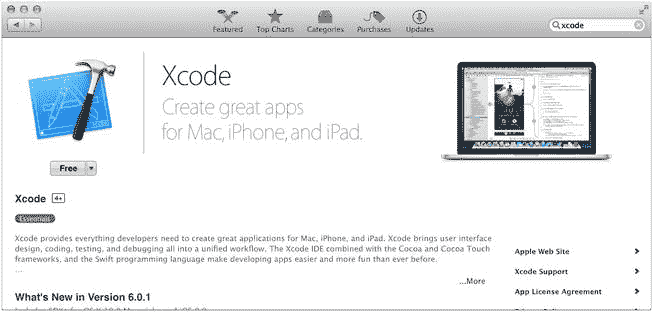
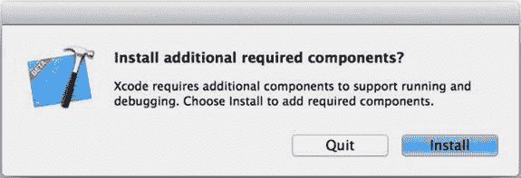
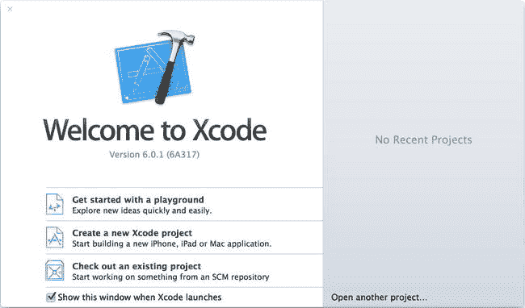
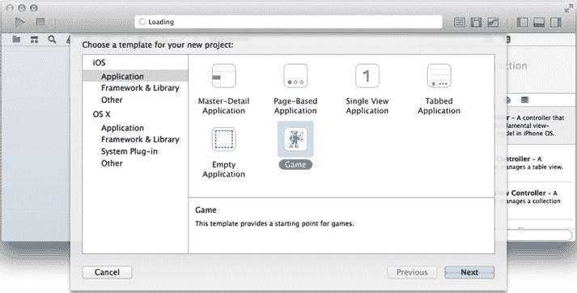
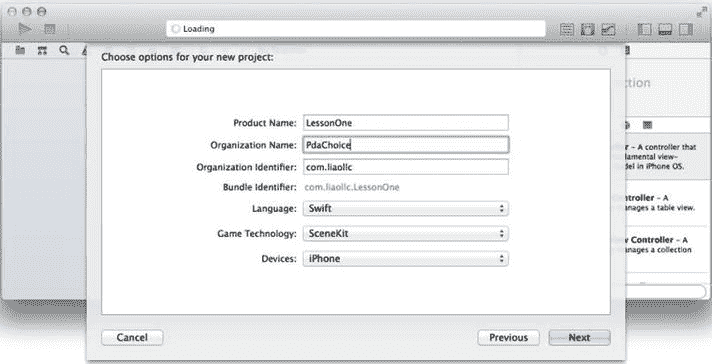
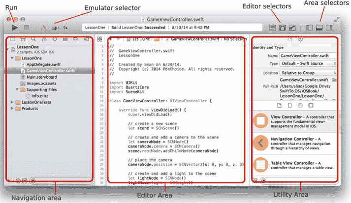
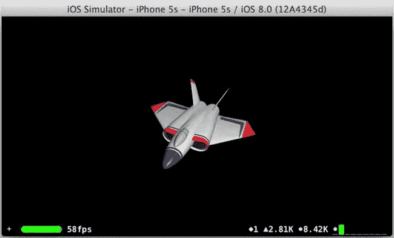

# 第 1 章：搭建开发环境

看到应用运行比阅读源代码更有趣，而且仅靠阅读书籍是无法获得实际编程经验的。让我们先让开发环境启动并运行，这样你就可以使用它——并在此过程中学习 iOS 的 Swift 编程。

## Xcode 和 iOS SDK

**ANDROID 类比**

Android 开发者工具（用于 Eclipse 的 `ADT` 插件或 Android Studio）。

`Xcode` 是用于构建 iOS 应用的完整工具集。它是一个集成开发环境（`IDE`），可帮助你构建、测试、调试和打包你的 iOS 应用。它是免费的，但你必须在运行 Mac OS X Mavericks 或更高版本的英特尔 Mac 上使用。在本书中，你将使用最新的 `Xcode` 6 版本。

### 从 Mac App Store 安装

`Xcode` 在 Mac App Store 中分发，它会自动为你处理下载和安装。只需单击一下即可开始下载和安装 `Xcode`，你将获得编译器、代码编辑器、iOS SDK、调试器、设备模拟器以及创建 iOS 应用所需的一切。图 1-1 展示了 Mac App Store 应用中的 `Xcode`。

图 1-1。Mac App Store 中的 Xcode

你需要做的就是从 Mac App Store 安装最新的 `Xcode`。完成安装后，继续从 **Applications** 文件夹启动 `Xcode`。将其保留在 Mac OS Dock 中，以便随时启动。

第一次启动 `Xcode` 时，它会立即提示你安装所需的组件（参见图 1-2）。单击 **Install** 完成 `Xcode` 的安装。

图 1-2。安装所需的组件

安装完成所需的组件后，你应该会看到图 1-3 中的截图。你的 iOS IDE `Xcode` 已准备就绪！

图 1-3。欢迎使用 Xcode

### 使用模板创建 iOS 项目

**ANDROID 类比**

`ADT` 中的 **新的 Android 应用项目** 模板。

你已经有了合适的工具；现在，难道你不想看看一些实际操作——比如创建一个 iOS 应用并看到它运行？我也想！这样做也是为了确保你的 `IDE` 工作正常。

实际上，当我完全不知道如何创建 Android 移动应用时，我就使用了 `ADT` 的 **新的 Android 应用项目** 模板创建了我的第一个 Android 应用。我当时只想快点看到一些东西运行起来。是的，`ADT` 很好地为我做到了这一点。当我感觉自己在不了解任何知识的情况下创建了一个 Android 应用时，我对自己非常满意！嘿，让自己开心没有错，对吧？

`Xcode` 也提供了同样的功能。本节的目标是向你展示如何尽快创建一个 iOS 应用。先保留所有编程问题，以便你能尽快完成项目。现在，请完成以下步骤：

1. 如果尚未启动 `Xcode`，请启动它。
2. 从 **欢迎使用 Xcode** 屏幕中选择 **创建新的 Xcode 项目**（参见图 1-3）。图 1-4 显示了提示你为项目选择模板的界面：
   1. 在图 1-4 的左侧面板中，选择 **iOS  Application**。
   2. 在图 1-4 的右侧面板中，你可以选择任何一个模板。为有趣起见，选择 **Game**。
   3. 单击 **Next** 按钮。

图 1-4。选择一个模板

### 3. 图 1-5 展示了需要填写的基本项目信息，具体如下：
   1. *产品名称*：这是应用名称。请将项目命名为 `LessonOne`。
   2. *组织名称*：可选；例如：**您的组织**或您选择的任意名称。
   3. *组织标识符*：与产品名称一起，*组织标识符*应能唯一标识您的应用。建议使用反向域名（例如 `com.yourdomain.xxx`）。
   4. *语言*、*游戏技术*和*设备*：无需更改这些设置。
   5. 完成后点击**下一步**按钮。
   6. 选择一个用于保存 `LessonOne` 项目的文件夹。

图 1-5. iOS 项目选项

就是这样！您刚刚创建了一个 iOS 项目——`LessonOne` 项目，如图 1-6 所示。

图 1-6. Xcode 项目导航器中的 `LessonOne` 项目

`LessonOne` 项目可在左侧面板中看到，如图 1-6 所示；这就是导航区域中的**项目导航器**。就像您使用 ADT 项目创建模板一样，Xcode 项目模板会创建项目文件夹、应用程序源代码以及构建 `LessonOne` 应用所需的所有资源。

## 构建项目

**安卓类比**

在 Mac 上，Eclipse ADT 构建操作的键盘快捷键与 Xcode 中的构建命令相同：`Command+B`（`z+B`）。在 Windows 中，Eclipse 的构建快捷键是 `Control+B`。

要构建和编译 Xcode 项目，请使用构建操作，该操作位于 Xcode 菜单栏 ** 产品  构建**（或 `z+B`）。您会习惯频繁使用 `z+B` 键盘快捷键，因为 Xcode 不会像 Eclipse ADT 默认自动构建代码那样自动构建您的代码。

## 启动应用

`LessonOne` 项目应该没有错误。您可以启动该应用，并在 iOS 模拟器上查看其运行情况。模拟器是任何 IDE 中非常重要的部分。与 ADT 不同，无需像 AVD 管理器那样创建模拟器。所有模拟器都直接位于 Xcode 中，您可以将 `LessonOne` 项目启动到选定的设备（包括 iOS 模拟器）上，只需点击左上角的三角形按钮，如图 1-6 所示。

或者，您可以使用 Xcode 的运行操作键盘快捷键 `Command+R`（`z+R`）来启动应用。您应该能看到 `LessonOne` 应用在 iPhone 模拟器上运行，如图 1-7 所示。

图 1-7. 模拟器中的 `LessonOne` 应用

尝试使用该应用，然后从设备模拟器选择器中选择其他模拟器（请参见图 1-6 中的指针）。在模拟器上的鼠标单击事件相当于触摸事件，而在触控板上的三指移动相当于在实际 iOS 屏幕上的触摸拖拽。如果你目前还没有特定设备，请务必尝试使用模拟器，以熟悉模拟的 iOS 设备。

**提示** 要切换为横屏或竖屏方向，请按 `z+左箭头` 或 `右箭头` 来旋转模拟器。

iOS 模拟器比 AVD 好得多——非常稳定且响应迅速，它们的行为就像真实设备一样。对于学习 iOS 的 Swift 编程来说，模拟器实际上更好，因为 iOS 开发者比 Android 开发者更频繁地使用模拟器。在本书中，您不需要在实际的 iOS 设备上运行应用；要做到这一点，您需要成为注册的 iOS 开发者并拥有一台 iOS 设备。您可以省下 99 美元的 iOS 开发者会员费，直到您准备向 App Store 提交第一个应用，或者您的应用需要模拟器不具备的某些功能（例如相机或某些传感器）时再考虑。目前，如果您的应用已启动并在 iOS 模拟器上运行，您的任务就完成了！

## 总结

通过安装 Xcode 6，您立即拥有一个功能完备的 IDE，可以轻松创建 iOS 应用。本章引导您完成了 Xcode 6 中的基本项目创建任务，使用 iOS 项目模板启动了您的第一个 iOS 项目。本章还向您展示了如何在 iOS 模拟器中构建和运行 iOS 应用。您尚未编写任何代码，但您的工具已正常工作且经过验证。您将在后续章节的引导练习中学习更多内容并获得动手编程经验。

