# 第 2 章

## iOS 编程基础

为 iOS 和安卓创建移动应用既有趣又有回报。有了 Xcode，您现在可以编写代码、构建并运行 iOS 应用了。在 Swift 于 2014 年苹果全球开发者大会上正式发布之前，Objective-C 一直是 iOS 应用的主要编程语言。如果您刚开始学习 iOS 编程，应该选择 Swift，因为没有理由选择旧方式而错过最新、最强大的功能。您的下一步应该是学习以下基础知识：

* Swift 编程语言
* iOS 项目结构和 Xcode 故事板编辑器

本章的目的是让您熟悉本书中的 Swift 代码。为了实现这一目标，您将创建一个 `HelloSwift` 项目，同时学习 **Swift 编程语言**的重点内容。

在本章的第二部分，您将创建另一个 Xcode iOS 项目。所有 iOS 应用都有一个用户界面（UI）。您通常首先使用最重要的 Xcode 工具——**故事板编辑器**创建 UI，该工具用于绘制 UI 控件和组件，并将它们连接到您的代码。在创建此 iOS 应用的过程中，您还将看到典型的 iOS 项目结构和组件。一开始您可能不需要了解 iOS 框架的所有内容，但第一堂故事板课程应“刚好足够”让您感受到不同的编程范式。之后，第 3 章 和 第 4 章 中的内容将继续提供常见编程任务和框架主题的逐步指导。按照这些对应说明操作，当您对整个应用有了更全面的了解时，这些概念将更容易被记住。

## Swift 语言概要

Swift 是用于创建 iOS 应用的最新编程语言，它在语言语法方面与 Java 有许多相似的规则和方面。我非常有信心，学习 Swift 语言不会成为您最大的障碍；Java 或 C# 开发者可以自然地掌握 Swift 代码。为了让您快速预览，表 2-1 展示了 Java 到 Swift 的快速对比：

表 2-1. Java 到 Swift 语言语法简要对比

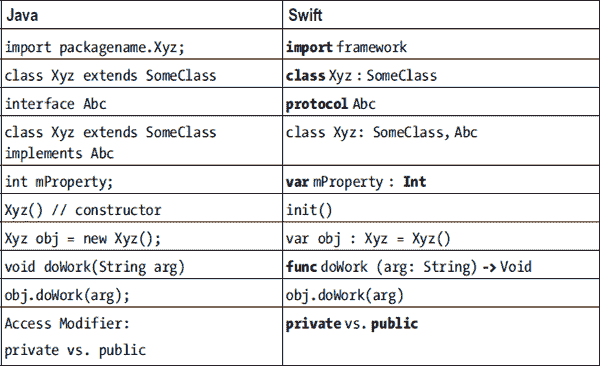


Swift 还定义了**文件**和**模块**访问控制：`private`、`public` 和 `internal`。虽然它们与 Java 中的对应概念含义不同，但如果你将每个类定义在单独的文件中，`private`/`public` 访问控制的使用方式是一致的。默认的 `internal` 访问控制在同一项目的任何文件中也是公开的，但在导入到其他项目时不可见。Swift 的 `internal` 控制对于创建框架项目（而非应用模块）更为实用。

## 使用 Xcode 的 HelloSwift

我不会正式地描述其用法和语法规则，而是让你亲自创建一个 `HelloSwift` Xcode 项目，并自行编写来自表 2-1 的代码清单。你还将执行以下常见的 Xcode 编程任务：创建类、构建并运行项目，以及使用调试器。

### 创建 Swift 命令行项目

我们来创建一个命令行 Swift 程序，因为它非常简单，你可以专注于 Swift 语言本身，而不被其他问题分散注意力。

请按照以下说明操作：

1.  如果 Xcode 6 未运行，请启动它。你应该会看到 **Welcome to Xcode** 启动界面，如图 1-3 所示。选择 **Create a new Xcode Project**（见图 1-3）。或者，你也可以通过从 Xcode 菜单栏中选择 **File → Project...** 来执行相同操作。
2.  在 **Choose a template for your new project** 屏幕中（见图 2-1），选择 **OS X → Application → Command Line Tool**。

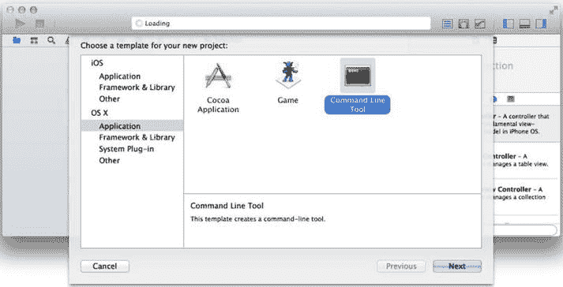

图 2-1. 选择 Xcode 模板

3.  按照你创建 `LessonOne` 项目时使用的屏幕说明（见第 1 章，“使用模板创建 iOS 项目”）来完成使用该模板创建新项目：
    - **Product Name（产品名称）**：`HelloSwift`
    - **Organization Name（组织名称）**：例如 `PdaChoice`
    - **Organization Identifier（组织标识符）**：例如 `com.liaollc`
    - **Language（语言）**：`Swift`
    - 完成后点击 **Next（下一步）** 按钮。
    - 选择一个文件夹来保存你的 `HelloSwift` 项目。

`HelloSwift` 项目会出现在 **Project Navigator（项目导航器）** 区域中（见图 2-2）。

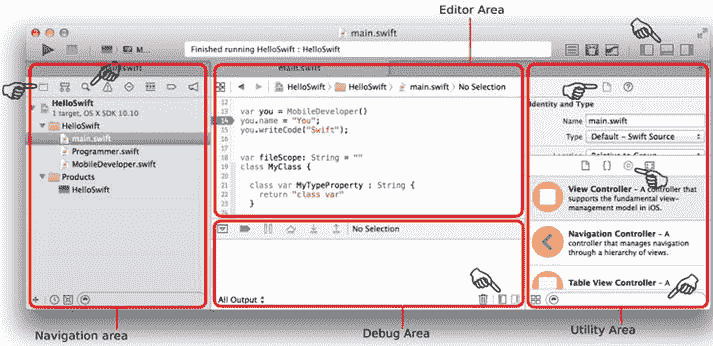

图 2-2. 创建 `HelloSwift` 项目

命令行模板会自动为你创建 `main.swift` 文件。这是程序的入口点，类似于 Java 中的 `main(...)`。你将在 `main.swift` 中编写代码，以演示常见的面向对象代码。

图 2-2 显示典型的 Xcode 工作区包含从左到右的三个区域和一个顶部工具栏。每个区域内都包含子视图，你可以使用选择栏进行切换。

-   **Project Navigator（项目导航器）** 区域位于左侧。类似于 Eclipse 的项目浏览器，在这里你可以看到整个项目结构，并选择要编辑的文件。该区域还有其他视图；例如，你可以通过在选择栏中选择搜索图标来启用搜索视图。
    -   中间的 **Source Editor（源代码编辑器）** 区域会在其编辑器中显示所选择的文件，你可以在其中编辑文件、编写代码或根据所选文件修改项目设置。**Console（控制台）** 和 **Variable（变量）** 视图位于 **Debug（调试）** 区域内。在调试会话期间，你很可能需要显示它们。你可以通过点击顶部和底部工具栏上的切换按钮来隐藏或显示它们。
    -   右侧的 **Utility（工具）** 区域包含多个 **Inspector（检查器）** 视图，这些视图允许你编辑整个文件或 **Source Editor** 中所选项的属性。根据所选文件类型的不同，顶部选择栏中将提供不同类型的检查器。例如，如果你正在编辑一个屏幕或 UI 部件，选择栏中会显示更多的检查器。该区域的底部称为 **Libraries（库）**。使用选择栏选择一个库视图。你可以从 **Libraries** 拖放项目到适当的编辑器，以可视化地修改文件内容。你将经常使用 **Object Library（对象库）** 来可视化地组合 UI。

点击选择栏上的任意图标，或将鼠标悬停在图 2-2 中的指针上，即可查看工作区中的悬停文本提示，以便熟悉 Xcode 工作区。这些子视图比 Eclipse 中的更紧凑，但本质上 Xcode 是一个用于相同目的的工具：编辑项目文件以及编译、构建、调试和运行可执行文件。你将在这本书中反复使用它。

### 创建 Swift 类

要创建一个新的 Swift 类，你可以在现有的 `main.swift` 文件中创建，或者按照 Java 惯例在其自己的文件中创建，如下步骤所示：

4.  展开新创建的 `HelloSwift` 项目，右键点击 `HelloSwift` 文件夹以调出文件夹上下文菜单（见图 2-3），然后选择 **New File...**
    1.  在 **Choose a template for your new file** 屏幕中，从左侧面板选择 **iOS → Source**，然后从右侧面板选择 **Swift File**。
    2.  保存文件并将其命名为 `MobileDeveloper.swift`。该文件应出现在你的项目中。

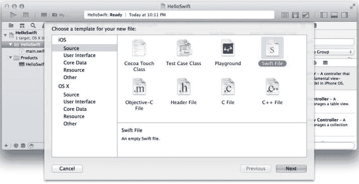

图 2-3. 从文件夹上下文菜单创建 Swift 类

5.  在 `MobileDeveloper.swift` 文件中输入代码清单 2-1 中的代码，以创建 `MobileDeveloper` Swift 类。

***代码清单 2-1***. 声明 `MobileDeveloper` 类

```
class MobileDeveloper {

}
```

**注意** 与 Java 不同，Swift 类不会隐式继承任何类。它可以独立作为基类。

6.  通过在类内部声明一个变量来创建一个名为 `name` 的属性（见代码清单 2-2）。这在 Swift 中称为**存储属性**，其中变量类型由所赋的值推断得出（在 Swift 中称为**类型推断**）。

***代码清单 2-2***. Swift 中的存储属性

```
class MobileDeveloper {
    var name = "" // var 类型由该值推断为 String
}
```

**注意** 分号 (`;`) 用于终止语句是可选的。

### 创建 Swift 协议

**Java 类比**

Java 接口定义了对象的职责。

在面向对象编程（OOP）中，定义一组期望某些对象具备的行为非常重要。在 Java 中，你声明一个**接口**；在 Swift 中，你声明一个**协议**。

通过以下操作创建一个名为 `Programmer` 的 Swift 协议：


```markdown

1. 右键点击`HelloSwift`文件夹，创建`Programmer.swift`文件。
2. 在**Source Editor**中，创建`Programmer`协议，其中包含方法`writeCode(...)`，如示例 2-3 所示。

***示例 2-3***. 声明`Programmer`协议

```
    protocol Programmer {
      func writeCode(arg: String) -> Void
    }
    ```

### 实现协议

#### JAVA 类比

实现一个 Java 接口。

要遵守 Swift 协议中定义的预期行为，标记的类必须实现协议中定义的方法。要使`MobileDeveloper`类实现`Programmer`协议，请执行以下操作：

1. 修改`MobileDeveloper.swift`，并声明`MobileDeveloper`类实现`Programmer`协议，如示例 2-4 所示。

***示例 2-4***. 遵守`MobileDeveloper`协议

```
    class MobileDeveloper : Programmer {
      ...
    }
    ```

**注意**：如果 Swift 类已有超类，请在它采纳的任何协议之前列出超类名称，后跟逗号（`,`）——例如，`class MobileDeveloper : Person, Programmer`。

2. 提供`writeCode(...)`方法的实现体，如示例 2-5 所示。

***示例 2-5***. 方法体

```
    class MobileDeveloper: Programmer {
      ...
      func writeCode(arg: String) -> Void {
        println("\(self.name) wrote: Hello, \(arg)")
      }
    }
    ```

**注意**：`\(self.name)`在带引号的`String`字面量内部首先被计算。

### 使用 Swift 实例

#### JAVA 类比

```
Programmer you = new MobileDeveloper();
you.setName("You");
you.writeCode("Java");
```

你已经创建了一个 Swift `MobileDeveloper`类，并实现了`Programmer`的职责，这与在 Java 中的做法基本相同，只是语法上有些许差异。使用该类时，原则上与 Java 相同，即从发送者调用接收者中定义的方法。修改`HelloSwift/main.swift`，如示例 2-6 所示。

***示例 2-6***. Swift 入口文件`main.swift`

```
var you = MobileDeveloper()
you.name = "You";
you.writeCode("Java");
```

## Xcode 调试器

了解如何在创建软件时使用调试器可以大大提高你的工作效率。请执行以下操作以查看 Xcode 调试器中的常见调试任务：

1. 要设置**断点**，请点击 Xcode 代码编辑器中的行号。图 2-4 展示了在`main.swift`文件中设置的一个断点。

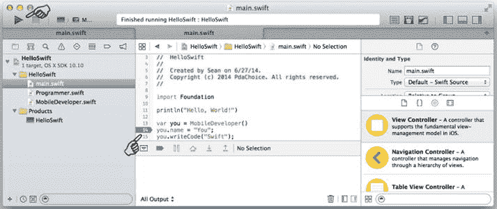

图 2-4. 断点

**注意**：要打开 Xcode 编辑器中的行号，请转到 Xcode 顶部菜单栏并选择 **Xcode  Preferences...  Text Editing  Show Line Numbers**。那里还有其他方便的设置，你可能想要查看（例如，快捷键在 **Key Binding** 下定义）。

2. 要运行`HelloSwift`项目，请点击左上角的三角形**运行**按钮，或按 **z**+R（参见图 2-5）。

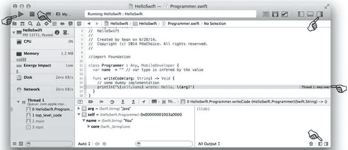

图 2-5. Xcode 调试

3. Swift 程序应该启动，然后在断点处停止，如图 2-5 所示。调试时，我通常根据需要打开或关闭以下子视图：
    1. 隐藏**导航**区域或切换到**调试导航器**以查看线程。
    2. 显示**调试**区域，带有调试工具栏、**变量**和**控制台**视图。
    3. 隐藏**实用工具**区域。

**堆栈跟踪**、**变量检查器**、**输出控制台**和**调试**工具栏在大多数 IDE（包括 Xcode 和 Eclipse）中都有相似的外观和感觉。

这完成了你的`HelloSwift`应用程序练习。随着你阅读本书中的 iOS 项目，你将发现更多关于 Xcode IDE 的生产力技巧。

## 更多关于 Swift 语言

很多 Java 语法和传统编码方法在 Swift 中也能很好地工作。然而，Swift 也有自己的非常简洁的特性，所以现在值得快速了解一下。

要学习本节内容，最好使用 Xcode 中名为 **Playgrounds** 的新功能。启动 Xcode 并选择 **Get Started with a playground**。你可以编写任何你想要的代码片段，并立即看到结果或语法错误。图 2-6 展示了 Playground：你在左侧面板编写代码，右侧面板立即呈现结果。

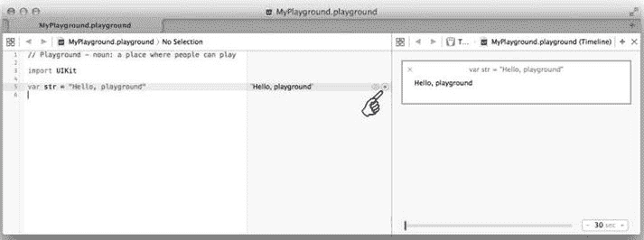

图 2-6. Xcode Playground

#### JAVA 类比

Java 草稿本。

## 变量和常量

使用`var`关键字声明变量，使用`let`声明常量。Java 变量总是在封闭的花括号内定义，而 Swift 变量如果在封闭的花括号外定义，则是全局变量。以下代码片段（参见示例 2-7）展示了 Swift 变量的用法：

***示例 2-7***. 常见变量用法

```
var GlobalVar : String = "Global Variable"; // 全局作用域

class MyClass {
  var mProperty : String = ""; // 类作用域
  let mConstant : Int = 0; // 常量

func myMethod(arg : String) {
    var aVar : String = ""; // 方法作用域内的局部变量
    let aConstant = 1;
  }
}
```

## 类型安全与类型推断

Java 和 Swift 都是类型安全的语言。任何变量都必须用类型声明；编译器将帮助标记任何不匹配的类型。在 Swift 中，如果类型可以根据其值推断出来，则不需要显式声明类型。示例 2-8 本质上与示例 2-7 完全相同。Swift 的类型推断功能鼓励开发者分配初始值，从而减少因未初始化数据导致的常见错误。

***示例 2-8***. 常见类型推断用法

```
var GlobalVar = "Global Variable"

class MyClass {
  var mProperty = ""
  let mConstant = 0

func myMethod(arg : String) {
    var aVar = "";
    let aConstant = 1
  }
}
```

## 可选变量

可选变量使用类型和后缀问号（`?`）声明，称为可选类型。这表示它所包含的值可能是缺失的（`nil`，相当于 Java 中的`null`），而不会是预期类型。例如，示例 2-9 展示了在 Swift 和 Java 中将字符串转换为整数的区别。

***示例 2-9***. Swift 中的可选类型 vs. Java 中的异常处理

```
////// Java NumberFormatException
String intStr = "123"; // or "xYz"
int myInt;
try {
  myInt = Integer.parseInt("234");
} catch (NumberFormatException e) {
  myInt = Integer.MAX_VALUE;
}

////// Swift Optional Int
var intStr = "123"
var myInt : Int? = intStr.toInt() // myInt 可以为 nil
```

可选类型通过鼓励开发者理解变量是否可能缺失，使 Swift 语言更类型安全、更健壮。示例 2-10 展示了两种实用的 Swift 可选类型用法：

*   **强制解包**，使用后缀感叹号（`!`）
*   **可选绑定**

***示例 2-10***. Swift 可选 Int

```
var intStr = "123"
var myOptionalInt : Int? = intStr.toInt() // 可选 Int
if myOptionalInt != nil {
  var myInt = myOptionalInt! // 解包 Int? 为 Int
  println("unwrapped Int: \(myInt)")
}
```

```

```swift
// 在 if 和 while 的局部作用域中使用可选绑定
if var myInt = intStr.toInt() {
  // myInt 已被自动解包
  println("已解包且处于局部作用域：\(myInt)")
}
```

## 隐式解包可选类型

针对某些变量在赋值后总会拥有值的情况，可以将变量声明为隐式解包可选类型，用 `!` 代替 `?` 作为后缀。例如：`var delegate: MyDelegate!`

前面描述的所有可选类型用法在此均适用。你可以将其视为可选类型，但无需强制解包。在 iOS 框架中，此类用法常见于那些在其他地方（例如由调用方）初始化的属性。尤其值得注意的是，iOS 框架中广泛嵌入了代理属性。这些代理被声明为隐式解包可选类型，但其值通常由调用方赋值。再举一例，UI 控件通常在 Storyboard 编辑器中绘制，并以 `IBOutlet` 属性的形式连接到代码中。这些 `IBOutlet` 属性也被声明为隐式解包可选类型。在此仅作简要说明，因为后续内容中你会频繁遇到这些用法。

## 元组

元组将多个值组合成一个复合值。这似乎是 Java 开发者（以及使用 C#、Objective-C、C/C++ 等语言的开发者）一直期待的有用特性。例如，无需创建类或结构体（Swift 也支持结构体）即可传递或返回值。代码清单 2-11 展示了最常见的元组用法。

***代码清单 2-11***. 常见元组用法

```swift
var xyz  = (x: 0, y: 0, z: 0)
println("xyz \(xyz) x 为: \(xyz.x)\ty 为: \(xyz.y)\tz 为: \(xyz.z)")

// 或解构元组
var xy : (Int, Int) = (1, 1) // 或简写为 var xy = (1, 1)
var (a, b) = xy
println("xy \(xy) x 为: \(a)\ty 为: \(b)")

func httpResponse() -> (rc: Int, status: String) {
  return (200, "OK")
}

var resp = httpResponse()
println("响应为: \(resp.rc)\t\(resp.status)")
```

## 集合

JAVA 类比

`java.lang.ArrayList` 和 `HashMap`。

`Array` 和 `Dictionary` 是 Swift 的两种集合类型。代码清单 2-12 展示了常见用法，包括以下内容：

*   初始化
*   使用下标语法访问和修改元素
*   常用集合 API

***代码清单 2-12***. 常见的 `Array` 和 `Dictionary` 用法

```swift
// 集合
var emptyArray = Array<String>() // 或 [String]()
var emptyDict = Dictionary<Int, String>() // [Int: String]()
var colors = ["red", "green", "blue"]
var colorDictionary = ["r" : "red", "g" : "green", "b" : "blue"]
colors.append("alpha") // 或: colors += "alpha"
colorDictionary["a"] = colors[3]
colors.insert("pink", atIndex: 2)
colors.removeAtIndex(2)
println(colors.isEmpty ? "empty" : "\(colors.count)")
```

常量 `Dictionary` 或 `Array` 是不可变的，意味着不允许添加或删除元素，也不能修改现有项。而变量 `Dictionary` 或 `Array` 则是可变的。

## 控制流

与 Java 类似，在 Swift 中可以使用 `if` 和 `switch` 进行条件判断，使用 `for-in`、`for`、`while` 和 `do-while` 实现循环。条件或循环变量两边的括号是可选的。代码块的花括号是必须的。代码清单 2-13 演示了以下常见的控制流用法：

*   `for-loop`
*   `for-in`
*   `while-loop`

***代码清单 2-13***. 控制流

```swift
for (var idx = 0; idx < 10; idx++) { // 括号可选
  println("for-loop: \(idx)")
}

for item in [1,2,3,4,5] { // 或 for item in 1...5
  println("for-in: \(item)")
}
for c in "HelloSwift" { // 遍历字符
  print(c)
}

for (key, value) in colorDictionary {
  println("for-in 字典:\(key) - \(value)")
}

// while-loop, 或至少执行一次的 do-while
var idx = 0
while idx < colors.count {
  println("while-loop:  \(colors[idx])")
  idx++
}
```

## Switch

在 Swift 中，switch 的 case 除了可以使用 `int` 基本数据类型，还可以是任何类型。代码清单 2-14 展示了 Swift 中改进的 `switch` 控制流用法：

*   合并 case 且隐式包含 break
*   使用区间范围的 case
*   使用元组的 case

***代码清单 2-14***. 改进的 Switch

```swift
var condition = "red"
switch condition {
case "red", "green", "blue": // 合并 case
  println("\(condition) 是一种原色")
  // 总是隐式 break（不继续执行）
case "RED", "GREEN", "BLUE":
  println("\(condition) 是大写形式的原色")
default: // 不再是可选的
  println("\(condition) 不是原色")
}

var range = 9 // 使用区间范围
switch range {
case 0:
  println("零")
case 0...9:
  println("一位数字")
case 10...99:
  println("两位数字")
case 10...999: // 第一个匹配即结束
  println("三位数字")
default:
  println("四位或更多数字")
}

var coord = (0, 1)
switch coord { // 使用元组
case (0...Int.max, 0...Int.max):
  println("第一象限")
case (Int.min...0, 0...Int.max):
  println("第二象限")
case (Int.min...0, Int.min...0):
  println("第三象限")
case (0...Int.max, Int.min...0):
  println("第四象限")
default:
  println("在坐标轴上")
}
```

`switch` 可以在其局部作用域内绑定匹配的值。您也可以指定 `where` 子句来测试条件。代码清单 2-15 演示了这两种值绑定方式。

***代码清单 2-15***. 临时值绑定与使用 `where` 子句

```swift
var rect = (10, 10)
switch rect {
case let (w, h) where w == h:
  println("\((w, h)) 是一个正方形")
default:
  println("矩形但不是正方形")
}
```

## 枚举

您使用 enum 为一组相关的值定义通用类型。枚举定义后，可以像使用任何 Swift 类型一样安全地使用它。代码清单 2-16 展示了常见的枚举用法：

*   带或不带原始值的枚举
*   关联值的枚举

***代码清单 2-16***. 常见枚举用法

```swift
enum DayOfWeek { // 原始值是可选的
  case SUNDAY, MONDAY, TUESDAY, WEDNESDAY,
  THURSDAY, FRIDAY, SATURDAY
}

var aDay = DayOfWeek.SUNDAY
switch aDay {
case DayOfWeek.SATURDAY, DayOfWeek.SUNDAY:
  println("\(aDay) 是周末")
default:
  println("\(aDay) 是工作日")
}

enum DayOfWeek2 :  String { // 分配原始值
  case SUNDAY = "Sun", MONDAY = "Mon", TUESDAY = "Tue",
  WEDNESDAY = "Wed", THURSDAY = "Thu", FRIDAY = "Fri", SATURDAY = "Sat"
}

var aDay2 = DayOfWeek2.SUNDAY
switch aDay2 {
case DayOfWeek2.SATURDAY, DayOfWeek2.SUNDAY:
  println("\(aDay2.rawValue) 是周末")
default:
  println("\(aDay2.rawValue) 是工作日")
}

// 关联值
enum Color {
  case RGB(Int, Int, Int)
  case HSB(Float, Float, Float)
}

var aColor = Color.RGB(255, 0, 0)
switch aColor {
case var Color.RGB(r, g, b):
  println("R: \(r) G: \(g) B: \(b) ")
default:
  println("")
}
```

## 函数

Swift 函数使用 `func` 关键字声明。与 Java 方法不同，参数和返回类型在类型名称之后声明。以下是您最可能遇到的典型 Swift 函数用法（参见代码清单 2-17）：

## Swift 编程语言特性

### 元组（Tuples）

- **元组**：您可以返回多个值而无需创建`struct`或`class`（参见清单 2-11）。
- **外部参数名**：应将外部参数名视为函数签名的一部分。所有 iOS Objective-C SDK API 都以外部参数名的方式移植到 Swift。
- **默认参数值**：此特性不仅提供了默认值，而且在许多情况下使方法重载比方法链更容易。
- **可变参数**：方法参数的可变长度，无需使用`Array`类型。
- **函数参数**默认是常量——这与 Java 规则不同。
- **Swift 函数**是引用类型。就像使用类类型一样，您可以将函数作为函数参数传递，或将其作为函数返回类型返回。在实践中，您会更频繁地使用闭包表达式。
- **闭包表达式**是 Swift 中定义的三种**闭包**类型之一。它是一个未命名的自包含代码块，可以作为函数参数传递。第二种闭包类型是这里提到的全局函数，它实际上是闭包的一种特殊情况。第三种闭包类型称为嵌套函数，在函数内部声明，本书中未使用。

***清单 2-17***. 函数用法

```
func doWork(parm : String) -> String { // simple form
  return "TODO: " + parm
}
println(doWork("Swift"))

// External parameter names is part of the func signature
func doWork2(name parm : String) -> String {
// arg = arg.uppercaseString; // error: constant parm
  return "TODO: " + parm
}
println(doWork2(name: "Swift"))

// use # to indicate same name for internal and external
func doWork3(#name: String) -> String {
  return "TODO: " + name
}
println(doWork3(name: "Swift"))

// With default parm value, it also implies #, same external name
func doWork4(name: String = "Swift") -> String {
  return "TODO: " + name
}
println(doWork4()) // default parm value

// parm is constant by default unless declaring it with var
func doWork5(var name: String = "Swift") -> String {
  name = name.uppercaseString;
  return "TODO: " + name;
}

// variadic parms
func sumNumbers(parms : Int...) -> Int {
  var sum = 0
  for number in parms {
    sum += number
  }
  return sum
}
println(sumNumbers(2,5,8))

// func is a type, can be used for parm or return type.
func separateByAnd(p1: String, p2: String) -> String {
  return p1 + " and " + p2
}
func printTwoString(p1: String, p2: String, format: (String, String)->String) {
  println(format(p1, p2))
}
printTwoString("Horse", "Carrot", separateByAnd)

// closure expression is unnamed func
printTwoString("Horse", "Carrot",
  {(p1: String, p2: String) -> String in
    return p1 + " and " + p2
  })
printTwoString("Horse", "Carrot",
  {p1, p2 in // type inferences
    return p1 + " and " + p2
  })
printTwoString("Horse", "Carrot",
  { // Inference and shorthanded parm names, $0, $1 ...
    return $0 + " and " + $1
  })
```

您可能一开始可以不用大多数简写选项，但对于 iOS 编程，您绝对需要习惯外部参数名，因为它们在 iOS 框架中被大量使用。

### 类（Class）

Swift 类包含与 Java 类相似的元素。最简单的类似 Java 的类形式如清单 2-18 所示。

***清单 2-18***. 简单的类似 Java 的 Swift 类

```
class SimpleClass {
  var mProperty : Int = 0 // public int mProperty ...
  var mConstant : String = "MyKey" // public String ...
  func myMethod(name: String) -> Void { println(name)}
}
```

### 属性（Property）

Java 字段可以映射到 Swift 属性，如前面的清单 2-18 所示；它们被称为**存储属性**。在 Swift 中，属性可以比 Java 字段做更多事情。清单 2-19 演示了以下 Swift 属性的用法：

- **存储属性**：Java 字段。
- **计算属性**：用于派生值。
- **属性观察器**：可选代码块，用于响应属性值的变化。
- **类型属性**：类似于 Java 类变量，但存储类型属性目前尚不支持 Swift 的`class`类型。由于现在支持`struct`类型属性，您可以选择定义内部`struct`作为移植 Java 静态变量的变通方法。

***清单 2-19***. Swift 类属性

```
class MyClass {
  var width = 10, height = 10 // stored properties

// computed properties, can have set as well
  var size : Int {
    get {
      return width * height
    }
  }

var size2 : Int { // readonly, shorthanded
    return width * height
  }

// property observer
  var depth : Int = 10 {
    willSet {
      println("depth (\(depth)) will be set to \(newValue)")
    }
    didSet {
      println("depth (\(depth)) was be set from \(oldValue)")
    }
  }

// Swift class Type property,
  class var MyComputedTypeProperty : String {
    return "Only computed Type property is supported"
  }

// use inner struct stored Type property as a workaround
  struct MyStatic {
    static let MyConst = "final static in Java"
    static var MyVar: String?
  }
}

println(MyClass.MyStatic.MyConst)
MyClass.MyStatic.MyVar = "class var in Java"
println(MyClass.MyStatic.MyVar)
```

### 方法（Method）

方法是在类型上下文（即类）中定义的函数。它们仍然是前面描述的函数（参见清单 2-17）。您可以像 Java 一样定义实例方法或类方法。清单 2-20 展示了以下典型的方法用法：

- 方法声明隐式强制使用外部名称，但第一个参数除外。这与全局函数不同（参见“函数”部分）。所有 iOS Objective-C 方法都使用此约定移植到 Swift。
- 使用`class func`声明类类型方法，或使用`static func`在结构体或枚举类型中声明类型方法。

***清单 2-20***. 常见方法用法

```
class MyClass {

///////// methods copied from Listing 2-17 //////////
  func doWork(parm : String) -> String { // just like func
    return "TODO: " + parm
  }

// default parm value, always imply externl parm name
  func doWork2(name: String = "Swift") -> String {
    return "TODO: " + name
  }

// func is a type, can be used for parm or return type, etc.
  func separateByAnd(p1: String, p2: String) -> String {
    return p1 + " and " + p2
  }

func printTwoString(p1:String, p2:String, format:(String, String)->String) {
    println(format(p1, p2))
  }

// Type methods, aka Java class static method
  class func DoWork(parm : String) -> String {
    return "TODO: (Just like Java class static method)" + parm
  }
}

var c = MyClass()
println(c.doWork("Swift"))
println(c.doWork2()) // default parm value
println(c.doWork2(name: "Swift")) // external name enforced

// closure is unnamed func
c.printTwoString("Horse", p2: "Carrot", format: c.separateByAnd)
// Inference and shorthanded parm names apply to method, too.
c.printTwoString("Apple", p2: "Orange", format: {
  return $0 + " and " + $1
  })

MyClass.DoWork("Swift Type method")
```

### 引用类型与值类型

就像在 Java 中一样，引用类型是通过引用传递的（实例的引用被复制到另一个变量），而值类型是通过复制传递的（整个值类型实例被复制到另一个内存空间）。但是，您确实需要注意某些差异：


- 与 Java 类似，自定义类是引用类型。基本类型、结构体和枚举是值类型。
- 与 Java 不同，一些常用的数据类型是值类型，包括`String`、`Dictionary`和`Array`（它们在 Swift 中不是类）。这非常好，但一开始可能会让你感到惊讶。
- 由于`Dictionary`和`Array`是值类型，它们在赋值时会被复制。如果包含的条目也是值类型，它们会被深拷贝。
- 你会遇到 Swift 的`NSString`、`NSArray`和`NSDictionary`，因为它们是从对应的 Objective-C Foundation 框架类直接移植过来的。它们都被实现为类，因此是引用类型。

## iOS 项目结构

大多数 GUI 应用程序不仅仅由编程源代码组成；例如，一个典型的 iOS 项目包含 Swift 或 Objective-C 源代码、库、故事板文件、图像或多媒体等非代码应用程序资源、应用程序信息属性`Info.plist`文件等等。Xcode 会编译并构建整个项目，并将应用程序所需的所有工件打包到一个扩展名为`.app`的归档文件中，然后使用相应的签名证书对`.app`文件进行签名。

让我们将一个简单的`HelloMobile` ADT 项目迁移到 Xcode，以便你能直观地了解典型 iOS 应用程序中的这些软件工件。图 2-7 中的 Android 应用程序是使用 ADT 的**创建 Android 项目**模板创建的：

- 它只有一个屏幕：一个 Java Fragment 类和一个布局文件。
- 在这个屏幕上，有一个`EditText`用于接收用户输入。当点击 **Hello...** 按钮时，它会在一个`TextView`上显示问候语。

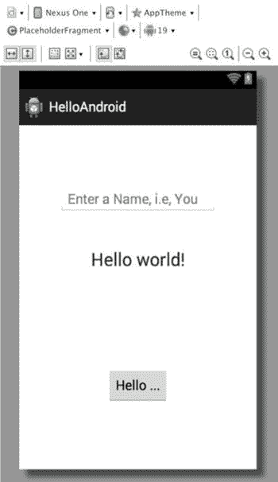

图 2-7. `HelloMobile`，Android 版本

要创建`HelloMobile` iOS 应用程序，启动 Xcode 并执行以下步骤：

1.  从 **Welcome to Xcode** 启动屏幕中选择 **Create a new Xcode project**（见图 1-3）。或者，你可以从 Xcode 的顶部菜单栏中选择 **File**  **New**  **Project**`...`。
2.  选择 **iOS Application**，然后选择 **Single View Application** 作为项目模板（见图 2-8）。

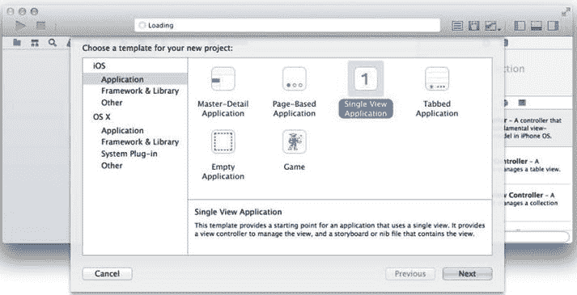

图 2-8. Single View Application 模板

3.  填写以下字段以完成新项目的创建：
    1.  *Product Name*：`HelloMobile`
    2.  *Organization Name*：例如，`PdaChoice`
    3.  *Organization Identifier*：例如，`com.liaollc`
    4.  *Language*：`Swift`
    5.  完成后点击 **Next** 按钮。
    6.  选择一个文件夹来保存你的`HelloMobile`项目。

基础版的`HelloMobile` iOS 项目已创建，并出现在 Xcode 的 **Project Navigator** 区域中（见图 2-9）。

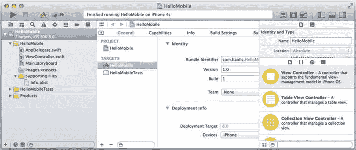

图 2-9. `HelloMobile`项目

它立即可运行。让我们检查一下 Xcode 项目中构成 iOS 应用程序的典型软件工件：

- `.swift`文件中的 Swift 类。有两个类：

    a. `AppDelegate.swift`：每个 iOS 应用程序都必须有一个`AppDelegate`类。类似于`android.app.Application`，如果你的程序不需要追踪全局应用程序状态，则无需修改此文件。

    b. `ViewController.swift`：有一个与内容视图配对的`ViewController`类。其预期用途与 Android 项目中的 Android Fragment 类相同：作为内容视图的内容视图控制器。

- 扩展名为`.storyboard`的`Main.storyboard`文件：

    a. 通常，你会为每个内容视图创建一个故事板场景，并且只对所有内容视图使用一个故事板文件，以便你能够直观地实现它们之间的链接。

- `Images.xcassets`。这是你将图像资源放入所谓“资源目录”的地方：

    b. 开发人员应为每种设备配置提供不同的资源。这与在 Android 中提供替代资源的目的一致。

    a. 截至目前，PNG 和 JPEG 图像格式都受支持。使用资源目录并非必须。你可以将任何资源文件拖入 Xcode 项目（你可能想自己创建一个文件夹来组织它们）。

- `Info.plist`文件。此文件描述了应用程序的配置方式以及系统需要了解的必需功能：

    a. 最好的 Android 类比是`AndroidManifest.xml`文件，但并不完全相同。你可以快速浏览此文件，以了解 Xcode 需要了解的关于应用程序的配置和设置。Xcode 最初以 XML 格式创建它，你可以直接编辑。

- 与必须遵循 ADT 项目文件夹结构的 ADT 项目不同，你可以按任何方式组织你的项目结构。例如，我通常会手动创建类似 Java 包的文件夹来组织我的 Swift 类，并创建一个`res`文件夹来组织任何资源文件，包括`Images.xcassets`。

    a. 在 Xcode 中，文件夹可以是浅蓝色的实际文件夹（例如，`Images.xcassets`文件夹）。

    b. Xcode 中的文件夹也可以只是一个标签，称为**group**，颜色为黄色（例如，`HelloMobile`、`Supporting Files`等）。它们的实际位置可能在任何物理子文件夹中，但你无需关心。

- Xcode 6 会自动为你主要的项目创建一个单元测试目标。它包含一个`TestCase`类框架，你可以在其中编写单元测试代码。虽然你不会在本书中使用此功能，但它实际上非常有用。
- **Project Settings** 和 **Target Settings** 指示 Xcode 如何编译和构建项目。要显示 Project Settings，请在 Xcode 的 **Project Navigator** 区域中选择顶级应用程序名称（见图 2-9）。Project Settings 编辑器会显示在 **Editor** 区域中：

    a. 对于这个简单的项目，你不需要修改任何东西。但你应该快速浏览编辑器，以大致了解 Xcode 编译和构建可执行文件所需的内容。

iOS 应用程序尚未完成，但它已具备典型 iOS 应用程序应有的一切。

## Xcode 故事板

**Android 类比**

ADT 中没有类似故事板的功能。你可以使用 Graphic Layout Editor 一次在一个布局文件中创建一个内容视图。

使用 Xcode 的故事板功能来直观地组合应用程序的用户界面。顾名思义，它不仅能创建独立的屏幕和 UI 小部件，还能让你将整个应用程序组合成一个故事板。由于 iOS 应用程序都是 GUI 应用程序，此工具将通过以下操作极大地决定你创建 iOS 应用程序的生产力：

- 从 **Object Library** 中拖放 **View Controller** 来创建一个内容视图，称为故事板 **Scene**。
- 从 **Object Library** 中拖放 UI 小部件到故事板 **Scene**（内容视图）上，并适当定位小部件。
- 实现 Auto Layout，使 UI 小部件和内容视图灵活适应各种屏幕尺寸，类似于 Android 的相对布局管理器。
- 为不同设备的特定 **size classes** 实现特定的内容视图。
- 通过 **outlets** 将 UI 小部件链接到视图控制器的属性，并编写代码响应 UI 小部件事件。
- 你甚至可以在故事板编辑器中绘制视图控制器的转场。

**Utility** 区域中还有其他子视图，你可以从顶部的选择器工具栏中选择。所有这些都很重要；你应该花点时间熟悉它们（见图 2-10）。


- **文件检查器：** 在 Xcode 中显示实际文件标识和文档类型选项。
- **快速帮助检查器：** 显示参考文档。
- **标识检查器：** 显示来自 SDK 的 Swift 类或与故事板中项目关联的自定义类。
- **属性检查器：** 这是我们现在的主要关注点。你会看到不同小部件有不同的属性。
- **尺寸检查器：** 显示小部件所在的矩形区域。
- **连接检查器：** 允许你绘制到视图控制器的连接。我稍后会讨论这一点（参见第 3 章中的“与内容视图交互”）。

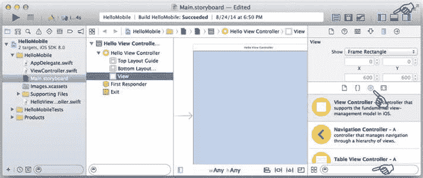

图 2-10。从对象库中选择 UI 组件

现在是时候让你熟悉 Xcode 的故事板功能了。iOS 的 `HelloMobile` 项目看起来还不同于对应的 Android 应用；它只在 `Main.storyboard` 文件中有一个屏幕，而且是空的。对应的 Android 布局文件有三个 UI 小部件：`EditText`、`TextView` 和一个 hello `Button`。

首先，你将实现 `HelloMobile` iOS 应用的用户界面。Xcode 故事板为此任务提供了所需的一切。

## 对象库和属性检查器

**Android 类比：** 从 ADT 图形布局编辑器的面板视图中拖放 UI 小部件，并在布局文件中设置小部件属性。

你需要向内容视图中添加三个 UI 小部件，就像对应的 Android 应用一样，步骤如下：

1.  在**项目导航器**中选择 `Main.storyboard` 文件。图 2-10 描绘了**编辑器**区域中的故事板编辑器。目前只有一个屏幕，称为故事板场景。
2.  在**实用工具**区域中，从库选择器栏选择**对象库**。你可以在这里找到用于组成故事板的 UI 小部件和元素。
3.  （可选）为了给故事板编辑器腾出更多空间，你可以通过选择切换按钮来隐藏**导航器**和**调试**区域，如图 2-10 所示。
4.  我将在第 3 章中讨论尺寸等级，这是 iOS 8 的一个重要新特性。目前，请禁用它：在**实用工具**区域的**文件检查器**中取消选中**使用尺寸等级**，如图 2-11 所示。这将为你提供一个更好的所见即所得的故事板编辑器。

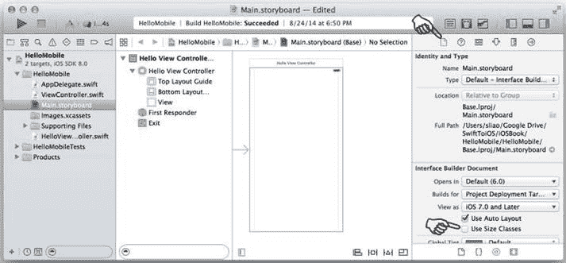

图 2-11。在文件检查器中禁用尺寸等级

5.  要将 UI 小部件添加到故事板场景，请从**对象库**中找到所需的 UI 小部件，并将其拖到故事板场景中的现有视图上。Android 和 iOS 屏幕都必须有一个根视图，任何视图元素都应该添加到父视图中。这就形成了父子视图层级。
    1.  你必须先选择父视图（参见图 2-11 中的指针），然后才能将 `TextField` 元素放置到其上。
    2.  你可以浏览并从**对象库**中选择 UI 小部件。列表很长，因此底部的搜索栏对于找到正确的小部件非常有用。输入 iOS 小部件的名称，如图 2-10 所示，或者输入你猜测的名称，尽可能多地输入字符。

**提示** 你需要的 iOS 小部件称为 `TextField`、`Label` 和 `Button`。

3.  要定位新添加的 `TextField`，请将其拖到你想要的位置。Xcode 会给出引导线，指示小部件何时位于某些常见关注位置，例如居中，或与其他任何小部件对齐（参见图 2-12）。


图 2-12。引导线

4.  图 2-13 显示了添加到故事板场景的三个简单 UI 小部件。

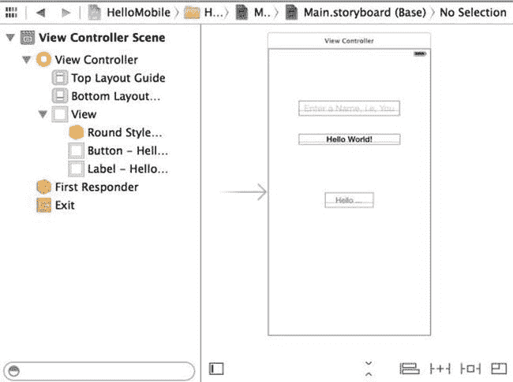

图 2-13。三个简单的 UI 小部件

6.  就像在 Android 中一样，Swift 中 UI 小部件的属性会影响小部件的外观、感觉和行为，你可以直观地更改它们。你可以在位于**实用工具**区域的**属性检查器**中找到并修改这些属性。要使 `TextField` 类似于 Android 对应的小部件，请修改以下属性：
    1.  字体大小：`System 24`
    2.  占位符（即 `android:hint`）："`输入姓名，例如：你`"
    3.  对齐方式：`居中`
    4.  `TextField` 有很多属性。浏览一下，你应该能够毫不费力地将它们与你通常在 Android `EditText` 中使用的对应属性联系起来。
    5.  切换到**尺寸检查器**视图，将宽度更改为 `200`。你需要拖动 `TextField` 以将其水平居中放置。
7.  要使 `Label` 小部件类似于 Android 对应的 `TextView`，请修改以下属性：
    1.  文本：例如， "`Hello World!`"
    2.  字体：例如， `System 20` 或 `Headline`
    3.  对齐方式：`居中`
    4.  行数：`1`
    5.  切换到**尺寸检查器**，将宽度更改为 `200`。你需要拖动标签以将其水平居中放置。
8.  要使 `Button` 小部件类似于 Android 对应的小部件，请修改以下属性：
    1.  文本："`Hello World!`"
    2.  标题："`Hello ...`"
9.  要在 Xcode 中预览你的故事板，请在工具栏上选择**助理编辑器**按钮，然后在助理编辑器中选择**预览**，如图 2-14 所示。

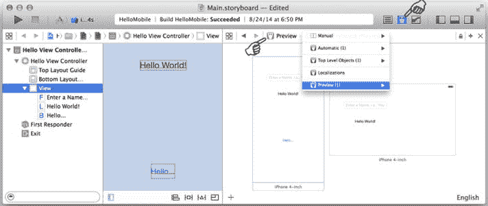

图 2-14。添加到故事板的三个简单小部件

纵向模式的外观和感觉对于我们当前的目的来说已经足够接近了：使用故事板直观地组成内容视图，而无需编写一行代码。iOS 的 `HelloMobile` 尚未完成：`Hello ...` 按钮并未显示 “Hello...” 字样，而且横向模式也尚不可接受。这两个都是重要主题，在第 3 章中有各自的章节。

在这个练习中，我只是想让你快速浏览一下 Xcode 的故事板编辑器。Xcode 工作区看起来与 Eclipse 有很大不同。花点时间熟悉 Xcode 工作区，包括故事板编辑器、**实用工具**区域、选择器工具栏等。Xcode 故事板是一个非常重要的工具，它在创建 iOS 应用时将极大地影响你的生产效率。

## 总结

从表面上看，本章中你实际上学到了很多东西。我们从讨论 Swift 与 Java 语言的对比开始，了解它们的相似之处，然后我们回顾了 Swift 语言主题以突出新的语言特性。然而，本书的其余部分将侧重于 iOS 编程，而不是 Swift 语言。代码将注重可读性，而不是使用新技巧来追求简洁。你阅读本书其余部分的所有 Swift 代码肯定不会有问题。不过，迟早你会需要 Swift 编程语言的参考文档，该文档可在 iTunes 上免费获取（`https://itunes.apple.com/us/book/swift-programming-language/id881256329`）。

你使用 Xcode 创建了一个 `HelloMobile` iOS 项目，以便可视化典型的 iOS 应用结构，从而能够直观地理解。你还初步体验了 Xcode 故事板，它非常重要，你将在每个 iOS 应用中用到它，包括本书中的所有示例项目——所以请准备好反复接触故事板。

## 第二部分

### 移植路线图


在第二部分，你将按照 iOS 的思维过程来规划和构建 iOS 应用，这一过程可以借助常见的自顶向下的设计方法，用 Android 术语加以解释。完成第二部分后，你将能够创建具有丰富 UI 组件且简单但有意义的 iOS 应用，并能处理本地及远程的常见 CRUD 操作。

你的迁移至 Swift 路线图遵循常见的自顶向下方法，在涉及底层实现时会使用你熟悉的 Android 术语提供翻译指南，这样你就能将其与你通常在 Android 中执行的移动端功能联系起来。

第二部分展示了你在 Android 应用中常见的屏幕导航模式，以及如何在 iOS 应用中执行相同的任务。你不仅会得到一个可运行的高级 iOS 故事板，还会获得类似 Android MVC 结构的类，这些类与对应的 Swift 类相映射。第二部分的剩余部分提供了如何将常见的移动端实现任务从 Android SDK 转换到 iOS SDK 的指南——包括 UI、数据保存、网络等——这些任务几乎在所有 Android GUI 应用中广泛使用。再次强调，完成第二部分后，你将能够创建简单但有意义的 iOS 应用。

