# 第 3 章：构建你的应用

为了实现你的软件，你需要根据如何将代码组织成类来构建应用结构，并据此做出设计决策。为了提前确定你的 iOS 应用结构，推荐使用自顶向下的方法和模型-视图-控制器（MVC）设计模式，而它们实际上已内置于 iOS SDK 和工具中。MVC 也隐式地内置于 Android SDK 中（使用不同的词汇），如果你习惯使用自顶向下的方法创建 Android 应用——先设计应用程序工作流程，再细化每个屏幕——那么在 iOS 和 Android 之间切换编程思维过程对你来说会更加容易。

在这第一步中，你的目标是实现与 Android 对应类在类级别的映射。我将首先讨论 MVC，然后介绍如何在 Xcode 中创建 iOS 故事板。借助引导式的屏幕导航模式，你的 iOS 故事板会自然地将 iOS 应用分解为 MVC 组件，这些组件可以与 Android 中的对应组件进行映射。

## 模型-视图-控制器

**Android 类比**

- **内容视图**：布局文件
- **内容视图控制器**：`Fragment` 类
- **委托**：Java 事件监听器
- **容器视图控制器**：协调其中子 `Fragment` 的 `Activity` 类

MVC 立即将 GUI 应用分为三层。iOS MVC 设计模式规定，一个 GUI 应用由数据**模型**、呈现**视图**和**控制器**层组成，如图 3-1 所示。

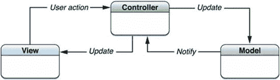

图 3-1。iOS MVC 设计模式

虽然在 Android SDK 中似乎没有明确定义 MVC 词汇，但它通过布局文件和 `Fragment` 类隐式地强制将内容视图与内容视图控制器分离。

在 iOS 中，你显式地使用 MVC 词汇：内容视图和内容视图控制器。你自然地将 iOS 应用分解为 MVC 类，首先使用 Xcode 故事板编辑器创建一个故事板原型。

除非你的应用只有一个屏幕，否则你需要决定如何在多个视图控制器之间实现导航和屏幕切换。你需要一个可选的 MVC 参与者：容器视图控制器。在 Android 中，似乎没有明确的框架类能为你完成这项工作。然而，`Activity` 和 `Fragment` 之间的父子关系使得父 `Activity` 自然成为容器视图控制器参与者的候选者。在实践中，我使用父 `Activity` 来管理子 `Fragment`，包括处理导航代码。

在 iOS 中，SDK 提供了几个用于屏幕导航的容器视图控制器；你只需选择合适的容器视图控制器类，让 iOS 框架为你简化这些任务。

我将从内容视图和内容视图控制器开始，然后讨论容器视图控制器。

## 内容视图

**Android 类比**

Android 布局文件。

内容视图提供一个可见区域，使用户能够与应用交互。内容视图定义了如何渲染自身内容，并能响应用户操作。要在 iOS 中创建内容视图，请使用 Xcode **故事板**。

回想一下，在 iOS `HelloMobile` 应用中，你以与在 ADT 中非常相似的方式在故事板场景中绘制 UI 小部件：拖放小部件以在父视图上绘制它们。然而，这个 iOS 内容视图尚未适应其他设备类型和屏幕方向。你可以很容易地在**辅助编辑器**预览中观察到横屏问题（见图 2-14）。为各种屏幕尺寸创建自适应内容视图是 iOS 和 Android 中的常见任务。在 Android 中，你通过备选布局资源和布局管理器来实现这一点。在 iOS 中，你主要使用 iOS 平台特性来实现相同的目的：

- **自动布局**：这在与屏幕尺寸无关/自适应的响应式 UX 设计中效果最佳。
- **尺寸类别**：为针对不同屏幕尺寸定制屏幕提供了最大的灵活性。

### 自动布局

**Android 类比**

```
RelativeLayout。
```

你可以将 iOS 自动布局视为 Android 的 `RelativeLayout`：通过与相邻部件或父视图对齐或留空来定位每个 UI 小部件。

当前的 iOS `HelloMobile` 项目中的三个小部件在横屏模式下位置不正确（见图 2-14）。在学习其用法的同时，使用 iOS 自动布局来解决这个问题。

虽然自动布局非常强大，但某些 Xcode 编辑器或操作隐藏在菜单中，初学者可能难以找到。图 3-2 提供了一些快速提示：

- 如果你找不到任何编辑器或导航器，请前往 Xcode 顶部菜单栏中的 **View  ...**。
- 自动布局操作分组在 Xcode 顶部菜单栏的 **Editor  ...** 中。
- 故事板编辑器的底部工具栏中有四个小按钮。它们提供快速的自动布局操作，并给你一些视觉提示。
- **辅助编辑器**是你接下来要使用的。
- **实用工具**区域中的视图选择器允许你在多个检查器之间切换。你将在下一章中大量使用它们。

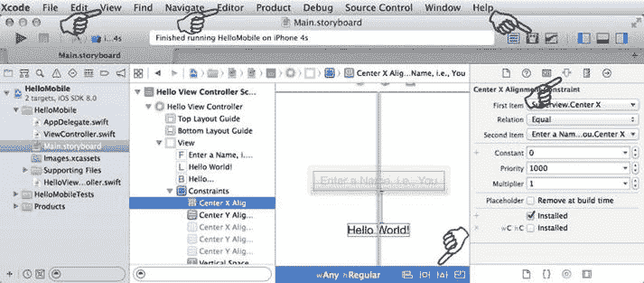

图 3-2。Xcode 中的故事板自动布局操作

继续处理 `HelloMobile` 项目。执行以下操作：

1. **辅助编辑器**中的故事板**预览**对于立即查看所选故事板场景的任何更改非常有用：
    1. 选择 `main.storyboard` 文件并打开**辅助编辑器**（见图 3-3 中的右侧指针）。
    2. 点击**辅助**菜单按钮选择预览（见图 3-3 中的左侧指针）。

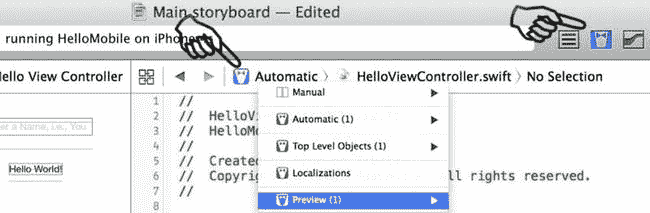

图 3-3。到达 Xcode 故事板预览的两个步骤

2. 将 `TextField` **在容器中水平居中**，以创建一个 x 轴对齐约束，如图 3-4 所示：
    1. 在故事板编辑器中选择 `TextField`。
    2. 在 Xcode 顶部菜单栏中，选择 **Editor  Align  Horizontal Center in Container**。

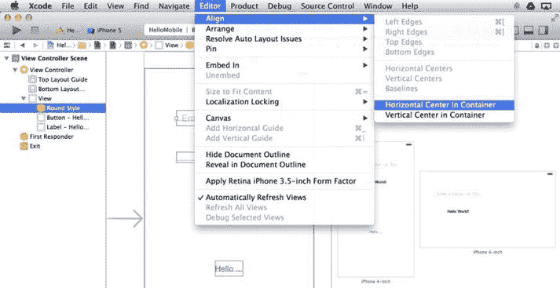


[内容]
图 3-4. 在自动布局编辑器中，对 `TextField` 使用**容器内水平居中**。

3.  使用**容器内垂直居中**创建 Y 轴对齐约束（参见图 3-5）：
    1.  在 Xcode 顶部菜单栏中，选择 **编辑器  对齐  容器内垂直居中**。
    2.  在**工具区**的**属性检查器**中，要将 `TextField` 置于视图高度的六分之一处（而非一半），可以将**乘数**设置为 3。

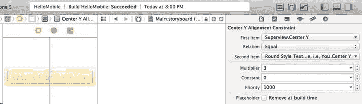

图 3-5. 使用乘数创建 Y 轴对齐约束

**注意** 使用乘数或常量来偏移第二个元素的位置：

`（第一个元素中心位置）==（第二个元素中心）* 乘数 + 常量`

4.  选择**解决自动布局问题  更新框架**，如图 3-6 所示。

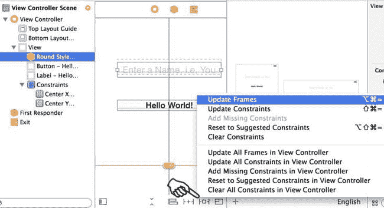

图 3-6. 使用**更新框架**根据约束重新定位 UI 控件

5.  选中“Hello World!”标签，点击**固定**按钮，为适合的间距和控件高度添加多个约束，如图 3-7 所示：
    1.  将**顶部**间距固定到最近的控件 `TextField`，值为 `48.5` 像素。
    2.  将**前导**和**尾部**间距都固定到最近的控件（其父视图 `View`），值为 `60` 像素。
    3.  将其**高度**固定为 `21` 像素。

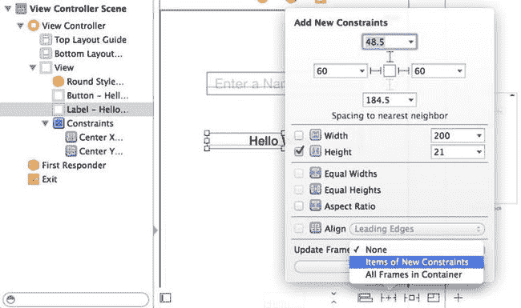

图 3-7. 设置“Hello World!”标签相对于相邻元素的间距

**注意** 合并后的约束必须合理且无歧义。你可以为每个单独的约束设置优先级。然而，如果你开始使用优先级来解决冲突，可能需要考虑使用更少的约束来实现目标。

6.  选中 `Hello...` 按钮。可以像 `TextField` 一样对其对齐：
    1.  使用**容器内水平居中**创建 X 轴对齐约束。
    2.  使用**容器内垂直居中**创建 Y 轴对齐约束，并将**乘数**设置为 `0.75`。

结合响应式用户体验设计使用自动布局，可以立即获得合适的横屏布局。图 3-8 展示了 iPhone 4 英寸和 3.5 英寸模式下横屏和竖屏的预览效果。点击 **+** 图标（参见图 3-8 中的指针），可以为不同设备添加多个预览。

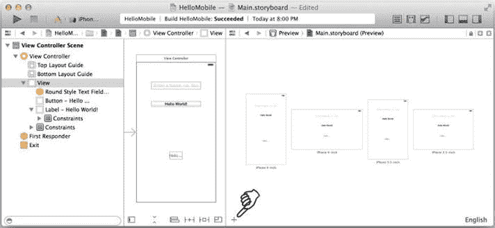

图 3-8. 响应式用户体验设计的自动布局

### 尺寸类别

**安卓类似概念**

为不同屏幕尺寸提供备选布局资源。

虽然自动布局为不同屏幕尺寸实现响应式用户体验提供了一种有效方法，但它可能无法以最高效的方式利用宝贵的移动屏幕空间。例如，由于不同的宽高比，横屏视图通常与竖屏不同，或者需要特定于平板电脑的用户体验设计等等。

在 iOS 8 之前，通常需要实现两个 Storyboard，一个用于 iPhone，一个用于 iPad。这一概念与 Android 针对不同屏幕尺寸的备用布局资源非常相似。从 iOS 8 开始，引入了**尺寸类别**，通过使用水平宽度和垂直高度的抽象表示来描述设备尺寸，从而解决了这一常见的编程问题。当前 iOS 设备可以分类如下表 3-1 所示。

表 3-1. iOS 设备尺寸类别

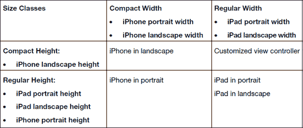

你可以将所有尺寸类别的实现都放在一个 Storyboard 中！
[/内容]


回想一下 iOS 的`HelloMobile`应用——它只在 iPhone 竖屏模式下工作（参见图 2-14），并且禁用了“尺寸等级”（Size Classes）功能。现在你应该启用尺寸等级来演示其用法。请执行以下操作：

1. 如图 3-9 所示，在**文件检查器**（File Inspector）中（通过顶部两个指针指示的位置访问），启用**使用尺寸等级**（Use Size Classes，底部指针）。

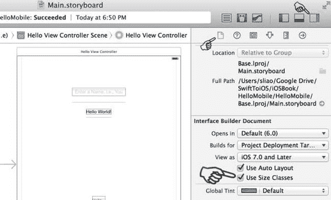

图 3-9. 启用使用尺寸等级

2. 使用**助理编辑器**（Assistant Editor）预览 iPhone 和 iPad 屏幕。尺寸等级一开始可能会让人不知所措，但我发现预览功能非常有帮助（参见图 3-10）。
    1. 场景被转换为最具适应性的尺寸等级：(`wAny hAny`)。自动布局约束也在此尺寸等级中保留。你可以立即看到 iPad 场景按预期工作。

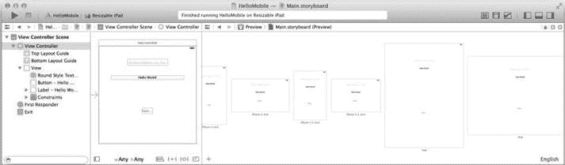

图 3-10. 尺寸等级预览

3. 点击**尺寸等级**控件来选择尺寸等级（参见图 3-11）。
    1. 将鼠标悬停，可以看到高亮和标题的变化。与表 3-1 进行比较，你可以选择针对特定尺寸等级的行和列。默认是**任意宽度 | 任意高度**（Any Width | Any Height），它最开始适用于所有尺寸等级。

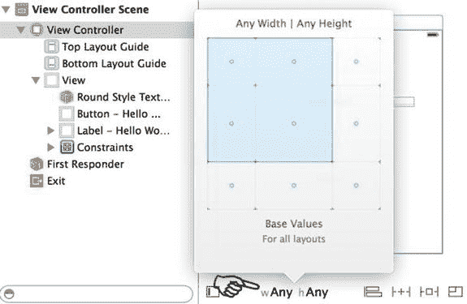

图 3-11. 使用尺寸等级选择器选择特定的尺寸等级

4. 要为 iPhone 横屏场景提供特定布局，请选择**紧凑宽度 | 紧凑高度**（Compact Width | Compact Height），如图 3-12 所示。

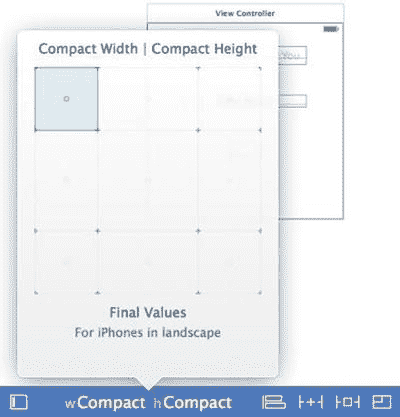

图 3-12. 横屏模式下的 iPhone 使用**紧凑宽度 | 紧凑高度**

5. 为了演示强大的尺寸等级功能，请为紧凑-紧凑尺寸等级重新开始。从顶部菜单栏中，依次选择**编辑器**（Editor）**解决自动布局问题**（Resolve Auto Layout Issues）下的**清除视图控制器中的约束**（Clear Constraints in View Controller）。这只会清除所选尺寸等级中的自动布局约束；你可以看到约束仍然存在，但已变为灰色。
6. 拖曳控件以重新定位它们，快速构思即可——你不需要精确对齐（参见图 3-13）。
    1. 既然你正在为横屏模式下的 iPhone 显式提供自定义布局，你其实可以精确地绘制位置，然后通过从顶部菜单栏依次选择**编辑器**（Editor）**解决自动布局问题**（Resolve Auto Layout Issues）下的**重置为视图控制器中的建议约束**（Reset to Suggested Constraints in View Controller），让故事板完成其余工作。
    2. 如果你尝试了上一步，请再次选择**清除视图控制器中的约束**（Clear Constraints in View Controller），以便为创建自动布局约束提供一个干净的起点。

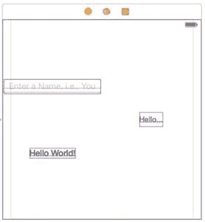

图 3-13. 紧凑高度（iPhone 横屏模式）的双面视图

7. 对于`TextField`，添加以下自动布局约束：
    1. 使用**容器中水平居中**（Horizontal Center in Container）创建一个 X 轴对齐约束，**倍率**（Multiplier）设置为**2**。
    2. 使用**容器中垂直居中**（Vertical Center in Container）创建一个 Y 轴对齐约束，**倍率**（Multiplier）设置为**1.5**。
    3. 从顶部菜单栏中，依次选择**编辑器**（Editor）**解决自动布局问题**（Resolve Auto Layout Issues）下的**更新帧**（Update Frame）。
    4. 要更新现有约束，可以从故事板导航器中选择约束，或者先在场景中选择控件，然后看到并点击故事板场景中的引导线。使用**实用工具**（Utility）区域中的**属性检查器**（Attributes Inspector）（参见图 3-14）来更新任何约束属性。

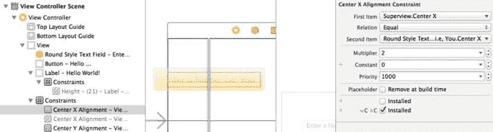

图 3-14. 更新自动布局约束

8. 对于`Label`，按照步骤 7 中的相同方式添加以下自动布局约束：
    1. 使用**容器中水平居中**（Horizontal Center in Container）创建一个 X 轴对齐约束，**倍率**（Multiplier）设置为**2**。
    2. 使用**容器中垂直居中**（Vertical Center in Container）创建一个 Y 轴对齐约束，**倍率**（Multiplier）设置为**0.75**。
    3. 从顶部菜单栏中，依次选择**编辑器**（Editor）**解决自动布局问题**（Resolve Auto Layout Issues）下的**更新帧**（Update Frame）。
9. 对于`Button`，按照步骤 7 中的相同方式添加以下自动布局约束：
    1. 使用**容器中水平居中**（Horizontal Center in Container）创建一个 X 轴对齐约束，**倍率**（Multiplier）设置为**0.67**。
    2. 使用**容器中垂直居中**（Vertical Center in Container）创建一个 Y 轴对齐约束，**倍率**（Multiplier）设置为**1**。
    3. 从顶部菜单栏中，依次选择**编辑器**（Editor）**解决自动布局问题**（Resolve Auto Layout Issues）下的**更新帧**（Update Frame）。

预览中的所有设备类别看起来都符合预期（图 3-15）。

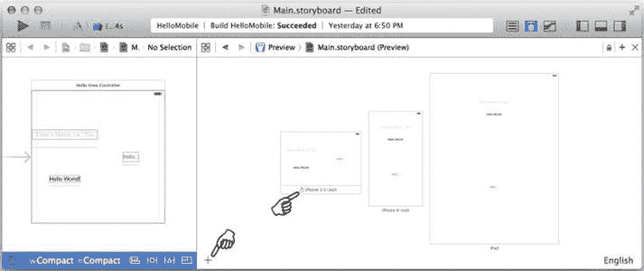

图 3-15. 在故事板编辑器中预览的设备类别

你可以运行所有模拟器中的应用来查看实际效果。iPhone 4s 模拟器如图 3-16 所示。

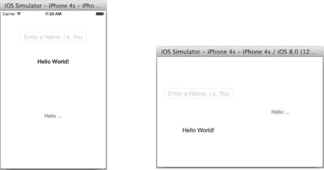

图 3-16. iPhone4s 竖屏和横屏尺寸等级

## 内容视图控制器

#### Android 类比

`Fragment`。

内容视图控制器参与者与内容视图配对（参见**图 3-1**）。在 iOS 和 Android 编程范式中，内容视图通常静态创建（即通过`layout.xml`或故事板）。内容视图控制器类管理内容视图，通过向用户传递信息并与之交互来呈现用户界面的动态行为。你通常在 Android 中继承`Fragment`来创建你的内容视图控制器。在 iOS 中，你创建一个继承自`UIViewController`的类以达到相同目的。

你的主要内容视图控制器任务是：

*   与其自身的内容视图配对
*   保持对内容视图中 UI 控件的对象引用
*   实现响应控件事件的方法。

在 iOS 中，你通常使用故事板编辑器将 UI 控件或事件连接到你的代码，以简化这些常见的编程任务。

## 与内容视图配对

#### Android 类比

在`Fragment.onCreateView(...)`中填充`layout.xml`文件。

在 iOS 中，你通常首先为你的应用创建一个故事板（就像 iOS 的`HelloMobile`项目）。通常，对于每个故事板场景（内容视图），你创建一个继承自`UIViewController`的 Swift 类与之配对。

iOS 的`HelloMobile`项目尚未完成：它只渲染了初始屏幕，但当你点击`Hello...`按钮时什么也不做。你需要一个能够履行此职责的功能性内容视图控制器。**单视图应用**（Single View Application）模板已经为你配对了一个控制器类：`ViewController.swift`。为了完整演示这个主题，请勿使用此类；而是执行以下操作来创建我们自己的类：

1. 为新的 Swift 类创建一个新文件：

   1. 右键点击**导航器**（Navigator）区域中的`HelloMobile`文件夹，然后依次选择**新建文件...**（New File ...）**iOS** **源**（Source）**Swift 文件**（Swift File）（参见图 2-3）。
     2. 将文件保存为`HelloViewController.swift`。
     3. 创建继承自`UIViewController`的`HelloViewController`类，如代码清单 3-1 所示。

***代码清单 3-1***. `HelloViewController`类框架


```swift
import UIKit
class HelloViewController: UIViewController {
  // TODO
}
```

2.  将故事板场景与 `HelloViewController` 类配对（参见图 3-17）：
    1.  选择 `Main.storyboard` 以打开故事板编辑器。
    2.  在故事板场景中选择视图控制器，然后在**工具**区打开**身份检查器**。
    3.  在**自定义类**字段中输入 `HelloViewController`，将故事板场景与 `HelloViewController` 类配对。

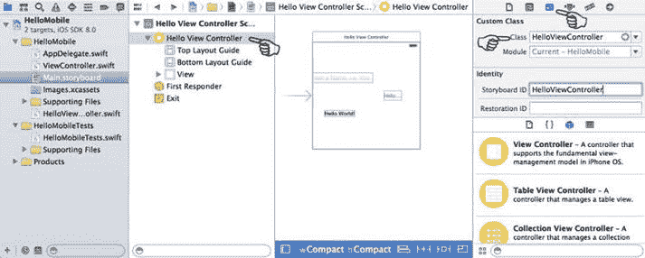

图 3-17. **身份检查器**，用于与视图控制器配对

在**身份检查器**中指定自定义类，即可完成与内容视图控制器的配对。

## 与内容视图交互

**Android 类比** 在 Fragment 视图控制器类中，使用 `rootView.findViewById(...)` 获取对象引用。使用 `setOnXxxListener(...)` 方法注册事件监听器。

通常在 Android 和 iOS 中，你会在内容视图中创建 UI 控件，然后由内容视图控制器代码在运行时更新控件状态或与用户交互。在 iOS 中，你可以使用**连接检查器**创建 `IBOutlet` 和 `IBAction`，通过将连接拖拽到 Swift 类中的代码来简化这一常见编程任务：

*   `IBOutlet`：连接到故事板场景中控件的视图控制器属性。
*   `IBAction`：当控件事件发生时被调用的视图控制器方法。

以下步骤将引导你完成 UI 控件的连接，并将操作事件委派给控制器类：

1.  选择 `Main.storyboard` 以打开故事板编辑器。
    1.  打开故事板的**辅助编辑器**。`HelloViewController` 类应自动在辅助编辑器中打开。
    2.  有时**辅助编辑器**可能不会自动打开正确的文件，因此你可能需要手动选择正确的文件（参见图 3-18）。

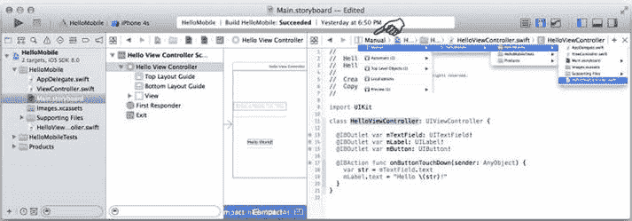

图 3-18. 在**辅助编辑器**中手动选择文件

2.  在故事板场景中选择 `TextField`（图 3-19 中的左侧指针），然后打开**连接检查器**（图 3-19 中的右侧指针），如图 3-19 所示（确保**工具**区域已展开）。

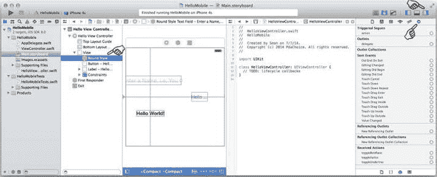

图 3-19. 打开**连接检查器**

3.  为故事板场景中的 `TextField` 创建一个 `IBOutlet`（参见图 3-20）。
    1.  用三根手指（或同时按住左触控板按钮）拖拽**新建引用插座**旁边的圆圈，并将其拖放到类内部。你应该会看到如图 3-20 所示的从圆圈引出的连线。
    2.  输入连接名称（例如 `mTextField`）。这将在 Swift 类中创建一个属性。

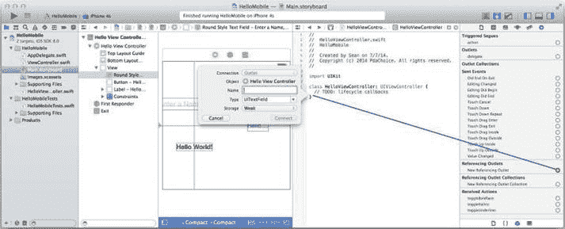

图 3-20. **连接检查器**中的 `IBOutlet`

4.  重复步骤 2 和 3，创建 `mLabel` 和 `mButton` 的 `IBOutlet`。
5.  为按钮的按下事件创建一个 `IBAction`。
    1.  拖拽**已发送事件**部分中**按下**旁边的圆圈，并将其拖放到 Swift 类内部（参见图 3-21）。

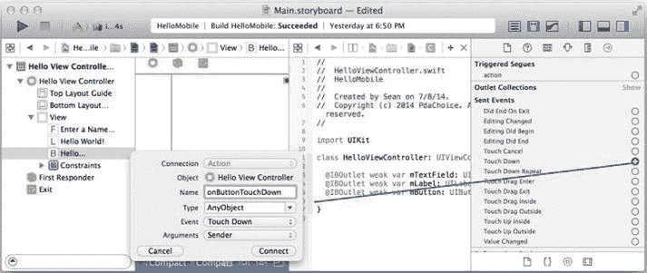

图 3-21. 在**连接检查器**中创建 `IBAction`

2.  输入方法名称：例如 `onButtonTouchDown`。这会在 Swift 类中创建一个方法存根。
    3.  在 `HelloViewController.swift` 中添加 Say-Hello 代码以完成 `IBAction` 方法的实现，如代码清单 3-2 所示。

***代码清单 3-2***. 包含 `IBOutlet` 和 `IBAction` 的 `HelloViewController`

```
import UIKit

class HelloViewController: UIViewController {

@IBOutlet weak var mTextField: UITextField!
@IBOutlet weak var mLabel: UILabel!
@IBOutlet weak var mButton: UIButton!

@IBAction func onButtonTouchDown(sender: AnyObject) {
    var str = mTextField.text
    mLabel.text = "Hello \(str)!"
  }
}
```

至此，整个 `HelloMobile` iOS 应用就完成了。你可以在所有 iOS 模拟器中运行该项目，查看代码的实际效果。

关于 MVC 的内容你已基本掌握。在我们进入更有趣的内容之前，还有一个小讲座：`UIViewController` 的生命周期事件。

## UIViewController 生命周期

**Android 类比** Fragment 生命周期。

与 Android 的 `Fragment` 类类似，在内容视图渲染过程中的不同时间点会调用生命周期回调。某些任务需要在特定状态下执行，以确保内容视图能够流畅渲染。这一点同时适用于 iOS 和 Android。iOS 生命周期概念可能不是初学者的主题，但对于 Android 开发者来说很容易掌握，因为其目的相同：他们都希望在正确的时间执行特定的计算任务，Android 开发者对此已经非常熟悉。

在 Android 中，生命周期事件被描述为视图控制器本身的状态。而在 iOS 中，这些生命周期事件直接与内容视图事件相关，因此你实际上可以更好地可视化其效果，因为它们与视图渲染过程直接相关。

实现这些视图事件本质上与编写 `Fragment` 生命周期回调方法相同：你可以选择重写这些继承自系统的方法，以便在需要时接收及时的回调。

### viewDidLoad

**Android 类比** `Fragment.onCreate()` 和 `onCreateView()`。

当视图控制器从故事板场景加载其内容视图时，iOS 系统会调用 `viewDidLoad()` 方法。通常你会在这里放置初始化代码。

### viewWillAppear

**Android 类比** `onStart()`。

当视图即将出现时，iOS 系统会调用 `viewWillAppear()` 方法。一般来说，你可以放心地将 Android 的 `onStart()` 映射到该方法。

### viewDidAppear

**Android 类比** `onResume()`。

当视图变为可见时，iOS 系统会调用 `viewDidAppear()` 方法。一般来说，你可以放心地将 Android 的 `onResume()` 映射到该方法。

### viewWillDisappear

**Android 类比** `onPause()`。

当内容视图即将变为不可见时（例如，转移到另一个故事板场景），系统会调用 `viewWillDisappear()` 方法。这通常是提交任何需要在当前用户会话之后持久保存的更改的地方（因为用户可能不会回来）。

### viewDidDisappear

**Android 类比** `onStop()`。

当内容视图不可见时，系统会调用 `viewDidDisappear()` 方法。

在实现这些生命周期事件时，你几乎总是需要调用相应的 `super.viewXXX()`，就像在 Android 中一样。

## 屏幕导航模式

你通常会使用多个屏幕来向用户传递分层信息并与用户交互。考虑到移动设备屏幕相对较小，使用众所周知的导航模式来使移动应用更具可预测性就显得更为重要。一致且可预测的导航模式能够引导用户通过多个屏幕完成一项任务。高效的导航是设计精良的应用的基石之一。

本节将重点介绍 iOS 和 Android 都支持的最常见的屏幕导航模式。

### 故事板转场


Segue，发音为“seg-way”，是故事板中一种连接类型，用于指定从一个场景到另一个场景的转场。例如，你可以创建一个在触发操作时立即执行的`Action Segue`。更常见的是，你会在故事板中创建一个`Manual Segue`，并编写逻辑来执行它。根据其转场类型，segue 可能需要一个容器视图控制器。例如，要实现典型的导航堆栈转场，你需要在 iOS 中使用`Navigation Controller`。

以下步骤将引导你完成故事板 segue 的创建过程：

1.  使用**Single View Application**创建一个新的 Xcode 项目，产品名称为`Segues`。（具体步骤请参见第 2 章，“iOS 项目结构”）
2.  在故事板编辑器中打开`Main.storyboard`。完成后应如图 Figure 3-22 所示。
    1.  向现有场景添加两个`Button`部件：一个用于`Action Segue`，另一个用于`Manual Segue`。
    2.  从**Object Library**中拖拽两个`ViewControllers`到故事板上，以添加两个故事板场景。分别给每个场景添加一个`UILabel`，标题分别为**“From Action Segue”**和**“From Manual Segue”**。

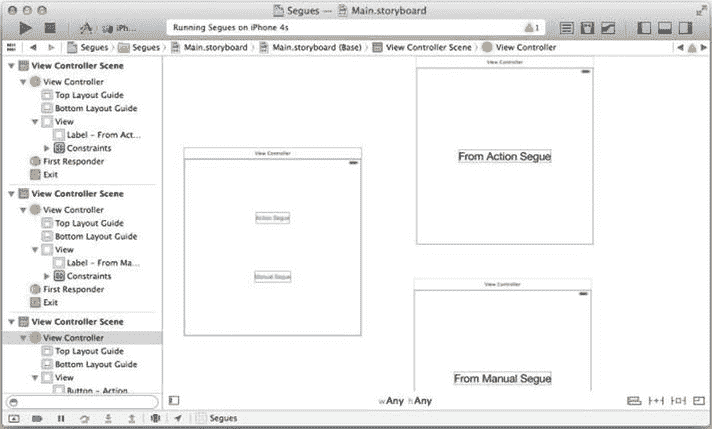

Figure 3-22. `Segues`准备

3.  从`Action Segue`按钮创建一个指向**From Action Segue**场景的`Action Segue`。
    1.  选择`Action Segue`按钮，并在**Utility**区域打开**Connections Inspector**。
    2.  将**Triggered Segue**部分的`action`插座拖拽到**From Action Segue**视图控制器，如图 Figure 3-23 所示。

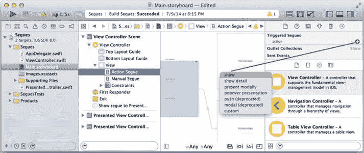

Figure 3-23. 创建一个 Action Segue

3.  选择**Show**作为转场类型。
4.  选择这个 segue（参见 Figure 3-24 中的指针），并在 segue 的**Attributes Inspector**中为其**Identifier**输入名称（即`actionSegue`），如图 Figure 3-24 所示。

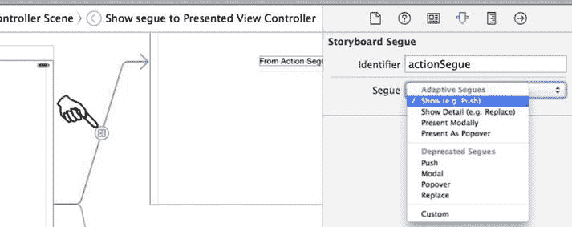

Figure 3-24. 选择 segue 并设置属性

5.  从呈现控制器创建一个指向**From Manual Segue**视图控制器的`Manual Segue`，如图 Figure 3-25 所示：
    1.  选择呈现的视图控制器，并在**Utility**区域打开**Connections Inspector**。
    2.  将**Manual Triggered Segue**部分的圆圈（插座）拖拽到**From Manual Segue**视图控制器。
    3.  选择**Show**作为转场类型。
    4.  选择这个 segue，并在 segue 的**Attributes Inspector**中为其**Identifier**输入名称（即`manualSegue`）。

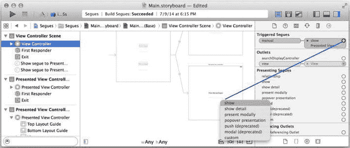

Figure 3-25. 创建一个 Manual Segue

6.  设置`Manual Segue`，使其在`Manual Segue`按钮被选中时通过编程方式执行：
    1.  在`ViewController`类中创建一个名为`onManualSegueTouchDown`的`IBAction`。
    2.  在`onManualSegueTouchDown(...)`方法中，使用 Listing 3-3 中的代码来执行手动 segue。

***Listing 3-3***. 执行 Manual Segue

```
import UIKit
class ViewController: UIViewController {
  @IBAction func onManualSegueTouchDown(sender: AnyObject) {
    self.performSegueWithIdentifier("manualSegue", sender: sender)
  }
}
```

在不同的模拟器中运行应用，以查看这些 segue 在不同尺寸类别中的工作方式。自 iOS 8 起，segue 会以自适应方式呈现给尺寸类别。

### 使用 Segue 传递数据

故事板 segue 通过绘制 segue 连接来轻松便捷地执行屏幕转场。你甚至不需要为`Action Segue`编写一行代码。然而，你通常需要将数据从呈现视图控制器传递到被呈现视图控制器，这是故事板 segue 本身无法单独完成的。

以下步骤演示了在 Xcode `Segues`项目中，从呈现视图控制器向被呈现视图控制器传递数据的传统 iOS 方式：

1.  创建一个带有接收数据属性的`PresentedViewController`类。Listing 3-4 在`viewDidLoad()`方法中简单地打印接收到的数据。

    1.  在**Identity Inspector**中指定`PresentedViewController`类，以将其与**From Action Segue**故事板场景配对（详见 Figure 3-17）。
    2.  同样将**From Manual Segue**故事板场景与`PresentedViewController`类配对。
    3.  添加一个属性`data`，用于接收来自呈现视图控制器的数据。

***Listing 3-4***. 用于从 Presenting View Controller 接收数据的 Data 属性

```
    import UIKit
    class PresentedViewController: UIViewController {
      var data: String?
      override func viewDidLoad() {
        if let tmp = data {
          println("received data: \(tmp)")
        }
      }
      ...
    }
```

2.  系统会在源视图控制器中调用`prepareForSegue(...)`方法。你需要实现此方法来接收回调。为了从源视图控制器`ViewController`传递数据，请像 Listing 3-5 那样重写`prepareForSegue`方法。

***Listing 3-5***. Presenting View Controller 重写`prepareForSegue`

```
override func prepareForSegue(segue: UIStoryboardSegue, sender: AnyObject?)
{
  var identifier = segue.identifier
  var destVc = (segue.destinationViewController as PresentedViewController)
  destVc.data = "some data from presenting vc \(identifier)"
}
```

### 容器视图控制器

#### Android 类比

`Activity`是子`Fragment`的父级。

在 iOS 中，屏幕导航主要通过故事板 segue 和来自 SDK 的容器视图控制器类来实现，这些类促进了屏幕导航。你可以创建这些系统容器视图控制器的子类，但通常你可以直接使用它们。

#### 导航堆栈

#### Android 类比

`FragmentManager`回退栈。

**导航堆栈**广泛用于管理屏幕转场，特别适用于显示信息层级，例如主从下钻列表。要显示下一个屏幕，将下一个视图控制器推入导航堆栈。要返回到上一个屏幕，从导航堆栈中弹出上一个视图控制器。

创建一个具有操作栏的简单 Android 应用的 iOS 版本，如图 Figure 3-26 所示。这个简单的 Android 应用执行以下操作：

*   它有三个内容视图。
*   它使用`FragmentManager` API 创建用于屏幕转场的片段事务。
*   设备返回按钮会自动从回退栈中移除`FragmentTransaction`。
*   你可能使用了片段动画 API 来实现滑入和滑出动画。

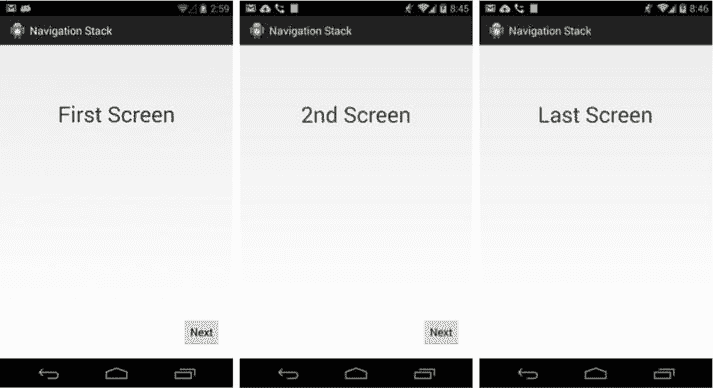

Figure 3-26. 包含三个屏幕的 Android `NavigationStack` 应用

在 iOS 中，你需要使用带有`UINavigationController`容器视图控制器绘制合适的 storyboard segue，以实现此导航堆栈模式。让我们创建一个新的 Xcode 项目来演示 iOS 方式。


1.  使用 iOS **单视图应用（Single View Application）**模板创建一个新的 Xcode 项目（参见第 2 章“iOS 项目剖析”）。将其命名为 `NavigationStack`。
2.  选择 `Main.storyboard` 以在**编辑器（Editor）**区域打开故事板。其中已包含一个场景。
3.  再添加两个内容视图（场景）：从**对象库（Object Library）**中拖动 `ViewController` 到故事板上两次。图 3-27 展示了包含三个场景的故事板。

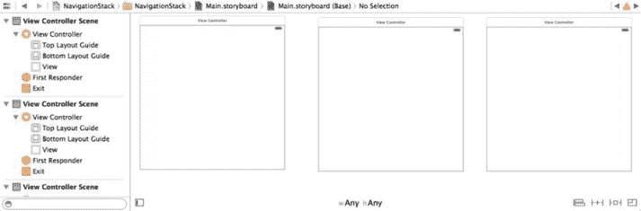

图 3-27. `NavigationStack` 项目中的三个故事板场景

4.  参照对应的 Android Screen One 布局，指导你更新第一个故事板场景：
    1.  从**对象库（Object Library）**中添加一个`标签（Label）`。将其字体大小改为**30**，文字设为“`Screen One`”，并通过**工具区（Utility area）**的**属性检查器（Attributes Inspector）**居中对齐。
    2.  添加自动布局约束以居中标签，如图 3-28 所示。

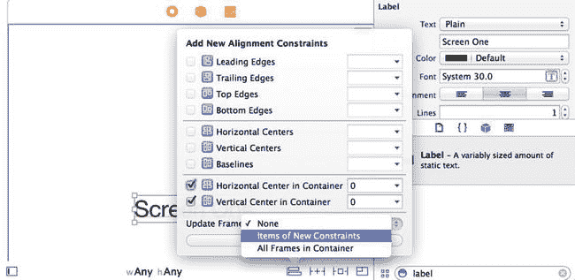

图 3-28. 带有居中约束的 Screen One 标签

3.  添加带右部和底部空间约束的`下一步（Next）`按钮以固定位置，如图 3-29 所示。

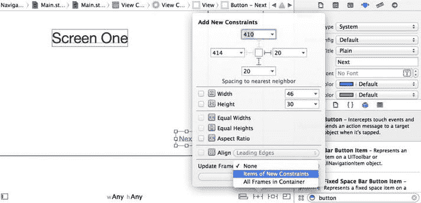

图 3-29. 带对齐约束的`下一步（Next）`按钮

5.  重复步骤 4，向**Screen Two**场景添加一个**“Screen Two”**标签和`下一步（Next）`按钮。
6.  重复步骤 4，向**Screen Three**场景添加一个**“Screen Three”**标签。图 3-30 显示了添加到故事板的 UI 组件。

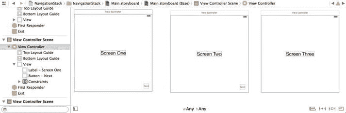

图 3-30. `NavigationStack` 项目中带有组件的三个场景

7.  创建一个从 Screen One 的`下一步（Next）`按钮到 Screen Two 场景的 Action Segue，以及另一个从 Screen Two 的`下一步（Next）`按钮到 Screen Three 场景的 Action Segue。

图 3-31 展示了故事板的结果。运行应用，查看哪些功能正常、哪些还不正常。目前还没有新内容，只是重复了创建故事板场景、UI 组件、自动布局约束以及连接它们的转场（Segue）的步骤。

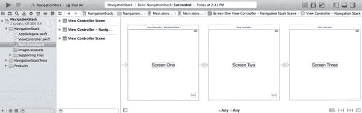

图 3-31. `NavigationStack` 故事板

### `UINavigationController`

**Android 类比**

`FragmentTransaction` 返回栈

这个 iOS 项目中唯一缺失的部分是一种以典型的推入（push）和弹出（pop）方式来显示合适子视图控制器的方法。在 iOS 中，`UINavigationController` 管理推入和弹出屏幕的导航栈行为。它还提供了一个导航栏，其中包含默认的后退按钮、居中的标题以及可选的右侧按钮（参见图 3-32）。

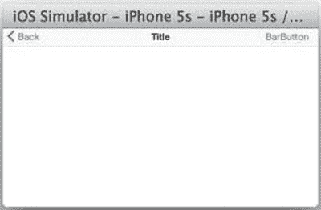

图 3-32. `UINavigationController` 导航栏

你只需要设置一个 `UINavigationController`，并将其根视图控制器与第一个场景关联：

*   从**对象库（Object Library）**中添加一个导航控制器（Navigation Controller）。
*   将根视图控制器转场（在**连接检查器（Connections Inspector）**中）连接到第一个视图控制器。

你可以通过一个简单的故事板操作同时完成这两件事：将 Screen One 视图控制器嵌入到导航控制器中，步骤如下：

1.  从故事板中选择 Screen One 视图控制器。
2.  在 Xcode 菜单栏中，依次选择**编辑器（Editor） 嵌入于（Embed In） 导航控制器（Navigation Controller）**，如图 3-33 所示。

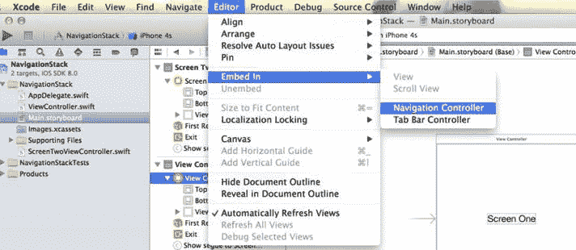

图 3-33. 创建导航控制器

3.  这将创建一个导航控制器，并将根视图控制器转场连接到 Screen One 视图控制器（参见图 3-34）。
    1.  导航控制器有一个`导航栏（NavigationBar）`。
    2.  根视图控制器会自动获得一个`导航项（NavigationItem）`，你可以在其中添加居中的`标题（title）`和 `rightBarButtonItem`。

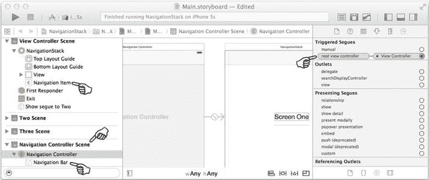

图 3-34. 导航控制器场景与根视图控制器的连接

4.  选择 Screen One 中的 `NavigationItem`，添加`标题（title）`文本（例如 Navigation Stack），如图 3-35 所示。
    1.  导航栏上的`标题`也会影响**返回（Back）**按钮的标题。iOS 会自动更新按钮的 `title` 属性，以反映**返回**按钮的目的地。如果视图中未分配 `title`，按钮文本默认为`Back`。

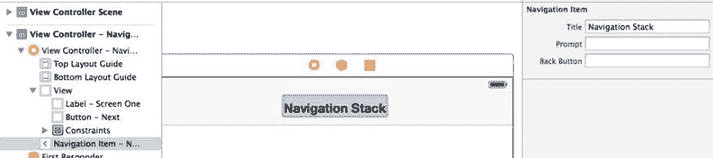

图 3-35. 导航项上的标题

**注**  Android 操作栏上的标题主要用于应用标识。iOS 导航栏的标题则更倾向于表示屏幕标题。

5.  可选：如你在上一步中所见，需要在 `NavigationItem` 上安装 `title` 和 `rightBarButtonItem`。如果你想为 Screen Two 或 Screen Three 设置 `title` 属性或 `rightBarButtonItem`，则需要先在 Screen Two 或 Screen Three 视图控制器中添加一个 `NavigationItem`。

**注**  当**导航项（Navigation Item）**未配置时，标题可以从视图控制器标题中派生。

构建并运行应用，查看应用的实际运行效果（参见图 3-36）。

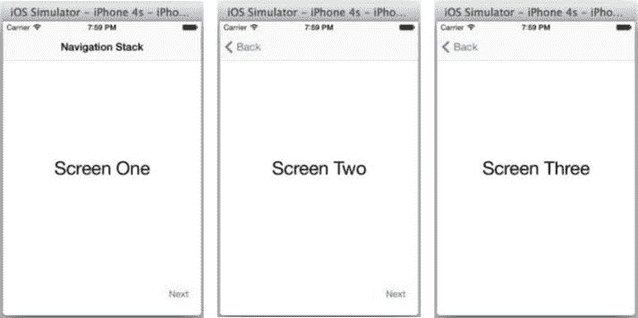

图 3-36. 最终的 `NavigationStack` 应用

### 主-详情列表（Master List with Details Drilldown）

**Android 类比**

`ListView` 和 `GridView`。

许多应用需要显示一个项目列表，用户可以点击这些项目查看更详细的信息。它们首先呈现一个主列表，用户选择一个项目后进入详情页面。

这可能是最常用的移动导航模式之一。Android 和 iOS 都提供了相关指南和系统 API，通过简化开发者的实现来促进一致性。事实上，Xcode 和 ADT 都提供了用于创建具有这种用户体验模式的应用的项目模板。

在 ADT 中，你可以使用 ADT 的**主/详情流（Master/Detail Flow）**模板创建以下主-详情应用。最初，它呈现包含三个项目的主列表。应用随后显示包含所选项目内容的详情屏幕。你将把此应用（参见图 3-37）移植到 iOS 平台。

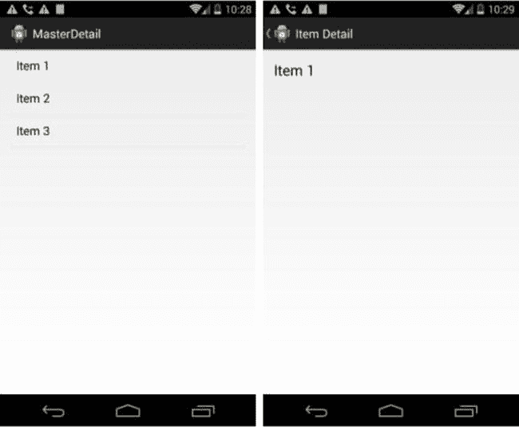

图 3-37. Android 主列表详情下钻

### `UITableViewController`

**Android 类比**

实现概念非常相似，只是使用的术语不同：

*   `ListFragment` = `UITableViewController`
*   列表视图 = 表视图（Table View）
*   列表视图项 = 表视图单元格（Table View Cell）
*   列表适配器 = 数据源（Data Source）

甚至适配器/数据源的实现也有些类似。

要将这个 Android 应用移植到 iOS，你需要两个故事板场景：一个用于主列表，另一个用于详情内容视图。为了重新开始，创建一个新的 iOS 项目：


1.  启动 Xcode，并使用通常的**单视图应用**模板创建一个新应用，并将其命名为 `MasterDetail`。
    1.  你会获得一个 `ViewController` 类，该类已与 `Main.storyboard` 中的一个场景配对。请使用这个配对作为详情视图屏幕。
2.  创建主列表故事板场景，并绘制一条连线（Segue）来连接两个场景。图 3-38 展示了故事板的最终效果。
    1.  从**对象库**中拖拽一个 `UITableViewController`，并将其放置在故事板编辑器中。
    2.  创建一个从 `UITableViewController` 指向详情视图控制器的“手动连线”（Manual Segue），过渡类型为“显示”（Show）（参见图 3-25）。务必为连线设置一个标识符，例如 `detail`（参见图 3-24）。
3.  在 `UITableViewController` 场景中选择“表格视图单元格”（Table View Cell），然后打开**属性检查器**进行配置（参见图 3-38 中的指示）：
    1.  样式：选择 `Basic`（或选择其他样式以在编辑器中查看其效果）。
    2.  标识符：输入 `mycell`。务必为其设置一个标识符。你需要用它来创建可重用的单元格，就像 Android 中的循环列表项（recycled list item）一样。
    3.  附件：选择 `Detail`。
    4.  可选地，你可以添加一个 `image` 来显示左侧的图标。

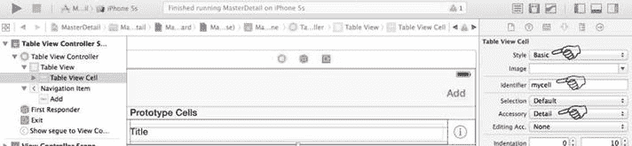

图 3-38。`TableViewCell` 属性

4.  将 `UITableViewController` 嵌入到导航控制器中（参见导航栈中的图 3-33）。你通常会使用导航栈模式来实现屏幕转换。
5.  在导航控制器的**属性检查器**中勾选**是初始场景**（参见图 3-39），以使导航控制器成为此应用的起始视图控制器。

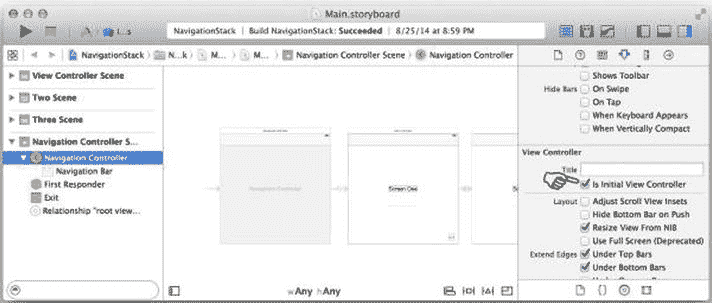

图 3-39。`MasterDetail` 故事板

6.  在 `ViewController.swift` 文件中创建一个 `MasterTableViewController` Swift 类，如代码清单 3-6 所示。
    1.  让 `MasterTableViewController` 继承自 `UITableViewController`。
    2.  在**身份检查器**中将这个 `MasterTableViewController` 类与“表格视图控制器”场景关联起来（参见图 3-17）。

***代码清单 3-6***。`MasterListTableViewController` 类

```
class MasterTableViewController : UITableViewController {
  // TODO
}
```

**注意** 在 Swift 中，类不需要放在自己的文件中。我将它放在已有的 `ViewController.swift` 文件里，并没有什么特别的原因。如果你习惯了 Java 的方式，可以创建一个新文件来存放这个类。

`UITableViewDataSource`

安卓类比

`android.widget.Adapter`

为了填充表格视图中的项目，你需要实现一个“数据源”（Data Source）：通过重写在 `UITableViewDataSource` 协议中定义的方法，为 `TableViewCell` 提供数据（见代码清单 3-7）。请在 `MasterDetail` 项目中执行以下操作：

1.  实现 `tableView(tableView, numberOfRowsInSection)` 方法，返回 `tableView` 中项目的数量。
2.  实现 `tableView(tableView, cellForRowAtIndexPath)` 方法，返回 `tableViewCell` 实例。

***代码清单 3-7***。实现 `UITableViewDataSource` 协议

```
class MasterTableViewController : UITableViewController {
  var items = ["item 1", "item 2", "item 3"]

override func tableView(tableView: UITableView, numberOfRowsInSection section: Int) -> Int {
    return self.items.count
  }

override func tableView(tableView: UITableView, cellForRowAtIndexPath indexPath: NSIndexPath) -> UITableViewCell {
    var cell = tableView.dequeueReusableCellWithIdentifier("mycell") as UITableViewCell
    cell.textLabel.text = self.items[indexPath.row]
    return cell
  }
}
```

**注意** 使用 `dequeueReusableCellWithIdentifier(...)` 来实现视图的复用。这是处理大量项目时节省内存的非常常见的模式，iOS 通过提供这个方法使其变得简单。请确保你在故事板中指定了单元格标识符。

`UITableViewDelegate`

安卓类比

`ListFragment.onListItemClick(...)`

为了处理表格视图项目选中事件，请重写 `UITableViewDelegate.tableView(tableView, didSelectRowAtIndexPath)` 方法（见代码清单 3-8）：

1.  实现 `UITableViewDelegate.didSelectRowAtIndexPath(...)` 来执行连线（segue）。
2.  实现一个 `prepareForSegue(...)` 回调，将数据传递给详情视图控制器（详细参见 **代码清单 3-5**）。

***代码清单 3-8***。实现 `UITableViewDelegate`

```
    class MasterTableViewController : UITableViewController {
      ...
      override func tableView(tableView: UITableView, didSelectRowAtIndexPath indexPath: NSIndexPath) {
        self.performSegueWithIdentifier("detail", sender: indexPath.row)
      }

override func prepareForSegue(segue: UIStoryboardSegue, sender: AnyObject?) {
        var destVc = segue.destinationViewController as UIViewController
        destVc.navigationItem.title = self.items[sender as Int]
      }
    ```

3.  若要添加或删除项目，你需要显式刷新表格视图：
    1.  将一个**栏按钮项**拖拽到导航栏上，并绘制一个 `IBAction` 来创建 `doAdd()` 方法（图 3-40）。

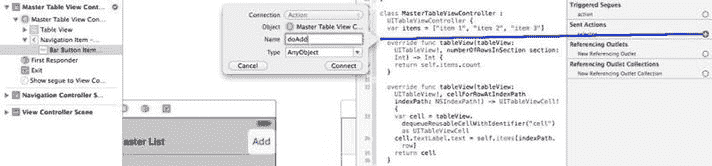

图 3-40。导航栏右侧按钮

2.  当点击“添加”按钮时，为了实现添加项目，请按代码清单 3-9 所示实现 `doAdd()` 方法。请确保在主线程中调用 `TableView.reloadData()` 来刷新表格视图，就像 Android 中 `notifyDataSetChanged()` 所做的那样。

***代码清单 3-9***。刷新表格视图

```
    class MasterTableViewController : UITableViewController {
      var items = ["item 1", "item 2", "item 3"]

@IBAction func doAdd(sender: AnyObject) {
        self.items.append("item \(self.items.count + 1)")
        self.tableView.reloadData()
      }
      ...
    ```

构建并运行（+R）这个应用，即可实时看到 `MasterDetail` iOS 应用的效果（参见图 3-41）。

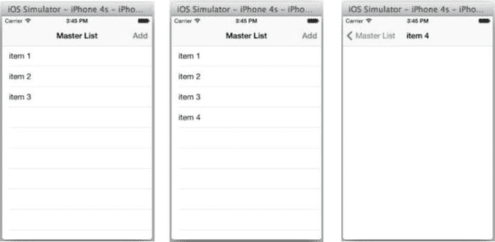

图 3-41。iOS 中的 `MasterDetail` 应用屏幕

`UITableView`

安卓类比

`android.widget.ListView`

就像 Android 的 `ListFragment` 类（它是一个包含 `ListView` 的 `Fragment`）一样，`UITableViewController` 是一个常规的 `UIViewController`，其中预置了一个 `tableView`。你将面临同样的选择：是否使用 `UITableViewController`，这可以为你简化一些代码（依我看，实际上简化得并不多）。更多时候，我会选择执行以下操作，而不是使用 `UITableViewController`：


1.  在故事板中，创建一个带有`TableView`的常规视图控制器：
    1.  添加一个常规的`ViewController`场景。
    2.  向场景中添加一个`TableView`。这能为你提供更大的灵活性（例如，可在任意位置绘制表格视图）。
    3.  将该表格视图连接到一个`IBOutlet`（详见图 3-20）。
    4.  选中`TableView`，并在**连接检查器（Connection Inspector）**中，将`delegate`和`dataSource`出口连接到`ViewController`。
2.  创建一个 Swift 类来与内容视图配对：
    1.  继承自常规的`UIViewController`类。
    2.  实现`UITableViewDataSource`和`UITableViewDelegate`协议。

之前的`MasterTableViewController`本质上等同于代码清单 3-10 中的代码，你仍然需要实现`UITableViewDataSource`和`UITableViewDelegate`中声明的那些方法。

***代码清单 3-10***. 显式实现表格视图协议

```
class MasterTableViewController : UIViewController, UITableViewDataSource, UITableViewDelegate {
  @IBOutlet weak var tableView: UITableView!
  ...
```

### UITableViewCell

**Android 类比**

使用 Android SDK 中的 `R.id.simple_list_item_1`，或创建自定义列表项布局。

与 Android 列表视图项的使用类似，你可以从 iOS SDK 中选择一些免费的`UITableViewCell`类型。在之前的`MasterDetail`项目中，我们选择了**基本（Basic）**样式，这种样式会在表格视图单元格中提供一个`textLabel`（参见图 3-38）。**右侧详情（Right Details）**、**左侧详情（Left Details）**或**副标题（Subtitle）**样式都会提供第二个标签，名为`detailedTextLabel`。你还可以设置左侧图像图标以及`TableViewCell`的其他属性，如图 3-38 所示。

你可以通过`tableView(cellForRowAtIndexPath:)`方法以编程方式配置`TableViewCell`。代码清单 3-11 展示了一个典型示例：

***代码清单 3-11***. `TableViewCell`属性

```
override func tableView(tableView: UITableView, cellForRowAtIndexPath indexPath: NSIndexPath) -> UITableViewCell {
  var cell = ...
  cell.textLabel.text = self.items[indexPath.row]
  cell.detailTextLabel.text = "some detail label"
  cell.imageView.image = UIImage(named: "pointer.png")
  cell.accessoryType = UITableViewCellAccessoryType.DetailButton
  return cell
}
```

你也可以选择“**自定义（Custom）**”样式，并使用故事板自由绘制单元格；下一节你将进行此操作。

### UICollectionView

**Android 类比**

`GridView`。

在 Android 中，`GridView`只是主从钻取模式的一种变体，它使用不同的 UI 控件来展示主列表。然而，在平板或大屏设备上，`GridView`被广泛使用，因为它通过多列来组织主列表项，而非简单的一维列表，从而提高了空间利用率。在 iOS 平台上，`UICollectionView`正好能解决这个问题。

如果你现在不尝试这种变体，那将是一种遗憾，因为它是一个非常实用的控件，并且几乎不需要额外花费什么精力。关键就在于`UICollectionView`类。

**注意** 你也可以使用`UICollectionViewController`，它默认包含一个占据整个场景的`UICollectionView`。这与我们之前讨论过的`UITableViewController`和`UITableView`的选择类似（参见“`UITableView`”部分）。

你创建的`MasterDetail`项目在 iPhone 上运行自如，但在 iPad 上运行时，会感觉空间没有被有效利用。创建一个使用`UICollectionView`的新 Xcode 项目来演示其用法：

1.  启动 Xcode，并使用常规的**单视图应用（Single View Application）**模板创建一个新应用。将其命名为`MasterGridDetail`。
    1.  你会得到`Main.storyboard`中的一个场景和一个`ViewController`类对。
    2.  在`ViewController.swift`文件以及视图控制器场景的自定义类名中，将类重命名为`MasterViewController`（参见图 3-17）。
    3.  从**对象库（Object Library）**中拖拽一个`Collection View`，并将其放到`MasterViewController`场景上。让它占据整个空间，并通过 Xcode 菜单栏的**Editor  Pin  ...** 将其到父视图（Superview）四个方向的间距都固定为**零**。
    4.  将`MasterViewController`控制器嵌入导航控制器中（参见图 3-33）。
2.  选中故事板中的`Collection View`，在**连接检查器（Connections Inspector）**中创建连接，如图 3-42 所示：
    1.  将`dataSource`和`delegate`出口连接到`MasterViewController`。
    2.  打开**助理编辑器（Assistant Editor）**，将**新建引用出口（New Referencing Outlet）**连接到`MasterViewController`的属性。将其命名为`mCollectionView`。

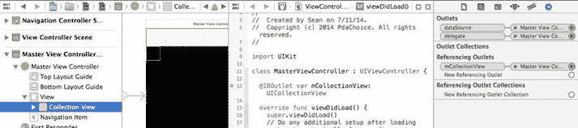

图 3-42. `Collection View`的`dataSource`、`delegate`和`IBOutlet`连接

3.  在故事板中绘制你自己的自定义集合视图单元格：
    1.  在**属性检查器（Attributes Inspector）**中，为**集合可重用视图单元格标识符（Collection Reusable View Cell Identifier）**赋值（例如`mycell`）。你可以在**属性检查器**中安全地更改一些属性，比如**白色**背景色。
    2.  要更改单元格的大小，请选中父级集合视图，并在**尺寸检查器（Size Inspector）**中将单元格大小更改为**150 × 150**。图 3-43 显示了其他可以设置的尺寸参数。

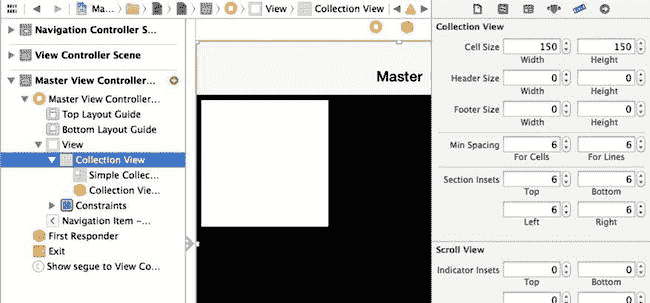

图 3-43. 尺寸检查器

3.  向单元格添加一个标签，将字号调大（例如**30**），居中对齐，并添加自动布局约束，如图 3-44 所示。

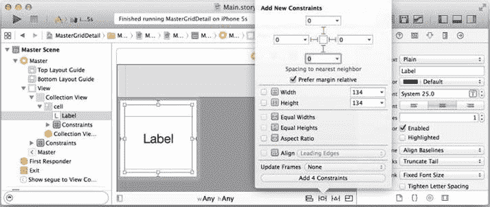

图 3-44. 绘制集合视图单元格

4.  为集合视图单元格创建一个自定义 Swift 类。代码清单 3-12 展示了`SimpleCollectionViewCell`类：

    1.  创建一个 Swift 类`SimpleCollectionViewCell`，继承自`UICollectionViewCell`。
    2.  在故事板中选中集合视图单元格，并在**身份检查器（Identity Inspector）**中为其分配`SimpleCollectionViewCell`类。
    3.  打开与`SimpleCollectionViewCell`类关联的**助理编辑器**。在**连接检查器**中，连接**引用出口（Referencing Outlet）**以创建一个`IBOutlet`，并将其命名为`textLabel`。

***代码清单 3-12***. `SimpleCollectionViewCell`类

```
class SimpleCollectionViewCell : UICollectionViewCell {
  @IBOutlet weak var textLabel: UILabel!
}
```

5.  在故事板中创建详情视图控制器场景，如图 3-45 所示：
    1.  从**对象库**中添加一个常规视图控制器。
    2.  使用**Show**过渡类型，从主视图控制器场景到详情视图控制器创建一个手动转场（参见图 3-25）。务必为故事板转场设置一个**标识符（Identifier）**（例如`detail`）。

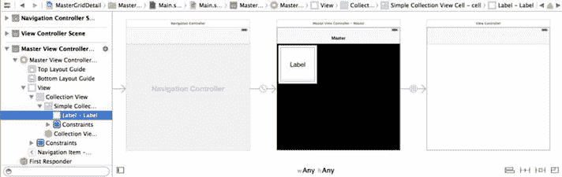

图 3-45. 在`MasterDetail`故事板中创建详情视图控制器


6. `MasterViewController` 必须实现 `UICollectionViewDataSource` 和 `UICollectionViewDelegate` 协议（参见列表 3-13）：
   1. 实现 `numberOfSectionsInCollectionView(collectionView:)` 方法以返回分区数；若未实现则默认为 `1`。
   2. 实现 `collectionView(collectionView:, numberOfItemsInSection:)` 方法以返回每个分区中的项目数。
   3. 实现 `collectionView(collectionView:, cellForItemAtIndexPath:)` 方法以返回集合视图的单元格实例。
   4. 实现 `collectionView(collectionView:, didSelectItemAtIndexPath:)` 方法以响应单元格的选中事件。

***列表 3-13***. `UICollectionViewDataSource` 和 `UICollectionViewDelegate` 协议

```
class MasterViewController : UIViewController, UICollectionViewDataSource, UICollectionViewDelegate {
  ...
  // 实现 UICollectionViewDataSource
  var items = ["item 1", "item 2", "item 3", "item 4", "item 5", "item 6", "item 7"]
  func collectionView(collectionView: UICollectionView, numberOfItemsInSection section: Int) -> Int {
    return self.items.count
  }

// 返回的单元格必须通过调用 -dequeueReusableCellWithReuseIdentifier:forIndexPath: 方法获取
  func collectionView(collectionView: UICollectionView, cellForItemAtIndexPath indexPath: NSIndexPath) -> UICollectionViewCell {
    var cell = collectionView.dequeueReusableCellWithReuseIdentifier("cell", forIndexPath: indexPath) as SimpleCollectionViewCell
    cell.textLabel.text = self.items[indexPath.row]
    cell.backgroundColor = (indexPath.row % 2 == 0) ? UIColor.whiteColor() : UIColor.lightGrayColor()
    return cell
  }

func numberOfSectionsInCollectionView(collectionView: UICollectionView)
  -> Int {
    return 1
  }

// 实现 UICollectionViewDelegate
  func collectionView(collectionView: UICollectionView, didSelectItemAtIndexPath indexPath: NSIndexPath) {
    self.performSegueWithIdentifier("detail", sender: self)
  }
}
```

`TableView` 和 `CollectionView` 都非常灵活。你应该深入了解数据源和委托协议，看看它们为开发者提供了哪些丰富的选项。构建并运行 `MasterGridDetail` iOS 应用，即可实时体验你的代码效果，如图 3-46 所示。

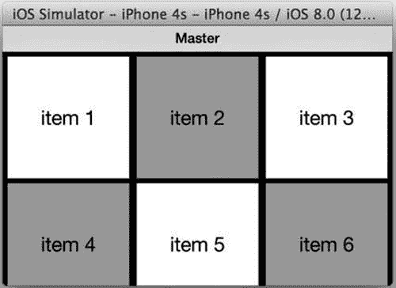

图 3-46. 集合视图

## 导航标签

#### Android 类比

#### 操作栏导航标签

导航标签是另一种流行的用户体验设计模式。苹果的 iOS 人机界面指南建议使用标签栏，让用户可以访问同一数据集的不同视角，或访问与应用程序整体功能相关的不同子任务。每个导航标签都与一个视图控制器关联。当用户选中某个特定标签时，关联的视图控制器会呈现其自己的内容视图。

在 Android 中，通常使用 `Actionbar`。图 3-47 展示了一个示例；让我们将其翻译到 iOS 平台。

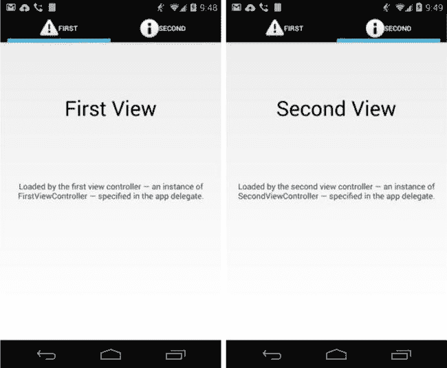

图 3-47. Android `TabbedApp`

在 iOS 中，关键在于容器视图控制器 `UITabBarController` 类。大多数情况下你可以直接使用它。如果你想在容器视图控制器中保留一些应用状态，只需从其子类化即可。

### 实现导航标签

以下说明将指导你完成实现导航标签通常所需的步骤：

1. 启动 Xcode，使用 **Single View Application** 模板创建一个新应用，并将其命名为 `TabbedApp`。
   1. 在 `Main.storyboard` 中获得一个空场景以及一个 `ViewController` 类。
   2. 在 `ViewController.swift` 文件和故事板场景的 **Identity Inspector** 中，将类名重命名为 `FirstViewController`。
   3. 以 Android 应用为线框图，在故事板场景中绘制内容视图。
2. 你需要第二个内容视图和视图控制器对。
   1. 你可以从 `FirstViewController` 类中复制、粘贴并进行修改。列表 3-14 展示了 `SecondViewController` 类。

***列表 3-14***. `SecondViewController` 类

```
class SecondViewController: UIViewController {
  ...
}
```

3. 你也可以在故事板编辑器中复制、粘贴并修改故事板场景。别忘了在 **Identity Inspector** 中更新类名。图 3-48 展示了故事板中包含屏幕一和屏幕二两个场景。

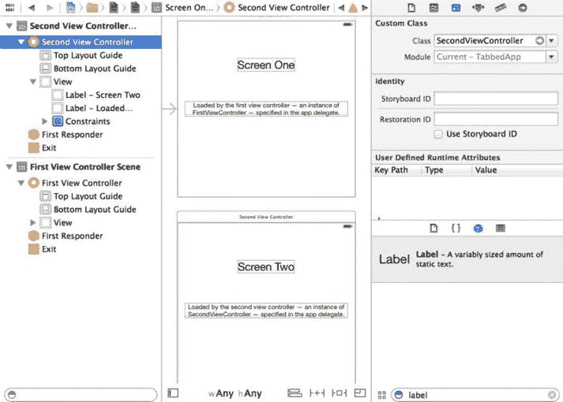

图 3-48. `TabbedApp` 中的第一个和第二个场景

4. 添加一个容器视图控制器 `UITabBarController`，它将负责管理这两个内容视图控制器。
   1. 将两个故事板场景嵌入到一个 `TabBarController` 中：多选这两个故事板场景（按住  键进行多选），然后在 Xcode 菜单栏中选择 **Editor  Embed In  Tab Bar Controller** 命令（参见图 3-49）。

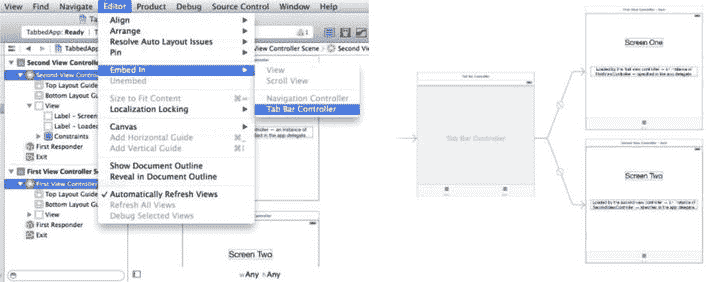

图 3-49. 将内容视图嵌入标签栏控制器（右侧为结果）

这个应用尚未完成，但实际上你现在就可以运行它，看看它的实时效果（参见图 3-50）。

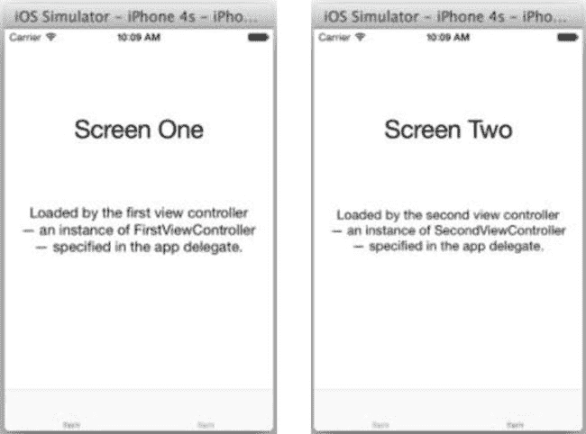

图 3-50. `TabbedApp` 草稿

## UITabBarController

从之前的工作中（参见图 3-49），你可以看到 `UITabBarController` 自带了一个底部标签栏。每个标签栏项都与一个内容视图控制器关联。通过选中一个标签栏项，`UITabBarController` 会自动呈现选中的内容视图控制器。

### 添加/移除标签栏项

`UITabBarController` 维护着一个对其子视图控制器引用的数组。在其 **Connections Inspector** 中，你可以在 Triggered Segues 部分绘制视图控制器的插座，以将子视图控制器添加到 `UITabBarController.viewControllers` 数组属性中。你也可以编写代码在运行时添加或移除子视图控制器。

### 更新标签栏项的外观和感觉

你应该为标签栏项分配 `title` 和 `image` 属性。当一个 `UIViewController` 被添加到标签栏控制器时，`UIViewController.tabBarItem` 属性代表标签栏中的该项。你可以在标签栏项的 **Attributes Inspector** 中分配适当的值。在运行时，你可以通过设置相应的 `tabBarItem` 属性来更新 `text` 和 `image`。之前图 3-50 显示两个标签栏项具有相同的标签且没有图标图像。请执行以下操作来改善我们的 `TabbedApp` 的外观：

1. 系统提供了一组常见的标签栏项（**Attributes Inspector** 中的 **System Item**）。尽可能使用它们以保持平台一致性。为屏幕一选择 **Featured** 系统项（参见图 3-51）。

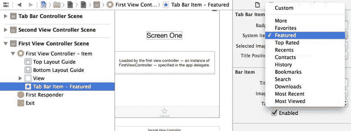

图 3-51. 为屏幕一添加 **Featured** 系统项


2. 对于“屏幕 2”，选择**自定义**以提供你自己的标签栏项**标题**和**图像图标**（参见图 3-52）。
    1.  输入标题（例如，**二**）。
    2.  在 `images.xcassets` 中创建一个图像图标（例如 `tab1`），并拖入一个尺寸约为 **25 × 25**（最大 **48 × 32**）的透明 PNG 图片。图标颜色不作要求，因为仅需渲染其 alpha 通道。

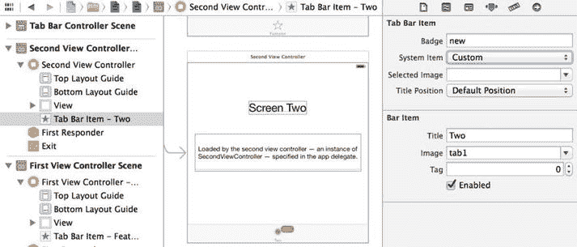

图 3-52. 带有 `badgeValue` 的自定义标签项

**注** iOS 对图片规格要求非常严格。有关图片规格，请参阅在线参考：`https://developer.apple.com/library/ios/documentation/UserExperience/Conceptual/MobileHIG/IconMatrix.html`。

3.  输入图像名称（例如，`tab1`）。
    4.  你可以输入一个**标记**（例如，**新**），它将显示在图标右上角。通常情况下，这是在运行时通过 `UITabBarItem.badgeValue` 属性以编程方式设置的。

### 处理运行时行为

为了以编程方式响应运行时行为，与大多数 `UIKit` 控件一样，你需要实现一个委托协议：`UITabBarDelegate`。继续使用 `TabbedApp` 来学习处理 `UITabBarDelegate` 运行时事件的常见任务。

1.  创建一个自定义标签栏控制器来处理运行时行为，如代码清单 3-15 所示：

    1.  创建一个继承自 `UITabBarController` 的 `SimpleTabBarController` 类。
    2.  声明 `SimpleTabBarController` 实现 `UITabBarControllerDelegate` 协议。
    3.  在故事板中，选中标签栏控制器，然后在**身份检查器**中将 `SimpleTabBarController` 类赋值给它。

***代码清单 3-15***. `SimpleTabBarController` 类

```
    class SimpleTabBarController : UITabBarController, UITabBarControllerDelegate {
      override func viewDidLoad() {
        super.viewDidLoad()
        // 加载视图后进行任何额外设置...
        self.delegate = self
      }

    func tabBarController(tabBarController: UITabBarController,
      shouldSelectViewController viewController: UIViewController) -> Bool {
        // 你可以执行某些操作并返回 true
        // 或者，返回 false 以不选中该 viewController
        return true
      }

    func tabBarController(tabBarController: UITabBarController,
      didSelectViewController viewController: UIViewController) {
        // 你可以执行某些操作
      }
    }
    ```

2.  每个子内容视图控制器都可以访问 `UIViewController.tabBarController` 和 `UIViewController.tabBarItem` 属性。代码清单 3-16 展示了如何从 `FirstViewController` 更改第二个标签的 `badgeValue`。

***代码清单 3-16***. 更改其他 `tabBarItem` 的 `badgeValue`

```
(self.tabBarController!.viewControllers![1] as UIViewController).tabBarItem.badgeValue = "Zzz"
```

顺带一提，在 iOS 中，标签栏位于屏幕底部，而非像 Android 那样在顶部。通常，特定平台的用户体验指南绝不可忽视。在 iOS 中保持导航栏在底部，这是大多数 iOS 用户期望的位置。

### 滑动视图

轮播是一种流行的用户体验模式，常用于许多平台，包括桌面和 Web 应用。在移动平台上，你可以使用这种模式配合滑动手势来逐页显示内容。它允许用户在项目间高效切换。配合动画过渡，它提供了更愉悦的浏览体验。iOS 和 Android 都提供了框架类以及项目创建模板来推广这种导航用户体验模式。

在 Android 中，你通常使用 `ViewPager` 控件。图 3-53 展示了使用 ADT 滑动视图模板创建的 Android `SwipeViews` 应用：

*   容器 Activity 包含一个 `ViewPager`，用于显示来自片段布局的可滑动视图。
*   它包含一个片段，该片段包含一个表示页面内容的标签。
*   分页适配器为每个页面创建带有内容的片段。

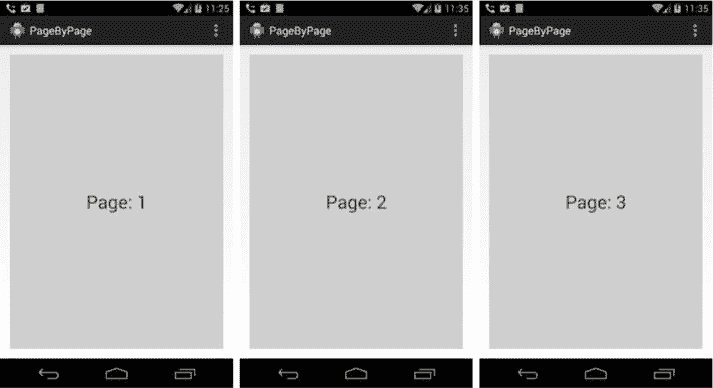

图 3-53. Android `SwipeViews` 应用

你将把这个移植到 iOS。使用 Android 应用或布局文件（参见图 3-54）作为线框图来构建初始的故事板场景。

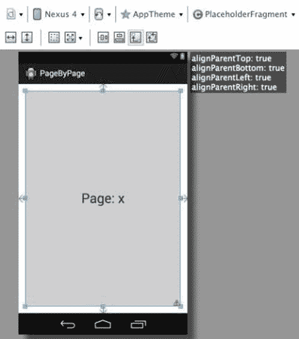

图 3-54. Android `layout.xml` 文件

1.  启动 Xcode，使用常用的**单视图应用**模板创建一个新项目，并命名为 `SwipeViews`。
2.  将 `ViewController.swift` 文件中的现有类 `ViewController` 重命名为 `ParentViewController`，同时将该视图控制器在故事板场景中的自定义类名也在**身份检查器**中重命名。
3.  从**对象库**中拖放一个 `UIView` 到故事板场景上：
    1.  打开故事板**助理编辑器**，在**连接检查器**中通过将引用插座连接到配对的视图控制器来创建一个 `IBOutlet`，并将其命名为 `mPageView`。
    2.  添加自动布局约束，将其边缘**固定**到最近的邻居，并将背景设置为浅灰色，如最终故事板所示（参见图 3-55）。

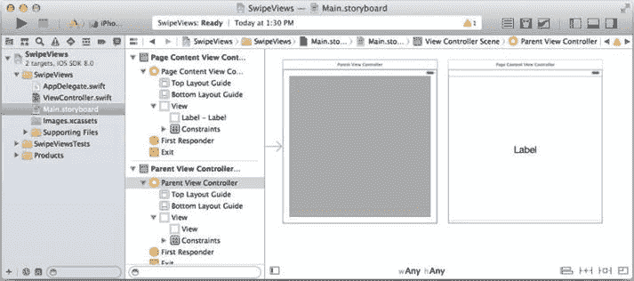

图 3-55. `SwipeViews` 项目中的 `Main.storyboard`

4.  你需要另一个用于页面内容的内容视图-视图控制器对。
    1.  创建一个新的 `PageContentViewController` 类（参见代码清单 3-17）。

***代码清单 3-17***. `ViewController.swift` 文件中的两个类

```
        import UIKit
        class ParentViewController : UIViewController {
          @IBOutlet weak var mPageView: UIView!

    override func viewDidLoad() {
            super.viewDidLoad()
          }

    override func didReceiveMemoryWarning() {
            super.didReceiveMemoryWarning()
            // 处置任何可以重新创建的资源。
          }
        }

    class PageContentViewController: UIViewController {
          @IBOutlet weak var textLabel : UILabel
        }
        ```

2.  绘制第二个故事板场景（参见图 3-55 右侧的屏幕）。确保给页面内容视图控制器一个**故事板 ID**（例如 `PageContentViewController`）。你需要这个 ID 来以编程方式从故事板加载一个控制器。

目前还没有新内容；只需先绘制两个包含视图控制器的故事板场景。你可以构建并运行应用以确保没有错误。与之前可以通过绘制跳转线来进行视图控制器转换的导航堆栈或标签模式不同，你需要编写代码来完成应用，这将是下一步工作。

### UIPageViewController

**ANDROID 类比**

`ViewPager`。

在 iOS 中实现滑动视图模式的关键是 `UIPageViewController` 类，它使用了相同的数据源模式：实现一个负责提供填充了数据的内容视图的数据源。继续在 `SwipeViews` Xcode 项目中执行以下步骤：

1.  修改 `PageContentViewController` 类，使其能够接收数据并呈现三个简单的屏幕（参见代码清单 3-18）。

***代码清单 3-18***. 添加 `data` 和 `pageNo` 属性

```
    class PageContentViewController: UIViewController {

    @IBOutlet weak var textLabel : UILabel

    var data = ""
      var pageNo = 0

    override func viewDidLoad() {
        self.textLabel.text = data
      }
    }
    ```


2. `UIPageViewController` 通过 `dataSource` 和 `delegate` 协议工作。其父视图控制器 `ParentViewController` 是实现这些协议的合理选择（参见列表 3-19）。

1. `UIPageViewControllerDataSource` 负责提供当前内容视图控制器前后的内容视图控制器。
2. `UIPageViewControllerDataSource` 还定义了可选页面计数和页面选择指示器。
3. `UIPageViewControllerDelegate` 定义了可选页面控制器事件回调函数。

***列表 3-19***。`ParentViewController` 实现 `dataSource` 和 `delegate` 协议

```
class ParentViewController : UIViewController,
UIPageViewControllerDataSource, UIPageViewControllerDelegate {

...
  // 实现数据源
  let items = ["Page: 1", "Page: 2", "Page: 3"]
  func pageViewController(pageViewController: UIPageViewController,
  viewControllerBeforeViewController viewController: UIViewController) ->
  UIViewController? {

var pageNo = (viewController as PageContentViewController).pageNo
    if pageNo > 0 {
      var vc = self.storyboard.instantiateViewControllerWithIdentifier("PageContentViewController")
      as PageContentViewController
      vc.data = self.items[pageNo-1]
      vc.pageNo = pageNo - 1
      return vc
    }

return nil
  }

func pageViewController(pageViewController: UIPageViewController,
  viewControllerAfterViewController viewController: UIViewController) ->
  UIViewController? {

var pageNo = (viewController as PageContentViewController).pageNo
    if pageNo < self.items.count - 1 {
      var vc = self.storyboard.instantiateViewControllerWithIdentifier("PageContentViewController")
      as PageContentViewController
      vc.data = self.items[pageNo+1]
      vc.pageNo = pageNo + 1
      return vc
    }

return nil
  }

func presentationCountForPageViewController(pageViewController: UIPageViewController) -> Int {
    return self.items.count
  }
  func presentationIndexForPageViewController(pageViewController: UIPageViewController) -> Int {
    return (pageViewController.viewControllers[0] as PageContentViewController).pageNo
  }

}
```

3. 在 `ParentViewController viewDidLoad()` 方法中，以下常规代码（参见列表 3-20）设置了 `UIPageViewController`：

1. 初始化页面视图控制器。
2. 设置 `dataSource` 和 `delegate`。
3. 设置第一个页面视图控制器。
4. 建立父-子视图控制器层级结构。

***列表 3-20***。在 `viewDidLoad` 中设置 `UIPageViewController`

```
class ParentViewController : UIViewController, UIPageViewControllerDataSource, UIPageViewControllerDelegate {

@IBOutlet weak var mPageView: UIView
  var mPageViewController: UIPageViewController

override func viewDidLoad() {
    super.viewDidLoad()
    // 加载视图后执行任何额外设置，通常从 nib 文件开始

// a. 初始化页面视图控制器、视图和手势
    self.mPageViewController = UIPageViewController(transitionStyle:
    UIPageViewControllerTransitionStyle.Scroll, navigationOrientation:
    UIPageViewControllerNavigationOrientation.Horizontal, options: nil)
    self.mPageViewController.view.frame = self.mPageView.bounds
    self.mPageView.gestureRecognizers = self.mPageViewController.gestureRecognizers

// b. 设置数据源和委托
    self.mPageViewController.delegate = self
    self.mPageViewController.dataSource = self

// c. 设置第一个页面
    var vc = self.storyboard.instantiateViewControllerWithIdentifier("PageContentViewController")
    as PageContentViewController
    vc.data = self.items[0]
    vc.pageNo = 0
    self.mPageViewController.setViewControllers([vc], direction: .Forward,
    animated: false, completion: nil)

// d. 建立父-子视图和视图控制器层级结构
    self.mPageView.addSubview(self.mPageViewController.view)
    self.addChildViewController(self.mPageViewController)
    self.mPageViewController.didMoveToParentViewController(self)
  }
```

以上就是关于 `UIPageViewController` 类以及 iOS 中滑动视图导航模式的全部内容。构建并运行 iOS 的 `SwipeViews` 应用，即可实际查看代码的运行效果（参见图 3-56）。

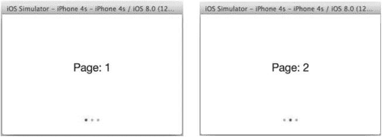

图 3-56。iOS `SwipeViews` 应用

## 对话框

通常，使用对话框 UX 模式是为了给移动用户提供快速反馈，或请求用户对选择进行简单确认。对话框通常显示在当前屏幕之上，同时当前屏幕保持部分可见或变暗。这种视觉效果旨在在不丢失当前上下文的情况下，吸引更多用户注意力。

创建一个 Xcode 项目来演示对话框的用法和常见编程任务：

1. 启动 Xcode，使用 **Single View Application** 模板创建一个新项目，将其命名为 `Dialogs`。
2. 在故事板场景中绘制两个 `Button` 控件，标题分别设置为 `Alert` 和 `Popup`，如图 图 3-57 所示。

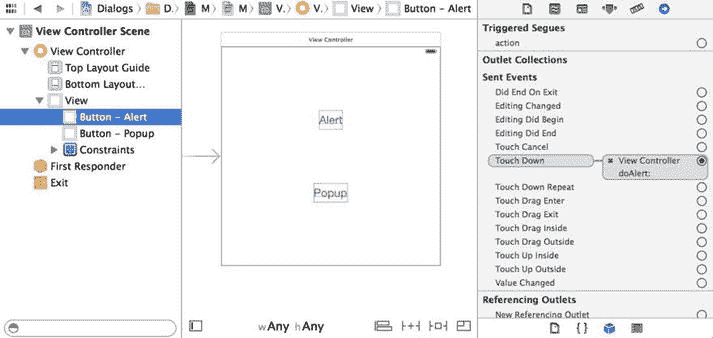

图 3-57。`Dialogs` 故事板

3. 打开故事板的 **Assistant Editor**，并在 **Connections Inspector** 中连接 **Send Event  Touch Down** 出口，为两个按钮在配对的 `ViewController` 类中创建 `IBAction` 方法（参见列表 3-21 中的 `doAlert(...)` 和 `doPopup(...)`）。

***列表 3-21***。为 Alert 和 Popup 按钮创建 `IBAction` 方法

```
import UIKit
class ViewController: UIViewController, UIAlertViewDelegate {
  ...
  @IBAction func doAlert(sender: AnyObject) {
    // TODO
  }
  @IBAction func doPopup(sender: AnyObject) {
    // TODO
  }
}
```

这些内容对你来说应该并不陌生，但这个 `Dialogs` Xcode 项目可以让你重温对话框相关主题。

### UIAlertController

**Android 类比**：`AlertDialog`。

图 3-58 并排展示了标准的 Android 和 iOS 警告对话框。在 iOS 上，你使用 `UIAlertController`。两者的基本用法几乎相同，唯一的区别是 Android 的 `AlertDialog` 多了一个标题图标。

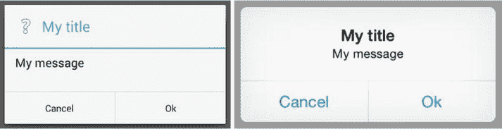

图 3-58。Android（左）与 iOS（右）警告对话框对比

继续使用 Xcode 的 `Dialogs` 项目，添加以下代码来学习 `UIAlertController` 的使用：

1. 要显示如图 图 3-58 所示的 iOS 对话框，请在 `ViewController.doAlert(...)` 方法中添加以下代码（参见列表 3-22）：
   1. 创建一个 `UIAlertController` 实例。
   2. 为对话框按钮添加 `UIAlertAction`。
   3. 要提示用户输入，请向 `UIAlertController` 添加 `TextField`。
   4. 使用常规的 `UIViewController` API 将其作为视图控制器呈现。

***列表 3-22***。呈现 `UIAlertController`

```
@IBAction func doAlert(sender: AnyObject) {

var alert = UIAlertController(title: "My title", message: "My message", preferredStyle: UIAlertControllerStyle.Alert)

// 添加操作按钮
  var actionCancel = UIAlertAction(title: "Cancel", style: UIAlertActionStyle.Cancel,
    handler: {action in
        // 不执行任何操作
      })
```


```swift
var actionOk = UIAlertAction(title: "Ok",
    style: UIAlertActionStyle.Default, handler: {action in
        println((alert.textFields[0] as UITextField).text)
      })

alert.addAction(actionCancel)
    alert.addAction(actionOk)

// 添加文本字段
    alert.addTextFieldWithConfigurationHandler({textField in
      // 配置 UITextField
      textField.backgroundColor = UIColor.yellowColor()
      textField.placeholder = "enter text, i.e., Do Ra Me"
      })

// UIViewController 用于展示视图控制器的 API
    self.presentViewController(alert, animated: true, completion: nil)
}
```

`UIAlertController` 内的所有内容都是通过编程方式创建的。图 3-59 展示了 `UIAlertController` 代码的实际运行效果。

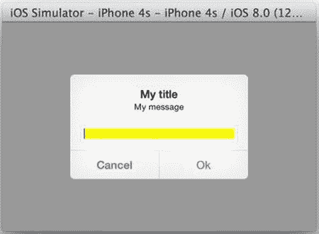

图 3-59. iOS `UIAlertController`

## UIPopoverController

**Android 类比**

`DialogFragment`.

在 iPad 等大屏幕 iOS 设备上，您可以使用 `PopoverController` 将常规的 `viewController` 作为弹出层呈现。该弹出层可以锚定在特定位置，以便将显示的对话框与呈现上下文关联起来。在 iPhone 等紧凑型尺寸类别的设备上，弹出控制器会自动回退到常规的全屏视图控制器。您也可以利用故事板编辑器来绘制内容视图和转场，而无需编写代码。

以下步骤演示了 `Dialogs` 项目中的 `PopoverController`：

1.  为弹出层添加一个新的故事板场景。
    1.  创建一个 `GreenViewController` 类，如代码清单 3-23 所示，并在故事板中绘制一个视图控制器场景。通过在**身份检查器**中指定类名来与其匹配。

***代码清单 3-23***. `GreenViewController` 类

```swift
        class GreenViewController : UIViewController {
          @IBAction func doDone(sender: AnyObject) {
            // 执行某些操作并关闭
            self.dismissViewControllerAnimated(true, completion:nil)
          }
        }
```

2.  将视图控制器嵌入到导航控制器中（通过 Xcode 菜单栏的**编辑器  嵌入于**），以利用导航栏标题或任何导航控制器的功能。
    3.  在导航控制器的**属性检查器**中，将**模拟的尺寸**更改为**自由形式**，然后在**尺寸检查器**中将**模拟的尺寸**更改为 **250 × 300**。
    4.  在导航控制器的**身份检查器**中，指定故事板 ID，例如 `nav`。如果您想直接从故事板实例化一个视图控制器实例，始终需要该 ID（请参见代码清单 3-24）。
    5.  通常您会在内容视图中绘制有意义的控件。为简单起见，请使用**属性检查器**将 `GreenViewController` 视图的**背景**属性更改为**绿色**。
    6.  在 `GreenViewController` 的导航栏右侧绘制一个 `BarButtonItem`，并将**发送操作**插座连接到 `GreenViewController` 中的 `IBAction` 方法，如代码清单 3-23 所示。图 3-60 展示了完成后的故事板。

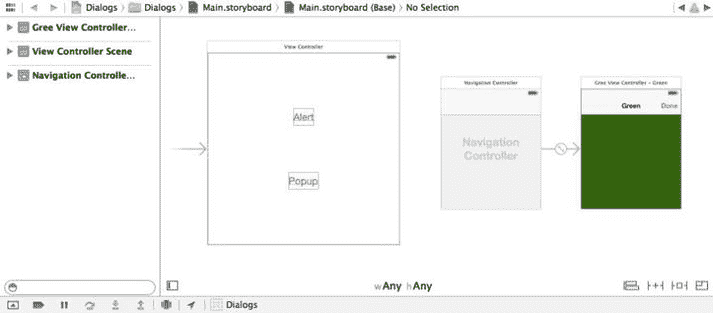

图 3-60. Dialogs 故事板完成图

2.  要展示 `GreenViewController`，请从呈现的 `ViewController` 绘制一个手动转场到 `GreenViewController` 的父级导航控制器。在**属性检查器**中指定转场属性值，如图 3-61 所示。

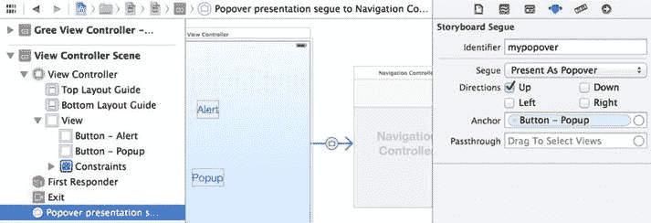

图 3-61. 属性检查器中的故事板转场属性

1.  标识符：`mypopover`。
    2.  转场类型：`Present As Popover`。
    3.  方向：`上`（您可以尝试其他值）。
    4.  锚定插座：将插座拖拽到呈现的视图控制器中的 `Popup` 按钮上。
3.  要执行 `mypopover` 手动转场，请更新 `ViewController.doPopup(...) IBAction` 方法，如代码清单 3-24 所示。请注意，注释掉的代码通过编程方式展示了一个 `UIPopoverController`，而未使用故事板转场。

***代码清单 3-24***. 执行 `mypopover` 手动转场

```swift
    // 在 ViewController 类中
    @IBAction func doPopup(sender: AnyObject) {
      self.performSegueWithIdentifier("mypopover", sender: nil)

// var nav = self.storyboard.instantiateViewControllerWithIdentifier("nav") as UIViewController
    // var popover = UIPopoverController(contentViewController: nav)
    // popover.delegate = self;
    // popover.popoverContentSize = nav.view.bounds.size
    // popover.presentPopoverFromRect(self.mPopupButton.frame, inView: self.view, permittedArrowDirections: UIPopoverArrowDirection.Up, animated: true)
    }
```

4.  您可以通过点击呈现的视图控制器内部但位于 `GreenViewController` 内容视图之外的任意位置来关闭弹出层。要以编程方式关闭弹出层，请实现 `GreenViewController.doDone(...)` 以调用 `dismissViewControllerAnimated(...)`，如代码清单 3-23 所示。

您可以构建并运行 Xcode 的 `Dialogs` 项目，查看 `UIPopoverController` 代码的实际运行效果。在 iPad 上，`UIPopoverController` 呈现为弹出对话框，而相同的代码在 iPhone 等紧凑型尺寸类别的设备上则呈现为全屏模态屏幕，如图 3-62 所示。

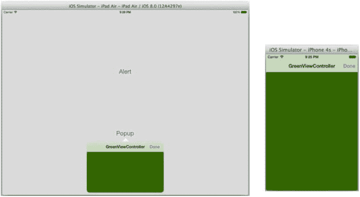

图 3-62. iPad 与 iPhone 上 `UIPopoverController` 代码的运行结果

## 提示消息 (Toasts)

为了给用户提供快速反馈，并使其自动消失，您通常在 Android 应用中使用 Toast。iOS 中没有类似 Android 的 Toast 控件。我非常喜欢这个功能，但它放在 iOS 上可能会显得有点 Android 风格。您始终可以通过定时器以编程方式创建一个带有淡入淡出效果的小型视图区域。

## 总结

要将 Android 应用移植到 iOS，首先要使用对应的 Android 应用作为线框来创建故事板场景，以自然地将您的应用自上而下地分解为结构化的 MVC 项目。结果会得到一组内容视图-视图控制器对，它们映射到 Android 中对应的布局-片段对。

接下来，为了实现屏幕导航模式，您需要绘制故事板转场来连接故事板场景。您还需要从 SDK 中选择合适的容器视图控制器（例如 `UINavigationController`）来辅助屏幕切换。iOS 和 Android 之间其余的内容视图和视图控制器映射关系就简单了。您将在第 4 章中深入了解每个屏幕的细节。

