# 第 4 章

## 逐片实现

在上一章中，您从 iOS 故事板入手，使用导航模式打下了基础。结果得到了一系列连接在一起的 `UIViewController` 类，这些类设置在一个 MVC 框架中，映射到 Android 中的对应片段。

在本章中，您将逐一实现每个视图-控制器对，并包含已存在于对应 Android `Fragment` 和布局文件中的详细用户界面和业务逻辑。您还将重点关注以下常见的从 iOS 到 Android 的编程任务映射：

*   用户界面和常用 UI 控件
*   持久化存储选项
*   使用 JSON 的网络和远程服务

## 用户界面
```


你在第 3 章中使用屏幕导航模式实现的所有故事板场景都故意设计得非常简单。显然，一款实用的移动应用需要提供丰富的内容，并具备更完善的功能来与用户优雅地交互。用户界面在整体用户体验中无疑扮演着重要角色。

为 iOS 创建有意义的用户界面的技术和术语与 Android 截然不同。UI 组件通常是平台相关的。你只需了解 UI 部件的用法，并知道在哪里查阅特定平台的部件规范即可。

另一方面，许多 UI 框架也存在相似之处。iOS 和 Android 的视图块都结构化为一种视图容器（视图/父视图）模型，这种模型在业界已存在很长时间。在 iOS 中，`UIView` 是一个在屏幕上绘制内容并允许用户与之交互的对象。`UIView` 也是一个容器，可以容纳其他 `UIView` 对象，以定义 UI 的层次化布局。

这种视图容器模型与 Android 看起来很相似，但在如何将 UI 部件定位在其父视图中或相对于同级元素方面存在差异。Android 使用**布局管理器**，而 iOS 使用**自动布局**。

## `UIView`

`UIView` 对象是 UI 组件的基本构建块。它是所有部件（如常见的 `UIButton` 和 `UILabel` 等部件）的基类。它也用作父容器视图。

**Android 类比**

`android.view.View` 或 `android.view.ViewGroup`。

一个可见的 `UIView` 在屏幕上占据一个矩形区域，负责绘制和事件处理。`UIViewController` 类有一个在 `UIViewController.view` 属性中定义的根视图，该属性被所有视图控制器继承。所有 UI 部件都是 `UIView` 的特殊类型，具有预期的外观、感觉和行为属性。当在故事板中绘制视图元素时，它们会被添加到父视图中，你可以使用故事板视图**检查器**来直观地编辑视图属性。

所有 iOS UI 部件都继承自 `UIView`。你可以在故事板视图**属性检查器**中设置继承的 `UIView` 属性。例如，图 4-1 展示了任意 UI 部件在**属性检查器**中的 `View` 部分。

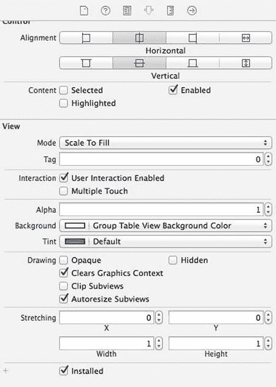

图 4-1. 属性检查器的视图部分

在运行时，你可以通过编程方式更新 `UIView` 对象的这些属性。`UIView` 是所有部件的终极超类。它为开发者提供了相当丰富的 API，以实现多种与 UI 相关的职责：

*   渲染内容
*   布局和管理子视图
*   事件处理
*   动画

本章的其余部分将演示你很可能遇到或预先了解会有好处的常见属性或 API。在深入探讨 iOS SDK 中的常见 iOS UI 部件之前，我想讨论一个重要的相关主题——**应用资源**，UI 部件以及许多其他常见的编程任务都会用到它。

## 应用资源

**Android 类比**

`Android 应用资源`

大多数 GUI 应用不仅由程序代码组成——它们还需要其他资源，例如图像和外部化的字符串。在 iOS 中，你将遇到类似的任务，即如何为不同的设备配置提供不同的资源。这将演示如何在 Xcode 中实现两个常见用例：素材目录和外部化字符串。

### 素材目录

Android 开发者一定很熟悉为图像提供替代资源的概念。本节将向你展示如何在 iOS 中实现。像往常一样，创建一个新的 Xcode 项目并执行以下操作：

1.  启动 Xcode，使用 `Single View Application` 模板，并将项目命名为 `CommonWidgets`。该项目附带一个素材目录 `Images.xcassets`，其中已包含如图 4-2（左侧指针）所示的 `AppIcon` 集。编辑器会显示不同设备类型的图标和像素分辨率。切换 **iOS 6.1 and Prior Sizes** 复选框（图 4-2 中的右侧指针）以查看编辑器中的差异。

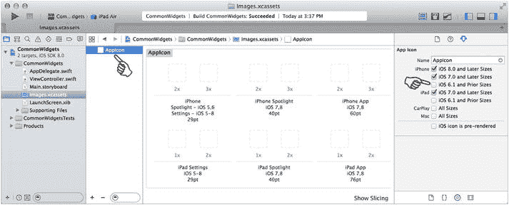

图 4-2. `Images.xcassets` 中的 `AppIcon` 集

2.  你可以使用编辑器中指定的不同图像分辨率，从对应的 Android 资源文件 `res/drawable-xxhdpi/ic_launcher.png` 重新创建图标。将适当的图像文件拖放到引导方块上。图 4-3 展示了结果。

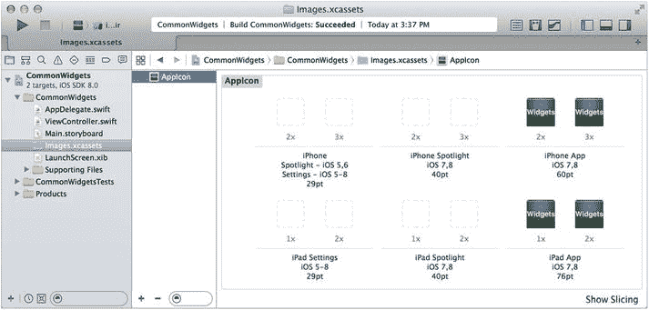

图 4-3. 使用 `Images.xcassets` 在 iOS 中重新创建 Android 图标

3.  要添加图像素材，请点击 **添加** `(+)` 按钮并选择 **New Image Set**，如图 4-4 所示：
    1.  使用**属性检查器**选择你要提供的设备类型。
    2.  你可以选择通过选择 **Universal** 尺寸类别或设备特定类型来提供图像集。无论哪种方式，1x、2x 和 3x 分辨率现在应能覆盖所有 iOS 设备。
    3.  选择 1x 分辨率的图像并将其拖放到正确的位置（如图 4-4 中 **sample** 下方的指针所示）。对 2x 和 3x 图像重复此步骤。
    4.  为图像集命名（例如 `sample`）。该名称是从代码或故事板中访问图像的标识符。

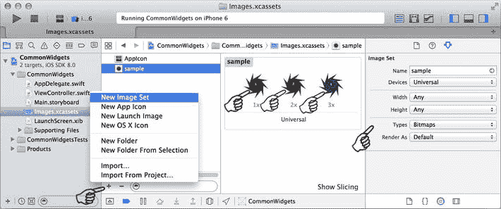

图 4-4. 在 `Images.xcassets` 中添加图像集

你已经创建了两个图像素材。第一个 `AppIcon` 默认用于主屏幕上的启动图标。另一个 `sample` 可用于你的代码或故事板中的任何部件。你可以在后续练习中使用 `sample` 图标。

**注意** 你可以使用自己喜欢的图像编辑器创建图像，或从 `www.pdachoice.com/bookassets` 下载。

### 外部化字符串

通常，你将字符串文本存储在外部文件中。Android 和 iOS 实际上以类似的方式读取外部化字符串。在 Android 中，字符串文件以 XML 格式存储在 `res/values/strings.xml` 中。在 iOS 中，它们以 `"key" = "value";` 格式存储在 `.strings` 文件中。

要将外部化字符串从你的 Android 项目转换到 iOS 项目，请执行以下操作：

1.  在你的 Xcode 项目中任意位置创建一个新文件。例如，首先在 `"Supporting Files"` 文件夹中创建一个新文件，然后按 +N（**New File** 的快捷键）。
    1.  在 **Choose a template** 界面中，选择 **iOS**  **Resource**  **Strings File**。
    2.  另存为 `Localizable.strings`。这是 iOS API 使用的默认文件名。
2.  你可以将对应的 Android `strings.xml` 文件复制并注释到你的 iOS `Localizable.strings` 文件中，以此作为起点。代码清单 4-1 将简单的 Android `string.xml` 转换为 iOS。

***代码清单 4-1***. 从 Android `strings.xml` 到 iOS `Localizable.strings` 的转换

```
    /*
    ==== 从 HelloAndroid Android 项目复制 ===
    <resources>

<string name="app_name">HelloAndroid</string>
     <string name="action_settings">Settings</string>
     <string name="hello_world">Hello world!</string>
     <string name="hello_buttn">Hello ...</string>
     <string name="name_hint">Enter a Name, i.e, You</string>

</resources>
    */


```  
"app_name" = "HelloAndroid";  
"action_settings" = "设置";  
"hello_world" = "你好，世界！";  
"hello_buttn" = "你好...";  
"name_hint" = "输入名称，例如：你";  
```

3.  要从 `Localizable.strings` 文件中读取字符串，请使用 `NSLocalizedString(...)` 方法通过键来获取字符串，如代码清单 4-2 所示。

***代码清单 4-2*** 从 iOS 的 `Localizable.strings` 文件读取字符串

```  
// hello_world" = "Hello world!";  
var str = NSLocalizedString("hello_world", comment: "")  
println(str) // Hello world!  
```

将字符串外部化到一个文本文件中后，你可以将这些文本翻译成不同的语言，这是实现 I18N（国际化）的常见流程。虽然我不打算详细介绍本地化/I18N，但其概念和过程实际上与 Android 中的相同。

## 常用 UI 组件

UI 组件是应用程序用户界面中可交互的软件控制组件，例如按钮、文本字段等。你可以创建包含合适 UI 组件的屏幕，用于与用户交互、收集用户信息和/或向用户展示信息。

iOS 的 `UIKit` 框架提供了丰富的系统 UI 组件，你可以在故事板中“绘制”它们。你还可以将它们作为 `IBOutlet` 属性“连接”到 Swift 类，这样你的代码就可以直接使用视图对象、更新其属性或调用组件方法，以实现动态的应用程序行为。

本节其余内容将介绍常见的 iOS UI 组件，并将其与 Android 中的对应组件进行比较。继续使用之前创建的 `CommonWidgets` 项目，执行以下操作：

1.  故事板中已经有一个与 `ViewController` 类配对的故事板场景。这个场景的高度不足以容纳你将要添加的所有组件。为了让你能看到要添加到该场景的所有组件，将 `Simulated Metrics`（模拟度量）的大小改为 `Freeform`（自由格式），并将其设置得足够长，以便你可以在故事板中看到所有组件。
2.  从故事板中选择 **View Controller**（视图控制器），然后在 **Size Inspector**（尺寸检查器）中，将 `Simulated Size`（模拟尺寸）改为 `Freeform`（自由格式），并将尺寸设为 `320x1500`（图 4-5），以给视图提供足够的高度来开始操作。

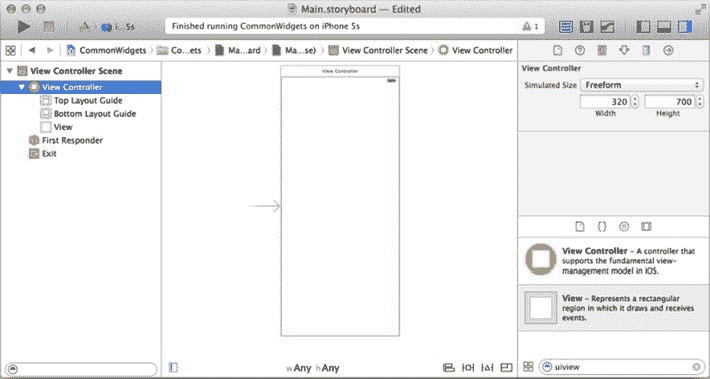

图 4-5 在故事板中将 `Simulated Metrics`（模拟度量）大小改为 `Freeform`（自由格式）

稍后，你将在最后将整个屏幕包裹在滚动视图中，这样你就可以上下滚动视图了。

**注意** 一开始不必为每个组件实现自动布局。在设置 `UIScrollView` 时，自动布局约束会变得混乱。相反，应该在你设置好滚动视图**之后**再实现自动布局约束。

### UILabel

**安卓类比**
`android.widget.TextView`.

你通常使用 `UILabel` 来绘制一行或多行静态文本，例如用于标识 UI 其他部分的文本。

以 Android 应用为线框图，向 iOS 的 `CommonWidgets` 应用添加一个 `UILabel`：

1.  选择 `Main.storyboard`，从 **Object Library**（对象库）中拖拽一个 `UILabel` 到根视图 `View` 上，如图 4-6 所示。拖动组件将 `UILabel` 定位到 **Size Inspector**（尺寸检查器）中所示的位置。

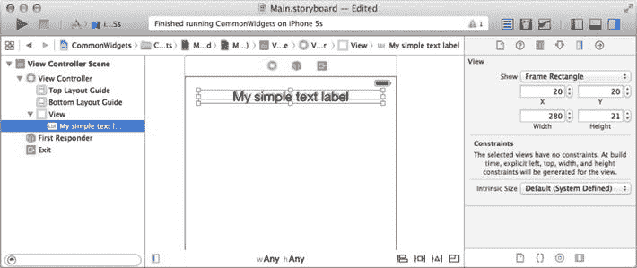

图 4-6 调整 `UILabel` 的大小和位置

2.  在 **Attributes Inspector**（属性检查器）中更新 `UILabel` 属性，如图 4-7 所示：
    1.  文本：**我的简单文本标签**
    2.  对齐方式：居中
    3.  其他属性（**阴影**、**自动缩小**等）也可以随意调整。

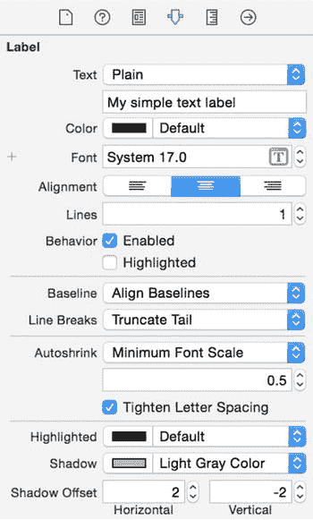

图 4-7 更新 `UILabel` 属性

3.  打开 **Assistant Editor**（辅助编辑器），在 **Connections Inspector**（连接检查器）中将 `IBOutlet` 连接到你的代码，这样你就可以通过编程方式更新 `UILabel`。**Attributes Inspector**（属性检查器）中的大多数属性都可以在运行时通过 `IBOutlet mLabel` 属性进行修改，如代码清单 4-3 所示。

***代码清单 4-3*** `UILabel` 属性

```  
...  
@IBOutlet weak var mLabel: UILabel!  
override func viewDidLoad() {  
  super.viewDidLoad()  
  // 在加载视图后进行任何额外的设置...  
  self.initLabel()  
}  

func initLabel() {  
  self.mLabel.text = "我的简单文本标签"  
  self.mLabel.textColor = UIColor.darkTextColor()  
  self.mLabel.textAlignment = NSTextAlignment.Center  
  self.mLabel.shadowColor = UIColor.lightGrayColor()  
  self.mLabel.shadowOffset = CGSize(width: 2, height: -2)  
}  
...  
```

构建并运行 `CommonWidgets` 应用，查看 `UILabel` 的实际效果（图 4-8）。

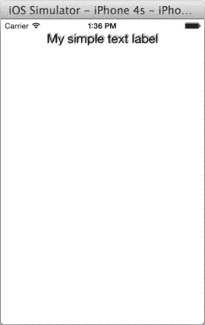

图 4-8 一个简单的 iOS `UILabel` 外观和感觉

### UITextField

**安卓类比**
单行 `EditText`。

在 iOS 中，`UITextField` 接受单行用户输入，并在用户输入为空时显示占位符文本。通过示例学习，执行以下操作以在 `CommonWidgets` 项目中使用 `UITextField`。

1.  选择 `Main.storyboard`，从 **Object Library**（对象库）中拖拽一个 `UITextField` 到根视图 `View` 上，如图 4-9 所示。将 `UITextField` 放置在 `UILabel` 的正下方。

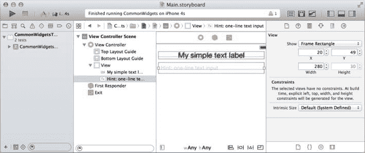

图 4-9 改变 `UILabel` 的大小和位置

2.  在 **Attributes Inspector**（属性检查器）中更新其属性，如图 4-10 所示：
    1.  占位符：**提示：单行文本输入**
    2.  按 **Attributes Inspector**（属性检查器）中的提示填写其他属性。

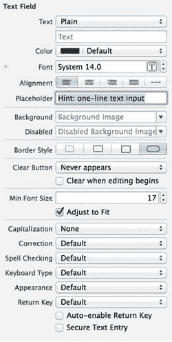

图 4-10 在属性检查器中定义 `UITextField`

3.  打开 **Assistant Editor**（辅助编辑器），在 **Connections Inspector**（连接检查器）中将以下出口连接到你的代码，如代码清单 4-4 所示：
    1.  将 `IBOutlet` 连接到 `mTextField` 属性，这样你就可以通过编程方式更新 `UITextField`。
    2.  将 `delegate`（委托）出口连接到 `ViewController` 类，以便 `UITextField` 向其委托对象发送消息。
    3.  在 `ViewController` 中实现 `UITextFieldDelegate` 协议。代码清单 4-4 展示了按下返回键时关闭键盘的常见方法。

***代码清单 4-4*** `UITextFieldDelegate`

```  
class ViewController: UIViewController, UITextFieldDelegate {  
  ...  
  @IBOutlet weak var mTextField: UITextField!  

  // 当按下 'return' 键时调用。返回 false 则忽略。  
  func textFieldShouldReturn(textField: UITextField!) -> Bool {  
    textField.resignFirstResponder()  
    return true  
  }  
  ...  
```

**注意** `UITextFieldDelegate` 中还定义了其他方法。- 在编辑器中点击该符号可调出类的定义。我通常会查看方法签名，但不会死记硬背。

构建并运行 `CommonWidgets` 应用，查看 `UITextField` 的实际效果。

### UITextView

**安卓类比**
多行 `EditText`。

在 iOS 中，`UITextView` 接受并显示多行文本。通过示例学习，执行以下操作以在 `CommonWidgets` 项目中使用 `UITextView`。

1.  选择 `Main.storyboard`，从 **Object Library**（对象库）中拖拽一个 `UITextView` 到根视图 `view` 上，如图 4-11 所示。将组件放置在 `UITextField` 的正下方。

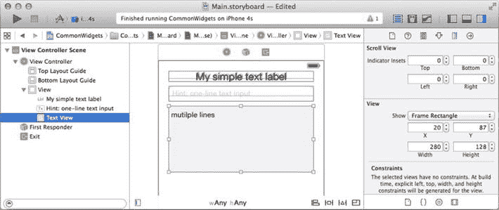

图 4-11 改变 `UILabel` 的大小和位置


### 2. 在**属性检查器**中更新其属性：
   1. **文本**：**多行**
   2. 查看其**属性检查器**。许多属性与`UITextField`类似，但不完全相同（例如，没有`Placeholder`）。
3. 打开**助理编辑器**，并在**连接检查器**中将`IBOutlet`连接到代码中的`mTextView`，以便以编程方式更新`UITextView`。添加一个方法`logText(...)`，该方法将文本打印到`UITextView`。稍后您将使用它（参见列表 4-5）。

***列表 4-5***. `UILabel`属性

```
class ViewController: UIViewController ... {
  ...
  @IBOutlet weak var mTextView: UITextView!
  func logText(text : String) {
    self.mTextView.text = self.mTextView.text + "\n" + text

// to make sure the last line is visible
    var count = self.mTextView.text.utf16Count // string length
    self.mTextView.scrollRangeToVisible(NSMakeRange(count, 0))
  }
  ...
```

`UITextView`可以包含由换行符分隔的多行文本。您将无法像通常对`UITextField`那样关闭键盘。通常，您会使用另一个控件——例如，如果您有一个保存按钮，您可以使用它来触发`View.resignFirstResponder()`，从而关闭键盘。

---

### UIButton

#### Android 类比

`android.widget.Button`。

在 iOS 中，`UIButton`（常见的`Button`控件小部件）会拦截触摸事件并向委托发送操作消息。要通过示例学习，请在`CommonWidgets`项目中执行以下操作：

1. 选择`Main.storyboard`，从**对象库**拖动一个`UIButton`到根`View`，并将该`UIButton`放置在文本视图正下方，如图图 4-12 所示。

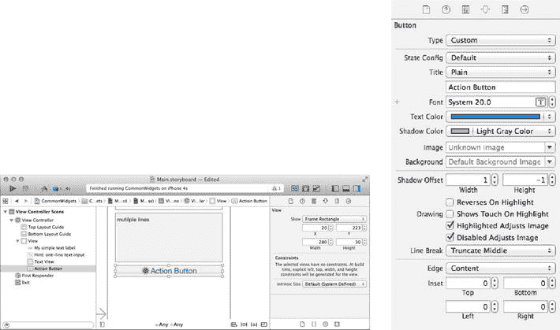

图 4-12. `UIButton`位置和属性

2. 在**属性检查器**中更新其属性（参见图 4-12）：
   1. 就像 Android 的`Button`一样，大多数`Button`属性都与按钮状态相关联。首先选择**状态配置**：**默认**
   2. 标题：**动作按钮**
   * 图像：**sample**
   * 其余属性保持如图图 4-12 所示。
3. 打开**助理编辑器**，并在**连接检查器**中将`IBOutlet`和`IBAction`连接到您的代码中，如列表 4-6 所示。

***列表 4-6***. `IBOutlet`和实现`IBAction`

``` 
class ViewController: UIViewController, UITextFieldDelegate {
  ...
  @IBOutlet weak var mButton: UIButton!
  @IBAction func doButtonTouchDown(sender: AnyObject) {
    println(self.mButton.titleForState(UIControlState.Normal))
    self.mButton.setTitle("Click me!", forState: UIControlState.Normal)
    self.logText("Button clicked")
  }
  ... 
```

构建并运行`CommonWidgets`应用以确认一切正常。当按钮被按下时，它会简单地在`UITextView`中记录"`Button clicked`"文本（参见图 4-13）。

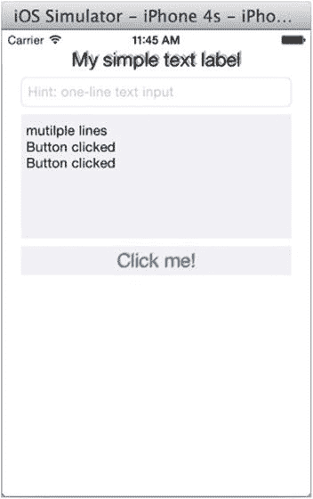

图 4-13. 在`UITextView`中点击按钮

---

### UISegmentedControl

#### Android 类比

`android.widget.RadioGroup`。

在 iOS 中，`UISegmentedControl`提供紧密相关但互斥的选择。在 Android 中，`RadioGroup`提供相同的选项，但在我看来，Android 的外观和感觉更像是桌面应用或网页风格。要通过示例展示和学习，请在`CommonWidgets`应用中执行以下操作：

1. 选择`Main.storyboard`，从**对象库**拖动一个`UISegmentedControl`到按钮下方的根`View`中，如图图 4-14 所示。

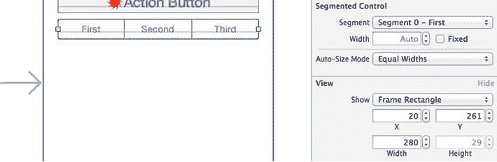

图 4-14. `UISegmentedControl`大小和位置

2. 在**属性检查器**中更新其属性（参见图 4-15）：
   1. 样式：**Bar**
   2. 分段数：**3**
   3. 标题：分别为每个分段设置为 **First**、**Second** 和 **Third**。
   4. 可选地，您可以为每个分段分配一个 **图像** 而不是 **标题**。
   5. 您可以勾选 **已选** 分段（例如，**分段 0**）。

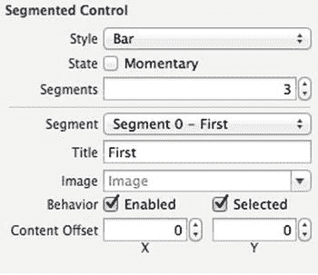

图 4-15. `UISegmentedControl`属性

3. 打开**助理编辑器**，并在**连接检查器**中将`IBOutlet`和`IBAction`连接到您的代码。通常，您会针对`Value Changed`事件实现`IBAction`以捕获选择（参见列表 4-7）。

***列表 4-7***. `UISegmentControl IBOutlet`和实现`IBAction`

``` 
class ViewController: ...{
  ...
  @IBOutlet weak var mSegmentedControl: UISegmentedControl!
  @IBAction func doScValueChanged(sender: AnyObject) {
    var idx = self.mSegmentedControl.selectedSegmentIndex
    self.logText("segment \(idx)")
  }
  ... 
```

构建并运行`CommonWidgets`应用以查看`UISegmentedControl`的实际效果。每个分段都有一个从零开始的索引（参见图 4-16）。

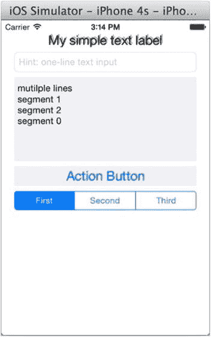

图 4-16. `UISegmentedControl`零基索引

---

### UISlider

#### Android 类比

`android.widget.SeekBar`。

iOS 的`UISlider`允许用户在给定值范围内调整数值。用户向左或向右拖动滑块来设置值。滑块的交互性使其成为设置强度级别（如音量、亮度或色彩饱和度）的理想选择。

要将 Android 的`SeekBar`转换为 iOS 的`UISlider`，请执行以下操作：

1. 选择`Main.storyboard`，从`Object Library`拖动一个`UISlider`，并将其放置在`UISegmentedControl`下方，如图图 4-17 所示。

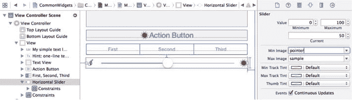

图 4-17. 更新`UISlider`属性

2. 在**属性检查器**中更新其属性（参见[图 4-17](#9781484204375_Ch04.


