# `UISlider`（参见图 4-17）

1.  数值范围：最小值**0**，最大值**100**。
2.  最小值和最大值**图像**。
3.  最小值与最大值轨道**色调**。
4.  你可以禁用**持续更新**。

3.  打开**助理编辑器**，在**连接检视器**中将`IBOutlet`和`IBAction`连接到你的代码。通常，你会为`Value Changed`事件实现`IBAction`来捕获选择值（参见代码清单 4-8）。

***代码清单 4-8*** `UISlider IBOutlet` 与 `IBAction` 的实现

``` class ViewController: ...{
  ...
  @IBOutlet weak var mSlider: UISlider!
  @IBAction func doSliderValueChanged(sender: AnyObject) {
    var value = self.mSlider.value
    self.logText("slider: \(value)")
  }
  ...
```

构建并运行`CommonWidgets`应用，观察`UISlider`的实际效果。当你拖动滑块上的圆点时，其数值会持续打印在`UITextView`中（参见图 4-18）。

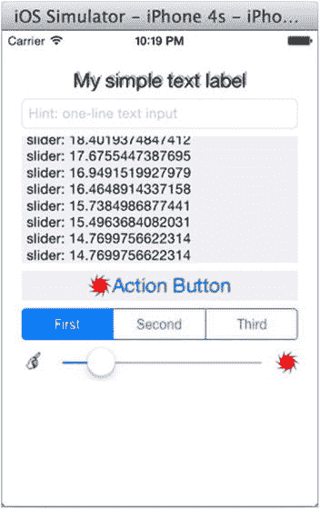

图 4-18 `UISlider` 数值更新

### `UIActivityIndicatorView`

#### ANDROID 对应组件

`android.widget.ProgressBar` 默认样式。

在 iOS 中，`UIActivityIndicatorView` 用于显示任务或其他进行中操作的“忙碌”状态指示器。这相当于 Android 中带旋转轮的不确定进度`ProgressBar`。要将 Android 的不确定进度`ProgressBar`移植到 iOS，请在 `CommonWidgets` iOS 应用中执行以下操作：

1.  选择 `Main.storyboard`，从`对象库`中拖出一个`UIActivityIndicatorView`，将其放置在`UISlider`下方并左对齐（参见图 4-19）。

    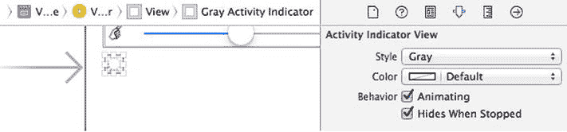

    图 4-19 `UIActivityIndicatorView` 属性

2.  在**属性检视器**中更新其属性，如图 4-19 所示：
    1.  样式：**灰色**
    2.  颜色：**默认**
    3.  行为：通常同时启用`动画`和`停止时隐藏`。

3.  打开**助理编辑器**，在**连接检视器**中将`IBOutlet`连接到你的代码，以便启用或禁用活动指示器，如代码清单 4-9 所示。

***代码清单 4-9*** `UIActivityIndicatorView IBOutlet`

``` class ViewController: ...{
  ...
  @IBOutlet weak var mActivityIndicator: UIActivityIndicatorView!
  func toggleActivityIndicator() {
    var isAnimating = mActivityIndicator.isAnimating()
    isAnimating ? mActivityIndicator.stopAnimating() : mActivityIndicator.startAnimating()
  }
  ...
```

构建并运行`CommonWidgets`应用，观察 iOS 动画活动指示器。你稍后将调用`toggleActivityIndicator()`方法。

### `UIProgressView`

#### ANDROID 对应组件

`android.widget.ProgressBar` 水平样式。

要显示具有已知持续时间的任务进度，请使用`UIProgressView`来指示任务的完成程度。这使用户能够更好地预估任务还需多久完成。要将 Android 的水平`ProgressBar`移植到 iOS 的`UIProgressView`，请执行以下操作：

1.  选择 `Main.storyboard`，从`对象库`中拖出一个`UIProgressView`，将其放置在活动指示器下方并左对齐，如图 4-20 所示。

    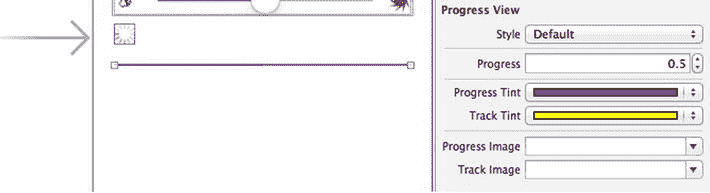

    图 4-20 `UIActivityIndicatorView` 属性

2.  在**属性检视器**中更新其属性（参见图 4-20）：
    1.  样式：**默认（或条形）**
    2.  进度：**0.5**（取值范围在**0.0**到**1.0**之间）
    3.  进度色调：**紫色**
    4.  轨道色调：**黄色**

3.  打开**助理编辑器**，在**连接检视器**中将`IBOutlet`连接到你的代码，以便通过编程方式更新`UIProgressView`。修改`UISlider`的委托方法`doSliderValueChanged(...)`，如代码清单 4-10 所示，从而直观地看到进度变化（参见图 4-21）。

***代码清单 4-10*** `UIActivityIndicatorView` `IBOutlet`

``` class ViewController: ...{
  ...
  @IBAction func doSliderValueChanged(sender: AnyObject) {
    ...
    self.updateProgress(value/100)
  }
  ...
  @IBOutlet weak var mProgressView: UIProgressView!
  func updateProgress(value: Float) {
    self.mProgressView.progress = value
  }
  ...
```

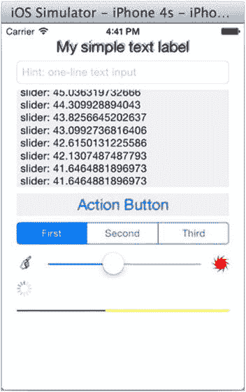

图 4-21 `UIProgressView` 动态更新

构建并运行`CommonWidgets`应用，观察 iOS `UIProgressView` 的实际效果（参见图 4-21）。

### `UISwitch`

#### ANDROID 对应组件

`android.widget.Switch`、`Checkbox` 或 `ToggleButton`。

开关类控件在呈现互斥选项时非常用户友好。在 Android 中，你可以使用 `CheckBox`、`ToggleButton` 或 `Switch`，它们都能实现预期功能，只是外观和感觉有所不同。

在 iOS 中，使用 `UISwitch` 允许用户通过切换或拖动滑块在两个状态之间改变数值。

通过示例学习 `UISwitch`，请执行以下操作：

1.  选择 `Main.storyboard`，从`对象库`中拖出一个 `UISwitch`。将其放置在 `UIActivityIndicatorView` 的右侧（参见图 4-22）。

    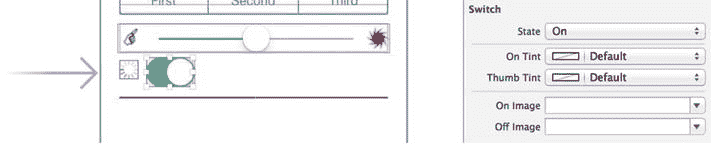

    图 4-22 `UIActivityIndicatorView`

2.  在**属性检视器**中更新其属性（参见图 4-22）：
    1.  状态：**开启**
    2.  你可以安全地更改其他属性。

3.  打开**助理编辑器**，在**连接检视器**中将 `IBOutlet` 和 `IBAction` 连接到你的代码。通常，你会为 `Value Changed` 事件实现 `IBAction` 来捕获选择值（参见代码清单 4-11）。

***代码清单 4-11*** `UISwitch` `IBOutlet`

``` class ViewController: ...{
  ...
  @IBOutlet var mSwitch: UISwitch!
  @IBAction func doSwitchValueChanged(sender: AnyObject) {
    var isOn = self.mSwitch.on
    self.toggleActivityIndicator()
  }
  ...
```

构建并运行应用，切换 `UISwitch` 以观察活动指示器动画的变化（参见图 4-23）。

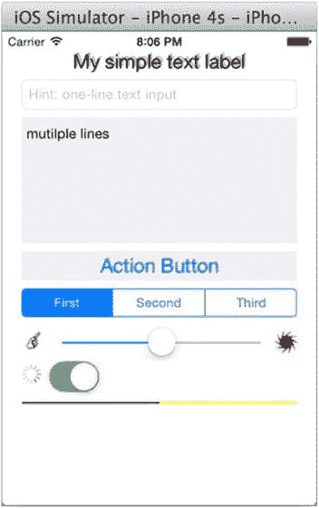

图 4-23 iOS `UISwitch` 的外观和感觉

### `UIImageView`

#### ANDROID 对应组件

`android.widget.ImageView`。

在 iOS 中，`UIImageView` 用于显示单张图片或一系列图片以制作简单的图形动画。对于像 `CommonWidgets` 应用这样的简单用法，你只需在故事板中指定图片源和渲染图片所需的属性即可。

通过示例学习 iOS `UIImageView`，请执行以下操作：

1.  `UIImageView` 现在可以渲染基于矢量的图片！这是 Xcode 6 的新特性。我只知道 PDF 的第一页能被很好地渲染。你当然可以使用位图图片来完成此练习，或者为 PDF 文件创建新的图片集，如图 4-24 中的指示所示：
    1.  选择 **Images.xcassets** 并添加一个 `新图片集`。命名为 `pdf`。
    2.  在**属性检视器**中将类型设置为**矢量**。
    3.  将 PDF 文件拖入通用插槽，如图 4-24 所示。无需提供 2x 或 3x 图片。

    


`Main.storyboard`，从**Object Library**拖动一个`UIImageView`到`view`，并将其放置在`UIProgressView`下方，如 Figure 4-25 所示。  
3.  在**Attributes Inspector**中更新其属性：  
    1.  Image：**pdf**  
    2.  Mode：**Aspect Fit**  
    3.  其他选择如 Figure 4-25 所示。  

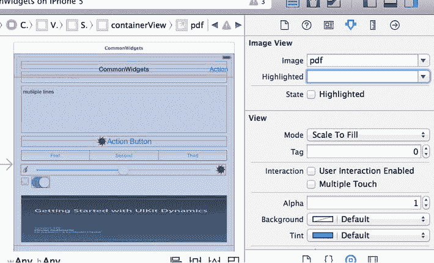  
Figure 4-25. `UIImageView`属性  

4.  打开**Assistant Editor**，在**Connections Inspector**中将`IBOutlet`连接到代码。Listing 4-12 演示了一个简单的`setImage(...)`方法，该方法将`UIImage`对象赋值给`UIImageView`。  

***[Listing 4-12]***. `UISwitch` `IBOutlet`  
```  
class ViewController: ...{  
  ...  
  @IBOutlet weak var mImageView: UIImageView!  
  func setImage(name: String) {  
    self.mImageView.image = UIImage(named: name)  
  }  
  ...  
```  

如 Figure 4-25 所示，需要掌握的属性很少。然而，当涉及到创建`UIImage`以及优化大小和性能时，你需要深入研究`UIImage`类，了解如何从不同来源构建`UIImage`实例。实际上，iOS 框架中有些主要处理图像，比如 Quartz 2D 或 OpenGL。如果你了解 Android OpenGL ES，你绝对可以利用现有知识并探索对应的 iOS OpenGL 框架。如果你有图形编辑背景，Quartz 2D 提供了非常丰富的图形 API，能够支持你完成 iOS 图形编辑任务。  

你可以构建并运行`CommonWidgets` iOS 应用，查看`UIImageView`的实际效果，如 Figure 4-26 所示。  

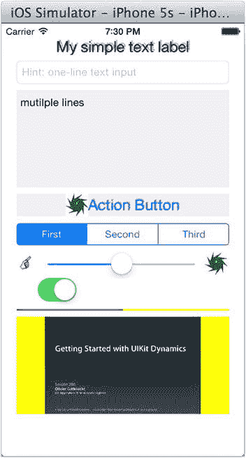  
Figure 4-26. iPhone 5 上的`UIImageView`  

## 菜单  

菜单经常用于提供对常用操作的快速访问。它在桌面和 Android 平台上尤其常见。虽然 iOS SDK 中没有类似命名的功能，但`UIToolbar`或`UINavigationBar`中的`UIBarButtonItem`与 Android 菜单系统有着相似的目的：快速访问。  

你可能还会遇到 Android 上下文菜单和弹出菜单。同样，iOS 中没有这样的菜单系统，但我会展示我为了移植而选择的 iOS 方案。  

### UIBarButtonItem  

**ANDROID 类比**：选项菜单或 ActionBar 中的操作项。  

iOS 和 Android 提供了用于快速访问的控件。在 iOS 中，通常会在导航栏中使用`UIBarButtonItem`，以放置有限数量的操作按钮，这些按钮可以适应固定空间。在 iPhone 上，如果导航栏无法容纳`UIBarButtonItem`中的所有按钮，可以创建一个底部栏`UIToolbar`。  

要在`CommonWidgets`项目中通过示例学习并展示`UIBarButtonItem`在导航栏和工具栏中的使用，请执行以下操作：  

1.  从**Object Library**拖动一个`UINavigationBar`到`view`，并将其放置在视图顶部。通常，更简单的方法是在故事板中选择**View Controller**，然后从 Xcode 菜单栏中选择**Editor**  **Embed In**  **Navigation Controller**，从而添加一个`NavigationController`。Figure 4-27 描述了操作结果，它会在现有**View Controller**场景中产生一个新的**Navigation Controller**场景和一个**Navigation Item**：  
    1.  多选场景中的所有控件，并重新定位它们，为顶部栏腾出空间。  
    2.  在**Attributes Inspector**中更新**Navigation Item**属性（例如，输入标题：**CommonWidgets**）。  

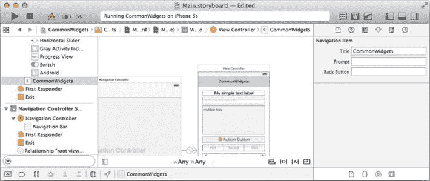  
Figure 4-27. Navigation Controller 和 Navigation Bar  

2.  双击**Navigation Bar**将其选中，然后从**Object Library**拖放一个`UIBarButtonItem`到**Navigation Bar**的右侧，以添加一个`rightBarButtonItem`（参见 Figure 4-28）。从选择项中为那些常见操作选择一个`Identifier`。或者输入一个标题，例如`Action`，如 Figure 4-28 所示。  

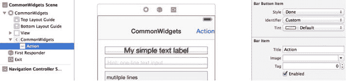  
Figure 4-28. `UIBarButtonItem`属性  

3.  打开**Assistant Editor**，在`UIBarButtonItem`的**Connections Inspector**中将`IBAction`连接到代码（参见 Listing 4-13）。  

***[Listing 4-13]***. `UIBarButtonItem IBOutlet`和`IBAction`  
```  
class ViewController: ...{  
  ...  
  @IBAction func doBarButtonAction(sender: AnyObject) {  
    println(">>doBarButtonAction")  
  }  
  ...  
```  

## 操作表  

**ANDROID 类比**：上下文菜单或`android.widget.PopupMenu`。  

在 Android 中，`Context Menu`是一个浮动菜单，当用户右键单击元素时出现。其操作和外观与触发操作的上下文建立了紧密联系。在 iPad 上，你可以安全地选择`UIPopoverController`（参见第 3 章，`UIPopoverController`）来呈现选项列表，而在 iPhone 上，它会自动全屏呈现。  

如果你不想使用全屏，或许是为了更小的选择，你也可以选择`UIActionSheet`，它在 iPad 上以弹出视图形式呈现，在 iPhone 上则以从屏幕底部弹出的表单形式呈现。  

关键的 SDK 类是`UIAlertController`，它在第 3 章中用于警告对话框（参见 Listing 3-22）。要通过示例学习 iOS 的操作表，请修改之前的`doBarButtonAction(...) IBAction`方法，如 Listing 4-14 所示：  

1.  创建一个`UIAlertController`实例，样式为`UIAlertControllerStyle.ActionSheet`。  
2.  你可以使用`Title`或`Message`来建立与原始上下文的视觉联系。  
3.  通常，会有一个红色破坏性`UIAlertAction`用于删除或移除，它通过`UIAlertActionStyle.Destructive`样式指定。  

***[Listing 4-14]***. 使用`ActionSheet`样式的`UIAlertController`  
```  
class ViewController: ...{  
  ...  
  @IBAction func doBarButtonAction(sender: AnyObject) {  
    println(">>doBarButtonDone: ")  

    var actionSheet = UIAlertController(title: "Action (from bar button item)", message: "Choose an Action", preferredStyle: UIAlertControllerStyle.ActionSheet)  

    // add action buttons  
    var actionCancel = UIAlertAction(title: "Cancel", style: UIAlertActionStyle.Cancel,  
      handler: {action in  
      // do nothing  
      })  

    var actionNormal1 = UIAlertAction(title: "Action 1", style: UIAlertActionStyle.Default,  
      handler: {action in  
        println(">>actionNormal1")  
      })  

    var actionNormal2 = UIAlertAction(title: "Action 2", style: UIAlertActionStyle.Default,  
      handler: {action in  
        println(">>actionNormal2")  
      })  

    var actionDestruct = UIAlertAction(title: "Destruct", style: UIAlertActionStyle.Destructive,  
      handler: {action in  
        println(">>actionDestruct")  
      })  

    actionSheet.addAction(actionCancel) // always the last one  
    actionSheet.addAction(actionNormal1)  
    actionSheet.addAction(actionNormal2)  
    actionSheet.addAction(actionDestruct)  

    // UIViewController API to presend viewController  
    self.  
```  


`presentViewController(actionSheet, animated: true, completion: nil)`  
`}`  
...  

构建并运行 `CommonWidgets` 应用，以可视化 iOS 操作菜单（请参见图 4-29）。  

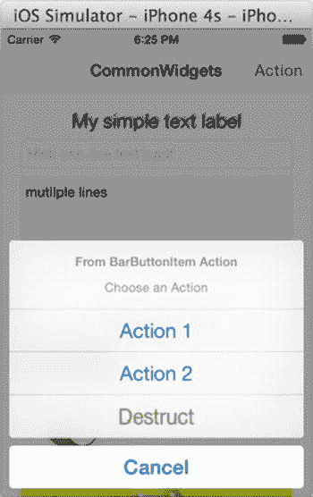  

图 4-29. 使用 `ActionSheet` 样式的 `UIAlertController`  

`android.widget.PopupMenu` 会锚定到一个视图上。在 iOS 中，你可以通过使用 iOS 的 `UIPopoverController` 来呈现一个 `UITableViewController` 从而实现相同的效果。这在 iPad 上是完美的弹窗翻译，在 iPhone 上则是一个全屏的表格视图。或者，你也可以使用 iOS 的 `ActionSheet` 样式来避免 iPhone 上全屏的 `UITableView`。  

## `UIPickerView`  

**安卓类比**  

`android.widget.Spinner`。  

在 iOS 中，`UIPickerView` 会显示一组可供用户选择的值。它提供了一种快速方式，可以从一个类似转轮的列表中选取一个值，该列表会显示全部或部分选项。  

在传统的桌面应用或网页中，通常使用的是下拉列表，或安卓中的 `android.widget.Spinner`，来实现这一目的，但有一个细微的区别：它们只显示选中的值，而其他选项是折叠起来的。  

iOS 的 `UIPickerView` 使用与 `UITableView DataSource` 相同的模式来提供选项。通过实例学习，请向我们的 `CommonWidgets` 应用添加一个 `UIPickerView` 组件，并执行以下操作：  

1.  选择 `Main.storyboard`，然后从 **对象库** 拖拽一个 `UIPickerView`。将其放置在 `UIImageView` 下方（参见图 4-30）。  

    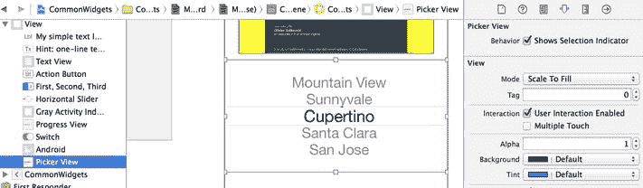  

    图 4-30. 放置 `UIPickerView`  

2.  打开 **助手编辑器**，并在 **连接检查器** 中建立 `UIPickerView` 的 outlet 连接到你的代码（参见图 4-31）：  
    1.  将 `IBOutlet` 连接到你的代码。  
    2.  将 `delegate` 和 `dataSource` 出口连接到 `ViewController` 类（就像 `UITableView` 或任何使用 `Data Source` 的组件一样）。  

    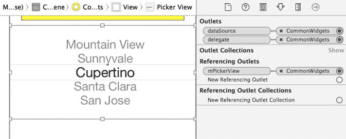  

    图 4-31. 连接 `UIPickerView` 的出口  

3.  要实现 `UIPickerView` 的代理和数据源，请声明 `ViewController` 类实现 `UIPickerViewDelegate` 和 `UIPickerViewDataSource` 协议，如代码清单 4-15 所示。  

    ***代码清单 4-15***. `UIPickerView IBOutlet`  

    ```swift
    class ViewController: ..., UIPickerViewDelegate, UIPickerViewDataSource {
      ...
      @IBOutlet weak var mPickerView: UIPickerView!
      // 返回要显示的“列”数。
      func numberOfComponentsInPickerView(pickerView: UIPickerView) -> Int {
        return 2
      }

      // 返回每个组件中的行数。
      func pickerView(pickerView: UIPickerView, numberOfRowsInComponent component: Int) -> Int {
        return 10
      }

      func pickerView(pickerView: UIPickerView, titleForRow row: Int, forComponent component: Int) -> String! {
        return "(\(component), \(row))"
      }

      func pickerView(pickerView: UIPickerView, didSelectRow row: Int, inComponent component: Int) {
        println("\(self.mPickerView.selectedRowInComponent(0))") // 选择前
        println("\(self.mPickerView.selectedRowInComponent(1))")
        println("(\(component), \(row))") // 当前选择
      }
      ...
    }
    ```

构建并运行应用，即可看到 iOS `UIPickerView` 的实际效果。iPhone 模拟器对于你目前添加的所有组件来说太小了。你需要一个类似安卓的 `ScrollView`（稍后将会实现）。现在可以先在 iPad 模拟器中运行（参见图 4-32）。  

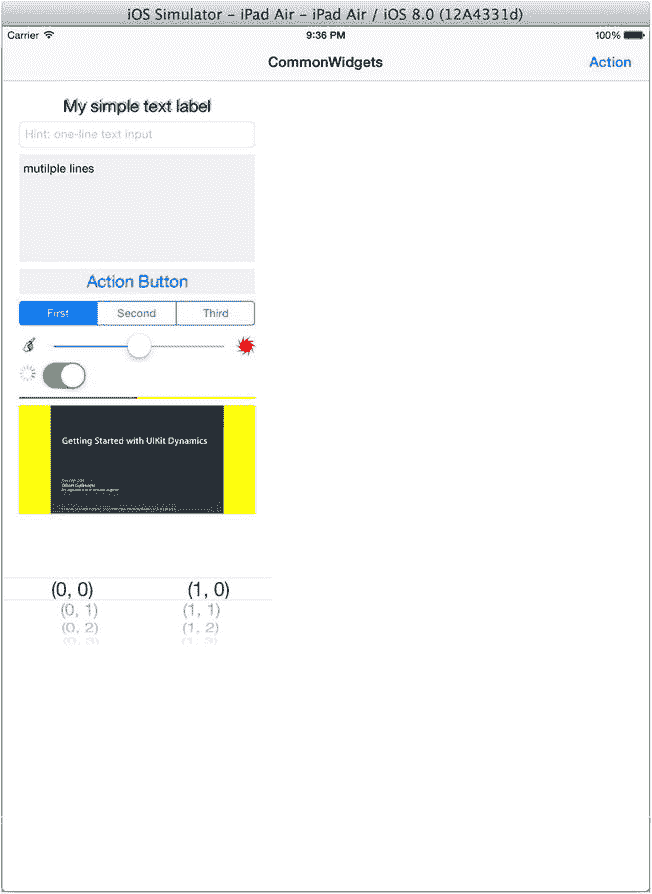  

图 4-32. iPad 模拟器中的 `UIPickerView`  

请注意，如果在 iPad 模拟器中运行应用时，其外观像是一个放大的 iPhone，并且所有组件只是简单地放大，那么你的项目部署信息可能被设置成了仅限 **iPhone**。请在 **部署信息** 下将部署设备更改为 **通用**，如图 4-33 中的指针所示。  

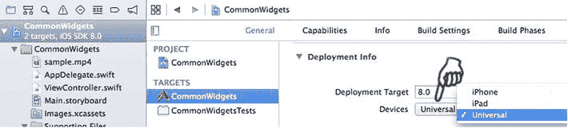  

图 4-33. 在部署信息中将设备更改为通用  

## 播放视频  

**安卓类比**  

`android.widget.VideoView`。  

与安卓类似，iOS SDK 提供了一个易于使用的 API 来播放来自 URL 的视频资源。要播放全屏视频，你可以使用 `MPMoviePlayerViewController` 类，该类已内置了合适的内容视图和媒体播放器控件。你只需要呈现整个视图控制器即可。下面的方法（见代码清单 4-16）演示了最简单的用法：  

1.  实现 `useMoviePlayerViewController()` 方法，该方法在 `MPMoviePlayerViewController` 视图控制器中播放视频（参见代码清单 4-16）：  
    1.  使用 URL 创建一个实例。和安卓一样，它可以链接到远程视频源。iOS 支持 HTTP 实时流协议（HLS）。你也可以为捆绑内容创建一个文件 URL，如代码清单 4-16 中注释掉的代码所示。如同在安卓中一样，请确保视频格式是被支持的。MPEG4 QuickTime 格式具有很好的通用性，HLS 则适合渐进式加载。  
    2.  `MPMoviePlayerViewController` 包含一个 `MPMoviePlayerController` 属性，这是播放视频的核心类。几乎所有定制都是通过该属性完成的。稍后你将用到这个类。  

2.  之前你在一个 `ActionSheet` 中实现了两个操作（参见图 4-29）。使用 `操作 1` 按钮来触发 `useMoviePlayerViewController()` 方法（参见代码清单 4-16）。  

    ***代码清单 4-16***. `useMoviePlayerViewController`  

    ```swift
    import MediaPlayer
    ...
    class ViewController: ...{
      ...
      @IBAction func doBarButtonAction(sender: AnyObject) {
        ...
        var actionNormal1 = UIAlertAction(title: "Action 1", style: UIAlertActionStyle.Default,
          handler: {action in
            println(">>actionNormal1")
            self.useMpMoviePlayerViewController()
          })
        ...
      }
      ...
      func useMpMoviePlayerViewController() {
    //    var filepath = NSBundle.mainBundle().pathForResource("sample.mp4", ofType: nil)
    //    var fileUrl = NSURL(fileURLWithPath: filepath)
    //    var pvc = MPMoviePlayerViewController(contentURL: fileUrl)

        var contentUrl = NSURL(string: "http://devimages.apple.com/iphone/samples/bipbop/gear3/prog_index.m3u8")
        var pvc = MPMoviePlayerViewController(contentURL: contentUrl)

        pvc.moviePlayer.shouldAutoplay = false;
        pvc.moviePlayer.repeatMode = MPMovieRepeatMode.One

        self.presentViewController(pvc, animated: true, completion: nil)
      }
      ...
    }
    ```

3.  要以非全屏模式播放视频，请直接使用 `MPMoviePlayerController` 在一个 `View` 组件中播放视频：  
    1.  选择 `Main.storyboard`，从 **对象库** 拖拽一个 `UIView`，并将其放置在 `UIPickerView` 下方，如图 4-34 所示。这就是显示视频的观看区域。  

        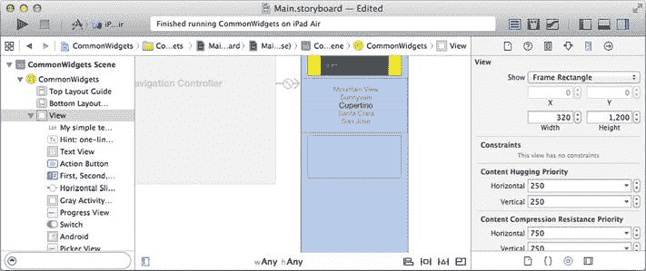  

        图 4-34. 用于播放视频的 `View` 元素  

    2.


好的，作为一名高级文档工程师和翻译员，我将严格按照您提供的注意事项和示例格式，将给定的英文文本翻译成中文。


打开 **Assistant Editor**，在 **Connections Inspector** 中将 `IBOutlet` 连接到你的代码中的 `mVideoView` 属性。

3. 为 `MPMoviePlayerController` 实例创建一个存储属性，以允许用户浏览、播放或停止播放。
4. 在 `viewDidLoad(...)` 中，调用 `useMoviePlayerController()` 方法来准备要播放的视频。
5. 使用 **Action 2** 按钮开始播放视频（参见列表 4-17）。

***列表 4-17***. 使用 `MPMoviePlayercontroller`

```swift
class ViewController: ... {
    ...
    override func viewDidLoad() {
        ...
        self.useMoviePlayerController()
    }
    ...
    @IBOutlet weak var mVideoView: UIView!
    var mMoviePlayer : MPMoviePlayerController!
    func useMoviePlayerController() {
        var url = NSURL(string: "http://devimages.apple.com/iphone/samples/bipbop/gear3/prog_index.m3u8")
        self.mMoviePlayer = MPMoviePlayerController(contentURL: url) 
        self.mMoviePlayer.shouldAutoplay = false
        self.mMoviePlayer.controlStyle = MPMovieControlStyle.Embedded
        self.mMoviePlayer.setFullscreen(false, animated: true) 
        self.mMoviePlayer.view.frame = self.mVideoView.bounds
        self.mVideoView.addSubview(self.mMoviePlayer.view) 
        self.mMoviePlayer.currentPlaybackTime = 2.0
        self.mMoviePlayer.prepareToPlay()
    }
    ...
    @IBAction func doBarButtonAction(sender: AnyObject) {
        ...
        var actionNormal2 = UIAlertAction(title: "Action 2", style: UIAlertActionStyle.Default,
            handler: {action in
                self.mMoviePlayer.play()
                })
        ...
    }
}
```

构建并运行应用。选择 `Action 1` 进行全屏播放，选择 `Action 2` 在子视图中嵌入播放视频。你还没有类似 Android 的 `ScrollView`，但你现在可以在 iPad 模拟器中运行它（参见图 4-35）。

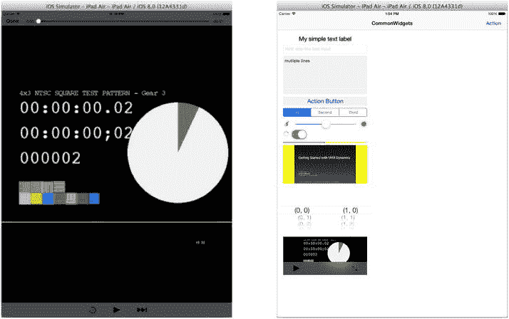

图 4-35. 在 iPad 模拟器中全屏播放视频与嵌入播放视频

## WebView

### ANDROID ANALOGY

`android.widget.WebView`。

你可以在几乎所有主流移动平台（包括 iOS、Android、BlackBerry 和 Windows Phone）的移动应用中显示丰富的 HTML 内容。这使你能够将 Web 内容作为移动应用的一部分来交付。一种常见场景是，当你希望在你的应用中提供需要频繁更新的信息，并且希望将内容托管在线上作为网页时。更进一步，Web 内容不必是远程的；你可以将网页内容与原生应用打包在一起。这使得 Web 开发人员能够利用他们的 Web 开发技能，创建所谓的混合型应用。

借助 HTML5 和 CSS3 的新特性，许多 Web 开发人员正在创建有意义且具有交互性的 Web 应用，这正在缩短原生应用与移动 Web 应用之间的差距。在 iOS 中，关键的 SDK 类是 `UIWebView`，它支持许多 HTML5 和 CSS3 特性（例如 `Offline Cache` 和 `WebSocket` 等）。

例如，以下步骤演示了使用 `UIWebView` 的常见任务：

1. 选择 `Main.storyboard`，从 **Object Library** 中拖拽一个 `UIWebView`，并将其放置在视频 `View` 下方（参见图 4-36）。在 **Attributes Inspector** 中设置其属性；通常设置为 **Scales Page To Fit**。

   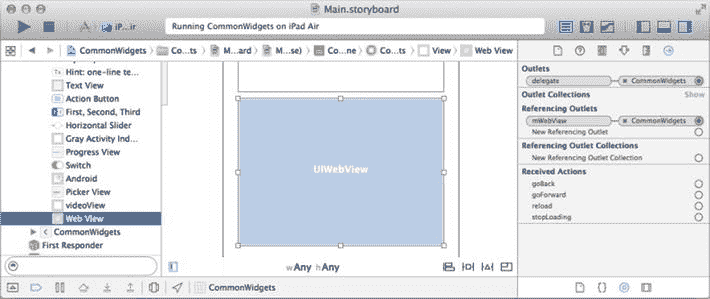

   图 4-36. iOS `UIWebView` 在 Connections Inspector 中的属性

2. 像往常一样，打开 **Assistant Editor** 并在 **Connections Inspector** 中将以下 Outlet 连接到你的代码（参见图 4-36）：
   1. 连接 `IBOutlet`，以便你可以在代码中使用该控件。
   2. 连接 `delegate` Outlet，以便你的代码可以拦截 `UIWebView` 的生命周期事件。

3. 列表 4-18 演示了常用于 `UIWebView` 的编程代码。
   1. 使用 `loadRequest(...)` 加载 URL。你也可以创建一个文件 URL 来加载本地 HTML 文件。
   2. 使用 `loadHTMLString(...)` 渲染简单的字符串文本。
   3. 虽然此处未演示，但你也可以使用 `loadData(...)` 来渲染通常通过 `NSURLConnection` 从远程内容获取的 `NSData`，我将在后面的 “`NSURLConnection`” 章节中演示这一点。

***列表 4-18***. 用于加载 URL 或字符串文本的 `UIWebView` 代码

```swift
class ViewController: ... {
    ...
    override func viewDidLoad() {
        ...
        //    self.showWebPage(url: "http://pdachoice.com/me/webview")
        self.showWebPage(htmlString: "<H1>Hello UIWebView</H1>")
    }
    ...
    @IBOutlet weak var mWebView: UIWebView!
    func showWebPage(#url: String) {
        var req = NSURLRequest(URL: NSURL(string: url)!)
        self.mWebView.loadRequest(req)
    }

    func showWebPage(#htmlString: String) {
        self.mWebView.loadHTMLString(htmlString, baseURL: nil)
    }
    ...
}
```

4. 要拦截 `UIWebView` 的生命周期事件，请实现 `UIWebViewDelegate` 协议，如列表 4-19 所示。

***列表 4-19***. `UIWebViewDelegate` 协议

```swift
class ViewController: ... , UIWebViewDelegate{
    ...
    func webView(webView: UIWebView, shouldStartLoadWithRequest request: NSURLRequest, navigationType: UIWebViewNavigationType) -> Bool {
        // do something, like re-direct or intercept etc.
        return true; // false to stop http request
    }
    func webViewDidStartLoad(webView: UIWebView) {
        // do something, e.g., start UIActivityViewIndicator
        self.mActivityIndicator.startAnimating()
    }
    func webViewDidFinishLoad(webView: UIWebView) {
        // do something, e.g., stop  UIActivityViewIndicator
        self.mActivityIndicator.stopAnimating()
    }
    func webView(webView: UIWebView, didFailLoadWithError error: NSError) {
        // do something, i.e., show error alert
        self.mActivityIndicator.stopAnimating()
        var alert = UIAlertController(title: "Error", message: error.localizedDescription, preferredStyle: UIAlertControllerStyle.Alert)
        alert.addAction(UIAlertAction(title: "Close", style: UIAlertActionStyle.Cancel, handler: nil))
        self.presentViewController(alert, animated: true, completion: nil)
    }
    ...
}
```

构建并运行应用，查看 iOS `UIWebView` 的实际效果。现在，即使是 iPad Air 的屏幕也显得太小了（参见图 4-37）。你需要一个类似 Android 的 `ScrollView`，接下来你将实现它。

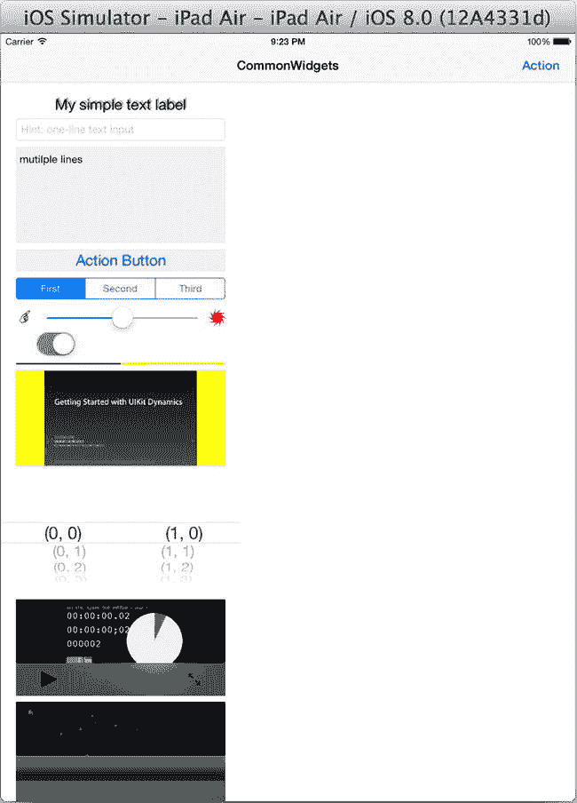

图 4-37. iPad Air 模拟器中的 `UIWebView`

## ScrollView

### ANDROID ANALOGY

`android.widget.ScrollView`。

由于移动设备屏幕尺寸较小，`ScrollView` 对于显示比物理显示屏更大的内容视图非常有用。要在 iOS 中实现这一点，你需要使用 `UIScrollView`。

要使 `UIScrollView` 与自动布局配合使用，更简单的方法是首先将所有控件包裹在一个容器视图中，这将使你能够像往常使用自动布局一样在容器视图中布局控件。

以下步骤演示了如何在 `CommonWidgets` 应用中通常使用 iOS `UIScrollView` 的操作方法：

1. 选择根 `View` 中的所有控件，从 Xcode 菜单栏中选择 **Embed In**  **View**，将这些通用控件嵌入到一个 `View` 中（参见图 4-38），并将此 Storyboard 标签更改为 `containerView`。

   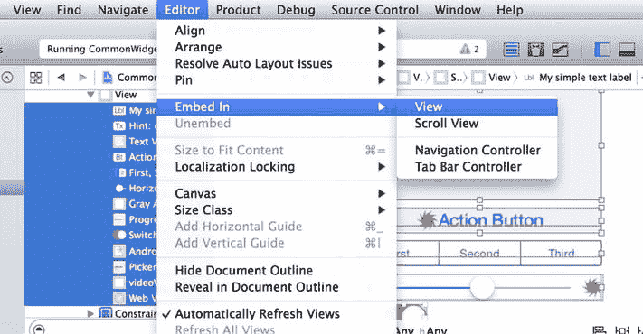

   图 4-38. 将所有控件嵌入到一个 `View` 中

2.


1. 将**视图控制器模拟大小**更改为**固定**。故事板场景会变短，部分控件将移出屏幕，如图 4-39 所示。

   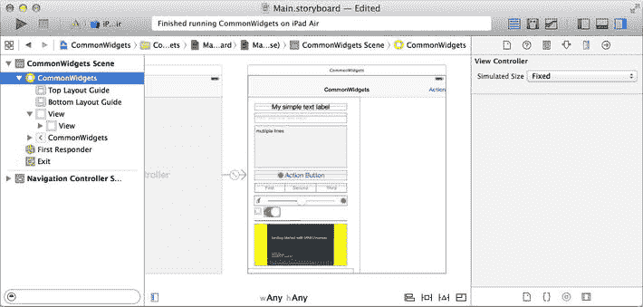
   图 4-39. 将场景更改为固定大小

2. 借助容器，你可以通过将 `containerView` 嵌入到 `UIScrollView` 中，从而整体滚动 `containerView`。首先选中 `containerView`，然后将其嵌入到滚动视图中，如图 4-40 所示（**菜单栏**  **编辑器**  **嵌入于**  **滚动视图**）。

   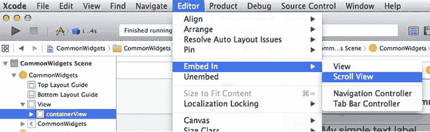
   图 4-40. 将 `containerView` 嵌入到滚动视图中

3. 打开**添加新约束**弹出窗口，将 `UIScrollView` 的各个边缘以零间距固定到父视图的边缘，并更新框架（参见 图 4-41）。

   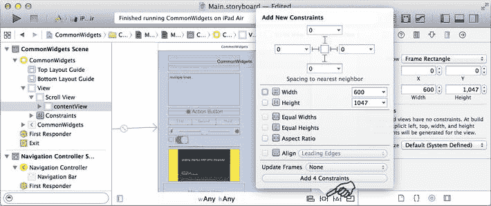
   图 4-41. 设置 `UIScrollView` 的位置

4. 上一步操作会使 `contentView` 发生偏移。在 `contentView` 的**大小检查器**中，将 `contentView` 重新定位到 `(0,0)`，大小为 `600`（**不要**更改高度）。

5. 自动布局约束将用于计算滚动位置。你需要创建自动布局约束，将各个边缘以零间距固定到父级 `UIScrollView`（参见 图 4-42）。

   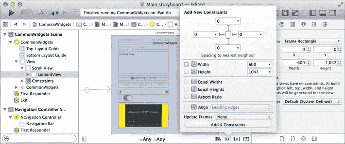
   图 4-42. 将 `contentView` 以零间距固定到 `UIScrollView`

6. 为了使 `containerView` 适应尺寸类别，需要创建将控件对齐到父级前导和尾随边缘的约束。目前，你无法使用故事板为此绘制自动布局，因此必须编写代码，如 代码清单 4-20 所示。

   ***代码清单 4-20***. 将 `contentView` 边缘固定到屏幕/根视图边缘

   ```
   class ViewController: ... {
       ...
       @IBOutlet var mContainer: UIView!
       override func viewDidLoad() {
       ...
       var leftConstraint = NSLayoutConstraint(
                   item: self. mContainer,
            attribute: NSLayoutAttribute.Leading,
            relatedBy: NSLayoutRelation(rawValue: 0)!,
               toItem: self.view,
            attribute: NSLayoutAttribute.Leading,
           multiplier: 1.0,
             constant: 0)
         self.view.addConstraint(leftConstraint)

         var rightConstraint = NSLayoutConstraint(
                   item: self. mContainer,
            attribute: NSLayoutAttribute.Trailing,
            relatedBy: NSLayoutRelation(rawValue: 0)!,
               toItem: self.view,
            attribute: NSLayoutAttribute.Trailing,
           multiplier: 1.0,
             constant: 0)
         self.view.addConstraint(rightConstraint)

       }
       ...
   ```

7. 你还可以为其他控件设置自动布局，使它们适应不同的尺寸类别。构建并运行应用，体验 iOS `UIScrollView` 的实际效果。你应该可以通过上下滚动视图来查看所有控件（参见 图 4-43）。

   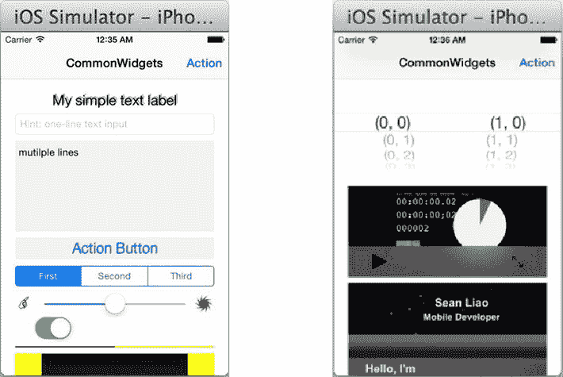
   图 4-43. 带有可滚动视图的 `CommonWidgets`

## 动画

在过去，我很少关注动画效果，但我认为 iOS 的发展无疑提高了门槛。在 iOS 中，你可以使用简单的 `UIView` 动画 API 来对 `UIView` 属性进行动画处理。

为了通过示例学习，请修改现有的 `UISegmentedControl.doScValueChanged(...)` 方法，如 代码清单 4-21 所示，使用 `UIView.animateWithDuration(...)` 方法创建一些动画效果。

***代码清单 4-21***. `UIView.animateWithDuration(...)`

```
... @IBAction func doScValueChanged(sender: AnyObject) {
    var idx = self.mSegmentedControl.selectedSegmentIndex
    self.logText("segment \(idx)")
    let center = self.mButton.center
    UIView.animateWithDuration(1, animations: { action in
        self.mButton.center = CGPoint(x: center.x, y: center.y / (idx + 1))
        self.mButton.alpha = 1 / (idx + 1)
        }, completion: { action in
            UIView.animateWithDuration(1, delay: 0, usingSpringWithDamping: 0.5, initialSpringVelocity: 0.5, options: UIViewAnimationOptions.CurveEaseInOut, animations: { action in
                self.mButton.center = center
                }, completion: {  action in
                    // 不执行任何操作
                })
        })
}
...
```

`UIView.animateWithDuration(...)` 有多个重载变体，它们的工作方式相同。你可以通过在动画块内修改以下 `UIView` 属性来为其添加动画效果：

* `frame`：视图区域
* `center`：位置
* `transform`：缩放和旋转
* `alpha`：透明度
* `backgroundColor`

#### 保存数据

在几乎所有常见的编程平台上，保存数据都是一项基本编程任务。除了事务数据，大多数移动应用还会保存应用状态和用户偏好，以便用户稍后可以继续他们的任务。iOS 和 Android 都提供了多种持久化存储选项。iOS SDK 提供了以下选择：

* `用户默认系统`存储
* `文件`存储
* `CoreData` 框架和 `SQLite` 数据库（本书未涉及）

在深入探讨前两个选项之前，你需要创建一个 Xcode 项目，以便编写代码并可视化这些选项的工作方式。

1. 启动 Xcode，使用**单视图应用**模板，并将项目命名为 `SaveData`。

2. 创建一个带有 `UIBarButtonItem` 的导航栏（参见 图 4-44）：

   1. 在故事板中选择**视图控制器**，然后在 Xcode 菜单栏中选择**编辑器**  **嵌入于**  **导航控制器**。
   2. 在导航项的**属性检查器**中，将标题设为 **SaveData**。
   3. 从**对象库**中拖拽一个 `BarButtonItem`，并将其放置到**视图控制器**场景的导航项上。在**属性检查器**中将栏项的`标题`更新为 **Delete**。
   4. 选中该`栏按钮项`，打开**助理编辑器**，将选择器出口连接到你的代码。将 `IBAction` 命名为 **doDelete**。

   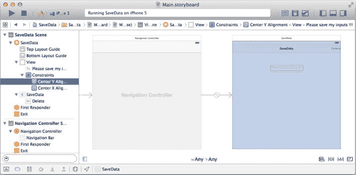
   图 4-44. `SaveData` 项目故事板

3. 创建一个 `UITextField` 来获取用户输入，如图 4-44 所示：

   1. 将一个 `UITextField` 拖拽到**视图控制器**场景上。在**属性检查器**中，输入占位符文本 `"请保存我的输入！！！"`。
   2. 添加自动布局约束，使 `UITextField` 在视图中居中。

4. 打开**助理编辑器**，在 `UITextField` 的**连接检查器**中，将以下出口连接到你的代码：

   1. 将`引用出口`连接到 `IBOutlet` 属性 `mTextField`。
   2. 将 `delegate` 连接到你的 `ViewController` 类。

5. 在 `ViewController` 类中实现 `UITextFieldDelegate` 协议，并创建将触发检索、保存和删除代码的存根，如 代码清单 4-22 所示：

   1. 在 `ViewController.viewDidLoad()` 中加载已保存的数据。
   2. 在按下 Return 键时保存用户输入。


3. 让用户能够选择删除他们创建的任何持久化数据。

***列表 4-22***. `SaveData` `ViewController`

```swift
class ViewController: UIViewController, UITextFieldDelegate {
  ...
  let STORAGE_KEY = "key"
  @IBOutlet weak var mTextField: UITextField!
  override func viewDidLoad() {
    ...
    self.mTextField.text = self.retrieveUserInput()
  }

  @IBAction func doDelete(sender: AnyObject) {
    self.deleteUserInput();
  }

  func textFieldShouldReturn(textField: UITextField!) -> Bool {
    ...
    self.saveUserInput(self.mTextField.text)
    return true
  }

  func saveUserInput(str: String) {
    // TODO
  }

  func retrieveUserInput() -> String? {
    // TODO
    return nil
  }

  func deleteUserInput() {
    // TODO
  }
  ...
}
```

目前还没有什么新内容。构建并运行 `SaveData` 项目（见图 4-45）。

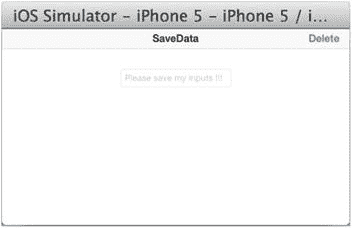

图 4-45. `SaveData` 项目显示

由于方法存根尚未完成，这个新项目暴露出一个常见问题，可以通过以下三个步骤观察到：

1.  在输入文本框中输入一些内容。
2.  退出应用。
3.  重新启动应用。之前的输入消失了！

对于典型的应用设置或用户偏好来说，如果用户每次启动应用都需要重新输入，他们会很不高兴。应用需要保存数据，并在应用重启时重新加载。

### NSUserDefaults

**安卓类比**
`SharedPreferences`.

就像安卓的 `SharedPreferences` 保存基本数据类型的键值对一样，你可以使用 `NSUserDefaults` 类来与 iOS 的`用户默认系统`交互，以达到相同的目的。`NSUserDefaults` 为开发者处理数据缓存和同步。它易于使用，并且性能已经过优化。

iOS 默认系统中要管理的值可以是原始类型，也可以是所谓的属性列表对象（例如 `NSData`、`NSString`、`NSNumber`、`NSDate`、`NSArray` 或 `NSDictionary`）。对于 `NSArray` 和 `NSDictionary` 对象，它们的内容也必须是属性列表对象。

继续处理 `SaveData` 项目。你将修复刚刚观察到的问题。

1.  创建使用 `NSUserDefaults` API 保存、检索和删除数据的便捷方法（见 列表 4-23）：
    1.  获取 `NSUserDefaults` 对象。
    2.  你可以累积多次更新，然后调用 `synchronize()` 将批量更新发送到`默认系统`存储。

***列表 4-23***. 在`默认系统`中保存、检索和删除

```swift
class ViewController: UIViewController, UITextFieldDelegate {
  ...
  let userDefaults = NSUserDefaults.standardUserDefaults()
  func saveUserdefault(data: AnyObject, forKey: String) {
    userDefaults.setObject(data, forKey: forKey)
    userDefaults.synchronize()
  }

  func retrieveUserdefault(key: String) -> String? {
    var obj = userDefaults.stringForKey(key)
    return obj
  }

  func deleteUserDefault(key: String) {
    self.userDefaults.removeObjectForKey(key)
  }
  ...
}
```

2.  之前，你已经创建了连接到正确事件的方法存根。现在调用刚刚创建的便捷方法来完成持久化代码（见 列表 4-24）。

***列表 4-24***. 使用 `UserDefaults` 系统保存、检索和删除

```swift
class ViewController: UIViewController, UITextFieldDelegate {
  ...
  func saveUserInput(str: String) {
    self.saveUserdefault(str, forKey: STORAGE_KEY)
  }

  func retrieveUserInput() -> String? {
    return self.retrieveUserdefault(STORAGE_KEY)
  }

  func deleteUserInput() {
    self.deleteUserDefault(STORAGE_KEY)
  }
  ...
}
```

重新启动 `SaveData` 项目并重复之前的失败测试。现在，重新打开应用时，你将不再需要重新输入名称。

### 文件存储

与 Java 一样，iOS SDK 提供了与文件系统交互的系统 API。在 iOS 中，你通常使用以下 API：

*   `NSFileManager` 类。
*   `NSString`、`NSArray`、`NSDictionary` 和 `NSData` 基础框架类也提供了便捷的方法来从文件系统中存储和检索自身。

#### NSFileManager

**安卓类比**
`java.io.File`.

如果你需要执行任何与文件相关的任务来操作`文件`和`目录`，`NSFileManager` 类提供了完成这些工作的 API。你需要为目标文件指定文件路径或文件 URL，并为文件内容指定 `NSData` 对象。

为了通过示例进行展示和学习，使用 `NSFileManager` 来实现相同的保存/检索/删除目的。

1.  创建使用 `NSFileManager` API 保存、检索和删除数据的便捷方法（见 列表 4-25）：
    1.  获取 `NSFileManager` 对象。
    2.  使用 `NSHomeDirectory().stringByAppendingPathComponent(...)` 构建 iOS 文件路径。
    3.  `NSFileManager` 处理 `NSData`，而 `NSData` 可以转换为常见的基础框架数据类型（例如，字符串、数组和字典）。

***列表 4-25***. 使用 `NSFileManager` 管理文件中的数据

```swift
class ViewController: UIViewController, UITextFieldDelegate {
  ...
  let fileMgr = NSFileManager.defaultManager()
  func saveToFile(str: String, file: String) {
    var path = NSHomeDirectory().stringByAppendingPathComponent("Documents").stringByAppendingPathComponent(file)
    var data = str.dataUsingEncoding(NSUTF8StringEncoding)
    var ok = fileMgr.createFileAtPath(path, contents: data, attributes: nil)
  }

  func retrieveFromFile(file: String) -> String? {
    var path = NSHomeDirectory().stringByAppendingPathComponent("Documents").stringByAppendingPathComponent(file)
    var data = fileMgr.contentsAtPath(path)
    var str = NSString(data:data, encoding: NSUTF8StringEncoding)

    return str
  }

  func deleteFile(file: String) {
    var path = NSHomeDirectory().stringByAppendingPathComponent("Documents").stringByAppendingPathComponent(file)
    var ok = fileMgr.removeItemAtPath(path, error: nil)
  }
  ...
}
```

**注意** 每个应用只能写入应用主目录内的特定文件夹（例如 `Documents` 文件夹）。与 Android 类似，最常见的写入错误可能就是试图在错误的位置创建文件。

2.  调用刚刚创建的便捷方法来完成使用 `NSFileManager` 的持久化代码（见 列表 4-26）。

***列表 4-26***. 使用 `NSFileManager` 在文件中保存、检索和删除

```swift
class ViewController: UIViewController, UITextFieldDelegate {
  ...
  func saveUserInput(str: String) {
    //    self.saveUserdefault(str, forKey: STORAGE_KEY)
    self.saveToFile(str, file: STORAGE_KEY)
  }

  func retrieveUserInput() -> String? {
    //    return self.retrieveUserdefault(STORAGE_KEY)
    return self.retrieveFromFile(STORAGE_KEY)
  }

  func deleteUserInput() {
    //    self.deleteUserDefault(STORAGE_KEY)
    self.deleteFile(STORAGE_KEY)
  }
  ...
}
```

许多基础框架数据类型都包含与文件交互以保存和检索自身的便捷方法。列表 4-27 展示了保存和检索字符串本身的代码：

***列表 4-27***. 使用基础框架类 API 保存字符串

```swift
  func saveToFile(str: String, file: String) {
    var path = ...
    var error: NSError?
    str.
```


```swift
writeToFile(path, atomically: true, encoding: NSUTF8StringEncoding, error: &error)
}
func retrieveFromFile(file: String) -> String? {
    var path = ...
    var error: NSError?
    var str = String(contentsOfFile: path, encoding: NSUTF8StringEncoding, error: &error)
    return str
}
```

你可以在 `NSDictionary`、`NSArray` 和 `NSData` 中找到相同的 `writeToFile(...)` 和 `constructor(...)` 方法，用于保存和检索自身。作为快速练习，代码清单 4-28 与代码清单 4-27 实现相同的目的：

***代码清单 4-28***. 使用 Foundation 类 API 保存字符串（而非使用 NSFileManager API）

```swift
let KEY_JSON = "aKey"
func saveJsonToFile(str: String, file: String) {
    var path = ...
    // 单条目字典，当然可以包含更多条目
    var ser = NSDictionary(objects: [str], forKeys: [KEY_JSON])
    ser.writeToFile(path, atomically: true)
}

func retrieveJsonFromFile(file: String) -> String? {
    var path = ...
    var ser = NSDictionary(contentsOfFile: path)!
    return ser[KEY_JSON] as String?
}
```

这在处理 JSON 消息时尤其有用，因为如今大多数远程消息都是 JSON 格式。

通常，只有在纯文件系统操作（如检查文件属性或遍历目录中的文件）时，才需要直接使用 `NSFileManager`。

## 网络与远程服务的使用

典型的客户端-服务器解决方案将信息托管在服务器端，而客户端应用程序要么从服务器获取数据并以有意义的方式呈现给用户，要么收集用户数据并提交到服务器。你可能经常听到“移动商务”或“移动电商”这样的流行词。简单来说，移动应用程序从服务器获取商品信息，然后通过互联网将订单提交到服务器。从移动应用编程的角度来看，这其实并不新鲜。它仍然是一个使用 HTTP `GET`/`POST` 的客户端-服务器编程话题，大多数电子商务网站正是这样做的。

关于 JSON 消息和 RESTful 服务，我将专门针对移动应用程序进行讨论，因为与传统的基于 SOAP 的 Web 服务相比，它们更受欢迎。

### 在后台执行网络操作

对于带有用户界面的应用程序，你应该在后台执行 I/O 任务或网络相关代码，并在 UI 主线程中更新界面。否则，由于 UI 线程被阻塞等待任务完成，用户会感觉应用卡顿。这一原则适用于 iOS、Android 以及几乎所有 UI 平台。Android SDK 提供了方便的 `android.os.AsyncTask` 类，用于在后台线程执行任务，并在后台任务完成后回调到 UI 主线程。通常，在与远程服务器交互时，你需要在后台线程获取数据。当接收到远程数据后，你的 UI 代码会在屏幕上呈现数据。

为了展示如何在 iOS 中实现相同目标，你将创建一个简单的 iOS 应用，如图 Figure 4-46 所示，以演示一些基本的使用远程 RESTFul 服务的客户端代码：

*   当选择 `GET` 或 `POST` 按钮时，应用会在后台线程向服务器发送 HTTP `GET` 或 `POST` 请求。
*   当收到 HTTP 响应时，应用会在用户界面上渲染数据。

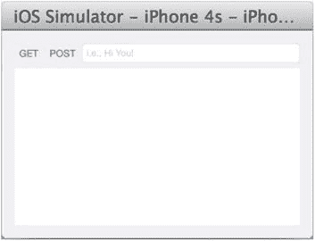

图 4-46. iOS `RestClient` 应用

新建一个 Xcode 项目，从头开始。

1.  启动 Xcode，使用 **Single View Application** 模板，并将项目命名为 `RestClient`。
2.  使用以下控件绘制故事板（参见 Figure 4-47）：
    1.  一个用于调用 HTTP `GET` 的 `UIButton`
    2.  一个用于调用 HTTP `POST` 的 `UIButton`
    3.  一个用于接收用户输入的 `UITextField`
    4.  一个用于渲染 HTTP 响应的 `UIWebView`

        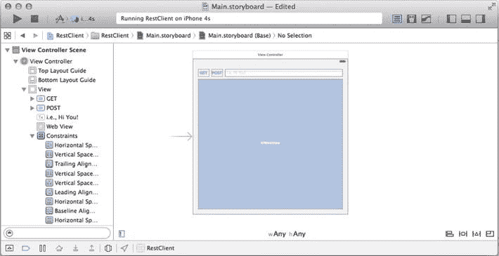

        图 4-47. `RestClient` 故事板

3.  将故事板输出口连接到代码（参见 代码清单 4-29）：
    1.  将 `GET` 按钮的 `Touch Down` 事件连接到 `doGet()` IBAction 方法。
    2.  将 `POST` 按钮的 `Touch Down` 事件连接到 `doPost()` IBAction 方法。
    3.  将 `UITextField` 委托输出口连接到 `ViewController` 类。
    4.  将 `UIWebView` 委托连接到 `ViewController` 类。
    5.  将文本字段的 `New Referencing Outlet` 连接到 `ViewController mTextField IBOutlet` 属性。
    6.  将网页视图的 `New Referencing Outlet` 连接到 `ViewController mWebView IBOutlet` 属性。

***代码清单 4-29***. `RestClient` 准备代码

```swift
class ViewController: UIViewController, UITextFieldDelegate, UIWebViewDelegate {
    @IBOutlet weak var mWebView: UIWebView!
    @IBOutlet weak var mTextField: UITextField!

    override func viewDidLoad() {
        super.viewDidLoad()
        // 在这里进行其他初始化设置...
    }

    func textFieldShouldReturn(textField: UITextField!) -> Bool {
        textField.resignFirstResponder();
        return true
    }

    @IBAction func doGet(sender: AnyObject) {
    }

    @IBAction func doPost(sender: AnyObject) {
    }
}
```

这些内容并无新意，只是重复的故事板任务以及将输出口连接到带有方法存根的代码的过程。接下来，你将在这些存根中填充主要内容。

### 使用 HTTP 的 RESTFul 服务

大多数 RESTFul 服务都支持 HTTP/HTTPS 协议。由于 RESTFul 服务应该与客户端应用无关，因此如果你的 Android 代码使用相同的 RESTFul 服务，那么它很可能可以顺利地移植到 iOS 平台。从大多数 RESTFul 服务获取数据的方式，与浏览器使用 HTTP `GET` 获取远程 HTML 文件类似。你也可以使用 HTTP `GET` 从移动应用获取 HTML 文档——或者获取任何数据，例如原始字节、XML 或 JSON 文档等。

要提交用户输入，你通常会使用 HTML `Form` 将表单数据从 HTML 页面提交到 HTTP 服务器。表单数据通过 HTTP `POST` 方法传输。这在 iOS 和 Android 应用中也非常常见。从技术上讲，你也可以使用 HTTP `GET` 方法向 HTTP 服务器发送查询字符串，就像某些网页所做的那样。在这种情况下，你可以直接构建带查询字符串的 URL，并使用 HTTP `GET` 方法将数据发送到服务器。这是一个设计决策，你需要通过理解 `GET` 与 `POST` 的用法和约定来做出选择。关键在于设计接口，使移动客户端和服务器都能理解它。

#### NSURLConnection

Android 类比
`HttpURLConnection`。

要在 iOS 中与 HTTP 协议交互，你可以使用 `NSURLConnection` 类来发送 `GET` 和 `POST` URL 请求。该 API 与 Android 的 `HttpUrlConnection` 非常相似。

继续 `RestClient` 项目，通过以下步骤添加发送 HTTP 请求的代码：

1.  实现 `IBAction doGet()` 方法，用于发送 HTTP `GET` 请求并从 HTTP 响应中获取数据（参见 代码清单 4-30）：
    1.  创建一个 `NSMutableURLRequest` 对象。

        **注意** 你通常需要对 URL 路径或查询字符串进行转义/编码，就像在 Android 中使用 `URLEncoder` 一样。

    2.  将 HTTP 方法设置为 GET。

        **注意** 根据 HTTP 协议规范，HTTP 方法是区分大小写的。

    3.  设置 `accept` 头部，通常用于内容协商（例如 `text/html`、`json/application` 等）。


**注意** 我们的示例回声服务支持 `"text/html"`、`"text/plain"` 和 `"application/json"` 内容类型。为了直观地展示内容协商，我选择使用 `UIWebView` 控件来渲染服务器响应，并指定了 `"text/html"`。通常，`"application/json"` 更适用于数据交换。

4.  `NSURLConnection.sendAsynchronousRequest` 发送异步 HTTP 请求，并在 UI 主线程的 `completionHandler` 闭包中接收 HTTP 响应。

***列表 4-30***。HTTP `GET`

```
        let URL_TEST = "http://pdachoice.com/ras/service/echo/"
        @IBAction func doGet(sender: AnyObject) {
          var text = self.mTextField.text.stringByAddingPercentEncodingWithAllowedCharacters(NSCharacterSet.URLPathAllowedCharacterSet())
          var url = URL_TEST + text
          var urlRequest = NSMutableURLRequest(URL: NSURL(string: url)!)
            urlRequest.HTTPMethod = "GET"
            urlRequest.setValue("text/html", forHTTPHeaderField: "accept")

          NSURLConnection.sendAsynchronousRequest(urlRequest, queue: NSOperationQueue.mainQueue(),
            completionHandler: {(resp: NSURLResponse!, data: NSData!, error: NSError!) -> Void in
              self.mWebView.loadData(data, MIMEType: resp.MIMEType, textEncodingName: resp.textEncodingName, baseURL: nil)
            })
          }
```

2.  实现 `IBAction doPost()` 方法，用于发送 HTTP `POST` 请求，将数据发送到服务器并接收 HTTP 响应（请参阅列表 4-31）。与发送 HTTP `GET` 几乎相同，您使用 `NSURLConnection.sendAsynchronousRequest` 发送异步 HTTP 消息，区别在于将 HTTP 方法设置为 `POST`：

    1.  确保将 HTTP `method` 设置为 `POST`。
    2.  `POST` 数据格式与查询字符串相同，但您需要对其进行编码以放入 HTTP `Body` 中，方法与在 Android 中相同。
    3.  要解析 JSON 内容或创建 JSON 对象，`NSJSONSerialization` 是您的得力助手。您需要将 JSON 对象转换为 `NSDictionary`，或将 JSON 数组转换为 `NSArray`。

***列表 4-31***。HTTP `POST`

```
@IBAction func doPost(sender: AnyObject) {
  var text = self.mTextField.text.stringByAddingPercentEncodingWithAllowedCharacters(
       NSCharacterSet.URLQueryAllowedCharacterSet())
  var queryString = "echo=" + text;
  var formData = queryString.dataUsingEncoding(NSUTF8StringEncoding)!
  var urlRequest = NSMutableURLRequest(URL: NSURL(string: URL_TEST)!)
  urlRequest.HTTPMethod = "POST"
  urlRequest.HTTPBody = formData

  urlRequest.setValue("application/json", forHTTPHeaderField: "accept")

  NSURLConnection.sendAsynchronousRequest(urlRequest,
    queue: NSOperationQueue.mainQueue(),
    completionHandler: {(resp: NSURLResponse!, data: NSData!, error: NSError!) -> Void in
      println(resp.MIMEType)
      println(NSString(data: data, encoding: NSUTF8StringEncoding))

      var json = NSJSONSerialization.JSONObjectWithData(data, options:
          NSJSONReadingOptions.AllowFragments, error: nil) as NSDictionary
      self.mWebView.loadHTMLString(json["echo"] as String, baseURL: nil)
    })
})
```

**注意** `SERVER_URL = "http://pdachoice.com/ras/service/echo"` 是一个简单的 Web 服务，用于回显路径参数。桌面浏览器完全能够渲染纯文本以及 HTML 文档。您可以使用桌面浏览器来验证来自服务器的数据。

构建并运行 `RestClient` 项目，然后输入 **"Hi you!"** 以查看实际运行的应用程序。使用 `GET` 方法的简单回声服务实际上以 HTML 格式响应：`<html><body><h1>Hi you!</h1></body></html>`，其渲染效果如图 4-48 所示。

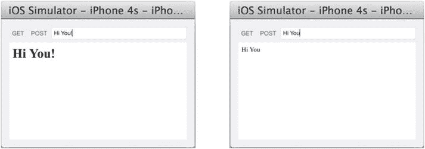

图 4-48。`RestClient doGet` 和 `doPost` 响应

## 总结

本章介绍了从 Android 到 iOS 最常见的编程组件映射：

*   用户界面和 UI 控件
*   持久化存储选项
*   网络与基于 JSON 的远程服务

许多有意义的应用程序仅涉及本文讨论的组件。本章列出了所有可行的映射，并提供了关于如何将 Android 组件转换为对应 iOS 组件的逐步指导。接下来，您将了解如何应用这些指南，从头到尾构建一个简单但完整的实用工具应用程序。

## 第三部分

## 整合所有内容

之前，您已经了解了许多独立的 Android 到 iOS 映射主题。这些主题特意设计为自包含的，且各个 Xcode 项目中的类非常少，以便它们可以作为独立的示例项目。在真实的编程世界中，正是功能与用例的结合才使您的应用程序既实用又有趣。您肯定需要应用多个映射指南才能完成一个有意义的应用程序。

为了引导您完成整个移植过程，您将通过应用第二部分的映射主题，从头到尾移植一个功能完整的 Android 应用程序：

1.  使用对应的可运行的 Android 应用程序作为线框图，创建可运行的故事板。
2.  首先将 Android 类和类成员签名移植到 Swift。如果可能，请保留任何签名。
3.  一次一个方法地填补空白。调用者、接收者和“点”大多会毫无障碍地相互连接，只需在方法级别盲目地将 Java 语句或表达式翻译为 Swift 即可。

这里不会有任何真正的新内容；您将系统地重复您一直在使用的自顶向下的开发方法，并逐一实现各个部分。

## 第五章

## 案例研究回顾

到目前为止，本书中您已经了解了许多独立的 Android 到 iOS 映射主题，并创建了超过 10 个 Xcode 项目。这些映射主题特意在单独的 Xcode 项目中实现，且类非常少。在第 3 章中，您学习了使用故事板进行自顶向下开发的方法，将整个应用程序分解为面向 MVC 的内容视图和视图控制器对。在第 4 章中，您学习了如何逐个地将较小的独立组件从对应的 Android 应用程序移植过来。然而，所有这些主题都被设计为自包含且无依赖关系，以便它们可以作为独立的指导。

在真实的编程世界中，正是功能与用例的结合才使您的应用程序既实用又有趣。您肯定需要应用多个映射指南才能完成一个有意义的应用程序。在本章中，您将使用第 3 章和第 4 章的映射主题，从头到尾移植一个现有的 Android 应用程序。没有新内容；您仍然会重复使用之前一直在用的自顶向下开发方法，并逐一实现各个部分。

也许有一件事情我还没有明确提及：应该先处理哪一部分，然后再处理哪一部分。对于任何应用程序，包括您正在移植的 Android 应用程序，您都必须经历相同的思考过程。如果您还记得创建您正在移植的 Android 应用程序的过程，那将是一个很好的开始，因为它将使您的 iOS 移植任务更高效。否则，您将使用平常的思考过程：确定各部分之间的依赖关系，并尝试在此过程中减少依赖关系。毕竟，绝对正确或错误的方法是不存在的。这超出了我们的移植主题，但我相信通过这最后的练习，您会开始理解我的思考过程。


## 将 Android 应用移植到 iOS

同样，为了通过实例进行展示和学习，您的目标是将 Android 应用 `RentalROI` 移植到 iOS。图 5-1 展示了您要移植的 Android 应用。

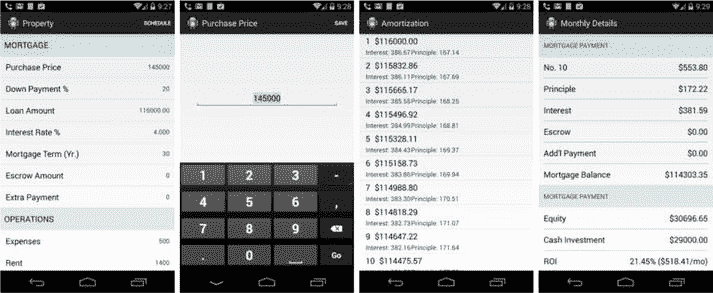

图 5-1. Android `RentalROI` 界面

此 Android 应用执行以下任务：

- 用户每次输入新的租赁房产参数时，用户输入都会使用 `SharedPreferences` 进行保存。
- 摊销计划在远程服务器上计算。Android 客户端只需调用远程服务来获取摊销计划，并将数据存储在本地。
- 如果存在已保存的摊销计划，应用将直接使用它，而无需再调用远程服务。

您需要将此 Android 应用移植到 iOS，并保留已有的设计决策。

> **注意** 这仅用于练习目的。更好的做法是在本地计算摊销计划，而无需使用远程服务——这样您就不需要持久化结果了。

您可以从 `http://pdachoice.com/bookassets/RentalROI-adt.zip` 下载 ADT 项目。

首先，您将使用 `Single View Application` 模板创建一个新的 Xcode 项目，并为其指定与 Android 应用相同的名称：`RentalROI`。您将遵循与您在第 3 章（“构建应用结构”）和第 4 章（“逐一实现”）中使用的相同的移植方法。

### 构建应用结构

您的第一步是按照第 3 章中的指导创建 Xcode 故事板：

- 为每个内容视图绘制故事板场景，并将 UI 控件连接至与故事板场景配对的 `UIViewController` 自定义类。
- 选择导航模式，并使用 Segue 将故事板场景连接在一起。

这将生成一个可运行的 iOS 应用，其中包含所有内容视图以及使用适当屏幕导航模式连接起来的视图控制器类骨架。

#### 绘制故事板场景

您可以在图 5-1 中清晰地看到四个内容视图，您需要在 `Main.storyboard` 中绘制四个故事板场景。您应该使用对应的 ADT 项目作为动态线框图来创建 iOS 故事板：

1.  无特定顺序，让我们从最简单的开始，即对应 ADT 项目中的 `EditTextViewFragment`。对应 ADT 项目中，内容视图布局仅包含一个 `EditText`。您需要向故事板场景添加一个 `UITextField`（详细说明请参见第 4 章，“`UITextField`”）。

    1.  将一个 `UITextField` 从 **对象库** 拖到 `View` 上，并按照图 5-2 所示在 **属性检查器** 中更新其属性。

        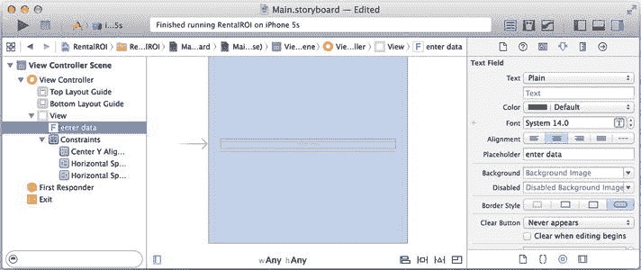

        图 5-2. `EditTextView` 故事板场景

    2.  将其垂直居中，并在前导和尾随间距中添加一些空间（例如 `20`）。
    3.  创建一个继承自 `UIViewController` 的 Swift 基础类 `EditTextViewController`（参见代码清单 5-1）。
    4.  为了与故事板场景配对，在 **身份检查器** 中输入自定义类名。
    5.  在 **连接检查器** 中，将 `delegate` 出口和 `New Referencing Outlet` 连接到您的代码。

        ***代码清单 5-1***. `EditTextViewController`

        ```
        import UIKit

        class EditTextViewController: UIViewController, UITextFieldDelegate {
            @IBOutlet weak var mEditText: UITextField!
        }
        ```

2.  继续绘制下一个内容视图，顺序不限（例如，房产界面）。在 Android 对应的 `RentalPropertyViewFragment` 类中，我使用了 `ListFragment` 来实现外观与体验。

    在 iOS 中，您的自然选择是 `UITableViewController`（详细说明请参见第 3 章，“`UITableViewController`”）。

    1.  将一个 `UITableViewController` 从 **对象库** 拖拽到故事板编辑器中，以创建一个故事板场景。
    2.  选择 Table View，并在 **属性检查器** 中将 `Style` 属性更新为 `Grouped`（参见图 5-3）。

        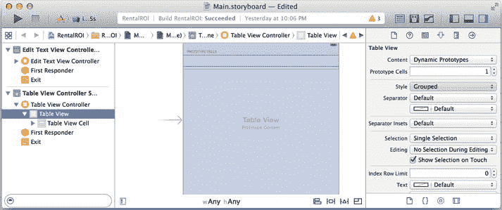

        图 5-3. 创建 Table View 场景

    3.  选择 Table View Cell，并在 **属性检查器** 中更新属性（参见图 5-4）：
        - Style: 选择 **Right Detail**。
        - Identifier: 输入 `aCell`。

        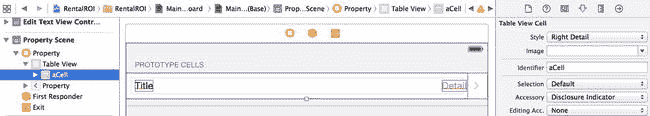

        图 5-4. Right Detail, Table View Cell

    4.  创建一个继承自 `UITableViewController` 的 Swift 基础类 `RentalPropertyViewController`（参见代码清单 5-2）。为了与故事板场景配对，在 **身份检查器** 中输入自定义类名。

        ***代码清单 5-2***. `RentalPropertyViewController`

        ```
        import UIKit
        class RentalPropertyViewController: UITableViewController {

        }
        ```

3.  继续绘制下一个内容视图，顺序不限（例如，摊销界面）。对应的 Android `AmortizationViewFragment` 是一个标准的 `ListFragment`。同样，在 iOS 中您的自然选择是 `UITableViewController`。

    1.  将一个 `UITableViewController` 从 **对象库** 拖拽到故事板编辑器中，以创建一个故事板场景。
    2.  选择 Table View Cell。在 **属性检查器** 中，更新以下属性：
        - Style: 选择 **Subtitle**。
        - Identifier: 输入 `aCell`。
    3.  创建一个继承自 `UITableViewController` 的 Swift 基础类 `AmortizationViewController`（参见代码清单 5-3）。
    4.  为了与故事板场景配对，在 **身份检查器** 中输入自定义类名。

        ***代码清单 5-3***. `AmortizationViewController`

        ```
        import UIKit
        class AmortizationViewController: UITableViewController {

        }
        ```

4.  继续绘制最后一个内容视图——月度详情。对应的 Android `MonthlyTermViewFragment` 布局看起来像 `ListView`，但实际上是用两个 `TextView` 和一个带有装饰的分隔线 `View` 实现的。您可以逐个将这些 Android 控件转换为 iOS，或者像第 2 步那样选择使用 `UITableView`。在 iOS 中，实际上有一个更好的选择：使用带有静态单元格的 `UITableViewController`，每行对应一个静态单元格。

    1.  将一个 `UITableViewController` 从 `Object Library` 拖拽到故事板编辑器中，以创建一个故事板场景。
    2.  选择 Table View，在 **属性检查器** 中按照图 5-5 所示更新属性。
        - Content: 选择 **Static Cells**。
        - Sections: `2`
        - Style: 选择 **Grouped**。

        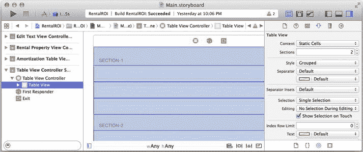

        图 5-5. 静态单元格 Table View

4.  月度详情界面包含 `Mortgage Payment` 和 `Investment` 两个部分。


您需要更新章节标题，并在两个分区中添加表格视图单元格，如图 5-6 所示。

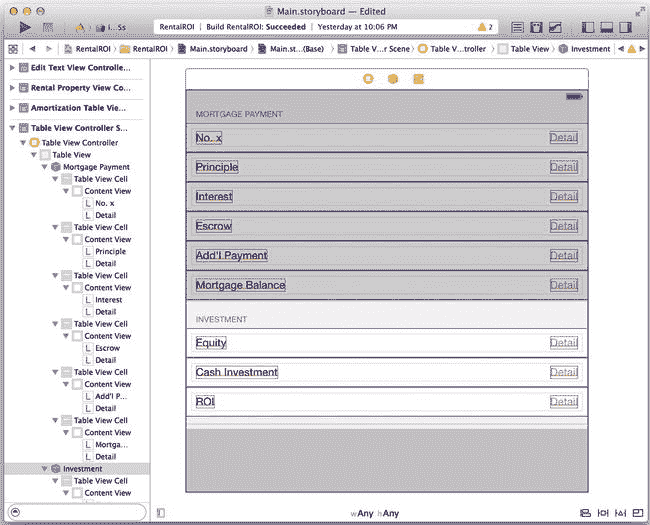

图 5-6，“月度明细”屏幕中的两个分区

1. 要更新分区标题，请选择**表格视图分区**，并在**属性检查器**中更新`Header`属性：
   - 分区 1：`Mortgage Payment`
   - 分区 2：`Investment`
2. 由于此视图中所有表格视图单元格都设计为具有相同样式，因此更简便的方法是只创建一个并复制它。您可以保留第一个表格视图单元格，并删除其余单元格。
3. 选择表格视图单元格，然后将**样式**更新为**右侧详细信息**。
4. 选择`Mortgage Payment`分区，并将行数更新为`6`。
5. 您需要为分区 2 创建三个表格视图单元格。可以重复上述步骤，或在故事板编辑器中进行复制和粘贴。
6. 根据对应的 Android 内容视图，更新所有表格视图单元格的标题。
7. 创建一个基础的 Swift `MonthlyTermViewController` 类，该类继承自 `UITableViewController`。要关联故事板场景，请在**身份检查器**中输入自定义类名。
8. 打开**助理编辑器**，并将第一个表格视图单元格的左侧文本标签以及每个表格视图单元格的右侧详细标签，分别连接到代码的`IBOutlet`属性，如代码清单 5-4 所示。

***代码清单 5-4***. `MonthlyTermViewController IBOutlet` 属性

```swift
import UIKit

class MonthlyTermViewController : UITableViewController {
    @IBOutlet weak var mPaymentNo: UILabel!
    @IBOutlet weak var mTotalPmt: UILabel!
    @IBOutlet weak var mPrincipal: UILabel!
    @IBOutlet weak var mInterest: UILabel!
    @IBOutlet weak var mEscrow: UILabel!
    @IBOutlet weak var mAddlPmt: UILabel!
    @IBOutlet weak var mBalance: UILabel!
    @IBOutlet weak var mEquity: UILabel!
    @IBOutlet weak var mCashInvested: UILabel!
    @IBOutlet weak var mRoi: UILabel!
}
```

图 5-7 描绘了从 Android 对应版本迁移而来的故事板场景。

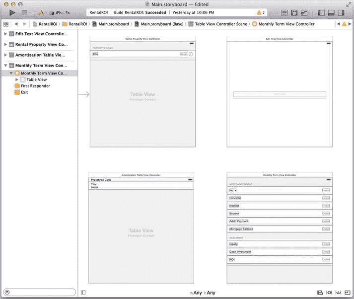

图 5-7. 四个`RentalROI`场景

### 选择屏幕导航模式

在选择合适的导航模式时，通过试玩您正在移植的 Android 应用，您会很自然地获得很好的思路。有时您可能需要不止一种模式，例如导航堆栈加导航标签。在这个`RentalROI`应用中，您希望能够从“月度明细”屏幕返回到“摊销列表”屏幕，再返回到“物业详情”屏幕。流行的导航堆栈导航模式非常适合这种预期行为（请参阅第 3 章，“导航堆栈”）。对于往返“编辑文本”场景，您可以选择一种不同的导航模式，以显示与原始上下文更强的关联性。可选择“对话框”或 iOS 的“弹出框”（请参阅第 3 章，“`UIPopoverController`”）。

您当前的任务是添加导航模式，并绘制故事板转场，将所有故事板场景相互连接起来。图 5-8 显示了连接所有场景后的最终故事板。

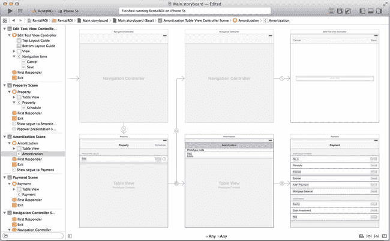

图 5-8. `RentalROI` 已连接的场景

继续执行故事板任务，请执行以下操作（有关分步说明，请参阅第 3 章，“故事板转场”）：

1. 在故事板编辑器中选择`RentalPropertyViewController`，并将其嵌入到`UINavigationController`中（有关详细说明，请参阅第 3 章中的图 3-33，“`UINavigationController`”）。
   1. 确保在导航控制器的**属性检查器**中勾选了**是初始视图控制器**。
   2. 在`RentalPropertyViewController`中选择导航项，以在**属性检查器**中将`Title`属性更新为`Property`。
   3. 在`RentalPropertyViewController`中为`Property`导航项添加一个右侧的`BarButtonItem`。同时，在`BarButtonItem`的**属性检查器**中将按钮的`Title`属性更新为`Schedule`。
   4. 在**连接检查器**中将`Schedule BarButtonItem`的动作出口连接到您的代码，例如`doSchedule(...)`。
2. 从`RentalPropertyViewController`连接一个手动转场到`AmortizationViewController`。
   1. 转场：`Show`（例如`Push`）。
   2. 标识符：`AmortizationTable`。
3. 从`RentalPropertyViewController`连接一个手动转场到`EditTextViewController`。
   1. 转场：`Present As Popover`。
   2. 标识符：`EditText`。
   3. 锚点：`Table View`。
   4. 方向：无（取消所有勾选）。
4. 从`AmortizationViewController`连接一个手动转场到`MonthlyTermViewController`。
   1. 转场：`Show`（例如`Push`）。
   2. 标识符：`MonthlyTerm`。
5. 如图 5-8 所示，向`AmortizationViewController`和`MonthlyTermViewController`添加导航项。
   1. 从**对象库**拖拽**导航项**，并将其放置到故事板文档大纲中的控制器上。
   2. 分别更新导航项的`Title`（例如`Amortization`和`Payment`）。
6. 由于您没有使用导航模式展示`EditTextViewController`，因此`EditTextViewController`不像故事板中的其他场景那样拥有导航项的`Title`或`BarButtonItem`。您可以从**对象库**中绘制一个`UINavigationBar`，或者更常见的是，您可以简单地将其嵌入到另一个`UINavigationController`中。
   1. 选择视图控制器，然后从 Xcode 的**编辑器**菜单中选择**编辑器  嵌入于  导航控制器**。
   2. 添加一个右侧的`BarButtonItem`。将`Title`属性更新为`Save`，并将动作出口连接到您的代码，例如`doSave(...)`。
   3. 添加一个左侧的`BarButtonItem`。将`Title`属性更新为`Cancel`，并将动作出口连接到您的代码，例如`doCancel(...)`。

您应该得到一个所有场景都通过转场连接起来的故事板，如图 5-8 所示。

### 逐步实现

让我们来看看您现在拥有的各个部分。图 5-9 并排显示了两个项目的结构。

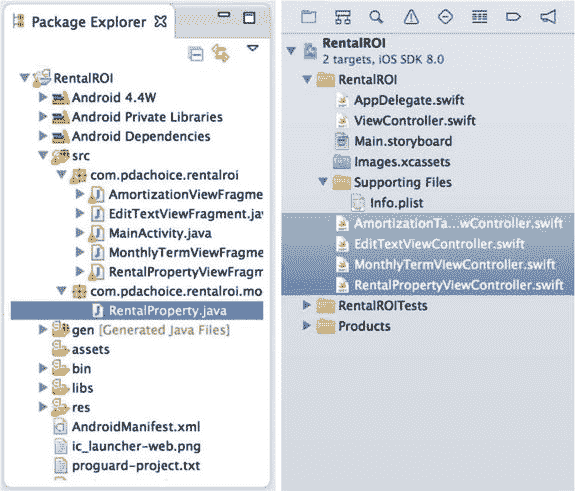

图 5-9. Android 和 iOS `RentalROI` 项目结构

iOS 的 `ViewController` 类已经就位，并与 Android 对应的 `Fragments` 一一映射。有一个模型类 `RentalProperty` 尚未添加到 iOS 项目中。让我们先为 `RentalProperty` 模型类创建一个 Swift 类骨架（请参阅代码清单 5-5）。

***代码清单 5-5***. `RentalProperty.swift` 骨架

```swift
import Foundation

public class RentalProperty {

}
```

### 应用程序资源

与 Android 应用一样，大多数 iOS 应用需要图像或数字资产来装饰整个应用。此外，您肯定希望将外部化的文本移植到 iOS。请执行以下操作，将应用程序资源（请参阅第 4 章，“应用程序资源”）从 Android 对应版本移植到 iOS：

1. 将 Android 的 `strings.xml` 转换为 iOS：
   1. 在 Xcode 中，选择 `Supporting Files` 文件夹，在其中创建一个新文件 (+N)，然后按照屏幕提示选择 **iOS


image 资源  字符串文件**。命名为：`Localizable.strings`。

2. 将 Android `res/values/strings.xml` 中的内容复制到 iOS 的 `Localizable.strings` 文件中。如代码清单 5-6 所示，翻译过程非常直接。

***代码清单 5-6***. 外部化文本翻译

```
"app_name" = "RentalROI";
"label_schedule" = "Schedule";
"label_property" = "Property";
"label_Amortization" = "Amortization";
"label_monthlydetails" = "Monthly Details";
"button_next" = "Next";

/* RentalPropertyView */
"mortgage" = "MORTGAGE";
"operations" = "OPERATIONS";
"purchasePrice" = "Purchase Price";
"downPayment" = "Down Payment %";
"loanAmount" = "Loan Amount";
"interestRate" = "Interest Rate %";
"mortgageTerm" = "Mortgage Term (Yr.)";
"escrowAmount" = "Escrow Amount";
"extraPayment" = "Extra Payment";
"expenses" = "Expenses";
"rent" = "Rent";

/* EditTextView */
"save" = "Save";
"editTextSize" = "15";

/* Monthly Details */
"MortgagePayment" = "MORTGAGE PAYMENT";
"no" = "No.";
"Principal" = "Principal";
"interest" = "Interest";
"escrow" = "Escrow";
"addlPayment" = "Add'l Payment";
"mortgageBalance" = "Mortgage Balance";
"equity" = "Equity";
"cashInvest" = "Cash Investment";
"roi" = "ROI";
```

2. 通常情况下，你需要重用或重新创建 Android 项目中的数字资产。在这个应用中，只有一个数字资产：应用图标 `ic_launcher.png`。

1. 从 Android 项目 `res/xxhdpi/ic_launcher.png` 文件创建 `ic_launcher120.png`、`ic_launcher180.png`、`ic_launcher76.png` 和 `ic_launcher152.png`。
2. 在 Xcode 素材目录中选择 `Images.xcassets` 和 `AppIcon`，然后将刚创建的四个文件拖入，如图 5-10 所示：`ic_launcher120.png` 用于 iPhone 2x，`ic_launcher180.png` 用于 iPhone 3x，`ic_launcher76.png` 用于 iPad 1x，`ic_launcher152.png` 用于 iPad 2x。图像分辨率必须完全匹配，否则 Xcode 会发出警告。

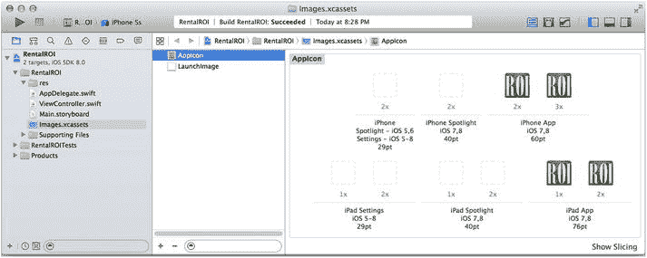

图 5-10. Xcode 项目 `AppIcon`

如果 Android 应用包含用于国际化的资源，你同样需要将它们移植到 iOS 应用中。

### Java 类到 Swift 类

现在，你的 Xcode iOS 项目中已拥有所有匹配的类。下一步是将每个类进一步分解，将 Android 方法移植到 iOS 方法。再次强调，我对每个类采用自上而下的方法：先移植成员签名，并尽量将内部实现推迟到后面。为了方便起见，你可以参考表 5-1 作为逐步指南。经过一两次练习后，你会发现表中的信息已成为常识，但我认为它能使翻译工作更具系统性。

表 5-1. 类移植步骤

| 步骤 | 说明 |
| --- | --- |
| 1. | 对于每个类，将 Java 对应的内容复制到 Swift 中。 |
| 2. | 将 Java 字段转换为 Swift 存储属性。对于 Java 静态常量，转换为 Swift 内部 `struct static` 变量。 |
| 3. | 将方法声明转换为 Swift。尽可能保留签名，生命周期方法除外。a. 将 Java 实现保留为 Swift 注释。它们是经过验证的完美逻辑。b. 将 Android 生命周期方法签名转换为 iOS 对应的签名，包括构造函数。c. 保留工具方法的签名。 |

步骤 1 和步骤 2 比较简单。步骤 3 是关键，用于将类分解为更小的单元：方法。当你按照表 5-1 完成所有类的处理后，所有类都应包含可调用的方法骨架。

接下来，你可以逐一将注释掉的 Java 代码翻译为 Swift（参见本章后续的“Java 方法到 Swift 方法”）。

为了方便起见，表 5-2 总结了你在此步骤中一定会遇到的成员声明映射关系。

表 5-2. Java 和 Swift 中的成员声明

| 语言 | Java | Swift |
| --- | --- | --- |
| **变量** | `String aName` | `var aName: String` |
| **类变量** | `static ...` | 内部 struct 中的 static var |
| **方法声明** | `String aMethod(int a)` | `func aMethod(a: Int) -> String` |
| **类方法** | `static ...` | `class func ...` |
| **构造函数** | `ClassName(...)` | `init(...)` |
| **Android Context** | `Activity, Context` | 删除它们。 |

#### 模型类：RentalProperty

大量翻译工作涉及将常规的 Java 到 Swift 语言编程规则（参见表 2-1）进行转换。你的直接目标是将对应的 Java 类 `RentalProperty` 的成员移植到 Swift，且不重命名它们。对于方法，通过注释掉所有实现代码，专注于签名。按照表 5-1 中的类移植步骤，将 `RentalProperty.java` 移植到 Swift：

1. 首先，将整个 `RentalProperty.java` 类复制到 `RentalProperty.swift` 文件中。你会得到大量错误。这些编译错误就是免费的指导。
2. 接下来，定义类。一般经验法则：保留所有签名，包括类名。调用者和被调用者将在后续步骤中无缝连接。删除或注释掉纯 Java 的内容，例如 `implements Serializable`（见代码清单 5-7）。

***代码清单 5-7***. `RentalProperty.swift` 类声明

```
public class RentalProperty /* implements Serializable */ {
// private static final long serialVersionUID = 1L;
  ...
}
```

3. 将 Java 字段转换为 Swift：

**提示** Java: `String mProperty;` => Swift: `var mProperty: String` 或 `var mProperty = ""  // 尽可能使用类型推断`

1. Java 字段转换为 Swift 存储属性（见代码清单 5-8）。
2. Java `static` 变量转换为 Swift 内部 `struct static` 变量。

***代码清单 5-8***. `RentalProperty.swift` 存储属性

```
public class RentalProperty /* implements Serializable */ {
  ...
  // private double purchasePrice;
  // private double loanAmt;
  // private double interestRate;
  // private int numOfTerms;
  // private double escrow;
  // private double extra;
  // private double expenses;
  // private double rent;
  var purchasePrice = 0.0;
  var loanAmt = 0.0;
  var interestRate = 5.0;
  var numOfTerms = 30;
  var escrow = 0.0;
  var extra = 0.0;
  var expenses = 0.0;
  var rent = 0.0;

  // public static final String KEY_AMO_SAVED = "KEY_AMO_SAVED";
  // public static final String KEY_PROPERTY = "KEY_PROPERTY";
  // private static final String PREFS_NAME = "MyPrefs";
  // private static final int MODE = Context.MODE_PRIVATE;
  // MODE_WORLD_WRITEABLE
  // private static RentalProperty _sharedInstance = null;
  struct MyStatic {
    static let KEY_AMO_SAVED = "KEY_AMO_SAVED";
    static let KEY_PROPERTY = "KEY_PROPERTY";
    private static let PREFS_NAME = "MyPrefs";
    private static let MODE = 0; // 可能是 Android 相关内容
    private static var _sharedInstance = RentalProperty()
  }
  ...
}
```

4. 将方法声明转换为 Swift，如代码清单 5-9 所示。


尽可能保留签名，生命周期方法除外。

**提示** Java：`String doWork(int param);` => Swift：`func doWork(Int: Type) -> String`

1. 将 Java 实现保留为 Swift 注释。它们是非常完善/经过测试的逻辑。
2. 将 Android 生命周期方法签名（包括构造函数）转换为 iOS 对应项。
3. 保留工具方法的签名。
4. 可以安全地删除 Android 的 `Context`（或任何纯 Android 或 Java 特有的内容）。

**注意** 按照惯例，你不需要移植 Java 的字段访问器。我现在选择移植它们，只是因为它们被 Java 调用者大量使用。在应用正常运行后，我通常会移除/重构这些 Java 风格的访问器。

***代码清单 5-9***。移植 `RentalProperty` 方法

```
class RentalProperty {
  ... // private RentalProperty() {
  private init() {
    // 已注释的 Java 代码省略
  }
  // public static RentalProperty sharedInstance() {
  class func sharedInstance() -> RentalProperty {
    // 已注释的 Java 代码省略
    return RentalProperty()
  }
  // public String getAmortizationPersistentKey() {
  func getAmortizationPersistentKey() -> String {
    // 已注释的 Java 代码省略
    return ""
  }
  // public JSONArray getSavedAmortization(Context activity) {
  func getSavedAmortization() -> NSArray? {
    // 已注释的 Java 代码省略
    return nil
  }
  // public boolean saveAmortization(String data, Context activity){
  func saveAmortization(data: NSArray) -> Bool {
    // 已注释的 Java 代码省略
    return false
  }
  // public boolean load(Context activity) {
  func load() -> Bool {
    // 已注释的 Java 代码省略
    return true
  }
  // public boolean save(Context activity) {
  func save() -> Bool {
    // 已注释的 Java 代码省略
    return true
  }
  /////////// SharedPreferences 用法 /////////////////
  // public boolean saveSharedPref(String key, String data, Context activity) {
  func saveSharedPref(key:String,data:AnyObject)->Bool{
    // 已注释的 Java 代码省略
    return true
  }
  // public String retrieveSharedPref(String key, Context activity) {
  func retrieveSharedPref(key: String) -> AnyObject? {
    // 已注释的 Java 代码省略
    return nil
  }
  // public void deleteSharedPref(String key, Context activity) {
  func deleteSharedPref(key: String) {
    // 已注释的 Java 代码省略
  }
  // Java Bean 访问器
  func getPurchasePrice()-> Double {
    return self.purchasePrice;
  }
  func setPurchasePrice(purchasePrice: Double) {
    self.purchasePrice = purchasePrice;
  }
  func getLoanAmt()-> Double {
    return self.loanAmt;
  }
  func setLoanAmt(loanAmt: Double) {
    self.loanAmt = loanAmt;
  }
  func getInterestRate()-> Double {
    return self.interestRate;
  }
  func setInterestRate(interestRate: Double) {
    self.interestRate = interestRate;
  }
  func getNumOfTerms()-> Int {
    return self.numOfTerms;
  }
  func setNumOfTerms(numOfTerms: Int) {
    self.numOfTerms = numOfTerms;
  }
  func getEscrow()-> Double {
    return self.escrow;
  }
  func setEscrow(escrow: Double) {
    self.escrow = escrow;
  }
  func getExtra()-> Double {
    return self.extra;
  }
  func setExtra(extra: Double) {
    self.extra = extra;
  }
  func getExpenses()-> Double {
    return self.expenses;
  }
  func setExpenses(expenses: Double) {
    self.expenses = expenses;
  }
  func getRent()-> Double {
    return self.rent;
  }
  func setRent(rent: Double) {
    self.rent = rent;
  }
  ...
```

你已经实现了直接目标。

**注意** 你确实找不到比这些更好的方法注释了，因为它们实际上是经过验证可以正常运行的代码。

#### EditTextViewController

**ANDROID 类比** iOS 中的对应类是 `EditTextViewFragment`。

让我们从第一个视图控制器 `EditTextViewController` 开始。

**注意** 如果 `RentalPropertyController` 不需要 `EditTextViewController` 的话，我本会优先选择前者。

依赖关系可以很容易地从对应的 Java 包的 import 语句中看出。你可以选择任意一个作为起点，并容忍那些临时的编译错误。

你的直接目标是将 Android 的 `EditTextViewFragment` Java 类定义和成员签名转换为 iOS 的 Swift 类。同样，将整个 `EditTextViewFragment.java` 类复制到现有的 `EditTextViewController.swift` 类中作为起点：

1. 从类级别的定义开始。有一个内部接口，但 Swift 没有内部协议。你可以安全地在同一个文件中，类定义之外创建该协议，如代码清单 5-10 所示。

***代码清单 5-10***。Java 接口到 Swift 协议

```
// Java 接口到 Swift 协议
protocol EditTextViewControllerDelegate {
  func onTextEditSaved(tag: Int, text: String);
  func onTextEditCanceled();
}

class EditTextViewController : UIViewController, UITextFieldDelegate {
  ...
  //// 内部接口
  //  interface EditTextViewControllerDelegate {
  //    public void onTextEditSaved(int tag, String text);
  //    public void onTextEditCanceled();
  //  }
  ...
```

2. 将 Java 字段转换为 Swift（参见代码清单 5-11）：
   1. Java 字段转换为 Swift 存储属性。
   2. 很可能与 UI 控件相关的 Java 字段是现有的 `IBOutlet` 属性。

***代码清单 5-11***。Java 字段到 Swift 存储属性

```
class EditTextViewController : ... {
  ...
  // private int editTextTag;
  // private String header;
  // private String text;
  // private EditTextViewControllerDelegate delegate;
  // private View contentView; => 已在 super.view 中
  // private EditText mEditText; => 现有的 IBOutlet
  var editTextTag = 0
  var header = ""
  var text = ""
  var delegate: EditTextViewControllerDelegate!
  ...
```

3. 将方法声明转换为 Swift（参见代码清单 5-12）。保留签名，生命周期方法除外。
   1. 将 Java 实现保留为 Swift 注释。它们是非常完善/经过测试的逻辑。
   2. 将 Android `Fragment` 生命周期方法签名转换为 iOS 对应的 `View` 生命周期方法。
   3. 保留工具方法的签名。
   4. 可以安全地删除 Android 的 `Context`（或任何纯 Android 或 Java 特有的内容）。
   5. Swift 中不需要那些常规的 Java Bean 访问器。

***代码清单 5-12***。`EditTextViewController` 生命周期回调

```
class EditTextViewController : ... {
  ...
  // @Override public View onCreateView(...) {
  override func viewDidLoad() {
    // 已注释的 Java 代码省略
  }
  // @Override public void onResume() {
  override func viewDidAppear(animated: Bool) {
    // 已注释的 Java 代码省略
  }
  // @Override public void onPause() {
  override func viewWillDisappear(animated: Bool) {
    // 已注释的 Java 代码省略
  }
  // @Override public void onCreateOptionsMenu(...) {
  // navigationBar 已在 storyboard 中绘制
  // @Override public boolean onOptionsItemSelected(...) {
  // IBActions: doSave 和 doCancel
  // private void showKeyboard() {
  func showKeyboard(){
    // 已注释的 Java 代码省略
  }
  // private void hideKeyboard() {
  func hideKeyboard() {
    // 已注释的 Java 代码省略
  }
  // public accessors, not needed in Swift
  ...
```

#### RentalPropertyViewController

**IOS 类比** ADT 中的对应类是 `RentalPropertyViewFragment`。

继续下一个视图控制器：`RentalPropertyViewController`。将 `RentalPropertyViewFragment` Java 类复制到现有的 `RentalPropertyViewController.swift` 类中。


按照表 5-1 中的移植步骤操作，并执行以下操作：

1. 从类级别定义开始。`ListFragment` 自然对应 iOS 的 `UITableViewController`（见代码清单 5-13）。

    ***代码清单 5-13***。Java 接口到 Swift 协议

    ```
    // public class RentalPropertyViewFragment extends ListFragment
    // implements EditTextViewControllerDelegate
    class RentalPropertyViewController: UITableViewController, EditTextViewControllerDelegate {
      ...
    ```

2. 将 Java 字段转换为 Swift（见代码清单 5-14）：
   1. Java 字段转换为 Swift 存储属性。
   2. 大多数情况下，UI 控件相关的 Java 字段已经是现有的 `IBOutlet` 属性。
   3. Swift 尚不支持类类型变量。为那些 Java `final` 常量创建一个内部 `struct`。

    ***代码清单 5-14***。Java 字段到 Swift 存储属性

    ```
    class RentalPropertyViewController: ... {
      ...
      ///// 来自 Java 对应代码
      //private static let URL_service_tmpl = "http://www.pdachoice.com/ras/service/amortization?loan=%.2f&rate=%.3f&terms=%d&extra=%.2f&escrow=%.2f"
      // private static final String KEY_DATA = "data";
      // private static final String KEY_RC = "rc";
      // private static final String KEY_ERROR = "error";
      struct MyStatic {
        private static let URL_service_tmpl = "http://www.pdachoice.com/ras/service/amortization?loan=%.2f&rate=%.3f&terms=%d&extra=%.2f&escrow=%.2f"
        private static let KEY_DATA = "data"
        private static let KEY_RC = "rc"
        private static let KEY_ERROR = "error"
      }

      // private RentalProperty _property;
      // private JSONArray _savedAmortization;
      // private BaseAdapter mAdapter; // 纯 Android 代码
      var _property = RentalProperty.sharedInstance()
      var _savedAmortization: NSArray?
      ...
    ```

3. 将方法声明转换为 Swift，如代码清单 5-15 所示：
   1. 将 Java 实现保留为 Swift 注释。它们是经过验证的完美逻辑。
   2. 将 Android `Fragment` 生命周期方法签名转换为 iOS 对应的 `View` 生命周期方法。
   3. 保留实用方法签名。
   4. 将 Android `BaseAdapter` 转换为 iOS `DataSource` 实现。

    ***代码清单 5-15***。`EditTextViewController` 生命周期回调

    ```
    class RentalPropertyViewController: ... {
      ...
      ///// 来自 Java 对应代码
      // @Override public void onCreate(Bundle savedInstanceState) {
      override func viewDidLoad() {
        // 已注释的 Java 代码略
      }

      // @Override public void onResume() {
      override func viewDidAppear(animated: Bool) {
        // 已注释的 Java 代码略
      }

      //  @Override public void onCreateOptionsMenu(...) {
      // UINavigationBar 已在 storyboard 中绘制

      //  @Override public boolean onOptionsItemSelected(...) {
      @IBAction func doSchedule(sender: AnyObject) {
        // 已注释的 Java 代码略
        self.performSegueWithIdentifier("AmortizationTable", sender: sender)
      }

      //// 列表项选中时的回调方法。
      // @Override public void onListItemClick(...) {
      override func tableView(tableView: UITableView, didSelectRowAtIndexPath indexPath: NSIndexPath) {
        // 已注释的 Java 代码略
      }

      //private BaseAdapter createListAdapter() {
      // 已注释的 Java 代码略  }
      override func tableView(tableView: UITableView, numberOfRowsInSection section: Int) -> Int {
        // TODO: Android Adapter 到 iOS DataSource 的实现稍后进行
        return 0
      }

      override func numberOfSectionsInTableView(tableView: UITableView) -> Int {
        // TODO: Android Adapter 到 iOS DataSource 的实现稍后进行
        return 0
      }

      override func tableView(tableView: UITableView, cellForRowAtIndexPath indexPath: NSIndexPath) -> UITableViewCell {
        // TODO: Android Adapter 到 iOS DataSource 的实现稍后进行
        return UITableViewCell()
      }

      //// 代理接口
      // public void onTextEditSaved(int tag, String text) {
      func onTextEditSaved(tag: Int, text: String) {
        // 已注释的 Java 代码略
      }

      // public void onTextEditCanceled() {
      func onTextEditCanceled() {
        // 已注释的 Java 代码略
      }

      // public void doAmortization(Object sender) {
      func doAmortization() {
        // 已注释的 Java 代码略
      }

      //// 从 url 获取数据
      // private JSONObject httpGet(String myurl) {
      private func httpGet(myurl: String) -> NSDictionary? {
        // 已注释的 Java 代码略
        return [:]
      }

      // private String readStream(InputStream stream) {
      func readStream(stream: NSInputStream) -> String {
        // 已注释的 Java 代码略
        return ""
      }
      ...
    ```

**注意** 核心思想相同：从 Android 对应代码迁移代码；转换将以自顶向下的方式进行。换句话说，先创建 Swift 类，然后创建 Swift 方法存根，并附上经过测试的 Android 代码中的精确注释。

#### AmortizationViewController

**iOS 类比** ADT 对应代码是 `AmortizationViewFragment`。

继续处理下一个视图控制器：`AmortizationViewController`。按照表 5-1 中的移植步骤操作；代码清单 5-16 显示了中间结果。

***代码清单 5-16***。`AmortizationViewController` 属性和方法签名

```
class AmortizationViewController : UITableViewController {

  ///// 来自 Java 对应代码
  // private JSONArray monthlyTerms;
  // private BaseAdapter mAdapter;
  var monthlyTerms = NSArray()

  // @Override public void onCreate(Bundle savedInstanceState) {
  override func viewDidLoad() {
    // 已注释的 Java 代码略
  }

  override func tableView(tableView: UITableView, numberOfRowsInSection section: Int) -> Int {
    // TODO: Android Adapter 到 iOS DataSource 的实现稍后进行
    return 0
  }

  override func tableView(tableView: UITableView, cellForRowAtIndexPath indexPath: NSIndexPath) -> UITableViewCell {
    // TODO Android Adapter 到 iOS DataSource 的实现稍后进行
    return UITableViewCell()
  }

  // @Override public void onResume() {
  override func viewDidAppear(animated: Bool) {
    // 已注释的 Java 代码略
  }

  // public void onListItemClick(...) {
  override func tableView(tableView: UITableView, didSelectRowAtIndexPath indexPath: NSIndexPath) {
    // 已注释的 Java 代码略
  }
}
```

#### MonthlyTermViewFragment

**iOS 类比** ADT 对应代码是 `MonthlyTermViewFragment`。

`MonthlyTermViewController` 是最后一个视图控制器。按照表 5-1 中的移植步骤操作；代码清单 5-17 显示了中间结果。

***代码清单 5-17***。`MonthlyTermViewController` 属性和方法签名

```
class MonthlyTermViewController : UITableViewController {

  @IBOutlet weak var mPaymentNo: UILabel!
  @IBOutlet weak var mTotalPmt: UILabel!
  @IBOutlet weak var mPrincipal: UILabel!
  @IBOutlet weak var mInterest: UILabel!
  @IBOutlet weak var mEscrow: UILabel!
  @IBOutlet weak var mAddlPmt: UILabel!
```


