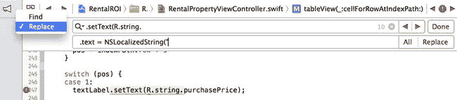
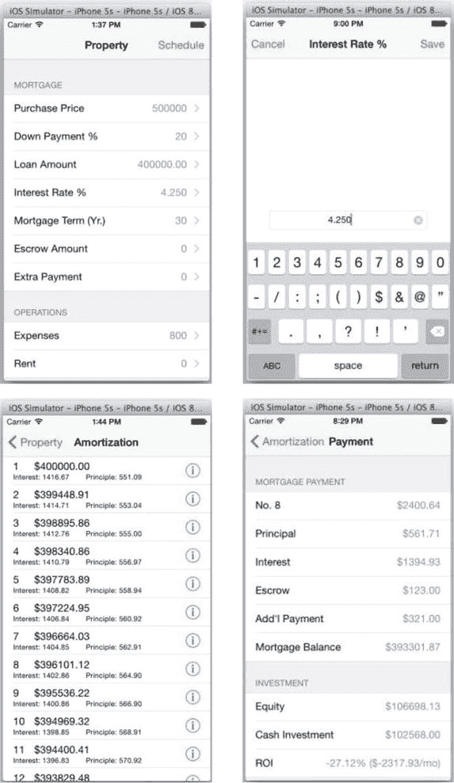

# 排版后的文档

`@IBOutlet weak var mBalance: UILabel!`
`@IBOutlet weak var mEquity: UILabel!`
`@IBOutlet weak var mCashInvested: UILabel!`
`@IBOutlet weak var mRoi: UILabel!`

```
///// 来自 Java 的对应部分 //
private JSONObject monthlyTerm;
```

`var monthlyTerm = NSDictionary()`

```
//// 上述为 IBOutlets，以及 super.view //
private TextView mPaymentNo;
private TextView mTotalPmt;
private TextView mPrincipal;
private TextView mInterest;
private TextView mEscrow;
private TextView mAddlPmt;
private TextView mBalance;
private TextView mEquity;
private TextView mCashInvested;
private TextView mRoi;
private View contentView;
```

```
// @Override
public View onCreateView(...) {
    override func viewDidLoad() {
        // 注释掉的 Java 代码已省略
    }
}

// @Override
public void onResume() {
    override func viewDidAppear(animated: Bool) {
        // 注释掉的 Java 代码已省略
    }
}

// JavaBean 访问器 => 使用 Swift 属性时不需要
}
```

与使用动态单元格的 `UITableViewController` 不同，你无需提供数据源。这是最后一个类。你应该让所有类都包含可以从其他类调用的属性和方法。换句话说，编程接口已经就位。

### Java 方法转换为 Swift 方法

你已经将每个类进一步分解为多个部分——即方法。完成 iOS 项目的最后一步是通过翻译注释掉的 Java 代码来完整实现每个方法。Swift 中调用方法的语法与 Java 相同。除了使用 Android 特定 API 的代码外，大多数 Java 代码都应该能在 Swift 中运行！对于使用 Android 特定 API 的代码，请参考第 4 章来指导你的翻译工作。

编程语言自然包含规则。为方便起见，表 5-3 列出了两种语言中一些常见的类型或语法。

表 5-3. 可替换的 Java 到 Swift 语法或符号

| 项目 | Java | Swift |
| --- | --- | --- |
| 自身引用 | `this.aMember` | `self.aMember` |
| 变量 | `String aName` | `var aName: String` |
| 布尔值 | `boolean` | `Bool` |
| 整数 | `Integer` 或 `int` | `Int`, `UInt` |
| 空值 | `null` | `nil` |
| 数组 | `ArrayList` 或 `JSONArray`（如需字符串序列化） | `Array` 或 `NSArray` |
| 哈希表 | `HashMap` 或 `JSONObject`（如需字符串序列化） | `Dictionary` 或 `NSDictionary` |

请注意，你可以随时在 Xcode 编辑器中使用**查找和替换**（F），或使用**查找导航器**来替换整个项目中可重复的模式。图 5-11 展示了一个示例。



图 5-11. Xcode 编辑器中的查找和替换

#### EditTextViewController

现在进入第一个视图控制器 `EditTextViewController`。在 ADT 项目中，对应的 Android `Fragment` 只有一个 `EditText`，用于显示来自调用方 `Fragment` 的待编辑文本。它还在标题中显示文本的名称。当用户保存或取消编辑操作时，修改后的文本会返回给调用方 `Fragment`。请执行以下操作将相同的功能移植到 iOS：

1. 将 Android 的生命周期方法转换为 iOS 对应的 `IBAction` 方法以及其他匹配方法（见代码清单 5-18）。Android **选项菜单**中的操作项被转换为导航栏上的 iOS `barButtonItems`。将**保存**和**取消**按钮连接到你的 `IBAction` 方法；例如 `doSave()` 和 `doCancel()`。

   ***代码清单 5-18***. `EditTextViewController` 生命周期回调

   ```
   class EditTextViewController : UIViewController, UITextFieldDelegate {
       ...

       override func viewDidLoad() {
           //  contentView = inflater.inflate(...);
           //  setHasOptionsMenu(true); // 启用选项菜单。
           //  mEditText = (EditText) contentView.findViewById(...);
           //  this.mEditText.setText(this.text);
           //  getActivity().setTitle(header);
           //  return contentView;
           super.viewDidLoad()
           mEditText.text = self.text
           self.navigationItem.title = self.header
       }

       override func viewDidAppear(animated: Bool) {
           //  super.onResume();
           //  ((MainActivity) getActivity()).slideIn(...);
           //  showKeyboard();
           super.viewDidAppear(animated)
           showKeyboard()
       }

       override func viewWillDisappear(animated: Bool) {
           //  super.onPause();
           //  hideKeyboard();
           super.viewWillDisappear(animated)
           hideKeyboard()
       }

       override func viewDidDisappear(animated: Bool) {
           //  super.onPause();
           //  hideKeyboard();
           super.viewDidDisappear(animated)
       }

       //  @Override
       //  public boolean onOptionsItemSelected(...) {
       //  String returnText = this.mEditText.getText().toString();
       //  if(delegate != null) {
       //  this.delegate.onTextEditSaved(this.getEditTextTag(),returnText);
       //  }
       //  return true;
       //  }
       @IBAction func doSave(sender: AnyObject) {
           var returnText = self.mEditText.text
           if(delegate != nil) {
               delegate.onTextEditSaved(self.editTextTag, text: returnText)
           }
       }

       @IBAction func doCancel(sender: AnyObject) {
           if(delegate != nil) {
               delegate.onTextEditCanceled()
           }
       }

       private func showKeyboard() {
           //  InputMethodManager imm = (InputMethodManager) ... ;
           //  imm.showSoftInput(...);
           //  mEditText.selectAll();
           self.mEditText.becomeFirstResponder()
       }

       private func hideKeyboard() {
           //  InputMethodManager imm = (InputMethodManager) ... ;
           //  imm.hideSoftInputFromWindow(...);
           self.mEditText.endEditing(true)
       }
       ...
   ```

2. 软键盘的行为并不相同。键盘的实现高度依赖于平台。与 Android 在键盘出现时自动上移视图不同，你需要编写代码来模拟相同的行为，如代码清单 5-19 所示。

   ***代码清单 5-19***. 键盘实现

   ```
   class EditTextViewController : ... {
       ...
       override func viewDidLoad() {
           ...
           if UIDevice.currentDevice().userInterfaceIdiom == .Phone {
               NSNotificationCenter.defaultCenter().addObserver(self,
                   selector: "keyboardAppeared:", name: UIKeyboardDidShowNotification, object: nil)
           }
       }

       override func viewDidDisappear(animated: Bool) {
           ...
           NSNotificationCenter.defaultCenter().removeObserver(self)
       }

       func keyboardAppeared(notification: NSNotification) {
           var keyboardInfo = notification.userInfo as NSDictionary!
           var kbFrame = keyboardInfo.valueForKey(UIKeyboardFrameBeginUserInfoKey) as NSValue
           var kbFrameRect: CGRect = kbFrame.CGRectValue()
           var keyboardH = min(kbFrameRect.size.width, kbFrameRect.size.height)
           var screenRect: CGRect = UIScreen.mainScreen().bounds;

           var tfRect: CGRect = self.mEditText.frame
           var y = screenRect.size.height - keyboardH - mEditText.frame.size.height - 20
           var x = (screenRect.size.width - tfRect.size.width) / 2

           UIView.animateWithDuration(0.1, animations: { () -> Void in
               var newRect = CGRectMake(x, y, tfRect.size.width, tfRect.size.height);
               self.mEditText.frame = newRect
           })
       }
       ...
   ```

#### RentalPropertyViewController

应用启动时，这是第一个内容视图。此视图控制器的目的是收集用户输入。请执行以下操作将实现从 Android 移植到 iOS：

1. 翻译生命周期方法，如代码清单 5-20 所示。


1. 与 Android 中相同，始终调用 `super.viewXXX`。
2. 移除 Android Options Menu 代码。你已经在 storyboard 中有了一个 iOS 绘制的 `NavigationController/NavigationBar`（参见第 3 章）。

***代码清单 5-20***。生命周期方法实现

```
class RentalPropertyViewController : UITableViewController {
  ...
  override func viewDidLoad() {
    super.viewDidLoad() // super.onCreate(savedInstanceState);
    _property = RentalProperty.sharedInstance();
    _property.load(/*getActivity()*/);
    //    setHasOptionsMenu(true); // 启用 Option Menu。
    //    mAdapter = createListAdapter();
    //    this.setListAdapter(mAdapter);
  }

  override func viewDidAppear(animated: Bool) {
    super.viewDidAppear(animated) // super.onResume();
    // getActivity().setTitle(getText(R.string.label_property));
    self.navigationItem.title = "Property"
  }

  @IBAction func doSchedule(sender: AnyObject) {
    //    doAmortization();
    doAmortization()
  }
  ...
}
```

2. 将 `ListFragment` 的 Android Adapter 转换为 iOS `UITableViewDataSource`，如代码清单 5-21 所示。仅为了演示如何更有效地复用 Android BaseAdapter 代码，我选择将 iOS 单元格分区-行 `indexPath` 扁平化为 Android 列表视图项位置。例如，第二个分区第一行的 `UITableViewCell` 对应 Android 列表中位置为 9 的项。

***代码清单 5-21***。实现 `TableView` 数据源

```
class RentalPropertyViewController : UITableViewController {
...
// private BaseAdapter createListAdapter() {
//  return new BaseAdapter() {
//    //    @Override
//    //    public int getItemViewType(int pos) {
//    //      if (pos == 0 || pos == 8) {
//    //        return 0;
//    //      } else {
//    //        return 1;
//    //      }
//    //    }
//    //
//    //    @Override
//    //    public int getViewTypeCount() {
//    //      return 2;
//    //    }
//    //
//    //    @Override
//    //    public View getView(int pos, ...) {
//    //      if (view == null) {
//    //        LayoutInflater inflater = getActivity().getLayoutInflater();
//    //        if (pos == 0 || pos == 8) {
//    //          // 表头列表项
//    //          view = inflater.inflate(android.R.layout.simple_list_item_1, null);
//    //        } else {
//    //          // 右侧详情列表项
//    //          view = inflater.inflate(R.layout.rightdetail_listitem, null);
//    //        }
//    //      }
//    //      if (pos == 0 || pos == 8) {
//    //        // 表头列表项
//    //        view.setBackgroundColor(Color.argb(32, 0, 128, 128));
//    //        TextView text1 = (TextView) view.findViewById(android.R.id.text1);
//    //
//    //        if (pos == 0) {
//    //          text1.setText(getResources().getString(R.string.mortgage));
//    //        } else {
//    //          text1.setText(getResources().getString(R.string.operations));
//    //        }
//    //      } else {
//    //        // 右侧详情列表项
//    //        view.setBackgroundColor(Color.argb(0, 0, 0, 0));
//    //        TextView textLabel = (TextView) view.findViewById (R.id.textLabel);
//    //        TextView detailTextLabel = (TextView) view.findViewById(R.id.detailTextLabel);
//    //
//    //        switch (pos) {
//    //        case 1:
//    //          textLabel.setText(R.string.purchasePrice);
//    //          detailTextLabel.setText(String.format("%.0f", _property.getPurchasePrice()));
//    //          break;
//    //        case 2:
//    //          textLabel.setText(R.string.downPayment);
//    //          if (_property.getPurchasePrice() > 0) {
//    //          double down = (1 - _property.getLoanAmt() / _property.getPurchasePrice()) * 100.0f;
//    //            detailTextLabel.setText(String.format("%.0f", down));
//    //            if (_property.getLoanAmt() == 0 && down > 0) {
//    //              _property.setLoanAmt(_property.getPurchasePrice() * (1 - down / 100.0f));
//    //            }
//    //          } else {
//    //            detailTextLabel.setText("0");
//    //          }
//    //          break;
//    //        case 3:
//    //          textLabel.setText(R.string.loanAmount);
//    //          detailTextLabel.setText(String.format("%.2f", _property.getLoanAmt()));
//    //          break;
//    //        case 4:
//    //          textLabel.setText(R.string.interestRate);
//    //          detailTextLabel.setText(String.format("%.3f", _property.getInterestRate()));
//    //          break;
//    //        case 5:
//    //          textLabel.setText(R.string.mortgageTerm);
//    //          detailTextLabel.setText(String.format("%d", _property.getNumOfTerms()));
//    //          break;
//    //        case 6:
//    //          textLabel.setText(R.string.escrowAmount);
//    //          detailTextLabel.setText(String.format("%.0f", _property.getEscrow()));
//    //          break;
//    //        case 7:
//    //          textLabel.setText(R.string.extraPayment);
//    //          detailTextLabel.setText(String.format("%.0f", _property.getExtra()));
//    //          break;
//    //        case 9:
//    //          textLabel.setText(R.string.expenses);
//    //          detailTextLabel.setText(String.format("%.0f", _property.getExpenses()));
//    //          break;
//    //        case 10:
//    //          textLabel.setText(R.string.rent);
//    //          detailTextLabel.setText(String.format("%.0f", _property.getRent()));
//    //          break;
//    //        default:
//    //          break;
//    //        }
//    //      }
//    //      return view;
//    //    }
//    //    @Override
//    //    public int getCount() {
//    //      return 11; // 2 个分区 + 9 个字段
//    //    }
//    //    @Override
//    //    public long getItemId(int pos) {
//    //      return pos; // 未使用
//    //    }
//    //    @Override
//    //    public Object getItem(int pos) {
//    //      TextView textLabel = (TextView) getView(pos, null, null).findViewById(R.id.textLabel);
//    //      if (textLabel == null) {
//    //        return null;
//    //      } else {
//    //        TextView detailTextLabel = (TextView) getView(pos, null, null).findViewById(R.id.detailTextLabel);
//    //        NameValuePair nvp = new BasicNameValuePair(textLabel.getText().toString(), detailTextLabel.getText().toString());
//    //        return nvp;
//    //      }
//    //    }
//    //  };
//    //}
    // android adapter 转 iOS datasource
    override func numberOfSectionsInTableView(tableView: UITableView) -> Int {
      return 2
    }

    override func tableView(tableView: UITableView, titleForHeaderInSection section: Int) -> String? {
      if section == 0 {
        return NSLocalizedString("mortgage", comment: "")
      } else {
        return NSLocalizedString("operations", comment: "")
      }
    }

    override func tableView(tableView: UITableView, numberOfRowsInSection section: Int) -> Int {
      if section == 0 {
        return 7
      } else {
        return 2
      }
    }

    override func tableView(tableView: UITableView, cellForRowAtIndexPath indexPath: NSIndexPath) -> UITableViewCell {
      var cell = tableView.dequeueReusableCellWithIdentifier("aCell", forIndexPath: indexPath) as UITableViewCell
      var textLabel = cell.textLabel!
      var detailTextLabel = cell.detailTextLabel!

      var pos = indexPath.row
      var section = indexPath.
```


```swift
if section == 0 {
    pos = indexPath.row + 1
} else { // 1
    pos = indexPath.row + 9
}

switch (pos) {
case 1:
    textLabel.text = NSLocalizedString("purchasePrice", comment: "")
    detailTextLabel.text = NSString(format: "%.0f", _property.getPurchasePrice())
case 2:
    textLabel.text = NSLocalizedString("downPayment", comment: "")
    if (_property.getPurchasePrice() > 0) {
        var down = (1 - _property.getLoanAmt() / _property.getPurchasePrice()) * 100.0
        detailTextLabel.text = NSString(format: "%.0f", down)
        if (_property.getLoanAmt() == 0 && down > 0) {
            _property.setLoanAmt(_property.getPurchasePrice() * (1 - down / 100.0))
        }
    } else {
        detailTextLabel.text = "0"
    }
case 3:
    textLabel.text = NSLocalizedString("loanAmount", comment: "")
    detailTextLabel.text = NSString(format: "%.2f", _property.getLoanAmt())
case 4:
    textLabel.text = NSLocalizedString("interestRate", comment: "")
    detailTextLabel.text = NSString(format: "%.3f", _property.getInterestRate())
case 5:
    textLabel.text = NSLocalizedString("mortgageTerm", comment: "")
    detailTextLabel.text = NSString(format: "%d", _property.getNumOfTerms())
case 6:
    textLabel.text = NSLocalizedString("escrowAmount", comment: "")
    detailTextLabel.text = NSString(format: "%.0f", _property.getEscrow())
case 7:
    textLabel.text = NSLocalizedString("extraPayment", comment: "")
    detailTextLabel.text = NSString(format: "%.0f", _property.getExtra())
case 9:
    textLabel.text = NSLocalizedString("expenses", comment: "")
    detailTextLabel.text = NSString(format: "%.0f", _property.getExpenses())
case 10:
    textLabel.text = NSLocalizedString("rent", comment: "")
    detailTextLabel.text = NSString(format: "%.0f", _property.getRent())
default:
    break
}
return cell
```
...

`RentalPropertyViewController` 将待编辑的文本展示给 `EditTextViewController`（参见列表 5-22）：

1. 使用 `performSegueWithIdentifier(...)` 和 `prepareForSegue(...)` 进行屏幕切换，并将数据传递给 `EditTextViewController`（详细说明请参见第 3 章，“使用 Segue 传递数据”）。
2. 要将数据返回给展示视图控制器，传统的委托模式在 Android 和 iOS 中均可使用。

***列表 5-22.*** 展示`EditTextViewController`：

```
class RentalPropertyViewController : UITableViewController {
    ...
    override func tableView(tableView: UITableView, didSelectRowAtIndexPath indexPath: NSIndexPath) {
        // ((MainActivity) getActivity()).pushViewController(toFrag, true)
        self.performSegueWithIdentifier("EditText", sender: indexPath)
    }

    override func prepareForSegue(segue: UIStoryboardSegue, sender: AnyObject?) {
        var identifier = segue.identifier
        if identifier == "EditText" {
            var indexPath = sender as NSIndexPath
            // if (position == 0 || position == 8) {
            //   return; // position 0 and 8 are header
            // }
            // EditTextViewFragment toFrag = new EditTextViewFragment()
            var toFrag = (segue.destinationViewController as UINavigationController).topViewController as EditTextViewController
            // NameValuePair data = (NameValuePair) mAdapter.getItem(position)
            var cell = tableView.cellForRowAtIndexPath(indexPath)!
            var row = indexPath.row
            var section = indexPath.section
            // toFrag.setEditTextTag(position)
            // toFrag.setHeader(data.getName())
            // toFrag.setText(data.getValue())
            // toFrag.setDelegate(this)
            toFrag.editTextTag = (section == 0) ? row + 1 : row + 9
            toFrag.header = cell.textLabel!.text!
            toFrag.text = cell.detailTextLabel!.text!
            toFrag.delegate = self
        }
    }
    // 委托接口
    func onTextEditSaved(tag: Int, text: String) {
        // ((MainActivity) getActivity()).popViewController()
        self.dismissViewControllerAnimated(true, completion: nil)

        switch (tag) {
        case 1:
            _property.setPurchasePrice((text as NSString).doubleValue)
            // String percent = ((NameValuePair) mAdapter.getItem(2)).getValue()
            var indexPath = (tag < 9) ? NSIndexPath(forRow: tag - 1, inSection: 0) : NSIndexPath(forRow: tag - 9, inSection: 1)
            var percent = tableView.cellForRowAtIndexPath(indexPath)!.detailTextLabel!.text!
            var down = (percent as NSString).doubleValue
            if (_property.getPurchasePrice() > 0 && _property.getLoanAmt() == 0 && down > 0) {
                _property.setLoanAmt(_property.getPurchasePrice() * (1 - down / 100.0))
            }
            break
        case 2:
            var percentage = (text as NSString).doubleValue / 100.0
            _property.setLoanAmt(_property.getPurchasePrice() * (1 - percentage))
            break
        case 3:
            _property.setLoanAmt((text as NSString).doubleValue)
            break
        case 4:
            _property.setInterestRate((text as NSString).doubleValue)
            break
        case 5:
            _property.setNumOfTerms((text as NSString).integerValue)
            break
        case 6:
            _property.setEscrow((text as NSString).doubleValue)
            break
        case 7:
            _property.setExtra((text as NSString).doubleValue)
            break
        case 9:
            _property.setExpenses((text as NSString).doubleValue)
            break
        case 10:
            _property.setRent((text as NSString).doubleValue)
            break
        default:
            break
        }
        tableView.reloadData() // mAdapter.notifyDataSetChanged()
        _property.save(/* getActivity() */)
    }

    func onTextEditCanceled() {
        // ((MainActivity) getActivity()).popViewController()
        self.dismissViewControllerAnimated(true, completion: nil)
    }
    ...
}
```

除了 `doAmortization()` 之外，所有方法均已转换。该方法涉及两个常见主题：RESTful 服务和保存数据（参见第 4 章）。你稍后会实现它。

构建并运行 Swift 项目以测试你的代码。当表格视图单元格被选中时，它会显示 `EditTextViewController`，其中包含所选字段的标题和文本以供编辑。编辑完成后，修改后的文本通过委托发送到展示的 `RentalPropertyViewController`，并且新文本会更新到 `TableViewCell` 上。

#### AmortizationViewController

继续处理 `AmortizationViewController`。它需要渲染摊销项。请执行以下操作，将 Android 的 Java 实现移植到 iOS Swift：

1. 将注释掉的 Java 代码转换为 Swift（参见列表 5-23）。
   1. 将 Android `Fragment` 生命周期移植到 iOS `View` 生命周期。
   2. 将 Android `BaseAdapter` 转换为 iOS `DataSource` 和委托方法。
   3. 展示 `MonthlyTermViewController`。

***列表 5-23.*** `EditTextViewController` 生命周期回调：

```
class AmortizationViewController : UITableViewController {
    var monthlyTerms: NSArray!

    override func viewDidLoad() {
        // super.onCreate(savedInstanceState)
        // mAdapter = new BaseAdapter() {
        //   ...
        // }
        // this.setListAdapter(mAdapter)
        super.viewDidLoad()
    }

    override func tableView(tableView: UITableView, numberOfRowsInSection section: Int) -> Int {
        // @Override public int getCount() {
        //   return monthlyTerms.length()
        // }
        return monthlyTerms.
```


```swift
count   }  
override func tableView(tableView: UITableView, cellForRowAtIndexPath indexPath: NSIndexPath) -> UITableViewCell {  
    // @Override public View getView(int pos, View view, ViewGroup parent) {  
    //   if (view == null) {  
    //     view = getActivity().getLayoutInflater().inflate(...);  
    //   }  
    //   TextView textLabel = (TextView) view.findViewById(...);  
    //   TextView detailTextLabel = (TextView) view.findViewById(...);  
    //  
    //   JSONObject monthlyTerm =(JSONObject)monthlyTerms.opt(pos);  
    //   int pmtNo = monthlyTerm.optInt("pmtNo");  
    //   double balance0 = monthlyTerm.optDouble("balance0");  
    //   textLabel.setText(String.format("%d\t$%.2f", pmtNo, balance0));  
    //  
    //   double interest = monthlyTerm.optDouble("interest");  
    //   double principal = monthlyTerm.optDouble("principal");  
    //   detailTextLabel.setText(String.format("Interest: %.2f\tPrincipal: %.2f", interest, principal));  
    //   return view;  
    // }  
    var cell = tableView.dequeueReusableCellWithIdentifier("aCell") as UITableViewCell!  
    var textLabel = cell.textLabel!  
    var detailTextLabel = cell.detailTextLabel!  
    var pos = indexPath.row  
    var monthlyTerm = monthlyTerms[pos] as NSDictionary  
    var pmtNo = monthlyTerm["pmtNo"] as Int  
    var balance0 = monthlyTerm["balance0"] as Double  
    textLabel.text = NSString(format: "%d\t$%.2f", pmtNo, balance0)  

    var interest = monthlyTerm["interest"] as Double  
    var principal = monthlyTerm["principal"] as Double  
    detailTextLabel.text = NSString(format: "利息: %.2f\t 本金: %.2f", interest, principal);  

    return cell  
}  

override func viewDidAppear(animated: Bool) {  
    // super.onResume();  
    // ((MainActivity) getActivity()).slideIn(...);  
    // getActivity().setTitle(getText(...));  
    super.viewDidAppear(animated)  
    self.navigationItem.title = NSLocalizedString("label_Amortization", comment: "")  
}  

// public void onListItemClick(...) {  
//   MonthlyTermViewFragment toFrag = new MonthlyTermViewFragment();  
//   JSONObject jo = (JSONObject) mAdapter.getItem(position);  
//   toFrag.setMonthlyTerm(jo);  
//   ((MainActivity)getActivity()).pushViewController(toFrag);  
// }  
override func tableView(tableView: UITableView, didSelectRowAtIndexPath indexPath: NSIndexPath) {  
    self.performSegueWithIdentifier("MonthlyTerm", sender: indexPath)  
}  

override func prepareForSegue(segue: UIStoryboardSegue, sender: AnyObject?) {  
    var vc = segue.destinationViewController as MonthlyTermViewController  
    var row = (sender! as NSIndexPath).row  
    vc.monthlyTerm = monthlyTerms[row] as NSDictionary  
}  
}
```

至此，整个`AmortizationViewController`的 Swift 类实现完成。

#### `MonthlyTermViewController`

接下来是`MonthlyTermViewController`。它需要渲染所选月份的详细信息。请按照清单 5-24 所示的步骤，将 Android 的 Java 实现移植到 iOS 的 Swift：

1.  将 Android 的`Fragment`生命周期移植到 iOS 的视图生命周期。
2.  将 Android 的`BaseAdapter`转换为 iOS 的`DataSource`，并实现代理方法。

***清单 5-24.*** `MonthlyTermViewController`生命周期回调

```swift
class MonthlyTermViewController : UITableViewController {  
    ...  
    // @Override public View onCreateView(...) {  
    //   contentView = inflater.inflate(...e);  
    //  
    //   mPaymentNo = (TextView)contentView.findViewById(...);  
    //   mTotalPmt = (TextView)contentView.findViewById(...);  
    //   mPrincipal = (TextView)contentView.findViewById(...);  
    //   mInterest = (TextView)contentView.findViewById(...);  
    //   mEscrow = (TextView)contentView.findViewById(...);  
    //   mAddlPmt = (TextView)contentView.findViewById(...);  
    //   mBalance = (TextView)contentView.findViewById(...);  
    //   mEquity = (TextView)contentView.findViewById(...);  
    //   mCashInvested = (TextView)contentView.findViewById(...);  
    //   mRoi = (TextView)contentView.findViewById(...);  
    //  
    //   double principal = this.monthlyTerm["principal");  
    //   double interest = this.monthlyTerm["interest");  
    //   double escrow = this.monthlyTerm["escrow");  
    //   double extra = this.monthlyTerm["extra");  
    //   double balance = this.monthlyTerm["balance0") - principal;  
    //   int paymentPeriod = this.monthlyTerm.optInt("pmtNo");  
    //   double totalPmt = principal + interest + escrow + extra;  
    //   this.mTotalPmt.setText(String.format("$%.2f", totalPmt));  
    //   this.mPaymentNo.setText(String.format("No. %d", paymentPeriod));  
    //   this.mPrincipal.setText(String.format("$%.2f", principal));  
    //   this.mInterest.setText(String.format("$%.2f", interest));  
    //   this.mEscrow.setText(String.format("$%.2f", escrow));  
    //   this.mAddlPmt.setText(String.format("$%.2f", extra));  
    //   this.mBalance.setText(String.format("$%.2f", balance));  
    //  
    //   RentalProperty property = RentalProperty.sharedInstance();  
    //   double invested = property.getPurchasePrice() - property.getLoanAmt() + property.getExtra() * paymentPeriod;  
    //   double net = property.getRent() - escrow - interest - property.getExpenses();  
    //   double roi = net * 12 / invested;  
    //  
    //   this.mEquity.setText(String.format("$%.2f", property.getPurchasePrice() - balance));  
    //   this.mCashInvested.setText(String.format("$%.2f", invested));  
    //   this.mRoi.setText(String.format("%.2f%% ($%.2f/mo)", roi * 100, net));  
    //   return contentView;  
    // }  
    override func viewDidLoad() {  
        super.viewDidLoad()  
        var principal = self.monthlyTerm["principal"] as Double  
        var interest = self.monthlyTerm["interest"] as Double  
        var escrow = self.monthlyTerm["escrow"] as Double  
        var extra = self.monthlyTerm["extra"] as Double  
        var balance = (self.monthlyTerm["balance0"] as Double) - principal  
        var paymentPeriod = self.monthlyTerm["pmtNo"] as Int  
        var totalPmt = principal + interest + escrow + extra  
        self.mTotalPmt.text = NSString(format: "$%.2f", totalPmt)  
        self.mPaymentNo.text = NSString(format: "第 %d 期", paymentPeriod)  
        self.mPrincipal.text = NSString(format: "$%.2f", principal)  
        self.mInterest.text = NSString(format: "$%.2f", interest)  
        self.mEscrow.text = NSString(format: "$%.2f", escrow)  
        self.mAddlPmt.text = NSString(format: "$%.2f", extra)  
        self.mBalance.text = NSString(format: "$%.2f", balance)  

        var property = RentalProperty.sharedInstance();  
        var invested = property.getPurchasePrice() - property.getLoanAmt() +  
            (property.getExtra() * Double(paymentPeriod))  
        var net = property.getRent() - escrow - interest - property.getExpenses();  
        var roi = net * 12 / invested  

        self.mEquity.text = NSString(format: "$%.2f", property.getPurchasePrice() - balance)  
        self.mCashInvested.text = NSString(format: "$%.2f", invested)  
        self.mRoi.text = NSString(format: "%.2f%% ($%.2f/月)", roi * 100, net)  
    }  

    override func viewDidAppear(animated: Bool) {  
        //  super.onResume();  
        //  ((MainActivity) getActivity()).slideIn(contentView, MainActivity.SLIDE_LEFT);  
        //  getActivity().setTitle(getText(R.string...));  

        super.viewDidAppear(animated)  
    }  
    ...  
}
```

至此，整个`MonthlyTermViewController`的 Swift 类实现完成。

### RESTful 服务与数据存储

回到`RentalPropertyViewController`——当用户点击“计划”`UIBarButtonItem`时，iOS 应用会执行以下操作：

1.  检查还款计划是否已保存在本地。
2.  如果在本地存储中未找到计划，则调用远程 RESTful 服务获取计划，并将其保存到本地存储。
3.  显示`AmortizationViewController`，该视图控制器将在内容视图中渲染计划。

之前的 Android 代码已被复制到你的 iOS `doAmortization()`方法中。你的任务是将此方法转换为 Java 代码，如清单 5-25 所示。

***清单 5-25.*** `doAmortization(...)`

```swift
private func doAmortization() {  
    // _savedAmortization = _property.
```


```  
getSavedAmortization(getActivity()); // if (_savedAmortization != null) { //   AmortizationViewFragment toFrag = new AmortizationViewFragment(); //   toFrag.setMonthlyTerms(_savedAmortization); //   ((MainActivity) getActivity()).pushViewController(toFrag, true); // } else { //   String url = String.format(URL_service_tmpl, _property.getLoanAmt(), _property.getInterestRate(), _property.getNumOfTerms(), _property.getExtra(), _property.getEscrow()); //   getActivity().setProgressBarIndeterminate(true); //   getActivity().setProgressBarVisibility(true); // //   AsyncTask<String, Float, JSONObject> task = new AsyncTask<String, Float, JSONObject>() { //     @Override //     protected JSONObject doInBackground(String... params) { //       String getUrl = params[0]; //       InputStream in = null; //       HttpURLConnection conn = null; // //       JSONObject jo = new JSONObject(); //       try { //         URL url = new URL(getUrl); //         // create an HttpURLConnection by openConnection //         conn = (HttpURLConnection) url.openConnection(); //         conn.setRequestMethod("GET"); //         conn.setRequestProperty("accept", "application/json"); // //         int rc = conn.getResponseCode(); // HTTP status code //         String rm = conn.getResponseMessage(); // HTTP response message. //         Log.d("d", String.format("HTTP GET: %d %s", rc, rm)); // //         // read message body from connection InputStream //         in = conn.getInputStream(); //         StringBuilder builder = new StringBuilder(); //         InputStreamReader reader = new InputStreamReader(in); //         char[] buffer = new char[1024]; //         int length; //         while ((length = reader.read(buffer)) != -1) { //             builder.append(buffer, 0, length); //         } //         in.close(); // //         String httpBody = builder.toString(); //         jo.put(KEY_DATA, httpBody); // //       } catch (Exception e) { //         e.printStackTrace(); //         try { //           jo.putOpt(KEY_ERROR, e); //         } catch (JSONException e1) { //           e1.printStackTrace(); //         } //       } finally { //         conn.disconnect(); //       } //       return jo; //     } // //     @Override //     protected void onPostExecute(JSONObject jo) { //       getActivity().setProgressBarVisibility(false); //       Exception error = (Exception) jo.opt(KEY_ERROR); //       String errMsg = null; //       if (error == null) { //         AmortizationViewFragment toFrag = new AmortizationViewFragment(); //         String data = jo.optString(KEY_DATA); //         _property.saveAmortization(data, getActivity()); // //         try { //           toFrag.setMonthlyTerms(new JSONArray(data)); //           ((MainActivity) getActivity()).pushViewController(toFrag, true); //           return; //         } catch (JSONException e) { //           e.printStackTrace(); //           errMsg = e.getMessage(); //         } //       } else { //         errMsg = error.getMessage(); //       } //       Toast.makeText(getActivity(), errMsg, Toast.LENGTH_LONG).show(); //     } //   }; //   task.execute(url); // }  
```  

## 保存数据  

在 Android 的 `RentalPropertyViewFragment.doAmortization(...)` 方法中，保存和检索数据的代码被委托给了 `RentalProperty` 模型类。该类使用了 `SharedPreferences`，在 iOS 中应转换为 `NSUserDefaults`（参见第 4 章，“`NSUserDefaults`”）。  

请执行以下操作：  

1. 在 `RentalProperty.swift` 中使用 `NSUserDefaults` 创建以下工具方法，如代码清单 5-26 所示。  

   ***代码清单 5-26***。移植 `RentalProperty` 保存数据工具方法  

   ```  
   class RentalProperty {  
     ...  
     let userDefaults = NSUserDefaults.standardUserDefaults()  
     func saveUserdefault(data:AnyObject, forKey:String) -> Bool{  
       userDefaults.setObject(data, forKey: forKey)  
       return userDefaults.synchronize()  
     }  

     func retrieveUserdefault(key: String) -> AnyObject? {  
       var obj: AnyObject? = userDefaults.objectForKey(key)  
       return obj  
     }  

     func deleteUserDefault(key: String) {  
       self.userDefaults.removeObjectForKey(key)  
     }  
     ...  
   ```  

2. 转换 `load()` 方法，该方法用于从存储器中加载保存的 `RentalProperty` 对象，如代码清单 5-27 所示。  

   ***代码清单 5-27***。从存储器加载 `RentalProperty` 对象  

   ```  
   class RentalProperty {  
     ...  
   // public boolean load(Context activity) {  
   //   String jostr = retrieveSharedPref(KEY_PROPERTY, activity);  
   //   if(jostr == null) {  
   //     return false;  
   //   }  
   //  
   //   try {  
   //     JSONObject jo = new JSONObject(jostr);  
   //     this.purchasePrice = jo.getDouble("purchasePrice");  
   //     this.loanAmt = jo.getDouble("loanAmt");  
   //     this.interestRate = jo.getDouble("interestRate");  
   //     this.numOfTerms = jo.getInt("numOfTerms");  
   //     this.escrow = jo.getDouble("escrow");  
   //     this.extra = jo.getDouble("extra");  
   //     this.expenses = jo.getDouble("expenses");  
   //     this.rent = jo.getDouble("rent");  
   //     return true;  
   //   } catch (JSONException e) {  
   //     e.printStackTrace();  
   //     return false;  
   //   }  
   // }  
     func load() -> Bool {  
       var data = retrieveUserdefault(MyStatic.KEY_PROPERTY) as NSDictionary?  
       if var jo = data {  
         self.purchasePrice = jo["purchasePrice"] as Double  
         self.loanAmt = jo["loanAmt"] as Double  
         self.interestRate = jo["interestRate"] as Double  
         self.numOfTerms = jo["numOfTerms"] as Int  
         self.escrow = jo["escrow"] as Double  
         self.extra = jo["extra"] as Double  
         self.expenses = jo["expenses"] as Double  
         self.rent = jo["rent"] as Double  
         return true;  

       } else {  
         return false  
       }  
     }  
     ...  
   ```  

3. 转换 `save()` 方法，该方法用于将 `RentalProperty` 实例持久化到存储器中，如代码清单 5-28 所示。  

   ***代码清单 5-28***。保存 `RentalProperty` 对象  

   ```  
   class RentalProperty {  
     ...  
   // public boolean save(Context activity) {  
   //   JSONObject jo = new JSONObject();  
   //   try {  
   //     jo.put("purchasePrice", purchasePrice);  
   //     jo.put("loanAmt", loanAmt);  
   //     jo.put("interestRate", interestRate);  
   //     jo.put("numOfTerms", numOfTerms);  
   //     jo.put("escrow", escrow);  
   //     jo.put("extra", extra);  
   //     jo.put("expenses", expenses);  
   //     jo.put("rent", rent);  
   //   } catch (JSONException e) {  
   //     e.printStackTrace();  
   //   }  
   //   return this.saveSharedPref(KEY_PROPERTY, jo.toString(), activity);  
   // }  
     func save() -> Bool {  
       var jo : [NSObject : AnyObject] = [  
         "purchasePrice": purchasePrice,  
         "loanAmt" : loanAmt,  
         "interestRate" : interestRate,  
         "numOfTerms" : Double(numOfTerms),  
         "escrow" : escrow,  
         "extra" : extra,  
         "expenses" : expenses,  
         "rent" : rent]  

       return self.saveUserdefault(jo, forKey: MyStatic.KEY_PROPERTY)  
     }  
     ...  
   ```  

4. 转换 `getSavedAmortization()` 方法，该方法用于从存储器中检索分期付款时间表数组，如代码清单 5-29 所示。  

   ***代码清单 5-29***。从持久化存储器检索分期付款时间表数组  

   ```  
   class RentalProperty {  
     ...  
   ```


// public JSONArray getSavedAmortization(Context activity) {  
//   String savedKey = retrieveSharedPref(KEY_AMO_SAVED, activity);  
//   String aKey = this.getAmortizationPersistentKey();  
//   if(savedKey.length() > 0 && savedKey.equals(aKey)) {  
//     String jsonArrayString = retrieveSharedPref(savedKey, activity);  
//     try {  
//       return new JSONArray(jsonArrayString);  
//     } catch (JSONException e) {  
//       return null;  
//     }  
//   } else {  
//     return null;  
//   }  
// }  

`func getSavedAmortization() -> NSArray?` {  
    `var savedKey = retrieveUserdefault(MyStatic.KEY_AMO_SAVED) as String?`  
    `var aKey = self.getAmortizationPersistentKey()`  
    `if let str = savedKey` {  
        `if(str.utf16Count > 0 && str == aKey)` {  
            `var jo = retrieveUserdefault(str) as NSArray?`  
            `return jo`  
        }  
    }  
    `return nil`  
}  
...  

5.  将 `saveAmortization()` 方法（持久化保存摊销计划数组）按代码清单 5-30 所示进行翻译。

***代码清单 5-30***. 持久化保存摊销计划数组

```  
class RentalProperty {  
  ...  
  // public boolean saveAmortization(String data, Context activity) {  
  //   String aKey = this.getAmortizationPersistentKey();  
  //   saveSharedPref(KEY_AMO_SAVED, aKey, activity);  
  //   saveSharedPref(aKey, data, activity);  
  // }  

  `func saveAmortization(data: NSArray) -> Bool` {  
    `var aKey = self.getAmortizationPersistentKey()`  
    `saveUserdefault(aKey, forKey: MyStatic.KEY_AMO_SAVED)`  
    `return saveUserdefault(data, forKey: aKey)`  
  }  
  ...  
```  

6.  将剩下的带注释的 Java 代码按代码清单 5-31 所示翻译成 Swift。Swift 静态变量总是延迟初始化。与 Java 不同的是，你无需在 `sharedInstance()` 方法中进行空值检查。

***代码清单 5-31***. `RentalProperty` 模型中的其他方法

```  
class RentalProperty {  
  ...  
  // public static RentalProperty sharedInstance() {  
  //   if (_sharedInstance == null) {  
  //     _sharedInstance = new RentalProperty();  
  //   }  
  //   return _sharedInstance;  
  // }  

  `class func sharedInstance() -> RentalProperty` {  
    `return MyStatic._sharedInstance`  
  }  

  // public String getAmortizationPersistentKey() {  
  //   String aKey = String.format("%.2f-%.3f-%d-%.2f", this.loanAmt, this.interestRate, this.numOfTerms, this.extra);  
  //   return aKey;  
  // }  

  `func getAmortizationPersistentKey() -> String` {  
    `var aKey = String(format: "%.2f-%.3f-%d-%.2f", self.loanAmt, self.interestRate, self.numOfTerms, self.extra);`  
    `return aKey;`  
  }  
  ...  
```  

你已经将“保存数据”代码以及整个 `RentalProperty` 模型类从 Android 应用迁移了过来。

#### 使用 RESTful 服务

回顾一下 `doAmortization()` 方法——它在后台执行远程操作，然后在返回数据时更新 UI。Android 端使用 `AsyncTask` 和 `HttpURLConnection` 来完成此任务（参见代码清单 5-25）。在 iOS 中，请按照第 4 章中“`NSURLConnection`”部分的说明进行以下操作：

1.  要从呈现方 `RentalPropertyViewController` 将数据传递给被呈现的 `AmortizationViewController`，请调用 `performSegueWithIdentifier(...)` 和 `prepareForSegue(...)`。
2.  要从远程 RESTful 服务获取数据，请使用 iOS 的 `NSURLConnection.sendAsynchronousRequest` 替代 Android 的 `AsyncTask` + `HttpURLConnection`，如代码清单 5-32 所示。

***代码清单 5-32***. 使用 `RentalPropertyViewController` 将数据传递给被呈现的 `AmortizationViewController`

```  
class RentalProperty {  
  ...  

  `override func prepareForSegue(segue: UIStoryboardSegue, sender: AnyObject?)` {  
    `var identifier = segue.identifier`  
    `if identifier == "EditText"` {  
      ...  
    `} else` { // AmortizationTable 转场  
      // AmortizationViewFragment toFrag = new AmortizationViewFragment();  
      // toFrag.setMonthlyTerms(_savedAmortization);  
      `var toFrag = segue.destinationViewController as AmortizationViewController`  
      `toFrag.monthlyTerms = sender as NSArray`  
    }  
  }  

  `private func doAmortization()` {  
    `_savedAmortization = _property.getSavedAmortization();`  
    `if (_savedAmortization != nil)` {  
      `performSegueWithIdentifier("AmortizationTable", sender: _savedAmortization!)`  
    `} else` {  
      `var url = NSString(format: MyStatic.URL_service_tmpl, _property.`  
      `getLoanAmt(), _property.getInterestRate(), _property.getNumOfTerms(),`  
      `_property.getExtra(), _property.getEscrow())`  
      `UIApplication.sharedApplication().networkActivityIndicatorVisible =`  
      `true`  

      `var urlRequest = NSMutableURLRequest(URL: NSURL(string: url)!)`  
      `urlRequest.HTTPMethod = "GET"`  
      `urlRequest.setValue("text/html",forHTTPHeaderField: "accept")`  
      `NSURLConnection.sendAsynchronousRequest(urlRequest, queue:`  
      `NSOperationQueue.mainQueue(),`  
        `completionHandler: {(resp: NSURLResponse!, data: NSData!, error:`  
        `NSError!) -> Void in`  
          `NSURLConnection.sendAsynchronousRequest(urlRequest,`  
          `queue: NSOperationQueue.mainQueue(),`  
            `completionHandler: {(resp: NSURLResponse!, data: NSData!,`  
            `error: NSError!) -> Void in`  
              `UIApplication.sharedApplication().`  
              `networkActivityIndicatorVisible = false`  
              `var errMsg: String?`  
              `if error == nil` {  
                `var statusCode = (resp as NSHTTPURLResponse).statusCode`  
                `if(statusCode == 200)` {  
                  `var str = NSString(data: data, encoding: NSUTF8StringEncoding)`  
                  `var parseErr: NSError?`  
                  `var json = NSJSONSerialization.JSONObjectWithData(data, options: NSJSONReadingOptions.AllowFragments, error: &parseErr) as NSArray?`  
                  `if parseErr == nil` {  
                    `self._property.saveAmortization(json!)`  
                    `self.performSegueWithIdentifier("AmortizationTable",`  
                    `sender: json!)`  
                    `return`  
                  `} else` {  
                    `errMsg = parseErr?.debugDescription`  
                  }  
                `} else` {  
                  `errMsg = "HTTP RC: \(statusCode)"`  
                }  
              `} else` {  
                `errMsg = error.debugDescription`  
              }  

              // 显示错误  
              `var alert = UIAlertController(title: "错误", message: errMsg,`  
              `preferredStyle: UIAlertControllerStyle.Alert)`  
              `var actionCancel = UIAlertAction(title: "取消", style:`  
              `UIAlertActionStyle.Cancel,`  
                `handler: {action in`  
                  // 不做任何操作  
              `})`  
              `alert.addAction(actionCancel)`  
              `self.presentViewController(alert, animated: true,`  
              `completion: nil)`  
          `})`  
      `})`  
    }  
  }  
  ...  
```  

所有类的翻译工作都已完成。构建并运行 iOS `RentalROI` 应用，确保其行为与 Android 应用一致。我通常会并排摆放 iOS 和 Android 应用进行测试。即使是测试活动，并行测试 iOS 和 Android 应用也能节省时间。图 5-12 展示了 iOS 版本的实际运行效果。



图 5-12. 完成的 iOS `RentalROI` 应用

## 本章小结

本章旨在展示如何通过应用第 3 章和第 4 章中介绍的各个映射主题，端到端地整体迁移一个应用。


xhtml），例如主列表详情下钻、导航模式、基本 UI 组件、数据保存以及远程服务的使用。你首先通过故事板创建 MVC 组件，并利用故事板转场连接各个视图控制器，最终得到一组相互关联的视图控制器。

接着，你逐一深入每个类，首先翻译所有类的全部成员声明。然后，你进一步深入到每个方法中。翻译每个方法内的表达式通常很直接。使用全局查找与替换功能可以让这类翻译工作变得快速有趣。当遇到特定平台的 SDK 或主题时，请使用本书的目录查找相关指导，这些指导将引导你完成移植工作。

在移植应用的过程中，你会发现更多可搜索和可替换的模式。我每次只使用 Xcode 编辑器的`查找和全部替换`功能，这样我就能快速浏览被替换的代码。在你早期的 iOS 学习之旅中，学习是主要目标。阅读、编写和调试代码似乎是学习一门新编程语言的最佳方式。

尽管 `RentalROI` 应用不够复杂，无法向你展示本书未涉及的更高级主题，但移植步骤是相同的：你总是将应用分解成尽可能小的移植组件——一行表达式、一个方法，有时甚至是一个完整的类，或者一个常见的用例。这种移植策略对我来说总是有效的。

