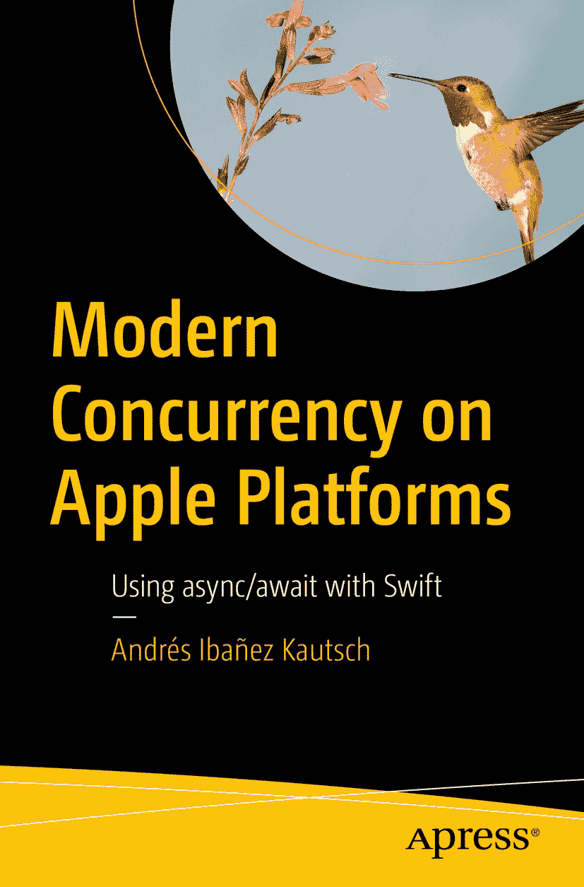

ISBN 978-1-4842-8694-4 （电子书） ISBN 978-1-4842-8695-1 [`doi.org/10.1007/978-1-4842-8695-1`](https://doi.org/10.1007/978-1-4842-8695-1) © Andrés Ibañez Kautsch 2023 本书受版权保护。版权所有。本作品的全部或部分内容（包括但不限于翻译、重印、插图复用、朗诵、广播、微缩胶片复制或其他任何物理形式复制、信息存储与检索、电子改编、计算机软件，以及当前已知或未来开发的任何相似或不同方法）所涉权利，均由出版商独家许可持有。本书中使用的通用描述性名称、注册商标名称、商标、服务标志等，即使未作特别声明，也不意味着其不受相关保护性法律和法规的约束，因此可自由通用。出版商、作者及编辑均认定，本书在出版时所包含的建议和信息是真实且准确的。出版商、作者或编辑不对本书所含内容或任何可能存在的错误或遗漏作出明示或暗示的担保。对于已出版地图中的管辖权主张及机构隶属关系，出版商保持中立立场。

本 Apress 印记由注册公司 APress Media, LLC（Springer Nature 的一部分）出版。

注册公司地址为：1 New York Plaza, New York, NY 10004, U.S.A.

*献给我的母亲蕾娜塔和我的兄弟加斯顿，感谢他们一直以来给予我的所有支持和耐心，以及他们为我所做的一切。*

