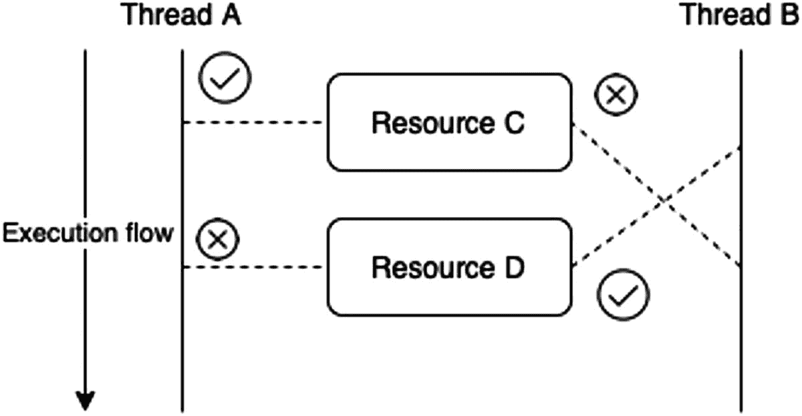
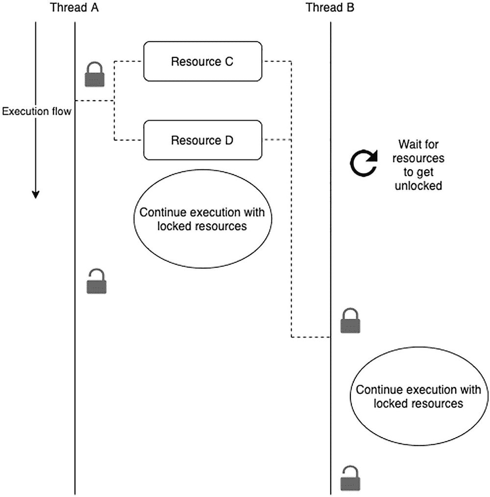
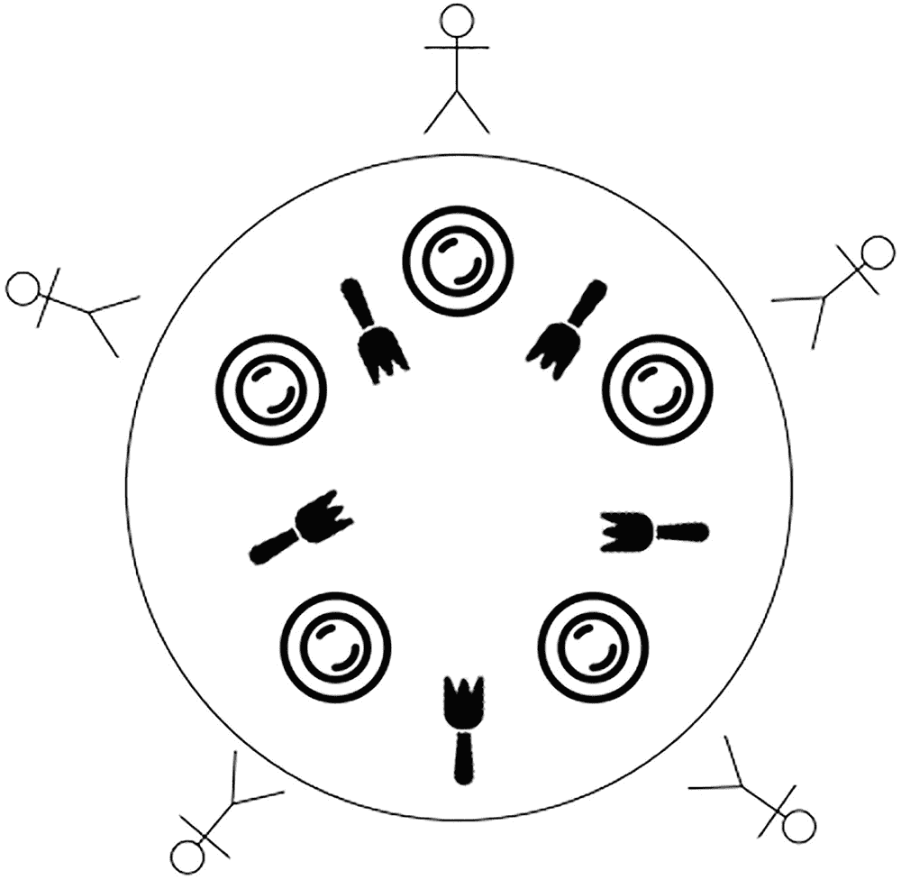
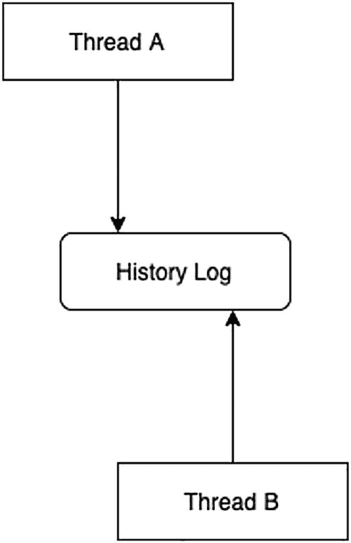

# 1. 引言

程序员习惯于编写线性执行的程序。在编写、测试和执行程序时，您期望指令按照编写顺序运行。在代码清单 1-1 中，程序会先将变量 `a` 赋值为数字 `2`，再将变量 `b` 赋值为数字 `3`，接着将 `a + b` 的和赋值给变量 `sum`，最后在控制台打印结果。如果您在计算出 `sum` 的值之前就尝试执行 `print(sum)`，这个程序是绝对无法正常运行的。

```
let a = 2
let b = 3
let sum = a + b // 该变量依赖 a 和 b 的值，但变量本身的赋值顺序可以任意。
print(sum) // 只有获取到变量的值后才能将其打印出来。
代码清单 1-1
一个自上而下执行的简单程序
```

这被称为*过程式编程*，因为您编写简单的语句，它们会自上而下地执行。即使添加了可以改变执行流程的语句，代码依然易于理解。在过程式编程中调用函数时，程序会“跳转”到内存中的另一个位置执行其内容，但这些行的执行也会以过程式的方式按照编写顺序进行，直到控制权返回给调用者。

即使是非程序员，只要指令按照特定顺序编写，并且*一次只做一件事*，他们也能遵循任何指令集。无论是按照菜谱烹饪，还是根据在线教程搭建狗屋的人，可能都不是程序员，但只要步骤清晰明确，人们天生就善于完成任务。

但计算机程序会成长并变得愈发复杂。虽然很多复杂软件确实可以遵循这种线性执行流程来编写，但程序往往需要同时执行多项任务。您的程序可能需要以这样一种方式执行，以至于仅凭肉眼扫视源码很难判断发生了什么——而不是拥有一个清晰的、可以用肉眼追踪的代码执行路径。这类程序是多线程的，它们可以同时运行多个（通常——但并非总是——互不相关的）代码路径。

在本书中，我们将学习如何使用苹果的 `async/await` 实现进行异步和多线程编程。在本章中，我们还将讨论苹果为此提供的旧技术，以及新的 `async/await` 系统如何更优秀，并帮助您避免传统的并发陷阱。

## 需要了解的重要概念

并发和异步编程是非常宽泛的主题。虽然我很想涵盖所有内容，但这会超出本书的范围。相反，我们将定义四个重要概念，这些概念在我们探索苹果于 2021 年推出的 `async/await` 系统时将非常相关。我们将尽可能用最简洁的语言来定义它们，因为在阅读本书各章节的过程中，牢记这些概念非常重要。新系统本身的概念将在后续章节中介绍。

> **注意**
>
> 苹果并非 `async/await` 系统的原创者。该技术此前已在其他平台上使用。微软于 2011 年宣布 C# 将获得 `async/await` 支持，包含这些特性的 C# 于 2012 年正式向公众发布。

### 线程

*线程*的概念即使在相同语境下（此处指并发和异步编程）也可能有所不同。在本书中，我们将*线程*视为一个可以独立运行的工作单元。在 iOS 中，*主线程*负责运行应用的 UI，因此所有与 UI 相关的任务（更新视图层级、移除和添加视图）都必须发生在主线程中。尝试在主线程之外更新 UI 可能会导致意外行为，甚至更糟——崩溃。

在底层多线程框架中，开发者会手动创建线程，并且需要自己手动同步、停止线程以及进行其他线程管理操作。手动处理线程是软件多线程编程中最困难的部分之一。


好的，作为高级文档工程师和翻译员，我将严格按照您提供的注意事项和示例格式，将给定的英文文本翻译成中文。


### 并发与异步编程

并发是指一个线程（或你的程序）同时处理多件事情的能力。它可能是在响应不同的事件，例如网络处理程序、UI 事件处理程序、操作系统中断等。可能存在多个线程，并且所有这些线程都可以是并发的。

Apple 的 SDK 中提供了多种不同的利用并发的 API。代码清单 1-2 展示了如何根据设备请求使用 Touch ID 或 Face ID 的权限。

```
func requestBiometricUnlock() {
let context = LAContext()
var error: NSError? = nil
let canEvaluate = context.canEvaluatePolicy(.deviceOwnerAuthenticationWithBiometrics, error: &error)
if canEvaluate {
if context.biometryType != .none {
// (1)
context.evaluatePolicy(
.deviceOwnerAuthenticationWithBiometrics,
localizedReason: "To access your data") { (success, error) in
// (2)
if success {
// ...
}
}
}
}
}
代码清单 1-2
生物识别解锁是一个异步任务
```

`(1)` 调用了 `context.evaluatePolicy`，这是一个*并发调用*。这将要求系统挂起你的应用，以便其接管控制权。在你的应用被挂起时，系统会请求使用生物识别的权限。当系统运行 `context.evaluatePolicy` 时，你的应用所运行的线程可能正在做完全不同的事情，甚至与你的应用无关。当用户响应提示，接受或拒绝生物识别请求时，结果会被传递给你的应用。系统会等待一个合适的时机，将用户的选择通知给你的应用。该选择将通过完成处理器（也称为*回调*）在 `(2)` 处交付给你的应用，此时你的应用将重新控制该线程。该选择的交付线程可能与发起 `context.evaluatePolicy` 调用的线程不同——这一点很重要，因为如果响应需要更新 UI，你需要在主线程上执行该工作。这也被称为*阻塞机制*或*中断*，因为 `evaluatePolicy` 对于该线程来说是一个*阻塞*调用。如果你已经从事 iOS 开发至少几个月，你应该对这种处理各种事件的方式很熟悉。`URLSession`、图片选择器等许多 API 都使用了这种机制。

人们常常认为异步编程就是同时运行多个任务。这是一个不同的概念，称为*多线程*，我们将在下一点中讨论。

**注意：** 如果你正在考虑在你的应用中实现生物识别解锁来保护资源，请不要使用上述代码。它已被简化用于解释并发的工作原理，并且没有采取正确的安全措施来保护你的用户数据。

多线程是指同时运行多个任务的行为。通常涉及多个线程（因此得名多线程）。在你的应用的上下文中，许多任务可以同时运行。同时从互联网下载多张图片，或者在你的网页浏览器中打开一些标签页的同时下载一个文件，这些都是多线程的例子。这允许我们*并行*运行任务，有时也被称为*并行性*。

### 多线程陷阱

并发和多线程传统上都是难以解决的问题。自从它们被引入计算机世界以来，开发者们不得不开发各种范例和工具来使处理并发变得更容易。因为程序员习惯于过程式思维，编写在不可预知的时间执行的代码很难做到正确无误。

在本节中，我们将讨论编写底层多线程代码的开发者经常遇到的一些问题，以及他们为应对这些问题而创建的模型。理解本节很重要，因为这些传统问题是真实存在的，但它们的解决方案已经在 `async/await` 系统中实现了。它也将帮助你决定下次在程序中需要实现并发或多线程时，应该使用哪种技术。

#### 死锁

在多线程的上下文中，当两个不同的进程互相等待对方完成时，就会发生*死锁*，这有效地使得它们任何一方都无法首先完成。

当两个进程共享一个资源时，可能会发生这种情况。如果*线程 B* 想要*线程 A* 持有的一个资源，而*线程 A* 想要*线程 B* 持有的一个资源，那么两个进程都会互相等待对方完成，陷入永久的死锁状态。图 1-1 展示了这种情况可能如何发生。



*示意图描绘了线程 A 和 B 的执行流程，其中线程 A 持有资源 C 并带有正确符号，持有资源 D 并带有错误符号；而线程 B 则相反。*

**图 1-1** – 死锁发生过程

图 1-1 展示了线程 A 可能尝试依次访问资源 C 和资源 D，而线程 B 可能尝试做同样的事情但顺序不同。在这个例子中，死锁会很快发生，因为线程 A 会占据资源 C，而线程 B 会占据资源 D。任何一个线程只要先需要对方手里的资源，就会导致死锁。

尽管这个问题看起来简单，但它是许多多线程软件中大量错误的罪魁祸首。简单的解决方案是防止每个进程尝试访问一个正被占用的资源。但这如何实现呢？

##### 解决死锁问题

死锁问题有很多成熟的解决方案。*互斥锁*和*信号量*是最常用的。还有*通过管道进行进程间通信*，但我们不讨论这个，因为它超出了单个程序的范畴。

###### 互斥锁

*互斥锁*是*互斥锁（或标志）*的简称。互斥锁通过向资源添加一个*锁*来向其他进程发出信号，表明某个进程正在使用该资源，并阻止其他进程获取该资源，直到该锁被释放。理想情况下，一个进程会一次性获取它所需的所有资源的锁，甚至在使用它们之前就获取。这样，如果*线程 A* 需要*资源 C* 和*资源 D*，它可以在*线程 B* 尝试访问它们之前将它们锁定。*线程 B* 将等待所有锁被释放后，再尝试访问这些资源本身。图 1-2 展示了这是如何实现的。



*示意图描绘了线程 A 和 B 的执行流程，其中包括带有锁符号的资源 C 和 D，使用锁定资源继续执行，以及等待资源解锁并带有刷新符号。*

**图 1-2** – 使用互斥锁

请记住，在这种特定情况下，这意味着*线程 A* 和*线程 B*，虽然是多线程，但并不会严格地同时运行，因为*线程 B* 需要*线程 A* 正在使用的相同资源，并且它会等待这些资源被释放。因此，在设计多线程系统之前，识别可以并行运行的任务非常重要。


###### 信号量

`Semaphore`（信号量）是一种锁，与互斥锁非常相似。使用这种解决方案，任务会获取对资源的锁。任何其他到达并需要该资源的任务都会发现该资源正忙。当原始线程释放资源时，它会*通知*感兴趣的相关方资源已空闲，然后它们在与资源交互时会遵循相同的加锁和通知流程。

互斥锁和信号量听起来很相似，但关键区别在于它们锁定的资源类型。如果你发现自己需要决定保护什么（在使用 `async/await` 时不会遇到这种情况），那么思考哪种方式在你的用例中更有意义就很重要了。通常，互斥锁可用于保护任何本身不涉及任何执行逻辑的资源，例如文件、套接字和其他文件系统元素。信号量可用于保护程序本身的执行，例如共享的代码执行路径。这些可能是具有共享状态的可变函数或类。在某些情况下，多个线程执行一个函数可能会产生意想不到的后果，而信号量正是一个很好的工具。例如，一个将日志写入磁盘的函数可以用信号量保护，因为如果多个进程同时写入日志，日志最终会被损坏。谁拥有日志函数的信号量，谁就需要通知其他感兴趣的相关方该资源已空闲，以便它们可以继续执行。

一个经验法则是，在获取信号量时始终添加超时机制，如果进程耗时过长，则让其超时。如果在你的程序上下文中这是可以接受的（不会发生数据损坏，或者取消任务不会产生其他意外后果），请考虑添加超时，以便信号量在一段时间后再次变为空闲。

使用信号量将允许线程进行*同步*，因为它们能够相互协调资源，从而公平地使用这些资源。

#### 饥饿

*饥饿*问题发生在程序陷入永久等待资源以执行某些工作但永远无法获得资源的状态时。图 1-3 说明了这个问题。



图 1-3：哲学家就餐问题

图 1-3 描述了所谓的*哲学家就餐问题*，这是饥饿问题的一个经典例子。该问题描述了五位想要在一张共用餐桌上就餐的哲学家。他们都有自己的盘子，并且有五把叉子。然而，每位哲学家需要两把叉子才能吃饭。这意味着只有两位哲学家可以吃饭，而且只能是那些不直接相邻的哲学家。当一位哲学家不吃饭时，他会放下两把叉子。但可能出现这样的情况：一位哲学家决定吃个不停，导致另一位哲学家挨饿。

对于低层多线程开发人员来说幸运的是，可以使用我们上面讨论过的*信号量*来解决这个问题。思路是使用一个信号量来跟踪使用中的叉子，这样当有叉子可用时，它就可以通知另一位哲学家。

#### 竞态条件

这可能是大多数开发人员最熟悉的多线程问题，*竞态条件*与死锁非常相似，不同之处在于它们可能导致数据或内存损坏，从而引发其他不良后果。当处理多线程时，两个进程同时读取数据本身并非坏事。如果资源是只读的，则没有坏处。但是，如果进程可以以任何方式修改或更新资源，那么这些进程将不断地覆盖另一个进程刚刚写入的数据，这最终会导致读取和写入损坏的数据。如果涉及的资源是用户数据，用户将会不满。如果资源由操作系统提供，则可能导致其他意外后果，并最终引发死锁等多线程问题。图 1-4 说明了这个陷阱。



图 1-4：多个线程同时写入同一个文件

如果历史日志被多个没有任何控制的线程写入，事件可能会以随机顺序记录，一个线程可能会覆盖另一个线程刚刚写入的行。因此，历史日志的写入操作应该被锁定。一个线程在写入日志时会获得一个*互斥锁*，并在使用完成后释放它。任何其他需要写入日志的线程都将等待，直到锁被释放。

死锁和竞态条件非常相似。主要区别在于，在死锁中，我们有多个进程在等待彼此完成；而在竞态条件中，两个进程都在写入数据并损坏数据，因为没有进程知道涉及的资源正被其他人使用。这意味着死锁的解决方案也适用于竞态条件，因此只需使用互斥锁或信号量来锁定你的资源，以确保仅由一个进程对资源进行独占访问。这称为*原子操作*。

#### 活锁

生活中有一句谚语：“*过犹不及*。”理解随意地使用锁并不能解决所有多线程问题是很重要的。识别出一个多线程问题，然后扔一个互斥锁上去就了事，这听起来很诱人。不幸的是，事情并非如此简单。你需要理解你的问题，并确定锁应该放在哪里。

同样，当进程在释放和获取资源的条件上过于宽松时，也可能出现这个问题。如果 `线程 A` 可以请求 `线程 B` 的一个资源，并且 `线程 B` 不加思考地顺从，而 `线程 B` 也可以对 `线程 A` 做同样的事，那么最终可能发生的情况是，它们将无法再向对方请求资源，因为它们甚至无法执行到执行流程中的那个点。

这是一个现实生活中的经典例子。假设你正走向一扇关闭的门，而另一个人几乎同时到达。你可能想让对方先进，但对方可能告诉你应该你先走。如果你熟悉这种尴尬的感觉，那么你就知道我们多线程程序中的活锁是什么感觉了。

### 现有的多线程与并发工具

苹果公司提供了一些较低级别的工具来编写多线程和并发代码。我们将展示其中一些工具的示例。它们按从低级到高级的顺序列出。级别越低，越难正确使用该系统，并且在现实世界中遇到它的可能性也越小。你应该了解这些工具，以便在需要时能够使用它们。


#### pthreads

`pthreads`（POSIX 线程）是 IEEE 定义的标准实现。^(¹) 其名称中的`POSIX`（可移植操作系统接口）表明它们不仅可在 Apple 操作系统上使用，也可在许多平台上运行。传统上，硬件供应商会提供各自专有的多线程 API。得益于这一标准，你可以在多个 POSIX 系统中使用相似的接口。`pthreads` 的一大优势是，只要系统兼容 POSIX（包括某些 Linux 发行版），它们便广泛可用。

`pthreads` 的缺点是它们完全用 C 语言编写。C 是一种非常底层的编程语言，并且正逐渐淡出许多开发者的知识体系。开发者越年轻，掌握 C 语言的可能性就越小。虽然我不认为 C 语言会很快消失，但事实上很难找到熟悉 C 语言（更不用说正确使用它）的 iOS 开发者。`pthreads` 是我们可用的最底层的多线程 API，因此学习曲线非常陡峭。如果你选择使用 `pthreads`，那是因为你需要高度精确地控制整个多线程和并发流程，不过大多数开发者很少（甚至从未）需要下降到这一层级。你将需要手动启动线程并管理诸如互斥锁（`mutex`）等资源。如果你因在其他平台使用过 `pthreads` 而熟悉它，可以在这里沿用这些知识，但要注意未来的维护者可能既不熟悉 `pthreads` 也不熟悉 C 语言本身。

#### NSThreads

`NSThread` 是 Apple 提供的一个 Foundation 对象。它属于底层工具，但不如 `pthreads` 那样底层。由于它是 Foundation 对象，因此提供了 Objective-C 接口。这一接口让更多开发者能接触该工具，但随着时间推移，了解 Objective-C 的 iOS 开发者可能会越来越少。事实上，完全有可能找到拥有数年经验却从未使用过该语言的 iOS 开发者，尽管 `NSThread` 也可以在 Swift 中使用。

如果你想进行多线程编程，最终需要创建多个 `NSThread` 对象，并负责管理它们。每个 `NSThread` 对象都含有可用于检查线程状态的属性，例如 `executing`、`cancelled` 和 `finished`。你可以设置每个线程的优先级，这在多线程中是非常真实的需求。你甚至可以获取主线程，并判断当前线程是否为主线程，从而避免在主线程上执行耗时任务。

与 `pthreads` 类似，大多数开发者很少（甚至从未）需要下降到这一层级。

#### Grand Central Dispatch (GCD)

接下来我们将讨论 Apple 平台上第一个用于高级并发和多线程的高层工具。Grand Central Dispatch（以下简称 GCD）在 Apple 的 SDK 中无处不在，以至于你很可能在不知不觉中使用过它。如果我遇到一个从未写过类似代码清单 1-3 中代码的开发者，我会感到惊讶。

```
DispatchQueue.main.async {
    nameLabel.text = userResponse.username
}
Listing 1-3
在主线程上调用代码
```

看起来很熟悉？这是 GCD 中最著名的调用之一，因为它能让你快速无痛地将某些工作推迟到主线程执行。例如，在 `URLSessionTask` 的某个子类完成某些工作后，你希望更新 UI 时，很可能会看到这个调用。

作为高层框架，GCD 让你免除了比 `pthreads` 和 `NSThreads` 更多的繁琐工作。使用 GCD，你永远无需手动管理线程。从这个意义上说，它确实是一个高层框架，但它也带来了一些自身的负担。代码清单 1-4 展示了一些开发者在使用 GCD 时遇到的经典问题。

```
func fetchUser() {
    userApi.fetchUserData { userData in
        DispatchQueue.main.async {
            self.usernameLabel.text = userData.username
            self.userApi.fetchFavoriteMovies(for: userData.id) { movies in
                DispatchQueue.main.async {
                    self.userMovies = movies
                }
            }
        }
    }
}
Listing 1-4
厄运金字塔（pyramid of doom）
```

代码清单 1-4 展示了一段假设的代码，它从某个地方获取用户数据及其最喜欢的电影。这种用法在 GCD 中非常典型。当你的工作需要多次依赖于其他任务的调用时，你的代码就会开始呈现“厄运金字塔”的形状。虽然有办法解决这个问题（例如创建不同的函数来分别获取用户数据和电影），但这并不完全优雅。

尽管有这些缺点，GCD 仍然是创建并发和多线程代码的一种非常流行的方法。它为你内置了许多保护机制，因此你无需成为多线程理论专家也能避免犯错。我们这里看到的示例仅展示了它提供的极少一部分功能。虽然这个工具足够高层，能让你免去许多麻烦，但它也暴露了大量底层功能，并让你能够直接操作某些原语，例如信号量（`semaphores`）。

最后，这项技术是开源的，因此可以在 Apple 产品之外的平台上找到。GCD 体量庞大，详细讨论其特性已超出本书范围，但请注意，它已被广泛使用很长时间，你在职业生涯中很可能会见识到一些使用它的高级技巧。


### `NSOperation` APIs

作为比 GCD 层级更高的工具，`NSOperation` API 是一套用于多线程编程的高级工具。尽管没有 GCD 那样广为人知，它在 SDK 的某些部分中仍占有一席之地。例如，CloudKit API 就采用了这项技术。

这套工具确实为你省去了多线程编程中的大量痛点，但同时也丧失了不少灵活性。你无需手动管理锁或信号量，相应的 API 也更为简单。它抽象了如此多的细节，以至于你甚至无法察觉用它运行的任务是否位于不同线程。如果系统认为在同一个线程中运行你的任务更为合理，它就会这么做；否则，它会尊重你运行多线程的意图。甚至，如果系统判断不值得为某个任务另开一个线程，它可能会选择将该任务在主线程中执行。代码清单 1-5 创建了两个不同的任务，分别在不同队列中从 1 数到 10 和从 10 数到 20。

```
func startCounting() {
/// 为此我们需要一个队列。
let operationQueue = OperationQueue()
/// 如果你稍后需要识别队列，可以为其设置一个可选名称。
operationQueue.name = "Counting queue"
/// 这个任务将从 1 数到 10...
let from1To10 = BlockOperation {
for i in (1 ... 10) {
print(i)
}
}
/// ...而这个任务将从 11 数到 20
let from11To20 = BlockOperation {
for i in (11 ... 20) {
print(i)
}
}
/// 将操作添加到队列中
operationQueue.addOperation(from1To10)
operationQueue.addOperation(from11To20)
/// 确保程序在操作运行期间不会提前退出。
operationQueue.waitUntilAllOperationsAreFinished()
}
Listing 1-5
NSOperation API 的多线程使用
```

使用这些 API 非常简单。你首先创建一个 `OperationQueue`。这个队列的职责是执行你添加到其中的任何任务。你也可以为它命名，以便稍后引用或搜索时使用。

在*代码清单* *1-5* 中，我们创建了两个任务（本例中是 `BlockOperation` 的实例——原始 API 基于 Objective-C，因此在 Swift 中表现为闭包），即 `from1To10` 和 `from11To20`。一旦通过 `OperationQueue.addOperation` 调用将它们提交到队列，它们就会立即开始执行。在这个例子中，你会看到数字几乎是交错打印的。每次运行程序时，得到的结果都会不同。

同时运行多个任务很容易，但如果你希望一个任务在另一个任务之后执行，因为前者依赖于后者的数据，或者仅仅因为这样更合理，又该如何做呢？

在这种情况下，`BlockOperation` 提供了一种方法，允许你将一个操作定义为另一个操作的依赖。如果你将 `from1to10` 设为 `from11to20` 的依赖，那么数字序列就会按你期望的顺序打印。代码清单 1-6 修改了代码清单 1-5 的一部分，通过创建依赖关系来按顺序打印数字。

```
// 确保数字按顺序打印。我们在将操作添加到队列之前执行此操作。
from11To20.addDependency(from1To10)
/// 将操作添加到队列中
operationQueue.addOperation(from1To10)
operationQueue.addOperation(from11To20)
Listing 1-6
将操作添加为其他操作的依赖
```

值得注意的是，虽然使用此框架你无法管理线程，但你可以检查每个*操作*的状态（`isCancelled`、`isFinished` 等），并且可以随时取消你的操作（通过调用 `cancel`）。如果一个操作被取消，依赖于它的其他操作也会被取消。

如你所见，使用 `NSOperation` API 很简单。当你有多线程编程的简单需求时，它仍然是一个很不错的工具。

### 介绍 `async/await`

`async/await` 是一套用于编写并发和多线程代码的高级系统。使用它，你无需考虑手动管理线程或死锁问题。系统会在底层为你处理所有这些细节以及更多工作。通过使用非常简单的结构，你将能够编写出安全且强大的并发和多线程代码。值得注意的是，这个系统层级非常高，很难被错误使用。虽然系统不会让你对并发和多线程原语进行精细控制，但它会提供一整套抽象，让你以一种截然不同的方式思考多线程代码。从语义上讲，很难将 `async/await` 与我们之前探讨过的任何其他系统进行比较，因为 `async/await` 深度集成在 Swift 语言本身之中，而不是以框架或库的形式附加的。得益于 Swift 对可读性的重视，该系统暴露的原语更容易理解。

为了让你快速了解本书其余部分将要学习的内容，我们将在代码清单 1-7 中使用 `async/await` 重写代码清单 1-4。

```
@MainActor
func fetchUser() async {
let userData = await userApi.fetchUserData()
usernameLabel.text = userData.username
let movies = userApi.fetchMovies(for: userData.id)
userMovies = movies
}
Listing 1-7
async/await 的实际应用
```

代码清单 1-7 去掉了代码清单 1-4 中的大量代码。你可以看到，那些将结果推迟到主线程执行的代码不见了。你还可以看到，代码可以从上到下阅读——就像普通的程序性编程风格一样！这个版本的获取用户数据 API 读起来更简单，写起来也更简单。`@MainActor` 就是所谓的*全局执行体*。我们将在本书后面探讨执行体和全局执行体。现在，你只需知道 `@MainActor` 会确保带有此标记的函数或类中的成员更新在主线程中运行。

通过理解何时直接使用系统的关键字（代码清单 1-7 展示了 `async` 和 `await` 本身就是关键字）以及系统的其他原语，你将能够编写任何程序员都能理解的并发和多线程代码。更棒的是，如果一位开发者刚接触 Apple 平台开发，但拥有使用其他采用 `async/await` 技术的经验，他们将能快速熟悉这套系统。你的代码库将更加整洁，并欢迎团队中的新开发者加入。

使用 `async/await` 将避免你编写底层并发代码。你永远不需要直接管理线程。锁也完全不是你的责任。如你所见，这个新系统允许我们编写富有表达力的代码，而回调地狱已成为过去。

重要的是要记住，尽管这是一个高级系统，你仍可能会遇到极少数需要底层工具的特殊情况。话虽如此，大多数开发者在整个职业生涯中可能都找不到一个需要将 `async/await` 搁置一旁的实际用例。

## 环境要求

要跟学本书，你至少需要从 App Store 下载 Xcode 13。如果你想在 iOS 14 和 iOS 13 上使用 `async/await`，则需要 Xcode 13.3。你应该能够熟练阅读和编写 Swift 代码。部分示例将使用 SwiftUI 编写，以避免 UI 代码干扰你对各章节实际内容的关注。


## 摘要

并发与多线程是传统的计算问题。在底层进行并发管理并自行管理资源极具挑战性，因为这类操作极易被误用。若未能正确使用这些资源或编写正确的多线程代码，轻则引发程序缺陷（bug），重则导致用户数据损坏。正因如此，包括苹果在内的众多开发者设计了多种工具来封装底层细节，提供更简便的接口。以苹果平台为例，他们为开发者提供了以下工具（按抽象层级从低到高排列）：

* `pthread` 线程
* `NSThread` 线程
* 大中央调度（GCD）
* `NSOperation` 及相关 API
* `async/await`

大多数开发者无需深入到 `pthread` 或 `NSThread` 层级。GCD 与 `NSOperation` API 提供了更高层级的抽象，而 `async/await` 不仅为多线程原语提供了抽象，还构建了一整套体系——大多数开发者甚至无需了解底层组件便可直接使用。这套新系统能让我们编写更简洁、易读且易写的代码。深入研习这套新系统非常值得，而本书正是为此而作。

## 练习题

回答以下问题：

1.  使用传统并发工具时，若未正确使用，可能陷入哪些陷阱？
2.  在 `async/await` 出现之前，苹果平台上有哪些可用的并发工具？
3.  `async/await` 相较于其他底层并发工具有哪些优势？

