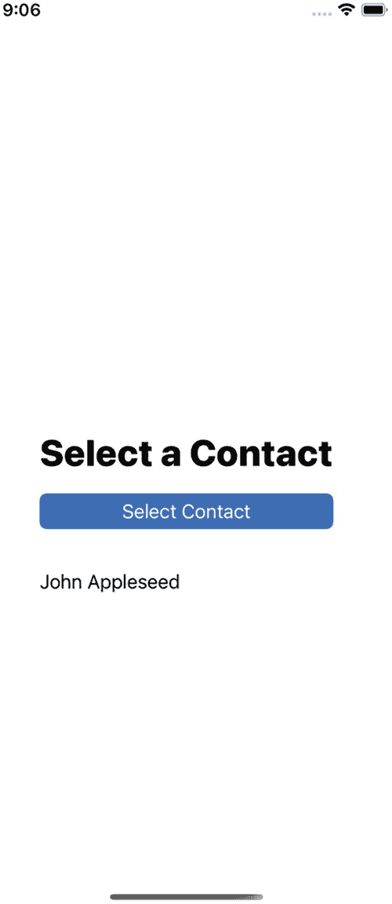
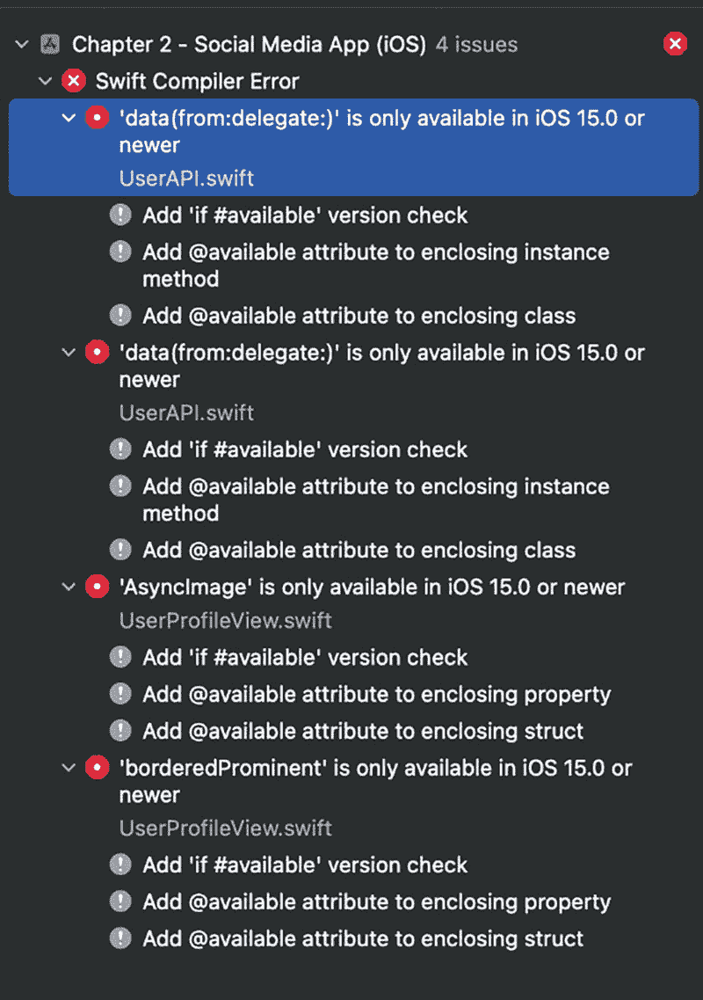
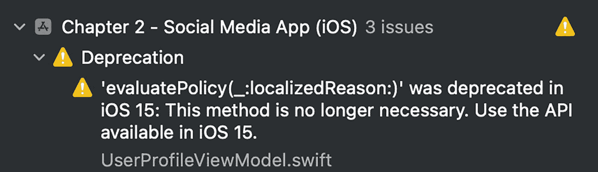

# 3. 续体

在上一章中，我们学习了 `async` 和 `await` 关键字，从而开始接触 Swift 中的新并发系统。我们将一个使用基于闭包调用的项目迁移到了 `async/await` 代码中。我们通过重写方法的原始实现来使其适应新系统。但在实际工作中，由于时间限制，或者更糟糕的技术难题，你可能无法从头编写这样的实现。针对这些情况，我们有*续体*，它允许你将现有的基于闭包的调用“封装”成 `async/await` 形式——甚至包括基于委托的调用！

续体非常有用，因为借助它，你不仅能为自己的基于闭包的代码提供 `async/await` 版本，还能为第三方库和框架提供相应版本。这将帮助你创建一致的代码库，在合理的情况下，只使用 `async/await` 而不是基于闭包的调用。

**注意**
并非所有基于闭包的代码都必然与并发和/或多线程有关。在 Swift 和苹果的 SDK 中，有许多接受闭包的调用与并发完全无关。例如，集合常用的方法 `filter`、`map` 和 `reduce`，它们接受闭包来操作集合元素。请记住这一点，因为项目中完全不含任何闭包是很难做到的，而这也是正常的。`async/await` 的目标只是消除与并发任务相关的基于闭包的调用。

## 理解续体

我们在前面的章节中已经简要接触过*续体*的概念，本章将继续沿用相同的含义进行讲解。

简而言之，*续体*就是指在 `async` 调用完成后发生的事情。当我们使用 `async/await` 时，续体就是 `await` 调用下面的所有代码。如果你使用的是基于闭包的代码，续体就是写在完成处理器中的代码。而如果你使用的是基于委托的代码，续体就是某个操作完成后可以调用的任何方法，例如原始的 `UIImagePickerController` 的 `imagePickerController(didFinishPickingMediaWithInfo:)` 方法。

新的并发系统允许我们将基于闭包代码形式甚至是基于委托代码形式的续体“转换”为 `async/await` 形式。

为了更好地理解这个简短但重要的概念，我们将回到社交媒体应用的原始版本。我们将使用那个没有 `async/await` 的版本来阐述这个概念。


### 将基于闭包的调用转换为 async/await

打开 `Shared ➤ API ➤ UserAPI.swift` 文件。查看 `fetchUserInfo(completionHandler:)` 方法。为了方便起见，代码清单 3-1 展示了其原始实现。

```
func fetchUserInfo(
completionHandler: @escaping (_ userInfo: UserInfo?, _ error: Error?) -> Void
) {
let url = URL(string: "https://www.andyibanez.com/fairesepages.github.io/books/async-await/user_profile.json")!
let session = URLSession.shared
let dataTask = session.dataTask(with: url) { data, response, error in
if let error = error {
completionHandler(nil, error)
} else if let data = data {
do {
let userInfo = try JSONDecoder().decode(UserInfo.self, from: data)
completionHandler(userInfo, nil)
} catch {
completionHandler(nil, error)
}
}
}
dataTask.resume()
}
代码清单 3-1
fetchUserInfo(completionHandler:) 的原始实现
```

你可以为该方法提供一个 `async/await` 版本，而无需像我们在第 2 章中那样从头重新实现它。这样做的一个缺点是你无法删除这个原始实现。优点是保留原始实现并没什么不好，因为对于那些尚不打算采用 `async/await` 的代码库，你始终可以保留基于闭包的调用。代码清单 3-2 展示了我们如何在不重写代码的情况下提供该方法的 `async/await` 版本。

```
func fechUserInfo() async throws -> UserInfo {
// (1)
try await withCheckedThrowingContinuation { continuation in
// (2)
fetchUserInfo { userInfo, error in
// (3)
if let userInfo = userInfo {
continuation.resume(returning: userInfo)
} else if let error = error {
continuation.resume(throwing: error)
} else {
// 抛出一个通用错误。
let nsError = NSError(domain: "com.socialmedia.app", code: 400)
continuation.resume(throwing: nsError)
}
}
}
}
代码清单 3-2
使用 withCheckedThrowingContinuation
```

代码清单 3-2 本质上将基于闭包的代码包装在一个*受检查的续体（Checked Continuation）*中。`withCheckedThrowingContinuation` —— 以及我们稍后会探讨的其他变体 —— 是一个方法，它为闭包提供了一个参数。它提供的参数就是实际的续体，当你的异步闭包调用完成时，你有责任恢复（resume）该续体。在代码清单 3-1 中，续体的类型是 `CheckedContinuation<T, E>`，这意味着我们可以用对象或错误来恢复续体。这完全合理，因为任何涉及网络调用的操作都可能失败。

让我们逐步解析代码清单 3-2：

* `(1)` 将调用 `withCheckedThrowingContinuation`。这是一个可以抛出错误的 `async` 函数。因此，我们用 `try await` 来调用它，并且函数签名与我们在第 2 章中看到的该代码的异步版本类似。调用此方法时，我们需要传递给它一个闭包，该闭包会提供一个续体对象，我们需要在操作完成后恢复它。

* `(2)` 将像在其他任何上下文中一样，调用基于闭包的 `fetchUserInfo(completionHandler:)` 版本。

* `(3)` 是魔法发生的地方。如果 `fetchUserInfo(completionHandler:)` 成功完成并且我们得到了一个 `UserInfo` 对象，我们将通过调用 `continuation.resume(returning: userInfo)` 来恢复续体。如果收到错误，我们将调用 `continuation.resume(throwing: error)`。当调用 `continuation.resume(returning:)` 方法时，它会导致 `async` 版本 `fetchUserInfo()` 的调用者返回结果对象；而调用 `continuation.resume(throwing:)` 则会导致它抛出错误。最终，代码清单 3-2 中方法的调用者，其行为将完全等同于第 2 章中代码清单 2-10 的调用者。请记住，使用续体时，你**必须**在某个时间点且**恰好**调用一次续体。你不能忘记调用它，也不能多次调用它。如果忘记调用，程序将陷入死锁状态。

除了 `withCheckedThrowingContinuation` 之外，我们还有另外三个方法可用于创建此类续体：

* `withCheckedContinuation`
* `withUnsafeThrowingContinuation`
* `withUnsafeContinuation`

当原始的基于闭包的代码不会返回任何类型的错误时，请使用 `withCheckedContinuation`。

非安全变体 —— `withUnsafeThrowingContinuation` 和 `withUnsafeContinuation` —— 类似于它们对应的受检查版本。主要区别在于，使用受检查续体时，Swift 会在检测到违规行为（例如多次调用续体或完全忘记调用续体）时记录错误，从而帮助你进行保护。非安全续体不具备这些特性，但它们的速度可能稍快。总的来说，我不建议你使用非安全续体，但要知道在大多数情况下你可以互换使用它们。

### 将基于委托的代码转换为 async/await

将基于委托的代码转换为 `async/await` 是一个更复杂的过程，因为这类 API 可能会根据发生的事件类型来调用不同的委托方法。这自然会产生“跳转性”很强的代码。虽然这些调用可能发生在同一线程上，但由于它们调用方法的方式，结果可能难以预测。例如，*ContactsUI* 框架提供了一个 `CNContactPickerViewController` 对象，当用户在一个方法中选择联系人时，它会通知你；如果用户取消了选择，则会调用另一个不同的方法。

针对本节内容，请下载“第 3 章 - 联系人选择器（基础项目）”项目。


#### `ContactPicker` 项目

该项目非常简单（图 3-1）。它由一个顶部标签构成，标签上显示静态提示文字"Select a Contact"。在其下方有一个按钮"Select Contact"，点击该按钮会弹出一个 `CNContactPickerViewController`，用户可使用它来选择联系人。一旦选中联系人，按钮下方会出现一个新标签，以黑色文字显示联系人的姓名。如果用户取消操作，该标签将变为红色，并显示文字"Cancelled"。



屏幕截图展示了联系人选择器，其中包含 Wi-Fi、满格电池和 9:06 时间等标签，以及格式、选择联系人、选择联系人按钮下方和 John Appleseed。

图 3-1

`ContactPicker` 应用

打开 `ViewController.swift` 文件。本例的核心在于清单 3-3 中的方法。

```
func contactPickerDidCancel(_ picker: CNContactPickerViewController) {
    selectedContactLabel.text = "Cancelled"
    selectedContactLabel.textColor = .red
    selectedContactLabel.isHidden = false
}

func contactPicker(_ picker: CNContactPickerViewController, didSelect contact: CNContact) {
    let nameFormatter = CNContactFormatter()
    nameFormatter.style = .fullName
    let contactName = nameFormatter.string(from: contact)
    selectedContactLabel.text = contactName
    selectedContactLabel.textColor = .black
    selectedContactLabel.isHidden = false
}
```

清单 3-3  
`CNContactPickerViewController` 委托方法

当点击"Select Contact"按钮时，将调用 `promptContact()` 方法。该方法会创建、配置并显示一个 `CNContactPickerDelegate`。如果用户取消操作，将调用 `contactPickerDidCancel(_)` 方法，将标签设置为红色并显示文字"Cancelled"。如果用户选择联系人，则会调用 `contactPicker(_:didSelect)` 方法，将标签文本设置为联系人姓名，颜色设置为黑色。这是一个简单的例子，但它说明了基于委托的调用方式的复杂性。

基于委托的 API 可能非常杂乱，尤其是当它们有很多可能的调用方法时。通过创建一个围绕 `CNContactPickerViewControllerDelegate` 及其方法的包装对象，我们可以为调用方创建一个更简洁的 API。

#### 将基于委托的调用包装到 async/await 替代方案中

现在，我们将继续创建这样一个包装器。我们将修改"第 3 章 - ContactPicker (基础项目)"项目。您可以下载"第 3 章 - ContactPicker (Async-Await)"项目来查看最终结果。

我们的任务是将清单 3-4 中所示的 `promptContact()` 的当前实现替换为清单 3-5 中的新实现，并在此过程中移除 `ViewController` 中所有与联系人选择逻辑相关的代码，例如委托遵循声明和委托方法。

```
func promptContact() {
    async {
        let contactPicker = ContactPicker(viewController: self)
        if let contact = await contactPicker.pickContact() {
            // 已选择联系人…
        } else {
            // 选择已取消…
        }
    }
}
```

清单 3-5  
`promptContact()` 的新实现

```
func promptContact() {
    let picker = CNContactPickerViewController()
    picker.delegate = self
    picker.displayedPropertyKeys = [CNContactGivenNameKey, CNContactNamePrefixKey, CNContactNameSuffixKey]
    present(picker, animated: true)
}
```

清单 3-4  
`promptContact()` 的原始实现

在清单 3-5 中，我们安全地解包了一个可选值，因为如果用户点击取消而没有选择联系人，我们将没有要显示的联系人信息。您也可以选择在用户取消选择时抛出一个错误，但由于这是该项目中唯一可能的失败原因，因此我们不会使用错误。

我们将从创建一个新对象开始。创建一个新文件 `ContactPicker.swift`，并添加清单 3-6 中的代码。

```
import Foundation
import ContactsUI

class ContactPicker: NSObject, CNContactPickerDelegate {

}
```

清单 3-6  
`ContactPicker` 的起始代码

我们将使用此对象来封装联系人选择器的所有逻辑。它将负责显示联系人选择器 UI 并将结果返回给我们。

接下来，我们需要基本属性以及一个用于引用延续类型的类型别名，如清单 3-7 所示。

```
private typealias ContactCheckedContinuation = CheckedContinuation<CNContact?, Never>
private unowned var viewController: UIViewController
private var contactContinuation: ContactCheckedContinuation?
private var picker: CNContactPickerViewController
```

清单 3-7  
基本属性

`viewController` 属性将用于呈现 UI。我们需要存储 `picker`，以便在调用 `promptPicker()` 时显示它。最后，由于有两种不同的委托方法，我们需要存储检查后的延续，以便在任一委托方法被调用时可以引用它。

初始化器应接受将要呈现选择器的视图控制器。清单 3-8 包含了初始化器的实现。

```
init(viewController: UIViewController) {
    self.viewController = viewController
    picker = CNContactPickerViewController()
    super.init()
    picker.delegate = self
}
```

清单 3-8  
`ContactPicker` 的初始化器

初始化器接受一个属性（负责显示选择器的 `ViewController`）。选择器是内部的，因此无需暴露它。我们将在 `promptContact()` 被点击时初始化延续。

`promptContact()` 有一个非常有趣的实现。清单 3-9 展示了使该方法正常工作所需的代码。

```
@MainActor
func pickContact() async -> CNContact? {
    viewController.present(picker, animated: true)
    return await withCheckedContinuation({ (continuation: ContactCheckedContinuation) in
        self.contactContinuation = continuation
    })
}
```

清单 3-9  
`pickContact()` 的异步版本


我们仅将此方法标记为 `@MainActor`，而非整个类。这是因为 `ContactPicker` 类可能在不同线程中执行各种不同操作，但我们只关心此方法中的 `MainActor`，因为它通过模态展示联系人选择器与 UI 交互。

`withCheckedContinuation` 的方法体仅将 continuation 赋值给我们的 `contactContinuation` 属性。再次说明，我们需要以某种方式存储 continuation，因为我们可能从两个不同的委托方法中恢复它。

列表 3-10 将实现我们需要的委托方法：`contactPicker(_:didSelect)` 和 `contactPickerDidCancel(_)`。

```swift
@MainActor
func contactPicker(_ picker: CNContactPickerViewController, didSelect contact: CNContact) {
contactContinuation?.resume(returning: contact)
contactContinuation = nil
picker.dismiss(animated: true, completion: nil)
}
@MainActor
func contactPickerDidCancel(_ picker: CNContactPickerViewController) {
contactContinuation?.resume(returning: nil)
contactContinuation = nil
}
列表 3-10
从两个不同的委托方法中恢复 continuation
```

这些方法非常直接。两个方法都会恢复 continuation，选择联系人时传递联系人，未选择联系人（选择被取消）时传递 `nil`。在恢复后将 `contactContinuation` 属性赋值为 `nil`，可确保我们无法多次调用 continuation。

我们已经完成了 `ContactPicker` 类的实现，现在需要回到 `ViewController`。你可以移除 `CNContactPickerDelegate` 的遵循及其相关的委托方法。你还可以用列表 3-11 中的代码替换 `promptContact()` 的实现。

```swift
func promptContact() {
Task {
let contactPicker = ContactPicker(viewController: self)
if let contact = await contactPicker.pickContact() {
let nameFormatter = CNContactFormatter()
nameFormatter.style = .fullName
let contactName = nameFormatter.string(from: contact)
selectedContactLabel.text = contactName
selectedContactLabel.textColor = .black
selectedContactLabel.isHidden = false
} else {
selectedContactLabel.text = "Cancelled"
selectedContactLabel.textColor = .red
selectedContactLabel.isHidden = false
}
}
}
列表 3-11
`pickContact()` 的最终实现
```

现在 `ViewController` 明显更简洁了。点击“选择联系人”按钮的行为应与我们将其全部改为使用 `async/await` 之前完全一致。

注意

尽管我们成功为基于委托的调用提供了 `async/await` 版本，这很不错，但你应该考虑这样做是否 *真的* 有必要。有时，基于委托的调用（如 CoreBluetooth、Core Location）的复杂性并不值得为它们提供 `async/await` 版本。话虽如此，通过练习来更好地理解 continuation 的工作方式，也是一项很好的训练。

### 在 iOS 13 和 14 中支持 async/await

我们之前提过这一点，但值得再次强调：虽然使用 Xcode 13.3 可以使用 `async/await`，但除非你使用 iOS 15 SDK 或更高版本编译，否则 Apple 不提供任何使用它们的 API。

如果你打开第 2 章中我们的社交媒体应用的 `async/await` 版本（如果没有，可以下载“第 2 章 - 社交媒体应用 (Async-Await)(iOS 14)”），并将部署目标版本更改为 iOS 13 或 iOS 14，你会看到项目无法再编译。大多数错误与不存在的 `async` 方法有关。图 3-2 显示了 Xcode 显示的报错。



一张截图显示了 iOS 第二章社交媒体应用中的四个问题，其中 Swift 编译器错误、Data、AsyncImage 和 bordered prominent 仅适用于 iOS 15.0 或更高版本。

图 3-2

我们无法在 iOS 14 及更低版本中使用 `async/await`

Xcode 的建议——直接使用可用性检查——理论上听起来不错，但如果你让 Xcode 为你修复，项目状态会比现在更糟。因为它会将所有 `async` 调用包裹在可用性检查中，在你成功运行项目后，它在 iOS 13 和 iOS 14 中将 *什么都不做*。

解决方案是使用可用性检查，但在 `URLSession` 和 `LAContext` 的扩展中。我们将在不触及 `UserAPI` 和 `UserProfileViewModel` 的情况下修复此项目。稍后我们需要修复一些 SwiftUI 问题，但我们无需改动逻辑代码，从而可以轻松添加 `async/await` 代码而不会破坏任何功能。你也可以下载完整修复后的项目，名为“第 2 章 - 社交媒体应用 (Async-Await)(iOS 14)(已修复)”。

首先，在“Shared”文件夹内创建一个文件夹或组，命名为“Extensions”。然后在该组内，创建一个新文件，命名为“LAContext+Extensions.swift”。其内容如列表 3-12 所示。

```swift
extension LAContext {
@available(iOS, introduced: 13, deprecated: 15, message: "该方法不再必要。请使用 iOS 15 中可用的 API。")
func evaluatePolicy(_ policy: LAPolicy, localizedReason: String) async throws -> Bool {
try await withCheckedThrowingContinuation({ continuation in
self.evaluatePolicy(policy, localizedReason: localizedReason) { success, error in
if let error = error {
continuation.resume(throwing: error)
} else {
continuation.resume(returning: success)
}
}
})
}
}
列表 3-12
将 evaluatePolicy(_:localizedReason) async 向后移植到 iOS 14
```

`@available` 检查将确保这段代码只能在 iOS 13 和 iOS 14 上运行。更旧的 iOS 版本不支持 `async/await`，因此我们将它们完全排除。当部署目标为 iOS 15 时，我们会收到一条警告：“该方法不再必要。请使用 iOS 15 中可用的 API。”当我们开始以 iOS 15 为目标时，就可以完全移除此扩展，代码无需做任何进一步更改即可正常运行。

这里的 continuation 使我们能够将基于闭包的调用平滑转换为 SDK 中已有的 `async/await` 调用，但仅限于以 iOS 15 及以上版本为目标时。我们不是返回错误，而是将此方法转换为一个可抛出错误的方法。

在图 3-3 中，我们看到警告生效，提示我们在低于 iOS 15 的模拟器上运行时更新代码。你可能需要清理构建文件夹并重新编译以使警告显示：



一张截图展示了 iOS 社交媒体应用中发现的三个问题，其中 Deprecation 和 evaluate policy 已在 iOS 15 中弃用，警告为使用 iOS 15 中可用的 API。

图 3-3


警告在`@available`检查中，提醒我们更新代码。

接下来，我们需要在`URLSession`中提供`data(from:)`方法。进入“Shared”➤“Extensions”目录，创建一个名为“URLSession+Extensions.swift”的文件，代码如清单 3-13 所示。

```swift
extension URLSession {
@available(iOS, introduced: 13, deprecated: 15, message: "This method is no longer necessary. Use the API available in iOS 15.")
func data(from url: URL) async throws -> (Data, URLResponse) {
try await withCheckedThrowingContinuation({ continuation in
self.dataTask(with: url) { data, response, error in
if let error = error {
continuation.resume(throwing: error)
} else {
continuation.resume(returning: (data!, response!))
}
}
.resume()
})
}
}
```
*清单 3-13 将`data(from:)`方法向后兼容至 iOS 13 和 iOS 14*

这段代码与清单 3-13 中的代码没有太大区别。也许最有趣的部分是返回类型是一个`(Data, Response)`类型的元组，但总的来说，将这个方法暴露给 iOS 14 和 iOS 13 并不复杂。请注意，我们强制解包了返回的`data`和`response`属性。我们这样做是因为，如果你查看 API 原始的异步签名，它们在元组中并未标记为可选值，因此可以安全地假设，如果没有收到错误，这两个变量将具有非 nil 值。如果你对此有疑问，可以随意将元组元素标记为可选值。

如果现在尝试编译项目，我们仍然会收到两个错误，但这些错误与`async/await`不再有任何关系。我们需要修复的错误位于`UserProfileView`中，因此打开“UserProfileView.swift”文件。

第一个错误提示在低于 iOS 15 的版本中没有`AsyncImage`。我们可以为网络图片提供自己的实现，但这超出了本书的范围。相反，当在低于 iOS 15 的版本上运行时，我们将提供一个简单的蓝色圆形。此错误的修复方法见清单 3-14。

```swift
if #available(iOS 15.0, *) {
AsyncImage(url: userInfo.avatarUrl)
.frame(width: 150, height: 150)
.aspectRatio(contentMode: .fit)
.clipShape(Circle())
} else {
Circle()
.frame(width: 150, height: 150)
.foregroundColor(.white)
}
```
*清单 3-14 为不在 iOS 15 上的设备创建替代视图*

最后，我们需要修复的最后一个错误与 iOS 15 中引入的按钮突出样式有关。最简单的修复方法是从`UserProfileView`中删除`.buttonStyle(.borderedProminent)`这一行。

就这样！你已经成功地将两个在 iOS 14 中不存在且是 iOS 15 原生支持的异步调用进行了向后兼容，如果你现在尝试编译应用程序，它应该没有问题地运行。如果你想测试 iOS 14 和 iOS 13 的兼容性，请确保在安装了这些 iOS 版本的模拟器中运行。如果没有，你可以转到 Xcode 的“Window”菜单，接着选择“Organizer”，然后在那里添加具有不同 iOS 版本的新模拟器。

请注意，不幸的是，你不能免费将所有`async/await`代码自动向后兼容到 iOS 14 及更低版本。你需要手动创建扩展并手写`continuation`方法。如果你有大量基于闭包且希望向后兼容的代码，请记住这一点。

## 总结

在本章中，我们探讨了什么是`continuation`，并学习了如何使用它们将基于闭包的代码转换为`async/await`代码，而无需从头开始为意图替换的方法编写新实现。我们还学习了如何通过围绕委托方法创建包装器对象，为那些使用委托的调用提供异步 API。最后，我们学习了如何使用`continuation`将`async/await`代码向后兼容到 iOS 14 和 iOS 13——我们不能兼容到更低版本，因为此功能仅在 iOS 13、14 和 15 上可用。

## 练习

### 编程练习

下载“第 2 章练习”项目（我们在第 2 章中使用的同一个基础项目）。

1.  使用`checked continuation`为`requestPermissions`和`requestData`函数提供`async/await`版本。你不应删除原始实现。

2.  修改`ContentViewViewModel.swift`的实现，使其使用这些方法的`async/await`版本，而不是基于闭包的版本。

解决方案可以在“第 2 章练习 - 已解决 Continuation”项目中找到。

