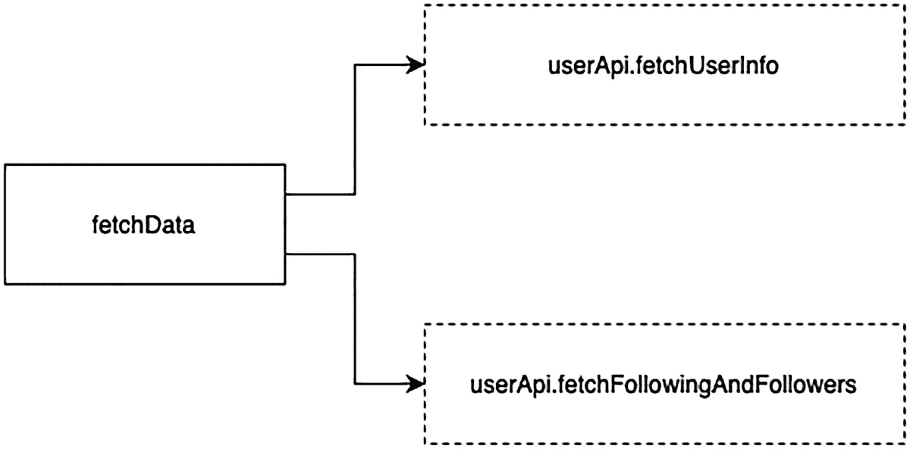
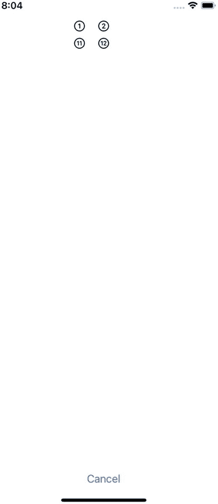
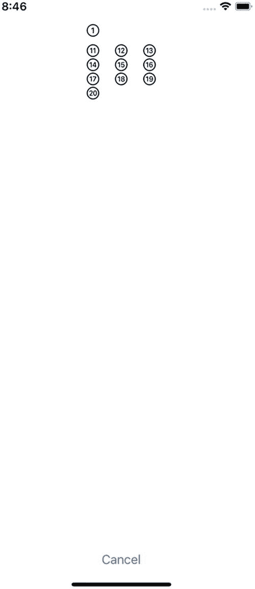
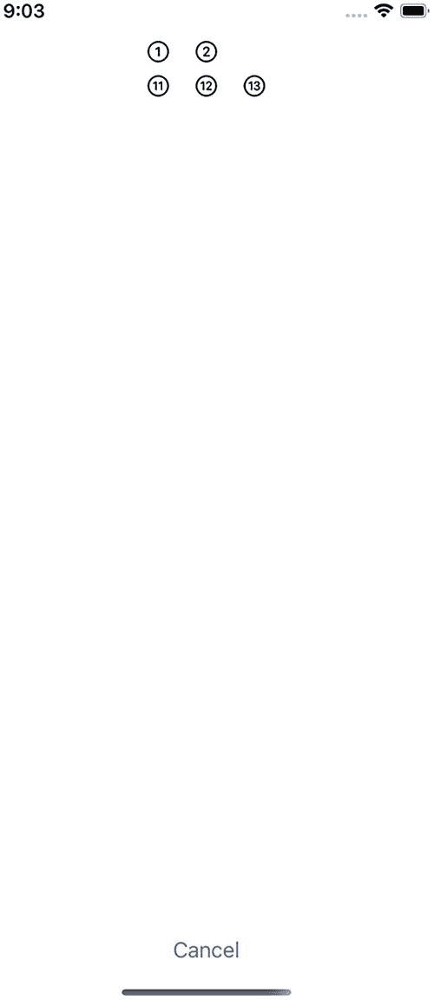
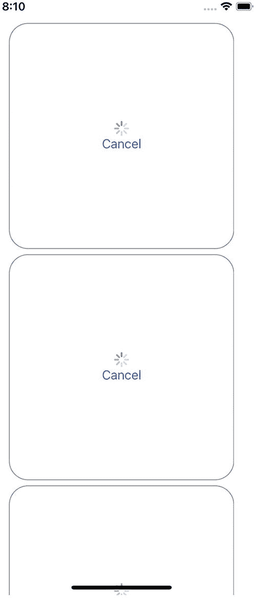
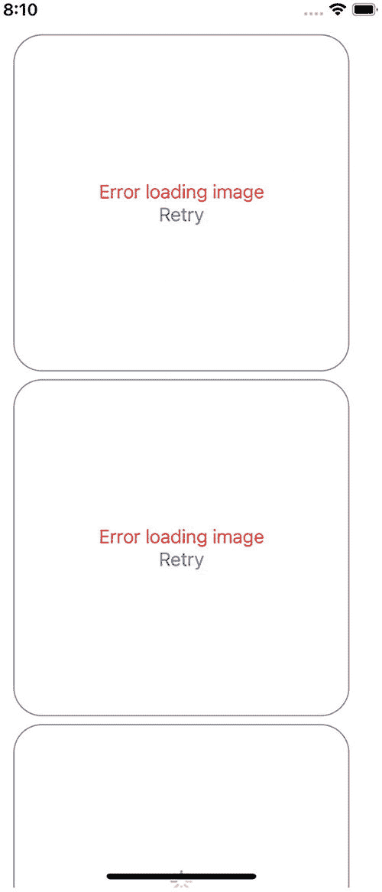

# 任务树  

Swift 中的新并发系统由一种名为“任务树”的底层结构驱动。顾名思义，任务树为我们提供了理解并发运行背后机制的心智模型。任务树决定了你的任务之间如何关联运行，同时控制着数据如何被子任务继承。前面我们提到，任务会从启动它的任务中继承参与者（actor）、优先级以及任务本地变量。这要归功于任务树。任务会生成子任务，而这些子任务会从父任务处继承所有这些属性。  

为了更好地理解这个概念，让我们借助之前编写的一些代码来探索。代码清单 5-13 展示了我们在社交媒体应用 `async let` 版本中使用过的一个函数。  

```
func fetchData() async throws -> (userInfo: UserInfo, followingFollowersInfo: FollowerFollowingInfo) {
let userApi = UserAPI()
async let userInfo = userApi.fetchUserInfo()
async let followers = userApi.fetchFollowingAndFollowers()
return (try await userInfo, try await followers)
}
代码清单 5-13  
异步从服务器获取数据  
```  

这段代码中有两个 `async let` 调用，分别用于获取用户信息和关注者信息。由于使用了 `async let`，系统会尝试让它们并发运行。  

直觉上你可能认为每个 `async let` 调用都隐式启动了一个新任务，但事实并非如此。每个 `async let` 调用会启动一个新的**子**任务。区分这一点很重要，因为 `Task` 只能显式创建。  

每个子任务都会继承父任务（此处指 `fetchData()` 函数本身）的参与者、优先级和局部变量。当你在一个 `Task` 内部创建另一个 `Task` 时，它同样会继承父 `Task` 的属性。但与隐式任务不同的是，你可以根据需求对其进行调整，例如以不同的优先级启动它。严格来说，嵌套任务并非子任务。  

如果要把 `fetchData()` 任务画成一棵树，它看起来会像图 5-3 所示。  

  

一个流程示意图，展示了 `fetchData`、`userApi.fetchUserInfo()` 和 `userApi.fetchFollowingAndFollowers()` 的可视化表示。  

**图 5-3**  
任务树的可视化表示  

当 `fetchData` 执行时，同一个任务会被用来启动 `fetchUserInfo` 和 `fetchFollowingAndFollowers`。这一点需要反复强调，请务必记住：**任务始终是显式创建的**。除非我们手动将这些调用包装在 `Task` 中，否则它们将在同一个 `Task` 下运行。一个任务可以运行多个并发子任务，这些子任务共享相同的参与者、优先级和任务本地变量。  

关于任务树，你需要考虑的另一个重要方面是：**父任务必须在其所有子任务都完成工作后才能结束自身工作**。即使这种终止并不成功（例如抛出了错误），它仍然是一种终止，并且任务可以在发生此类异常情况时完成。  

任务树还控制着另外两个方面。它们非常重要，值得单独用章节来阐述：错误传播和任务取消。  

## 错误传播  

让我们回到 `fetchData` 树。`fetchData` 本身可能抛出错误，它生成的所有子任务也可能抛出错误。假设 `fetchUserInfo` 中发生了错误。如果该函数抛出错误，函数执行将在该点终止，将错误向上传递给调用方，并且不会执行错误发生点之后的任何代码。到目前为止，如果我们完全没有使用新的并发系统，情况也会完全一样。这就是 Swift（实际上也是许多其他编程语言）中错误传播的工作原理。  

但当我们使用新的并发系统时，事情就没那么简单了。当然，`fetchUserInfo` 可能抛出错误，但 `fetchFollowingAndFollowers` 可能正常完成并返回预期值。  

如果抛出了错误，它会沿着任务树向上传播，直到到达调用方。任何正在等待或并发运行的其他子任务都将被标记为已取消。  


### 任务取消

任务取消非常重要，但其运作方式并不像你初看时以为的那样。如果你重新阅读上一节的最后一句话，你会注意到我们说的是任务"将被*标记为*已取消"。

在这个新的并发系统中，任务取消是协作式的。取消一个任务仅仅意味着你在通知它你希望它被取消。由任务自己来决定在何时以适当的方式实际取消自身，并且你需要自行实现这个逻辑。任务取消采用协作式的原因是，存在一些敏感且重要的任务，强行停止它们的执行可能是不可接受的。如果你正在向数据库写入数据，或者在一个并发任务中修改用户文件，突然取消它可能会导致用户数据损坏（以及大量的一星差评）。

当一个 `Task` 被取消时，它也会将任何子任务标记为已取消，以确保不会执行不必要的工作。

为了更好地解释这个概念，我提供了一个我们将要逐步完成的项目："第 5 章——计数器应用"。

当你启动这个应用时，你会看到一个简单的按钮，如图 5-4 所示。


一张截图展示了手机屏幕，上面显示着"开始计数"的文字，以及顶部的时间、蜂窝网络和电池图标。

图 5-4

一个简单的界面，带有一个用于启动计数器的按钮

点击按钮将开始在两个不同的区域同时打印数字 1 到 10 以及 11 到 20。图 5-5 展示了这一运行中的动作。



一张截图展示了手机屏幕，上面分别圈出了数字 1、2、11 和 12，底部有"取消"按钮，以及顶部的时间、蜂窝网络和电池图标。

图 5-5

在界面中显示数字。界面每秒更新一次

用于输出待绘制数字的函数位于代码清单 5-14 中。

```swift
func countFrom1To10() async throws -> Bool {
    for i in (1...10) {
        try? await Task.sleep(nanoseconds: 1_000_000_000)
        values1To10 += [i]
    }
    return true
}
func countFrom11To20() async throws -> Bool {
    for i in (11...20) {
        try? await Task.sleep(nanoseconds: 1_000_000_000)
        values11to20 += [i]
    }
    return true
}
代码清单 5-14
这些方法输出要在界面中显示的数字
```

代码清单 5-15 展示了异步启动这两个函数的方法。

```swift
func startCounting() {
    isCounting = true
    counterTask = Task {
        async let counter1To10DidFinish = countFrom1To10()
        async let counter11To20DidFinish = countFrom11To20()
        do {
            let _ = try await (counter1To10DidFinish, counter11To20DidFinish)
        } catch {
            self.error = error
        }
    }
}
代码清单 5-15
异步启动两个计数方法
```

`counterTask` 是一个类型为 `Task<Void, Never>` 的变量。将任务存储在变量中，可以让我们稍后取消它，如代码清单 5-16 所示。

```swift
Button("Cancel") {
    viewModel.counterTask?.cancel()
}
代码清单 5-16
给用户手动控制任务的能力
```

你可以看到，`counterTask` 变量充当了 `countFrom1to10` 和 `countFrom11to20` 的父任务。你认为当你点击"取消"按钮时会发生什么？数字会完全停止打印，并且界面仅显示已成功打印出来的数字吗？它会清除所有数字吗？请花一分钟思考一下。

但正确答案并非这两种情况。在你点击取消按钮的那一刻，所有数字会立即显示在界面上（而不是像之前那样一次显示一个数字），并且任务看起来像是毫无问题地完成了。这到底是怎么回事？

***取消是协作式的***。这意味着任务不会被任何其他人明确地、自动地取消。之前，我们说任务被*标记为已取消*。取消是协作式的，意味着任务需要检查自身的取消状态，并在适当的时候取消执行。立即取消任务是不正确的，因为你的代码可能正在执行某些不能被意外中断的关键操作。因此，与其由其他人来取消你的代码，不如让你的代码等待一个合适的时机自行停止执行。

要检查取消状态，你需要将取消检查放置在合理的位置。Swift 为你提供了 `Task.checkCancellation()` 静态方法和 `Task.isCancelled` 静态属性。当你处于一个可以抛出异常的异步上下文中时，使用前者；当你的上下文未被标记为 `throws` 时，使用后者。

基于此，我们现在需要让 `countFrom1To10()` 和 `countFrom11To20()` 方法在某个时刻检查自身的取消状态，并在适当时返回。一种实现方法是在我们将值追加到变量之前放置一个检查。代码清单 5-17 展示了如何实现。

```swift
func countFrom1To10() async throws -> Bool {
    for i in (1...10) {
        try? await Task.sleep(nanoseconds: 1_000_000_000)
        if Task.isCancelled { return false }
        values1To10 += [i]
    }
    return true
}
代码清单 5-17
向 countFrom1To10() 添加任务取消检查
```

将检查放在值追加到数组之后也是可以接受的。如果两个位置都放置取消检查是合理的，那甚至更好。代码清单 5-18 展示了包含一些额外检查的方法。

```swift
func countFrom1To10() async throws -> Bool {
    for i in (1...10) {
        try? await Task.sleep(nanoseconds: 1_000_000_000)
        if Task.isCancelled { return false }
        values1To10 += [i]
        if Task.isCancelled { return false }
    }
    return true
}
代码清单 5-18
添加额外的取消检查
```

并没有一个固定的公式来识别取消检查应放置的位置，但重要的是在设计代码时要将取消纳入考量，因为你希望代码的使用者不会让你的操作不必要地持续运行。苹果的许多异步方法已经考虑了取消。例如，如果你取消一个正在运行 `URLSession` 数据任务的任务，它会自动响应取消操作。

如果你现在运行代码并点击"取消"按钮，前几个数字会停止在原地打印，而从 11 到 20 的数字则会一直打印到结束。图 5-6 展示了这一运行中的行为。



一张截图展示了手机屏幕，上面分别圈出了数字 1 以及 11 到 20，底部有"取消"按钮，以及顶部的时间、蜂窝网络和电池图标。

图 5-6

只有一个任务在检查取消状态，因此取消未能按预期工作

在我们修复 `countFrom11to20` 之前，你可能想知道为什么点击取消时数字会立即显示出来，而不是像点击"取消"按钮之前那样每秒显示一个数字。原因是，`try? await Task.sleep(nanoseconds: 1_000_000_000)` 调用中的错误通过 `try?` 被静默处理了。代码这样编写是因为当 `Task` 被取消时，`sleep(nanoseconds:)` 方法实际上会抛出一个错误。由于错误被静默处理，任务不会休眠一秒，循环会立即执行。本质上，取消是一个被抛出的错误，你可以捕获它并对其进行与其他错误不同的处理。


为了提供协作任务取消的示例，我不得不静默错误并手动添加取消检查。通常，你可以预期新并发系统中的任何方法以及苹果自身的异步方法，在某个时刻已经执行了取消检查。如果你移除`try`后的问号，则可以避免在该特定方法中进行取消检查。

清单 5-19 修复了`countFrom11to20`方法。

```swift
func countFrom11To20() async throws -> Bool {
    for i in (11...20) {
        if Task.isCancelled { return false }
        try? await Task.sleep(nanoseconds: 1_000_000_000)
        values11to20 += [i]
        if Task.isCancelled { return false }
    }
    return true
}
```
清单 5-19 修复`countFrom11To20`方法

现在，无论何时你点击“取消”按钮，数字将不会像我们添加取消检查之前那样从上到下打印。有趣的是，由于异步代码的特性，根据你取消的时机，你可能在 UI 中看到不同的输出。例如，应用尝试每秒打印两个数字（1 和 11，2 和 12 等），但根据你取消的时机，你可能只得到一对中的一个数字。图 5-7 展示了当我在显示第三对时取消任务所发生的情况。



一张截图展示了一个移动屏幕，上面分别圈出了数字 1、2、11、12 和 13，底部有“取消”按钮，顶部有时间、蜂窝网络和电池符号。

图 5-7 任务在同一时间被取消，但其中一个任务稍微领先于另一个

### 任务取消与任务组

理解使用任务组的结构化并发可能导致你的代码向调用者返回部分结果而非完整集合，这一点非常重要。思考清单 5-20 中的代码，它来自第 4 章的`ImageDownloader`项目。

```swift
func download(serverImages: [ServerImage]) async throws -> [URL] {
    var urls: [URL] = []
    try await withThrowingTaskGroup(of: URL.self) { group in
        for image in serverImages {
            group.addTask(priority: .userInitiated) {
                let imageUrl = try await self.download(image)
                return imageUrl
            }
        }
        for try await imageUrl in group {
            urls.append(imageUrl)
        }
    }
    return urls
}
```
清单 5-20 在任务组中下载多个图片

如果你有 10 张图片要下载，并且在所有图片下载完成之前，`withThrowingTaskGroup`调用内部发生错误（或者你调用`group.cancelAll()`取消组），`urls`数组将包含一个部分结果，该结果仅包含在异常退出之前成功下载的图片。请确保记录此行为，因为你的代码的调用者可能未意识到这一点，并可能导致他们的程序出现意外行为。

## 使用分离任务的无结构化并发

我们已经提到，任务树确保任务从其父任务继承一些属性，例如优先级、Actor 和局部变量。完全有可能从另一个任务启动一个不继承其父任务任何属性的任务。这些任务被称为*分离任务*，当你需要并发，但这种并发并非严格相关时，它们非常有用。例如，从互联网下载图片可以是一个任务。你可能稍后想要将这些图片存储在本地缓存中。将图片存储在本地缓存的过程可以是一个分离任务，这样如果下载任务被取消但图片已下载，缓存保存操作将顺利进行而不会出现问题。

要启动一个分离任务，你只需使用`Task`的静态方法`detached`。清单 5-21 展示了如何创建一个。

```swift
Task.detached(priority: .low) {
    imageManager.writeImageToCache(image)
}
```
清单 5-21 创建分离任务

从语法上讲，与标准任务相比没有太大区别，但在处理它们时，请务必注意任务树和继承属性。指定优先级是可选的，就像处理普通任务时一样。

## 总结

本章详细讨论了无结构化并发和任务树。我们大量介绍了`Task`对象及其在创建并发时的行为。这种类型的并发称为无结构化并发，它赋予我们更多控制权，允许我们手动取消任务或将它们作为参数传递。

我们讨论了结构化并发如何与`Task`协同工作。我们提到，在`Task`内部调用异步方法会使这些方法成为父任务的子任务。这些子任务继承父任务的所有属性，包括优先级、Actor 和局部变量。启动异步方法并不意味着它们在不同的任务中运行。任务始终使用`Task {}`对象显式创建。

我们还讨论了任务树以及它如何管理任务的执行。任务树为你提供了一个心智模型，帮助你理解子任务继承了哪些信息。此外，它还管理着取消是如何发生的。

我们了解到任务取消并非直截了当。“取消”一个任务仅仅意味着它将被标记为已取消，但任务自身负责寻找合适的时机来停止执行，因为强制停止异步代码可能对用户造成灾难性后果，例如数据损坏。我们还简要介绍了任务取消如何与任务组交互，以及它如何可能导致任务组返回部分结果，这可能是出乎意料的。

最后，我们讨论了分离任务，这是一种不继承父任务任何属性的无结构化并发形式。这些任务完全独立。

## 练习

### 改进项目

下载“第 4 章 - `ImageDownloader`”项目并执行以下更改：

1.  修改它，使其不再使用任务组下载图片。相反，它应该使用无结构化并发与`Task`来下载每张图片。提示：你可以创建一个名为`ServerImageView`的单独视图，并附带一个用于下载单张图片的视图模型。
2.  添加功能，如果用户点击“取消”按钮，允许他们取消独立的图片下载任务。
3.  SwiftUI 包含一个名为`.task`的视图修饰符，它会在视图出现时执行其内容，并在视图消失时取消执行，本质上取代了`onAppear`和`onDisappear`修饰符的行为。使用它在占位视图（可以是`ProgressView`）出现时自动下载图片。

完成此练习后，你的程序应类似于图 5-8。



一张截图展示了一个移动屏幕，上面有三个正在加载的图片，顶部有时间、蜂窝网络和电池符号。

图 5-8 图片正在下载时显示的 UI

如果你点击“取消”按钮（或者发生错误），UI 应类似于图 5-9。



一张截图展示了一个移动屏幕，上面有三个加载失败的图片，顶部有时间、蜂窝网络和电池符号。

图 5-9 图片下载已被取消，或发生了其他错误

当然，如果没有发生错误，图片应该像基础练习中那样正常显示。

你可以在“第 4 章 - `ImageDownloaderWithTask`”项目中找到我的解决方案。


