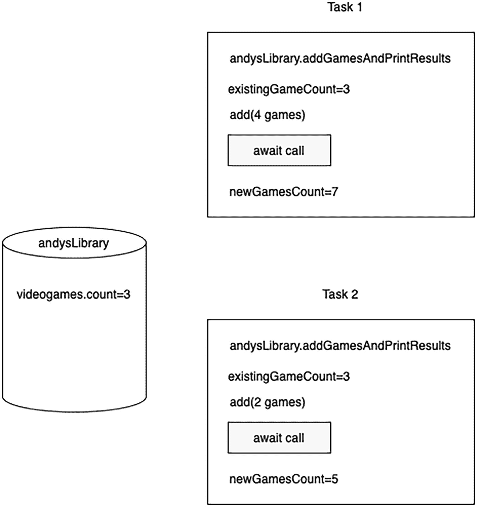

# 6. 参与者（Actors）

到目前为止，我们讨论了在 Swift 中使用相互独立的任务编写并发代码的方法。你可以运行一些任务，并通常将结果传递到主线程。但有些情况下，你需要在程序中拥有*共享的可变状态*——一个代码可以读取和写入的公共可变源。这个源可以是一个简单的变量、一个文件，也可以是任何其他并发访问有危险，但又需要同时被多个任务使用的资源。

如果你有多个可以访问只读资源的代码段，你的程序将始终处于有效状态，无需担心数据损坏。但如果有多个任务，并且其中至少有一个可以向共享资源写入数据，那就会产生问题。这被称为*数据竞争*，或者如第 1 章中所述，称为*竞态条件*。竞态条件非常危险，因为如果多个代码段可以并发写入文件，就会导致数据损坏。如果多个任务正在读取该资源，它们都会得到垃圾数据，甚至可能与它们试图读取的数据不同。最糟糕的是，如果你在底层编写并发代码，引入数据竞争非常容易，而调试却极其困难。

因此，如果你使用值语义（结构体或枚举），就不会遇到这个问题。值语义是只读的，如果发生改变，会创建一个副本，所有修改都*局部*于该变量。每个任务都会操作数据的不同副本，尽管这可能不是你期望的结果。

在第 1 章中，我们看到这个问题的底层解决方案是使用锁来手动同步对资源的访问。但在新的 Swift 并发模型中，我们有一种更简单的方法来实现这种同步：*参与者*。

## 参与者介绍

参与者是 Swift 中引入的一种新的引用类型，由新的并发模型支持。参与者将其自身状态与程序其他部分隔离，并提供对可变状态的同步访问。简单地说，如果你有一个参与者，它包含一个可以被多个任务读取和写入的简单变量，该参与者确保一次只能有一个任务进行读写操作。它确保了对给定资源的互斥访问。

对可变状态的每次访问都通过参与者来完成。要声明一个参与者，只需使用 `actor` 关键字并为其命名，这与声明结构体或类非常相似。参与者作为引用类型，具有许多类似类的特性。它们可以遵循协议，并通过扩展获得更多功能。与类的主要区别在于，参与者会隔离自身状态。参与者可能暂停零次或多次（在其方法中包含其他 `await` 调用），因此你可以轻松地将参与者与新的并发系统中的其他部分集成。

清单 6-1 展示了如何声明一个参与者。在这个例子中，我们还将创建一个 `Videogame` 结构体，用于本章的示例。

```
actor VideogameLibrary {
    var videogames: [Videogame] = []
    func fetchGames(by company: String) -> [Videogame] {
        let games = videogames.filter { $0.title.caseInsensitiveCompare(company) == .orderedSame }
        return games
    }
    func countGames(by company: String) -> Int {
        let games = fetchGames(by: company)
        return games.count
    }
    func add(games: [Videogame]) {
        self.videogames.append(contentsOf: games)
    }
    func fetchGames(by year: Int) -> [Videogame] {
        let games = videogames.filter { $0.releaseYear == year }
        return games
    }
}
```

清单 6-1  
声明一个参与者

这里引用了一个 `Videogame` 对象，其声明在清单 6-2 中。

```
struct Videogame {
    let title: String
    let releaseYear: Int
    let company: String
}
```

清单 6-2  
`Videogame` 结构体

我们可以看到它的声明看起来与类非常相似，作为引用类型，可以预期其行为也类似。你可能会疑惑为什么参与者是引用类型而不是值类型。原因很简单：参与者封装了*共享的*可变状态。它是一种期望被多个代码路径修改的类型。如果它是结构体，调用者修改它后最终会得到各自的副本。


## 与 Actor 交互

所有对 actor 的调用都需要异步完成，因此需要使用 `await` 关键字。这是 actor 用来同步状态并防止并发修改的机制。由于对 actor 的调用可以被 `await` 挂起，其他调用方将被暂停，等待轮到它们访问。

在内部，actor 无需以异步方式调用自身的方法和属性。因为 actor 是隔离的，其内部的任何调用都会按顺序执行，直到某个操作完成。

清单 6-3 展示了我们如何尝试向一个电子游戏库中添加一些游戏。

```
let library = VideogameLibrary()
func addGames(to library: VideogameLibrary) {
    let zelda5 = Videogame(title: "塞尔达传说：时之笛", releaseYear: 1998, company: "Nintendo")
    let zelda6 = Videogame(title: "塞尔达传说：姆吉拉的假面", releaseYear: 2020, company: "Nintendo")
    let tales1 = Videogame(title: "仙乐传说", releaseYear: 2004, company: "Namco")
    let tales2 = Videogame(title: "深渊传说", releaseYear: 2005, company: "Namco")
    let eternalSonata = Videogame(title: "永恒终焉", releaseYear: 2008, company: "tri-Crescendo")
    let games = [zelda5, zelda6, tales1, tales2, eternalSonata]
    library.add(games: games)
}
清单 6-3
向库中添加游戏
```

`addGames` 方法只是一个方便快速添加一些电子游戏的函数。然而，如果你尝试编译这段代码，你会收到一个错误，因为“Actor 隔离的实例方法‘add(games:)’不能从非隔离的上下文中引用”。

该方法期望我们添加 `await` 关键字。尽管 `add(games:)` 方法并未标记为 `async`，但作为 actor 提供的保护机制，暴露给我们的 API 实际上是 `async` 的。编译器正在帮助你避免误用 actor，从而防止引入数据竞争。

这样做的直接结果是，actor 只能在 `async` 上下文中运行，因此，要让代码编译通过，我们需要同时向 `add(games:)` 方法添加 `await` 关键字，并将其包裹在 `Task`（或 `Task.detached`）中。编译通过的修正方法如清单 6-4 所示。

```
func addGames(to library: VideogameLibrary) {
    let zelda5 = Videogame(title: "塞尔达传说：时之笛", releaseYear: 1998, company: "Nintendo")
    let zelda6 = Videogame(title: "塞尔达传说：姆吉拉的假面", releaseYear: 2020, company: "Nintendo")
    let tales1 = Videogame(title: "仙乐传说", releaseYear: 2004, company: "Namco")
    let tales2 = Videogame(title: "深渊传说", releaseYear: 2005, company: "Namco")
    let eternalSonata = Videogame(title: "永恒终焉", releaseYear: 2008, company: "tri-Crescendo")
    let games = [zelda5, zelda6, tales1, tales2, eternalSonata]
    Task {
        await library.add(games: games)
    }
}
清单 6-4
与 actor 交互需要在异步上下文中进行
```

当对 `add(games:)` 方法执行多次调用时，actor 每次只会执行其中一个调用。在清单 6-5 中，我们创建了一个新方法，用于向库中添加更多游戏。

```
func addNewGames(to library: VideogameLibrary) {
    let pokemon1 = Videogame(title: "宝可梦 黄", releaseYear: 1998, company: "Game Freak")
    let pokemon2 = Videogame(title: "宝可梦 金", releaseYear: 1999, company: "Game Freak")
    let pokemon3 = Videogame(title: "宝可梦 红宝石", releaseYear: 2002, company: "Game Freak")
    let games = [pokemon1, pokemon2, pokemon3]
    Task {
        await library.add(games: games)
    }
}
清单 6-5
向库中添加更多游戏
```

现在我们有两个添加游戏的方法。让我们尝试调用它们，如清单 6-6 所示。

```
addGames(to: library)
addNewGames(to: library)
清单 6-6
调用两个将调用 actor 的方法
```

此时情况变得有趣起来。我们无法保证 `addGames` 或 `addNewGames` 中的游戏哪个会先被添加。但可以保证的是，无论哪个先执行，actor 都会确保其中一个函数中的所有游戏在另一个函数开始运行之前全部添加到数组中。因此，数组要么先包含 `addGames` 中的所有游戏（按添加顺序），再包含 `addNewGames` 中的游戏（按添加顺序）；要么先包含 `addNewGames` 中的游戏（按添加顺序），再包含 `addGames` 中的游戏（同样按正确顺序）。游戏绝不会以交错顺序或任何类似混乱的方式被添加。

此外，对整个 actor 状态的访问是同步的。如果有人正在向库中添加游戏，同时另有人正在查询集合，actor 只会执行其中一个调用，直到完成。清单 6-7 将创建三个不同的任务：两个用于添加游戏，一个用于按给定年份过滤游戏并打印其数量。

```
Task {
    addGames(to: library)
}
Task {
    let games1998 = await library.fetchGames(by: 1998)
    print("\(games1998.count) games")
}
Task {
    addNewGames(to: library)
}
清单 6-7
从不同任务访问 actor
```

`addGames` 中有一款 1998 年发布的游戏。`addNewGames` 中也有一款 1998 年发布的游戏。总计，该年份共有两款游戏。理想情况下，上述代码会打印 `2 games`，但由于这些任务试图并发访问 actor，三个任务中只有一个会先执行其内容。如果尝试运行这段代码，你会发现它大多数时候打印 `0 games`，有时也可能打印 `1 games`。互斥访问意味着同一时间只有一个人能进入 actor 并完成其工作，无论调用 actor 的哪个方法。任何对 actor 的调用都会阻塞它，直到其工作完成。

这也是一个向您展示任务优先级如何工作的好机会。您可以通过为添加游戏的任务分配更高的优先级来告诉编译器您希望这些游戏先被添加。清单 6-8 更改了任务的优先级。`.utility` 是尽可能最低的优先级，因此在这种情况下，它*大多数时候*会最后执行，打印 `2 games`。

```
Task(priority: .high) {
    addGames(to: library)
}
Task(priority: .utility) {
    let games1998 = await library.fetchGames(by: 1998)
    print("\(games1998.count) games")
}
Task(priority: .high) {
    addNewGames(to: library)
}
清单 6-8
为任务分配优先级
```


### 对 Actor 的非隔离访问

有时你可能知道访问某个 actor 不会引发数据竞争。针对这些情况，你可以将 Actor 中的某些方法标记为 `nonisolated`。

为了演示这一点，我们将为 `VideogameLibrary` 添加一个新类型和属性，即拥有者信息。代码清单 6-9 展示了这个新类型。

```
struct Owner {
    let name: String
    let favoriteGenre: String
}
```

现在我们将修改该 Actor，使其拥有这个新属性以及一个初始化器。代码清单 6-10 展示了这些修改。

```
actor VideogameLibrary {
    var videogames: [Videogame] = []
    let owner: Owner

    init(owner: Owner) {
        self.owner = owner
    }

    func fetchOwnerInfo() -> String {
        return "\(owner.name) (\(owner.favoriteGenre))"
    }
    //...
}
```

请注意，我们还添加了一个 `fetchOwnerInfo` 方法。这有助于我们获取一个包含拥有者姓名和喜爱游戏类型的拼接字符串。

最后，代码清单 6-11 使用这个新类型初始化了该库。

```
let owner = Owner(name: "Andy Ibanez", favoriteGenre: "JRPG")
let library = VideogameLibrary(owner: owner)
```

现在，如果你想调用 `fetchOwnerInfo` 方法，则需要像代码清单 6-12 那样异步调用它。

```
Task {
    let ownerInfo = await library.fetchOwnerInfo()
    print(ownerInfo)
}
```

但在这个例子中，我们知道同步访问拥有者信息并无风险。由于它是一个不可变的结构体，我们完全应该能够在不使用 `await` 的情况下调用它。我们可以告诉编译器这个方法是非隔离的，这样我们就可以像调用其他方法一样调用它。代码清单 6-13 展示了如何实现。

```
nonisolated func fetchOwnerInfo() -> String {
    return "\(owner.name) (\(owner.favoriteGenre))"
}
```

正因如此，我们不仅可以去掉了 `await` 关键字（如果保留了它，你会收到一条有用的警告），而且也不再需要在异步上下文中调用此方法。在代码清单 6-14 中，我们创建了一个新方法，用于打印 `VideogameLibrary` 的拥有者信息。请注意，该函数并非 `async`，它没有使用 `Task`，并且 `fetchOwnerInfo` 方法也不再需要被等待。

```
func printOwnerInfo(of library: VideogameLibrary) {
    let ownerInfo = library.fetchOwnerInfo()
    print(ownerInfo)
}
```

### Actor 与协议遵循

如果你计划让你的 Actor 遵循某个协议，甚至通过扩展来遵循它，需要牢记一个重要事项。

当你打算遵循某个协议时，如果该协议包含可变要求，你将会遇到问题。例如，请看代码清单 6-15 中的新类型。

```
actor Game {
    let name: String
    let year: Int

    init(name: String, year: Int) {
        self.name = name
        self.year = year
    }
}

extension Game: Equatable {
    static func == (lhs: Game, rhs: Game) -> Bool {
        return lhs.name == rhs.name
    }
}
```

我们让这个 Actor 遵循 `Equatable` 协议，以便能够使用 `==` 运算符比较两个 `Game` 实例。这个例子可以正常编译，因为 `==` 函数依赖于两个不可变属性，而且该函数本身不需要修改我们的 Actor。

然而，请考虑代码清单 6-16 中的遵循情况。

```
extension Game: Hashable {
    func hash(into hasher: inout Hasher) {
    }
}
```

直接尝试使用这种遵循方式会导致 Swift 报错，提示 Actor 隔离的方法 `hash(into:)` 无法满足协议要求。编译器期望 `hash(into:)` 是一个同步操作。

在这种情况下，我们可以通过给方法添加 `nonisolated` 关键字来轻松解决问题。代码清单 6-17 添加了缺失的关键字。

```
extension Game: Hashable {
    nonisolated func hash(into hasher: inout Hasher) {
    }
}
```

这确实能满足编译器的要求，但你应该始终停下来思考一下这样做是否合理。`hash(into:)` 方法是否会依赖于被隔离的属性？如果是，那么你实现此方法的任何尝试都可能会出错。你可能会发现，要让 Actor 遵循那些要求其方法为同步的协议，并非易事。


## Actor 重入问题

当我们进入一个 Actor 时，如果它有很多工作要做，可能会挂起并调用其他异步方法。这会导致一个常见问题，即 Actor 重入问题（Actor Reentrancy problem）。

Actor 重入问题发生在你假设程序在遇到 `await` 调用之前保持整体状态时。让我们通过一个例子来解释。我们将为现有的 `VideogameLibrary` Actor 添加一个新方法。清单 6-18 展示了这个新方法。

```
func addGamesAndPrintResults(_ games: [Videogame]) async throws {
    let existingGameCount = videogames.count
    // 假设这里正在执行一个长时间运行的操作。
    try await Task.sleep(nanoseconds: 1_000_000_000)
    add(games: games)
    let newGameCount = existingGameCount + games.count
    print("添加前的游戏数量: \(existingGameCount)")
    print("现在的游戏数量: \(newGameCount)")
}
```

*清单 6-18 — `addGamesAndPrintResults` 方法展示了 Actor 重入问题*

这个新方法将：

1.  获取当前游戏库中的游戏数量。
2.  休眠并等待任务一秒钟。
3.  向游戏库中添加游戏。
4.  打印添加新游戏之前的游戏数量。
5.  打印现在的游戏数量。

当多个任务同时访问此方法时，就会发生 Actor 重入问题。当一个任务访问它时，它会将当前游戏数量存储在 `existingGameCount` 变量中。然后它会遇到一个耗时的 `await` 调用。与此同时，第二个任务可能访问此方法，并将游戏数量存储在一个新的 `existingGameCount` 变量中。如果第一个任务在第二个任务离开 await 之前完成，那么第二个任务中的 `existingGameCount` 变量将持有错误的数据，因为游戏库中的游戏比之前更多了。

为了更好地说明这个问题，请看图 6-1。



*一个模型图展示了 `andysLibrary`、任务 1 和任务 2，其中包含 `videogames.count` 等于 3，以及任务 1 和任务 2 内部的代码。*

*图 6-1 — Actor 重入问题的图示*

两个任务正在访问 Actor 以添加更多游戏。我们假设游戏库中已有 3 款游戏。第一个任务添加了 4 款游戏，第二个任务添加了 2 款。在执行结束时，任务 1 将打印现在有 7 款游戏，任务 2 将打印现有 5 款。但两个任务同时进入，我们知道 Actor 可以防止状态同时被修改。因此，其中一个任务打印了错误的数据。

每个任务打印结果时，都表现得像是唯一访问并打印该 Actor 的任务。如果任务 1 在任务 2 之前完成，任务 2 应该知道游戏库实际上有 7 款游戏，因此它应该总共打印出 11 款游戏。

这里的问题在于，我们在进入 `await` 调用之前就假设了游戏的数量。无法保证在离开挂起点后，程序的状态会和之前一样。我们在 `await` 调用*之前验证了我们的假设*。

不幸的是，在这种情况下 Actor 无法保护你。这纯粹是一个逻辑问题，取决于开发者。但一个好的经验法则是，你应该在 `await` 调用*之后*验证你的假设。在这种情况下，我们的假设是游戏库中的游戏数量。如果我们从挂起返回后再计算这个值，会更有意义。只需移动 `existingGameCount` 变量，程序就能被修复。清单 6-19 将 `existingGameCount` 变量放在了更合理的位置。

```
func addGamesAndPrintResults(_ games: [Videogame]) async throws {
    // 假设这里正在执行一个长时间运行的操作。
    try await Task.sleep(nanoseconds: 1_000_000_000)
    let existingGameCount = videogames.count
    add(games: games)
    let newGameCount = existingGameCount + games.count
    print("添加前的游戏数量: \(existingGameCount)")
    print("现在的游戏数量: \(newGameCount)")
}
```

*清单 6-19 — 将假设移至更合适的位置*

通过将我们的假设移至 await 调用之后，任务 1 和任务 2 每次调用可能仍会打印不同的结果，但可以肯定的是，无论谁先完成，后完成的任务都将拥有所有正确的数据来呈现给用户。

## Actor 与分离任务

回想一下，分离任务不会从父任务继承任何内容，包括父任务可能正在其上运行的 Actor。Actor 不会被继承。考虑清单 6-20 中添加到 `VideogameLibrary` 的新方法。

```
func playRandomGame() {
    guard let game = videogames.randomElement() else { return }
    print("正在玩 \(game.title)")
}

func playRandomGameLater() {
    Task.detached {
        await self.playRandomGame()
    }
}
```

*清单 6-20 — 从分离任务启动 Actor 方法*

`playRandomGame` 方法被隔离到 Actor 中。但请注意，`playRandomGameLater` 要求我们使用 `await` 调用 `self.playRandomGame()`。这是因为一旦我们启动分离任务，我们就跳转到了另一个 Actor。处于不同的 Actor 将迫使我们使用 await 来调用该 Actor 的方法。

## 使用 Actor 的一般性建议

Actor 非常适合存在共享可变状态的情况。它使得从多个部分访问可变数据变得容易，但它绝非万能灵药。

为了有效使用 Actor，这里列出一些我建议你在使用 Actor 时牢记的提示：

1.  **让你的 Actor 尽可能小。** 虽然 Actor 会借助 Swift 编译器保护你免受许多误用，但它无法保护你免受 Actor 重入等问题的影响。保持 Actor 小巧有助于你有效地使用它们。

2.  **保持你 Actor 的所有操作是*原子性*的。** 原子性操作被视为一个单一单元。保持方法简短有助于实现这一点。通常，原子性意味着要么一次性完成所有工作，要么如果单个操作失败，整个操作将被丢弃。尽可能避免在 Actor 内部使用 `await` 调用有助于实现原子性。

3.  **所有关于所需状态的假设，在 Actor 方法内部使用时，应该放在 `await` 调用之后。** 如果你的方法只包含一个 await 调用，这很容易做到，但如果有多个 await 调用，则可能难以推断程序的状态。

4.  **不要在 SwiftUI 中将 Actor 用作 `ObservableObject`。** 编译器允许你这样使用，但 `ObservableObject` 会期望它始终在主线程上运行。拥有包含昂贵调用的 Actor 将导致你的 SwiftUI 应用出现明显的延迟。


## 总结

本章我们学习了参与者引用类型。当程序中需要共享可变状态时，这些类型非常有用。共享可变状态是指多个进程可能异步访问的数据。允许对可变数据进行异步访问是危险的，可能导致数据损坏。参与者拥有一种机制，能自动将其自身状态与程序其他部分隔离，并提供同步访问，从而防止其数据被多个进程同时写入，避免读取损坏。我们可以通过使用 `nonisolated` 关键字，对特定方法选择退出这种隔离行为。

由于参与者的隔离特性，除非方法被标记为 `nonisolated`，否则对参与者外部的所有调用都必须使用 `await` 关键字异步完成。如果未使用 `await`，Swift 编译器会报错，阻止你同步访问参与者。

由于参与者是常规类型，它们可以遵循协议，并具有与类类似的行为。两者主要区别在于参与者的隔离性。如果要遵循协议，需要留意协议对可变性或其他可能要求某些遵循项为 `nonisolated` 的要求。并非总是能遵循所有协议，因为将某些方法标记为 `nonisolated` 可能会妨碍我们获得期望的行为。

