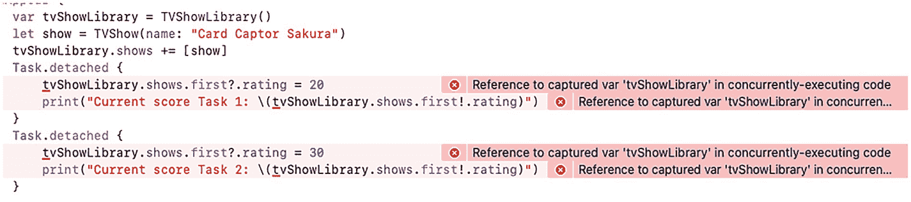
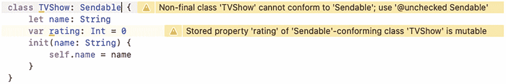

# 7. 可发送类型

最简单的并发程序即使处理并发也相当独立。但在复杂程序中，你需要跨隔离边界传递数据，从一个异步任务到另一个异步任务，从一个参与者到另一个参与者。数据需要是线程安全的。正如我们在参与者中学到的，跨异步域共享可变数据可能导致数据竞争，进而造成数据损坏。

Swift 需要一种定义安全跨隔离边界共享数据的方式。Swift Evolution 的成员提出了一个非常优雅的解决方案，引入了可发送类型。

## 理解可发送类型

可发送类型可以跨异步任务和参与者共享。根据定义，可发送类型需要防止数据竞争。此类类型应无法同时被多个操作修改。它们只能提供同步访问。

Swift 默认提供了一些可安全用于并发的可发送类型，包括：

1.  **值类型**。只要不包含任何不可发送的属性，枚举和结构体等值类型就是可发送的。正如我们在讨论参与者时所述，值类型是不可变的。如果尝试修改值类型，会创建一个包含新数据的新副本。这使得结构体和枚举可以在新的并发系统中即开即用。可能会创建多个副本，但现有副本在删除前始终按原样存在。

2.  **参与者**。参与者是为了共享可变数据而创建的，因此其存在的全部意义就是在新的并发模型中使用。你可以在没有任何约束的情况下跨隔离边界共享参与者，但需注意它们可能具有 `nonisolated` 功能。参与者始终是可发送的。

3.  **类**。类*可以*被设为可发送，但需要满足某些约束。回想一下，类是引用类型，对类实例的任何修改都是对真实数据的修改。与结构体不同，不会创建副本。标记为 `final` 且只有只读属性的类，很容易被设为可发送。如果类包含可变属性且未标记为 private，另一种使其可发送的方法是在类内部实现自己的同步机制。这听起来很难——也确实如此。

4.  **方法和闭包**可以显式地设为可发送。

在许多情况下，Swift 可以推断类型的可发送性。结构体和参与者就是例子。但如果你手动将类变为线程安全，Swift 无法识别，并会阻止你以编译器认为危险的方式使用它。

### 可发送协议

Swift 中除值类型和参与者之外的可发送类型都遵循 `Sendable` 协议。仅需遵循此协议，编译器就会检查你对可发送类型的使用，确保你不会以可能导致数据竞争的方式使用它们。

#### 分析可发送类型

为了更好地理解可发送类型的行为，我们将对其进行分析，了解其特殊之处和需注意的事项。


### 结构体

大多数情况下，结构体默认是可发送的。但在某些情况下它们无法做到。假设我们有一个结构体，其属性包含一个类类型，如代码清单 7-1 所示。

```swift
class TVShow {
    let title: String
    var rating: Int
    init(title: String, rating: Int) {
        self.title = title
        self.rating = rating
    }
}
struct TVShowLibrary {
    var shows: [TVShow] = []
}
```

*代码清单 7-1 一个属性为类数组的结构体*

这段代码声明了一个结构体 `TVShowLibrary`，其唯一属性是一个 `TVShow` 数组。然而，`TVShow` 是一个可变类。我们很可能希望在观看电视剧几个月后修改其评分。

如果你尝试用这个结构体跨越隔离边界（例如，在非隔离上下文中声明一个 `TVShowLibrary` 并在 `Task.detached {}` 中捕获它），编译器会阻止你，即使它是结构体。普通的 `Task {}` 捕获不会受到影响，因为它们会继承自顶层上下文的 Actor，在本例中即 `@MainActor`。在代码清单 7-2 中，我们声明了一个 `TVShowLibrary` 实例，然后在两个 `Task` 中捕获它。

```swift
var tvShowLibrary = TVShowLibrary()
let show = TVShow(name: "Card Captor Sakura")
tvShowLibrary.shows += [show]
Task {
    tvShowLibrary.shows.first?.rating = 20
    print("Current score Task 1: \(tvShowLibrary.shows.first!.rating)")
}
Task {
    tvShowLibrary.shows.first?.rating = 30
    print("Current score Task 2: \(tvShowLibrary.shows.first!.rating)")
}
```

*代码清单 7-2 在任务中捕获包含非可发送类型的结构体*

直觉上，你可能会认为编译器应该阻止你这样做。毕竟，你正在捕获一个可变值并同时从两个任务中修改它！但这是完全可以接受的，因为两个 `Task` 调用都拥有与启动它们的 Actor 相同的 Actor。如果你从非异步上下文中启动这些任务，它们将继承主 Actor。

并且输出结果将始终如你所预期。上面的任务总会打印评分为 20，下面的任务总会打印评分为 30。不会发生竞态条件。

结构体默认是可发送的，除非它们包含同样不可发送的属性。我们的 `TVShowLibrary` 对象是不可发送的，因为它包含一个 `TVShow` 数组。`TVShow` 是一个类，默认是不可发送的。由于 `TVShow` 不可发送，整个 `TVShowLibrary` 也就不可发送了。如果我们把代码清单 7-2 中的 `Task {}` 调用改为分离任务，就能更清晰地观察到这种行为。代码清单 7-3 展示了这一改动。

```swift
var tvShowLibrary = TVShowLibrary()
let show = TVShow(name: "Card Captor Sakura")
tvShowLibrary.shows += [show]
Task.detached {
    tvShowLibrary.shows.first?.rating = 20
    print("Current score Task 1: \(tvShowLibrary.shows.first!.rating)")
}
Task.detached {
    tvShowLibrary.shows.first?.rating = 30
    print("Current score Task 2: \(tvShowLibrary.shows.first!.rating)")
}
```

*代码清单 7-3 从分离任务中捕获可变非可发送类型*

这下就有意思了。由于 `Task.detached` 不会继承顶层上下文的 Actor，每个任务都完全独立运行。这必然会导致数据竞争，而 Swift 会保护你免受其害。图 7-1 展示了你会遇到的错误。



*图 7-1 编译器保护你免受数据竞争*

> **注意**
> Xcode 13 和 Xcode 14 在此场景下的行为存在差异。在 Xcode 13 中，你会得到图 7-1 所示的错误。在 Xcode 14 中，你会得到相同的提示信息，但显示为警告。

在这种情况下，最合理的解决方案是将 `TVShowLibrary` 改为 Actor，而非结构体。这正是一个 Actor 的完美使用场景，因为多个任务都需要修改它。

### 类

类默认是不可发送的。但是，当类被标记为 `final` 且拥有只读属性时，你可以使其遵循 `Sendable` 协议。你可以将 `TVShow` 标记为遵循 `Sendable`，这样代码就能编译通过，但并非毫无警告。图 7-2 展示了尝试这样做时会得到的警告。



*图 7-2 使类符合可发送性*

将类标记为 `final` 会消除顶部的警告，但无法消除底部的警告。将 `rating` 改为 `let` 变量会消除底部的警告，但此后我们就无法修改评分了。根据经验法则，如果你有需要可发送的类，将其标记为 `final` 并使所有属性变为只读是可行的方法，但这里的情况并不允许这样做。

最终，解决这个类问题的唯一方法是选择退出编译器的安全检查。为此，请在遵循 `Sendable` 之前添加 `@unchecked` 属性。代码清单 7-4 展示了不会产生任何警告的新 `TVShow` 类。

```swift
class TVShow: @unchecked Sendable {
    let name: String
    var rating: Int = 0
    init(name: String) {
        self.name = name
    }
}
```

*代码清单 7-4 选择退出编译时检查*

需要再次强调，当你使用 `@unchecked` 时，你是在选择退出编译器的检查。由于这个类自身没有同步机制，当多个任务或 Actor 同时修改它时，**将会**导致数据竞争。你可以通过使用类似 `NSLock` 的机制来添加自己的同步机制。代码清单 7-5 展示了一个非常简单的实现。

```swift
class TVShow: @unchecked Sendable {
    let name: String
    var rating: Int = 0 {
        willSet {
            mutex.lock()
        }
        didSet {
            mutex.unlock()
        }
    }
    let mutex = NSLock()
    init(name: String) {
        self.name = name
    }
}
```

*代码清单 7-5 手动实现锁以同步状态*

通过使用锁，我们可以在设置变量之前锁定它，并在设置之后解锁。这个例子足够简单，但更复杂的类则无法享受同样的好处。

> **警告**
> 我不建议你在生产代码中使用此代码，除非你真正理解锁等并发原语的工作原理。新的并发系统旨在帮助开发者无需关注此类细节。


### 闭包

在 Swift 中，闭包是**一等公民**。你可以将闭包和函数引用传递到代码的其他部分，随时调用它们。在使用 Swift 集合的 `filter`、`map` 和 `reduce` 方法时，你可能已经见过这种用法。回顾一下，代码清单 [7-6] 展示了 `filter` 方法的一个简单用法。

```
library.shows.filter { $0.rating >= 10 && $0.rating <= 30 }
代码清单 7-6
使用 filter 方法
```

由于你可以在代码的其他部分传递函数和闭包，因此可以很确定它们也应该能够被发送。

无论是函数还是闭包都不能遵循协议，但我们可以使用 `@Sendable` 属性来代替。当我们使用这个属性时，编译器会明白它不需要为任何内容进行同步，因为 `@Sendable` 函数的主体是可发送的，并且可发送闭包只能捕获可发送的类型。

如果你查看 `Task` 的文档，会发现它的签名与代码清单 [7-7] 中的相同。

```
@frozen struct Task where Success : Sendable, Failure : Error
代码清单 7-7
Task 的声明

```

它有一个遵循 `Sendable` 的泛型类型 `Success`。因此，任务是在 `Sendable` 类型上操作的。现在，让我们看看它的初始化器和 `detached` 静态方法的声明。它们都在代码清单 [7-8] 中。

```
@discardableResult init(
priority: TaskPriority? = nil,
operation: @escaping () async -> Success
)
//...
@discardableResult static func detached(
priority: TaskPriority? = nil,
operation: @escaping () async throws -> Success
) -> Task
代码清单 7-8
Task 的初始化器和 detached 静态方法的声明

```

我们已经确定 `Success` 是遵循 `Sendable` 的类型。这就是 Swift 施展魔法，确保非可发送类型无法传递到其他并发域的方式。初始化器接受一个返回 `Sendable` 类型的闭包，而 `detached` 方法返回一个具有相同要求的 `Task`。

我们可以创建自己的具有相同行为的 `Sendable` 函数。代码清单 [7-9] 声明了一个带有 `@Sendable` 闭包的方法。该方法会在执行闭包前后打印一些内容。你可以使用这样的函数来对你的方法进行基准测试。

```
func logBeginningAndEnd(operation: @Sendable () -> Void) {
print("调用闭包")
operation()
print("闭包结束")
}
代码清单 7-9
声明一个接受 @Sendable 闭包的方法

```

现在，让我们尝试调用这个方法，并传递一个非可发送的内容。代码清单 [7-10] 创建了一个新的 `TVShowLibrary` 实例，并使用这个方法。

```
var tvShowLibrary = TVShowLibrary()
logBeginningAndEnd {
let showsCount = tvShowLibrary.shows.count
print("\(showsCount) 部节目")
}
代码清单 7-10
调用一个捕获非可发送类型的 @Sendable 闭包

```

编译器不会让你编译通过，你会看到与图 [7-1] 中相同的错误。

在 Swift 中，你可以将实际函数传递给闭包参数。代码清单 [7-11] 尝试将一个函数传递给一个期望闭包的方法，但我们传递的函数不是 `@Sendable` 的。

```
func doSomething() {
}
logBeginningAndEnd(operation: doSomething)
代码清单 7-11
将非可发送函数传递给可发送闭包

```

Swift 在这里也会保护你，但会给出一个警告。Swift 会警告你：“将非可发送函数值转换为 `@Sendable () -> Void` 可能会引入数据竞争”。

因此，如果你确定你的函数可以在不同线程间共享，别忘了将它们标记为 `@Sendable`，这样系统就不会发送任何不必要的警告，就像代码清单 [7-12] 那样。

```
@Sendable func doSomething() {
}
代码清单 7-12
将 doSomething 函数标记为 Sendable 将消除警告

```

当然，不要把你所有的函数或方法都标记为 `@Sendable`。只有当你确定这些函数在不同并发域中使用是安全的，并且你打算这样使用它们时，才这样做。

最后，如果你有一个可以存储闭包的变量，你也可以将其约束为 `@Sendable` 闭包。代码清单 [7-13] 声明了一个类，该类有一个属性可以存储 `@Sendable` 闭包。

```
class MyClass {
var aClosure: @Sendable () -> Void
init(aClosure: @escaping @Sendable () -> Void) {
self.aClosure = aClosure
}
}
代码清单 7-13
声明一个可以存储 @Sendable 闭包的变量

```

最后，当你将闭包传递给方法，并且希望该闭包是 `@Sendable` 时，可以在闭包顶部使用 `@Sendable in` 语法来标记它。代码清单 [7-14] 将一个显式的 `@Sendable` 闭包传递给了 `MyClass` 的初始化器。

```
let myObject = MyClass { @Sendable in
let a = 3
}
代码清单 7-14
使用 @Sendable in 语法

```

在这个特定示例中，没有必要这样做，因为 `MyClass` 已经将该闭包视为 `@Sendable`，但在某些情况下这会很有用，比如我们讨论异步序列时。

## 总结

在本章中，你学习了 Swift 用于确保数据不能在不同并发域或不同线程之间被修改的机制。类型层面的 `Sendable` 协议和 `@Sendable` 属性帮助我们告诉编译器，允许在并发域之间共享数据，因为它们已经受到保护，可以避免数据竞争。许多类型（例如只读结构体和 `actor` 类型）默认会自动遵循该协议。当尝试在不同线程间共享这些类型时，Swift 会检查其 `Sendable` 遵循性。如果我们的类型是可发送的，但 Swift 编译器无法推断出来，我们可以将其标记为 `@unchecked @Sendable`，以告诉 Swift 这确实是一个可发送类型，但我们需要负责同步其内部状态。

