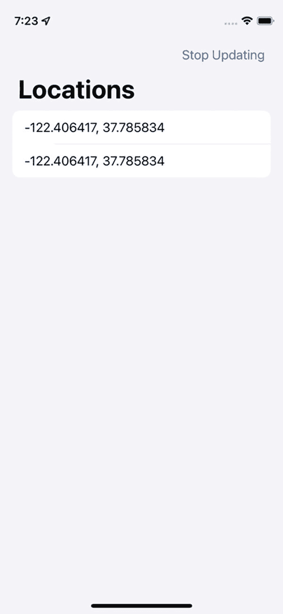

# 9. AsyncSequence

在 Swift 中，我们有*序列 (Sequences)* 的概念。形式上，`Sequence` 是一个协议，那些需要对其元素进行顺序和迭代访问的类型都依赖于此协议。数组遵循 `Sequence`，因为你可以通过 `for-in` 循环、`forEach` 方法以及像 `filter`、`map` 和 `reduce` 这样的高阶函数来遍历它们。你可以简单地使用数字索引（如 `myArray[2]`）来访问其元素。字典也非常相似。你可以像遍历数组一样遍历它们的键和值，要访问字典中的元素，你只需调用 `myDictionary[myHashableKey]`。集合的行为类似，你甚至可以实现自己的遵循 `Sequence` 的类型。

由新的并发系统提供的 `AsyncSequence` 协议，允许我们实现类似的功能，但针对的是异步类型。它是一个叠加了异步性的序列——`AsyncSequence`！


## AsyncSequence 简介

`AsyncSequence` 的行为与序列（Sequence）几乎一致。你可以对序列执行的所有操作几乎都能对它执行，从迭代到应用高阶函数。它与 `Sequence` 有一个关键区别：`AsyncSequence` 本身不存储任何值。它不像数组那样将数据存储在内存中。严格来说，它也不是一个值生成器。相反，`AsyncSequence` 只是一个接口，允许你在值随时间就绪时，立即访问它们。这些值是异步发出的，因此当它们可用时，你需要使用 `await` 来等待它们。

实际上，我们之前已经使用过 `AsyncSequence`。回到第 5 章，当时我们在讨论结构化并发时，学习了任务组。任务组允许我们运行数量不定的并发任务，并在一个使用了 `await` 的循环中观察它们的结果。回顾一下，代码清单 9-1 是我们当时使用的原始示例之一。

```
/// 下载数组中的所有图像，并返回本地文件的 URL 数组
func download(serverImages: [ServerImage]) async throws -> [URL] {
    var urls: [URL] = []
    try await withThrowingTaskGroup(of: URL.self) { group in
        for image in serverImages {
            group.addTask(priority: .userInitiated) {
                let imageUrl = try await self.download(image)
                return imageUrl
            }
        }
        for try await imageUrl in group {
            urls.append(imageUrl)
        }
    }
    return urls
}
代码清单 9-1
任务组使用 AsyncSequence 传递其结果
```

请注意 `"for try await..."` 这部分。这个 `for` 循环正在使用一个 `AsyncSequence`。我们不知道这个 `AsyncSequence` 的具体类型。我们只知道任务组正在运行数量不定的任务，并且随着它们完成，它们会向这个循环传递一个 `URL` 对象。在组中启动的每个任务完成下载之前，这些 `URL` 是不存在的。但这是如何实现的呢？为了理解 `AsyncSequence` 的工作原理，我们需要先了解序列的一般工作方式。

## 深入浅出序列与异步序列

`for-in` 循环——以及由此引申出的高阶函数——期望有一个 `Sequence` 来工作。`Sequence` 是一个带有一些约束的协议，感兴趣的类型必须采纳它。其中一个要求是实现一个返回迭代器的 `makeIterator()` 方法。理解迭代器对于理解序列工作原理的基础并非必不可少，因此现在你只需要知道，迭代器是遵循 `IteratorProtocol` 协议的类型，而该协议要求实现一个名为 `next()` 的方法，该方法返回序列泛型类型 `Element` 的可选实例。换句话说，如果你的序列是一个 `Int` 数组，`next()` 方法将返回一个可选的 Int（`Int?`）。在迭代过程中，循环的每次运行时都会调用此方法，直到没有更多元素可返回（直到它返回 `nil`）。

假设你有代码清单 9-2 中的数组，并且你对其迭代，在每次迭代中打印一个值。

```
let myArray = [1, 2, 3, 4, 5]
for item in myArray {
    print(item)
}
代码清单 9-2
声明一个数组并迭代它
```

这个 `for-in` 循环将运行 5 个元素，在每次迭代中，局部变量 `item` 将存储由 `next() -> Int?` 返回的一个值。一旦集合返回 `nil`，迭代就会停止，代码将开始在循环下方执行。简而言之，`for-in` 迭代仅仅是得益于 `Sequence` 符合性而提供的语法糖。

AsyncSequence 并没有那么不同。主要区别在于，它们没有 `makeIterator` 方法，而是有一个 `makeAsyncIterator` 方法，正如你可能已经猜到的那样，该方法返回一个遵循 `AsyncIteratorProtocol` 协议的迭代器。该迭代器要求你实现一个 `next() async -> Element?` 方法。因为 `next` 方法是 `async` 的，我们可以在 `for-in` 循环和高阶函数中使用它。

因此，Sequence 和 AsyncSequence 非常相似。主要区别在于，Sequence 确实存储其数据，而 AsyncSequence 则随时间从异步源传递数据；并且底层协议分别是非异步和异步的，以支持各自的功能。

## AsyncSequence 具体类型

有多种类型遵循 `AsyncSequence`。通常，你不需要关心底层类型，但了解这一点很有趣，因为这也与普通 Sequence 的操作方式不同。

每当你在 AsyncSequence 上调用高阶函数时，例如 `drop(while:)`、`filter`、`map` 和 `reduce`，都会返回一个全新的遵循 AsyncSequence 的类型。

如果你在异步序列上调用 `drop(while:)`，你将得到一个 `AsyncThrowingDropWhileSequence` 或 `AsyncDropWhileSequence`；使用 `filter` 将返回一个 `AsyncThrowingFilterSequence` 或 `AsyncFilterSequence`，以此类推，适用于你所执行的任何其他高阶函数。它们数量太多，无法一一列举，但你应该明白了。它们可以毫无问题地链式调用。当数组被改变时，普通序列会返回一个 `ArraySlice<Element>`，因为数组切片是被返回元素的“窗口”，它不包含新数据的副本，只是“查看”新数组中应包含的元素。由于 AsyncSequence 不包含数据，在原始序列上拥有“窗口”是没有意义的。相反，这些类型将限制或改变每次迭代中传递的内容，并完全跳过某些迭代。在返回新数据（如 `map`）的数组上的高阶函数，将返回普通的 `Element` 类型数组。


## AsyncSequence 示例

虽然我们之前已经使用过`AsyncSequences`，但我准备了一个不依赖任务组的示例。我们将使用`URL`对象的新增`lines`属性，该属性会打开一个文件，并逐行读取，每次迭代返回一行内容。

以下示例读取一个返回某些数据的真实 URL。作为参考，我们将逐行读取的文件内容列在清单 9-3 中。

```
The Legend of Zelda: Ocarina of Time|1998|10
The Legend of Zelda: Majora's Mask|2000|10
The Legend of Zelda: The Wind Waker|2003|10
Tales of Vesperia|2008|8
Tales of Graces|2011|9
Tales of the Abyss|2006|10
Tales of Xillia|2013|10
清单 9-3
我们将逐行读取的文件
```

我们有一个与 CSV 文件非常相似的文件。在解析时，我们将创建不同类型的`Videogame`对象，每个对象都包含标题、发行年份和评分。

每一行将被解析为一个`Videogame`对象，该对象定义在清单 9-4 中。

```
Struct Videogame {
let title: String
let year: Int?
let score: Int?
init(rawLine: String) {
let splat = rawLine.split(separator: "|")
self.title = String(splat[0])
self.year = Int(splat[1])
self.score = Int(splat[2])
}
}
清单 9-4
一个新的 Videogame 对象
```

现在让我们进入最有趣的部分。清单 9-5 将负责从 Web 服务器加载游戏数据，并将整个文件解析为一个`Videogame`数组。

```
Func loadVideogames() async {
let url = URL(string: "https://www.andyibanez.com/fairesepages.github.io/tutorials/async-await/part11/videogames.csv")!
var videogames: [Videogame] = []
do {
for try await videogameLine in url.lines {
if rawVg.contains("|") {
// 有效的游戏数据
videogames += [Videogame(rawLine: videogameLine)]
}
}
} catch {
// 处理错误
}
}
清单 9-5
从服务器逐行读取文件
```

我们通过声明指向文件位置的 URL 开始这个函数。然后，我们声明一个空的`[Videogame]`数组，每当有新游戏数据可用时，我们将它追加到这个数组中。

`for-in`循环等待`String`类型的行（`videogameLine`）。这是因为`url.lines`是一个`AsyncSequence`，我们需要对它进行`await`操作。

每次获取到`videogameLine`时，我们会检查它是否包含管道字符`|`，如果包含，我们将通过将这个原始行传递给`Videogame`初始化器来创建新的游戏对象。`Videogame`初始化器会解析这一行，并在每次迭代中创建一个`Videogame`实例，然后将其追加到`videogames`数组中。

我们需要在`do-catch`代码块中执行此操作，因为我们的文件位于远程服务器上，随时可能发生错误。

如果你已经使用 Swift 编程一段时间，你无疑会注意到我们可以在这里编写更优雅的代码。通过在`url.lines`上使用高阶函数，我们可以编写更符合惯用法的代码，使其更简洁。

在清单 9-6 中，我们为`loadVideogames`提供了一个新的实现，它使用了高阶函数。

```
Func loadVideogames() async {
let url = URL(string: "https://www.andyibanez.com/fairesepages.github.io/tutorials/async-await/part11/videogames.csv")!
let videogames =
url
.lines
.filter { $0.contains("|") }
.map { Videogame(rawLine: $0) }
do {
for try await videogame in videogames {
print("\(videogame.title) (\(videogame.year ?? 0))")
}
} catch {
}
}
清单 9-6
使用高阶函数创建游戏数组
```

现在，与普通序列不同，`videogames`数组不会立即生成。如果`lines`是一个非异步集合，那么`videogames`最终会是一个`Videogame`数组——`[Videogame]`或`Array<Videogame>`。

由于`lines`是一个异步序列，我们的`videogames`变量的类型不会是`[Videogame]`，而是`AsyncMapSequence<AsyncFilterSequence<AsyncLineSequence<URL.AsyncBytes>>, Videogame>`。

这就是为什么我之前说通常不需要关心`AsyncSequence`的具体类型，虽然这个签名看起来很复杂，但它很容易理解。从后往前看创建`videogames`变量的高阶函数：

1.  通过调用`map()`我们得到了`AsyncMapSequence`。
2.  通过调用`filter()`我们得到了`AsyncFilterSequence`。
3.  我们得到了`AsyncLineSequence`，也就是`URL`的`lines`属性的类型。

与普通的`Sequence`不同，`filter-map`操作在声明时并不会立即“启动”。相反，我们得到一个具体类型的`AsyncSequence`，之后需要将其提供给一个`for-in`循环。`AsyncSequences`只有在被用于`for-in`循环时才会“启动”。当你构建和链式组合异步序列时，你只是在构建一长串指令集，循环随后将使用这些指令集随时间逐步传递数据。你可以将其视为一个“查询”，它告诉循环在数据可用时应该提供什么。

如果你在另一个循环中使用同一个异步序列，你将立即获得数据，因为它会被缓存。`AsyncSequences`不会多次运行从异步源获取数据，因为那样效率非常低。

因此，清单 9-6 会同步运行，直到遇到循环本身。随着异步序列的执行，它可能会在每次迭代中多次暂停，从异步源获取数据。

随着你对`AsyncSequence`的进一步探索，你会发现它相比普通的`Sequence`有一些更多的限制。首先，你无法获取`videogames`中元素的`count`。这是因为该变量并没有存储数据——正如我们所说，它只是一种“查询”，告诉`for-in`循环在每次迭代中应返回什么。你必须在`for-in`循环中执行该序列，才能计算出它的`count`。其次，并非所有在普通序列中预期的高阶函数都可用。`dropFirst`就是一个例子。

因为`await`循环可以像普通循环一样处理，你可以执行在普通循环中能做的任何操作，包括使用`continue`和`break`语句来改变循环的执行。清单 9-7 使用了`continue`语句，仅打印评分为 10 的游戏。

```
For try await videogame in videogames {
if videogame.score == 10 {
continue
}
print("\(videogame.title) (\(videogame.year ?? 0))")
}
清单 9-7
在带 await 的循环中使用 continue 语句
```

在这个特定示例中，我们可以在`videogames`变量中增加一个新的`filter`调用。这样只会返回评分为 10 的游戏，而无需在循环中使用`continue`语句。清单 9-8 包含了消除`continue`语句所需的更改。

```
Let videogames =
url
.lines
.filter { $0.contains("|") }
.map { Videogame(rawLine: $0) }
.filter { $0.score != 10 } // 在此处应用过滤器
do {
for try await videogame in videogames {
print("\(videogame.title) (\(videogame.year ?? 0))")
}
} catch {
}
清单 9-8
在 videogames 库上调用更多高阶函数
```


### 支持`AsyncSequence`的原生 API

苹果在其 SDK 中新增了许多使用`AsyncSequence`的 API。`URL.lines`是其中之一，但还有更多。以下并非完整列表，而是我个人常用的几个：

*   `FileHandle.standardInput.bytes.lines`，可用于接收来自命令行或其他来源的输入。每条命令均通过`for-in`循环传递。
*   可通过 URL 访问`lines`和`resourceBytes`成员属性。本章探讨了`lines`的用法，而`resourceBytes`与之类似。
*   `URLSession`提供了`bytes(from:)`方法，可用于从网络逐字节下载数据。
*   `NotificationCenter`现在增加了 API，可通过`await`监听你感兴趣的新`notifications`。在`for-in`循环中接收通知，能大幅减少处理通知中心触发所需的逻辑。

## `AsyncStream`对象

本书探讨了如何迁移现有代码和模式，以使用现代并发系统的新特性。例如，我们将基于闭包的代码和基于委托的调用迁移为使用`async/await`，从而简化其使用方式。当存在随时间传递数据的异步数据源时，SDK 提供了大量通过委托和闭包接收数据流的 API。我们可以为这些数据流创建`AsyncSequence`包装器，使其在循环中传递数据。两个典型的例子是蓝牙（通过委托调用传递数据包）和 CoreLocation（同样通过委托调用传递坐标）。将它们封装在`AsyncStream`中，就能对外提供可在`for-in`循环中使用的 API，从而获得更自然的接口。

`AsyncStream`使我们能够实现适用于`for-in`循环的流式功能，而无需自行实现任何迭代器。我们可以用它来迁移基于委托和基于闭包的调用，使其改为在循环中接收数据。为此，`AsyncStream`遵循了`AsyncSequence`协议。

为了演示如何使用`AsyncStream`，我们将创建一个小项目，该项目会接收可用的 CoreLocation 数据并将其显示在 UI 中。

### `CoreLocationAsyncStream`项目

创建一个名为“CoreLocationAsyncStream”的新 SwiftUI 项目。该应用将接收位置信息，并在位置更新时将其显示在列表中。图 9-1 展示了最终产品的截图。


手机截图包含时间、WiFi 信号、满电电池图标，屏幕显示了“停止更新”和位置信息。

**图 9-1** UI 会随着新位置数据的到达显示一个位置列表

你可以使用基于委托的调用来构建此应用，但为了更深入理解`AsyncStream`和`AsyncSequence`的工作原理，我们将使用`AsyncStream`。同时，这也有助于让代码更整洁，并将所有与位置相关的逻辑集中管理。

#### `LocationUpdater`类

创建一个名为`LocationUpdater.swift`的新类。我们将使用此类管理与位置相关的所有事务，包括请求权限、获取位置更新以及将更新传递给订阅方。确保导入了`CoreLocation`，并为其添加代码清单 9-9 中列出的内容。

```
import Foundation
import CoreLocation

class LocationUpdater: NSObject, CLLocationManagerDelegate {
    private(set) var authorizationStatus: CLAuthorizationStatus
    private let locationManager: CLLocationManager

    override init() {
        locationManager = CLLocationManager()
        authorizationStatus = locationManager.authorizationStatus
        super.init()
        locationManager.delegate = self
        locationManager.desiredAccuracy = kCLLocationAccuracyBest
    }

    func start() {
        locationManager.startUpdatingLocation()
    }

    func stop() {
        locationManager.stopUpdatingLocation()
    }

    func requestPermission() async -> CLAuthorizationStatus {
    }

    // MARK: - 位置委托

    func locationManager(_ manager: CLLocationManager, didUpdateLocations locations: [CLLocation]) {
    }

    func locationManagerDidChangeAuthorization(_ manager: CLLocationManager) {
        authorizationStatus = manager.authorizationStatus
    }
}
```

**代码清单 9-9** `LocationUpdater`类的初始部分

##### 请求位置使用权限

在遵循以下步骤之前，请确保已在`Info.plist`文件中添加了`NSLocationWhenInUseUsageDescription`（隐私 - 位置使用描述）键。这是一个面向用户的字符串，用于解释为何需要跟踪用户位置。

`CoreLocation`通过委托调用传递授权状态的变化。我们可以借此机会使用续体（continuations）来处理。没错，这正是我们在第 3 章中学到的续体。

首先，添加一个属性来跟踪将传递授权状态的续体。代码见清单 9-10。

```
private var permissionContinuation: CheckedContinuation?
```

**代码清单 9-10** 此属性将帮助我们桥接委托调用与`async/await`之间的权限状态变更

回到空的`requestPermission()`方法，并用代码清单 9-11 中的代码补全它。

```
func requestPermission() async -> CLAuthorizationStatus {
    locationManager.requestWhenInUseAuthorization()
    if authorizationStatus != .notDetermined {
        return authorizationStatus
    }
    return await withCheckedContinuation { continuation in
        permissionContinuation = continuation
    }
}
```

**代码清单 9-11** 启动续体以获取位置访问的授权状态

我们仅在授权状态为`.notDetermined`时请求权限。如果状态不同，则立即返回。原因在于，当你初始化`CLLocationManager`对象时，系统会自动请求权限。如果在系统正在获取授权状态时调用请求方法，你将在未调用`resume`的情况下丢弃续体，从而导致死锁。这是少数可能发生死锁的情况之一（如果你启动了一个续体但在恢复之前它消失了）；好消息是，在运行应用进行测试时，这个错误很容易被发现。

你还需要在`locationManagerDidChangeAuthorization`委托方法中添加一行代码。该方法的完整实现见代码清单 9-12。

```
func locationManagerDidChangeAuthorization(_ manager: CLLocationManager) {
    authorizationStatus = manager.authorizationStatus
    permissionContinuation?.resume(returning: authorizationStatus)
}
```

**代码清单 9-12** 当授权状态变化时，我们将恢复续体

在本应用中，我们只关心在程序运行时权限变更一次的情况。但更好的做法是设置一个无限循环，持续报告授权变更。我们可以使用`AsyncStream`来实现这一点，每次委托方法被调用时发送位置授权更新，并且永不调用`finish()`。当状态变化时，我们用新状态恢复`permissionContinuation`，这样依赖它的`await`调用就能继续执行。

使用`async/await`异步请求权限，只需完成以上步骤。代码清单 9-13 展示了如何使用此逻辑请求权限。

```
let locationUpdater = LocationUpdater()
// ...
let authorized = await locationUpdater.requestPermission()
if [CLAuthorizationStatus.authorizedAlways, .authorizedWhenInUse].contains(authorized) {
    // 权限已授权
}
```

**代码清单 9-13** 使用`requestPermission`方法异步请求位置访问权限


##### 在循环中接收位置信息

现在让我们实现接收位置对象的逻辑。

在内部，`AsyncStream` 通过延续（continuation）机制工作。其核心理念是：当你创建一个 `AsyncStream` 时，它会为你提供一个延续，你可以通过该延续发送任意数量的、你所关注类型的事件。在本项目中，我们将发送 `CLLocation` 类型的对象。这些延续的类型与我们之前在第 3 章学到的并不完全相同，但行为非常相似。主要区别在于，第 3 章中的延续必须且仅能恢复一次，而 `AsyncStream` 的延续可以调用任意次数的 `yield()` 来产出对象。当你完成所有操作后，需要调用 `finish()` 使序列返回 `nil`，从而终止循环。如果不调用 `finish()`，你的 `for-in` 循环将永远不会结束——除非被显式取消。在某些场景下这可能是你期望的行为，但在其他场景中则会类似死锁。

添加一个用于保存 `AsyncStream` 延续的属性。你可以在代码清单 9-14 中看到它。

```
private var streamContinuation: AsyncStream.Continuation?
代码清单 9-14 为我们的 CLLocation AsyncStream 创建延续
```

`AsyncStream` 的泛型类型定义了 `for-in` 循环在每次迭代中将接收哪种类型的对象。在本例中，该类型为 `CLLocation`。

接下来，我们将实现一个 `locations` 属性。其类型将是 `AsyncStream<CLLocation>`。`for-in` 循环将使用此属性来获取可用时的新位置对象。将代码清单 9-15 中的代码添加到 `LocationUpdater` 类中。

```
var locations: AsyncStream {
    let stream = AsyncStream(CLLocation.self) { continuation in
        continuation.onTermination = { @Sendable _ in
            self.stop()
            self.streamContinuation = nil
        }
        self.streamContinuation = continuation
        self.start()
    }
    return stream
}
代码清单 9-15 我们可以使用 locations 属性实时获取 CLLocation 对象
```

创建 `AsyncStream` 时，你需要定义它将接收哪种类型的对象。我们将流式传输 `CLLocation` 对象，因此使用 `CLLocation.self`。初始化器还接收一个闭包，该闭包会提供流的延续，其类型为 `AsyncStream<CLLocation>.Continuation`。我们可以在延续上设置一个可选的 `onTermination` 闭包，该闭包将在我们对 `AsyncStream` 调用 `finish()` 后被调用。如果你需要关闭数据管道或执行任何其他类型的清理工作，请使用此闭包。在本项目中，如果用户按下按钮选择不再接收位置更新，我们将通知位置管理器停止追踪位置。请注意，延续被标记为 `@Sendable`。这意味着该闭包可以在不同的并发域中安全使用。如果不这样标记，你将无法阻止 `locationManager` 传递更新。

下一行将延续赋值给我们的 `streamContinuation` 变量。我们需要保留此变量，因为位置事件是通过代理方法传递的。配置好延续后，我们可以通过调用 `start()` 方法开始追踪用户的位置。这将启动 `locationManager` 发送位置更新的能力。

现在，`locations` 变量可以实时传递 `CLLocation` 对象了，但工作尚未完全完成。我们还没有正确调用 `finish()` 方法，因此这个循环永远不会结束，而且实际上也并未在任何地方传递位置对象。

当 `stop()` 方法被调用时，我们将停止流式传输。修改此方法，使其看起来像代码清单 9-16 中的代码。

```
func stop() {
    locationManager.stopUpdatingLocation()
    streamContinuation?.finish()
}
代码清单 9-16 结束延续
```

当我们调用 `finish()` 时，延续的 `onTermination` 闭包也将被调用。在这个特定示例中，`stop()` 触发 `onTermination`，而 `onTermination` 又调用 `stop()`，这看起来可能有些奇怪。我们这样做是因为，如果运行 `for-in` 循环的 `Task` 被取消，我们也希望停止接收位置。你可以在 `onTermination` 中直接调用 `locationManager.stopUpdatingLocation()`，但我更倾向于调用我们自己的 `stop()` 方法这种惯用做法。因为我们在 `onTermination` 中将 `streamContinuation` 设置为 `nil`，所以这里不存在递归调用的风险。

现在我们可以对 `locationManager(_ manager: CLLocationManager, didUpdateLocations locations: [CLLocation])` 进行必要的修改。我们需要将接收到位置传递给延续。代码清单 9-17 展示了其最终实现。

```
func locationManager(_ manager: CLLocationManager, didUpdateLocations locations: [CLLocation]) {
    locations.forEach { streamContinuation?.yield($0) }
}
代码清单 9-17 将位置对象传递给延续
```

你可能已经注意到，代理给我们的是一个位置对象的数组。每次调用此方法时，它可能包含多个对象。因此，我们将遍历接收到的对象数组，并在每次调用时将每个对象 `yield()` 给延续。至此，我们完成了 `LocationUpdater` 的功能。调用者现在可以使用 `locations` 属性在循环中实时接收事件。

代码清单 9-18 展示了调用者如何在 `for-in` 循环中使用此对象来接收位置信息。

```
self locationUpdater = LocationUpdater()
//... 在确认已授权之后。
for await newCoordinate in locationUpdater.locations {
    // 对接收到的 newCoordinate 对象进行处理。
}
代码清单 9-18 使用 locations AsyncStream
```


### 完成项目

现在可以继续编写应用的其他部分。打开 `ContentView.swift` 文件，在其中创建 `ContentViewViewModel` 类。如果你愿意，也可以将其创建在另一个文件中。它的整个实现较小，因此我将所有代码放在代码清单 9-19 中。

```
@MainActor
class ContentViewViewModel: ObservableObject {
@Published private(set) var locations: [CLLocation] = []
let locationUpdater = LocationUpdater()
func startUpdating() async {
let authorized = await locationUpdater.requestPermission()
if [CLAuthorizationStatus.authorizedAlways, .authorizedWhenInUse].contains(authorized) {
for await newCoordinate in locationUpdater.locations {
locations += [newCoordinate]
}
}
}
func stopUpdating() {
locationUpdater.stop()
}
}
代码清单 9-19
用于显示位置的视图的 ViewModel
```

我们将整个类设置为在 `@MainActor` 上运行，因为它可以更新 UI。视图将读取 `@Published locations` 属性，以在列表中显示它们。

`startUpdating` 方法将启动接收位置的操作。它会先异步请求跟踪用户位置的权限。一旦获得权限，我们将在循环中访问 `locationUpdater` 的 `locations` 属性。这是我们之前创建的 `AsyncStream<CLLocation>`。`AsyncStream` 是一个 `AsyncSequence`，因此我们可以使用 `await` 对其进行迭代。这个循环将无限运行，直到调用 `stopUpdating` 方法，该方法会导致序列返回 `nil`，从而结束循环。

最后，我们可以实现 UI。UI 也相对较小，因此我可以将其发布在一个代码清单中。代码清单 9-20 展示了我们完成的 UI。

```
@MainActor
struct ContentView: View {
@StateObject var viewModel = ContentViewViewModel()
var body: some View {
NavigationView {
List(viewModel.locations, id: \.hash) { location in
Text("\(location.coordinate.longitude), \(location.coordinate.latitude)")
}
.navigationTitle("位置")
.task {
await viewModel.startUpdating()
}
.navigationBarItems(
leading: EmptyView(),
trailing: Button("停止更新") {
viewModel.stopUpdating()
}
)
.navigationViewStyle(.stack)
}
}
}
代码清单 9-20
应用的 UI
```

我们完成了！我们使用 `.task` 修饰符来调用视图模型的 `startUpdating` 方法。`.task` 会在视图出现时被调用，并在视图消失时被取消，因此在处理并发时使用它非常有用。“停止更新”按钮将停止流。

你可以下载已完成的名为“`CoreLocationAsyncStream`”的项目。

### `AsyncThrowingStream` 对象

与新的并发系统中的许多对象一样，`AsyncStream` 也有其抛出变体，当你循环可能抛出错误时可以使用。这个对象是 `AsyncThrowingStream`，并且使用起来与 `AsyncStream` 一样简单。

你可以 `yield` 值，正常 `finish`，或通过 `finish(with:)` 抛出错误来结束。如果你使用 `AsyncThrowingStream`，你将需要使用 `for try await` 循环。

## 总结

在本章中，我们学习了 `AsyncSequence`。`AsyncSequence` 几乎与普通的 `Sequence` 相同，区别在于它们与新的并发系统一起工作。`AsyncSequence` 可以在 `for-in` 循环中随时间传递数据，直到底层源决定发送 `nil` 值。虽然你可以使用许多高阶函数（例如 `filter`、`map` 和 `reduce`），但这些操作不会启动，直到你在循环中使用 `AsyncSequence`，这与 `Sequence` 不同，后者在链式调用时操作会自动触发。

我们还学习了 `AsyncStream`。我们可以使用 `AsyncStream` 将基于闭包或基于代理的调用（随时间传递数据）桥接到 `async/await` 世界。我们探讨了如何将其与 `CoreLocation` 框架一起使用，以及在使用此对象时需要注意的事项。`AsyncStream` 是一个 `AsyncSequence`，因此你可以对 `AsyncSequence` 做的所有事情，都可以对 `AsyncStream` 做。如果你的序列可能抛出错误，你可以使用 `AsyncThrowingStream` 代替 `AsyncStream`。

