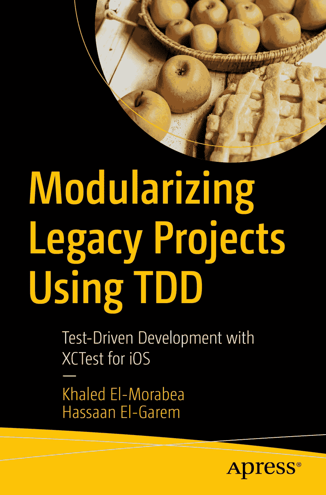

ISBN 978-1-4842-7427-9 e-ISBN 978-1-4842-7428-6 [`doi.org/10.1007/978-1-4842-7428-6`](https://doi.org/10.1007/978-1-4842-7428-6) © Khaled El-Morabea and Hassaan El-Garem 2021 本作品受版权保护。所有权利均由出版商独家许可，无论涉及材料的全部或部分，具体包括翻译、重印、插图重用、朗诵、广播、微缩胶片复制或任何其他有形方式的权利，以及以电子方式改编、计算机软件或目前已知或今后开发的类似或不同方法进行传输或信息存储与检索的权利。在本出版物中使用通用描述性名称、注册商标、商标、服务标记等，即使在缺乏明确声明的情况下，也不意味着这些名称不受相关保护性法律和法规的约束，因此可随意使用。出版商、作者和编辑可合理假设，本书所载的建议和信息在出版之日被认为是真实和准确的。出版商或作者或编辑均不对本书所载材料或可能存在的任何错误或遗漏提供明示或暗示的保证。在已出版地图和机构归属方面的管辖权主张上，出版商保持中立。

本 Apress 印记由注册公司 APress Media, LLC（Springer Nature 的一部分）出版。

注册公司地址为：1 New York Plaza, New York, NY 10004, U.S.A.

当我开始撰写本书时，正值疫情中期，我们的家庭也迎来了新成员——诺亚。那是一段艰难的时期。想象一下，在疫情期间养育新生儿，同时还要遵守所有居家限制，却又要专注于撰写你的第一本书。因此，我想将本书献给我的妻子亚斯米娜——没有她的帮助和支持，这一切都不可能实现。还要献给我的父母胡达和穆罕默德——没有他们持续的支持和爱，我无法走到今天。

——Khaled El-Morabea

献给我的姐姐拉娜，是她推动我接受了这个既充满挑战又令人满足的项目。还要献给我的父母萨哈尔和萨利赫，感谢他们无尽的爱和急需的情感支持。以及献给阿雅，没有她的爱和支持，这本书永远无法问世。

——Hassaan El-Garem

