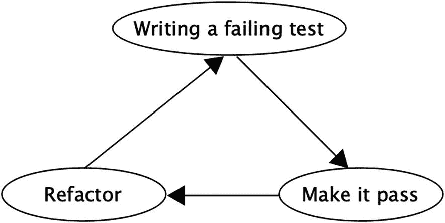
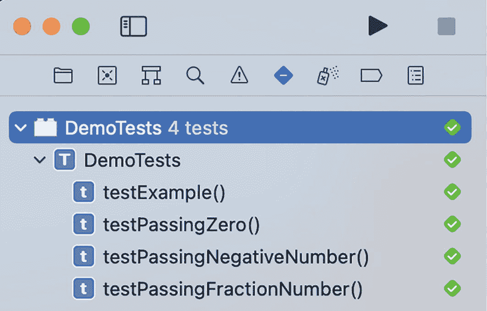

# 1. TDD 基础

开发者是工匠，是充满激情驱动的技艺精湛之人。大多数开发者热爱自己的谋生之道，以至于许多人在业余时间将编码作为第二爱好。他们为自己开发的作品感到自豪，并为工作设定高质量标准。没有什么比发布运行良好并满足用户期望的新代码感觉更棒了。这里的用户可能是客户，也可能是编写代码的开发者本人。认识到这一点很重要，它设定了开发者作为希望产出高质量成果之人的意图。

众所周知，包括你在内的每个人都希望自己的软件项目达到最高质量。然而，达到这一标准并非易事，而维持它甚至更加困难。假设你开发了一个 MVP（最小可行产品）并发布了。在大多数情况下，这并不是故事的终点。你很可能会继续为其添加功能。在某个时刻，你甚至会意识到需要重写大部分代码，或者用另一个依赖替换当前的依赖。这些持续的变化最终会损害项目的质量。即使是修复错误也可能对你的质量造成影响。修复一个错误却导致它在别处引发另一个更严重的错误，这种情况非常常见。那么，我们如何才能达到并维持高质量标准呢？我们需要持续获得反馈，告知我们更改是否引入了任何问题。那么，我们又如何获得这种反馈呢？答案很简单：测试。

## 测试类型

你可以利用不止一种测试类型来解决这些问题。我们将讨论的第一个解决方案是手动测试。手动测试是一种由测试人员或开发者直接手动执行测试用例的测试类型。在很多情况下，手动测试被认为是软件周期中不可或缺的一部分。优秀的测试人员通常善于思考高度非典型的场景，这最终有助于发现隐藏的错误。

人类是神奇的生物。然而，对于任何规模的系统，仅依赖手动测试由于多种原因是非常不切实际的。由于人类速度有限，依赖手动测试最终会拖慢发布流程，并阻碍系统的扩展能力。此外，无论测试人员多么出色，他们仍然容易犯人为错误。例如，在某些上下文中，将数字“0”与字母“O”混淆可能是一个重大错误的迹象，但许多人可能会忽略这一点。最后但同样重要的是，如果只依赖手动测试，你的测试预算会让你付出惨痛的代价。

既然不能只依赖手动测试，我们就需要将自动化测试引入流程中。自动化测试解决了手动测试的所有问题。它速度快——机器可以在毫秒内运行一个测试。它准确——机器不会犯人为错误，除非编写测试的人犯了错误。从长远来看，它成本低廉。只有创建测试的成本较高，但之后运行测试的成本几乎为零。通常，手动测试和自动化测试的结合能产生最佳效果。但在许多情况下，当项目足够小时，我们实际上可以完全依赖自动化测试。


## 自动化测试的困境

引入自动化测试能让你和测试人员对项目更有信心。它能立即验证所有基本需求是否得到满足，同时让测试人员可以专注于发现那些隐藏的缺陷。然而，许多开发者认为编写自动化测试是一项枯燥的活动。我们见过很多这样的案例：开发者在项目启动时本意是要编写测试，但一旦项目真正开始运转，他们就放弃了添加测试。其主要原因就是他们就是不喜欢添加测试。

即使你能够硬着头皮坚持编写测试，或者你属于少数觉得测试很有趣的人，你仍然可能写出糟糕或不必要的测试。为了看到对质量的直接积极影响，我们需要确保测试本身的质量。是的，测试也有质量。就像我们会有糟糕的代码一样，我们也可能会有糟糕的测试。毕竟，测试也是代码。另一个需要考虑的点是我们的测试有多相关。更高的测试覆盖率并不意味着我们的代码得到了充分的测试。我们可能添加了许多无用的测试。例如，我们可能为未使用的代码添加测试，或者添加多个测试来测试同一件事，甚至添加永远不会失败的测试，比如测试 getter 和 setter 方法。

我们需要为正确的组件编写正确且高质量的测试。这就是**测试驱动开发**（TDD）的用武之地。它能帮助我们实现这一目标，并且做得更多。

## TDD 概述

TDD 的本质是一个非常简单的编程过程。它仅包含四个步骤（图 1-1）。



图 1-1

TDD 周期

1. 编写一个失败的测试。
2. 使测试通过。
3. 重构。
4. 重复。

这个周期被称为 TDD 周期。这个流程可以说是确保任何项目高质量的最佳方式。这是因为它能确保你的代码被测试完全覆盖，因为代码的编写是**测试驱动**的。

这个周期通常用颜色代码表示：

1. **红色**：编写一个失败的测试。由于你在此之前什么代码都还没写，这个测试自然就会失败。
2. **绿色**：编写最少的代码让你的测试通过。
3. **重构**：如果需要，清理你的测试和代码，使其达到标准。
4. **重复**：再次进行这个周期。这就是它被称为周期的原因。我们只有在所有需求都实现后才会停止。

之所以用颜色编码，是因为这些颜色与大多数编辑器（包括 Xcode）显示测试结果的方式相对应：

* 失败的测试显示为红色。
* 通过的测试显示为绿色。

## 为什么要使用 TDD？

我们已经提到了编写测试时的一些棘手问题。开发人员中最常见的问题是编写测试是多么枯燥和令人失去动力。许多人难以理解为什么要为他们自己编写的代码编写测试。即使他们能够克服这一点并看到测试的价值，他们也可能会写出糟糕的测试。我们不能责怪他们。做自己不享受的事情时表现不佳是正常的。

这正是 TDD 改变游戏规则的地方。TDD 将测试从一项枯燥的实践转变为一种设计活动。通过在编写代码之前编写测试，TDD 重新定义了我们对测试的看法。我们不再仅仅用测试来验证我们刚写的代码是否有效（同时心里清楚它很可能有效，因为我们刚写完它）。在 TDD 中，我们用测试来思考我们希望代码做什么以及如何实现它。

正如我们之前提到的，并非所有的测试都是好测试。TDD 有助于确保我们测试的质量。对我们来说，当一个测试遵循了 Bob Martin 叔叔在其著名著作《代码整洁之道》中定义的 FIRST 原则时，我们就认为它是一个好测试。FIRST 是一个首字母缩略词，每个字母对应一条规则：

* **F**ast（快速）：测试需要快速执行。使用 TDD，我们在每一步都运行测试，这促使我们编写快速的测试。如果我们的测试很慢，比如每个测试耗时 1 秒，并且我们在开发过程中不断添加测试，这最终会打击我们运行测试套件的积极性。如果我们最终陷入这种状态，那就意味着这不再是 TDD 了。因此，为了持续使用 TDD，我们总是被鼓励保持测试的快速。
* **I**ndependent（独立）：测试之间不应相互依赖。在 TDD 中，我们总是在继续下一步之前运行所有测试，以确保所有测试都通过。这确保了一个测试即使与其他测试一起运行时也能通过。
* **R**epeatable（可重复）：测试应该在任何环境中都可重复。正如我们刚才提到的，在 TDD 中，我们在每一步都不断运行所有测试。这确保了我们的测试始终能够通过，并迫使我们让测试不受任何外部因素的影响。
* **S**elf-validating（自验证）：测试应该有一个布尔输出，要么通过，要么失败。TDD 的第一步是编写一个失败的测试。然后我们添加代码使其通过。这证明了测试既可以失败也可以通过。一个总是通过的测试是反直觉的，并且只是在浪费时间。
* **T**imely（及时）：测试应该在编写代码之前立即编写。这基本上就是 Bob 叔叔在告诉你：“使用 TDD！”

除了是一个好测试之外，测试还需要是相关的并且能增加价值。使用 TDD，我们在编写代码之前编写测试。因为我们编写的每个测试都直接对应于代码中某一部分的验收标准，这让我们相信我们添加的测试确实是有价值的。

## 外部质量与内部质量

我们项目的质量分为两个部分：外部质量和内部质量。外部质量是指系统满足客户期望的程度。在外部质量方面，我们关心的是我们的应用是否功能正常，并为最终用户提供预期的体验。我们还关心我们的应用是否可靠、响应迅速等。另一方面，内部质量是指系统满足开发者期望的程度。在内部质量方面，我们关心的是内部组件在不同情况下的行为方式。我们还关心我们的代码是否易于理解、更改、扩展等。

使用 TDD 时，你总是首先考虑需求，为其编写测试，然后再考虑实现。这让我们高度确信我们的测试能够正确验证最终需求。换句话说，它维护并保持了外部质量。在内部质量方面，TDD 的每一步都帮助我们收集关于设计和实际实现的反馈。正如你将在后续章节中看到的，我们总是用测试完全覆盖每个组件。这确保了每个内部组件的运行符合预期。它同时也维护了代码本身的质量，因为使用 TDD 开发会迫使你在每一步不断地重新思考你的设计。首先必须编写一个失败的测试，这鼓励我们编写松耦合的代码，以便于测试。因此，测试优先的思考方式直接有助于我们设计的质量，并且在每个周期中，它推动我们在必要时编写结构更优的代码。

## 何时使用 TDD？

你可以在项目生命周期的任何阶段使用 TDD。你可以将其用于新项目，也可以用于老旧的传统项目。我们强烈建议在可能的情况下使用 TDD。最佳情况是在一个全新项目中使用 TDD 并坚持下去。这样你才能真正感受到拥有一个全面测试套件的好处，并收获 TDD 的全部回报。我们也可以使用 TDD 来指导向传统应用添加新功能的过程。我们甚至可以使用 TDD 来指导传统应用内部部分代码的重构。


## 何时不应使用 TDD？

这个问题的答案具有主观性。在几乎所有情况下，使用 TDD 都是有意义的。然而，某些用例并不值得采用 TDD。TDD 的优势在长期项目中最为明显。因此，如果你正在做一个短时间就能完成的小项目，并且之后不会再重访，那么为了追求速度而跳过 TDD，只在之后添加测试，甚至完全不添加测试，或许也是合理的。这完全取决于项目的性质。归根结底，TDD 是一种工具，是否在需要时使用它，完全取决于你自己。

#### 重构

我们之前已经多次提到重构。它是 TDD 循环中的第三步。那么，什么是重构呢？重构是指在不改变代码外部行为的前提下，改变内部代码结构或编写方式的过程。重构总是通过一系列小的、迭代的步骤来完成。每一步都应该增强我们代码的结构，同时又要足够小，以便于理解。一个有意义的小型重构示例是将一段代码移动到一个新的辅助函数中，或者将其提取到一个新类中。虽然这看起来微不足道，但当执行了无数个小重构后，我们最终会开始看到它们对代码产生的影响。每应用一次修改，我们都可以通过运行测试来确保它不会破坏任何东西——当然，前提是我们一直在使用 TDD。

## 模块化

术语“模块化”指的是将一个系统划分为多个相对独立、可互换且具有明确定义接口的模块。每个模块都足够小巧和简单，以便被充分理解和广泛测试；每个模块都包含了执行其预定功能所需的一切。我们在设计系统时可以追求模块化的方法，而使用 TDD 会鼓励我们这样做。然而，如果我们有一个非模块化的系统，我们仍然可以通过重构来使其模块化。一个非模块化的应用程序，就其本质而言，会包含大量代码坏味，不可测试，并且更难以维护。你将在后续章节中学习更多关于如何通过使用 TDD 对遗留应用进行模块化的过程。在本章剩余部分，让我们先看一些 TDD 实战的例子，从测试结构开始。

## 测试结构

在我们开始使用 TDD 编写测试之前，先谈谈我们将如何组织测试结构。一个适用于所有测试的良好结构如下：

1.  设置测试数据。
2.  调用被测方法。
3.  断言返回了预期结果。

记住这种模式的一个更简单的方法是“给定”、“当”和“那么”三元组，它受行为驱动开发（BDD）的启发，其中 *给定* 反映测试准备，*当* 反映方法调用，*那么* 反映断言部分。

这种模式确保了你的测试保持一致性且易于阅读。除此之外，按照这种结构编写的测试往往更短小、更清晰。在本书的所有测试中，我们都将使用这种结构。

## 让我们实践 TDD

现在，让我们举一个例子，并尝试使用 TDD 来实现它。请打开本章的入门项目。你可以在本章的资源中找到它。我们想创建一个税收计算器，它能在原始工资中减去 30% 的税后计算出净工资。让我们从第一步开始：编写测试。我们的第一个测试可以像这样：

```
func testExample() throws {
//  Given
let calculator = TaxCalculator()
}
```

最终，一个测试代表一个需求，而上述测试描述了我们最基本的需求：存在一个名为 `TaxCalculator` 的类。因为这一行代码甚至无法编译，你可能会认为我们走错了方向，但实际上我们已经完成了第一步：我们编写了一个失败的测试。

进入第二步，让我们用最少的代码让这个测试通过。为此，我们需要添加以下代码：

```
class TaxCalculator: NSObject {
}
```

现在，如果运行我们的测试，它会通过，这意味着我们完成了第二步。现在进入第三步，检查是否有需要重构的地方。现在还没有，因为我们只写了两行代码。

既然我们已经完成了这三个步骤，接下来要做的就是重复 TDD 循环。让我们先给测试添加一个新的需求，使其失败。下一个需求是，`TaxCalculator` 中有一个函数，它接收工资并计算净工资。当我们把这个需求翻译成代码时，测试会变成这样：

```
func testExample() throws {
//  Given
let calculator = TaxCalculator()
// When
let netSalary = calculator.calculate(100)
}
```

现在让我们通过修改 `TaxCalculator` 来修复这个测试，但同样要使用最少的代码。所以基本上我们只需要这样做：

```
class TaxCalculator: NSObject {
public func calculate(salary: Int) -> Int {
return 0
}
}
```

现在测试通过了，并且不需要重构，让我们再重复一次循环。这次我们将添加对函数输出的断言需求：

```
func testExample() throws {
//  Given
let calculator = TaxCalculator()
// When
let netSalary = calculator.calculate(100)
// Then
XCTAssertEqual(netSalary, 70,
"Net salary failed")
}
```

如果你运行这个测试，它会失败，这正是我们所期望的。但在修复测试之前，我们需要测试一个关键点。如果你在项目工作中看到消息 `"Net salary failed"` ，你认为自己能知道项目当前的问题所在，还是需要去调试？如果答案是否定的，那么你需要编写一个描述性的消息，以帮助任何参与此项目的人（可能是未来的你自己）知道他们刚刚破坏了什么：

```
func testExample() throws {
//  Given
let calculator = TaxCalculator()
// When
let netSalary = calculator.calculate(salary: 100)
// Then
XCTAssertEqual(netSalary, 70,
"Net salary should be 70$ when you subtract 30% taxes from 100$")
}
```

如果你看到 `"Net salary should be 70$ when you subtract 30% taxes from 100$"` ，你将确切地知道问题是什么，以及需要检查哪个方法。

现在我们需要编写使测试通过的代码。添加代码后，它应该像这样：

```
class TaxCalculator: NSObject {
public func calculate(salary: Int) -> Int {
return salary - ((salary * 30)/100);
}
}
```

运行测试后，测试现在通过了，并且我们仍然不需要重构（图 1-2）。


图 1-2

`testExample` 通过


## TDD 的极致运用

我们在入门部分快速了解了 TDD 的基本概念。但要让 TDD 显著提升你的代码质量，你需要改变对测试用例的思考方式。测试用例不应只是理想场景，它们还应该覆盖边界情况。大多数情况下，你编写的代码只能满足所有理想场景。让我们尝试改进测试用例。你需要思考如何"破坏"它。如果有人传入一个分数怎么办？如果有人传入一个负值怎么办？如果有人传入零值怎么办？

我们将用完全相同的步骤来处理这些情况。先以分数场景为例，编写一个测试：

```
func testPassingFractionNumber() throws {
//  给定
let calculator = TaxCalculator()
// 当
let netSalary = try calculator.calculate(salary: 0.5)
// 则
XCTAssertEqual(netSalary, 0.35,
"当从 0.5$中扣除 30%税款后，净薪资应为 0.35$")
}
```

现在要修复这个测试，我们需要执行以下操作：

```
class TaxCalculator: NSObject {
public func calculate(salary: Double) throws -> Double {
return salary - (salary * 0.3);
}
}
```

仍然不需要重构，所以我们再重复一次。现在考虑零值和负值的情况。在这些情况下我们可能需要抛出错误。这正是我们要在测试中体现的内容：

```
func testPassingNegativeNumber() throws {
//  给定
let calculator = TaxCalculator()
// 当
do {
_ = try calculator.calculate(salary: -1)
} catch let caughtError as TaxCalculatorError {
// 则
XCTAssertEqual(caughtError,  .negativeSalaryError, "传入负数薪资时应抛出错误。")
}
}
func testPassingZero() throws {
//  给定
let calculator = TaxCalculator()
// 当
do {
_ = try calculator.calculate(salary: 0)
} catch let caughtError as TaxCalculatorError {
// 则
XCTAssertEqual(caughtError,  .zeroSalaryError, "传入零薪资时应抛出错误。")
}
}
```

应用第二步后，我们的类看起来像这样：

```
enum TaxCalculatorError: Error {
case negativeSalaryError
case zeroSalaryError
}
class TaxCalculator: NSObject {
public func calculate(salary: Double) throws -> Double {
if salary < 0  {
throw TaxCalculatorError.negativeSalaryError
}
if salary == 0  {
throw TaxCalculatorError.zeroSalaryError
}
return salary - (salary * 0.3);
}
}
```

现在所有测试都通过了，我们可以进入第三步。我们可以将错误处理重构为辅助函数：

```
enum TaxCalculatorError: Error {
case negativeSalaryError
case zeroSalaryError
}
class TaxCalculator: NSObject {
public func calculate(salary: Double) throws -> Double {
try handleErrors(salary: salary)
return salary - (salary * 0.3);
}
private func handleErrors(salary: Double) throws {
if salary < 0  {
throw TaxCalculatorError.negativeSalaryError
}
if salary == 0  {
throw TaxCalculatorError.zeroSalaryError
}
}
}
```

每次重构后，我们只需运行测试，确保没有破坏任何功能（图 1-3）。



图 1-3

所有测试通过

## 练习

`TaxCalculator` 目前是通过扣除一个固定百分比（始终为 30%）来计算薪资。作为练习，请尝试让这个百分比变得动态，即我们可以向 `calculate` 函数传入薪资和自定义百分比。同时希望保留 30%作为默认值。

## 总结

未经测试的代码本质上是一颗定时炸弹，随时可能以 Bug 和崩溃的形式爆炸。即使是最微小的改动也可能引入回退问题。而这些回退问题只有通过测试才能被发现。我们发现不能完全依赖人工测试，需要充分利用自动化测试。

尽管编写测试具有巨大价值，并且直接贡献于项目质量，但大多数开发者并不这样做。这是因为对许多开发者来说，编写测试相当枯燥。他们宁愿编写实际代码，也不愿为刚刚编写的代码写测试。然而，有一种开发方式彻底改变了我们对测试的看法，那就是**测试驱动开发（TDD）**。

TDD 是在编写代码之前先编写测试的过程。这样做可以使项目获得高测试覆盖率。TDD 将编写测试的过程从枯燥的苦差事转变为有趣的设计活动。由于在编写代码之前必须先写测试，测试现在成为定义需求的一种方式，并帮助我们思考如何实现这些需求。

TDD 对我们项目中的测试数量有直接且显著的影响。我们在编写任何代码之前就添加一个测试，这意味着我们所有的代码都会被测试覆盖。在一个测试覆盖率高的代码库上工作可以改变开发体验。它能够高效地捕获回退问题，并通过非常快速的反馈循环，让开发者在每次改动时都充满信心。

TDD 不仅影响我们的测试覆盖率，有助于维护外部质量，还直接影响代码质量。在编写代码之前先写测试，能让我们清晰地思考代码应该做什么以及如何实现。而且，先编写测试也迫使我们编写可测试的代码，这反过来转化为具有良好设计的松散耦合代码。

我们可以在各种场景中使用 TDD。我们可以在新项目一开始就使用它，或者在向旧版遗留项目添加新功能时使用。在尝试重构旧代码的某些部分时，甚至在尝试模块化遗留应用时，我们也可以应用 TDD。

TDD 的流程非常简单。只有三个步骤。首先，我们编写一个失败的测试。为了编写失败的测试，我们需要思考代码应该做什么，并将这个需求转化为测试。第二步是编写尽可能少的代码来让这个测试通过。最后，当我们有一个通过的测试时，开始思考是否可以通过任何方式改进代码，无论是设计变更还是实现变更。完成第三步并确信我们的改动（如果有的话）没有导致任何测试失败后，我们再次回到第一步，寻找可以转化为失败测试的新需求。

