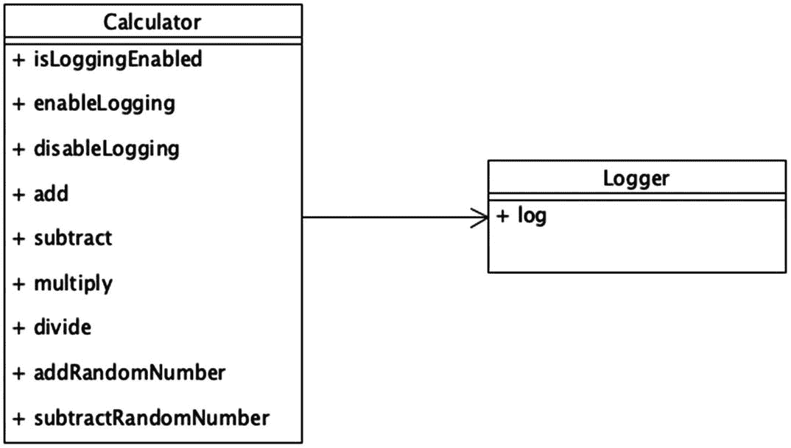
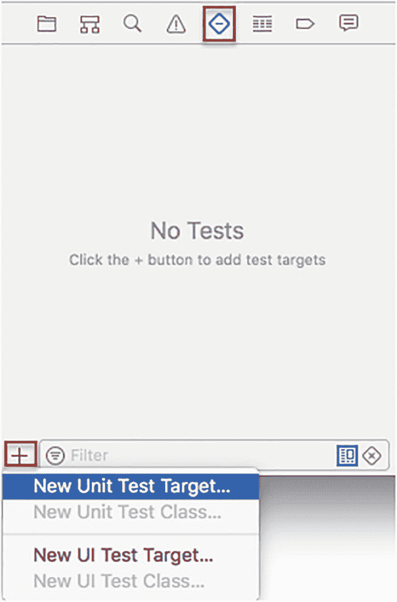
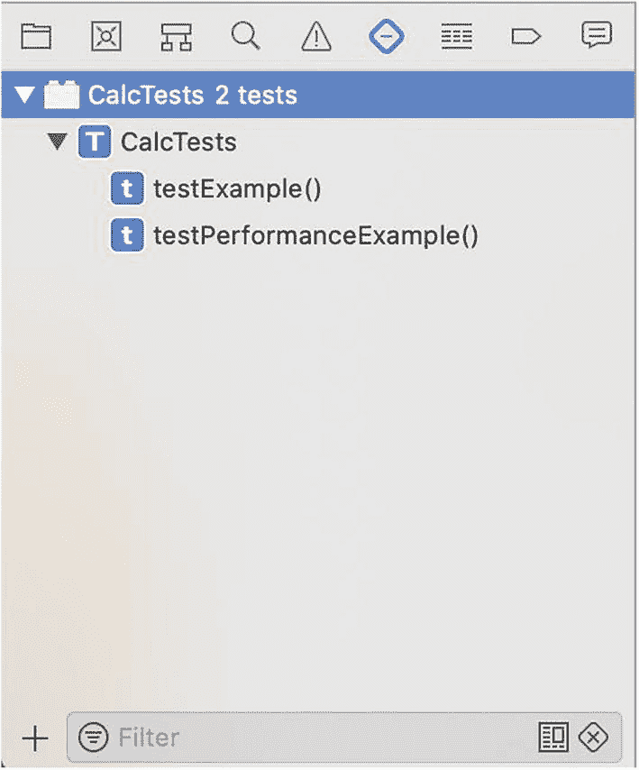
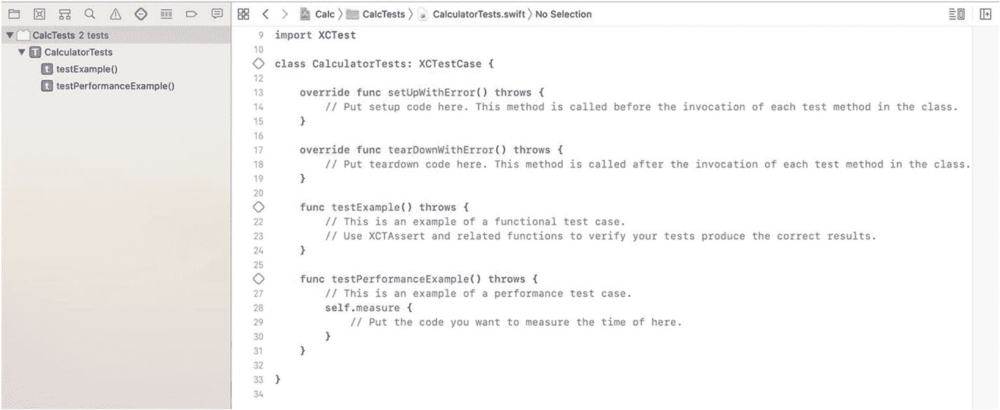
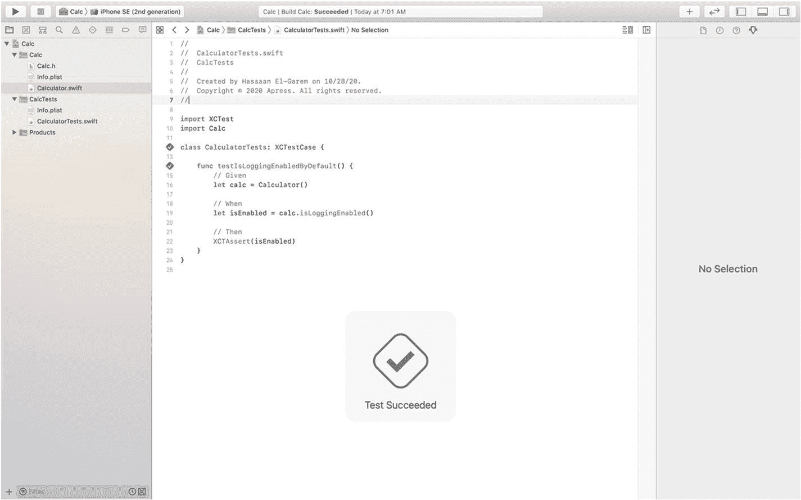
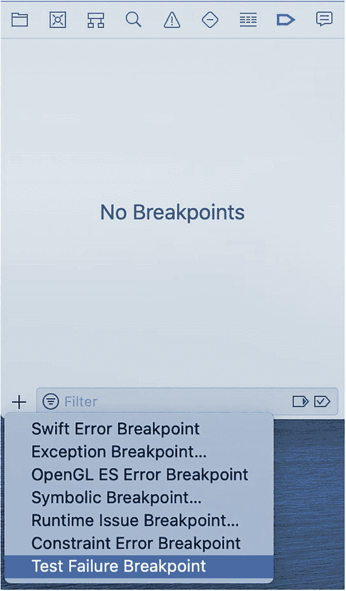
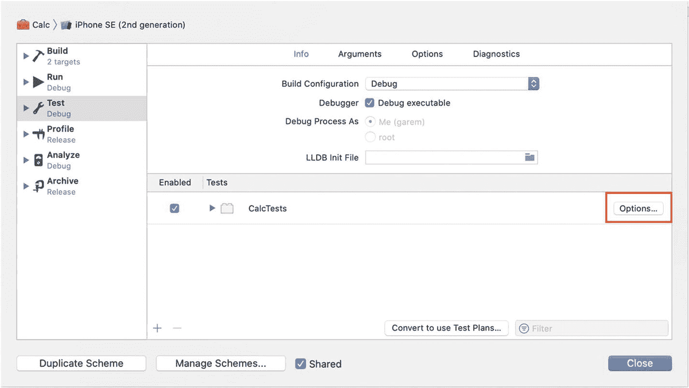
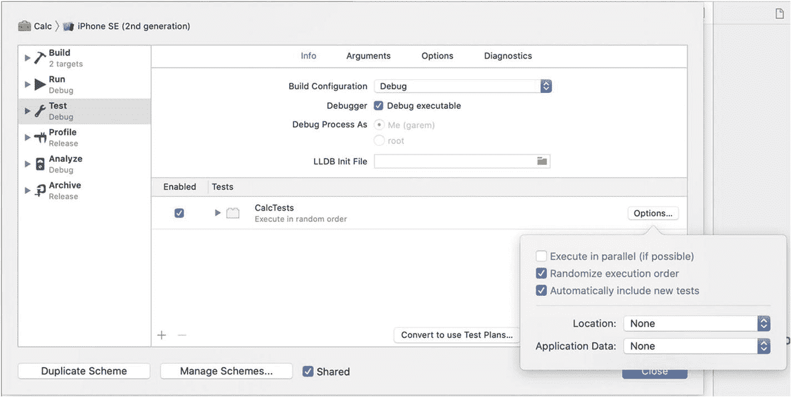
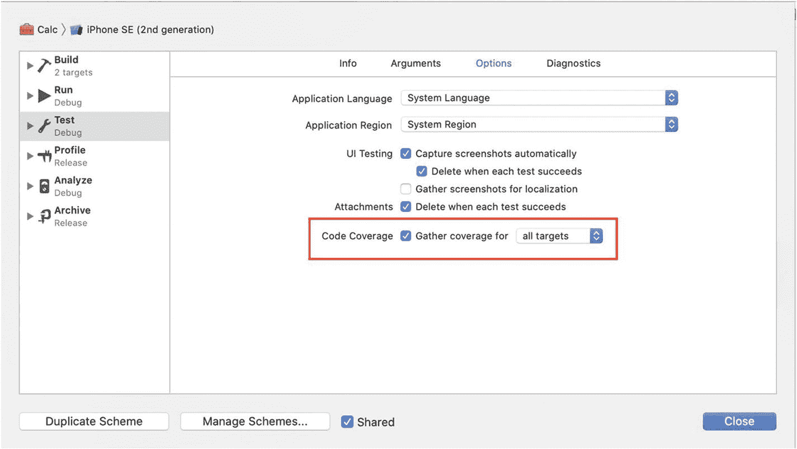
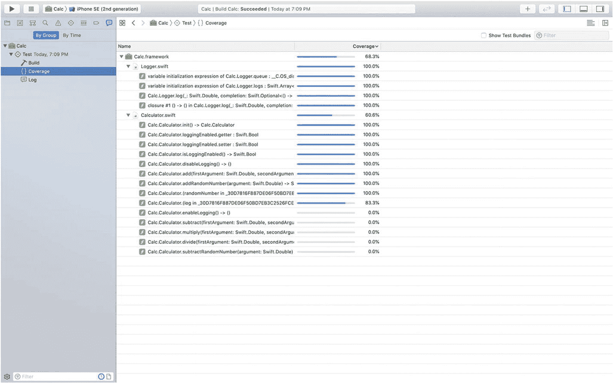

# 2. 单元测试

你现在已经知道，TDD 是一种在编写实际代码之前先编写测试的流程。但在深入 TDD 之前，你需要了解 iOS 测试的基础知识。幸运的是，每年 `Xcode` 和 `Swift` 在测试方面都变得越来越强大。测试框架 `XCTest` 也在随之进化。

本章涵盖如何使用 `XCTAssert` 函数编写功能测试。这些是 `XCTest` 的主要组件。你还将学习如何使用期望（expectations）来测试异步代码。接着，你将了解组织测试套件和测试的最佳实践。然后，你将使用调试器来查找和修复测试中的错误。最后，你将学习收集代码覆盖率，以确保你编写的测试是充分的。


## 你的第一个测试

让我们暂时忘记 TDD（测试驱动开发），先专注于测试基础。请下载并打开本章资源中的入门项目 `Calc`。`Calc` 是一个框架（图 2-1），它提供了一些基本数学运算以及一些特殊运算。`Calc` 还会记录并保存每次运算的输出。



图 2-1 计算器框架类图

`Calc` 包含两个组件：`Calculator` 和 `Logger`。`Calculator` 具有以下功能：`add`、`subtract`、`multiply`、`divide`、`addRandomNumber` 和 `subtractRandomNumber`。它还有一个用于检查日志记录是否已启用的函数，以及用于启用/禁用日志记录的函数。至于 `Logger`，它有一个函数，该函数接收一个数字并记录它。如果数字在限制范围内，则保存它；否则，抛出错误。`Calculator` 使用 `Logger` 来记录每次运算的输出。

如果你浏览一下项目，就会发现其中根本没有添加任何测试。而我们接下来要做的，就是一边带你了解 `XCTest` 的基础知识，一边解决这个问题。

### 我们要测试什么？

-   默认情况下日志记录是启用的。
-   `disableLogging` 函数能正确禁用日志记录。
-   `enableLogging` 函数能正确启用日志记录。
-   `Calculator` 内部的 `Logger` 实例默认已初始化。
-   当日志记录被禁用时，`Logger` 实例会被清空。
-   所有运算功能都能按预期工作。
-   `Logger` 的 `log` 函数在提供的数字小于限制时会保存该数字。
-   `Logger` 的 `log` 函数在提供的数字大于限制时会抛出一个错误。

### 创建单元测试目标

为了运行测试，首先我们需要一个单元测试目标。单元测试目标是一个独立的可执行文件，其唯一目的是运行你的单元测试。当你将应用提交到 App Store 或分发框架时，这个测试目标不会被包含在内。

按下 `Command+6` 打开测试导航器。

点击左下角的 `+` 按钮。然后从菜单中选择 **New Unit Test Target…**（图 2-2）。



图 2-2 添加单元测试目标

接受所有默认值，然后点击 **Finish**。

现在，你应该能在测试导航器中看到新添加的测试目标了（图 2-3）。



图 2-3 测试导航器

Xcode 会自动生成一个名为 `CalcTests.swift` 的测试用例文件。我们不需要它，所以请直接删除它。

### 添加测试用例类

我们将从为 `Calculator` 编写测试开始，第一步就是创建一个测试用例类来包含这些测试。

转到测试导航器，选择现在为空的测试目标 `CalcTests`。然后点击左下角的 `+` 按钮。接着从菜单中选择 **New Unit Test Class…**。在 **Class** 字段中输入 “CalculatorTests”，然后依次点击 Next 和 Create。

默认模板（图 2-4）导入了测试框架 `XCTest`，并定义了一个 `XCTestCase` 的子类 `CalculatorTests`，其中包含了 `setUpWithError()`、`tearDownWithError()` 以及示例测试方法。



图 2-4 `CalculatorTests`

请继续删除示例测试方法。同时删除 setup 和 teardown 方法，因为我们暂时还用不到它们。

现在是时候添加这个项目中的第一个测试了。我们要测试日志记录在默认情况下是启用的。我们可以使用公共函数 `isLoggingEnabled()` 来检查日志记录是否已启用。

首先，在文件开头添加这一行新代码以导入我们的框架：

`import Calc`

然后，在 `CalculatorTests` 中添加以下代码：

```
func testIsLoggingEnabledByDefault() {
    // Given
    let calc = Calculator()
    // When
    let isEnabled = calc.isLoggingEnabled()
    // Then
    XCTAssertTrue(isEnabled)
}
```

这里我们创建了一个新的 `Calculator` 实例，然后调用 `isLoggingEnabled` 并将结果保存在变量 `isEnabled` 中。在 **Then** 部分，我们断言 `isEnabled` 为 true。

点击旁边的菱形按钮或通过测试导航器运行测试。测试应该会通过（图 2-5）。



图 2-5 你的第一个测试！

你刚刚已经编写并运行了你的第一个测试！

## 断言方法

在我们编写的第一个测试中，我们使用了 `XCTAssertTrue`，它断言给定的表达式的计算结果为 true。然而，我们的方法还有另一个可能的结果，即返回 false。如果调用了 `disableLogging()`，那么 `isLoggingEnabled()` 应该返回 false。让我们继续编写那个测试：

```
func testDisableLogging() {
    // Given
    let calc = Calculator()
    // When
    calc.disableLogging()
    let isEnabled = calc.isLoggingEnabled()
    // Then
}
```

现在我们要断言 `isEnabled` 为 false。你的第一反应可能是像这样做：

```
XCTAssertTrue(!isEnabled)
```

让我们继续添加它并运行测试。

测试通过了！

如你所见，我们可以仅使用 `XCTAssertTrue` 来断言我们想要的任何内容，无论是相等性、可空性、比较还是其他。然而，这引入了两个问题：测试可读性差和测试输出可读性差。让我们看看下面的测试示例：

```
func testExample() {
    let x = "foo"
    let y = "bar"
    let z = foo == bar
    XCTAssertTrue(z)
}
```

快速浏览这个测试，我们可以看到我们在断言 `z` 为 true，但为了理解我们实际在测试什么，我们需要返回去检查 “z” 是什么。你可能认为这不是一个大问题，但当测试变得更加复杂和精细时，这个问题就会非常明显。

第二个也是更重要的问题是测试结果。以下是运行上述测试时的测试结果错误信息：

```
XCTAssertTrue failed
```

如你所见，这个信息有点不明确，没有告诉我们任何关于出了什么问题或 `x` 和 `y` 的值的线索。

现在我们已经发现了仅使用 `XCTAssertTrue` 的问题，接下来该怎么办呢？幸运的是，`XCTest` 已经为我们考虑到了这一点。正如我们之前提到的，`XCTest` 是一个非常强大的测试框架，其核心能力之一就是其多样化的断言方法套件。其中一个方法就是 `XCTAssertEqual`。

我们可以重构之前的测试用例来使用 `XCTAssertEqual`，重构后如下所示：

```
func testExample() {
    let x = "foo"
    let y = "bar"
    XCTAssertEqual(x, y)
}
```

这使得测试更加详细且易于理解。如果我们运行这个测试，测试结果错误信息会更具描述性：

```
XCTAssertEqual failed: ("foo") is not equal to ("bar")
```

### 断言方法类型

`XCTest` 有许多断言方法，它们可以分为五类：

1.  真值
2.  相等性
3.  可空性
4.  比较
5.  错误

#### 真值断言

-   `XCTAssertTrue`  
    断言给定的表达式的计算结果为 true
-   `XCTAssertFalse`  
    断言给定的表达式的计算结果为 false
-   `XCTAssert`  
    是 `XCTAssertTrue` 的别名

到目前为止，我们一直在专门使用 `XCTAssertTrue`。但是，现在我们可以重构 `testDisableLogging` 来使用 `XCTAssertFalse`。请继续将测试中的最后一行替换为：

```
XCTAssertFalse(isEnabled)
```


#### 单元测试中的断言

#### 等式断言

* `XCTAssertEqual`

  断言给定的两个表达式相等。

* `XCTAssertNotEqual`

  断言给定的两个表达式不相等。

对于所有等式断言，传入的表达式的类型必须相同，并且该类型需要遵循`Equatable`或`FloatingPoint`协议。

让我们为`add(firstArgument: FloatingPoint, secondArgument: FloatingPoint)`添加一个测试：

```
func testAdd() {
    // Given
    let calc = Calculator()
    // When
    let output = calc.add(firstArgument: 1, secondArgument: 2)
    // Then
    XCTAssertEqual(output, 3)
}
```

这里我们简单地断言函数的输出等于预期的输出，即“3”。

#### 空值断言

* `XCTAssertNil`

  断言给定的表达式为`nil`。

* `XCTAssertNotNil`

  断言给定的表达式不为`nil`。

当`Calculator`实例被初始化时，会创建一个新的`Logger`对象，并将其作为变量保存在`Calculator`内部。当调用`disableLogging()`时，该变量被设置为`nil`。让我们添加测试来覆盖这部分功能：

```
func testLoggerIsInitializedByDefault() {
    // Given
    let calc = Calculator()
    // Then
    XCTAssertNotNil(calc.logger)
}
func testDisableLoggingResetsLogger() {
    // Given
    let calc = Calculator()
    // When
    calc.disableLogging()
    // Then
    XCTAssertNil(calc.logger)
}
```

当你添加这些测试时，会遇到一个如下所示的构建错误：

```
'logger' is inaccessible due to 'internal' protection level
```

要修复此问题，请将：

```
import Calc
```

替换为：

```
@testable import Calc
```

当我们为启用了测试编译的模块的`import`语句添加`@testable`属性时，我们就为该作用域内的该模块激活了提升的访问权限。标记为`public`的类和类成员的行为就像被标记为`open`一样。其他标记为`internal`的实体则表现为被声明为`public`。

#### 比较断言

* `XCTAssertGreaterThan`

* `XCTAssertGreaterThanOrEqual`

* `XCTAssertLessThan`

* `XCTAssertLessThanOrEqual`

对于所有比较断言，传入的表达式的类型必须相同，并且该类型需要遵循`Comparable`协议。

让我们利用比较断言为`addRandomNumber`编写一个测试。这里我们希望断言输出大于传入的参数：

```
func testAddRandomNumber() {
    // Given
    let calc = Calculator()
    // When
    let output = calc.addRandomNumber(argument: 1)
    // Then
    XCTAssertGreaterThan(output, 1)
}
```

#### 错误断言

* `XCTAssertThrowsError`

* `XCTAssertNoThrow`

这些断言方法用于测试会抛出错误的函数。

我们的`Logger`在尝试记录大于**1000**的数字时会抛出错误。让我们使用这些断言方法来覆盖这部分逻辑。

首先，我们需要添加一个新的测试用例类来包含`Logger`的测试。按照之前的方式创建它，并将其命名为`LoggerTests`。首先添加`@testable`导入语句。然后删除自动生成的代码，并替换为以下内容：

```
func testAddLogShouldThrowIfExceedsLimit() {
    // Given
    let logger = Logger()
    let number: Double = 2000
    // Then
    XCTAssertThrowsError(try logger.log(number))
}
func testAddLogShouldNotThrowIfUnderLimit() {
    // Given
    let logger = Logger()
    let number: Double = 500
    // Then
    XCTAssertNoThrow(try logger.log(number))
}
```

这两个测试覆盖了`Logger`抛出错误和不抛出错误的两种场景。

### 期望

现在你已经熟悉了断言函数，让我们更进一步。尝试测试异步代码。首先，什么是异步代码？当你同步执行某件事时，你会等它完成后再继续执行另一个任务。当你异步执行某件事时，你可以在它完成之前就继续执行另一个任务。

我们的`Logger.log(_ number: Double, completion: LogCompletion)`函数是异步添加日志的。它接受一个完成处理器，并在执行完毕时调用它。

让我们尝试为其编写一个测试：

```
func testAddingLog() throws {
    // Given
    let logger = Logger()
    let number: Double = 1
    // When
    try logger.log(number) {
        // Then
        XCTAssertEqual(logger.logs.count, 0)
    }
}
```

如果你仔细检查我们刚刚编写的函数和测试，你会发现断言应该失败，因为日志计数预期是`1`，而不是`0`。但是当我们运行这个测试时，它通过了，并且只是偶尔失败。这是因为`log`是异步的，基本上发生的情况是测试执行作用域在函数完成执行或调用完成处理器之前就结束了。所以我们的断言实际上从未被调用。这就是仅靠`XCTAssertTrue`无法胜任的地方——异步代码。

我们可以通过强制测试等待`log`完成来修复这个问题。有很多方法可以做到这一点：等待特定的时间，或者使用`DispatchGroup`。但这些可能有些大材小用和/或不必要，因为正如你所猜到的，XCTest 再次为我们提供了支持，这次是用`XCTestExpectation`。

`XCTestExpectation`是一个对象，它描述了我们期望在未来发生的某件事，并且我们希望等待它发生。

我们可以这样创建期望：

```
let exp = expectation(description: "Log added")
```

继续，在测试的开头添加这一行。

为了等待一个期望，我们需要添加这一行：

```
wait(for: [exp], timeout: 1)
```

让我们也修复一下断言语句。现在测试应该是这样的：

```
func testAddingLog() throws {
    let exp = expectation(description: "Log added")
    // Given
    let logger = Logger()
    let number: Double = 1
    // When
    try logger.log(number) {
        // Then
        XCTAssertEqual(logger.logs.count, 1)
    }
    wait(for: [exp], timeout: 1)
}
```

现在运行测试。测试应该仍然失败，但会显示不同的错误：

```
Asynchronous wait failed: Exceeded timeout of 1 seconds, with unfulfilled expectations: "Log added".
```

这意味着超时已过，但我们的期望尚未满足，这是合逻辑的，因为我们从未定义何时满足期望。这正展示了`XCTestExpectation`的精妙之处。它们不仅帮助我们等待异步任务完成；它们还充当断言，即期望在给定的时间内得到满足，如果没有，它们会报告错误。

让我们通过定义何时满足期望来修复测试。在`XCTAssertEqual`这一行之后立即添加这一行：

```
exp.fulfill()
```

现在当我们运行测试时，它通过了！

#### 期望的类型

就像`XCTAssertTrue`一样，`XCTestExpectation`是我们的基础期望，我们可以用它来等待和测试任何异步代码。但我们还有其他类型的期望，使得等待特定事件更加容易：

1. 常规期望

2. 键值观察期望

3. 通知期望

4. 谓词期望

我们介绍了常规期望类型，其余的将在后续章节中介绍。


## 测试顺序

到目前为止，我们已经完成了测试的添加。打开本章资源中的项目检查点版本。按下 `Command+U` 运行所有测试。

你会发现有一个测试失败了，即 `testIsLoggingEnabledByDefault`。调试失败测试的一个有用技巧是使用断点。Xcode 有一个特殊的断点，叫做**测试失败断点**，它会在断言或预期失败时自动暂停执行。然后你可以利用 Xcode 的调试器检查变量的当前状态。

要添加**测试失败断点**，请按下 `Command+8` 打开断点导航器。

点击左下角的 `+` 按钮。然后从菜单中选择**测试失败断点**（图 2-6）。



图 2-6 — 测试失败断点

你可能注意到一个有趣的现象：这个测试之前是能通过的，而我们仅仅添加了更多的测试。这意味着我们的测试没有正确封装，某些测试影响了其他测试。因此，我们需要在每个测试之前重置共享 `Calculator` 实例的状态。这可以通过重写 `setUp()` 函数来实现。在每个测试开始之前，XCTest 会先调用 `setUpWithError()`，然后是 `setUp()`。如果状态准备可能会抛出错误，我们应该重写 `setUpWithError()`。由于我们不会调用任何会抛出错误的函数，`setUp()` 就足够了。有时我们可能需要在每个测试之后执行一些清理工作，这时可以使用 `tearDown()` 或 `tearDownWithError()`。

在 `CalculatorTests` 内部、测试之前添加以下代码：

```
override func setUp() {
    UserDefaults.standard.removeObject(forKey: Calculator.kLoggingEnabledDefaultsKey)
}
```

这会将日志记录功能的启用值重置为初始状态，就像一次全新运行一样。现在再次运行所有测试，它们应该都能通过了。

### 随机化顺序

在 scheme 的**测试**操作中，有一个选项可以随机化测试顺序。

编辑 **Calc** scheme（`Command+Shift+,`）。选择**测试**操作。在中央窗格中，**CalcTests** 旁边有一个**选项...**按钮（图 2-7）。



图 2-7 — 随机化测试顺序

点击该按钮，在弹出的窗口中勾选**随机化执行顺序**（图 2-8）。这将使每次测试运行顺序随机化。



图 2-8 — 随机化执行顺序

这有助于发现更多错误，并暴露测试之间的依赖关系，而这些在使用常规静态顺序时是无法捕捉的。然而，缺点在于，如果顺序问题过于特定，将难以复现。

## 代码覆盖率

既然我们刚才编辑过 scheme，我们再次打开它以启用代码覆盖率。代码覆盖率能让你可视化并衡量有多少代码被测试所覆盖。

要启用代码覆盖率，再次打开**测试**操作。这次选择**选项**标签。有一个**代码覆盖率**复选框。勾选它（图 2-9）。



图 2-9 — 代码覆盖率

现在再次运行测试。测试通过后，按下 `Command+9` 打开报告导航器。选择**按组**显示报告。在最新的测试会话下方，你应该能找到覆盖率报告，选择它即可显示（图 2-10）。



图 2-10 — 代码覆盖率结果

列表中会显示目标中每个文件的代码行执行百分比。你应该始终追求尽可能高的覆盖率百分比。

打开单个文件会显示每个函数和闭包的覆盖率。双击文件名或函数名会在编辑器中打开该文件。

需要注意的是，高覆盖率百分比并不一定意味着你已添加了所有必需的测试。

## 练习

打开本章资源中的项目最终版本。既然你已经启用了代码覆盖率，尝试添加测试，直到达到至少 90% 的覆盖率。你可以利用“我们想测试什么？”部分下的列表。

## 总结

在本章中，你了解了 iOS 中单元测试的基础知识，以及原生测试框架**XCTest** 带来的所有强大功能。我们学习了测试目标和测试用例类的作用。我们创建了一个测试目标，以便能够为我们的计算器项目添加测试。然后，我们继续为每个组件添加了测试用例类，以便在它们内部添加测试。

接着，我们开始探索 XCTest 提供的各种断言类型。我们有**真值**断言，基本上用于验证我们提供的表达式是真还是假。然后我们有**相等性**断言，用于验证两个表达式相等或不相等。我们还有**空值性**断言，用于验证我们提供的表达式是空还是非空。我们的**比较**断言可用于比较两个表达式，并确保一个大于另一个或反之。最后，我们有**错误**断言，用于验证某个表达式是否抛出错误。

需要指出的是，我们可以使用普通的 `XCTAssert` 或 `XCTAssertTrue` 执行所有需要的断言。然而，在适用的情况下使用其他类型的断言，可以使我们的测试更易读，并且当断言失败时，Xcode 输出的错误信息也更具可读性和实用性。

除了 XCTest 提供的各种断言，还有**预期**，它使得测试异步代码变得非常无缝。我们基本上创建一个预期对象，然后在异步任务完成时将其标记为已完成。为了让测试等待我们的异步任务，我们添加一行代码，告诉测试等待直到预期被满足。

当运行整个测试套件时，我们可能会遇到一个测试导致另一个测试失败的情况。当测试共享同一个环境，并且我们的测试对该环境进行了更改，这些更改泄露到其他测试时，就会发生这种情况。因此，当按特定顺序运行测试时，测试可能因为不是在干净的环境中运行而开始失败。为此，我们学习了如何使用 `XCTestCase` 的 setup 和 teardown 函数，为所有测试进行通用的设置，并在每个测试完成后进行必要的清理。

最后，我们探索了 Xcode 的一些隐藏功能。我们添加了**测试失败断点**，以便使用 Xcode 的调试器更轻松地调试失败的测试。启用此断点后，Xcode 会在断言失败时暂停，然后你可以检查失败时刻变量的状态。我们还启用了**随机化测试顺序**，它告诉 Xcode 每次以不同的顺序运行测试。这有助于发现更多错误。最后，我们启用了**代码覆盖率**，以了解测试覆盖了我们多少代码。启用此功能后，Xcode 会在每次测试运行后生成一份报告，这有助于识别覆盖率较低、需要更多测试的区域。


