# 3. UI 测试

UI 测试是你的第一道防线，它能告诉你应用是否正常工作；它们与应用的交互方式，与用户的操作方式完全相同。`XCUITest` 框架能帮你查询应用内的 UI 元素、执行交互操作，并验证 UI 的属性和状态。UI 测试通过 iOS 的无障碍系统来访问你的应用。无障碍是一项技术，它能让残障人士获得与所有其他用户相同的应用体验。它提供了关于 UI 的丰富语义数据，因此可以使用旁白来引导用户操作应用。

## 你的第一个测试

本章旨在探索 Xcode 中的 UI 测试，因为我们将在后续部分大量依赖它。我们将为一个显示城市列表的简单应用编写 UI 测试。你可以在本章的资源中找到该应用的起始项目。该应用（图 3-1）包含主屏幕，其中显示了一个城市列表。当你选择其中一个城市时，它将打开另一个屏幕，该屏幕的标题将与所选城市名称匹配。你会找到一个按钮；点击此按钮，它将显示一个欢迎警报。

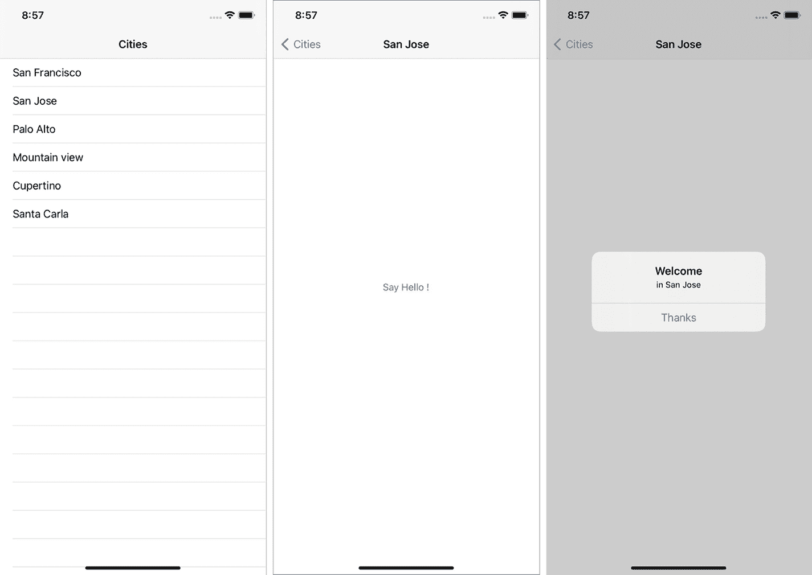

图 3-1

待测试的应用

如果我们打开演示应用，会发现它没有 UI 测试目标。因此，你需要为 UI 测试创建一个新的目标。UI 测试目标是一个独立的可执行文件，其唯一用途是运行你的 UI 测试。当你将应用提交到 App Store 或分发你的框架时，这个测试目标不会被包含在内。

按下 `Command+6` 打开测试导航器。

点击左下角的 `+` 按钮。然后从菜单中选择 `New UI Test Target…` （图 3-2）。

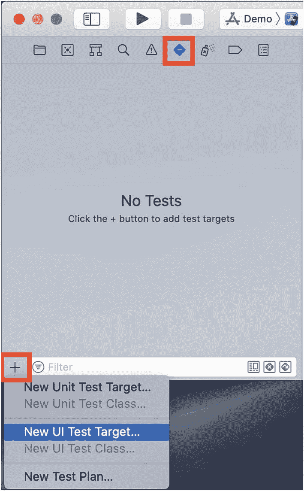

图 3-2

新建 UI 测试目标

创建 UI 测试目标后，它会创建一个新文件夹，其中包含你的第一个 UI 测试类，该类继承自 `XCTestCase` （图 3-3）。

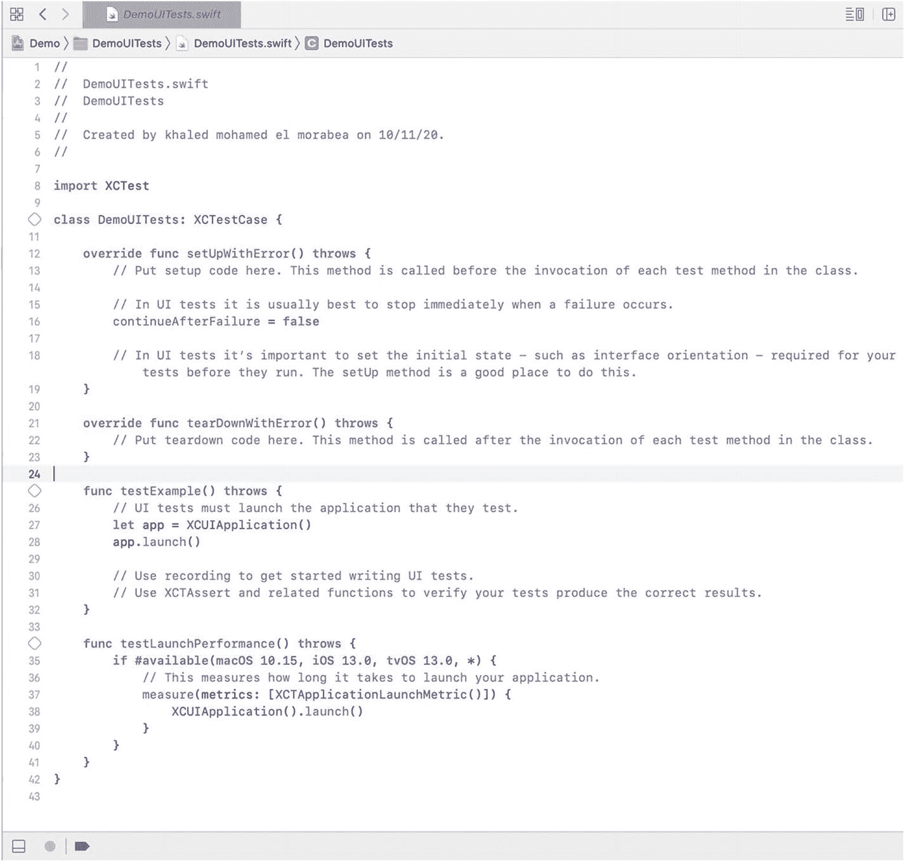

图 3-3

样板测试

**要求：**

*   iOS 9 是支持 UI 测试的最低版本。
*   UI 测试的最低 iOS 版本应与待测试应用的版本一致。

你需要点击 `testExample` 旁边的菱形按钮。你刚刚就运行了你的第一个测试！（图 3-4）

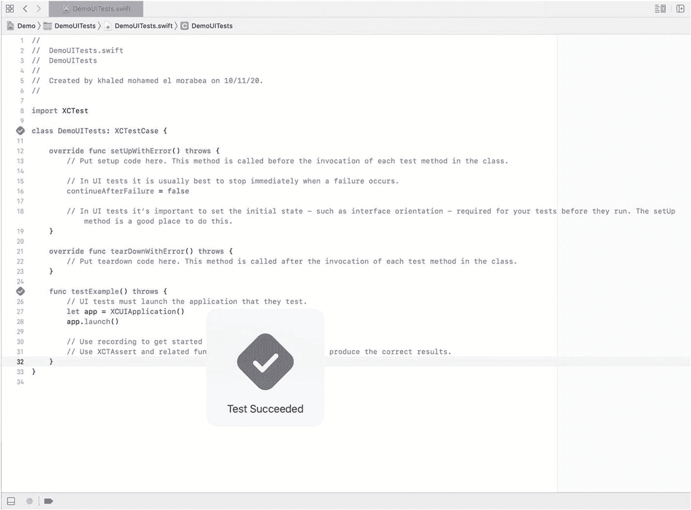

图 3-4

运行虚拟测试

## XCUITest 组件

`XCUITest` 框架由三个主要组件组成。我们将在进行中逐一介绍。这些组件是：

*   `XCUIApplication`
*   `XCUIElementQuery`
*   `XCUIElements`

## 本章目标

正如我们之前提到的，UI 测试与应用的交互方式与用户完全相同。因此，我们希望像用户那样与我们的应用进行交互，并验证一切是否按预期工作。

### 第一个测试用例

*   作为一名用户，我应该在表格视图中看到六个城市；当我点击旧金山城市时，应用应导航到另一个视图，并且标题应与所选城市匹配。在导航到另一个视图后，我应该能够看到一个 `"Say Hello !"` 按钮，当我点击它时，应该显示一条欢迎消息。

如果我们将测试用例转换为操作，它将如下所示：

1.  启动应用。
2.  统计表格视图内的所有城市。
3.  选择 `"San Francisco"` 城市。
4.  确保详情视图中的标题是 `San Francisco`。
5.  点击 `"Say Hello !"` 按钮。
6.  确保你看到了一个欢迎警报。

## 启动应用

要运行你的测试，你必须启动应用。因此，`XCUITest` 提供了 `XCUIApplication`，它是你的应用的一个代理，这样你就可以 `launch`（启动）、`terminate`（终止）和 `activate`（激活）你的应用。在每个测试中，你必须有一个 `XCUIApplication` 的实例，并调用 `app.launch()`。

**使用启动 API 后，我们的第一个测试将是**

```
func testExample() throws {
// UI tests must launch the application that they test.
let app = XCUIApplication()
app.launch()
}
```

`XCUIApplication` 包含一个强大的 API，我们稍后会大量使用它，即 `launchArguments`。它帮助你向应用发送启动参数以进行特定的自定义。我们将在本书中大量使用这个 API。在每个 UI 测试之前，无论是否使用启动参数，你都必须启动你的应用，这将清除应用的先前实例。

## 查询 UI

我们需要访问表格视图来统计其中的单元格。但是该怎么做呢？`XCUITest` 提供了一个类来执行此操作。`XCUIElementQuery` 是一个用于定位 `UIElement` 的查询，以便我可以在 `UIElement` 上进行断言或执行交互。让我们深入了解 `XCUIElementQuery` 的工作原理。

`XCUIElementQuery` 执行两个主要功能：关系和过滤。

### 关系

*   **后代**：将获取特定 `UIElement` 下的所有后代元素。

例如：视图的后代包含视图下的所有元素：`view.descendants` （图 3-5）。

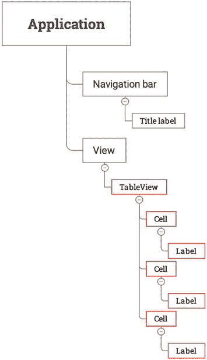

图 3-5

后代关系

*   **子级**：将获取特定 `UIElement` 正下方的所有元素。例如：`TableView` 的子级包含 `TableView` 正下方的所有元素，即单元格（图 3-6）。

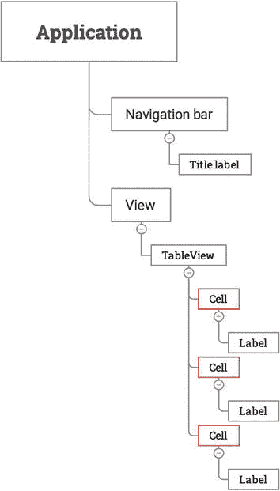

图 3-6

子级关系

*   **包含**：如果 `UIElement` 不唯一，但它包含一个唯一元素时，这会很有用。例如：`cells.containing(NSPredicate(format: "label CONTAINS %@", "San Francisco"))` （图 3-7）。

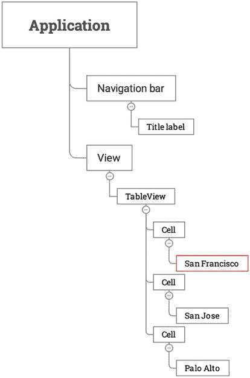

图 3-7

包含关系

### 过滤

我们可以结合过滤器和关系来进行更深入的断言。我们可以过滤后代，只获取特定 `UIElement` 下的标签。

`tableView.descendants(matching: .button)` 将返回 `TableView` 下所有类型为按钮的后代元素。这也等同于以下查询：`tableView.buttons`。我们可以组合查询来构建更复杂的查询，例如，`app.tables.staticTexts` 将获取 `TableView` 下的所有标签（图 3-8）。

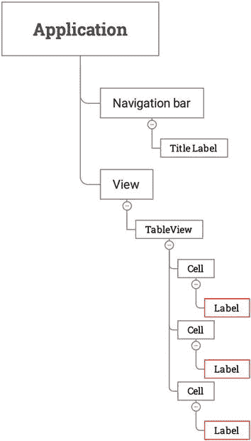

图 3-8

组合关系

你可以将查询本身用作断言的终点，因此你可以在添加新单元格后检查单元格的数量：`let query = app.tables.cells` 然后 `query.count`。但要注意，每次调用此查询时，它都会重新计算并获取最新的查询结果。

**使用查询 API 后，我们的第一个测试将是**

```
func testExample() throws {
// UI tests must launch the application that they test.
let app = XCUIApplication()
app.launch()
XCTAssertEqual(app.tables.cells.count, 6)
}
```


### 与用户界面交互

我们应该利用 `XCUIElementQuery` 的强大功能来找到 `"San Francisco"` 单元格。首先，你需要获取所有表视图的后代元素，并只返回标签，类似于这样：`app.tables.staticTexts`。这个查询将返回表视图内所有的标签。下一步是找到包含 `"San Francisco"` 的标签。该查询将返回一个 `XCUIElement` 数组。

`XCUIElement` 是应用中 `UIElement` 的代理。元素具有诸如 `button`、`cell`、`staticText` 等类型。它们也有标识符，这些标识符来自辅助功能系统、辅助功能标识符，或者辅助功能标签或标题。大多数情况下，我们通过类型和标识符的组合来找到 `UIElement`；例如，`let button = app.buttons["Edit"]`。我们找到了一个类型为按钮、标识符为 `Edit` 的 `UIElement`。另一种查询元素的方式是基于元素的内容进行查询。例如，如果我们知道一个标签应该显示特定的文本，我们可以通过查询其内容来搜索该标签。我们可以用这种方法来找到 `"San Francisco"` 标签。此外，还有一个重要的属性可以用来检查 `UIElement` 是否存在：`element.exists`。

**在对 San Francisco 标签进行断言后，我们的第一个测试将是**

```
func testExample() throws {
    // UI tests must launch the application that they test.
    let app = XCUIApplication()
    app.launch()
    XCTAssertEqual(app.tables.cells.count, 6)
    let cell = app.tables.staticTexts["San Francisco"]
    XCTAssertTrue(cell.exists)
}
```

**注意**：当内容是动态的或在不同运行之间可能不同时，依赖内容是非常危险的。在这种情况下，你应该始终依赖辅助功能标识符。

## UI 事件

一旦找到元素，你需要模拟用户交互。`XCUIElement` 提供了一些 API，你可以用来与 `UIElement` 交互：

*   `tap()`
*   `doubleTap()`
*   `press(forDuration:, thenDragTo:)`
*   `twoFingerTap()`
*   `swipeUp()`、`swipeDown()`、`swipeLeft()`、`swipeRight()`
*   `typeText("")`

**在使用 tap API 后，我们的第一个测试将是**

```
func testExample() throws {
    // UI tests must launch the application that they test.
    let app = XCUIApplication()
    app.launch()
    XCTAssertEqual(app.tables.cells.count, 6)
    let cell = app.tables.staticTexts["San Francisco"]
    cell.tap()
}
```

## 断言

就像我们在第三步中所做的那样，我们需要获取所有导航栏的后代元素，并只返回标签，然后断言它是否包含 `"San Francisco"` 标签。

**在对标题标签进行断言后，我们的第一个测试将是**

```
func testExample() throws {
    // UI tests must launch the application that they test.
    let app = XCUIApplication()
    app.launch()
    XCTAssertEqual(app.tables.cells.count, 6)
    let cell = app.tables.staticTexts["San Francisco"]
    cell.tap()
    let titleLabel = app.navigationBars.staticTexts["San Francisco"]
    XCTAssertTrue(titleLabel.exists)
}
```

### 值断言

你可以使用 `value` 属性对 `UIElement` 的值进行断言，该属性根据元素类型而变化。如果 `UIElement` 是 `UISwitch`，则其值代表开关状态：

```
let genderSwitch = app.tables.switches["Gender"].value
```

这里，如果开关关闭，该值将是字符串 `"0"`；如果开关打开，值将是 `"1"`。

## 辅助功能

应用程序是元素树的根。所有这些都是你可以使用类型和标识符访问的元素。为了在 UI 测试时轻松应对，你需要使每个 `UIElement` 都是唯一的。在某种程度上，我们将重复我们在第四步中所做的操作，但我们将使用辅助功能标识符来获取 `"Say Hello !"` 按钮。让我们回顾一下应用程序的元素层级结构。

你可以使用 Storyboard 从 Identity Inspector 添加辅助功能标识符，方法是检查 Accessibility 是否启用并添加标识符（图 3-9），或者使用 API `view.isAccessibilityElement = true` 和 `view.accessibilityIdentifier = "Hello"`。

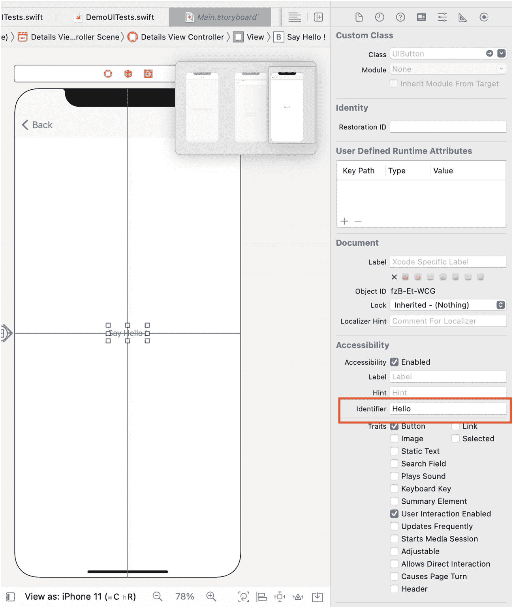

图 3-9：添加标识符

**在使用辅助功能找到 Hello 按钮后，我们的第一个测试将是**

```
func testExample() throws {
    // UI tests must launch the application that they test.
    let app = XCUIApplication()
    app.launch()
    XCTAssertEqual(app.tables.cells.count, 6)
    let cell = app.tables.staticTexts["San Francisco"]
    cell.tap()
    let titleLabel = app.navigationBars.staticTexts["San Francisco"]
    XCTAssertTrue(titleLabel.exists)
    let helloButton = app.buttons["Hello"]
    helloButton.tap()
}
```

### 辅助功能提示

*   在测试中添加断点（图 3-10）并在 `LLDB` 中使用以下命令打印 `UIElement` 的描述：`p print(helloButton.debugDescription)`。

    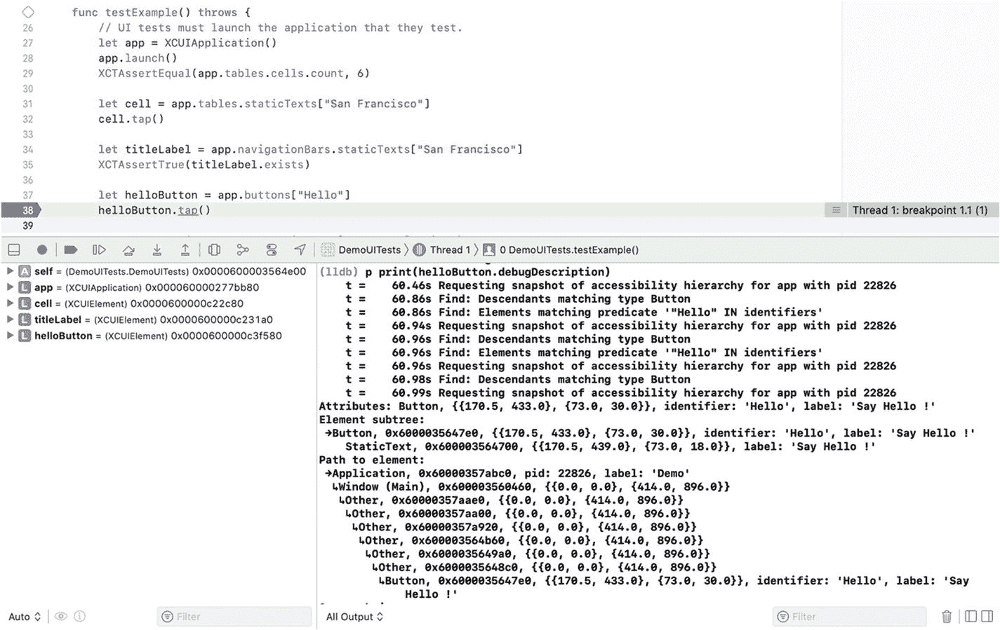

    图 3-10：调试辅助功能

*   当你启动 Accessibility Inspector（图 3-11）时，你可以在模拟器中触摸 `UIElement` 以检查辅助功能系统的输出（图 3-12）。

    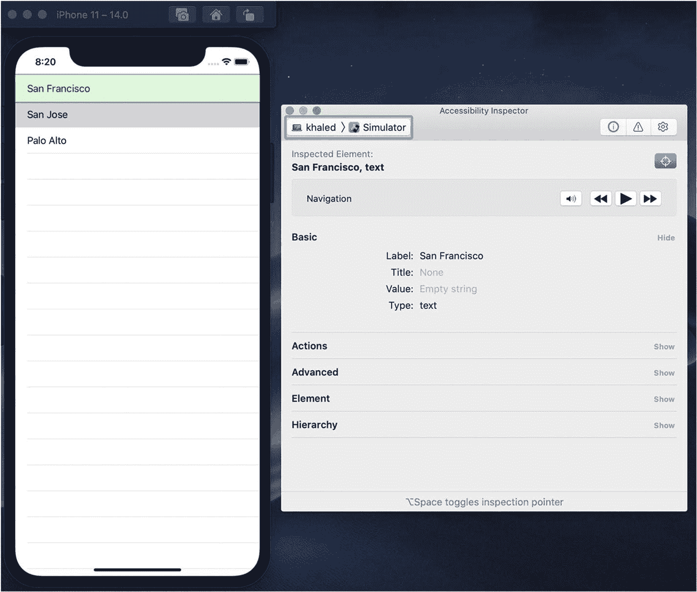

    图 3-12：使用 Accessibility Inspector 进行调试

    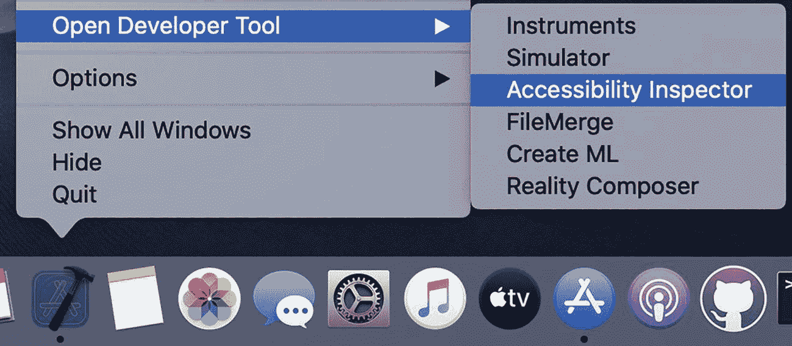

    图 3-11：打开 Accessibility Inspector

## 综合运用

**在对警告内容进行断言后，我们的第一个测试将是**

```
func testExample() throws {
    // UI tests must launch the application that they test.
    let app = XCUIApplication()
    app.launch()
    XCTAssertEqual(app.tables.cells.count, 6)
    let cell = app.tables.staticTexts["San Francisco"]
    cell.tap()
    let titleLabel = app.navigationBars.staticTexts["San Francisco"]
    XCTAssertTrue(titleLabel.exists)
    let helloButton = app.buttons["Hello"]
    helloButton.tap()
    XCTAssertTrue(app.alerts.staticTexts["Welcome"].exists)
    XCTAssertTrue(app.alerts.staticTexts["in San Francisco"].exists)
}
```

## 改进 UI 测试

UI 测试比普通的单元测试要慢得多。这是由于它们的本质，因为它们像普通用户一样直接与 UI 交互。然而，为了让你的 UI 测试高效，有几点需要注意：

*   **等待时间**：不要在测试中使用 `sleep` 来等待特定操作，因为这会使你的测试变慢，并且仍然可能导致测试不稳定；你需要使用 `.waitForExistence(timeout: )`。
*   **并行 UI 测试执行** 从 Xcode 10 开始支持，但在 Xcode 11 上更稳定（图 3-13）。

    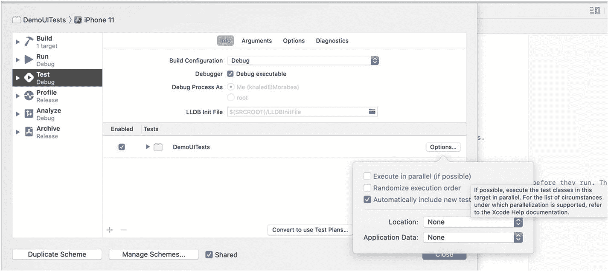

    图 3-13：并行化测试执行

## 练习

我们已经完成了第一个 UI 测试，它导航到第一个城市并点击了“Say Hello !”按钮。尝试编写另一个 UI 测试，它导航到第一个城市并点击“Say Hello !”按钮，然后返回并导航到第二个城市，再点击“Say Hello !”按钮。


好的，作为高级文档工程师和翻译员，我将按照您提供的注意事项和示例，将给定的英文文本翻译成中文。


## 总结

在 UI 测试中，我们与应用程序的交互方式与真实用户完全相同。在本章中，我们探讨了 iOS 中 UI 测试的基础知识，以及如何使用 `XCUITest` 框架，通过查找屏幕上的 UI 元素、与之交互，并验证应用程序预期的 UI 状态来编写所有测试。

我们使用 `XCUIApplication` 为应用程序创建了一个代理，并使用该代理来启动我们的应用程序。我们也可以使用同一个代理来终止应用程序。应用程序启动后，为了开始与之交互，我们需要访问屏幕上的 UI 元素。为了搜索和查找特定的 UI 元素，我们使用强大的 `XCUIElementQuery` 在我们的应用程序视图中进行搜索。通过组合多个查询，我们可以找到所需的元素。

当我们获取到某个元素后，我们可以使用前一章讨论的标准 `XCTAsserts` 来断言其状态，也可以与该元素进行交互。使用 `XCUITest` 可以模拟多种用户交互。我们可以点击或双击、长按、向任意方向滑动，甚至在适用的情况下输入文本。

iOS 中的 UI 测试与辅助功能特性是相辅相成的。为你的视图添加辅助功能标识符、标签和值，不仅能让你的应用程序对视障、行动不便、学习障碍或听障人士更友好，也会让编写 UI 测试变得更加容易。当你使视图可访问时，你的测试就可以使用辅助功能标识符或标签来查询这些元素，并可以检查其值以验证正确的行为。

## 测试金字塔

现在我们已经知道了如何使用 `XCTest` 和 `XCUITest` 在 iOS 中编写测试，我们需要了解我们应该编写哪些类型的测试，以及每种测试类型的数量。这正是“测试金字塔”（图 4-1）概念的用武之地。这个概念有助于回答这两个问题。Mike Cohn 在他的书 *Succeeding with Agile* 中提出了这个概念。这是一个绝佳的视觉隐喻，告诉你要考虑不同的测试层次，也告诉你在每一层应该进行多少测试。

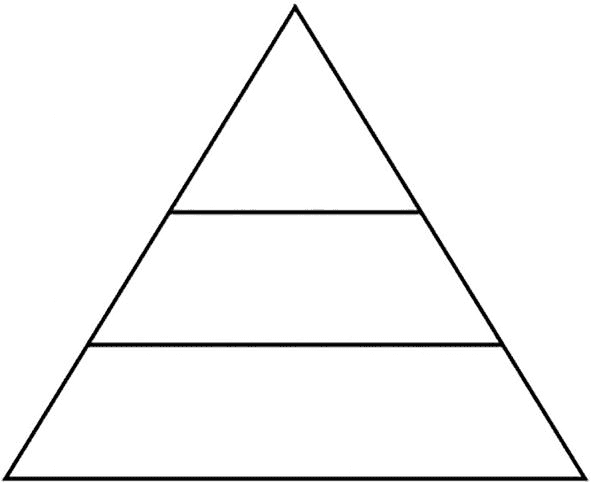

图 4-1

空的测试金字塔

我们不直接展示 Mike Cohn 得出的结论，而是尝试通过几个例子来推导它。在本章中，你将了解到三种测试类型，并为每种类型实现一些测试。在本章结束时，我们将尝试推导出每种类型在测试金字塔中的位置。

## 我们的应用程序

让我们来看看本章的演示应用程序 `TestingPyramid`。你可以在本章的资源中找到该应用程序的起始项目。这是一个极其简单的应用程序，只有两个屏幕（图 4-2）。初始屏幕是登录屏幕，用户需要在此输入电子邮件和密码。如果登录成功，用户将被引导到第二个屏幕，即统计页面。统计页面显示自应用程序安装以来的成功和失败登录次数。

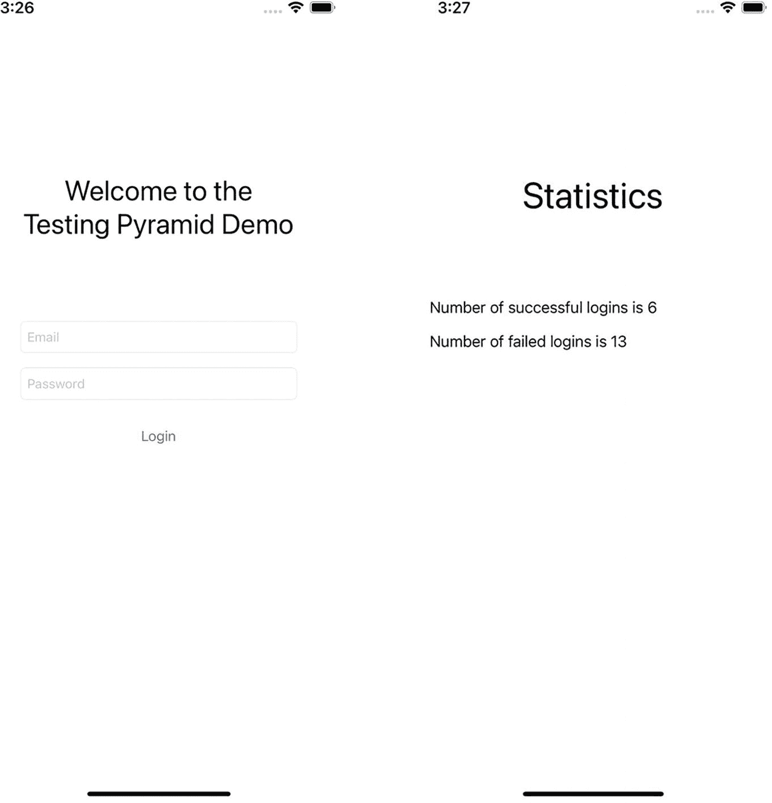

图 4-2

应用程序屏幕

该应用程序内部包含以下组件：

- `Validator`：验证电子邮件和密码
- `DatabaseManager`：查询本地数据库以检查登录尝试是否有效
- `PersistenceManager`：在用户默认设置中保存失败登录和成功登录的次数
- `LoginManager`：负责执行整个登录流程，包括验证输入的凭据、发起网络请求以及根据结果更新保存的统计数据

### UI 测试

我们将探索的第一种类型是 UI 测试。在编写 UI 测试时，我们希望测试两个相互关联的事情：我们的 UI 是否正确显示，以及应用程序的功能是否按预期工作。进行 UI 测试时，我们以用户完全相同的方式查看应用程序，也以用户相同的方式与应用程序交互。我们无法访问任何内部代码，不能检查网络请求，也不能查询持久化层或写入内部变量。

让我们来看看我们可以为应用程序编写的一些 UI 测试：

```
func testInvalidLogin() throws {
    // 初始状态
    let title = app.staticTexts[AccessibilityIdentifiers.kLoginWelcomeLabelIdentifier]
    let emailTextField = app.textFields[AccessibilityIdentifiers.kLoginEmailTextFieldIdentifier]
    let passwordTextField = app.textFields[AccessibilityIdentifiers.kLoginPasswordTextFieldIdentifier]
    let loginButton = app.buttons[AccessibilityIdentifiers.kLoginButtonIdentifier]
    XCTAssertTrue(title.exists)
    XCTAssertTrue(emailTextField.exists)
    XCTAssertTrue(passwordTextField.exists)
    XCTAssertTrue(loginButton.exists)
    // 无效登录
    loginButton.tap()
    // 然后
    let alert = app.alerts.element
    let alertExists = alert.waitForExistence(timeout: 5)
    XCTAssertTrue(alertExists)
    XCTAssertEqual(alert.label, "Login Error")
    XCTAssertTrue(alert.staticTexts["Email can not be empty"].exists)
}

func testValidLogin() throws {
    // 初始状态
    let title = app.staticTexts[AccessibilityIdentifiers.kLoginWelcomeLabelIdentifier]
    let emailTextField = app.textFields[AccessibilityIdentifiers.kLoginEmailTextFieldIdentifier]
    let passwordTextField = app.textFields[AccessibilityIdentifiers.kLoginPasswordTextFieldIdentifier]
    let loginButton = app.buttons[AccessibilityIdentifiers.kLoginButtonIdentifier]
    XCTAssertTrue(title.exists)
    XCTAssertTrue(emailTextField.exists)
    XCTAssertTrue(passwordTextField.exists)
    XCTAssertTrue(loginButton.exists)
    // 有效登录
    emailTextField.tap()
    emailTextField.typeText("valid@valid.com")
    passwordTextField.tap()
    passwordTextField.typeText("Password!")
    loginButton.tap()
    // 然后
    let statisticsTitle = app.staticTexts[AccessibilityIdentifiers.kStatisticsTitleLabelIdentifier]
    let failedLabel = app.staticTexts[AccessibilityIdentifiers.kFailedCountLabelIdentifier]
    let successfulLabel = app.staticTexts[AccessibilityIdentifiers.kSuccessfulCountLabelIdentifier]
    XCTAssertTrue(statisticsTitle.exists)
    XCTAssertTrue(failedLabel.exists)
    XCTAssertTrue(successfulLabel.exists)
}
```

这里我们测试了两个场景：一个是登录成功，另一个是登录失败（因为电子邮件和密码为空）。在这两种场景中，我们都断言的预期行为。然而，关于登录失败，我们知道这并不是导致登录失败的唯一场景。一种选择是为每个导致登录失败的场景添加一个 UI 测试，但由于 UI 测试的执行时间成本很高，添加多个几乎相同的测试是没有意义的。因此，我们将在测试金字塔的不同层级中尝试覆盖这些场景。UI 测试的另一个不足在于断言内部状态的变化。例如，我们希望断言当尝试登录时，登录计数已经更新。但由于我们无法访问内部代码，我们也需要在另一个不同的层级中来覆盖这一点。


### 集成测试

对于每个组件，我们可以根据其隔离程度来进行描述。我们将完全独立的组件（即不依赖其他任何组件的组件）称为**独立组件**。而将依赖或集成其他组件的组件称为**社交型组件**。就像人类一样，有些社交型组件可能比其他社交型组件更具社交性。

集成测试的目标是高度社交型的组件，即那些将其他较小组件集成在一起的组件。通常，这类组件的数量相对较少。

关于哪些组件应该成为集成测试的对象，并没有统一的规定。在这方面，你需要自行判断。不过，在做判断时，有一些因素需要考虑。独立组件不需要集成测试，因为它们不与任何组件集成。高度社交型的组件则很可能属于集成测试的范畴。介于两者之间的组件并不总是需要作为集成测试的对象。是的，我们可以为所有社交型组件添加集成测试。然而，对于那些更接近独立而非社交的组件，添加集成测试可能不会增加太多价值，反而会拖慢集成测试套件的运行速度。为这些组件添加单元测试可能就足够了。但这最终取决于你的判断。

就我们的演示应用而言，`LoginManager` 是一个高度社交型的组件，因为它与我们的其他三个组件进行交互。让我们来看看可以为 `LoginManager` 编写的一些集成测试：

```
func testInvalidCredentialsLogin() {
// Given
let databaseManager = TestDatabaseManager() // #1
let persistenceManager = PersistenceManager.shared
let manager = LoginManager(databaseManager: databaseManager)
// That
let expectation = self.expectation(description: "Login finished")
// When
manager.login(email: "invalid", password: "invalid") { (success, error) in
// Then
XCTAssertFalse(success, "Login should not be successful") // #2
XCTAssertEqual(error, ValidationError.invalidEmail.message, "Wrong error returned from login") // #3
expectation.fulfill()
}
// Then
self.wait(for: [expectation], timeout: 2)
XCTAssertEqual(persistenceManager.failedLoginsCount, 1, "Failed login counts should be incremented") // #4
XCTAssertEqual(persistenceManager.successfulLoginsCount, 0, "Successful login counts should not be incremented") // #5
XCTAssertEqual(databaseManager.queriesCount, 0, "Database should not be queried") // #6
}
```

这里我们编写了一个测试，用于验证 `LoginManager` 是否正确与其依赖项交互。在凭据无效的情况下，我们做了以下断言：

1.  我们创建了一个 `TestDatabaseManager` 的实例，它的行为与普通的 `DatabaseManager` 相同，只是它会记录对数据库进行的查询次数。
2.  我们断言登录函数返回了 false 的成功标志。
3.  我们断言返回的错误是类型为 `"invalidEmail"` 的验证错误。
4.  我们断言登录管理器要求持久化管理器增加失败登录次数。
5.  我们断言登录管理器没有要求持久化管理器增加成功登录次数。
6.  我们断言登录管理器没有查询数据库。

```
func testIncorrectCredentialsLogin() {
// Given
let databaseManager = TestDatabaseManager(databaseFilename: "testAccounts")
let persistenceManager = PersistenceManager.shared
let manager = LoginManager(databaseManager: databaseManager)
// That
let expectation = self.expectation(description: "Login finished")
// When
manager.login(email: "test@test.com", password: "Incorrect!") { (success, error) in
// Then
XCTAssertFalse(success, "Login should not be successful") // #1
XCTAssertEqual(error, DatabaseError.credentialMismatch.message, "Wrong error returned from login") // #2
expectation.fulfill()
}
// Then
self.wait(for: [expectation], timeout: 2)
XCTAssertEqual(persistenceManager.failedLoginsCount, 1, "Failed login counts should be incremented") // #3
XCTAssertEqual(persistenceManager.successfulLoginsCount, 0, "Successful login counts should not be incremented") // #4
XCTAssertEqual(databaseManager.queriesCount, 1, "Database should be queried") // #5
}
```

对于第二个测试，我们考察了凭据不正确的情况，并做了以下断言：

1.  我们断言登录函数返回了 false 的成功标志。
2.  我们断言返回的错误是类型为 `"credentialMismatch"` 的数据库错误。
3.  我们断言登录管理器要求持久化管理器增加失败登录次数。
4.  我们断言登录管理器没有要求持久化管理器增加成功登录次数。
5.  我们断言登录管理器查询了数据库恰好一次。

```
func testSuccessfulLogin() {
// Given
let databaseManager = TestDatabaseManager(databaseFilename: "testAccounts")
let persistenceManager = PersistenceManager.shared
let manager = LoginManager(databaseManager: databaseManager)
// That
let expectation = self.expectation(description: "Login finished")
// When
manager.login(email: "test@test.com", password: "!2345678") { (success, error) in
// Then
XCTAssertTrue(success, "Login should be successful")
XCTAssertNil(error, "No error should be returned from login")
expectation.fulfill()
}
// Then
self.wait(for: [expectation], timeout: 2)
XCTAssertEqual(persistenceManager.failedLoginsCount, 0, "Failed login counts should not be incremented")
XCTAssertEqual(persistenceManager.successfulLoginsCount, 1, "Successful login counts should be incremented")
XCTAssertEqual(databaseManager.queriesCount, 1, "Database should be queried")
}
```

最后，对于成功登录的情况，我们做了以下断言：

1.  我们断言登录函数返回了 true 的成功标志。
2.  我们断言没有返回任何错误。
3.  我们断言登录管理器没有要求持久化管理器增加失败登录次数。
4.  我们断言登录管理器要求持久化管理器增加成功登录次数。
5.  我们断言登录管理器查询了数据库恰好一次。

现在我们需要回答的问题是：我们是否应该为 `LoginManager` 添加更多的测试？我们可能可以，例如，我们还没有覆盖初始验证会失败的所有情况。所以如果看一下我们编写的第一个测试 `testInvalidCredentialsLogin`，我们可能可以添加多个类似的测试，每个测试都有不同的验证错误，并断言匹配的错误。这将是一个新测试的示例。


```swift
func testInvalidCredentialsLoginEmptyEmail() {
    // Given
    let databaseManager = TestDatabaseManager()
    let persistenceManager = PersistenceManager.shared
    let manager = LoginManager(databaseManager: databaseManager)
    // That
    let expectation = self.expectation(description: "Login finished")
    // When
    manager.login(email: "", password: "invalid") { (success, error) in
        // Then
        XCTAssertFalse(success, "Login should not be successful") // #1
        XCTAssertEqual(error, ValidationError.emptyEmail.message, "Wrong error returned from login") // #2
        expectation.fulfill()
    }
    // Then
    self.wait(for: [expectation], timeout: 2)
    XCTAssertEqual(persistenceManager.failedLoginsCount, 1, "Failed login counts should be incremented") // #3
    XCTAssertEqual(persistenceManager.successfulLoginsCount, 0, "Successful login counts should not be incremented") // #4
    XCTAssertEqual(databaseManager.queriesCount, 0, "Database should not be queried") // #5
}
```

仔细看看上面的测试，你会发现它几乎是我们第一个测试的翻版。我们还可以再添加五个重复的测试，每个测试对应不同的错误。但这些测试的问题在于，它们会一遍又一遍地执行完全相同的检查（与 `PersistenceManager` 和 `DatabaseManager` 相关的检查）。这意味着，如果其中一个副本在涉及 `PersistenceManager` 或 `DatabaseManager` 的检查中通过了或失败了，那么所有其他测试必定会表现出相同的行为。因此，它们唯一的价值在于测试 `Validator`，因为这是它们之间唯一的变量。一旦我们发现了这个问题，就可以有把握地推断这些测试不应该出现在集成测试层面，这引出了我们的第三个也是最后一个层面：单元测试。

### 单元测试

在讨论单元测试之前，我们首先需要定义什么是单元。这并非一个容易回答的问题。然而，业界已经基本达成共识，对于面向对象的语言（如 Swift），每个类都被视为一个“单元”。

在测试特定类时，我们至少应该测试该类的公共接口。单元测试应覆盖正常场景以及边界情况。

单元测试在高度隔离的环境中运行，这意味着每个单元都应独立进行测试以确保其正常工作。也就是说，如果一个单元依赖于另一个组件，那么这个组件需要进行桩接（stubbed）。我们将在后面的第 7 章中详细讨论桩接和模拟。由于这种高度隔离性，单元测试将是我们编写的最快类型的测试。

对于我们的演示应用，我们需要为 `Validator`、`PersistenceManager` 和 `DatabaseManager` 添加单元测试。让我们看看可以为 `Validator` 编写的单元测试。在 `LoginManager` 的测试中，我们经历了验证失败的场景，并断言登录函数返回的错误与预期的验证错误一致。我们还经历了验证通过的场景。但对于 `Validator` 的测试，我们将涵盖验证凭据时所有可能的场景：

```swift
// Test validating a valid credential
func testValidCredentials() {
    // Given
    let validator = Validator()
    let credentials = Credentials(email: "valid@valid.com", password: "Password!")
    // When
    let result = validator.validateCredentials(credentials)
    // Then
    XCTAssertTrue(result.success)
    XCTAssertNil(result.error)
}

// Test validating an invalid credential with empty email
func testEmptyEmail() {
    // Given
    let validator = Validator()
    let credentials = Credentials(email: "", password: "Password!")
    // When
    let result = validator.validateCredentials(credentials)
    // Then
    XCTAssertFalse(result.success)
    XCTAssertEqual(result.error, .emptyEmail)
}

// Test validating an invalid credential with invalid email
func testInvalidEmail() {
    // Given
    let validator = Validator()
    let credentials = Credentials(email: "invalid", password: "Password!")
    // When
    let result = validator.validateCredentials(credentials)
    // Then
    XCTAssertFalse(result.success)
    XCTAssertEqual(result.error, .invalidEmail)
}

// Test validating an invalid credential with long email
func testTooLongEmail() {
    // Given
    let validator = Validator()
    let email = randomString(100) + "@valid.com"
    let password = "Password!"
    let credentials = Credentials(email: email, password: password)
    // When
    let result = validator.validateCredentials(credentials)
    // Then
    XCTAssertFalse(result.success)
    XCTAssertEqual(result.error, .tooLongEmail)
}

// Test validating an invalid credential with empty password
func testEmptyPassword() {
    // Given
    let validator = Validator()
    let credentials = Credentials(email: "valid@valid.com", password: "")
    // When
    let result = validator.validateCredentials(credentials)
    // Then
    XCTAssertFalse(result.success)
    XCTAssertEqual(result.error, .emptyPassword)
}

// Test validating an invalid credential with short password
func testShortPassword() {
    // Given
    let validator = Validator()
    let credentials = Credentials(email: "valid@valid.com", password: "1234!")
    // When
    let result = validator.validateCredentials(credentials)
    // Then
    XCTAssertFalse(result.success)
    XCTAssertEqual(result.error, .tooShortPassword)
}

// Test validating an invalid credential with long password
func testLongPassword() {
    // Given
    let validator = Validator()
    let email = "valid@valid.com"
    let password = randomString(41)
    let credentials = Credentials(email: email, password: password)
    // When
    let result = validator.validateCredentials(credentials)
    // Then
    XCTAssertFalse(result.success)
    XCTAssertEqual(result.error, .tooLongPassword)
}

// Test validating an invalid credential with password having no special characters
func testNoSpecialCharacterPassword() {
    // Given
    let validator = Validator()
    let credentials = Credentials(email: "valid@valid.com", password: "12345678")
    // When
    let result = validator.validateCredentials(credentials)
    // Then
    XCTAssertFalse(result.success)
    XCTAssertEqual(result.error, .noSpecialCharacters)
}
```

对于我们的 `Validator` 组件，我们涵盖了验证逻辑中所有可能的场景。我们在添加单元测试时拥有很高的自由度，因为单元测试是成本最低的测试类型。因此，所有我们决定不在 UI 测试或集成测试中覆盖的场景，都可以在这个层面得到覆盖。


## 总结

在单元测试中，我们测试了`validator`、`network`和`persistence`的独立功能。在集成测试中，我们测试了一个特殊组件（`LoginManager`），它基本整合了所有组件。通过这些测试，我们确保各个单元能够正确地相互集成。而在 UI 测试中，我们不仅测试了所有组件的集成情况，还验证了 UI 能否正常工作。

单元测试确保特定组件按预期工作。测试组件时，我们完全隔离于其他组件进行测试。测试套件中单元测试的数量通常远超其他类型的测试，幸运的是，它们也是执行速度最快的测试类型。

集成测试针对的是连接并整合多个较小组件的组件。它们确保这些较小的组件能够按预期协同工作。如果没有集成测试，即使单元测试覆盖率非常高，许多错误也可能被遗漏。在速度方面，集成测试比单元测试慢。

UI 测试确保 UI 行为正确，并且应用的主要功能正常运行。可以说，UI 测试是一种非常高级的集成测试。你完全以用户视角来审视应用——不像单元测试和集成测试那样需要了解代码的内部结构，也无法添加`mocks`或`stubs`来隔离特定功能。没有 UI 测试，你就无法保证应用按预期工作，因为这种测试模拟了用户使用应用的方式。由于这类测试涉及 UI，因此是所有测试类型中最慢的。

这就引出了我们的测试金字塔（图 4-3），现在它包含了三个同等重要的测试层级。

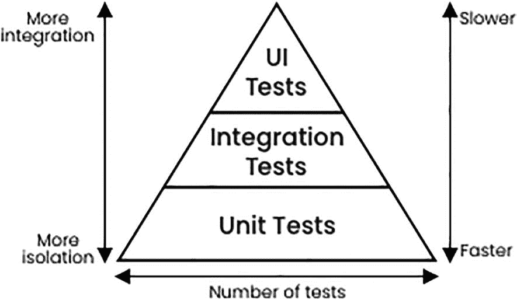

**图 4-3** 最终测试金字塔

在构建自己的测试套件时，测试金字塔是一个很好的经验法则。遵循金字塔形状来构建健康、快速且易于维护的测试套件：编写大量小而快的单元测试；为社交组件编写更多的集成测试；再编写少量端到端的高层级测试来测试整个应用。

