# 5. TDD 深入探讨

至此，你已经了解了测试和 TDD 的基础知识，并利用 TDD 实现了一些简单的示例。本章旨在将此推向更深的层次。我们撰写本书的目标之一，就是向你展示测试驱动软件开发的完整体验。我们想展示 TDD 如何适用于不同类型的项目，而不仅仅是简单的示例。我们将从头开始实现这个项目，使用 TDD 逐步、安全地添加一小段代码，直到我们一起完成整个项目。

## CoffeePot

你是否曾在你最喜欢的咖啡馆排队时，面对琳琅满目的选项感到困惑，最后只好点了一杯你最熟悉的咖啡？即使你现在是个咖啡爱好者，也一定有过还是咖啡新手的阶段。这就是 CoffeePot 的用武之地。它是所有咖啡新手的最佳伙伴。**CoffeePot**是一个旨在帮助你了解各种咖啡类型以及不同咖啡制作方法的应用。你可以把它当作一本终极咖啡指南。在本章结束时，我们将让**CoffeePot**成功运行，随时准备辅助任何咖啡订单。这个应用的灵感主要来源于**Taste of Home**的[这篇](https://www.tasteofhome.com/article/types-of-coffee/)文章，我们的数据也来自这里。

## 放眼全局

处理任何项目或问题的黄金法则是粒度化：你无法一口气完成一个项目。你必须将其分解成小块，然后逐一完成。关键在于如何添加一个微小块，并确保它能正确集成且不破坏已有功能。每个块应该足够重要和具体，以便能判断何时完成；同时也要足够小，以便专注于一个概念并能快速实现。将工作划分为连贯的小块也有助于管理开发风险。

粒度化（图 5-1）非常强大，但你需要始终着眼于最终目标——即完成项目，否则可能会迷失方向。因此，当我们开始实现一个新功能时，我们首先编写验收测试。验收测试会端到端地验证我们想要构建的功能；当验收测试失败时，表明我们尚未完成；当它通过时，我们就完成了。在实现新功能时，测试循环是衡量我们进度的标尺，而不断增长的测试套件则保护我们，在后续修改系统时免于回归错误。同时，我们需要尽可能保持代码简单，使其更容易理解和修改。永远记住：开发者花在阅读代码上的时间比编写代码更多。所以这才是我们应该优化的方向。在 TDD 中，我们可以持续重构代码，以简化和改进设计。反馈循环中的测试套件可以保护我们免于犯错。

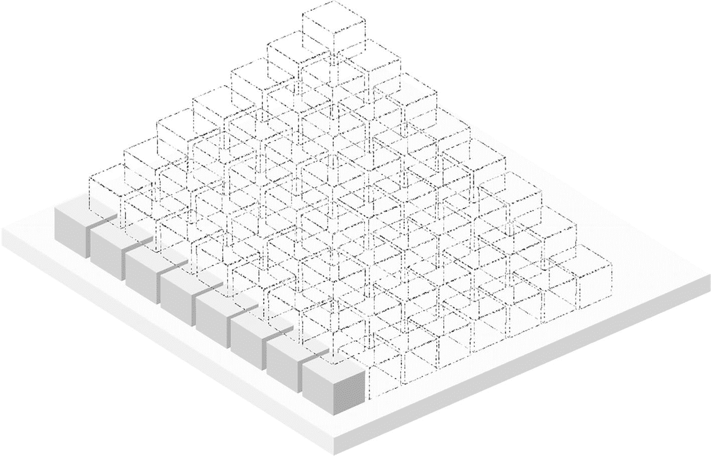

**图 5-1** 粒度化可视化

## 需求

**让我们从用户故事开始：**

如果你不熟悉用户故事，它是一种从最终用户角度编写的、对软件功能的通用说明。

1.  作为一名用户，我想了解所有类型的热饮和冷饮咖啡，包括咖啡饮品的图片。
2.  作为一名用户，我想点击任一咖啡饮品类型，以显示该饮品的更多详细信息，包括咖啡图片和配料简要说明。
3.  作为一名用户，我想了解所有类型的咖啡机，包括咖啡机的图片。
4.  作为一名用户，我想点击任一咖啡机类型，以显示该机器的更多详细信息，包括机器图片和简要的使用说明。

> **注意：** 所有所需数据都包含在初始项目中，格式为`plist`文件。

**项目线框图**（图 5-2）：

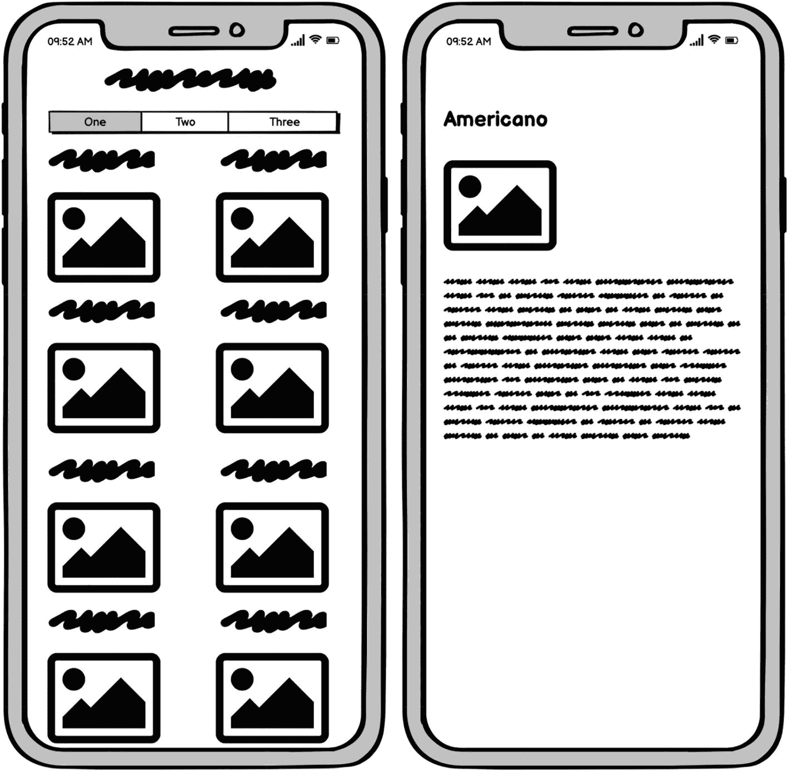

**图 5-2** 线框图


## 测试金字塔

如前一章所述，我们共有三种类型的测试；每种测试都执行特定任务或解答特定问题。在**单元测试**中，我们测试每个类的独立功能——我们的对象是否做了正确的事情？在**集成测试**中，我们测试集成其他组件的组合组件——我们的对象能否正确协作？而在**UI 测试**中，我们进行端到端的系统测试——整个系统是否正常工作？在实现这个项目时，我们将同时使用这三个测试层级，并学习如何将测试金字塔概念与 TDD 实现方法相结合。

用户故事是最小且能独立为用户带来价值的功能。我们将逐个处理用户故事。尽管用户故事很小，但无法一次性实现；我们需要将其拆解为微小模块，然后逐个完成这些模块。我们完成每个用户故事的策略（图 5-3）是：先编写一个会失败的端到端测试，然后通过一组集成测试来设计用户故事。集成测试将定义对象间如何通信；接着我们会遍历每个对象，编写描述其职责的失败单元测试。当所有单元测试通过时，集成测试也将随之通过。


图 5-3  
测试计划示意图

## 第一个故事

> “作为用户，我希望了解所有热饮和冷饮咖啡品种，包括咖啡饮品的图片。”

让我们打开本章资源中的入门项目。首先，我们需要编写一个会失败的端到端测试，验证咖啡饮品视图是否显示所有咖啡饮品（图 5-4）。当这个端到端测试通过时，就表明我们完成了这个用户故事。

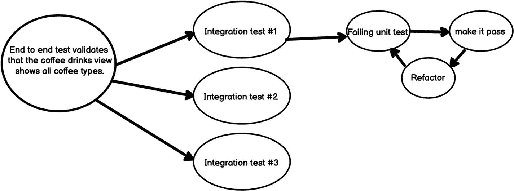

图 5-4  
测试计划示意图（已添加端到端测试）

我们来编写第一个测试（UI 测试）：

```
func testShowsAllCoffeeDrinks() {
    let app = XCUIApplication()
    app.launchEnvironment = ["coffee_drinks_stubbed": "coffee_drinks_stub"]
    app.launch()
    let coffeeCollectionView = app.collectionViews
    XCTAssertTrue(coffeeCollectionView.cells["coffee1"].exists, "Failed to show the first coffee item in plist")
    XCTAssertTrue(coffeeCollectionView.cells["coffee2"].exists, "Failed to show the second coffee item in plist")
}
```

这里我们编写了第一个端到端测试。通过启动参数配置应用（本章后续章节“CoffeeDrinksDataSource”将详细讨论），然后断言集合视图中数据是否正确显示。

## 架构设计

在让端到端测试通过之前，我们先讨论面向对象设计。面向对象设计更关注模块间通信及模块内部对象间的通信，而非对象本身。对象通过消息通信：它接收其他对象的消息，并通过向其他对象发送消息或向原始发送者返回值来做出响应。每个对象必须执行单一职责，这使得我们可以通过改变对象组合（增删实例、组合不同模块）来改变系统行为。

现在我们需要设计对象在后端如何交互以实现所需用户故事。有多种模式可供选择，如 MVC、MVP、MVVM 等。这些设计模式都有助于开发松散耦合、易于测试和维护的应用程序。它们通常将应用划分为不同的组件组，每个组件组承载应用的特定方面。在本项目中，我们将使用简单的 MVP 模式。

## MVP 模式

模型-视图-呈现器（MVP）架构模式（图 5-5）通过呈现器将数据模型与视图分离。

1. **视图**

MVP 中的视图组件包含应用的视觉部分。

它仅包含 UI，不包含任何逻辑或数据的显示知识。它还处理用户与屏幕的交互，并将交互定向到呈现器。

2. **呈现器**

呈现器是连接模型和视图的层。它触发业务逻辑，并告知视图何时更新。它与模型交互，从模型中获取并格式化数据以更新视图。

3. **模型**

模型包含数据提供者、获取和更新数据的代码及业务逻辑。通常数据从网络或本地数据库获取。

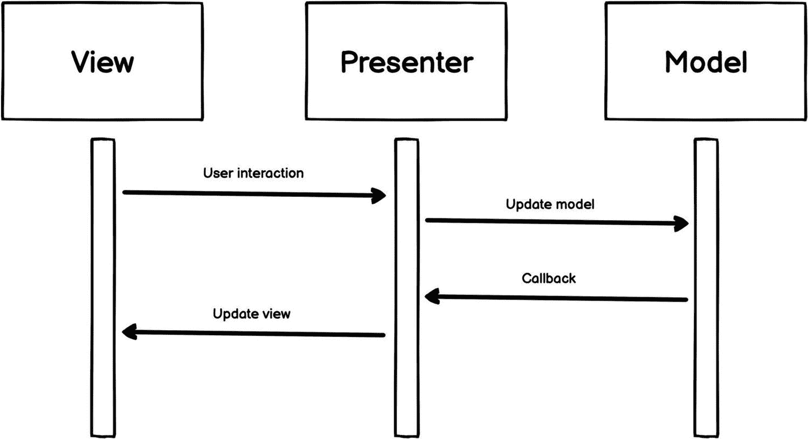

图 5-5  
MVP 设计模式

## 第一个集成测试

集成测试主要负责验证对象如何集成和通信。它让我们优先思考设计，以及所有对象如何履行职责并在系统内部交互。如第 4 章所述，我们为高度交际性组件编写集成测试。将 MVP 设计模式应用于第一个用户故事的逻辑后，我们会发现呈现器就是这样的交际性组件。我们的设计可能如图 5-6 所示。

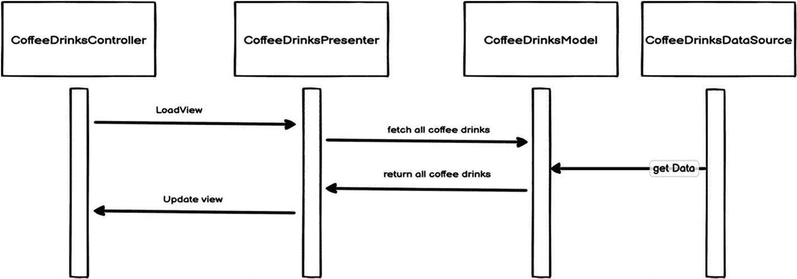

图 5-6  
MVP 应用场景

如果将示意图转换为代码：当`CoffeeDrinksController`加载时，将初始化`CoffeeDrinksPresenter`，其构造函数接收`CoffeeDrinksModel`。`CoffeeDrinksPresenter`包含获取所有咖啡饮品的方法，并在底层抽象与`CoffeeDrinksModel`的通信；模型返回饮品数据后，`CoffeeDrinksPresenter`更新视图。对应的测试如下：

```
func testFetchingAllCoffeeDrinks() {
    //Given
    let expectedDrinks = """
    [
    {
        "name": "coffee1",
        "image_name": "black",
        "desc": "desc1"
    },
    {
        "name": "coffee2",
        "image_name": "black",
        "desc": "desc2"
    }
    ]
    """
    let coffeeDrinksDataSource = CoffeeDrinksDataSourceStub(stubbedDataJSON: expectedDrinks)
    let coffeeDrinksModel = CoffeeDrinksModel(source: coffeeDrinksDataSource)
    let coffeeDrinksPresenter = CoffeeDrinksPresenter(model: coffeeDrinksModel)
    // when & then
    XCTAssertEqual(coffeeDrinksPresenter.getDrinksCount(), 2)
    XCTAssertEqual(coffeeDrinksPresenter.getDrinkName(index: 0), "coffee1")
    XCTAssertEqual(coffeeDrinksPresenter.getDrinkImageName(index: 0), "black")
    XCTAssertEqual(coffeeDrinksPresenter.getDrinkName(index: 1), "coffee2")
    XCTAssertEqual(coffeeDrinksPresenter.getDrinkImageName(index: 1), "black")
}
```

当前测试状态如图 5-7 所示。

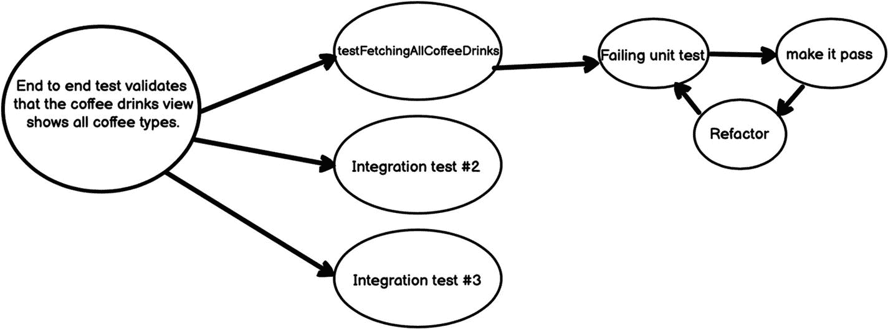

图 5-7  
测试计划示意图（已添加集成测试#1）

### 单元测试

如果运行集成测试，它肯定会失败。我们需要遍历每个对象并开始使用单元测试实现，直到集成测试通过。我们将编写一个会失败的单元测试，使其通过，然后重构——如图 5-8 所示。

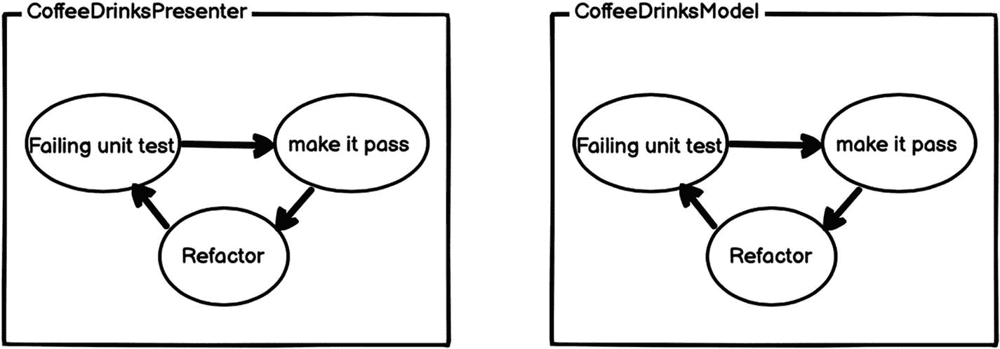

图 5-8  
单元级 TDD 循环


### `CoffeeDrinksDataSource`

我们从最小的单元`CoffeeDrinksDataSource`开始。它是一个对象，唯一职责是从磁盘读取 plist 文件，并以`Data`的形式返回。由于其特性，我们会发现为它编写测试基本上等同于重复实现代码。这是一个极为罕见的案例，我们遇到的类不需要测试。但与此同时，我们又不能将这种逻辑注入到另一个类中，因为我们需要用它来辅助其他测试。（本章后面会详细讨论这一点。）

现在我们来编写这个类：

```
class CoffeeDrinksDataSource {
    func plistDataSourcePath() -> String? {
        var fileName = "coffee_drinks"
        // UITests
        if let stubbedFileName = ProcessInfo.processInfo.environment["coffee_drinks_stubbed"] {
            fileName = stubbedFileName
        }
        return Bundle.main.path(forResource: fileName, ofType: "plist")
    }

    public func getData() -> Data? {
        let dataPath = plistDataSourcePath()
        guard let path = dataPath, let dataArray = NSArray(contentsOfFile:path) else {
            return nil
        }
        var data:Data?
        do {
            data = try JSONSerialization.data(withJSONObject: dataArray)
        } catch {
            print("JSON serialization failed:  \(error)")
        }
        return data
    }
}
```

`CoffeeDrinksDataSource`的实现用于从 plist 文件中读取数据并返回数据。我们还需要添加一些仅用于 UI 测试的额外逻辑。有时，我们需要让 UI 测试代码将信息传递给移动应用，不是通过文本字段输入或用户交互，而是通过命令行参数或启动环境/参数来发送。如果你还记得我们编写的第一个 UI 测试，我们需要对咖啡饮品视图内的数据进行桩处理，而不是依赖可能随应用生命周期变化并导致测试不可靠的实际数据。这里我们通过环境变量添加了桩处理数据源返回数据的能力。我们使用`ProcessInfo.processInfo.environment`来访问环境变量。

### `CoffeeDrinksModelTests`

由于`CoffeeDrinksModel`依赖于`CoffeeDrinksDataSource`，如果我们要精确地测试它，就需要排除所有`CoffeeDrinksModel`所依赖的对象，使其返回预期的数据，并对`CoffeeDrinksModel`内部所有公有方法进行断言。这就是所谓的**桩处理**。

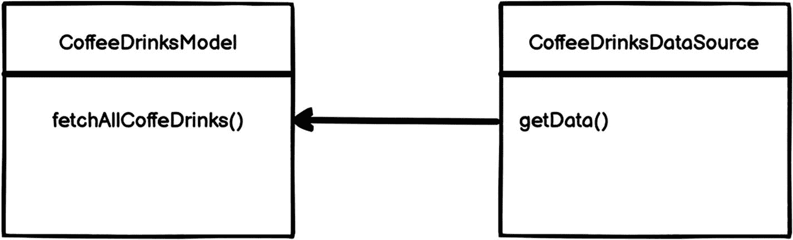

图 5-9  
`CoffeeDrinksModel`对`CoffeeDrinksDataSource`的依赖

桩处理意味着创建一个对象的虚假版本，用来替代真实对象，帮助你的测试运行得更快、更可靠。从现在开始，我们需要对某些组件进行桩处理。我们不会深入探讨这个话题，因为稍后将在第 7 章中介绍。

在图 5-9 中，`CoffeeDrinksModel`类使用`CoffeeDrinksDataSource`从 plist 文件中获取所有咖啡饮品。在不进行桩处理`CoffeeDrinksDataSource`的情况下测试`CoffeeDrinksModel`将会很有挑战性，并且不可靠；换句话说，如果我们更改 plist 文件中的数据，这个测试将会失败。桩处理（图 5-10）的目的是隔离并专注于被测试的代码，而不是外部依赖的行为或状态。这里的外部依赖是`CoffeeDrinksDataSource`，它提供来自 plist 文件的数据。

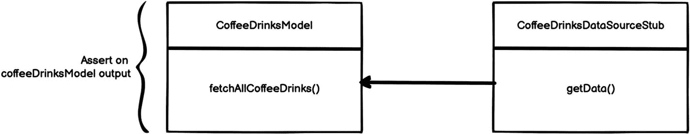

图 5-10  
用桩对象替换依赖

现在我们来编写桩对象：

```
class CoffeeDrinksDataSourceStub: CoffeeDrinksDataSource {
    var stubbedDataJSON: String?
    init(stubbedDataJSON: String){
        self.stubbedDataJSON = stubbedDataJSON
    }

    public override func getData() -> Data? {
        let jsonData = self.stubbedDataJSON?.data(using: .utf8)
        return jsonData
    }
}
```

`CoffeeDrinksDataSourceStub`会在其构造函数中接收预期数据，并在`getData()`函数中将其作为数据返回。因此没有逻辑，我们可以单独测试`CoffeeDrinksModel`。

现在让我们使用新创建的桩对象为`CoffeeDrinksModel`编写测试：

```
func testFetchingAllCoffeeDrinks() {
    //Given
    let expectedDrinks = """
    [
        {
            "name": "coffee1",
            "image_name": "black",
            "desc": "desc1"
        },
        {
            "name": "coffee2",
            "image_name": "black",
            "desc": "desc2"
        }
    ]
    """
    let coffeeDrinksDataSource = CoffeeDrinksDataSourceStub(stubbedDataJSON:expectedDrinks)
    let coffeeDrinksModel = CoffeeDrinksModel(source: coffeeDrinksDataSource)

    // when
    let actualDrinks = coffeeDrinksModel.fetchAllCoffeDrinks()

    // then
    let coffeeDrink1 = actualDrinks![0]
    XCTAssertEqual(coffeeDrink1.name, "coffee1")
    XCTAssertEqual(coffeeDrink1.imageName, "black")
    XCTAssertEqual(coffeeDrink1.description, "desc1")

    let coffeeDrink2 = actualDrinks![1]
    XCTAssertEqual(coffeeDrink2.name, "coffee2")
    XCTAssertEqual(coffeeDrink2.imageName, "black")
    XCTAssertEqual(coffeeDrink2.description, "desc2")
}
```

在应用 TDD 周期，我们逐步构建测试用例直至达到上述全面的测试后，最终会得到以下两个组件：

```
class CoffeeDrinksModel {
    private var dataSource:CoffeeDrinksDataSource?
    init(source:CoffeeDrinksDataSource?) {
        self.dataSource = source
    }

    public func fetchAllCoffeDrinks() ->[CoffeeDrink]? {
        guard let data = self.dataSource?.getData() else {
            return []
        }
        var drinks:[CoffeeDrink]?
        do {
            drinks = try JSONDecoder().decode([CoffeeDrink].self, from: data)
        } catch {
        }
        return drinks
    }
}
```

```
struct CoffeeDrink: Codable, Equatable {
    let name:String?
    let imageName: String?
    let description: String?

    private enum CodingKeys : String, CodingKey {
        case name = "name"
        case imageName = "image_name"
        case description = "desc"
    }
}
```

让我们注释掉`CoffeeDrinksIntegrationTests`中之前的测试，然后运行`CoffeeDrinksModelTests`。

现在应该可以通过了 ✅。

这将是我们当前的状态（图 5-11）。

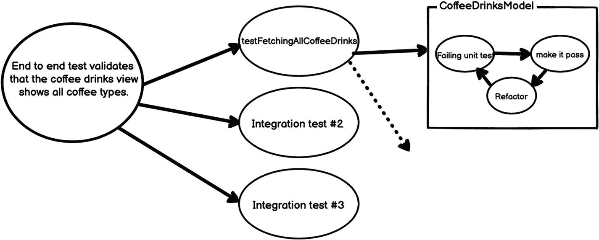

图 5-11  
测试计划图（已添加第一个单元）


### CoffeeDrinksPresenterTests

我们已经为 presenter 添加了一个集成测试，所以你可能认为不需要再为它编写单元测试了。但事实并非如此。集成测试永远无法替代单元测试。正如我们在第 4 章中所述，每种测试都有其不同的目的。我们编写了一个测试来验证 presenter 能否与其他组件正确集成。现在我们需要为它编写测试，但这次是隔离测试。

同样，`CoffeeDrinksPresenter` 依赖于 `CoffeeDrinksModel`。如果我们需要测试它，就需要对 `CoffeeDrinksPresenter` 所依赖的所有这些对象进行桩处理，并返回预期数据。这里我们为 `CoffeeDrinksModel` 编写一个桩，它在构造函数中接收预期数据，并在 `fetchAllCoffeDrinks()` 函数中将其作为数据返回：

```
class CoffeeDrinksModelStub: CoffeeDrinksModel {
    var stubbedDrinks:[CoffeeDrink]?
    init(stubbedDrinks:[CoffeeDrink]) {
        super.init(source: nil)
        self.stubbedDrinks = stubbedDrinks
    }
    public override func fetchAllCoffeDrinks() ->[CoffeeDrink]? {
        return self.stubbedDrinks
    }
}
```

现在让我们开始逐一编写测试：

```
func testFetchingDrinksCount() {
    //给定
    let drinks = [CoffeeDrink(name: "coffee1",imageName: "black",description: "desc1"),
                  CoffeeDrink(name: "coffee2",imageName: "black",description: "desc2")]
    let coffeeDrinksModel = CoffeeDrinksModelStub(stubbedDrinks: drinks)
    let coffeeDrinksPresenter = CoffeeDrinksPresenter(model:coffeeDrinksModel)
    // 当 & 则
    XCTAssertEqual( coffeeDrinksPresenter.getDrinksCount(), 2)
}
func testFetchingDrinksName() {
    //给定
    let drinks = [CoffeeDrink(name: "coffee1",imageName: "black",description: "desc1"),
                  CoffeeDrink(name: "coffee2",imageName: "black",description: "desc2")]
    let coffeeDrinksModel = CoffeeDrinksModelStub(stubbedDrinks: drinks)
    let coffeeDrinksPresenter = CoffeeDrinksPresenter(model:coffeeDrinksModel)
    // 当 & 则
    XCTAssertEqual(coffeeDrinksPresenter.getDrinkName(index:0), "coffee1")
    XCTAssertEqual(coffeeDrinksPresenter.getDrinkName(index:1), "coffee2")
}
func testFetchingDrinksImagesName() {
    //给定
    let drinks = [CoffeeDrink(name: "coffee1",imageName: "black",description: "desc1"),
                  CoffeeDrink(name: "coffee2",imageName: "black",description: "desc2")]
    let coffeeDrinksModel = CoffeeDrinksModelStub(stubbedDrinks: drinks)
    let coffeeDrinksPresenter = CoffeeDrinksPresenter(model:coffeeDrinksModel)
    // 当 & 则
    XCTAssertEqual(coffeeDrinksPresenter.getDrinkImageName(index:0), "black")
    XCTAssertEqual(coffeeDrinksPresenter.getDrinkImageName(index:1), "black")
}
```

如你所知，每编写完一个测试，我们就会反复应用 TDD 循环。在编写完上述所有测试并使它们逐个通过后，我们最终会得到以下类：

```
class CoffeeDrinksPresenter {
    private var model:CoffeeDrinksModel?
    var drinks:[CoffeeDrink]?
    init(model:CoffeeDrinksModel?) {
        self.model = model
        self.drinks = self.model?.fetchAllCoffeDrinks()
    }
    public func getDrinksCount() -> Int {
        self.drinks?.count ?? 0
    }
    public func getDrinkName(index:Int) -> String? {
        guard let drink = self.drinks?[index] else {
            return nil
        }
        return drink.name
    }
    public func getDrinkImageName(index:Int) -> String? {
        guard let drink = self.drinks?[index] else {
            return nil
        }
        return drink.imageName
    }
}
```

现在我们可以运行 `CoffeeDrinksPresenterTests`，它应该能通过 ✅。

我们还可以取消注释 `CoffeeDrinksIntegrationTests` 并运行，它也应该能通过。现在，当前状态（图 5-12）是每个对象在单独工作时表现良好，在集成在一起时也表现良好。

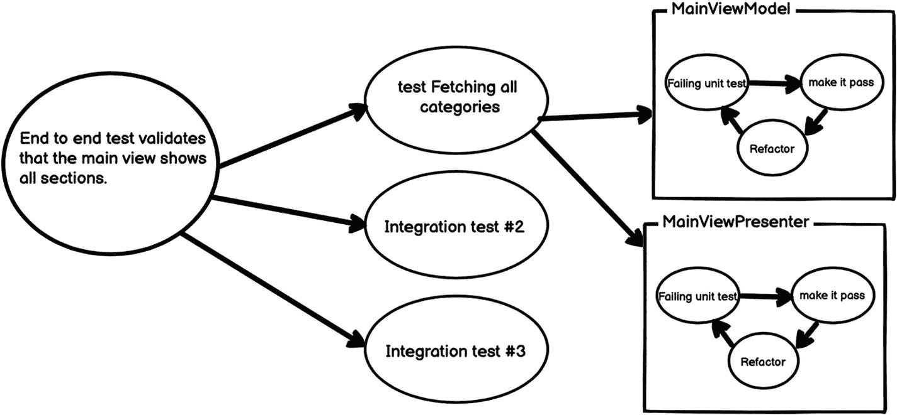

图 5-12 测试计划图（已添加第二个单元）

现在让我们实现功能的最后一部分，将数据填充到视图中。之后，我们需要运行端到端测试以确保一切正常。一旦我们看到图 5-13，我们的第一个用户故事就完成了。这个功能似乎很简单。我们将对剩余的故事实施相同的过程。

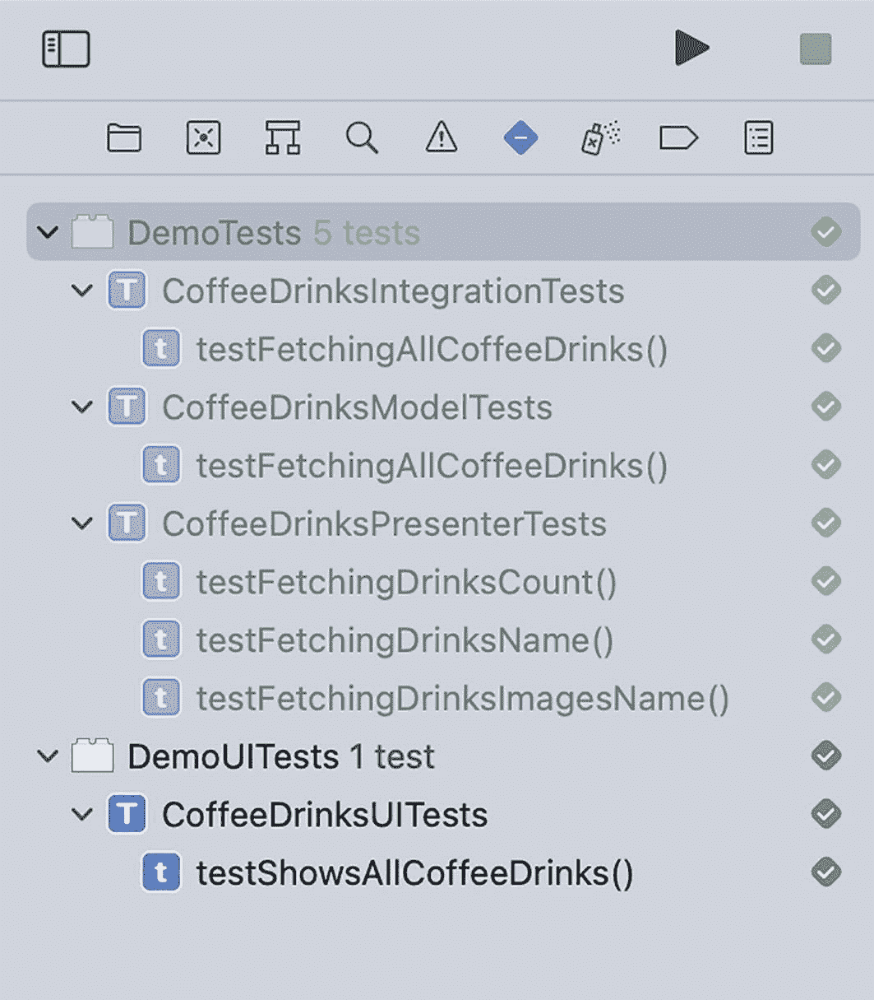

图 5-13 所有已添加的测试

我们没有详细讨论该功能 UI 元素的实现，但你可以在本章的资源中找到相关代码。

## 测试健康检查

我们需要验证，当测试通过时，它表明一切正常；当测试失败时，表明存在问题，并且问题可以通过测试识别出来。在图 5-14 中，列出了所有可能的错误位置。所以让我们故意引入一个错误，看看我们的测试能否捕获它。

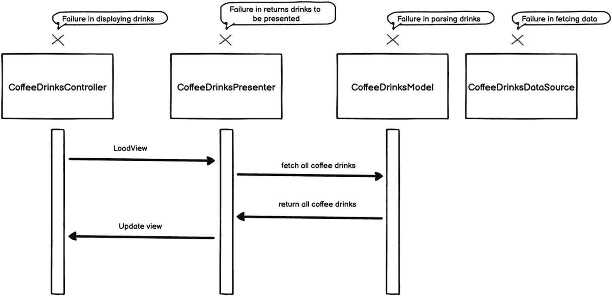

图 5-14 可能的错误

示例：让我们尝试更改 `CoffeeDrinksPresenter` 中的 `getDrinkName`，使其返回 `imageName` 而不是 `name`（图 5-15），然后运行我们的测试。

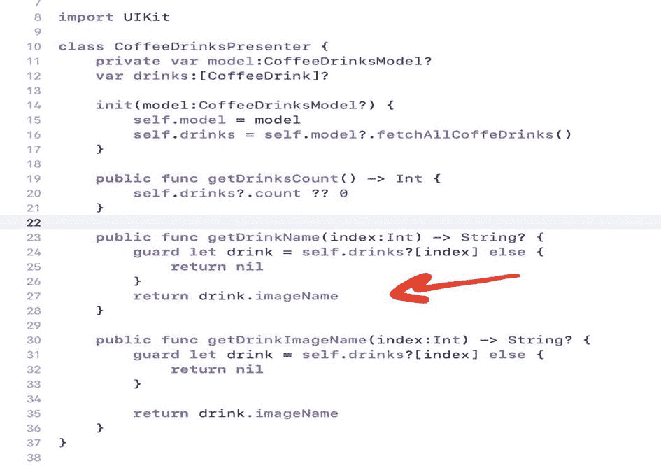

图 5-15 有缺陷的代码更改

现在让我们运行测试（图 5-16）。

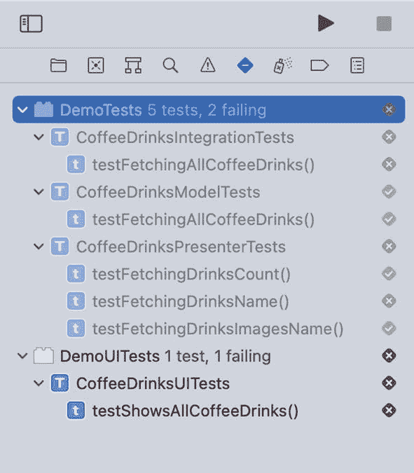

图 5-16 测试失败

测试成功捕获了该错误。

## 第二个故事

> *“作为用户，我想点击任何咖啡饮品类型，以查看该饮品的更多详细信息，包括咖啡图片和成分的简要描述。”*

我们需要编写一个会失败的端到端测试，以验证点击任何咖啡饮品类型将显示该饮品的详细信息。（图 5-17）

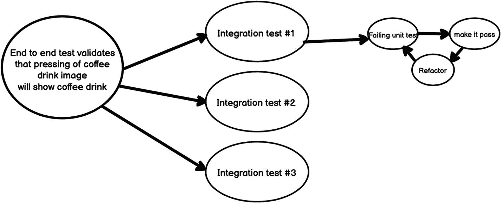

图 5-17 测试计划图

让我们为这个故事编写第一个测试：

```
func testDetailedCoffeeView() {
    let app = XCUIApplication()
    app.launchEnvironment = ["coffee_drinks_stubbed": "coffee_drinks_stub"]
    app.launch()
    let coffeeCollectionView = app.collectionViews
    coffeeCollectionView.cells["coffee1"].tap()
    XCTAssertTrue(app.navigationBars["coffee1"].exists)
    XCTAssertEqual(app.textViews["desc"].value as? String, "description1")
}
```

这里我们为这个故事编写了端到端测试。我们使用启动参数设置应用程序。然后导航到特定饮品页面，并断言其详细信息正确显示。


## 架构

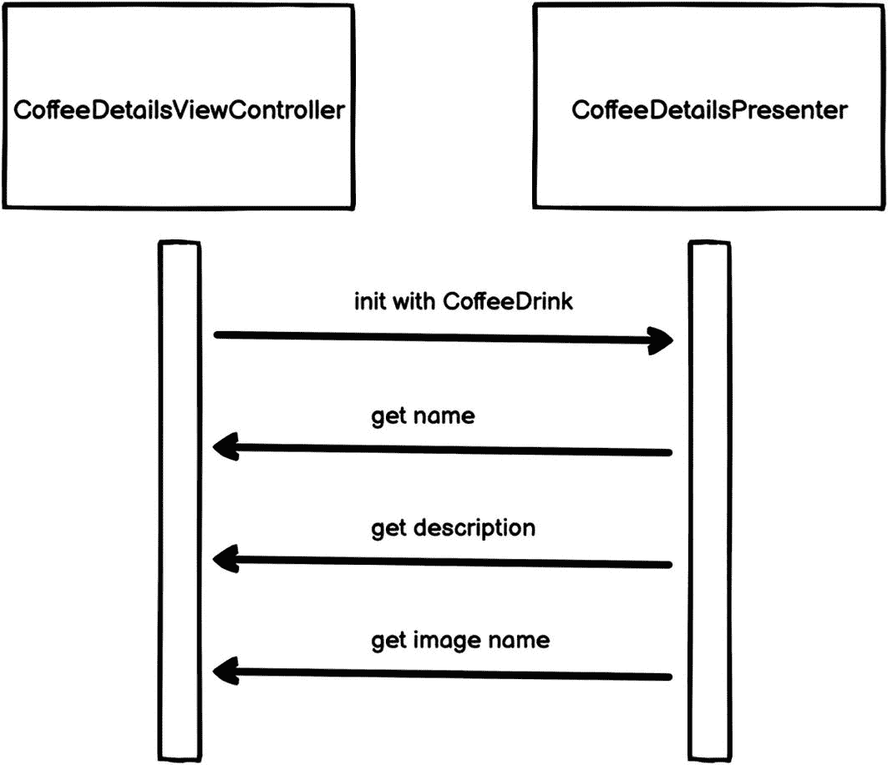

图 5-18

MVP 应用实例

如图 5-18 所示，实现该功能涉及的集成对象并不多。这基本上意味着没有需要编写集成测试的社交组件。因此，只需为 `CoffeeDetailsPresenter` 编写单元测试就足够了。

让我们逐一编写测试：

```
func testFetchingDrinkName() {
    // 给定
    let coffeeDetailsPresenter = CoffeeDetailsPresenter(drink:CoffeeDrink(name: "coffee1",imageName: "black",description: "desc1"))
    // 当 & 则
    XCTAssertEqual(coffeeDetailsPresenter.getName(), "coffee1")
}
func testFetchingDrinkDescription() {
    // 给定
    let coffeeDetailsPresenter = CoffeeDetailsPresenter(drink:CoffeeDrink(name: "coffee1",imageName: "black",description: "desc1"))
    // 当 & 则
    XCTAssertEqual(coffeeDetailsPresenter.getDescription(), "desc1")
}
func testFetchingDrinkImageName() {
    // 给定
    let coffeeDetailsPresenter = CoffeeDetailsPresenter(drink:CoffeeDrink(name: "coffee1",imageName: "black",description: "desc1"))
    // 当 & 则
    XCTAssertEqual(coffeeDetailsPresenter.getImageName(), "black")
}
```

在编写完上述所有测试，并运用 TDD 方法逐个使其通过后，最终将得到以下类：

```
class CoffeeDetailsPresenter {
    private var drink:CoffeeDrink?
    init(drink:CoffeeDrink?) {
        self.drink = drink
    }
    public func getName() -> String? {
        guard let drink = self.drink else {
            return nil
        }
        return drink.name
    }
    public func getImageName() -> String? {
        guard let drink = self.drink else {
            return nil
        }
        return drink.imageName
    }
    public func getDescription() -> String? {
        guard let drink = self.drink else {
            return nil
        }
        return drink.description
    }
}
```

在添加所有测试后，我们的测试套件（图 5-19）和应用程序（图 5-20）将呈现如下状态：

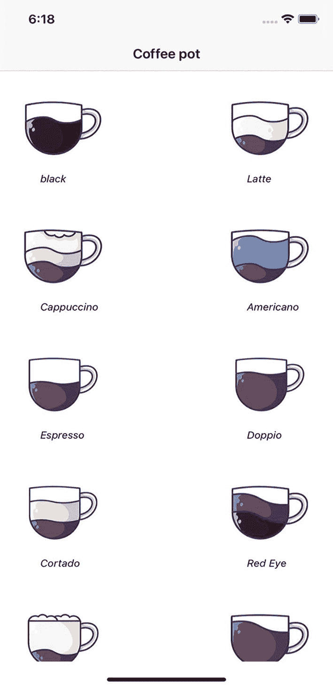

图 5-20

应用主屏幕

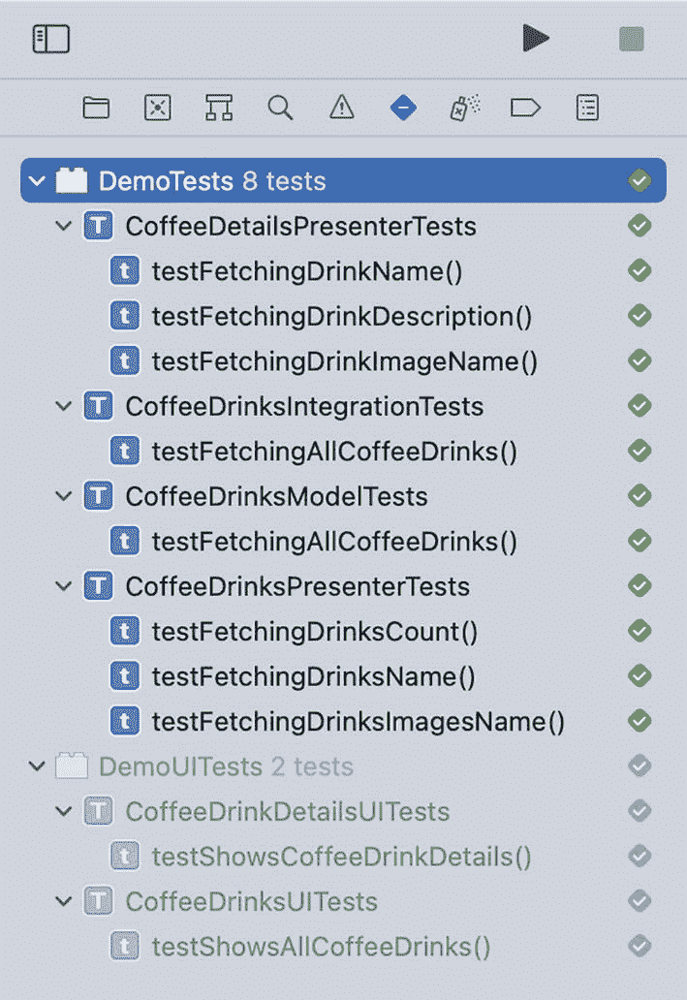

图 5-19

最终测试套件

与第一个功能相同，我们没有深入探讨 UI 的实现细节，但你可以在本章的资源中找到相关代码。

## 练习

我们已经完成了第一个和第二个故事。但还有两个故事需要处理。你应该能够应用本章介绍的相同流程来实现这两个故事。你可以在本章资源中找到已完成前两个故事的最终项目。

## 总结

在本章中，我们探讨了如何在稍复杂的项目上应用 TDD，这与你在日常工作中可能遇到的挑战类似。我们介绍了 **CoffeePot**，这是一款帮助用户了解不同咖啡类型差异的应用。该应用有两个视图：一个视图列出所有咖啡类型，另一个是单个咖啡类型的详情视图。

在处理此类项目时，我们不能指望一蹴而就。这不仅不切实际，还会导致代码质量低下。关键在于粒度，我们要将项目分解为较小的逻辑块，然后逐一完成。TDD 帮助我们以粒度化的方式思考。由于我们始终需要从一个失败的测试开始，这本质上就是一个单一需求，此时这个需求就是我们要处理的小块。通过应用 TDD 循环，我们在思考下一个块之前就完成了当前块。

为了将项目分解为更小的块，第一步是正确定义并全面思考所有项目需求。然后，我们将这些需求转化为测试。第一个需求作为我们的第一个测试，启动 TDD 循环。我们不断重复这个循环，直到完成所有已定义的需求。

我们以第一个需求为例——即查看所有咖啡类型及其图片。在我们甚至还未思考如何实现它之前，就先为此编写了一个 UI 测试。通常，由于尚未添加任何代码，这个测试会失败。如前所述，TDD 迫使我们清晰思考设计与架构。在本例中，我们采用了名为模型-视图-展示器（MVP）的流行设计模式，这让我们清楚了解要添加的组件以及它们之间的交互方式。由于明确了代码设计思路，我们随后降级添加了集成测试。最后再降一级，开始添加单元测试，并不断循环 TDD 过程，直至所有测试（包括最初添加的集成测试和 UI 测试）全部通过（图 5-21）。端到端测试通过标志着该功能开发完成。然后我们选取下一个需求，重复相同的测试驱动流程。


图 5-21

用于 TDD 的测试计划图

