# 6. 模块化制胜

模块化是指将系统划分为多个相对独立、可互换且具有明确定义接口的模块，每个模块包含执行所需功能的一切要素。每个模块都足够小、足够简单，以便被彻底理解和充分测试。

尽管模块化是极其重要的设计方面，但当代码库增长时，它通常是开发者最先牺牲的部分之一。他们可能仍然命名模块，但模块之间相互依赖，最终形成一团**泥球**。这个术语用于描述缺乏可感知架构的软件系统。


## 为何要费心进行模块化？

从模块化的简短定义中，你或许已经觉得它是个让应用锦上添花的特性。但我们真的需要它吗？在设计应用架构时，我们有必要投入额外的精力来确保它被恰当地模块化吗？而将一个现有应用进行模块化，又是否值得我们付出更大的努力呢？

要回答这些问题，一种方法是观察模块化应用与非模块化应用如何应对扩展的挑战。扩展是任何成功应用都会经历的过程，它基本意味着用户数量的增加、应用本身及其内部功能特性的增多、发布频率的加快，以及在大多数情况下，团队规模的扩大。

我们来谈谈这两类应用如何处理其功能和特性的扩展。如果审视一个非模块化应用，并试图理清其组件之间如何相互依赖和通信，我们最终会得到一个依赖关系图，它可能看起来像图 6-1 所示。这是一个示例图，但对于非模块化应用来说相当真实。这样的图可能代表着一个简单、功能单一的应用。所以，如果你已经觉得这个图很复杂，那么当我们试图扩展这个应用时，这个图几乎肯定会变成一张由节点和边构成的混乱网络。遗憾的是，应用依赖关系图的可读性差并不是我们在这种情况下唯一的问题。如果我们只担心图不好看，那完全可以不去看它。然而，我们真正的问题在于这个图所代表的东西：依赖关系。依赖关系越多，应用就变得越不可预测。

这种不可预测性在我们开始在某处添加新功能，却在应用中一个完全不同的地方引入了一个 Bug 或导致崩溃时变得尤为明显。所以，基本上由于我们复杂且不受管理的依赖关系，当引入一个变更时，我们永远无法知道这个变更对应用的影响范围。另一方面，在模块化应用中做同样的事情则截然不同（图 6-2）。由于代码的完全分离，实施一个变更意味着只会影响我们正在修改的那个模块。另一个需要考虑的方面是处理 Bug。在一个像图 6-2 中模块化应用那样组织有序、结构清晰的应用中追踪 Bug，显然比在图 6-1 中那样要容易得多。可能只需阅读 Bug 的描述，我们就能识别出该查看哪个模块。然而，在非模块化应用中，调试 Bug 会繁琐得多。

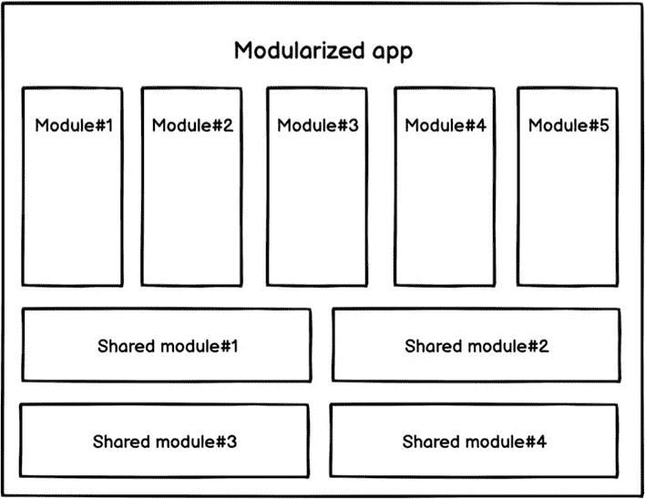

图 6-2：模块化应用

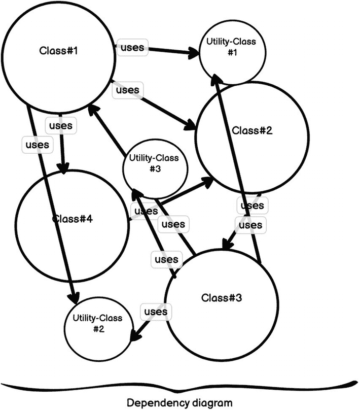

图 6-1：非模块化应用

除了应用本身的规模，管理和维护应用的团队规模也可能扩大。这会带来一些挑战；其中之一就是新成员的入职。你的代码库可读性越高，入职过程就越顺畅。试图理解一个拥有大量相互连接组件的非模块化应用的代码库可能会非常令人困惑。这就是为什么模块化应用凭借其分离的设计，可读性会强得多。在模块化应用中，找到代码中负责某个特定功能的部分，就像找到相关的模块并在其中查找一样简单，而不是在整个代码库中翻找。

大型团队带来的另一个挑战是团队之间的协作方式。在模块化应用中，可以让多个成员同时处理不同的功能，而无需相互沟通；当然，前提是每个人都在处理不同的模块。由于变更的分离，这种在不同模块上的并行工作也几乎不会产生冲突。这显然不适用于非模块化应用，因为试图进行同样的并行工作需要付出大量额外的努力来在团队成员之间沟通变更并解决冲突。模块化还使得分配代码所有权成为可能。将模块的所有权分配给特定的团队成员或子团队要容易得多。

模块化应用的优点（以及非模块化应用的缺点），并不仅仅适用于大型应用。这些优缺点适用于各种规模的应用。然而，应用越大，这些优缺点就越被放大。从中得出的结论是，你不需要等到应用需要扩展时才考虑模块化。即使你的应用规模很小，你也能收获很多好处。并且，随着未来你的应用规模扩大，你将为自己带来呈指数级增长的好处。


## 什么是模块？

在本章中，我们已经多次提到“模块”这个词，但还没有正确定义模块到底是什么。到目前为止，你可能对它已有概念，而且很可能八九不离十。但让我们先统一一个准确的定义。一般来说，模块是一段独立的代码，提供特定且高内聚的功能。

虽然这个定义听起来合理，但让我们通过一个实际例子来看看模块究竟长什么样。如果你用过 iOS 设备，那你肯定用过 App Store。我们来仔细看看 App Store 的 iOS 应用（图 6-3），并尝试将它划分为多个模块。

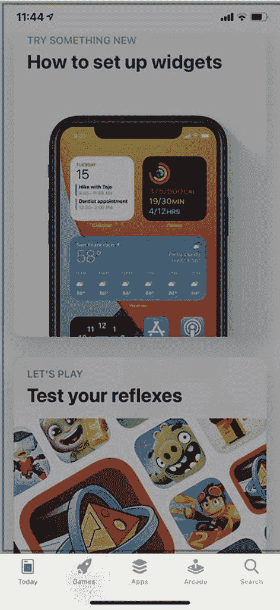

图 6-3  
App Store 应用

我们可以将主应用拆分为五个模块；每个模块对应底部标签栏中的一个标签。而这些主模块还可以进一步拆分为更多子模块。所以在这里，模块就是一组为最终用户提供内聚功能的功能集合：

1.  “今日”模块
2.  “游戏”模块
3.  “应用”模块
4.  “Arcade”模块
5.  “搜索”模块

除了主模块，我们还需要将共享代码分离到模块中，以便在不同模块间轻松复用。如果我们进一步探索这个应用，会发现图 6-4 中的应用页面可以从所有五个主模块中访问。这意味着该功能属于一个子模块，被五个主模块所共用。

如果由于某些原因我们决定不保留这个子模块，那就只能采取两种做法之一。要么在所有五个主模块中重复实现应用页面的功能，这显然是一种很糟糕的代码坏味道。如果那样做，每次需要修改应用页面功能时，我们都得在五个地方进行更新。而这仅仅是代码重复问题的冰山一角。另一种选择是将这个公共功能实现在五个模块中的某一个里，比如“今日”模块，然后让其他四个模块依赖“今日”模块。这种设计决策很快就会导致图 6-1 所示的情况——模块拥有它们并不需要的依赖关系，最终可能导致依赖循环。因此，最好的做法始终是将不相关的代码完全分离。

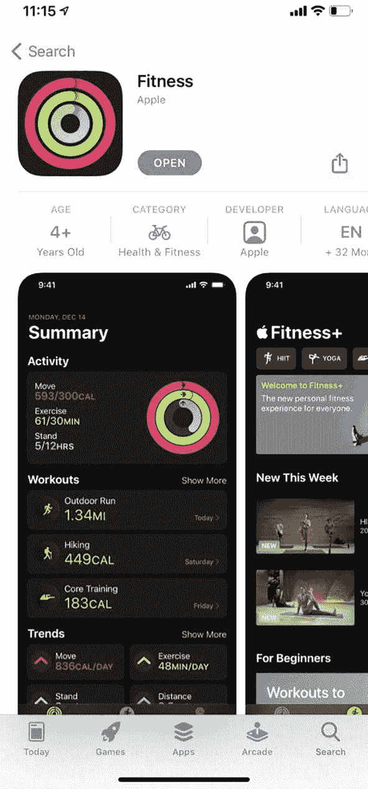

图 6-4  
App Store 中的应用页面

模块并不仅仅由内聚的功能组成，比如我们的五个主模块或应用模块；只要底层功能是内聚的，我们也可以为它们创建模块。对于 App Store 来说，我们可以有一个网络模块、一个分析模块，等等。这些底层模块的美妙之处在于，如果编写得足够好，它们可以在不同的应用之间复用。

因此，如果我们将 App Store 应用模块化，结果将类似于图 6-5。

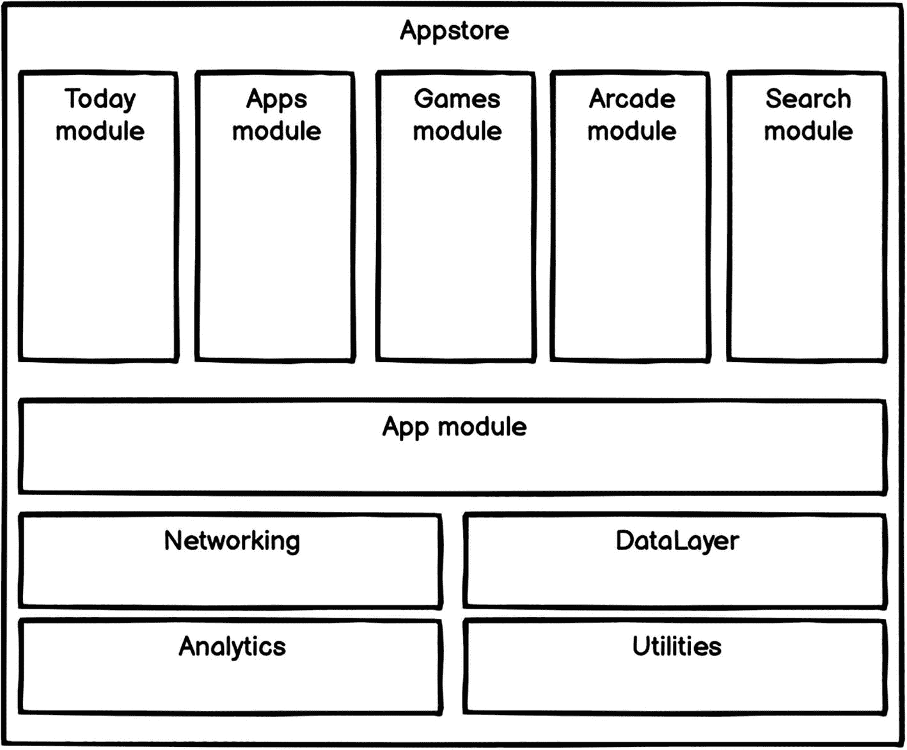

图 6-5  
App Store 模块地图

我们应始终避免模块之间出现依赖循环，也就是说，不能让模块 A 依赖模块 B，同时模块 B 又依赖模块 A。出现这种循环表明存在代码坏味道，我们应该尝试通过重构来打破它。

## 模块化你的应用

在从头开始开发一个全新应用时，最好在设计阶段就采用模块化方法。将一个非模块化的应用转变为模块化应用，是一个成本高昂的过程。而防患于未然总是更好的选择。然而，如果你恰好处于需要重构的境地，解决这个问题也并非不可能。本章的剩余部分将指导你如何应对这一过程。

当你面对一个非模块化的应用并希望将其模块化时，你有两种选择：重写整个应用，或者重构应用。

重写应用很简单。你基本上可以抛弃现有的绝大部分代码，从零开始。这是一种非常激进的方法，需要巨大且突然的投入。由于所需投入水平很高，因此伴随的风险也高。重写时间很可能会超出预期，从而引发许多问题。但就像生活中大多数事情一样，当你投入高成本并接受高风险，并且一切顺利时，最终也会获得高回报。如果选择这种方法，你会立即感受到效果。重写应用的另一个问题是，你必须在重写完成前暂停所有新功能的开发。暂停的替代方案是重复劳动，因为你需要在旧应用和新重写的应用中各实现一次新功能，这成本相当高。

尽管激进的重写方法有一些好处，但它也有相当明显的缺点，而且在大多数情况下，走这条路是行不通的。幸运的是，我们有另一种选择，那就是渐进式重构。与重写方法相反，这是一种低投入、低风险、低影响的方法。它允许我们按照自己的节奏模块化应用，同时不阻碍新功能的发布。由于变更影响很小，这也意味着风险很小。其中一个缺点是模块化速度较慢，但这完全掌握在我们手中，我们可以根据多种决定因素来加快或减慢速度。

然而，最大的缺点是采用这种方法需要技巧，并且要遵循一个深思熟虑的过程。否则，我们的重构可能会导致应用中出现回归问题。为了避免这种情况，我们需要通过测试来确保正在重构的代码部分在重构前后都能正常工作。但这并不是我们使用测试的唯一目的。重要的是，就像编写新代码一样，你的重构过程也要由测试驱动。并且，始终建议采用循序渐进的方法，不要迈出太大的步子，以避免引入破坏性变更。


## 书籍应用介绍

**书籍**是一款展示最新畅销书的简易应用（图 6-6）。本章及后续章节中，我们将持续维护并改进这款**书籍**应用。你可以在本章的资源中找到该项目。尽管它看似简单，却会揭示你在处理遗留应用时可能遇到的诸多问题。对我们而言，遗留应用就是未经测试、且轻易改动便可能出问题的应用。在接下来的章节中，我们将把**书籍**从一个易出错的遗留应用，改造成一个可扩展且易于维护的应用。

**书籍**依赖于向纽约时报 API 发送请求。为保障应用正常运行，你需要一个有效的 API 密钥。获取密钥的具体步骤可在项目的 README 文件中找到。请务必将项目中所有 `"YOUR_API_KEY"` 的实例替换为实际的 API 密钥。同时，确保在后续章节添加的所有代码片段中也进行相应替换。


图 6-6
遗留版书籍应用

使用**书籍**应用的挑战之一在于它并未采用现代架构。相反，大量的业务逻辑、网络调用和持久化逻辑都集中在单一视图控制器中。目前它尚能运行，就像所有遗留代码一样。但随着我们深入使用，你会发现添加新功能是多么困难且充满风险。

本章的目标，是将这个包含众多功能的遗留单体应用（图 6-7），转换为模块化应用，每个模块对应一组相关的功能特性。

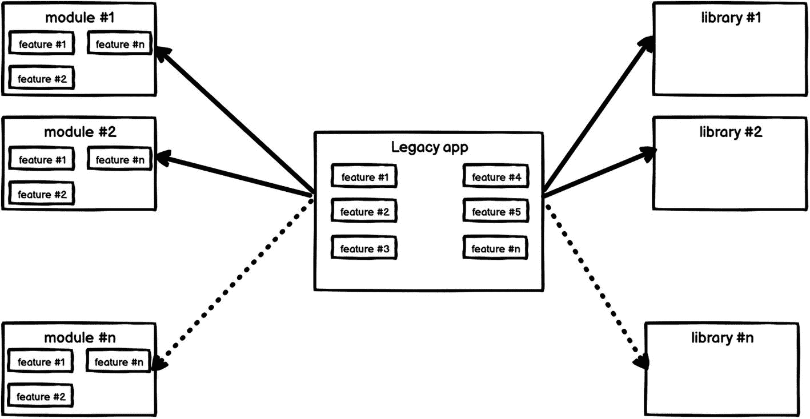

图 6-7
遗留应用模块映射

最终结果应如图 6-8 所示。

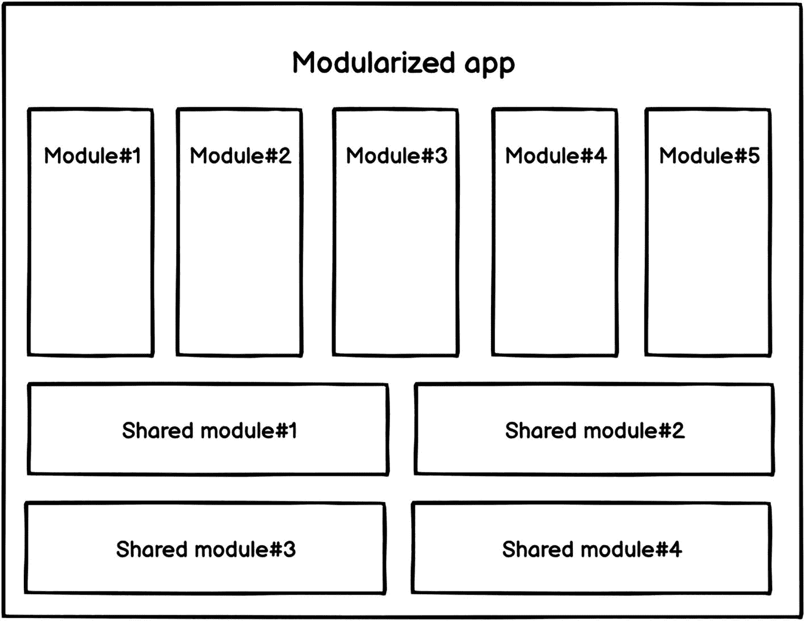

图 6-8
模块化应用模块映射

##### 模块化流程

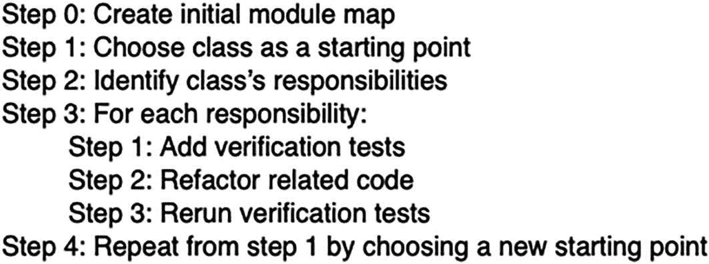

图 6-9
模块化流程

上述图表（图 6-9）展示了我们项目模块化的流程。它可能看起来有点复杂，但只要我们逐步操作，很快就能掌握要领。

#### 初始模块映射

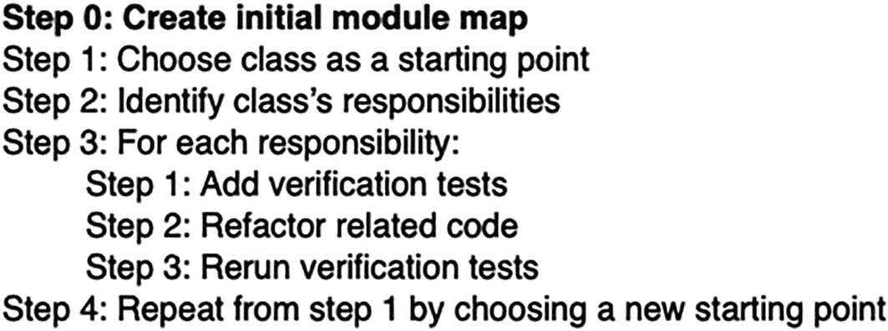

图 6-10
步骤 0

在开始模块化**书籍**之前，我们先做一个练习。该练习的目标是创建一个类似于我们为**App Store**应用（图 6-5）设计的模块映射。这是一个一次性练习，仅在启动模块化流程前执行（图 6-10）。我们将不查看代码，而是以全新的视角浏览应用，尝试将相关功能特性分组到各个模块中。这份模块映射将作为指南和我们在模块化过程中积极寻求的模糊目标。然而，该模块映射并非一成不变，它仅作为初始的提议设计方案。在实际进行应用模块化时，我们可能会决定新增模块或合并两个模块，这都是完全可行的。

如果我们基于**书籍**中现有功能特性创建初始模块映射，结果将类似于图 6-11。

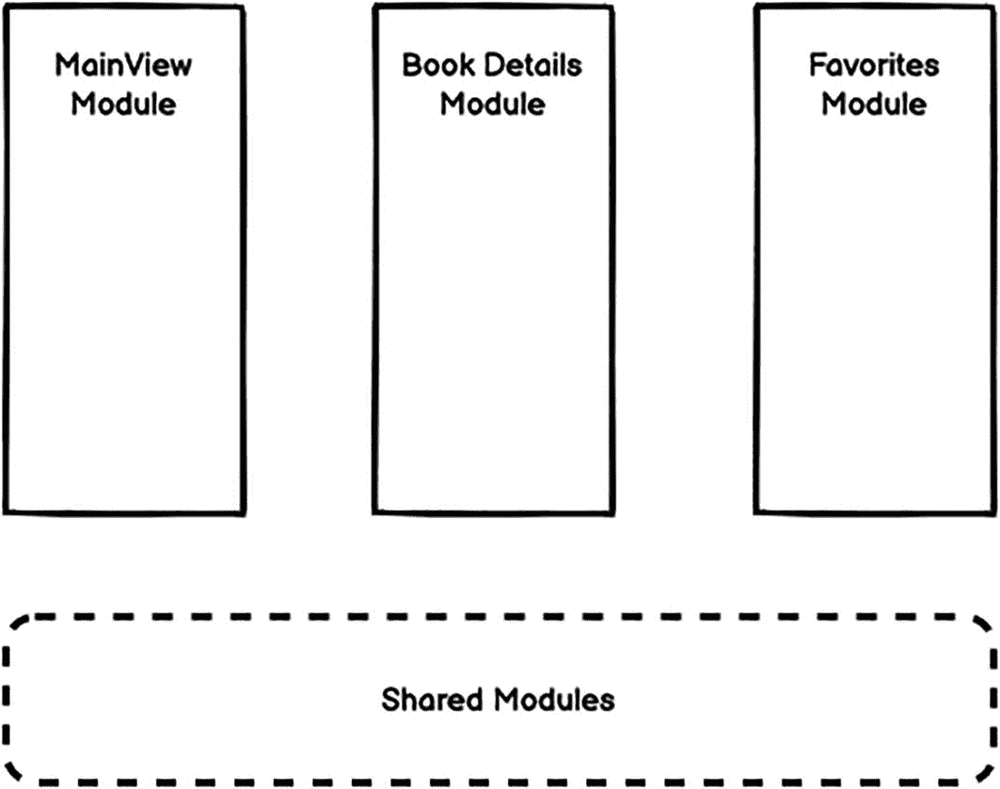

图 6-11
书籍应用模块映射

#### 选择一个类作为起点

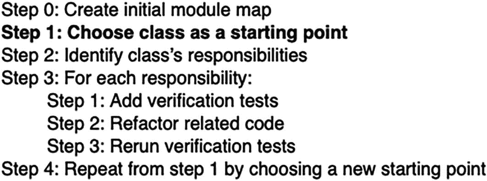

图 6-12
步骤 1

我们首先需要选择一个类，作为后续步骤的起点（图 6-12）。这是一个相当简单的步骤，实际上没有绝对的正确或错误。不过，需要考虑的一点是，最好尝试寻找那些职责过多的类，因为重构这些类为模块时影响更大。在像**书籍**这样不遵循任何真正设计模式的遗留应用中，你会发现最佳的起点通常是我们的**视图控制器**。

如前所述，图 6-8 中的模块映射可以在我们操作过程中提供指导，也能帮助我们选择起点。从模块映射中，我们选择一个模块；在此例中，我们选择**主视图模块**。然后，我们开始寻找与该模块相关且职责最多的起点。对我们来说，最佳的起点是 `MainViewController`。

##### 识别类的职责

既然有了起点，我们就需要开始行动了。接下来要做的是确定起点所负责的所有关键功能特性（图 6-13）。具体做法是遍历该类的代码并理解其功能。如果代码过于复杂且难以理解，我们可以关注代码的几个入口点，以便更容易把握该类职责的范围。我们需要查看所有公开函数、对象创建时触发的函数（`init`）、以及由用户交互（点击、手势、视图生命周期事件等）或其他机制（通知、KVO 等）触发的所有函数。

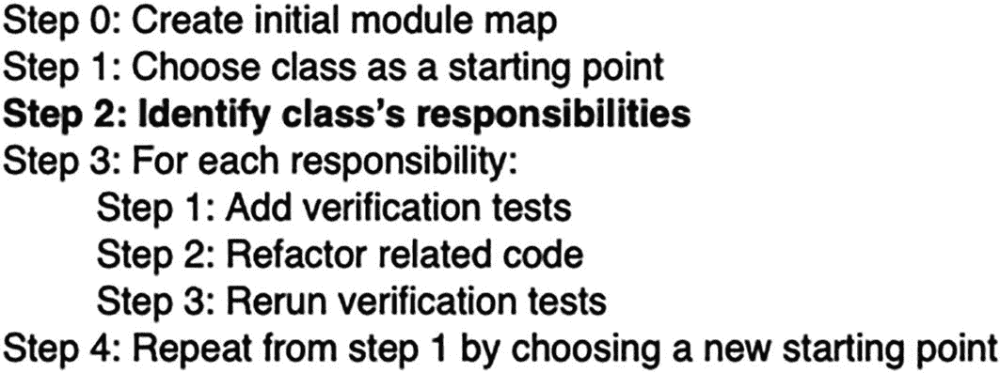

图 6-13
步骤 2

如果你深入分析 `MainViewController` 内的代码，会发现它可以通过图 6-14 的图表简洁地表示。

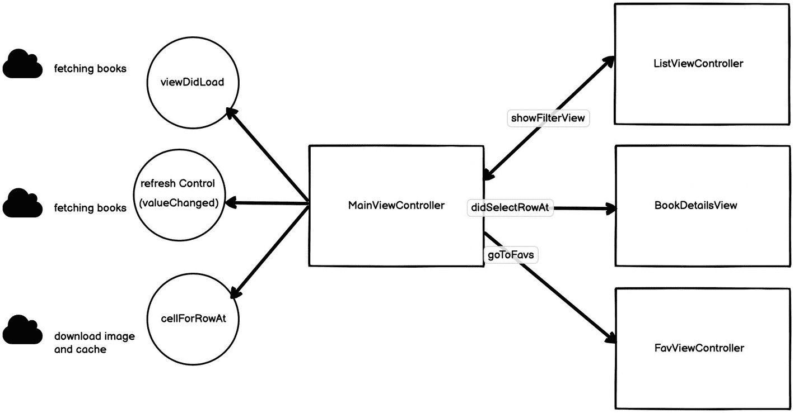

图 6-14
`MainViewController` 职责图

让我们正式定义 `MainViewController` 的主要职责：

1.  启动时获取最新书籍。
2.  在单独的单元格中展示每本书。
3.  下拉表格时获取最新书籍。
4.  用户可筛选书籍。
5.  用户可查看特定书籍的详情。
6.  用户可查看收藏。

#### 重构职责

明确了类的职责后，现在是时候开始重构了。针对每一项职责，我们将执行以下步骤：

1.  添加验证测试。
2.  重构相关代码。
3.  重新运行验证测试。


### 验证测试

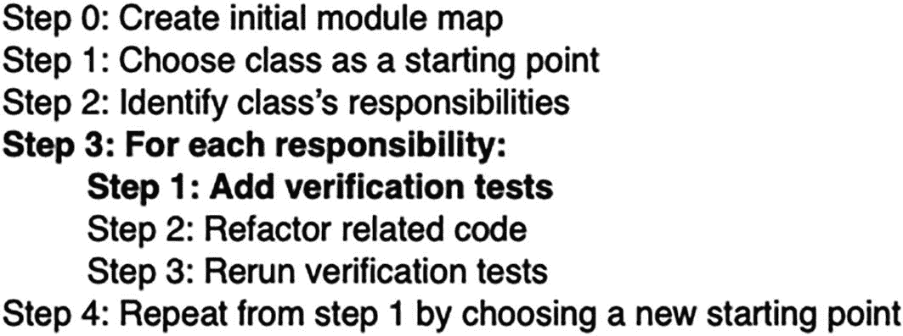

**图 6-15**

**步骤 3.1**

我们先从第一个职责开始，即“启动时获取最新书籍”。在开始重构相关代码之前，首先需要添加验证测试（图 6-15）。验证测试是高级别的测试，用于验证我们正在重构的特性或功能是否正常运行。对于像我们现在重构的这类面向用户的特性，验证可以采用 UI 测试的形式，因为这是我们拥有的最高级别的测试。如果重构的部分不是面向用户的，则可以使用集成测试。验证测试是我们流程中不可或缺的一部分，因为它们有助于避免因重构而导致的回归。

现在为我们的特性编写一个验证测试：

```
func testShowingBestSellerBooks() throws {
    // 前置条件
    let app = XCUIApplication()
    app.launch()
    // 操作
    let booksTableView = app.tables
    let cells = booksTableView.cells
    _ = cells.firstMatch.waitForExistence(timeout: 1.0)
    // 断言
    XCTAssertGreaterThan(cells.count, 0)
}
```

我们的验证测试仅确保列表表格视图中至少包含一个单元格。就本特性的范围而言，我们只关心表格视图在启动时已被填充数据，暂时不关心单元格的内容。

上述测试高度依赖于后端，如果后端服务器发生故障，很容易失败。这种依赖性并不理想，我们将在第 8 章讨论如何移除它。不过，就目前而言，这个测试已经够用了。

#### 重构

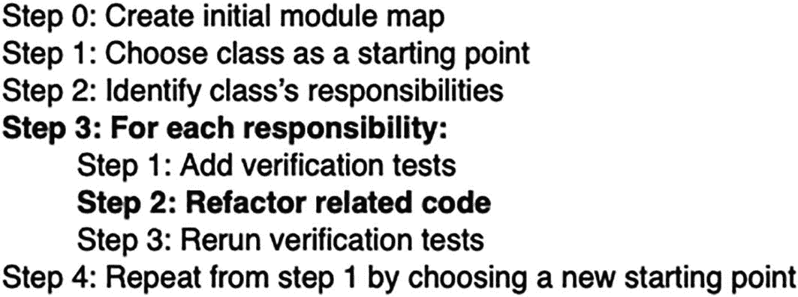

**图 6-16**

**步骤 3.2**

现在我们有了验证测试，就可以安全地开始重构了（图 6-16）。要重构这个特性，我们需要问自己几个问题：负责该特性的代码是否在正确的位置？还是应该将其移至新组件甚至新模块？在将代码移到正确的位置后，它是否还需要重构？

如果我们查看负责该特性的代码，会发现需要处理的函数是 `fetchBooks()`。那么第一个问题是，它是否在正确的位置？由于应用程序内部没有特定的设计模式或架构，我们将在重构时尝试应用一种设计模式。我们将像第 5 章那样使用 MVP 模式。从 MVP 模式中我们知道，视图控制器不应包含任何业务逻辑，只应负责处理 UI。因此，我们知道需要将 `fetchBooks()` 移到其他地方，但移到哪里呢？我们已经知道它会包含在 **MainView 模块**中，但具体是哪个组件？针对这个问题，我们需要进一步了解 `fetchBooks()` 的功能。`fetchBooks()` 发起网络请求并解析响应以提取图书列表，然后用于更新表格的数据源。我们将像从头开始实现一样，对要实现的逻辑应用 **MVP** 设计模式。我们应该考虑新对象之间将如何交互，而不要查看当前代码，以免受当前实现的影响。通过这样做，我们将得到图 6-17 中的设计。

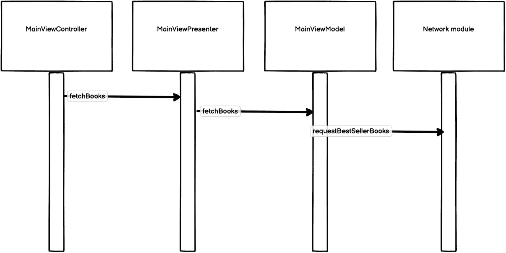

**图 6-17**

MVP 设计模式

现在是时候发挥我们的 TDD 技能了。如果你查看图 6-18，可能会想起第 5 章的内容。对于端到端测试，我们已经通过验证测试覆盖了。既然我们已经知道对象之间将如何交互，就可以开始编写一些集成测试了。

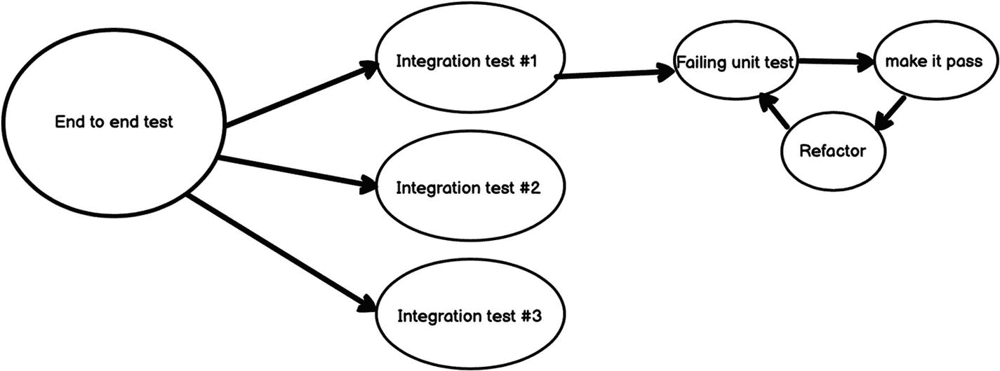

**图 6-18**

测试计划图

### 集成测试

让我们创建一个名为 `MainViewIntegrationTests` 的新类，它将包含与此模块相关的所有集成测试。将相同类型的测试分组在一起非常有用，这样你就可以灵活地轻松运行特定类型的测试。

从图 6-17 中我们知道，一旦 `MainViewController` 被加载，我们将初始化 `MainViewPresenter`，它将在构造函数中接收 `MainViewModel`。`MainViewPresenter` 将包含一个方法，用于获取所有图书并在底层封装与 `MainViewModel` 的通信；然后，模型将返回图书列表。最后，`MainViewPresenter` 将更新视图。现在让我们将其转换为一个测试：

```
func testFetchBestSellerBooksReturnsList() throws {
    // 前置条件
    let testBundle = Bundle(for: type(of: self))
    let booksJSONURL = testBundle.url(forResource: "BestSellerBooksStub", withExtension: "json")
    let booksJSON = try Data(contentsOf: booksJSONURL!)
    let expectedLists: [List] = stubbedlists()
    var actualLists: [List] = []
    let networkLayer = NetworkLayerStub(stubbedData: booksJSON)
    let mainViewModel = MainViewModel(networkLayer: networkLayer)
    let mainViewPresenter = MainViewPresenter(mainViewModel: mainViewModel)
    // 操作与断言
    let waitForBooks = XCTestExpectation(description: "等待获取图书")
    mainViewPresenter.fetchBestSellerBooks { lists in
        actualLists = lists ?? []
        waitForBooks.fulfill()
    }
    self.wait(for: [waitForBooks], timeout: 0.1)
    XCTAssertEqual(actualLists, expectedLists, "获取的图书与预期不匹配")
}

func stubbedlists() -> [List] {
    let firstBook = BookModel(title: "他告诉我的最后一件事", contributor: "作者：劳拉·戴夫", author: "劳拉·戴夫", createdDate: "2021-05-26 22:10:24")
    let secondBook = BookModel(title: "苏利", contributor: "作者：约翰·格里森姆", author: "约翰·格里森姆", createdDate: "2021-05-26 22:10:24")
    let firstList = List(listID: 704, listName: "综合印刷与电子书小说", displayName: "综合印刷及电子书小说", books: [firstBook, secondBook])
    return [firstList]
}
```

这个测试甚至无法构建，因为我们还没有添加它所测试的任何组件，这很正常。

允许我们的网络层通过桩代码返回预期的 JSON，以便我们可以对值进行断言，并防止测试依赖于网络调用（这会使测试变得不稳定），这是有意义的。我们将在第 7 章更详细地讨论桩代码。


##### `NetworkLayer`

现在我们已经有了集成测试，是时候深入一层进行单元测试了。我们将从**网络模块**开始。但由于测试网络层可能相当棘手，我们暂时跳过它的测试。不过别担心。我们会在**第 9 章**深入探讨如何测试网络层。我们现在要做的是在单独模块中添加网络层类。这是一个非常简单的类。它只会执行单个请求并返回数据：

```
class NetworkLayer {
    let host = "api.nytimes.com"
    let API_KEY = "YOUR_API_KEY"
    let bestSellerBooks = "/svc/books/v3/lists/overview.json"

    public func executeNetworkRequest(callBack: @escaping (_ data:Data?) -> Void) {
        var components = URLComponents()
        components.scheme = "https"
        components.host = host
        components.path = bestSellerBooks
        components.queryItems = [URLQueryItem(name: "api-key", value: API_KEY), URLQueryItem(name: "offset", value: "20")]
        guard let url = components.url else {
            callBack(nil)
            preconditionFailure("Failed to construct URL")
        }
        let task = URLSession.shared.dataTask(with: url) {
            data, response, error in
            guard let data = data else {
                callBack(nil)
                return
            }
            callBack(data)
        }
        task.resume()
    }
}
```

##### `MainViewModel`

让我们跳到下一个类，即 `MainViewModel`。它是**MainView 模块**的一部分，负责创建 `NetworkLayer` 对象、执行网络请求、解析响应数据并通过回调返回解析后的数据。像往常一样，我们首先编写 `MainViewModelTests`。我们会编写所有测试，确保该类能够正常工作并符合预期：

```
func testFetchingAndParsingBestSellerBooks() throws {
    // Given
    let testBundle = Bundle(for: type(of: self))
    let booksJSONURL = testBundle.url(forResource: "BestSellerBooksStub", withExtension: "json")
    let booksJSON = try Data(contentsOf: booksJSONURL!)
    let expectedLists: [List] = stubbedlists()
    var actualLists: [List] = []
    let networkLayer = NetworkLayerStub(stubbedData: booksJSON)
    let mainViewModel = MainViewModel(networkLayer: networkLayer)
    // when & then
    let waitForBooks = XCTestExpectation(description: "Wait to fetch books")
    mainViewModel.fetchBestSellerBooks { lists in
        actualLists = lists ?? []
        waitForBooks.fulfill()
    }
    self.wait(for: [waitForBooks], timeout: 0.1)
    XCTAssertEqual(actualLists, expectedLists, "Fetched books does not match the expected")
}

func stubbedlists() -> [List] {
    let firstBook = BookModel(title: "THE LAST THING HE TOLD ME", contributor: "by Laura Dave", author: "Laura Dave", createdDate: "2021-05-26 22:10:24")
    let secondBook = BookModel(title: "SOOLEY", contributor: "by John Grisham", author: "John Grisham", createdDate: "2021-05-26 22:10:24")
    let firstList = List(listID: 704, listName: "Combined Print and E-Book Fiction", displayName: "Combined Print & E-Book Fiction", books: [firstBook,secondBook])
    return [firstList]
}
```

上述测试首先使用 `NetworkLayer` 实例初始化 `MainViewModel` 实例。然后我们调用要测试的函数，该函数从服务器获取数据，然后我们等待它完成。最后，我们对返回的数据进行断言。

为了测试 `MainViewModel`，我们需要模拟 `NetworkLayer` 以返回特定的 JSON，这样我们就可以对 `MainViewModel` 的输出进行断言。我们需要创建一个模拟网络的新类，因为我们刚刚添加的测试因缺少该类而无法构建。`NetworkLayerStub` 将如下所示：

```
class NetworkLayerStub: NetworkLayer {
    var stubbedData:Data?
    init(stubbedData:Data) {
        self.stubbedData = stubbedData
    }
    public override func executeNetworkRequest(callBack: @escaping (_ data:Data?) -> Void){
        let jsonData = self.stubbedData
        callBack(jsonData)
    }
}
```

通过添加 `NetworkLayerStub`，我们解决了一个构建错误，但测试仍然无法构建。现在是时候编写代码让 `MainViewModelTests` 通过了。为此，我们需要创建 `MainViewModel`，它应该如下所示：

```
class MainViewModel: NSObject {
    private var networkLayer:NetworkLayer?
    init(networkLayer:NetworkLayer?) {
        self.networkLayer = networkLayer
    }
    public func fetchBestSellerBooks(callBack: @escaping (_ data:[List]?) -> Void) {
        self.networkLayer?.executeNetworkRequest(callBack: { data in
            guard let data = data else {
                callBack(nil)
                return
            }
            var response:Response?
            do {
                response = try JSONDecoder().decode(Response.self, from: data)
            } catch {
                print(error.localizedDescription)
            }
            if let lists = response?.results.lists {
                callBack(lists)
                return;
            }
            callBack(nil)
        })
    }
}
```

在这里，我们简单地实现了所需的函数 `fetchBestSellerBooks`。该函数接受一个回调块作为参数，在操作完成时应使用获取到的书籍数据调用该回调。我们使用 `NetworkLayer` 实例发起请求，解码响应，然后通过回调返回结果。

现在，如果运行 `MainViewModelTests`（图 6-19），它应该可以通过 ✅。

  
图 6-19 MainViewModelTests 通过


###### `MainViewPresenter`

接下来，我们需要为`MainViewPresenter`编写单元测试。首先，我们将创建一个新类作为`MainViewModel`的桩（stub）：

```swift
@testable import Books
class MainViewModelStub: MainViewModel {
    var stubbedLists:[List]?
    init(stubbedLists:[List]) {
        self.stubbedLists = stubbedLists
        super.init(networkLayer: nil)
    }
    public override func fetchBestSellerBooks(callBack: @escaping (_ lists:[List]?) -> Void) {
        callBack(self.stubbedLists)
    }
}
```

现在我们可以编写测试：

```swift
func testFetchingBestSellerBooksReturnsLists() throws {
    // Given
    let expectedLists: [List] = stubbedlists()
    var actualLists: [List] = []
    let mainViewModel = MainViewModelStub(stubbedLists: expectedLists)
    let mainViewPresenter = MainViewPresenter(mainViewModel: mainViewModel)
    // when & then
    let waitForBooks = XCTestExpectation(description: "Wait to fetch books")
    mainViewPresenter.fetchBestSellerBooks { lists in
        actualLists = lists ?? []
        waitForBooks.fulfill()
    }
    self.wait(for: [waitForBooks], timeout: 0.1)
    XCTAssertEqual(actualLists, expectedLists, "Fetched books does not match the expected")
}
func stubbedlists() -> [List] {
    let firstBook = BookModel(title: "THE LAST THING HE TOLD ME", contributor: "by Laura Dave", author: "Laura Dave", createdDate: "2021-05-26 22:10:24")
    let secondBook = BookModel(title: "SOOLEY", contributor: "by John Grisham", author: "John Grisham", createdDate: "2021-05-26 22:10:24")
    let firstList = List(listID: 704, listName: "Combined Print and E-Book Fiction", displayName: "Combined Print & E-Book Fiction", books: [firstBook,secondBook])
    return [firstList]
}
```

上述测试与我们刚刚为`MainViewModel`编写的测试有些相似。我们使用一个桩对象来设置展示器（presenter）的实例，然后调用函数并等待其完成畅销书数据的获取，最后对返回的书籍进行断言。

现在我们可以编写代码使`MainViewPresenterTests`通过测试：

```swift
class MainViewPresenter: NSObject {
    private var mainViewModel:MainViewModel?
    init(mainViewModel:MainViewModel?) {
        self.mainViewModel = mainViewModel
    }
    public func fetchBestSellerBooks(callBack: @escaping (_ data:[List]?) -> Void) {
        self.mainViewModel?.fetchBestSellerBooks(callBack: { lists in
            callBack(lists)
        })
    }
}
```

展示器的实现非常简单。它实现了一个获取畅销书的功能，而该功能的实现本质上是调用`MainViewModel`中对应的函数。你可能会认为我们不需要展示器，它只是一个包装器，但这只是暂时的。逻辑分离至关重要，随着我们不断重构更多代码，其重要性会愈发凸显。

现在运行`MainViewPresenterTests`（图 6-20），测试应该可以通过✅。


**图 6-20** `MainViewPresenterTests` 通过

###### 最后的调整

现在所有单元测试都通过了。不仅如此，如果我们运行集成测试，也应该能通过。最后需要做的是将旧的`fetchBooks()`实现替换为使用新组件的新实现。让我们用以下代码替换现有的`fetchBooks()`函数：

```swift
func fetchBooks() {
    self.mainViewPresenter?.fetchBestSellerBooks(callBack: { lists in
        if let lists = lists {
            self.lists = lists
            DispatchQueue.main.async {
                self.refreshControl.endRefreshing()
                self.tableView?.reloadData()
            }
        }
    })
}
```

这一步骤标志着 **步骤 3.2** 的结束。我们现在已经彻底重构了与功能相关的逻辑。

###### 测试的价值

在进入下一步之前，让我们尝试做一些能展示我们添加的所有测试价值的事情。在`MainViewModel`内部，将`fetchBestSellerBooks`方法替换为以下代码。我们只是删除了`callBack(lists)`之后的返回语句，结果导致回调被调用了两次。这就像一个定时炸弹——这种行为目前不会引发错误，但将来可能引发问题。如果你现在运行应用，它会按预期工作，因为我们在`MainViewController`中对`nil`进行了守卫。但如果我们某天移除了那个守卫，或者在别处重用了该代码，错误就会开始出现。然而，如果我们现在运行测试，会发现它们能捕获到这个问题（图 6-21）。

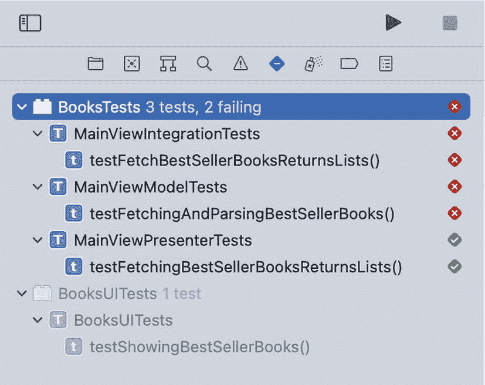

**图 6-21** 失败的单元测试

```swift
public func fetchBestSellerBooks(callBack: @escaping (_ lists:[List]?) -> Void) {
    self.networkLayer?.executeNetworkRequest(callBack: { data in
        guard let data = data else {
            callBack(nil)
            return
        }
        var response:Response?
        do {
            response = try JSONDecoder().decode(Response.self, from: data)
        } catch {
            print(error.localizedDescription)
        }
        if let lists = response?.results.lists {
            callBack(lists)
        }
        callBack(nil)
    })
}
```

#### 重新运行验证测试

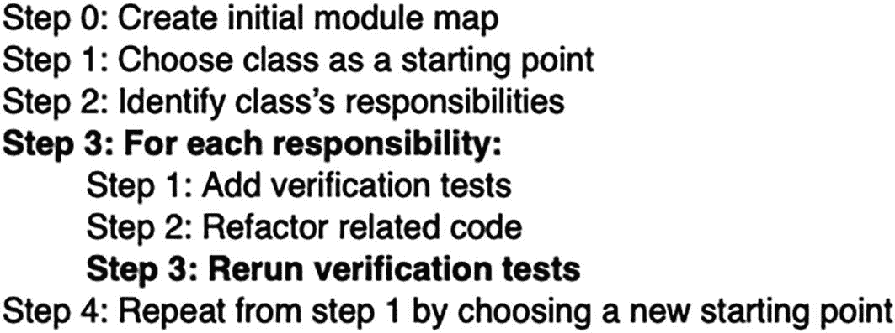

**图 6-22** 步骤 3.3

一直以来，我们都在重构`MainViewController`的一个职责：“启动时获取最新书籍”。在确认完成这个职责之前，我们需要运行在 **步骤 3.1** 中添加的验证测试，以确保一切按预期运行（图 6-22）。如果我们尝试运行`testShowingBestSellerBooks()`（图 6-23），测试应该可以通过✅。

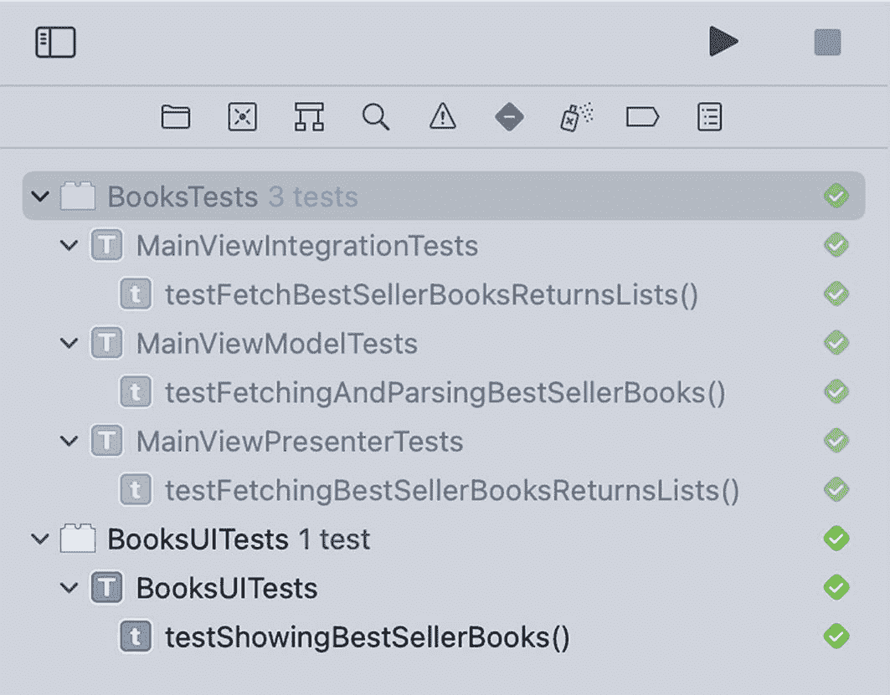

**图 6-23** 测试通过

#### 重构其余职责

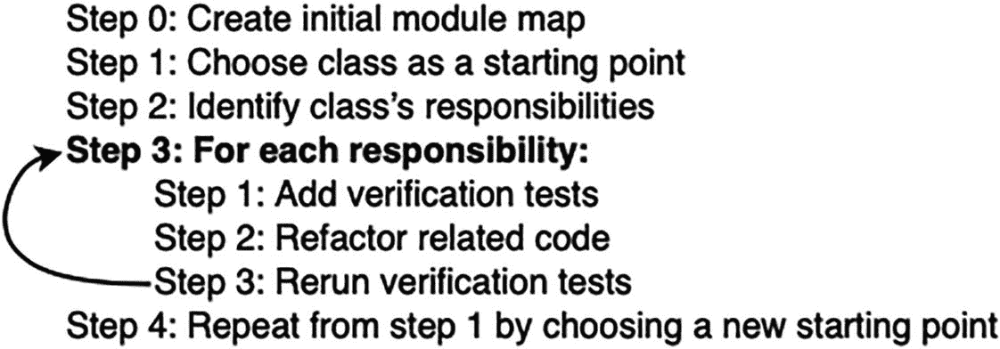

**图 6-24** 重复步骤 3 及其子步骤

回到 **步骤 2**，我们识别出了`MainViewController`的六个职责。刚刚完成了第一个职责的重构。现在，我们应该对剩下的职责逐一执行相同的步骤（图 6-24）。

#### 下一个起点

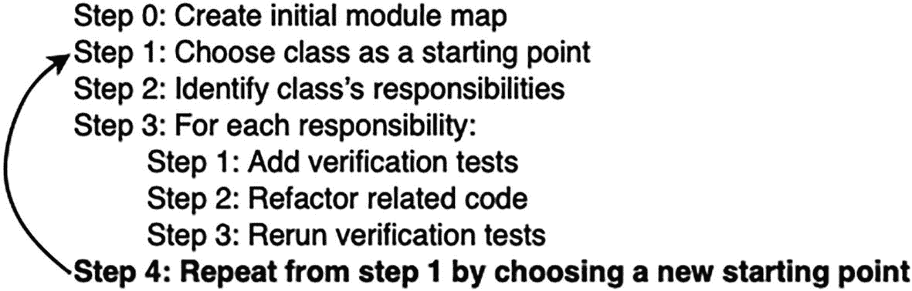

**图 6-25** 步骤 4

一旦完成了`MainViewController`中所有职责的重构，我们将回到步骤 1，重复整个过程（图 6-25）。也就是说，我们会选取一个新的起点，并像处理`MainViewController`一样彻底重构它。

## 练习

我们已经完成了`MainViewController`的第一个职责。作为练习，请使用我们在本章中遵循的相同流程，尝试重构其余的职责。


## 总结

本章我们讨论了模块化的概念，即把系统拆分为多个相对独立且可互换的模块。通常而言，模块是一段独立的代码，提供特定且紧密耦合的功能。如果我们完全忽略模块化，最终往往会得到混乱的架构，通常被称为“大泥球”架构。

模块化应用相比非模块化应用有许多优势。非模块化应用在引入变更时往往不可预测，这是由于组件之间存在相互依赖关系。另一方面，在模块化应用中，当我们对某个模块引入变更时，可以确信只会影响该模块本身。这得益于代码之间强分离性。这种代码分离还带来了另一个非常重要的好处：代码可读性。我们之前提到过，开发人员花在阅读代码上的时间比编写代码的时间更多，而模块化应用使得阅读和理解其工作原理变得更加容易。在一个恰当模块化的应用中，一个开发者可以专注于一个模块进行开发，而无需理解或触碰应用中的其他模块。

鉴于这些诸多好处，在从零开始开发新应用时，最好采用模块化方法。然而，如果有一个未模块化的遗留应用，我们仍然可以对其进行改造。有两种方式可以实现：第一，重写整个应用。重写这个概念相当直接；我们基本上抛弃所有现有代码，从一个干净的（模块化）起点开始。不过，这种方法相当激进，需要在短时间内投入巨大资源。另一种方法是重构，这是一种更渐进的方式，我们逐步将应用模块化。这种方法速度慢得多，但它允许我们在积极改造应用的同时，继续在应用上工作并添加新功能。

通过逐步重构来模块化应用并非易事。不过，有一个系统性的流程（图 6-26）可供遵循。首先，我们创建一个关于如果我们将应用划分为模块，其内部结构会是什么样的投影，以便让我们对最终目标有个概念。之后，我们选择一个类作为起点，并列出该类的职责。然后针对每个职责编写一个验证测试，以确保我们接下来的改动不会引入回归问题。接着，如果需要，我们就对这个职责进行重构。我们可能将其移动到另一个类，甚至另一个模块，或者为其创建一个全新的模块。一旦我们重构完该类的所有职责，我们只需再次选择一个新的起点，重复我们的流程。我们将持续循环这个过程，直到没有更多起点可选用。当达到这个阶段时，就意味着我们不再有未模块化的代码了。


图 6-26  
模块化流程

