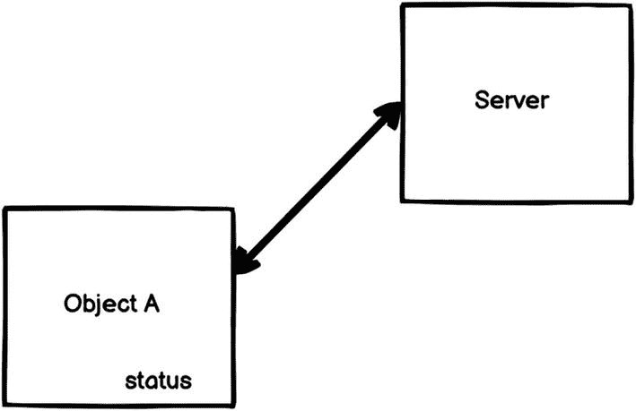
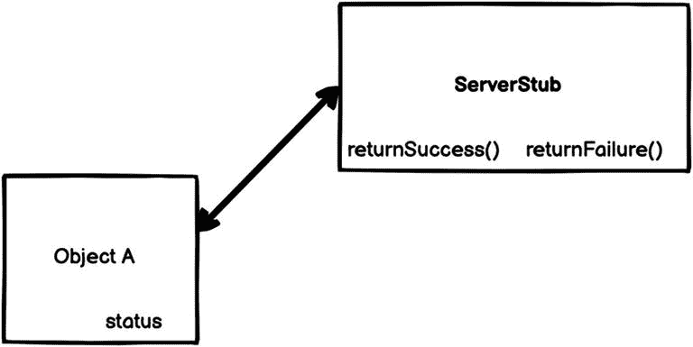
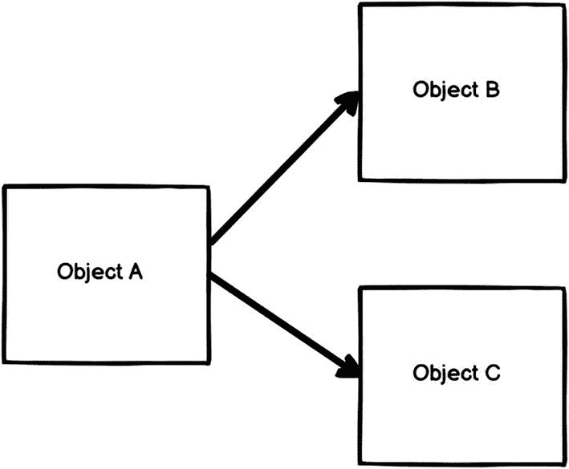
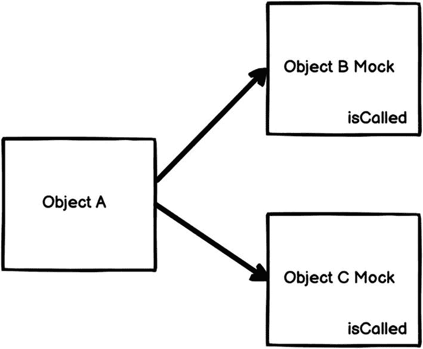
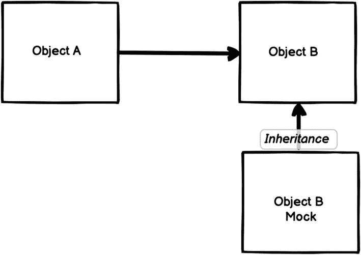
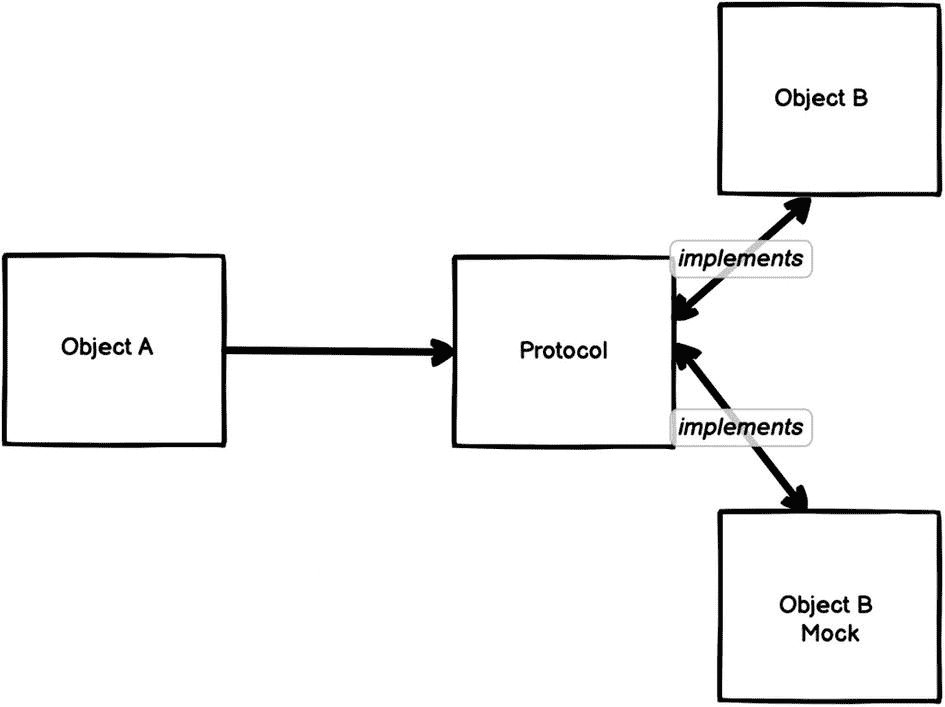
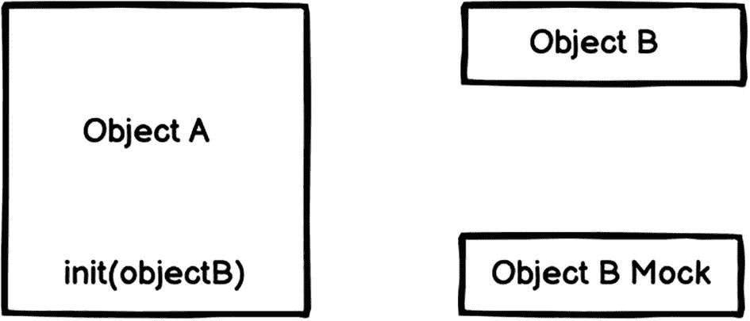
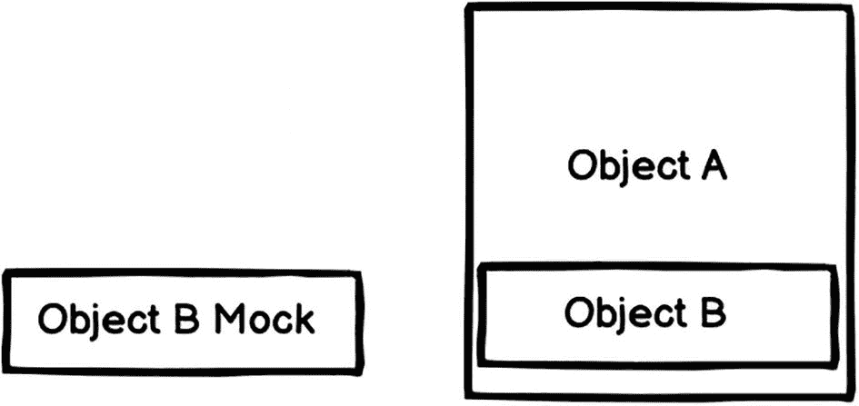
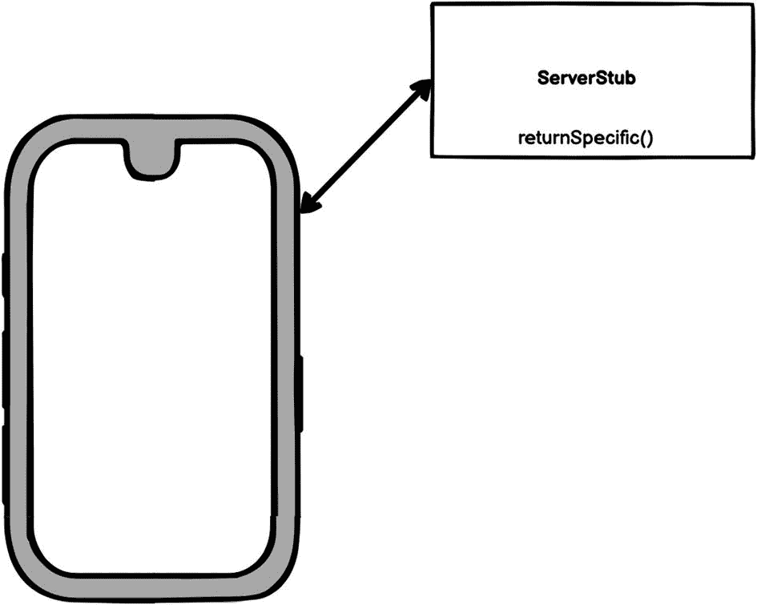
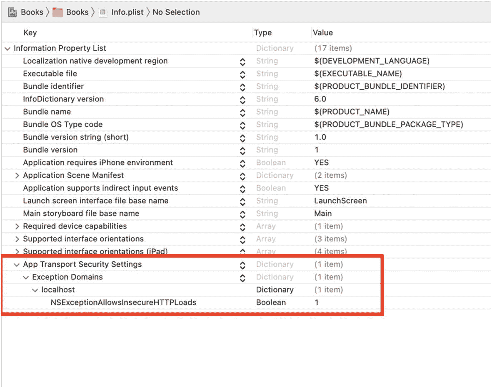

# 依赖注入与模拟对象

如果一个组件依赖于另一个行为不可预测的组件，那么为该组件编写测试可能是一项繁琐的任务。为了测试这样的组件，我们需要能够控制这种不可预测的行为。我们可以借助测试替身（test double）来实现这一点。术语“测试替身”最早由 Gerard Meszaros 在其著作 *XUnit Test Patterns* 中提出。测试替身是一个通用术语，指代用于替代真实对象以进行测试的任何类型的伪装对象。另一种难以编写测试的情况是，如果我们有一个组件与另一个组件通信，并且我们希望验证与此交互相关的某些事情。在这种情况下，使用测试替身也是最佳方案。测试替身是任何程序员武器库中不可或缺的工具。使用它们对于实现应用的高测试覆盖率以及使测试更稳定至关重要。

## 桩（Stubbing）

测试替身的一种类型是桩（stub）。桩是一个持有预定义数据并在测试期间提供这些数据的对象。当我们不想使用真实数据并希望拥有更一致的数据源时，就会用到它。测试实际上并不关心桩上的函数是否被调用，只要测试对象（或被测系统）能从桩中获取所需数据并执行正确操作即可。并且，如果向桩传递了一个值，测试也不关心该值。此外，无论输入是什么，桩始终输出相同的预定义数据。由于其特性，桩被认为是一种相当轻量级的测试替身。

一个需要使用桩的例子是，当我们有一个对象依赖于向服务器发起网络调用时。发起真实的网络请求会导致我们的测试既缓慢又不可预测，因为我们无法控制服务器每次返回什么数据。

假设我们有一个对象 A，它有一个布尔类型变量 `status`，其值取决于服务器返回的数据。因此，如果服务器返回成功，那么 `status` 将为 `true`；如果服务器返回失败，那么 `status` 将为 `false`（图 7-1）。为了能够确信地测试这两种场景，我们需要使用桩。



图 7-1  
依赖示例

我们将创建一个名为 `ServerStub` 的新对象，并用它来替代真实的 `Server` 对象，如图 7-2 所示。我们的桩有两个方法，用于控制它应返回何种数据。我们将使用这些方法来设置我们的测试。



图 7-2  
对依赖进行打桩

当我们为两种场景编写测试时，代码会像这样：

```
func testObjectASuccessStatus() {
// Given
let server = ServerStub()
server.returnSuccess()
// When
let objectA = ObjectA(server)
// Then
XCTAssertTrue(objectA.status)
}
func testObjectAFailureStatus() {
// Given
let server = ServerStub()
server.returnFailure()
// When
let objectA = ObjectA(server)
// Then
XCTAssertFalse(objectA.status)
}
```

在每个测试中，我们创建一个桩的实例，然后使用 `returnSuccess()` 或 `returnFailure()` 对其进行设置。接着，我们将桩传递给测试对象，并对 `status` 进行断言。我们将在本章后面讨论如何将桩注入到测试对象中。


## 模拟（Mocking）

测试替身的另一种类型是模拟对象。模拟对象比存根稍复杂一些。它既可以像存根一样返回一些伪造的数据，还可以验证某个特定方法是否被调用过。模拟对象会记录它们接收到的调用，在我们的测试中，可以验证所有预期操作是否在特定的模拟对象上执行完毕。当我们不想调用生产代码，或者没有简便方法验证预期代码是否已执行时，就会使用模拟对象。

假设我们有三个对象：对象 `A`、`B` 和 `C`。对象 `A` 有一个方法，它接收一个输入，并根据该输入决定是调用对象 `B` 还是对象 `C`（图 7-3）。如果我们向测试对象传入 `true`，它应该调用对象 `B`；如果传入 `false`，则应调用对象 `C`。为了能够验证这两种场景，我们需要使用模拟对象。



图 7-3 依赖关系示例

我们创建两个新对象作为模拟对象（图 7-4）。`ObjectBMock` 和 `ObjectCMock` 都将执行同一个简单任务：如果被调用则进行记录，并将此信息保存在公共属性 `isCalled` 中。



图 7-4 模拟依赖关系

现在我们可以这样编写测试：

```
func testObjectALogic1 () {
    // 给定
    let objectB = ObjectBMock()
    let objectC = ObjectCMock()
    let objectA = ObjectA(objectB, objectC)
    // 当
    objectA.doLogic(true)
    // 那么
    XCTAssertTrue(objectB.isCalled)
    XCTAssertFalse(objectC.isCalled)
}
func testObjectALogic2 () {
    // 给定
    let objectB = ObjectBMock()
    let objectC = ObjectCMock()
    let objectA = ObjectA(objectB, objectC)
    // 当
    objectA.doLogic(false)
    // 那么
    XCTAssertFalse(objectB.isCalled)
    XCTAssertTrue(objectC.isCalled)
}
```

除了记录是否被调用之外，模拟对象还可以记录每次调用时传入的参数值。在测试中，我们可以验证传递给模拟对象的值是否正确。

因此，以我们的示例为例，可以修改两个模拟对象，使其保存接收到的参数值。然后，测试可以这样修改：

```
func testObjectALogic1 () {
    // 给定
    let objectB = ObjectBMock()
    let objectC = ObjectCMock()
    let objectA = ObjectA(objectB, objectC)
    // 当
    objectA.doLogic(true)
    // 那么
    XCTAssertTrue(objectB.isCalled)
    XCTAssertEqual(objectB.value, "Test")
    XCTAssertFalse(objectC.isCalled)
}
func testObjectALogic2 () {
    // 给定
    let objectB = ObjectBMock()
    let objectC = ObjectCMock()
    let objectA = ObjectA(objectB, objectC)
    // 当
    objectA.doLogic(false)
    // 那么
    XCTAssertFalse(objectB.isCalled)
    XCTAssertTrue(objectC.isCalled)
    XCTAssertEqual(objectC.value, "Test")
}
```

## 创建测试替身

我们讨论了不同类型的测试替身：模拟对象和存根。但并未讨论如何创建它们。根据定义，替身是可以替代真实对象的对象。因此，替身必须与原始对象有一定关联，以便我们能在测试中无缝替换。有多种创建替身的方式。在本章中，我们将讨论使用继承和使用协议两种创建方式。

### 使用继承创建

在前几章中，我们大量使用了这种方法。继承机制通常是指从一个类派生出另一个类的机制。它是面向对象编程（OOP）的核心概念之一。当我们继承一个类时，就继承了父类的所有特征。这正是该方法的本质所在。我们继承待模拟或待存根对象的所有属性和函数，并通过重写（覆盖）来改变我们想要模拟或存根的部分的行为（图 7-5）。这种方法的好处在于，我们可以访问原始实现，因此既可以改变实现，也可以在需要时仅扩展它，保留原有逻辑不变，仅添加测试特定的新逻辑。



图 7-5 通过继承创建

回想一下，在第 6 章为 `MainViewModel` 编写测试时，我们就使用了这种方法。`MainViewModel` 依赖于 `NetworkLayer`，因此我们通过继承创建了 `NetworkLayerStub`。代码如下：

```
class NetworkLayerStub: NetworkLayer {
    var stubbedData:Data?
    init(stubbedData:Data) {
        self.stubbedData = stubbedData
    }
    public override func executeNetworkRequest(callBack: @escaping (_ data:Data?) -> Void){
        let jsonData = self.stubbedData!
        callBack(jsonData)
    }
}
```

我们继承自 `NetworkLayer`，并重写了 `executeNetworkRequest` 方法，使其返回 `stubbedData`，而不是真正发起网络请求。在测试中，我们可以根据需要设置 `stubbedData`。

### 使用协议创建

使用协议创建与使用继承创建有些类似，并且它与面向协议编程（POP）紧密相关。协议充当了对其遵循类型（类、结构体或枚举）应具备功能的蓝图。在面向协议的方法中，我们首先通过定义协议来设计系统。因此，如果需要创建一个执行某些逻辑的组件，我们会将这些逻辑抽象为 API 并在协议中定义。然后通过遵循该协议并实现所需函数来创建组件。

在创建测试替身时，我们可以使用相同的面向协议方法。如果有一个依赖项需要用替身替换，我们就添加一个描述该依赖项的协议。现在，原始对象遵循此协议，我们可以说测试对象依赖于一个遵循该协议的组件。在测试中，我们可以添加一个遵循该协议的新组件，并将其注入测试对象中，这将成为我们的测试替身（图 7-6）。



图 7-6 通过遵循协议创建

让我们尝试使用协议重写 `MainViewModel` 示例。`MainViewModel` 需要依赖协议而不是 `NetworkLayer` 对象。我们的协议将如下所示：

```
protocol NetworkProtocol {
    func executeNetworkRequest(callBack: @escaping (_ data:Data?) -> Void)
}
```

现在修改 `MainViewModel`，使其依赖 `NetworkProtocol` 而不是 `NetworkLayer`：

```
class MainViewModel: NSObject {
    private var networkLayer:NetworkProtocol?
    init(networkLayer:NetworkProtocol) {
        self.networkLayer = networkLayer
    }
    public func fetchBestSellerBooks(callBack: @escaping (_ lists:[List]?) -> Void) {
        self.networkLayer?.executeNetworkRequest(callBack: { data in
            guard let data = data else {
                callBack(nil)
                return
            }
            var response:Response?
            do {
                response = try JSONDecoder().decode(Response.self, from: data)
            } catch {
                print(error.localizedDescription)
            }
            if let lists = response?.results.lists {
                callBack(lists)
                return;
            }
            callBack(nil)
        })
    }
}
```

最后，通过创建一个遵循 `NetworkProtocol` 的新类来创建测试替身：

```
class NetworkLayerStub: NetworkProtocol {
    var stubbedData:Data?
    init(stubbedData:Data) {
        self.stubbedData = stubbedData
    }
    func executeNetworkRequest(callBack: @escaping (_ data:Data?) -> Void){
        let jsonData = self.stubbedData!
        callBack(jsonData)
    }
}
```


## 依赖注入

我们讨论了模拟对象和桩代码，也探讨了如何创建这些有用的测试替身。但还需要学习如何将测试替身注入到代码中。有多种注入测试依赖的方法。本文将介绍属性注入和初始化器注入。

以下是我们想要编写测试的 `Example` 类。`Example` 依赖于单例实例 `Network.shared`。不过，我们需要模拟 `Network` 来验证请求是否已发出：

```swift
class Example {
    func doWork() {
        Network.shared.makeRequest()
    }
}
```

现在重构这个类，以便能够轻松地从测试中注入模拟对象。

### 初始化器注入

在前几章中，我们多次使用了这种方法。在该方法中，注入依赖的入口是初始化器。每当创建新实例时，我们会将依赖传递给对象。并在对象中保存对该依赖的引用，每当需要访问依赖时，就使用该引用。因此在测试中，当创建对象实例时，只需在初始化器中传入测试替身，而非真实对象（图 7-7）。



*图 7-7——初始化器注入*

当代码中始终向对象传递同一个依赖，仅在测试时需要传入不同内容时，在 Swift 中使用默认参数是个好方法。这里我们告知初始化器，依赖的默认值是某个对象，但需要时可以覆盖它。这很有用，因为它能让代码更整洁清晰。

重构后的类应如下所示：

```swift
class Example {
    private var network: Network?
    
    init(network: Network = Network.shared) {
        self.network = network
    }
    
    func doWork() {
        self.network?.makeRequest()
    }
}
```

现在要注入测试替身，只需这样做：

```swift
let networkMock = NetworkMock()
let testObject = Example(network: networkMock)
```

### 属性注入

使用属性注入是最简单的方法，但在大多数情况下并不适用。假设对象 A 使用对象 B 执行特定任务。如果对象 A 有一个持有对象 B 的公开属性，那么就可以利用该属性在测试中将模拟对象注入以替代原始对象 B（图 7-8）。但需注意，不要仅为测试而暴露属性，否则会破坏对象的抽象性并导致大量代码异味。



*图 7-8——属性注入*

将类重构为使用属性注入后，应如下所示：

```swift
class Example {
    public var network: Network?
    
    init() {
        self.network = Network.shared
    }
    
    func doWork() {
        self.network?.makeRequest()
    }
}
```

现在要注入测试替身，只需这样做：

```swift
let networkMock = NetworkMock()
let testObject = Example()
testObject.network = networkMock
```

## 在 UI 测试中模拟网络请求

上述所有方法都可以在单元测试和集成测试中实现。但不建议在 UI 测试中使用这些方法，因为 UI 测试应像用户使用应用一样，将应用视为黑盒进行测试。在端到端测试中测试模拟对象而不是实际代码是没有意义的。不过，在某些情况下，我们需要模拟特定行为，这时可以通过更高层次的模拟来实现。

首先，打开本章资源中的起始项目。这是**Books**应用的一个版本，我们在上一章中已经使用过。来看一下第 6 章步骤 3.2 中实现的端到端测试：

```swift
func testShowingBestSellerBooks() throws {
    // 给定条件
    let app = XCUIApplication()
    app.launch()
    
    // 执行操作
    let booksTableView = app.tables
    let cells = booksTableView.cells
    _ = cells.firstMatch.waitForExistence(timeout: 1.0)
    
    // 验证结果
    XCTAssertGreaterThan(cells.count, 0)
}
```

这个测试完全没有用。首先，它依赖网络请求，因此速度很慢，而且我们没有对表格中显示的数据进行断言。应用可能显示错误数据，但测试仍会通过。

为了修复这个测试，我们将模拟网络请求并返回特定数据（图 7-9），同时测试应确保数据在应用内正确渲染。



*图 7-9——网络请求模拟*

我们将使用名为 **Swifter** 的第三方库来模拟网络请求。也可以通过其他库甚至手动实现。但本例中，我们将使用这个轻量级的第三方依赖。

首先，需要集成 Swifter。我们将使用 Swift 包管理器（SPM）安装依赖（图 7-10）。务必确保将其添加到 `BooksUITests` 目标，而非应用目标（图 7-11）。


*图 7-11——使用 SPM 集成第三方库（步骤 2）*


*图 7-10——使用 SPM 集成第三方库（步骤 1）*

安装好 **Swifter** 后，需要在网络层做一个小改动，以允许 **Swifter** 模拟网络请求。我们需要检查 `ProcessInfo` 中的启动参数，如果包含 `TESTING`，则将域名改为 localhost，将 HTTPS 改为 HTTP，并添加 `8080` 端口：

```swift
func getHost() -> String {
    if ProcessInfo.processInfo.arguments.contains("TESTING") {
        return "localhost"
    } else {
        return "api.nytimes.com"
    }
}

func getScheme() -> String {
    if ProcessInfo.processInfo.arguments.contains("TESTING") {
        return "http"
    } else {
        return "https"
    }
}

public func executeNetworkRequest(callBack: @escaping (_ data: Data?) -> Void) {
    var components = URLComponents()
    components.scheme = getScheme()
    components.host = getHost()
    components.port = 8080
    components.path = bestSellerBooks
    components.queryItems = [
        URLQueryItem(name: "api-key", value: API_KEY),
        URLQueryItem(name: "offset", value: "20")
    ]
    
    guard let url = components.url else {
        callBack(nil)
        preconditionFailure("Failed to construct URL")
    }
    
    let task = URLSession.shared.dataTask(with: url) { data, response, error in
        guard let data = data else {
            callBack(nil)
            return
        }
        callBack(data)
    }
    task.resume()
}
```

在设置中需要启动服务器。如果服务器启动失败，将抛出一个错误，从而导致测试失败。这很合理，因为如果模拟服务器未运行，测试将毫无意义。


```swift
class BooksUITests: XCTestCase {
    var server = HttpServer()
    override func setUpWithError() throws {
        continueAfterFailure = false
        try server.start()
    }
    override func tearDownWithError() throws {
        server.stop()
    }
}
```

我们将使用同一个 `BestSellerBooksStub.json` 文件，因此需要确保它同时包含在两个目标中（图 7-12）。


图 7-12  
设置 `BestSellerBooksStub.json` 的目标成员资格

此外，我们还需要仅允许本地主机域使用 HTTP 而非 HTTPS。这将防止系统出于安全原因阻止我们的请求。我们可以通过修改 `Info.plist` 来实现（图 7-13）。



图 7-13  
为 localhost 启用 HTTP

现在，是时候真正 stub 网络并更新我们的测试了：

```swift
func testShowingBestSellerBooks() throws {
    // 给定条件
    let testBundle = Bundle(for: type(of: self))
    let booksJSONURL = testBundle.url(forResource: "BestSellerBooksStub", withExtension: "json")
    let booksJSON = try String(contentsOf: booksJSONURL!)
    server.GET["/svc/books/v3/lists/overview.json"] = {_ in HttpResponse.ok(.text(booksJSON))}
    let app = XCUIApplication()
    app.launchArguments += ["TESTING"]
    app.launch()
    // 触发操作
    let booksTableView = app.tables
    let cells = booksTableView.cells
    _ = cells.firstMatch.waitForExistence(timeout: 1.0)
    // 验证结果
    XCTAssertTrue(cells.staticTexts["book_title_0"].label == "THE LAST THING HE TOLD ME")
    XCTAssertTrue(cells.staticTexts["book_desc_0"].label == "Hannah Hall discovers truths about her missing husband and bonds with his daughter from a previous relationship.")
    XCTAssertTrue(cells.staticTexts["book_date_0"].label == "2021-05-26 22:10:24")
    XCTAssertTrue(cells.staticTexts["book_title_1"].label == "SOOLEY")
    XCTAssertTrue(cells.staticTexts["book_desc_1"].label == "Samuel Sooleymon receives a basketball scholarship to North Carolina Central and determines to bring his family over from a civil war-ravaged South Sudan.")
    XCTAssertTrue(cells.staticTexts["book_date_1"].label == "2021-05-26 22:10:24")
}
```

在我们的测试中，首先告诉 Swifter 对指定路径进行 stub 并返回预期的 JSON，以便我们能够在展示的 UI 中进行断言。然后，我们启动应用程序并传入额外的启动参数来表明我们正在测试。接着，我们对预期单元格的存在性进行断言，同时对显示的数据也进行断言。

这个更新后的测试应该能够通过。但重要的是，现在得益于网络 stub，我们能够在 UI 中对实际数据进行断言（图 7-14）。日后，如果我们显示的内容有误，例如，这个测试将能够捕获它。


图 7-14  
经过 Stub 后的应用程序

## 总结

在编写测试时，我们常常会遇到需要断言某些无法直接访问的内容的情况，有时还需要控制特定行为以避免不可预测性。在这些情况下，我们解决所有问题的方案就是测试替身。测试替身是任何用于替代真实对象的假对象，它们有多种形式和用途。在这一章中，我们讨论了不同类型的测试替身，还介绍了如何创建替身并将其注入到待测试的代码中。

桩（Stub）是测试替身的一种。桩持有一些预定义的数据，并返回这些数据而不是真实数据。这在测试中很有用，可以提高速度并消除不可预测性。另一种测试替身是模拟对象（Mock）。模拟对象也可以返回假数据，但它们的主要功能是记录对它们发出的调用，还能记录通过函数调用传入的值。这样我们就可以断言待测试对象与模拟对象之间是否发生了特定的交互。

创建测试替身有几种方法。我们可以通过继承来创建，即对原始类进行子类化，然后重写并修改我们想要进行 stub 或 mock 的函数。另一种创建替身的方法是使用协议。如果我们的测试对象依赖于某个协议，那么我们可以通过创建一个符合该协议的新组件，并实现协议的要求来创建替身。

至于将替身注入到待测试代码中，这是一个相当简单的任务。我们可以通过待测试对象的初始化方法进行注入，这被称为初始化器注入。或者，我们可以使用属性注入，即先正常创建对象，然后通过访问其属性并将替身赋值给它来实现注入。

最后，我们探讨了一种具体但非常重要的 stub 类型——在 UI 测试层进行网络 stub。我们使用了一个第三方库来 stub 网络请求，这使得我们能够编写更全面的 UI 测试。同时，这也提高了测试的稳定性和速度。

