# 8. 避免多线程噩梦

并发与多线程是 iOS 开发的核心组成部分。理解它们以及如何正确利用它们，是开发高质量应用程序的关键。缺乏并发通常会导致应用程序无响应，在执行繁重操作时卡死。

## 什么是并发？

并发的概念是指两个或多个任务可以独立定义，并且每个任务无论其他任务是否正在执行都可以被执行。这意味着两个或多个任务可以同时执行，换句话说，就是并发执行。

并发可以通过两种方式实现：上下文切换（时间片轮转）或并行。使用哪种方式取决于处理器的类型。对于单核处理器，使用上下文切换，系统在线程之间切换得足够快，以至于看起来两个任务似乎同时在运行。而对于多核处理器，则是通过在每个独立核心上并行运行每个线程来实现并发。

### GCD

到目前为止，我们讨论了线程以及如何在不同的线程上同时执行两个或多个任务。但线程是一种底层工具，手动管理线程以实现并发是一项相当复杂的任务。

Grand Central Dispatch（GCD）由苹果公司创建，自 iOS 4 起就已可用。GCD 基本上将手动处理线程的工作从开发者手中抽象出来。它帮助开发者利用系统的多线程特性，而无需实际创建或管理线程本身。你无需创建线程，而是使用 GCD 来调度任务，系统将以最高效的方式执行这些任务。

### 队列

如前所述，GCD 抽象了线程的处理。那么在这种抽象之后，你处理的是什么呢？你处理的是派发队列（dispatch queues）。你可以从名称推断出其功能。你将任务提交到队列，GCD 将按先进先出（FIFO）顺序执行它们。根据可用的资源、使用的队列类型以及派发函数（用于提交任务的函数），GCD 将决定该任务在何时以及哪个线程上执行。

我们一直在说 GCD 有多出色，这确实没错。然而，仅仅使用 GCD 并不能保证代码没有 bug。关键在于选择正确类型的派发队列以及正确的派发函数。


### 串行队列与并发队列

队列分为两种类型：串行队列和并发队列：

**串行队列**能保证提交到该队列的所有任务一个接一个地执行，也就是说，第一个任务必须完成，第二个任务才能开始。这意味着串行队列不会在超过一个线程上运行。

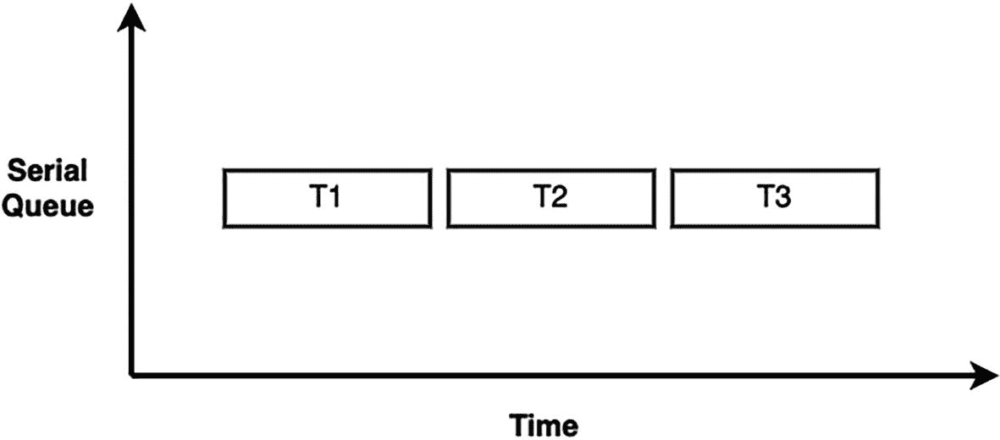

图 8-1  
串行队列任务示意图

**并发队列**可以在多个线程上运行，这意味着提交到该队列的任务可以同时执行。并发队列与串行队列的一个非常重要的区别是：并发队列仅在任务启动时保证先进先出（FIFO）顺序。然而，由于队列不会等待任务完成再启动新任务，因此任务的完成顺序并不保证 FIFO。

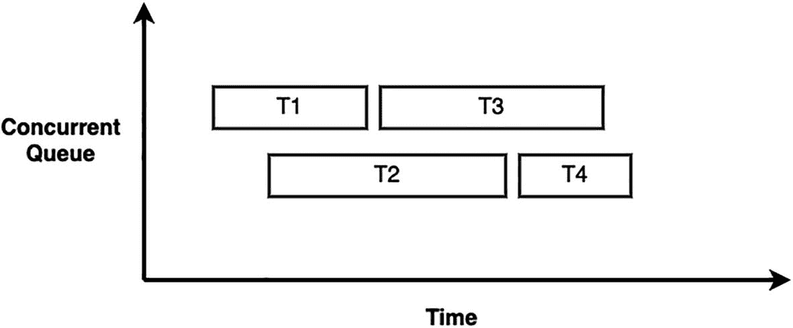

图 8-2  
并发队列任务示意图

### 同步与异步

将任务派发到队列时，你可以选择同步派发或异步派发。选择串行还是并发会影响**目标**——即任务被提交以运行的队列。这与选择同步还是异步不同，后者会影响**来源**——即你提交任务的那个队列。

当你使用**同步**语句时，它会阻塞当前队列（来源），直到该代码块执行完毕。执行完成后，它将控制权返还给调用者，来源队列便可继续执行。

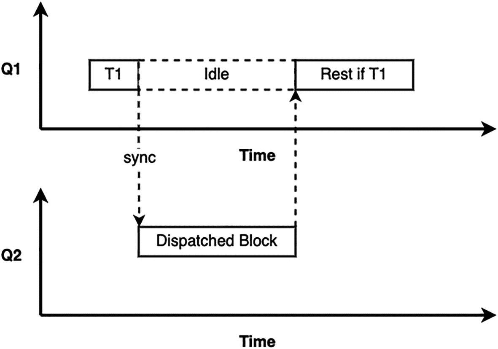

图 8-3  
同步任务示意图

另一方面，**异步**语句相对于当前队列（来源）是异步执行的。控制权会立即返还给调用者，来源队列永远不会被阻塞。并且，也无法保证该代码块具体何时执行。

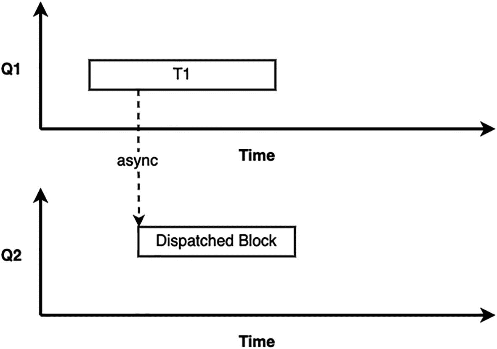

图 8-4  
异步任务示意图

## 并发的成本

`GCD` 旨在简化线程的使用，并为我们的应用执行的任务增加并发性。而并发的目的是提升应用的性能，最终使应用即使在执行繁重操作时也能保持高度响应。但遗憾的是，并发也有负面成本，这意味着我们不能随时随地应用它。

并发用于提升应用性能，但误用它实际上可能导致适得其反。想象一下，我们有一个影响非常小的操作，需要执行 10,000 次。你可能会认为在这种情况下必须使用 `GCD` 来提升性能。但是，如果我们创建 10,000 个任务并将它们全部提交给一个队列，这实际上会导致极高的内存消耗，并对操作块的分配和释放产生负面影响。因此在这种情况下，我们在试图提升性能的同时，实际上反而降低了性能。`GCD` 并非无视其他因素即可提升性能的神奇技术。与任何技术一样，它也有自身的局限性。所以，一切归结于 `GCD` 的使用方式。如何有效地使用它，取决于你。

除了给系统资源带来开销之外，使用 `GCD` 还会带来一些严重风险。其中一个特定的风险是遭遇**死锁**的风险。简单来说，死锁是一种两个线程互相等待对方完成才能继续执行的状态。在下图中，线程 A 等待线程 B 完成才能继续，而线程 B 等待线程 A 完成才能继续。这意味着两者都无法完成，因此也无法继续。这会导致这两个线程无限期地挂起。这是多线程编程中非常常见的风险，进而在使用 `GCD` 时也相当常见。

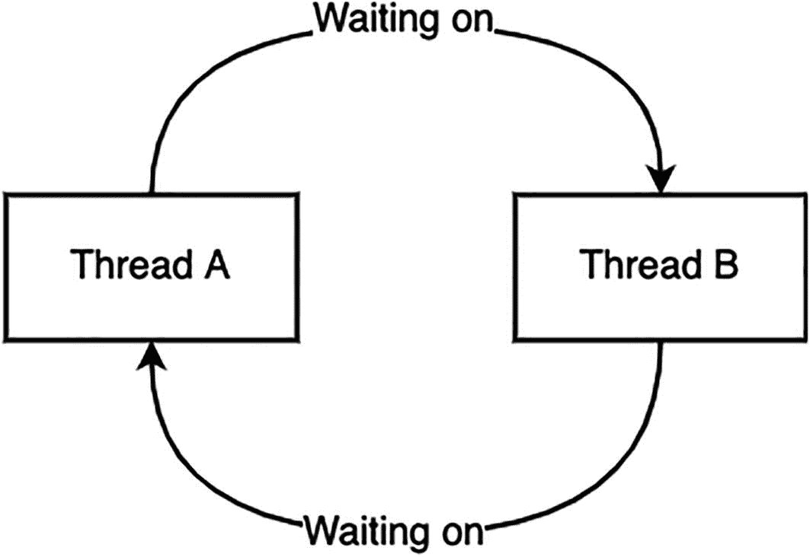

图 8-5  
死锁

使用 `GCD` 时的其他风险还包括**竞争条件**。当两个线程试图在同一时刻访问或修改同一资源时，就会发生竞争条件。竞争条件的问题在于它完全取决于线程何时被调度来执行特定任务，而根据 `GCD` 的特性，这是完全不可预测的。这使得识别、调试和重现它们变得非常棘手。这是一个同步问题，可以通过使用串行队列来解决，如果使用的是并发队列，则可以使用调度屏障来解决。还有其他实现同步的方法，但我们不会在本书中讨论。

## 读者-写者问题

许多问题都可能导致竞争条件。其中之一就是读者-写者问题。这是我们可能会遇到的更常见的问题之一。当存在一个共享资源，一个线程试图**读取**该共享资源，而另一个线程试图**写入**该资源时，就会发生此问题。

让我们谈谈如何识别我们的代码引入了这类问题。这里的关键词是**共享资源**。一旦我们有一个处理不当的共享资源，就极有可能导致竞争条件。在任何应用中，查找共享资源的首要目标就是我们臭名昭著的**单例**类。

### 单例类

单例类是指只能有一个实例的类。通常会创建一个实例并以静态方式保存在类中，然后在需要该对象的任何地方共享。在 Swift 中创建单例非常简单，只需为我们的类或结构体添加一个空的私有初始化方法，以确保我们的单例不能从类外部初始化。然后，我们再添加一个静态变量来保存该类的唯一实例。以下是一个单例类的示例：

```
struct TestStruct {
static let shared = TestStruct()
private init() { }
}
```

由于其特性，单例类很容易被两个线程同时访问，因为单个对象服务于整个应用。然而，普通类也可能在两个线程之间拥有共享资源。这完全取决于这些类的对象如何处理和使用，以及每个对象如何管理其资源。一旦我们找到可疑的资源，就需要问自己：这个资源能被多个线程访问吗？这个资源能否被访问（读取）和修改（写入）？如果这两个问题的答案都是肯定的，那么我们就找到了一个潜在的竞争条件。


### 识别竞态条件

首先，让我们看一下本章资源中的 **ReaderWriter** 项目。这是一个空项目，只包含一个使用测试驱动开发（TDD）编写的类 `Database`：

```
public class Database {
// MARK:- 单例
public static let shared = Database.shared
// MARK:- 初始化方法
private init() {}
// MARK:- 私有变量
private var dictionary: [String:Any] = [:]
// MARK:- 公共方法
public func addObject(_ object: Any, for key: String) {
dictionary[key] = object
}
public func removeObject(for key: String) {
dictionary.removeValue(forKey: key)
}
public func object(for key: String) -> Any? {
return dictionary[key]
}
public func recordsCount() -> Int {
return dictionary.count
}
public func reset() {
dictionary = [:]
}
}
```

这是一个充当极简数据库的单例类。它在内部字典中存储键值对，并提供了一些公共 API 来与数据库交互：有添加新记录的 API、删除记录的 API、检索记录的 API，以及获取当前记录数的 API。

该类含有一个内部字典。这个资源是否会导致读取器/写入器竞态条件？要回答这个问题，让我们针对该资源提出两个问题：

1.  该资源能否被多个线程访问？

    由于`Database`是单例类，其任何公共 API 都有可能被多个线程调用。因此，**答案是肯定的**。

2.  该资源能否被访问（读取）和修改（写入）？

    查看公共方法，`object(for key: String)`和`recordsCount()`都会访问该资源。而`addObject(_ object: Any, for key: String)`和`removeObject(for key: String)`则会修改该资源。因此，**答案也是肯定的**。

这两个问题的答案告诉我们，该类并非线程安全的，可能会引发竞态条件。

### 用测试驱动开发（TDD）解决问题

到现在为止，一旦你看到“TDD”，就应该立刻想到以下循环（图 8-6）。

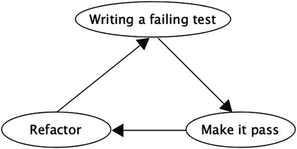

图 8-6

TDD 循环

与往常一样，我们将从第一步开始：编写一个会失败的测试。我们知道，当代码同时尝试读取和写入时，会导致竞态条件。因此，我们现在目标是编写一个因该问题而失败的测试。

现在我们来编写测试。首先，从搭建测试环境开始。我们需要创建一个新的`Database`对象，并向其中添加一条记录，以便稍后在测试中尝试检索它。我们的**给定（Given）**部分应如下所示：

```
// 给定（Given）
let database = Database.shared
database.addObject("InitialValue", for: "InitialKey")
```

接着，我们将尝试同时向数据库写入数据并从数据库中读取数据，期望这会引发竞态条件。我们的**当（When）**部分应如下所示：

```
// 当（When）
database.addObject("Test", for: "Key1")
let _ = database.object(for: "InitialKey")
```

最后，在测试的**那么（Then）**部分，我们通常会断言预期的行为确实发生了。在本例中，我们实际上有两个断言。一个是显式断言，确认记录确实已被添加。我们并不太关心这个断言。我们更关心的是隐式断言：如果测试正常运行，则说明没有发生竞态条件；但如果发生竞态条件，测试将会崩溃并失败。这在这里充当了我们的隐式断言。我们的**那么（Then）**部分应如下所示：

```
// 那么（Then）
let count = database.recordsCount()
XCTAssertEqual(count, 2)
```

如果我们运行刚才编写的测试，它实际上会通过。但为什么没有引发竞态条件而失败呢？让我们深入分析一下刚才编写的测试：

```
func testReadWriteDataRace() {
// 给定（Given）
let database = Database.shared
database.addObject("InitialValue", for: "InitialKey")
// 当（When）
database.addObject("Test", for: "Key1") // #1
let _ = database.object(for: "InitialKey") // #2
// 那么（Then）
let count = database.recordsCount()
XCTAssertEqual(count, 2)
}
```

我们知道整个测试是一个单独的代码块。在代码块的上下文中，每一行代码都是按顺序（串行）执行的。这意味着对`addObject`（#1）的调用会执行并完成后，才会执行对`object`（#2）的调用。也就是说，读取和写入操作从未并发执行（图 8-7）。

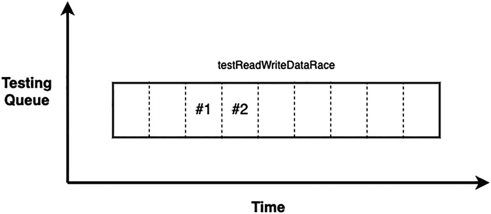

图 8-7

测试示意图

现在我们需要在两个操作之间添加并发性。我们将通过使用一个并发队列来实现。修改后的测试应如下所示：

```
func testReadWriteDataRace() {
// 给定（Given）
let queue = DispatchQueue(label: "com.ReaderWriterTests.DatabaseTests", attributes: .concurrent)
let database = Database.shared
database.addObject("InitialValue", for: "InitialKey")
// 当（When）
queue.async { // #1
database.addObject("Test", for: "Key1") // #2
}
queue.async { // #3
let _ = database.object(for: "InitialKey") // #4
}
// 那么（Then）
let count = database.recordsCount()
XCTAssertEqual(count, 2) // #5
}
```

这里我们创建了一个新的并发队列，并为其指定了标签。在**当（When）**部分，我们将两个操作异步派发到该并发队列中。我们使用 `async` 而不是 `sync`，因为如前所述，使用 `sync` 会影响源线程（即测试运行的线程），这意味着测试会在第一个`sync`调用处暂停，直到它执行完毕，然后我们才会将第二个操作派发到并发队列。在这种情况下，两个操作永远不会同时存在于队列中，这就不符合我们的目的了。


如果现在尝试运行我们的测试，它将会失败。乍一看，这是件好事，因为这正是我们试图达到的目的。但当我们实际查看失败原因时，会发现是 `XCTAssertEqual` 断言失败了。如果你还记得，我们其实并不关心这个断言，因为它并不指示竞争条件，并且在所有情况下都应该通过。这意味着 `addObject` 的调用未被执行，也就是说我们的测试存在问题。

让我们看看运行测试时会发生什么（图 8-8）。因为我们使用 `async` 派发了两个操作，这意味着源线程不会被阻塞。由于它不被阻塞，测试将在我们将操作派发到队列后立即继续执行。回到我们的测试中，这意味着它会立即执行“Then”部分。这就是测试失败的原因。我们在操作尚未执行时就执行了断言。

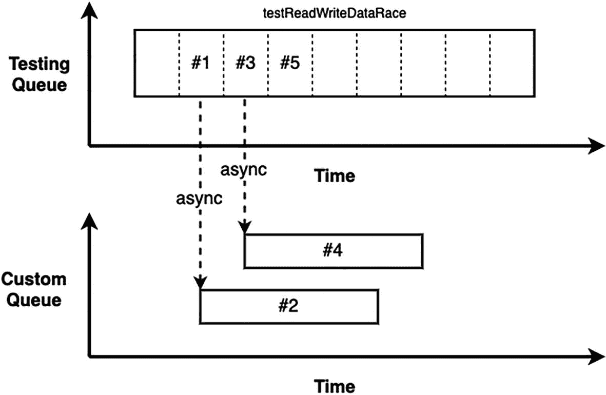

图 8-8

测试示意图

要修复我们的测试，需要阻塞测试直到操作完成。如前所述，我们不能使用 `sync`。相反，我们需要测试在派发两个任务后等待。我们可以使用 `XCTestExpectation` 来实现这一点。我们将为每个操作创建一个期望，并在 `async` 块内实现它们。然后，就在断言之前等待这两个期望。我们的测试应该像这样：

```
func testReadWriteDataRace() {
    // Given
    let queue = DispatchQueue(label: "com.ReaderWriterTests.DatabaseTests", attributes: .concurrent)
    let database = Database.shared
    database.addObject("InitialValue", for: "InitialKey")
    // When
    let exp1 = expectation(description: "Adding Key1 done")
    let exp2 = expectation(description: "Adding Key2 done")
    queue.async {
        database.addObject("Test", for: "Key1")
        exp1.fulfill()
    }
    queue.async {
        let _ = database.object(for: "InitialKey")
        exp2.fulfill()
    }
    wait(for: [exp1, exp2], timeout: 1)
    // Then
    let count = database.recordsCount()
    XCTAssertEqual(count, 2)
}
```

现在我们已经修复了测试，让它等待操作执行完毕（图 8-9），让我们再次运行它，同时留意我们正在寻找的竞争条件。当我们运行测试时，它（极有可能）会通过。这既是好消息也是坏消息。好消息是因为这意味着我们添加的期望确实发挥了作用。但坏消息是因为我们现在在并发队列上运行两个操作，但它们仍然没有同时执行。

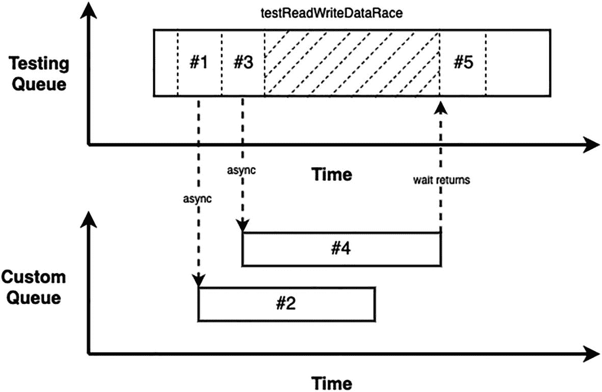

图 8-9

测试示意图

我们的竞争条件在哪里？这是否意味着 `Database` 是线程安全的？

实际上，这些问题的答案隐藏在前一段中。如果你仔细看，会发现提到测试**极有可能**通过。我们之所以不能 100% 确定测试是否会通过，是有原因的。这是因为我们正在寻找的竞争条件实际发生的可能性非常小。由于我们使用的队列是并发的，GCD 可能会决定在单独的线程上运行每个操作，从而导致竞争条件。但如前所述，这种情况发生的概率极低。原因在于，这两个操作是轻量级的操作，并且队列上只派发了两个任务。GCD 几乎不太可能决定为我们的队列额外分配一个线程。即使 GCD 额外分配了一个线程，由于我们操作的性质、它们的轻量级以及它们完成的速度之快，它们恰好同时执行的概率也确实很低。

那么现在该怎么办？我们知道测试失败的概率非常低（接近于零）。遗憾的是，这意味着我们的测试几乎没有价值。如果测试本应失败却没有失败，那么保留这个测试根本就没有理由。幸运的是，我们仍然可以做一些事情。我们知道竞争条件的概率极低，因为队列上只有两个任务，而且它们都很轻量。这意味着如果我们在队列上添加更多任务，就会增加这种概率。我们甚至可以显著提高这个概率，直到我们确信竞争条件一定会发生。让我们看看如何做到这一点：

```
func testReadWriteDataRace() {
    // Given
    let queue = DispatchQueue(label: "com.ReaderWriterTests.DatabaseTests", attributes: .concurrent)
    let database = Database.shared
    database.addObject("InitialValue", for: "InitialKey")
    // When
    var expectations:[XCTestExpectation] = []
    for i in 0..<500 {
        let key = "Key\(i+1)"
        let exp = expectation(description: "Adding \(key) done")
        queue.async {
            database.addObject("Test", for: key)
            exp.fulfill()
        }
        expectations.append(exp)
    }
    for i in 0..<500 {
        let key = "Key\(i+1)"
        let exp = expectation(description: "Adding \(key) done")
        queue.async {
            let _ = database.object(for: "InitialKey")
            exp.fulfill()
        }
        expectations.append(exp)
    }
    wait(for: expectations, timeout: 10)
    // Then
    let count = database.recordsCount()
    XCTAssertEqual(count, 501)
}
```

我们简单地修改了测试，以便执行 500 次读取操作和 500 次写入操作。通过用这个极高的任务数来过载我们的队列，我们基本上迫使 GCD 为这个队列分配不止一个线程，并且由于读写操作的数量很大，几乎可以确定其中两个操作会同时执行。

如果现在尝试运行我们的测试，它最终会因竞争条件而失败。


### 线程清理器

然而，现在我们遇到了一个新问题：测试耗时过长。如果试图减少迭代次数，又会降低捕捉线程问题的准确性。幸运的是，Xcode 中有一个工具可以帮我们解决这个问题——`Thread Sanitizer`（线程清理器）。

`Thread Sanitizer`（通常简称为 `TSan`）是苹果公司作为 LLVM 编译器的一部分提供的工具。它能帮助审查 Swift 和 C 语言代码中的线程问题。该清理器能够检测到多个线程尝试访问同一资源且至少有一个访问是写操作的情况。它通过重建整个应用程序，并在代码中的每个内存访问周围添加检查来实现这一点。这些检查会记录下内存访问的发生时间、发生位置以及来自哪个线程。根据这些信息，它能在发生非法内存访问时添加断点。

`Thread Sanitizer` 的妙处在于它能够检测到静默的数据竞争。在很多情况下，同一资源可能被不同线程访问和修改，但线程之间仅差微秒未能产生冲突。没有这个清理器，这种场景会因不会导致异常行为或崩溃而被忽略。然而其他时候，它们可能会发生冲突。正是这种随机性使得线程问题难以调试。但启用 `Thread Sanitizer` 后，捕捉线程问题的几率会大大增加。

要启用 `Thread Sanitizer`，我们需要进入方案配置界面（图 8-10）。

让我们为“运行”和“测试”配置启用该清理器。

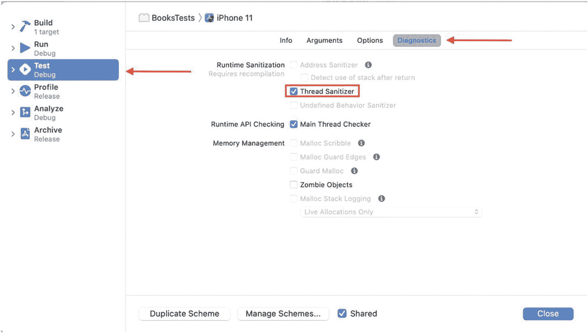

图 8-10  
启用线程清理器

现在，为了让 Xcode 在检测到数据竞争时暂停，我们需要添加“运行时问题断点”。我们可以从断点导航器中添加它（图 8-11）。

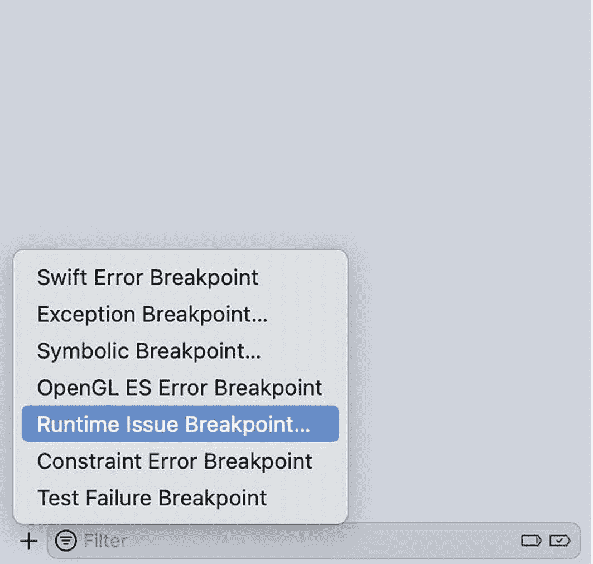

图 8-11  
添加运行时问题断点

由于现在已经启用了 `Thread Sanitizer`，如果需要，我们实际上可以适当减少迭代次数。

### 让测试通过

现在我们终于完成了 TDD 周期中的第一步，是时候修复那个我们刚刚庆祝其失败的测试了。如前所述，竞态条件是同步问题，可以通过多种方式修复。让我们尝试使用串行队列来修复它。目标是利用串行队列来实现数据库对象执行的所有操作之间的同步。我们需要确保在任何给定时间只执行一个操作。

当我们添加串行队列后，`Database` 类应该如下所示：

```
public class Database {
    // MARK:- 单例
    public static let shared = Database.shared
    // MARK:- 私有变量
    private var dictionary: [String:Any] = [:]
    private let queue = DispatchQueue(label: "com.ReaderWriter.Database")
    // MARK:- 公共函数
    public func addObject(_ object: Any, for key: String) {
        queue.sync {
            dictionary[key] = object
        }
    }
    public func removeObject(for key: String) {
        queue.sync {
            _ = dictionary.removeValue(forKey: key)
        }
    }
    public func object(for key: String) -> Any? {
        queue.sync {
            return dictionary[key]
        }
    }
    public func recordsCount() -> Int {
        queue.sync {
            return dictionary.count
        }
    }
    public func reset() -> Int {
        queue.sync {
            dictionary = [:]
        }
    }
}
```

现在让我们再次运行测试。它应该能通过了 ✅。让我们也运行其余测试，以确保我们的更改没有导致任何回归。由于所有测试都通过了，并且没有需要重构的地方，这意味着我们已经完成了这个问题的修复。那么就是这样：我们在代码中识别出一个与多线程相关的问题，并成功应用 TDD 修复了它。

## 修复 Books 中的线程问题

`Books` 是第 6 章中介绍的项目。目前，`Books` 是一个模块化应用，但这并不意味着它没有 Bug。幸运的是，在编写 `Books` 时，并发问题并非首要考虑事项。因此，我们现在有机会在一个真实应用中看到线程问题，并尝试使用 TDD 来修复它，就像我们刚刚对 `Database` 类中的读写者问题所做的那样。

让我们打开项目（可在本章资源中找到），开始寻找潜在的线程问题。如果仔细查看，会发现代码中有一个地方可能不是线程安全的。那就是我们 `UIImageView` 上的扩展，它负责处理图片缓存：

```
extension UIImageView {
    static var dictionaryImageCache = [String:UIImage]()
    func load(url: URL) {
        DispatchQueue.global().async { [weak self] in
            if (UIImageView.dictionaryImageCache[url.path] != nil) {
                DispatchQueue.main.async {
                    self?.image = UIImageView.dictionaryImageCache[url.path]
                }
                return
            }
            if let data = try? Data(contentsOf: url) {
                if let image = UIImage(data: data) {
                    UIImageView.dictionaryImageCache[url.path] = image
                    DispatchQueue.main.async {
                        self?.image = image
                    }
                }
            }
        }
    }
}
```

这个扩展的工作原理是：它有一个静态字典，用于存储图片，该字典对所有 `UIImageView` 实例都是可访问的。这表明共享字典上可能发生数据竞争。为了确定，让我们问自己两个问题：

1. **这个资源是否可以从多个线程访问？**  
   该扩展本质上是全局的，适用于所有 `UIImageView` 实例，这意味着我们可以轻松地从多个线程调用 `load(url: URL)`。

2. **这个资源是否可以同时被访问（读取）和修改（写入）？**  
   查看 `load` 函数，它所做的是访问字典以检查图片是否在缓存中；如果没有，则加载图片并修改字典以保存新加载的图片。

这两个问题的答案告诉我们，这个扩展不是线程安全的，可能会导致竞态条件。


### 应用测试驱动开发（TDD）

TDD 的第一步是编写一个会失败的测试。这个测试将与我们上一个例子最终得到的测试非常相似：

```
func testLoadImageMultiThreading() {
    // 给定条件
    let queue = DispatchQueue(label: "com.ReaderWriterTests.DatabaseTests", attributes: .concurrent)
    let image = UIImageView()
    // 执行操作
    var expectations:[XCTestExpectation] = []
    for i in 0..<500 {
        let key = "Key\(i+1)"
        let exp = expectation(description: "添加 \(key) 完成")
        queue.async {
            image.load(url: URL(string: "https://storage.googleapis.com/du-prd/books/images/9781501171345.jpg")!)
            exp.fulfill()
        }
        expectations.append(exp)
    }
    for i in 0..<500 {
        let key = "Key\(i+1)"
        let exp = expectation(description: "添加 \(key) 完成")
        queue.async {
            image.load(url: URL(string: "https://storage.googleapis.com/du-prd/books/images/9781501171345.jpg")!)
            exp.fulfill()
        }
        expectations.append(exp)
    }
    wait(for: expectations, timeout: 10)
}
```

现在我们有了一个失败的测试，表明我们的代码不是线程安全的，是时候修复我们的代码了。我们可以像数据库示例中那样，使用串行队列来修复扩展，但让我们尝试点新东西。这次我们将使用锁，这是一种确保同步的常用方法：

```
extension UIImageView {
    // MARK:- 变量
    static var dictionaryImageCache = [String:UIImage]()
    static var lock = NSRecursiveLock()
    // MARK:- 函数
    func load(url: URL) {
        DispatchQueue.global().async { [weak self] in
            Self.lock.lock()
            if (Self.dictionaryImageCache[url.path] != nil) {
                DispatchQueue.main.async {
                    self?.image = Self.dictionaryImageCache[url.path]
                }
                Self.lock.unlock()
                return
            }
            Self.lock.unlock()
            if let data = try? Data(contentsOf: url) {
                if let image = UIImage(data: data) {
                    Self.lock.lock()
                    Self.dictionaryImageCache[url.path] = image
                    Self.lock.unlock()
                    DispatchQueue.main.async {
                        self?.image = image
                    }
                }
            }
        }
    }
}
```

我们在这里所做的是，在访问或修改之前，先通过调用 `lock()` 获取锁。这确保了当任何其他线程试图获取同一把锁时，它将被强制等待，直到持有锁的线程释放它。我们通过调用 `unlock()` 来释放锁。

现在如果我们再次运行测试（图 8-12），它将会通过 ✅。


图 8-12. 多线程测试通过

## 总结

在本章中，你了解了多线程编程中的一些主要概念。首先是并发，即两个或多个任务可以在不同线程上同时执行。在 iOS 中，并发是通过使用 Grand Central Dispatch (GCD) 实现的。GCD 将线程的手动处理从开发者手中抽象出来。你无需创建线程，而是创建任务并将其分发到队列，GCD 会在需要时处理这些任务在多个线程上的底层执行。

调度队列是 GCD 运行的核心。当任务被提交到队列时，GCD 会按照先进先出的顺序执行这些任务。然而，我们有两种类型的队列：串行队列和并发队列。串行队列确保在任何给定时间，该队列中只有一个任务在运行，当一个任务完成后，队列中的下一个任务才开始。另一方面，并发队列能够同时运行多个任务。

当向队列提交任务时，我们可以使用 `sync` 或 `async` 来提交。这种区别影响的是**源**队列（执行分发的队列），而不是**目标**队列（任务被提交到的队列）。使用 `sync` 时会阻塞调用队列，直到任务完成。而使用 `async` 时，调用队列会正常运行。

并发有许多好处，尤其是在性能方面。由于我们能够同时执行多个任务，并且不会因为一个繁重任务而阻塞另一个任务，这自然会提升我们应用的性能。但这并非总是如此，过度使用并发会因不必要的高内存消耗而降级性能。

除了对性能的负面影响，并发还有一些严重的缺点。如果使用不当，并发可能导致错误和崩溃。当两个操作依赖于同一个共享资源并且彼此并发执行时，可能会引发一系列问题。我们可能会遇到死锁，甚至是数据竞争条件。

当某个线程正在修改一个资源，而另一个线程要么试图读取同一资源，要么也试图修改它时，就会发生竞态条件。竞态条件往往会导致极其难以调试的意外行为，在某些情况下甚至可能引发崩溃。在本章中，我们探讨了如何应用 TDD 来修复数据竞争。我们通过添加一种特殊类型的测试来应用 TDD 的第一步，这种测试在多线程环境中测试我们的代码（并配合使用线程清理器）。然后像往常一样进行 TDD 循环中的第二步和第三步。

