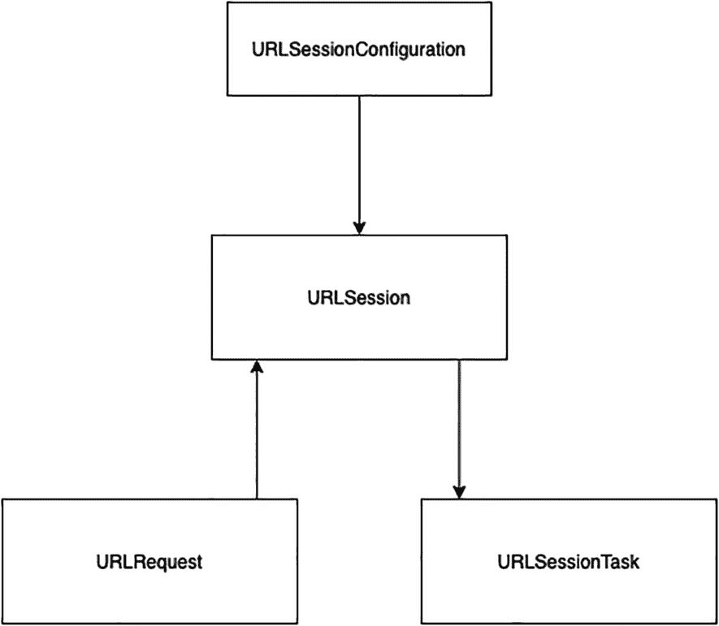
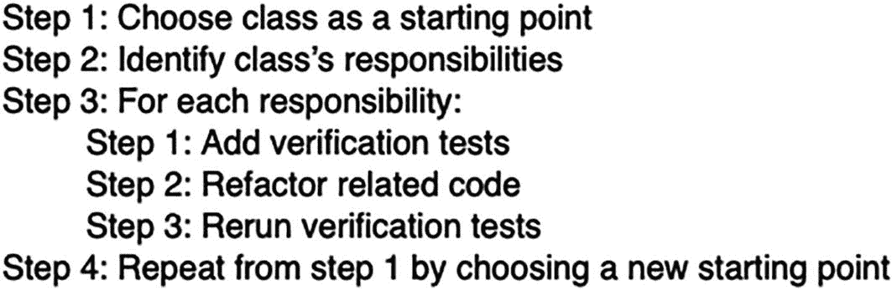
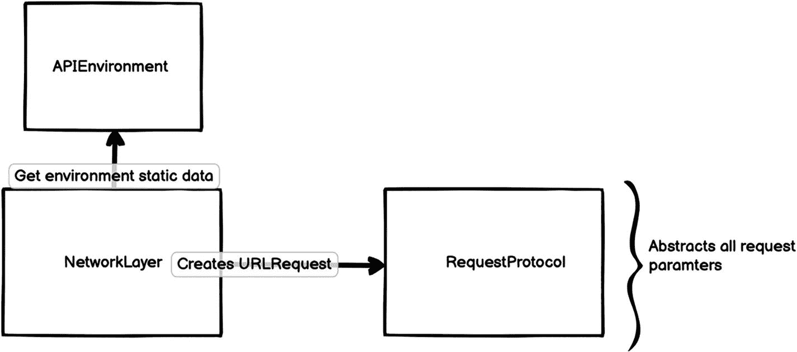

# 9. 测试你的网络

如今大多数应用在某个时候都会与互联网通信。纯本地应用很棒，但与 Web 服务通信可以帮助你将应用转变为一款真正卓越的应用。有大量多样化的公共 Web 服务可供你的应用使用。你还可以接入自己的私有 Web 服务，为用户提供一组扩展的功能，这些功能是你的纯本地应用所无法提供的。

## 网络基础知识

当人们想到互联网时，脑海中可能会浮现出许多东西。其中之一就是“**www.**”。这代表**万维网**，它是我们能够通过互联网访问的信息系统。顾名思义，这个系统是全球性的。对于如此庞大的系统，要演变成我们今天所知的模样，它必须受一些协议的约束，以便全球所有机器都能访问。因此，两台机器之间要通信，需要使用定义的协议进行。协议本质上是双方之间的一份契约，包含一套既定的规则，规定了数据如何在不同的设备之间传输。

### HTTP 请求

超文本传输协议 (HTTP) 是一种允许在双方之间传输资源的协议。

一个 HTTP 请求通常包含以下内容：

* URL：标识我们想要的资源。
* HTTP 方法：声明可以执行的操作类型。
* 头部（可选）：这是键/值对，允许我们向服务器传递额外信息。
* 数据（可选）：可以有多种形式，例如 JSON。通常被称为请求的正文。

HTTP 方法有多种选择：

* `GET`：用于获取资源
* `POST`：用于创建或更新资源
* `PATCH`：用于修改资源
* `PUT`：用于替换资源
* `DELETE`：用于删除资源

### HTTP 响应

当你向服务器发出 HTTP 请求时，服务器会返回一个响应。一个响应通常包含以下内容：

* 状态码：这是一个数字，告诉你请求是否成功，或者因为某些错误而失败。
* 头部：这类似于请求中的头部。它们携带关于响应的额外信息。
* 数据：这也类似于请求中的数据。它携带你所请求的数据（如果有的话）。它可以有多种形式，但大多数服务器以 JSON 格式返回数据。


### URL

统一资源定位符（URL）本质上是一个指向特定资源的地址。该资源可以是 HTML 页面、图片、JSON 数据等。


图 9-1 URL 组成部分

一个基本的 URL 包含不同的组成部分（图 9-1）：

- **协议方案**：指明客户端访问资源时必须使用的协议。
- **主机**：通常是一个域名（也可以使用 IP 地址），指明我们正在通信的服务器。
- **路径**：标识我们向服务器请求的特定资源。
- **查询**（可选）：通过此部分可添加额外参数，服务器在返回资源前可能会使用这些参数进行进一步处理。

还有其他可能的组成部分，但对基本使用无关紧要，因此我们将不进行讨论。

### iOS 中的网络

如前所述，几乎所有真正有价值的应用都会在某个时候发起网络请求。这使得执行网络请求成为每个 iOS 开发者必须掌握的技能。如今很多开发者依赖第三方库来处理网络调用。这些库中有些功能非常强大，但在许多情况下它们可能显得大材小用，而且使用它们只是增加了一个外部依赖，这始终是一种风险。相反，我们可以使用原生的 iOS URL 加载系统，其中主要组件是`URLSession`。`URLSession`是一组协同处理网络请求的类的一部分。

让我们详细讨论一下 iOS URL 加载系统中最重要的组件（图 9-2）。



图 9-2 iOS URL 加载系统

#### URLSession

会话是 HTTP 的核心概念。你可以将会话看作是网络浏览器中打开的一个标签页或窗口，通过它可以发起多个网络请求。加载一个网页时，底层可能会通过多个请求获取许多资源才能渲染页面。这些请求因为共享多个元素而使用同一个会话进行。从名称来看，`URLSession`用于管理一个 HTTP 会话。使用同一个`URLSession`发起多个请求，允许我们在请求之间共享配置和缓存数据。

#### URLSessionConfiguration

既然我们刚刚提到使用同一会话发出的请求共享相同的配置，那么我们来谈谈保存这些配置的对象。`URLSessionConfiguration`定义了使用`URLSession`发起请求时的行为和策略。我们可以用它来设置超时值、缓存策略、连接要求等。有三种类型的`URLSessionConfiguration`：

- **默认**：一种使用磁盘持久化存储来保存缓存、Cookie 或凭据的会话配置。
- **临时**：一种不使用任何持久化存储来保存缓存、Cookie 或凭据的会话配置。
- **后台**：一种允许应用在后台执行上传或下载的会话配置，即使应用本身被挂起或终止也能进行。

#### URLRequest

我们已经讨论过构成 HTTP 请求的组件：URL、HTTP 方法、标头和数据。`URLRequest`是一个封装了所有这些描述单个请求的组件的结构体。

#### URLSessionTask

这是实际执行请求的对象。通常我们不直接使用`URLSessionTask`，而是使用它的子类之一。有四种原生类型的任务：

- **数据任务**：此类任务能够发送和接收数据。这是最常见的任务类型，例如在发送或请求 JSON 时使用。
- **上传任务**：此类任务与数据任务类似，但还支持在后台上传数据。
- **下载任务**：此类任务能够从服务器下载数据，并直接将其写入磁盘上的文件中。你还可以跟踪下载进度，并可以暂停和恢复下载。
- **流任务**：此类任务通过与服务器建立连接来提供数据流。

我们不直接创建这些任务，而是使用`URLSession`内部的某个函数来创建新任务。创建任务后，我们通过调用`resume()`函数来启动它。

### Books 应用中的网络

我们应用的主要前提是获取畅销书列表并展示给用户。我们功能的很大一部分依赖于网络。而且未来我们可能需要添加依赖网络的新功能。然而，当我们审视网络层时，会发现它与我们向服务器请求的单个资源高度耦合。我们还会发现网络层没有通过测试进行充分覆盖。

幸运的是，这是可以修复的，这将是本章剩余部分的目标。我们的目标是创建一个足够通用的网络层（图 9-3），使其易于针对不同请求进行重用。与往常一样，我们将采用测试驱动的方法来实现这一重构。你可以在本章的资源中找到这个项目。


图 9-3 网络模块

#### 流程概述

我们的网络层已经与代码的其余部分分离。我们在这里要做的只是对其进行重构。尽管我们尝试做的事情并不算是模块化，但我们将应用与第 6 章（图 9-4）中概述相同的原则和几乎相同的流程。让我们来看看这个流程，看看哪些适用于我们的情况。

##### 模块化流程



图 9-4 模块化流程

首先，我们实际上不需要选择起始点，因为只有一个点，即`NetworkLayer`类。这使得步骤 1 和步骤 4 变得多余。

##### 识别类的职责

这里讨论的类是`NetworkLayer`类。如果查看这个类，会发现它只有一个职责，即执行请求以从服务器获取书籍。然而，正如我们之前提到的，我们需要稍微调整这个职责，使其更加通用。我们希望让这个类能够发起任何请求，而不仅仅是从服务器获取我们的书籍。我们将在接下来的步骤中尝试实现这一点。

##### 设计概览

现在，在开始重构之前，让我们更仔细地看看`NetworkLayer`在内部做了什么。我们可以看到它做了很多事情。首先，它存储了许多与环境相关的静态信息，比如主机、API 密钥等。其次，它包含了创建请求本身的信息，这很混乱，而且我们已经知道要让它更通用。第三，它创建了一个`URLSessionTask`并执行请求。一个好的想法是将所有这些内聚的任务分离出来。

###### 需要重构的 NetworkLayer 任务

1. 存储静态信息
2. 创建 URL 请求
3. 创建`URLSessionTask`并执行请求


### NetworkLayer 新设计

为了避免受到当前实现的影响，我们应当在不查看现有代码的情况下，思考新对象之间将如何交互。我们的设计方案可以类似于图 9-5。`NetworkLayer` 将使用 `APIEnvironment` 来获取所有静态数据。`RequestProtocol` 是一个封装了 `URLRequest` 创建过程的协议。因此，每当我们想要发起网络调用时，都需要实现 `RequestProtocol`。这样一来，`NetworkLayer` 就能够创建 `URLSessionTask` 并执行请求。



图 9-5  
网络层设计

### 开始行动

既然我们已经明确了 `NetworkLayer` 类的职责，并且也确定了这些职责应如何修改，那么是时候开始重构了。

根据模块化流程，我们知道重构时需要遵循以下步骤：

1.  添加验证测试。
2.  重构相关代码。
3.  重新运行验证测试。

### 验证测试

那么就从验证测试开始。我们需要验证 `MainViewModel` 在重构后的功能是否完全一致。`MainViewModel` 通过使用 `NetworkLayer` 来获取书籍列表，`NetworkLayer` 会发起网络请求，并通过回调将书籍列表返回给 `MainViewModel`。我们需要验证测试确保这个流程在重构后依然能正常工作。查看当前的测试套件，我们发现 `MainViewIntegrationTests` 中的 `testFetchBestSellerBooks` 方法可以作为我们的验证测试。此外，再向上看一层，会发现我们也有覆盖此功能的 UI 测试。现在，如果 `MainViewModel` 和 `NetworkLayer` 之间的集成被破坏，我们的测试将会失败。这样我们就可以放心地重构 `NetworkLayer` 了。

### 发起网络请求

让我们先为此编写一个测试。创建一个新的测试用例类，命名为 `NetworkLayerTests`，并向其中添加以下内容：

```
func testExecutingSuccessfulRequest() {
    // 准备
    let network = NetworkLayer()
    let request = TestRequest()
    let env = APIEnvironment.production
    // 执行
    let expectation = XCTestExpectation(description: "请求已完成")
    network.executeRequest(request, callBack: {
        expectation.fulfill()
    })
    self.wait(for: [expectation], timeout: 0.1)
    // 验证
    // 缺少断言
}
```

为了修复构建错误，我们先添加一些代码。首先，在 `NetworkLayer` 中添加新的 API，但暂时保持实现为空：

```
public func executeRequest(_ request: T, callBack: @escaping NetworkCompletion) {
    // 暂时保持为空
}
```

并在文件顶部、类作用域之外添加这个类型别名：

```
typealias NetworkCompletion = () -> Void
```

### RequestProtocol

现在，为了使用新的 API，我们总是需要传递一个符合我们请求协议的实例。这个实例将携带发起请求所需的所有信息。是时候定义这个协议了。创建一个新文件，并在其中添加以下内容：

```
enum HTTPMethod: String {
    case GET
    case POST
    case PATCH
    case PUT
    case DELETE
}

protocol RequestProtocol {
    var method: HTTPMethod { get }
    var body: Data? { get }
    var path: String { get }
    var queryItems: [URLQueryItem]? { get }
}
```

目前我们的测试仍然无法构建。这是因为我们需要在测试目标内创建 `TestRequest` 结构体，并使其遵循 `RequestProtocol`：

```
import Foundation
@testable import Books

struct TestRequest: RequestProtocol {
    var method: HTTPMethod {
        return .GET
    }
    var body: Data? {
        return "请求数据".data(using: .utf8)
    }
    var path: String {
        return "/api/mock"
    }
    var queryItems: [URLQueryItem]? {
        return [URLQueryItem(name: "offset", value: "20")]
    }
}
```

我们可以通过扩展为 `RequestProtocol` 添加一个非常有用的函数，即创建一个描述该请求的 URL。这能保持代码整洁。创建 URL 仍然需要定义主机（host）和方案（scheme）。这些在不同请求之间不会改变；但是，它们在生产环境和测试环境之间会有所不同。我们将这些信息提取出来，保存到一个新的组件中。

让我们先为 URL 请求的创建编写一个测试，看看效果如何。添加一个新的测试用例类，命名为 `RequestProtocolTests`，并向其中添加这个测试：

```
func testCreateURLRequest() {
    // 准备
    let environment = APIEnvironment(scheme: "http", host: "test.com", port: 433, API_KEY: "KEY")
    let request = TestRequest()
    // 执行
    let urlRequest = request.createURLRequest(with: environment)
    // 验证
    XCTAssertEqual(urlRequest?.url?.absoluteString, "http://test.com:433/api/mock?offset=20")
    XCTAssertEqual(urlRequest?.httpMethod, "GET")
    XCTAssertEqual(urlRequest?.httpBody, "请求数据".data(using: .utf8))
}
```

为了让这个测试能够构建，我们需要创建 `APIEnvironment`。由于这个组件非常简单，我们将跳过详细的 TDD 步骤。但是，经过多个 TDD 周期后，我们最终应该得到这个结构体：

```
struct APIEnvironment {
    let scheme: String
    let host: String
    let port: Int?
    let API_KEY: String

    static let production: APIEnvironment = .init(scheme: "https", host: "api.nytimes.com", port: nil, API_KEY: "YOUR_API_KEY")
    static let testing: APIEnvironment = .init(scheme: "http", host: "localhost", port: 8080, API_KEY: "KEY")
}
```

这仅仅封装了环境的方案和主机，并且我们也包含了 API 密钥。我们还添加了两个预设实例作为静态变量。

为了让创建 URL 请求的测试通过，我们需要添加这个扩展：

```
extension RequestProtocol {
    func createURLRequest(with environment: APIEnvironment) -> URLRequest? {
        guard let url = createURL(with: environment) else {
            return nil
        }
        var request = URLRequest(url: url)
        request.httpMethod = method.rawValue
        request.httpBody = body
        return request
    }

    private func createURL(with environment: APIEnvironment) -> URL? {
        var components = URLComponents()
        components.scheme = environment.scheme
        components.host = environment.host
        components.port = environment.port
        components.path = path
        components.queryItems = queryItems
        return components.url
    }
}
```

这段代码可以放在任何地方，但放在协议所在的同一个文件中比较合理。

### 执行请求

在经历了为 `RequestProtocol` 添加创建 URL 函数的小插曲之后，让我们回到正轨。如果运行 `testExecutingSuccessfulRequest`，会发现它因为期望条件从未被满足而失败。让我们通过在 `executeRequest` 内部直接调用完成处理程序来解决这个问题：

```
public func executeRequest(_ request: T, callBack: @escaping NetworkCompletion) {
    callBack()
}
```

现在我们的测试将通过 ✅。


