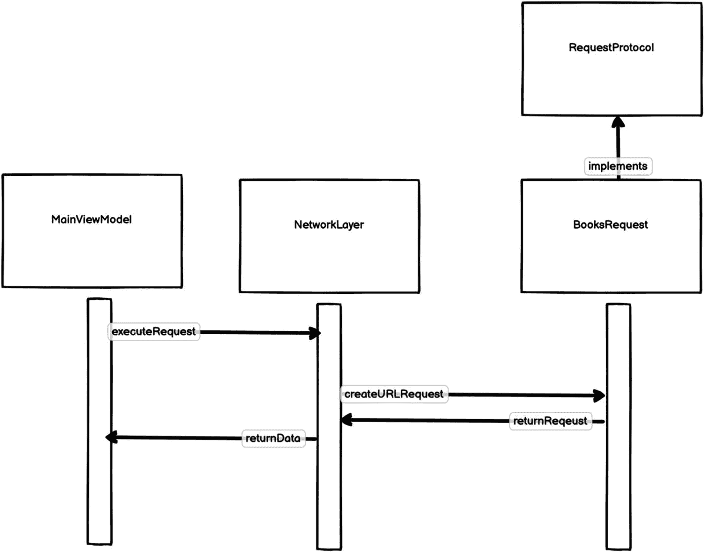
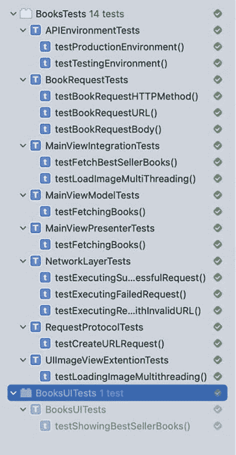

# 模拟 URLSession

我们需要更新测试，因为现在即使没有发起任何网络请求，测试也能通过。为了能够测试 `NetworkLayer` 的内部行为，我们需要插入一个 `URLSession` 的模拟对象，并用它来断言请求是否已被执行。让我们创建模拟对象：

```
class URLSessionMock: URLSession {
typealias CompletionHandler = (Data?, URLResponse?, Error?) -> Void
public var stubbedData: Data?
public var request: URLRequest?
override func dataTask(with request: URLRequest, completionHandler: @escaping CompletionHandler) -> URLSessionDataTask {
let data = self.stubbedData
self.request = request
return URLSessionDataTaskMock {
completionHandler(data, nil, nil)
}
}
}
class URLSessionDataTaskMock: URLSessionDataTask {
private let closure: () -> Void
init(closure: @escaping () -> Void) {
self.closure = closure
}
override func resume() {
closure()
}
}
```

这里我们创建了一个测试替身，以便模拟 `URLSession`。我们通过继承 `URLSession` 并重写创建数据任务的方法来创建这个模拟对象。我们重写该方法，使其执行两件事：首先，保存传入的输入参数；其次，返回一个 `URLSessionDataTaskMock` 的实例，该实例是 `URLSessionDataTask` 的测试替身。这个模拟对象不会发起网络请求，而是执行一个传入的代码块。我们用这个代码块来判断任务是否已被执行。

现在我们已经创建了测试替身，是时候将其注入到测试中的 `NetworkLayer` 实例里了：

```
func testExecutingSuccessfulRequest() {
// 给定
let session = URLSessionMock()
let network = NetworkLayer(session: session)
let request = TestRequest()
let env = APIEnvironment.production
// 当
let expectation = XCTestExpectation(description: "Request is done")
network.executeRequest(request, callBack: {
expectation.fulfill()
})
self.wait(for: [expectation], timeout: 0.1)
// 那么
// 缺少断言
}
```

现在我们需要更新我们的类，使其能够接受注入的 `URLSession`。我们将在类中添加这个变量：

```
let session: URLSession
```

并添加一个新的初始化方法：

```
init(session:URLSession = .shared) {
self.session = session
}
```

这里，我们在初始化方法中传入一个会话（session）并将其保存在本地变量中，以便用它来发起请求。如果没有传入自定义会话，则默认使用共享会话。

现在我们已经成功注入了模拟对象，可以更新测试，使其真正断言数据任务的创建和执行：

```
func testExecutingSuccessfulRequest() {
// 给定
let expectedData = "Sample Data".data(using: .utf8)
let session = URLSessionMock()
session.stubbedData = expectedData // #1
let network = NetworkLayer(session: session)
let request = TestRequest()
let env = APIEnvironment.production
// 当
let expectation = XCTestExpectation(description: "Request is done")
var actualData: Data?
var actualError: APIError?
network.executeRequest(request, callBack: { data, error in // #2
actualData = data // #3
actualError = error
expectation.fulfill()
})
self.wait(for: [expectation], timeout: 0.1)
// 那么
XCTAssertNotNil(session.request)
XCTAssertEqual(session.request?.httpMethod, "GET")
XCTAssertEqual(session.request?.httpBody, "Request Data".data(using: .utf8))
XCTAssertEqual(session.request?.url, request.createURLRequest(with: env)?.url)
XCTAssertEqual(expectedData, actualData)
XCTAssertNil(actualError)
}
```

在这个测试中，我们做了以下几件事：

1. 在这里，我们告诉会话模拟对象当请求发起时应返回什么数据。
2. 我们修改了代码块，因为现在我们期望函数返回数据。
3. 在这里，我们保存了返回的数据和错误，以便后续对其进行断言。

而在我们的**那么**部分，我们断言传递给会话的请求被正确创建，并具有正确的方法、主体和 URL。我们还断言返回的数据是预期的数据。同时，我们断言没有返回错误。

## 使用 URLSession

为了修复这个测试，我们需要利用 `URLSession` 并真正发起请求。首先，我们需要添加以下代码，以便 `NetworkLayer` 能为我们的请求提供基础 URL：

```
public static var environment: APIEnvironment {
return isTesting() ? .testing : .production
}
```

这里我们利用了之前创建的两个 `APIEnvironment` 实例。并根据当前环境返回其中一个。

我们需要更新 `NetworkCompletion` 类型别名，并添加错误枚举：

```
typealias NetworkCompletion = (Data?, APIError?) -> Void
enum APIError: Error {
// 暂时留空
}
```

然后，我们更新函数以实际发起请求：

```
public func executeRequest(_ request: T, callBack: @escaping NetworkCompletion) {
guard let urlRequest = request.createURLRequest(with: Self.environment) else {
return
}
let task = self.session.dataTask(with: urlRequest) { data, response, error in
guard let data = data else {
return
}
callBack(data, nil)
}
task.resume()
}
```

经过这些更改，我们的测试将会通过 ✅。

### 展示测试的价值

为了展示测试的价值，如果出于某种原因我们没有调用 `task.resume()`（例如在后续重构代码时可能发生），我们的测试将会失败。我们可以通过注释掉 `task.resume()` 的调用来模拟这种情况，然后运行测试。你会看到测试失败，如图 9-6 所示。


图 9-6

测试失败


#### 处理失败请求

我们已经介绍了如何通过测试用例成功发起请求，接下来编写失败场景的测试用例。本章将涵盖请求可能失败的两种情况：第一种是服务器完全不返回数据，第二种是客户端错误（当我们未提供有效 URL 时发生）。现在我们来编写这两个测试。

首先添加模拟服务器无数据返回并报错的测试：

```
func testExecutingFailedRequest() {
    // Given
    let session = URLSessionMock()
    session.stubbedData = nil
    let network = NetworkLayer(session: session)
    let request = TestRequest()
    let env = APIEnvironment.production
    // When
    let expectation = XCTestExpectation(description: "Request is done")
    var actualData: Data?
    var actualError: APIError?
    network.executeRequest(request, callBack: { data, error in
        actualData = data
        actualError = error
        expectation.fulfill()
    })
    self.wait(for: [expectation], timeout: 0.1)
    // Then
    XCTAssertNotNil(session.request)
    XCTAssertEqual(session.request?.httpMethod, "GET")
    XCTAssertEqual(session.request?.httpBody, "Request Data".data(using: .utf8))
    XCTAssertEqual(session.request?.url, request.createURLRequest(with: env)?.url)
    XCTAssertNil(actualData)
    XCTAssertEqual(actualError, .requestFailed)
}
```

这里我们让模拟会话不返回任何数据，然后通过检查返回错误的类型来验证 `NetworkLayer` 是否正确处理此场景。这个测试现在会失败。让我们添加第二个测试，然后一起修复这两个问题。

接下来添加另一个测试，模拟尝试发起无效请求的场景。要创建这个测试，需要新建一个遵循 `RequestProtocol` 的结构体，用于描述无效请求：

```
struct InvalidRequest: RequestProtocol {
    var body: Data? {
        return nil
    }
    var path: String {
        return "INVALID PATH"
    }
    var queryItems: [URLQueryItem]? {
        return nil
    }
    var method: HTTPMethod {
        return .GET
    }
}
```

现在添加测试代码：

```
func testExecutingRequestWithInvalidURL() {
    // Given
    let session = URLSessionMock()
    session.stubbedData = "Sample Data".data(using: .utf8)
    let network = NetworkLayer(session: session)
    let request = InvalidRequest()
    // When
    let expectation = XCTestExpectation(description: "Request is done")
    var actualData: Data?
    var actualError: APIError?
    network.executeRequest(request, callBack: { data, error in
        actualData = data
        actualError = error
        expectation.fulfill()
    })
    self.wait(for: [expectation], timeout: 0.1)
    // Then
    XCTAssertNil(session.request)
    XCTAssertNil(actualData)
    XCTAssertEqual(actualError, .invalidRequest)
}
```

为了让测试通过，我们需要修改 `executeRequest` 函数以处理这两种场景。

首先在 `APIError` 中添加两个枚举值：

```
enum APIError: Error {
    case requestFailed
    case invalidRequest
}
```

然后将 `executeRequest` 的实现修改为：

```
public func executeRequest(_ request: T, callBack: @escaping NetworkCompletion) {
    guard let urlRequest = request.createURLRequest(with: Self.environment) else {
        callBack(nil, .invalidRequest)
        return
    }
    let task = self.session.dataTask(with: urlRequest) { data, response, error in
        guard let data = data else {
            callBack(nil, .requestFailed)
            return
        }
        callBack(data, nil)
    }
    task.resume()
}
```

当检测到请求无效或请求失败时，我们用相应的 `APIError` 类型值调用完成处理器。

#### 整合所有功能

既然所有测试都已通过，是时候在应用程序中使用新的 API 了。让我们从高层次概览设计结构（图 9-7）。



图 9-7：集成新的网络层

我们的 `MainViewModel` 将使用 `NetworkLayer` 的公共 API `executeRequest`，并传入一个类型为 `BookRequest` 的请求。然后 `NetworkLayer` 使用传入的图书请求获取所需信息并执行请求。请求完成后，`NetworkLayer` 通过回调将响应返回给视图模型。

基于这个概览，我们需要创建一个新组件 `BookRequest`。为其创建名为 `BookRequestTests` 的测试用例类，并添加以下测试：

```
func testBookRequestHTTPMethod() {
    // Given
    let bookRequest = BooksRequest()
    // When & Then
    XCTAssertEqual(bookRequest.method, .GET)
}

func testBookRequestURL() {
    // Given
    let bookRequest = BooksRequest()
    let env = APIEnvironment(scheme: "http", host: "test.com", port: 433, API_KEY: "")
    // When
    let urlRequest = bookRequest.createURLRequest(with: env)
    // When & Then
    XCTAssertEqual(urlRequest?.url?.absoluteString, "http://test.com:433/svc/books/v3/lists/overview.json?offset=20&api-key=\(APIEnvironment.production.API_KEY)")
}

func testBookRequestBody() {
    // Given
    let bookRequest = BooksRequest()
    // When & Then
    XCTAssertNil(bookRequest.body)
}
```

为了让这些测试通过，我们需要实际添加 `BookRequest` 并使其遵循 `RequestProtocol`：

```
struct BooksRequest: RequestProtocol {
    var path: String {
        return "/svc/books/v3/lists/overview.json"
    }
    var queryItems: [URLQueryItem]? {
        return [URLQueryItem(name: "offset", value: "20"), URLQueryItem(name: "api-key", value: NetworkLayer.environment.API_KEY)]
    }
    var method: HTTPMethod { return .GET }
    var body: Data? { return nil }
}
```

现在从 `NetworkLayer` 中删除旧代码，并修复因使用新 API 和新创建的 `BookRequest` 而产生的编译错误。最终的 `NetworkLayer` 类应如下所示：

```
typealias NetworkCompletion = (Data?, APIError?) -> Void

enum APIError: Error {
    case requestFailed
    case invalidRequest
}

class NetworkLayer {
    // MARK:- 变量
    let session: URLSession
    static var environment: APIEnvironment {
        return isTesting() ? .testing : .production
    }

    // MARK:- 初始化器
    init(session: URLSession = .shared) {
        self.session = session
    }

    // MARK:- 公共方法
    public func executeRequest(_ request: T, callBack: @escaping NetworkCompletion) {
        guard let url = request.createURL(with: Self.environment) else {
            callBack(nil, .invalidRequest)
            return
        }
        var urlRequest = URLRequest(url: url)
        urlRequest.httpMethod = request.method.rawValue
        urlRequest.httpBody = request.body
        let task = self.session.dataTask(with: urlRequest) { data, response, error in
            guard let data = data else {
                callBack(nil, .requestFailed)
                return
            }
            callBack(data, nil)
        }
        task.resume()
    }

    // MARK:- 辅助方法
    static func isTesting() -> Bool {
        return ProcessInfo.processInfo.arguments.contains("TESTING")
    }
}
```

接下来需要做两处修改。首先修改 `MainViewModel` 中的代码以使用新 API。

将这一行：

```
self.networkLayer?.executeNetworkRequest(callBack: { data in
```

替换为：

```
self.networkLayer?.executeRequest(BooksRequest(), callBack: { (data, error) in
```

同时需要更新 `NetworkLayerStub`，因为它也会导致编译错误：

```
class NetworkLayerStub: NetworkLayer {
    var stubbedData: Data?

    init(stubbedData: Data) {
        self.stubbedData = stubbedData
    }

    override func executeRequest(_ request: T, callBack: @escaping NetworkCompletion) where T: RequestProtocol {
        let jsonData = self.stubbedData!
        callBack(jsonData, nil)
    }
}
```

现在大功告成！如果我们运行包含验证测试的完整测试套件（图 9-8），所有测试都将通过。




图 9-8：测试套件全部通过


## 练习

我们有一个用于下载图片的 `UIImageView` 扩展。该扩展使用原生 API 从给定的 URL 加载图片。你的任务是修改此扩展的实现，改用我们新创建的 `NetworkLayer`。

## 总结

网络通信几乎是每个应用的必备需求。它让我们能够将应用提升到新的高度。能够从任何网络服务请求资源，为我们提供了无数种改进应用的可能性。

iOS URL 加载系统由 iOS Foundation 框架原生提供的多个类和结构体组成。我们使用该系统通过互联网协议与服务器进行通信。该系统的主要类是 `URLSession`，它模拟了网页浏览器中一个打开标签页或窗口内的会话。同一会话内的请求共享相同的配置和缓存。我们使用 `URLSession` 实例来创建 `URLSessionTask` 实例。这些任务可以从服务器获取数据、下载/上传文件，或与服务器建立流连接。我们使用 `URLSessionConfiguration` 来配置会话的行为。

当我们的应用执行网络调用时，为网络代码编写测试至关重要。网络层的任何问题都极易导致应用出现严重错误。例如，如果进行了不必要的网络调用，还可能导致性能问题。为网络层编写测试有时可能具有挑战性，但对于维护应用质量来说是不可或缺的。

在本章中，我们遵循测试驱动的方法重写了网络层。我们将与环境相关的代码分离出来，并为其编写了测试。我们还利用协议，能够轻松创建具有不同端点和参数的新请求，这也通过测试得到了覆盖。最后，当实际执行网络调用时，我们通过使用测试替身，成功用测试覆盖了这一环节。我们注入了一个模拟的 `URLSession`，并利用它来断言发出的请求。由于应用中消费网络代码的部分已经通过了测试覆盖，我们得以自信地做出这些更改。完成后，我们能够验证这些更改是有效的，并且没有破坏任何功能。

