# 10. 驯服 Core Data

Core Data 是 iOS 开发者最著名的框架之一。自 iOS 3 发布以来，Core Data 就已经可用，并且自那时起已历经大量演变。一个常见的误解是，认为 Core Data 是一个数据库或数据库封装器。尽管数据持久化是它的特性之一，但 Core Data 远不止于此。Core Data 的本质是管理我们应用程序的对象图。对象图基本上是通过关系连接起来的对象集合（图 10-1）。Core Data 管理这些图中的对象，如果需要，我们可以使用 Core Data 将对象图持久化到磁盘上。除此之外，该框架还具有数据验证和撤销/重做管理等多种其他功能。

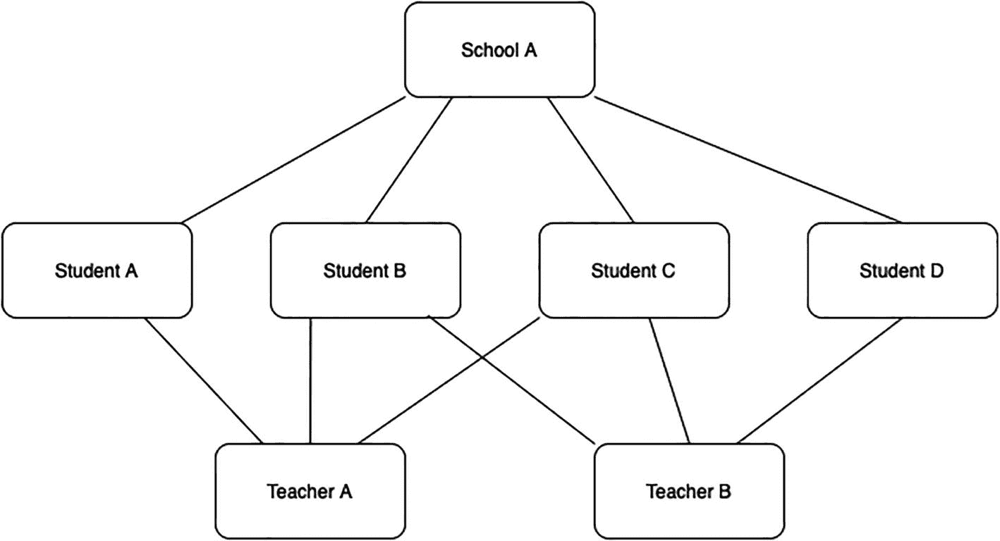

图 10-1 对象图

尽管 Core Data 如此著名，许多开发者在使用时仍会遇到困难。这主要由两个原因造成。首先，许多开发者在不完全理解其内部乃至外部运作机制的情况下，就一头扎进 Core Data 的使用中。Core Data 包含许多构建块，如果不能完全理解每个块负责什么，就很容易导致误用。其次，同样重要的是缺乏测试。Core Data 是任何应用中最难为其编写测试的部分之一。因此，许多开发者选择不对其 Core Data 层进行测试覆盖。我们在之前的章节中反复强调了测试的重要性，而在 Core Data 方面，这种重要性更为突出。

## Core Data 栈

现在我们已经了解了 Core Data 是什么以及它能做什么，是时候探索其内部运作机制了。Core Data 有许多相互交互的构建块（图 10-2）。理解每个构建块的功能对于完全掌握这个框架并能够正确使用它至关重要。

主要构建块包括：

1.  托管对象模型
2.  持久化存储协调器
3.  托管对象上下文

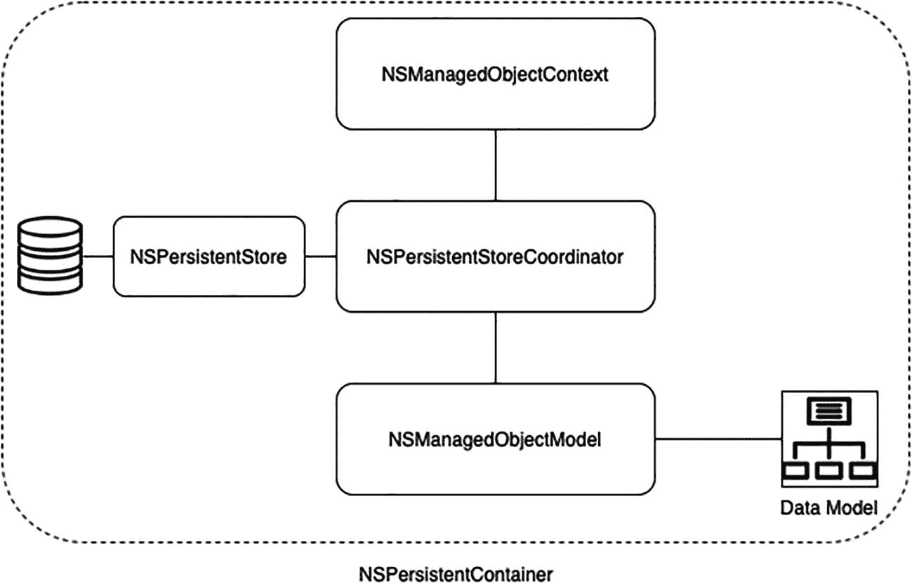

图 10-2 Core Data 栈

### 托管对象模型

托管对象模型是对要管理的对象图的描述。这个描述基本上就是模型的数据模式。它包含了实体及其属性，以及与其他实体的关系。数据模式由 `.xcdatamodeld` 文件表示，Xcode 附带了一个强大的编辑器，可以轻松编辑模式文件。我们可以直接在 Xcode 的编辑器中轻松创建实体、建立关系、对模式进行版本控制以及准备迁移。Core Data 不直接与文件交互，而是与 `NSManagedObjectModel` 的实例交互。该类提供了描述我们模式的 `.xcdatamodeld` 文件的程序化表示形式，Core Data 能够理解并使用它。虽然典型的 Core Data 实现会有一个 `NSManagedObjectModel` 类的实例，但也可以有多个。

### 持久化存储协调器

持久化存储协调器由 `NSPersistentStoreCoordinator` 类的实例表示，它在 Core Data 的功能中扮演着关键角色。顾名思义，持久化存储协调器协调托管对象上下文与持久化存储之间的关系。它负责加载、缓存和持久化数据。尽管它是 Core Data 栈中最重要的成员之一，但你很少会直接与之交互。

### 持久化存储

持久化存储代表了数据的实际存储位置。我们之前提到过 Core Data 管理对象图，但是为了让框架发挥作用，持久化存储协调器需要至少连接到一个持久化存储。这允许协调器将数据加载到上下文中，并将新数据推送到存储中，从而使新更改成为对象图状态的永久部分。

Core Data 提供了四种内置的持久化存储类型：

1.  SQLite：此存储由 SQLite 数据库支持，是最广泛使用的存储类型。
2.  XML：此存储由 XML 文件支持。
3.  二进制：此存储由二进制数据文件支持。
4.  内存中：此存储利用应用的内存进行存储。它只是部分持久化的，因为当应用因任何原因终止时，数据会丢失。

你也可以通过子类化 `NSAtomicStore` 或 `NSIncrementalStore` 来创建自己的存储类型。


### 托管对象上下文

托管对象上下文是一个负责管理托管对象集合的对象，由 `NSManagedObject` 类的实例表示。一个 Core Data 应用可以拥有一个或多个托管对象上下文。每个上下文都与一个持久化存储协调器相连。你可以将上下文视为一个草稿板，在其中可以对上下文内的对象进行任意修改。你可以从持久化存储协调器将对象提取到上下文中，也可以插入新对象、修改现有对象，或者撤销/重做更改。你对上下文内对象所做的任何修改都仅局限于该上下文，并且仅保存在内存中，这意味着这些更改不会传播到持久化存储协调器。这些修改会一直保留在上下文内，直到你通过告知上下文保存其更改来手动提交这些修改。你可以将其想象成用非永久性记号笔在书写板上写字，这样你随时都能擦除所有内容。当你准备提交所写的内容时，再用永久性记号笔描一遍来**保存**你的笔迹。

### 持久化容器

在 iOS 10 之前，我们必须手动设置上述三个组件才能构建一个可用的 Core Data 栈。但从 iOS 10 开始，Apple 引入了 `NSPersistentContainer`，这彻底改变了游戏规则，因为它极大地简化了 Core Data 的设置流程。它是一个封装了 Core Data 栈的容器，负责托管对象模型、持久化存储协调器以及托管对象上下文的创建和管理。

## Books 中的 Core Data

如果我们来看一下 **Books**，就会发现它使用了 Core Data。不过，我们应用的这一部分目前尚未模块化。实际上，仔细审视就会发现，我们的 Core Data 代码散落得到处都是。我们将在本章中尝试解决这个问题。你可以在本章的资源中找到 Books 项目。

我们接下来部分的目标如下：

-   创建一个通用的 Core Data 接口。
-   创建一个消耗该接口的组件，为我们的应用提供所需功能。
-   使用这个新组件替换旧的实现。

我们将以测试驱动的方式逐步完成这些增量步骤。

### 测试栈

我们希望新的 Core Data 层能够使用 SQLite 持久化存储进行操作，因为这种存储类型在我们的场景中最合理。这种存储类型会持久化到磁盘，同时性能开销低且内存占用小。

然而，当涉及到测试时，这种存储类型会引发一些问题。由于数据被持久化到磁盘上的数据库中，这会导致数据在测试之间保持持久化。测试间数据持久化可能导致某个测试因前一个测试造成的环境变化而失败。这个问题可以通过在每个测试后删除并重新创建数据库来解决，但这会拖慢测试速度，而我们的单元测试需要快速执行。

你可能会觉得我们陷入了僵局。嗯，再想想。我们之前提到过还有其他存储类型。其中一种是内存存储类型，这正是我们所需要的。这解决了我们的问题，因为使用这种存储，数据不会持久化到磁盘，而是留在内存中。因此，每次测试时，内存存储都会释放其数据。

所以这意味着我们需要为测试和生产环境使用不同的栈。我们需要在生产代码中使用 SQLite 存储，在测试中使用内存存储。后续我们会牢记这一点。

### CoreDataManager

现在我们已经了解了 Core Data 的工作原理，让我们开始实现吧。

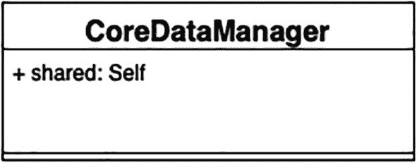

图 10-3 当前 UML 图

我们从第一个目标开始：为 Core Data 创建一个通用接口（图 10-3）。这个接口应该提供 **CRUD**（创建、读取、更新、删除）操作，并且应该能操作通用模型。我们知道我们需要创建一个新对象作为接口，并且这个对象应该能从应用的任何地方访问到。而且只保留它的一个实例是合理的。所以，让我们将其转化为一个测试。首先，添加一个新的测试用例类，命名为 `CoreDataManagerTests`。然后向其中添加这个测试：

```swift
func testSharedInstance() {
    // 当
    let manager = CoreDataManager.shared
    // 那么
    XCTAssertNotNil(manager)
}
```

通常这里会有编译错误，因为我们还没有创建这个类。让我们继续，通过向应用添加这个新类来修复测试：

```swift
class CoreDataManager {
    // MARK:- 单例
    public static let shared = CoreDataManager()
}
```

现在测试应该能通过了。

请确保在你的所有测试文件开头添加 `@testable import Books`。

接下来进行下一个测试。我们知道 `CoreDataManager` 应该提供一个用于 CRUD 操作的接口。所以现在我们应该开始添加这些测试。

我们所有的测试都需要初始化一个 `CoreDataManager` 实例。这可以添加到公共的 setup 函数中：

```swift
// MARK:- 变量
var manager: CoreDataManager!
// MARK:- 设置
override func setUp() {
    super.setUp()
    self.manager = CoreDataManager()
}
override func tearDown() {
    super.tearDown()
    self.manager = nil
}
```

现在，如果你还记得，我们决定为生产和测试使用不同的栈。这意味着我们需要为测试创建一个栈，并将其注入到我们的管理器中。为测试创建自定义栈的方式如下：

```swift
let stack = CoreDataStack(name: "TestModel", storageType: .inMemory)
```


### CoreDataStack

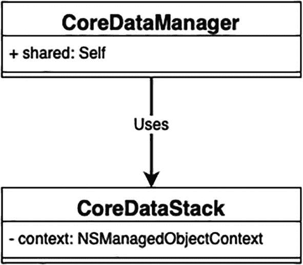
*图 10-4*: 当前 UML 图

`CoreDataStack` 是负责初始化 Core Data 堆栈的类。由于我们尚未创建该类，添加上述代码行会导致构建错误。因此，我们暂停处理 `CoreDataManagerTests`，转而专注于创建 `CoreDataStack`（图 10-4）。完成后，再回过头来处理它。

那么 `CoreDataStack` 具体负责什么呢？它应初始化一个持久化容器，默认情况下其底层托管模型应为应用的模型。接下来，我们将此逻辑转化为测试。首先，新增一个名为 `CoreDataStackTests` 的测试用例类，并在其中添加如下测试：

```
func testDefaultStoreName() {
    // Given
    let stack = CoreDataStack()
    // When
    let container = stack.storeContainer
    // Then
    XCTAssertEqual(container.name, "Books")
}
```

为了修复此测试，我们需要创建新类 `CoreDataStack`，如下所示：

```
import CoreData
class CoreDataStack {
    // MARK:- 懒加载变量
    lazy var storeContainer: NSPersistentContainer = {
        let container = NSPersistentContainer(name: "Books")
        container.loadPersistentStores { _, error in
            if let error = error as NSError? {
                print("未解决的错误 \(error), \(error.userInfo)")
            }
        }
        return container
    }()
}
```

现在，我们需要能够自定义堆栈，使其使用自定义模型而非默认模型。这在测试中会频繁依赖。因此，为此添加一个测试：

```
func testCustomStoreName() {
    // Given
    let stack = CoreDataStack(name: "TestModel")
    // When
    let container = stack.storeContainer
    // Then
    XCTAssertEqual(container.name, "TestModel")
}
```

为使该测试通过，我们需要做两件事。首先，更新类以处理自定义模型名称：

```
class CoreDataStack {
    // MARK:- 变量
    private let modelName: String
    // MARK:- 懒加载变量
    lazy var storeContainer: NSPersistentContainer = {
        let container = NSPersistentContainer(name: self.modelName)
        container.loadPersistentStores { _, error in
            if let error = error as NSError? {
                print("未解决的错误 \(error), \(error.userInfo)")
            }
        }
        return container
    }()
    // MARK:- 初始化器
    public init(name: String = "Books") {
        self.modelName = name
    }
}
```

其次，需要添加新的数据模型。为此，我们添加一个新的数据模型文件（图 10-5），并将其命名为“TestModel”。

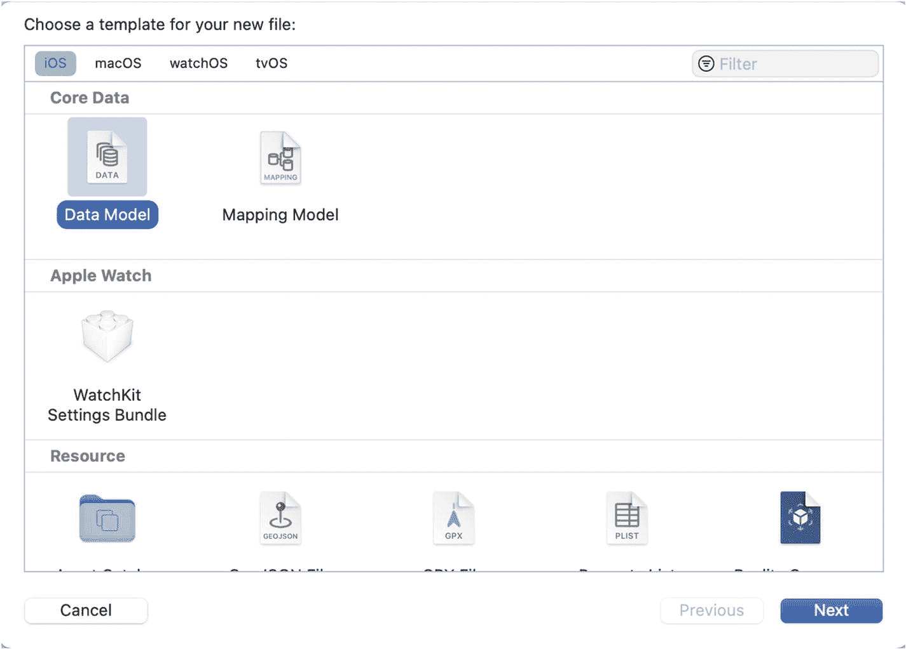
*图 10-5*: 添加新的数据模型文件

添加模型后，进入项目文件。打开测试目标，在 **Build Phases** 下确保数据模型文件**不在** **Compile Sources** 中，并已包含在 **Copy Bundle Resources** 中（图 10-6）。这样可以避免后续创建实体时可能出现的构建错误。

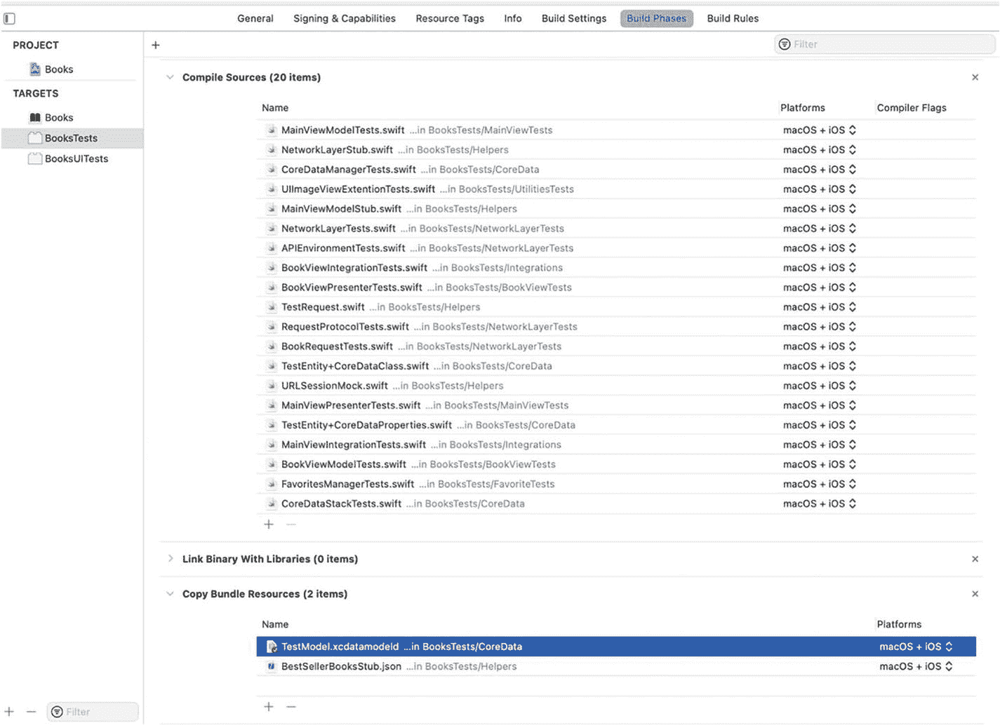
*图 10-6*: 正确设置测试数据模型

遗憾的是，添加新模型后测试仍会失败。这是因为持久化容器默认在应用的主 bundle 中搜索数据模型文件，而我们的测试数据模型位于测试 bundle 中。为此，需要手动将数据模型的对象模型传递给 Core Data 堆栈。将测试更新如下：

```
func testCustomStoreName() {
    // Given
    let testBundle = Bundle(for: type(of: self))
    let modelUrl = testBundle.url(forResource: "TestModel", withExtension: "momd")!
    let objectModel = NSManagedObjectModel(contentsOf: modelUrl)
    let stack = CoreDataStack(name: "TestModel", objectModel: objectModel)
    // When
    let container = stack.storeContainer
    // Then
    XCTAssertEqual(container.name, "TestModel")
}
```

并将类更新如下：

```
class CoreDataStack {
    // MARK:- 变量
    private let modelName: String
    private let objectModel: NSManagedObjectModel?
    // MARK:- 懒加载变量
    lazy var storeContainer: NSPersistentContainer = {
        var container: NSPersistentContainer
        if let objectModel = self.objectModel {
            container = NSPersistentContainer(name: self.modelName, managedObjectModel: objectModel)
        }
        else {
            container = NSPersistentContainer(name: self.modelName)
        }
        container.loadPersistentStores { _, error in
            if let error = error as NSError? {
                print("未解决的错误 \(error), \(error.userInfo)")
            }
        }
        return container
    }()
    // MARK:- 初始化器
    public init(name: String = "Books", objectModel: NSManagedObjectModel? = nil) {
        self.modelName = name
        self.objectModel = objectModel
    }
}
```

这里我们增加了注入自定义对象模型的能力。初始化容器时，会检查是否传入了自定义模型：如果是，则使用它创建容器；否则，正常创建容器。

回顾一下，我们需要能够创建使用内存存储的 Core Data 堆栈。当前堆栈仅能使用默认的 SQLite 存储。为此，添加以下测试：

```
func testPersistentStoreType() {
    // Given
    let stack = CoreDataStack(storageType: .persistent)
    // When
    let container = stack.storeContainer
    // Then
    XCTAssertEqual(container.persistentStoreDescriptions[0].type, NSSQLiteStoreType)
}

func testInMemoryStoreType() {
    // Given
    let stack = CoreDataStack(storageType: .inMemory)
    // When
    let container = stack.storeContainer
    // Then
    XCTAssertEqual(container.persistentStoreDescriptions[0].type, NSInMemoryStoreType)
}
```

为修复测试，需要添加一个表示存储类型的枚举。可以将其放在单独文件或 `CoreDataStack` 文件中。枚举应如下所示：

```
enum StorageType {
    case persistent, inMemory
}
```

接着，将类修改为：

```
class CoreDataStack {
    // MARK:- 变量
    private let modelName: String
    private let objectModel: NSManagedObjectModel?
    private let storageType: StorageType
    // MARK:- 懒加载变量
    lazy var storeContainer: NSPersistentContainer = {
        var container: NSPersistentContainer
        if let objectModel = self.objectModel {
            container = NSPersistentContainer(name: self.modelName, managedObjectModel: objectModel)
        }
        else {
            container = NSPersistentContainer(name: self.modelName)
        }
        if self.storageType == .inMemory {
            let description = NSPersistentStoreDescription()
            description.type = NSInMemoryStoreType
            container.persistentStoreDescriptions = [description]
        }
        container.loadPersistentStores { _, error in
            if let error = error as NSError? {
                print("未解决的错误 \(error), \(error.userInfo)")
            }
        }
        return container
    }()
    // MARK:- 初始化器
    public init(name: String = "Books", objectModel: NSManagedObjectModel? = nil, storageType: StorageType = .persistent) {
        self.modelName = name
        self.objectModel = objectModel
        self.storageType = storageType
    }
}
```

这里我们新增了一个变量来存储存储类型，并在初始化方法中增加了参数以设置存储类型，默认值为 `.persistent`。最后，检查存储类型是否为内存类型：若是，则覆盖存储类型；否则保持默认的 SQLite 类型。完成这些更改后，测试应能通过。

最后，堆栈需要提供一个上下文。该上下文应在主线程上使用。在应用中，我们对 Core Data 的所有使用都是轻量级的，并会反映到应用界面上，这意味着我们不需要后台上下文。

为此添加一个测试：

```
func testContext() {
    // Given
    let stack = CoreDataStack(storageType: .inMemory)
    // When
    let context = stack.context
    // Then
    XCTAssertNotNil(context)
    XCTAssertEqual(context.concurrencyType, .mainQueueConcurrencyType)
}
```

为修复该测试，需要在 `CoreDataStack` 中添加以下内容。


```swift
public lazy var context: NSManagedObjectContext = {
    return storeContainer.viewContext
}()
```

### 将堆栈注入 CoreDataManager

现在 CoreDataStack 已经就绪，让我们回到最初触发这一切的 `CoreDataManagerTests`。现在我们可以创建一个自定义堆栈并将其传递给管理器：

```swift
// MARK:- 变量
var manager: CoreDataManager!
var stack: CoreDataStack!
// MARK:- 设置
override func setUp() {
    super.setUp()
    let testBundle = Bundle(for: type(of: self))
    let modelUrl = testBundle.url(forResource: "TestModel", withExtension: "momd")!
    let objectModel = NSManagedObjectModel(contentsOf: modelUrl)
    self.stack = CoreDataStack(name: "TestModel", objectModel: objectModel, storageType: .inMemory)
    self.manager = CoreDataManager(coreDataStack: stack)
}
override func tearDown() {
    super.tearDown()
    self.manager = nil
    self.stack = nil
}
```

这会导致构建错误。要修复此问题，我们需要更新 `CoreDataManager`，使其接受 `CoreDataStack` 作为依赖项：

```swift
// MARK:- 变量
private var stack: CoreDataStack
// MARK:- 单例
public static let shared = CoreDataManager(coreDataStack: CoreDataStack())
// MARK:- 初始化器
public init(coreDataStack: CoreDataStack) {
    self.stack = coreDataStack
}
```

### TestEntity

在开始编写 CRUD 操作的测试之前，先创建一个实体以便进行操作是合理的。我们将前往 `TestModel.xcdatamodel`，通过 Xcode 的编辑器添加一个新实体，并将其命名为 `TestEntity`。然后我们将添加图 10-7 中的两个属性。

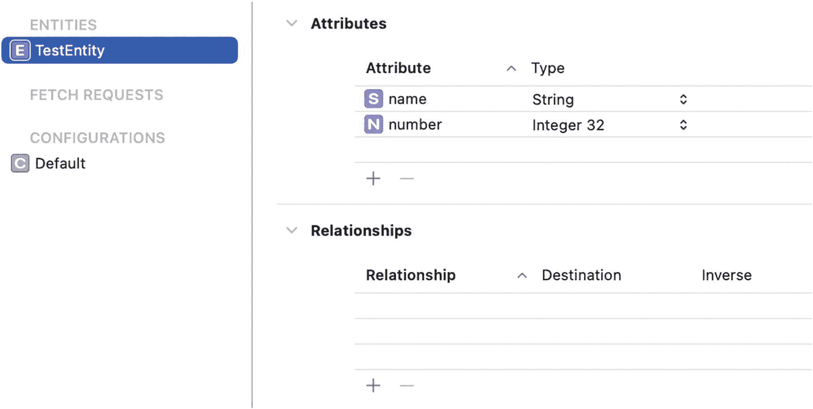

**图 10-7** 向数据模型文件添加 TestEntity

现在，为了完成新实体的设置，我们需要为其添加代码表示。我们将遵循这里的约定，添加两个文件（均在测试目标中）。首先，文件 `TestEntity+CoreDataClass` 应包含以下内容：

```swift
import CoreData
@objc(TestEntity)
public final class TestEntity: NSManagedObject {
}
```

第二个文件 `TestEntity+CoreDataProperties` 应包含以下内容：

```swift
import CoreData
extension TestEntity {
    @nonobjc public class func fetchRequest() -> NSFetchRequest {
        return NSFetchRequest(entityName: String(describing: TestEntity.self))
    }
    @NSManaged public var name: String?
    @NSManaged public var number: Int32
}
```

### 创建

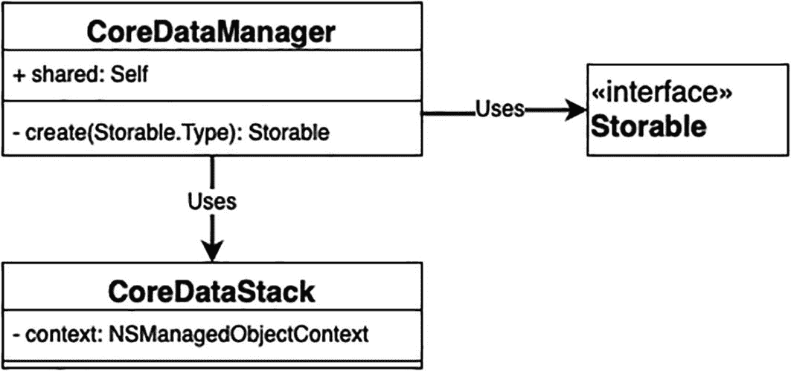

**图 10-8** 当前 UML

现在让我们开始第一个 CRUD 操作——创建，并为其编写一个测试：

```swift
func testCreateEntity() {
    // 当
    let testModel = manager.create(TestEntity.self)
    // 那么
    XCTAssertNotNil(testModel)
    XCTAssertEqual(stack.context.insertedObjects.count, 0)
}
```

这里我们创建了一个新对象，并断言它不为 nil，并且它确实被保存到了持久化存储中，而不仅仅是上下文。

这将导致一个构建错误，因为没有 `create` 函数。那么让我们添加它：

```swift
public func create(_ entity: T.Type) -> T? {
    return nil
}
```

#### 引入 `Storable`

`Storable` 是一个协议，它描述了一个可以使用我们的 Core Data 管理器进行存储的类（图 10-8）。任何 `Storable` 都需要是 `NSManagedObject`。让我们添加这个协议：

```swift
import CoreData
public protocol Storable: NSManagedObject {
}
```

现在测试仍然无法构建，因为 `TestEntity` 不符合 `Storable` 协议。

我们通过简单地遵循协议来解决这个问题，如下所示：

```swift
extension TestEntity: Storable {
}
```

现在我们的测试可以构建了，但如果尝试运行，它会失败。

#### 创建实现

让我们通过实际创建一个新实体来修复这个问题：

```swift
public func create(_ entityType: T.Type) -> T? {
    guard let entityDescription = NSEntityDescription.entity(forEntityName: entityType.entityName, in: stack.context) else {
        return nil
    }
    let entity = NSManagedObject(entity: entityDescription, insertInto: stack.context)
    return entity as? T
}
```

我们需要将其添加到 `Storable` 中：

```swift
public protocol Storable: NSManagedObject {
    static var entityName: String {get}
}
```

并将 `TestEntity` 的实现更新为：

```swift
extension TestEntity: Storable {
    public static var entityName: String {
        String(describing: Self.self)
    }
}
```

如果我们运行测试，会发现第二个断言仍然失败。这意味着我们需要保存更改。

#### 保存更改

在 `create` 函数内部，我们将在返回之前添加一行来保存上下文。现在我们的函数应该如下所示：

```swift
public func create(_ entityType: T.Type) -> T? {
    guard let entityDescription = NSEntityDescription.entity(forEntityName: entityType.entityName, in: stack.context) else {
        return nil
    }
    let entity = NSManagedObject(entity: entityDescription, insertInto: stack.context)
    stack.saveContextIfNeeded()
    return entity as? T
}
```

这将导致一个构建错误。要修复它，我们需要在 `CoreDataStack`（图 10-9）中添加一个新函数：

```swift
public func saveContextIfNeeded() {
}
```

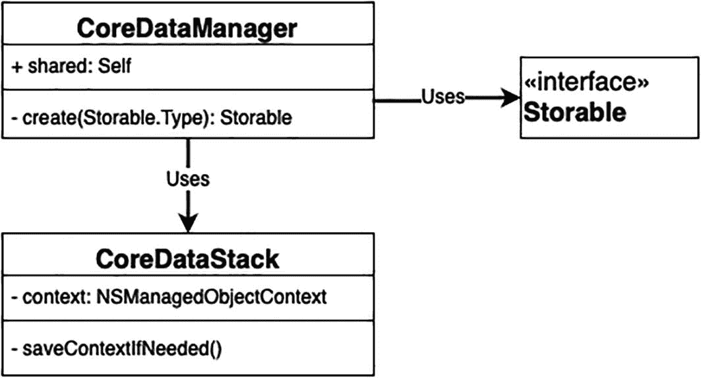

**图 10-9** 当前 UML

现在让我们在 `CoreDataStackTests` 中添加一个保存上下文的测试：

```swift
func testSavingContextIfNeeded() {
    // 给定
    let testBundle = Bundle(for: type(of: self))
    let modelUrl = testBundle.url(forResource: "TestModel", withExtension: "momd")!
    let objectModel = NSManagedObjectModel(contentsOf: modelUrl)
    let stack = CoreDataStack(name: "TestModel", objectModel: objectModel, storageType: .inMemory)
    let context = stack.context
    let _ = TestEntity(context: context)
    // 预期
    expectation(forNotification: .NSManagedObjectContextDidSave, object: context, handler: nil)
    // 当
    stack.saveContextIfNeeded()
    // 那么
    waitForExpectations(timeout: 1.0, handler: nil)
}
```

为了修复测试，我们将 `saveContextIfNeeded` 更新为：

```swift
public func saveContextIfNeeded() {
    if context.hasChanges {
        do {
            try context.save()
        }
        catch let error as NSError {
            print("未解决的错误 \(error), \(error.userInfo)")
        }
    }
}
```

现在我们的所有测试——`testSavingContextIfNeeded` 和 `testCreateEntity`——都通过了。这意味着我们完成了第一个 CRUD 操作。

### 获取

现在让我们进入第二个 CRUD 操作——获取数据（图 10-10）。

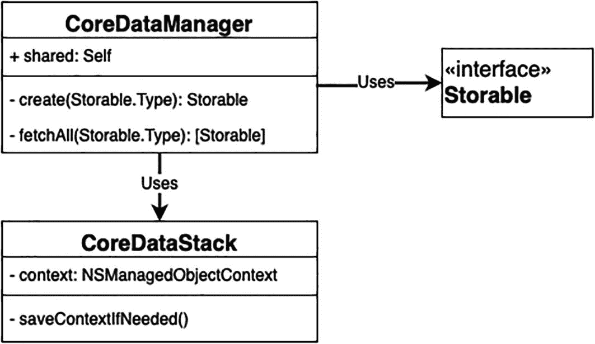

**图 10-10** 当前 UML

我们将从添加一个测试开始，该测试创建新实体，然后获取所有实体并检查返回的值是否正确。这个测试如下所示：

```swift
func testFetchEntities() {
    // 给定
    let testModel = manager.create(TestEntity.self)
    // 当
    let models = manager.fetchAll(TestEntity.self)
    // 那么
    XCTAssertNotNil(models)
    XCTAssertEqual(models?.count, 1)
    XCTAssertEqual(models?[0].objectID, testModel?.objectID)
}
```

为了修复这个测试，我们将去实现 `fetch` 函数。

添加此函数：

```swift
public func fetchAll(_ entityType: T.Type) -> [T]? {
    let request: NSFetchRequest = T.fetchRequest()
    do {
        let results = try stack.context.fetch(request)
        return results
    } catch let error as NSError {
        print("未解决的错误 \(error), \(error.userInfo)")
    }
    return nil
}
```

我们需要更新 `Storable`，因为我们要求每个 `Storable` 提供自己的获取请求，并且我们需要这个获取请求能够获取到我们的对象。现在它应该如下所示：

```swift
public protocol Storable: NSManagedObject {
    static var entityName: String {get}
    static func fetchRequest() -> NSFetchRequest
}
```


### 更新操作

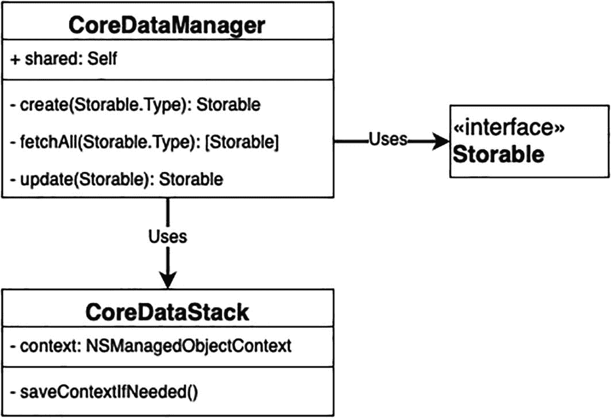

**图 10-11** 当前 UML 图

现在让我们进入一个新的 CRUD 操作（图 10-11）。我们为更新操作添加一个测试：

```
func testUpdateEntity() {
    // 给定条件
    let testModel = manager.create(TestEntity.self)
    testModel?.name = "Test"
    testModel?.number = 123
    // 执行操作
    manager.update(testModel)
    stack.context.rollback()
    // 验证结果
    let updatedModel = manager.fetchAll(TestEntity.self)?[0]
    XCTAssertNotNil(updatedModel)
    XCTAssertEqual(updatedModel?.name, "Test")
    XCTAssertEqual(updatedModel?.number, 123)
}
```

你可能已经注意到，我们在测试中调用了上下文的 `rollback()` 方法。这是做什么的呢？首先，让我们看看我们在测试中试图做什么。我们使用 `create` 方法插入一个新对象，然后对其进行一些修改。接着调用 `update` 函数，期望它能持久化这些更改。鉴于 Core Data 的特性，我们知道所做的修改只会局部应用于当前所在的上下文。由于我们创建、更新和获取操作使用的是同一个上下文，因此即使我们没有将更改持久化到存储区，获取操作仍然会返回更新后的数据。为了演示这一点，让我们添加一个实际上并不保存更改的 `update` 实现：

```
@discardableResult
public func update(_ entity: T?) -> T? {
    return entity
}
```

现在测试会失败，因为我们没有保存数据。为了演示 `rollback()` 的重要性，请注释掉调用 `rollback()` 的那行代码，然后重新运行测试。我们会发现测试通过了。因此，在这个测试中，使用 `rollback` 对于清除所有未保存的数据并仅断言已保存的数据至关重要。

要修复测试，我们需要修改实现，使其真正保存更改：

```
@discardableResult
public func update(_ entity: T?) -> T? {
    stack.saveContextIfNeeded()
    return entity
}
```

### 高级获取操作

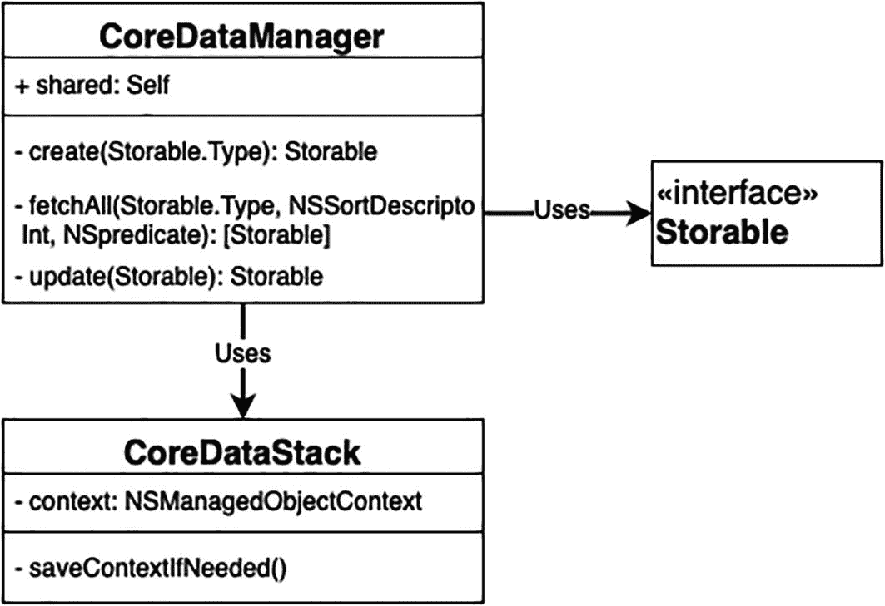

**图 10-12** 当前 UML 图

由于测试现在可以通过，让我们添加一个新功能。我们需要能够对获取的结果进行排序（图 10-12）。在获取时进行排序比获取后在内存中排序要高效得多。除了排序之外，我们还需要能够过滤获取的结果。此外，我们还需要为获取结果设置数量限制。让我们为这两个功能添加测试：

```
func testFetchSorted() {
    // 给定条件
    for i in 1...10 {
        let testModelOne = manager.create(TestEntity.self)
        testModelOne?.number = Int32(i)
        manager.update(testModelOne)
    }
    // 执行操作
    let sort = NSSortDescriptor(key: "number", ascending: false)
    let models = manager.fetchAll(TestEntity.self, sort: sort)
    // 验证结果
    XCTAssertNotNil(models)
    XCTAssertEqual(models?.count, 10)
    XCTAssertEqual(models?[0].number, 10)
    XCTAssertEqual(models?[9].number, 1)
}

func testFetchWithLimit() {
    // 给定条件
    for i in 1...10 {
        let testModelOne = manager.create(TestEntity.self)
        testModelOne?.number = Int32(i)
        manager.update(testModelOne)
    }
    // 执行操作
    let models = manager.fetchAll(TestEntity.self, limit: 5)
    // 验证结果
    XCTAssertNotNil(models)
    XCTAssertEqual(models?.count, 5)
}

func testFetchWithPredicate() {
    // 给定条件
    for i in 1...10 {
        let testModelOne = manager.create(TestEntity.self)
        testModelOne?.number = Int32(i)
        manager.update(testModelOne)
    }
    // 执行操作
    let predicate = NSPredicate(format: "number > 5")
    let models = manager.fetchAll(TestEntity.self, predicate: predicate)
    // 验证结果
    XCTAssertNotNil(models)
    XCTAssertEqual(models?.count, 5)
}
```

要修复这些测试，请将 `fetchAll` 方法更新为：

```
public func fetchAll(_ entityType: T.Type, sort: NSSortDescriptor? = nil, limit: Int = 0, predicate: NSPredicate? = nil) -> [T]? {
    let request: NSFetchRequest = T.fetchRequest()
    if let sort = sort {
        request.sortDescriptors = [sort]
    }
    if let predicate = predicate {
        request.predicate = predicate
    }
    request.fetchLimit = limit
    do {
        let results = try stack.context.fetch(request)
        return results
    } catch let error as NSError {
        print("Unresolved error \(error), \(error.userInfo)")
    }
    return nil
}
```

### 下一步

让我们回顾一下之前设定的目标。它被分为三个子目标：

*   创建一个通用的 Core Data 接口 `CoreDataManager` ✅。
*   创建一个使用该接口、为我们的应用提供所需功能的组件。
*   用这个新组件替换旧的实现。

由于我们已经完成了通用 Core Data 接口（`CoreDataManager`）的创建，现在让我们进入第二个子目标。我们将创建一个名为 `FavoritesManager` 的新组件，负责添加、删除和获取我们的收藏项（图 10-13）。

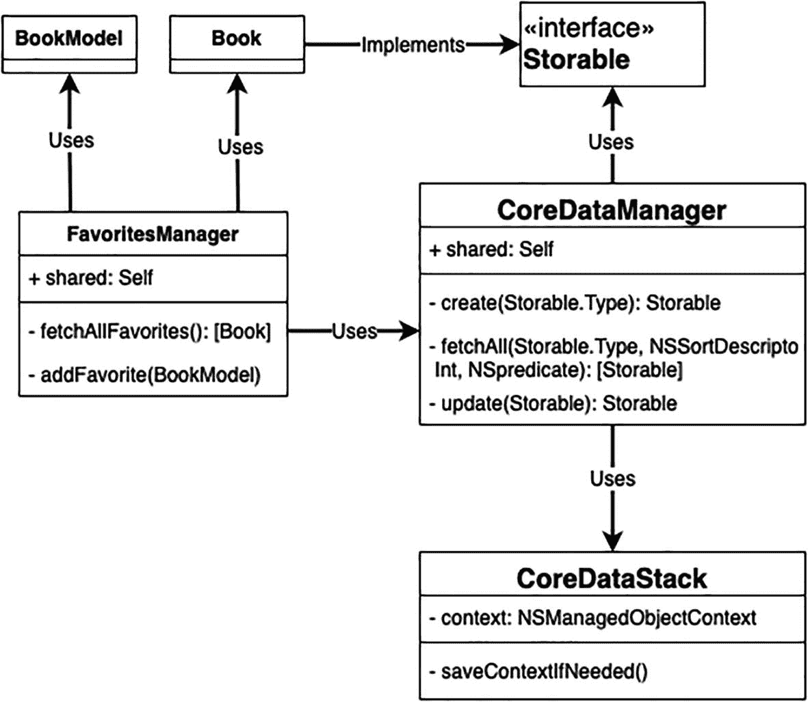

**图 10-13** 当前 UML 图

像往常一样，我们从测试开始。让我们添加一个名为 `FavoritesManagerTests` 的新测试用例类，用于存放我们的测试。接下来，设置我们的管理器。我们需要使用一个自定义的、使用应用数据模型的内存型 Core Data 管理器来设置它。文件内容应如下所示：

```
import XCTest
@testable import Books
import CoreData

class FavoritesManagerTests: XCTestCase {
    // MARK:- 变量
    var favoritesManager: FavoritesManager!
    var coredataManager: CoreDataManager!
    var stack: CoreDataStack!

    // MARK:- 设置
    override func setUp() {
        super.setUp()
        self.stack = CoreDataStack(storageType: .inMemory)
        self.coredataManager = CoreDataManager(coreDataStack: stack)
        self.favoritesManager = FavoritesManager(coredataManager: coredataManager)
    }

    override func tearDown() {
        super.tearDown()
        self.favoritesManager = nil
        self.coredataManager = nil
        self.stack = nil
    }
}
```

这会导致构建错误。为了修复这些错误，我们需要添加一个名为 `FavoritesManager` 的新类，该类内部依赖于 `CoreDataManager`。该类应如下所示：

```
class FavoritesManager {
    // MARK:- 变量
    private var coredataManager: CoreDataManager

    // MARK:- 单例
    public static let shared = FavoritesManager()

    // MARK:- 初始化器
    init(coredataManager: CoreDataManager = .shared) {
        self.coredataManager = coredataManager
    }
}
```

现在，我们之前了解到，与 `CoreDataManager` 交互需要我们的模型符合 `Storable` 协议。让我们先把这件事处理掉。我们将对两个托管对象类 `Book` 和 `BuyLink` 执行与 `TestEntity` 相同的操作。我们还需要确保这两个类都标记了 `final` 关键字，以避免构建错误。

现在，让我们为 `FavoritesManager` 负责的操作编写测试。通常我们会按照常规的 TDD 方式来处理。然而，为了避免重复，我们不会逐步完成这部分。经过多个 TDD 周期后，我们将得到以下一组新的测试：


```swift
func testAddingBook() {
    // 给定
    let buyLink = BuyLinkModel(name: .amazon, url: "URL")
    var book = BookModel(title: "BookTitle", contributor: "Contributor", author: "Author", createdDate: "2021-05-26 22:10:24")
    book.amazonProductURL = "Amazon"
    book.bookImage = "Image"
    book.bookDescription = "Description"
    book.publisher = "Publisher"
    book.buyLinks = [buyLink]
    // 当
    favoritesManager.addFavorite(book)
    // 然后
    let books = coredataManager.fetchAll(Book.self)
    XCTAssertNotNil(books)
    XCTAssertEqual(books?.count, 1)
    let retrievedBook = books![0]
    XCTAssertEqual(retrievedBook.title, book.title)
    XCTAssertEqual(retrievedBook.contributor, book.contributor)
    XCTAssertEqual(retrievedBook.author, book.author)
    XCTAssertEqual(retrievedBook.created_date, book.createdDate)
    XCTAssertEqual(retrievedBook.amazon_product_url, book.amazonProductURL)
    XCTAssertEqual(retrievedBook.book_image, book.bookImage)
    XCTAssertEqual(retrievedBook.desc, book.bookDescription)
    XCTAssertEqual(retrievedBook.publisher, book.publisher)
    XCTAssertEqual(retrievedBook.buyLinks?.count, 1)
    let link = retrievedBook.buyLinks?.allObjects[0] as? BuyLink
    XCTAssertEqual(link?.name, buyLink.name.rawValue)
    XCTAssertEqual(link?.url, buyLink.url)
}

func testFetchingFavoritesSorted() {
    // 给定
    let book1 = BookModel(title: "Book1", contributor: "Contributor", author: "Author", createdDate: "2021-05-01 22:00:00")
    let book2 = BookModel(title: "Book2", contributor: "Contributor", author: "Author", createdDate: "2021-05-02 22:00:00")
    let book3 = BookModel(title: "Book3", contributor: "Contributor", author: "Author", createdDate: "2021-05-03 22:00:00")
    favoritesManager.addFavorite(book1)
    favoritesManager.addFavorite(book3)
    favoritesManager.addFavorite(book2)
    // 当
    let favorites = favoritesManager.fetchAllFavorites()
    // 然后
    XCTAssertEqual(favorites.count, 3)
    XCTAssertEqual(favorites[0].title, "Book3")
    XCTAssertEqual(favorites[1].title, "Book2")
    XCTAssertEqual(favorites[2].title, "Book1")
}
```

下面是使这些测试通过的代码：

- `fetchAllFavorites` 使用 `CoreDataManager` 的 `fetchAll` 函数获取所有类型为 `Book` 的对象，并按照日期排序返回。
- `addFavorite` 接收一个 `BookModel` 对象。它会在存储中插入一个新的 `Book` 对象，然后用传入模型的数据填充该书。

```swift
// MARK:- 公共函数
func fetchAllFavorites() -> [Book] {
    let sort = NSSortDescriptor(key: "created_date", ascending: false)
    return coredataManager.fetchAll(Book.self, sort: sort) ?? []
}

func addFavorite(_ model: BookModel) {
    guard let book = coredataManager.create(Book.self) else {
        return
    }
    book.title = model.title
    book.amazon_product_url = model.amazonProductURL
    book.author = model.author
    book.book_image = model.bookImage
    book.contributor = model.contributor
    book.created_date = model.createdDate
    book.desc = model.bookDescription
    book.publisher = model.publisher
    let links:NSMutableSet? = []
    guard let buyLinks = model.buyLinks else {
        return
    }
    for buyLink in buyLinks {
        if let link = coredataManager.create(BuyLink.self) {
            link.url = buyLink.url
            link.name = buyLink.name.rawValue
            link.book = book
            links?.add(link)
        }
    }
    book.buyLinks = links
    coredataManager.update(book)
}

// MARK:- 私有辅助方法
func getBook(from model: BookModel) -> Book? {
    let predicate = NSPredicate(format: "title == %@", model.title ?? "")
    let results = coredataManager.fetchAll(Book.self, limit: 1, predicate: predicate)
    guard let books = results, books.count == 1 else {
        return nil
    }
    return books[0]
}
```

### 整合所有部分

到目前为止，我们尚未修改任何旧代码。我们只添加了新代码，但还没有在应用中的任何地方使用它。这就引出了我们开启这个 Core Data 主题之旅时的最后一个目标：用新编写的代码替换旧的实现。

这一改动将直接影响我们的应用。因此，与我们在 TDD 中采取的每一步一样，我们需要从测试开始。我们需要确保已经拥有覆盖所有受影响逻辑的验证测试。受影响的逻辑是应用中与收藏处理相关的所有内容。幸运的是，如果审视一下我们的 UI 测试套件，会发现针对所有场景都有对应的测试。这意味着我们可以放心地切换实现。

引导这一变更的最简单方法是从根源上移除旧的 Core Data 代码。那么，让我们前往 `AppDelegate`，删除所有与 Core Data 相关的代码。这将在我们的应用中产生一系列构建错误。现在我们逐一解决这些错误，用对 `FavoritesManager` 的调用来替换旧代码。

在 `FavViewController` 中，`loadSavedData` 函数现在将如下所示：

```swift
func loadSavedData() {
    let results = FavoritesManager.shared.fetchAllFavorites()
    for book in results {
        books.append(convertToBookModel(book: book))
    }
    self.tableView?.reloadData()
}
```

而 `BookViewControllerA` 和 `BookViewControllerB` 中的 `saveBookAsFavorite` 实现将如下所示：

```swift
func saveBookAsFavorite(withBook bookModel:BookModel) {
    FavoritesManager.shared.addFavorite(bookModel)
    let alert = UIAlertController(title: "已保存", message: "您的书籍已添加至收藏", preferredStyle: .alert)
    alert.addAction(UIAlertAction(title: "确定", style: .default, handler: nil))
    self.present(alert, animated: true, completion: nil)
}
```

现在我们已经完成了修改，需要重新运行验证测试，确保修改没有破坏任何功能。运行测试时，所有测试通过，这意味着我们成功编写了一个可测试的 Core Data 层，并将其顺利集成到了应用中！

## 练习

我们还需要添加最后一个操作，即删除操作。你的练习是为 `CoreDataManager` 添加一个新的删除 API，并使用该新 API 在 `FavoritesManager` 中实现删除书籍的功能。然后，你将更新 `FavViewController`，使用 `FavoritesManager` 中的新 API。

添加删除 API 后，最终设计应如图 10-14 所示。

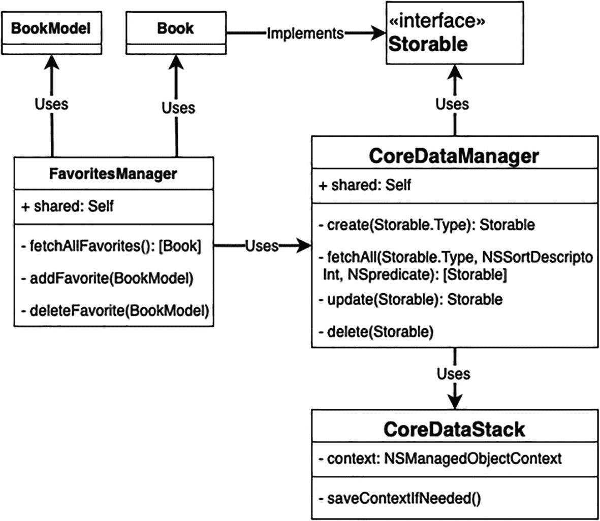

**图 10-14** 最终 UML 图


## 摘要

Core Data 确实是一个强大的框架，因其功能丰富而被许多开发者使用。但如前所述，使用 Core Data 有时可能是一项繁琐的工作。这很大程度上源于两个原因。首先，许多开发者在使用 Core Data 时并未完全理解这个框架的真正本质及其运作方式。其次，许多开发者发现为他们的 Core Data 代码编写测试颇具挑战性，这最终导致难以发现的回归问题。在本章中，我们尝试解决这两个问题。

我们讨论了 Core Data 的真正本质以及它不是什么。Core Data 不是一个数据库。虽然它能够将数据持久化到磁盘上，但 Core Data 的功能远不止于此。本质上，Core Data 管理对象图，这意味着它管理着我们对象的生命周期。在内部，Core Data 依赖于多个对象才能运行，每个对象都有特定的职责。有托管对象模型（managed object model），它是我们对象模式（object schema）的程序化表示。另外还有托管对象上下文（managed object context），它充当一个草稿板，让我们应用想要的更改，然后我们可以选择丢弃或持久化这些更改。最后，还有持久化存储协调器（persistent store coordinator），它在我们的上下文和持久化存储（persistent store）之间充当中间人，而持久化存储则负责实际保存数据。这些构成了 Core Data 栈的主要构建模块。最后还有持久化容器（persistent container），它封装了整个 Core Data 栈并简化了其创建和管理。

接着，我们揭穿了“Core Data 不可测试”这个迷思。是的，测试 Core Data 可能具有挑战性，但一旦掌握了要领，就变得轻而易举了。我们创建了一个通用的 Core Data 层，并在我们的应用（`Books`）中使用了它，而不是旧的 Core Data 实现。我们完全使用 TDD（测试驱动开发）完成了这一切。我们看到了在测试中使用 SQLite 存储可能会导致测试出现问题。通过使用内存存储（in-memory store），我们成功克服了这个问题。我们还展示了如何编写与应用程序数据模型完全隔离的测试，方法是添加专门用于测试的独立数据模型，并在测试中使用这个新模型来初始化我们的 Core Data 栈。

