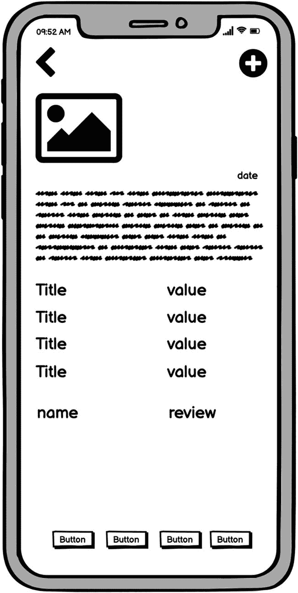
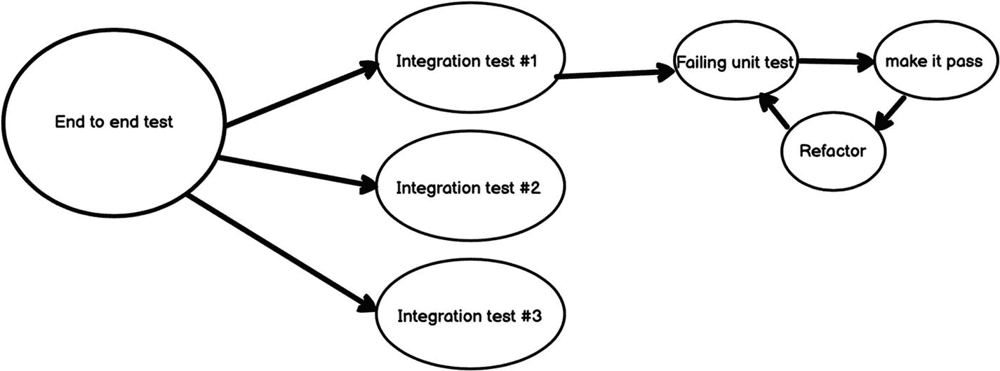
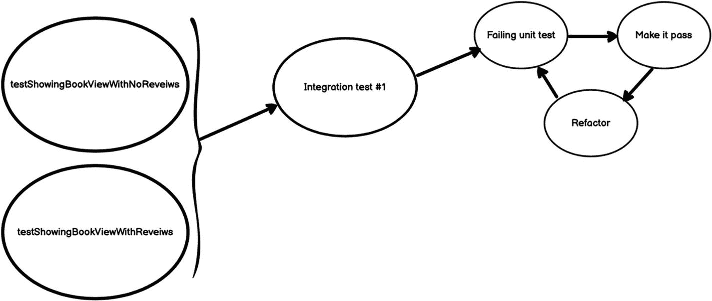
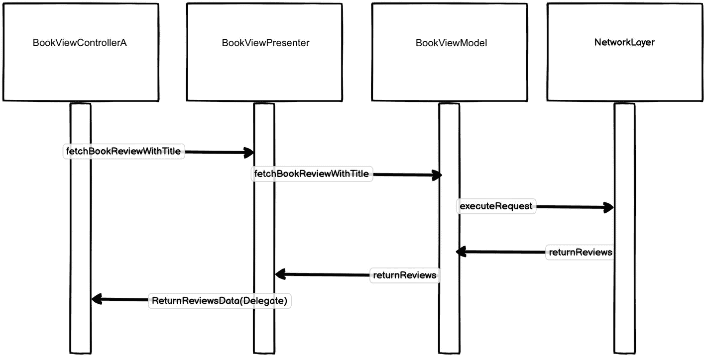
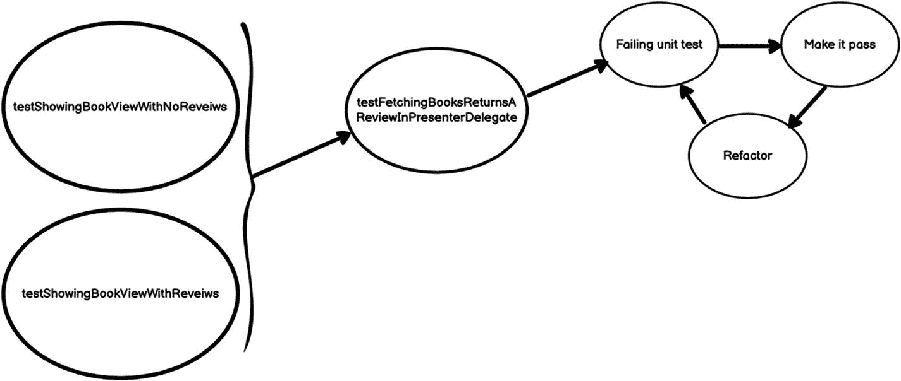
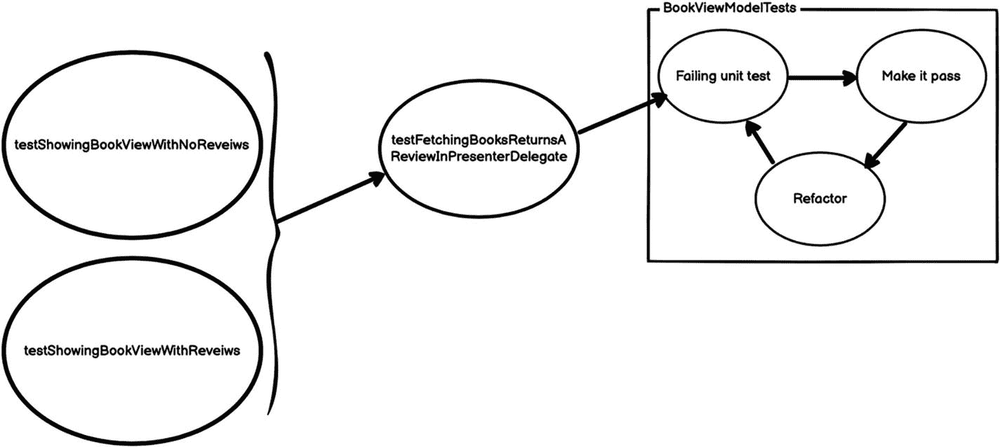
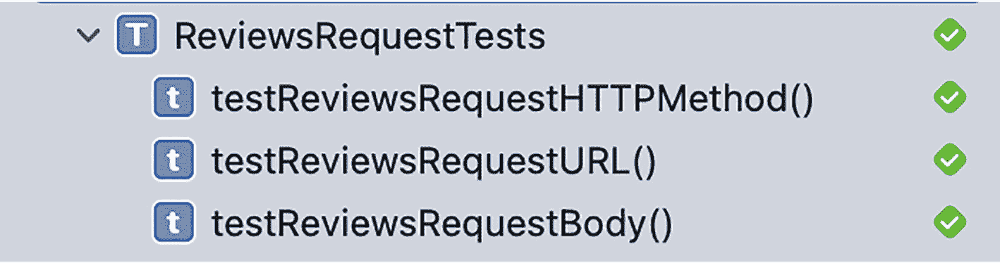
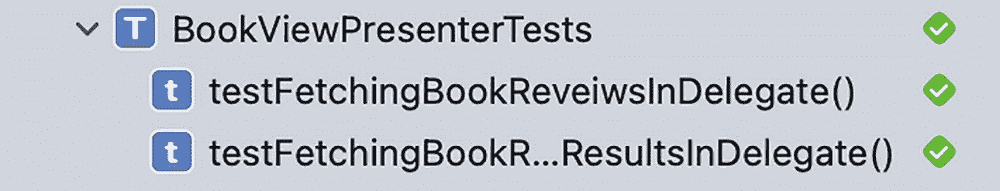

# 11. 为遗留应用添加功能

如果你还记得第 1 章的内容，我们讨论了可以在哪些不同情况下使用 TDD。基本上，TDD 可以应用于项目生命周期的任何阶段。最显而易见的选择是从项目一开始就使用 TDD。这也是我们一直推荐的。然而，如果你最近才听说 TDD，而手头已经有一个正在进行的项目了，该怎么办？TDD 仍然适合你。TDD 可以帮助指导对旧遗留代码的重构，而且我们也可以用 TDD 来恰当地对代码库进行模块化和解耦。在前面的章节中，我们已经大量实践了这种方法。

在向现有的遗留代码添加新功能时，我们也可以使用 TDD。这正是本章我们将要讨论的内容。假设我们有一个遗留应用，它正在被完全重构并使用 TDD 进行模块化的进程中。但在这一过程中途，我们收到了一个新功能的需求。考虑到我们生活在一个快节奏的世界，在大多数情况下，我们很难奢侈地暂停项目所有的新进展，直到完成一次大的重构。我们需要在增强/重构遗留代码的同时，继续开发新的功能。

那么我们该如何做到这一点呢？首先，我们需要检查新功能，确定它是与旧功能耦合的，还是一个完全不依赖任何旧代码的全新功能。如果它与旧代码耦合，那么这些旧代码是遗留代码，还是已经被重构和模块化过的？但请不要误解。我们做这个检查不是为了决定是否需要使用 TDD。在所有情况下我们都会使用 TDD。这个检查只会影响我们任务的复杂程度。处理一个完全独立的功能会相对简单，因为我们几乎是重写代码，所以花在重构代码上的时间会较少。

另一方面，处理一个与旧的遗留代码耦合的功能会有些挑战性，因为我们不能先重构代码再添加功能。在这些场景下，你可能会忍不住完全放弃 TDD 和测试，因为父级代码本身就没有经过测试。然而，有一条我们从 Bob 大叔的《代码整洁之道》中学到并应始终遵循的黄金法则：“总是让代码比你发现它时更整洁。”这就是为什么我们应该尽量不要屈服于这种诱惑。

## 遗留代码免责声明

我们将为 `Books` 添加一个新功能。让我们打开起始项目，它可以在本章的资源中找到。如果我们查看一下代码，会发现有两个用于书籍详情视图的视图控制器：`BookViewControllerA` 和 `BookViewControllerB`。之所以存在这种情况，是因为我们正在进行一个 A/B 测试实验。尽管这两个视图控制器有很多共同的功能，但代码在它们之间是重复的，这在遗留代码中是意料之中的事。这是一个巨大的代码坏味道，如果有时间我们肯定应该修复它，但遗憾的是，我们没有。

### A/B 测试

A/B 测试本质上是一种实验，其中向用户随机展示页面的两个或多个变体，并通过统计分析确定哪个变体在给定的转化目标上表现更佳。因此，此处进行 A/B 测试的动机是为了确定 `BookViewController` 的哪种设计能为图书购买带来更好的转化率。

## 新功能

我们想要添加的新功能是显示每本书的评论，这可以帮助我们的用户决定是否要阅读这本书（图 11-1）。



图 11-1

评论线框图

正如我们已经指出的，书籍视图有两个视图控制器：`BookViewControllerA` 和 `BookViewControllerB`。我们需要在两个视图控制器中都进行这项改动。知道这个改动是两个控制器共有的，我们可以遵循当前的实现方式，在两个控制器中都添加该改动。然而，这样做我们就没有遵循前面提到的 Bob 大叔的规则。现在就开始实现这个功能，并看看我们如何在不重构整个代码库的情况下解决这个问题。

## 启动

我们首先列出用户可能经历的场景：

1.  当用户打开一个没有评论的书籍视图时，他们应该能够看到一个表示“暂无评论”的提示。

2.  当用户打开一个包含评论的书籍视图时，他们应该能够看到第一条评论。

我们将按照图 11-2 所示的方法来实现这个功能。



图 11-2

测试计划图

现在我们将这些场景转化为 UI 测试。这些测试是我们的最终目标。一旦这些测试通过，我们就知道新功能已经完成 ✅。


### UI 测试

现在让我们将第一个场景转化为测试。我们将打开 `BooksUITests` 并添加一个名为 `testShowingBookViewWithNoReveiws` 的新测试。先来看一下测试中的“Given”部分：

```swift
// Given
let testBundle = Bundle(for: type(of: self))
let booksJSONURL = testBundle.url(forResource: "BestSellerBooksStub", withExtension: "json")
let booksJSON = try! String(contentsOf: booksJSONURL!)
let booksNoReveiwsJSONURL = testBundle.url(forResource: "booksNoReview", withExtension: "json")
let booksNoReveiwsJSON = try! String(contentsOf: booksNoReveiwsJSONURL!)
server.GET["/svc/books/v3/lists/overview.json"] = {_ in HttpResponse.ok(.text(booksJSON))}
server.GET["/svc/books/v3/reviews.json?title=THE+LAST+THING+HE+TOLD+ME"] = {_ in HttpResponse.ok(.text(booksNoReveiwsJSON))}
let app = XCUIApplication()
app.launchArguments += ["TESTING"]
app.launch()
```

这与我们之前设置已有测试的方式几乎相同。唯一的区别是现在需要多 stub 一个请求，也就是评论请求。这里我们将其 stub 并返回一个没有评论的响应。

接下来是“When”部分：

```swift
// When
let booksTableView = app.tables
let cells = booksTableView.cells
let firstCell = cells.firstMatch
_ = firstCell.waitForExistence(timeout: 1.0)
firstCell.tap()
```

这里我们只是点击一本书以进入书籍详情视图。

然后是“Then”部分：

```swift
let reviewsCell = cells.staticTexts["book_review"]
_ = reviewsCell.waitForExistence(timeout: 1.0)
XCTAssertTrue(cells.staticTexts["book_review"].label == "No Reviews Available")
```

这里我们验证文本“No Reviews Available”是否被显示。

现在我们已经为第一个场景添加了 UI 测试，接下来为第二个场景添加测试：

```swift
func testShowingBookViewWithReveiws () {
    // Given
    let testBundle = Bundle(for: type(of: self))
    let booksJSONURL = testBundle.url(forResource: "BestSellerBooksStub", withExtension: "json")
    let booksJSON = try! String(contentsOf: booksJSONURL!)
    let booksReveiwsJSONURL = testBundle.url(forResource: "booksReview", withExtension: "json")
    let booksReveiwsJSON = try! String(contentsOf: booksReveiwsJSONURL!)
    server.GET["/svc/books/v3/lists/overview.json"] = {_ in HttpResponse.ok(.text(booksJSON))}
    server.GET["/svc/books/v3/reviews.json?title=THE+LAST+THING+HE+TOLD+ME"] = {_ in HttpResponse.ok(.text(booksReveiwsJSON))}
    let app = XCUIApplication()
    app.launchArguments += ["TESTING"]
    app.launch()
    // When
    let booksTableView = app.tables
    let cells = booksTableView.cells
    let firstCell = cells.firstMatch
    _ = firstCell.waitForExistence(timeout: 1.0)
    firstCell.tap()
    // Then
    let reviewsCell = cells.staticTexts["book_review"]
    _ = reviewsCell.waitForExistence(timeout: 1.0)
    XCTAssertTrue(cells.staticTexts["book_review"].label == "The book is interesting")
}
```

这与我们添加的第一个测试几乎相同。唯一的变化是我们使用了不同的响应来 stub 请求，并且检查了响应中返回的评论是否被显示。



**图 11-3** 测试计划图（已添加端到端测试）

UI 测试完成后（图 11-3），让我们深入到下一层。

### 集成测试

现在，我们可以使用集成测试来设计该功能将如何工作。我们将像之前所有章节一样再次使用 MVP 模式。然而，`BookViewControllerA` 和 `BookViewControllerB` 包含大量意大利面条式代码。它们都发起网络请求并将数据保存到数据库，彼此之间还共享大量重复代码。不幸的是，如前所述，我们没有时间重构这一整团乱麻。因此我们需要设计这个功能，使其能够被添加到意大利面条式代码中，添加的代码之间松耦合、经过良好测试，并且在不重构整个类的情况下增强已有代码。

我们将在 `BookViewControllerA` 和 `BookViewControllerB` 内部实现/注入这个功能，就好像这些控制器不处理其他任何事情一样。因此，这个功能将使用 MVP 设计模式（图 11-4）来实现，而旧功能将保持不变。



**图 11-4** MVP 设计

如图所示，`BookViewControllerA` 依赖于 presenter 来返回将在 `TableView` 中显示的数据。`BookViewPresenter` 依赖于 `BookViewModel` 以获取评论数组。`BookViewModel` 依赖于 `NetworkLayer` 来发起请求。

现在让我们将其转化为测试。创建一个名为 `BookViewIntegrationTests` 的新测试用例类，并向其中添加以下测试：

```swift
func testFetchingBooksReturnsAReviewInPresenterDelegate () {
    // Given
    let testBundle = Bundle(for: type(of: self))
    let booksReveiwsJSONURL = testBundle.url(forResource: "booksReview", withExtension: "json")
    let booksReveiwsJSON = try! Data(contentsOf: booksReveiwsJSONURL!)
    let networkLayer = NetworkLayerStub(stubbedData: booksReveiwsJSON)
    let bookViewModel = BookViewModel(network: networkLayer)
    let bookViewPresenter = BookViewPresenter(bookViewModel: bookViewModel)
    let delegateMock = BookViewPresenterDelegateMock()
    bookViewPresenter.delegate = delegateMock
    let expectation = XCTKVOExpectation(keyPath: "review", object: delegateMock)
    // When
    bookViewPresenter.fetchBookReviews(title: "THE LAST THING HE TOLD ME")
    // Then
    self.wait(for: [expectation], timeout: 0.1)
    XCTAssertTrue(delegateMock.review == "The book is interesting", "Fetched fetch and view expected reviews")
}
```

这是一个略显复杂的测试，我们来分解一下：

*   **Given 部分：**
    *   创建一个 `NetworkLayerStub` 实例，该实例返回 `booksReview.json` 的内容。
    *   创建一个依赖于 `NetworkLayerStub` 的 `BookViewModel` 实例。
    *   创建一个依赖于 `BookViewModel` 的 `BookViewPresenter` 实例。
    *   创建一个 `BookViewPresenterDelegateMock` 实例，并将其设置为 presenter 的代理。
*   **When 部分：** 调用 `fetchBookReviews`，期望 presenter 最终会调用其代理并传递书籍评论。
*   **Then 部分：** 等待期望（expectation）并对评论的值进行断言。

由于此测试中使用的几乎所有类都尚未创建，我们需要先注释掉此测试，直到完成单元测试阶段。这是为了让我们的测试能够编译通过。之后我们再回来运行它以确保一切完成。

### 单元测试与具体实现

到目前为止，正如你在图 11-5 中所见，我们只是在不断增加测试。但既然我们已经到达这个测试层级，意味着距离实际添加代码已经不远了。我们需要实现设计中每个组件（图 11-5）。



**图 11-5** 测试计划图（已添加集成测试）


### `BookViewModel`

我们首先来实现 `BookViewModel`。为此，我们需要创建一个新的测试用例类并将其命名为 `BookViewModelTests`（图 11-6）。然后向其中添加以下内容：

```
func testFetchingBookReveiws() throws {
// Given
let expectedReviews: [Review] = stubbedReviews()
let testBundle = Bundle(for: type(of: self))
let booksReveiwsJSONURL = testBundle.url(forResource: "booksReview", withExtension: "json")
let booksReveiwsJSON = try Data(contentsOf: booksReveiwsJSONURL!)
let networkLayer = NetworkLayerStub(stubbedData: booksReveiwsJSON)
let bookViewModel = BookViewModel(network: networkLayer)
// When
var actualReviews: [Review]?
let waitForBookReviews = XCTestExpectation(description: "Wait to fetch book reviews")
bookViewModel.fetchBookReviews(with: "Title", callBack: { reviews in
actualReviews = reviews
waitForBookReviews.fulfill()
})
// Then
self.wait(for: [waitForBookReviews], timeout: 0.1)
XCTAssertEqual(actualReviews, expectedReviews, "Fetched books does not match the expected")
}
func stubbedReviews() -> [Review]{
return [Review(byLine:"ERROL MORRIS", summary:"The book is interesting")]
}
```

我们来分解一下。

*   **Given** 部分：
    *   创建一个包含模拟书评的数组，该数组返回 `booksReview.json` 的内容。
    *   创建一个返回 `booksReview.json` 内容的 `NetworkLayerStub` 实例。
    *   创建一个依赖于 `NetworkLayerStub` 的 `BookViewModel` 实例。

*   **When** 部分：调用 `fetchBookReviews`，并期望模型能返回实际的书评数据。

*   **Then** 部分：等待期望得到满足，然后对书评的值进行断言。



图 11-6  
测试计划示意图（已添加单元测试）

为了让我们的测试能够构建通过，我们需要做几件事。首先，我们需要创建 `Review` 对象，并确保它实现了 `Codable` 和 `Equatable` 协议：

```
// MARK: - ReviewsResponse
struct ReviewsResponse: Codable {
let status, copyright: String
let numResults: Int
let results: [Review]
enum CodingKeys: String, CodingKey {
case status, copyright
case numResults = "num_results"
case results
}
}
// MARK: - Review
struct Review: Codable, Equatable {
var byLine: String?
var summary: String?
init(byLine:String, summary:String) {
self.byLine = byLine
self.summary = summary
}
enum CodingKeys: String, CodingKey {
case byLine = "byline"
case summary = "summary"
}
static func == (lhs: Review, rhs: Review) -> Bool {
lhs.byLine == rhs.byLine &&
lhs.summary == rhs.summary
}
}
```

现在我们来更新 `BookViewModel` 类。该类应依赖于 `NetworkLayer`，并应包含 `fetchBookReviews` 这个公共方法：

```
class BookViewModel {
private var favoritesManager:FavoritesManager?
private var networkLayer: NetworkLayer?
init(networkLayer: NetworkLayer? = .init(), favoritesManager:FavoritesManager? = .shared) {
self.networkLayer = networkLayer
self.favoritesManager = favoritesManager
}
public func addFavorite(_ model: BookModel) {
self.favoritesManager?.addFavorite(model)
}
public func fetchBookReviews(with title:String, callBack: @escaping (_ reviews:[Review]?) -> Void) {
callBack(nil)
}
}
```

这里我们创建了类，并添加了所需的方法，不过其实现是空的。

如果我们运行这个测试，它会失败，这是意料之中的。现在我们需要真正去实现 `fetchBookReviews`。为此，我们需要发起一个网络请求。这意味着我们需要创建一个新的结构体，使其遵循 `RequestProtocol` 协议，来描述我们需要发起的这个请求。

让我们创建一个新的测试用例类，并将其命名为 `ReviewsRequestTests`。然后向其中添加以下测试：

```
func testReviewsRequestHTTPMethod() {
//Given
let reviewsRequest = ReviewsRequest(title: "title")
//When & Then
XCTAssertEqual(reviewsRequest.method, .GET)
}
func testReviewsRequestURL() {
//Given
let bookRequest = ReviewsRequest(title: "title")
let env = APIEnvironment(scheme: "http", host: "test.com", port: 433, API_KEY: "")
// When
let urlRequest = bookRequest.createURLRequest(with: env)
//When & Then
XCTAssertEqual(urlRequest?.url?.absoluteString, "http://test.com:433/svc/books/v3/reviews.json?title=title&api-key=\(APIEnvironment.production.API_KEY)")
}
func testReviewsRequestBody() {
//Given
let reviewsRequest = ReviewsRequest(title: "title")
//When & Then
XCTAssertNil(reviewsRequest.body)
}
```

为了让这些测试通过，我们需要像下面这样创建 `ReviewsRequest`：

```
struct ReviewsRequest: RequestProtocol {
var title:String
var path: String {
return "/svc/books/v3/reviews.json"
}
var queryItems: [URLQueryItem]? {
return [URLQueryItem(name: "title", value: self.title), URLQueryItem(name: "api-key", value: NetworkLayer.environment.API_KEY)]
}
var method:HTTPMethod {return .GET}
var body: Data? {return nil}
}
```

现在如果我们运行 `ReviewsRequestTests`（图 11-7），它们将会通过 ✅。



图 11-7  
`ReviewsRequestTests` 测试通过

既然我们已经准备好了 `ReviewsRequest`，那么就可以正确地实现 `fetchBookReviews` 了：

```
public func fetchBookReviews(with title:String, callBack: @escaping (_ reviews:[Review]?) -> Void) {        self.network?.executeRequest(ReviewsRequest(title: title), callBack: { data, Error in
guard let data = data else {
callBack(nil)
return
}
var response:ReviewsResponse?
do {
response = try JSONDecoder().decode(ReviewsResponse.self, from: data)
} catch {
print(error.localizedDescription)
}
if let reviews = response?.results {
callBack(reviews)
return
}
callBack(nil)
})
}
```

这里我们发起了网络请求，然后将响应数据解析为 `Review` 对象，并通过回调将其返回。如果发生任何错误，则返回 nil。

现在，如果我们运行 `BookViewModelTests` 中的测试，它应该会通过 ✅。


### BookViewPresenter

现在让我们跳到我们的展示器。像往常一样，我们先创建一个测试用例类，并将其命名为 `BookViewPresenterTests`，然后将以下测试添加到该类中：

```swift
func testFetchingBookReveiwsInDelegate() {
    // Given
    let bookViewModel = BookViewModelStub(stubbedReviews: stubbedReviews())
    let bookViewPresenter = BookViewPresenter(bookViewModel: bookViewModel)
    let delegateMock = BookViewPresenterDelegateMock()
    bookViewPresenter.delegate = delegateMock
}
func stubbedReviews() -> [Review]{
    return [Review(byLine:"ERROL MORRIS", summary:"The book is interesting")]
}
```

这里我们创建了一个 `BookViewPresenter` 实例，并为其注入了视图模型的一个桩对象。然后将其委托设置为 `BookViewPresenterDelegateMock` 的一个实例。由于所有这些类都尚未存在，我们需要创建它们，以便测试能够编译通过。

我们先从 `BookViewPresenter` 开始：

```swift
protocol BookViewPresenterDelegate: AnyObject {
    func reviewDidFinish(_ review: String?)
}
class BookViewPresenter {
    private var bookViewModel:BookViewModel
    weak var delegate: BookViewPresenterDelegate?
    init(bookViewModel:BookViewModel) {
        self.bookViewModel = bookViewModel
    }
}
```

这里我们定义了委托的协议，并创建了依赖于 `BookViewModel` 的类。

现在创建 `BookViewModelStub`：

```swift
class BookViewModelStub: BookViewModel {
    var stubbedReviews:[Review]?
    init(stubbedReviews:[Review]) {
        self.stubbedReviews = stubbedReviews
        super.init(network: nil)
    }
    override public func fetchBookReviews(with title:String, callBack: @escaping (_ reviews:[Review]?) -> Void) {
        callBack(self.stubbedReviews!)
    }
}
```

这个类只是将评论数组作为桩数据，并在 `fetchBookReviews` 被调用时返回该数据。

最后，我们需要创建 `BookViewPresenterDelegateMock`：

```swift
class BookViewPresenterDelegateMock: BookViewPresenterDelegate {
    public var review:String?
    func reviewDidFinish(_ review: String?) {
        self.review = review
    }
}
```

这个类只是实现了 `BookViewPresenterDelegate` 协议，并将传入的值保存在一个变量中。

现在测试已经可以编译了，接下来编写测试的剩余部分：

```swift
func testFetchingBookReveiwsInDelegate() throws {
    // Given
    let bookViewModel = BookViewModelStub(stubbedReviews: stubbedReviews())
    let bookViewPresenter = BookViewPresenter(bookViewModel: bookViewModel)
    let delegateMock = BookViewPresenterDelegateMock()
    bookViewPresenter.delegate = delegateMock
    // When
    let expectation = XCTKVOExpectation(keyPath: "review", object: delegateMock)
    bookViewPresenter.fetchBookReviews(title: "Title")
    // Then
    self.wait(for: [expectation], timeout: 0.1)
    XCTAssertEqual(delegateMock.review, "The book is interesting")
}
```

这里我们调用了 `fetchBookReviews`，并期望我们的委托方法会被调用。然后我们对传递给委托的值进行断言。

我们在测试中使用了 KVO 期望。为了使这个期望生效，我们需要让 `BookViewPresenterDelegateMock` 继承自 `NSObject`，并使用 `@objc` 和 `dynamic` 注解我们要监听的变量：

```swift
class BookViewPresenterDelegateMock: NSObject, BookViewPresenterDelegate  {
    @objc dynamic var review:String = ""
    func reviewDidFinish(_ review: String?) {
        self.review = review ?? ""
    }
}
```

现在为了让测试通过，我们需要实现 `fetchBookReviews`：

```swift
func fetchBookReviews(title:String) {
    self.bookViewModel?.fetchBookReviews(with:title, callBack: { reviews in
        var dataToBeDisplayed: String?
        if let reviews = reviews, reviews.count > 0 {
            let firstReview = reviews[0]
            dataToBeDisplayed = firstReview.summary
        }
        DispatchQueue.main.async {
            self.delegate?.reviewDidFinish(dataToBeDisplayed)
        }
    })
}
```

这里我们使用视图模型来获取评论，获取第一条评论的摘要并将其传递给委托。

现在运行测试（图 11-8），它应该会通过 ✅。


图 11-8 展示器测试通过

让我们添加一个新的测试，用于处理视图模型未返回评论的情况。该测试与第一个测试几乎相同：

```swift
func testFetchingBookReveiwsReturnsNoResultsInDelegate() throws {
    // Given
    let bookViewModel = BookViewModelStub(stubbedReviews: [])
    let bookViewPresenter = BookViewPresenter(bookViewModel: bookViewModel)
    let delegateMock = BookViewPresenterDelegateMock()
    bookViewPresenter.delegate = delegateMock
    // when
    let expectation = XCTKVOExpectation(keyPath: "review", object: delegateMock)
    bookViewPresenter.fetchBookReviews(title: "Title")
    self.wait(for: [expectation], timeout: 0.1)
    // Then
    XCTAssertEqual(delegateMock.review, "No Reviews Available")
}
```

这里我们向视图模型桩对象传递了一个空数组，并断言传递给委托的值是预期的空状态文本。

此测试将会失败。要修复它，我们需要在代码中处理这种情况。只需要像下面这样添加一个默认值即可：

```swift
func fetchBookReviews(title:String) {
    self.bookViewModel?.fetchBookReviews(with:title, callBack: { reviews in
        var dataToBeDisplayed: String?
        if let reviews = reviews, reviews.count > 0 {
            let firstReview = reviews[0]
            dataToBeDisplayed = firstReview.summary
        }
        DispatchQueue.main.async {
            self.delegate?.reviewDidFinish(dataToBeDisplayed ?? "No Reviews Available")
        }
    })
}
```

由于传递给 `BookViewPresenterDelegate` 的值不再是可选类型，我们可以将委托更新为：

```swift
protocol BookViewPresenterDelegate: AnyObject {
    func reviewDidFinish(_ review: String)
}
```

如果我们运行展示器测试（图 11-9），它们应该可以通过 ✅。



图 11-9 展示器测试通过

现在所有的单元测试都通过了，让我们取消 `BookViewIntegrationTests` 中集成测试的注释并尝试运行它。现在它也应该可以通过了 ✅。

### 最终步骤

在本章中，我们不会详细进行这一步，因为它有点琐碎。然而，我们需要做的是在我们的视图控制器中使用新的展示器。视图控制器需要遵守 `BookViewPresenterDelegate` 协议，并且我们需要在 `viewDidLoad` 中调用 `fetchBookReviews`。当展示器调用 `reviewDidFinish` 时，我们应该使用传递过来的数据填充视图。完成这些后，我们的 UI 测试应该都能通过。

我们可以更进一步，创建一个名为 `BookViewControllerBase` 的新类，并在其中实现该功能。然后让我们的两个视图控制器继承自它。

## 总结

在遗留代码上使用 TDD 可能有点挑战性。在处理遗留代码时，开发人员通常倾向于避免使用 TDD 和最佳实践。然而，我们应该始终努力让我们接触的任何代码变得比我们找到它时更好。这同样适用于向遗留应用添加新功能。即使我们没有时间重构整个应用，我们添加的代码也需要设计良好、可测试且可维护。而这实际上为将遗留代码转变为设计良好的代码铺平了道路。

在本章中，我们致力于向遗留应用添加一个新功能。如果我们遵循旧代码的标准，最终只会得到更多无法测试的重复代码。相反，我们应用了 TDD，最终实现了一个与旧代码完美协作的新功能，并且该功能设计良好，同时被测试广泛覆盖。


