# 12. 处理线上问题

应用质量一直是本书重点讨论的话题。我们谈到了外部质量和内部质量，也讨论了如何通过 TDD 大幅提升质量。但质量是需要我们持续追求的目标，即使是最大的公司也在不断努力提升质量。正如我们所说，经过充分测试的项目有助于避免质量倒退，但无法彻底杜绝问题。即使我们在所有开发环节都遵循 TDD，仍可能遗漏某些边界情况。毕竟，我们都只是凡人。

## 我们的工具

为了主动提升质量，我们需要能够追踪两类信息：程序缺陷（Bug）和崩溃（Crash）。我们需要能够追踪用户遇到的崩溃。自行实现这一功能极其困难，但幸运的是，有许多第三方工具可以为我们提供此类支持。我们还需要为用户提供一种方式，让他们能够报告在使用我们的应用时遇到的任何程序缺陷。虽然可以手动实现一个基础版本，但也有一些工具不仅能提供报告功能，还能附带网络日志、控制台日志、用户操作步骤以及每次报告缺陷时的设备状态等丰富信息。

在本章中，我们将使用 Instabug 来处理程序缺陷报告和崩溃报告。它完美契合了我们追踪程序缺陷/崩溃的需求。我们将展示如何利用它来复现问题，从而编写测试进行修复。

### 集成

首先，打开本章资源中的初始项目。要集成该工具，需要前往其[网站](http://dashboard.instabug.com)注册账号。注册成功后，我们会获得一个令牌（token），用于将账户与我们的应用关联。

接下来，通过 Swift Package Manager 将 Instabug 的 SDK 添加到应用中（图 12-1）。其包位于此仓库：[`https://github.com/Instabug/Instabug-SP`](https://github.com/Instabug/Instabug-SP)。

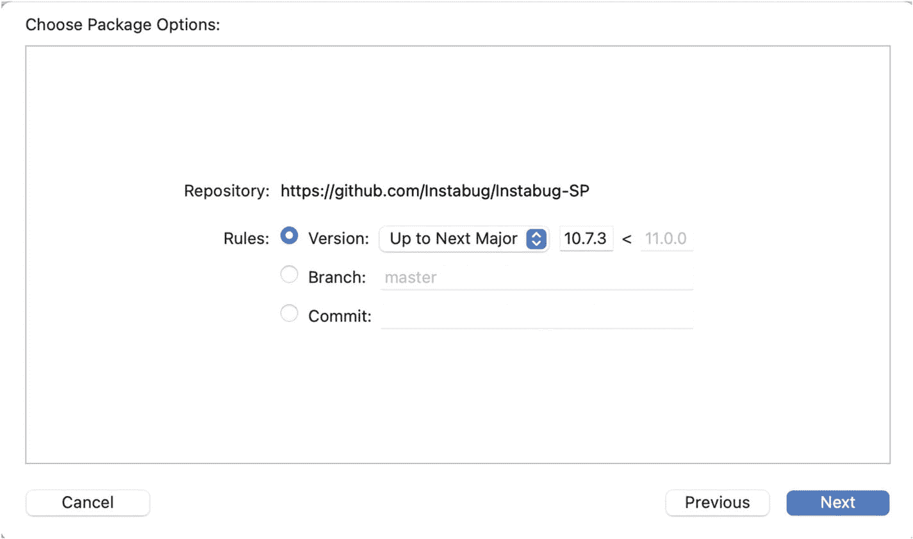

图 12-1

使用 SPM 添加第三方库

最后，在 `AppDelegate.swift` 中添加以下代码，即可完成集成 。

```
Instabug.start(withToken: "TOKEN", invocationEvents: .shake)
```

## 线上程序缺陷

我们刚刚收到了第一个程序缺陷报告（图 12-2）。一位用户抱怨说找不到任何书籍。

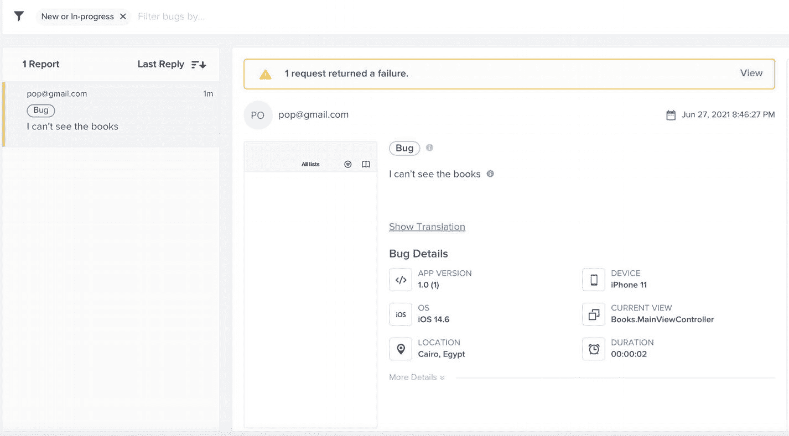

图 12-2

用户提交的程序缺陷报告

### 调试

从附带的截图（图 12-2）可以看到，`MainViewController` 是空的。这说明用户的投诉是合理的。

检查程序缺陷报告并查看网络日志后（图 12-3），我们发现书籍请求失败了。因此，出现这种行为是意料之中的。但问题是，我们完全没有显示任何错误信息。

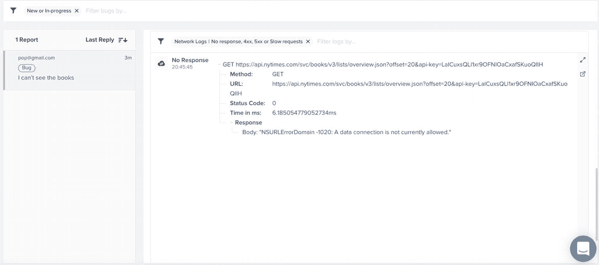

图 12-3

来自程序缺陷报告的网络日志

这里需要做的是：一旦书籍请求失败，我们必须确保显示提示信息：“无法加载畅销书”。

修复这个问题应该很简单。但即使简单到只需添加一个字母，我们仍然需要使用 TDD。TDD 的规则是，没有失败的测试就不能编写任何代码。既然这个程序缺陷已经发布到线上，就意味着我们没有覆盖这个场景的测试。

### UI 测试

打开 `BooksUITests`，新增一个测试来模拟这个缺陷。测试代码如下：

```
func testShowingErrorMessageWhenFailedToFetchBooksRequest() {
// Given
server.GET["/svc/books/v3/lists/overview.json"] = {_ in HttpResponse.notFound}
let app = XCUIApplication()
app.launchArguments += ["TESTING"]
app.launch()
// When
let booksTableView = app.tables
// Then
let failureMessage = booksTableView.staticTexts["Failed to fetch best seller books"]
_ = failureMessage.waitForExistence(timeout:10)
}
```

这里我们像之前一样模拟了请求，但现在返回了一个失败的响应。然后断言错误信息能够显示出来。


### 单元测试

`MainViewPresenter` 是一个负责根据 `MainViewModel` 返回的列表来返回错误信息的类。

`fetchBestSellerBooks` 目前只返回一个列表。我们需要扩展这个方法，使其返回一个布尔值来指示 presenter 是否成功获取请求，并返回一个要显示给用户的错误信息。让我们在 `MainViewPresenterTests` 中添加一个新测试：

```
func testFailureToFetchBooks() throws {
    // Given
    let mainViewModel = MainViewModelStub(stubbedLists: [])
    let mainViewPresenter = MainViewPresenter(mainViewModel: mainViewModel)
    var status:Bool?
    var message:String?
    var actualLists: [List] = []
    // when & then
    let waitForBooks = XCTestExpectation(description: "Wait to fetch books")
    mainViewPresenter.fetchBestSellerBooks { lists, success, errorMessage in
        actualLists = lists ?? []
        status = success
        message = errorMessage
        waitForBooks.fulfill()
    }
    self.wait(for: [waitForBooks], timeout: 0.1)
    XCTAssertEqual(actualLists, [])
    XCTAssertEqual(status, false)
    XCTAssertEqual(message, "Failed to fetch best seller books")
}
```

这里我们让桩模块返回一个空数组。然后调用 `fetchBestSellerBooks`，该方法现在会返回一个指示成功与否的布尔值，以及在失败时返回的错误信息。最后，我们断言回调中返回的值。

为了修复这个测试，我们需要更新 `fetchBestSellerBooks` 以处理这种情况：

```
public func fetchBestSellerBooks(callBack: @escaping (_ data:[List]?, _ success:Bool, _ errorMessage:String?) -> Void) {
    self.mainViewModel?.fetchBestSellerBooks(callBack: { lists in
        if let lists = lists, lists.count > 0 {
            callBack(lists, true, nil)
        } else {
            callBack([], false, "Failed to fetch best seller books")
        }
    })
}
```

由于我们更改了函数的签名，这会在我们的代码和测试中导致多个构建错误。我们只需逐一处理每个构建错误并更新签名即可。

修复所有构建错误后，如果我们运行 `MainViewPresenterTests` 中的新测试（图 12-4），它现在应该可以通过 ✅。

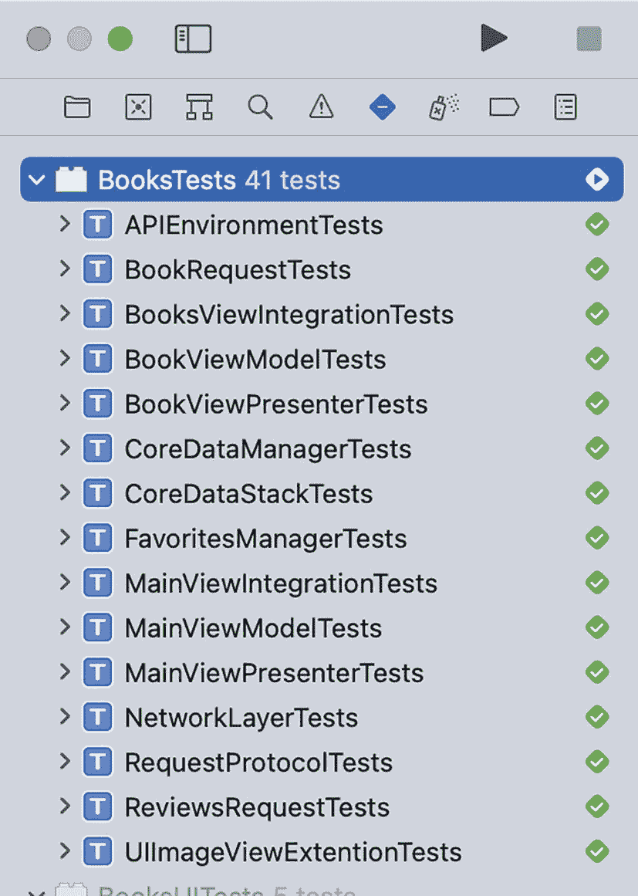

图 12-4

所有测试通过

现在，我们只需要更新视图控制器来显示错误信息：

```
func fetchBooks() {
    self.mainViewPresenter?.fetchBestSellerBooks(callBack: { lists,success,errorMessage  in
        if success {
            if let lists = lists {
                self.lists = lists
                DispatchQueue.main.async {
                    self.refreshControl.endRefreshing()
                    self.tableView?.reloadData()
                }
            }
        } else {
            self.lists = lists
            DispatchQueue.main.async {
                self.refreshControl.endRefreshing()
                self.tableView?.reloadData()
                self.showErrorMessage(errorMessage: errorMessage)
            }
        }
    })
}

func showErrorMessage(errorMessage:String?) {
    let label = UILabel(frame: CGRect(x: 0, y: 0, width: 100, height: 40))
    label.translatesAutoresizingMaskIntoConstraints = false
    label.text = errorMessage
    label.sizeToFit()
    self.tableView?.addSubview(label)
    label.centerXAnchor.constraint(equalTo: (self.tableView?.centerXAnchor)!).isActive = true
    label.centerYAnchor.constraint(equalTo: (self.tableView?.centerYAnchor)!).isActive = true
}
```

现在，如果我们运行 UI 测试（图 12-5），它也应该可以通过 ✅。

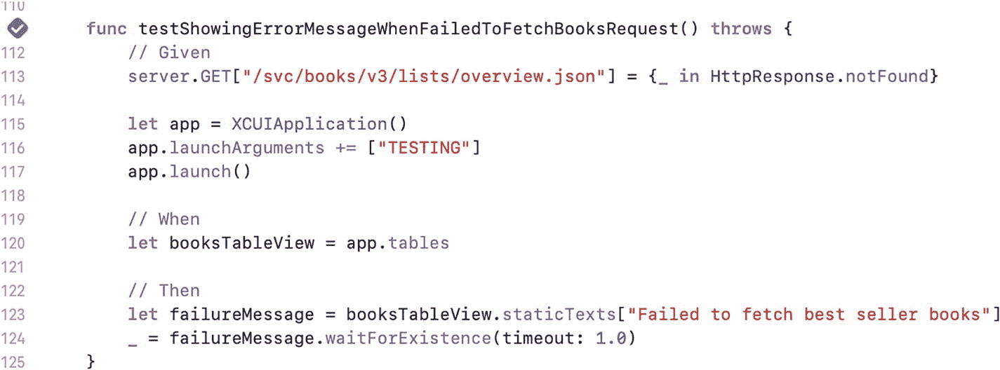

图 12-5

UI 测试通过

## 生产环境崩溃

我们刚刚收到了第一次崩溃报告，发生次数为 3 次（图 12-6）。

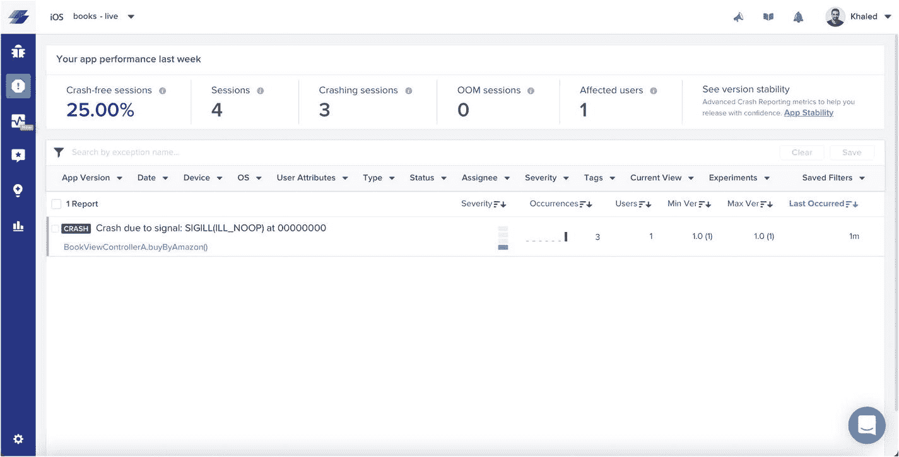

图 12-6

崩溃报告

### 调试

如果我们查看崩溃堆栈跟踪信息（图 12-7），会发现崩溃发生在用户尝试通过亚马逊购买图书时。

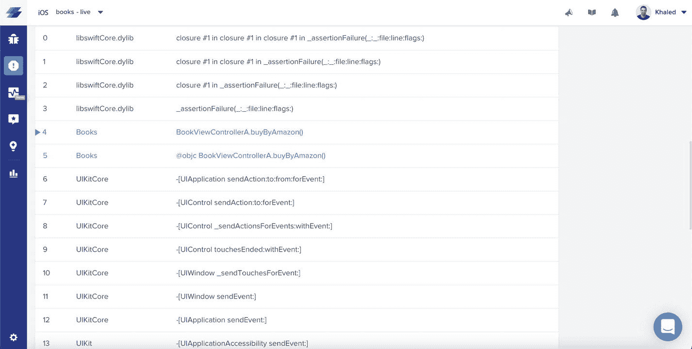

图 12-7

崩溃堆栈跟踪

首先，可能只是我们使用的网络服务有问题。也许返回的图书不包含亚马逊链接或其他什么。但如果我们检查网络日志（图 12-8），会发现网络服务返回了正确的响应。

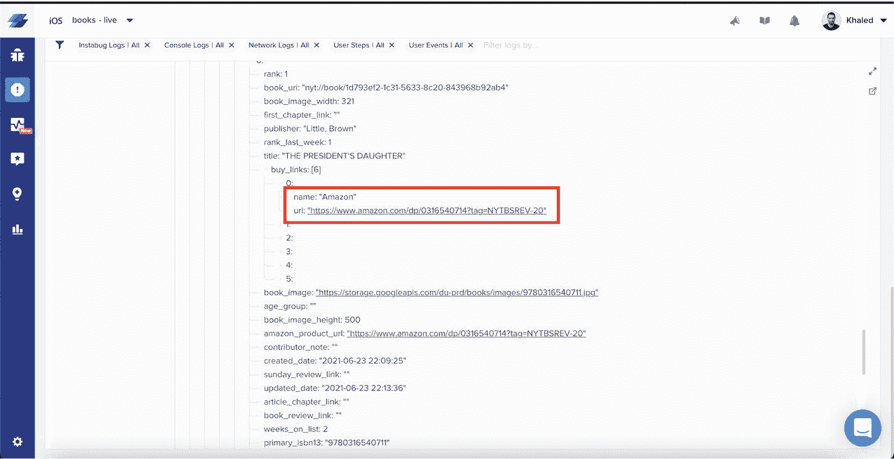

图 12-8

网络日志

如果我们进一步调试崩溃，查看全部三次崩溃的用户操作步骤（图 12-9），可以得出结论：所有崩溃都发生在 `BookViewControllerA` 内部。并且总是在应用进入后台再返回前台后发生。

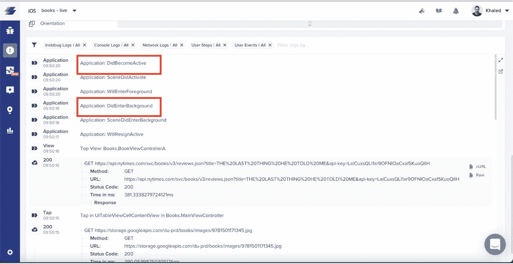

图 12-9

崩溃前的操作步骤

如果我们检查 `BookViewControllerA` 内部的代码，就会找到罪魁祸首：

```
NotificationCenter.default.addObserver(self, selector: #selector(didEnterBackground), name: UIApplication.didEnterBackgroundNotification, object: nil)
```

我们监听了 `didEnterBackground` 通知，当它被触发时，我们执行以下操作：

```
@objc func didEnterBackground() {
    self.book = nil
}
```

而当用户点击亚马逊按钮时：

```
@IBAction func buyByAmazon() {
    for buyLink in self.book!.buyLinks! {
        if buyLink.name == .amazon {
            if let url = URL(string: buyLink.url) {
                UIApplication.shared.open(url)
            }
        }
    }
}
```

我们强制解包了 book 实例以便使用它。

找到问题了！！！

现在我们找到了根本原因，我们将采用与修复之前 bug 相同的方法：应用 TDD。

### UI 测试

让我们打开 `BooksUITests` 并添加一个名为 `testShowingBookViewAfterEnterBackground` 的新测试来模拟导致崩溃的场景。

测试的 Given 部分应该如下所示：

```
// Given
let testBundle = Bundle(for: type(of: self))
let booksJSONURL = testBundle.url(forResource: "BestSellerBooksStub", withExtension: "json")
let booksJSON = try! String(contentsOf: booksJSONURL!)
let booksNoReveiwsJSONURL = testBundle.url(forResource: "booksNoReview", withExtension: "json")
let booksNoReveiwsJSON = try! String(contentsOf: booksNoReveiwsJSONURL!)
server.GET["/svc/books/v3/lists/overview.json"] = {_ in HttpResponse.ok(.text(booksJSON))}
server.GET["/svc/books/v3/reviews.json?title=THE+LAST+THING+HE+TOLD+ME"] = {_ in HttpResponse.ok(.text(booksNoReveiwsJSON))}
let app = XCUIApplication()
app.launchArguments += ["TESTING"]
app.launch()
```

这里我们通过为两个请求设置桩模块并启动应用来设置测试。

接下来是 “When” 部分：

```
// When
// Go to book
let booksTableView = app.tables
let cells = booksTableView.cells
let firstCell = cells.firstMatch
_ = firstCell.waitForExistence(timeout: 1.0)
firstCell.tap()
// Move to background
XCUIDevice.shared.press(.home)
// Move back to foreground
app.activate()
```

这里我们导航到图书详情页面，然后让应用进入后台，再回到前台。

最后是我们的 “Then” 部分：

```
// Then
let amazonButton = app.buttons["amazon"]
_ = amazonButton.waitForExistence(timeout: 1.0)
amazonButton.tap()
```

这里我们应该点击亚马逊按钮。通常在 Then 部分我们会做一些断言。但是，对于这个测试，我们的断言是应用不会崩溃。


### 处理 A/B 测试

现在出现了一个问题：每次测试运行时，它可能会打开 `BookViewControllerA` 或 `BookViewControllerB`。这是因为我们的 A/B 测试实验会随机选择一个视图控制器。所以，如果它选择打开 `BookViewControllerB`，我们的测试就能通过，即使它本应失败。为了让我们的测试有效，我们需要它总是失败。

因此，我们需要在 UI 测试中添加另一个启动参数，强制应用使用第一个实验方案：

```
let app = XCUIApplication()
app.launchArguments += ["TESTING", "detailsA"]
app.launch()
```

我们需要调整 `AppDelegate` 来强制指定实验方案：

```
if ProcessInfo.processInfo.arguments.contains("TESTING"){
if ProcessInfo.processInfo.arguments.contains("detailsA")  {
UserDefaults.standard.set(true, forKey: "detailsA")
} else {
UserDefaults.standard.set(false, forKey: "detailsA")
}
} else {
let randomBool = Bool.random()
if randomBool {
Instabug.addExperiments(["detailsA"])
} else {
Instabug.addExperiments(["detailsB"])
}
UserDefaults.standard.set(randomBool, forKey: "detailsA")
}
```

这里我们检查是否传入了启动参数。如果传入了，就使用该值；如果没有，则回退到正常的随机选择视图实现。

现在，如果我们运行测试，它应该会崩溃（图 12-10）。

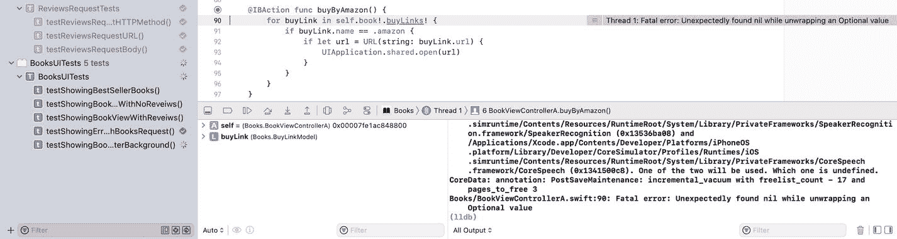

图 12-10

成功复现崩溃

### 修复测试

修复测试，进而修复生产环境的问题，非常简单。我们只需移除内部的强制解包，并将实现替换为以下代码：

```
@IBAction func buyByAmazon() {
guard let buyLinks = self.book?.buyLinks else {
return
}
for buyLink in buyLinks {
if buyLink.name == .amazon {
if let url = URL(string: buyLink.url) {
UIApplication.shared.open(url)
}
}
}
}
```

这里我们使用 `guard` 来检查书籍是否存在。

我们应该始终避免使用强制解包，因为它极度不安全。iOS 上发生的大多数崩溃都是由强制解包导致的。

我们还可以一并移除监听 `didEnterBackground` 通知的代码，因为似乎并不需要它。

现在，如果我们运行测试（图 12-11），它应该会通过 ✅。

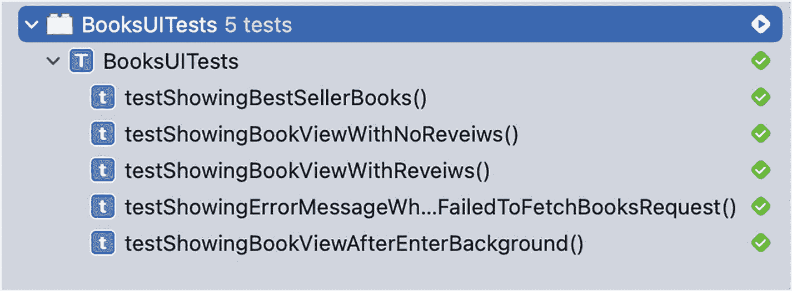

图 12-11

UI 测试通过

## 总结

我们的目标是持续提升应用质量。有时我们可能会遗漏某个场景而未加处理。我们无法总是预测用户将如何与应用交互。因此，最好的做法是，始终有一种方法来追踪生产环境用户遇到的致命崩溃，并为用户提供一种报告应用中错误行为的途径。

在本章中，我们讨论了如何使用第三方工具来追踪生产环境中的错误和崩溃。当遇到生产环境问题时，修复也应遵循测试驱动。我们在添加功能时使用 TDD，将需求转化为测试。对于生产环境的错误和崩溃，处理方式完全一样，我们的需求就是问题不再发生。当我们这样做时，我们将防止这个特定问题再次发生。


