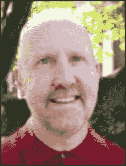
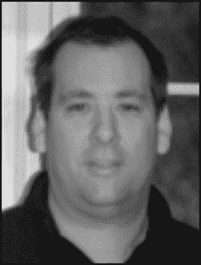
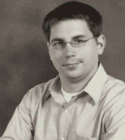

# 再见

## 索引

## 关于作者

**戴夫·马克** 是一位资深的 Mac 开发者和作者，撰写了多本关于 Mac 和 iOS 开发的书籍，包括 *Beginning iPhone 4 Development*（Apress, 2011）、*More iPhone 3 Development*（Apress, 2010）、*Learn C on the Mac*（Apress, 2008）、*Ultimate Mac Programming*（Wiley, 1995）以及 *Macintosh Programming Primer* 系列（Addison-Wesley, 1992）。戴夫是 MartianCraft（一家 iOS 和 Android 开发公司）的创始人之一。他热爱水，并尽可能多地在水上、水中或水边度过时光。他与妻子和三个孩子住在弗吉尼亚州。

**杰夫·拉马什** 是一位拥有超过 20 年编程经验的 Mac 和 iOS 开发者。杰夫撰写了许多 iOS 和 Mac 开发书籍，包括 *Beginning iPhone 4 Development*（Apress, 2011）、*More iPhone 3 Development*（Apress, 2010）和 *Learn Cocoa on the Mac*（Apress, 2010）。杰夫是 MartianCraft（一家 iOS 和 Android 开发公司）的负责人之一。他曾为 *MacTech Magazine* 撰写关于 Cocoa 和 Objective-C 的文章，也为 Apple 的开发者网站撰写文章。杰夫还在他的广受阅读的博客 `www.iphonedevelopment.blogspot.com` 上撰写关于 iOS 开发的文章。

**凯文·金** 是 AppOrchard LLC 的联合创始人兼开发者，该公司是 Tipping Point Partners 旗下专注于可持续 iOS 开发的企业。他毕业于卡内基梅隆大学，最初在匹兹堡超级计算中心担任程序员时接触到了 NeXTStep 计算机（今天 iPhone 的前身），并从此深陷其中。他的职业生涯横跨金融、政府、生物技术和科技领域，包括在 Apple 担任纽约都会区 Apple 企业服务团队经理。凯文还是 *Pro iOS 5 Tools*（Apress, 2011）的合著者。他目前与妻子和一窝收留的猫居住在纽约市的字母城区域。

## 关于技术审校

**尼克·韦尼克** 在 IT 领域工作了超过 13 年，涉足网络管理到 Web 开发的方方面面。他在 SDK 首次发布时就开始编写 iOS 应用。此后，他创立了自己的公司，专注于 iOS 开发。他喜欢在业余时间与妻子艾莉森和儿子普雷斯顿在一起；有时他甚至会打打高尔夫。他在 `nickwaynik.com` 上写博客，你可以在 Twitter 上通过 @n_dubbs 找到他。

## 致谢

撰写这样一本书不仅仅是我们这些作者的努力。尽管封面印着我们的名字，但它是许多人辛勤工作的成果。

首先，我要感谢戴夫·马克和杰夫·拉马什编写了本书的第一个版本，并为我提供了构建和扩展的坚实基础。

我要感谢 Apress 的员工，他们确保这本书尽可能按计划完成。布里吉德·达菲提供了指导和监督，确保我完成了这本书。汤姆·威尔士确保我紧扣主题并保持内容清晰。玛丽·贝尔让手稿看起来美观。我还要感谢布兰登·勒维克，确保人们知道这本书即将出版。

感谢技术审校尼克·韦尼克和马克·达林普尔，确保我编写的代码确实能工作。任何仍然存在的错误都是我的责任。

感谢我在 AppOrchard 的朋友和同事，感谢他们过去几个月对我脾气暴躁行为的耐心，以及帮助我成功完成这个项目。

特别感谢我的妻子安妮，确保我在本该看棒球或弹吉他时能专注于这本书。感谢我的猫 PK、曼尼和莉拉，在我需要休息时它们总想要食物。特别感谢曼尼，它是本书中许多示例的主角。

最后，感谢你，读者，购买这本书。我们倾向于将编程视为一门科学学科，但有时它更像是一门黑魔法。如果这本书能帮助你在理解 iOS 编程的旅程中前进，那么一切都是值得的。

