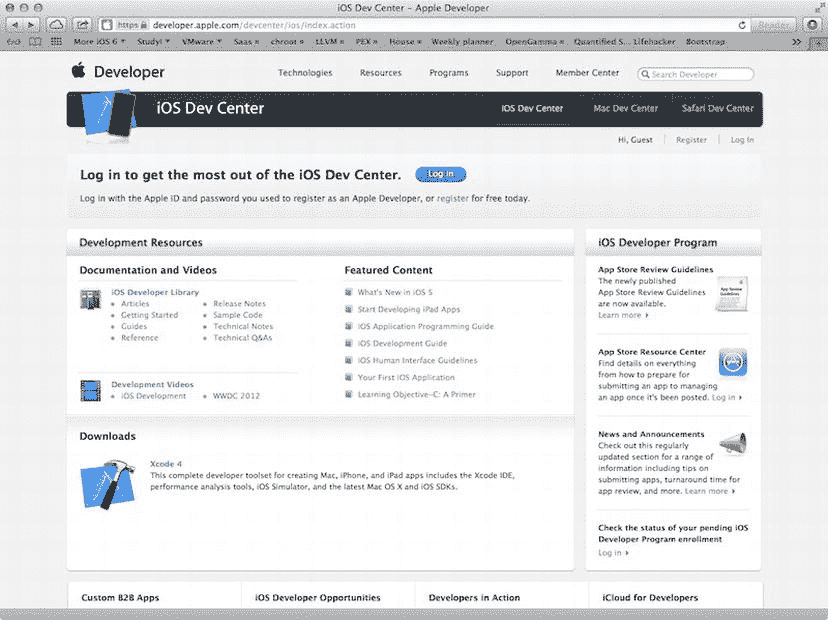

# 第 1 章：我们又出发了

所以，你还在创建 iPhone 应用，是吗？太棒了！iOS 和 App Store 取得了巨大的成功，从根本上改变了移动应用程序的交付方式，并彻底改变了人们对移动设备的期望。自 2008 年 3 月 iOS 软件开发工具包 (SDK) 首次发布以来，Apple 一直在忙于添加新功能并改进已有的功能。这个平台和它刚推出时一样令人兴奋。事实上，从很多方面来看，它更令人兴奋了，因为 Apple 不断扩展可供像我们这样的第三方开发者使用的功能数量。

自本书上一版 *More iPhone 3 Development*（Apress 2010）出版以来，Apple 发布了许多框架、工具和服务。这些包括但不限于：

*   **核心框架**：Core Motion、Core Telephony、Core Media、Core View、Core MIDI、Core Image 和 Core Bluetooth
*   **实用框架**：Event Kit、Quick Look Framework、Assets Library、Image I/O、Printing、AirPlay、Accounts and Social Frameworks、Pass Kit
*   **服务及其框架**：iAds、Game Center、iCloud、Newsstand
*   **面向开发者的增强功能**：Blocks、Grand Central Dispatch（GCD）、Weak Linking Support、Automatic Reference Counting（ARC）、Storyboards、Collection Views、UI State Preservation、Auto Layout、UIAutomation

以及更多……

显然，变化太多，无法在一本书中完全涵盖。但我们会尽力让你熟悉那些你最可能需要了解的内容。

## 本书的内容

本书是一本指南，旨在帮助您继续在创建更优秀 iOS 应用的道路上前行。在 *Beginning iOS 6 Development*（Apress, 2012）中，目标是帮助你跨越最初的学习曲线，并掌握构建第一个 iOS 应用程序的基础知识。在本书中，我们假设你已经掌握了基础知识。因此，除了向你展示如何使用几个新的 iOS API 之外，我们还将穿插介绍一些更高级的技巧，随着你的 iOS 开发工作规模和复杂性的增长，这些技巧将是必需的。

### 你需要了解的内容

本书假定你已经具备一定的编程知识，并且对 iOS SDK 有基本的了解——无论是通过阅读《Beginning iOS 6 Development》一书，还是通过其他途径获得了类似的基础。我们假设你已经对 SDK 进行了一些实践，可能自己编写过一两个小程序，并对 Xcode 有了大致的认识。你可能需要快速回顾一下《Beginning iOS Development》中的第 2 章。

#### 完全是 iOS 新手？

如果你对 iOS 开发完全陌生，那么在阅读本书之前，你可能需要先读一些其他书籍。如果你还不了解编程基础知识和 C 语言的语法，可以查阅 David Mark 和 James Bucanek 合著的《Learn C on the Mac for OS X and iOS》（Apress, 2012），这是一本面向 Macintosh 程序员的 C 语言全面入门书籍（`www.apress.com/9781430245339`）。

如果你已经了解 C 语言，但没有面向对象编程的经验，可以查阅《Learn Objective-C on the Mac》（Apress, 2012），这是由 Mac 编程专家 Scott Knaster、Wagar Malik 和 Mark Dalrymple 撰写的一本优秀且易懂的 Objective-C 入门书（`www.apress.com/9781430218159`）。

接下来，请访问苹果 iPhone 开发中心，下载一份《The Objective-C 2.0 Programming Language》，这是对该语言非常详细和全面的描述，也是一份极佳的参考指南，网址为：`http://developer.apple.com/library/ios/#documentation/Cocoa/Conceptual/ObjectiveC/Introduction/introObjectiveC.html`。

一旦你扎实掌握了 Objective-C，就需要精通 iOS SDK 的基础知识。为此，你应该阅读本书的前传——《Beginning iOS 6 Development: Exploring the iOS SDK》，作者是 David Mark、Jack Nutting、Jeff LaMarche 和 Fredrik Olsson（Apress 2011，`www.apress.com/9781430245124`）。

### 开始前需要准备什么

在编写 iOS 设备软件之前，你需要准备几样东西。首先，你需要一台运行 Lion 系统（Mac OS X 10.7 或更高版本）的英特尔架构 Macintosh 电脑。自 2008 年以来发布的大多数 Macintosh 电脑（无论是笔记本还是台式机）都可以正常工作，但请确保你的机器是英特尔架构，并且能够运行 Lion 系统。

这看起来可能显而易见，但你还需要一部 iPhone（3GS 或更新机型）、iPod touch（第三代或更新机型）或 iPad（iPad 2 或更新机型）。虽然你的大部分代码可以在 iPhone/iPad 模拟器上进行测试，但并非所有程序都能在模拟器中运行。而且，在考虑向公众发布任何应用之前，你都需要在实际设备上对其进行全面彻底的测试。

最后，你需要注册成为一名注册 iOS 开发者。如果你已经是注册 iOS 开发者，请直接下载最新最好的 iPhone 开发工具，然后跳转到下一节。

如果你对苹果的注册 iOS 开发者计划不熟悉，请访问`http://developer.apple.com/ios/`，这将带你进入与图 1-1 类似的页面。就在 iOS Dev Center 横幅的下方，在页面的右侧，你会看到标有“登录”和“注册”的链接。点击“注册”链接。在出现的页面上，点击“继续”按钮。按照一系列指示，使用你现有的 Apple ID 或创建一个新的 Apple ID。

图 1-1.  苹果 iOS Dev Center 网站

在注册过程中，你可能会在某个时候看到几个选项，所有选项都会引导你进入 SDK 下载页面。这三个选项是：免费、商业和企业。这三个选项都允许你访问 iOS SDK 和 Xcode（苹果的集成开发环境，IDE）。Xcode 包含创建和调试源代码、编译应用程序以及对你编写的应用进行性能调优的工具。请注意，虽然你可以通过开发者网站获取 Xcode，但 Xcode 的发行版将通过 App Store 提供给你。

顾名思义，免费选项是免费的。它允许你开发 iOS 应用，并在纯软件的模拟器上运行，但不允许你将这些应用下载到你的 iPhone、iPod touch 或 iPad 上，也不允许你在苹果的 App Store 上销售你的应用。此外，本书中的一些程序将仅在真机上运行，而无法在模拟器中运行，这意味着如果你选择免费方案，你将无法运行这些程序。话虽如此，如果你不介意在学习那些无法在模拟器中运行的程序时只是“纸上谈兵”，那么免费方案是一个不错的起点。

另外两个选项是注册 iOS 开发者计划，即标准（商业）计划或企业计划。标准计划费用为 99 美元。它提供大量开发工具和资源、技术支持、通过苹果 App Store 分发你的应用程序，以及最重要的——能够在 iPhone 上（而非仅在模拟器中）测试和调试你的代码。企业计划费用为 299 美元，专为那些为公司内部开发专有 iPhone、iPod touch 和 iPad 应用的公司而设计。有关这两个计划的更多详细信息，请访问`http://developer.apple.com/programs/`。

**注意**  如果你打算注册标准计划或企业计划，你应该现在就去做。获得批准可能需要一段时间，而你需要获得批准才能在 iPhone 上运行应用程序。不过别担心——本书前几章中的项目在 iPhone 模拟器上运行得很好。

由于 iOS 设备是使用第三方无线基础设施的联网移动设备，苹果对 iOS 开发者的限制远多于对 Macintosh 开发者的限制——后者在编写和分发程序时完全无需苹果的监督或批准。苹果这样做并非出于恶意，而是为了最大程度地降低人们分发可能降低共享网络性能的恶意或编写拙劣的程序的风险。这看起来可能需要克服很多障碍，但苹果已经付出了相当大的努力，使这一过程尽可能简单。

### 本书内容

正如我们之前所说，本书的第 2 章到第 7 章主要介绍 Core Data——苹果主要的持久性框架。其余章节则涵盖 iOS SDK 中新增或过于高级而无法包含在《Beginning iOS 6 Development》中的特定功能领域。

以下是对后续各章的简要概述：

**第 2 章**，Core Data 剖析：在本章中，我们将向你介绍 Core Data。你将了解为什么 Core Data 是你 iPhone 开发工具库中至关重要的一部分。我们将剖析一个简单的 Core Data 应用程序，并向你展示一个基于 Core Data 的应用程序中各个独立部分是如何结合在一起的。

**第 3 章**，一个出色的开始：*添加、显示和删除数据*：一旦你扎实掌握了 Core Data 的术语和架构，你将学习如何执行一些基本任务，包括插入、搜索和检索数据。

