# 第 16 章：道路漫漫，永无止境……

遗憾的是，每段旅程都必有终点。我们将以诚挚的告别和一些希望你觉得有用的资源来结束本书。

正如我们在《Beginning iOS 6 Development》中所说，iOS 是一个令人难以置信的计算平台，是一个不断扩展的、带给你开发乐趣的前沿阵地。在这本书中，我们将带你沿着 iPhone 开发的道路走得更远，更深入地挖掘 SDK，触及新的、在某些情况下更高级的主题。

阅读本书，并务必亲手构建项目——不要只是从存档中复制它们然后运行一两次。通过动手实践你才能学到最多。在进入下一个项目之前，确保你理解了自己做了什么以及为什么这样做。不要害怕修改代码。去实验、调整代码、观察结果。反复练习。

已经安装好你的 iOS SDK 了吗？翻过这一页，放上一些 iTunes 音乐，我们开始吧。你持续不断的旅程正等着你呢。

## 第 12 章：Core Data：是什么，为什么及怎么用

Core Data 是一个框架和一组工具，它允许你将应用程序的数据自动保存（或持久化）到 iOS 设备的文件系统中。Core Data 是对象关系映射（ORM）的一种实现。这只是说，Core Data 允许你与你的 Objective-C 对象进行交互，而无需担心这些对象的数据如何从持久化数据存储（例如关系数据库如 SQLite 或平面文件）中存储和检索。

当你刚开始使用 Core Data 时，它可能会看起来像魔法一样。大多数情况下，Core Data 对象的处理方式就像普通的老式对象一样，它们似乎知道如何自动神奇地检索和保存自己。你将永远不需要创建 SQL 字符串或进行文件管理调用。Core Data 使你免于处理一些复杂且困难的编程任务，这对你来说很棒。通过使用 Core Data，你可以比直接使用 SQLite、对象归档或平面文件快得多地开发具有复杂数据模型的应用程序。

像 Core Data 这样隐藏复杂性的技术可能会助长“伏都编程”，这是一种最危险的编程实践，你会将未必理解的代码包含到你的应用程序中。有时，这些神秘的代码以项目模板的形式出现。或者，也许你下载了一个实用程序库，它可以为你完成一项你没有时间或专业知识自己完成的任务。那段伏都代码做了你需要它做的事情，而你没有时间或意愿去逐步理解它，所以它就待在那里，施展着它的魔法……直到它出问题。一般来说，如果你在自己的应用程序中发现了不完全理解的代码，这是一个信号，表明你应该去做一些研究，或者至少找一个更有经验的同伴来帮你掌握这些神秘代码。

关键在于，Core Data 是这样一种复杂技术，它很容易成为神秘代码的来源，并潜入你的许多项目中。虽然你不需要确切知道 Core Data 是如何完成它所做的一切的，但你应该投入一些时间和精力来理解 Core Data 的整体架构。

本章从 Core Data 的简短历史开始，然后深入到一个 Core Data 应用程序。通过使用 Xcode 构建一个 Core Data 应用程序，你会发现理解后续章节中更复杂的 Core Data 项目要容易得多。

#### Core Data 简史


Core Data 的历史相当悠久，但它是在 iPhone SDK 3.0 发布时才在 iOS 上可用的。Core Data 最初随 Mac OS X 10.4 (Tiger) 一同推出，但其部分底层机制实际上可以追溯到大约 15 年前的 NeXT 框架，即企业对象框架 (EOF)，该框架是 NeXT 的 WebObjects Web 应用服务器附带的工具集的一部分。

EOF 专为与远程数据源配合使用而设计，在它刚推出时是一个相当革命性的工具。尽管现在几乎所有语言都有许多优秀的 ORM（对象关系映射）工具，但在 WebObjects 诞生初期，大多数 Web 应用仍使用手工编写的 SQL 或文件系统调用来持久化数据。当时，编写 Web 应用极其耗时费力。WebObjects 部分归功于 EOF，将创建复杂 Web 应用所需的开发时间缩短了一个数量级。

除了作为 WebObjects 的一部分外，EOF 还被 NeXTSTEP 使用，NeXTSTEP 是 Cocoa 的前身。当苹果收购 NeXT 时，苹果的开发人员借鉴了 EOF 中的许多概念来开发 Core Data。Core Data 为桌面应用程序实现了 EOF 曾经为 Web 应用程序所做的事：通过消除编写文件系统代码或与嵌入式数据库交互的需要，极大地提高了开发人员的生产力。

让我们开始构建你的 Core Data 应用程序吧。

### 创建 Core Data 应用程序

启动 Xcode 并创建一个新的 Xcode 项目。有多种方法可以做到这一点。当你启动 Xcode 时，可能会看到 Xcode 启动窗口（图 2-1）。你可以直接点击“Create a New Xcode Project”区域。或者选择 **File  New  Project**。或者使用键盘快捷键 N。选择你最喜欢的方式。在后续内容中，我们会在 Xcode 窗口或菜单选项中提及可用选项，但不会使用键盘快捷键。如果你熟悉并喜欢使用键盘快捷键，可以随意使用。让我们回到构建应用程序的正题。

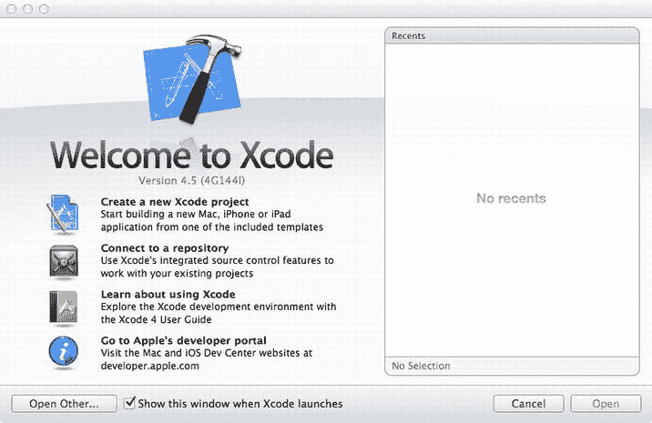

图 2-1. Xcode 启动窗口

Xcode 将打开一个项目工作区并显示项目模板表（图 2-2）。左侧是可能的模板标题：iOS 和 OS X。每个标题都有一组模板组。选择 iOS 标题下的 Application 模板组，然后在右侧选择 Master-Detail Application 模板。在右下角，有该模板的简短描述。点击 Next 按钮进入下一个表。

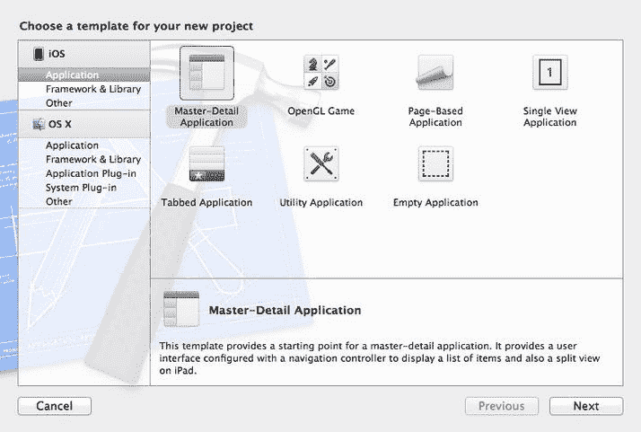

图 2-2. 项目模板表

下一个表是项目配置表（图 2-3）。系统会要求你提供一个产品名称；请使用名称 `CoreDataApp`。组织名称 (Organization Name) 和公司标识符 (Company Identifier) 字段将由 Xcode 自动设置；默认情况下，它们会显示为 `MyCompanyName` 和 `com.mycompanyname`。你可以将它们更改为任何你喜欢的值，但对于公司标识符，Apple 建议使用反向域名风格（例如 `com.apporchard`）。

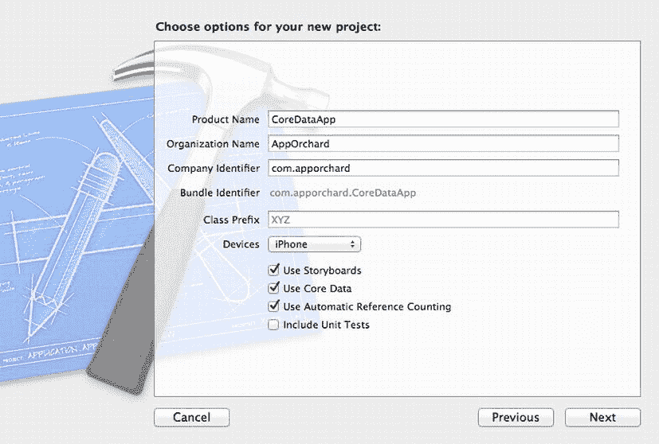

图 2-3. 项目配置表

请注意，包标识符 (Bundle Identifier) 字段不可编辑；它由公司标识符和产品名称字段的值填充。类前缀 (Class Prefix) 字段是一个选项，用于在项目的所有类之前添加一个前缀（例如 `NS`）。你可以将此字段留空。

设备 (Devices) 下拉字段列出了该项目的可能目标设备：iPad、iPhone 或 Universal。前两者不言自明。“Universal”适用于既能在 iPad 又能在 iPhone 上运行的应用程序。拥有一个同时支持 iPad 和 iPhone 的单个项目既有好处也有坏处。但就本书而言，你将坚持使用 iPhone。由于你将使用故事板 (storyboards)，请确保选中“Use Storyboards”复选框。你显然想使用 Core Data，因此请勾选其复选框。最后，确保选中“Use Automatic Reference Counting”复选框。

点击 *Next*，并选择一个位置来保存你的项目（图 2-4）。底部的复选框将设置你的项目以使用 Git ([www.git-scm.com](http://www.git-scm.com))，这是一个免费的、开源的版本控制系统。使用它很有用，因此你可以保持选中状态。我们不会讨论它，但如果你不熟悉版本控制或 git，我们建议你去熟悉它们。点击 Create。Xcode 应该会创建你的项目，项目看起来应该像图 2-5 所示。

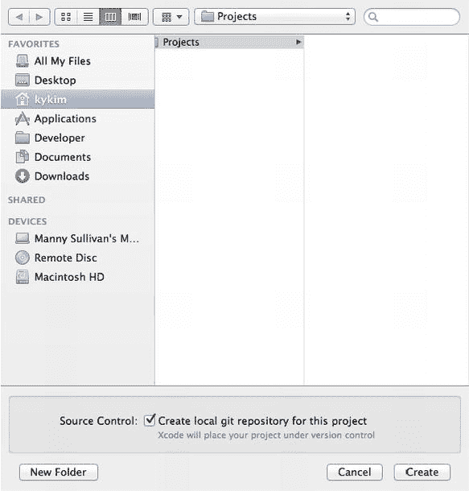

图 2-4. 选择一个位置来放置你的项目

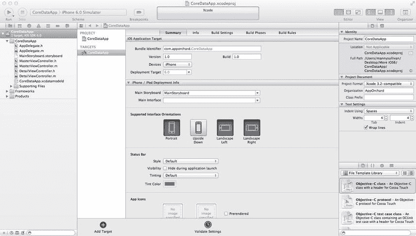

图 2-5. 瞧，你的项目准备好了！

构建并运行应用程序。要么按下工具栏上的 Run 按钮，或者选择 **Product  Run**。模拟器应该会启动。按下右上角的 Add (`+`) 按钮。表格中会插入一个新行，显示按下 Add 按钮的精确日期和时间（图 2-6）。你也可以使用 Edit 按钮删除行。很酷，对吧？

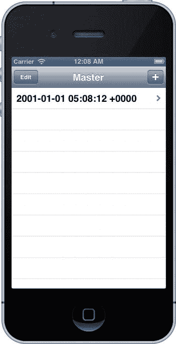

图 2-6. CoreDataApp 运行中

在这个简单应用的底层，发生了很多事情。想想看：无需添加任何类，也无需编写任何将数据持久化到文件或与数据库交互的代码，按下 Add 按钮就创建了一个对象，用数据填充了它，并将其保存到为你自动创建的 SQLite 数据库中。这里面有很多免费的功能。

现在你已经看到了一个应用程序的运行，让我们看看幕后发生了什么。

### Core Data 概念与术语

像大多数复杂技术一样，Core Data 有自己的一套术语，这可能会让新手感到有些困惑。让我们揭开神秘面纱，让你掌握 Core Data 的术语。

图 2-7 展示了一个简化的 Core Data 架构高层示意图。现在不要指望能完全理解它，但在你查看不同部分时，你可能想回头参考此图，以巩固你对它们如何结合在一起的理解。

这里有五个关键概念需要关注。当你通读本章时，请确保理解以下每一个概念：

*   数据模型 (Data Model)
*   持久化存储 (Persistent Store)
*   持久化存储协调器 (Persistent Store Coordinator)
*   托管对象与托管对象上下文 (Managed Object and Managed Object Context)
*   获取请求 (Fetch Request)

再说一次，不要让这些名称吓到你。继续往下看，你会看到所有这些部分是如何组合在一起的。

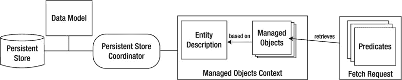

图 2-7. Core Data 架构

#### 数据模型

什么是数据模型？从抽象意义上讲，它是定义数据组织方式以及组织好的数据组件之间关系的一种尝试。在 Core Data 中，数据模型定义了对象的数据结构、这些对象的组织方式、这些对象之间的关系以及这些对象的行为。通过模型编辑器和检查器，Xcode 允许你指定在应用程序中使用的数据模型。


如果你展开导航内容面板中的 `CoreDataApp` 组，你会看到一个名为 `CoreDataApp.xcdatamodel` 的文件。该文件是你的项目的默认数据模型。Xcode 为你创建了这个文件，因为你在项目配置表中勾选了“使用 Core Data”复选框。单击 `CoreDataApp.xcdatamodel` 以打开 Xcode 的模型编辑器。确保实用工具面板（`Utility` pane）可见（它应该是视图栏上的第三个按钮），然后选择检查器（`Inspector`）。你的 Xcode 窗口应该看起来像 图 2-8。

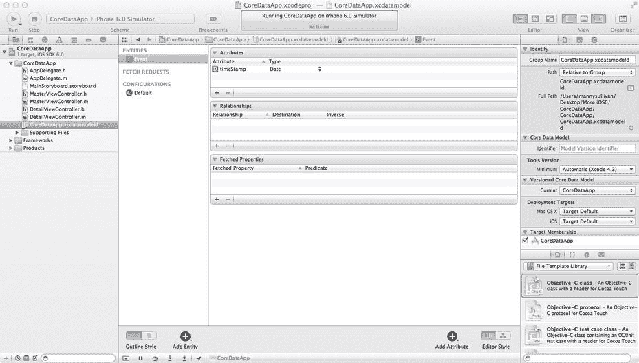

图 2-8 Xcode 显示模型编辑器和检查器

当你选择了数据模型文件 `CoreDataApp.xcdatamodel` 时，编辑器面板会切换到 Core Data 模型编辑器（图 2-9）。在顶部，跳转栏保持不变。在左侧，装订线已被替换为一个更宽的面板，即顶级组件面板（`Top-Level Components` pane）。顶级组件面板概述了在数据模型中定义的实体、获取请求和配置（我们稍后会详细讨论这些）。你可以通过使用顶级组件面板底部的“添加实体”按钮来添加一个新实体。或者，你也可以使用 **Editor  Add Entity** 菜单选项。如果你单击并按住“添加实体”按钮，将会出现一个弹出菜单，包含以下选项：添加实体、添加获取请求和添加配置。无论你选择哪个选项，按钮的单击行为都会更改为该组件，并且按钮的标签也会相应地更改以反映此行为。添加获取请求和配置的菜单等效项可以在 **Add Entity** 菜单项下方的 Editor 菜单中找到。

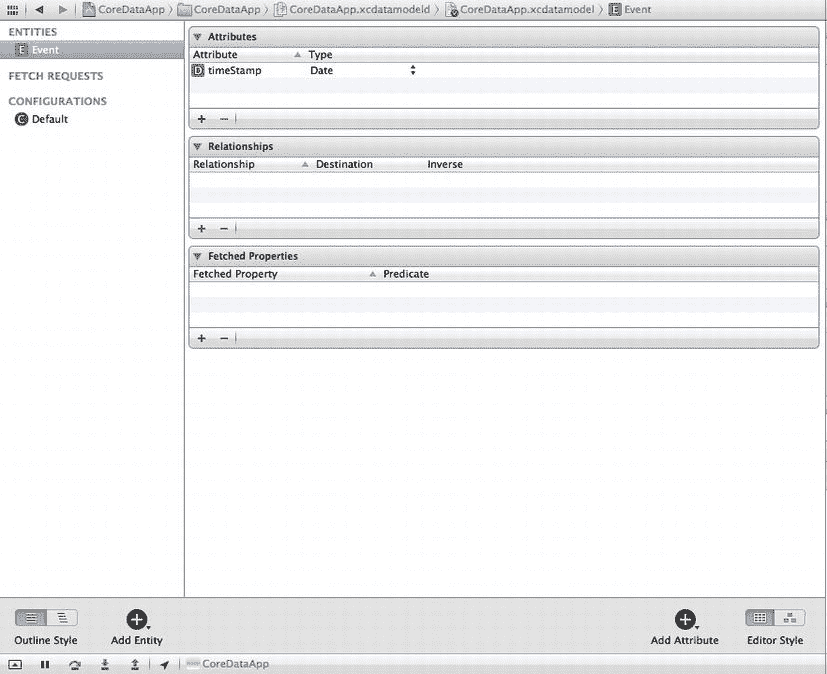

图 2-9 近距离查看模型编辑器

顶级组件面板有两种样式：列表样式和层次结构样式。你可以通过使用顶级组件面板底部的“大纲样式”选择器组在这两种样式之间切换。使用 `CoreDataApp` 数据模型切换样式不会改变顶级组件面板中的任何内容，因为只有一个实体和一个配置，所以没有层次结构可以显示。如果你有一个依赖于另一个组件的组件，你会看到层次结构大纲样式显示了两者之间的层次关系。

编辑器面板的大部分区域被详细编辑器（`Detail` editor）占据。详细编辑器有两种编辑器样式：表样式和图样式。默认情况下（如图 图 2-9 所示），详细编辑器处于表样式。你可以通过使用编辑器面板右下角的“编辑器样式”选择器组在这两种样式之间切换。试试看。你可以看到这两种样式的区别。

当你在顶级组件面板中选择了一个实体时，详细编辑器会以表样式显示三个表格：属性（`Attributes`）、关系（`Relationships`）和获取属性（`Fetched Properties`）。同样，我们稍后会详细讨论这些。你可以通过使用详细编辑器下方的“添加属性”按钮来添加一个新属性。与“添加实体”按钮类似，单击并按住会显示一个弹出菜单，包含以下选项：添加属性、添加关系和添加获取属性。同样，此按钮的单击行为会根据你的选择而改变，其标签也会反映该行为。在 `Editor` 菜单下有三个菜单项：添加属性（`Add Attribute`）、添加关系（`Add Relationship`）和添加获取属性（`Add Fetched Property`）。这些菜单项仅在顶级组件面板中选中了一个实体时才会生效。

如果你将详细编辑器切换到图样式，你会看到一个大的网格，中心有一个单独的圆角矩形。这个圆角矩形代表顶级组件面板中的实体。为此项目使用的模板创建了一个实体 `Event`。在顶级组件面板中选择 `Event` 等同于在图视图中选择圆角矩形。

试试看。在详细编辑器网格中单击实体外部以取消选择它，然后在顶级组件面板中单击 `Event` 行。图视图中的实体也会被选中。顶级组件面板和图视图显示了同一实体列表的两个不同视图。

当未被选中时，`Event` 实体方块的标题栏和线条应为粉红色。如果你在顶级组件面板中选择了 `Event` 实体，那么详细编辑器中的 `Event` 实体会变为蓝色，表示它被选中了。现在，单击详细编辑器网格上 `Event` 圆角矩形之外的任意位置。`Event` 实体应该在顶级组件面板中取消选中，并且在详细编辑器中改变颜色。如果你在详细编辑器中单击 `Event` 实体，它将再次被选中。当选中时，`Event` 实体应该在左侧和右侧有一个调整大小手柄（或圆点），允许你调整其宽度。

你现在拥有 `Event` 实体。它只有一个名为 `timeStamp` 的属性，并且没有关系。`Event` 实体是作为此模板的一部分创建的。当你设计自己的数据模型时，你很可能会删除 `Event` 实体，从头创建你自己的实体。刚才，你在模拟器中运行了你的 Core Data 示例应用程序。当你按下 **+** 图标时，一个新的 `Event` 实例被创建。我们将在几页后更详细地研究实体，它们取代了你原来用来保存数据的 Objective-C 数据模型类。我们稍后会回到模型编辑器，看看它是如何工作的。现在，只需记住：持久化存储是 Core Data 存储数据的地方，而数据模型定义了该数据的形式。还要记住，每个持久化存储有且只有一个数据模型。

检查器为在模型编辑器中选择的项目提供更详细的信息。由于每个项目在检查器中可能有不同的视图，我们将在讨论组件及其属性时讨论这些细节。话虽如此，让我们讨论三个顶级组件：实体、获取请求和配置。

### 实体

实体可以被认为是 Core Data 中与 Objective-C 类声明相对应的概念。实际上，在应用程序中使用实体时，你基本上是将其当作一个具有某些 Core Data 特定实现的 Objective-C 类来对待。你使用模型编辑器来定义构成实体的属性。每个实体都被赋予一个名称（在这里是 `Event`），该名称必须以大写字母开头。当你之前运行 `CoreDataApp` 时，每次你按下添加（+）按钮，都会实例化一个新的 `Event` 实例并将其存储在应用程序的持久化存储中。

确保实用工具面板已展开，并选择 `Event` 实体。现在查看实用工具面板中的检查器（通过在检查器选择器栏中选择检查器按钮，确保检查器正在显示）。请注意，检查器面板现在允许你编辑或更改实体的各个方面（图 2-10）。我们稍后会介绍检查器的详细信息。

### 属性

当编辑器面板列出数据模型的所有实体时，检查器面板允许你“检查”属于所选实体的属性。一个实体可以由任意数量的属性组成。有三种不同类型的属性：属性（`attributes`）、关系（`relationships`）和获取属性（`fetched properties`）。当你在模型编辑器中选择一个实体的属性时，该属性的详细信息会显示在检查器面板中。


### Core Data 实体与数据模型

#### 属性（Attributes）

在创建实体时，最常使用的属性是`attribute`，它在 Core Data 实体中的作用与实例变量在 Objective-C 类中的作用相同：它们都用于保存数据。查看模型编辑器（或图 2-10），你会发现`Event`实体有一个名为`timeStamp`的属性。`timeStamp`属性保存了特定`Event`实例创建时的日期和时间。在示例应用程序中，当点击`+`按钮时，表格中会新增一行，显示单个`Event`的`timeStamp`。

与实例变量类似，每个属性都有类型。设置属性类型有两种方式：当模型编辑器使用表格样式时，你可以在详细编辑器（图 2-11）的属性表中更改属性类型。在当前应用程序中，`timeStamp`属性设置为`Date`类型。点击`Date`单元格，你会看到一个弹出菜单，其中列出了所有可能的属性类型。在接下来的几章中，当你开始构建自己的数据模型时，将了解不同的属性类型。

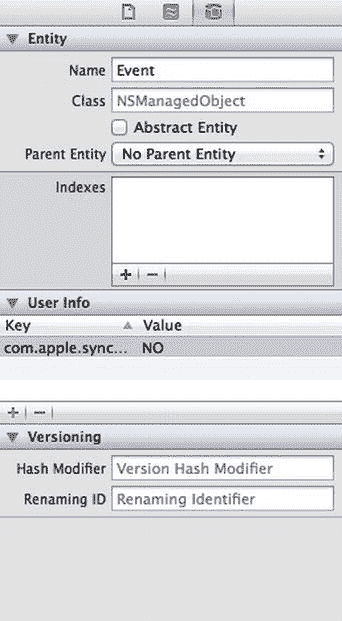

图 2-10.  `Event`实体的检查器

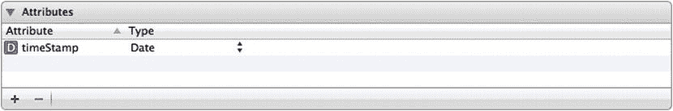

图 2-11.  模型编辑器（表格样式）中的属性表

确保`timeStamp`属性仍处于选中状态，然后查看检查器（图 2-12）。注意，在这些字段中有一个带有弹出按钮的`Attribute Type`字段。点击该按钮，会显示一个弹出菜单，其中包含你在属性表中看到的属性类型。请确保属性类型设置为`Date`。

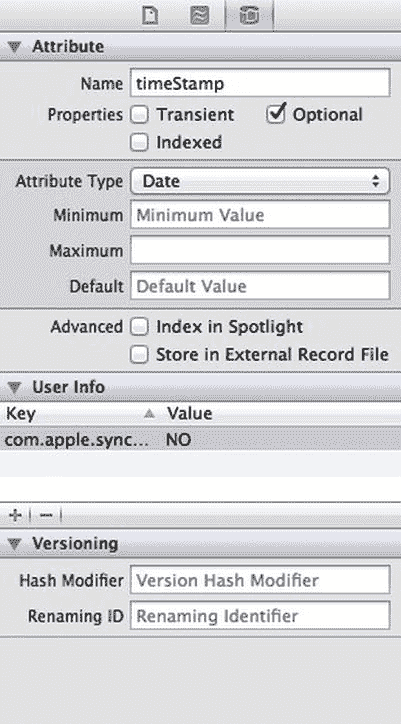

图 2-12.  `timeStamp`属性的检查器

日期属性（如`timeStamp`）对应于`NSDate`的实例。若要为日期属性设置新值，需要提供一个`NSDate`实例。字符串属性对应于`NSString`的实例，大多数数值类型对应于`NSNumber`的实例。

**提示：** 无需过多担心模型编辑器中所有其他按钮、文本字段和复选框。在接下来的几章中，你将会逐步了解它们各自的功能。

#### 关系（Relationships）

顾名思义，关系定义了不同实体之间的关联。在模板应用程序中，`Event`实体没有定义任何关系。我们将在第 7 章开始讨论关系，但这里先提供一个示例，让你对它们的工作方式有所了解。

假设你创建了一个`Employee`实体，并希望在数据结构中反映每个`Employee`的雇主信息。你可以在`Employee`实体中直接包含一个`employer`属性（例如`NSString`），但这会相当局限。更灵活的方法是创建一个`Employer`实体，然后在`Employee`和`Employer`实体之间创建关系。

关系可以是“对一”或“对多”，并且它们旨在链接特定的对象。如果你假设员工没有兼职且只有一份工作，那么从`Employee`到`Employer`的关系可能是“对一”关系。另一方面，从`Employer`到`Employee`的关系则是“对多”关系，因为一个雇主可能雇佣多个员工。

用 Objective-C 的术语来说，“对一”关系类似于使用实例变量持有指向另一个 Objective-C 类实例的指针。“对多”关系则更像是使用指向集合类（如`NSMutableArray`或`NSSet`）的指针，这些集合可以包含多个对象。

#### 获取属性（Fetched Properties）

获取属性类似于一个从单个托管对象发起的查询。例如，假设你为`Employee`添加了一个`birthdate`属性。你可以添加一个名为`sameBirthdate`的获取属性，来查找所有与当前`Employee`出生日期相同的`Employee`。

与关系不同，获取属性不会随对象一起加载。例如，如果`Employee`与`Employer`存在关系，那么当`Employee`实例加载时，对应的`Employer`实例也会被加载。但当`Employee`加载时，`sameBirthdate`并不会被计算。这是一种懒加载形式。你将在第 7 章中了解更多关于获取属性的内容。

#### 获取请求（Fetch Requests）

获取属性类似于从单个托管对象发起的查询，而获取请求则更像是实现预定义查询的类方法。例如，你可以构建一个名为`canChangeLightBulb`的获取请求，返回身高超过 80 英寸（约 2 米）的`Employee`列表。当你需要更换灯泡时，可以随时运行该获取请求。运行时，Core Data 会搜索持久化存储，找出当前能够更换灯泡的`Employee`列表。

在接下来的几章中，你将通过编程方式创建许多获取请求。本章稍后“创建获取结果控制器”部分，你将看到一个简单的示例。

#### 配置（Configurations）

配置是一组实体。不同的配置可能包含相同的实体。配置用于定义哪些实体存储在哪个持久化存储中。大多数情况下，你只需要使用默认配置。本书不会涵盖多配置的使用。如果你想了解更多，请查阅 Apple 开发者网站或 *Pro Core Data for iOS*, 第 2 版（[www.apress.com/9781430236566](http://www.apress.com/9781430236566)）。

#### 数据模型类：`NSManagedObjectModel`

虽然你通常不会直接访问应用程序的数据模型，但你应该知道存在一个 Objective-C 类用于在内存中表示数据模型。这个类叫做`NSManagedObjectModel`，模板会自动根据项目中的数据模型文件创建一个`NSManagedObjectModel`实例。现在让我们看看创建它的代码。

在导航窗格中，打开`CoreDataApp`组和`AppDelegate.m`。在编辑器跳转栏中，点击最后一个菜单（应显示为“无选择”），调出此类中的方法列表（参见图 2-13）。选择 Core Data 堆栈部分的`-managedObjectModel`，这将跳转到根据`CoreDataApp.xcdatamodel`文件创建对象模型的方法。

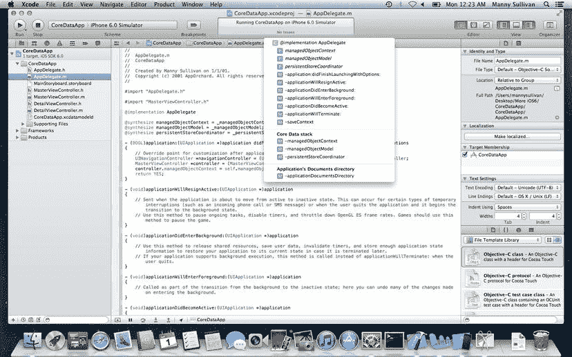

图 2-13.  设置为显示对等文件的编辑器面板，允许你查看声明和实现

该方法应如下所示：

```objective-c
// Returns the managed object model for the application.
// If the model doesn't already exist, it is created from the application's model.
- (NSManagedObjectModel *)managedObjectModel
{
    if (_managedObjectModel != nil) {
        return _managedObjectModel;
    }
    NSURL *modelURL = [[NSBundle mainBundle] URLForResource:@"CoreDataApp"
                                              withExtension:@"momd"];
    _managedObjectModel = [[NSManagedObjectModel alloc] initWithContentsOfURL:modelURL];
    return _managedObjectModel;
}
```


首先检查实例变量`_managedObjectModel`，判断其是否为`nil`。这个访问器方法采用了一种懒加载的形式：底层实例变量只有在首次调用访问器方法时才会真正被实例化。因此，**绝不要**直接访问`_managedObjectModel`（当然，在访问器方法内部除外）。务必始终使用访问器方法，否则你可能会试图调用一个尚未创建的对象的属性和方法。

**提示：** 数据模型类名为`NSManagedObjectModel`，正如你在本章稍后部分会看到的，Core Data 中的数据实例被称为“托管对象”。

如果`_managedObjectModel`为`nil`，你可以去获取你的数据模型。默认情况下，Xcode 应该已为你写好了以下两行代码来实现这一点：

```objc
NSURL *modelURL = [[NSBundle mainBundle] URLForResource:@"CoreDataApp"
                                          withExtension:@"momd"];
_managedObjectModel = [[NSManagedObjectModel alloc] initWithContentsOfURL:modelURL];
```

还记得我们说过一个持久化存储区关联一个单一数据模型吗？这没错，但它并未道出全貌。你可以将多个`.xcdatamodel`文件合并至`NSManagedObjectModel`的单个实例中，创建一个合并了多个文件中所有实体的单一数据模型。如果你计划使用多个模型，可以将那两行代码更改为一行。

这一行代码会获取 Xcode 项目中可能存在的所有`.xcdatamodel`文件，并将它们合并到一个`NSManagedObjectModel`的单一实例中：

```objc
_managedObjectModel = [NSManagedObjectModel mergedModelFromBundles:nil];
```

因此，举例来说，如果你创建了第二个数据模型文件并将其添加到项目中，那么该新文件将与`CoreDataApp.xcdatamodel`合并成一个托管对象模型，其中包含两个文件的内容。这使你可以将应用程序的数据模型拆分成多个更小、更易于管理的文件。

绝大多数使用 Core Data 的 iOS 应用程序只有一个持久化存储区和一个数据模型，因此默认的模板代码在大多数情况下都能完美工作。话虽如此，Core Data 确实支持使用多个持久化存储区。例如，你可以设计你的应用程序，将其部分数据存储在 SQLite 持久化存储区中，而另一部分数据存储在二进制平面文件中。如果你发现需要使用多个数据模型，请记得将模板代码改为使用`mergedModelFromBundles:`单独加载托管对象模型。

#### 持久化存储区与持久化存储协调器

持久化存储区（有时也称为后端存储）是 Core Data 存储数据的地方。默认情况下，在 iOS 设备上，Core Data 使用位于应用程序 Documents 文件夹中的一个 SQLite 数据库作为其持久化存储区。但这可以通过微调一行代码来更改，而不会影响你编写的任何其他代码。稍后我们将向你展示实际需要修改的代码行。

**警告：** 一旦你将应用程序发布到 App Store，请不要更改持久化存储区的类型。如果你因任何原因必须更改，则需要编写代码将数据从旧持久化存储区迁移到新存储区，否则你的用户将丢失所有数据——这几乎总会让他们非常不满。

每个持久化存储区都与一个单一数据模型相关联，该模型定义了持久化存储区可以存储的数据类型。

持久化存储区实际上并不由 Objective-C 类直接表示。相反，一个名为`NSPersistentStoreCoordinator`的类控制着对持久化存储区的访问。本质上，它接收来自不同类的、触发对持久化存储区进行读写的所有调用，并将它们序列化，从而避免同时对同一文件进行多个调用（这可能会因文件或数据库锁定而导致问题）。

与托管对象模型的情况一样，模板在应用程序委托中为你提供了一个方法，用于创建并返回一个持久化存储协调器的实例。除了创建存储区并将其与数据模型和磁盘上的位置关联起来之外（模板中已为你完成），你很少需要直接与持久化存储协调器交互。你将使用高级别 Core Data 调用，而 Core Data 会与持久化存储协调器交互以检索或保存数据。

让我们来看一下返回持久化存储协调器的方法。在`CoreDataAppDelegate.m`中，从函数弹出菜单中选择`-persistentStoreCoordinator`。该方法的代码如下：

```objc
// Returns the persistent store coordinator for the application.
// If the coordinator doesn't already exist, it is created and the application's store added to it.
- (NSPersistentStoreCoordinator *)persistentStoreCoordinator
{
    if (_persistentStoreCoordinator != nil) {
        return _persistentStoreCoordinator;
    }
    NSURL *storeURL = [[self applicationDocumentsDirectory]
          URLByAppendingPathComponent:@"CoreDataApp.sqlite"];
    NSError *error = nil;
    _persistentStoreCoordinator = [[NSPersistentStoreCoordinator alloc]
                                          initWithManagedObjectModel:[self managedObjectModel]];
    if (![_persistentStoreCoordinator addPersistentStoreWithType:NSSQLiteStoreType
                                           configuration:nil
                                                     URL:storeURL
                                                 options:nil
                                                   error:&error]) {
        /*
         Replace this implementation with code to handle the error appropriately.
         abort() causes the application to generate a crash log and terminate. You should not use
         this function in a shipping application, although it may be useful during development.
         Typical reasons for an error here include:
         * The persistent store is not accessible;
         * The schema for the persistent store is incompatible with current managed object model.
         Check the error message to determine what the actual problem was.
         If the persistent store is not accessible, there is typically something wrong with the file
         path. Often, a file URL is pointing into the application's resources directory instead of a
         writeable directory.
         If you encounter schema incompatibility errors during development, you can reduce their
             frequency by:
         * Simply deleting the existing store:
         [[NSFileManager defaultManager] removeItemAtURL:storeURL error:nil]
         * Performing automatic lightweight migration by passing the following dictionary as the
             options parameter:
         @{NSMigratePersistentStoresAutomaticallyOption:@YES,
                    NSInferMappingModelAutomaticallyOption:@YES}
         Lightweight migration will only work for a limited set of schema changes; consult "Core Data
         Model Versioning and Data Migration Programming Guide" for details.
         */
        NSLog(@"Unresolved error %@, %@", error, [error userInfo]);
        abort();
    }
    return _persistentStoreCoordinator;
}
```


与管理对象模型类似，这个 `persistentStoreCoordinator` 访问器方法采用了懒加载方式，在首次访问之前不会实例化持久化存储协调器。然后，它会在应用程序沙盒的 `Documents` 目录中创建一个名为 `CoreDataApp.sqlite` 的文件路径。模板总会根据你的项目名称创建文件名。如果你想使用不同的名称，可以在这里更改，不过文件叫什么名字通常无关紧要，因为用户永远不会看到它。

**警告** 如果你决定更改文件名，请确保在将应用程序发布到 App Store 之后不要再更改它，否则未来的更新将导致你的用户丢失所有数据。

请看下面这行代码：

```
if (![_persistentStoreCoordinator addPersistentStoreWithType:NSSQLiteStoreType
                                 configuration:nil
                                 URL:storeURL
                                 options:nil
                                 error:&error]) {
```

该方法的第一个参数 `NSSQLiteStoreType` 决定了持久化存储的类型。`NSSQLiteStoreType` 是一个常量，它告诉 Core Data 使用 SQLite 数据库作为其持久化存储。如果你希望应用程序使用单一的二进制平面文件而非 SQLite 数据库，可以指定常量 `NSBinaryStoreType` 来代替 `NSSQLiteStoreType`。绝大多数情况下，默认设置是最佳选择，因此除非你有令人信服的理由去更改它，否则请保持原样。

**注意** Core Data 在 iOS 设备上支持的第三种持久化存储类型称为内存存储。此选项的主要用途是创建缓存机制，将数据存储在内存中，而非数据库或二进制文件中。要使用内存存储，请指定存储类型为 `NSInMemoryStoreType`。

#### 回顾数据模型

在继续学习 Core Data 的其他部分之前，让我们快速回顾一下目前所掌握的各个部分是如何协同工作的。你可能需要重新参考 图 2-7。

持久化存储（或备份存储）是 iOS 设备文件系统上的一个文件，它可以是 SQLite 数据库或二进制平面文件。一个数据模型文件，包含在一个或多个扩展名为 `.xcdatamodel` 的文件中，描述了应用程序数据的结构。这个文件可以在 Xcode 中进行编辑。数据模型告诉持久化存储协调器该持久化存储中所有数据的格式。持久化存储协调器被其他需要保存、检索或搜索数据的 Core Data 类所使用。很容易理解，对吧？让我们继续。

#### 管理对象

实体定义了数据的结构，但它们本身并不实际持有任何数据。数据的实例被称为管理对象。你在 Core Data 中操作的每个实体实例都将是 `NSManagedObject` 类或其子类的一个实例。

##### 键值编码

`NSDictionary` 类允许你将对象存储在一个数据结构中，并使用唯一键来检索对象。与 `NSDictionary` 类类似，`NSManagedObject` 支持键值方法 `valueForKey:` 和 `setValue:forKey:` 来设置和检索属性值。它还有一些用于处理关系的额外方法。例如，你可以检索一个代表特定关系的 `NSMutableSet` 实例。向这个可变集合中添加管理对象或从中移除它们，将相应地在其所代表的关系中添加或移除对象。

如果你对 `NSDictionary` 类还不熟悉，花几分钟启动 Xcode 并在文档查看器中阅读关于 `NSDictionary` 的内容。你需要理解的重要概念是键值编码，即 KVC。Core Data 使用 KVC 从其管理对象中存储和检索数据。

在你的模板应用程序中，考虑一个代表单个事件的 `NSManagedObject` 实例。你可以通过调用 `valueForKey:` 来检索其 `timeStamp` 属性中存储的值，如下所示：

```
NSDate *timeStamp = [managedObject valueForKey:@"timeStamp"];
```

由于 `timeStamp` 是一个日期类型的属性，因此你知道 `valueForKey:` 返回的对象将是 `NSDate` 的一个实例。类似地，你可以使用 `setValue:ForKey:` 来设置值。以下代码会将 `managedObject` 的 `timeStamp` 属性设置为当前日期和时间：

```
[managedObject setValue:[NSDate date] forKey:@"timeStamp"];
```

KVC 还包含了键路径的概念。键路径允许你使用单个字符串遍历对象层次结构。因此，例如，如果你的 `Employee` 实体上有一个名为 `whereIWork` 的关系，指向一个名为 `Employer` 的实体，并且 `Employer` 实体有一个名为 `name` 的属性，那么你可以从 `Employee` 的实例中通过键路径获取存储在 `name` 中的值，如下所示：

```
NSString *employerName = [managedObject valueForKeyPath:@"whereIWork.name"];
```

请注意，你使用的是 `valueForKeyPath:` 而不是 `valueForKey:`，并且为键路径提供了一个用点分隔的值。KVC 使用点来解析该字符串，因此在这个例子中，它会将其解析为两个独立的值：`whereIWork` 和 `name`。它首先在自身对象上使用第一个值 (`whereIWork`)，并检索与该键对应的对象。然后，它取键路径中的下一个值 (`name`)，并从之前调用返回的对象中检索存储在该键下的对象。由于 `Employer` 是一个对一关系，键路径的第一部分将返回一个表示该员工雇主的管理对象实例。然后，键路径的第二部分将用于从代表 `Employer` 的管理对象中检索 `name`。

**注意** 如果你在 Cocoa 中使用过绑定，你可能已经熟悉了 KVC 和键路径。如果没有，也别担心——它们很快就会成为你的第二天性。键路径实际上是非常直观的。

##### 管理对象上下文

Core Data 维护着一个对象，它充当着你的实体与 Core Data 其余部分之间的网关。这个网关被称为管理对象上下文（通常简称为上下文）。上下文为你已加载或创建的所有管理对象维护着状态。上下文跟踪自上次保存或加载管理对象以来所做的更改。例如，当你想加载或搜索对象时，你是针对一个上下文来操作的。当你希望将更改提交到持久化存储时，你要保存该上下文。如果你想撤销对管理对象的更改，只需请求管理对象上下文执行撤销操作。（是的，它甚至处理实现数据模型撤销和重做所需的所有工作。）

在构建 iOS 应用程序时，绝大多数情况下你只会有一个单一的上下文。然而，iOS 使得拥有多个上下文变得很容易。你可以创建嵌套的管理对象上下文，其中上下文的父对象存储是另一个管理对象上下文，而不是持久化存储协调器。

在这种情况下，获取和保存操作由父上下文而非协调器来协调。你可以设想许多使用场景，包括在第二个线程或队列上执行后台操作，以及管理来自检查器窗口或视图的可放弃编辑操作。有一点需要提醒：嵌套上下文使得采用“传递接力棒”的方式来访问上下文（通过将上下文从一个视图控制器传递到下一个）比以往任何时候都更加重要，而不是直接从应用程序委托中检索它。


### Core Data 基本概念

因为每个应用都需要至少一个托管对象上下文才能正常工作，模板已经非常贴心地为你提供了一个。再次点击`AppDelegate.m`，在编辑器的跳转栏（Jump Bar）中选择“函数”菜单下的`-managedObjectContext`。你将看到一个类似这样的方法：

```
// Returns the managed object context for the application.
// If the context doesn't already exist, it is created and bound to the persistent store coordinator for the application.
- (NSManagedObjectContext *)managedObjectContext
{
    if (_managedObjectContext != nil) {
        return _managedObjectContext;
    }
    NSPersistentStoreCoordinator *coordinator = [self persistentStoreCoordinator];
    if (coordinator != nil) {
        _managedObjectContext = [[NSManagedObjectContext alloc] init];
        [_managedObjectContext setPersistentStoreCoordinator:coordinator];
    }
    return _managedObjectContext;
}
```

这个方法实际上非常直观。它采用懒加载的方式，先检查`_managedObjectContext`是否为`nil`。如果不为`nil`，则直接返回其值。如果`managedObjectContext`为`nil`，则检查`NSPersistentStoreCoordinator`是否存在。如果存在，就创建一个新的`_managedObjectContext`，然后使用`setPersistentStoreCoordinator:`将当前的协调器绑定到`managedObjectContext`。完成后，返回`_managedObjectContext`。

**注意**：托管对象上下文并不直接与持久化存储交互；它们通过一个持久化存储协调器来工作。因此，每个托管对象上下文都需要获得一个指向持久化存储协调器的指针才能正常运行。不过，多个托管对象上下文可以共享同一个持久化存储协调器。

### 在终止时保存

在应用委托（application delegate）中向上滚动，找到另一个名为`applicationWillTerminate:`的方法，该方法会将上下文的更改（如果有的话）保存到持久化存储中。顾名思义，这个方法会在应用即将退出时被调用。

```
- (void)applicationWillTerminate:(UIApplication *)application
{
    // Saves changes in the application's managed object context before the application
    // terminates.
    [self saveContext];
}
```

这是一个很不错的功能，但有时你可能不希望保存数据。例如，如果用户在创建一个新实体后、但在为该实体输入任何数据之前退出了应用，该怎么办？在这种情况下，你真的需要将那个空的托管对象保存到持久化存储中吗？可能不需要。在接下来的几章中，你将学习如何处理类似的情况。

### 从持久化存储加载数据

运行你之前构建的 Core Data 应用，按几次加号按钮（参见图 2-6）。退出模拟器，然后再次运行应用。注意，之前运行产生的时间戳已被保存到持久化存储中，并在本次运行时被加载回来。

点击`MasterViewController.m`，看看这是如何实现的。正如你从文件名可以推测的那样，`MasterViewController`是充当应用主视图控制器的视图控制器类。这就是你在图 2-6 中看到的视图所对应的视图控制器。

点击文件名后，你可以使用编辑器的跳转栏中的“函数”菜单找到`viewDidLoad:`方法，不过它很可能已经显示在屏幕上了，因为它是该类中的第一个方法。该方法的默认实现如下：

```
- (void)viewDidLoad
{
    [super viewDidLoad];
    // Do any additional setup after loading the view, typically from a nib.
    self.navigationItem.leftBarButtonItem = self.editButtonItem;
    UIBarButtonItem *addButton =     [[UIBarButtonItem alloc] initWithBarButtonSystemItem:UIBarButtonSystemItemAdd                                                     target:self                                                     action:@selector(insertNewObject:)];
    self.navigationItem.rightBarButtonItem = addButton;
}
```

该方法首先调用父类方法。接着，它设置了“编辑”（Edit）和“添加”（Add）按钮。请注意，`MasterViewController`继承自`UITableViewController`，而`UITableViewController`又继承自`UIViewController`。`UIViewController`提供了一个名为`editButtonItem`的属性，它会返回一个“编辑”按钮。通过点语法，你获取`editButtonItem`并将其传递给`navigationItem`属性的`leftBarButtonItem`属性。这样，“编辑”按钮就成为了导航栏左侧的按钮。

现在我们来关注一下“添加”按钮。由于`UIViewController`没有提供“添加”按钮，因此使用`alloc`从头创建了一个，然后将其设置为导航栏右侧的按钮。代码相当直接：

```
UIBarButtonItem *addButton =     [[UIBarButtonItem alloc] initWithBarButtonSystemItem:UIBarButtonSystemItemAdd
                                                  target:self
                                                  action:@selector(insertNewObject:)];
self.navigationItem.rightBarButtonItem = addButton;
```

至此，基本的用户界面已经搭建完成，接下来我们看看获取结果控制器（Fetched Results Controller）是如何工作的。

### 获取结果控制器

从概念上讲，获取结果控制器与你在 iOS SDK 中见过的其他通用控制器有些不同。如果你使用过 Cocoa 绑定以及 Mac 上可用的通用控制器类（例如`NSArrayController`），那么你已经对这个基本概念很熟悉了。如果你不熟悉这些通用控制器类，那么可能需要进行一些解释。

iOS SDK 中的大部分通用控制器类（例如`UINavigationController`、`UITableViewController`和`UIViewController`）都被设计为特定类型视图的控制器。然而，视图控制器并不是 Cocoa Touch 提供的唯一控制器类型，尽管它们是最常见的。`NSFetchedResultsController`就是一个非视图控制器的控制器类示例。

`NSFetchedResultsController`被设计来处理一项非常具体的工作：管理从 Core Data 获取请求中返回的对象。`NSFetchedResultsController`使得从 Core Data 显示数据比通常情况更简单，因为它为你处理了许多任务。例如，当收到内存警告时，它会从内存中清除任何不需要的对象，并在再次需要时重新加载它们。如果你为获取结果控制器指定了一个委托，那么当其底层数据发生某些更改时，你的委托将会收到通知。

#### 创建获取结果控制器

你首先创建一个获取请求，然后使用该获取请求来创建一个获取结果控制器。在模板中，这是在`MasterViewController.m`的`fetchedResultsController`方法中完成的。`fetchedResultsController`首先通过懒加载检查是否已经存在一个活跃的实例化`_fetchedResultsController`。如果不存在（解析为`nil`），则开始创建一个新的获取请求。获取请求本质上是一个规范，它列出了要获取的数据的详细信息。你需要告诉获取请求要获取哪个实体。此外，你还需要向获取请求添加一个排序描述符。排序描述符决定了数据的组织顺序。


```markdown

一旦 `fetch` 请求被适当定义后，就会创建 `fetched results controller`。`fetched results controller` 是 `NSFetchedResultsController` 类的一个实例。请记住，`fetched results controller` 的工作是使用 `fetch` 请求使其关联的数据尽可能保持最新。

一旦创建了 `fetched results controller`，你就可以执行初始的 `fetch` 操作。你在 `MasterViewController.m` 中 `fetchedResultsController` 方法的末尾，通过向 `fetched results controller` 发送 `performFetch:` 消息来完成此操作。

现在你已经有了数据，就可以作为数据源和委托来服务于你的 `table view`。当你的 `table view` 需要获取其表的 `section` 数量时，它会调用 `numberOfSectionsInTableView:`。在你的版本中，你通过向 `fetchedResultsController` 传递适当的消息来获取 `section` 信息。以下是来自 `MasterViewController.m` 的版本：

```
- (NSInteger)numberOfSectionsInTableView:(UITableView *)tableView
{
    return [[self.fetchedResultsController sections] count];
}
```

同样的策略也适用于 `tableView:numberOfRowsInSection:`：

```
- (NSInteger)tableView:(UITableView *)tableView numberOfRowsInSection:(NSInteger)section
{
    id <NSFetchedResultsSectionInfo> sectionInfo = [[self.fetchedResultsController sections] objectAtIndex:section];
    return [sectionInfo numberOfObjects];
}
```

你懂了吧。以前你所有的工作都需要自己完成。现在你可以要求你的 `fetched results controller` 为你完成所有的数据管理工作。这真是一个惊人的省时利器！

让我们更仔细地看看 `fetched results controller` 的创建过程。在 `MasterViewController.m` 中，使用函数菜单跳转到 `-fetchedResultsController` 方法。它应该看起来像这样：

```
- (NSFetchedResultsController *)fetchedResultsController
{
    if (_fetchedResultsController != nil) {
        return _fetchedResultsController;
    }
    NSFetchRequest *fetchRequest = [[NSFetchRequest alloc] init];
    // Edit the entity name as appropriate.
    NSEntityDescription *entity = [NSEntityDescription entityForName:@"Event"
                        inManagedObjectContext:self.managedObjectContext];
    [fetchRequest setEntity:entity];
    // Set the batch size to a suitable number.
    [fetchRequest setFetchBatchSize:20];
    // Edit the sort key as appropriate.
    NSSortDescriptor *sortDescriptor = [[NSSortDescriptor alloc] initWithKey:@"timeStamp"
                                                                ascending:NO];
    NSArray *sortDescriptors = @[sortDescriptor];
    [fetchRequest setSortDescriptors:sortDescriptors];
    // Edit the section name key path and cache name if appropriate.
    // nil for section name key path means "no sections".
    NSFetchedResultsController *aFetchedResultsController = [[NSFetchedResultsController alloc]
                   initWithFetchRequest:fetchRequest
                   managedObjectContext:self.managedObjectContext
                   sectionNameKeyPath:nil cacheName:@"Master"];
    aFetchedResultsController.delegate = self;
    self.fetchedResultsController = aFetchedResultsController;
    NSError *error = nil;
    if (![self.fetchedResultsController performFetch:&error]) {
        // Replace this implementation with code to handle the error appropriately.
        // abort() causes the application to generate a crash log and terminate. You should
        // not use this function in a shipping application, although it may be useful during
        // development.
        NSLog(@"Unresolved error %@, %@", error, [error userInfo]);
        abort();
    }
    return _fetchedResultsController;
}
```

如前所述，此方法使用了懒加载。它做的第一件事就是检查 `_fetchedResultsController` 是否为 `nil`。如果 `_fetchedResultsController` 已经存在，则直接返回它；否则，开始创建新的 `fetchedResultsController` 的过程。

作为第一步，你需要创建一个 `NSFetchRequest` 和一个 `NSEntityDescription`，然后将 `NSEntityDescription` 附加到 `NSFetchRequest` 上。

```
NSFetchRequest *fetchRequest = [[NSFetchRequest alloc] init];
// Edit the entity name as appropriate.
NSEntityDescription *entity = [NSEntityDescription entityForName:@"Event"                                    inManagedObjectContext:self.managedObjectContext];
[fetchRequest setEntity:entity];
```

请记住，你正在构建一个 `fetched results controller`，而 `fetch` 请求是其一部分。接下来，将批量大小设置为 20。这告诉 `Core Data`，此 `fetch` 请求每次应检索 20 个结果。这有点像文件系统的块大小。

```
// Set the batch size to a suitable number.
[fetchRequest setFetchBatchSize:20];
```

接下来，构建一个 `NSSortDescriptor`，并指定它使用 `timeStamp` 作为键，按降序排列时间戳（较早的日期排在后面）。

```
// Edit the sort key as appropriate.
NSSortDescriptor *sortDescriptor = [[NSSortDescriptor alloc] initWithKey:@"timeStamp" ascending:NO];
```

现在你创建一个排序描述符数组。由于你将只使用一个，你传入 `sortDescriptor`，并后面跟 `nil`，让 `initWithObjects` 知道数组中只有一个元素。（请注意，模板也可以使用 `initWithObject` 代替）。

```
NSArray *sortDescriptors = @[sortDescriptor];
[fetchRequest setSortDescriptors:sortDescriptors];
```

试试这个实验：将 `ascending:NO` 改为 `ascending:YES` 并再次运行应用程序。你认为会发生什么？完成后别忘了改回来。

**提示** 如果你需要将 `fetch` 请求限制为持久化存储中托管对象的子集，请使用谓词。在 *Learn Objective-C on the Mac, 2*^*nd* Edition by Mark Dalrymple, Scott Knaster, and Waqar Malik (Apress, 2012) 中有一整章专门介绍谓词。默认模板不使用谓词，但你将在接下来的几章中与它们打交道。

现在，你使用你的 `fetch` 请求和上下文创建一个 `NSFetchedResultsController`。你将在 第 3 章 中了解第三个和第四个参数，`sectionNameKeyPath` 和 `cacheName`。

```
// Edit the section name key path and cache name if appropriate.
// nil for section name key path means "no sections".
NSFetchedResultsController *aFetchedResultsController =     [[NSFetchedResultsController alloc] initWithFetchRequest:fetchRequest
                                         managedObjectContext:self.managedObjectContext
                                           sectionNameKeyPath:nil
                                                    cacheName:@"Master"];
```

接下来，你将 `self` 设置为委托，并将 `fetchedResultsController` 设置为你刚刚创建的 `fetched results controller`。

```
aFetchedResultsController.delegate = self;
self.fetchedResultsController = aFetchedResultsController;
```

最后，你执行 `fetch` 操作，如果没有错误，你将结果赋值给你的私有实例变量 `_fetchedResultsController` 并返回结果。

```
NSError *error = nil;
if (![self.fetchedResultsController performFetch:&error]) {
    // Replace this implementation with code to handle the error appropriately.
    // abort() causes the application to generate a crash log and terminate. You should not use this
    // function in a shipping application, although it may be useful during development.
    NSLog(@"Unresolved error %@, %@", error, [error userInfo]);
    abort();
}
return _fetchedResultsController;
```

不要太担心这里的细节。试着把握大局。当你读完接下来的几章后，细节就会变得清晰起来。

### Fetched Results Controller 的委托方法

```

```markdown

`NSFetchedResultsController` 必须有一个委托（delegate），并且该委托必须提供四个方法，这些方法将在后续页面中描述。这四个方法在 `NSFetchedResultsControllerDelegate` 协议中定义。`NSFetchedResultsController` 会监控其 `NSManagedObjectContext`，并在上下文发生更改时调用其委托方法。

#### `controllerWillChangeContent:` 委托方法

当 `NSFetchedResultsController` 观察到影响自身的更改时（例如，它管理的对象被删除或修改，或者插入了符合其获取请求条件的新对象），它会在做出任何更改之前，通过 `controllerWillChangeContent:` 方法通知其委托。

在绝大多数情况下，`NSFetchedResultsController` 会与表视图（`UITableView`）一起使用，您在此委托方法中需要做的全部工作就是告知表视图：即将进行的更新可能会影响其显示内容。以下是确保这一点实现的代码：

```objc
- (void)controllerWillChangeContent:(NSFetchedResultsController *)controller
{
    [self.tableView beginUpdates];
}
```

#### `controllerDidChangeContent:` 委托方法

当 `NSFetchedResultsController` 完成更改后，它会通过 `controllerDidChangeContent:` 方法通知其委托。此时，如果您正在使用表视图（几乎总是如此），则需要告知表视图：您在 `controllerWillChangeContent:` 中告知它即将到来的更新现已完成。处理方式如下：

```objc
- (void)controllerDidChangeContent:(NSFetchedResultsController *)controller
{
    [self.tableView endUpdates];
}
```

#### `controller:didChangeObject:atIndexPath:forChangeType:newIndexPath:` 委托方法

当 `NSFetchedResultsController` 注意到某个特定对象发生更改时，它会通过 `controller:didChangeObject:atIndexPath:forChangeType:newIndexPath:` 方法通知其委托。您需要在此方法中处理表视图行的更新、插入、删除或移动，以反映 `NSFetchedResultsController` 所管理对象的更改。以下是委托方法的模板实现，它将为您处理表视图的更新：

```objc
- (void)controller:(NSFetchedResultsController *)controller didChangeObject:(id)anObject
       atIndexPath:(NSIndexPath *)indexPath forChangeType:(NSFetchedResultsChangeType)type
      newIndexPath:(NSIndexPath *)newIndexPath
{
    UITableView *tableView = self.tableView;
    switch(type) {
        case NSFetchedResultsChangeInsert:
            [tableView insertRowsAtIndexPaths:@[newIndexPath]
             withRowAnimation:UITableViewRowAnimationFade];
            break;
        case NSFetchedResultsChangeDelete:
            [tableView deleteRowsAtIndexPaths:@[indexPath]
             withRowAnimation:UITableViewRowAnimationFade];
            break;
        case NSFetchedResultsChangeUpdate:
            [self configureCell:[tableView cellForRowAtIndexPath:indexPath] atIndexPath:indexPath];
            break;
        case NSFetchedResultsChangeMove:
            [tableView deleteRowsAtIndexPaths:@[indexPath]
             withRowAnimation:UITableViewRowAnimationFade];
            [tableView insertRowsAtIndexPaths:@[newIndexPath]
             withRowAnimation:UITableViewRowAnimationFade];
            break;
    }
}
```

这段代码大部分都很直接。如果插入了一行，您会收到 `NSFetchedResultsChangeInsert` 类型，然后在表中插入一个新行。如果删除了一行，您会收到 `NSFetchedResultsChangeDelete` 类型，然后删除表中对应的行。当您收到 `NSFetchedResultsChangeUpdate` 类型时，表示一个对象被修改了，代码会调用 `configureCell:` 来确保您看到的是正确的数据。如果收到了 `NSFetchedResultsChangeMove` 类型，则表示某行被移动了，因此您需要从旧位置删除它，并将其插入到 `newIndexPath` 指定的新位置。

#### `controller:didChangeSection:atIndex:forChangeType:` 委托方法

最后，如果对象更改影响了表中的分区数量，`NSFetchedResultsController` 会调用 `controller:didChangeSection:atIndex:forChangeType:` 委托方法。如果在创建 `NSFetchedResultsController` 时指定了 `sectionNameKeyPath`，您就需要实现此委托方法，以根据需要添加和删除表中的分区。如果不这样做，当表中的分区数量与 `NSFetchedResultsController` 中的分区数量不匹配时，您将遇到运行时错误。以下是该委托方法的标准模板实现，适用于大多数情况：

```objc
- (void)controller:(NSFetchedResultsController *)controller
 didChangeSection:(id <NSFetchedResultsSectionInfo>)sectionInfo
 atIndex:(NSUInteger)sectionIndex
 forChangeType:(NSFetchedResultsChangeType)type
{
    switch(type) {
        case NSFetchedResultsChangeInsert:
            [self.tableView insertSections:[NSIndexSet indexSetWithIndex:sectionIndex]
              withRowAnimation:UITableViewRowAnimationFade];
            break;
        case NSFetchedResultsChangeDelete:
            [self.tableView deleteSections:[NSIndexSet indexSetWithIndex:sectionIndex]
              withRowAnimation:UITableViewRowAnimationFade];
            break;
    }
}
```

使用这四个委托方法，当您添加一个新的托管对象时，`NSFetchedResultsController` 会检测到这一变化，您的表视图将自动更新。如果您删除或修改了一个对象，控制器同样会检测到。任何影响 `NSFetchedResultsController` 的更改都会自动触发表视图的相应更新，包括流畅的动画效果。这意味着您无需在代码中到处调用 `reloadData`，只需在每次做出可能影响数据集的更改时，由控制器自动处理。非常方便！

#### 从 `NSFetchedResultsController` 中检索托管对象

您的表视图委托方法变得更短、更直接，因为 `NSFetchedResultsController` 完成了您之前在那些方法中完成的许多工作。例如，要检索与特定单元格对应的对象（这在 `tableView:cellForRowAtIndexPath:` 和 `tableView:didSelectRowAtIndexPath:` 中经常需要），您只需在 `NSFetchedResultsController` 上调用 `objectAtIndexPath:` 并传入 `indexPath` 参数，它就会返回正确的对象。

```objc
NSManagedObject *object = [[self fetchedResultsController] objectAtIndexPath:indexPath];
```

#### 创建并插入新的托管对象

从编辑器窗格的函数菜单中选择 `insertNewObject`，这是在示例应用程序中按下“+”按钮时调用的方法。这是一个很好的简单示例，展示了如何创建新的托管对象、将其插入到 `NSManagedObjectContext` 中，然后保存到持久化存储中。

```

好的，作为一名高级文档工程师和翻译员，我将严格按照您的要求，对给定的英文文本进行翻译。


```objc
- (void)insertNewObject:(id)sender
{
    NSManagedObjectContext *context = [self.fetchedResultsController managedObjectContext];
    NSEntityDescription *entity = [[self.fetchedResultsController fetchRequest] entity];
    NSManagedObject *newManagedObject =         [NSEntityDescription insertNewObjectForEntityForName:[entity name]                                       inManagedObjectContext:context];
    // 如果合适，配置这个新托管对象。
    // 通常你应该使用访问器方法，但这里使用 KVC 可以避免需要向模板添加自定义类。
    [newManagedObject setValue:[NSDate date] forKey:@"timeStamp"];
    // 保存上下文。
    NSError *error = nil;
    if (![context save:&error]) {
         // 用处理错误的代码替换此实现。
         // abort() 会导致应用程序生成崩溃日志并终止。         // 你不应该在正式发布的应用中使用此函数，          // 尽管它在开发过程中可能有用。
        NSLog(@"Unresolved error %@, %@", error, [error userInfo]);
        abort();
    }
}
```

请注意，代码做的第一件事就是从获取结果控制器中检索托管对象上下文。在这个只有一个上下文的简单示例中，你也可以从应用委托中检索到同一个上下文。默认代码使用获取结果控制器的上下文有几个原因。首先，你已经有了一个返回获取结果控制器的方法，所以你只需一行代码就能获取到上下文。

```objc
NSManagedObjectContext *context = [self.fetchedResultsController managedObjectContext];
```

不过，更重要的是，获取结果控制器始终知道其托管对象包含在哪个上下文中，因此，即使你决定创建一个具有多个上下文的应用，如果你从获取结果控制器中获取上下文，也能确保你使用的是正确的上下文。

就像创建获取请求时一样，在插入新对象时，你需要创建一个实体描述，来告诉 Core Data 你想要创建哪种类型的实体实例。获取结果控制器也知道它管理的对象是什么实体，因此你可以直接向它询问这些信息。

```objc
NSEntityDescription *entity = [[self.fetchedResultsController fetchRequest] entity];
```

然后，只需在 `NSEntityDescription` 上使用一个类方法来创建新对象并将其插入到上下文中。

```objc
NSManagedObject *newManagedObject =     [NSEntityDescription insertNewObjectForEntityForName:[entity name]                                   inManagedObjectContext:context];
```

在 `NSEntityDescription` 上使用类方法，而不是在你想插入新对象的上下文上使用实例方法，这看起来确实有点奇怪，但这就是实现的方式。

尽管这个托管对象现在已插入到上下文中，但它仍然存在于持久化存储区。为了将其从持久化存储区永久保存，你**必须**保存上下文，这正是该方法接下来要做的：

```objc
// 保存上下文。
NSError *error = nil;
if (![context save:&error]) {
    // 用处理错误的代码替换此实现。
    // abort() 会导致应用程序生成崩溃日志并终止。     // 你不应该在正式发布的应用中使用此函数，     // 尽管它在开发过程中可能有用。
    NSLog(@"Unresolved error %@, %@", error, [error userInfo]);
    abort();
}
```

正如注释所说，你需要更恰当地处理错误，而不是调用 `abort`。我们将在后续章节中更详细地讨论这一点。另外，请注意，你没有在表视图上调用 `reloadData`。获取结果控制器会意识到你插入了一个符合其条件的新对象，并将调用委托方法，该方法会自动重新加载表格。

### 删除托管对象

使用获取结果控制器时，删除托管对象非常简单。使用函数菜单导航到名为 `tableView:commitEditingStyle:forRowAtIndexPath:` 的方法。该方法应如下所示：

```objc
- (void)tableView:(UITableView *)tableView         commitEditingStyle:(UITableViewCellEditingStyle)editingStyle         forRowAtIndexPath:(NSIndexPath *)indexPath
{
    if (editingStyle == UITableViewCellEditingStyleDelete) {
        NSManagedObjectContext *context = [self.fetchedResultsController managedObjectContext];
        [context deleteObject:[self.fetchedResultsController objectAtIndexPath:indexPath]];
        NSError *error = nil;
        if (![context save:&error]) {
             // 用处理错误的代码替换此实现。
             // abort() 会导致应用程序生成崩溃日志并终止。              // 你不应该在正式发布的应用中使用此函数，              // 尽管它在开发过程中可能有用。
            NSLog(@"Unresolved error %@, %@", error, [error userInfo]);
            abort();
        }
    }
}
```

该方法首先确保你处于删除操作中（请记住，同样的方法也用于删除和插入操作）。

```objc
if (editingStyle == UITableViewCellEditingStyleDelete) {
```

接下来，你检索上下文。

```objc
NSManagedObjectContext *context = [self.fetchedResultsController managedObjectContext];
```

然后要求上下文删除该对象。

```objc
[context deleteObject:[self.fetchedResultsController objectAtIndexPath:indexPath]];
```

接着，调用托管对象上下文的 `save:` 方法，以使该更改提交到持久化存储区。

```objc
NSError *error = nil;
if (![context save:&error]) {
    // 用处理错误的代码替换此实现。
    // abort() 会导致应用程序生成崩溃日志并终止。你不应该在正式发布的应用中使用此函数，
    // 尽管它在开发过程中可能有用。
    NSLog(@"Unresolved error %@, %@", error, [error userInfo]);
    abort();
}
```

无需再次告诫你关于调用 `abort` 的问题，我们之前已经讨论过了。

这就是删除托管对象的全部内容。

### 将所有内容置于上下文中

至此，你应该已经很好地掌握了使用 Core Data 的基础知识。你已经了解了 Core Data 应用的架构以及使用实体和属性的过程。你已经看到了持久化存储区、托管对象模型和托管对象上下文是如何由你的应用委托创建的。你学会了如何使用数据模型编辑器来构建可在程序中创建托管对象的实体。你还学习了如何从持久化存储区中检索、插入和删除数据。

理论部分已经足够！让我们继续前进，构建一些 Core Data 应用吧，好吗？

