# 第 3 章

## 极佳开端：添加、显示和删除数据

好吧，如果上一章没有把你吓跑，那么你已经准备好深入探索，超越你在第 2 章中探索的基本模板了。

在本章中，你将创建一个旨在跟踪一些超级英雄数据的应用程序。你的应用将从“主-从应用程序”模板开始，尽管从一开始就需要做很多修改。你将使用模型编辑器来设计你的超级英雄实体。然后，你将创建一个派生自 `UIViewController` 的新控制器类，它将允许你添加、显示和删除超级英雄。在第 4 章中，你将进一步扩展你的应用，并添加代码以允许用户编辑她的超级英雄数据。


请参考 Figure 3-1 了解应用运行时的外观。它看起来与模板应用非常相似，主要区别在于应用核心的实体，以及在屏幕底部增加了一个标签栏。让我们开始工作。

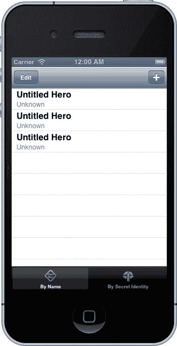

Figure 3-1.  完成本章后`SuperDB`应用的外观

### 设置 Xcode 项目

是时候动手了。如果 Xcode 尚未打开，请启动它，然后调出你的老朋友——新项目助手（Figure 3-2）。

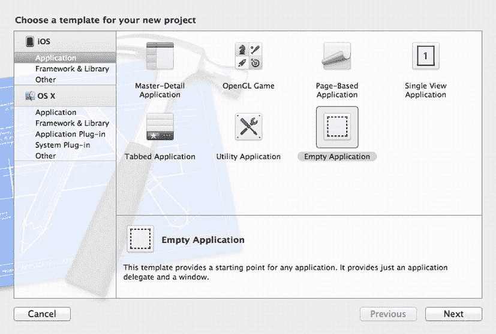

Figure 3-2.  你的老朋友——Xcode 的新项目助手

在上一章中，你从主从应用模板开始。在创建自己的导航应用时，这是一个很好的模板，因为它提供了你在应用中可能需要的许多代码。然而，为了更容易解释在何处添加或修改代码，并加深你对应用构建方式的理解，你将像在《Beginning iOS 6 Development》（David Mark、Jack Nutting 和 Jeff LaMarche 著，Apress 出版）中的大部分章节那样，从头开始构建`SuperDB`应用。

选择`Empty Application`，然后点击`Next`。当提示输入产品名称（Figure 3-3）时，输入`**SuperDB**`。为设备系列选择`iPhone`，并确保选中“Use Core Data”和“Use Automatic Reference Counting”复选框。再次点击`Next`后，使用默认位置保存项目，然后点击`Create`。

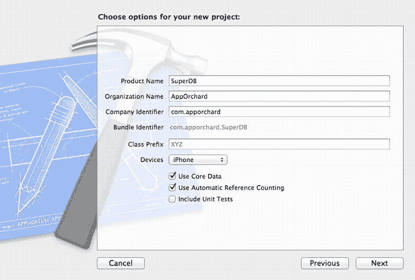

Figure 3-3.  输入项目详细信息

你需要做一些更改来使用故事板。故事板是 iOS 5 中 Xcode 新增的功能。它们使管理用户界面以及界面之间的转场变得更加容易。Xcode 提供了一个可视化编辑器——故事板编辑器，用于辅助用户界面的布局和设计。`Interface Builder` 允许你一次处理一个视图，而故事板允许你处理整个视图集及其行为。默认情况下，`Empty Application` 模板不附带故事板。这很容易修复。

首先，创建一个新的故事板文件。在导航器面板中选择`SuperDB`组，然后创建一个新文件（键入`N`或使用菜单`File  New  File`）。当“New File Assistant”出现时（Figure 3-4），从左侧窗格的 iOS 标题下选择`User Interface`，然后从右侧窗格中选择`Storyboard`，并点击`Next`按钮。在下一个助手屏幕上选择`iPhone`作为设备，然后再次点击`Next`。将文件命名为`**SuperDB.storyboard**`，并将其保存在项目文件夹中（Figure 3-6）。新文件`SuperDB.storyboard`应出现在导航器面板中。

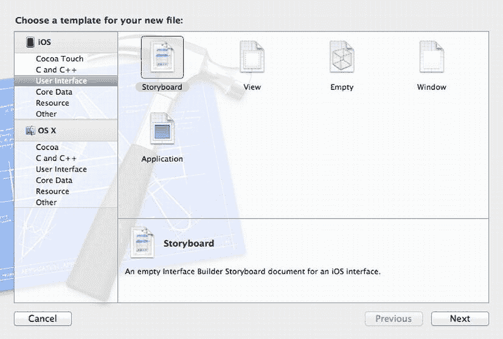

Figure 3-4.  使用 New File Assistant 创建一个新的故事板

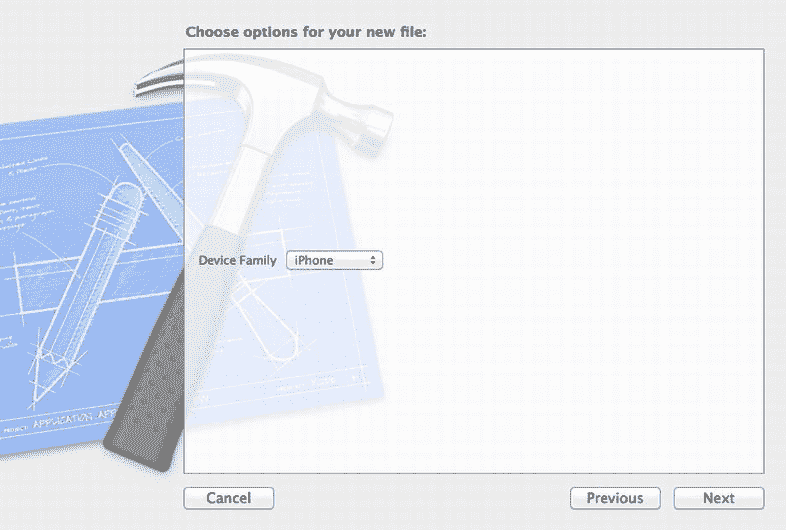

Figure 3-5.  选择`iPhone`设备

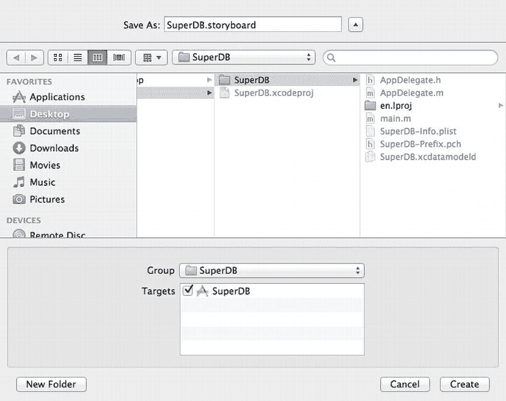

Figure 3-6.  命名故事板并保存

最后，你需要告诉 Xcode 你想使用新的`SuperDB.storyboard`文件。在导航器面板顶部选择`SuperDB`项目。当项目编辑器出现时，选择`SuperDB`目标并进入项目摘要编辑器（Figure 3-7）。在`iPhone/iPod Deployment Info`部分，在`Main Storyboard`字段中输入名称`**SuperDB**`。

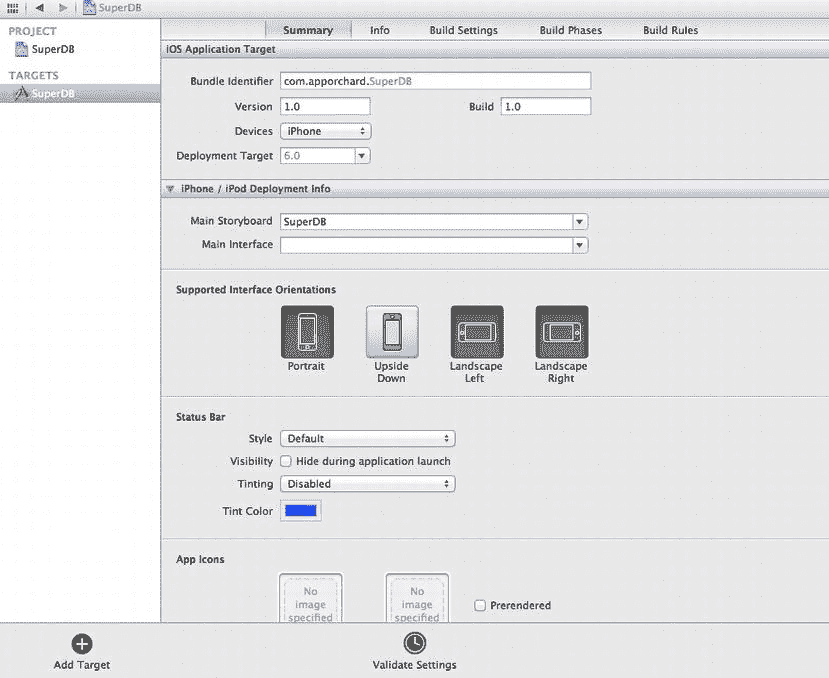

Figure 3-7.  项目编辑器

由于你已经将`SuperDB`配置为使用故事板，因此需要清理应用委托。在导航器面板中选择`AppDelegate.m`。代码编辑器应出现。找到方法：

```
- (BOOL)application:(UIApplication *)application
         didFinishLaunchingWithOptions:(NSDictionary *)launchOptions
```

并将其编辑为：

```
-(BOOL)application:(UIApplication *)application
        didFinishLaunchingWithOptions:(NSDictionary *)launchOptions
{
        return YES;
}
```

现在你需要实际创建故事板。在导航面板中找到并选择`SuperDB.storyboard`。编辑器面板应转换为故事板编辑器（Figure 3-8）。让我们快速回顾一下故事板编辑器。编辑器的内容是一个网格，类似于模型编辑器的图形样式。在故事板编辑器的左下角有一个展开按钮。按钮中的箭头应指向右侧。点击它。

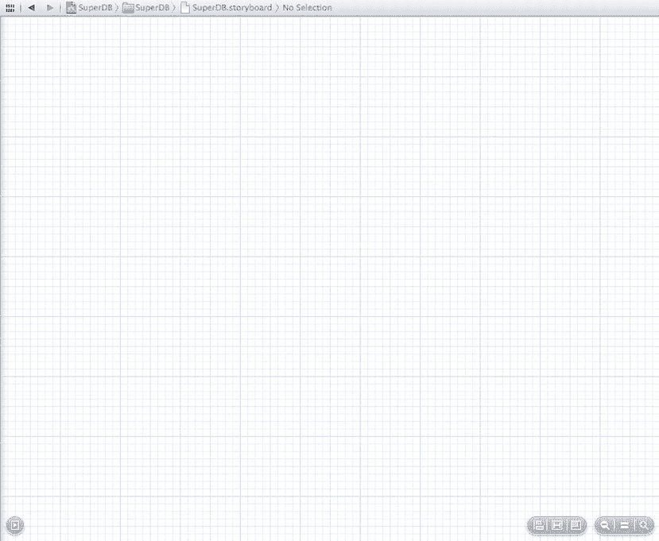

Figure 3-8.  故事板编辑器

故事板文档大纲（Figure 3-9）应出现在故事板编辑器的左侧。目前这个视图是空的，没有场景（稍后我们将定义*场景*）。通常，故事板文档大纲提供场景、其视图控制器、视图和 UI 组件的层次结构视图。

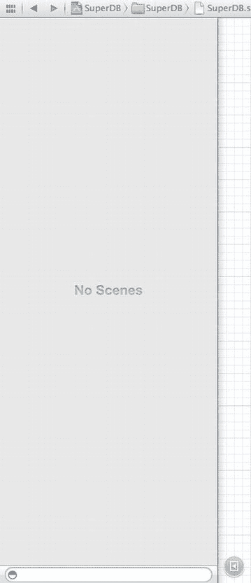

Figure 3-9.  故事板文档大纲和展开按钮

编辑器右下角有一对按钮组（Figure 3-10）。左侧的按钮组用于配置视图的自动布局；我们将在 Chapter 4 中描述它们。右侧的按钮组有三个按钮：`Zoom Out`、`Zoom-to-Fit`和`Zoom In`。它们改变故事板编辑器的缩放级别。


Figure 3-10.  故事板编辑器按钮组

### 添加场景

重置 Xcode 工作区，使故事板编辑器看起来像 Figure 3-8。打开实用工具面板，在对象库（应位于实用工具面板底部）中找到导航控制器。将导航控制器拖到故事板编辑器中。你的故事板编辑器应类似于 Figure 3-11。

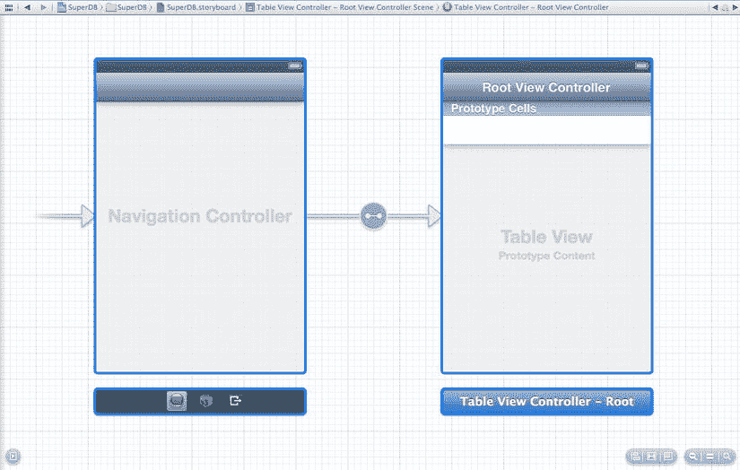

Figure 3-11.  带导航控制器的故事板编辑器

### 场景和 Segues

有趣的是，Xcode 决定除了导航控制器之外，你还想要一个表视图控制器，并已将其设置好。点击右下角的`Zoom-To-Fit`（=）按钮以在故事板编辑器中适配所有内容。你现在看到的是两个场景，分别标记为`Navigation Controller`和`Table View Controller - Root`。两个场景之间是一个`segue`。这是从`Navigation Controller`指向`Table View Controller - Root`的箭头。它中间有一个图标，告诉你这是一个手动`segue`。

一个场景基本上就是一个视图控制器。最左边的场景标记为`Navigation Controller`，最右边的是`Table View Controller - Root`。导航控制器用于管理其他视图控制器。在 Chapter 2 中，导航控制器管理了主视图控制器和详情视图控制器。导航控制器还提供了导航栏，允许你在主视图控制器中编辑和添加事件，并在详情视图控制器中提供返回按钮。


### Segue 定义转场

`A segue` 定义了从一个场景到下一个场景的转场。在第 2 章的应用程序中，当你在主视图控制器中选择一个事件时，就触发了 segue 转场到详细视图控制器。

但是导航控制器左侧的箭头呢？它只是告诉你导航控制器是这个故事板的根视图控制器。

### 故事板文档大纲

既然你在故事板编辑器中有了内容，让我们看看故事板文档大纲。打开它。现在你可以看到之前描述的场景的层级视图（图 3-12），其中包含了它们的视图控制器、视图和 UI 组件。

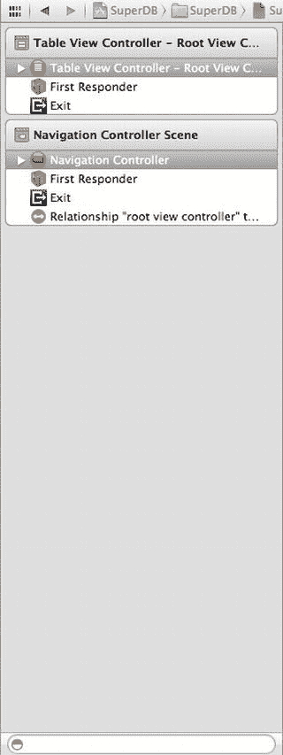

图 3-12.  填充内容后的故事板文档大纲

让我们看看你目前完成的工作。构建并运行 SuperDB 应用。你应该会看到类似图 3-13 的内容。

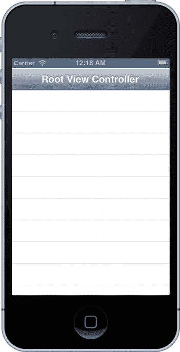

图 3-13.  到目前为止的 SuperDB 应用

### 应用架构

没有一种架构适用于所有应用。一种显而易见的方法是让应用成为一个标签栏应用，然后为每个标签添加一个独立的导航控制器。如果每个标签对应一个完全不同的视图，显示不同类型的数据，这种方法是完全合理的。在 *Beginning iOS 6 Development* 的第 7 章中，你正是使用了这种方法，因为每个标签都对应一个拥有不同 Outlet 和不同操作的不同视图控制器。

然而，在本例中，你将实现两个标签（后续章节还会添加更多），但每个标签将显示完全相同的数据，只是排序方式不同。当一个标签被选中时，表格将按超级英雄的姓名排序。如果另一个标签被选中，则会显示相同的数据，但按超级英雄的秘密身份排序。

无论选中哪个标签，点击表格中的某一行都会执行相同的操作：向下钻取到一个新视图，你可以在其中编辑所选超级英雄的信息（你将在下一章中添加此功能）。无论选中哪个标签，点击“添加”按钮都会添加同一个实体的新实例。当你向下钻取到另一个视图来查看或编辑英雄时，标签栏就不再相关了。

对于你的应用来说，标签栏只是修改了单个表格中数据的呈现方式。它实际上不需要切换其他视图控制器。为什么要有多个导航控制器实例来管理完全相同的数据集，并以相同的方式响应触摸？为什么不只使用一个表格控制器，让它根据选中的标签来改变数据的呈现方式？这就是你将在本应用中采用的方法。因此，你的应用将不是一个真正的标签栏应用。

你的根视图控制器将是一个导航控制器，你将纯粹使用标签栏来接收用户输入。最终呈现给用户的结果，与你为每个标签创建独立的导航控制器和表格视图控制器所看到的结果完全相同。但在幕后，你将使用更少的内存，并且不必担心保持不同导航控制器之间的同步。

你的应用的根视图控制器将是一个 `UINavigationController` 实例。你将创建自己的自定义视图控制器类 `HeroListController`，作为这个 `UINavigationController` 的根视图控制器。`HeroListController` 将显示超级英雄列表，以及控制英雄如何显示和排序的标签。

以下是应用的工作方式。当应用启动时，`HeroListController` 的一个实例从故事板文件加载。然后，以 `HeroListController` 实例为根视图控制器，创建一个 `UINavigationController` 实例。最后，将 `UINavigationController` 设置为应用的根视图控制器。与 `HeroListController` 关联的视图包含了你的标签栏和超级英雄表格视图。

在第 4 章中，你将添加一个表格视图控制器来实现详细的超级英雄视图。当用户在超级英雄列表中点击一个超级英雄时，这个详细控制器将被推送到导航堆栈上，其视图将临时替换 `UINavigationController` 内容视图中 `HeroListController` 的视图。现在无需担心详细视图；我们只是想让你预览一下即将实现的功能。

### 设计视图控制器接口

你的应用的根视图控制器现在是一个标准的 `UINavigationController`。你不需要编写任何代码；只需将一个导航控制器对象拖放到你的故事板中即可。Xcode 还为你提供了一个 `UITableViewController` 作为导航控制器堆栈的根。尽管你将使用表格来显示英雄列表，但你不会继承 `UITableViewController`。因为你还需要在界面中添加一个标签栏，所以你将创建一个 `UIViewController` 的子类，并在故事板编辑器中创建你的界面。用于显示英雄列表的表格将是你的视图控制器内容面板的一个子视图。

如果尚未选中，请在导航窗格中选择 `SuperDB.storyboard`。同时确保工具面板已显示。故事板应该有两个场景：导航控制器和表格视图控制器 - 根。缩小视图，使两个场景都可见。选择“表格视图控制器 - 根”。只有“表格视图控制器 - 根”场景和标签应高亮显示为蓝色。按 Delete 键或选择“编辑”“删除”来删除该表格视图控制器。现在你应只剩下导航控制器。

从工具面板底部，从对象库中选择一个视图控制器并将其拖拽到故事板编辑器中。应该会出现一个视图控制器；将其放在导航控制器的右侧（图 3-14）。

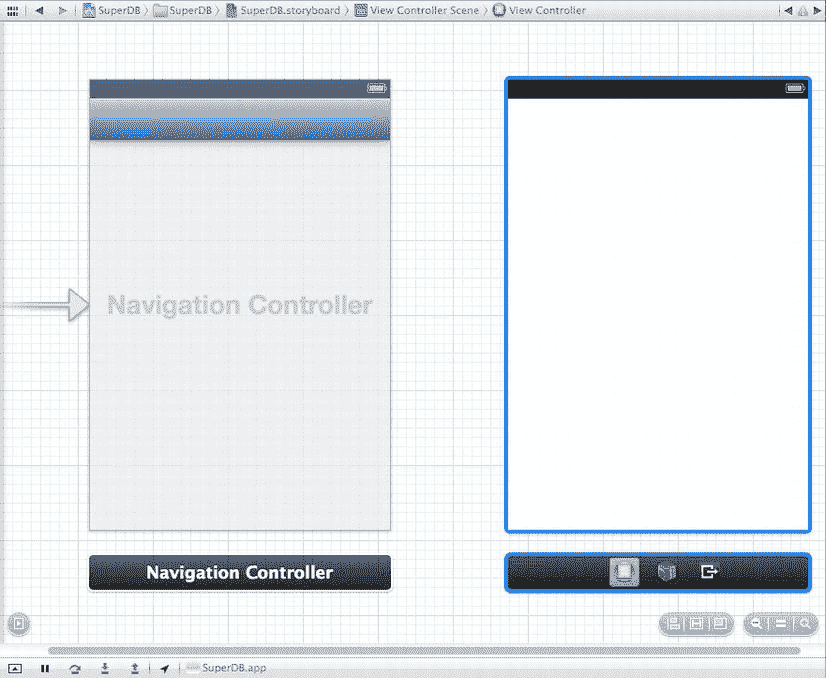

图 3-14.  包含一个新视图控制器场景的故事板

在布置新的视图控制器之前，让我们先将其连接到导航控制器。选择导航控制器。点击“放大”按钮，直到导航控制器变为显示三个图标（图 3-15）。将指针悬停在最左侧的图标上。应该会出现一个弹出窗口，显示“navigation controller”（导航控制器）字样。按住 Control 键从导航控制器图标拖拽到视图控制器的视图上。松开指针后，你应该会看到一个包含可能 segue 分配的弹出菜单（图 3-16）。在“关系 Segue”部分中选择“根视图控制器”。你应该会看到导航控制器和视图控制器之间出现一个 segue。同时，视图控制器的顶部现在应该有一个导航栏。

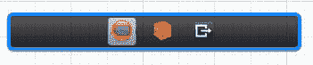

图 3-15.  导航控制器标签图标

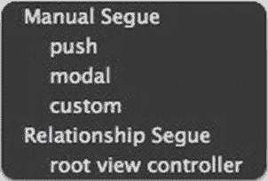

图 3-16.  可能的 segue 分配


现在您可以设计视图控制器的界面了。首先，我们来添加标签栏。在库中查找标签栏（Tab Bar）。请确保您获取的是一个标签栏，而不是标签栏控制器（Tab Bar Controller）。您只需要用户界面元素。将一个标签栏从库拖拽到名为"视图控制器"的场景中，并将其紧贴窗口底部放置，如图 3-17 所示。

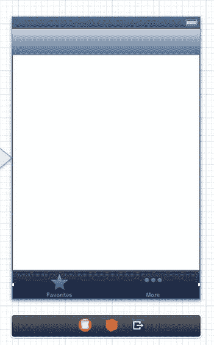

图 3-17. 紧贴场景底部放置的标签栏

**注意：** 您可能需要放大视图才能将标签栏放入视图中。您需要放大到足够程度，使得标签从"视图控制器"变为一系列图标。**图 3-17** 的底部展示了这一状态。

默认的标签栏有两个标签，这正是您需要的数量。接下来，我们来更改每个标签的图标和标题。在标签栏仍处于选中状态时，点击"收藏"上方的星形图标。然后点击"工具"面板选择器栏中的"属性检查器"按钮（它应该是第四个按钮）。或者，您可以选择视图  工具  显示属性检查器（Show Attribute Inspector）。菜单快捷键是 ⌥4。

如果您已正确选中标签栏项目，"属性检查器"面板应显示为"标签栏项目"，标识符弹出菜单应显示为"收藏"。在"属性检查器"中，将此标签的标题设置为**按姓名**，图像设置为`name_icon.png`（图 3-18）。现在，点击标签栏上"更多"字样上方的三个点，以选中右侧标签。使用检查器，将此标签的标题设置为**按秘密身份**，图像设置为`secret_icon.png`。

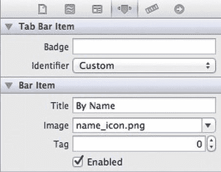

图 3-18. 设置左侧标签的属性

**注意：** 文件 `name_icon.png` 和 `secret_icon.png` 可在本书的下载档案中找到。

回到对象库，查找一个表格视图（Table View）。再次确保您获取的是用户界面元素，而不是表格视图控制器（Table View Controller）。将此元素拖拽到标签栏上方的空白区域。它应能自动调整大小以适应可用空间。放置完成后，其外观应如图 3-19 所示。

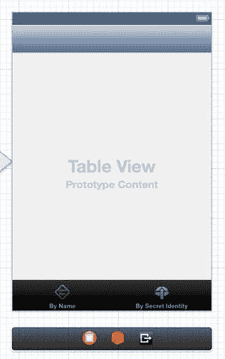

图 3-19. 场景中的表格视图

最后，获取一个表格视图单元格（Table View Cell），并将其拖拽到表格视图上方。Xcode 应能自动将其对齐到表格视图的顶部（图 3-20）。

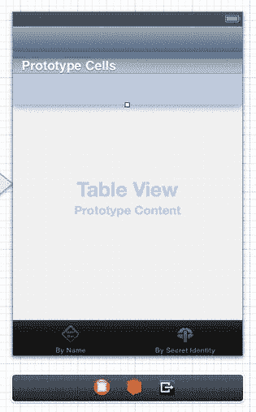

图 3-20. 表格视图上的表格视图单元格

选中表格视图单元格，并在"工具"面板中打开"属性检查器"。您需要更改一些属性以获得所需的行为。首先，将样式设置为副标题（Subtitle）。这将使表格视图单元格具有一个大的标题文本，并在其下方显示一个较小的副标题文本。接下来，为其指定一个标识符值 `HeroListCell`。此值将在稍后创建表格视图单元格时使用。最后，将"选择"（Selection）从"蓝色"（Blue）更改为"无"（None）。这意味着当您点击表格视图单元格时，它不会高亮显示。您的"属性检查器"应如图 3-21 所示。

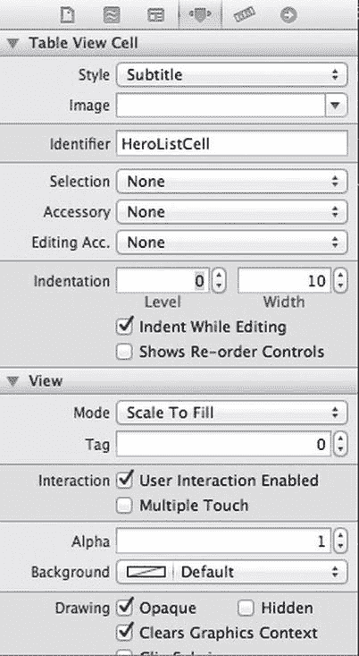

图 3-21. 表格视图单元格属性

您的界面构建完成。现在您需要定义视图控制器的接口，以便建立插座变量、委托和数据源连接。

### 创建 HeroListController

在导航器面板中单击 SuperDB 组。现在创建一个新文件（⌘N 或 文件  新建  文件）。当"新建文件助理"出现时（图 3-22），在左窗格中的 iOS 标题下选择"Cocoa Touch"，然后在右窗格中选择"Objective-C 类"并点击"下一步"按钮。

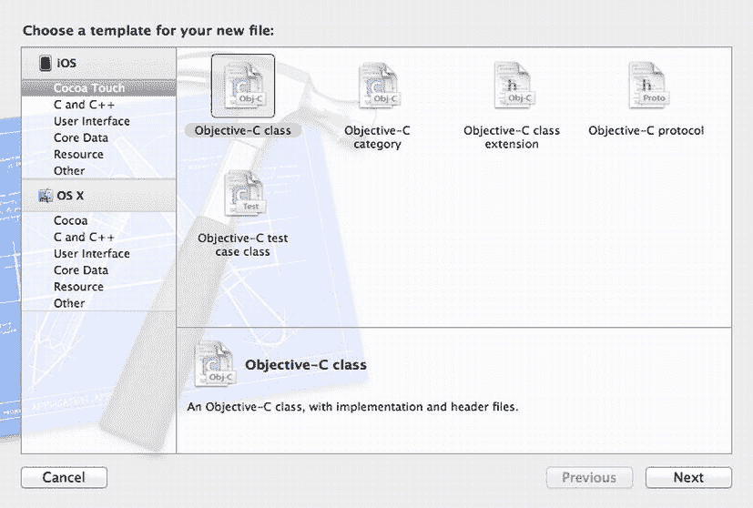

图 3-22. 在新建文件助理中选择 Objective-C 类模板

在第二个文件助理窗格中（图 3-23），将类命名为 `HeroListController`，并将其设置为 `UITableViewController` 的子类。确保"针对 iPad"和"附带 XIB 用户界面"两个选项均未选中。完成后，点击"下一步"按钮。文件对话框应已选中 SuperDB 项目文件夹，因此只需点击"创建"即可。项目视图中应已添加两个文件：`HeroListController.h` 和 `HeroListController.m`。

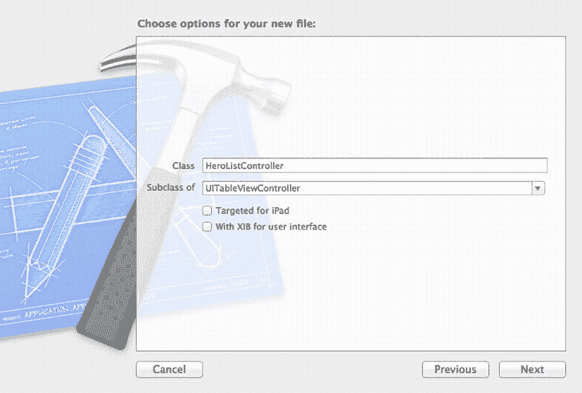

图 3-23. 在文件助理中选择 `UITableViewController`

等等。当您在 `MainStoryboard.storyboard` 中构建界面时，您使用的是普通的 `UIViewController`，而不是 `UITableViewController`。并且我们之前提到过您不希望使用 `UITableViewController`。那么为什么我们要让您将 `HeroListController` 设置为 `UITableViewController` 的子类呢？

如果您回顾一下 图 3-1，您会看到您的应用程序在表格视图中显示了一个英雄列表。那个表格视图需要一个数据源和委托。`HeroListController` 将担任这个数据源和委托。通过让"新建文件助理"创建一个 `UITableViewController` 的子类，Xcode 将使用一个文件模板，该模板会预定义一系列表格视图数据源和委托方法。在导航器面板中选择 `HeroListController.m`，然后在编辑器面板中查看该文件。您应该能看到 Xcode 免费为您提供的方法。

但是，您需要将 `HeroListController` 设置为 `UIViewController` 的子类。在导航器面板中单击 `HeroListController.h`。找到 `@interface` 声明，并将其从

```
@interface HeroListController : UITableViewController
```

更改为

```
@interface HeroListController : UIViewController <UITableViewDataSource, UITableViewDelegate>
```

接下来，选择 `HeroListController.m`。找到如下方法

```
- (id)initWithStyle:(UITableViewStyle)style
{
    self = [super initWithStyle:style];
    if (self) {
        // 自定义初始化
    }
    return self;
}
```

并将其删除。

现在您需要将表格视图的数据源和委托连接到 `HeroListController`。同时，创建标签栏和表格视图所需的插座变量。您可以手动添加它们，但我们假设您知道如何操作。让我们尝试使用另一种方法。

在导航器面板中选择 `SuperDB.storyboard`，并展开故事板编辑器。确保您的缩放级别使视图控制器标签显示三个图标。将指针悬停在最左侧的图标上，该图标是一个带有白色方块的橙色圆圈。Xcode 应会弹出一个标签，显示"视图控制器"。单击以选中它。在"工具"面板中，选择"标识检查器"（图 3-24）。将"类"字段（位于"自定义类"标题下方）更改为 `HeroListController`。

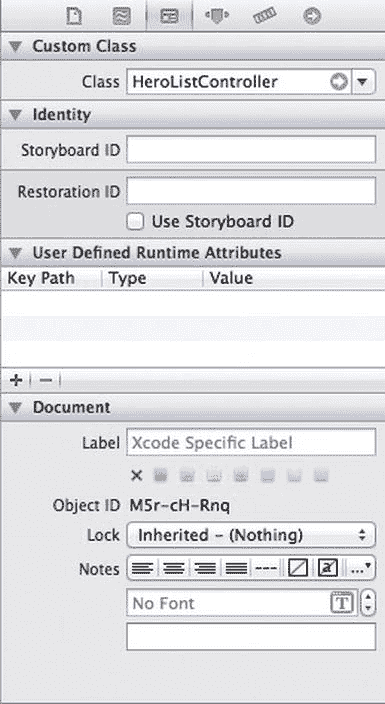

图 3-24. 视图控制器的标识检查器

您在这里做了什么？您已经告诉 Xcode，您的视图控制器不再是一个普通的 `UIViewController`，而现在是一个 `HeroListController`。如果您将指针悬停在视图控制器图标上，弹出信息将显示为"英雄视图控制器"。

### 建立连接与插座变量


首先，将 `HeroListController` 设置为表格视图的数据源和代理。从表格视图区域按住 Control 键拖拽到 `HeroListController`（图 3-25）。松开后，应会出现一个 Outlets 弹出窗口（图 3-26）。选择 `dataSource`。重复上述拖拽操作，这次选择 `delegate`。

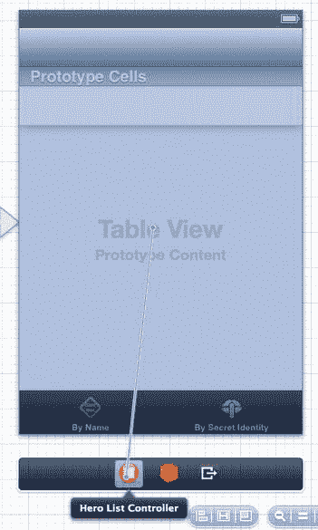

图 3-25. 从表格视图按住 Control 键拖拽到 `HeroListController`


图 3-26. 表格视图 Outlets 弹出窗口

现在，你将添加标签栏和表格视图的 Outlet。在工具栏上，将编辑器从标准编辑器切换为助理编辑器。编辑窗格应会分割为两个视图（图 3-27）。左侧视图显示故事板编辑器；右侧视图显示代码编辑器，并展示 `HeroListController` 的接口文件。

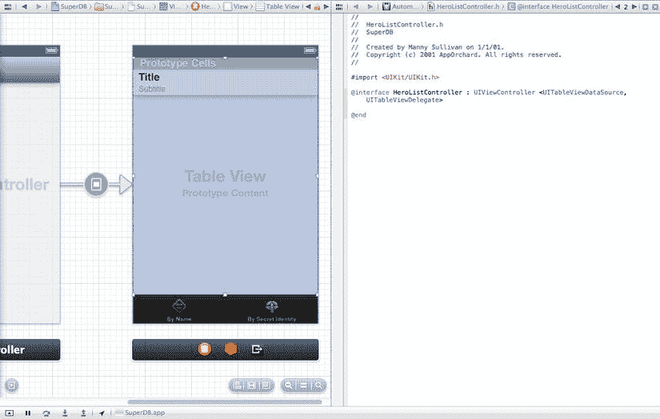

图 3-27. 助理编辑器

再次从表格视图区域按住 Control 键拖拽，但这次拖拽到代码编辑器，放置在 `@interface` 和 `@end` 声明之间（图 3-28）。松开后，应会出现一个 Connection 弹出窗口（图 3-29）。在名称字段中输入 `heroTableView`，其余字段保持默认设置。点击 Connect 按钮。

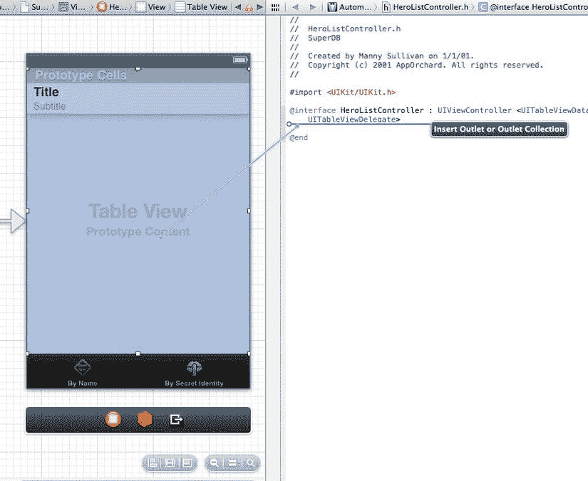

图 3-28. 从表格视图按住 Control 键拖拽到 `HeroListController` 接口文件

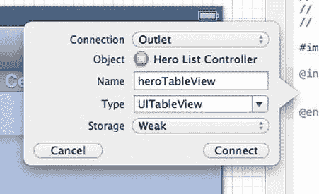

图 3-29. Connection 弹出窗口

应在 `@interface` 声明之后添加以下代码行：

```
@property (weak, nonatomic) IBOutlet UITableView *heroTableView;
```

重复该过程，这次从标签栏按住 Control 键拖拽到新 `@property` 声明的正下方。使用 `heroTabBar` 作为名称。你应该获得以下用于标签栏的新 `@property` 声明：

```
@property (weak, nonatomic) IBOutlet UITabBar *heroTabBar;
```

### 导航栏按钮

如果你构建并运行 SuperDB 应用，应该会得到类似 图 3-30 的结果。

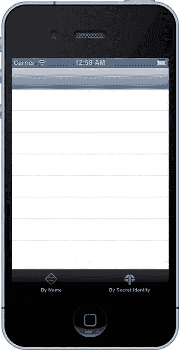

图 3-30. 到目前为止的 SuperDB。看起来不错！

让我们添加编辑和添加 (+) 按钮。确保在工具栏中选中了标准编辑器切换开关，然后在导航窗格中选择 `HeroListController.m`。在编辑窗格中，找到方法

```
- (void)viewDidLoad
```

在该方法的底部，你应该会看到以下代码行：

```
// Uncomment the following line to display an Edit button in the navigation bar for this view controller.
// self.navigationItem.rightBarButtonItem = self.editButtonItem;
```

取消第二行的注释，并将 `rightBarButtonItem` 改为 `leftBarButtonItem`，如下所示：

```
// Uncomment the following line to display an Edit button in the navigation bar for this view controller.
self.navigationItem.leftBarButtonItem = self.editButtonItem;
```

要添加添加 (+) 按钮，你需要回到故事板编辑器。在导航窗格中选择 `SuperDB.storyboard`。从对象库中拖拽一个栏按钮项到 Hero 视图控制器中导航栏的右侧。在实用工具窗格中，选择属性检查器。你应该看到栏按钮项的属性检查器（图 3-31）。如果没有，请确保你刚刚添加的栏按钮项已被选中。将标识符字段改为 Add。栏按钮项的标签应从 Item 变为 +。

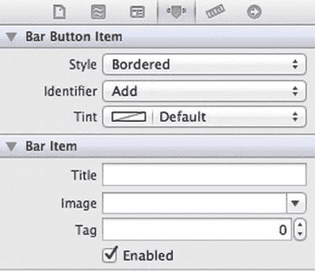

图 3-31. 栏按钮项的属性检查器

切换回助理编辑器。从栏按钮项按住 Control 键拖拽到 `HeroListController` 接口文件中最后一个 `@property` 的正下方。当连接弹出窗口出现时，添加一个名为 `addButton` 的连接。再次从栏按钮项按住 Control 键拖拽到 `@end` 的正上方。这次，当连接弹出窗口出现时，将连接值改为 Action，并将名称设置为 `addHero`（图 3-32）。点击 Connect。你应该会看到一个新的方法声明：

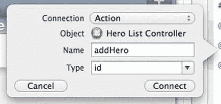

图 3-32. 添加 `addHero:` 操作

```
- (IBAction)addHero:(id)sender;
```

如果你转到 `HeroListController` 的实现文件，你会看到该方法的（空）实现：

```
- (IBAction)addHero:(id)sender {
}
```

构建并运行应用。一切看起来都就绪（图 3-33）。点击 Edit 按钮。它应该会变成一个 Done 按钮。点击 Done 按钮，它应该会变回 Edit。按下添加 (+) 按钮。没有任何反应。这是因为你还没有编写 `-addHero:` 方法来做任何事情。你很快会实现这个功能。

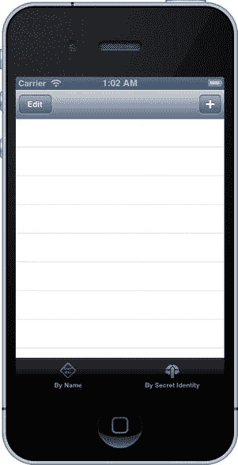

图 3-33. 一切都在正确的位置

然而，此时标签栏没有任何一个标签按钮被选中。当你启动应用时，两个按钮都处于未选中状态。你可以选中其中一个，然后在两者之间切换。但启动时不是应该有一个按钮被选中吗？接下来你将实现这个功能。

### 标签栏和用户默认设置

你希望应用启动时其中一个标签栏按钮被选中。通过添加如下代码，你可以相当轻松地实现这一点

```
// 选择标签栏按钮
UITabBarItem *item = [self.heroTabBar.items objectAtIndex:0];
[self.heroTabBar setSelectedItem:item];
```

添加到 `HeroListController` 的 `viewDidLoad:` 方法中。尽管尝试一下。应用启动后，By Name 标签被选中。现在，选择 By Secret Identity 标签，并在 Xcode 中停止应用。重新启动应用。By Name 标签又被选中了。如果应用能记住你上次的选择，岂不是很好？你可以使用用户默认设置来帮你实现记忆功能。

在 `HeroListController` 接口中，在 `@interface` 声明之前添加以下代码行：

```
#define kSelectedTabDefaultsKey @"Selected Tab"

enum {
    kByName,
    kBySecretIdentity,
};
```

`kSelectedTabDefaultsKey` 是你将用于从用户默认设置中存储和检索所选标签栏按钮索引的键。枚举只是为值 0 和 1 提供便利。

切换到 `HeroListController` 实现文件，并在 `viewDidLoad:` 方法的末尾添加以下代码：

```
// 选择标签栏按钮
NSUserDefaults *defaults = [NSUserDefaults standardUserDefaults];
NSInteger selectedTab = [defaults integerForKey:kSelectedTabDefaultsKey];
UITabBarItem *item = [self.heroTabBar.items objectAtIndex:selectedTab];
[self.heroTabBar setSelectedItem:item];
```

（如果你之前输入了标签栏选择的代码，请确保正确进行了更改。）

构建并运行应用。切换标签栏。退出应用，并确保 By Secret Identity 按钮被选中。退出应用，然后重新启动。它应该会记住选择，对吧？还不行。你还没有编写当标签栏选择更改时写入用户默认设置的代码。你只是在启动时读取了它。让我们在更改时写入默认设置。

选择 `SuperDB.storyboard`，并从标签栏按住 Control 键拖拽到 Hero 视图控制器。当 Outlets 弹出窗口出现时，选择 delegate（这应该是你唯一的选择）。接下来，选择 `HeroListController.h`，并将 `@interface` 声明从


```objectivec
@interface HeroListController : UIViewController < UITableViewDataSource, UITableViewDelegate>
```

改为

```objectivec
@interface HeroListController : UIViewController < UITableViewDataSource, UITableViewDelegate, UITabBarDelegate>
```

现在 `UITabBarDelegate` 有一个必需的方法 `-tabBar:didSelectItem:`。选择 `HeroListController.m`，将编辑器导航到 `-addHero:` 方法上方。添加以下代码行：

```objectivec
#pragma mark - UITabBarDelegate 方法

- (void)tabBar:(UITabBar *)tabBar didSelectItem:(UITabBarItem *)item
{
    NSUserDefaults *defaults = [NSUserDefaults standardUserDefaults];
    NSUInteger tabIndex = [tabBar.items indexOfObject:item];
    [defaults setInteger:tabIndex forKey:kSelectedTabDefaultsKey];
}
```

现在，当你退出并重新启动应用时，它会记住你上次的标签栏选择。

### 设计数据模型

现在你需要定义应用的数据模型。正如我们在第 2 章中讨论的，Xcode 模型编辑器是你设计应用数据模型的地方。在导航器窗格中，点击 `SuperDB.xcdatamodel`。这应该会打开模型编辑器（图 3-34）。

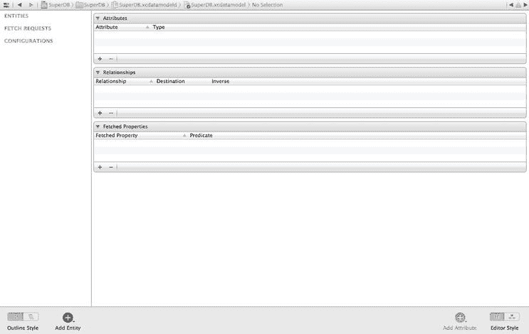

图 3-34. 等待应用数据模型的空白模型编辑器

与第 2 章的数据模型不同，你应该从一个完全空白的数据模型开始。那么让我们直接开始构建吧。你需要在数据模型中添加的第一样东西是一个实体。记住，实体就像类定义。虽然它们本身不存储任何数据，但如果数据模型中至少没有一个实体，你的应用就无法存储任何数据。

#### 添加实体

由于你的应用旨在追踪超级英雄的信息，因此你需要一个实体来表示英雄似乎是合乎逻辑的。本章我们会从简单开始，只追踪每个英雄的少数几项数据：姓名、秘密身份、出生日期和性别。在后续章节中，你会添加更多数据元素，但这将为你打下一个基础的构建框架。

向数据模型添加一个新实体。在顶层组件窗格中应该会出现一个名为 `Entity` 的新实体。该实体应处于选中状态，且文本 `Entity` 应高亮显示。键入 **Hero** 来命名该实体。

#### 编辑新实体

让我们验证一下新的 `Hero` 实体是否已添加到默认配置中。在顶层配置窗格中选择默认配置。右侧的数据编辑器详细窗格应该会发生变化，显示出一个名为 `Entities` 的单个表格。这个表格中应该有一个条目，即你刚刚命名为 `Hero` 的实体。

在 `Hero` 旁边是一个名为 `Abstract` 的复选框。这个复选框允许你创建一个不能在运行时用于创建托管对象的实体。创建抽象实体的原因可能是，你有几个属性在多个实体中通用。在这种情况下，你可以创建一个抽象实体来保存这些通用字段，然后让每个使用这些通用字段的实体都成为该抽象实体的子实体。这样一来，如果你需要修改这些通用字段，只需在一个地方进行修改。

接下来，`Class` 字段应为空白。这意味着 `Hero` 实体是 `NSManagedObject` 的子类。在第 6 章中，你将看到如何创建 `NSManagedObject` 的自定义子类来添加功能。

选择这一行，然后展开工具窗格，你可以看到更多细节。让我们展开工具窗格。工具窗格出现后，选择数据模型检查器（检查器选择栏上的第三个按钮）。工具窗格应该类似于图 3-35。

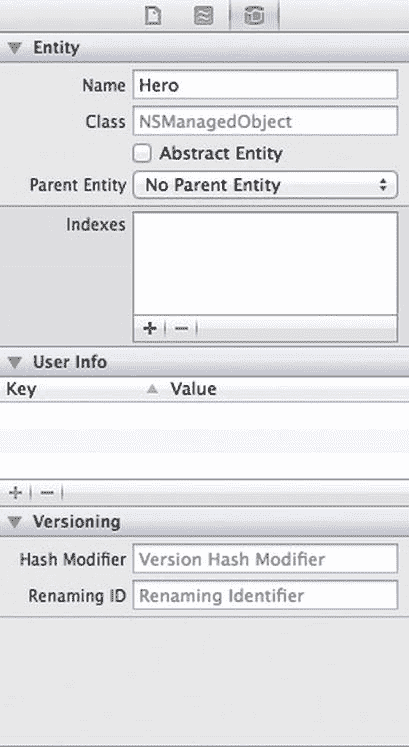

图 3-35. 新实体的工具窗格

前三个字段（`Name`、`Class` 和 `Abstract Entity`）与你之前在数据详细窗格中看到的内容一致。在 `Abstract Entity` 复选框下方是一个标有 `Parent Entity` 的弹出菜单。在数据模型中，你可以指定一个父实体，这非常类似于 Objective-C 中的子类化。当你将另一个实体指定为父实体时，新实体会继承父实体的所有属性以及你指定的任何额外属性。将父实体弹出菜单保留为 `No Parent Entity`。

**注意**  你可能想知道数据模型检查器中的其他区域，如 `User Info`、`Versioning` 和 `Entity Sync`。这些设置让你能够访问更高级的配置参数，这些参数很少用到。你不会更改任何配置。

如果你有兴趣了解更多关于这些高级选项的信息，可以阅读 *Pro Core Data for iOS, 2nd Edition* ([www.apress.com/9781430236566](http://www.apress.com/9781430236566)) 中的相关内容。苹果公司也提供了以下在线指南：Core Data 编程指南 ([`developer.apple.com/library/ios/#documentation/Cocoa/Conceptual/CoreData/cdProgrammingGuide.html`](http://developer.apple.com/library/ios/#documentation/Cocoa/Conceptual/CoreData/cdProgrammingGuide.html)) 以及 Core Data 模型版本控制与数据迁移指南 ([`developer.apple.com/library/ios/#documentation/Cocoa/Conceptual/CoreDataVersioning/Articles/Introduction.html`](http://developer.apple.com/library/ios/#documentation/Cocoa/Conceptual/CoreDataVersioning/Articles/Introduction.html))。

#### 为 Hero 实体添加属性

既然你已经有了一个实体，你必须为它赋予属性，以便基于该实体的托管对象能够存储数据。在本章中，你需要四个属性：`name`、`secret identity`、`birth date` 和 `sex`。

##### 添加 Name 属性

在数据组件窗格中选择 `Hero` 实体，然后添加一个属性。添加后，在详细窗格的 `Attributes` 属性表中会出现一个名为 `Attribute` 的条目。正如创建新实体时一样，新添加的属性已自动为你选中。键入 **name**，这将使新属性的名称更新。`Attributes` 属性窗格应类似于图 3-36。

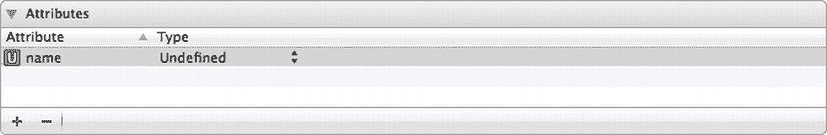

图 3-36. 属性详细信息

**提示**  你选择用大写字母 `H` 开头命名实体 `Hero`，而用小写字母 `n` 开头命名属性，这并非偶然。这是实体和属性公认的命名约定。实体以大写字母开头；属性以小写字母开头。在这两种情况下，如果实体或属性的名称由多个单词组成，每个新单词的首字母都要大写。

表中的 `Type` 列指定了属性的数据类型。默认情况下，数据类型设置为 `Undefined`。

现在，让我们再次展开工具窗格（如果尚未打开）。确保在详细窗格中选中 `name` 属性，然后选择数据模型检查器（图 3-37）。第一个字段的标题应为 `Name`，其值应为 `name`。

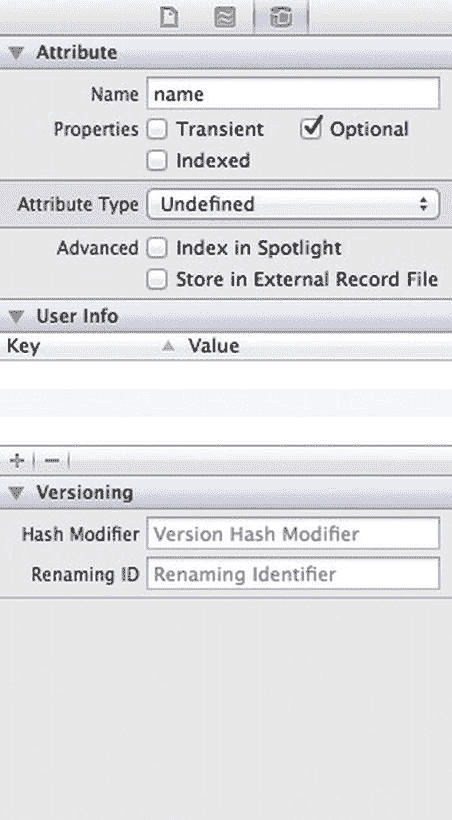

图 3-37. 新 `name` 属性的数据模型检查器


好的，请看下面的中文译文：


在 `Name` 字段下方有三个复选框：`Transient`、`Optional` 和 `Indexed`。如果勾选了 `Optional`，那么即使此属性没有赋值，这个实体也可以被保存。如果取消勾选，那么当 `name` 属性为 `nil` 时，任何基于此实体保存托管对象的尝试都将导致验证错误，从而阻止保存。在这种特定情况下，`name` 是用于标识特定英雄的主要属性，因此你可能希望将此属性设为必填项。单击 `Optional` 复选框以取消勾选，使其成为必填字段。

`Transient` 复选框允许你创建不会被保存到持久化存储中的属性。它们也可以用于创建存储非标准数据的自定义属性。现在，暂时不必过多担心 `Transient` 属性。保持其未选中状态即可；你将在第 6 章中重新了解这个复选框。

最后一个复选框 `Indexed`，用于告知底层数据存储为此属性添加索引。并非所有持久化存储都支持索引，但默认存储 (SQLite) 是支持的。数据库使用索引来提高基于该字段进行搜索或排序时的搜索速度。你将按名称对超级英雄进行排序，因此请勾选 `Indexed` 复选框，以告知 SQLite 在用于存储此属性数据的列上创建一个索引。

**谨慎**  如果使用得当，索引可以极大地提高 SQLite 持久化存储的性能。然而，在不需要的地方添加索引实际上可能会降低性能。如果你没有选择 `Indexed` 的理由，请保持其未选中状态。

### 属性类型

每个属性都有一个类型，用于标识该属性能够存储的数据种类。如果你单击 `Attribute Type` 下拉菜单（当前应设置为 `Undefined`），就可以看到 Core Data 开箱即支持的各种数据类型（图 3-38）。这些是你无需实现自定义属性即可存储的所有数据类型，就像你将在第 6 章中所做的那样。每种数据类型都对应一个用于设置或获取值的 Objective-C 类，并且在托管对象上设置值时，你必须确保使用正确的对象。

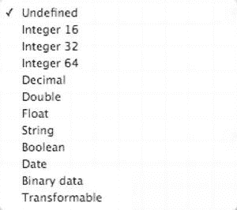

图 3-38. Core Data 支持的数据类型

#### 整数数据类型

`Integer 16`、`Integer 32` 和 `Integer 64` 都用于保存有符号整数（整数）。这三种数字类型之间的唯一区别在于它们能够存储的值的最小值和最大值。通常，你应该选择能够满足需求的最小尺寸的整数。例如，如果你知道你的属性永远不会存储超过一千的数字，那么请确保选择 `Integer 16` 而不是 `Integer 32` 或 `Integer 64`。这三种数据类型能够存储的最小值和最大值如表 3-1 所示。

表 3-1. 整数类型的最小值和最大值

| 数据类型 | 最小值 | 最大值 |
| --- | --- | --- |
| Integer 16 | −32,768 | 32, 767 |
| Integer 32 | −2,147,483,648 | 2,147,483,647 |
| Integer 64 | −9,223,372,036,854,775,808 | 9,223,372,036,854,77`5,807 |

在运行时，你使用通过工厂方法（如 `numberWithInt:` 或 `numberWithLong:`）创建的 `NSNumber` 实例来设置托管对象的整数属性。

#### Decimal、Double 和 Float 数据类型

`decimal`、`double` 和 `float` 数据类型都用于保存十进制数。`Double` 和 `float` 保存十进制数的浮点表示，类似于 C 语言中的 `double` 和 `float` 数据类型。由于浮点表示使用固定字节数来表示数据，因此它始终是一种近似值。小数点左边的数字越大，可用于保存小数部分的字节就越少。`double` 数据类型使用 64 位来存储一个数字，而 `float` 数据类型使用 32 位数据来存储一个数字。对于许多用途来说，这两种数据类型都完全够用。然而，当你的数据（例如货币）中小的舍入误差会成为问题时，Core Data 提供了 `decimal` 数据类型，它不容易出现舍入误差。`decimal` 类型可以在内部使用定点数保存最多 38 位有效数字，因此存储的值不会出现浮点数可能发生的舍入误差。

在运行时，你使用通过 `NSNumber` 工厂方法 `numberWithFloat:` 或 `numberWithDouble:` 创建的 `NSNumber` 实例来设置 `double` 和 `float` 属性。另一方面，`Decimal` 属性必须使用 `NSDecimalNumber` 类的实例来设置。

#### 字符串数据类型

`string` 数据类型是你将使用的最常见的属性类型之一。字符串属性能够保存几乎所有语言或脚本的文本，因为它们在内部使用 Unicode 存储。字符串属性在运行时使用 `NSString` 实例进行设置。

#### 布尔数据类型

可以使用 `Boolean` 数据类型存储布尔值（`YES` 或 `NO`）。布尔属性在运行时使用通过 `numberWithBOOL:` 创建的 `NSNumber` 实例进行设置。

#### 日期数据类型

可以使用 `date` 数据类型在 Core Data 中存储日期和时间戳。在运行时，日期属性使用 `NSDate` 实例进行设置。

#### 二进制数据类型

`binary` 数据类型用于存储任何类型的二进制数据。二进制属性在运行时使用 `NSData` 实例进行设置。任何可以放入 `NSData` 实例的内容都可以存储在二进制属性中。但是，通常你不能搜索或排序二进制数据类型。

#### 可变换数据类型

`transformable` 数据类型是一种特殊的数据类型，它与称为值转换器的东西一起工作，允许你基于任何 Objective-C 类创建属性，即使是那些没有对应 Core Data 数据类型的类也是如此。例如，你可以使用 `transformable` 数据类型来存储 `UIImage` 实例或 `UIColor` 实例。你将在第 6 章中了解 `transformable` 属性是如何工作的。

#### 设置 name 属性类型

名称显然是文本，因此此属性的明显类型是 `string`。从 `Attribute Type` 下拉菜单中选择 `string`。选择后，详细信息窗格中将出现一些新字段（图 3-39）。就像 Interface Builder 检查器一样，模型编辑器中的详细信息窗格是上下文相关的。某些属性类型（例如 `string` 类型）具有额外的配置选项。

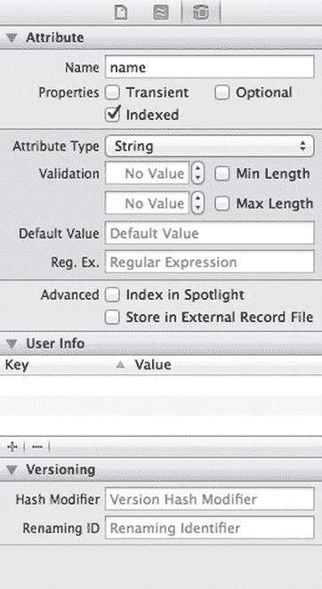

图 3-39. 选择字符串类型后的详细信息窗格

`Min Length：` 和 `Max Length：` 字段允许你设置此字段的最小和最大字符数。如果你在任一字段中输入一个数字，那么任何尝试保存一个在此属性中存储的字符数少于 `Min Length：` 或多于 `Max Length：` 的托管对象的操作，都会在保存时导致验证错误。


请注意，这种强制检查发生在数据模型中，而非用户界面中。除非你通过用户界面专门强制执行限制，否则这些验证在实际保存数据模型之前不会触发。在大多数情况下，如果你设置了最小或最大长度，还应采取相应措施在用户界面中强制执行该限制。否则，直到用户尝试保存时才会被告知错误，而此时距离他们在该字段中输入数据可能已经过了相当长的时间。你将在第 6 章中看到执行此操作的示例。

下一个字段是**“默认值”**（Default Value）。你可以用它来为此属性设置默认值。如果你在此字段中输入一个值，任何基于此实体创建的管理对象都会自动将其对应属性设置为你在此处输入的值。因此，在此例中，如果你在此字段中输入`Untitled Hero`，那么每次创建新的`Hero`管理对象时，`name`属性都会自动设置为`Untitled Hero`。嗯，听起来是个好主意，那就将`Untitled Hero`输入此字段。

最后一个字段是**“Reg. Ex.”**，它是正则表达式（regular expression）的缩写。此字段允许你使用正则表达式对输入的文本进行进一步验证。正则表达式是一种特殊的文本字符串，可用于表达模式。例如，你可以使用属性以文本形式存储 IP 地址，然后通过输入正则表达式`\b\d{1,3}\.\d{1,3}\.\d{1,3}\.\d{1,3}\b`来确保只输入有效的数字 IP 地址。你不会为此属性使用正则表达式，因此请将**“Reg. Ex.”**字段留空。

**注意：**正则表达式是一个非常复杂的话题，已有许多专著对其进行全面论述。教授正则表达式远远超出了本书的范围，但如果你有兴趣使用正则表达式进行数据模型级别的验证，一个很好的起点是关于正则表达式的维基百科页面：[`en.wikipedia.org/wiki/Regular_expression`](http://en.wikipedia.org/wiki/Regular_expression)，该页面涵盖了基本语法，并包含许多与正则表达式相关的资源链接。

最后，为了保险起见，保存一下。

### 添加其余属性

你的`Hero`实体还需要三个属性，现在来添加它们。再次点击**“添加属性”**（Add Attribute）按钮。将此属性命名为`secretIdentity`，类型设为`string`。根据不可思议先生的说法，每个超级英雄都有一个秘密身份，因此你最好取消勾选**“可选”**（Optional）复选框。你将按`secretIdentity`进行排序和搜索，所以请勾选**“索引”**（Indexed）复选框。对于**“默认值”**（Default Value），输入`Unknown`。由于通过取消勾选**“可选”**复选框使该字段成为必填项，提供默认值是一个好做法。其余字段保持默认值。

**警告：**务必为`name`和`secretIdentity`属性输入默认值。如果不这样做，程序将表现异常。如果程序崩溃，请检查是否已保存源代码文件和`nib`文件。

第三次点击加号按钮以添加另一个属性，将其命名为`birthdate`，类型设为`date`。此属性其余字段保持默认值。你可能不知道所有超级英雄的出生日期，因此希望将此属性保留为可选。就目前所知，你不会大量按`birthdate`进行搜索或排序，因此无需将此属性设为索引。你可以通过设置最小、最大或默认日期来在此处进行一些额外验证，但实际上并没有太大必要。没有合理的默认值，设置最小或最大日期会排除不朽超级英雄或穿越时空者的可能性，这当然不是你想要的结果！

至此，应用程序第一次迭代中还剩下一个属性：`sex`。你可以通过多种方式存储这条特定信息。为了简单起见（并且因为它有助于我们在第 6 章中向你展示一些有用的技术），我们只存储一个`Male`或`Female`的字符串。添加另一个属性，选择`string`类型。让我们将其保留为可选设置；毕竟外面可能有一两个雌雄莫辨的蒙面复仇者。你可以使用正则表达式字段将输入限制为`Male`或`Female`，但相反，你将在用户界面中通过提供选择列表来强制执行此限制，而不是在数据模型中强制执行。

猜猜怎么着？你现在已经完成了 SuperDB 应用程序第一次迭代的数据模型。保存它，我们继续。

### 声明获取结果控制器

为了填充表格视图，你需要获取持久化存储中存储的所有`Hero`实体。实现这一目标的最佳方法是在`HeroListController`中使用获取结果控制器（fetched results controller）。要使用获取结果控制器，你需要定义其委托，以便在获取结果发生变化时得到通知。为了简化操作，你将让`HeroListController`充当获取结果控制器的委托。

选择`HeroListController`，并将`@interface`声明修改为：

```
@interface HeroListController : UIViewController < UITableViewDataSource, UITableViewDelegate, UITabBarDelegate, NSFetchedResultsControllerDelegate>
```

既然已经声明了`NSFetchedResultsControllerDelegate`，你还需要控制器。你可以在`HeroListController.h`中声明该属性，但实际上并不需要此属性是公开的。你只会在`HeroListController`内部使用它。因此，你将把它设为私有属性。

选择`HeroListController.m`，如有必要，将编辑器滚动到文件顶部。在`@implementation`声明正上方，应添加以下几行：

```
#import "HeroListController.h"
@interface HeroListController ()
@end
```

这个`@interface`声明实际上是一个类别（category）声明。注意行尾的空括号。这是在实现文件内部声明类别的约定。因此，你将其修改为：

```
#import "HeroListController.h"
#import "AppDelegate.h"

@interface HeroListController ()
@property (nonatomic, strong, readonly) NSFetchedResultsController *fetchedResultsController;
@end
```

你添加了`#import`，因为稍后会用到它。在`@implementation`之后添加相应的`@synthesize`声明，如下所示：

```
@synthesize fetchedResultsController = _fetchedResultsController;
```

**注意：**你可能会听到开发者声称下划线前缀被 Apple 保留，不应使用。这是一种误解。Apple 确实为方法名称保留了下划线前缀，但在实例变量名称方面并没有类似的保留。你可以在[`developer.apple.com/library/ios/#documentation/Cocoa/Conceptual/CodingGuidelines/Articles/NamingIvarsAndTypes.html`](http://developer.apple.com/library/ios/#documentation/Cocoa/Conceptual/CodingGuidelines/Articles/NamingIvarsAndTypes.html)上阅读 Apple 关于实例变量的命名约定，其中对下划线的使用没有限制。

注意，`fetchedResultsController`属性是用`readonly`关键字声明的。你将在访问器方法中惰性加载获取结果控制器。你不希望其他类能够设置`fetchedResultsController`，因此将其声明为`readonly`以防止这种情况发生。

### 实现获取结果控制器

在`HeroListController`的`@implementation`中的某处，你需要`managedObjectContext`和`fetchedResultsController`方法。让我们将其添加到`addHero:`方法正上方。


```
#pragma mark – FetchedResultsController 属性

- (NSFetchedResultsController *)fetchedResultsController
{
}
```

俗话说得好，牛肉在哪里？好吧，我们想逐行讲解这段代码。如果你想提前了解，完整的代码清单在本章末尾可以找到。

首先，我们提到获取结果控制器将被延迟加载，因此这里是处理该逻辑的代码：

```
if (_fetchedResultsController != nil) {
    return _fetchedResultsController;
}
```

如果执行过了这个点，意味着 `_fetchResultsController` 实例变量（简称 ivar）为 `nil`，所以你需要创建一个。首先，你需要实例化一个获取请求。

```
NSFetchRequest *fetchRequest = [[NSFetchRequest alloc] init];
```

现在，获取 `Hero` 实体的实体描述，并设置获取请求的实体。同时，设置获取批次大小，出于性能考虑，这会将获取操作拆分成多个批次。

```
AppDelegate *appDelegate = (AppDelegate *)[[UIApplication sharedApplication] delegate];
NSManagedObjectContext *managedObjectContext = [appDelegate managedObjectContext];
NSEntityDescription *entity = [NSEntityDescription entityForName:@"Hero"
                                          inManagedObjectContext:managedObjectContext];
[fetchRequest setEntity:entity];
[fetchRequest setFetchBatchSize:20];
```

获取结果的顺序将取决于你选择的标签页，因此你需要获取该值。作为健全性检查，如果没有选择任何标签页，则读取用户默认设置。

```
NSUInteger tabIndex = [self.heroTabBar.items indexOfObject:self.heroTabBar.selectedItem];
if (tabIndex == NSNotFound) {
    NSUserDefaults *defaults = [NSUserDefaults standardUserDefaults];
    tabIndex = [defaults integerForKey:kSelectedTabDefaultsKey];
}
```

现在，设置获取请求的排序描述符。排序描述符是一个简单的对象，它告诉获取请求使用哪个属性来比较实体实例，以及排序是升序还是降序。获取请求需要一个排序描述符数组，排序描述符的顺序决定了比较时的优先级顺序。

```
NSString *sectionKey = nil;
switch (tabIndex) {
    // 注意 kByName 和 kBySecretIdentity 的代码几乎相同。
    // 是否该重构一下？
    case kByName: {
        NSSortDescriptor *sortDescriptor1 = [[NSSortDescriptor alloc] initWithKey:@"name"
                                                                        ascending:YES];
        NSSortDescriptor *sortDescriptor2 = [[NSSortDescriptor alloc] initWithKey:@"secretIdentity"
                                                                        ascending:YES];
        NSArray *sortDescriptors =
            [[NSArray alloc] initWithObjects:sortDescriptor1, sortDescriptor2, nil];
        [fetchRequest setSortDescriptors:sortDescriptors];
        sectionKey = @"name";
        break;
    }
    case kBySecretIdentity:{
        NSSortDescriptor *sortDescriptor1 = [[NSSortDescriptor alloc] initWithKey:@"secretIdentity"
                                                                        ascending:YES];
        NSSortDescriptor *sortDescriptor2 = [[NSSortDescriptor alloc] initWithKey:@"name"
                                                                        ascending:YES];
        NSArray *sortDescriptors =
            [[NSArray alloc] initWithObjects:sortDescriptor1, sortDescriptor2, nil];
        [fetchRequest setSortDescriptors:sortDescriptors];
        sectionKey = @"secretIdentity";
        break;
    }
}
```

如果选择了“按名称”标签页，你让获取请求先按 `name` 属性排序，然后按 `secretIdentity` 排序。对于“按隐秘身份”标签页，你颠倒了排序描述符的顺序。你设置了一个 `sectionKey` 字符串，稍后将用到它。

现在，你终于实例化了获取结果控制器。这里就是你使用 `sectionKey` 的地方，并为其分配一个名为 `Hero` 的缓存名称。你将获取结果控制器的代理设置为 `HeroListController`。

```
_fetchedResultsController =
    [[NSFetchedResultsController alloc] initWithFetchRequest:fetchRequest
                                        managedObjectContext:managedObjectContext
                                          sectionNameKeyPath:sectionKey
                                                   cacheName:@"Hero"];
_fetchedResultsController.delegate = self;

return _fetchedResultsController;
```

最后，你返回获取结果控制器。

### 获取结果控制器代理方法

由于你将获取结果控制器的代理设置为了 `HeroListController`，因此你需要实现这些方法。在你刚刚创建的 `fetchedResultsController` 方法下方添加以下内容：

```
#pragma mark – NSFetchedResultsControllerDelegate 方法

- (void)controllerWillChangeContent:(NSFetchedResultsController *)controller
{
    [self.heroTableView beginUpdates];
}

- (void)controllerDidChangeContent:(NSFetchedResultsController *)controller
{
    [self.heroTableView endUpdates];
}

- (void)controller:(NSFetchedResultsController *)controller
  didChangeSection:(id < NSFetchedResultsSectionInfo>)sectionInfo
           atIndex:(NSUInteger)sectionIndex
     forChangeType:(NSFetchedResultsChangeType)type
{
    switch(type) {
        case NSFetchedResultsChangeInsert:
            [self.heroTableView insertSections:[NSIndexSet indexSetWithIndex:sectionIndex]
                                            withRowAnimation:UITableViewRowAnimationFade];
            break;

        case NSFetchedResultsChangeDelete:
            [self.heroTableView deleteSections:[NSIndexSet indexSetWithIndex:sectionIndex]
                                            withRowAnimation:UITableViewRowAnimationFade];
            break;
    }
}

- (void)controller:(NSFetchedResultsController *)controller
   didChangeObject:(id)anObject
       atIndexPath:(NSIndexPath *)indexPath
     forChangeType:(NSFetchedResultsChangeType)type
      newIndexPath:(NSIndexPath *)newIndexPath
{
    switch(type) {
        case NSFetchedResultsChangeInsert:
            [self.heroTableView insertRowsAtIndexPaths:@[newIndexPath]
                                      withRowAnimation:UITableViewRowAnimationFade];
            break;

        case NSFetchedResultsChangeDelete:
            [self.heroTableView deleteRowsAtIndexPaths:@[indexPath]
                                      withRowAnimation:UITableViewRowAnimationFade];
            break;

        case NSFetchedResultsChangeUpdate:
        case NSFetchedResultsChangeMove:
            break;
    }
}
```

关于这些方法的说明，请参考第 2 章中的“获取结果控制器代理”部分。

### 让一切运转起来

你基本完成了。但仍需要：

*   实现编辑和添加（+）按钮。
*   正确编写表视图数据源和代理方法。
*   让标签栏选择器对表视图进行排序。
*   在启动时执行获取请求。
*   处理错误。

看起来工作量很大，但其实不然。让我们先从错误处理开始。

### 错误处理

为了简化操作，你将使用一个简单的警告视图来显示错误。要使用警告视图，你需要实现一个警告视图代理。与获取结果控制器类似，你将使 `HeroListController` 成为警告视图的代理。修改 `HeroListController @interface` 声明为：

```
@interface HeroListController : UIViewController < UITableViewDataSource, UITableViewDelegate, UITabBarDelegate, 
NSFetchedResultsControllerDelegate, UIAlertViewDelegate>
```

在 `HeroListController.m` 中，你将添加一个简单的警告视图代理方法。

```
#pragma mark – UIAlertViewDelegate 方法

- (void)alertView:(UIAlertView *)alertView didDismissWithButtonIndex:(NSInteger)buttonIndex
{
    exit(−1);
}
```

这个方法所做的就是让你的应用程序退出。


### 实现编辑和添加功能

点击添加（+）按钮时，应用程序所做的不仅仅是向表格视图添加一行。它还会向托管对象上下文中添加一个新的 `Hero` 实体。在 `HeroListController.m` 文件中，将 `addHero` 方法修改如下：

```
- (IBAction)addHero:(id)sender
{
     NSManagedObjectContext *managedObjectContext = 
         [self.fetchedResultsController managedObjectContext];

NSEntityDescription *entity = [[self.fetchedResultsController fetchRequest] entity];
     [NSEntityDescription insertNewObjectForEntityForName:[entity name]
                                    inManagedObjectContext:managedObjectContext];
     NSError *error = nil;
     if (![managedObjectContext save:&error]) {
         UIAlertView *alert =              [[UIAlertView alloc]
                  initWithTitle:NSLocalizedString(@"Error saving entity",
                                                  @"Error saving entity")
                       message:[NSString stringWithFormat:NSLocalizedString(@"Error was: %@, quitting.",
                                                                          @"Error was: %@, quitting."),
                                                              [error localizedDescription]]
                      delegate:self
             cancelButtonTitle:NSLocalizedString(@"Aw, Nuts", @"Aw, Nuts")
             otherButtonTitles:nil];
         [alert show];
     }
}
```

当点击**编辑**按钮时，系统会自动调用 `setEditing:animated:` 方法。因此，您只需将该方法添加到 `HeroListController.m` 文件中，无需在接口文件中声明。

```
- (void)setEditing:(BOOL)editing animated:(BOOL)animated
{
    [super setEditing:editing animated:animated];
    self.addButton.enabled = !editing;
    [self.heroTableView setEditing:editing animated:animated];
}
```

这里您所做的全部工作就是调用父类方法，禁用添加（+）按钮（您肯定不希望在编辑时添加英雄！），然后在表格视图上调用 `setEditing:animated`。

### 编写表格视图数据源和委托方法

以第 2 章中的 `CoreDataApp` 为例，您需要更改以下表格视图数据源方法：

```
- (NSInteger)numberOfSectionsInTableView:(UITableView *)tableView
{
   return [[self.fetchedResultsController sections] count];
}
- (NSInteger)tableView:(UITableView *)tableView numberOfRowsInSection:(NSInteger)section
{
   id < NSFetchedResultsSectionInfo > sectionInfo = 
          [[self.fetchedResultsController sections] objectAtIndex:section];
   return [sectionInfo numberOfObjects];
}
```

接下来，您需要处理表格视图单元格的创建，如下所示：

```
- (UITableViewCell *)tableView:(UITableView *)tableView
          cellForRowAtIndexPath:(NSIndexPath *)indexPath
{
    static NSString *CellIdentifier = @"HeroListCell";
    UITableViewCell *cell = [tableView dequeueReusableCellWithIdentifier:CellIdentifier];
    // 配置单元格...
    NSManagedObject *aHero = [self.fetchedResultsController objectAtIndexPath:indexPath];
    NSInteger tab = [self.heroTabBar.items indexOfObject:self.heroTabBar.selectedItem];
    switch (tab) {
        case kByName:
            cell.textLabel.text = [aHero valueForKey:@"name"];
            cell.detailTextLabel.text = [aHero valueForKey:@"secretIdentity"];
            break;
        case kBySecretIdentity:
            cell.textLabel.text = [aHero valueForKey:@"secretIdentity"];
            cell.detailTextLabel.text = [aHero valueForKey:@"name"];
            break;
    }
    return cell;
}
```

最后，取消注释 `tableView:commitEditingStyle:forRowAtIndexPath:` 方法以处理删除行操作。

```
// 覆盖以支持编辑表格视图。
- (void)tableView:(UITableView *)tableView
         commitEditingStyle:(UITableViewCellEditingStyle)editingStyle
         forRowAtIndexPath:(NSIndexPath *)indexPath
{
    NSManagedObjectContext *managedObjectContext = [self.fetchedResultsController managedObjectContext];
    if (editingStyle == UITableViewCellEditingStyleDelete) {
        // 从数据源中删除该行
        [managedObjectContext deleteObject:[self.fetchedResultsController
                                                 objectAtIndexPath:indexPath]];
        NSError *error;
        if (![managedObjectContext save:&error]) {
            UIAlertView *alert =                 [[UIAlertView alloc]
                     initWithTitle:NSLocalizedString(@"Error saving entity",
                                                     @"Error saving entity")
                          message:
                              [NSString stringWithFormat:NSLocalizedString(@"Error was: %@, quitting.",
                                                                            @"Error was: %@, quitting."),
                                                           [error localizedDescription]]
                         delegate:self
                cancelButtonTitle:NSLocalizedString(@"Aw, Nuts", @"Aw, Nuts")
                otherButtonTitles:nil];
            [alert show];
        }
    }
}
```

### 对表格视图进行排序

最后，您需要让表格视图的顺序在切换标签栏时发生变化。您需要在 `tabBar:didSelectItem:` 委托方法中添加以下代码：

```
- (void)tabBar:(UITabBar *)tabBar didSelectItem:(UITabBarItem *)item
{
    NSUserDefaults *defaults = [NSUserDefaults standardUserDefaults];
    NSUInteger tabIndex = [tabBar.items indexOfObject:item];
    [defaults setInteger:tabIndex forKey:kSelectedTabDefaultsKey];
    [NSFetchedResultsController deleteCacheWithName:@"Hero"];
    _fetchedResultsController.delegate = nil;
    _fetchedResultsController = nil;
    NSError *error;
    if (![self.fetchedResultsController performFetch:&error]) {
        NSLog(@"Error performing fetch: %@", [error localizedDescription]);
    }
    [self.heroTableView reloadData];
}
```

### 启动时加载获取请求

在 `HeroListController` 的 `viewDidLoad` 方法中添加以下代码：

```
// 获取任何已存在的实体
NSError *error = nil;
if (![[self fetchedResultsController] performFetch:&error]) {
    UIAlertView *alert =       [[UIAlertView alloc]           initWithTitle:NSLocalizedString(@"Error loading data",
                                           @"Error loading data")
                message:[NSString stringWithFormat:NSLocalizedString(@"Error was: %@, quitting.",
                                                                      @"Error was: %@, quitting."),
                                                   [error localizedDescription]]
               delegate:self
      cancelButtonTitle:NSLocalizedString(@"Aw, Nuts", @"Aw, Nuts")
      otherButtonTitles:nil];
    [alert show];
}
```

基本上就是这些了。

### 开动吧

好吧，您还在等什么？这工作量可不小；您值得试一试。确保所有内容都已保存，然后构建并运行应用程序。

如果一切顺利，当应用程序首次启动时，您应该会看到一个空表格，顶部有导航栏，底部有标签栏（图 3-40）。按下导航栏右侧的按钮将向数据库中添加一个新的无名超级英雄。按下**编辑**按钮，您将能够删除英雄。

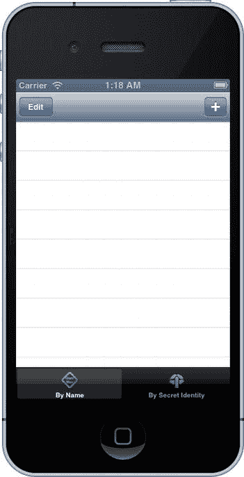

图 3-40. SuperDB 应用程序启动时的界面


好的，作为高级文档工程师和翻译员，我将严格按照您的要求，完成以下翻译工作。

---


**注意** 如果你的应用在运行时崩溃了，有几件事需要检查。首先，确保在运行项目之前已经保存了所有的源代码和 nib 文件。同时，确保在数据模型编辑器中为你英雄的名字和秘密身份指定了默认值。如果这些你都做了，但应用仍然崩溃，请尝试重置你的模拟器。操作方法如下：启动模拟器，然后从 iPhone 模拟器菜单中选择`Reset Contents and Settings`。这应该就能解决问题。在第 5 章中，我们将向你展示如何确保对数据模型的修改不会导致此类问题。

向你的应用添加几个未命名的超级英雄，然后尝试使用两个标签页，以确保在选择新标签页时显示内容会发生变化。当你选择`By Name`标签页时，它应该看起来像图 3-1，但当你选择`By Secret Identity`标签页时，它应该看起来像图 3-41。

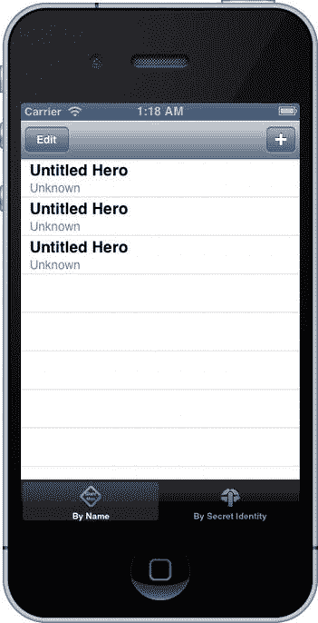

图 3-41.  按下`By Secret Identity`标签页尚未改变行的顺序，但它确实改变了首先显示的值

### 完成，但尚未完成

在本章中，你做了很多工作。你了解了如何设置一个使用标签栏的导航型应用程序，并且你学会了如何通过创建一个实体并为其赋予多个属性来设计一个基本的 Core Data 数据模型。

这个应用程序还没有完成，但你现在已经为继续前进打下了坚实的基础。当你准备好了，请翻到下一页，开始创建一个细节编辑页面，以便用户编辑他们的超级英雄。

## 第 4 章：细节视图中的魔鬼

在第 3 章中，你构建了应用程序的主视图控制器。你将其设置为按英雄的名字或秘密身份排序显示，并搭建了保存、删除和添加新英雄所需的基础设施。你没有做的是，为用户提供一种编辑特定英雄信息的方式，这意味着你只能创建和删除名为`Untitled Hero`的超级英雄。我猜你现在还不能发布你的应用程序 ;-)。

没关系。应用程序开发是一个迭代过程，任何应用程序的前几次迭代可能都不具备独立运行所需的所有功能。在本章中，你将创建一个可编辑的细节视图，让用户可以编辑特定超级英雄的数据。

你要编写的控制器将是`UITableViewController`的一个子类，并且你将使用一种在概念上有些复杂，但易于维护和扩展的方法。这很重要，因为你要向`Hero`托管对象添加新的属性，并以其他方式扩展它，所以你需要不断更改用户界面以适应这些变化。

编写完新的细节视图控制器后，你将添加功能，允许用户*就地*编辑每个属性。

### 视图实现的选择

在 David Mark、Jack Nutting 和 Jeff LaMarche 所著的《Beginning iOS 6 Development》（Apress 出版）的第 3 章和第 4 章中，你学习了如何使用 Interface Builder 构建用户界面。在 Interface Builder 中构建可编辑的细节视图无疑是一种方法。但另一种常见方法是将细节视图实现为分组表格。看看你 iPhone 上的“通讯录”应用或“电话”应用的“通讯录”标签页（图 4-1）。Apple 导航应用中的细节编辑视图通常使用分组表格实现，而不是使用在 Interface Builder 中设计的界面。


图 4-1.  iPhone 应用的“通讯录”标签页使用了基于表格的细节编辑视图

既然你选择为 SuperDB 应用程序使用故事板，你将使用故事板编辑器。无论从哪方面看，这与使用 Interface Builder 构建界面是一样的。

iOS 人机界面指南 ([`developer.apple.com/library/ios/#documentation/UserExperience/Conceptual/MobileHIG`](http://developer.apple.com/library/ios/#documentation/UserExperience/Conceptual/MobileHIG)) 并没有给出关于何时应该使用基于表格的细节视图与在 Interface Builder 中设计的细节视图的实质性指导，因此这归结为哪种感觉更合适。我们的观点是：如果你正在构建一个导航型应用程序，并且数据可以合理且高效地在分组表格中呈现，那么很可能就应该这样做。由于你的超级英雄数据结构与“通讯录”应用显示的数据非常相似，因此基于表格的细节视图似乎是显而易见的选择。

图 4-2 中显示的表格视图展示了来自单个英雄的数据，这意味着该表格中的所有内容都来自单个托管对象。每一行对应托管对象的一个不同属性。例如，第一个部分的唯一一行显示了英雄的名字。在编辑模式下，点击特定行将显示适当的子视图来修改该属性。对于字符串，它会显示一个键盘；对于日期，则显示一个日期选择器。

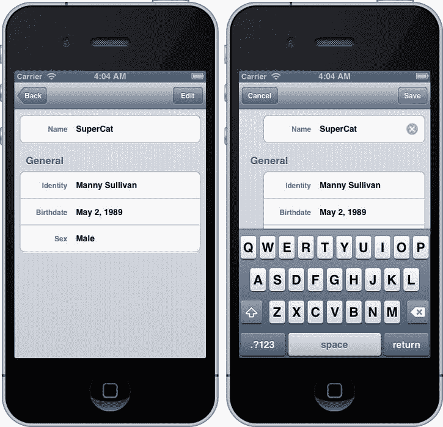

图 4-2.  你将在本应用程序中构建的细节视图，分别处于查看模式和编辑模式

表格视图按分区和行的组织方式并非由托管对象决定。相反，它们是作为开发者的你，通过尝试预测哪些安排对用户有意义而做出的设计决策的结果。例如，你可以按字母顺序排列属性，这将把出生日期放在第一位。但这并不是很直观，因为出生日期并不是英雄最重要或最具定义性的属性。在我们看来，英雄的名字和秘密身份是最重要的属性，因此应该是表格视图中首先出现的两个元素。

### 创建细节视图控制器

找到你从第 3 章得到的 SuperDB 项目文件夹，并复制一份。这样，如果你在为本章节添加新代码时出了岔子，就不必从头开始了。在 Xcode 中打开这个新的项目副本。

接下来，创建细节视图控制器本身。请记住，你正在创建一个基于表格的编辑视图，因此你需要继承`UITableViewController`。选择`SuperDB.storyboard`并打开故事板编辑器。如果“工具”面板未打开，请将其打开，并在“对象”库中找到表格视图控制器。将其拖到故事板编辑器上，放在`HeroListController`的右侧（图 4-3）。

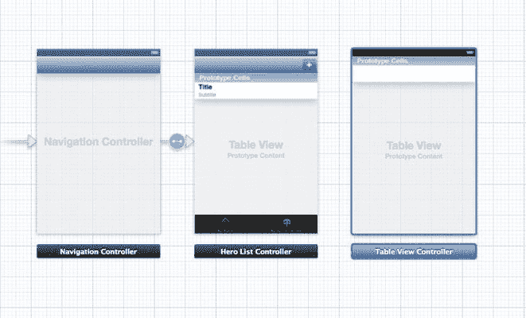

图 4-3.  你故事板的布局

确保你的缩放级别能够看到表格视图标签上的三个图标。单击表格视图（视图的灰色区域），然后将“工具”面板切换到“属性检查器”（图 4-4）。

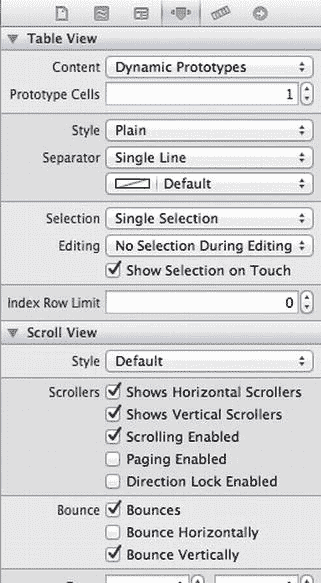

图 4-4.  表格视图的属性


我们再来看一下图 4-2。你的详细视图有两个分区，因此我们按此配置表格视图。将 `Style` 字段从 `Plain` 改为 `Grouped`。完成后，`Separator` 字段应自动变为 `Single Line Etched`。如果未自动更改，请手动修改。接下来，你已经知道每个区段的行数，分别为一行和三行。由于该数字是固定的，你可以将 `Content` 字段从 `Dynamic Prototypes` 改为 `Static Cells`。同样，`Content` 字段正下方的字段会自动从 `Prototype Cells` 变为 `Sections`。你知道分区数量为两个，因此在该字段中输入 `2`。最后，你希望在选中时不突出显示单元格，因此将 `Selection` 字段更改为 `No Selection`。表格视图的属性检查器应如图 4-5 所示。

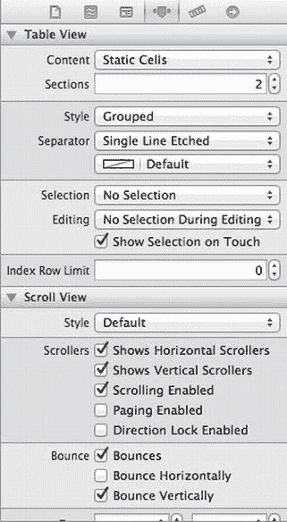

图 4-5. 表格视图属性的最终状态

你的表格视图现在应该有两个分区，每个分区各有三个单元格（图 4-6）。第一个分区单元格过多，你只需要一个单元格。选中第一个分区中的第二个单元格，使其高亮显示。删除该单元格（按下 `Delete` 键，或通过 `Edit`  `Delete` 删除）。现在第一个分区应有三个单元格，底部单元格高亮显示。同样删除该单元格。

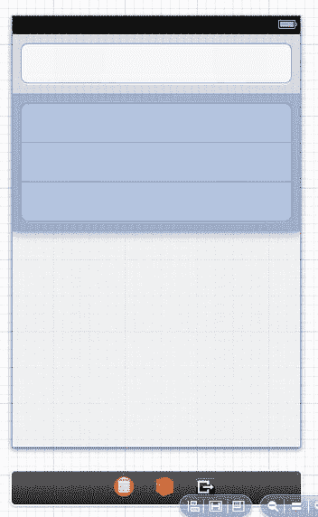

图 4-6. 表格视图

选中第一个分区中的表格视图单元格。打开属性检查器。将 `Style` 从 `Custom` 改为 `Left Detail`。将 `Identifier` 设置为 `HeroDetailCell`。最后，将 `Selection` 设置为 `None`。属性检查器应如图 4-7 所示。对第二个分区中的三个表格视图单元格重复此设置。

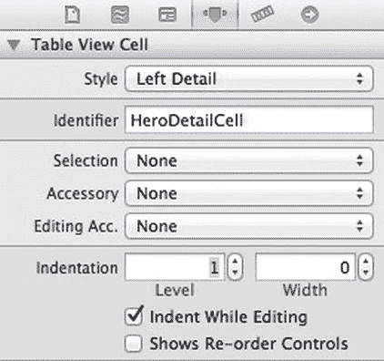

图 4-7. 表格视图单元格的属性

第二个分区需要一个标题标签，即 `General`。选中第二个分区中三个单元格正上方或正下方的区域。属性检查器应切换为表格视图分区（图 4-8）。在 `Header` 字段中输入 `General`。现在第二个分区应具有正确的标题标签。

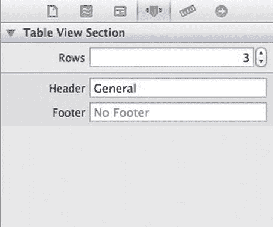

图 4-8. 表格视图分区的属性

顺便提一句，请注意表格视图分区属性检查器中的第一个字段是 `Rows`。你可以使用此字段将第一个分区的行数从三行改为一行。

因此，你的表格视图应如图 4-9 所示。看起来布局已经全部设置好了。

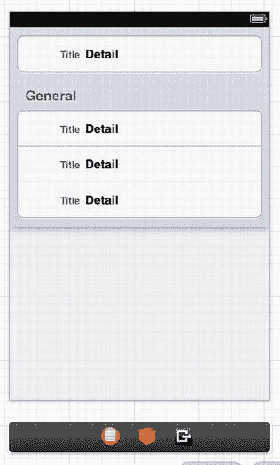

图 4-9. 表格视图布局完成

### 连接 Segue

当用户在 `HeroListController` 中点击某个单元格时，你希望应用程序跳转到你的详细表格视图。从 `HeroListController` 中的表格视图单元格按住 Control 键拖拽到你的详细表格视图（图 4-10）。当 Segue 弹出窗口出现时（图 4-11），在 `Selection Segue` 标题下选择 `push`。

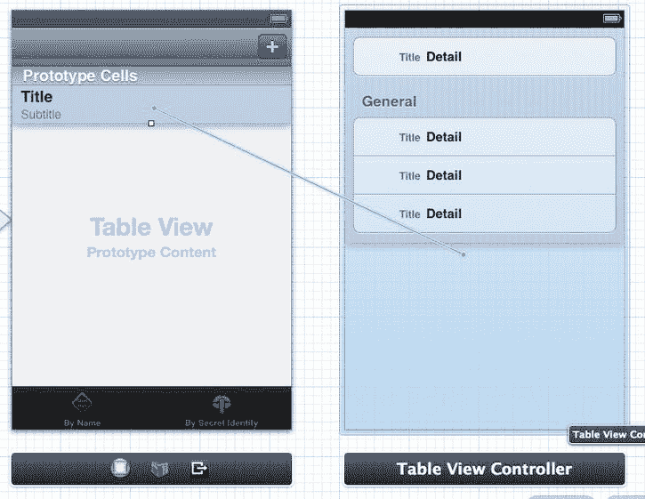

图 4-10. 通过按住 Control 键拖动创建 Segue

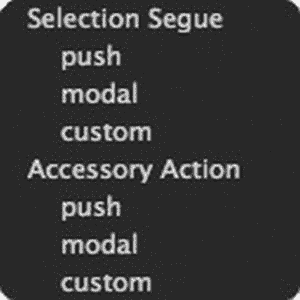

图 4-11. Segue 弹出选择器

现在你需要创建你的表格视图子类，以便填充你的详细表格视图单元格。

### HeroDetailController

在导航窗格中单击 `SuperDB` 组。创建一个新文件。在新文件助理中，选择 `Objective-C subclass` 并点击 `Next`。在下一个屏幕上，将类命名为 `HeroDetailController`，使其成为 `UITableViewController` 的子类。确保“Targeted for iPad”和“With XIB for user interface”均未选中。点击 `Next`。创建文件。

接下来，选择 `SuperDB.storyboard`。在故事板编辑器中，选择你的详细表格视图。确保缩放级别已设置，以便在详细表格视图标签中看到三个图标。选择表格视图控制器图标，并在实用工具窗格中打开标识检查器。在 `Custom Class` 部分，将 `Class` 字段更改为 `HeroDetailController`。

还有一件事。当你将 `UITableViewController` 子类化时，Xcode 会为你的 `HeroDetailController` 提供表格视图数据源和委托方法的实现。你现在不需要它们（但后面会用到），因此你可以将它们注释掉。找到以下方法：

```
- (NSInteger)numberOfSectionsInTableView:(UITableView *)tableView
- (NSInteger)tableView:(UITableView *)tableView numberOfRowsInSection:(NSInteger)section
- (UITableViewCell *)tableView:(UITableView *)tableView cellForRowAtIndexPath:(NSIndexPath *)indexPath
```

并将它们（包括方法体）注释掉。

你已创建了 `HeroDetailController`，并在故事板中将你的详细视图控制器设置为 `HeroDetailController` 的实例。现在，你将创建属性列表，用于定义表格分区。

### 详细视图挑战

表格视图架构旨在高效地展示集合中存储的数据。例如，你可能会使用表格视图来显示 `NSArray` 或获取结果控制器中的数据。然而，在创建详细视图时，你通常展示的是单个对象的数据，在本例中，该对象是代表单个超级英雄的 `NSManagedObject` 实例。托管对象使用键值编码，但没有机制以有意义的顺序展示其属性。例如，`NSManagedObject` 并不知道 `name` 属性是最重要的，也不清楚它是否应该像图 4-2 那样单独占据一个分区。

想出一种良好且可维护的方式来指定详细编辑视图中的分区和行，是一项非平凡的任务。最明显的解决方案（你在在线示例代码中会经常看到）是使用 `enum` 列出表格分区，然后为每个分区添加额外的 `enum`，包含常量和每个分区的行数，如下所示：

```
enum HeroEditControllerSections {
    HeroEditControllerSectionName = 0,
    HeroEditControllerSectionGeneral,
    HeroEditControllerSectionCount
};
enum HeroEditControllerNameSection {
    HeroEditControllerNameRow = 0,
    HeroEditControllerNameSectionCount
};
enum HeroEditControllerGeneralSection {
    HeroEditControllerGeneralSectionSecretIdentityRow,
    HeroEditControllerGeneralSectionBirthdateRow,
    HeroEditControllerGeneralSectionSexRow,
    HeroEditControllerGeneralSectionCount
};
```

然后，在提供索引路径的每个方法中，你可以使用 `switch` 语句根据索引路径表示的行和分区采取相应操作，如下所示：


```objc
- (void)tableView:(UITableView *)tableView didSelectRowAtIndexPath:(NSIndexPath *)indexPath
{
    NSUInteger section = [indexPath section];
    NSUInteger row = [indexPath row];
    switch (section) {
        case HeroEditControllerSectionName:
            switch (row)
        {
            case HeroEditControllerNameRow :
                // 创建一个控制器来编辑姓名
                // 并将其推入导航栈
                ...
                break;
            default:
                break;
        }
            break;
        case HeroEditControllerSectionGeneral:
            switch (row) {
                case HeroEditControllerGeneralSectionSecretIdentityRow:
                    // 创建一个控制器来编辑秘密身份
                    // 并将其推入导航栈
                    ...
                    break;
                case HeroEditControllerGeneralSectionBirthdateRow:
                    // 创建一个控制器来编辑出生日期
                    // 并将其推入导航栈
                    ...
                    break;
                case HeroEditControllerGeneralSectionSexRow:
                    // 创建一个控制器来编辑性别
                    // 并将其推入导航栈
                    ...
                    break;
                default:
                    break;
            }
            break;
        default:
            break;
    }
}
```

这种方法的问题在于其可扩展性非常差。像这样嵌套的`switch`语句几乎需要在每个接受`indexPath`的表格视图委托或数据源方法中出现，这意味着添加或删除行或节需要在多个地方更新代码。

此外，每个`case`语句下的代码也相对类似。在这个特定例子中，你必须创建一个新的控制器实例，或使用一个指向现有控制器的指针，设置一些属性来指示需要编辑哪些值，然后将控制器推入导航栈。如果你在这些`switch`语句的任何地方发现逻辑错误，很可能会需要在多个地方（甚至可能几十处）修改那个逻辑。

### 使用属性列表控制表格结构

如你所见，最显而易见的解决方案并不总是最好的。你不想让非常相似的代码块分散在控制器类的各个角落，也不想维护复杂决策树的多个副本。有一种更好的方法可以实现这一点。

你可以使用属性列表来镜像表格的结构。当用户在应用中向下导航时，你可以利用存储在属性列表中的数据来构建相应的表格。属性列表是一种简单但强大的信息存储方式。

*Beginning iOS 6 Development* 的第 10 章讨论了属性列表。我们在这里快速回顾一下。

#### 属性列表详解

属性列表是一种表示、存储和检索数据的简单方式。Mac OS X 和 iOS 都广泛使用属性列表。在属性列表中，可以使用两种数据类型：基本类型和集合类型。可用的基本类型包括字符串、数字、二进制数据、日期和布尔值。可用的集合类型包括数组和字典。集合类型可以包含基本类型，也可以包含其他集合。属性列表可以以两种文件格式存储：XML 和二进制数据。Xcode 提供了一个属性列表编辑器，方便你管理属性列表。稍后我们将讨论这一点。

属性列表以一个 *根节点* 开始。从技术上讲，根节点可以是任何类型（基本类型或集合类型）。然而，基本类型的属性列表用途有限，因为它只是单个值的“列表”。更常见的是使用集合类型的根节点：数组或字典。当你使用 Xcode 属性列表编辑器创建属性列表时，根节点将是一个字典。

**注意** 要了解更多关于属性列表的详细信息，请阅读 Apple 的文档：[`developer.apple.com/library/ios/#documentation/Cocoa/Conceptual/PropertyLists/Introduction/Introduction.html`](http://developer.apple.com/library/ios/#documentation/Cocoa/Conceptual/PropertyLists/Introduction/Introduction.html)

#### 使用属性列表建模表格结构

那么，如何使用属性列表来描述你的表格呢？请参考图 4-2。查看表格，你可以看到两个分区。第一个分区没有标题，但第二个分区有一个“General”标题。每个分区有一定数量的行（分别为一行和三行），每行代表托管对象的一个特定属性。此外，每行还有一个标签，告诉你正在显示什么值。

首先，将表格表示为一个数组，数组中的每一项代表表格的一个分区。每个分区又由一个字典表示。在分区字典中，有一个`header`键，用于存储标题的字符串值。请注意，表格的第一个分区没有标题；你可以使用一个空字符串来表示。

**注意** 回想一下，属性列表中只有五种基本数据类型：字符串、数字、二进制数据、日期和布尔值。这无法表示`nil`值。因此，你必须依赖空字符串来表示`nil`。

分区字典的第二个键是`rows`。这个键的值将是另一个数组，`rows`数组中的每一项代表渲染该行所需的数据。为了表示一行，你将使用另一个字典。这个行字典有一个`label`键，引用一个用作行标签的字符串，以及一个`attribute`键，这是一个字符串，表示要在该行渲染的托管对象属性。

感到困惑吗？别担心，用描述性语言来建模确实很难。图 4-12 试图以图形方式解释它。

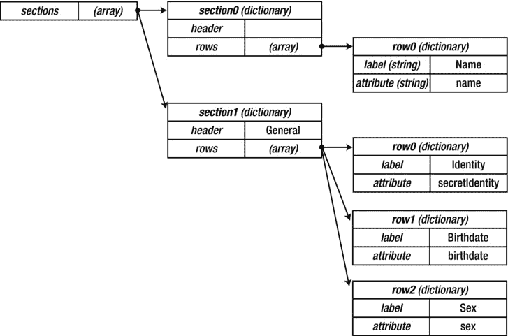

图 4-12. 属性列表的图形化表示

这应该就是你开始表示表格结构所需的所有数据结构。幸运的是，如果你发现每行还需要额外信息，你随时可以在后续添加更多数据，而不会影响现有的设计。

现在让我们开始构建你的详细视图。

#### 通过属性列表定义表格视图

在导航窗格中，选择 Supporting Files 组，使其高亮显示。然后，创建一个新文件。当新文件模板出现后，在 iOS 标题下选择 Resource。选择 Property List 模板（图 4-13），然后点击 Next。将文件命名为 `HeroDetailConfiguration.plist`，然后点击 Create。一个名为 `HeroDetailConfiguration.plist` 的新文件应该会出现在 Supporting Files 组中。该文件应被选中，并且编辑器应切换到属性列表编辑器模式（图 4-14）。

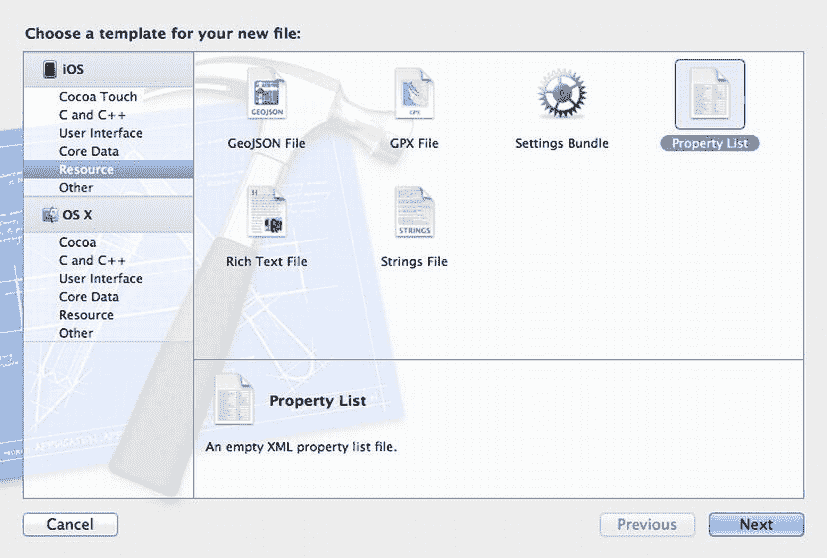

图 4-13. 资源文件模板

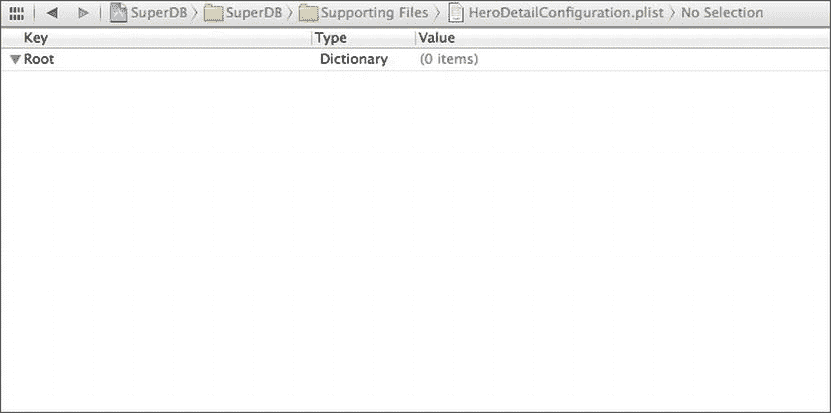

图 4-14. Xcode 属性列表编辑器模式


之前我们提到，属性列表的根节点是一个字典。这意味着每个节点都将是一个键/值对。你可以将键视为字符串，值则可以是任何一种基本数据类型（`string`、`number`、`binary data`、`date` 或 `Boolean`）或集合类型（`array` 或 `dictionary`）。

接下来，你将按照我们之前讨论的，从创建 `sections` 数组开始。为此，你需要在属性列表中添加一个新条目。有两种方法可以实现。这两种方法都需要你先选中 Key 列中名为 `Root` 的那一行。第一种方法是，在属性列表编辑器的空白区域按住 Control 键并点击。在弹出的菜单中选择“添加行”。或者，你也可以使用常规菜单“编辑器”  “添加条目”选项。无论哪种方式，属性列表编辑器中都会出现一个新行（图 4-15）。该条目的键应为 `New item`，并且会被选中并高亮显示。输入 **sections** 并按下 Return 键来更改键名。

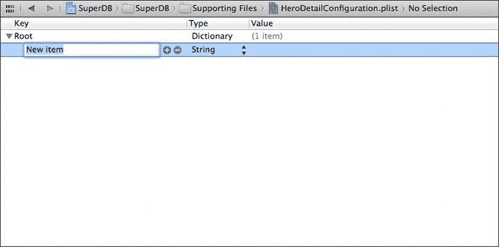

图 4-15.  向属性列表添加条目

接下来，点击“类型”列中 `string` 旁边的箭头，以显示所有可能的数据类型。选择 `array`。“值”列应变为显示 `(0 items)`。向 `sections` 数组添加条目有点棘手，所以请务必仔细遵循以下步骤。

当您将类型从 `string` 更改为 `array` 时，`sections` 键的左侧会添加一个展开三角形（图 4-16）。点击这个三角形使其指向下方（图 4-17）。现在点击 `sections` 右侧的 `+` 按钮。这将插入一个新行。此外，`sections` 的“值”列将变为显示 `(1 item)`。新行的键会是 `Item 0`；类型是 `string`；“值”列将被选中。不要输入任何内容；选中 `sections` 行使其高亮，然后再次点击 `sections` 旁边的 `+` 按钮。这将插入另一行，键为 `Item 1`，类型为 `string`，没有值。值单元格应被选中并显示光标。将 `Item 0` 和 `Item 1` 的类型从 `string` 更改为 `dictionary`（图 4-18）。

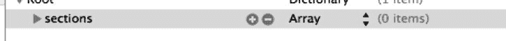

图 4-16.  将类型从 `string` 更改为 `array`


图 4-17.  点击展开三角形以展开数组

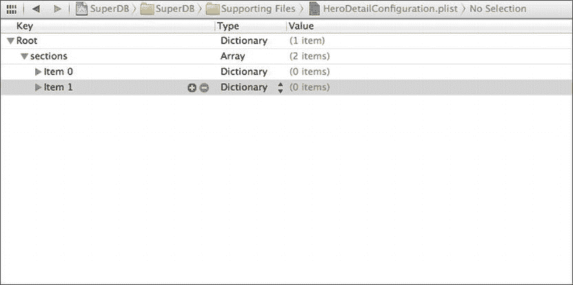

图 4-18.  添加两个字典条目

还记得你之前要创建一个数组，其中每个条目代表你的表视图的一个分区吗？你已经创建了这两个条目。`Item 0` 是 `HeroDetailController` 表视图的第一个分区；`Item 1` 是第二个。

现在你在每个分区下创建 `rows` 数组，以保存每个分区的行信息。`Item0` 旁边应该有一个展开三角形。打开它，然后点击 `Item0` 旁边的 `+`。这将在 `Item0` 下创建一个新行，其键为 `New Item`，类型为 `string`。将键更改为 `rows`，并将类型更改为 `array`。打开 `rows` 旁边的展开三角形，然后点击 `+` 按钮。这将创建另一个 `Item0`，这次是在 `rows` 下。将类型从 `string` 更改为 `dictionary`。重复此过程，在 `Item1` 标题下添加一个 `rows` 条目。这次，在这个第二个 `rows` 条目下创建三个条目。你的属性列表编辑器应如图 4-19 所示。

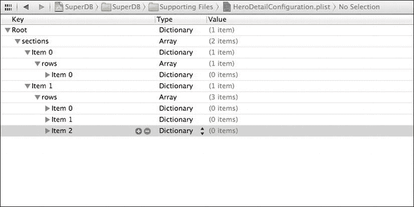

图 4-19.  `HeroDetailConfiguration.plist`

对于每个 `rows` 数组中的每个条目，你需要再添加两个子条目。它们的类型应为 `string`，它们的键应分别为 `key` 和 `label`。对于分区  `Item 0`  `rows`，`key` 的值应为 `name`，`label` 的值应设置为 `Name`。对于分区  `Item 1`  `rows`，`key` 和 `label` 的值应分别为：`secretIdentity` 和 `Identity`；`birthdate` 和 `Birthdate`；`sex` 和 `Sex`。完成后，属性列表编辑器窗格应如图 4-20 所示。

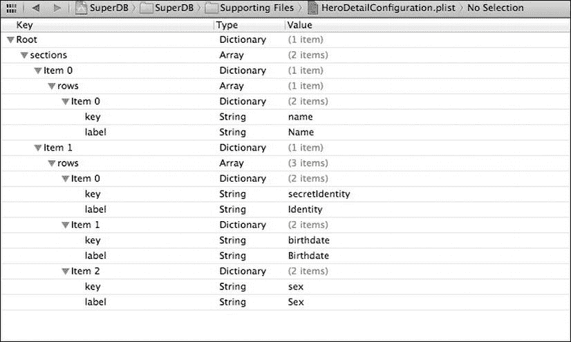

图 4-20.  完成的 `HeroDetailConfiguration.plist`

现在，你将使用这个属性列表来设置 `HeroDetailController` 的表视图。

### 解析属性列表

你需要添加一个属性来存储刚刚创建的属性列表中的信息。由于此属性仅需在 `HeroDetailController` 内部使用，你将通过 `HeroDetailController.m` 中的类别将其设为私有。

```
@interface HeroDetailController ()
@property (strong, nonatomic) NSArray *sections;
@end
```

接下来，你需要加载属性列表并读取 `sections` 键。在 `viewDidLoad` 方法结束前，添加以下代码：

```
NSURL *plistURL = [[NSBundle mainBundle] URLForResource:@"HeroDetailConfiguration"
                                           withExtension:@"plist"];
NSDictionary *plist = [NSDictionary dictionaryWithContentsOfURL:plistURL];
self.sections = [plist valueForKey:@"sections"];
```

你声明了一个类型为 `NSArray` 的属性 `sections`，用于保存 `HeroDetailConfiguration.plist` 属性列表中 `sections` 数组的内容。你使用 `NSDictionary` 的类方法 `dictionaryWithContentsOfURL:` 读取属性列表的内容。由于你知道这个字典只有一个键/值对，键为 `sections`，所以你将该值读入 `sections` 属性。然后你使用该属性来布局 `HeroDetailController` 的表视图。

现在你已经拥有了填充 `HeroDetailController` 表视图单元格所需的元数据，但还没有数据。数据应通过以下两种方式之一来自 `HeroListController`：当用户点击某个单元格时，以及当用户点击添加（`+`）按钮时。

### 推送详细信息

在你能从 `HeroListController` 发送数据之前，你需要在 `HeroDetailController` 中有一个接收者。在 `HeroDetailController.h` 的 `HeroDetailController` 接口声明中添加以下属性：

```
@property (strong, nonatomic) NSManagedObject *hero;
```

现在编辑 `HeroListController.m`。找到 `addHero:` 方法。将

```
[NSEntityDescription insertNewObjectForEntityForName:[entity name]
                               inManagedObjectContext:managedObjectContext];
```

这一行改为

```
NSManagedObject *newHero = [NSEntityDescription insertNewObjectForEntityForName:[entity name]
                                                 inManagedObjectContext:managedObjectContext];
```

然后在末尾添加以下代码：

```
[self performSegueWithIdentifier:@"HeroDetailSegue" sender:newHero];
```

首先，你将新的 `Hero` 实例赋值给变量 `newHero`。然后你告诉 `HeroListController` 执行名为 `HeroDetailSegue` 的 Segue，并将 `newHero` 作为发送者传递。这个 Segue 名称 `HeroDetailSegue` 是从哪里来的？来自你。

还记得你之前为用户点击 `HeroListController` 中的某个单元格而创建的 Segue 吗？嗯，现在你将移除它。为什么？因为它无法提供从单元格和添加（`+`）按钮进行转换所需的灵活性。你需要创建一个手动 Segue，并从代码中调用它。


### 排版后的文本

选择`SuperDB.storyboard`，找到`HeroListController`和`HeroDetailController`之间的转场，删除它。从`HeroListController`（标签中的图标）按住 Control 键拖拽到`HeroDetailController`（视图中的某个位置）。此时会弹出一个标题为`Manual Segue`的弹出窗口；选择`push`菜单项。两个视图控制器之间会出现一个新的转场，选中它。在属性检查器中，将其标识符设为`HeroDetailSegue`（Figure 4-21）。

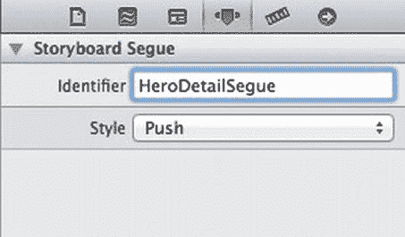

Figure 4-21. 设置转场标识符

现在需要重新将`HeroListController`的单元格连接到`HeroDetailSegue`。编辑`HeroListController.m`，找到`tableView:didSelectRowAtIndexPath:`方法，将方法体替换为：

```
NSManagedObject *selectedHero = [self.fetchedResultsController objectAtIndexPath:indexPath];
[self performSegueWithIdentifier:@"HeroDetailSegue" sender:selectedHero];
```

本质上你做的操作与`addHero:`中相同，区别在于这里的`Hero`对象来自`fetched results controller`而不是新建的。目前看来一切正常，但你仍然没有向`HeroDetailController`发送数据。你需要在`UIViewController`的`prepareForSegue:sender:`方法中处理这个问题。将该方法添加到`HeroListController`中（可以放在任何位置，但这里放在`setEditing:animated:`方法之后）：

```
- (void)prepareForSegue:(UIStoryboardSegue *)segue sender:(id)sender
{
    if ([segue.identifier isEqualToString:@"HeroDetailSegue"])
    {
        if ([sender isKindOfClass:[NSManagedObject class]]) {
            HeroDetailController *detailController = segue.destinationViewController;
            detailController.hero = sender;
        }
        else {
            UIAlertView *alert =
                  [[UIAlertView alloc] initWithTitle:NSLocalizedString(@"Hero Detail Error",
                                                                       @"Hero Detail Error")
                                         message:NSLocalizedString(@"Error trying to show Hero detail",
                                                                   @"Error trying to show Hero detail")
                                        delegate:self
                               cancelButtonTitle:NSLocalizedString(@"Aw, Nuts", @"Aw, Nuts")
                               otherButtonTitles:nil];
            [alert show];
        }
    }
}
```

注意，`prepareForSegue:sender:` 内部是由`performSegueWithName:sender:`调用的。这是苹果提供的一个钩子，让你可以在显示`HeroDetailController`之前正确设置内容。

顺便提一下，Xcode 应该已经提示了`HeroDetailController`和`detailController.hero`的问题。在`HeroListViewController.m`的顶部添加以下`#import`：

```
#import "HeroDetailController.h"
```

### 显示详情

你正在将`Hero`对象从`HeroListController`向下传递到`HeroDetailController`。现在准备显示详情。编辑`HeroDetailController.m`，找到`tableView:cellForRowAtIndexPath:`。记得你之前注释掉了它，所以它不会出现在跳转栏的函数菜单中。取消注释并替换方法体为：

```
static NSString *CellIdentifier = @"HeroDetailCell";
UITableViewCell *cell = [tableView dequeueReusableCellWithIdentifier:CellIdentifier];
if (cell == nil)
    cell = [[UITableViewCell alloc] initWithStyle:UITableViewCellStyleValue2
                                   reuseIdentifier:CellIdentifier];
// Configure the cell...
NSUInteger sectionIndex = [indexPath section];
NSUInteger rowIndex = [indexPath row];
NSDictionary *section = [self.sections objectAtIndex:sectionIndex];
NSArray *rows = [section objectForKey:@"rows"];
NSDictionary *row = [rows objectAtIndex:rowIndex];
cell.textLabel.text = [row objectForKey:@"label"];
cell.detailTextLabel.text = [self.hero valueForKey:[row objectForKey:@"key"]];
return cell;
```

构建并运行应用。你会看到英雄列表，点击一个英雄查看详情。

没有生效，是吗？为什么？问题出在`birthdate`属性上。回想一下，`birthdate`是一个`NSDate`对象，而`cell.textLabel.text`需要的是字符串。稍后你会妥善处理这个问题，但现在先将赋值语句改为：

```
cell.detailTextLabel.text = [[self.hero valueForKey:[row objectForKey:@"key"]] description];
```

再次尝试运行。查看一个已有英雄并尝试添加一个新英雄。添加英雄后，详情视图应该看起来像 Figure 4-22。

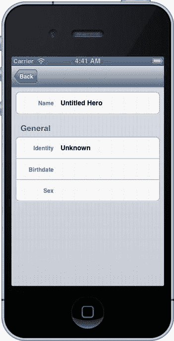

Figure 4-22. 新英雄的详情视图

### 编辑详情

回顾 Figure 4-2 并与 Figure 4-22 进行对比。注意 Figure 4-2 中的左侧图像在导航栏右侧有一个"Edit"按钮。并且 Figure 4-2 指定了详情视图的"Edit"模式，如右侧图像所示。现在我们来添加"Edit"按钮并在`HeroDetailController`中实现编辑模式。

#### 详情视图中的编辑模式

比较 Figure 4-2 中的两张图片。它们有何不同？首先，左侧图像中的"Edit"按钮在右侧图像中已被替换为"Save"按钮。此外，"Save"按钮处于高亮状态。"Back"按钮被替换为"Cancel"按钮。右侧图像中的单元格看起来有缩进。虽然看起来改动很多，但实际上实现起来并不费力。

首先，在导航栏中添加"Edit"按钮。选择`HeroDetailController.m`并找到`viewDidLoad`方法。取消注释以下代码行：

```
self.navigationItem.rightBarButtonItem = self.editButtonItem;
```

运行应用并进入详情视图。导航栏右侧出现了"Edit"按钮。如果点击它，视图应该变成 Figure 4-23 所示的样子。

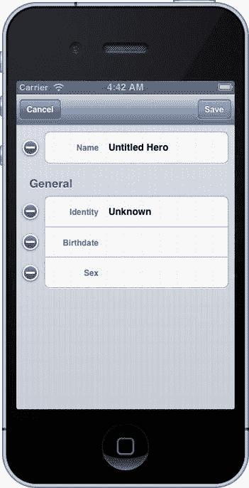

Figure 4-23. 处于编辑模式的详情视图

注意"Edit"按钮已自动更改为"Done"按钮并处于高亮状态。如果点击"Done"，它将恢复为"Edit"按钮。这没问题，但你更希望"Done"按钮显示为"Save"。这需要额外一点工作。

如你所见，`editButtonItem`方法返回一个`UIBarButton`实例，按下时会在"Edit"和"Done"之间切换。同时它也会切换`HeroDetailController`（从`UITableViewController`继承该属性）中的`editing`属性，在`NO`和`YES`之间切换。该按钮还会调用`setEditing:animated:`回调。

你想要将"Done"替换为"Save"。为了实现这一点，你需要将"Edit"按钮替换为"Save"按钮。同时，添加一个专门处理保存的方法，稍后你会用到。首先，你需要添加一个`Save`按钮属性和一个回调方法。由于你只在`HeroDetailController`内部访问`Save`按钮，可以将其设为私有属性。同样，由于回调仅由`Save`按钮使用，也可以将其声明为私有的。编辑`HeroDetailController.m`并将其添加到类别中。

```
@interface HeroDetailController ()
@property (strong, nonatomic) NSArray *sections;
@property (strong, nonatomic) UIBarButtonItem *saveButton;
- (void)save;
@end
```

现在需要创建一个`Save`按钮的实例并赋值给这个变量。在`HeroDetailController.m`的`viewDidLoad`方法中，在你刚刚取消注释的"Edit"按钮代码之后添加以下内容。

```
self.saveButton = [[UIBarButtonItem alloc] initWithBarButtonSystemItem:UIBarButtonSystemItemSave
                                                                 target:self
                                                                 action:@selector(save)];
```


现在，你需要在“编辑”和“保存”按钮之间进行切换。但应该在哪里调用这个方法呢？记住，当“编辑”按钮被按下时，它会调用 `setEditing:animated:` 方法。请重写默认的 `setEditing:animated:` 方法，并在其中实现按钮的切换逻辑。

```
- (void)setEditing:(BOOL)editing animated:(BOOL)animated
{
        [super setEditing:editing animated:animated];
        self.navigationItem.rightBarButtonItem = (editing) ? self.saveButton : self.editButtonItem;
}
```

你还需要添加 `save` 方法（将其放在文件底部，`@end` 之前）。

```
#pragma mark - (Private) Instance Methods
- (void)save
{
        [self setEditing:NO animated:YES];
}
```

保存你的工作并运行应用程序。导航到详情视图，然后点击“编辑”按钮。随着你在编辑模式中切换，它应该会在“编辑”和“保存”之间切换。现在，我们来修改它，让“返回”按钮变成一个“取消”按钮。

这个过程与你为“编辑/保存”按钮所做的几乎相同：声明一个属性和回调方法，并在导航栏中切换按钮。不过，你还需要一个属性来存储“返回”按钮。将以下内容添加到 `HeroDetailController` 类别中：

```
@property (strong, nonatomic) UIBarButtonItem *backButton;
@property (strong, nonatomic) UIBarButtonItem *cancelButton;
- (void)cancel;
```

将 `backButton` 分配给左侧导航栏按钮，并在 `viewDidLoad` 中创建 `Cancel` 按钮的实例。

```
self.backButton = self.navigationItem.leftBarButtonItem;
self.cancelButton = [[UIBarButtonItem alloc] initWithBarButtonSystemItem:UIBarButtonSystemItemCancel
                               target:self
                               action:@selector(cancel)];
```

修改 `setEditing:animated:` 以在“返回”和“取消”按钮之间切换。

```
self.navigationItem.leftBarButtonItem = (editing) ? self.cancelButton : self.backButton;
```

最后，添加 `cancel` 回调方法。目前，它与 `save` 方法相同，但很快你会对其进行修改。

```
- (void)cancel
{
    [self setEditing:NO animated:YES];
}
```

再次运行应用程序。当你在详情视图中点击“编辑”按钮时，“返回”按钮应该会切换为“取消”。如果你按下“取消”按钮，应该会退出编辑模式。

现在，你想要消除编辑模式下每个单元格右侧出现的红色按钮。当你点击这些按钮时，它们会旋转，并且会在相应的单元格中出现一个“删除”按钮。这对于详情视图来说并不真正相关，你无法删除一个属性（但你确实可以清除它，或者将其值设置为 `nil`）。所以你希望这个按钮根本不出现。在 `HeroDetailController.m` 中添加这个方法（放在其他表格视图委托方法附近）：

```
- (UITableViewCellEditingStyle)tableView:(UITableView *)tableView
            editingStyleForRowAtIndexPath:(NSIndexPath *)indexPath
{
    return UITableViewCellEditingStyleNone;
}
```

运行应用程序，可以看到红色按钮消失了。你可以在详情视图中进出编辑模式，但仍旧无法编辑任何内容。要实现此功能，你还有不少工作要做。

### 创建自定义 `UITableViewCell` 子类

让我们看看“通讯录”应用程序。当你编辑某个联系人的属性时，会出现一个带有键盘的辅助视图（图 4-24），支持内联编辑。你将在你的 `SuperDB` 应用程序中模拟这个功能。这需要你开发一个自定义的 `UITableViewCell` 子类。

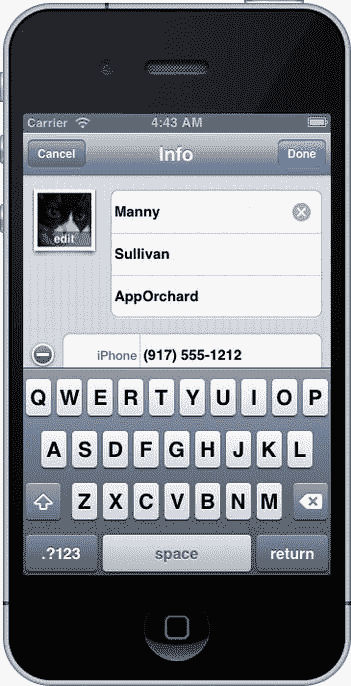

图 4-24. 在“通讯录”应用程序中进行编辑

让我们来看一下当前表格视图单元格的布局。目前，你设置了单元格的两个部分：`textLabel` 和 `detailTextLabel`（图 4-25）。这两个部分都是静态文本；你可以通过编程方式赋值，但无法通过用户界面与它们进行交互。iOS SDK 没有提供一个类，让你可以静态地赋值 `textLabel`，同时编辑 `detailTextLabel` 部分。这就是你需要构建的内容。

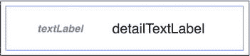

图 4-25. 当前表格视图单元格的分解

关键组件是，用 `UITextField` 替换 `detailTextLabel` 属性。这将使你能够在表格视图单元格中进行编辑。由于你替换了表格视图单元格的一部分，你也必须替换 `textLabel`。因为该文本是静态的，你将使用 `UILabel`。原则上，你的自定义表格视图单元格应该看起来像图 4-26。


图 4-26. 自定义表格视图单元格的分解

让我们开始吧。

在导航窗格中单击 `SuperDB` 组，创建一个新文件。在 iOS/Cocoa Touch 模板下选择 Objective-C 类。使该类成为 `UITableViewCell` 的子类。将文件命名为 `SuperDBEditCell.m`。点击“Next”，然后点击“Create”。

你需要一个 `UILabel` 和一个 `UITextField`。将这些属性添加到 `SuperDBEditCell.h` 中。

```
@interface SuperDBEditCell : UITableViewCell

@property (strong, nonatomic) UILabel *label;
@property (strong, nonatomic) UITextField *textField;
@end
```

现在，添加适当的初始化代码。编辑 `SuperDBEditCell.m` 并找到 `initWithStyle:reuseIdentifier:`。在“Initialization Code”注释之后，立即添加：

```
self.selectionStyle = UITableViewCellSelectionStyleNone;

self.label = [[UILabel alloc] initWithFrame:CGRectMake(12.0, 15.0, 67.0, 15.0)];
self.label.backgroundColor = [UIColor clearColor];
self.label.font = [UIFont boldSystemFontOfSize:[UIFont smallSystemFontSize]];
self.label.textAlignment = NSTextAlignmentRight;
self.label.textColor = kLabelTextColor;
self.label.text = @"label";
[self.contentView addSubview:self.label];

self.textField = [[UITextField alloc] initWithFrame:CGRectMake(93.0, 13.0, 170.0, 19.0)];
self.textField.backgroundColor = [UIColor clearColor];
self.textField.clearButtonMode = UITextFieldViewModeWhileEditing;
self.textField.enabled = NO;
self.textField.font = [UIFont boldSystemFontOfSize:[UIFont systemFontSize]];
self.textField.text = @"Title";
[self.contentView addSubview:self.textField];
```

请注意，`kLabelTextColor` 是一个你计算出来的常量，这样标签将拥有与之前相同的颜色。在 `@implementation` 指令之前添加这个 `#define`：

```
#define kLabelTextColor [UIColor colorWithRed:0.321569f green:0.4f blue:0.568627f alpha:1.0f]
```

现在，你需要调整 `HeroDetailController` 以使用 `SuperDBEditCell`。但在此之前，你需要修复 `SuperDB.storyboard` 中的配置。

打开 `SuperDB.storyboard`，选择 `HeroDetailController` 中的第一个表格视图单元格。打开 Identity Inspector，并将 Class 字段更改为 `SuperDBEditCell`。切换到 Attributes Inspector，并将 Style 更改为 Custom。对其他三个表格视图单元格重复此操作。

打开 `HeroDetailController.m`。添加这个 `#import` 指令作为第二条 `#import` 指令：

```
#import "SuperDBEditCell.h"
```

然后，找到 `tableView:cellForRowAtIndexPath:` 并将其编辑为：


```objective-c
static NSString *CellIdentifier = @"SuperDBEditCell";
SuperDBEditCell *cell = [tableView dequeueReusableCellWithIdentifier:CellIdentifier];
if (cell == nil)
    cell = [[SuperDBEditCell alloc] initWithStyle:UITableViewCellStyleValue2
                                   reuseIdentifier:CellIdentifier];
// 配置单元格...
NSUInteger sectionIndex = [indexPath section];
NSUInteger rowIndex = [indexPath row];
NSDictionary *section = [self.sections objectAtIndex:sectionIndex];
NSArray *rows = [section objectForKey:@"rows"];
NSDictionary *row = [rows objectAtIndex:rowIndex];
cell.label.text = [row objectForKey:@"label"];
cell.textField.text = [[self.hero valueForKey:[row objectForKey:@"key"]] description];
return cell;
```

保存并运行应用。它的行为应该和你创建自定义表格视图单元格之前完全一样。现在你可以开启编辑功能。

在`SuperDBEditCell.m`中重写`setEditing:`方法。

```objective-c
- (void)setEditing:(BOOL)editing animated:(BOOL)animated
{
   [super setEditing:editing animated:animated];
    self.textField.enabled = editing;
}
```

再次保存并运行应用。导航到详情视图，进入编辑模式。点击“Identity”行的“Unknown Hero”。你应该看到键盘输入视图出现在屏幕底部，并且在“Unknown Hero”的末尾出现光标。点击另一行，光标应出现在该行。

我们来编辑“Identity”行。点击“Unknown Hero”激活键盘输入视图。点击单元格右端的 **x** 按钮，这应该会擦除“Unknown Hero”。然后输入 **Super Cat**，并点击“Save”。你应该退出编辑模式，并且你的英雄的新身份应该显示为“Super Cat”。点击“Back”返回列表视图。

等等，发生了什么？你将英雄重命名为“Super Cat”，但列表视图仍然显示“Unknown Hero”。如果你点击“Unknown Hero”行，详情视图也仍然显示“Unknown Hero”。为什么你的更改没有被保存？

还记得你之前为详情视图添加了“Save”按钮吗？你还添加了一个回调`save`，在按下“Save”按钮时被调用。让我们再看看这个回调。

```objective-c
- (void)save
{
    [self setEditing:NO animated:YES];
}
```

注意这个方法**并没有保存任何东西**！它所做的只是关闭编辑模式。让我们弄清楚如何真正保存你的更改。

### 保存你的更改

让我们回顾一下你的详情视图。详情视图是一个由`HeroDetailController`管理的表格视图。`HeroDetailController`还持有一个对`Hero`对象的引用，这是一个`NSManagedObject`。表格视图中的每一行都是你的自定义表格视图单元格类`SuperDBEditCell`。根据你需要的行，你会分配一个不同的英雄属性来显示。

现在，为了保存你做出的更改，“Save”按钮会调用`save`方法。这就是你需要将更改保存到`NSManagedObject`的地方。你将修改`SuperDBEditCell`类，使其知道它正在显示哪个属性。此外，你将定义一个属性`value`，用来告诉你在单元格中的新数据。

首先，将你的属性添加到`SuperDBEditCell.h`中。

```objective-c
@property (strong, nonatomic) NSString *key;
@property (strong, nonatomic) id value;
```

接下来，编辑`SuperDBEditCell.m`，为`value`属性定义属性覆盖方法。

```objective-c
#pragma mark - 属性覆盖
- (id)value
{
    return self.textField.text;
}
- (void)setValue:(id)aValue
{
    self.textField.text = aValue;
}
```

最后，修改`HeroDetailController.m`，在`tableView:cellForRowAtIndexPath`方法中为每个单元格分配键名。

```objective-c
cell.key = [row objectForKey:@"key"];
```

然后在`save`方法中遍历每个单元格，以更新英雄的属性。

```objective-c
for (SuperDBEditCell *cell in [self.tableView visibleCells])
    [self.hero setValue:[cell value] forKey:[cell key]];

NSError *error;
if (![self.hero.managedObjectContext save:&error])
    NSLog(@"保存时出错: %@", [error localizedDescription]);

[self.tableView reloadData];
```

保存并运行应用程序。导航到详情视图，进入编辑模式。将“Identity”改为“Super Cat”并点击“Save”。点击“Back”按钮返回列表视图。你应该看到英雄的身份现在显示为“Super Cat”。

现在，你将开始为“Birthdate”和“Sex”属性处理专门的输入视图。

### 专用输入视图

注意，当你在详情视图中点击“Birthdate”或“Sex”行时，会显示键盘输入视图。你可以允许用户通过键盘输入出生日期或性别并验证输入，但有一种更好的方法。你可以创建`SuperDBEditCell`的子类来处理这些特殊情况。

#### DatePicker SuperDBEditCell 子类

在导航器面板中单击一下`SuperDB`组，然后创建一个新文件。选择“Objective-C”类，并将其设为`SuperDBEditCell`的子类。将类命名为**SuperDBDateCell**并创建文件。编辑`SuperDBDateCell.m`，内容如下：

```objective-c
#import "SuperDBDateCell.h"

static NSDateFormatter *__dateFormatter = nil;

@interface SuperDBDateCell ()
@property (strong, nonatomic) UIDatePicker *datePicker;
- (IBAction)datePickerChanged:(id)sender;
@end

@implementation SuperDBDateCell

+ (void)initialize
{
    __dateFormatter = [[NSDateFormatter alloc] init];
    [__dateFormatter setDateStyle:NSDateFormatterMediumStyle];
}
- (id)initWithStyle:(UITableViewCellStyle)style reuseIdentifier:(NSString *)reuseIdentifier
{
    self = [super initWithStyle:style reuseIdentifier:reuseIdentifier];
    if (self) {
        // 初始化代码
        self.textField.clearButtonMode = UITextFieldViewModeNever;
        self.datePicker = [[UIDatePicker alloc] initWithFrame:CGRectZero];
        self.datePicker.datePickerMode = UIDatePickerModeDate;
        [self.datePicker addTarget:self
                             action:@selector(datePickerChanged:)
                   forControlEvents:UIControlEventValueChanged];
        self.textField.inputView = _datePicker;
    }
    return self;
}
#pragma mark - SuperDBEditCell 覆盖
- (id)value
{
    if (self.textField.text == nil || [self.textField.text length] == 0)
        return nil;
    return self.datePicker.date;
}
- (void)setValue:(id)value
{
    if (value != nil && [value isKindOfClass:[NSDate class]]) {
        [self.datePicker setDate:value];
        self.textField.text = [__dateFormatter stringFromDate:value];
    }
    else {
        self.textField.text = nil;
    }
}
#pragma mark - (私有) 实例方法
- (IBAction)datePickerChanged:(id)sender
{
    NSDate *date = [self.datePicker date];
    self.value = date;
    self.textField.text = [__dateFormatter stringFromDate:date];
}

@end
```

你在这里做了什么？你定义了一个`NSDateFormatter`类型的局部静态变量`__dateFormatter`。你这样做是因为创建`NSDateFormatter`是一个开销很大的操作，并且你不希望每次需要格式化`NSDate`对象时都创建一个新实例。你本可以将其设为`SuperDBDateCell`的一个私有属性并延迟创建它，但那意味着你会为每个`SuperDBDateCell`实例创建一个新的格式化器。通过将其设为局部静态变量，你只需要在`SuperDB`应用程序的生命周期内创建一个实例。

接下来，你声明了一个私有的`UIDatePicker`属性`datePicker`，以及一个用于`datePicker`的回调`datePickerChanged`。

在`SuperDBDateCell`的`@implementation`中，你定义了一个类方法`+initialize`。这是一个从`NSObject`继承的特殊类方法。`SuperDB`应用程序会在任何对`SuperDBDateCell`类或其实例的调用之前，**恰好调用一次**`SuperDBDateCell + initialize`。这就是你初始化局部静态变量`__dateFormatter`以持有一个`NSDateFormatter`实例的地方。


你添加了一些自定义初始化代码到 `initWithStyle:reuseIdentifier:` 中。这是你实例化 `datePicker` 属性并将其赋值给 `textField` 的 `inputView` 属性的地方。通常 `inputView` 为 `nil`，这告诉 iOS 对 `textField` 使用键盘输入视图。通过为其分配一个替代视图，你告诉 iOS 在编辑 `textField` 时显示该替代视图。

`SuperDBDateCell` 重写了 `value` 属性，以确保你显示和返回一个 `NSDate`，而不是 `NSString`。这里你使用 `__dateFormatter` 将日期转换为字符串，然后将其赋值给 `textField` 的 `text` 属性。

最后，你实现了当通过 UI 更改日期时 `datePicker` 的回调。每次你在 `datePicker` 中更改日期，都要更新 `textField` 以反映该更改。

### 使用 DatePicker SuperDBEditCell 子类

让我们回顾一下表格视图单元格是如何创建的。在 `HeroDetailController` 中，你在 `tableView:cellForRowAtIndexPath:` 方法中创建了单元格。当你第一次编写此方法时，你创建了一个 `UITableViewCell` 实例。后来，你将其替换为自定义子类 `SuperDBEditCell` 的实例。现在你为特定的 `IndexPath`（即显示出生日期属性的那个 `IndexPath`）创建了另一个子类。你如何告诉你的应用程序使用哪个自定义子类？没错，你将把那个信息添加到你的属性列表中：`HeroDetailController.plist`。

单击 `HeroDetailController.plist`。展开所有展开三角形，以便你可以看到所有元素。向下导航到 sections  Item 0  rows  Item 0  key。单击 key 行使其高亮显示。单击 key 旁边的 `+` 按钮。将此行从 `New Item` 重命名为 `class`。在 value 列中，键入 `SuperDBEditCell`。对 sections  Item 1 下的所有 key 行重复此操作。它们都应该有值 `SuperDBEditCell`，除了 birthdate 键下方的 class 行。该行的值应为 `SuperDBDateCell`（图 4-27）。

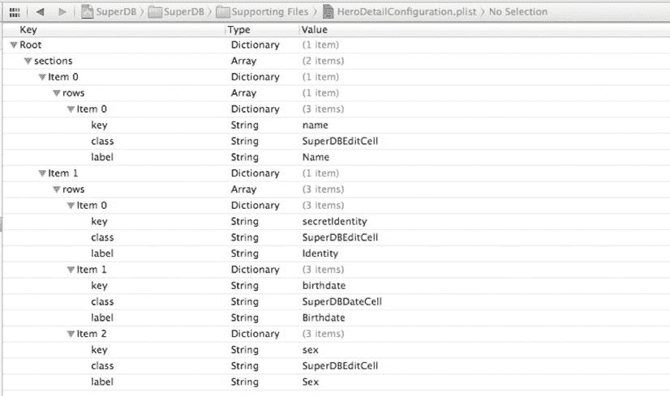

图 4-27.  添加表格视图单元格类键后的 `HeroDetailController.plist`

你需要修改 `tableView:cellForRowAtIndexPath:` 以利用你刚刚放置在属性列表中的信息。打开 `HeroDetailController.m`，并将 `tableView:cellForRowAtIndexPath:` 编辑为如下所示：

```
- (UITableViewCell *)tableView:(UITableView *)tableView cellForRowAtIndexPath:(NSIndexPath *)indexPath
{
    NSUInteger sectionIndex = [indexPath section];
    NSUInteger rowIndex = [indexPath row];
    NSDictionary *section = [self.sections objectAtIndex:sectionIndex];
    NSArray *rows = [section objectForKey:@"rows"];
    NSDictionary *row = [rows objectAtIndex:rowIndex];
    NSString *cellClassname = [row valueForKey:@"class"];
    SuperDBEditCell *cell = [tableView dequeueReusableCellWithIdentifier:cellClassname];
    if (cell == nil) {
        Class cellClass = NSClassFromString(cellClassname);
        cell = [cellClass alloc];
        cell = [cell initWithStyle:UITableViewCellStyleValue2 reuseIdentifier:cellClassname];
    }
    // 配置单元格...
    cell.key = [row objectForKey:@"key"];
    cell.value = [self.hero valueForKey:[row objectForKey:@"key"]];
    cell.label.text = [row objectForKey:@"label"];
    return cell;
}
```

保存并运行应用程序。向下导航到详细信息视图，并进入编辑模式。单击标签旁边的 `Birthdate` 单元格。附件输入视图应该会出现，并且应该是一个设置为今天日期的日期选择器。当你在日期选择器中更改日期时，表格视图单元格中的日期应该会更改。

还有一个输入需要处理。这个版本的应用程序使用字符串属性编辑器来征求超级英雄的性别（抱歉，我们忍不住要提一下！）。这意味着除了输入是一个有效字符串之外，没有其他验证。用户可以输入 M、Male、MALE 或 Yes, Please，它们都会被应用程序欣然接受。这意味着，稍后如果你想按性别让用户排序或搜索他们的英雄，你可能会遇到问题，因为数据不会以一致的方式结构化。接下来你将处理这个问题。

### 实现选择拾取器

正如你之前所见，你可以通过使用正则表达式来强制规定特定的性别拼写，如果用户输入了 Male 或 Female 以外的内容，就弹出一个警告。这样做可以防止输入你不希望的值，但这种方法不太友好。你不想惹恼你的用户。为什么非要让他们打字呢？这里只有两种可能的选择。为什么不呈现一个选择列表，让用户直接点击他们想要的那个？嘿，这听起来是个好主意！很高兴你想到这个。现在让我们实现它，好吗？

再次创建一个新的 Objective-C 类，并使其成为 `SuperDBEditCell` 的子类。将类命名为 `SuperDBPickerCell`，因为它将使用 `UIPickerView`。你将要做的许多事情与为 `SuperDBDateCell` 所做的类似，但也有一些关键的区别。

编辑 `SuperDBPickerCell.h` 中的接口定义，使其如下所示：

```
@interface SuperDBPickerCell : SuperDBEditCell < UIPickerViewDataSource, UIPickerViewDelegate>

@property (strong, nonatomic) NSArray *values;

@end
```

该属性名为 `pickerValues`，它将保存可能的选项。你还在 `SuperDBPickerCell` 中添加了 `UIPickerViewDataSource` 和 `UIPickerViewDelegate` 协议。

现在，让我们编辑 `SuperDBPickerCell.m` 中 `SuperDBPickerCell` 的实现：

```
@interface SuperDBPickerCell ()
@property (strong, nonatomic) UIPickerView *pickerView;
@end

@implementation SuperDBPickerCell

- (id)initWithStyle:(UITableViewCellStyle)style reuseIdentifier:(NSString *)reuseIdentifier
{
    self = [super initWithStyle:style reuseIdentifier:reuseIdentifier];
    if (self) {
        self.textField.clearButtonMode = UITextFieldViewModeNever;
        self.pickerView = [[UIPickerView alloc] initWithFrame:CGRectZero];
        self.pickerView.dataSource = self;
        self.pickerView.delegate = self;
        self.pickerView.showsSelectionIndicator = YES;
        self.textField.inputView = self.pickerView;
    }
    return self;
}
#pragma mark UIPickerViewDataSource 方法
- (NSInteger)numberOfComponentsInPickerView:(UIPickerView *)pickerView
{
    return 1;
}
- (NSInteger)pickerView:(UIPickerView *)pickerView numberOfRowsInComponent:(NSInteger)component
{
    return [self.values count];
}
#pragma mark - UIPickerViewDelegate 方法
- (NSString *)pickerView:(UIPickerView *)pickerView
              titleForRow:(NSInteger)row
             forComponent:(NSInteger)component
{
    return [self.values objectAtIndex:row];
}
- (void)pickerView:(UIPickerView *)pickerView
       didSelectRow:(NSInteger)row        inComponent:(NSInteger)component
{
    self.value = [self.values objectAtIndex:row];
}
#pragma mark - SuperDBEditCell 重写方法
- (void)setValue:(id)value
{
    if (value != nil) {
        NSInteger index = [self.values indexOfObject:value];
        if (index != NSNotFound) {
            self.textField.text = value;
        }
    }
    else {
        self.textField.text = nil;
    }
}
@end
```


`SuperDBPickerCell` 在概念上与 `SuperDBDateCell` 完全相同。它并非使用 `NSDatePicker`，而是采用 `UIPickerView`。为了让 `pickerView` 知道要显示什么内容，你需要让 `SuperDBDateCell` 遵循 `UIPickerViewDataSource` 和 `UIPickerViewDelegate` 协议。当选择器的值发生变化时，无需在 `pickerView` 上设置回调，而是使用委托方法 `pickerView:didSelectRow:`。由于你将值存储为字符串，因此无需重写取值方法的实现。但是，你需要重写赋值方法。

你需要告诉应用程序对“性别”属性使用这个新类。编辑属性列表 `HeroDetailController.plist` 中的 class 行。将值从 `SuperDBEditableCell` 改为 `SuperDBPickerCell`。确保你更改的是正确的行。label 行应为 Sex，attribute 行应为 sex。

如果你现在运行应用程序并尝试编辑“性别”属性，应该会看到选择器滚轮出现在屏幕底部。但是，没有任何可选值。回顾一下你刚刚添加的代码，选择器滚轮从 `values` 属性获取信息。但你从未设置过它。同样，你可以将值硬编码到 `SuperDBPickerCell` 对象中，但这会限制该对象的实用性。相反，你将在属性列表中添加一个新项。

就像你之前添加 class 项一样，你需要添加一个新键，名为 `values`。与 class 键不同，你只需将其添加到键为 `sex` 的项中。编辑 `HeroDetailController.plist` 并展开所有节点。对于最后一个项，找到键为 `label` 的行。点击该行上的 + 按钮。将新项命名为 `values`，并将其类型更改为数组。向 `values` 数组添加两个字符串项，并将它们的值设为 `Male` 和 `Female`。参见图 4-28。

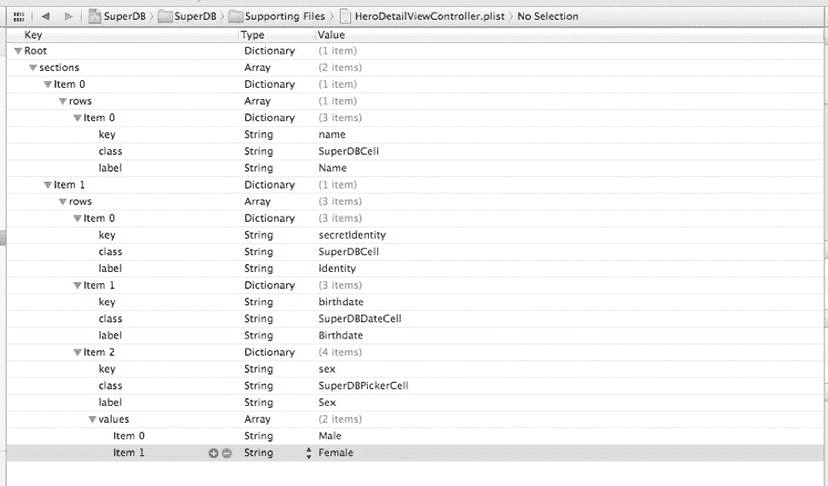

图 4-28.   包含 sex 项值的 HeroDetailController.plist

现在，当 `tableView:cellForRowAtIndexPath:` 在 `HeroDetailController` 中执行时，你需要将 `values` 的内容传递给表格视图单元格。打开 `HeroDetailController.m`，并在其他单元格配置代码之前，向 `tableView:cellForRowAtIndexPath:` 中添加以下代码：

```
NSArray *values = [row valueForKey:@"values"];
if (values != nil) {
    // TODO clean this up - ugh
    [cell performSelector:@selector(setValues:) withObject:values];
}
```

构建并运行应用。导航到详细视图并点击编辑按钮。点击“性别”单元格，选择器视图应出现，并显示 Male 和 Female 选项。设置值，点击保存，“性别”单元格中应填充所选值。

### 魔鬼的终结

好了，您已经完成了这个漫长且概念上颇具挑战性的章节。您应该为自己能够与我们一路坚持到底而祝贺自己。基于表格的详细编辑视图控制器是编写难度最大的控制器类之一，但现在您的工具箱中已经拥有一些工具来帮助创建它们。您已经了解了如何使用属性列表定义表格视图的结构，了解了如何创建自定义 `UITableViewCell` 子类以编辑不同类型的数据，还了解了如何利用 Objective-C 的动态特性，根据存储在 `NSString` 实例中的类名来创建类的实例。

准备好继续前进了吗？翻到下一页。我们出发吧！

