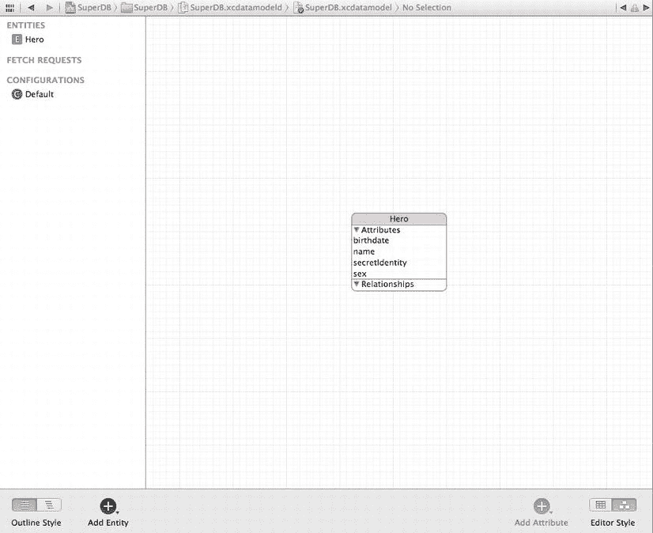
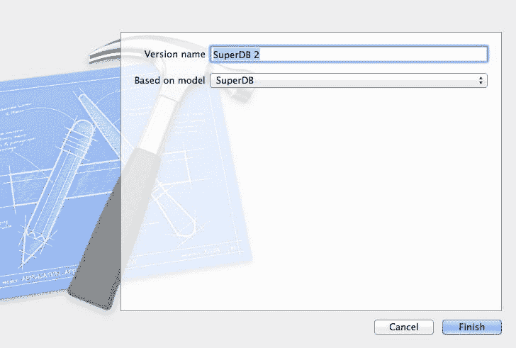
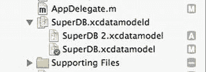
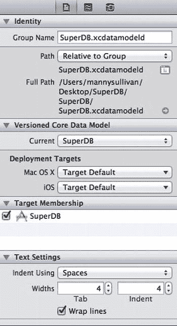
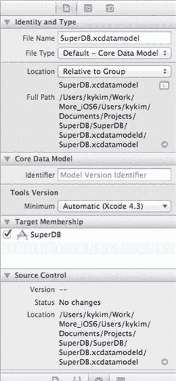

# 第 5 章

## 为变更做准备：迁移和版本控制

到第 4 章结束时，您通过构建一个功能齐全（尽管有些简单）的 Core Data 应用程序，已经掌握了 Core Data 架构和功能的大部分内容。您现在拥有足够的 Core Data 技能来构建一个可靠的应用程序，将其发送给测试人员，然后提交到 App Store。

但是，如果您更改了数据模型，并将新版本的应用程序发送给已经拥有先前版本的测试人员，会发生什么？以 SuperDB 应用为例。假设您决定向 `Hero` 实体添加一个新属性；将现有的一个可选属性改为必需属性；然后添加一个新实体。您能否直接将程序发送给用户，还是这会对他们的数据造成问题？

就目前情况而言，如果您对数据模型进行了更改，存储在用户 iPhone 持久化存储中的现有数据将无法在新版应用程序中使用。您的应用程序将在启动时崩溃。如果您从 Xcode 启动新版本，您将看到一条类似下面这样的巨大且可怕的错误消息：

```
2012-07-17 17:33:56.641 SuperDB[11233:c07] Unresolved error Error Domain = NSCocoaErrorDomain Code = 134100 "The operation couldn't be completed. (Cocoa error 134100.)" UserInfo = 0x80a3b30 {metadata = {
    NSPersistenceFrameworkVersion = 409;
    NSStoreModelVersionHashes =     {
        Hero = <0fe30005 4578f63c 124e2af7 3798fb56 7a194f27 f9281223 bd265ee3 d985d2fc>;
    };
    NSStoreModelVersionHashesVersion = 3;
    NSStoreModelVersionIdentifiers =     (
        ""
    );
    NSStoreType = SQLite;
    NSStoreUUID = "719284D9-793C-48A7-8F3E-C633CD4F0402";
    "_NSAutoVacuumLevel" = 2;
}, reason = The model used to open the store is incompatible with the one used to create the store}, {
    metadata =     {
        NSPersistenceFrameworkVersion = 409;
        NSStoreModelVersionHashes =         {
            Hero = <0fe30005 4578f63c 124e2af7 3798fb56 7a194f27 f9281223 bd265ee3 d985d2fc>;
        };
        NSStoreModelVersionHashesVersion = 3;
        NSStoreModelVersionIdentifiers =         (
            ""
        );
        NSStoreType = SQLite;
        NSStoreUUID = "719284D9-793C-48A7-8F3E-C633CD4F0402";
        "_NSAutoVacuumLevel" = 2;
    };
    reason = "The model used to open the store is incompatible with the one used to create the store";
}
```

如果在开发过程中发生这种情况，通常不是什么大问题。如果没有其他人拥有您的应用程序副本，并且其中没有存储任何不可替代的数据，您可以在 iPhone 模拟器菜单中选择“重置内容和设置”，或者使用 Xcode 的 Organizer 窗口从 iPhone 上卸载应用程序，Core Data 将在下次安装并运行应用程序时，基于修订后的数据模型创建一个新的持久化存储。

但是，如果您已将应用程序提供给其他人，那么除非他们卸载并重新安装应用程序（从而丢失所有现有数据），否则他们的 iPhone 上将有一个无法使用的应用程序。

正如您可能想象的那样，这并非能让客户特别满意的事情。在本章中，我们将向您展示如何对数据模型进行版本控制。然后，我们将讨论 Apple 用于在不同数据模型版本之间转换数据的机制，这称为迁移。我们将讨论两种迁移类型之间的区别：轻量级迁移和标准迁移。然后，您将设置 SuperDB Xcode 项目以使用轻量级迁移，以便您在接下来几章中所做的更改不会给您的（诚然是不存在的）用户带来问题。

在本章结束时，SuperDB 应用程序将全部设置完毕，准备好迎接新的开发，包括对数据模型的更改，无需担心用户在你发布新版本时会丢失数据。

### 关于数据模型


当你使用支持 Core Data 的模板创建新 Xcode 项目时，项目中会包含一个以 `.xcdatamodel` 文件形式存在的单一数据模型。在第 2 章中，你看到了该文件如何在应用委托的 `managedObjectModel` 方法中被运行时加载为 `NSManagedObjectModel` 实例。为了理解版本控制和迁移，有必要深入底层来探究其中原理。

### 数据模型是被编译的

项目中的 `.xcdatamodel` 类文件不会像其他资源那样被复制到应用程序包中。数据模型文件包含许多应用程序不需要的信息。例如，它包含了在 Xcode 模型编辑器图表视图中对象的布局信息（图 5-1），这些信息仅是为了让你更轻松。你的应用程序并不关心这些圆角矩形是如何排列的，因此没有理由将这些信息包含在应用程序包内。



图 5-1. 某些信息，例如代表 `Hero` 实体的圆角矩形位于左上角，以及属性与关系旁的展开三角形，存储在 `.xcdatamodel` 文件中，但不会存储在 `.mom` 文件中

相反，你的 `.xcdatamodel` 文件会被编译成一种扩展名为 `.mom` 的新文件类型，其全称为管理对象模型（managed object model，简称 Mom）。这是一种更紧凑的二进制文件，仅包含应用程序所需的信息。实际加载以创建 `NSManagedObjectModel` 实例的就是这个 `.mom` 文件。

### 数据模型可以有多个版本

你很可能在广义上理解版本控制的含义。当一家公司发布具有新功能的软件新版本时，通常会有一个新的编号或名称。例如，你正在使用特定版本的 Xcode（对我们来说是 4.5）和特定版本的 Mac OS X（对我们来说是 10.8，也称为 Mountain Lion）。

这些被称为*市场营销版本标识符*或*版本号*，因为它们的主要目的是告知客户软件各个发布版本之间的区别。当程序的新版本发布给客户时，市场营销版本号会增加。

然而，开发人员还会使用其他更细粒度的版本控制形式。如果你曾使用过诸如 `cvs`、`svn` 或 `git` 等并发版本控制系统，你可能就了解这是如何工作的。版本控制软件会跟踪项目（以及其他内容）中所有单个源代码和资源文件随时间的变化。

**注意** 我们不打算讨论常规版本控制，但作为开发人员了解它是有益的。幸运的是，网络上有大量资源可用于学习如何安装和使用不同的版本控制软件包。一个很好的起点是维基百科上关于版本控制的页面：`http://en.wikipedia.org/wiki/Revision_control.`

Xcode 集成了多个版本控制软件包，但它也有一些内置的版本控制机制，其中包括用于 Core Data 数据模型的机制。创建数据模型的新版本是让用户保持满意的关键。每次向公众发布应用程序的版本时，你都应创建一个新的数据模型版本。这将创建一份新副本，以便保留旧版本，帮助系统弄清楚如何将数据从旧版本制作的持久化存储更新到较新版本。

### 创建新数据模型版本

在 Xcode 中单击 `SuperDB.xcdatamodeld`。然后点击“Editor”菜单并选择“Add Model Version”。系统将要求你命名这个新版本。Xcode 提供的默认值（图 5-2）即可。只需点击“Finish”。



图 5-2. 为新的数据模型版本命名

你刚刚添加了一个数据模型的新版本。点击“Finish”后，`SuperDB.xcdatamodeld` 文件旁边会出现一个展开三角形。展开后即可看到数据模型的两个不同版本（图 5-3）。



图 5-3. 版本化的数据模型包含当前版本（图标上带有绿色对勾）以及所有之前的版本

其中一个版本的图标上会有一个绿色对勾。这表示当前版本（在你的例子中是 `SuperDB.xcdatamodel`），也就是你的应用程序将使用的版本。默认情况下，当你创建新版本时，你实际上创建的是原始版本的副本。然而，新版本保留了与原始版本*相同的文件名*，而副本的名称则会追加一个递增的较大数字。该文件代表了你创建新版本时数据模型的样子，并且应保持原样。

较高数字代表较旧文件这一事实可能看起来有点奇怪，但随着版本的积累，编号方式会变得更加合理。下次你创建新版本时，旧版本将被命名为 `SuperDB 3.xcdatamodel`，以此类推。对于所有非当前版本来说，这种编号方式是合理的，因为每个版本都会比上一个版本编号大 1。通过保持当前模型的名称不变，很容易判断哪个版本是可以修改的。

### 当前数据模型版本

在图 5-3 中，`SuperDB.xcdatamodel` 是数据模型的当前版本，`SuperDB 2.xcdatamodel` 是之前的版本。你现在可以安全地对当前版本进行修改，同时知道已存在一个前一个版本的副本（冻结在时间中），这将使你能够在发布时，将用户的数据从旧版本迁移到下一个版本。

你可以更改哪个版本是当前版本。为此，选择 `SuperDB.xcdatamodeld`，然后在实用工具面板中打开 File Inspector（图 5-4）。你应看到一个名为“Version Core Data Model”的区域。找到一个标记为“Current”的下拉框。在这里，你可以选择要设为当前版本的数据模型。你不会经常这样做，但可能会因为某些原因需要回退到应用程序的旧版本。你可以使用迁移功能回退到旧版本，或迁移到新版本。



图 5-4. Core Data (Directory) File Inspector

### 数据模型版本标识符

虽然你可以通过选择导航面板中的特定数据模型版本并打开 File Inspector（图 5-5）来为数据模型分配像 1.1 或 Version A 这样的版本标识符，但这个标识符纯粹供你自己使用，Core Data 会完全忽略它。



图 5-5. 数据模型的 File Identity 面板允许你设置版本标识符

相反，Core Data 会对数据模型文件中的每个实体执行一种称为哈希的数学计算。哈希值存储在你的持久化存储中。当 Core Data 打开你的持久化存储时，它会使用这些哈希值来确保存储在其中的数据版本与当前数据模型兼容。


### Core Data 版本管理与迁移

由于 Core Data 使用存储的哈希值进行版本验证，您无需担心为版本管理递增版本号。Core Data 将通过检查存储的哈希值并与当前数据模型版本计算出的哈希值进行比较，自动识别持久化存储是由哪个版本创建的。

#### 迁移

如本章开头所述，当 Core Data 检测到当前使用的持久化存储与当前数据模型不兼容时，会抛出异常。解决方案是提供迁移，告诉 Core Data 如何将数据从旧的持久化存储迁移到与当前数据模型匹配的新存储中。

##### 轻量级迁移 vs 标准迁移

Core Data 支持两种不同类型的迁移。第一种称为**轻量级迁移**，仅适用于数据模型中相对简单的修改。例如，如果您向实体添加或移除属性，或者从数据模型中添加或删除实体，Core Data 完全能够自行解析如何将现有数据迁移到新模型中。对于新增属性，它会为该属性创建存储空间，但不会为现有托管对象填充数据。在轻量级迁移中，Core Data 实际上会分析两个数据模型并为您创建迁移方案。

如果您进行的修改不简单，无法通过轻量级迁移机制解决，则必须使用**标准迁移**。标准迁移涉及创建映射模型，并可能需要编写一些代码，告诉 Core Data 如何将数据从旧的持久化存储迁移到新的持久化存储。

### 标准迁移

本书中对 SuperDB 应用程序所做的修改都相当简单，因此对标准迁移的深入讨论超出了本书的范围。不过，苹果在开发者文档中已经相当详尽地记录了这一过程，您可以通过 `http://developer.apple.com/library/ios/#documentation/Cocoa/Conceptual/CoreDataVersioning/Articles/Introduction.html` 了解更多关于标准迁移的信息。

### 设置应用程序使用轻量级迁移

另一方面，在本书的后续章节中，您将大量使用轻量级迁移。在剩余的每个 Core Data 章节中，您都将创建新版本的数据模型，并让轻量级迁移处理数据迁移。但是，轻量级迁移默认未开启，因此您需要对应用程序委托进行一些修改以启用它们。

编辑 `AppDelegate.m` 并找到 `persistentStoreCoordinator` 方法。将以下代码行：

```objective-c
if (![_persistentStoreCoordinator addPersistentStoreWithType:NSSQLiteStoreType
    configuration:nil
    URL:storeURL
    options:nil
    error:&error]) {
```

替换为：

```objective-c
NSDictionary *options = @{NSMigratePersistentStoresAutomaticallyOption:@YES,
              NSInferMappingModelAutomaticallyOption:@YES};
if (![_persistentStoreCoordinator addPersistentStoreWithType:NSSQLiteStoreType
    configuration:nil
    URL:storeURL
    options:options
    error:&error]) {
```

启用轻量级迁移的方法是在调用 `addPersistentStoreWithType:configuration:URL:options:error:` 方法将新创建的持久化存储添加到持久化存储协调器时，向 `options` 参数传递一个字典。在该字典中，使用两个系统定义的常量 `NSMigratePersistentStoresAutomaticallyOption` 和 `NSInferMappingModelAutomaticallyOption` 作为键，并在这两个键下存储一个持有 Objective-C `BOOL` 值 `YES` 的 `NSNumber`。通过将包含这两个值的字典传递给持久化存储协调器，您向 Core Data 指示：如果检测到数据模型版本发生变化，希望它尝试自动创建迁移；如果能够创建迁移，则自动使用这些迁移将数据迁移到基于当前数据模型的新持久化存储中。

仅此而已。通过这些更改，您就可以开始放心地对数据模型进行修改了。（好吧，可能也并非完全无忧。）使用轻量级迁移会限制您能进行的修改的复杂度。例如，您无法将实体拆分为两个不同的实体，或将属性从一个实体移动到另一个实体，但除了重大重构之外，您所需的大多数更改都可以通过轻量级迁移处理。此外，一旦您按照本章所述的方式设置好项目，该功能基本上是免费的。

### 继续迁移

在经历了几个漫长且概念上较为困难的章节后，暂停一下来设置项目使用迁移，这为您提供了一个不错的喘息机会。但请不要低估迁移的重要性。使用您应用程序的用户信任您会妥善处理他们的数据。花些精力确保您的修改不会给用户带来重大问题至关重要。

任何时候发布包含新数据模型版本的应用程序新版本时，请务必彻底测试迁移。无论您是使用本章设置的轻量级迁移，还是更重量级的标准迁移，这一点都适用。

迁移，尤其是轻量级迁移，相对易于使用，但它们有可能给用户带来重大不便，因此不要因为易于使用而产生虚假的安全感。请使用尽可能多的真实数据彻底测试每次迁移。

在此提醒之后，让我们继续为 SuperDB 应用程序添加功能。接下来是什么？自定义托管对象——既有乐趣又有收获。

