# 第 6 章：自定义托管对象

目前，`Hero` 实体由 `NSManagedObject` 类的实例表示。得益于键值编码，您无需创建专门用于保存应用程序数据的类，就能构建完整的数据模型。

然而，这种方法也存在一些缺点。首先，当对托管对象使用键值编码时，您使用 `NSString` 常量在代码中表示属性，但编译器不会以任何方式检查这些常量。如果您拼错了属性名，编译器不会捕获到错误。此外，到处使用 `valueForKey:` 和 `setValue:forKey:` 而不是直接使用属性和点语法，也可能会有点繁琐。

虽然您可以为某些类型的数据模型属性设置默认值，但无法设置条件默认值，例如将日期属性默认设为今天的日期。对于某些类型的属性，根本无法在数据模型中设置默认值。验证功能也同样受限。虽然您可以控制某些属性的特定元素（如字符串长度或数字最大值），但无法进行复杂或条件性的验证，也无法进行依赖于多个属性值的验证。


幸运的是，`NSManagedObject` 可以像其他 Objective-C 类一样被子类化，这是实现更高级的默认值和验证的关键。同时，这也为通过添加方法来为实体增加额外功能打开了大门。例如，你可以创建一个方法，根据实体的一个或多个属性计算并返回一个值。

在本章中，你将为你的 `Hero` 实体创建一个 `NSManagedObject` 的自定义子类。然后，你将使用这个子类来添加一些额外功能。你还需要为 `Hero` 添加两个新属性。一个是英雄的年龄。你不再直接存储年龄，而是根据其出生日期计算得出。因此，你不需要 Core Data 在持久化存储中为英雄的年龄腾出空间，所以你将使用瞬态属性类型，然后编写一个访问器方法来计算并返回英雄的年龄。瞬态属性类型会告诉 Core Data 不要为该属性创建存储空间。在你的案例中，你将在运行时按需计算英雄的年龄。

你要添加的第二个属性是英雄最喜欢的颜色。由于没有专门针对颜色的属性类型，你需要实现一种称为可转换属性的东西。可转换属性使用一个特殊的对象，称为*值转换器*，将自定义对象转换为 `NSData` 实例，以便它们可以存储在持久化存储中。你将编写一个值转换器，让你能够以这种方式保存 `UIColor` 实例。在图 6-1 中，你可以看到在本章结束时，添加了这两个新属性后的详细编辑视图的外观。

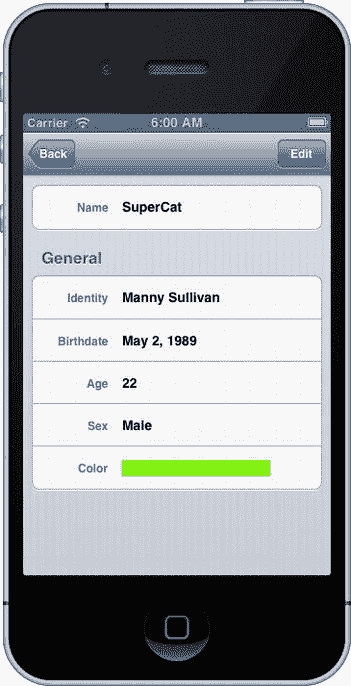

图 6-1.  本章结束时的 `Hero` 详细信息视图

当然，你没有一个用于颜色的属性编辑器，因此你必须编写一个，以便让用户选择英雄最喜欢的颜色。你只需创建一个简单的、基于滑块的取色器即可（图 6-2）。

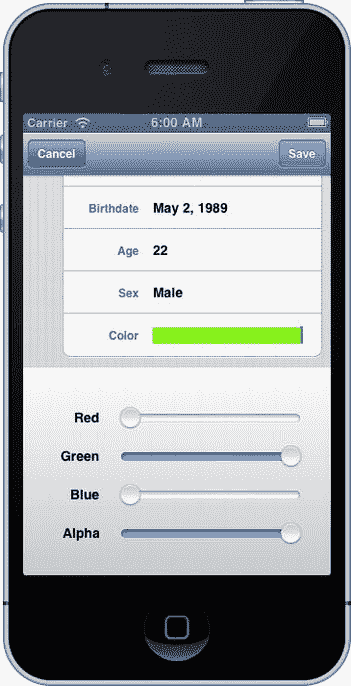

图 6-2.  简单的、基于滑块的取色器属性编辑器

由于无法在数据模型中设置默认颜色，你将编写代码，将最喜欢的颜色属性默认为白色。如果不这样做，当用户第一次编辑该颜色时，该颜色将为 `nil`，这会导致问题。

最后，你将向日期字段添加验证逻辑，以防止用户选择未来的出生日期。你还会调整属性编辑器，以便在输入的属性未通过验证时通知用户。你将为用户提供返回并修正属性或直接取消更改的选项（图 6-3）。

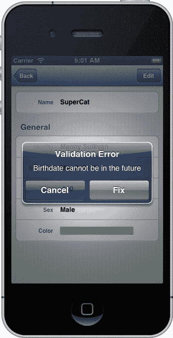

图 6-3.  当尝试保存未通过验证的属性时，用户将可以选择修正问题或取消更改

尽管你只会在 `Birthdate` 字段上添加验证，但你将要编写的报告机制将是通用的，如果你向其他字段添加验证，它仍可以重复使用。你可以在图 6-4 中看到通用错误提示的一个示例。

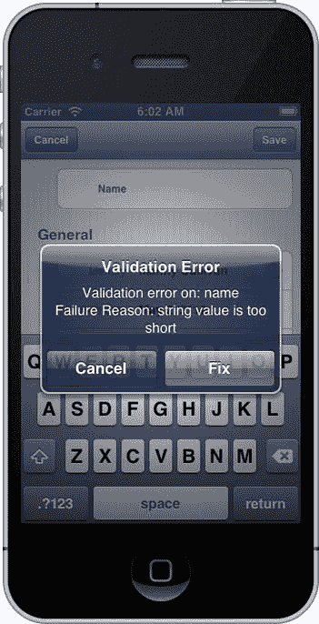

图 6-4.  由于你的目标通常是编写可重用的代码，你的验证机制也将强制执行数据模型上的验证，比如最小长度等

工作量相当大，所以我们开始吧。你将继续使用上一章中的同一个 `SuperDB` 应用程序。确保你创建了数据模型的新版本，并且已打开轻量级迁移，如上一章所示。

### 更新数据模型

首要任务是将两个新属性添加到数据模型中。确保导航窗格中 `SuperDB` 文件夹内的 `SuperDB.xcdatamodeld` 旁边的展开三角形已展开，然后单机选中数据模型的当前版本（即带有绿色勾选图标的那一个）。

模型编辑器打开后，首先确保你处于表格视图模式。然后，在组件窗格中选择 `Hero` 实体（图 6-5）。

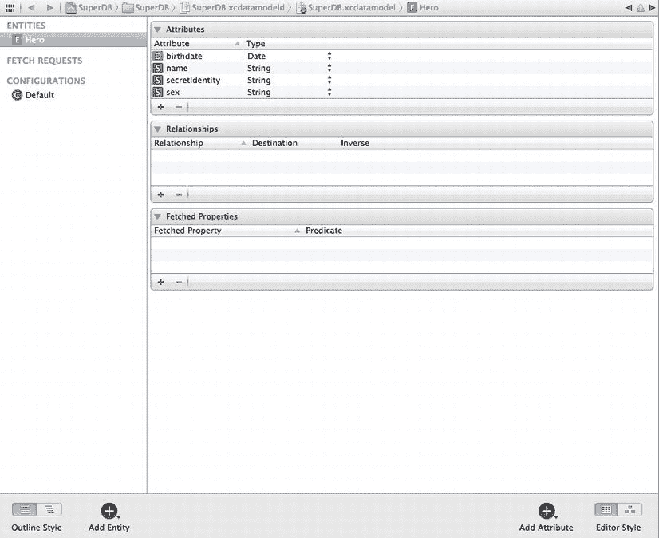

图 6-5.  回到模型编辑器中

#### 添加年龄属性

单击数据模型右下角的标签为 `添加属性` 的加号图标。将新属性的名称更改为 `age`。在模型编辑器中，取消勾选 `可选` 并勾选 `瞬态`。这将告知 Core Data，你不需要为此属性存储值。在你的案例中，由于你使用 SQLite 作为持久化存储，这将告诉 Core Data 不要向用于存储英雄数据的数据库表添加 `age` 列。将属性类型更改为 `整数 16`；你将把年龄计算为整数。目前，对于 `age` 属性，你需要做的就是这些。当然，就目前情况而言，你无法对这个特定属性做任何有意义的事情，因为它无法存储任何内容，而且你还没有办法告诉它如何计算年龄。这种情况将在几分钟后你创建 `NSManagedObject` 的自定义子类时改变。

#### 添加最喜欢的颜色属性

添加另一个属性。这一次，将新属性命名为 `favoriteColor`，并将属性类型设置为 `可转换`。一旦你将 `类型` 弹出菜单更改为 `可转换`，你应该会注意到一个新的标签为 `名称` 的文本字段，其中包含一个灰色的默认值 `值转换器名称`（图 6-6）。

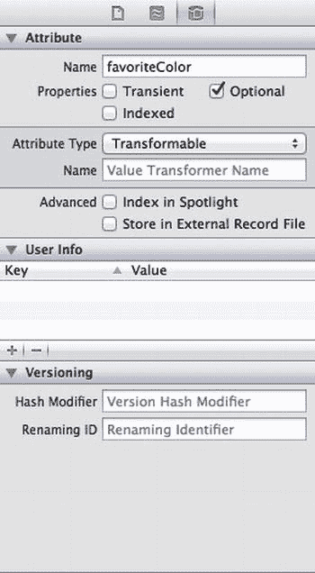

图 6-6.  将 `favoriteColor` 属性设为可转换属性

`值转换器名称` 是使用可转换属性的关键。我们稍后会深入讨论值转换器，但你最好现在就填充这个字段，以免稍后还要返回模型编辑器。此字段需要填入值转换器类的名称，该类将用于将表示此属性的任何对象转换为 `NSData` 实例以保存到持久化存储中，反之亦然。如果你将此字段留空，`CoreData` 将使用默认值转换器 `NSKeyedUnarchiveFromDataTransformerName`。默认值转换器通过使用 `NSKeyedArchiver` 和 `NSKeyedUnarchiver`，将任何遵循 `NSCoding` 协议的对象转换为 `NSData` 实例，从而处理大量对象。

#### 为名称属性添加最小长度


接下来，我们添加一些验证规则，确保你的 `name` 属性的长度至少为一个字符。单击 `name` 属性以选中它。在模型编辑器中，在“Validation”标签旁边的文本框中输入 `1`，以指定该属性输入的值必须至少为一个字符长。`Min. Length` 复选框会自动勾选。这看起来可能是一个多余的验证，因为你在上一章中已经为这个属性取消了 `Optional` 选项，但二者并非完全相同。由于 `Optional` 复选框未被勾选，当 `name` 为 `nil` 时，用户将无法保存。然而，你的应用程序会尽力确保 `name` 永远不会是 `nil`。例如，你为 `name` 设置了默认值。如果用户删除了该值，文本框仍然会返回一个空字符串，而不是 `nil`。因此，为了确保输入了实际名称，你需要添加这个验证。

保存数据模型。

### 创建 Hero 类

现在是时候创建 `NSManagedObject` 的自定义子类了。这将为你提供添加自定义验证和默认值设置的灵活性，并且能够使用属性而不是键值编码，这将使你的代码更易读，并在编译时提供额外的检查。

在 Xcode 的导航面板中单击 `SuperDB` 组。创建一个新文件。当新文件助手出现时，在左侧窗格中的 `iOS` 标题下选择 `Core Data`，然后查看右上方面板中一个你可能从未见过的图标：`NSManagedObject subclass`（图 6-7）。选中它，然后单击 `Next` 按钮。

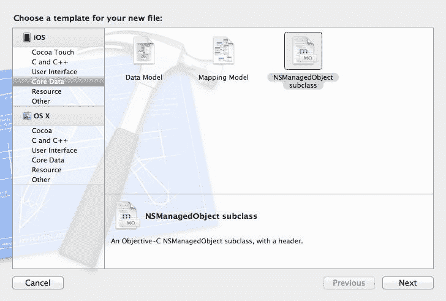

图 6-7.  选择 `NSManagedObject subclass` 模板

接下来，系统会提示你选择要管理的实体（图 6-8）。勾选 `Hero`，然后单击 `Next`。

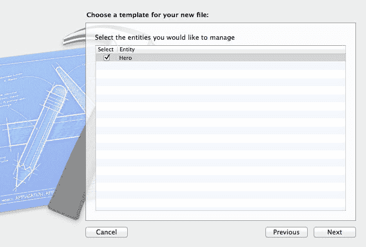

图 6-8.  选择 `Hero` 实体

最后，系统会提示你保存生成的类文件的位置（图 6-9）。保留“Use scalar properties for primitive data types”复选框的未选中状态。默认位置就可以，只需单击 `Create`。

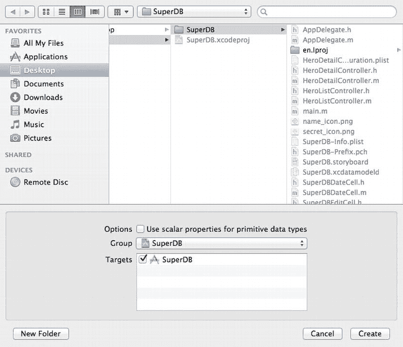

图 6-9.  选择类文件的存放位置

### 调整 Hero 头文件

现在，你的项目文件夹中应该有一对名为 `Hero.h` 和 `Hero.m` 的文件。Xcode 也调整了你的数据模型，使得 `Hero` 实体在运行时使用这个类，而不是 `NSManagedObject`。现在单击新的 `Hero.h` 文件。它应该看起来像下面这样，尽管你的属性声明顺序可能与我们不完全一致：

```
#import <Foundation/Foundation.h>
#import <CoreData/CoreData.h>

@interface Hero : NSManagedObject

@property (nonatomic, retain) NSDate * birthdate;
@property (nonatomic, retain) NSString * name;
@property (nonatomic, retain) NSString * secretIdentity;
@property (nonatomic, retain) NSString * sex;
@property (nonatomic, retain) NSNumber * age;
@property (nonatomic, retain) id favoriteColor;

@end
```

**注意**  如果你的 `Hero.h` 文件没有包含 `age` 和 `favoriteColor` 的声明，这可能是因为你在过程中的某处没有正确保存。如果是这种情况，请在项目文件中选中 `Hero.h` 和 `Hero.m`，然后按 `Delete`，确保文件被移到废纸篓。然后返回，确保你的属性已在数据模型中正确创建，确保数据模型已保存，然后重新创建 `Hero.h` 和 `Hero.m`。

你需要在这里做两个快速修改。首先，你想让 `age` 变为只读。你不允许人们设置英雄的年龄；你只想根据 `birthdate` 来计算它。其次，你想将 `favoriteColor` 从通用类型 `ID` 改为 `UIColor`，以表明你的 `favoriteColor` 属性实际上是 `UIColor` 的一个实例。这将通过让编译器知道表示 `favoriteColor` 属性的对象类型，为你提供一些额外的类型安全性。你还需要添加几个常量，这些常量将在你的验证方法中使用。

在 `#imports` 之后但在 `@interface` 声明之前添加以下内容：

```
#define kHeroValidationDomain @"com.AppOrchard.SuperDB.HeroValidationDomain"
#define kHeroValidationBirthdateCode 1000
#define kHeroValidationNameOrSecretIdentityCode 1001
```

然后修改 `age` 和 `favoriteColor` 的属性声明。

```
@property (nonatomic, retain, readonly) NSNumber * age;
@property (nonatomic, retain) UIColor * favoriteColor;
```

不必太担心这些常量。我们稍后会解释错误域和错误码。切换到 `Hero.m`。在实现文件中你还有更多工作要做。在此之前，我们来谈谈你要做什么。

### 设置默认值

需要你子类化 `NSManagedObject` 的最常见的 Core Data 任务之一，是为属性设置条件默认值，或者为无法在数据模型中设置默认值的属性类型（例如可转换属性的默认值）设置默认值。

`NSManagedObject` 的方法 `awakeFromInsert` 被设计为由子类重写，用于设置默认值。它是在新对象实例被插入到托管对象上下文之后、在任何代码有机会修改或使用该对象之前立即被调用。

在你的例子中，你有一个名为 `favoriteColor` 的可转换属性，你想将其默认值设为白色。为此，在 `Hero.m` 中的 `@end` 声明之前添加以下方法：

```
- (void)awakeFromInsert
{
    self.favoriteColor = [UIColor colorWithRed:1.0 green:1.0 blue:1.0 alpha:1.0];
    [super awakeFromInsert];
}
```

注意在 `Hero.m` 中使用了 `@dynamic` 关键字。这告诉编译器不要为后面的属性生成访问器和修改器。这里的想法是，这些访问器和修改器将在运行时由父类提供。不必太担心具体细节，只需要知道为了让 Core Data 正常工作，这种复杂性是必需的。

**提示**  注意你没有使用 `[UIColor whiteColor]` 作为默认值。你使用 `colorWithRed:green:blue:alpha:` 工厂方法的原因是因为它总是创建一个 RGBA 颜色。`UIColor` 支持几种不同的颜色模型。稍后，为了将 `UIColor` 保存到持久存储中，你将把它分解成单独的组件（红、绿、蓝和 alpha 各一个）。你还将让用户通过操纵这些组件各自的滑块来选择新颜色。然而，`whiteColor` 方法不使用 RGBA 颜色空间创建颜色。相反，它使用灰度颜色模型创建颜色，该模型只使用两个分量（灰度和 alpha）来表示颜色。

非常简单。你只需创建一个新的 `UIColor` 实例并将其分配给 `favoriteColor`。`awakeFromInsert` 的另一个常见用法是将日期属性默认设置为当前日期。例如，你可以通过向 `awakeFromInsert` 添加以下代码行来将 `birthdate` 属性默认设置为当前日期：

```
self.birthdate = [NSDate date];
```

### 验证


Core Data 提供两种在代码中进行属性验证的机制：一种用于单属性验证，另一种用于当验证依赖于多个属性值时使用。单属性验证相对简单直接。你可能想要确保日期有效、字段不为 `nil`，或者数字属性不为负数。多字段验证则稍微复杂一些。假设你有一个 `Person` 实体，它有一个名为 `legalGuardian` 的字符串属性，用于记录对未成年人负有法律责任并能够为其做出决定的人。你可能希望确保该属性已填充，但只针对未成年人，而非成年人。多属性验证允许你在 `person` 的年龄属性小于 18 岁时将该属性设为必填，否则不必。

#### 单属性验证

`NSManagedObject` 提供了一个用于验证单个属性的方法，名为 `validateValue:forKey:error:`。该方法接收一个值、一个键和一个 `NSError` 句柄。你可以重写该方法，并根据值是否有效返回 `YES` 或 `NO` 来执行验证。如果验证未通过，你还可以创建一个 `NSError` 实例来保存关于无效内容和原因的特定信息。你可以这样做，但不要这样做。事实上，Apple 明确说明你*不应该*这样做。你实际上永远不需要重写此方法，因为默认实现使用了一种非常巧妙的机制，可以将错误处理动态分派给类中未定义的特定验证方法。

例如，假设你有一个名为 `birthdate` 的字段。在验证期间，`NSManagedObject` 会自动在你的子类中查找一个名为 `validateBirthdate:error:` 的方法。它会对每个属性都执行此操作，因此，如果你想验证单个属性，你所要做的就是声明一个遵循 `validateXXX:error:` 命名约定的方法（其中 `XXX` 是要验证的属性的名称），返回一个指示新值是否通过验证的 `BOOL`。

让我们使用此机制来阻止用户输入未来的出生日期。在 `Hero.m` 中的 `@end` 声明之上，添加以下方法：

```
- (BOOL)validateBirthdate:(id *)ioValue error:(NSError **)outError
{
    NSDate *date = *ioValue;
    if ([date compare:[NSDate date]] == NSOrderedDescending) {
        if (outError != NULL) {
            NSString *errorStr = NSLocalizedString(@"Birthdate cannot be in the future",
                                                   @"Birthdate cannot be in the future");
            NSDictionary *userInfoDict = [NSDictionary dictionaryWithObject:errorStr
                                                                     forKey:NSLocalizedDescriptionKey];
            NSError *error = [[NSError alloc] initWithDomain:kHeroValidationDomain
                                                        code:kHeroValidationBirthdateCode
                                                    userInfo:userInfoDict];
            *outError = error;
        }
        return NO;
    }
    return YES;
}
```

**提示** 你是否想知道为什么要传递指向 `NSError` 指针的指针，而不仅仅是指针？指针的指针允许通过引用传递指针。在 Objective-C 方法中，参数（包括对象指针）是按值传递的，这意味着被调用的方法会获得传入指针的自己的副本。因此，如果被调用的方法想要更改指针（而不是指针指向的数据），则需要另一层间接引用。因此，需要指针的指针。

从前面的方法可以看出，如果日期在未来，则返回 `NO`；如果日期在过去，则返回 `YES`。如果返回 `NO`，你还需要采取一些额外步骤。你创建一个字典，并在键 `NSLocalizedDescriptionKey` 下存储一个错误字符串，`NSLocalizedDescriptionKey` 是一个为此目的而存在的系统常量。然后，你创建一个新的 `NSError` 实例，并将新创建的字典作为 `NSError` 的 `userInfo` 字典传递。这是在验证方法以及几乎所有其他接受 `NSError` 句柄作为参数的方法中返回信息的标准方式。

请注意，在创建 `NSError` 实例时，你使用了之前定义的两个常量：`kHeroValidationDomain` 和 `kHeroValidationBirthdateCode`：

```
NSError *error = [[NSError alloc] initWithDomain:kHeroValidationDomain
                                            code:kHeroValidationBirthdateCode
                                        userInfo:userInfoDict];
```

**提示** 请注意，在单属性验证方法中，你没有调用 `super`。这并不是因为这些方法被定义为抽象方法，而是因为它们根本不存在。这些方法是在运行时动态创建的，因此不仅调用 `super` 没有意义，而且实际上 `super` 上也没有方法可以调用。

每个 `NSError` 都需要一个错误域和一个错误代码。错误代码是唯一标识特定错误类型的整数。错误域定义了生成错误的应用程序或框架。例如，有一个名为 `NSCocoaErrorDomain` 的错误域，用于标识 Apple 的 Cocoa 框架中的代码所创建的错误。你为自己的应用程序定义了自己的错误域，使用了反向 DNS 样式的字符串，并将其分配给常量 `kHeroValidationDomain`。你将使用该域来处理因验证 `Hero` 对象而创建的任何错误。你也可以选择为整个 `SuperDB` 应用程序创建一个单一域，但通过更具体地定义域，你的应用程序将更易于调试。

通过创建自己的错误域，你可以根据需要尽可能具体。同时，你也避免了在长长的系统定义常量列表中搜索，以寻找恰好覆盖特定错误的代码的问题。`kHeroValidationBirthdateCode` 是你在此域中创建的第一个代码，其值 1000 是任意的；为这个错误代码选择 0、1、10000 或 34848 也完全有效。这是你的域，你可以做你想做的事。

#### `nil` 与 `NULL`

在你的验证方法中，你可能已经注意到，你将 `outError` 与 `NULL` 进行比较，以确定是否提供了有效的指针，而不是像通常那样与 `nil` 进行比较。`nil` 和 `NULL` 都服务于相同的目的（表示空指针），并且事实上，它们被定义为相同的东西：数字零。就代码功能而言，`nil` 和 `NULL` 是 100% 可互换的。

尽管如此，你应该努力在正确的时间使用正确的那个。你使用的那个将为你未来的自己以及任何其他处理你代码的开发者提供线索，表明你在做什么。

当你检查一个 Objective-C 对象指针时，请与 `nil` 比较。对于任何其他 C 指针，请使用 `NULL`。在这种情况下，你处理的是一个指向指针的指针，因此你使用 `NULL`。如果一个指针不直接引用一个 Objective-C 对象，那么 `NULL` 是合适的比较值，即使该指针引用的指针指向一个对象。

#### 多属性验证

当你需要基于多个字段的值来验证一个托管对象时，方法略有不同。在所有单字段验证方法触发之后，会调用另一个方法来让你执行更复杂的验证。实际上有两个这样的方法：一个在对象首次插入上下文时调用，另一个在你保存对现有托管对象的更改时调用。


### Core Data 数据验证与虚拟存取器

#### 多属性验证方法

当向上下文中插入新的托管对象时，使用的多属性方法称为 `validateForInsert:`。而更新现有对象时，实现的验证方法则称为 `validateForUpdate:`。在这两种情况下，如果对象通过验证则返回 `YES`，如果存在问题则返回 `NO`。与单字段验证类似，若返回 `NO`，还需创建一个 `NSError` 实例，用于说明遇到的具体问题。

在许多情况下，插入和更新时所需执行的验证逻辑是相同的。此时，请勿将一个方法的代码复制粘贴到另一个方法中。相反，应创建一个新的验证方法，并让 `validateForInsert:` 和 `validateForUpdate:` 都调用这个新方法。

在你的应用中，（目前）还没有执行多属性验证的需求，但假设一下：我们不要求 `name` 和 `secretIdentity` 同时为必填项，而是只要求这两个属性中至少提供一个。要实现这一点，你可以在数据模型中将 `name` 和 `secretIdentity` 都设为可选，然后利用多属性验证方法来强制实现这一规则。为此，你需要在 `Hero` 类中添加以下三个方法：

```
- (BOOL)validateNameOrSecretIdentity:(NSError **)outError
{
    if ((0 == [self.name length]) && (0 == [self.secretIdentity length])) {
        if (outError != NULL) {
            NSString *errorStr = NSLocalizedString(@"Must provide name or secret identity.",
                                                    @"Must provide name or secret identity.");
            NSDictionary *userInfoDict =                 [NSDictionary dictionaryWithObject:errorStr
                                                    forKey:NSLocalizedDescriptionKey];
            NSError *error = [[NSError alloc] initWithDomain:kHeroValidationDomain
                                                        code:kHeroValidationNameOrSecretIdentityCode
                                                    userInfo:userInfoDict];
            *outError = error;
        }
    }
    return YES;
}

- (BOOL)validateForInsert:(NSError **)outError
{
    return [self validateNameOrSecretIdentity:outError];
}

- (BOOL)validateForUpdate:(NSError **)outError
{
    return [self validateNameOrSecretIdentity:outError];
}
```

#### 虚拟存取器

在本章开头，你在数据模型中添加了一个名为 `age` 的新属性。但实际上你并不需要存储英雄的年龄，因为可以根据英雄的出生日期来计算。像这样计算得出的属性通常被称为**虚拟存取器**。它们看上去就像普通的存取器，并且对于其他对象而言，它们可以被当作其他属性一样对待。你是在运行时计算该值，而非从持久化存储中检索，这只是一个实现细节。

按照目前 `Hero` 对象的配置，`age` 存取器将始终返回 `nil`，因为你已告知数据模型不要为其在持久化存储中分配存储空间，并将其设置为只读。为了使其正常工作，你必须在一个看起来像存取器的方法中实现计算年龄的逻辑（因此得名“虚拟存取器”）。为此，请在 `Hero.m` 文件的 `@end` 之前添加以下方法：

```
- (NSNumber *)age
{
    if (self.birthdate == nil)
        return nil;

NSCalendar *gregorian = [[NSCalendar alloc] initWithCalendarIdentifier:NSGregorianCalendar];
    NSDateComponents *components = [gregorian components:NSYearCalendarUnit
                                                fromDate:self.birthdate
                                                  toDate:[NSDate date]
                                                 options:0];
    NSInteger years = [components year];
    return [NSNumber numberWithInteger:years];
}
```

注意方法开头添加的检查。如果你尚未设置英雄的出生日期，则无需计算年龄。

现在，任何使用 `age` 属性存取器的代码都将返回一个包含计算后超级英雄年龄的 `NSNumber` 实例。

### 添加验证反馈

在第 4 章中，你创建了一个名为 `SuperDBEditCell` 的类，它封装了各种表格视图单元格的通用功能。`SuperDBEditCell` 类不包含用于保存托管对象的代码，它只关注显示本身。你确实存储了每个 `SuperDBEditCell` 实例所显示的属性。但现在，你希望在编辑的属性未通过验证时添加验证反馈，并且你不想在子类中重复实现这一功能。

你希望实现的是，让每个 `SuperDBEditCell` 实例（或其子类）验证其正在处理的属性。你希望在表格视图单元格失去焦点（即，移动到另一个单元格）以及用户尝试保存时执行验证。如果编辑后的值未通过验证，则应弹出一个警告窗口，向用户显示验证错误，并呈现两个按钮：**取消**（恢复原值），或**修复**（让用户编辑该单元格）。为了处理这种情况，你需要让 `SuperDBEditCell` 响应 `UITextFieldDelegate` 和 `UIAlertViewDelegate` 协议。最后，如果用户点击导航栏上的**取消**按钮，你将撤销他们所做的所有更改。

首先，编辑 `SuperDBEditCell.h`，并将 `@interface` 声明修改为：

```
@interface SuperDBEditCell : UITableViewCell <UITextFieldDelegate, UIAlertViewDelegate>
```

接下来，你需要向 `NSManagedObject` 添加一个属性：

```
@property (strong, nonatomic) NSManagedObject *hero;
```

最后，你需要一个 `validate` 方法，以便在需要执行验证时调用：

```
- (IBAction)validate;
```

切换到 `SuperDBEditCell.m`，并添加刚才声明的 `validate` 方法：

```
#pragma mark - 实例方法

- (IBAction)validate
{
    id val = self.value;
    NSError *error;
    if (![self.hero validateValue:&val forKey:self.key error:&error]) {
        NSString *message = nil;
        if ([[error domain] isEqualToString:@"NSCocoaErrorDomain"]) {
            NSDictionary *userInfo = [error userInfo];
            message =                 [NSString
stringWithFormat:NSLocalizedString(@"Validation error on:
                                                              %@\rFailure Reason: %@",
                                                     @"Validation error on: %@,
                                                      Failure Reason: %@)"),
                                   [userInfo valueForKey:@"NSValidationErrorKey"],
                                   [error localizedFailureReason]];
        }
        else
            message = [error localizedDescription];

UIAlertView *alert = [[UIAlertView alloc] initWithTitle:NSLocalizedString(@"Validation Error",
                                                                               @"Validation Error")
                                                      message:message
                                                     delegate:self
                                             cancelButtonTitle:NSLocalizedString(@"Cancel", @"Cancel")
                                             otherButtonTitles:NSLocalizedString(@"Fix", @"Fix"), nil];
        [alert show];
    }
}
```

为了确保警告视图正常工作，你需要实现其委托方法：

```
#pragma mark 警告视图委托

- (void)alertView:(UIAlertView *)alertView clickedButtonAtIndex:(NSInteger)buttonIndex
{
    if (buttonIndex == [alertView cancelButtonIndex])
        [self setValue:[self.hero valueForKey:self.key]];
    else
        [self.textField becomeFirstResponder];
}
```

你需要文本字段委托方法 `textField:didEndEditing:` 来调用你的 `validate` 方法：

```
#pragma mark UITextFieldDelegate 方法

- (void)textFieldDidEndEditing:(UITextField *)textField
{
    [self validate];
}
```


最后，你需要让单元格的 `textField` 知道它的新委托。在 `SuperDB` 的 `initWithStyle:reuseIdentifier:` 方法中，就在将 `textField` 添加到单元格的 `contentView` 之前，添加以下代码：

```
self.textField.delegate = self;
```

这里你做了什么呢？首先，你确保在 `initWithStyle:reuseIdentifier:` 中将 `NSTextField` 的委托设置为 `self`。然后，你添加了 `validate` 方法。基本上，你通过调用 `NSManagedObject` 上的 `validateValue:forKey:error:` 进行验证。如果验证失败，你解析 `NSError` 对象并创建一个 `UIAlertView`。接下来，你定义了一个 `textFieldDidEndEditing:` 委托方法。当 `SuperDBEditCell` 类中的 `NSTextField` 退出编辑模式时，该方法会被调用。当你从一个单元格点击到另一个单元格，或者点击导航栏上的“保存”或“返回”按钮时，就会触发此方法。最后，你添加了 `alertView:clickedButtonAtIndex:` 方法。当用户在验证错误时显示的 `UIAlertView` 上点击某个按钮时，该委托方法会被调用。根据点击的是“取消”还是“修复”按钮，你要么恢复原始值，要么将焦点移动到表格视图单元格。

现在，你只需要将 `Hero` 对象从 `HeroDetailController` 传递到 `SuperDBEditCell`。编辑 `HeroDetailController.m` 并找到 `tableView:cellForRowAtIndexPath:` 方法。在所有其他单元格配置之前，添加以下代码：

```
cell.hero = self.hero;
```

#### 更新详情视图

查看图 6-2，你会发现表格视图的“通用”部分还需要两个单元格。在继续之前，我们先更新详情视图。

打开 `SuperDB.storyboard`，找到 `HeroDetailController`。点击表格视图单元格之外的区域（例如“通用”标签旁边）来选择第二个表格视图部分。打开“工具”区域中的“属性检查器”，将“行数”字段从 3 改为 5。现在，表格视图的第二部分应该显示五行。这就是你在故事板编辑器中需要做的所有事情。很简单吧？

现在我们再来看一下图 6-2。第二部分中标签的顺序是：身份、出生日期、年龄、性别、最喜欢的颜色。当你上次运行应用程序时，部分的标签是身份、出生日期和性别。你不仅需要添加年龄和最喜欢的颜色，还需要重新排列顺序，使年龄在性别之前。幸运的是，由于你的单元格是通过属性列表配置的，这应该（相对）简单。

打开 `HeroDetailController.plist`。依次展开 Root  Sections  Item 1  rows  Item 1。如果最后一个 Item 1 旁边的展开三角形是打开的，请将其关闭。Item 1 和 Item 2 应该紧挨在一起。如果 Item 2 的展开三角形是打开的，也将其关闭。现在选择最后一个 Item 1 行，并点击 Item 1 标签旁边的 (+) 按钮。应该在 Item 1 和 Item 2 之间插入一个新行。Item 2 被重命名为 Item 3。新的 Item 2 的类型是字符串，没有值。

将新 Item 2 的类型更改为 Dictionary，并打开其展开三角形。这是你的“年龄”单元格的配置。点击新 Item 2 旁边的 (+) 按钮三次以添加三行。将所有三行的类型保留为字符串，并赋予它们以下键/值对：key/age、class/SuperDBEditCell、label/Age。

现在在 Item 3 之后添加一行，重复此过程，向新的 Item 4 添加三行，类型为字符串。键/值对将为：key/favoriteColor、class/SuperDBEditCell、label/Color。

构建并运行应用程序。导航到详情视图。

应用程序应该会崩溃。为什么？

问题在于，你将 `age` 属性赋值给了 `textField` 的 `text` 属性。`Age` 将是 `NSNumber` 的一个实例，而 `textField.text` 期望的是 `NSString`。你可以子类化 `SuperDBEditCell` 来处理 `NSNumber`，但可能并不需要。更简单的方法是修改 `SuperDBEditCell.m` 中的这个方法：

```
- (void)setValue:(id)aValue
{
    if ([newValue isKindOfClass:[NSString class]])
        self.textField.text = aValue;
    else
        self.textField.text = [aValue description];
}
```

如果你要处理很多 `NSNumber`，你可能不会这样做，但这个方法现在可行。

尝试再次构建并运行应用程序。如果你添加一个新英雄，你应该会看到类似图 6-10 的内容。

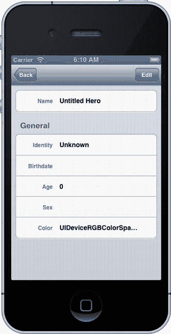

图 6-10.  英雄详情视图

“年龄”单元格存在一个问题。首先，在编辑模式下，你可以点击“年龄”单元格内部，它会获得焦点并显示键盘输入。其次，当你尝试从编辑模式保存时，应用程序会崩溃。我们来解决这个问题。

### 重构 SuperDBEditCell

默认情况下，“年龄”单元格是可编辑的。有一个表格视图数据源方法 `tableView:canEditRowAtIndexPath:` 用于确定特定表格视图单元格是否可编辑。默认情况下，此方法在 `UITableViewController` 模板中提供，但被注释掉了。因此，表格视图假定所有单元格都是可编辑的。显然，你需要此方法为“年龄”单元格的索引路径返回 `NO`。不幸的是，将单元格指定为不可编辑后，该单元格在编辑模式下不会缩进。这也许可以接受，但你希望“年龄”单元格即使在无法编辑时也能缩进。

应用程序崩溃是由于 `HeroDetailController` 的保存方法中的这几行代码：

```
for (SuperDBEditCell *cell in [self.tableView visibleCells])
    [self.hero setValue:[cell value] forKey:[cell key]];
```

当你尝试设置 `Hero` 实体中 `age` 属性的值时，会引发异常崩溃。记住，你在数据模型中将 `age` 声明为瞬态属性。这意味着 `age` 的值是计算得出的，无法直接设置。你需要一种方法来检查是否应该保存单元格中的值。

首先，你需要定义一个不可编辑版本的 `SuperDBEditCell`。但与其这样做，不如创建一个 `SuperDBEditCell` 的超类，命名为 `SuperDBCell`，它使用 `textField`，但不允许在编辑时启用它。这似乎是尝试 Xcode 重构功能的好时机。

#### Xcode 重构选项

打开 Xcode 中的 Edit  Refactor。你应该会看到图 6-11 中的子菜单。

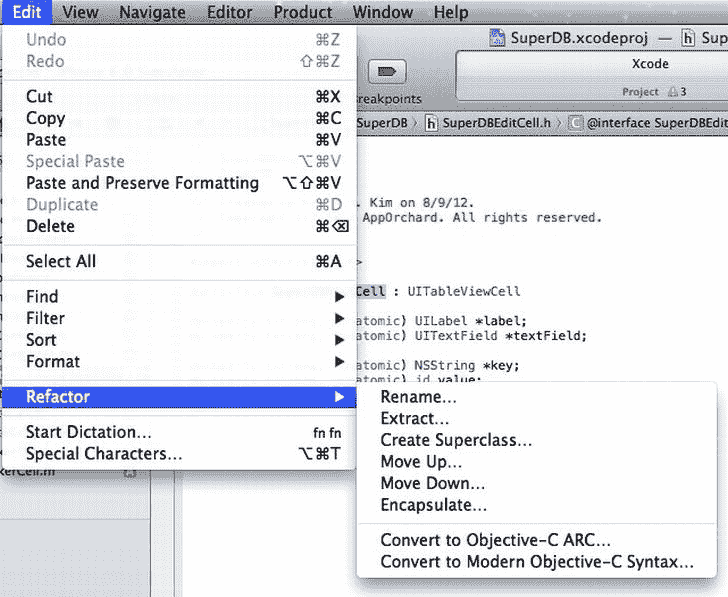

图 6-11.  Xcode 重构菜单

在继续之前，让我们快速回顾一下什么是重构以及每个菜单项的作用。重构是在不改变代码外部行为的情况下重构代码。通常，你会重构一些代码（通常是一个方法）以改善某些非功能性属性（例如，降低复杂性、提高可读性）。这并不是随意地“重写”代码，而是一种有纪律的、小步进行的改进方法。

**注意**  关于重构模式的优秀资源是 Martin Fowler 的《重构：改善既有代码的设计》（Addison-Wesley, 1999）。它不仅解释了重构背后的过程，还概述了几种重构技术。

Xcode 的重构选项包括：


* **重命名**：重命名符号，使其更清晰地表明用途，并使源代码更易于阅读。符号的示例包括类、方法或函数的名称。不幸的是，在协议中声明的方法无法重命名。
* **提取**：将您在 Xcode 中选择的代码提取到一个新的方法或函数中。
* **创建超类**：为当前在 Xcode 中选择的类定义一个超类。
* **上移**：将选定的方法、属性或实例变量从某个类移动到其超类，前提是两者都在您的项目中定义。
* **下移**：与*上移*相反，它将选定的符号从某个类移动到其子类，前提是两者都在您的项目中定义。
* **封装**：封装一个实例变量并创建适当的访问器。
* **转换为 Objective-C ARC**：一个用于帮助将遗留项目转换为使用自动引用计数的工具。
* **转换为现代 Objective-C 语法**：一个用于更新代码以使用更现代的 Objective-C 特性的工具，例如新的字面量语法（数组、字典、布尔值）。

这只是对“重构”菜单项的一个简要介绍，目的是让您熟悉 Xcode 中提供了哪些功能，以便用于将来的项目。让我们回到 `SuperDB` 应用。

您将要使用 *创建超类* 选项。打开 `SuperDBEditCell.h`，并高亮 `@interface` 声明后的类名 `SuperDBEditCell`。选择 Edit（编辑） Refactor（重构） Create Superclass（创建超类）。Xcode 应该会弹出一个对话框，询问超类的名称（图 6-12）。将类命名为 `SuperDBCell`，选择“为新超类创建文件”选项，然后点击 Preview（预览）。您应该会看到一个文件合并弹出窗口，其中显示了创建 `SuperDBCell` 超类将会进行的所有更改（图 6-13）。


图 6-12.  创建超类弹出窗口

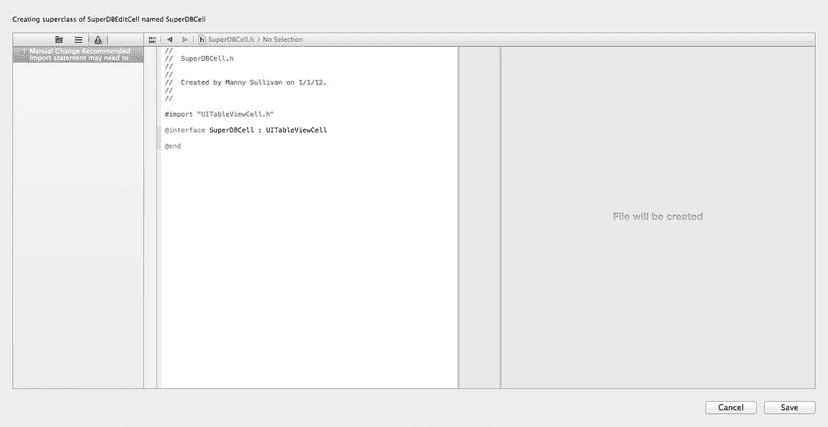

图 6-13.  重构文件合并预览

这个预览除了显示 `SuperDBCell` 接口和实现文件的创建之外，并没有展示太多内容。点击 Save（保存）。Xcode 可能会询问是否要拍摄快照。是否使用快照由您决定。我们偶尔会使用，但我们更喜欢使用像 Git 这样的版本控制系统。

### 移动代码

目前，Xcode 并未完成您希望的所有操作。它确实为 `SuperDBCell` 创建了文件，也使得 `SuperDBEditCell` 成为 `SuperDBCell` 的子类，但除此之外没做太多事情。请记住，您希望让 `SuperDBCell` 与 `SuperDBEditCell` 相同，只是 `textField` 永远不会被启用。

让我们从 `SuperDBCell` 的接口文件开始。您将把 `SuperDBEditCell` 的大部分代码移动到 `SuperDBCell` 中。

```objc
#import <UIKit/UIKit.h>

@interface SuperDBCell : UITableViewCell

@property (strong, nonatomic) UILabel *label;
@property (strong, nonatomic) UITextField *textField;

@property (strong, nonatomic) NSString *key;
@property (strong, nonatomic) id value;

@property (strong, nonatomic) NSManagedObject *hero;

@end
```

因此，`SuperDBEditCell.h` 也会随之改变。

```objc
#import <UIKit/UIKit.h>
#import "SuperDBCell.h"

@interface SuperDBEditCell : SuperDBCell <UITextFieldDelegate, UIAlertViewDelegate>

- (IBAction)validate;

@end
```

接下来，您调整 `SuperDBCell` 的实现。

```objc
#import "SuperDBCell.h"

#define kLabelTextColor [UIColor colorWithRed:0.321569f green:0.4f blue:0.568627f alpha:1.0f]

@implementation SuperDBCell

- (id)initWithStyle:(UITableViewCellStyle)style reuseIdentifier:(NSString *)reuseIdentifier
{
    self = [super initWithStyle:style reuseIdentifier:reuseIdentifier];
    if (self) {
        // 初始化代码
        self.selectionStyle = UITableViewCellSelectionStyleNone;

// TODO - 使用 Auto Layout 调整大小
        self.label = [[UILabel alloc] initWithFrame:CGRectMake(12.0, 15.0, 67.0, 15.0)];
        self.label.backgroundColor = [UIColor clearColor];
        self.label.font = [UIFont boldSystemFontOfSize:[UIFont smallSystemFontSize]];
        self.label.textAlignment = NSTextAlignmentRight;
        self.label.textColor = kLabelTextColor;
        self.label.text = @"label";
        [self.contentView addSubview:self.label];

self.textField = [[UITextField alloc] initWithFrame:CGRectMake(93.0, 13.0, 170.0, 19.0)];
        self.textField.backgroundColor = [UIColor clearColor];
        self.textField.clearButtonMode = UITextFieldViewModeWhileEditing;
        self.textField.enabled = NO;
        self.textField.font = [UIFont boldSystemFontOfSize:[UIFont systemFontSize]];
        self.textField.text = @"Title";
        [self.contentView addSubview:self.textField];
    }
    return self;
}

#pragma mark - 属性重写

- (id)value
{
    return self.textField.text;
}

- (void)setValue:(id)newValue
{
    if ([newValue isKindOfClass:[NSString class]])
        self.textField.text = newValue;
    else
        self.textField.text = [newValue description];
}

@end
```

您将大部分 `initWithStyle:reuseIdentifier:` 代码从 `SuperDBEditCell` 移到了 `SuperDBCell`。请注意，您禁用了 `textField`。

```objc
self.textField.enabled = NO;
```

此外，您没有将 `SuperDBCell` 声明为 `textField` 的委托。`SuperDBCell` 也没有 `setEditing:animated:` 方法；它也不需要这个方法。`SuperDBEditCell` 拥有该方法的唯一原因是为了启用和禁用 `textField`。

由于 `SuperDBCell` 的实现，您需要更改 `SuperDBEditCell.m`。首先，更新 `initWithStyle:reuseIdentifier:`。

```objc
- (id)initWithStyle:(UITableViewCellStyle)style reuseIdentifier:(NSString *)reuseIdentifier
{
    self = [super initWithStyle:style reuseIdentifier:reuseIdentifier];
    if (self) {
        // 初始化代码
        self.textField.delegate = self;
    }
    return self;
}
```

接下来，删除 `value` 属性的访问器和修改器。同时，可以删除文件顶部的 `#define`，因为它已经被移到了 `SuperDBCell.m` 中。

您的“重构”已经完成，但您仍然需要进行一些更改。

### 可编辑属性

当您尝试保存编辑过的 Hero 时，`SuperDB` 应用会崩溃，因为它试图保存 Age 单元格中的值。您希望 `HeroDetailController` 的 save 方法在更新 Hero 实例时跳过 Age 单元格。

您可以施展一些 Core Data 的技巧，让 Hero 实例检查单元格的属性键是否是瞬态的。这似乎需要做很多工作，仅为了获取一个您能相当可靠地推断出来的信息。请记住，您创建 `SuperDBCell` 类是为了处理那些不可编辑（并且可能不需要更新）的字段。因此，您希望 `SuperDBCell` 对某个查询返回 `YES`，而 `SuperDBEditCell` 返回 `NO`（或反之亦然）。我们只需在 `SuperDBCell` 中定义一个 `isEditable` 方法，让它返回 `NO`。然后在 `SuperDBEditCell` 中重写该方法，使其返回 `YES`。

将此添加到 `SuperDBCell.h`：

```objc
- (BOOL)isEditable;
```

并将其实现添加到 `SuperDBCell.m`：

```objc
#pragma mark - 实例方法

- (BOOL)isEditable
{
    return NO;
}
```

在 `SuperDBEditCell.m` 中重写该方法。

```objc
#pragma mark - SuperDBCell 重写

- (BOOL)isEditable
{
    return YES;
}
```

现在，您需要在 `HeroDetailController.m` 中使用这个方法。更新 save 方法中的相应代码。

```objc
for (SuperDBEditCell *cell in [self.tableView visibleCells]) {
     if ([cell isEditable])
         [self.hero setValue:[cell value] forKey:[cell key]];
}
```

最后，您需要更新 `HeroDetailConfiguration.plist`，让 Age 单元格使用 `SuperDBCell`。打开 `HeroDetailConfiguration.plist`，导航到 Root（根） sections（部分） Item 1（项目 1） rows（行） Item 2（项目 2） class（类），并将其值更改为 `SuperDBCell`。


### 构建并运行应用

构建并运行应用。导航至详情视图并进入编辑模式。尝试点击年龄单元格，你会发现无法操作，因为该单元格不可编辑。

### 创建颜色表格视图单元格

既然已经完成了颜色值转换器，接下来思考如何输入英雄偏好的颜色。回顾图 6-1，这里有一个显示英雄偏好颜色色带的表格视图单元格。当用户在编辑模式下选中偏好颜色单元格时，需要显示颜色选择器（图 6-2）。与第 4 章中使用的日期选择器和值选择器不同，iOS SDK 并未提供颜色选择器的原生支持，因此需要从头构建一个。

#### 自定义颜色编辑器

在导航窗格中单击`SuperDB`文件夹，创建一个新的 Objective-C 类。按照提示将类命名为`UIColorPicker`，并使其成为`UIControl`的子类。`UIControl`是按钮和滑块等控件的基类。此处定义一个封装了四个滑块的`UIControl`子类，`UIColorPicker`只需声明`color`属性。

```
@property (strong, nonatomic) UIColor *color;
```

其他所有属性可在实现文件`UIColorPicker.m`的类别中私有声明。

```
@interface UIColorPicker ()
@property (strong, nonatomic) UISlider *redSlider;
@property (strong, nonatomic) UISlider *greenSlider;
@property (strong, nonatomic) UISlider *blueSlider;
@property (strong, nonatomic) UISlider *alphaSlider;
- (IBAction)sliderChanged:(id)sender;
- (UILabel *)labelWithFrame:(CGRect)frame text:(NSString *)text;
@end
```

同时声明了两个（私有）方法：一个是滑块值变化时的回调方法（`sliderChanged:`），另一个是创建选择器视图的便捷方法。

Xcode 应为`UIColorPicker`类创建了`initWithFrame:`方法。添加以下初始化代码：

```
        self.autoresizingMask = UIViewAutoresizingFlexibleHeight | UIViewAutoresizingFlexibleWidth;

[self addSubview:[self labelWithFrame:CGRectMake(20.0, 40.0,  60, 24) text:@"Red"]];
        [self addSubview:[self labelWithFrame:CGRectMake(20.0, 80.0,  60, 24) text:@"Green"]];
        [self addSubview:[self labelWithFrame:CGRectMake(20.0, 120.0, 60, 24) text:@"Blue"]];
        [self addSubview:[self labelWithFrame:CGRectMake(20.0, 160.0, 60, 24) text:@"Alpha"]];

_redSlider   = [[UISlider alloc] initWithFrame:CGRectMake(100.0, 40.0,  190, 24)];
        _greenSlider = [[UISlider alloc] initWithFrame:CGRectMake(100.0, 80.0,  190, 24)];
        _blueSlider  = [[UISlider alloc] initWithFrame:CGRectMake(100.0, 120.0, 190, 24)];
        _alphaSlider = [[UISlider alloc] initWithFrame:CGRectMake(100.0, 160.0, 190, 24)];

[_redSlider addTarget:self
                        action:@selector(sliderChanged:)
              forControlEvents:UIControlEventValueChanged];
        [_greenSlider addTarget:self
                          action:@selector(sliderChanged:)
                forControlEvents:UIControlEventValueChanged];
        [_blueSlider addTarget:self
                         action:@selector(sliderChanged:)
               forControlEvents:UIControlEventValueChanged];
        [_alphaSlider addTarget:self
                          action:@selector(sliderChanged:)
                forControlEvents:UIControlEventValueChanged];

[self addSubview:_redSlider];
        [self addSubview:_greenSlider];
        [self addSubview:_blueSlider];
        [self addSubview:_alphaSlider];
```

此处正在布局颜色选择器的外观，通过`initWithFrame:`方法将滑块放置在视图中。

需要重写`color`属性的设置方法，以便正确设置滑块的值：

```
#pragma mark - 属性重写

- (void)setColor:(UIColor *)color
{
    _color = color;
    const CGFloat *components = CGColorGetComponents(color.CGColor);
    [_redSlider setValue:components[0]];
    [_greenSlider setValue:components[1]];
    [_blueSlider setValue:components[2]];
    [_alphaSlider setValue:components[3]];
}
```

现在可以实现（私有）实例方法。首先是`sliderChanged:`：

```
#pragma mark - （私有）实例方法

- (IBAction)sliderChanged:(id)sender
{
    _color = [UIColor colorWithRed:_redSlider.value
                             green:_greenSlider.value
                              blue:_blueSlider.value
                             alpha:_alphaSlider.value];

[self sendActionsForControlEvents:UIControlEventValueChanged];
}
```

接下来是`labelWithFrame:text:`：

```
- (UILabel *)labelWithFrame:(CGRect)frame text:(NSString *)text
{
    UILabel *label = [[UILabel alloc] initWithFrame:frame];
    label.userInteractionEnabled = NO;
    label.backgroundColor = [UIColor clearColor];
    label.font = [UIFont boldSystemFontOfSize:[UIFont systemFontSize]];
    label.textAlignment = NSTextAlignmentRight;
    label.textColor = [UIColor darkTextColor];
    label.text = text;
    return label;
}
```

完成自定义颜色选择器后，需要添加一个自定义表格视图单元格类来使用它。

#### 自定义颜色表格视图单元格

由于有了自定义选择器视图，需要像创建`SuperDBDateCell`和`SuperDBPickerCell`那样，创建`SuperDBEditCell`的子类。但如何在`SuperDBEditableCell`类中显示`UIColor`值呢？可以创建一个显示颜色四个值（红、绿、蓝和透明度）的字符串。但这对大多数最终用户来说毫无意义，用户希望在查看英雄详情时看到实际颜色。目前表格视图单元格中并没有显示颜色的机制。

如果构建一个复杂的表格视图单元格子类来显示颜色，会在应用的其他地方用到它吗？很可能不会。既然如此，就无需投入时间和精力来构建这个类。这里有一个更简单的解决方案：用包含特殊 Unicode 字符（显示为实心矩形）的`NSString`填充文本字段，然后添加代码更改文本的字体颜色，使其显示为英雄偏好的颜色。

创建一个新的 Objective-C 子类，使其成为`SuperDBEditCell`的子类，并命名为`SuperDBColorCell`。在`SuperDBColorCell.m`中添加颜色选择器类的（私有）属性。

```
#import "UIColorPicker.h"

@interface SuperDBColorCell ()
@property (strong, nonatomic) UIColorPicker *colorPicker;
- (void)colorPickerChanged:(id)sender;
- (NSAttributedString *)attributedColorString;
@end
```

同时添加一个（私有）实例方法`attributedColorString`，用于返回`NSAttributedString`。富文本字符串是一种包含自格式信息的字符串。在 iOS 6 之前，富文本字符串功能极其有限，而现在可以将其与 UIKit 对象一起使用。稍后就会明白为什么需要这个方法。

按照如下方式定义`initWithStyle:reuseIdentifier:`方法：

```
- (id)initWithStyle:(UITableViewCellStyle)style reuseIdentifier:(NSString *)reuseIdentifier
{
    self = [super initWithStyle:style reuseIdentifier:reuseIdentifier];
    if (self) {
        // 初始化代码
        self.colorPicker = [[UIColorPicker alloc] initWithFrame:CGRectMake(0, 0, 320, 216)];
        [self.colorPicker addTarget:self
                              action:@selector(colorPickerChanged:)
                    forControlEvents:UIControlEventValueChanged];
        self.textField.inputView = self.colorPicker;
    }
    return self;
}
```

这段代码应该相当直观。与其他`SuperDBEditCell`子类一样，已经实例化了选择器对象，并将其设置为`textField`的`inputView`。

接下来，重写`SuperDBEditCell`的值访问方法和设置方法。

```
#pragma mark - SuperDBEditCell 重写方法

- (id)value
{
    return self.colorPicker.color;
}
```


- (void)setValue:(id)value
{
    if (value != nil && [value isKindOfClass:[UIColor class]]) {
        [super setValue:value];
        self.colorPicker.color = value;
    }
    else {
        self.colorPicker.color = [UIColor colorWithRed:1.0 green:1.0 blue:1.0 alpha:1.0];
    }
    self.textField.attributedText = self.attributedColorString;
}

请注意这一行：

```
self.textField.attributedText = self.attributedColorString;
```

在`setValue:`方法中，你没有设置`textField`的`text`属性，而是使用了新的`attributedText`属性。这告诉`textView`你正在使用属性字符串，并使用你定义的属性来格式化字符串。如果 Hero 没有定义颜色属性，你还会将 Color Picker 设置为白色。

添加`colorPicker`回调方法：

```
#pragma mark - (Private) Instance Methods

- (void)colorPickerChanged:(id)sender
{
    self.textField.attributedText = self.attributedColorString;
}
```

同样，你告诉`textField`更新自身。但是用什么呢？

最后，添加以下代码：

```
- (NSAttributedString *)attributedColorString
{
    NSString *block = [NSString stringWithUTF8String:"\u2588\u2588\u2588\u2588\u2588\u2588\u2588\u2588\u2588\u2588\u2588"];
    UIColor *color = self.colorPicker.color;
    NSDictionary *attrs = @{NSForegroundColorAttributeName:color,
                            NSFontAttributeName:[UIFont boldSystemFontOfSize:[UIFont systemFontSize]]};
    NSAttributedString *attributedString =         [[NSAttributedString alloc] initWithString:block attributes:attrs];
    return attributedString;
}
```

首先，你定义了一个包含许多 Unicode 字符的字符串。`\u2588`是方块字符的 Unicode 编码。你只是创建了一个由 10 个方块字符组成的字符串。接下来，你让`colorPicker`告诉我们它的颜色。然后你使用该颜色和系统粗体字体（15pt）来定义一个字典。你使用的键是`NSForegroundColorAttributeName`和`NSFontAttributeName`。这些键是专门为 UIKit 属性字符串支持定义的。从它们的名称可以推断，`NSForegroundColorAttributeName`设置字符串的前景（或文本）颜色，而`NSFontAttributeName`允许你为字符串定义字体。最后，你使用 Unicode 字符串块和属性字典实例化属性字符串。

你也可以使用`textField`的常规`text`属性，并仅根据需要设置`textColor`，但我们认为这个关于属性字符串的简短演示可能会引起你的兴趣。属性字符串非常灵活和强大，值得你花时间研究。

**注意**：要了解更多关于属性字符串的信息，请查看苹果的《属性字符串编程指南》，网址为[`developer.apple.com/library/mac/#documentation/Cocoa/Conceptual/AttributedStrings/AttributedStrings.html`](http://developer.apple.com/library/mac/#documentation/Cocoa/Conceptual/AttributedStrings/AttributedStrings.html)。

##### 清理 Picker

在使用新的 Color Picker 之前，你还需要完成一步。首先，你需要更新配置属性列表以使用`SuperDBColorCell`。打开`HeroDetailController.plist`并展开至`Root``sections``Item 1``rows``Item 4``class`。将其值从`SuperDBEditCell`更改为`SuperDBColorCell`。

一切就绪？让我们构建并运行。导航到详情视图，点击“编辑”按钮，然后点击颜色单元格。

这很奇怪。Color Picker 根本没有出现。但颜色单元格有一个光标和清除文本按钮（图 6-14）。

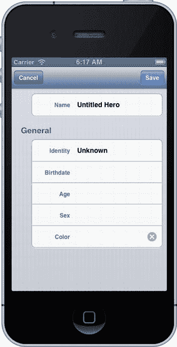

图 6-14. 奇怪的颜色单元格外观

你可能已经厌倦了我们让你构建并运行应用程序，而我们知道它不会运行。把它看作是在实际开发中的一次练习。很多时候，你会认为一切都正确，但运行应用程序时却发现事情不奏效。这时候，你需要（单元）测试、调试，或者思考出解决方案。

无论如何，Color Picker 没有出现是有原因的。编辑`SuperDBColorCell.m`，找到`initWithStyle:reuseIdentifier:`。在初始化代码中，你像这样创建了 Color Picker：

```
self.colorPicker = [[UIColorPicker alloc] initWithFrame:CGRectZero];
```

你将 Color Picker 的大小设为零尺寸的`CGRect`。据你所知，它可能已经出现了。但由于其大小为零，所以什么也看不到。你不是对 Date Picker 和 Picker View 也这样做了吗？是的，你做了，但那些类内部有钩子可以根据需要调整自身大小。由于你是从头开始构建 Color Picker，所以必须手动调用这些钩子。

首先，你需要用一个非零的`CGRect`来初始化 Color Picker。从一个默认大小开始：

```
self.colorPicker = [[UIColorPicker alloc] initWithFrame:CGRectMake(0, 0, 320, 216)];
```

切换到`UIColorPicker.m`，并在`initWithFrame:`方法之后添加此方法：

```
- (void)willMoveToSuperview:(UIView *)newSuperview
{
    self.frame = newSuperview.bounds;
}
```

现在，当你运行它并尝试编辑颜色单元格时，你应该会看到类似于图 6-15 的内容。

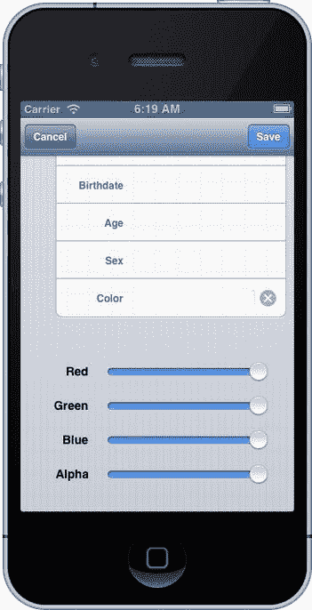

图 6-15. Color Picker

嗯，它有效，但看起来不太美观。你可以通过一些图形魔法来修复它。你应该仍在编辑`UIColorPicker.m`。添加以下`#import`：

```
#import "QuartzCore/CAGradientLayer.h"
```

现在添加以下`#define`：

```
#define kTopBackgroundColor    [UIColor colorWithRed:0.98 green:0.98 blue:0.98 alpha:1.0]
#define kBottomBackgroundColor [UIColor colorWithRed:0.79 green:0.79 blue:0.79 alpha:1.0]
```

找到被注释掉的`drawRect:`方法并取消注释。如果你删除了它，不用担心，只需让它看起来像这样：

```
- (void)drawRect:(CGRect)rect
{
    CAGradientLayer *gradient = [CAGradientLayer layer];
    gradient.frame = self.bounds;
    gradient.colors = [NSArray arrayWithObjects:(__bridge id)[kTopBackgroundColor CGColor],
                                                 (__bridge id)[kBottomBackgroundColor CGColor], nil];
    [self.layer insertSublayer:gradient atIndex:0];
}
```

我们想指出`drawRect:`方法。此方法用于设置 Color Picker 的背景颜色，并赋予其平滑的颜色过渡。得益于`QuartzCore`框架，你能够做到这一点。你需要将此框架添加到你的项目中。

在导航窗格中单击`SuperDB`项目。在项目编辑器视图中，选择`SuperDB`目标，然后导航到“Build Phases”窗格。展开“Link Binary With Libraries”构建阶段（图 6-16）。点击构建阶段左下角的+。在弹出选择器中向下滚动，选择`QuartzCore.framework`（图 6-17）。点击“添加”。

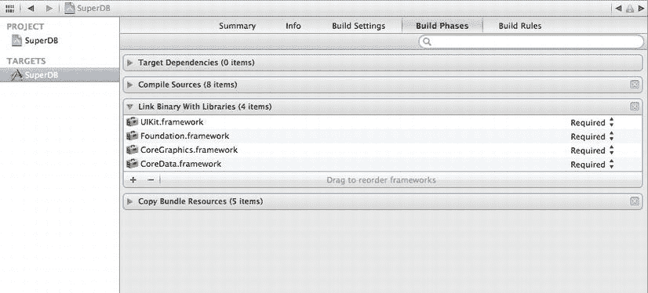

图 6-16. 链接库构建阶段

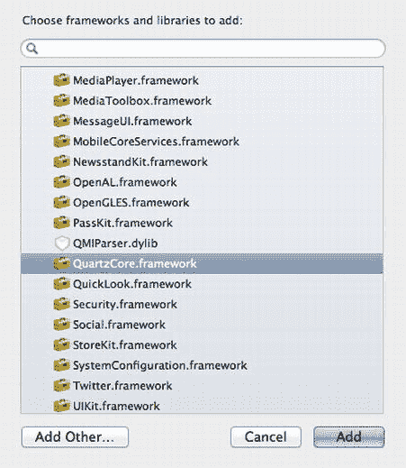

图 6-17. 添加`QuartzCore.framework`

最后一件事：你想关闭颜色单元格中的清除文本按钮。这很简单。在`SuperDBColorCell.m`中，将下面这一行添加到`initWithStyle:reuseIdentifier:`的初始化代码中：

```
self.textField.clearButtonMode = UITextFieldViewModeNever;
```

构建并运行应用程序。导航并编辑颜色单元格。好多了（图 6-18）！

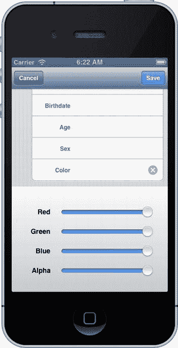


图 6-18. 带有渐变背景的颜色选择器

### 还有一件事

运行应用，新增一位英雄。进入编辑模式并清空`Name`字段。现在点击`Identity`字段。不出所料，验证警告对话框将弹出。然而，它并未显示正确的失败原因（图 6-19）。

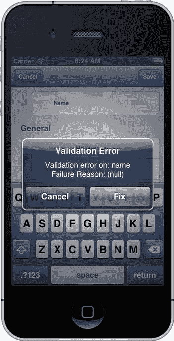

图 6-19. 无失败原因的验证对话框

回过头看`SuperDBCell.m`中的`validate`方法，你会看到消息是这样填充的：

```
message =    [NSString
 stringWithFormat:NSLocalizedString(@"Validation error on: %@\rFailure Reason: %@",
                                                @"Validation error on: %@, Failure Reason: %@)"),
                              [userInfo valueForKey:@"NSValidationErrorKey"],
                               [error localizedFailureReason]];
```

对`NSError`实例的方法调用

```
[error localizedFailureReason]
```

返回的是`nil`。在 iOS 4 之前，Core Data 会填充`localizedFailureReason`。自那以后，它不再填充了。你需要提供一个你可以自定义的简单修复方案。

`NSError`提供了一个方法`code`，它会返回一个整数错误码。该代码的值根据错误的来源而定义。

**注意** 要了解更多关于`NSError`和错误代码如何工作的信息，请阅读`https://developer.apple.com/library/ios/#documentation/Cocoa/Conceptual/ErrorHandlingCocoa/ErrorHandling/ErrorHandling.html`上的*错误处理编程指南*。具体来说，请阅读名为“错误对象、域和代码”的章节。

你在这里得到的错误代码在 Core Data 头文件`CoreDataErrors.h`中定义。

**注意** Apple 在`https://developer.apple.com/library/ios/#documentation/Cocoa/Reference/CoreDataFramework/Miscellaneous/CoreData_Constants/Reference/reference.html`上记录了`CoreDataError.h`。

你碰巧知道你得到的错误代码值是 1670。这被分配给了枚举`NSValidationStringTooShortError`。你可以添加一些逻辑来处理这个特定的错误代码，这样就能解决问题，但我们已经为你多做了一点工作。

在 Book Downloads 包中找到文件`CoreDataErrors.plist`。这是我们创建的一个简单的`plist`文件，它将 Core Data 错误代码映射为简单的错误消息。将此文件添加到 SuperDB 项目中，确保复制一份。

你可以创建一个`CoreDataError`类来处理这个`plist`的加载，但为了简便起见，我们将走一条更简单的路线。首先，在`SuperDBEditCell.m`的顶部，`@implementation`声明之前，声明一个静态字典。

```
static NSDictionary *__CoreDataErrors;
```

在类初始化器中填充这个字典。这将在`@implementation`声明之后立即进行。

```
+ (void)initialize
{
    NSURL *plistURL = [[NSBundle mainBundle] URLForResource:@"CoreDataErrors"
                                                withExtension:@"plist"];
    __CoreDataErrors = [NSDictionary dictionaryWithContentsOfURL:plistURL];
}
```

现在，你需要编辑`validate`方法来使用这个字典。找到以

```
if ([[error domain] isEqualToString:@"NSCocoaErrorDomain"]) {
```

开头的行，并将`if`块编辑为

```
if ([[error domain] isEqualToString:@"NSCocoaErrorDomain"]) {
            NSString *errorCodeStr = [NSString stringWithFormat:@"%d", [error code]];
            NSString *errorMessage = [__CoreDataErrors valueForKey:errorCodeStr];
            NSDictionary *userInfo = [error userInfo];
message =     [NSString
stringWithFormat:NSLocalizedString(@"Validation error on: %@\rFailure Reason: %@",
                                                @"Validation error on: %@, Failure Reason: %@)"),
                              [userInfo valueForKey:@"NSValidationErrorKey"],
                               errorMessage];
}
```

构建并运行应用。清空英雄的名字并尝试移动到另一个字段。验证警告对话框应该像图 6-4 所示。

你可以编辑`CoreDataErrors.plist`中的字符串值，以便按你喜欢的任何方式自定义错误消息。让我们希望 Apple 能尽快恢复这个功能。

### 色彩告别

到现在为止，你应该已经很好地理解了通过子类化，特别是子类化`NSManagedObject`，你能获得多大的能力。你看到了如何使用它进行条件默认值设置，以及单字段和多字段验证。你还看到了如何使用自定义托管对象来创建虚拟访问器。你看到了当用户输入无效属性导致托管对象验证失败时，如何礼貌地通知用户，并且你看到了如何使用可转换属性和值转换器在 Core Data 中存储自定义对象。

这是一个内容密集的章节，但你真的应该开始感受到 Core Data 是多么灵活和强大。在继续学习 iOS 6 SDK 的其他部分之前，你还有一章关于 Core Data 的内容。当你准备好了，翻到下一页来学习关系和获取属性。

