# 第 7 章：关系、获取属性和表达式

欢迎来到 Core Data 的最后一章。到目前为止，你的应用程序只包含一个实体：Hero。在本章中，我们将向你展示托管对象如何通过使用关系和获取属性来包含和引用其他托管对象。这将使你能够制作比当前的 SuperDB 应用程序复杂得多的应用程序。

然而，这并不是你将在本章中做的唯一一件事。你还要将你的`HeroDetailController`变成一个通用的托管对象控制器。通过使控制器代码更加通用，你将使控制器子类更小且更易于维护。你将扩展配置属性列表，以允许你定义额外的实体视图。

本章你有很多事要做，所以不要磨蹭。让我们开始吧。

### 扩展你的应用：超级能力和报告

在讨论细节之前，让我们快速浏览一下本章中你将要对 SuperDB 应用进行的更改。表面上，这些更改看起来相对简单。你将添加为每位英雄指定任意数量超级能力的能力，并且还会添加一些报告，显示符合某些条件的其他超级英雄，包括比这位英雄更年轻或更年长的英雄，或者同性或异性的英雄（图 7-1）。


图 7-1. 在本章结束时，你将添加为每位英雄指定任意数量超级能力的能力，并提供多种报告，让你根据与其他英雄的关系来查找他们

这些能力将由一个你将创建并富有想象力地命名为`Power`的新实体来表示。当用户添加或编辑能力时，他们将会看到一个新视图（图 7-2），但实际上，在底层，它将是用于编辑和显示英雄的同一个对象的新实例。


图 7-2. 用于编辑能力的新视图实际上是用于编辑英雄的同一个对象的实例

当用户深入查看其中一个报告时，他们将获得符合所选条件的其他英雄列表（图 7-3）。

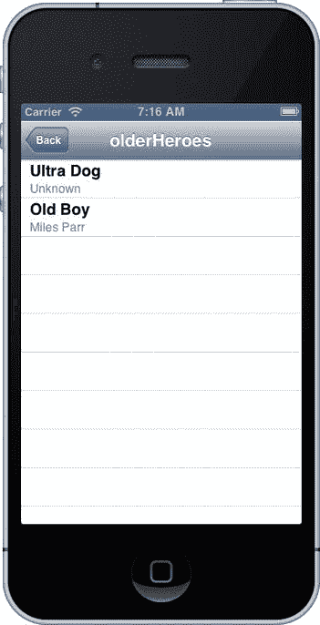


### 图 7-3：报告部分

角色页面上的报告部分，能让您找到与当前编辑角色满足特定条件的其他角色。例如，您正在查看所有出生时间晚于“超级猫”的角色。

点击任意一行，将跳转到另一视图，在那里您可以使用同一个通用控制器类的另一个实例来编辑该角色。您的用户将能够无限层级地深入查看（仅受内存限制），而这都归功于这一个类。

在开始实现这些更改之前，您需要了解一些概念，并对数据模型进行一些调整。

### 关系

我们在第 2 章中介绍过 Core Data 关系的概念。现在，我们将深入探讨，并展示如何在应用中使用它们。关系是 Core Data 中最重要的概念之一。没有关系，实体将是孤立的。一个实体将无法包含或引用另一个实体。让我们先看一个假设的头文件，这是一个传统数据模型类的简单示例，为您提供一个熟悉的参考点：

```objc
#import <UIKit/UIKit.h>

@class Address;

@interface Person : NSObject

@property (strong, nonatomic) NSString *firstName;
@property (strong, nonatomic) NSString *lastName;
@property (strong, nonatomic) NSDate *birthdate;
@property (strong, nonatomic) UIImage *image;
@property (strong, nonatomic) Address *address;
@property (strong, nonatomic) Person *mother;
@property (strong, nonatomic) Person *father;
@property (strong, nonatomic) NSMutableArray *children;

@end
```

这里有一个表示单个人物的类。您有一些实例变量来存储关于该人物的各种信息，以及向其他对象暴露这些信息的属性。这并没有什么惊世骇俗之处。现在，让我们思考一下如何在 Core Data 中重新创建这个对象。

前四个实例变量——`firstName`、`lastName`、`birthDate` 和 `image`——都可以由 Core Data 内置的属性类型处理，因此您可以使用属性来将这些信息存储在实体上。两个 `NSString` 实例将变成 String 属性，`NSDate` 实例将变成 Date 属性，而 `UIImage` 实例将变成 Transformable 属性，其处理方式与上一章中的 `UIColor` 相同。

之后，您有一个 `Address` 对象的实例。这个对象可能存储街道地址、城市、州或省以及邮政编码等信息。随后是两个 `Person` 实例变量和一个可变数组，用于存储指向该人物子女的指针。很可能，这些数组旨在存储指向更多 `Person` 对象的指针。

在面向对象编程中，将指向另一个对象的指针作为实例变量包含进来，称为*组合*。组合是一种极其便利的手段，因为它让您可以创建更小的类并重用对象，而不是复制数据。

在 Core Data 中，您并没有严格意义上的组合，但您有关系，它本质上服务于相同的目的。关系允许托管对象包含对特定实体的其他托管对象的引用，这些实体称为*目标实体*，有时也简称为目标。关系是 Core Data 的属性，就像属性（attribute）一样。因此，它们都有一个指定的名称，作为设置和获取关系所代表的一个或多个对象的键值。关系与属性（attribute）的添加方式相同，都是在 Xcode 的数据模型编辑器中添加到实体。几分钟后您将看到如何操作。关系有两种基本类型：一对一关系和一对多关系。

#### 一对一关系

当您创建一对一关系时，意味着一个对象可以包含一个指向特定实体中单个托管对象的指针。在您的示例中，`Person` 实体与 `Address` 实体有一个单一的一对一关系。

一旦您向对象添加了一对一关系，就可以使用键值编码（KVC）将托管对象赋值给该关系。例如，您可以为 `Person` 托管对象设置 `Address` 实体，如下所示：

```objc
NSManagedObject *address = [NSEntityDescription insertNewObjectForEntityForName:@"Address"
                                        inManagedObjectContext:thePerson.managedObjectContext];
[thePerson setValue:address forKey:@"address"];
```

检索该对象也可以像处理属性一样使用 KVC 完成：

```objc
NSManagedObject *address = [thePerson valueForKey:@"address"];
```

当您像上一章所做的那样，创建 `NSManagedObject` 的自定义子类时，您可以使用 Objective-C 属性和点语法来获取和设置这些属性。表示一对一关系的属性是 `NSManagedObject` 或其子类的实例，因此设置地址看起来就像设置属性一样：

```objc
NSManagedObject *address = [NSEntityDescription insertNewObjectForEntityForName:@"Address"
                                        inManagedObjectContext:thePerson.managedObjectContext];
thePerson.address = address;
```

而检索一对一关系则变成如下形式：

```objc
NSManagedObject *address = thePerson.address;
```

几乎在所有方面，您在代码中处理一对一关系的方式，都与处理 Core Data 属性的方式相同。您使用 KVC 通过 Objective-C 对象来获取和设置值。只不过您使用的是代表实体的 `NSManagedObject` 或其子类，而不是与不同属性类型相对应的 Foundation 类。

#### 一对多关系

一对多关系允许您使用一个关系将多个托管对象关联到特定的一个托管对象。这相当于在 Objective-C 中使用集合类（例如 `NSMutableArray` 或 `NSMutableSet`）进行组合，就像前面看到的 `Person` 类中的 `children` 实例变量。在那个例子中，您使用了 `NSMutableArray`，它是一个可编辑的、有序的对象集合。这个数组允许您随意添加和移除对象。如果您想表示 `Person` 实例所代表的人物有子女，只需将代表其子女的 `Person` 实例添加到 `children` 数组中即可。

在 Core Data 中，情况略有不同。一对多关系是无序的。它们由 `NSSet`（一个不可更改的无序不可变集合）或 `NSMutableSet`（一个可以更改的无序集合）的实例来表示。下面是使用 `NSSet` 获取一对多关系并遍历其内容的方式：

```objc
NSSet *children = [thePerson valueForKey:@"children"];
for (NSManagedObject *oneChild in children) {
    // 执行某些操作
}
```

**注意** 您是否发现了一个潜在问题，即一对多关系是以无序的 `NSSet` 形式返回的？在表格视图中显示它们时，确保关系中的对象有序一致非常重要。如果集合是无序的，您就无法保证点击的行能调出您期望的对象。在本章稍后部分，您将看到如何处理这个问题。

另一方面，如果您想从一对多关系中添加或移除托管对象，您必须通过调用 `mutableSetValueForKey:` 而不是 `valueForKey:` 来请求 Core Data 提供一个 `NSMutableSet` 实例，如下所示：


```objc
NSManagedObject *child = [NSEntityDescription insertNewObjectForEntityForName:@"Person"
                                        inManagedObjectContext:thePerson.managedObjectContext];
NSMutableSet *children = [thePerson mutableSetValueForKey:@"children"];
[children addObject:child];
[children removeObject:child];
```

如果你不需要更改特定关系包含的对象，请直接使用`valueForKey:`，就像对待对一关系的数组一样。除非你确实需要更改构成关系的对象集，否则不要调用`mutableSetValueForKey:`，因为它比仅调用`valueForKey:`会带来稍多的开销。

除了使用`valueForKey:`和`mutableSetValueForKey:`之外，Core Data 还提供了在运行时动态创建的特殊方法，允许你向对多关系添加或删除托管对象。每个关系有四种这样的方法，每个方法名都包含了关系名。第一种方法允许你向关系添加单个对象：

```objc
- (void)addXXXObject:(NSManagedObject *)value;
```

其中`XXX`是关系名的大写形式，`value`是`NSManagedObject`或其特定子类的实例。在之前使用的`Person`示例中，向`children`关系添加一个孩子的方法如下：

```objc
- (void)addChildrenObject:(Person *)value;
```

删除单个对象的方法遵循类似的形式：

```objc
- (void)removeXXXObject:(NSManagedObject *)value;
```

动态生成的用于向关系添加多个对象的方法采用以下形式：

```objc
- (void)addXXX:(NSSet *)values;
```

该方法接受一个包含待添加托管对象的`NSSet`实例。因此，向`Person`托管对象添加多个孩子的动态创建方法如下：

```objc
- (void)addChildren:(NSSet *)values;
```

最后，这是用于从关系中移除多个托管对象的方法：

```objc
- (void)removeXXX:(NSSet *)values;
```

请记住，当你声明一个自定义`NSManagedObject`子类时，这些方法会自动生成。当 Xcode 遇到你的`NSManagedObject`子类声明时，它会在该子类上创建一个类别（category），该类别使用关系名构造方法名并声明这四个动态方法。由于这些方法在运行时生成，你项目的源代码中不会找到它们的实现。如果你从未调用这些方法，你永远不会看到它们。只要已经在模型编辑器中创建了对多关系，你无需额外操作即可访问这些方法，它们已被创建好并可供调用。

**注意**：与对多关系生成的方法相关的一个棘手点是：当你首次从模板生成`NSManagedObject`子类文件时，Xcode 声明了这四个动态方法。如果你的现有数据模型中已有对多关系及`NSManagedObject`子类，而你决定向该数据模型添加新的对多关系会发生什么？如果你向现有`NSManagedObject`子类添加对多关系，你需要自己添加包含这些动态方法的类别，稍后在本章中你将实际操作这一点。

使用这四个方法与使用`mutableSetValueForKey:`完全没有任何区别。动态方法只是更便捷一些，并使你的代码更易于阅读。

### 反向关系

在 Core Data 中，每个关系都可以有一个反向关系。关系及其反向关系是一枚硬币的两面。在`Person`对象示例中，`children`关系的反向关系可能是一个名为`parent`的关系。一个关系不必与其反向关系类型相同。例如，一个对一关系可以有一个对多的反向关系。实际上，这非常常见。从现实世界思考，一个人可以有多个孩子，而反向关系是一个孩子只能有一个亲生母亲和一个亲生父亲，但孩子可以有多个父母和监护人。因此，根据你的需求和建模方式，你可以选择使用对一或对多关系作为反向关系。

如果你向一个关系添加对象，Core Data 会自动负责向反向关系添加正确的对象。所以，如果你有一个人名为 Steve，并向 Steve 添加一个孩子，Core Data 会自动使该孩子的父/母为 Steve。

虽然关系不要求必须有反向关系，但 Apple 通常建议你始终创建并指定反向关系，即使你在应用程序中不需要使用该反向关系。事实上，如果你未能提供反向关系，编译器会发出警告。这个通用规则也有例外，特别是当反向关系将包含极大量对象时，因为从关系中移除对象会触发其从反向关系中的移除。移除反向关系需要遍历表示反向关系的集合，如果该集合非常大，可能会带来性能问题。但除非你有特别的理由不这样做，否则你应该建模反向关系，因为它有助于 Core Data 确保数据完整性。如果因此出现性能问题，后续移除反向关系相对容易。

**注意**：你可以从以下链接了解更多关于缺少反向关系如何导致完整性问题的内容：

[`developer.apple.com/library/mac/#documentation/Cocoa/Conceptual/CoreData/Articles/cdRelationships.html`](https://developer.apple.com/library/mac/#documentation/Cocoa/Conceptual/CoreData/Articles/cdRelationships.html)

#### 获取属性（Fetched Properties）

关系允许你将托管对象与特定的其他托管对象关联起来。从某种意义上说，关系有点像 iTunes 播放列表，你可以将特定歌曲放入列表稍后播放。如果你是一名 iTunes 用户，你会知道有一种叫“智能播放列表”的东西，它允许你基于条件而非特定歌曲列表创建播放列表。例如，你可以创建一个包含某位艺术家所有歌曲的智能播放列表。之后当你购买该艺术家的新歌曲时，它们会自动添加到该智能播放列表中，因为播放列表基于条件且新歌曲满足这些条件。

Core Data 也有类似的功能。你可以向实体添加另一种类型的属性，它基于条件而不是关联特定对象，将托管对象与其他托管对象关联起来。获取属性并非通过添加和移除对象来工作，而是通过创建一个谓词（predicate）来定义应返回哪些对象。谓词，你可能还记得，是表示选择条件的对象，主要用于筛选集合和获取结果。

**提示**：如果你对谓词不太熟悉，*《Learn Objective-C on the Mac, 2nd Edition》*（Scott Knaster、Waqar Maliq 和 Mark Dalrymple 合著，Apress, 2012）用了整整一章来讲解这个小家伙。

获取属性始终是不可变的。你不能在运行时更改它们的内容。条件通常在数据模型中指定（稍后你将查看此过程），然后你使用属性或 KVC 来访问满足条件的对象。


与对多关系不同，提取属性是有序集合，并且可以指定排序顺序。奇怪的是，数据模型编辑器并不允许你指定提取属性的排序方式。如果你在意提取属性中对象的顺序，就必须编写代码来实现，这一点将在本章后面进行介绍。

一旦创建了提取属性，使用它就变得相当简单。你只需使用 `valueForKey:` 即可在 `NSArray` 实例中检索满足提取属性条件的对象。

```
NSArray *olderPeople = [person valueForKey:@"olderPeople"];
```

如果你使用自定义的 `NSManagedObject` 子类并为提取属性定义一个属性，也可以使用点表示法在 `NSArray` 实例中检索满足提取属性条件的对象，例如：

```
NSArray *olderPeople = person.olderPeople;
```

### 在数据模型编辑器中创建关系和提取属性

使用关系或提取属性的第一步是将它们添加到数据模型中。现在，让我们添加你在 `SuperDB` 应用程序中需要的关系和提取属性。回顾一下图 7-1，你大概能猜到，你需要一个新实体来表示英雄的能力，以及从现有的 `Hero` 实体到你将创建的新 `Power` 实体的一个关系。你还需要四个提取属性来表示四个不同的报告。

#### 删除规则

每个关系，无论其类型如何，都有一个称为删除规则的东西，它指定当关系中的一个对象被删除时会发生什么。有四种可能的删除规则：

- **置空：** 这是默认的删除规则。使用此删除规则时，当一个对象被删除时，反向关系只会被更新，使其不指向任何东西。如果反向关系是一对一关系，则将其设置为 `nil`。如果反向关系是一对多关系，则被删除的对象将从该反向关系中移除。此选项确保没有对被删除对象的引用，但仅此而已。
- **无动作：** 如果你指定删除规则为无动作，则当你从关系中删除一个对象时，另一个对象不会发生任何变化。使用此特定规则的情况极为罕见，通常仅限于没有反向关系的单向关系。此操作很少使用，因为另一个对象的反向关系最终会指向一个不再存在的对象。
- **级联：** 如果你将删除规则设置为级联，则当你删除一个托管对象时，关系中的所有对象也将被移除。这比置空规则更危险，因为删除一个对象可能导致其他对象被删除。当关系的反向关系是一对一，且相关对象未用于任何其他关系时，你通常会选择级联。如果关系中的一个或多个对象仅用于此关系而别无他用，那么你可能确实需要级联规则，以免在持久化存储中留下孤立对象占用空间。
- **拒绝：** 如果此关联中存在任何对象，此删除规则选项实际上会阻止对象被删除，从数据完整性角度来看，这是最安全的选项。拒绝选项不常用，但如果你有某些情况，一个对象只要在某个特定关系中包含任何对象就不应被删除，那么这就是你要选择的选项。

### 表达式与聚合

表达式的另一个用途是在不将所有属性加载到内存中的情况下聚合属性。如果你想要获取特定属性的平均值、中位数、最小值或最大值，例如英雄的平均年龄或女性英雄的数量，你可以通过表达式来实现（甚至更多）。实际上，这才是你应该采用的方式。为了理解原因，你需要了解一下 Core Data 在底层的工作方式。

你在 `HeroListController` 中使用的获取结果控制器包含数据库中所有英雄的对象，但它并未将所有英雄作为托管对象完整加载到内存中。Core Data 有一个“故障”的概念。故障有点像托管对象的替身。故障对象对它所代表的托管对象有一定了解，例如其唯一 ID 以及可能正在显示的某个属性的值，但它不是一个完整的托管对象。

当某些事件触发故障时，故障会变成一个完整的托管对象。触发故障通常发生在你访问故障不知道的属性或键时。Core Data 足够智能，能在必要时将故障转换为托管对象，因此你的代码通常无需担心它是在处理故障还是托管对象。然而，了解这一行为很重要，这样你就不会因不必要地触发故障而无意中导致性能问题。

很可能，你的获取结果控制器中的故障对象对 `Hero` 的 `sex` 属性一无所知。因此，如果你要遍历获取结果控制器中的英雄以获取女性英雄的数量，就会触发每个故障使其变为托管对象。这是低效的，因为这会消耗比必要更多的内存和处理能力。相反，你可以使用表达式从 Core Data 检索聚合值，而无需触发故障。

以下是一个示例，演示如何使用表达式获取应用程序中所有女性英雄的平均出生日期计算结果（你不能在获取请求中使用年龄，因为它是一个未存储的瞬态属性）。

```
NSExpression *ex = [NSExpression expressionForFunction:@"average:"
                                 arguments:@[[NSExpression expressionForKeyPath:@"birthdate"]]];
NSPredicate *pred = [NSPredicate predicateWithFormat:@"sex == 'Female'"];

NSExpressionDescription *ed = [[NSExpressionDescription alloc] init];
[ed setName:@"averageBirthdate"];
[ed setExpression:ex];
[ed setExpressionResultType:NSDateAttributeType];

NSArray *properties = [NSArray arrayWithObject:ed];

NSFetchRequest *request = [[NSFetchRequest alloc] init];
[request setPredicate:pred];
[request setPropertiesToFetch:properties];
[request setResultType:NSDictionaryResultType];

NSEntityDescription *entity = [NSEntityDescription entityForName:@"Hero"
                                          inManagedObjectContext:context];
[request setEntity:entity];

NSArray *results = [context executeFetchRequest:request error:nil];
NSDate *date = [results objectAtIndex:0];
NSLog(@"女性英雄的平均出生日期：%@", date);
```

聚合表达式对于 Core Data 来说相对较新。在撰写本文时，使用表达式获取聚合的过程尚未有详尽的文档记录，但上述代码示例，以及 `NSExpression` 和 `NSExpressionDescription` 的 API 文档，应该能为你使用聚合提供正确的指导方向。

### 添加 Power 实体

在开始修改之前，请单击“组与文件”面板中的当前版本（带有绿色勾选标记的那个），然后从“设计”菜单的“数据模型”子菜单中选择“添加模型版本”，以创建数据模型的新版本。这可以确保你使用之前数据模型收集的数据能够正确迁移到本章将要创建的新版本中。


点击当前数据模型以打开模型编辑器。使用模型编辑器实体面板左下角的加号图标，添加一个新实体并将其命名为`Power`。你可以将所有其他字段保留为默认值（见图 7-4）。

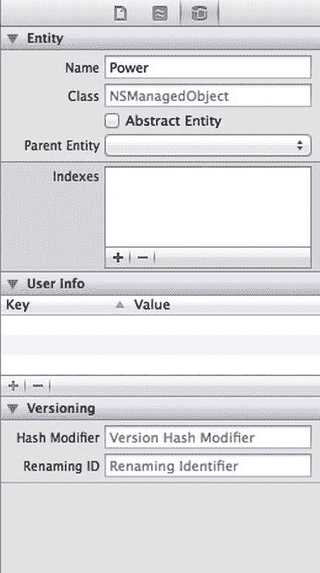

图 7-4. 将新实体重命名为`Power`，并将其他字段保留为默认值

回顾图 7-2，你可以看到`Power`对象有两个字段：一个用于能力的名称，另一个用于标识该特定能力的来源。为简单起见，这两个属性将只保存字符串值。

在属性面板中保持`Power`被选中状态，通过属性面板添加两个属性。将其中一个命名为`name`，取消选中“Optional”复选框，将其类型设置为`String`，并为其赋予默认值`New Power`。将第二个属性命名为`source`，并将其类型也设置为`String`。保持“Optional”复选框为选中状态，无需设置默认值。完成后，你将在模型编辑器的图表视图中看到两个圆角矩形（见图 7-5）。

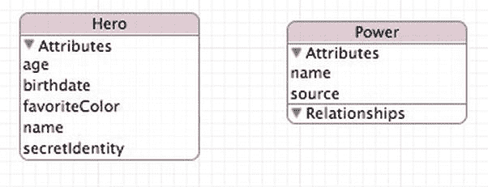

图 7-5. 现在你有两个实体，但它们之间没有任何关联

### 创建`powers`关系

现在`Power`实体处于选中状态。单击代表`Hero`实体的圆角矩形，或在实体面板中选择`Hero`以将其选中。接着，在属性面板中，单击并按住加号按钮，然后选择“Add Relationship”。在模型编辑器的详情面板中，将新关系的名称更改为`powers`，并将“Destination”设置为`Power`。“Destination”字段指定哪些实体的托管对象可以添加到此关系中，因此通过选择`Power`，你表明此关系存储的是能力。

你还无法指定反向关系，但你需要勾选“To-Many Relationship”复选框，以表示每个英雄可以拥有多个能力。同时，将删除规则更改为“Cascade”。在你的应用中，每个英雄将拥有自己的一套能力——英雄之间不共享能力。当英雄被删除时，你需要确保该英雄的能力也被删除，以免在持久化存储中留下孤立数据。完成后，详情面板应如图 7-6 所示，图表视图中`Hero`与`Power`实体之间将出现一条连线，代表这个新关系（见图 7-7）。

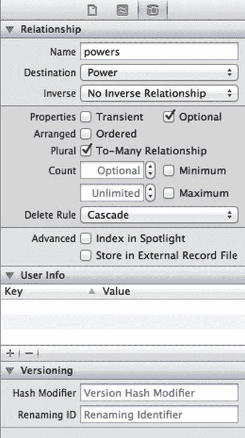

图 7-6. `powers`关系的详情面板视图

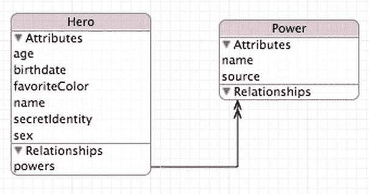

图 7-7. 关系在图表视图中由圆角矩形之间的连线表示。单箭头表示一对一关系，双箭头（如图所示）表示一对多关系

### 创建反向关系

在你的应用中实际上并不需要这个反向关系，但你会遵循苹果的建议，指定一个。由于反向关系将是一对一关系，它不会带来任何性能影响。再次选中`Power`实体，并使用属性面板为其添加一个关系。将此新关系命名为`hero`，并选择`Hero`作为目标实体。现在查看图表视图，你应该会看到两条线，代表你创建的两个不同关系。

接下来，单击“Inverse”弹出菜单并选择`powers`。这表示该关系是你之前创建的那个关系的反向关系。选中后，图表视图中的两条关系线将合并为一条两端带有箭头的单线（见图 7-8）。

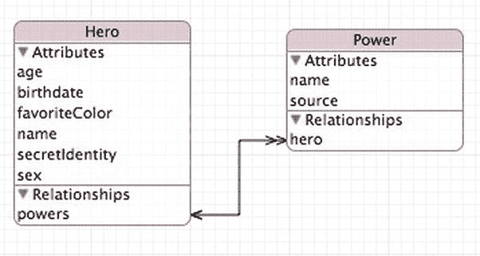

图 7-8. 反向关系由一条两端带有箭头的单线表示，而不是两条独立的线

### 创建`olderHeroes`获取属性

再次选中`Hero`实体，以便为其添加一些获取属性。在属性面板中，单击并按住加号按钮，然后选择“Add Fetched Property”。将此新获取属性命名为`olderHeroes`。注意，详情面板上只有一个其他字段可以设置：一个名为“Predicate”的白色大框（见图 7-9）。

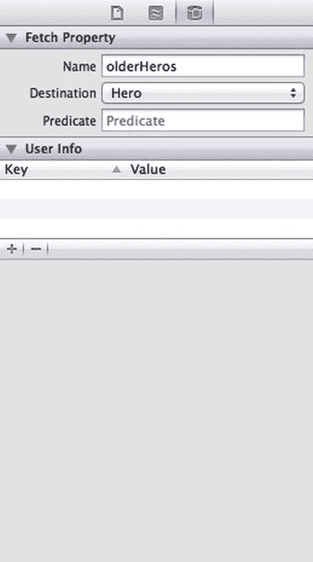

图 7-9. 显示获取属性的详情面板

**提示** 关系和获取属性都可以使用它们自身的实体作为目标实体。

### 什么是谓词？

谓词是一个返回布尔值的语句。你可以将它们视为`if`或`while`语句中的条件表达式。它们旨在针对一组对象（无论是 Cocoa 还是 Core Data）使用。谓词不依赖于被搜索的具体数据，而是提供了一种定义查询以过滤数据的抽象方式。最简单的形式是，谓词使用运算符比较两个值。例如，运算符`==`用于测试两个值是否相等。还有更复杂的运算符允许进行字符串比较（使用`LIKE`或`CONTAINS`）。谓词可以组合起来形成复合谓词。通常，谓词通过`AND`或`OR`运算符连接。

在获取属性的谓词中，可以使用两个特殊变量：`$FETCH_SOURCE`和`$FETCHED_PROPERTY`。`$FETCH_SOURCE`指向托管对象的特定实例。`$FETCHED_PROPERTY`是对正在获取的实体属性的描述。

你可以在苹果的谓词编程指南（https://developer.apple.com/library/ios/#documentation/Cocoa/Conceptual/Predicates/predicates.html）中阅读更详细的信息。

**提示** 关系和获取属性都可以使用它们自身的实体作为目标实体。

因此，你需要定义一个谓词，用于查找所有比详情视图中的`Hero`更年长（即出生日期更早）的英雄。你需要将你的`Hero`的出生日期与所有其他`Hero`实体进行比较。如果`$FETCH_SOURCE`是你的`Hero`实体，你的谓词将是：

```
$FETCH_SOURCE.birthdate > birthdate
```

在属性检查器的“Predicate”字段中输入此公式。记住，日期实际上只是一个整数；日期越晚，值越大。

### 创建`youngerHeroes`获取属性

添加另一个名为`youngerHeroes`的获取属性。目标实体仍为`Hero`，谓词应与上一个基本相同，只是将运算符`>`改为`<`。在属性检查器中为`youngerHeroes`的谓词输入以下内容：

```
$FETCH_SOURCE.birthdate < birthdate
```

需要注意的一点是，获取属性会检索所有匹配的对象，可能包括正在执行获取操作的对象本身。这意味着有可能创建一个结果集，当对 Super Cat 执行时，返回的结果包含 Super Cat。

`youngerHeroes`和`olderHeroes`这两个获取属性都会自动排除正在被评估的英雄。英雄不能比自己更年长或更年轻；他们的出生日期总是精确等于自己的出生日期，因此没有英雄会满足你刚刚创建的这两个条件。


现在我们来添加一个筛选条件稍复杂一些的获取属性。

#### 创建 `sameSexHeroes` 获取属性

接下来要创建的获取属性名为 `sameSexHeroes`，它会返回与当前英雄性别相同的所有英雄。不过，你无法简单地指定返回所有同性的英雄，因为你不希望当前英雄本身被包含在该获取属性中。超级猫与超级猫性别相同，但当用户查看与超级猫性别相同的英雄列表时，他们不会期望看到超级猫自己。

创建另一个获取属性，命名为 `sameSexHeroes`。打开模型编辑器。确保目标（Destination）设置为 `Hero`。在谓词（Predicate）字段中，输入：

```
($FETCH_SOURCE.sex == sex) AND ($FETCH_SOURCE != SELF)
```

这个复合谓词的左侧部分作用很明确。但右侧部分在做什么呢？请记住，获取属性的谓词会返回所有匹配的对象，包括拥有该获取属性的对象本身。在本例中，你请求了所有特定性别的英雄，而详情视图中的英雄自身也会符合这个条件。你需要排除这个特定的英雄。

你可以通过比较名称来排除与当前英雄同名的英雄。这种做法可能可行，但问题是两个英雄可能拥有相同的名字。也许使用名称并不是最佳方案。那么，有什么值能唯一标识单个英雄呢？实际上，并没有唯一的值。

幸运的是，谓词能识别一个名为 `SELF` 的特殊值，它会返回正在被比较的对象。`$FETCH_SOURCE` 变量代表发起获取请求的对象。因此，要排除发起获取请求的对象本身，你只需要要求它仅返回 `$FETCH_SOURCE != SELF` 的对象即可。

#### 创建 `oppositeSexHeroes` 获取属性

创建一个名为 `oppositeSexHeroes` 的新获取属性，并输入以下谓词：

```
$FETCH_SOURCE.sex != sex
```

在继续之前，请确保保存了你的数据模型。

#### 向 Hero 类添加关系和获取属性

由于你创建了 `NSManagedObject` 的自定义子类，你需要更新该类以包含新的关系和获取属性。如果你没有对 `Hero` 类做任何修改，你可以直接从数据模型重新生成类定义，新生成的版本将包含你刚刚添加到数据模型中的关系和获取属性的属性与方法。由于你已经添加了验证代码，你需要手动更新它。单击选中 `Hero.h` 并添加以下代码：

（在 `@interface` 之前）

```
@class Power;
```

（在其他属性之后）

```
@property (nonatomic, retain) NSSet *powers;

@property (nonatomic, readonly) NSArray *olderHeroes;
@property (nonatomic, readonly) NSArray *youngerHeroes;
@property (nonatomic, readonly) NSArray *sameSexHeroes;
@property (nonatomic, readonly) NSArray *oppositeSexHeroes;
```

（在 `@end` 之后）

```
@interface Hero (PowerAccessors)
- (void)addPowersObject:(Power *)value;
- (void)removePowersObject:(Power *)value;
- (void)addPowers:(NSSet *)value;
- (void)removePowers:(NSSet *)value;
@end
```

保存文件。切换到 `Hero.m` 并进行以下修改（位于其他 `@dynamic` 声明之后）：

```
@dynamic powers;
@dynamic olderHeroes, youngerHeroes, sameSexHeroes, oppositeSexHeroes;
```

#### 更新详情视图

参考图 7-1，你需要向详情视图添加两个新的表格视图分区：Powers（能力）和 Reports（报告）。不幸的是，这并不像第 6 章中向 General 分区添加新单元格那样简单。事实证明，你不能使用故事板编辑器来为你设置这些内容。原因是 Powers 分区是动态数据驱动的。在你有一个可检查的 `Hero` 实体之前，你无法知道 Powers 分区有多少行。所有其他分区都有固定数量的行。

你首先要将 `HeroDetailController` 转换为其当前配置更数据驱动的方式。打开 `SuperDB.storyboard` 并找到 `HeroDetailController`。选中该表格视图并打开属性检查器。将表格视图的“内容（Content）”字段从“静态单元格（Static Cells）”更改为“动态原型（Dynamic Prototypes）”。详情视图应变为一个带有“原型单元格（Prototype Cells）”分区标题的单一表格视图单元格（图 7-10）。

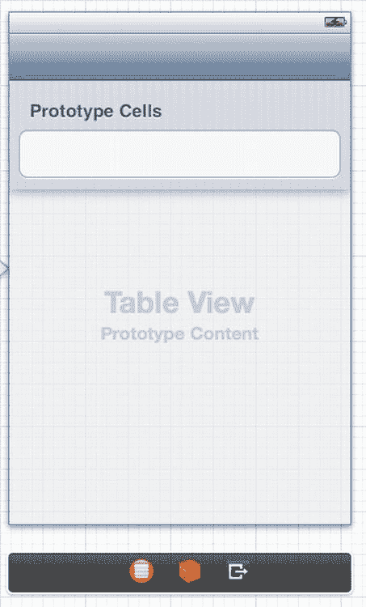

图 7-10  将表格视图内容更改为动态原型

选中剩余的那个表格视图单元格，并将“实用工具（Utility）”面板切换到属性检查器。在“标识符（Identifier）”字段中，删除内容使其为空。

现在打开 `HeroDetailController.m`。找到 `numberOfSectionsInTableView:` 和 `tableView:numberOfRowsInSection:` 方法。你无法使用跳转栏找到它们，因为你已经将它们注释掉了，但如果你查找标签“Table view data source”，它应该能带你到附近的位置。取消这些方法的注释，并将它们的主体修改为：

```
- (NSInteger)numberOfSectionsInTableView:(UITableView *)tableView
{
    return self.sections.count;
}

- (NSInteger)tableView:(UITableView *)tableView numberOfRowsInSection:(NSInteger)section
{
    NSDictionary *sectionDict = [self.sections objectAtIndex:section];
    NSArray *rows = [sectionDict objectForKey:@"rows"];
    return rows.count;
}
```

你只是使用配置信息来确定你的表格视图有多少个分区以及每个分区有多少行。

现在，你的配置信息不包含“页眉（Header）”值。如果你现在运行应用，详情视图将看起来像图 7-11。

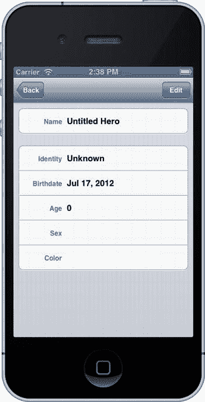

图 7-11  没有通用分区标题的详情视图

将页眉信息添加到你的配置 plist 文件中。编辑 `HeroDetailController.plist` 并导航到 Root  Section  Item 1。打开 Item 1，选中 Item 1 行，并添加一个新项目。为该项目的键设置为 `header`，值设置为 `General`。保持类型为 String（字符串）（图 7-12）。

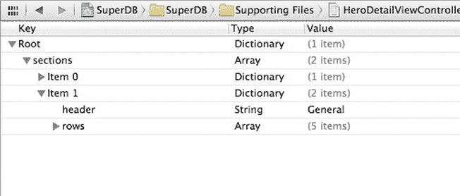

图 7-12  向属性列表添加通用分区标题

现在回到 `HeroDetailController.m`。并添加以下方法（我们将其放在 `tableView:numberOfRowsInSection:` 之后）：

```
- (NSString *)tableView:(UITableView *)tableView titleForHeaderInSection:(NSInteger)section
{
    NSDictionary *sectionDict = [self.sections objectAtIndex:section];
    return [sectionDict objectForKey:@"header"];
}
```

“General”标签应该会显示出来。由于你没有在第一个分区中放置页眉项目，`objectForKey:` 将返回 `nil`，表格视图会将其解释为没有页眉标签。

现在你已经准备好添加新的 Powers 和 Reports 分区了。

回到 `HeroDetailController.plist` 属性列表并选中 Sections 项目。打开 Sections 项目，然后确保 Item 0 和 Item 1 都已折叠。将指针悬停在 Item 1 上，直到 Item 1 旁边出现 (+) 和 (−) 按钮。单击 (+) 按钮。应该会出现一个新的 Item 2。将 Item 2 的类型设置为 Dictionary（字典）并打开它。向 Item 2 添加一个项目。将其命名为 `header`，值为 `Powers`。

#### 重新思考配置

在继续之前，后退一步，思考一下你的详情配置属性列表。你刚刚添加了一个新的分区来表示 Powers 分区。你添加了一个页眉项目来包含分区标题字符串。现在你需要添加 rows 项目，对吗？

很可能不是。


请记住，`rows` 项是一个数组，它告诉您如何配置分区中的每个单元格，以及要使用什么`label`、`cell class`和`property key`。单元格的数量由数组项的数量决定。`Powers`分区的情况几乎相反。您不知道需要多少行；这些行来自`Hero`实体的`Powers`关系。而每个单元格的配置应该是相同的。

有几种方法可以解决这个问题。我们来讨论两种思路。

对于`Powers`分区，您将把`rows`项设为一个字典。该字典将包含三个`String`项。键将是`key`、`class`和`label`。这些键与当`rows`是`Array`时您为每个项使用的键相同。您可以推断出，当`rows`项是字典时，该分区是数据驱动的；但当`rows`项是`Array`时，该分区是配置驱动的。

这是另一种方法。对于每个分区，除了`header`项之外，您再定义一个名为`dynamic`的项，其类型为`Boolean`。如果为`YES`，则分区是数据驱动的；如果为`NO`，则分区是配置驱动的。在所有情况下，`rows`都将是一个数组，但对于动态分区，它只包含一个条目。如果没有`dynamic`项，则等同于将`dynamic`设置为`NO`。

两种方法都可行。可能还有很多其他想法可以讨论，但这并非我们此处的重点。无论采用哪种方法，都需要添加大量代码来处理此逻辑——到目前为止，您将这些代码都放在了`HeroDetailController`类中。将这个解析逻辑放在`HeroDetailController`内部可能合适，但随着它变得更加复杂，只会让您的代码变得混乱。您将对应用进行重构，将属性列表处理代码从`HeroDetailController`中提取出来，放到一个新的类`HeroDetailConfiguration`中。然后，您将选择采用哪种方法来处理数据驱动的`Powers`分区。

创建一个新的 Objective-C 类。令其作为`NSObject`的子类，并将其命名为`HeroDetailConfiguration`。

查看`HeroDetailController`，您会发现已将`sections`数组放在一个私有类别中。对于`HeroDetailConfiguration`，您也将采用同样的做法。打开`HeroDetailConfiguration.m`并在`@implementation`上方添加以下内容：

```
@interface HeroDetailConfiguration ()
@property (strong, nonatomic) NSArray *sections;
@end
```

接下来，您需要创建初始化方法。您希望它能够打开属性列表并将其内容解析到`sections`数组中。

```
- (id)init
{
    self = [super init];
    if (self) {
        // 初始化代码
        NSURL *plistURL = [[NSBundle mainBundle] URLForResource:@"HeroDetailConfiguration"
                                                  withExtension:@"plist"];
        NSDictionary *plist = [NSDictionary dictionaryWithContentsOfURL:plistURL];
        self.sections = [plist valueForKey:@"sections"];
    }
    return self;
}
```

现在，让我们回到`HeroDetailController.m`，看看在哪里使用`sections`数组。以下方法访问了`HeroDetailController`的`sections`数组：

```
numberOfSectionsInTableView:
tableView:numberOfRowsInSection:
tableView:titleForHeaderInSection:
tableView:cellForRowAtIndexPath:
```

您可以利用这些方法来设计`HeroDetailConfiguration`的方法。直接来看，您可以看到所需的三个方法：

```
numberOfSections
numberOfRowsInSection:
headerInSection:
```

在`HeroDetailConfiguration.h`中定义这些方法。

```
- (NSInteger)numberOfSections;
- (NSInteger)numberOfRowsInSection:(NSInteger)section;
- (NSString *)headerInSection:(NSInteger)section;
```

现在，让我们在`HeroDetailConfiguration.m`中实现它们。这应该非常直接。

```
- (NSInteger)numberOfSections
{
    return self.sections.count;
}

- (NSInteger)numberOfRowsInSection:(NSInteger)section
{
    NSDictionary *sectionDict = [self.sections objectAtIndex:section];
    NSArray *rows = [sectionDict objectForKey:@"rows"];
    return rows.count;
}
```


```objectivec
- (NSString *)headerInSection:(NSInteger)section
{
    NSDictionary *sectionDict = [self.sections objectAtIndex:section];
    return [sectionDict objectForKey:@"header"];
}
```

这些实现应该与你之前在`HeroDetailController`中实现的几乎相同。

现在你需要看看你在`HeroDetailController tableView:cellForRowAtIndexPath:`中做了什么。所需的核心部分位于该方法开头。

```objectivec
    NSUInteger sectionIndex = [indexPath section];
    NSUInteger rowIndex = [indexPath row];
    NSDictionary *section = [self.sections objectAtIndex:sectionIndex];
    NSArray *rows = [section objectForKey:@"rows"];
    NSDictionary *row = [rows objectAtIndex:rowIndex];
```

本质上，你获取了特定索引路径对应的行字典。这正是你希望`HeroDetailConfiguration`对象为你做的事情：根据索引路径返回一个行字典。因此，你想要的方法应该像这样：

```objectivec
- (NSDictionary *)rowForIndexPath:(NSIndexPath *)indexPath;
```

让我们将其添加到`HeroDetailConfiguration.h`中，并在`HeroDetailConfiguration.m`中为方法体添加存根。

在你担心处理实现 Powers 部分的问题之前，只需复制你已经实现的功能即可。在这种情况下，你只需将`HeroDetailController tableView:cellForRowAtIndexPath:`开头的五行代码添加到新方法中即可。

```objectivec
- (NSDictionary *)rowForIndexPath:(NSIndexPath *)indexPath
{
    NSUInteger sectionIndex = [indexPath section];
    NSUInteger rowIndex = [indexPath row];
    NSDictionary *section = [self.sections objectAtIndex:sectionIndex];
    NSArray *rows = [section objectForKey:@"rows"];
    NSDictionary *row = [rows objectAtIndex:rowIndex];
    return row;
}
```

现在让我们编辑`HeroDetailController.m`，以使用你新的`HeroDetailConfiguration`类。首先，在顶部（紧挨着`SuperDBEditCell #import`下方）添加`#import`声明。

```objectivec
#import "HeroDetailConfiguration.h"
```

将`sections`属性声明替换为`HeroDetailConfiguration`的属性。

```objectivec
@property (strong, nonatomic) NSArray *sections;
@property (strong, nonatomic) HeroDetailConfiguration *config;
```

将`viewDidLoad`中的`sections`初始化代码替换为`config`的初始化。

```objectivec
    NSURL *plistURL = [[NSBundle mainBundle] URLForResource:@"HeroDetailController" withExtension:@"plist"];
    NSDictionary *plist = [NSDictionary dictionaryWithContentsOfURL:plistURL];
    self.sections = [plist valueForKey:@"sections"];
    self.config = [[HeroDetailConfiguration alloc] init];
```

替换`numberOfSectionsInTableView:`中的代码。

```objectivec
- (NSInteger)numberOfSectionsInTableView:(UITableView *)tableView
{
    return self.sections.count;
    return [self.config numberOfSections];
}
```

替换`tableView:numberOfRowsInSection:`中的代码。

```objectivec
- (NSInteger)tableView:(UITableView *)tableView numberOfRowsInSection:(NSInteger)section
{
    NSDictionary *sectionDict = [self.sections objectAtIndex:section];
    NSArray *rows = [sectionDict objectForKey:@"rows"];
    return row.count;
    return [self.config numberOfRowsInSection:section];
}
```

替换`tableView:titleForHeaderInSection:`中的代码。

```objectivec
- (NSString *)tableView:(UITableView *)tableView titleForHeaderInSection:(NSInteger)section
{
    NSDictionary *sectionDict = [self.sections objectAtIndex:section];
    return [sectionDict objectForKey:@"header"];
    return [self.config headerInSection:section];
}
```

最后，替换`tableView:cellForRowAtIndexPath:`中的代码。

```objectivec
    NSUInteger sectionIndex = [indexPath section];
    NSUInteger rowIndex = [indexPath row];
    NSDictionary *section = [self.sections objectAtIndex:sectionIndex];
    NSArray *rows = [section objectForKey:@"rows"];
    NSDictionary *row = [rows objectAtIndex:rowIndex];
    NSDictionary *row = [self.config rowForIndexPath:indexPath];
```

此时，你的应用应该表现得和开始重构之前一模一样。

### 封装与信息隐藏

在你继续处理 Power 部分之前（马上就会处理，放心！），让我们再看一眼`HeroDetailController tableView:cellForRowAtIndexPath:`。你的`HeroDetailConfiguration`返回了一个行字典。而你在方法的后续部分中使用了这些信息。

```objectivec
    NSDictionary *row = [self.config rowForIndexPath:indexPath];
    NSString *cellClassname = [row objectForKey:@"class"];
        ...
    NSArray *values = [row valueForKey:@"values"];
        ...
    cell.key = [row objectForKey:@"key"];
    cell.value = [self.hero valueForKey:[row objectForKey:@"key"]];
    cell.label.text = [row objectForKey:@"label"];
```

虽然保持现状可能没问题，但你或许更希望用`HeroDetailConfiguration`中的方法来替换这些调用。为什么要这样做？简而言之，是因为两个概念：封装和信息隐藏。信息隐藏是指隐藏实现细节的指导思想。想象一下，如果你改变了配置信息的存储方式，那么你就必须修改填充表格视图单元格的方式。通过将特定的访问调用放在`HeroDetailConfiguration`内部，你就不必担心配置存储机制是否会改变。你可以自由地更改内部实现，而无需担心表格视图单元格的代码。封装是指将所有配置访问代码集中到一个单独的对象`HeroDetailConfiguration`中，而不是将这些访问代码散布在视图控制器中各处。

回顾一下对行字典的`objectForKey:`调用，你可能需要这样的一些方法：

```objectivec
- (NSString *)cellClassnameForIndexPath:(NSIndexPath *)indexPath;
- (NSArray *)valuesForIndexPath:(NSIndexPath *)indexPath;
- (NSString *)attributeKeyForIndexPath:(NSIndexPath *)indexPath;
- (NSString *)labelForIndexPath:(NSIndexPath *)indexPath;
```

将它们添加到`HeroDetailConfiguration.h`中，然后在`HeroDetailConfiguration.m`中添加它们的实现。

```objectivec
- (NSString *)cellClassnameForIndexPath:(NSIndexPath *)indexPath
{
    NSDictionary *row = [self rowForIndexPath:indexPath];
    return [row objectForKey:@"class"];
}

- (NSArray *)valuesForIndexPath:(NSIndexPath *)indexPath
{
    NSDictionary *row = [self rowForIndexPath:indexPath];
    return [row objectForKey:@"values"];
}

- (NSString *)attributeKeyForIndexPath:(NSIndexPath *)indexPath
{
    NSDictionary *row = [self rowForIndexPath:indexPath];
    return [row objectForKey:@"key"];
}

- (NSString *)labelForIndexPath:(NSIndexPath *)indexPath
{
    NSDictionary *row = [self rowForIndexPath:indexPath];
    return [row objectForKey:@"label"];
}
```

最后，用这些新方法替换`HeroDetailController tableView:cellForRowAtIndexPath:`中的代码。

```objectivec
    NSDictionary *row = [self.config rowForIndexPath:indexPath];
    NSString *cellClassname = [row objectForKey:@"class"];
    NSString *cellClassname = [self.config cellClassnameForIndexPath:indexPath];
        ...
    NSArray *values = [row valueForKey:@"values"];
    NSArray *values = [self.config valuesForIndexPath:indexPath];
        ...
    cell.key = [row objectForKey:@"key"];
    cell.value = [self.hero valueForKey:[row objectForKey:@"key"]];
    cell.label.text = [row objectForKey:@"label"];
    cell.key = [self.config attributeKeyForIndexPath:indexPath];
    cell.value = [self.hero valueForKey:[self.config attributeKeyForIndexPath:indexPath]];
    cell.label.text = [self.config labelForIndexPath:indexPath];
```

如果你愿意，可以继续重构代码，但在此处告一段落，继续前进是合适的。

### 数据驱动配置


好的，作为高级文档工程师，我已根据您的要求和注意事项，对给定的文本进行了格式优化。

好的，现在你已经准备好解决这次重构的核心问题了。是时候设置属性列表来处理数据驱动的“能力（Powers）”部分了。我们之前详述了两种可能的方法。你将采用为部分添加动态布尔值（`Boolean`）项，并将行项目保持为数组（`Array`）的方法。对于 `dynamic` 值为 `YES` 的项目，其行项目数组将只包含一个元素。如果有更多元素，你将忽略它们。

打开 `HeroDetailConfiguration.plist`，依次展开到 Root  sections  Item 2。如果展开三角形是折叠的，请将其展开。选择名为 `header` 的项目，并在其后面添加两个项。将第一项命名为 `dynamic`，将其类型设置为布尔值（`Boolean`），并将其值设为 `YES`。将第二项命名为 `rows`，并将其类型设置为数组（`Array`）。在 `rows` 数组（`Array`）中添加一个字典（`Dictionary`），并为该字典添加三个项。将这三个字典（`Dictionary`）项分别命名为 `key`、`class` 和 `label`。将所有三个项的类型都保留为字符串（`String`）。将 `key` 的值设为 `powers`；`class` 的值设为 `SuperDBCell`。`label` 的值保持为空。

你的属性列表编辑器看起来应该类似于 图 7-13。

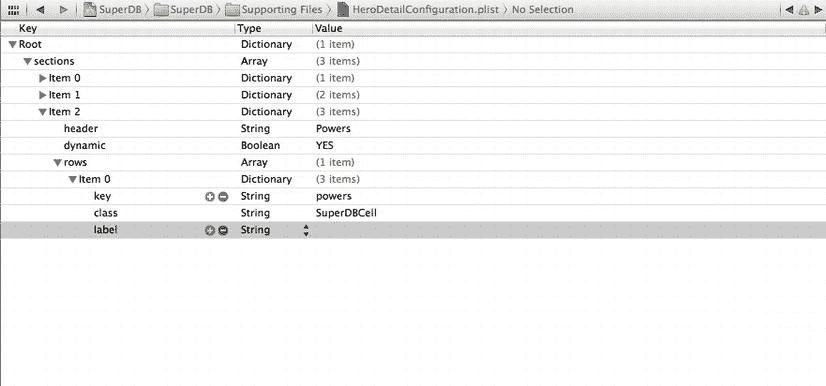

图 7-13.  能力（Power）部分的属性列表配置

现在你需要让 `HeroDetailConfiguration` 来使用这个新的 `dynamic` 项。

首先，你需要定义一个方法来检查当前查看的部分是否为动态部分。让我们将该方法的声明添加到 `HeroDetailConfiguration.h` 中。

```
- (BOOL)isDynamicSection:(NSInteger)section;
```

让我们将实现添加到 `HeroDetailConfiguration.m` 中。

```
- (BOOL)isDynamicSection:(NSInteger)section
{
    BOOL dynamic = NO;

    NSDictionary *sectionDict = [self.sections objectAtIndex:section];
    NSNumber *dynamicNumber = [sectionDict objectForKey:@"dynamic"];
    if (dynamicNumber != nil)
        dynamic = [dynamicNumber boolValue];

    return dynamic;
}
```

默认情况下，如果配置属性列表部分中没有 `dynamic` 条目，你将假定该部分不是动态的。

现在，你需要更新 `rowForIndexPath:` 方法以处理动态部分。你只需要更改一行。

```
    NSUInteger rowIndex = [indexPath row];
    NSUInteger rowIndex = ([self isDynamicSection:sectionIndex]) ? 0 : [indexPath row];
```

在此处，将以下方法声明添加到 `HeroDetailConfiguration.h` 中：

```
- (NSString *)dynamicAttributeKeyForSection:(NSInteger)section;
```

（这里你有点取巧，因为你知道这个方法稍后会让你的工作更轻松。）在 `HeroDetailConfiguration.m` 中的实现如下所示：

```
- (NSString *)dynamicAttributeKeyForSection:(NSInteger)section
{
    if (![self isDynamicSection:section])
        return nil;

    NSIndexPath *indexPath = [NSIndexPath indexPathForRow:0 inSection:section];
    return [self attributeKeyForIndexPath:indexPath];
}
```

如果部分不是动态的，你将返回 `nil`。否则，你将创建一个索引路径并使用现有的功能。

#### 添加能力（Powers）

现在你可以继续更新 `HeroDetailController` 以使用这个新的配置设置了。在 `HeroDetailController.m` 中，像这样编辑 `tableView:numberOfRowsInSection:`：

```
- (NSInteger)tableView:(UITableView *)tableView numberOfRowsInSection:(NSInteger)section
{
    NSInteger rowCount = [self.config numberOfRowsInSection:section];
    if ([self.config isDynamicSection:section]) {
        NSString *key = [self.config dynamicAttributeKeyForSection:section];
        NSSet *attributeSet = [self.hero mutableSetValueForKey:key];
        rowCount = attributeSet.count;
    }

    return rowCount;
}
```

你询问 `HeroDetailConfiguration` 以获取该部分的行数。如果部分是动态的，你将读取行配置以确定从你的 `Hero` 实体中使用哪个属性。该属性将是一个集合（`Set`），因此你需要将其转换为数组（`Array`）来获取其大小。

嗯，你的 `Hero` 实体中仍然没有任何能力（powers）。因此，你需要一种方法来向你的 `Hero` 添加新能力。显然，你应该在编辑 `Hero` 的详细信息时执行此操作。如果你运行应用，导航到详情视图并点击编辑（Edit）按钮，能力（Powers）部分仍然是空白的。回到通讯录（Address Book）应用：当你需要一个新地址时，会出现一个带有绿色 (+) 按钮的单元格来添加新地址（图 7-14）。你需要模拟这种行为。

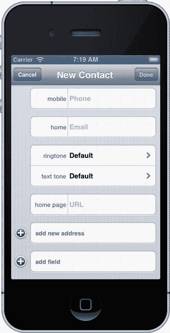

图 7-14.  在通讯录（Address Book）应用中添加新地址

打开 `HeroDetailController.m` 并找到你刚刚修改的 `tableView:numberOfRowsInSection:` 方法。将这行

```
rowCount = attributeSet.count;
```

改为

```
rowCount = (self.editing) ? attributeSet.count+1 : attributeSet.count;
```

然而，这还不够。你需要让表视图在进入编辑模式时刷新。在 `setEditing:animated:` 中，添加这行

```
 [self.tableView reloadData];
```

在调用 `super` 之后。

如果你现在运行应用并编辑你的 `Hero` 的详细信息（图 7-15），会出现两个问题。首先，能力（Powers）部分的新单元格有一个奇怪的值。其次，如果你在进入和退出编辑模式时仔细观察，过渡似乎不再平滑。单元格似乎在跳跃。一切都能工作，但这并不是一个好的用户体验。

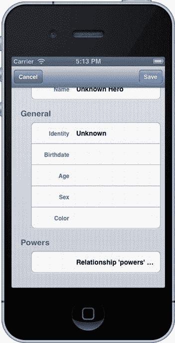

图 7-15.  添加新能力的第一步

让我们看看 `HeroListController` 中的获取结果控制器（fetched results controller）的委托方法。当更新开始时，你在表视图上调用 `beginUpdates` 方法。然后，你使用 `insertRowsAtIndexPath:withRowAnimation:` 和 `deleteRowsAtIndexPath:withRowAnimation:` 插入或删除行。最后，当更新完成时，你在表视图上调用 `endUpdates`。在进入和离开编辑模式时，你需要对能力（Powers）部分执行类似的操作。

在 `HeroDetailController.m` 顶部的私有类别中，添加新的方法声明

```
- (void)updateDynamicSections:(BOOL)editing;
```

并从 `setEditing:animated:` 中调用它。

```
- (void)setEditing:(BOOL)editing animated:(BOOL)animated
{
    [self.tableView beginUpdates];
    [self updateDynamicSections:editing];
    [super setEditing:editing animated:animated];
    [self.tableView endUpdates];

    self.navigationItem.rightBarButtonItem = (editing) ? self.saveButton : self.editButtonItem;
    self.navigationItem.leftBarButtonItem = (editing) ? self.cancelButton : self.backButton;
}
```

这是实现代码：

```
- (void)updateDynamicSections:(BOOL)editing
{
    for (NSInteger section = 0; section < [self.config numberOfSections]; section++) {
        if ([self.config isDynamicSection:section]) {
            NSIndexPath *indexPath;
            NSInteger row = [self tableView:self.tableView numberOfRowsInSection:section];
            if (editing) {
                indexPath = [NSIndexPath indexPathForRow:row inSection:section];
                [self.tableView insertRowsAtIndexPaths:@[indexPath]
                                       withRowAnimation:UITableViewRowAnimationAutomatic];
            }
            else {
                indexPath = [NSIndexPath indexPathForRow:row-1 inSection:section];
                [self.tableView deleteRowsAtIndexPaths:@[indexPath]
                                       withRowAnimation:UITableViewRowAnimationAutomatic];
            }
        }
    }
}
```

现在，在进入和退出编辑模式时为能力（Powers）部分添加和移除单元格的操作看起来平滑多了。

早在第 4 章中，当你第一次编写 `HeroDetailController` 时，你实现了表视图的委托方法 `tableView:editingStyleForRowAtIndexPath:`。


```
- (UITableViewCellEditingStyle)tableView:(UITableView *)tableView
editingStyleForRowAtIndexPath:(NSIndexPath *)indexPath
{
    return UITableViewCellEditingStyleNone;
}
```

如果你还记得，这会在详情视图进入编辑模式时，关闭表格视图单元格旁删除按钮的显示。现在，你需要让它在“能力”分区单元格旁显示适当的按钮。

```
- (UITableViewCellEditingStyle)tableView:(UITableView *)tableView
editingStyleForRowAtIndexPath:(NSIndexPath *)indexPath
{
    UITableViewCellEditingStyle editStyle = UITableViewCellEditingStyleNone;
    NSInteger section = [indexPath section];
    if ([self.config isDynamicSection:section]) {
        NSInteger rowCount = [self tableView:self.tableView numberOfRowsInSection:section];
        if ([indexPath row] == rowCount-1)
            editStyle = UITableViewCellEditingStyleInsert;
        else
            editStyle = UITableViewCellEditingStyleDelete;
    }
    return editStyle;
}
```

要让插入按钮正常工作，你需要实现表格视图数据源方法 `tableView:commitEditingStyle:forRowAtIndexPath:`。这个方法已存在于 `HeroDetailController.m` 中，但被注释掉了。你可以在跳转栏的表格视图数据源部分找到它。取消注释并进行修改，使其如下所示：

```
- (void)tableView:(UITableView *)tableView
commitEditingStyle:(UITableViewCellEditingStyle)editingStyle
forRowAtIndexPath:(NSIndexPath *)indexPath
{
    NSString *key = [self.config attributeKeyForIndexPath:indexPath];
    NSMutableSet *relationshipSet = [self.hero mutableSetValueForKey:key];
    NSManagedObjectContext *managedObjectContext = [self.hero managedObjectContext];

    if (editingStyle == UITableViewCellEditingStyleDelete) {
        // 从数据源中删除该行
        NSManagedObject *relationshipObject =
            [[relationshipSet allObjects] objectAtIndex:[indexPath row]];
        [relationshipSet removeObject:relationshipObject];
    }
    else if (editingStyle == UITableViewCellEditingStyleInsert) {
        NSEntityDescription *entity = [self.hero entity];
        NSDictionary *relationships = [entity relationshipsByName];
        NSRelationshipDescription *destRelationship = [relationships objectForKey:key];
        NSEntityDescription *destEntity = [destRelationship destinationEntity];

        NSManagedObject *relationshipObject =
            [NSEntityDescription insertNewObjectForEntityForName:[destEntity name]
                                          inManagedObjectContext:managedObjectContext];
        [relationshipSet addObject:relationshipObject];
    }

    NSError *error = nil;
    if (![managedObjectContext save:&error]) {
        // 需要将 HeroDetailController 设置为 UIAlertViewDelegate
        UIAlertView *alert =
            [[UIAlertView alloc] initWithTitle:NSLocalizedString(@"Error saving entity",
                                                                 @"Error saving entity")
                                      message:[NSString stringWithFormat:NSLocalizedString(@"Error was: %@, quitting.",
                                                                                           @"Error was: %@, quitting."),
                                               [error localizedDescription]]
                                     delegate:self
                            cancelButtonTitle:NSLocalizedString(@"Aw, Nuts", @"Aw, Nuts")
                            otherButtonTitles:nil];
        [alert show];
    }

    if (editingStyle == UITableViewCellEditingStyleDelete) {
        // 从数据源中删除该行
        [tableView deleteRowsAtIndexPaths:@[indexPath]
                         withRowAnimation:UITableViewRowAnimationFade];
    }
    else if (editingStyle == UITableViewCellEditingStyleInsert) {
        // 创建适当类的新实例，将其插入数组，
        // 并向表格视图添加新行
        [tableView insertRowsAtIndexPaths:@[indexPath]
                         withRowAnimation:UITableViewRowAnimationAutomatic];
    }
}
```

每次你得到一个新的“能力”单元格时，它都会显示一些奇怪的字符串，比如 `Relationship 'powers'`……这是因为它在 `Hero` 实体上调用了 `valueForKey:`，键值为 `powers`。你需要更新 `tableView:cellForRowAtIndexPath:` 方法以处理动态分区。将

```
        cell.value = [self.hero valueForKey:[self.config attributeKeyForIndexPath:indexPath]];
```

替换为

```
    if ([self.config isDynamicSection:[indexPath section]]) {
        NSString *key = [self.config attributeKeyForIndexPath:indexPath];
        NSMutableSet *relationshipSet = [self.hero mutableSetValueForKey:key];
        NSArray *relationshipArray = [relationshipSet allObjects];
        if ([indexPath row] != [relationshipArray count]) {
            NSManagedObject *relationshipObject = [relationshipArray objectAtIndex:[indexPath row]];
            cell.value = [relationshipObject valueForKey:@"name"];
            cell.accessoryType = UITableViewCellAccessoryDetailDisclosureButton;
            cell.editingAccessoryType = UITableViewCellAccessoryDetailDisclosureButton;
        }
        else {
            cell.label.text = nil;
            cell.textField.text = @"添加新能力...";
        }
    }
    else {
        cell.value = [self.hero valueForKey:[self.config attributeKeyForIndexPath:indexPath]];
    }
```

注意，对于动态单元格，你设置了 `accessoryType` 和 `editingAccessoryType`。这是单元格右侧边缘的蓝色箭头按钮。同时，你处理了在编辑模式下添加额外单元格的情况。

现在你需要添加一个能力视图，以便编辑英雄新能力的名称和来源。

#### 重构详情视图控制器

你有了一个需要显示和编辑的新托管对象。你可以创建一个新的表格视图控制器类，专门用于显示 `Power` 实体。这将是一个非常简单的类，你可以很快实现它。在开发过程中，有时你可能会这样做。这不一定是最优雅的解决方案，但可能是最快的方法。有时候你只需要让功能跑起来。

但既然这是一本书，而你正在学习这个示例，将 `HeroDetailController` 重构为一个更通用的 `ManagedObjectController` 是合理的。之后，你可以使用这个重构后的控制器为 `Hero` 实体的获取属性实现视图。当你将视图控制器配置移到属性列表时，就已经为这项工作了奠定了基础。自那以后，你一直尝试在 `HeroDetailController` 中实现通用解决方案。希望这些努力没有白费。

首先，你要将 `HeroDetailConfiguration` 类重命名为 `ManagedObjectConfiguration`。你不会更改属性列表的名称，因为它仍然是专门用于显示 `Hero` 实体的。接下来，你将创建 `ManagedObjectController` 类。你将把 `HeroDetailController` 中的大部分逻辑移到 `ManagedObjectController` 中。`HeroDetailController` 将只是一个非常薄的子类，它知道要加载哪个配置属性列表的名称。

让我们开始吧。

##### 重命名配置类


好的，作为一名高级文档工程师和翻译员，我将严格遵循您的注意事项和示例格式，将给定的英文文本翻译成中文。


##### HeroDetailConfiguration 类名

`HeroDetailConfiguration` 这个类名之所以有效，是因为它被 `HeroDetailController` 所使用。既然你要重命名 Controller 类，那么也应该重命名配置类。打开 `HeroDetailConfiguration.h`，在编辑器中高亮类名。选择 **Edit**  **Refactor**  **Rename** 菜单，将类重命名为 `ManagedObjectConfiguration`（图 7-16）。点击 **Preview** 并查看 Xcode 所做的更改。它应该会更改接口和实现文件，以及 `HeroDetailController` 中的引用。准备好后，点击 **Save**。


图 7-16.  Rename 重构面板

有一处代码更改需要你进行。在 `ManagedObjectConfiguration` 的 `init` 方法中，配置属性列表是这样加载的：

```
NSURL *plistURL = [[NSBundle mainBundle] URLForResource:@"ManagedObjectConfiguration"
                                           withExtension:@"plist"];
```

记住，你要保持当前的配置属性列表名称为 `HeroDetailController.plist`。如果你硬编码了这个名称，那就没有真正完成任何有用的操作。你需要将初始化方法从一个简单的 `init` 方法更改为类似如下的形式：

```
- (id)initWithResource:(NSString *)resource;
```

将该声明添加到 `ManagedObjectController.h` 文件的 `@interface` 内部。然后你可以将 `init` 方法更改为：

```
- (id)init
- (id)initWithResource:(NSString *)resource
{
    self = [super init];
    if (self) {
        // Initialization Code
        NSURL *plistURL = [[NSBundle mainBundle] URLForResource:@"ManagedObjectConfiguration"
                                                   withExtension:@"plist"];
        NSURL *plistURL = [[NSBundle mainBundle] URLForResource:resource withExtension:@"plist"];
        NSDictionary *plist = [NSDictionary dictionaryWithContentsOfURL:plistURL];
        self.sections = [plist valueForKey:@"sections"];
    }
    return self;
}
```

现在，你需要修改 `HeroDetailController` 的 `viewDidLoad` 方法中的这行代码：

```
self.config = [[ManagedObjectConfiguration alloc] init];
```

改为：

```
self.config = [[ManagedObjectConfiguration alloc] initWithResource:@"HeroDetailConfiguration"];
```

**注意**  如果你只是要重构 `HeroDetailController`，为什么还要做这个改动呢？嗯，重构的一个关键点是进行小的改动并检查一切是否仍然正常。你不会想做出大量改动后才发现问题。成功重构的另一个关键点是编写单元测试。这样你就拥有了一套可重复执行的测试，以确保你没有做出预期之外的剧烈更改。你将在第 15 章中学习单元测试。

至此，你的应用应该仍然可以工作，因为你只做了一个非常小的改动。更大的改动即将到来。

#### 重构详情控制器

你可以创建一个名为 `ManagedObjectContro ller` 的新类，并将 `HeroDetailController` 的大部分代码移动到新类中。但这增加了复杂性（移动代码），可能导致错误。更简单的做法是重命名 `HeroDetailController`，清理代码使其更具通用性，然后再实现一个新的 `HeroDetailController` 类。

打开 `HeroDetailController.h`，使用 **Edit**  **Refactor**  **Rename** 将类重命名为 `ManagedObjectController`。查看 Xcode 建议的更改。你会注意到 Xcode 正在修改 `SuperDB.storyboard`，它本质上是一个 XML 文件。你只需要相信 Xcode 知道自己在做什么。点击 **Save**。你可能想要构建并运行应用，以确保它仍然可以工作。

#### 重构 Hero 实例变量

在你的 `ManagedObjectEditor` 类中，有一个名为 `hero` 的实例变量。这个变量名不再能代表它实际存放的内容，因此我们也来重构它。打开 `ManagedObjectEditor.h`，将 `hero` 属性重命名为 `managedObject`。现在你必须在应用的其余部分进行更改。

**注意**  为什么不用 Xcode 的重构选项呢？你本来可以用的，但它在重命名实例变量方面表现不佳。当我们尝试时，它想要同时更改数据模型和 storyboard。那是不对的。我们本可以在文件预览窗格中取消选中这些更改，然后保存。但是 Xcode 没有重命名其他出现的位置，所以无论如何你都得手动完成。

打开 `ManagedObjectEditor.m`，找到所有出现：

```
self.hero
```

并将它们更改为：

```
self.managedObject
```

最后，编辑 `HeroListContoller.m`，将 `prepareForSegue:sender` 中的这行代码：

```
detailController.hero = sender;
```

改为：

```
detailController.managedObject = sender;
```

保存你的工作，并检查应用。

#### 多一点抽象

在处理 `ManagedObjectController` 的同时，借此机会添加一些离散的功能。具体来说，当添加或移除能力时，你将相关代码放在了 `tableView:commitEditingStyle:forRowAtIndexPath:` 方法中。让我们将这些代码拆分为专门用于添加和删除关系对象的方法。将以下方法声明添加到 `ManagedObjectController.h` 中：

```
- (NSManagedObject *)addRelationshipObjectForSection:(NSInteger)section;
- (void)removeRelationshipObjectInIndexPath:(NSIndexPath *)indexPath;
```

在实现这些方法之前，先添加一个新的私有方法。在 `ManagedObjectController.m` 中找到私有类别，并添加这一行：

```
- (void)saveManagedObjectContext;
```

然后，添加实现：

```
- (void)saveManagedObjectContext
{
    NSError *error;
    if (![self.managedObject.managedObjectContext save:&error]) {
        // need to make HeroDetailController a UIAlertViewDelegate
        UIAlertView *alert =             [[UIAlertView alloc] initWithTitle:NSLocalizedString(@"Error saving entity",                                                                  @"Error saving entity")
                       message:[NSString stringWithFormat:NSLocalizedString(@"Error was: %@, quitting.",                                                                          @"Error was: %@, quitting."),                                                               [error localizedDescription]]
                       delegate:self
             cancelButtonTitle:NSLocalizedString(@"Aw, Nuts", @"Aw, Nuts")
             otherButtonTitles:nil];
        [alert show];
    }
}
```

这看起来熟悉吗？应该熟悉；它本质上就是 `save` 方法中的代码。因此，将 `save` 方法中的以下几行代码：

```
    NSError *error;
    if (![self.managedObject.managedObjectContext save:&error])
        NSLog(@"Error saving: %@", [error localizedDescription]);
```

更新为：

```
    [self saveManagedObjectContext];
```

现在你可以添加新的方法实现（我们将它们添加到了 `ManagedObjectController.m` 中 `@end` 之前）。

```
#pragma mark - Instance Methods

- (NSManagedObject *)addRelationshipObjectForSection:(NSInteger)section
{
    NSString *key = [self.config dynamicAttributeKeyForSection:section];
    NSMutableSet *relationshipSet = [self.managedObject mutableSetValueForKey:key];

NSEntityDescription *entity = [self.managedObject entity];
    NSDictionary *relationships = [entity relationshipsByName];
    NSRelationshipDescription *destRelationship = [relationships objectForKey:key];
    NSEntityDescription *destEntity = [destRelationship destinationEntity];
```


`NSManagedObject *relationshipObject = [NSEntityDescription insertNewObjectForEntityForName:[destEntity name] inManagedObjectContext:self.managedObject.managedObjectContext];`  
`[relationshipSet addObject:relationshipObject];`  
`[self saveManagedObjectContext];`  
`return relationshipObject;`  

- (void)removeRelationshipObjectInIndexPath:(NSIndexPath *)indexPath  
{  
    `NSString *key = [self.config dynamicAttributeKeyForSection:[indexPath section]];`  
    `NSMutableSet *relationshipSet = [self.managedObject mutableSetValueForKey:key];`  
    `NSManagedObject *relationshipObject = [[relationshipSet allObjects] objectAtIndex:[indexPath row]];`  
    `[relationshipSet removeObject:relationshipObject];`  
    `[self saveManagedObjectContext];`  
}

最后，修改 `tableView:commitEditingStyle:forRowAtIndexPath:`。

```
- (void)tableView:(UITableView *)tableView commitEditingStyle:(UITableViewCellEditingStyle)editingStyle forRowAtIndexPath:(NSIndexPath *)indexPath
{
    if (editingStyle == UITableViewCellEditingStyleDelete) {
        // 从数据源中删除行
        [tableView deleteRowsAtIndexPaths:@[indexPath] withRowAnimation:UITableViewRowAnimationFade];
    }
    else if (editingStyle == UITableViewCellEditingStyleInsert) {
        // 创建相应类的新实例，将其插入数组，
        // 并在表视图中添加新行
        [tableView insertRowsAtIndexPaths:@[indexPath] withRowAnimation:UITableViewRowAnimationAutomatic];
    }
}
```

你不再添加或删除 `Relationship` 对象了。你只是在添加或删除表视图单元格。很快你就会明白原因。

#### 新的 `HeroDetailController`

现在你要创建一个新的 `HeroDetailController` 来替换重命名为 `ManagedObjectController` 的那个类。创建一个新的 Objective-C 类，命名为 `HeroDetailController`，并将其设置为 `ManagedObjectController` 的子类。在修改 `HeroDetailController` 之前，你需要对 `ManagedObjectController` 做一些更改。你需要将保存配置信息的属性从私有类别移到 `@interface` 声明中。编辑 `ManagedObjectController.h`，并声明配置属性（还需要声明 `ManagedObjectConfiguration`）。

```
#import <UIKit/UIKit.h>

@class ManagedObjectConfiguration;

@interface ManagedObjectController : UITableViewController

@property (strong, nonatomic) ManagedObjectConfiguration *config;
@property (strong, nonatomic) NSManagedObject *managedObject;

- (NSManagedObject *)addRelationshipObjectForSection:(NSInteger)section;
- (void)removeRelationshipObjectInIndexPath:(NSIndexPath *)indexPath;

@end
```

由于你移动了配置，需要删除 `ManagedObjectController.m` 中的私有声明。

```
@interface ManagedObjectController ()
@property (strong, nonatomic) ManagedObjectConfiguration *config;
@property (nonatomic, strong) UIBarButtonItem *saveButton;
```

你还需要删除 `viewDidLoad` 中的赋值语句。

```
- (void)viewDidLoad
{
    [super viewDidLoad];
        ...
    self.config = [[ManagedObjectConfiguration alloc] initWithResource:@"HeroDetailConfiguration"];
}
```

现在你可以更新 `HeroDetailController` 了。你只需要加载配置属性列表即可。你的 `HeroDetailController.m` 应该如下所示：

```
#import "HeroDetailController.h"
#import "ManagedObjectConfiguration.h"

@implementation HeroDetailController

- (void)viewDidLoad
{
    [super viewDidLoad];
    // 加载视图后的其他初始设置
    self.config = [[ManagedObjectConfiguration alloc] initWithResource:@"HeroDetailConfiguration"];
}

@end
```

现在你需要告诉故事板使用这个 `HeroDetailController`。打开 `SuperDB.storyboard`，选择 `ManagedObjectController` 场景。调整缩放级别，使你可以看到场景标签中的视图控制器图标。选择视图控制器图标并打开身份检查器。将类从 `ManagedObjectController` 改为 `HeroDetailController`。

**注意** 这个更改是如何发生的？这是在你使用重命名重构时发生的。当 Xcode 显示 `SuperDB.storyboard` 中的更改时，这就是它正在进行的修改。

这样就完成了。你现在可以开始创建强大的视图了。

#### 强大的视图控制器

你将从在 `SuperDB.storyboard` 中创建新的强大视图控制器开始。打开 `SuperDB.storyboard`，在英雄详情控制器的右侧添加一个新的表视图控制器。如果你在故事板编辑器中缩小视图，故事板应该看起来像图 7-17。

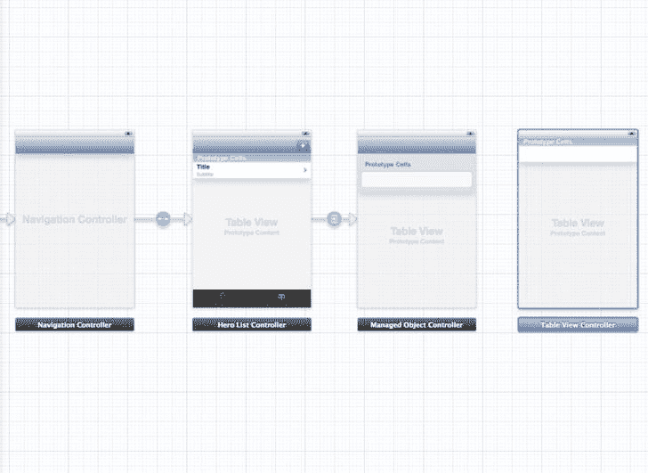

图 7-17. 在 `SuperDB.storyboard` 中添加一个表视图控制器

放大以使图标在表视图控制器标签中可见。选择表视图控制器，在身份检查器中，将类改为 `PowerViewController`。接下来选择场景中的表视图，在属性检查器中，将样式从 Plain 改为 Grouped。

最后要做的事情是定义从 `HeroDetailController` 到你的新 `PowerViewController` 之间的跳转。按住 Control 键从 `HeroDetailController` 图标（在标签栏中）拖动到 `PowerViewController` 场景。当 Manual Segue 弹出窗口出现时，选择 Push。选择这个跳转，在属性检查器中为其命名为 `PowerViewSegue`。

现在你需要创建 `PowerViewController` 类和配置。创建一个新的 Objective-C 类，命名为 `PowerViewController`，作为 `ManagedObjectController` 的子类。编辑 `PowerViewController.m`。

```
#import "PowerViewController.h"
#import "ManagedObjectConfiguration.h"

@implementation PowerViewController

- (void)viewDidLoad
{
    [super viewDidLoad];
    // 加载视图后的其他初始设置
    self.config = [[ManagedObjectConfiguration alloc] initWithResource:@"PowerViewConfiguration"];
}

@end
```

本质上，这与 `HeroDetailController.m` 相同。不同的是不是加载 `HeroDetailConfiguration` 属性列表，而是加载 `PowerViewConfiguration` 属性列表。让我们创建这个属性列表。创建一个新的属性列表文件，并将其命名为 `PowerViewConfiguration.plist`。你需要一个包含两个分区的配置属性列表。每个分区没有标题标签，每行各有一个。最终，你的属性列表应该看起来像图 7-18。

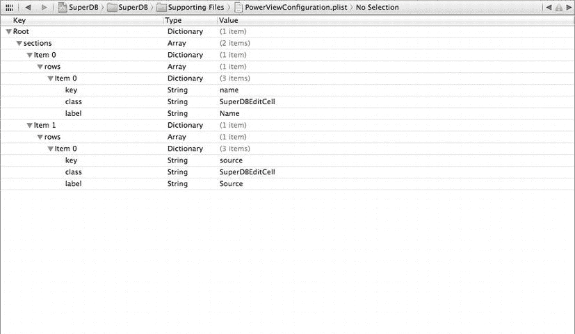

图 7-18. 强大视图配置

#### 导航到 `PowerViewController`

你的 `PowerViewController` 已经定义并配置好了。你已经定义了从 `HeroDetailController` 跳转到 `PowerViewController` 的跳转。现在你需要当用户添加新的能力或在编辑模式下选择一项能力时执行 `PowerViewSegue`。打开 `HeroDetailController.m`，并添加以下表视图数据源方法：

```
#pragma mark - 表视图数据源

- (void)tableView:(UITableView *)tableView commitEditingStyle:(UITableViewCellEditingStyle)editingStyle forRowAtIndexPath:(NSIndexPath *)indexPath
{
    if (editingStyle == UITableViewCellEditingStyleDelete)
        [self removeRelationshipObjectInIndexPath:indexPath];
    else if (editingStyle == UITableViewCellEditingStyleInsert) {
        NSManagedObject *newObject = [self addRelationshipObjectForSection:[indexPath section]];
        [self performSegueWithIdentifier:@"PowerViewSegue" sender:newObject];
    }

[super tableView:tableView commitEditingStyle:editingStyle forRowAtIndexPath:indexPath];
}
```


自从你添加了这个方法，你还一并加入了移除能力的逻辑。还记得你在 `ManagedObjectController` 中修改这个方法的时候吗？当时你只添加和移除了表格视图的单元格。我们当时说，你稍后需要处理向 `Hero` 实体添加和移除能力。现在，就是实现它的时候了。很简单，对吧？最后，记得调用父类方法（位于 `ManagedObjectController` 中）。

还有最后一件事需要处理：当你想要查看现有能力时。在 `HeroDetailController tableView:commitEditingStyle:forRowAtIndexPath:` 方法下方，添加这个表格视图委托方法：

```
#pragma mark - Table view delegate

- (void)tableView:(UITableView *)tableView         accessoryButtonTappedForRowWithIndexPath:(NSIndexPath *)indexPath
{
    NSString *key = [self.config attributeKeyForIndexPath:indexPath];
    NSMutableSet *relationshipSet = [self.managedObject mutableSetValueForKey:key];
    NSManagedObject *relationshipObject =         [[relationshipSet allObjects] objectAtIndex:[indexPath row]];
    [self performSegueWithIdentifier:@"PowerViewSegue" sender:relationshipObject];
}
```

当用户点击 `Power` 单元格中的蓝色披露按钮时，它将把 `PowerViewController` 推送到 `NavigationController` 栈上。为了将能力托管对象传递给 `PowerViewController`，你需要在 `HeroDetailController.m` 中实现 `prepareForSegue:sender:` 方法。

```
- (void)prepareForSegue:(UIStoryboardSegue *)segue sender:(id)sender
{
    if ([segue.identifier isEqualToString:@"PowerViewSegue"])
{
        if ([sender isKindOfClass:[NSManagedObject class]]) {
            ManagedObjectController *detailController = segue.destinationViewController;
            detailController.managedObject = sender;
    }
    else {
        UIAlertView *alert = [[UIAlertView alloc] initWithTitle:NSLocalizedString(@"Power Error",
                                                                                  @"Power Error")
                                     message:NSLocalizedString(@"Error trying to show Power detail",
                                                               @"Error trying to show Power detail")
                                    delegate:self
                          cancelButtonTitle:NSLocalizedString(@"Aw, Nuts", @"Aw, Nuts")
                          otherButtonTitles:nil];
        [alert show];
    }
}
```

就是这样。`Power` 部分和视图都已经设置完毕。现在，让我们来研究如何显示获取到的属性。

#### 获取属性

回头看看图 7-1。在 `Powers` 部分下方，是另一个名为 `Reports` 的部分，显示四个单元格。每个单元格包含一个获取到的属性和一个附件披露按钮。点击披露按钮将显示获取到的属性的结果（图 7-3）。让我们让它工作起来。

查看图 7-3，你可以看到它是一个简单的表格视图，显示英雄的名称和秘密身份。你需要为报告显示创建一个新的表格视图控制器。创建一个名为 `HeroReportController` 的新 Objective-C 类；将其设为 `UITableViewController` 的子类。选择 `HeroReportController.h`，并添加一个新属性来存储你想要显示的英雄列表。

```
@property (strong, nonatomic) NSArray *heroes;
```

切换到 `HeroReportController.m`。你需要在文件顶部导入 `Hero` 头文件。

```
#import "Hero.h"
```

接下来，调整表格视图数据源方法。

```
- (NSInteger)numberOfSectionsInTableView:(UITableView *)tableView
{
    // 返回节数
    return 1;
}

- (NSInteger)tableView:(UITableView *)tableView numberOfRowsInSection:(NSInteger)section
{
    // 返回节中的行数
    return self.heroes.count;
}

- (UITableViewCell *)tableView:(UITableView *)tableView          cellForRowAtIndexPath:(NSIndexPath *)indexPath
{
    static NSString *CellIdentifier = @"HeroReportCell";
    UITableViewCell *cell = [tableView dequeueReusableCellWithIdentifier:CellIdentifier                                                             forIndexPath:indexPath];

// 配置单元格...
    Hero *hero = [self.heroes objectAtIndex:[indexPath row]];
    cell.textLabel.text = hero.name;
    cell.detailTextLabel.text = hero.secretIdentity;

return cell;
}
```

现在，在故事板中布置你的 `HeroReportController`。打开 `SuperDB.storyboard`。从实用工具面板的对象库中选择一个表格视图控制器，并将其拖放到 `PowerViewController` 下方。选择这个新的表格视图控制器，并打开身份检查器。将类改为 `HeroReportController`。接着，在新的表格视图控制器中选择表格视图，并打开属性检查器。将 `Selection` 字段从 `Single Selection` 改为 `No Selection`。最后，选择表格视图单元格。在属性检查器中，将 `Style` 改为 `Subtitle`；在 `Identifier` 中输入 `HeroReportCell`；并将 `Selection` 字段改为 `None`。

现在，按住 Control 键从 `HeroDetailController` 视图控制器拖拽到新的表格视图控制器。当弹出 `Manual Segue` 菜单时，选择 `Push`。选择新的 segue，并在属性检查器中将其命名为 `ReportViewSegue`。

接下来，你需要编辑 `HeroDetailConfiguration` 属性列表，以添加 `Reports` 部分。导航到 `Root``sections``Item 2`。确保 `Item 2` 的展开三角形是关闭的。选择 `Item 2` 行，并添加一个新项目。应该会出现 `Item 3`。将 `Item 3` 的类型从 `String` 改为 `Dictionary`。打开 `Item 3` 的展开三角形，并添加两个子项目。将第一个命名为 `header`，并赋予其值 `Reports`。将第二个命名为 `rows`，并将其设为 `Array`。你将在 `rows` `Array` 中添加四个项目，每个项目代表你想要查看的报告。完成后，它应该看起来像图 7-19。

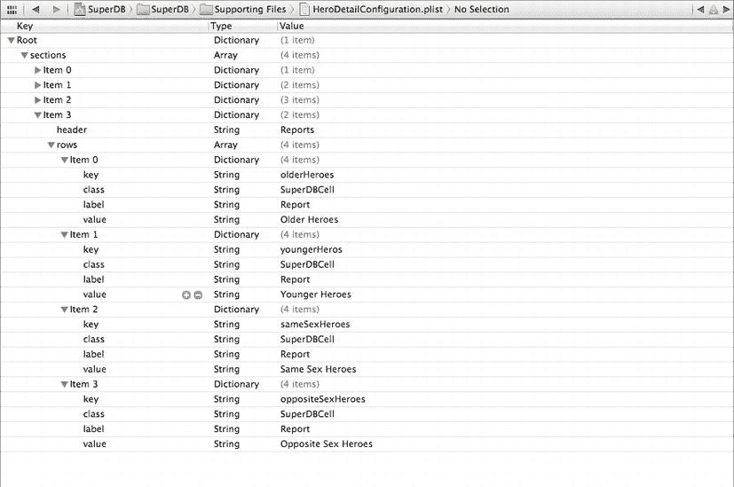

图 7-19. 添加报告配置

请注意，你为这些行项目添加了一个新属性：`value`。你将使用它来为报告部分的单元格设置静态值。打开 `ManagedObjectController.m`，并导航到 `tableView:cellForRowAtIndexPath:` 方法。替换非动态表格视图单元格的配置代码。

```
    else {
        cell.value =
             [self.managedObject valueForKey:[self.config attributeKeyForIndexPath:indexPath]];
        NSString *value = [[self.config rowForIndexPath:indexPath] objectForKey:@"value"];
        if (value != nil) {
            cell.value = value;
            cell.accessoryType = UITableViewCellAccessoryDetailDisclosureButton;
            cell.editingAccessoryType = UITableViewCellAccessoryDetailDisclosureButton;
        }
        else
            cell.value =
                 [self.managedObject valueForKey:[self.config attributeKeyForIndexPath:indexPath]];
    }
```

你也为 `Report` 部分的单元格添加了披露按钮，因此你需要在 `HeroDetailController` 中处理它。编辑 `HeroDetailController.m`，并修改 `tableView:accessoryButtonTappedForRowWithIndexPath:` 方法。

```
- (void)tableView:(UITableView *)tableView accessoryButtonTappedForRowWithIndexPath:(NSIndexPath *)indexPath
{
    NSString *key = [self.config attributeKeyForIndexPath:indexPath];
    NSEntityDescription *entity = [self.managedObject entity];
    NSDictionary *properties = [entity propertiesByName];
    NSPropertyDescription *property = [properties objectForKey:key];
```


````objectivec
if ([property isKindOfClass:[NSAttributeDescription class]]) {
        NSMutableSet *relationshipSet = [self.managedObject mutableSetValueForKey:key];
        NSManagedObject *relationshipObject =             [[relationshipSet allObjects] objectAtIndex:[indexPath row]];
        [self performSegueWithIdentifier:@"PowerViewSegue" sender:relationshipObject];
    }
    else if ([property isKindOfClass:[NSFetchedPropertyDescription class]]) {
        NSArray *fetchedProperties = [self.managedObject valueForKey:key];
        [self performSegueWithIdentifier:@"ReportViewSegue" sender:fetchedProperties];
    }
}
```

现在，你需要检查点击的是关系型单元格（**Powers** 部分）还是获取属性单元格（**Reports** 部分）。当点击获取属性单元格时，你正在调用转场 `ReportViewSegue`。你尚未定义该转场，但马上就会定义。在此之前，我们先更新 `prepareForSegue:sender:` 以处理 `ReportViewSegue`。在 `PowerViewSegue` 检查之后，添加以下代码：

```
    else if ([segue.identifier isEqualToString:@"ReportViewSegue"]) {
        if ([sender isKindOfClass:[NSArray class]]) {
            HeroReportController *reportController = segue.destinationViewController;
            reportController.heroes = sender;
        }
        else {
            UIAlertView *alert = [[UIAlertView alloc] initWithTitle:NSLocalizedString(@"Power Error",
                                                                                     @"Power Error")
                                    message:NSLocalizedString (@"Error trying to show Power detail",
                                                               @"Error trying to show Power detail")
                                   delegate:self
                          cancelButtonTitle:NSLocalizedString(@"Aw, Nuts", @"Aw, Nuts")
                          otherButtonTitles:nil];
            [alert show];
        }
    }
```

最后，由于使用了 `HeroReportController`，你需要在 `HeroDetailController.m` 文件的顶部导入它的头文件。

```
#import "HeroReportController.h"
```

构建并运行 SuperDB。添加几个不同的英雄，设置不同的生日和性别。深入查看报表，观察查找年长、年轻、同性和异性英雄时的结果。创建一个新英雄，但不设置性别，看看会发生什么。无性别的英雄会出现在异性报表中，但不会出现在同性报表中。我们将这个问题留给你思考原因，以及如何修复它 ;-)。

#### 核心数据之美

本章及前几章为你使用 Core Data 奠定了坚实的基础。在此过程中，我们还提供了一些关于如何设计复杂 iPhone 应用程序的建议，使其能够在无需编写多余代码或重复逻辑的情况下进行维护和扩展。我们展示了花时间编写通用代码所能带来的巨大好处，并教会了你如何寻找重构代码的机会，使其更精简、更高效、更易于维护，整体上也更令人愉悦。

我们还可以再用几章篇幅继续探讨 Core Data，但即便如此也无法穷尽这个主题。不过，Core Data 并非 iOS SDK 3 之后引入的唯一新框架。至此，你应该对 Core Data 有了足够扎实的理解，能够借助 Apple 的文档，进一步深入探索。

现在，是时候暂别我们的好朋友 Core Data，去探索 iOS SDK 的其他方面了。

