# 第 8 章

## iCloud 的背后

随着 iOS 5 的发布，Apple 推出了 iCloud，这是其基于互联网的工具和服务系列中的最新产品。对最终用户而言，iCloud 扩展了 Apple 之前的 MobileMe 服务（包括电子邮件、联系人管理和“查找我的 iPhone”），增加了 iOS 备份与恢复、iTunes Match、照片流以及“返回我的 Mac”功能。

尽管 Apple 为其配备了各种花哨功能，但 iCloud 的核心本质是一个基于云的存储和同步服务。其主要目的是让用户能够在所有设备（iPhone、iPad 或 Mac）上访问自己的内容。最棒的是，Apple 为 iOS 开发者提供了一套用于访问 iCloud 的 API。这让你能够构建利用相同 iCloud 功能的应用程序，而无需投入大量精力搭建复杂的服务器基础设施。更妙的是，你无需学习一套全新的复杂 SDK。Apple 没有提供全新的 iCloud 框架，而是为现有框架（主要是 Foundation 和 UIKit）添加了新类，并扩展了现有类以支持 iCloud 访问。

iCloud 的基本理念是提供一个统一的位置，让应用程序可以存储和访问数据。你的应用在一个设备上所做的更改，可以立即传播到另一设备上运行的同一应用实例。同时，iCloud 还提供了应用程序数据的权威副本。这些数据可用于在新设备上恢复应用程序的状态，从而提供无缝的用户体验以及备份数据。

### 使用 iCloud 存储数据

有几种不同的方式可以将数据存储在 iCloud 中。

*   **iOS 备份**：这是一种全局设备配置，可将你的 iOS 设备备份到 iCloud。
*   **键值数据存储**：用于存储应用程序中少量且不常更改的数据。
*   **文档存储**：用于存储用户文档和应用程序数据。
*   **使用 iCloud 的 Core Data**：将应用程序的持久化存储库放在 iCloud 上。

在我们详细讨论这些存储机制之前，先来回顾一下 iCloud 和 iOS 是如何协同工作的。

### iCloud 基础

在你的 iCloud 应用程序内部，存在一个通用容器。根据所使用的存储类型，你可以显式定义该容器的 URL，或者由 iOS 为你创建一个。通用容器是应用程序存储 iCloud 数据的地方。iOS 将同步你的设备与 iCloud 之间的数据。这意味着你的应用程序对通用容器中数据的任何更改都将发送到 iCloud。反之，iCloud 中的任何更改也将发送到你设备上应用程序的通用容器中。

需要注意的是，iOS 不会在每次更改时都将整个数据文件在 iCloud 之间来回传输。在内部，iOS 和 iCloud 会将应用程序的数据分解成较小的数据块。当发生更改时，只有被更改的数据块会与 iCloud 同步。在 iCloud 上，你的应用程序数据是带有版本号的，会跟踪每一组更改。

除了将应用程序数据分解成数据块外，iOS 和 iCloud 还会发送数据文件的元数据。由于元数据相对较小且重要，因此元数据会一直发送。实际上，在实际数据同步之前，iCloud 就会知道数据文件的元数据。这对 iOS 来说尤为重要。由于 iOS 设备可能受到空间和带宽的限制，iOS 不一定会在需要之前自动从 iCloud 下载数据。但既然 iOS 有了元数据，它就能知道自己的副本何时与 iCloud 不同步了。

**注意**：有趣的是，如果 iOS 检测到同一 WiFi 网络上有另一台 iOS 设备，它不会将数据上传到 iCloud 再下载到另一台设备，而是直接将数据从一台设备传输到另一台设备。

### iCloud 备份

备份是 iCloud 提供的一项 iOS 系统服务。它会每天通过 WiFi 自动备份你的 iOS 设备。应用程序主目录中的所有内容都会被备份。应用程序包、缓存目录和临时目录会被 iOS 忽略。由于数据是通过 WiFi 传输并发送到 Apple 的 iCloud 数据中心，因此你应该尽量保持应用程序的数据尽可能小。数据越多，备份时间就越长，用户消耗的 iCloud 存储空间也越多。


**注意** 如果你用完了 iCloud 存储容量（在撰写本文时，默认为 5GB），iOS 会询问你是否需要购买更多存储空间。无论如何，你都需要考虑当 iCloud 已满时，你的应用程序应如何处理这种情况。

在设计应用程序的数据存储策略时，请牢记以下几点：

-   用户生成的数据或应用程序无法重新创建的数据，应存储在 `Documents` 目录中。这样，这些数据将自动备份到 iCloud。
-   可以由应用程序下载或重新创建的数据应存放在 `Library/Caches` 目录中。
-   临时数据应存储在 `tmp` 目录中。记得在不再需要时删除这些文件。
-   即使在存储空间不足的情况下，也需要应用程序持久保存的数据，应使用 `NSURLIsExcludedFromBackupKey` 属性进行标记。无论将这些文件放在哪里，它们都不会被备份删除。管理这些文件是应用程序的责任。

你可以通过 `NSURL` 的 `setResource:forKey:error:` 方法设置 `NSURLIsExcludedFromBackupKey`。

```objc
NSURL *url = [[NSBundle mainBundle] URLForResource:@"NoBackup" withExtension:@"txt"];
NSError *error = nil;
BOOL success = [URL setResourceValue:@YES
                              forKey:NSURLIsExcludedFromBackupKey
                               error:&error];
```

### 在应用程序中启用 iCloud

为了在你的应用程序中使用 iCloud 数据存储，你需要执行两个任务。首先，你需要启用应用程序的授权（entitlements）并为 iCloud 启用它们。其次，你需要创建一个启用 iCloud 的配置文件（provisioning profile）。这可以通过苹果开发者中心网站上的 iOS 配置门户来实现。在本章后面，当你扩展你的 SuperDB 应用以使用 iCloud 时，我们将详细介绍如何启用你的应用程序。

当在应用程序中启用了授权后，Xcode 期望在你的项目目录中找到一个 `.entitlements` 文件。这个 `.entitlements` 文件本质上是一个键值对（key-values pairs）的属性列表（property list）。这些键值对配置了你应用程序的额外功能或安全特性。对于 iCloud 访问，`.entitlements` 文件指定了用于 iCloud 键值存储和文档通用容器（ubiquity containers）的通用标识符（ubiquity identifiers）的键。

### 键值数据存储

顾名思义，iCloud 键值数据存储是一种与 iCloud 集成的简单键值存储机制。从概念上讲，它与 `NSUserDefaults` 类似。与 `NSUserDefaults` 一样，唯一允许的数据类型是属性列表支持的那些类型。最好将其用于值不经常更新的数据。存储应用程序的首选项或设置是一个很好的用例。你不应该用键值数据存储来替代 `NSUserDefaults`。你应该继续将配置信息写入 `NSUserDefault`，并将共享数据写入键值数据存储。这样，即使 iCloud 不可用，你的应用程序仍然拥有配置信息。

键值数据存储有许多限制需要你牢记。首先，每个值有 1MB 的最大存储限制。每个键也有单独的 1MB 限制。此外，每个应用程序最多允许 1024 个独立的键。因此，你需要谨慎决定将哪些内容放入键值数据存储中。

键值数据会按周期与 iCloud 同步。这些周期的频率由 iCloud 决定，因此你对此没有太多控制权。因此，你不应将键值数据存储用于对时间敏感的数据。

键值数据存储处理数据冲突的方式是，始终为每个键选择最新的值。

要使用键值数据存储，你需要使用默认的 `NSUbiquitousKeyValueStore`。你可以使用相应的 `*ForKey:` 和 `set*ForKey:` 方法访问值，这类似于 `NSUserDefaults`。你还需要注册有关 iCloud 对存储进行更改的通知。要同步数据更改，需要调用 `synchronize` 方法。你也可以将 `synchronize` 方法用作检查 iCloud 是否可用的方式。你可以像这样初始化你的应用程序以使用键值数据存储：

```objc
NSUbiquitousKeyValueStore *kv_store = [NSUbiquitousKeyValueStore defaultStore];

// 注册来自 iCloud 的 KV 数据存储更改通知
[[NSNotificationCenter defaultCenter] addObserver:self
                                        selector:@selector (storeDidChange:)
                                           name:NSUbiquitousKeyValueStoreDidChangeExternallyNotification
                                          object:self.kv_store];
BOOL avail = [self.kv_store synchronize];
if (avail) {
    // iCloud 可用
    . . .
}
else {
    // iCloud 不可用
}
```

`synchronize` 方法并不会将数据推送到 iCloud。它只是通知 iCloud 有新数据可用。iCloud 会决定何时从你的设备获取数据。

### 文档存储

对于 iCloud 文档存储，文档是 `UIDocument` 的自定义子类。`UIDocument` 是一个抽象类，用于存储应用程序的数据，可以作为单个文件或文件包（file bundle）。文件包是一个行为类似于单个文件的目录。要管理文件包，请使用 `NSFileWrapper` 类。

在我们描述 iCloud 文档存储之前，先来看一下 `UIDocument`。

#### UIDocument

`UIDocument` 通过“免费”提供许多功能，简化了基于文档的应用程序的开发。

-   *后台读写数据*：保持应用程序界面的响应性。
-   *冲突检测*：帮助你解决文档版本之间的差异。
-   *安全保存*：确保你的文档永远不会处于损坏状态。
-   *自动保存*：让你的用户生活更轻松。
-   *自动 iCloud 集成*：处理你的文档与 iCloud 之间的所有交互。

如果你想构建一个单文件文档，你需要创建一个简单的 `UIDocument` 子类。

```objc
@interface MyDocument : UIDocument

@property (strong, nonatomic) NSString *text;

@end
```

在你的 `UIDocument` 子类中，你需要实现许多方法。首先，你需要能够加载文档数据。为此，你需要重写 `loadFromContents:ofType:error:` 方法。

```objc
- (BOOL)loadFromContents:(id)contents ofType:(NSString *)typeName error:(NSError **)error
{
    if ([contents length] > 0) {
        self.text = [[NSString alloc] initWithData:(NSData *)contents encoding:NSUTF8StringEncoding];
    } else {
        self.text = @"";
    }

// 在此处更新视图

return YES;
}
```

`contents` 参数被定义为 `id` 类型。如果你的文档是一个文件包，那么内容将是 `NSFileWrapper` 类型。对于你的单文档文件情况，内容是 `NSData` 对象。这是一个简单的实现；它永远不会失败。如果你实现了失败情况并返回了 `NO`，你应该创建一个错误对象并赋予其有意义的错误信息。你还应该放置代码，在数据成功加载后更新用户界面。此外，你从未检查内容类型。你的应用程序可能支持多种数据类型，你必须使用 `typeName` 参数来处理不同的数据加载场景。

当你关闭应用程序或调用自动保存时，会调用 `UIDocument` 的 `contentForType:error:` 方法。你需要同样重写此方法。

```objc
- (id)contentsForType:(NSString *)typeName error:(NSError **)error
{
    if (!self.text) {
        self.text = @"";
    }

NSData *data = [self.documentText dataUsingEncoding:NSUTF8StringEncoding
                                  allowLossyConversion:NO];
    return data;
}
```


### 文档排版

如果你的文档存储为文件包，则返回`NSFileWrapper`实例，而不是单个文件的`NSData`对象。这就是确保数据被保存所需的全部操作；`UIDocument`将处理其余部分。

`UIDocument`需要一个文件 URL 来确定读写数据的位置。该 URL 将定义文档目录、文件名以及可能的文件扩展名。目录可以是本地（应用程序沙盒）目录，也可以是 iCloud 无处不在容器中的位置。文件名应由你的应用程序生成，并可选地允许用户覆盖默认值。虽然使用文件扩展名可能是可选的，但为你的应用程序定义一个（或多个）扩展名可能是个好主意。你可以将此 URL 传递给`UIDocument`子类的`initWithFileURL:`方法来创建文档实例。

```
MyDocument *doc = [[MyDocument alloc] initWithFileURL:aURL]];
. . .

[doc saveToURL:doc.fileURL forSaveOperation:UIDocumentSaveForCreating
        completionHandler:^(BOOL success){
    if (success) {
        // 处理保存成功
    }
    else {
        // 处理保存失败
    }
}];
```

一旦创建了`UIDocument`实例，就可以使用`saveToURL:forSaveOperation:completionHandler:`方法创建文件。使用`UIDocumentSaveForCreating`值表示这是首次保存文件。`completionHandler:`参数接受一个块。该块接受一个`BOOL`参数，用于告知保存操作是否成功。

你不仅需要创建文档；应用程序可能还需要打开和关闭现有文档。你仍然需要调用`initWithFileURL:`来创建文档实例，但随后需调用`openWithCompletionHandler:`和`closeWithCompletionHandler:`来打开和关闭文档。

```
MyDocument *doc = [[MyDocument alloc] initWithFileURL:aURL]];
. . .
[doc openWithCompletionHandler:^(BOOL success){
    if (success) {
        // 处理打开成功
    }
    else {
        // 处理打开失败
    }
}];
. . .
// 处理文档
. . .
[doc closeWithCompletionHandler:nil];
```

两个方法都接受一个在完成时执行的块。与`saveToURL:forSaveOperation:completionHandler:`方法类似，该块有一个`BOOL`参数，用于告知打开/关闭操作是成功还是失败。你不必传递块。在上面的示例代码中，你向`closeWithCompletionHandler:`传递`nil`，表示文档关闭后不执行任何操作。

要删除文档，你可以简单地使用`NSFileManager`的`removeItemAtURL:`，并传入文档文件 URL。然而，你应该像`UIDocument`处理读写那样，在后台执行删除操作。

```
MyDocument *doc = [[MyDocument alloc] initWithFileURL:aURL]];
. . .
// 关闭文档
. . .
dispatch_async(dispatch_get_global_queue(DISPATCH_QUEUE_PRIORITY_DEFAULT, 0), ^(void){
    NSFileCoordinator *fileCoordinator = [[NSFileCoordinator alloc] initWithFilePresenter:nil];
    [fileCoordinator coordinateWritingItemAtURL:aURL
                     options:NSFileCoordinatorWritingForDeleting
                     error:nil
                     byAccessor:^(NSURL *writingURL){
                         NSFileManager *fileManager = [[NSFileManager alloc] init];
                         [fileManager removeItemAtURL:writingURL error:nil];
                     }];
});
```

首先，通过`dispatch_async`函数将整个删除操作分派到后台队列。在后台队列中，创建一个`NSFileCoordinator`实例。`NSFileCoordinator`协调进程和对象之间的文件操作。在执行任何文件操作之前，它会向所有已向文件协调器注册的`NSFilePresenter`协议对象发送消息。通过调用`NSFileCoordinator`方法`coordinateWritingItemAtURL:options:error:byAccessor:`来删除文档文件。`byAccessor`是一个块操作，定义了要执行的实际文件操作。它接收一个`NSURL`参数，代表文件的位置。始终使用块参数`NSURL`，而不是传递给`coordinateWritingItemAtURL:`的`NSURL`。

在对你的`UIDocument`子类执行操作之前，你可能想检查`documentState`属性。可能的状态定义如下：

*   `UIDocumentStateNormal`：文档已打开且没有问题。
*   `UIDocumentStateClosed`：文档已关闭。如果打开后文档处于此状态，则表示文档可能存在问题。
*   `UIDocumentStateInConflict`：存在冲突的文档版本。你可能需要编写代码让用户解决这些冲突。
*   `UIDocumentStateSavingError`：由于某些错误，文档无法保存。
*   `UIDocumentStateEditingDisabled`：文档无法编辑；你的应用程序或 iOS 不允许编辑。

你可以使用简单的按位运算符检查文档状态。

```
MyDocument *doc = [[MyDocument alloc] initWithFileURL:aURL]];
. . .
if (doc.documentState & UIDocumentStateClosed) {
    // documentState == UIDocumentStateClosed
}
```

`UIDocument`还提供了一个名为`UIDocumentStateChangedNotification`的通知，你可以用来注册观察者。

```
MyDocument *doc = [[MyDocument alloc] initWithFileURL:aURL]];
. . .
[[NSNotificationCenter defaultCenter] addObserver:anObserver
                                         selector:@selector(documentStateChanged:)
                                            name:UIDocumentStateChangedNotification
                                           object:doc]
```

你的观察者类将实现`documentStateChanged:`方法来检查文档状态，并相应地处理每种状态。

为了执行自动保存，`UIDocument`定期调用`hasUnsavedChanges`方法，该方法返回一个`BOOL`值，指示自上次保存以来文档是否已更改。这些调用的频率由`UIDocument`决定，无法调整。通常，你不会重写`hasUnsavedChanges`。相反，你可以做以下两件事之一：通过`UIDocument`的`undoManager`属性注册`NSUndoManager`，以注册撤销/重做操作；或者每次对文档进行可跟踪更改时调用`updateChangeCount:`方法。要使你的文档与 iCloud 配合使用，你必须启用自动保存功能。

### 基于 iCloud 的 UIDocument

使用 iCloud 文档存储需要对正常的`UIDocument`流程进行一些调整，以使用应用程序无处不在容器中的“Documents”子目录。为了获取无处不在容器 URL，将文档标识符传递给`NSFileManager`方法`URLForUbiquityContainerIdentifer:`，并传入`nil`作为参数。

```
id iCloudToken = [[NSFileManager defaultManager] ubiquityIdentityToken];
if (iCloudToken) {
       // 拥有 iCloud 访问权限
       NSURL *ubiquityURL = [[NSFileManager defaultManager] URLForUbiquityContainerIdentifier:nil];
       NSURL *ubiquityDocURL = [ubiquityURL URLByAppendingPathComponent:@"Documents"];
}
else {
       // 没有 iCloud 访问权限
}
```


在`URLForUbiquityContainerIdentifer:`中使用`nil`时，`NSFileManager`将使用应用程序授权文件中定义的通用容器 ID。我们稍后在“授权”部分会介绍这一点，但现在先请跟随操作。若要显式使用通用容器标识符，它由你的 ADC 团队 ID 和应用 ID 组合而成。

```
NSString *ubiquityContainer = @"SA4AKF8Z52.com.apporchard.iCloudAppID";
NSURL *ubiquityURL = [[NSFileManager defaultManager]
                                URLForUbiquityContainerIdentifier:ubiquityContainer];
```

注意使用`NSFileManager`的`ubiquityIdentityToken`方法来检查 iCloud 可用性。该方法返回一个与用户 iCloud 账户关联的唯一令牌。根据你的应用需求，如果无法访问 iCloud，应通知用户，并选择使用本地存储或退出应用。

### `NSMetadataQuery`

之前我们提到，iCloud 和 iOS 不会自动同步应用通用容器中的文档。然而，文档的元数据是同步的。对于 iCloud 文档存储应用，你不能仅通过查看通用容器中 Documents 目录的文件内容来了解哪些文档可用，而必须使用`NSMetadataQuery`类执行元数据查询。

在应用生命周期早期，你需要实例化一个`NSMetadataQuery`并配置它，使其在通用容器的 Documents 子目录中查找合适的文档。

```
self.query = [[NSMetadataQuery alloc] init];
[self.query setSearchScopes:@[NSMetadataQueryUbiquitousDocumentsScope]];
NSString* filePattern = @"*.txt";
[self.query setPredicate:[NSPredicate predicateWithFormat:@"%K LIKE %@",
                                        NSMetadataItemFSNameKey, filePattern]];
```

此示例假设你有一个`query`属性，并且它被配置为查找所有带`.txt`扩展名的文件。

创建`NSMetadataQuery`对象后，你需要注册以接收其通知。

```
[[NSNotificationCenter defaultCenter] addObserver:self
                                          selector:@selector(processFiles:)
                                              name:NSMetadataQueryDidFinishGatheringNotification
                                             object:nil];

[[NSNotificationCenter defaultCenter] addObserver:self
                                          selector:@selector(processFiles:)
                                              name:NSMetadataQueryDidUpdateNotification
                                             object:nil];

[self.query startQuery];
```

`NSMetadataQueryDidFinishGatheringNotification`在查询对象完成初始信息加载查询时发送。`NSMetadataQueryDidUpdateNotification`在 Documents 子目录内容发生变化并影响查询结果时发送。最后，你启动查询。

当发送通知时，会调用`processFiles:`方法。它可能如下所示：

```
- (void)processFiles:(NSNotification*)aNotification
{
    NSMutableArray *files = [NSMutableArray array];

// 在处理期间禁用查询
    [self.query disableUpdates];

NSArray *queryResults = [self.query results];
    for (NSMetadataItem *result in queryResults) {
        NSURL *fileURL = [result valueForAttribute:NSMetadataItemURLKey];
        NSNumber *aBool = nil;

// 排除隐藏文件
        [fileURL getResourceValue:&aBool forKey:NSURLIsHiddenKey error:nil];

if (aBool && ![aBool boolValue])
            [files addObject:fileURL];
    }

// 对 files 数组进行一些操作
    . . .

// 重新启用查询
    [self.query enableUpdates];
```

}

首先，你禁用查询更新以防止在处理过程中发送通知。在此示例中，你仅获取 Documents 子目录中的文件列表并将其添加到数组中。确保排除目录中的所有隐藏文件。获得文件数组后，在应用中使用它们（例如更新文件名的表格视图）。最后，重新启用查询以接收更新。

以上只是 iCloud 文档存储使用的入门知识。你的基于文档的应用需要处理许多文档生命周期问题才能有效工作。

**注意** 更多信息，请阅读 Apple 的文档。先查看 iOS 应用编程指南中的 iCloud 章节（<https://developer.apple.com/library/ios/#documentation/iPhone/Conceptual/iPhoneOSProgrammingGuide/AppArchitecture/AppArchitecture.html>）。然后阅读 iCloud 设计指南（<https://developer.apple.com/library/ios/#documentation/General/Conceptual/iCloudDesignGuide>）和 iOS 的基于文档的应用编程指南（<https://developer.apple.com/library/ios/#documentation/General/Conceptual/iCloudDesignGuide>）。

### 在 iCloud 中使用`Core Data`

在 iCloud 中使用`Core Data`是一个相对简单的过程。你将持久化存储放置在应用的通用容器中。然而，你不希望持久化存储与 iCloud 同步——那会产生不必要的开销。相反，你希望同步应用之间的事务。当应用的另一个实例从 iCloud 接收到事务数据时，它会重新应用对持久化存储执行的每个操作。这有助于确保不同实例通过相同的操作集保持更新。

尽管你不希望同步持久化存储与 iCloud，Apple 仍建议你将数据文件放置在通用容器中扩展名为`.nosync`的文件夹内。这告诉 iOS 不要同步此文件夹的内容，但会将数据与正确的 iCloud 账户关联起来。

```
// 假设我们有一个 NSPersistentStoreCoordinator *persistentStoreCoordinator 的实例

NSString *dataFileName = @"iCloudCoreDataApp.sqlite";
NSString *dataDirectoryName = @"Data.nosync";
NSString *logsDirectoryName = @"Logs";

__block NSPersistentStoreCoordinator *psc = persistentStoreCoordinator;
dispatch_async(dispatch_get_global_queue(DISPATCH_QUEUE_PRIORITY_DEFAULT, 0), ^{
    NSError *error = nil;

// 获取 Ubiquity Identity Token 以检查 iCloud 访问权限
    NSFileManager *fileManager = [NSFileManager defaultManager];
    id ubiquityToken = [fileManager ubiquityIdentityToken];
    NSURL *ubiquityURL = [fileManager URLForUbiquityContainerIdentifier:nil];
    if (ubiquityToken && ubiquityURL) {
        // 拥有 iCloud 访问权限
        NSString *dataDir = [[ubiquityURL path] stringByAppendingPathComponent:dataDirectoryName];
        if([fileManager fileExistsAtPath:dataDir] == NO) {
            NSError *fileSystemError;
            [fileManager createDirectoryAtPath:dataDir
                   withIntermediateDirectories:YES
                                     attributes:nil
                                            error:&fileSystemError];
            if (fileSystemError != nil) {
                NSLog(@"Error creating database directory %@", fileSystemError);
                // 处理错误
            }
        }

NSString *ubiquityContainer = [ubiquityURL lastPathComponent];
        NSURL *logsPath = [NSURL fileURLWithPath:[[ubiquityURL path]
                                                 stringByAppendingPathComponent:logsDirectoryName]];
```


```objectivec
NSDictionary *options = @{ NSMigratePersistentStoresAutomaticallyOption : @YES,
                                                         NSInferMappingModelAutomaticallyOption : @YES,
                                                      NSPersistentStoreUbiquitousContentNameKey : ubiquityContainer,
                                                       NSPersistentStoreUbiquitousContentURLKey : logsPath };

NSString *dataPath = [dataDir stringByAppendingPathComponent:dataFileName];
        [psc lock];
        [psc addPersistentStoreWithType:NSSQLiteStoreType
                configuration:nil
                URL:[NSURL fileURLWithPath:dataPath]
                options:options
                error:&error];
        [psc unlock];
    }
    else {
        // No iCloud Access
    }
});
```

请注意，你在后台队列中执行持久化存储操作，这样 iCloud 访问就不会阻塞应用程序的用户界面。此处的示例大多定义了你的数据目录路径 `Data.nosync` 和日志目录路径 `Logs`。实际的持久化存储创建与你之前所做的类似。你向 `options` 字典添加了两个键值对：`NSPersistentStoreUbiquitousContentNameKey` 对应你的通用容器 ID，以及 `NSPersistentStoreUbiquityContentURLKey` 对应事务日志目录路径。Core Data 和 iCloud 将使用 `NSPersistentStoreUbiquityContentURLKey` 来同步事务日志。

现在，你需要注册以观察从 iCloud 收到更改时的通知。通常，你不应在创建持久化存储协调器时进行此操作；而应在创建托管对象上下文时进行。

```objectivec
[[NSNotificationCenter defaultCenter]
                        addObserver:self
                        selector:@selector(mergeChangesFromUbiquitousContent:)
                        name:NSPersistentStoreDidImportUbiquitousContentChangesNotification
                        object:coordinator];
```

`mergeChangesFromUbiquitousContent:` 的实现需要处理 iCloud 与本地持久化存储之间的内容合并。幸运的是，对于除最复杂模型之外的所有情况，Core Data 使这个过程相对轻松。

```objectivec
- (void)mergeChangesFromUbiquitousContent:(NSNotification *)notification
{
    NSManagedObjectContext *context = [self managedObjectContext];
    [context performBlock:^{
        [context mergeChangesFromContextDidSaveNotification:notification];
            // 发送一个通知来刷新 UI（如果需要）
    }];
}
```

### 增强 SuperDB

你将增强 Core Data SuperDB 应用程序，并将持久化存储放置在 iCloud 中。根据你对 iCloud API 的回顾，这应该是一个相当简单的过程。请记住，（目前）你还无法在模拟器上运行 iCloud 应用程序，因此需要将设备连接到开发机器上。此外，由于你需要一个配置文件，所以还需要一个 Apple Developer Center 账户。

复制第 6 章的 SuperDB 项目。如果你尚未完成第 6 章，也没关系。你可以从本书的下载存档中复制该项目，并以此为基础开始。

#### 授权

首先，你需要为应用程序启用授权。在 Xcode 中打开项目后，在导航器面板中选择项目以打开项目编辑器。选择 SuperDB 目标，并打开目标摘要编辑器。向下滚动到名为 Entitlements 的部分。选中第一个子部分（即 Entitlements）中的复选框（图 8-1）。

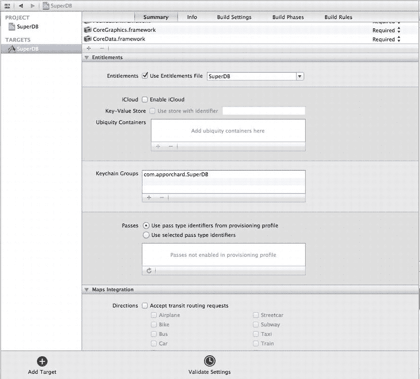

图 8-1. 目标摘要编辑器的授权部分

请注意，复选框旁边标有“使用授权文件”（Use Entitlements File）的下拉框会自动填入 `SuperDB` 的值。之前我们说过，当启用授权时，Xcode 期望项目中有一个 `.entitlements` 文件。查看导航器面板。在 SuperDB 组中应该有一个名为 `SuperDB.entitlements` 的新文件。Xcode 会自动为你创建此文件。再往下，标有 Keychain Groups 的子部分也会自动填充。对于我们的情况，其值为 `com.apporchard.SuperDB`。

既然启用了授权，你就需要为应用程序启用 iCloud。授权部分的第二个子部分应该以一个用于启用 iCloud 的复选框开头。选中它。下一个复选框会激活应用程序的键值数据存储。你不会用到键值存储，因此可以保持其未选中状态。你需要填充下一部分，即通用容器。在列表框底部，点击 `+` 按钮。Xcode 会自动添加一个带有默认值的行。同样，对于我们来说，该值为 `com.apporchard.SuperDB`。默认值对我们有效，因此我们保留它。

#### 创建支持 iCloud 的配置文件

现在你的应用程序已启用 iCloud 授权，你需要创建一个支持 iCloud 的配置文件。将浏览器指向 http://developer.apple.com 的 Apple Developer Center。登录你的 ADC 账户，并进入 iOS Developer Center（图 8-2）。

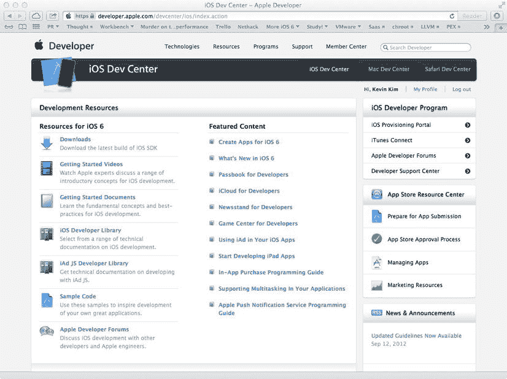

图 8-2. iOS Developer Center

网页右侧有一个标记为 iOS Developer Program 的部分。第一个选项是 iOS Provisioning Portal。进入 Provisioning Portal（图 8-3）。

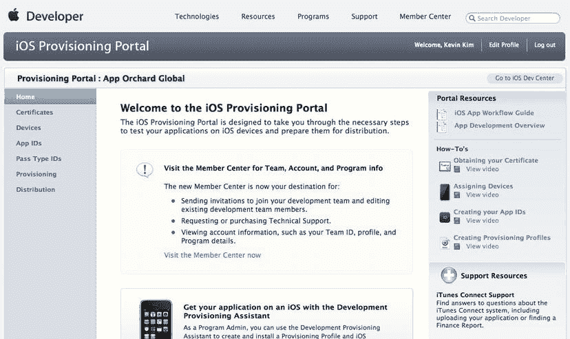

图 8-3. iOS Provisioning Portal

进入 Provisioning Portal 后，首先需要创建一个 App ID。在配置文件左侧，点击 App IDs 链接。你应该会进入配置文件的 App ID 管理页面（图 8-4）。

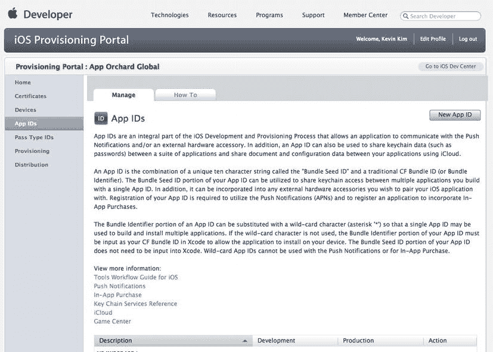

图 8-4. App ID 管理页面

如果你创建过其他 App ID，你将看到它们的列表。既然你需要（希望是）创建一个新的 App ID，请点击页面右上角附近的 New App ID 按钮。这将打开一个用于创建新 App ID 的表单。第一个字段是你的应用程序的描述（即常用名称）。由于你为 SuperDB 输入数据，因此你将在该字段输入 SuperDB。Bundle Seed ID 应自动选择为你的 Team ID。如果你是多个 ADC 开发团队的成员，这里可能会让你做出选择。如果是这样，你应该选择此处适当的 Team ID。最后，你需要提供你的 Bundle ID 后缀。惯例是使用反向域名风格。此处值应与 Xcode 中的 Bundle Identifier 匹配，这一点很重要。你可以在 Xcode 的目标摘要编辑器顶部找到该值（图 8-5）。我们完成的表单如图 8-6 所示。点击 Create 按钮提交表单并创建你的 App ID。

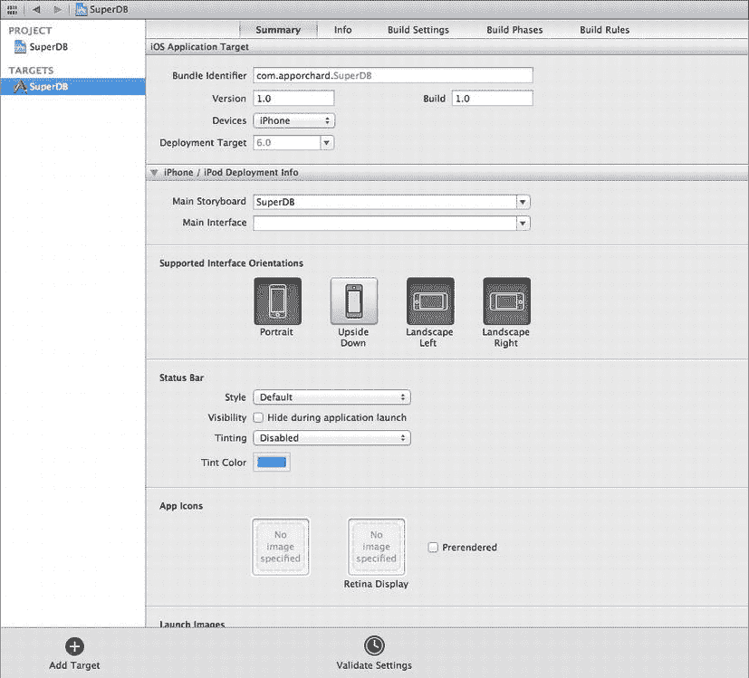

图 8-5. Xcode 目标摘要编辑器

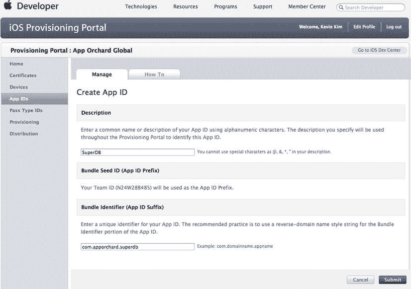

图 8-6. 已完成的新 App ID 表单

创建 App ID 后，你将返回到 App ID 管理页面，其中 SuperDB App ID 应该有一个条目（图 8-7）。你需要为该 App ID 启用 iCloud。首先在你的 App ID 条目中点击 Configure 链接。


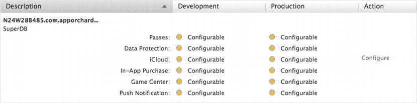

图 8-7. SuperDB 已被添加到 App ID 列表中

App ID 配置页面应为你的 SuperDB 应用显示一系列复选框（图 8-8）。

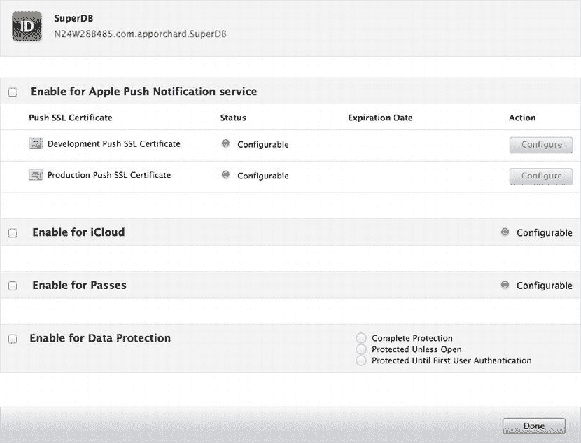

图 8-8. SuperDB App ID 配置页面

点击标记为“Enable for iCloud”的复选框。你应看到一个类似图 8-9 的对话框。这是一个警告，提示你该 App ID 的所有新预置描述文件将启用 iCloud，但现有描述文件不会被启用。点击 OK。当你返回 App ID 管理页面时，你的 SuperDB 应用应已启用 iCloud。至此，你已为 SuperDB 完成了 App ID 的创建，现在可以继续创建预置描述文件了。

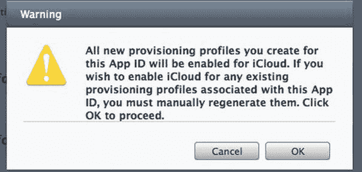

图 8-9. 启用 iCloud 的警告对话框

在 Provisioning Portal（预置门户）页面左侧的预置导航栏中，点击 Provisioning（预置）链接。与 App ID 页面类似，如果你已有预置描述文件，它们会列在此处。该页面顶部有 Development（开发）和 Deployment（部署）两个标签页。根据所选标签页的不同，你将创建适用于开发或部署的描述文件。就你的目的而言，开发描述文件就足够了。确保选中 Development 标签页，然后点击 New Profile（新建描述文件）按钮。同样，与 App ID 类似，你会进入一个表单来创建新的描述文件（图 8-10）。

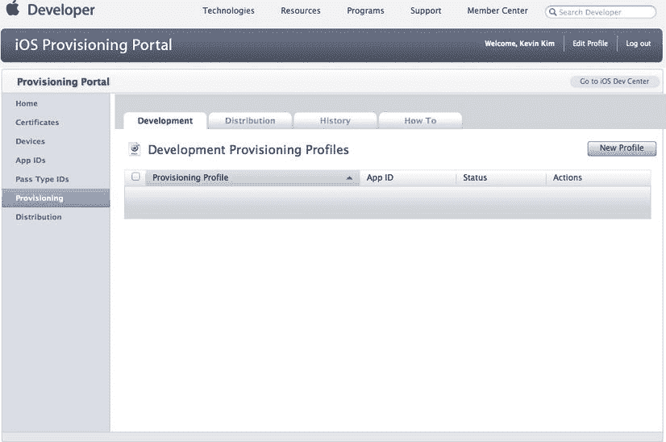

图 8-10. 新建预置描述文件页面

为描述文件指定一个唯一且具有描述性的名称。勾选 Certificates（证书）复选框（如果你有多个选择，请选择正确的证书）。从 App ID 下拉菜单中选择 SuperDB 应用。最后，勾选你希望启用此描述文件的设备。完成后，点击 Submit（提交）来创建描述文件。填写完毕的表单如图 8-11 所示。

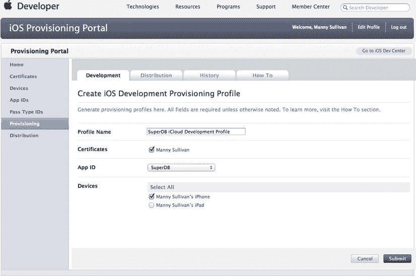

图 8-11. 我们填写完毕的新建预置描述文件表单

页面应自动重定向回预置描述文件的管理页面，你的新描述文件将列在其中，状态显示为“Pending”（待处理）（图 8-12）。稍等片刻，然后刷新页面。状态应变为“Active”（已激活），此时你可以下载或编辑该描述文件（图 8-13）。

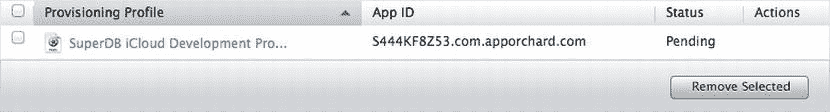

图 8-12. 预置描述文件状态为“待处理”


图 8-13. 预置描述文件状态为“已激活”

此时，有两种方法可以将预置描述文件加载到 Xcode 中。你可以点击 Download（下载）按钮，这将下载一个 `.mobileprovision` 文件。然后，打开 Xcode 的 Organizer（管理器），并在工具栏中选择 Devices（设备）。在“设备”管理器打开后，选择管理器左侧 Library（资料库）栏目下的 Provisioning Profiles（预置描述文件）（图 8-14）。点击 Profiles 面板底部的 Import（导入）按钮，然后打开你刚下载的 `.mobileprovision` 文件。你刚刚创建的预置描述文件应出现在列表中。

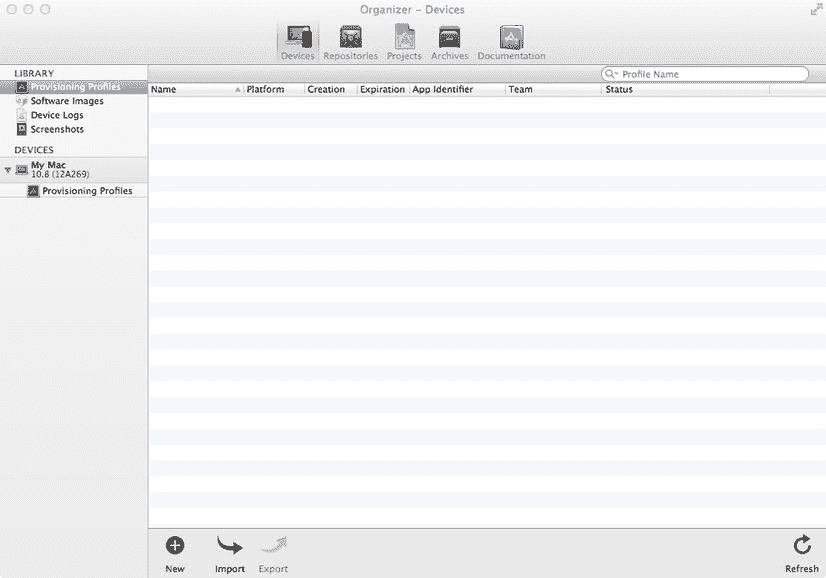

图 8-14. Xcode 管理器“设备”标签页中的“预置描述文件”面板

另外，你也可以直接点击 Profiles 面板右下角的 Refresh（刷新）按钮。Xcode 会要求你输入 ADC 登录信息。输入信息并点击 Log In（登录）按钮后，Xcode 应能自动下载并安装该预置描述文件。

此外，在此也提一下，Apple 还提供了一种通过 Xcode 管理器创建预置描述文件的替代方法。从很多方面来看，这比使用 ADC iOS 预置门户要简单得多。在图 8-14 中，你可以看到 Profiles 面板左下角有一个 New（新建）按钮。系统可能会要求你输入 ADC 登录信息。登录后，你应会看到一个“新建描述文件助手”（图 8-15）。

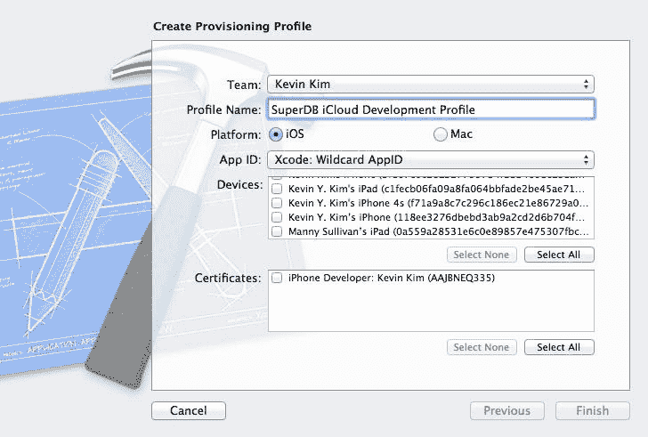

图 8-15. Xcode 管理器“新建描述文件助手”

本质上，这些信息与 ADC iOS 预置门户中的新建描述文件表单（图 8-10）完全相同。为描述文件输入一个唯一且具有描述性的名称。选择正确的 App ID、设备和证书。然后点击 Finish（完成）。如果成功，Xcode 将会创建并安装新的预置描述文件。

仅仅为了让你的应用启用 iCloud，就做了这么多工作。好的一面是，你需要实现的代码量应该相当简单。

### 更新持久化存储

在 SuperDB Xcode 项目窗口中，打开 `AppDelegate.m` 并找到 `persistentStoreCoordinator` 方法。你需要重写该方法，以便在可能的情况下检查并使用 iCloud 持久化存储，否则回退到本地持久化存储。该方法的开头部分保持不变：检查是否已经创建了持久化存储协调器的实例；如果没有，则实例化一个。

```
- (NSPersistentStoreCoordinator *)persistentStoreCoordinator
{
    if (_persistentStoreCoordinator != nil) {
        return _persistentStoreCoordinator;
    }

_persistentStoreCoordinator = [[NSPersistentStoreCoordinator alloc]
                                        initWithManagedObjectModel:[self managedObjectModel]];
```

你将以下代码分派到后台队列，以避免阻塞主线程。下面的代码与前面“集成 iCloud 的 Core Data”部分提供的示例类似。如需详细解释，请参考该部分内容。

```
    __block NSPersistentStoreCoordinator *psc = _persistentStoreCoordinator;
    dispatch_async(dispatch_get_global_queue(DISPATCH_QUEUE_PRIORITY_DEFAULT, 0), ^{
        NSPersistentStore *newStore = nil;
        NSError *error = nil;

NSString *dataFile = @"SuperDB.sqlite";
        NSString *dataDir = @"Data.nosync";
        NSString *logsDir = @"Logs";
```


`NSFileManager *fileManager = [NSFileManager defaultManager];`
`id ubiquityToken = [fileManager ubiquityIdentityToken];`
`NSURL *ubiquityURL = [fileManager URLForUbiquityContainerIdentifier:nil];`
`if (ubiquityToken && ubiquityURL) {`
    `NSString *dataDirPath = [[ubiquityURL path] stringByAppendingPathComponent:dataDir];`
    `if([fileManager fileExistsAtPath:dataDirPath] == NO) {`
        `NSError *fileSystemError;`
        `[fileManager createDirectoryAtPath:dataDirPath withIntermediateDirectories:YES attributes:nil error:&fileSystemError];`
        `if(fileSystemError != nil) {`
            `NSLog(@"Error creating database directory %@", fileSystemError);`
        `}`
    `}`
    `NSURL *logsURL = [NSURL fileURLWithPath:[[ubiquityURL path] stringByAppendingPathComponent:logsDir]];`
    `NSDictionary *options = @{ NSMigratePersistentStoresAutomaticallyOption : @YES, NSInferMappingModelAutomaticallyOption : @YES, NSPersistentStoreUbiquitousContentNameKey : [ubiquityURL lastPathComponent], NSPersistentStoreUbiquitousContentURLKey : logsURL };`
    `[psc lock];`
    `NSURL *dataFileURL = [NSURL fileURLWithPath:[dataDirPath stringByAppendingPathComponent:dataFile]];`
    `newStore = [psc addPersistentStoreWithType:NSSQLiteStoreType configuration:nil URL:[NSURL fileURLWithPath:dataFileURL] options:options error:&error];`
    `[psc unlock];`
`}`

如果出于某种原因你无法访问 iCloud，可以回退到使用本地持久化存储协调器。

```
else {
    NSURL *storeURL = [[self applicationDocumentsDirectory] URLByAppendingPathComponent:dataFile];
    NSDictionary *options = @{ NSMigratePersistentStoresAutomaticallyOption : @YES, NSInferMappingModelAutomaticallyOption : @YES };
    [psc lock];
    newStore = [psc addPersistentStoreWithType:NSSQLiteStoreType configuration:nil URL:storeURL options:options error:&error];
    [psc unlock];
}
```

你需要检查是否确实获得了新的持久化存储协调器。

```
if (!newStore) {
    /*
     请用适当的错误处理替代此实现。
     abort() 会导致应用程序生成崩溃日志并终止。
     在正式发布的应用中不应使用此函数，
     但在开发过程中可能有所帮助。
    */
    NSLog(@"Unresolved error %@, %@", error, [error userInfo]);
    abort();
}
```

完成后，你需要在主线程上发送一个通知，表明已加载持久化存储协调器。如果必要，可使用此通知来更新 UI。

```
dispatch_async(dispatch_get_main_queue(), ^{
    [[NSNotificationCenter defaultCenter] postNotificationName:@"DataChanged" object:self userInfo:nil];
});
```

返回 `_persistentStoreCoordinator`。

### 更新托管对象上下文

你需要在 ubiquity 容器中的数据发生更改时注册以接收通知。这需要在 `AppDelegate` 的 `managedObjectContext` 方法中实现。新增部分以粗体显示。

```
- (NSManagedObjectContext *)managedObjectContext
{
    if (_managedObjectContext != nil) {
        return _managedObjectContext;
    }

    NSPersistentStoreCoordinator *coordinator = [self persistentStoreCoordinator];
    if (coordinator != nil) {
        _managedObjectContext = [[NSManagedObjectContext alloc] init];
        [_managedObjectContext setPersistentStoreCoordinator:coordinator];
        [[NSNotificationCenter defaultCenter] addObserver:self selector:@selector(mergeChangesFromUbiquitousContent:) name:NSPersistentStoreDidImportUbiquitousContentChangesNotification object:coordinator];
    }
    return _managedObjectContext;
}
```

你已经告知通知中心调用 `AppDelegate` 的 `mergeChangesFromUbiquitousContent:` 方法，因此需要实现该方法。
首先，在接口文件 `AppDelegate.h` 中，在 `@end` 声明之前添加方法声明。

```
- (void)mergeChangesFromUbiquitousContent:(NSNotification *)notification;
```

然后将实现代码添加到 `AppDelegate.m` 的末尾，紧接在 `@end` 之前。

```
#pragma mark - 处理从 iCloud 到 Ubiquitous 容器的更改

- (void)mergeChangesFromUbiquitousContent:(NSNotification *)notification
{
    NSManagedObjectContext* moc = [self managedObjectContext];
    [moc performBlock:^{
        [moc mergeChangesFromContextDidSaveNotification:notification];
        NSNotification* refreshNotification = [NSNotification notificationWithName:@"DataChanged" object:self userInfo:[notification userInfo]];
        [[NSNotificationCenter defaultCenter] postNotification:refreshNotification];
    }];
}
```

此方法首先将更改合并到你的托管对象上下文中。然后发送一个 `DataChanged` 通知。你在之前创建持久化存储协调器时已经使用过此通知。它的目的是在需要更新 UI 时通知你。现在让我们来实现这一步。

### 在 DataChanged 时更新 UI

在 Xcode 编辑器中打开 `HeroListController.m`，找到 `viewDidLoad` 方法。在该方法结束前，注册以接收 `DataChanged` 通知。

```
[[NSNotificationCenter defaultCenter] addObserver:self selector:@selector(updateReceived:) name:@"DataChanged" object:nil];
```

与此同时，做个好习惯的 iOS 程序员，在 `didReceiveMemoryWarning` 方法中取消注册。

```
[[NSNotificationCenter defaultCenter] removeObserver:self];
```

当收到 `DataChanged` 通知时，`updateReceived:` 方法将被调用。因此你需要声明并实现它。
首先，在 `HeroListController.h` 中，在 `@end` 之前添加方法声明。

```
- (void)updateReceived:(NSNotification *)notification;
```

现在，将实现代码添加到 `HeroListController.m` 中，同样在 `@end` 之前。

```
- (void)updateReceived:(NSNotification *)notification
{
    NSError *error;
    if (![self.fetchedResultsController performFetch:&error]) {
        NSLog(@"执行获取时出错: %@", [error localizedDescription]);
    } 
    [self.heroTableView reloadData];
}
```

本质上，它只是刷新了数据和表格视图。

### 测试数据存储


### iCloud 开发要点

你不能在模拟器上使用 `iCloud`，因此需要在真机上运行。构建并运行应用。由于你从一个新的持久化存储开始，此时应该没有任何条目。添加一个新英雄，编辑详细信息，然后保存。现在退出应用程序（或在 Xcode 中停止运行）。在你的设备上，长按 `SuperDB` 应用图标直到它开始抖动。删除该应用。你应该会收到一个警告对话框，提示本地数据将丢失，但 `iCloud` 数据将被保留。点击 `Delete`。

现在再次运行应用。等待片刻，英雄列表应该会更新，包含你之前添加的英雄。即使你删除了应用（及其本地数据），`iCloud` 仍然能够同步并恢复持久化存储。

### 脚踏实地

在为 `iCloud` 开发应用时，有时你可能需要查看甚至删除 `iCloud` 中的数据。有几种方式可以查看和/或管理你的应用程序放入 `iCloud` 的数据。

*   **通过 Mac**：打开系统偏好设置，选择 `iCloud`。点击右下角的 `Manage` 按钮。
*   **通过 iOS**：使用设置应用，导航至 `iCloud`  `Storage & Backup`  `Manage Storage`。
*   **通过 Web（仅查看）**：导航至 [`developer.icloud.com/`](http://developer.icloud.com/) 并登录。点击 `Documents` 图标。

这些仅为构建支持 `iCloud` 的 iOS 应用的基础知识。对于任何应用，都有许多事情需要考虑，但以下是一些关键点需要记住：

*   如果 `iCloud` 不可用，你的应用将如何表现？
*   如果你允许“离线”使用，你的应用将如何与 `iCloud` 同步？
*   你的应用将如何处理冲突？这将在很大程度上取决于你的数据模型。
*   尝试设计你的数据/文档模型，以最小化设备与 `iCloud` 之间的数据传输。

希望你已经对在应用中启用 `iCloud` 有了良好的体验。让我们回到地球，开始构建一个游戏吧。

